# 使用 Argo CD 进行持续部署/交付

在上一章中，我们探讨了现代 DevOps 的一个关键方面——**持续集成**（**CI**）。CI 是大多数组织在采用 DevOps 时首先实施的内容，但事情并不止于 CI，CI 只会将经过测试的构建交付到工件仓库。而我们还希望将工件部署到我们的环境中。在本章中，我们将实现 DevOps 工具链的下一部分——**持续** **部署/交付**（**CD**）。

本章我们将涵盖以下主要内容：

+   CD 和自动化的重要性

+   CD 模型和工具

+   博客应用及其部署配置

+   使用环境仓库进行持续声明式 IaC

+   Argo CD 简介

+   安装和设置 Argo CD

+   管理敏感配置和密钥

+   部署示例博客应用

# 技术要求

在本章中，我们将启动一个基于云的 Kubernetes 集群，**Google Kubernetes Engine**（**GKE**），用于练习。写作时，**Google Cloud Platform**（**GCP**）提供免费的 300 美元试用，时效为 90 天，因此你可以在[`console.cloud.google.com/`](https://console.cloud.google.com/)注册一个账号。

你还需要克隆以下 GitHub 仓库来进行一些练习：[`github.com/PacktPublishing/Modern-DevOps-Practices`](https://github.com/PacktPublishing/Modern-DevOps-Practices)。

运行以下命令将仓库克隆到你的主目录，并进入`ch12`目录以访问所需资源：

```
$ git clone https://github.com/PacktPublishing/Modern-DevOps-Practices-2e.git \
modern-devops
$ cd modern-devops/ch12
```

所以，让我们开始吧！

# CD 和自动化的重要性

CD 构成了你 DevOps 工具链中的 Ops 部分。因此，在你的开发人员不断构建和推送代码，而 CI 管道负责构建、测试并将构建发布到工件仓库时，Ops 团队将把构建部署到测试和暂存环境。QA 团队是把关人，确保代码符合一定质量标准，只有通过后，Ops 团队才会将代码部署到生产环境。

现在，对于只实施 CI 部分的组织，其余活动仍然是手动的。例如，操作员需要拉取工件并手动运行命令来进行部署。因此，部署的速度将取决于 Ops 团队的可用性。由于部署是手动的，流程容易出错，人类在重复性工作中容易犯错。

现代 DevOps 的一个基本原则是避免**繁琐工作**。繁琐工作就是开发人员和运维人员日复一日进行的重复性工作，而这些工作可以通过自动化消除。这将帮助你的团队专注于更重要的事情。

通过**持续交付**，标准工具可以基于某些门控条件将代码部署到更高环境。CD 流水线将在测试构建到达工件库时触发，或者在 GitOps 的情况下，当检测到环境库中有任何变更时。然后，流水线会根据预设的配置决定在哪里以及如何部署代码。它还会确定是否需要手动检查，例如提出变更请求并检查是否已批准。

虽然**持续部署**和持续交付经常被混淆为相同的概念，但它们之间是有细微区别的。持续交付允许你的团队基于人工触发将经过测试的代码交付到你的环境中。因此，尽管你只需点击按钮就能将代码部署到生产环境中，但仍然需要某人在合适的时机（如维护窗口）发起部署。持续部署则更进一步，当它与 CI 过程集成时，一旦新的经过测试的构建可供使用，它会自动启动部署过程。不需要人工干预，持续部署只会在测试失败时停止。

监控工具构成了 DevOps 工具链的下一部分。运维团队可以通过管理他们的生产环境来获得反馈，并向开发人员提供改进的建议。这些反馈最终会进入开发的待办事项列表，开发人员可以在未来的发布中将其作为新特性交付。这样就完成了一个周期，现在你的团队可以持续不断地推出技术产品。

CD 提供了几个优势，其中一些如下：

+   **更快的市场响应时间**：CD 和 CI 减少了将新特性、增强功能和修复程序交付给最终用户的时间。这种敏捷性可以使你的组织在市场需求面前具有竞争优势，快速做出反应。

+   **降低风险**：通过自动化部署过程并频繁推送小规模的代码变更，你可以最小化大型、易出错部署的风险。漏洞和问题更容易被早期发现，并且回滚操作也可以更简单。

+   **提高代码质量**：频繁的自动化测试和质量检查是 CD 和 CI 的重要组成部分。这能提高代码质量，因为开发人员会被鼓励编写更简洁、更易维护的代码。任何问题都能更早地被发现和解决。

+   **增强协作**：CD 和 CI 促进了开发和运维团队之间的协作。它打破了传统的壁垒，鼓励跨职能团队合作，从而提升了沟通和理解。

+   **提高效率和生产力**：自动化重复性的任务，例如测试、构建和部署，使开发人员能够腾出时间专注于更有价值的任务，例如创建新特性和改进。

+   **客户反馈**：CD 允许您更快速地从真实用户那里收集反馈。通过频繁部署小的更改，您可以收集用户反馈并相应地调整开发工作，确保您的产品更好地满足用户需求。

+   **持续改进**：CD 促进了持续改进的文化。通过分析部署和监控的数据，团队可以识别出需要改进的领域，并对其流程进行迭代。

+   **更好的安全性**：频繁的更新意味着可以及时解决安全漏洞，减少攻击者的机会窗口。安全检查可以自动化并集成到 CI/CD 流水线中。

+   **减少人工干预**：CD 减少了在部署过程中对人工干预的需求。这降低了人为错误的可能性，并简化了发布流程。

+   **可扩展性**：随着产品的增长，开发人员数量的增加以及代码库复杂性的提高，CD 可以帮助保持可管理的开发流程。通过自动化许多发布和测试过程，它能够有效地扩展。

+   **节省成本**：虽然实现 CI/CD 需要在工具和流程上进行初期投资，但从长远来看，它可以通过减少大量的手动测试需求、降低与部署相关的错误并提高资源利用率，从而实现成本节省。

+   **合规性和审计**：对于有监管要求的组织，CD 可以通过提供详细的更改和部署历史记录来改善合规性，使得跟踪和审计代码变更变得更加容易。

需要注意的是，虽然 CD 和 CI 提供了许多优势，但它们也需要精心的规划、基础设施和文化变革才能发挥作用。

有多种模型和工具可以实现 CD。我们将在下一节中详细介绍其中的一些。

# CD 模型和工具

一个典型的 CI/CD 工作流如以下图所示，以及随后的步骤：

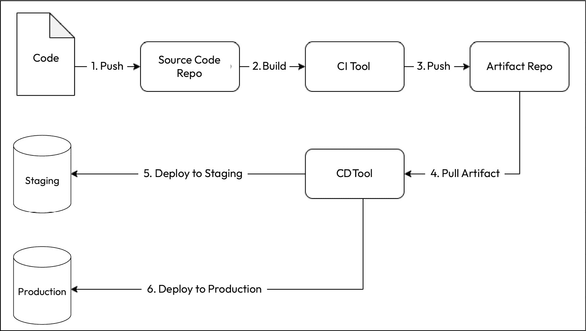

图 12.1 – CI/CD 工作流

1.  开发人员编写代码并将其推送到代码仓库（通常是 Git 仓库）。

1.  您的 CI 工具构建代码，运行一系列测试，并将测试通过的构建推送到工件仓库。然后，您的 CD 工具获取该工件，并将其部署到测试和暂存环境中。根据您是否希望进行持续部署或交付，它会自动将工件部署到生产环境中。

好吧，您选择什么样的交付工具呢？让我们回顾一下我们在*第十一章*中讨论的例子，*持续集成*。我们选择了**posts**微服务应用，并使用如 GitHub Actions/Jenkins 这样的 CI 工具，利用**Docker**将其打包成容器并推送到我们的**Docker Hub**容器注册表。嗯，我们本可以使用相同的工具来部署到我们的环境中。

例如，如果我们想要部署到`kubectl apply`。我们可以使用任何这些工具来轻松完成，但我们选择不这么做。为什么？答案很简单——CI 工具是为了 CI 而设计的，如果你想用它们做其他事情，最终会遇到瓶颈。这并不意味着你不能用这些工具来做 CD，它仅适用于基于你所遵循的部署模型的某些用例。

根据你的应用、技术栈、客户需求、风险承受度和成本意识，存在多种部署模型。让我们来看一看一些业界常用的部署模型。

## 简单部署模型

**简单部署模型**是所有模型中最直接的一种：你在移除旧版本后，部署所需版本的应用程序。它完全替换了之前的版本，回滚则涉及在移除已部署版本后重新部署旧版本：

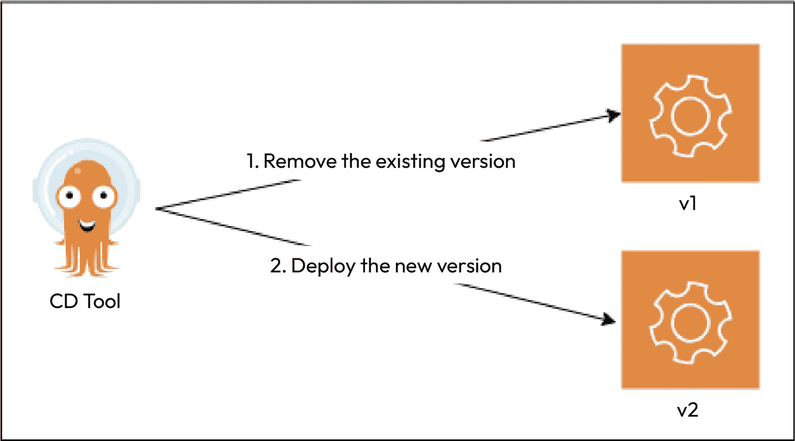

图 12.2 – 简单部署模型

由于这是一种简单的部署方式，你可以使用像**Jenkins**或**GitHub Actions**这样的 CI 工具来管理它。然而，简单部署模型并不是最理想的部署方法，因为它有一些固有的风险。这种变更具有破坏性，通常需要停机时间。这意味着在升级期间，你的服务会暂时无法提供给客户。对于没有 24/7 用户的组织来说，这可能是可以接受的，但中断会影响**服务水平目标**(**SLOs**)和**服务水平协议**(**SLAs**)的履行，特别是对于全球化的组织。即便没有相关协议，它们也会影响客户体验并损害组织声誉。

因此，为了应对这种情况，我们有一些复杂的部署模型。

## 复杂部署模型

**复杂部署模型**与简单部署模型不同，试图最小化应用中的中断和停机时间，使得发布过程更加顺畅，以至于大多数用户甚至没有注意到升级正在进行。业界流行的两种复杂部署方式是：让我们来看一看。

### 蓝绿部署

**蓝绿部署**（也称为**红黑部署**）是将新版本（*绿*）与现有版本（*蓝*）一起推出。然后，你可以进行完整性检查和其他活动，以确保一切正常。接着，你可以将流量从旧版本切换到新版本，并监控是否出现问题。如果遇到问题，你可以将流量切换回旧版本。否则，你可以继续运行最新版本并移除旧版本：

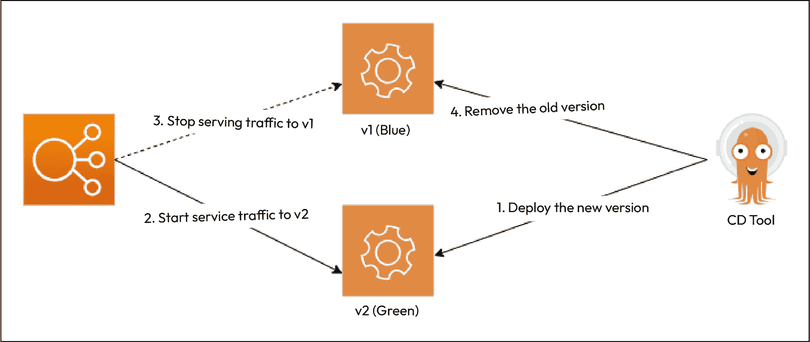

图 12.3 – 蓝绿部署

你可以通过金丝雀部署将蓝绿部署提升到下一个层次。

### 金丝雀部署和 A/B 测试

**金丝雀部署**与蓝绿部署类似，但通常用于高风险的升级。因此，像蓝绿部署一样，我们将新版本与现有版本一起部署。不同的是，我们不会立即将所有流量切换到最新版本，而是仅将流量切换给一小部分用户。在切换的过程中，我们可以通过日志和用户行为了解切换是否引起了问题。这就是所谓的 **A/B 测试**。在进行 A/B 测试时，我们可以根据位置、语言、年龄段或选择测试产品 Beta 版本的用户来针对特定的用户群体进行测试。这有助于组织收集反馈，而不会打扰到普通用户，并在对新版本满意后做出调整。你可以通过将所有流量切换到新版本并删除旧版本来使发布普遍可用：

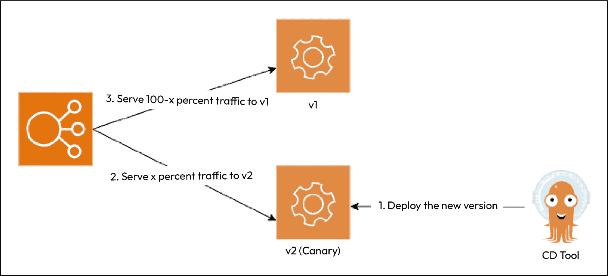

图 12.4 – 金丝雀部署

虽然复杂的部署对用户的干扰最小，但通常使用传统的 CI 工具（如 Jenkins）来管理时非常复杂。因此，我们需要在这一点上正确配置工具。市场上有几种 CD 工具可供选择，包括 **Argo CD**、**Spinnaker**、**Circle CI** 和 **AWS Code Deploy**。由于本书的重点是 GitOps，而 Argo CD 是一个 GitOps 原生工具，因此在本章中，我们将重点讨论 Argo CD。在深入应用部署之前，让我们回顾一下我们要部署的内容。

# 博客应用及其部署配置

由于我们在上一章中讨论了博客应用，让我们再次看看这些服务及其交互：

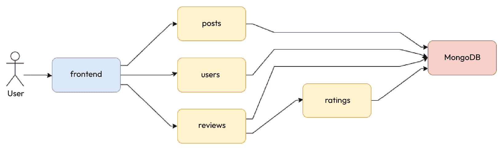

图 12.5 – 博客应用及其服务和交互

到目前为止，我们已经创建了用于构建、测试和推送博客应用微服务容器的 CI 流水线。这些微服务需要在某个地方运行。因此，我们需要一个环境来运行它们。我们将在上一章中的 `posts` 微服务中部署该应用程序，我也将其余服务的构建作为一个练习留给你。假设你已经构建了它们，我们将需要以下资源以确保应用程序顺利运行：

+   **MongoDB**：我们将部署一个启用了认证的 MongoDB 数据库，且拥有 root 凭据。凭据将通过环境变量注入，这些环境变量来自 Kubernetes **Secret** 资源。我们还需要持久化我们的数据库数据，因此我们需要一个挂载到容器的 **PersistentVolume**，该卷将通过 **PersistentVolumeClaim** 动态提供。由于容器是有状态的，我们将使用 **StatefulSet** 来管理它，并因此使用一个无头 **Service** 来暴露数据库。

+   `posts`、`reviews`、`ratings`、和`users`微服务将通过环境变量注入的根凭证与 MongoDB 进行交互，这些凭证来自与 MongoDB 相同的**Secret**。我们将使用各自的**Deployment**资源来部署它们，并通过单独的**ClusterIP Services**来暴露它们。

+   **前端**：*前端*微服务不需要与 MongoDB 交互，因此不会与 Secret 资源交互。我们还将使用**Deployment**资源来部署该服务。由于我们希望将此服务暴露到互联网上，我们将为其创建一个**LoadBalancer Service**。

我们可以用以下图示总结这些方面：

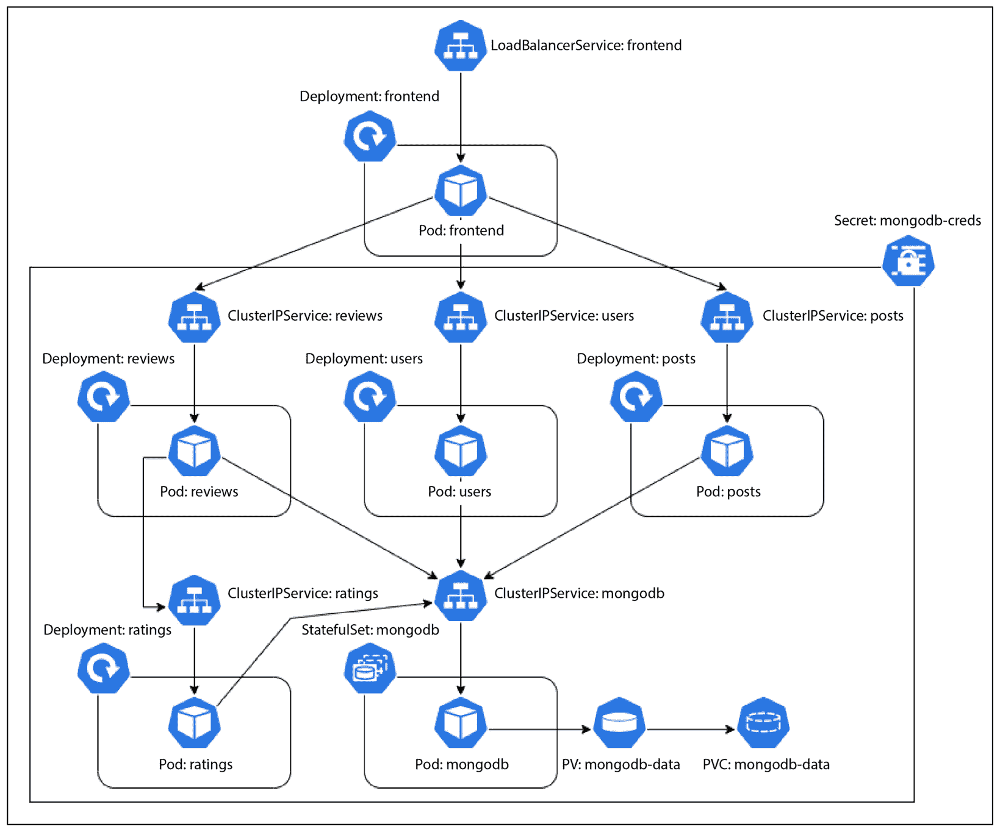

图 12.6 – 博客应用 – Kubernetes 资源与交互

现在，由于我们遵循 GitOps 模型，我们需要将所有资源的清单存储在 Git 上。然而，由于 Kubernetes Secrets 本身并不安全，我们不能将它们的清单直接存储在 Git 上。相反，我们将使用另一个名为**SealedSecrets**的资源来安全地管理这些信息。

在*第二章*，*使用 Git 和 GitOps 的源代码管理*中，我们讨论了应用程序和环境仓库作为 GitOps 驱动的 CI 和 CD 的基础构建块。在前一章中，我们在 GitHub 上创建了一个应用程序仓库，并使用 GitHub Actions（以及 Jenkins）来构建、测试并将我们的应用程序容器推送到 Docker Hub。由于 CD 专注于 DevOps 中的 Ops 部分，我们需要一个**环境仓库**来实现这一点，所以接下来我们将创建我们的环境仓库。

# 使用环境仓库进行持续声明式 IaC

如今，我们已经知道，必须创建一个 GKE 集群来托管我们的微服务。到目前为止，我们一直在使用`gcloud`命令来完成此任务；然而，由于`gcloud`命令并不是声明式的，因此在实施 GitOps 时使用它们并不是理想的做法。相反，我们将使用**Terraform**来为我们创建 GKE 集群。这样可以确保我们能够使用 Git 环境仓库声明性地部署和管理集群。接下来，我们就来创建一个集群。

## 创建和设置我们的环境仓库

访问[`github.com`](https://github.com)，并使用您选择的名称创建一个仓库。对于本练习，我们将使用`mdo-environments`。完成后，访问 Google Cloud Shell，使用`ssh-keygen`命令生成一个`ssh-key`对，将公钥复制到 GitHub（参见*第二章*，*使用 Git 和 GitOps 的源代码管理*，获取逐步说明），然后使用以下命令克隆该仓库：

```
$ cd ~
$ git clone https://github.com/PacktPublishing/Modern-DevOps-Practices-2e.git \
modern-devops
$ git clone git@github.com:<your_account>/mdo-environments.git
$ cd mdo-environments
```

让我们复制一个 Terraform 的`.gitignore`文件，确保我们不会意外地提交 Terraform 状态、后端文件或`.tfvars`文件，使用以下命令：

```
$ cp -r ~/modern-devops/ch12/.gitignore .
```

现在，让我们使用以下命令将代码推送到 GitHub：

```
$ git add --all
$ git commit -m 'Added gitignore'
$ git push
```

现在我们已经推送了第一个文件并初始化了仓库，让我们根据环境来构建仓库结构。在环境仓库中我们将有两个分支——**dev** 和 **prod**。**dev** 分支中的所有配置将应用于 **开发环境**，而 **prod** 中的配置将应用于 **生产环境**。下图详细说明了这种方法：

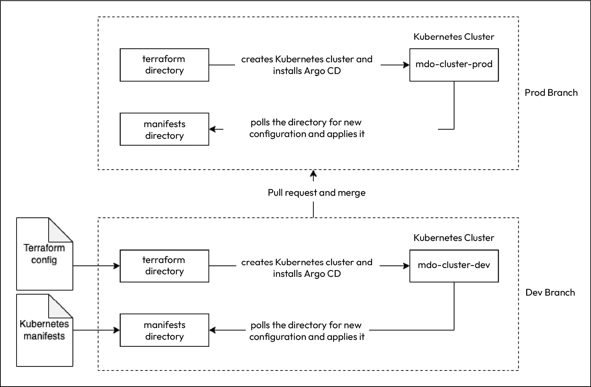

图 12.7 – CD 流程

现有的仓库只有一个名为 `master` 的分支。然而，由于我们将在此仓库中管理多个环境，因此最好将 `master` 分支重命名为 `prod`。

访问 `https://github.com/<your_user>/mdo-environments/branches`，点击 `prod` 旁边的铅笔图标，然后点击 **重命名分支**。

现在我们已经重命名了分支，让我们移除现有的本地仓库，并使用以下命令重新克隆仓库：

```
$ cd ~ && rm -rf mdo-environments
$ git clone git@github.com:<your_account>/mdo-environments.git
$ cd mdo-environments
```

我们想从开发环境开始，因此最好从 `prod` 分支创建一个名为 `dev` 的分支。运行以下命令来实现：

```
$ git branch dev && git checkout dev
```

现在，我们可以开始在此目录中编写 Terraform 配置。配置文件位于 `~/modern-devops/ch12/mdo-environments/environments`。使用以下命令将该目录中的所有内容复制到当前目录：

```
$ cp -r ~/modern-devops/ch12/environments/terraform .
$ cp -r ~/modern-devops/ch12/environments/.github .
```

在 `terraform` 目录中，有几个 Terraform 配置文件。

`cluster.tf` 文件包含了创建 Kubernetes 集群的配置。它大致如下：

```
resource "google_service_account" "main" {
  account_id   = "gke-${var.cluster_name}-${var.branch}-sa"
  display_name = "GKE Cluster ${var.cluster_name}-${var.branch} Service Account"
}
resource "google_container_cluster" "main" {
  name               = "${var.cluster_name}-${var.branch}"
  location           = var.location
  initial_node_count = 3
  node_config {
    service_account = google_service_account.main.email
    oauth_scopes = [
      "https://www.googleapis.com/auth/cloud-platform"
    ]
  }
  timeouts {
    create = "30m"
    update = "40m"
  }
}
```

它创建了两个资源——一个 `cloud platform` **OAuth 范围**。

我们将服务账户命名为 `cluster_name` 和 `branch` 变量的组合。这是必要的，因为我们需要区分不同环境中的集群。所以，如果集群名称是 `mdo-cluster`，而 Git 分支是 `dev`，我们将有一个名为 `gke-mdo-cluster-dev-sa` 的服务账户。我们将在 GKE 集群上使用相同的命名约定。因此，集群名称将为 `mdo-cluster-dev`。

我们有一个 `provider.tf` 文件，包含了 `provider` 和 `backend` 配置。我们在这里使用的是远程后端，因为我们希望将 Terraform 状态存储在远程。此场景下，`provider.tf` 文件大致如下：

```
provider "google" {
  project     = var.project_id
  region      = "us-central1"
  zone        = "us-central1-c"
}
terraform {
  backend "gcs" {
    prefix  = "mdo-terraform"
  }
}
```

在这里，我们在 `provider` 配置中指定了默认的 `region` 和 `zone`。此外，我们声明了 `gcs` 后端，只包含了 `prefix` 属性，值为 `mdo-terraform`。我们可以使用前缀来分离配置，以便在一个存储桶中存储多个 Terraform 状态。我们故意没有提供 `bucket` 名称，那个我们会在运行时通过 `-backend-config` 在 `terraform init` 时提供。存储桶名称将是 `tf-state-mdo-terraform-<PROJECT_ID>`。

提示

由于 GCS 存储桶应该具有全球唯一的名称，因此建议使用类似`tf-state-mdo-terraform-<PROJECT_ID>`这样的名称，因为项目 ID 是全球唯一的。

我们还有一个 `variables.tf` 文件，声明了 `project_id`、`branch`、`cluster_name` 和 `location` 变量，如下所示：

```
variable project_id {}
variable branch {...
  default     = "dev"
}
variable cluster_name {...
  default   = "mdo-cluster"
}
variable "location" {...
  default     = "us-central1-a"
}
```

现在我们已经准备好 Terraform 配置文件，接下来我们需要一个工作流文件，可以应用到我们的 GCP 项目。为此，我们创建了以下 GitHub Actions 工作流文件，即 `.github/workflows/create-cluster.yml`：

```
name: Create Kubernetes Cluster
on: push
jobs:
  deploy-terraform:
    runs-on: ubuntu-latest
    defaults:
      run:
        working-directory: ./terraform
    steps:
    - uses: actions/checkout@v2
    - name: Install Terraform
      id: install-terraform
      run: wget -O terraform.zip https://releases.hashicorp.com/terraform/1.5.5/
terraform_1.5.5_linux_amd64.zip && unzip terraform.zip && chmod +x terraform && sudo mv 
terraform /usr/local/bin
    - name: Apply Terraform
      id: apply-terraform
      run: terraform init -backend-config="bucket=tf-state-mdo-terraform-${{ secrets.
PROJECT_ID }}" && terraform workspace select ${GITHUB_REF##*/} ||  terraform workspace new 
${GITHUB_REF##*/} && terraform apply -auto-approve -var="project_id=${{ secrets.PROJECT_
ID  }}" -var="branch=${GITHUB_REF##*/}"
      env:
        GOOGLE_CREDENTIALS: ${{ secrets.GCP_CREDENTIALS }}
```

这是一个两步的构建文件。第一步安装 Terraform，第二步应用 Terraform 配置。除此之外，我们在全局层面指定了`./terraform`作为工作目录。此外，我们在此文件中使用了一些秘密变量，即 `GCP_CREDENTIALS`，它是 Terraform 用来进行身份验证和授权 GCP API 的服务帐户密钥文件，以及 Google Cloud 的 `PROJECT_ID`。

我们还将存储桶名称提供为 `tf-state-mdo-terraform-${{ secrets.PROJECT_ID }}`，以确保我们有一个唯一的存储桶名称。

由于我们使用 Terraform 工作区来管理多个环境，上述代码选择一个现有的 Terraform 工作区，工作区的名称由 `${GITHUB_REF##*/}` 表示的分支名称决定，或者创建一个新的工作区。工作区在这里很重要，因为我们希望使用相同的配置，但为不同的环境使用不同的变量值。Terraform 工作区对应于环境，而环境对应于 Git 分支。所以，既然我们有 `dev` 和 `prod` 环境，我们也有对应的 Terraform 工作区和 Git 分支。

从 Terraform 和工作流配置中，我们可以推断出我们将需要以下内容：

+   用于 Terraform 进行身份验证和授权 GCP API 的 **服务账户**，以及我们需要添加为 GitHub 秘密的 JSON 密钥文件

+   我们将配置为 GitHub 秘密的 **项目 ID**

+   用作 Terraform 后端的 **GCS 存储桶**

所以，让我们继续在 GCP 中创建一个服务账户，这样 Terraform 就可以使用它来进行身份验证并授权访问 Google API。使用以下命令创建服务账户，提供相关的 **身份与访问管理**（**IAM**）权限，并下载凭证文件：

```
$ PROJECT_ID=<project_id>
$ gcloud iam service-accounts create terraform \
--description="Service Account for terraform" \
--display-name="Terraform"
$ gcloud projects add-iam-policy-binding $PROJECT_ID \
--member="serviceAccount:terraform@$PROJECT_ID.iam.gserviceaccount.com" \
--role="roles/editor"
$ gcloud iam service-accounts keys create key-file \
--iam-account=terraform@$PROJECT_ID.iam.gserviceaccount.com
```

在你的工作目录中，你会看到一个名为`key-file`的文件。现在，前往 `https://github.com/<your_github_user>/mdo-environments/settings/secrets/actions/new`，创建一个名为`GCP_CREDENTIALS`的秘密。在“值”字段中，打印出`key-file`文件，复制其内容并粘贴到 GitHub 秘密的 **values** 字段中。

接下来，创建另一个秘密，`PROJECT_ID`，并在 **values** 字段中指定你的 GCP 项目 ID。

接下来我们需要做的是为 Terraform 创建一个 GCS 存储桶，作为远程后端使用。为此，请运行以下命令：

```
$ gsutil mb gs://tf-state-mdo-terraform-${PROJECT_ID}
```

此外，我们需要启用 Terraform 用于创建资源的 GCP API。为此，运行以下命令：

```
$ gcloud services enable iam.googleapis.com container.googleapis.com
```

所以，现在所有先决条件都已经满足，我们可以将代码推送到仓库。运行以下命令来执行此操作：

```
$ git add --all
$ git commit -m 'Initial commit'
$ git push --set-upstream origin dev
```

一旦我们推送代码，GitHub Actions 工作流就会被触发。很快，工作流将应用配置并创建 Kubernetes 集群。结果应该如下所示：

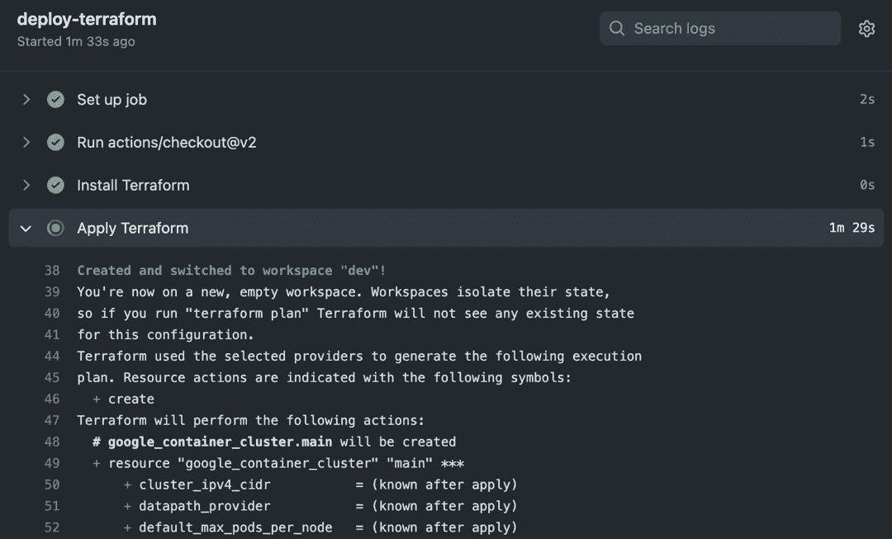

图 12.8 – 使用 GitHub Actions 和 Terraform 的 GitOps

要验证集群是否已成功创建，运行以下命令：

```
$ gcloud container clusters list
NAME: mdo-cluster-dev
LOCATION: us-central1-a
MASTER_VERSION: 1.27.3-gke.100
MASTER_IP: x.x.x.x
MACHINE_TYPE: e2-medium
NODE_VERSION: 1.27.3-gke.100
NUM_NODES: 3
STATUS: RUNNING
```

如您所见，`mdo-cluster-dev` 集群已经在环境中成功运行。如果我们对 Terraform 配置进行任何更改，这些更改将会自动应用。我们已经成功使用环境仓库创建了环境。这就是 *推送模型 GitOps* 的应用。现在，我们需要在环境中运行应用程序；为了管理和部署应用程序，我们将需要一个专用的 CD 工具。如前所述，我们将使用 Argo CD，因此让我们来了解一下它。

# Argo CD 简介

Argo CD 是一个开源的声明式、基于 GitOps 的持续交付（CD）工具，旨在自动化在 Kubernetes 集群上部署和管理应用程序及基础设施。Argo CD 作为一个强大的应用程序控制器，高效地管理并确保您的应用程序顺利、安全地运行。Argo CD 采用 *基于拉取的 GitOps 模型*，因此会定期轮询环境仓库，检测任何配置漂移。如果它发现 Git 中的状态与实际运行在环境中的应用程序状态之间有任何漂移，它将进行修正，更改以反映 Git 仓库中声明的期望配置。

Argo CD 明确针对 Kubernetes 环境进行定制，使其成为管理 Kubernetes 集群上应用程序的流行选择。

除了传统的 Kubernetes 清单 YAML 文件外，Argo CD 还支持多种替代方法来定义 Kubernetes 配置：

+   Helm 图表

+   Kustomize

+   Ksonnet

+   Jsonnet 文件

+   普通的 YAML/JSON 清单文件

+   通过插件与其他定制化的配置管理工具进行集成

在 Argo CD 中，您可以定义包含 *源* 和 *目标* 的应用程序。源指定与之关联的 Git 仓库的详细信息、清单、helm 图表或 kustomize 文件的位置，然后将这些配置应用到指定的目标环境。这使您能够监控 Git 仓库中特定分支、标签的变化，或跟踪特定版本。您还可以使用多种跟踪策略。

您可以访问一个用户友好的基于 Web 的 UI 和 **命令行接口**（**CLI**）与 Argo CD 进行交互。此外，Argo CD 通过同步钩子和应用操作提供应用程序状态报告。如果集群内直接进行的任何修改偏离了 GitOps 方法，Argo CD 会及时通知您的团队，可能通过 Slack 渠道。

以下图表概述了 Argo CD 的架构：

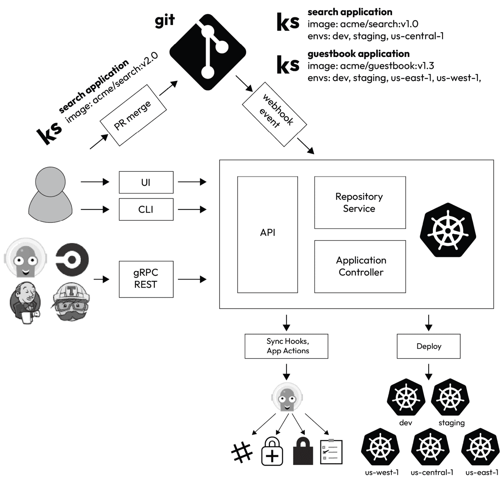

图 12.9 – Argo CD 架构

那么，废话不多说，我们开始启动 Argo CD。

# 安装和设置 Argo CD

安装 Argo CD 非常简单——我们只需将在线提供的 `install.yaml` 清单包应用到我们希望安装它的 Kubernetes 集群中，清单包地址为 [`github.com/argoproj/argo-cd/blob/master/manifests/install.yaml`](https://github.com/argoproj/argo-cd/blob/master/manifests/install.yaml)。如需更个性化的安装，请参考 [`argo-cd.readthedocs.io/en/stable/operator-manual/installation/`](https://argo-cd.readthedocs.io/en/stable/operator-manual/installation/)。

由于我们本章使用的是 GitOps，因此不会手动部署 Argo CD。相反，我们将使用 Terraform 通过环境仓库来设置它。

本节的资源位于 `~/modern-devops/ch12/environments-argocd-app`。我们将使用与之前相同的环境仓库来管理这个环境。

因此，让我们 `cd` 进入 `mdo-environments` 本地仓库，并运行以下命令：

```
$ cd ~/mdo-environments
$ cp -r ~/modern-devops/ch12/environments-argocd-app/terraform .
$ cp -r ~/modern-devops/ch12/environments-argocd-app/manifests .
$ cp -r ~/modern-devops/ch12/environments-argocd-app/.github .
```

现在，让我们看看目录结构，理解我们正在做什么：

```
.
├── .github
│   └── workflows
│       └── create-cluster.yml
├── manifests
│   └── argocd
│       ├── apps.yaml
│       ├── install.yaml
│       └── namespace.yaml
└── terraform
    ├── app.tf
    ├── argocd.tf
    ├── cluster.tf
    ├── provider.tf
    └── variables.tf
```

如我们所见，结构与之前类似，只是做了一些改动。首先让我们看一下 Terraform 配置。

## Terraform 修改

现在，`terraform` 目录下新增了两个文件：

+   `argocd.tf`：这包含了部署 Argo CD 的 Terraform 配置。

+   `app.tf`：这包含了配置 Argo CD 应用程序的 Terraform 配置。

让我们详细探讨这两个文件。

### argocd.tf

该文件以 `time_sleep` 资源开始，并显式依赖 `google_container_cluster` 资源。集群创建后，它会休眠 30 秒，以便做好准备响应请求：

```
resource "time_sleep" "wait_30_seconds" {
  depends_on = [google_container_cluster.main]
  create_duration = "30s"
}
```

要连接 GKE，我们将使用由 `terraform-google-modules/kubernetes-engine/google//modules/auth` 提供的 `gke_auth` 模块。我们将显式添加对 `time_sleep` 模块的依赖，以确保身份验证在集群创建后 30 秒发生：

```
module "gke_auth" {
  depends_on           = [time_sleep.wait_30_seconds]
  source               = "terraform-google-modules/kubernetes-engine/google//modules/auth"
  project_id           = var.project_id
  cluster_name         = google_container_cluster.main.name
  location             = var.location
  use_private_endpoint = false
}
```

现在我们已经通过 GKE 集群进行了身份验证，接下来需要应用清单将 Argo CD 部署到集群中。为此，我们将使用 `gavinbunney/kubectl` 插件 ([`registry.terraform.io/providers/gavinbunney/kubectl/latest/docs`](https://registry.terraform.io/providers/gavinbunney/kubectl/latest/docs))。

我们首先定义一些数据源，帮助生成 Kubernetes 清单，然后应用它们来安装 Argo CD。我们将为命名空间和 Argo CD 应用创建两个指向 `manifests/argocd` 目录下 `namespace.yaml` 和 `install.yaml` 文件的 `kubectl_file_documents` 数据源：

```
data "kubectl_file_documents" "namespace" {
  content = file("../manifests/argocd/namespace.yaml")
}
data "kubectl_file_documents" "argocd" {
  content = file("../manifests/argocd/install.yaml")
}
```

使用这些数据源，我们可以为命名空间和 Argo CD 应用创建两个 `kubectl_manifest` 资源。这些资源将应用 GKE 集群中的清单：

```
resource "kubectl_manifest" "namespace" {
  for_each  = data.kubectl_file_documents.namespace.manifests
  yaml_body = each.value
  override_namespace = "argocd"
}
resource "kubectl_manifest" "argocd" {
  depends_on = [
    kubectl_manifest.namespace,
  ]
  for_each  = data.kubectl_file_documents.argocd.manifests
  yaml_body = each.value
  override_namespace = "argocd"
}
```

现在我们已将 Argo CD 安装配置添加完毕，还需要配置 Argo CD 应用程序。为此，我们有 `app.tf` 文件。

### app.tf

类似于 Argo CD 配置，我们有一个从 `manifests/argocd/apps.yaml` 文件读取的 `kubectl_file_documents` 数据源；`kubectl_manifest` 资源将把清单应用到 Kubernetes 集群：

```
data "kubectl_file_documents" "apps" {
    content = file("../manifests/argocd/apps.yaml")
}
resource "kubectl_manifest" "apps" {
  depends_on = [
    kubectl_manifest.argocd,
  ]
  for_each  = data.kubectl_file_documents.apps.manifests
  yaml_body = each.value
  override_namespace = "argocd"
}
```

我们还修改了 `provider.tf` 文件，因此接下来我们将探讨它。

### provider.tf

在这个文件中，我们包括了 `kubectl` 提供者，如下所示：

```
...
provider "kubectl" {
  host                   = module.gke_auth.host
  cluster_ca_certificate = module.gke_auth.cluster_ca_certificate
  token                  = module.gke_auth.token
  load_config_file       = false
}
terraform {
  required_providers {
    kubectl = {
      source  = "gavinbunney/kubectl"
      version = ">= 1.7.0"
    }
  }...
}
```

现在，让我们检查一下清单目录。

## Kubernetes 清单

清单目录包含我们将应用到 Kubernetes 集群的 Kubernetes 清单。由于我们正在首先设置 Argo CD，因此当前它只包含 `argocd` 目录；然而，我们将在本章后续扩展并添加更多目录。

`manifests/argocd` 目录包含以下文件：

+   `namespace.yaml`：创建 `argocd` 命名空间的清单，Argo CD 将在该命名空间中运行。

+   `install.yaml`：创建 Argo CD 应用的清单。该清单从官方 Argo CD 发布 URL 下载。

+   `apps.yaml`：此文件包含一个 Argo CD **ApplicationSet** 配置。

虽然 `namespace.yaml` 和 `install.yaml` 文件显而易见，但我们来详细讨论一下 `apps.yaml` 文件以及 Argo CD ApplicationSet 资源。

## Argo CD Application 和 ApplicationSet

为了声明性地管理应用程序，Argo CD 使用 `source` 属性来指定它需要应用的内容，并使用 `target` 属性指定应用目标。一个 Application 资源只适用于一个应用程序。例如，要部署我们的 Blog 应用，我们需要像下面这样创建一个 Application 资源：

```
apiVersion: argoproj.io/v1alpha1
kind: Application
metadata:
  name: blog-app
  namespace: argocd
spec:
  project: default
  source:
    repoURL: https://github.com/<your_github_repo>/mdo-environments.git
    targetRevision: HEAD
    path: manifests/nginx
  destination:
    server: https://kubernetes.default.svc
  syncPolicy:
    automated:
      selfHeal: true
```

此清单定义了一个 Argo CD Application 资源，包含以下部分：

+   `project`：我们可以将应用程序组织到不同的项目中。在这种情况下，我们将使用 `default` 项目。

+   `source`：此部分定义了 Argo CD 所需的配置，用于跟踪并从 Git 仓库拉取应用程序配置。通常包含 `repoURL`、`targetRevision` 和应用程序清单所在路径的 `path` 值。

+   `destination`：此部分定义了我们希望应用清单的 `target` 值，通常包含 `server` 部分，并包含 Kubernetes 集群的 URL。

+   `syncPolicy`：此部分定义了 Argo CD 在从 Git 仓库同步博客应用程序时应应用的策略，以及在检测到偏差时应该采取的措施。在之前的配置中，它会尝试自动纠正来自 Git 仓库的任何偏差，因为 `selfHeal` 已设置为 `true`。

我们完全可以为每个应用程序定义多个应用程序清单。但是，对于较大的项目来说，这可能会成为一种负担。为了管理这一点，Argo CD 提供了一种通过 `ApplicationSet` 资源创建和管理应用程序的通用方法。

`ApplicationSet` 资源为我们提供了一种通过定义模式动态生成应用程序资源的方法。在我们的案例中，我们具有以下结构：

```
manifests
└── argocd
│   ├── apps.yaml
│   ├── install.yaml
│   └── namespace.yaml
└── blog-app
│   └── manifest.yaml
└── <other-app>
    └── manifest.yaml
```

因此，逻辑上来说，对于 `manifests` 目录中的每个子目录，我们都需要创建一个新的应用程序，并以目录名称命名。相应的应用程序配置应从子目录中获取所有清单。

我们在`apps.yaml`文件中定义了以下`ApplicationSet`：

```
apiVersion: argoproj.io/v1alpha1
kind: ApplicationSet
metadata:
  name: argo-apps
  namespace: argocd
spec:
  generators:
  - git:
      repoURL: https://github.com/<your_github_repo>/mdo-environments.git
      revision: HEAD
      directories:
      - path: manifests/*
      - path: manifests/argocd
        exclude: true
  template:
    metadata:
      name: '{{path.basename}}'
    spec:
      project: default
      source:
        repoURL: https://github.com/<your_github_repo>/mdo-environments.git
        targetRevision: HEAD
        path: '{{path}}'
      destination:
        server: https://kubernetes.default.svc
      syncPolicy:
        automated:
          selfHeal: true
```

`ApplicationSet` 具有以下部分：

+   `generators`：此部分定义了 Argo CD 应如何生成应用程序资源。我们使用了 `git` 生成器，它包含 `repoURL`、`revision` 和 `directories` 部分。`directories` 部分定义了我们希望从中获取应用程序的目录。我们已将其设置为 `manifests/*`。因此，它将查找 `manifests` 目录中的每个子目录。我们还定义了一个排除目录 `manifests/argocd`，因为我们不希望 Argo CD 管理部署自身的配置。

+   `templates`：此部分定义了创建应用程序的模板。如我们所见，内容与应用程序资源定义非常相似。对于 `metadata.name`，我们指定了 `{{path.basename}}`，这意味着它将根据我们预期的子目录名称创建应用程序资源。`template.spec.source.path` 属性包含相应应用程序清单的源路径，因此我们将其设置为 `{{path}}` —— 即子目录。所以，我们将基于之前的目录结构生成 `blog-app` 和 `<other-app>` 应用程序。其余属性与我们之前讨论的应用程序资源相同。

现在我们已经配置好了安装和设置 Argo CD 所需的一切，让我们通过以下命令提交并推送此配置到远程仓库：

```
$ git add --all
$ git commit -m "Added argocd configuration"
$ git push
```

我们会看到 GitHub 在更新时运行 Actions 工作流并部署 Argo CD。一旦工作流成功完成，我们就可以访问 Argo CD Web UI。

## 访问 Argo CD Web UI

在我们可以访问 Argo CD Web UI 之前，我们必须通过 GKE 集群进行身份验证。为此，请运行以下命令：

```
$ gcloud container clusters get-credentials \
 mdo-cluster-dev --zone us-central1-a --project $PROJECT_ID
```

要使用 Argo CD Web UI，您需要获取 `argo-server` 服务的外部 IP 地址。要获得该地址，请运行以下命令：

```
$ kubectl get svc argocd-server -n argocd
NAME          TYPE        EXTERNAL-IP  PORTS          AGE
argocd-server LoadBalaner 34.122.51.25 80/TCP,443/TCP 6m15s
```

我们现在知道 Argo CD 可以通过 [`34.122.51.25/`](https://34.122.51.25/) 访问。访问此链接后，您会注意到需要用户名和密码进行身份验证：

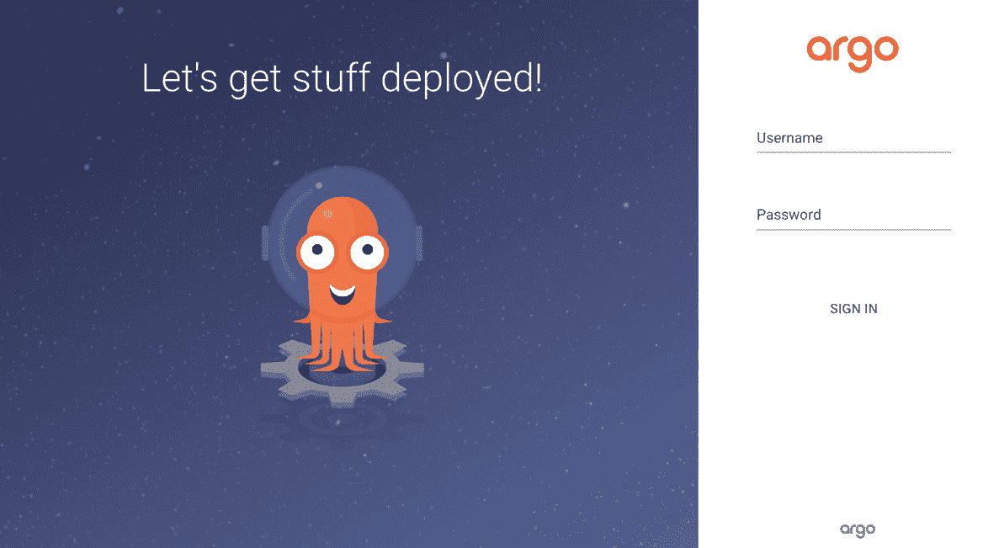

图 12.10 – Argo CD Web UI – 登录页面

Argo CD 默认提供一个初始的`admin`用户，该用户的密码以明文形式存储在`argocd-initial-admin-secret` **Secret** 资源中。虽然您可以使用此默认设置，但值得注意的是，它是从公开的 YAML 清单生成的。因此，建议您进行更新。要更新，请执行以下命令：

```
$ kubectl patch secret argocd-secret -n argocd \
-p '{"data": {"admin.password": null, "admin.passwordMtime": null}}'
$ kubectl scale deployment argocd-server --replicas 0 -n argocd
$ kubectl scale deployment argocd-server --replicas 1 -n argocd
```

现在，请等待两分钟，以便生成新的凭据。之后，执行以下命令以获取密码：

```
$ kubectl -n argocd get secret argocd-initial-admin-secret \
-o jsonpath="{.data.password}" | base64 -d && echo
```

现在，您已经拥有必要的凭据，请登录，您将看到以下页面：

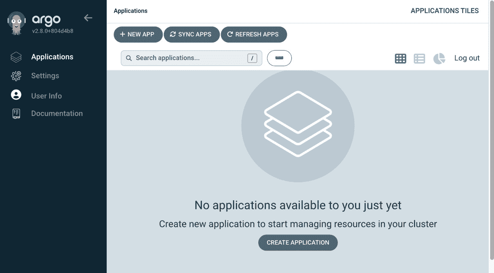

图 12.11 – Argo CD Web UI – 首页

我们已经成功设置了 Argo CD。接下来的步骤是部署我们的应用程序；然而，正如我们所知，我们的应用程序使用 Kubernetes Secrets，而我们不能将其存储在 Git 中，因此我们需要找到一种机制来安全地存储它。为了解决这个问题，我们有 Bitnami 的 **SealedSecret** 资源。我们将在下一节中讨论这一点。

# 管理敏感配置和机密

**Sealed Secrets** 解决了 *我可以在 Git 中管理所有 Kubernetes 配置，除了 Secrets* 的问题。Sealed Secrets 作为存储敏感信息的安全容器。当您需要存储机密信息，如密码或密钥时，您将它们放入这些专门的封装中。只有 Kubernetes 中的 Sealed Secrets 控制器才能解锁并访问其中的内容。这确保了您的宝贵机密的最高安全性和保护。由 *Bitnami Labs* 创建并开源，它们帮助您使用非对称加密将 Kubernetes Secrets 加密为 Sealed Secrets，只有在集群中运行的 Sealed Secrets 控制器才能解密。这意味着您可以将 Sealed Secrets 存储在 Git 中，并使用 GitOps 设置一切，包括 Secrets。

Sealed Secrets 包含两个组件：

+   一个名为 `kubeseal` 的客户端工具帮助我们从标准 Kubernetes Secret YAML 生成 Sealed Secrets

+   集群端 Kubernetes 控制器/操作员解锁您的机密，并将密钥证书提供给客户端工具。

使用 Sealed Secrets 时的典型工作流如下图所示：

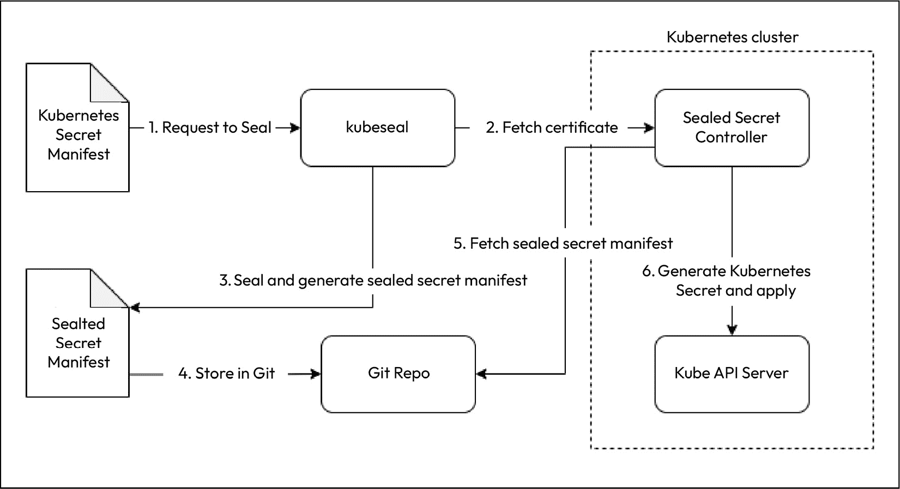

图 12.12 – Sealed Secrets 工作流

现在，让我们继续安装 Sealed Secrets 操作员。

## 安装 Sealed Secrets 操作员

要安装**Sealed Secrets 操作符**，你只需从最新版本的[`github.com/bitnami-labs/sealed-secrets/releases`](https://github.com/bitnami-labs/sealed-secrets/releases)下载控制器清单。在编写本书时，最新的控制器清单为[`github.com/bitnami-labs/sealed-secrets/releases/download/v0.23.1/controller.yaml`](https://github.com/bitnami-labs/sealed-secrets/releases/download/v0.23.1/controller.yaml)。

在`manifest`目录下创建一个名为`sealed-secrets`的新目录，并使用以下命令下载`controller.yaml`：

```
$ cd ~/mdo-environments/manifests & mkdir sealed-secrets
$ cd sealed-secrets
$ wget https://github.com/bitnami-labs/sealed-secrets\
/releases/download/v0.23.1/controller.yaml
```

然后，将更改提交并推送到远程仓库。大约五分钟后，Argo CD 会创建一个名为**sealed-secrets**的新应用程序并部署。你可以在 Argo CD Web UI 中查看：

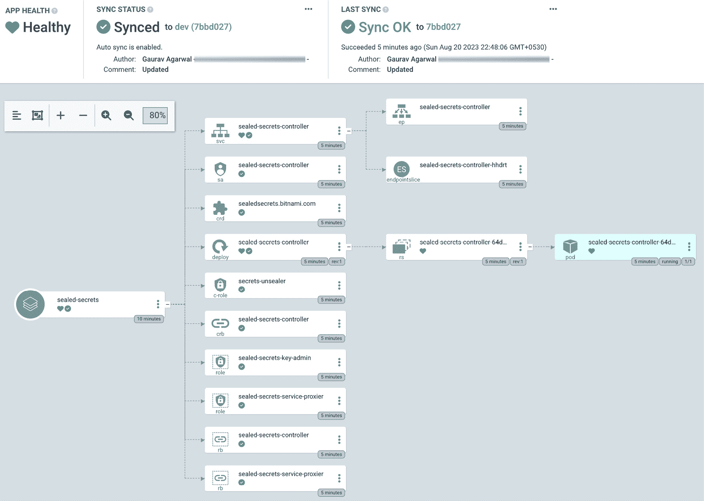

图 12.13 – Argo CD Web UI – Sealed Secrets

在 Kubernetes 集群中，`sealed-secrets-controller`将在`kube-system`命名空间中可见。运行以下命令来检查：

```
$ kubectl get deployment -n kube-system sealed-secrets-controller
NAME                      READY UP-TO-DATE AVAILABLE AGE
sealed-secrets-controller 1/1   1          1         6m4s
```

如我们所见，控制器正在运行并已准备好。现在我们可以安装客户端工具`kubeseal`。

## 安装 kubeseal

要安装客户端工具，你可以访问[`github.com/bitnami-labs/sealed-secrets/releases`](https://github.com/bitnami-labs/sealed-secrets/releases)，从页面中获取`kubeseal`安装二进制文件的链接。以下命令将会在你的系统中安装`kubeseal` `0.23.1`：

```
$ KUBESEAL_VERSION='0.23.1'
$ wget "https://github.com/bitnami-labs/sealed-secrets/releases/download\
/v${KUBESEAL_VERSION:?}/kubeseal-${KUBESEAL_VERSION:?}-linux-amd64.tar.gz"
$ tar -xvzf kubeseal-${KUBESEAL_VERSION:?}-linux-amd64.tar.gz kubeseal
$ sudo install -m 755 kubeseal /usr/local/bin/kubeseal
$ rm -rf ./kubeseal*
```

要检查`kubeseal`是否已成功安装，请运行以下命令：

```
$ kubeseal --version
kubeseal version: 0.23.1
```

既然`kubeseal`已经安装完成，我们接下来就创建一个`blog-app`的 Sealed Secret。

## 创建 Sealed Secrets

要创建 Sealed Secret，我们必须定义 Kubernetes Secret 资源。`mongodb-creds` Secret 应包含一些键值对，键`MONGO_INITDB_ROOT_USERNAME`的值为`root`，键`MONGO_INITDB_ROOT_PASSWORD`的值为你希望设置的密码。

由于我们不希望将明文的 Secret 作为文件存储，首先我们将使用`--dry-run`和`-o yaml`标志创建一个名为`mongodb-creds`的 Kubernetes Secret 清单，然后将输出直接通过管道传送到`kubeseal`，以生成`SealedSecret`资源，命令如下：

```
$ kubectl create secret generic mongodb-creds \
  --dry-run=client -o yaml --namespace=blog-app \
  --from-literal=MONGO_INITDB_ROOT_USERNAME=root \
  --from-literal=MONGO_INITDB_ROOT_PASSWORD=<your_pwd> \
  | kubeseal -o yaml > mongodb-creds-sealed.yaml
```

这将生成`mongodb-creds-sealed.yaml` Sealed Secret，其内容如下：

```
apiVersion: bitnami.com/v1alpha1
kind: SealedSecret
metadata:
  name: mongodb-creds
  namespace: blog-app
spec:
  encryptedData:
    MONGO_INITDB_ROOT_PASSWORD: AgB+tyskf72M/…
    MONGO_INITDB_ROOT_USERNAME: AgA95xKJg8veOy8v/…
  template:
    metadata:
      name: mongodb-creds
      namespace: blog-app
```

如你所见，Sealed Secret 与 Secret 清单非常相似。然而，它并没有包含 Base64 编码的秘钥值，而是对其进行了加密，以便只有 Sealed Secrets 控制器才能解密。你可以轻松地将这个文件提交到版本控制中。接下来，我们就这么做。使用以下命令将 Sealed Secret YAML 文件移动到`manifests/blog-app`目录：

```
$ mkdir -p ~/mdo-environments/manifests/blog-app/
$ mv mongodb-creds-sealed.yaml ~/mdo-environments/manifests/blog-app/
```

现在我们已经成功生成了 Sealed Secret 并将其移动到`manifests/blog-app`目录，接下来我们将在下一节设置应用程序的其他部分。

# 部署示例博客应用

要部署示例博客应用，我们需要定义应用资源。我们已经讨论过应用的组成。我们将应用包定义为一个 Kubernetes 清单文件，名为`blog-app.yaml`。我们需要使用以下命令将此 YAML 文件复制到`manifests/blog-app`目录：

```
$ cp ~/modern-devops/ch12/blog-app/blog-app.yaml \
 ~/mdo-environments/manifests/blog-app/
```

我已经预先构建了微服务，并使用了所需的`git-sha`作为标签，就像我们在上一章中做的那样。你可以编辑 YAML 文件，并将每个应用的镜像替换为你的镜像。

完成后，提交并推送更改到`mdo-environments`仓库。

一旦你推送更改，你应该注意到`blog-app`应用在五分钟内会开始出现在 Argo CD UI 中：

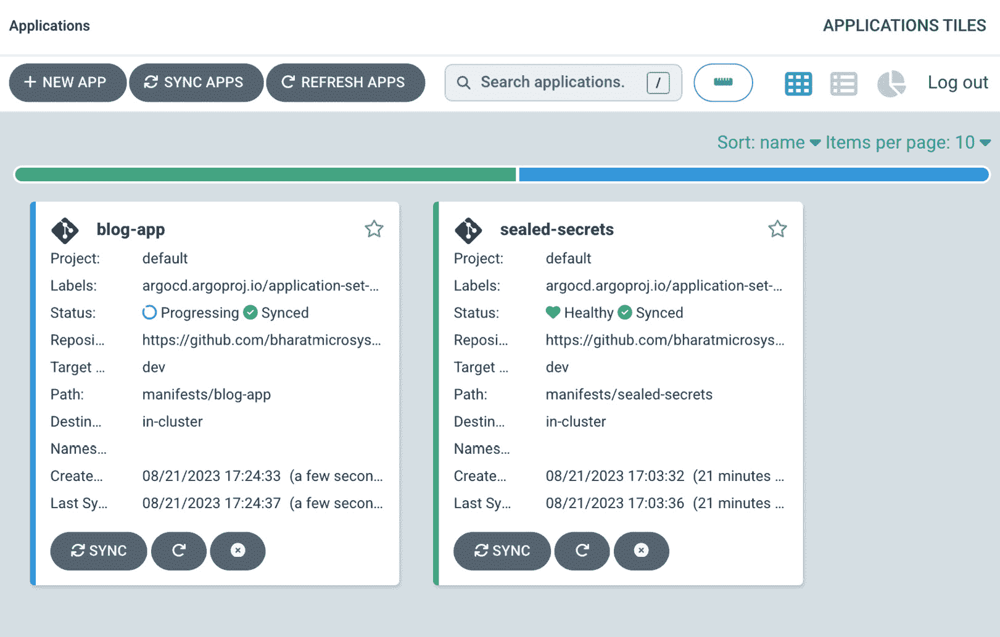

图 12.14 – Argo CD Web UI – 应用

等待应用进度更新。一旦显示为绿色，你应该能在应用中看到以下内容：

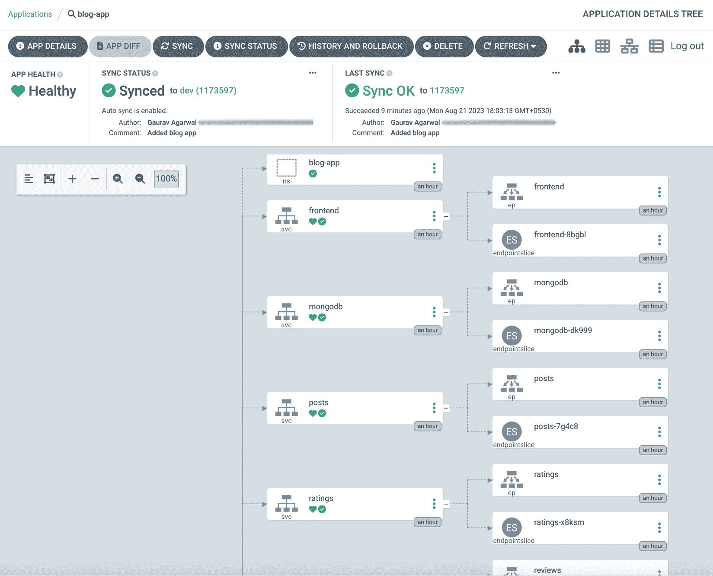

图 12.15 – Argo CD Web UI – blog-app

现在应用已经完全同步，我们可以检查在`blog-app`命名空间中创建的资源。首先，使用以下命令列出服务：

```
$ kubectl get svc -n blog-app
NAME     TYPE         CLUSTER-IP    EXTERNAL-IP PORT(S)
frontend LoadBalancer 10.71.244.154 34.68.221.0 80:3203/TCP
mongodb  ClusterIP    None          <none>      27017/TCP
posts    ClusterIP    10.71.242.211 <none>      5000/TCP
ratings  ClusterIP    10.71.244.78  <none>      5000/TCP
reviews  ClusterIP    10.71.247.128 <none>      5000/TCP
users    ClusterIP    10.71.241.25  <none>      5000/TCP
```

如我们所见，它列出了我们定义的所有服务。请注意，*frontend* 服务是`LoadBalancer`类型，并且有一个**外部 IP**。记下这个外部 IP，因为我们将用它来访问应用。

现在，让我们列出**pods**，看看所有微服务是否都正常运行：

```
$ kubectl get pod -n blog-app
NAME                        READY   STATUS    RESTARTS
frontend-7cbdc4c6cd-4jzdw   1/1     Running   0
mongodb-0                   1/1     Running   0
posts-588d8bcd99-sphpm      1/1     Running   0
ratings-7dc45697b-wwfqd     1/1     Running   0
reviews-68b7f9cb8f-2jgvv    1/1     Running   0
users-7cdd4cd94b-g67zw      1/1     Running   0
```

如我们所见，所有的 Pods 都运行正常。请注意，`mongodb-0` Pod 包含数字前缀，但其他 Pods 具有随机 UUID。你可能还记得，当我们创建`mongodb-creds`秘密时，它也已被创建：

```
$ kubectl get secret -n blog-app
NAME            TYPE     DATA   AGE
mongodb-creds   Opaque   2      80s
```

在这里，我们可以看到`mongodb-creds`秘密已经创建。这表明 SealedSecret 工作正常。

现在，让我们通过打开`http://<frontend-svc-external-ip>`来访问我们的应用。如果看到以下页面，说明应用已正确部署：


图 12.16 – 博客应用首页

作为练习，点击**登录** > **还不是用户？创建账户**，然后填写信息进行注册。你可以*创建*一个新**帖子**，添加**评论**，并提供**评分**。你还可以*更新*评论，*删除*评论，更新评分等。尝试使用应用，查看是否所有功能都正常工作。你应该能够看到类似以下内容：

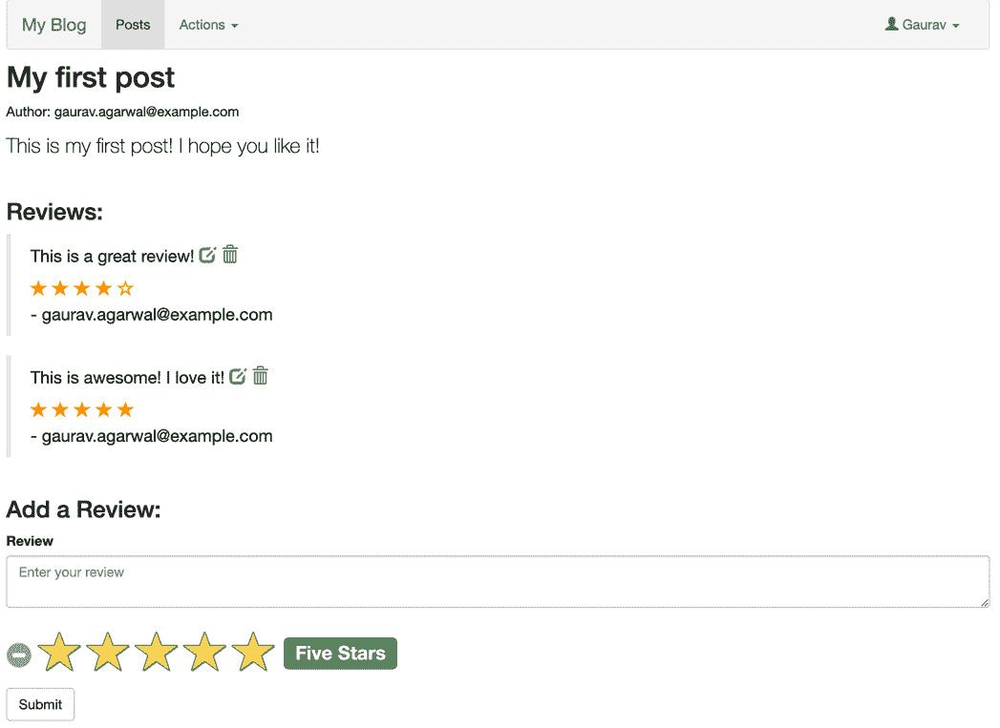

图 12.17 – 博客应用文章

由于我们对应用程序很满意，我们可以从 `dev` 分支向 `prod` 分支发起拉取请求。一旦你合并了拉取请求，你会看到相似的服务出现在生产环境中。你也可以使用基于拉取请求的门控进行 CD。这确保了你的环境保持独立，尽管它们来自同一个仓库，只是来自不同的分支。

# 总结

本章涵盖了持续部署和交付，并理解了 CD 的必要性以及容器应用程序的基本 CD 工作流。我们讨论了几种现代部署策略，并了解了 CI 工具无法满足这些责任。利用 GitOps 原则，我们创建了一个环境仓库，并通过 GitHub Actions 使用基于推送的模型部署了基于 GKE 的环境。然后，我们看到了如何使用 Argo CD 作为我们的 CD 工具并安装它。为了避免将敏感信息（如密钥）提交到 Git 中，我们讨论了 Bitnami 的 Sealed Secrets。接着，我们使用 Argo CD 和 GitOps 部署了示例博客应用程序。

在下一章中，我们将探讨现代 DevOps 中的另一个重要方面——确保部署管道的安全。

# 问题

回答以下问题以测试你对本章内容的掌握：

1.  以下哪些是 CD 工具？（选择三个）

    A. Spinnaker

    B. GitHub

    C. Argo CD

    D. AWS Code Deploy

1.  CD 需要人工干预才能部署到生产环境。（正确/错误）

1.  Argo CD 开箱即用支持蓝绿部署。（正确/错误）

1.  你会使用什么来启动 Argo CD 的部署？

    A. 手动触发管道

    B. 提交更改到你的 Git 仓库

    C. 使用 CI 触发 Argo CD 管道

    D. Argo CD 管道不会响应外部刺激

1.  Argo CD 的 ApplicationSet 帮助基于模板生成应用程序。（正确/错误）

1.  你应该优先选择哪些分支名称用于你的环境仓库？

    A. `dev`、`staging` 和 `prod`

    B. `feature`、`develop` 和 `master`

    C. `release` 和 `main`

1.  以下哪些部署模型是 Argo CD 使用的？

    A. 推送模型

    B. 拉取模型

    C. 阶段性模型

1.  你应该使用 Terraform 来安装 Argo CD，因为你可以将所有配置存储在 Git 中。（正确/错误）

1.  Argo CD 可以从以下哪些来源同步资源？（选择两个）

    A. Git 仓库

    B. 容器注册表

    C. JFrog Artifactory 的原始仓库

1.  如果你在 Git 之外手动更改了一个资源，Argo CD 会怎么办？

    A. Argo CD 会更改资源，使其与 Git 配置匹配

    B. Argo CD 会通知你资源在 Git 之外发生了变化

    C. Argo CD 什么也不做

1.  你可以将 Sealed Secrets 提交到 Git 仓库中。（正确/错误）

# 答案

以下是本章问题的答案：

1.  A、C 和 D

1.  正确

1.  正确

1.  B

1.  正确

1.  A

1.  B

1.  正确

1.  A, B

1.  A

1.  正确
