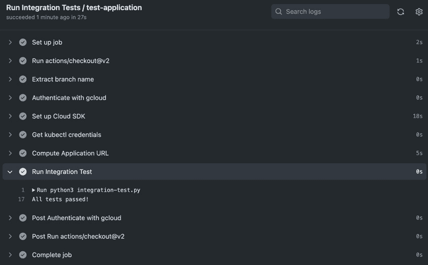
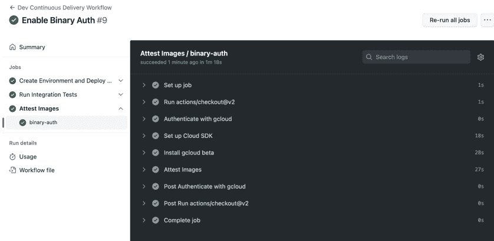

# 保护和测试您的 CI/CD 管道

在前几章中，我们探讨了**持续集成** (**CI**) 和**持续部署/交付** (**CD**) ，并将 GitOps 作为核心概念。这两个概念及其相关工具帮助我们更快速地交付更好的软件。然而，技术的一个关键方面是安全性和质量保障。虽然在 DevOps 的早期并没有考虑到安全性，但随着 **DevSecOps** 的出现，现代 DevOps 现在非常重视安全性。在本章中，我们将尝试理解容器应用程序安全性和测试的相关概念，以及如何在 CI 和 CD 中应用这些概念。

在本章中，我们将涵盖以下主要内容：

+   安全性和测试 CI/CD 管道

+   回顾博客应用程序

+   容器漏洞扫描

+   管理机密

+   二进制授权

+   使用拉取请求进行发布门控，并将我们的应用部署到生产环境

+   现代 DevOps 管道的安全性和测试最佳实践

# 技术要求

在本章中，我们将启动一个基于云的 Kubernetes 集群，**Google Kubernetes Engine** (**GKE**)，用于练习。目前，**Google Cloud Platform** (**GCP**) 提供一个免费的 $300 试用，持续 90 天，因此你可以前往[`console.cloud.google.com/`](https://console.cloud.google.com/)注册。

你还需要克隆以下 GitHub 仓库，以便进行一些练习：

[`github.com/PacktPublishing/Modern-DevOps-Practices-2e`](https://github.com/PacktPublishing/Modern-DevOps-Practices-2e)。

你可以使用 GCP 上提供的 Cloud Shell 服务来跟随本章内容。进入 Cloud Shell 并启动一个新会话。运行以下命令将仓库克隆到你的主目录，以便访问所需资源：

```
$ git clone https://github.com/PacktPublishing/Modern-DevOps-Practices-2e.git \
modern-devops
```

我们还需要设置项目 ID，并启用一些我们将在本章中使用的 GCP API。为此，请运行以下命令：

```
$ PROJECT_ID=<YOUR_PROJECT_ID>
$ gcloud services enable iam.googleapis.com \
 container.googleapis.com \
 binaryauthorization.googleapis.com \
 containeranalysis.googleapis.com \
 secretmanager.googleapis.com \
 cloudresourcemanager.googleapis.com \
 cloudkms.googleapis.com
```

接下来，让我们看看如何保护和测试 CI/CD 管道。

# 安全性和测试 CI/CD 管道

随着持续的网络威胁和网络安全专家与网络犯罪分子之间的持续斗争，安全性一直是大多数组织的首要任务，并且它也构成了成熟组织投资的一个重要部分。

然而，安全性伴随着成本。大多数组织都有网络安全团队定期审核他们的代码并提供反馈。然而，这一过程通常较慢，并且发生在大部分代码已经开发完成且难以修改时。

类似地，虽然大多数组织都强调自动化测试，但许多仍然严重依赖手动测试。手动测试不仅劳动密集，而且缺乏可重复性。DevOps 非常重视自动化测试，以确保每次发布时都能重复执行，能够发现现有问题并彻底测试新功能。此外，自动化对于高效地进行回归测试至关重要，因为在这种情况下，手动测试效率低下。

因此，在开发初期嵌入安全性和测试是现代 DevOps 的一个关键目标。将安全性与 DevOps 相结合催生了 DevSecOps 的概念，在这个概念中，开发人员、网络安全专家和运维团队协同工作，更快地创建更好、更安全的软件。

使用 CI/CD 流水线进行软件安全和测试可以带来许多显著的商业优势。首先，它通过保护敏感数据、防止漏洞并确保合规性来确保安全性。其次，它通过早期发现问题、一致性和更高的产品质量来提升质量和可靠性。这将通过减少返工、加速上市时间和优化资源使用来降低成本。此外，它通过增强韧性和进行压力测试来降低风险。更重要的是，它通过灾难恢复和高效的回滚程序来确保业务连续性。此外，它通过促进更快的创新和市场响应来提供竞争优势。最后，通过增强客户对产品和服务的信任以及保护品牌声誉，它提高了声誉和客户信任。总之，保护和测试 CI/CD 流水线不仅是技术上的必要性，也是战略性的商业迫切需求，它提升了安全性、质量和可靠性，同时降低了成本和风险，最终提高了客户满意度、业务连续性和市场中的竞争力。

在软件供应链中嵌入安全性的方式有很多种。某些方法可能包括静态代码分析、安全性测试，以及在过程中应用组织特定的安全策略，但安全的目的是不让开发速度变慢。我们可以用工具来代替人工输入，这些工具能够显著改善我们开发软件的安全性。类似地，测试不必是手动和缓慢的，相反，应该使用自动化来与 CI/CD 流水线无缝对接。

**CI/CD 流水线**是现代 DevOps 的核心特性之一，它协调所有流程并结合所有工具以更快交付更好的软件，但你如何确保它们的安全性呢？你可能想问以下问题：

+   如何扫描容器镜像以查找漏洞？

+   我如何安全地存储和管理敏感信息和机密？

+   如何确保在部署到生产环境之前测试我的应用程序？

+   如何确保只有经过测试和批准的容器映像才能部署到生产环境？

在本章中，我们将尝试使用最佳实践和工具来回答这些问题。作为参考，请查看以下工作流程图：


图 13.1 – 安全的 CI/CD 工作流程

如前图所示，我们需要修改 CI 管道以包括额外的漏洞扫描步骤。我们还需要两个 CD 管道，一个用于开发环境，另一个用于生产环境。为增强可重用性，我们将重新构造 GitHub Actions 工作流程。我们将工作流划分为父工作流和子工作流。让我们从检查用于开发环境的 CD 工作流开始，以获取概述：

```
name: Dev Continuous Delivery Workflow
on:
  push:
    branches: [ dev ]
jobs:
  create-environment-and-deploy-app:
    name: Create Environment and Deploy App
    uses: ./.github/workflows/create-cluster.yml
    secrets: inherit
  run-tests:
    name: Run Integration Tests
    needs: [create-environment-and-deploy-app]
    uses: ./.github/workflows/run-tests.yml
    secrets: inherit
  binary-auth:
    name: Attest Images
    needs: [run-tests]
    uses: ./.github/workflows/attest-images.yml
    secrets: inherit
  raise-pull-request:
    name: Raise Pull Request
    needs: [binary-auth]
    uses: ./.github/workflows/raise-pr.yml
    secrets: inherit
```

工作流程从 `name` 开始，然后声明 `on push branches dev`。此配置确保工作流在每次推送到 `dev` 分支时触发。我们按顺序定义多个作业，每个作业都使用 `needs` 属性依赖于前一个作业。每个作业通过设置 `uses` 属性调用子工作流，并通过为 `secrets` 属性设置 `inherit` 来向这些子工作流提供 GitHub 秘密。

该工作流程完成以下任务：

1.  设置开发 Kubernetes 集群，配置 Argo CD 和支持工具以建立环境，并部署示例博客应用程序。

1.  在部署的博客应用上执行集成测试。

1.  如果测试通过，它会利用二进制授权（详细信息将在后续提供）来证明图像，确保只有经过测试的构件允许部署到生产环境。

1.  为部署到生产环境启动拉取请求。

类似地，我们有以下生产 CD 工作流文件：

```
name: Prod Continuous Delivery Workflow
on:
  push:
    branches: [ prod ]
jobs:
  create-environment-and-deploy-app:
    name: Create Environment and Deploy App
    uses: ./.github/workflows/create-cluster.yml
    secrets: inherit
  run-tests:
    name: Run Integration Tests
    needs: [create-environment-and-deploy-app]
    uses: ./.github/workflows/run-tests.yml
    secrets: inherit
```

此工作流类似于开发工作流，但不包括 `binary-auth` 和 `raise-pull-request` 步骤，因为在这个阶段它们是不必要的。为了更好地理解它，让我们从检查开发工作流开始。开发工作流的初始步骤涉及创建环境并部署应用程序。但在继续之前，让我们在下一节重新审视博客应用程序。

# 重新审视博客应用程序

正如我们在上一章节中已经讨论的博客应用程序，让我们再次查看服务及其交互如下图所示：


图 13.2 – 博客应用服务和交互

我们已经使用 GitHub Actions 创建了 CI 和 CD 管道，用于构建、测试和推送我们的博客应用程序微服务容器，并在 GKE 集群中使用 Argo CD 部署它们。

如果你还记得，我们为应用程序创建了以下资源，以使其无缝运行：

+   **MongoDB** – 我们部署了一个启用了身份验证的 MongoDB 数据库，并设置了 root 凭证。凭证通过来自 Kubernetes **Secret**资源的环境变量注入。为了持久化数据库数据，我们创建了一个挂载到容器的**PersistentVolume**，并使用**PersistentVolumeClaim**动态提供它。由于容器是有状态的，我们使用了**StatefulSet**来管理它，因此需要一个无头的 Service 来暴露数据库。

+   **帖子、评论、评分和用户** – 帖子、评论、评分和用户微服务通过来自同一**Secret**资源的环境变量注入的 root 凭证与 MongoDB 进行交互。我们使用各自的**Deployment**资源部署了这些服务，并通过各自的**ClusterIP**服务暴露它们。

+   **Frontend** – 前端微服务不需要与 MongoDB 交互，因此不与**Secret**资源发生交互。我们同样使用**Deployment**资源部署了该服务。由于我们希望将该服务暴露到互联网，我们为它创建了一个**LoadBalancer** Service。

我们可以通过以下图表来总结它们：


图 13.3 – 博客应用程序 – Kubernetes 资源与交互

在随后的章节中，我们将涵盖实施此工作流程的所有方面，从漏洞扫描开始。

# 容器漏洞扫描

完美的软件开发和维护成本高昂，每当有人对正在运行的软件进行更改时，破坏某些功能的可能性就很高。除了其他错误之外，更改还会引入大量软件漏洞。作为软件开发人员，您无法避免这些问题。网络安全专家和网络犯罪分子之间的斗争是持续进行的，并随着时间不断发展。每天都会发现并报告一组新的漏洞。

在容器中，漏洞可能在多个方面存在，且可能与您负责的部分完全无关。好吧，开发人员编写代码，优秀的开发人员会确保代码的安全性。但您永远不知道基础镜像中是否存在开发人员可能完全忽视的漏洞。在现代的 DevOps 中，漏洞是不可避免的，关键是尽可能地减少它们。我们应该减少漏洞，但手动处理漏洞是耗时的，容易导致繁琐的工作。

市场上有多个工具可以提供容器漏洞扫描服务。其中一些是开源工具，如**Anchore**、**Clair**、**Dagda**、**OpenSCAP**、Sysdig 的**Falco**，或者是可通过**Google Container Registry**（**GCR**）、**Amazon Elastic Container Registry**（**ECR**）和**Azure Defender**提供的**SaaS**服务。对于本章内容，我们将讨论**Anchore Grype**。

Anchore Grype ([`github.com/anchore/grype`](https://github.com/anchore/grype)) 是一个容器漏洞扫描器，它会扫描你的镜像中的已知漏洞并报告其严重性。根据这些信息，你可以采取适当的措施，通过更换基础镜像或修改层来删除易受攻击的组件，从而防止漏洞的发生。

Anchore Grype 是一个简单的**命令行界面**（**CLI**）工具，可以作为二进制文件安装并在任何地方运行——无论是在本地系统还是 CI/CD 流水线中。你还可以配置它，如果漏洞级别超过特定阈值，自动使流水线失败，从而将安全性嵌入到你的自动化中——所有这些都不会给开发或安全团队带来麻烦。

现在，让我们继续看看 Anchore Grype 的实际操作情况。

## 安装 Anchore Grype

由于我们希望在 CI 流水线中实施漏洞扫描，让我们修改我们在*第十一章*中创建的 `mdo-posts` 仓库。

让我们首先使用以下命令克隆仓库，并 `cd` 进入 `workflows` 目录：

```
$ git clone git@github.com:<your_github_user>/mdo-posts.git
$ cd mdo-posts/.github/workflows/
```

Anchore Grype 在其 GitHub 仓库中提供了一个安装脚本，你可以下载并运行，它应该会为你设置好。我们将修改 `build.yaml` 文件，在 `登录到 Docker Hub` 步骤之前添加以下步骤，以便在 CI 工作流中安装 Grype：

```
- name: Install Grype
  id: install-grype
  run: curl -sSfL https://raw.githubusercontent.com/anchore/grype/main/install.sh | sh -s 
-- -b /usr/local/bin
```

接下来，我们需要使用 Grype 扫描我们的镜像以检查漏洞。

## 扫描镜像

要运行容器漏洞扫描，我们可以使用以下命令：

```
$ grype <container-image>
```

这将报告镜像中漏洞的列表，并按严重性划分—`Negligible`（轻微）、`Low`（低）、`Medium`（中等）、`High`（高）、`Critical`（严重）或`Unknown`（未知）。我们还可以在 Grype 中设置阈值，当任何漏洞的级别等于或高于该阈值时使其失败。例如，如果我们不希望容器中出现任何`Critical`（严重）漏洞，我们可以使用以下命令：

```
$ grype -f critical <container-image>
```

为此，我们将在 `build.yaml` 文件中，在 `构建 Docker` `镜像` 步骤后添加以下步骤：

```
- name: Scan Image for Vulnerabilities
  id: vul-scan
  run: grype -f critical ${{ secrets.DOCKER_USER  }}/mdo-posts:$(git rev-parse --short 
"$GITHUB_SHA")
```

由于我们已经做出了所有更改，让我们使用以下命令推送修改后的 CI 流水线：

```
$ cp ~/modern-devops/ch13/grype/build.yaml .
$ git add --all
$ git commit -m "Added grype"
$ git push
```

一旦我们推送镜像，我们将在 GitHub Actions 标签页中看到以下内容：


图 13.4 – 漏洞扫描失败

如我们所见，Grype 已报告了多个漏洞，其中一个为 `Critical`（严重）。它还导致了 CI 流水线失败。这就是自动化漏洞扫描的实际应用。它会发现漏洞，并且只有当构建满足最低安全标准时，才会将其发布到你的容器注册表中。

我们需要修复这里的问题，因此让我们查看一个更新的镜像，看看它是否能解决这个问题。因此，除了使用`python:3.7-alpine`，我们将使用`python:alpine3.18`。让我们这样做，并使用以下命令将代码推送到 GitHub：

```
$ cd ~/mdo-posts && cp ~/modern-devops/ch13/grype/Dockerfile .
$ git add --all
$ git commit -m "Updated base image"
$ git push
```

让我们重新查看 GitHub Actions，看看在`build`输出中得到什么：


图 13.5 – 漏洞扫描成功

这次漏洞扫描没有阻止我们的 CI 构建，因为没有发现`Critical`漏洞。

提示

随着时间的推移，不断更新基础镜像，因为更新后的镜像包含更少的漏洞，并修复了旧版中的漏洞。

现在我们已经确保镜像没有漏洞，我们的 CI 管道已经完成。您可以根据需要为其他微服务复制此过程。让我们继续讨论 CD 管道。

如果您记得，在上一章中，我们按照 GitOps 模式将所有资源的清单存储在 Git 上。然而，由于 Kubernetes Secrets 存在安全隐患，我们使用了**SealedSecrets**来安全地管理它们。

然而，由于以下固有问题，这可能并不是所有团队的理想解决方案：

+   SealedSecrets 依赖于加密它们的控制器。如果我们丢失了这个控制器，我们也失去了重新创建机密的能力，从而实质上丧失了该机密。

+   访问机密仅限于登录集群并使用`kubectl`，这种方式不会为非管理员提供管理机密的能力。虽然这种方法可能适合某些团队，但可能不适合其他团队。

因此，我们将探索使用密钥管理工具来管理密钥，以建立一种标准化的方法，集中管理密钥，并对访问权限进行更精细的控制。让我们在下一节深入探讨这个话题。

# 管理机密

软件始终需要访问敏感信息，如用户数据、凭证、**开放授权**（**OAuth**）令牌、密码以及其他被称为机密的信息。在开发和管理软件时，确保这些方面的安全性一直是一个关注点。CI/CD 管道可能会处理这些信息，因为它们通过结合代码和来自多个源的其他依赖项来构建并交付工作软件，其中可能包括敏感信息。保持这些信息的安全性至关重要；因此，需要使用现代的 DevOps 工具和技术，将安全性嵌入到 CI/CD 管道中。

大多数应用程序代码都需要访问敏感信息。这些信息在 DevOps 领域被称为**机密**。机密是任何有助于某人证明其身份、进行身份验证以及授权特权账户、应用程序和服务的数据。以下是一些可能构成机密的候选项：

+   密码

+   API 令牌、GitHub 令牌以及其他任何应用程序密钥

+   **安全外壳**（**SSH**）密钥

+   **传输层安全性**（**TLS**）、**安全套接字层**（**SSL**）和**相当好的隐私**（**PGP**）私钥

+   一次性密码

一个好的例子是，容器需要访问 API 密钥以进行第三方 API 身份验证，或者需要用户名和密码来进行后端数据库的身份验证。开发人员需要理解在哪里以及如何存储机密，以确保它们不会无意中暴露给不应查看它们的人。

当我们运行 CI/CD 管道时，必须理解如何处理这些机密，因为在 CI/CD 管道中，我们从源代码开始构建一切。“*不要将机密与代码一起存储*”是我们都听过的重要建议。

提示

永远不要将硬编码的机密存储在 CI/CD 管道中，或将机密存储在源代码仓库中，如 Git。

我们如何在不将机密包含在代码中的情况下访问它们，从而运行完全自动化的 GitOps 基于的 CI/CD 管道呢？好吧，这就是我们需要弄清楚的事情。

提示

使用容器时，应该避免将机密嵌入到镜像中。虽然这是一个广为人知的建议，但许多开发人员无意中这么做，导致许多安全漏洞。这是非常不安全的，你应该避免这样做。

你可以通过使用某种形式的**秘密管理解决方案**来克服这个问题。秘密管理解决方案或**密钥管理解决方案**帮助存储和管理机密，并通过静态和传输加密保护它们。云服务提供商内部有秘密管理工具，如 GCP 中的**秘密管理器**和**亚马逊 Web 服务**（**AWS**），或者如果你希望使用与云无关的工具，可以使用第三方工具，如**HashiCorp Vault**。所有这些解决方案都提供 API 用于在运行时创建和查询机密，并通过 HTTPS 安全 API 以允许加密传输。这样，你就不需要将机密与代码一起存储或嵌入镜像中。

在本讨论中，我们将使用 GCP 提供的**秘密管理器**解决方案来存储机密，并在运行 CI/CD 管道时访问它们。秘密管理器是 Google Cloud 的秘密管理系统，它帮助你集中存储和管理机密。它非常安全，使用**硬件安全模块**（**HSMs**）进一步加固你的机密。

在本章中，我们将着眼于改进上章讨论的博客应用程序的 CI/CD 管道，并将使用相同的示例应用程序。因此，接下来我们将创建 Google Cloud Secret Manager 中的 `mongodb-creds` 机密。

## 在 Google Cloud Secret Manager 中创建一个机密

让我们创建一个名为 `external-secrets` 的机密，在其中我们将以 JSON 格式传递 MongoDB 凭据。为此，请运行以下命令：

```
$ echo -ne \
'{"MONGO_INITDB_ROOT_USERNAME": "root", "MONGO_INITDB_ROOT_PASSWORD": "itsasecret"}'  \
| gcloud secrets create external-secrets --locations=us-central1 \
--replication-policy=user-managed --data-file=-
Created version [1] of the secret [external-secrets].
```

在前面的命令中，我们将包含 `MONGO_INITDB_ROOT_USERNAME` 和 `PASSWORD` 的 JSON 直接传递给 `gcloud secrets create` 命令。我们指定了一个特定的位置，以避免在其他区域重复它，从而节省成本。然而，强烈建议复制密钥，以防在区域性故障时发生潜在的丢失。该 JSON 被存储为密钥的新版本。Secret Manager 使用版本控制来管理密钥，因此分配给密钥（`external-secrets`）的任何新值都会被版本化并存储在 Secret Manager 中。你可以通过版本号或使用 `latest` 关键字来引用特定版本，以访问最新的版本。

从输出中可以看到，我们已经创建了密钥的第一个版本（`版本 1`）。通常，这是在开发阶段完成的，应该保持在 CI/CD 流程之外。你可以将 Secret 资源清单保存在 Secret Manager 中，而不是存储在源代码库中。

现在我们已经创建了密钥，我们必须在应用程序中访问它。为此，我们需要一个工具来访问 Kubernetes 集群中的 Secret Manager 中存储的密钥。为此，我们将使用**External** **Secrets Operator**。

## 使用 External Secrets Operator 访问外部密钥

External Secrets Operator ([`external-secrets.io/latest/`](https://external-secrets.io/latest/)) 是一个 Kubernetes 操作器，用于在 Kubernetes 集群中安全地管理外部密钥。它旨在自动检索和管理存储在外部密钥存储系统中的密钥，如 AWS Secret Manager、GCP Secret Manager、Hashicorp Vault 等，并将它们作为 Kubernetes Secrets 注入到 Kubernetes pod 中。操作器是一种扩展 Kubernetes 功能并自动化任务的方式。

### 它是如何工作的

External Secrets Operator 作为 Kubernetes 集群与外部密钥管理系统之间的桥梁。我们在 Kubernetes 集群中定义一个 `ExternalSecret` 自定义资源，操作器会监视它。当创建或更新 `ExternalSecret` 资源时，操作器与 `ClusterSecretStore` CRD 中指定的外部密钥存储交互，以检索密钥数据。然后，它创建或更新相应的 Kubernetes Secrets。该过程在下面的图示中展示：


图 13.6 – 外部密钥操作器

现在，这个过程有很多好处，其中一些如下：

+   **增强安全性**：密钥保存在专用的安全密钥存储中

+   **自动化**：自动化密钥的检索和轮换

+   **简化部署**：简化了 Kubernetes 应用程序中密钥的管理

+   **兼容性**：支持多种外部密钥存储，使其具有多功能性

现在，让我们继续在 Kubernetes 集群中安装 External Secrets Operator。

### 安装 External Secrets Operator

外部密钥操作符可通过 `manifests/argocd/external-secrets.yaml` 清单文件获取：

```
apiVersion: argoproj.io/v1alpha1
kind: Application
metadata:
  name: external-secrets
  namespace: argocd
spec:
  project: default
  source:
    chart: external-secrets/external-secrets
    repoURL: https://charts.external-secrets.io
    targetRevision: 0.9.4
    helm:
      releaseName: external-secrets
  destination:
    server: "https://kubernetes.default.svc"
    namespace: external-secrets
```

应用清单在 `default` 项目中的 `argocd` 命名空间下创建了一个 `external-secrets` 应用。它从 `external-secrets` Helm 图表仓库下载 `0.9.4` 版本，并将图表部署到 Kubernetes 集群中的 `external-secrets` 命名空间。

要安装此应用，我们需要使用 Terraform 应用此清单。因此，我们在 `app.tf` 文件中做出如下输入：

```
data "kubectl_file_documents" "external-secrets" {
    content = file("../manifests/argocd/external-secrets.yaml")
}
resource "kubectl_manifest" "external-secrets" {
  depends_on = [
    kubectl_manifest.argocd,
  ]
  for_each  = data.kubectl_file_documents.external-secrets.manifests
  yaml_body = each.value
  override_namespace = "argocd"
}
```

为了部署这一应用，我们必须将这些文件提交到源代码管理。让我们克隆上一章节中创建的 `mdo-environments` 仓库。

如果你没有按照上一章节的步骤操作，可以通过以下方法设置一个基础环境。如果你已经在*第十二章*中完成了环境设置，可以跳过下一节，继续进行*持续部署/交付与* **Argo CD**。

## 设置基础环境

为了确保与上一章节的连续性，让我们首先创建一个服务帐户，以便 Terraform 可以与我们的 GCP 项目交互，使用以下命令：

```
$ gcloud iam service-accounts create terraform \
 --description="Service Account for terraform" \
 --display-name="Terraform"
$ gcloud projects add-iam-policy-binding $PROJECT_ID \
--member="serviceAccount:terraform@$PROJECT_ID.iam.gserviceaccount.com" \ 
--role="roles/editor"
$ gcloud iam service-accounts keys create key-file \
--iam-account=terraform@$PROJECT_ID.iam.gserviceaccount.com
```

你会在工作目录中看到一个名为 `key-file` 的文件。现在，在 GitHub 上创建一个名为 `mdo-environments` 的新仓库，并添加一个 `README.md` 文件，重命名 `main` 分支为 `prod`，并使用 GitHub 创建一个名为 `dev` 的新分支。然后访问 `https://github.com/<your_github_user>/mdo-environments/settings/secrets/actions/new`，创建一个名为 `GCP_CREDENTIALS` 的密钥。在值字段中，打印出 `key-file` 文件的内容，复制并粘贴到 GitHub 密钥的 **values** 字段中。

接下来，创建另一个密钥 `PROJECT_ID`，并在 **values** 字段中指定你的 GCP 项目 ID。

接下来，我们需要为 Terraform 创建一个 GCS 存储桶，作为远程后端使用。为此，运行以下命令：

```
$ gsutil mb gs://tf-state-mdo-terraform-${PROJECT_ID}
```

现在，所有前提条件都已满足，我们可以克隆我们的仓库并复制基础代码。运行以下命令来完成此操作：

```
$ cd ~ && git clone git@github.com:<your_github_user>/mdo-environments.git
$ cd mdo-environments/
$ git checkout dev
$ cp -r ~/modern-devops/ch13/baseline/* .
$ cp -r ~/modern-devops/ch13/baseline/.github .
```

既然我们已经设置了基础环境，接下来让我们继续使用 Terraform 安装外部密钥。

## 使用 Terraform 安装外部密钥

让我们配置本地仓库来安装外部密钥清单。为此，使用以下命令复制应用清单和 `app.tf` 文件：

```
$ cp ~/modern-devops/ch13/install-external-secrets/app.tf terraform/app.tf
$ cp ~/modern-devops/ch13/install-external-secrets/external-secrets.yaml \
  manifests/argocd/
```

既然一切准备就绪，让我们使用以下命令提交并推送我们的代码：

```
$ git add --all
$ git commit -m "Install external secrets operator"
$ git push
```

一旦我们推送代码，就会看到 GitHub Actions 工作流被触发。要访问该工作流，请访问 `https://github.com/<your_github_user>/mdo-environments/actions`。不久后，工作流会应用配置，创建 Kubernetes 集群，并部署 Argo CD、Sealed Secrets 控制器和 External Secrets Operator。

一旦工作流成功执行，我们可以按照以下步骤访问 Argo Web UI。

我们首先需要对 GKE 集群进行身份验证。为此，运行以下命令：

```
$ gcloud container clusters get-credentials \
 mdo-cluster-dev --zone us-central1-a --project $PROJECT_ID
```

要使用 Argo CD Web UI，您需要`argo-server`服务的外部 IP 地址。要获取该地址，请运行以下命令：

```
$ kubectl get svc argocd-server -n argocd
NAME          TYPE        EXTERNAL-IP  PORTS          AGE
argocd-server LoadBalaner 34.122.51.25 80/TCP,443/TCP 6m15s
```

所以，现在我们知道可以通过`https://34.122.51.25/`访问 Argo CD。

接下来，我们将运行以下命令来重置管理员密码：

```
$ kubectl patch secret argocd-secret -n argocd \
-p '{"data": {"admin.password": null, "admin.passwordMtime": null}}'
$ kubectl scale deployment argocd-server --replicas 0 -n argocd
$ kubectl scale deployment argocd-server --replicas 1 -n argocd
```

现在，允许两分钟来生成新的凭证。然后，执行以下命令来获取密码：

```
$ kubectl -n argocd get secret argocd-initial-admin-secret \
 -o jsonpath="{.data.password}" | base64 -d && echo
```

现在我们已经拥有了凭证，登录后将看到以下页面：


图 13.7 – Argo CD Web UI – 主页

如我们所见，有三个应用程序——`SealedSecret`清单，它是我们在上一章中创建的，因为它是由不同的 Sealed Secrets 控制器生成的。

我们不需要 Sealed Secrets 操作员，我们将改用 Google Cloud Secret Manager。所以，让我们使用以下命令从集群中移除它：

```
$ rm -rf manifests/sealed-secrets
$ git add --all
$ git commit -m "Removed sealed secrets"
$ git push
```

我们已移除 Sealed Secrets 操作员，Argo CD Web UI 应该很快反映出这一变化。然而，博客应用程序将保持降级状态，因为`mongodb-creds` Secret 仍然缺失。在接下来的部分中，我们将使用 External Secrets Operator 生成`mongodb-creds` Secret。

### 使用 External Secrets Operator 生成 MongoDB Kubernetes Secret

为了生成`mongodb-creds` Secret，我们需要创建以下资源：

+   一个`Secret`资源——这是一个标准的 Kubernetes Secret 资源，包含服务账户凭证，以便 Kubernetes 与 GCP Secret Manager 连接。

+   一个`ClusterSecretStore`资源——该资源包含与密钥存储（在此情况下为 GCP Secret Manager）连接的配置，并使用`Secret`资源提供服务账户凭证。

+   一个`ExternalSecret`资源——该资源包含配置，用于从密钥存储中提取的 Secret 生成所需的 Kubernetes Secret（`mongodb-creds`）。

所以，首先让我们定义`Secret`资源：

为了创建`Secret`资源，我们首先需要创建一个 GCP 服务账户，以便与 Secret Manager 交互，使用以下命令：

```
$ cd ~
$ gcloud iam service-accounts create external-secrets
```

由于我们遵循最小权限原则，我们将添加以下角色绑定，仅提供对`external-secrets` Secret 的访问，如下所示：

```
$ gcloud secrets add-iam-policy-binding external-secrets \
 --member "serviceAccount:external-secrets@$PROJECT_ID.iam.gserviceaccount.com" \
 --role "roles/secretmanager.secretAccessor"
```

现在，使用以下命令生成服务账户密钥文件：

```
$ gcloud iam service-accounts keys create key.json \
--iam-account=external-secrets@$PROJECT_ID.iam.gserviceaccount.com
```

现在，将`key.json`文件的内容复制到一个新的 GitHub Actions 密钥中，命名为`GCP_SM_CREDENTIALS`。我们将在运行时使用 GitHub Actions 动态设置此值；因此，以下密钥清单将包含一个占位符：

```
apiVersion: v1
data:
  secret-access-credentials: SECRET_ACCESS_CREDS_PH
kind: Secret
metadata:
  name: gcpsm-secret
type: Opaque
```

接下来，让我们看一下`ClusterSecretStore`资源：

```
apiVersion: external-secrets.io/v1alpha1
kind: ClusterSecretStore
metadata:
  name: gcp-backend
spec:
  provider:
      gcpsm:
        auth:
          secretRef:
            secretAccessKeySecretRef:
              name: gcpsm-secret
              key: secret-access-credentials
        projectID: PROJECT_ID_PH
```

清单定义了以下内容：

+   一个名为`gcp-backend`的`ClusterSecretStore`资源

+   使用`gcpsm`类型的提供程序配置，利用我们之前定义的`gcpsm-secret`密钥中的身份验证信息

现在，让我们看一下`ExternalSecret`资源的清单：

```
apiVersion: external-secrets.io/v1alpha1
kind: ExternalSecret
metadata:
  name: mongodb-creds
  namespace: blog-app
spec:
  secretStoreRef:
    kind: SecretStore
    name: gcp-backend
  target:
    name: mongodb-creds
  data:
  - secretKey: MONGO_INITDB_ROOT_USERNAME
    remoteRef:
      key: external-secrets
      property:  MONGO_INITDB_ROOT_USERNAME
  - secretKey: MONGO_INITDB_ROOT_PASSWORD
    remoteRef:
      key: external-secrets
      property:  MONGO_INITDB_ROOT_PASSWORD
```

清单定义了一个具有以下规格的 `ExternalSecret` 资源：

+   它在 `blog-app` 命名空间中名为 `mongodb-creds`。

+   它引用了我们定义的 `gcp-backend` `ClusterSecretStore`。

+   它将 `MONGO_INITDB_ROOT_USERNAME` 从 `external-secrets` Secret Manager 密钥映射到 `mongodb-creds` Kubernetes 密钥的 `MONGO_INITDB_ROOT_USERNAME` 键。它对 `MONGO_INITDB_ROOT_PASSWORD` 执行相同操作。

现在，让我们使用以下命令部署这些资源：

```
$ cd ~/mdo-environments
$ cp ~/modern-devops/ch13/configure-external-secrets/app.tf terraform/app.tf
$ cp ~/modern-devops/ch13/configure-external-secrets/gcpsm-secret.yaml \
manifests/argocd/
$ cp ~/modern-devops/ch13/configure-external-secrets/mongodb-creds-external.yaml \
manifests/blog-app/ 
$ cp -r ~/modern-devops/ch13/configure-external-secrets/.github .
$ git add --all
$ git commit -m "Configure External Secrets"
$ git push
```

这应该再次触发 GitHub Actions 流程，很快我们应该会看到创建了 `ClusterSecretStore` 和 `ExternalSecret`。要检查这一点，请运行以下命令：

```
$ kubectl get secret gcpsm-secret
NAME           TYPE     DATA   AGE
gcpsm-secret   Opaque   1      1m
$ kubectl get clustersecretstore gcp-backend
NAME          AGE   STATUS   CAPABILITIES   READY
gcp-backend   19m   Valid    ReadWrite      True
$ kubectl get externalsecret -n blog-app mongodb-creds
NAME          STORE       REFRESHINTERVAL STATUS      READY
mongodb-creds gcp-backend 1h0m0s          SecretSynced True
$ kubectl get secret -n blog-app mongodb-creds
NAME            TYPE     DATA   AGE
mongodb-creds   Opaque   2      4m45s
```

这应该反映在 Argo CD 中的 `blog-app` 应用中，且应用应正常启动，如以下截图所示：


图 13.8 – 显示为健康状态的博客应用

然后，你可以通过以下命令获取前端服务的外部 IP，从而访问应用：

```
$ kubectl get svc -n blog-app frontend
NAME     TYPE         EXTERNAL-IP  PORT(S)      AGE
frontend LoadBalancer 34.122.58.73 80:30867/TCP 153m
```

你可以通过浏览器访问 `http://<EXTERNAL_IP>` 来访问应用：


图 13.9 – 博客应用主页

如我们所见，我们可以成功访问博客应用。这是正确的密钥管理，因为我们没有将密钥存储在源代码仓库（Git）中。我们在应用密钥时没有查看或记录密钥，这意味着日志中没有任何密钥的痕迹，只有具有访问该应用运行命名空间权限的应用或人员才能访问它。现在，让我们看看另一个关键方面：测试你的应用。

# 在 CD 流程中测试你的应用

直到现在，我们已在 Kubernetes 集群中部署了应用并手动验证它正在运行。接下来我们有两个选项：继续进行手动测试或创建自动化测试，也就是**测试套件**。虽然手动测试是传统方法，但 DevOps 强烈强调自动化测试，并将其集成到 CD 流程中。这样，我们可以消除许多重复性任务，通常被称为**苦力活**。

我们为应用开发了一个基于 Python 的集成测试套件，涵盖了各种场景。这个测试套件的一个重要优点是，它将应用视为一个黑箱。它不了解应用是如何实现的，而专注于模拟最终用户交互。这种方法提供了关于应用功能方面的宝贵见解。

此外，由于这是集成测试，它评估的是整个应用作为一个整体单元，而与我们在 CI 流程中进行的单元测试不同，后者是在隔离的情况下测试每个微服务。

不再拖延，让我们将集成测试集成到我们的 CD 管道中。

## CD 流程更改

到目前为止，我们在 CD 流程中有以下内容：

```
.
├── create-cluster.yml
├── dev-cd-workflow.yaml
└── prod-cd-workflow.yaml
```

开发和生产 CD 流程都包含以下任务：

```
jobs:
  create-environment-and-deploy-app:
    name: Create Environment and Deploy App
    uses: ./.github/workflows/create-cluster.yml
    secrets: inherit
```

如我们所见，它们都调用了 `create-cluster.yml` 工作流，该工作流创建我们的环境并部署我们的应用程序。我们需要在 Dev 和 Prod 环境中运行集成测试，因此我们需要将两个工作流更改为包括**运行集成测试**步骤，如下所示：

```
  run-tests:
    name: Run Integration Tests
    needs: [deploy-app]
    uses: ./.github/workflows/run-tests.yml
    secrets: inherit
```

如我们所见，该步骤调用了 `run-tests.yml` 工作流。那就是执行集成测试的工作流。让我们看看工作流，以便更好地理解：

```
name: Run Integration Tests
on: [workflow_call]
jobs:
  test-application:
    runs-on: ubuntu-latest
    defaults:
      run:
        working-directory: ./tests
    steps:
    - uses: actions/checkout@v2
    - name: Extract branch name
      run: echo "branch=${GITHUB_HEAD_REF:-${GITHUB_REF#refs/heads/}}" >> $GITHUB_OUTPUT
      id: extract_branch
    - id: gcloud-auth
      name: Authenticate with gcloud
      uses: 'google-github-actions/auth@v1'
      with:
        credentials_json: '${{ secrets.GCP_CREDENTIALS }}'
    - name: Set up Cloud SDK
      id: setup-gcloud-sdk
      uses: 'google-github-actions/setup-gcloud@v1'
    - name: Get kubectl credentials
      id: 'get-credentials'
      uses: 'google-github-actions/get-gke-credentials@v1'
      with:
        cluster_name: mdo-cluster-${{ steps.extract_branch.outputs.branch }}
        location: ${{ secrets.CLUSTER_LOCATION }}
    - name: Compute Application URL
      id: compute-application-url
      run: external_ip=$(kubectl get svc -n blog-app frontend --output jsonpath='{.status.
loadBalancer.ingress[0].ip}') && echo ${external_ip} && sed -i "s/localhost/${external_
ip}/g" integration-test.py
    - id: run-integration-test
      name: Run Integration Test
      run: python3 integration-test.py
```

该工作流执行以下任务：

1.  它仅通过 `workflow` 调用触发。

1.  它具有 `./tests` 工作目录。

1.  它检出已提交的代码。

1.  它安装 `gcloud` CLI 并使用 `GCP_CREDENTIALS` 服务账户凭据进行 Google Cloud 身份验证。

1.  它将 `kubectl` 连接到 Kubernetes 集群，以检索应用程序的 URL。

1.  使用应用程序的 URL，它执行集成测试。

现在，让我们继续更新工作流，并使用以下命令添加测试：

```
$ cp -r ~/modern-devops/ch13/integration-tests/.github .
$ cp -r ~/modern-devops/ch13/integration-tests/tests .
$ git add --all
$ git commit -m "Added tests"
$ git push
```

这应该再次触发 Dev CD GitHub Actions 工作流。您应该看到如下内容：


图 13.10 – 添加测试工作流运行

如我们所见，工作流中有两个步骤，且两者现在都已成功。要查看测试的内容，您可以点击**运行集成测试**步骤，它应该显示以下输出：



图 13.11 – 运行集成测试工作流步骤

如我们所见，**运行集成测试**步骤报告所有测试已通过。

当镜像在 CI/CD 工具链中构建、部署和测试时，工作流之间没有任何东西可以防止某人将镜像直接部署到 Kubernetes 集群中。您可能正在扫描所有镜像以寻找漏洞并加以修复，但某处可能有人绕过所有控制，直接将容器部署到集群中。那么，如何防止这种情况发生呢？答案就是通过二进制授权。我们将在下一节中探讨这一点。

# 二进制授权

**二进制授权**是一种部署时的安全机制，确保仅信任的二进制文件被部署到您的环境中。在容器和 Kubernetes 的背景下，二进制授权使用签名验证，确保只有由受信任的授权机构签名的容器镜像才会在 Kubernetes 集群中部署。

使用二进制授权可以更严格地控制在集群中部署的内容。它确保只有经过测试并且由特定授权机构（如安全工具或人员）批准和验证的容器才会出现在集群中。

二进制授权通过在集群内强制执行规则来工作，这意味着你可以创建规则集，仅允许由认证机构签名的镜像在集群中部署。在实际场景中，你的 **质量保证**（**QA**）团队可以成为一个很好的审核员。你也可以将认证嵌入到 CI/CD 流水线中。认证意味着你的镜像已经过测试并扫描了漏洞，并且已经通过了最低标准，准备部署到集群中。

GCP 提供了嵌入在 GKE 中的二进制授权，基于开源项目 **Kritis** ([`github.com/grafeas/kritis`](https://github.com/grafeas/kritis))。它使用 **公钥基础设施**（**PKI**）来认证和验证镜像——因此你的镜像是由审核员使用私钥签名的，Kubernetes 使用公钥来验证镜像。以下图表生动地解释了这一过程：


图 13.12 – 二进制授权过程

在实际操作中，我们将使用 Google Cloud KMS 设置二进制授权和 PKI。接下来，我们将为所有启用二进制授权的 GKE 集群创建一个 QA 审核员和认证策略，确保只有经过认证的镜像可以被部署。由于我们的应用程序现在已经通过测试，下一步是对经过测试的镜像进行认证。因此，让我们继续在下一部分中设置 Dev CD 工作流中的二进制授权。

## 设置二进制授权

由于我们从一开始就使用 GitOps，因此我们将使用 Terraform 来为我们设置二进制授权。我们将从设置一些 GitHub Actions 密码开始。请访问 `https://github.com/<your_github_user>/mdo-environments/settings/secrets/actions` 并创建以下密码：

```
ATTESTOR_NAME=quality-assurance-attestor
KMS_KEY_LOCATION=us-central1
KMS_KEYRING_NAME=qa-attestor-keyring
KMS_KEY_NAME=quality-assurance-attestor-key
KMS_KEY_VERSION=1
```

然后，我们将创建一个 `binaryauth.tf` 文件，其中包含以下资源。

我们将首先创建一个 Google KMS 密钥环。由于二进制授权利用 PKI 来创建和验证认证，因此这个密钥环将使我们的审核员能够为镜像的认证进行数字签名。请注意以下代码中定义的 `count` 属性。它确保仅在我们打算使用审核员来认证镜像的 `dev` 环境中创建：

```
resource "google_kms_key_ring" "qa-attestor-keyring" {
  count = var.branch == "dev" ? 1 : 0
  name     = "qa-attestor-keyring"
  location = var.region
  lifecycle {
    prevent_destroy = false
  }
}
```

然后我们将使用 Google 提供的 `binary-authorization` Terraform 模块来创建我们的 `quality-assurance` 审核员。该审核员使用我们之前创建的 Google KMS 密钥环：

```
module "qa-attestor" {
  count = var.branch == "dev" ? 1 : 0
  source = "terraform-google-modules/kubernetes-engine/google//modules/binary-
authorization"
  attestor-name = "quality-assurance"
  project_id    = var.project_id
  keyring-id    = google_kms_key_ring.qa-attestor-keyring[0].id
}
```

最后，我们将创建一个二进制授权策略，指定在部署容器时集群的行为。在此场景中，我们的目标是仅部署经过认证的镜像。然而，我们将做一些例外，允许使用 Google 提供的系统镜像、Argo CD 和 External Secrets Operator 镜像。我们将把 `global_policy_evaluation_mode` 属性设置为 `ENABLE`，以避免强制执行 Google 管理的系统镜像上的策略。

`admission_whitelist_patterns`部分定义了允许在没有验证的情况下部署的容器镜像模式。这包括适用于 Google 管理的系统镜像、Argo CD 注册表、外部 Secrets 注册表以及 Argo CD 使用的 Redis 容器的模式。

`defaultAdmissionRule`部分要求使用我们创建的验证器进行验证。因此，任何其他镜像都需要验证才能在集群中运行：

```
resource "google_binary_authorization_policy" "policy" {
  count = var.branch == "dev" ? 1 : 0
  admission_whitelist_patterns {
    name_pattern = "gcr.io/google_containers/*"...
    name_pattern = "gcr.io/google-containers/*"...
    name_pattern = "k8s.gcr.io/**"...
    name_pattern = "gke.gcr.io/**"...
    name_pattern = "gcr.io/stackdriver-agents/*"...
    name_pattern = "quay.io/argoproj/*"...
    name_pattern = "ghcr.io/dexidp/*"...
    name_pattern = "docker.io/redis[@:]*"...
    name_pattern = "ghcr.io/external-secrets/*"
  }
  global_policy_evaluation_mode = "ENABLE"
  default_admission_rule {
    evaluation_mode  = "REQUIRE_ATTESTATION"
    enforcement_mode = "ENFORCED_BLOCK_AND_AUDIT_LOG"
    require_attestations_by = [
      module.qa-attestor[0].attestor
    ]
  }
}
```

为了在集群中强制执行二进制授权策略，我们还必须启用二进制授权。为此，我们需要在`cluster.tf`文件中添加以下内容：

```
resource "google_container_cluster" "main" {
...
  dynamic "binary_authorization" {
    for_each = var.branch == "prod" ? [1] : []
    content {
      evaluation_mode = "PROJECT_SINGLETON_POLICY_ENFORCE"
    }
  }
...
}
```

这个动态块仅在分支名称为`prod`时创建。采用这种方法的原因是我们打算将代码部署到开发环境，而无需验证镜像，进行测试，成功后再验证镜像。因此，只有生产集群应该禁止未验证的镜像。为此，我们将在开发 CD 工作流中包含以下步骤：

```
  binary-auth:
    name: Attest Images
    needs: [run-tests]
    uses: ./.github/workflows/attest-images.yml
    secrets: inherit
```

正如您所看到的，这会调用`attest-images.yml`工作流。让我们现在来看一下：

```
...
    steps:
    - uses: actions/checkout@v2
    - id: gcloud-auth ...
    - name: Set up Cloud SDK ...
    - name: Install gcloud beta
      id: install-gcloud-beta
      run: gcloud components install beta
    - name: Attest Images
      run: |
        for image in $(cat ./images); do
          no_of_slash=$(echo $image | tr -cd '/' | wc -c)
          prefix=""
          if [ $no_of_slash -eq 1 ]; then
            prefix="docker.io/"
          fi
          if [ $no_of_slash -eq 0 ]; then
            prefix="docker.io/library/"
          fi
          image_to_attest=$image
          if [[ $image =~ "@" ]]; then
            echo "Image $image has DIGEST"
            image_to_attest="${prefix}${image}"
          else
            echo "All images should be in the SHA256 digest format"
            exit 1
          fi
          echo "Processing $image"
          attestation_present=$(gcloud beta container binauthz attestations list 
--attestor-project="${{ secrets.PROJECT_ID }}" --attestor="${{ secrets.ATTESTOR_NAME }}" 
--artifact-url="${image_to_attest}")
          if [ -z "${attestation_present// }" ]; then
            gcloud beta container binauthz attestations sign-and-create --artifact-
url="${image_to_attest}" --attestor="${{ secrets.ATTESTOR_NAME }}" --attestor-project="${{ 
secrets.PROJECT_ID }}" --keyversion-project="${{ secrets.PROJECT_ID }}" --keyversion-
location="${{ secrets.KMS_KEY_LOCATION }}" --keyversion-keyring="${{ secrets.KMS_KEYRING_
NAME }}" --keyversion-key="${{ secrets.KMS_KEY_NAME }}" --keyversion="${{ secrets.KMS_KEY_
VERSION }}"
          fi
        done
```

该 YAML 文件执行多个任务，包括安装`gcloud`并与 GCP 进行身份验证。它还安装了`gcloud beta` CLI，最重要的是，它验证了镜像。

为了验证镜像，它会在`blog-app.yaml`清单中搜索所有镜像。对于每个镜像，它检查该镜像是否采用`sha256`摘要格式。如果是，它将继续验证该镜像。

值得注意的是，工作流验证镜像时，使用的是`sha256`摘要格式，而不是镜像定义中的标签。这个选择在使用二进制授权时至关重要。为什么？因为二进制授权要求使用`sha256`摘要而不是标签来部署镜像。这个预防措施非常必要，因为使用标签时，任何人都可以将一个不同的镜像与已验证镜像的标签关联，并将其推送到容器注册表。而摘要是由 Docker 镜像生成的哈希值。因此，只要镜像内容保持不变，摘要就保持相同。这可以防止任何绕过二进制授权控制的尝试。

以这种方式指定镜像的格式如下：

```
<repo_url>/<image_name>@sha256:<sha256-digest>
```

因此，在将更改推送到远程仓库之前，我们需要将镜像标签替换为`sha256`摘要。使用以下命令进行操作：

```
$ grep -ir "image:" ./manifests/blog-app |\
 awk {'print $3'} | sort -t: -u -k1,1 > ./images
$ for image in $(cat ./images); do
  no_of_slash=$(echo $image | tr -cd '/' | wc -c)
  prefix=""
  if [ $no_of_slash -eq 1 ]; then
    prefix="docker.io/"
  fi
  if [ $no_of_slash -eq 0 ]; then
    prefix="docker.io/library/"
  fi
  image_to_attest=$image
  if [[ $image =~ "@" ]]; then
    echo "Image $image has DIGEST"
    image_to_attest="${prefix}${image}"
  else
    DIGEST=$(docker pull $image | grep Digest | awk {'print $2'})
    image_name=$(echo $image | awk -F ':' {'print $1'})
    image_to_attest="${prefix}${image_name}@${DIGEST}"
  fi
  escaped_image=$(printf '%s\n' "${image}" | sed -e 's/[]\/$*.^[]/\\&/g')
  escaped_image_to_attest=$(printf '%s\n' "${image_to_attest}" | \
 sed -e 's/[]\/$*.^[]/\\&/g')
  echo "Processing $image"
grep -rl $image ./manifests | \
xargs sed -i "s/${escaped_image}/${escaped_image_to_attest}/g"
done
```

要验证更改是否成功，请运行以下命令：

```
$ cat manifests/blog-app/blog-app.yaml | grep "image:"
image: docker.io/library/mongo@sha256:2a1093b275d9bc...
image: docker.io/bharamicrosystems/mdo-posts@sha256:b5bc...
image: docker.io/bharamicrosystems/mdo-reviews@sha256:073..
image: docker.io/bharamicrosystems/mdo-ratings@sha256:271..
image: docker.io/bharamicrosystems/mdo-users@sha256:5f5a...
image: docker.io/bharamicrosystems/mdo-frontend@sha256:87..
```

正如我们所见，镜像已经更新。现在，让我们使用以下命令将更改推送到远程仓库：

```
$ cp ~/modern-devops/ch13/binaryauth/binaryauth.tf terraform/
$ cp ~/modern-devops/ch13/binaryauth/cluster.tf terraform/
$ cp ~/modern-devops/ch13/binaryauth/variables.tf terraform/
$ cp -r ~/modern-devops/ch13/binaryauth/.github .
$ git add --all
$ git commit -m "Enabled Binary Auth"
$ git push
```

现在，让我们回顾一下 GitHub Actions 上的开发 CD 工作流，我们应该观察以下内容：



图 13.13 – 开发 CD 工作流 – 验证镜像

正如所见，工作流已成功配置二进制授权并验证了我们的镜像。为了验证，请执行以下命令：

```
$ gcloud beta container binauthz attestations list \
 --attestor-project="$PROJECT_ID" \
 --attestor="quality-assurance-attestor" | grep resourceUri
resourceUri: docker.io/bharamicrosystems/mdo-ratings@
sha256:271981faefafb86c2d30f7d3ce39cd8b977b7dd07...
resourceUri: docker.io/library/mongo@sha256:2a1093b275d9bc546135ec2e2...
resourceUri: docker.io/bharamicrosystems/mdo-posts@
sha256:b5bc1fc976a93a88cc312d24916bd1423dbb3efe25e...
resourceUri: docker.io/bharamicrosystems/mdo-frontend@
sha256:873526fe6de10e04c42566bbaa47b76c18f265fd...
resourceUri: docker.io/bharamicrosystems/mdo-users@
sha256:5f5aa595bc03c53b86dadf39c928eff4b3f05533239...
resourceUri: docker.io/bharamicrosystems/mdo-reviews@
sha256:07370e90859000ff809b1cd1fd2fc45a14c5ad46e...
```

如我们所见，证明已经成功创建。在将应用程序部署到开发环境并进行测试后，所有镜像均已验证，我们现在可以继续将代码部署到生产环境。这涉及到将代码与`prod`分支合并，我们将为此实施拉取请求门控。

# 通过拉取请求进行发布门控并部署到生产环境

拉取请求门控的过程很简单。在开发 CD 工作流的末尾，我们将添加一个步骤来发起一个拉取请求，将`dev`分支合并到`prod`分支。此步骤需要人工审批才能继续合并拉取请求。这一步展示了不同组织可能采用不同方式来验证和推广经过测试的代码。一些可能选择自动合并，而其他可能优先考虑人工触发的操作。代码成功合并到`prod`分支后，会触发生产 CD 工作流。该工作流会创建生产环境并部署我们的应用程序，还会执行与在开发环境中运行的相同的集成测试，以确保生产环境中部署的应用程序保持完好。

这是我们将添加到开发 CD 工作流中的步骤：

```
  raise-pull-request:
    name: Raise Pull Request
    needs: [binary-auth]
    uses: ./.github/workflows/raise-pr.yml
    secrets: inherit
```

如我们所见，这一步骤调用了`raise-pr.yml`文件。我们来看一下这个文件：

```
...
    steps:
      - uses: actions/checkout@v2
      - name: Raise a Pull Request
        id: pull-request
        uses: repo-sync/pull-request@v2
        with:
          destination_branch: prod
          github_token: ${{ secrets.GH_TOKEN }}
```

此工作流执行以下操作：

+   从仓库中检出代码

+   提交一个拉取请求以使用`GH_TOKEN`密钥与`prod`分支合并

为了启用工作流的功能，我们需要定义一个 GitHub 令牌。这个令牌允许工作流代表当前用户创建拉取请求。以下是步骤：

1.  访问[`github.com/settings/personal-access-tokens/new`](https://github.com/settings/personal-access-tokens/new)。

1.  在`mdo-environments`仓库中创建一个新的令牌，并授予它`读写`拉取请求权限。这种方法符合最小权限原则，提供了更细粒度的控制。

1.  创建令牌后，复制它。

1.  现在，创建一个名为`GH_TOKEN`的 GitHub Actions 密钥，并将复制的令牌粘贴为其值。你可以通过访问`https://github.com/<your_github_user>/mdo-environments/settings/secrets/actions`来完成此操作。

接下来，我们继续使用以下命令复制工作流文件：

```
$ cd ~/mdo-environments/.github/workflows
$ cp ~/modern-devops/ch13/raise-pr/.github/workflows/dev-cd-workflow.yml .
$ cp ~/modern-devops/ch13/raise-pr/.github/workflows/raise-pr.yml .
```

我们准备将这段代码推送到 GitHub 了。运行以下命令以提交并推送更改到你的 GitHub 仓库：

```
$ git add --all
$ git commit -m "Added PR Gating"
$ git push
```

这应该会触发 GitHub Actions 工作流在你的 GitHub 仓库中运行，你应该会看到类似如下内容：


图 13.14 – 提交拉取请求

GitHub 已经生成了一个拉取请求，将代码合并到`prod`分支，且开发 CD 工作流正按预期运行。现在我们可以审查拉取请求并将代码合并到`prod`分支。

# 合并代码并部署到生产环境

如前一节所示，Dev CD 工作流创建了我们的环境，部署了应用程序，进行了测试，并验证了应用程序镜像。然后，它自动发起了一个拉取请求，将代码合并到`prod`分支。

我们已进入`prod`分支。

既然我们知道拉取请求已经创建，让我们继续检查并批准它。为此，访问`https://github.com/<your_github_user>/mdo-environments/pulls`，你会找到该拉取请求。点击该拉取请求，你会看到以下内容：


图 13.15 – 拉取请求

我们看到拉取请求已经准备好合并。点击`prod`分支。

如果你访问`https://github.com/<your_user>/mdo-environments/actions`，你会发现 Prod CD 工作流已经触发。当你点击工作流时，你会看到类似以下的工作流运行：


图 13.16 – Prod CD 工作流

当我们合并了拉取请求时，它会自动触发 Prod CD 工作流，因为它会响应`prod`分支中的任何新变化。工作流完成了它的任务，构建了生产环境，部署了我们的应用程序，并对其进行了测试。请注意，这个集群启用了二进制授权。

为了确认二进制授权是否正常工作，让我们进行一些检查，确保无法部署未经验证的镜像。

首先，让我们使用以下命令与`prod`集群建立连接：

```
$ gcloud container clusters get-credentials \
mdo-cluster-prod --zone us-central1-a --project ${PROJECT_ID}
```

让我们尝试使用`nginx`镜像将一个 pod 部署到集群中。请使用以下命令：

```
$ kubectl run nginx --image=nginx
Error from server (VIOLATES_POLICY): admission webhook "imagepolicywebhook.image-policy.
k8s.io" denied the request: Image nginx denied by Binary Authorization default admission 
rule. Image nginx denied by attestor projects/<PROJECT_ID>/attestors/quality-assurance-
attestor: Expected digest with sha256 scheme, but got tag or malformed digest
```

现在，正如预期的那样，部署失败了，但如果你检查失败的原因，还有一些需要注意的地方。失败发生是因为我们指定了一个标签，而不是`sha256`摘要。让我们再次尝试部署镜像，但这次使用摘要。

为了做到这一点，让我们通过以下命令获取镜像摘要并将其设置为名为`DIGEST`的变量：

```
$ DIGEST=$(docker pull nginx | grep Digest | awk {'print $2'})
```

现在，让我们使用摘要重新部署镜像，使用以下命令：

```
$ kubectl run nginx --image=nginx@$DIGEST
Error from server (VIOLATES_POLICY): admission webhook "imagepolicywebhook.image-
policy.k8s.io" denied the request: Image nginx@sha256:6926dd8... denied by Binary 
Authorization default admission rule. Image nginx@sha256:6926dd8... denied by attestor 
projects/<PROJECT_ID>/attestors/quality-assurance-attestor: No attestations found that 
were valid and signed by a key trusted by the attestor
```

这一次，部署因正当理由被拒绝，确认了二进制授权功能正常。这确保了 Kubernetes 集群的安全，防止了未经验证的镜像被部署，并让你对环境拥有完全控制权。有了这个措施，任何问题都不会源自部署未经测试或存在漏洞的镜像。

我们已经涵盖了将安全性和质量保障集成到 CI/CD 流水线中的许多内容。现在，让我们探讨一些保护现代 DevOps 流水线的最佳实践。

# 现代 DevOps 流水线的安全性和测试最佳实践

工具并不是唯一能帮助你在 DevSecOps 旅程中取得进展的东西。这里有一些有用的建议，帮助你解决安全风险，并在你的组织内建立更安全的文化。

## 采纳 DevSecOps 文化

采用 DevSecOps 方法在实施现代 DevOps 中至关重要。因此，必须将安全性融入组织的文化中。你可以通过实现开发、运维和安全团队之间的有效沟通与协作来实现这一点。虽然大多数组织都有安全政策，但这些政策不能仅仅为了遵守规则和法规而执行。相反，员工应该进行跨技能培训和提升技能，以便采纳 DevSecOps 方法，并在开发初期就将安全性嵌入其中。安全团队需要学习如何编写代码并与 API 协作，而开发人员则需要理解安全性并利用自动化来实现这一点。

## 建立访问控制

你在本书中已经多次听说过**最小权限原则**（**PoLP**）。这正是你需要实施的措施，以提高安全性，这意味着你应该尽量只为人们完成工作所需的权限，而不授予其他不必要的权限。通过简化授予访问权限的过程，减少“以防万一”心态，让人们不会感到受到阻碍，进而避免他们寻求超出需求的权限。

## 实施左移策略

左移意味着在软件开发的早期阶段就将安全性嵌入软件中。这意味着安全专家需要与开发人员密切合作，使他们从一开始就能构建安全的软件。安全功能不仅仅是审查功能，还应与开发人员和架构师积极合作，开发安全强化的设计和代码。

## 一致地管理安全风险

你应该接受不可避免的风险，并在发生攻击时拥有**标准操作程序**（**SOP**）。你应该在软件开发和基础设施管理的各个方面（如**配置管理**、**访问控制**、**漏洞测试**、**代码审查**和**防火墙**）制定简明易懂的政策和实践，以确保从安全角度出发做好准备。

## 实施漏洞扫描

目前，开源软件正在快速增长，许多软件实现依赖于现成的开源框架、软件库和第三方软件，而这些软件并不提供任何保证或责任。虽然开源生态系统正在以前所未有的方式构建技术世界，但它也有自己的漏洞问题，你不希望在自己的软件中引入这些漏洞。漏洞扫描至关重要，因为扫描可以发现任何带有漏洞的第三方依赖，并在初期阶段提醒你。

## 自动化安全

安全性不应妨碍 DevOps 团队的速度；因此，为了跟上 DevOps 的快速节奏，你应该考虑将安全性嵌入到你的 CI/CD 流程中。你可以通过代码分析、漏洞扫描、配置管理和基础设施扫描，并使用策略即代码和二进制授权来确保只有经过测试并且安全的软件才能部署。自动化有助于在软件开发生命周期的早期发现潜在漏洞，从而降低软件开发和返工的成本。

类似地，QA 是软件交付的核心，而现代 DevSecOps 则高度重视自动化测试。以下是一些你可以遵循的建议，以实现现代化的测试方法。

## 在 CI/CD 管道中进行自动化测试

自动化测试是关键。这意味着要涵盖广泛的领域，从单元测试、集成测试到功能测试、安全测试和性能测试。目标是将这些测试无缝地嵌入到你的 CI/CD 管道中，确保持续不断的验证。在这个过程中，创建隔离且可重现的测试环境至关重要，以避免测试之间的相互干扰。在这方面，容器化和虚拟化等方法是环境隔离的宝贵工具。

## 有效管理你的测试数据

测试数据管理是另一个关键环节。有效处理测试数据至关重要，不仅要确保其一致性，还要保护数据隐私。在这方面，利用数据生成工具可以大大改变游戏规则，帮助你创建适合测试需求的数据集。此外，在处理敏感信息时，考虑数据匿名化是明智的做法。这能确保你在保持最高数据保护标准的同时，依然能够进行全面的测试。

## 测试应用的各个方面

CI 的关键是保持开发过程的顺畅进行。这包括频繁地合并代码并自动运行测试，确保代码库保持稳定。当测试失败时，立即关注并迅速解决问题至关重要。

端到端测试是确保整个应用工作流按预期运行的指南针。自动化框架在复制真实用户交互方面发挥着重要作用，使你能够全面评估应用的表现。

负载测试是流程中不可或缺的一部分，它评估应用在不同负载下的表现，提供关于应用的健壮性和容量的洞察。此外，可扩展性测试确保系统能够应对增长的需求，这是保证应用长期健康发展的重要因素。

## 实施混沌工程

纳入混沌工程实践是一种积极主动的策略，用于发现和解决潜在的系统弱点。通过进行受控实验，你可以评估系统的弹性，更好地为意外的挑战做好准备。这些实验通过故意在环境中引入混沌，观察系统的反应。这不仅帮助你识别弱点，还提供了关于如何增强系统的健壮性和可靠性的宝贵见解。

## 在测试时监控和观察应用程序

设置强大的监控和可观察性工具对于深入了解系统的性能和行为至关重要。这些工具允许你收集关键的指标、日志和追踪信息，从而提供应用程序健康状况和性能的全面视图。

## 在生产环境中进行有效测试

实施特性标志和金丝雀发布是测试新功能在真实生产环境中表现的明智策略，同时可以最小化风险。特性标志允许你在运行时启用或禁用某些功能，从而对它们的激活进行控制。金丝雀发布则涉及将新功能推出给少量用户，允许你在全面发布之前监控其影响。

通过利用特性标志，你可以将新功能推出给有限的用户群体，而不会影响整个用户基础。这种受控的方式使你能够观察用户互动、收集反馈并评估功能在实际场景中的表现。同时，金丝雀发布允许你将这些功能部署给一小部分代表性用户，从而监控他们的行为、收集性能数据并识别潜在问题。

至关重要的是，在此过程中持续监控是必不可少的。通过密切观察新功能的影响，你可以迅速发现可能出现的问题。如果发生问题，你可以通过简单地关闭特性标志或恢复到先前版本来灵活地回滚更改。这种迭代和谨慎的方法最大程度地减少了潜在问题的影响，确保了更加顺畅的用户体验，并维持生产环境的稳定性。

## 文档和知识共享

记录测试程序、测试用例和最佳实践对于确保开发和测试过程中的一致性和可靠性至关重要。全面的文档为团队成员提供了清晰的指导，说明如何进行测试、预期的结果以及应遵循的最佳实践。这些文档是新老团队成员宝贵的资源，促进了对测试程序的共同理解。

鼓励团队成员之间的知识共享进一步增强了团队的集体专业知识。通过促进开放的沟通和分享经验，团队成员可以互相学习，获得不同测试场景的见解，并发现应对常见挑战的创新解决方案。这种协作的环境促进了持续学习，并确保团队保持对软件测试领域最新发展和技术的了解。

通过遵循这些最佳实践，团队可以增强 CI/CD 管道的安全性和可靠性。适当的文档化流程和测试用例使得测试保持一致，从而减少将错误引入代码库的可能性。知识共享确保团队能够从成员的集体智慧和经验中受益，进而做出更明智的决策并高效解决问题。

此外，通过良好的文档化测试流程和传播最佳实践，能够有效管理安全风险。团队可以在开发过程中及早发现潜在的安全漏洞，从而在这些问题升级为重大威胁之前予以解决。定期的知识共享会议也可以包括关于安全最佳实践的讨论，确保团队成员了解最新的安全威胁和应对措施。

最终，这些最佳实践有助于建立一个强大的测试和开发文化。它们使团队能够更快、更自信地交付软件，因为他们知道 CI/CD 管道是安全、可靠的，并且能够应对现代软件开发的挑战。

# 总结

本章已经涵盖了 CI/CD 管道的安全性和测试，我们了解了围绕它的各种工具、技术和最佳实践。我们参考了一个安全的 CI/CD 工作流。然后，我们通过实际操作，理解了让它保持安全的各个方面，比如密钥管理、容器漏洞扫描和二进制授权。

运用本章学到的技能，你现在可以适当地保护你的 CI/CD 管道，并使你的应用程序更安全。

在下一章，我们将探索运行应用程序在生产环境中的操作元素以及关键性能指标。

# 问题

1.  以下哪个是存储密钥的推荐位置？

    A. 私有 Git 仓库

    B. 公共 Git 仓库

    C. Docker 镜像

    D. 密钥管理系统

1.  以下哪项是开源的密钥管理系统？

    A. 密钥管理器

    B. HashiCorp Vault

    C. Anchore Grype

1.  在你的 CD 管道的文件系统中下载一个密钥是一个好习惯吗？

1.  哪种基础镜像通常被认为更安全，并且包含最少的漏洞？

    A. Alpine

    B. Slim

    C. Buster

    D. 默认

1.  以下哪项关于二进制授权的说法是正确的？（选择两项）

    A. 它会扫描你的镜像以检测漏洞。

    B. 它仅允许部署经过验证的镜像。

    C. 它防止人们绕过你的 CI/CD 管道。

# 答案

1.  D

1.  B

1.  否

1.  A

1.  B 和 C

# 第五部分：在生产环境中操作应用

本部分提供了在生产环境中管理容器的全面指南。我们将首先介绍关键性能指标和可靠性原则，然后探索 Istio 以实现高级安全性、流量管理和可观察性。本节将帮助你掌握优化生产环境中基于容器的应用所需的关键技能。

本部分包括以下章节：

+   *第十四章*，*理解生产服务的关键绩效指标（KPI）*

+   *第十五章*，*使用 Istio 操作生产环境中的容器*
