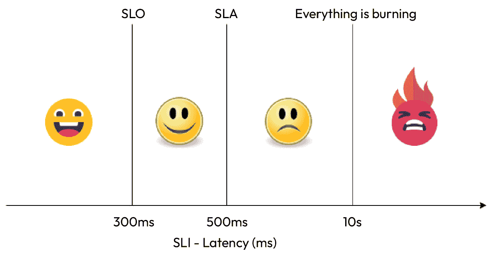

# 14

# 理解生产服务的关键绩效指标（KPI）

在前几章中，我们讨论了现代 DevOps 的核心概念——**持续集成**（**CI**）和**持续部署/交付**（**CD**）。我们还探讨了各种工具和技术，这些工具和技术可以帮助我们在组织内实现一个成熟且安全的 DevOps 渠道。在这一章中，尽管重点是理论，我们将试图理解一些运营生产应用程序时的**关键绩效指标**（**KPI**）。

在这一章中，我们将讨论以下主要话题：

+   理解可靠性的重要性

+   服务水平目标（SLO）、服务水平协议（SLA）和服务水平指标（SLI）

+   错误预算

+   恢复时间目标（RPO）和恢复点目标（RTO）

+   在生产环境中运行分布式应用程序

那么，让我们开始吧！

# 理解可靠性的重要性

开发软件是一回事，而在生产环境中运行它是另一回事。这种差距的原因在于，大多数开发团队无法在非生产环境中模拟生产条件。因此，许多漏洞只有在软件已投入生产时才被发现。大多数遇到的问题都是非功能性问题——例如，服务可能无法随着额外的流量适当扩展，分配给应用程序的资源不足，导致网站崩溃，等等。这些问题需要得到管理，以提高软件的可靠性。

为了理解软件可靠性的重要性，我们来看一个零售银行应用的例子。软件可靠性对于多个原因至关重要：

+   **用户满意度**：可靠的软件能够确保良好的用户体验。用户希望软件能够按预期工作，而当它无法按预期工作时，可能会导致沮丧、失去信任以及软件或背后组织的声誉受损。对于银行的零售客户来说，这可能意味着客户无法进行必要的交易，因此可能会在支付和收款过程中遇到麻烦，导致用户满意度下降。

+   **商业声誉**：软件故障可能会损害公司的声誉和品牌形象。对于我们的银行来说，如果问题频繁出现，客户会寻找其他选择，导致客户流失和业务损失。

+   **财务影响**：软件故障可能会非常昂贵。它们可能导致销售损失、客户支持费用，甚至在软件故障导致用户损失或财务损害时，还可能引发法律责任。对于银行应用程序来说，特别关键的是，这涉及到客户的资金。如果交易未能及时完成，可能会导致客户流失，从长远来看，会对银行造成伤害。

+   **竞争优势**：可靠的软件可以提供竞争优势。用户更倾向于选择并坚持使用一款能持续满足他们需求和期望的银行在线银行软件。

+   **生产力与效率**：在组织内部，可靠的软件对保持生产力至关重要。试想一下，客户支持和前台工作人员在这种中断中的痛苦！你还需要更多资源来管理这些问题，这会干扰操作，导致时间和资源的浪费。

+   **安全性**：可靠的软件通常更安全。攻击者可以利用不可靠软件中的漏洞和错误。对于银行来说，安全性至关重要，因为任何安全漏洞都可能导致直接的财务损失。确保可靠性是网络安全的基础部分。

+   **合规性**：在一些行业，特别是银行业，有与软件可靠性相关的监管要求。未能满足这些要求可能导致法律和财务处罚。

+   **客户信任**：信任是软件使用中的关键因素，尤其是在银行应用的情况下。用户必须相信他们的资金和数据会被安全处理，并且软件会按预期执行。软件可靠性是建立和维持这种信任的关键因素。

+   **可维护性**：可靠的软件通常更易于维护。当软件不可靠时，修复漏洞和更新变得更加困难，这可能导致可靠性不断下降的恶性循环。

+   **扩展性与增长**：随着软件使用量的增加，可靠性变得更加关键。适用于小规模用户群体的软件，在没有适当的可靠性措施的情况下，可能难以满足大规模用户群体的需求。

总结来说，软件可靠性不仅仅是一个技术问题；它对用户满意度、商业成功甚至法律和财务方面都有深远的影响。因此，投资确保软件可靠性是组织的一项明智和战略性的决策。

历史上，运行和管理生产中的软件是运维团队的工作，至今大多数组织仍然如此。运维团队由一群**系统管理员**（**SysAdmins**）组成，他们必须处理运行生产中软件的日常问题。他们通过软件实现扩展和容错，修补和升级软件，处理支持票务，保持系统运行，确保软件应用程序的顺利运行。

我们都经历过开发和运维团队之间的鸿沟，每个团队都有自己的目标、规则和优先事项。通常，他们会因为开发团队受益的东西（软件更改和快速发布）给运维团队带来挑战（稳定性和可靠性）而发生冲突。

然而，DevOps 的出现改变了这一动态。用 Andrew Shafer 和 Patrick Debois 的话说，DevOps 是一种文化和实践，旨在弥合软件开发与运维之间的差距。

从运维的角度看待 DevOps，Google 提出了**网站可靠性工程**（**SRE**）作为一种体现 DevOps 原则的方法。它鼓励共享所有权，使用共同的工具和实践，并承诺从失败中学习，以防止问题反复出现。其主要目标是开发和维护一个可靠的应用程序，同时不牺牲交付速度——这一平衡曾被认为是矛盾的（即，*更快地创建更好的软件*）。

SRE 的理念是关于如果允许软件工程师来管理生产环境，会发生什么的新思考。因此，Google 为其运维团队设计了以下方法。

对于 Google 来说，加入 SRE 团队的理想候选人应该具备两个关键特征：

+   首先，他们很快对手动任务失去兴趣，寻求将其自动化的机会。

+   其次，他们具备开发软件解决方案所需的技能，即使面临复杂的挑战。

此外，SRE（网站可靠性工程）人员应与更广泛的开发团队共享学术和智力背景。本质上，SRE 工作，传统上由运维团队承担，是由具有强大软件专业知识的工程师来完成的。这一策略依赖于这些工程师天生的倾向和能力，设计并实施自动化解决方案，从而减少对人工劳动的依赖。

从设计上讲，SRE 团队保持着强大的工程聚焦。如果没有持续的工程努力，操作工作量会急剧增加，迫使团队扩大以应对日益增长的需求。相比之下，传统的以运维为中心的团队会直接按照服务的增长来扩展。如果他们支持的服务繁荣发展，操作需求将随流量增加而激增，迫使雇佣更多人员来执行重复性工作。

为了避免这种情况，负责服务管理的团队必须将编码纳入其职责范围；否则，他们将面临被淹没的风险。

因此，Google 为分配给所有 SRE 的总“运维”工作设定了 50% 的上限，包括处理工单、值班任务和手动工作等活动。这个限制保证了 SRE 团队将大量时间用于提升服务的稳定性和功能性。虽然这个上限作为一个上界存在，但理想的结果是，随着服务逐步发展为自我维持的状态，SRE 承担的操作性工作量最小化，主要从事开发工作。Google 的目标是创建不仅仅是自动化的系统，而是固有的自我调节系统。然而，实际问题如扩展和引入新功能持续对 SRE 提出挑战。

SRE 在其方法上非常细致，依赖可衡量的指标来跟踪向特定目标的进展。例如，简单地说一个网站*运行缓慢*在工程背景下是模糊且无帮助的。然而，声明响应时间的第 95 百分位已超出**服务级目标**（**SLO**）10%则提供了精确的信息。SRE 还专注于通过自动化减少重复性任务，这些任务被称为**劳累**，以防止倦怠。现在，让我们来看看一些关键的 SRE 性能指标。

# 理解 SLI、SLO 和 SLA

在网站可靠性领域，有三个关键参数指导 SRE：**可用性指标** —— **服务级指标**（**SLI**），**可用性定义** —— SLO，以及**不可用的后果** —— **服务级协议**（**SLA**）。让我们首先详细探索 SLI。

## SLI

SLI 作为可量化的可靠性指标。谷歌将其定义为“*仔细定义的某个服务水平方面的定量衡量标准*”。常见的例子包括请求延迟、失败率和数据吞吐量。SLI 特定于用户旅程，即用户为实现特定目标而执行的一系列操作。例如，我们示例中的博客应用的用户旅程可能包括创建一篇新的博客文章。

谷歌，作为 SRE 的初创倡导者，已确定了四个黄金信号，适用于大多数用户旅程：

+   **延迟**：衡量服务响应用户请求所需的时间

+   **错误**：表示失败请求的百分比，突显了服务可靠性的问题

+   **流量**：流量代表指向你服务的需求，反映了服务的使用情况

+   **饱和度**：饱和度评估你的基础设施组件的使用情况

谷歌推荐的一种计算 SLI 的方法是通过确定良好事件与有效事件的比率：

```
SLI = (Good Events * 100) / Valid Events
```

完美的 SLI 得分为 100，意味着一切正常，而得分为 0 则表示存在广泛的问题。

一个有价值的 SLI 应该与用户体验紧密对齐。例如，较低的 SLI 值应与客户满意度下降相对应。如果这种对齐缺失，则该 SLI 可能无法提供有意义的见解或不值得衡量。

让我们通过以下图形更好地理解这一点：


图 14.1 – 好的与不好的 SLI

正如我们所看到的，CPU 使用率 SLI 并不直接反映客户满意度；换句话说，除非 CPU 使用率超过 80% 阈值，否则增加 CPU 使用率与客户满意度下降之间没有直接关系。相比之下，延迟 SLI 与客户满意度直接相关，随着延迟的增加，客户满意度下降，特别是在 300ms 和 500ms 级别之后。因此，使用延迟作为 SLI 比使用 CPU 使用率更为合适。

同时，建议将 SLI 的数量限制在一个可管理的范围内。SLI 过多会导致团队混乱，并引发大量误报。最好专注于四个或五个与客户满意度直接相关的指标。例如，与其监控 CPU 和内存使用情况，不如优先考虑请求延迟和错误率等指标。

此外，优先考虑用户旅程至关重要，应该给予对客户影响较大的旅程更高的优先级，而对客户影响较小的旅程则给予较低的优先级。例如，确保我们的博客应用中创建和更新帖子体验的流畅性，比评论和评分服务更为关键。仅凭 SLI（服务级别指标）并没有太多意义，因为它们只是可衡量的指标。我们需要为 SLI 设定目标。因此，让我们来看看 SLO（服务级别目标）。

## SLOs

谷歌对 SLO 的定义指出，它们“*为你的服务可靠性设定了目标水平*”。它们指定了考虑你的网站是否可靠所需遵循的 SLI 合规百分比。SLO 是通过结合一个或多个 SLI 来制定的。

例如，如果你有一个 SLI，要求*在过去 15 分钟内请求延迟保持低于 500 毫秒，且按 95 百分位测量*，那么一个 SLO 就需要*在 99%的时间内满足该 SLI，以实现* *99%的 SLO*。

尽管每个组织都追求 100%的可靠性，但设定 100%的 SLO 并不是一个实际的目标。拥有 100%SLO 的系统往往成本高昂、技术复杂，并且对于大多数应用程序而言，用户接受度通常不需要如此高的可靠性。

在软件服务和系统领域，追求 100%的可用性通常是错误的，因为用户无法在一个 100%可用的系统和一个 99.999%可用的系统之间感知到任何实际差异。用户与服务之间存在多个中间系统，如他们的个人电脑、家庭 Wi-Fi、**互联网服务提供商**（**ISP**）和电力网，这些系统的可用性远低于 99.999%。因此，99.999%与 100%之间的微小差异在其他不可用来源的背景噪声中变得难以察觉。因此，投入大量精力去实现最后的 0.001%的可用性，对最终用户没有明显的好处。

根据这一理解，一个问题浮现：如果 100%不是一个合适的可靠性目标，那么系统的正确可靠性目标是什么？有趣的是，这并不是一个技术性的问题，而是一个与产品相关的问题，需要考虑以下几个因素：

+   **用户满意度**：确定与用户满意度相符的可用性水平，考虑用户的典型使用模式和期望。

+   **替代方案**：评估不满意用户在产品当前可用性水平不满意时是否会寻找替代方案，以及这些替代方案的可用性。

+   **用户行为**：研究用户在不同可用性水平下对产品的使用变化，认识到用户行为可能会因可用性的波动而发生变化。

此外，一个完全可靠的应用程序不留有引入新功能的空间，因为任何新的添加都有可能干扰现有服务。因此，必须在你的 SLO 中留出一定的容错空间。

SLO 代表内部目标，需要团队和内部利益相关者（包括开发人员、产品经理、SRE 和 CTO）之间达成共识。它们需要整个组织的承诺。未能满足 SLO 不会带来显式或隐式的惩罚。

例如，如果未满足 SLO，客户不能要求赔偿，但这可能会导致组织领导层的不满。这并不意味着未能满足 SLO 就应该没有后果。未达 SLO 通常会导致较少的变化和减少的功能开发，可能表明质量下降，且更加注重开发和测试职能。

SLO 应当是现实可行的，团队应积极努力达成它们。它们应与客户体验保持一致，确保当服务符合 SLO 时，客户不会察觉到任何服务质量问题。如果性能低于定义的 SLO，可能会影响客户体验，但不会到客户提出支持工单的程度。

一些组织实施两种类型的 SLO：**可实现的**和**理想的**。可实现的 SLO 代表整个团队应该达到的目标，而理想的 SLO 设定了更高的目标，是持续改进过程的一部分。

## SLA

根据 Google 的说法，SLA 是“*与用户的正式或隐式协议，概述了满足（或未能满足）所包含 SLO 时的后果。*”

这些协议具有更为结构化的性质，代表了对客户做出的业务层级承诺，明确了如果组织未能履行 SLA 时将采取的措施。SLA 可以是显式的，也可以是隐式的。显式 SLA 涉及明确定义的后果，通常是通过服务信用的方式来补偿未达预期可靠性时的损失。隐式 SLA 则是通过评估对组织声誉的潜在损害和客户转向替代方案的可能性来进行评估。

SLA 通常设定在足以防止客户寻找替代方案的水平，因此，它们的阈值通常比 SLO 低。例如，在考虑请求延迟 SLI 时，SLO 可能定义为 *300ms* 的 SLI 值，而 SLA 可能设定为 *500ms* 的 SLI 值。这种区别源于 SLO 是与可靠性相关的内部目标，而 SLA 则是外部承诺。通过努力实现 SLO，团队自动满足 SLA，为组织提供了一层额外的保护，以防出现意外故障。

为了理解 SLIs、SLOs 和 SLAs 之间的关系，我们来看下图：



图 14.2 – SLIs、SLOs 和 SLAs

这张图展示了随着延迟水平变化，客户体验如何变化。如果我们将延迟 SLO 保持在 *300ms* 并满足它，一切正常！在 *300ms* 到 *500ms* 之间，客户开始感受到性能下降，但这不足以让他们失去冷静并开始提交支持工单。因此，将 SLA 设定为 *500ms* 是一个不错的策略。一旦超越 *500ms* 阈值，不满情绪就会出现，客户开始因服务延迟而提交支持工单。如果延迟超过 *10s*，那么这将成为运维团队的关注问题，*一切都在着火*。然而，正如我们所知，SLO 的措辞与我们在此想象的略有不同。当我们说我们有一个 *300ms* 延迟的 SLO 时，这并不意味着什么。一个现实的 SLO 对于要求 *请求延迟在过去 15 分钟内保持低于 300ms 且按 95 分位测量* 的 SLI 来说，就是要在 *x% 的时间内* 达到 SLI。那么这个 x 应该是多少呢？应该是 *99%*，还是 *95%*？我们该如何决定这个数字呢？要回答这个问题，我们需要看看 **误差预算**。

# 误差预算

根据 Liz Fong-Jones 和 Seth Vargo 的定义，误差预算表示 “*产品团队和 SRE 团队之间共享的量化衡量标准，用于平衡创新* *和稳定性。*”

简而言之，误差预算量化了在引入新功能、进行服务维护、执行例行改进、管理网络和基础设施中断以及应对突发情况时，可以承受的风险水平。通常，监控系统会测量服务的正常运行时间，而 SLO 则设定了你希望达到的目标。误差预算是这两个指标之间的差值，表示在误差预算范围内可以用于发布新版本的时间。

这正是为什么通常不会一开始就设定*100%*的 SLO。错误预算起着至关重要的作用，帮助团队在创新与可靠性之间找到平衡。错误预算的基本理念来源于 SRE 视角，即故障是系统操作中自然且预期的一部分。因此，每当将新变化引入生产环境时，总会存在破坏服务的风险。因此，较高的错误预算允许引入更多的功能：

```
Error Budget = 100% — SLO
```

例如，如果你的 SLO 是*99%*，那么你的错误预算将是*1%*。如果你将此计算在一个月内，假设*30 天/月*和*24 小时/天*，那么你将有一个*7.2 小时*的错误预算，用于维护或其他活动。对于*99.9%*的 SLO，错误预算为每月*43.2 分钟*，而对于*99.99%*的 SLO，则为每月*4.32 分钟*。你可以参考下图获取更多细节：


图 14.3 – 错误预算与 SLO 比较

这些时间段表示实际的停机时间，但如果你的服务有冗余、高可用性措施和灾难恢复计划，那么你可以将这些时长延长，因为服务仍然可以正常运行，同时你可以修补或处理某一台服务器的问题。

现在，是否想在 SLO 中继续增加*9*，还是追求一个较低的数字，取决于你的终端用户、业务重要性和可用性需求。较高的 SLO 比较低的 SLO 更昂贵，且需要更多资源。然而，有时仅仅正确架构你的应用程序就能帮助你达到更好的 SLO 目标。

现在我们已经了解了 SLO、SLI、SLA 和错误预算，让我们谈谈灾难恢复。

# 灾难恢复、RTO 和 RPO

**灾难恢复**是一项综合策略，旨在确保组织在面对突发、破坏性事件（如自然灾害、网络攻击或系统故障）时的韧性。它涉及到必要的规划、政策、程序和技术，以快速有效地恢复关键的 IT 系统、数据和运营至正常状态。实施良好的灾难恢复计划能帮助企业最大限度地减少停机时间、数据丢失和财务影响，确保业务连续性，保护声誉，并迅速从逆境中恢复，从而最终保障企业的长期成功。

每个组织在不同程度上都包含了灾难恢复。有些选择定期备份或快照，而其他组织则投资于创建生产环境的故障切换副本。尽管故障切换副本提供了更高的韧性，但也会导致基础设施成本翻倍。组织采用的灾难恢复机制选择，依赖于两个关键的 KPI —— **恢复时间目标**（**RTO**）和 **恢复点目标**（**RPO**）。

RTO 和 RPO 是灾难恢复和业务连续性规划中的关键指标。RTO 表示系统或应用程序的最大可接受停机时间，指定在发生中断后，系统应该在多长时间内恢复。它量化了服务不可用的可接受时长，并推动恢复工作的紧迫性。

另一方面，RPO 定义了在灾难发生时，最大可容忍的数据丢失量。它标示了数据必须恢复到的时间点，以确保业务连续性。实现较低的 RPO 意味着数据丢失最小化，通常通过频繁的数据备份和复制来实现。下图很好地解释了 RTO 和 RPO：


图 14.4 – RTO 和 RPO

较短的 RTO 和 RPO 需要一个更强大的灾难恢复计划，这将导致更高的基础设施和人力资源成本。因此，平衡 RTO 和 RPO 对于确保一个有韧性的 IT 基础设施至关重要。组织必须将其恢复策略与这些目标对齐，以最小化停机时间和数据丢失，从而在不可预见的中断期间保护业务运营和数据完整性。

# 运行分布式应用程序于生产环境中

到目前为止，我们一直在讨论运行应用程序于生产环境中的 KPI，并从 SRE 原则中获得灵感。现在，让我们理解如何将这些思路集中到一个地方，以便运行分布式应用程序于生产环境中。

**分布式应用程序** 或 **微服务** 与单体应用本质上不同。管理单体应用的工作是确保一个应用的所有操作方面，而随着微服务的出现，复杂性呈指数级增长。因此，我们应该采取不同的方式来处理它。

从 SRE 的角度来看，运行分布式应用程序于生产环境中意味着专注于确保应用程序的 *可靠性*、*可扩展性* 和 *性能*。以下是 SRE 如何处理这一任务：

+   **SLO**：SRE 从定义明确的 SLO 开始，SLO 规定了分布式应用程序所需的可靠性水平。SLO 指定了可接受的 *延迟*、*错误率* 和 *可用性* 水平。这些 SLO 在指导团队的工作以及判断系统是否达到了其可靠性目标方面起着至关重要的作用。

+   **SLI**：SRE 会建立 SLI，SLI 是用于衡量应用程序可靠性的可量化指标。这些指标可能包括响应时间、错误率和其他性能指标。SLI 提供了一种具体的方法来评估应用程序是否达到了其 SLO。

+   **错误预算**：错误预算是 SRE 中的一个关键概念。它们表示在违反 SLO（服务级别目标）之前，允许发生的停机或错误的最大数量。SRE 通过错误预算来平衡可靠性和创新。如果错误预算用尽，可能需要将重点放在稳定性和可靠性上，而不是推出新特性。

+   **监控和警报**：SRE 实施强大的监控和警报系统，持续跟踪应用程序的性能和健康状况。他们根据服务级指标（SLIs）和服务级目标（SLOs）设置警报，使他们能够主动响应事件或性能水平的偏差。在分布式应用领域，使用如**Istio**或**Linkerd**的服务网格可以提供帮助。它们帮助你通过单一视图来可视化应用程序的各个部分，并让你轻松监控应用程序并发出警报。

+   **容量规划**：SRE 确保支撑分布式应用程序的基础设施能够应对预期的负载和流量。他们进行容量规划，以便根据需要扩展资源，防止流量激增时出现性能瓶颈。借助现代公有云平台，自动化流量的可扩展性变得更加容易实现，尤其是在分布式应用的情况下。

+   **自动化修复**：自动化是 SRE 实践的基石。SRE 开发自动化系统用于事件响应和修复。这包括*自动扩展*、*自愈机制*和*自动回滚程序*，以最小化停机时间。

+   **混沌工程**：SRE 经常采用混沌工程实践，故意将受控故障引入系统。这有助于识别分布式应用中的弱点和漏洞，从而提前采取措施减轻潜在问题。一些最流行的混沌工程工具包括 Chaos Monkey、Gremlin、Chaos Toolkit、Chaos Blade、Pumba、ToxiProxy 和 Chaos Mesh。

+   **值班和事件管理**：SRE（站点可靠性工程师）保持值班轮换，以确保全天候覆盖。他们遵循明确的事件管理流程，迅速解决问题，并从事件中吸取经验教训，防止问题的重复发生。大多数 SRE 开发积压来自于此过程，因为他们从失败中学习，因此会自动化可重复的任务。

+   **持续改进**：SRE 是一种持续改进的文化。SRE 团队定期进行**事件后复盘**（**PIRs**）和**根本原因分析**（**RCAs**），以识别改进的领域。从事件中学到的经验教训被用来优化 SLOs，并提高应用程序的整体可靠性。

+   **文档编写和知识共享**：SRE 编写*最佳实践*、*运行手册*和*操作流程*。他们强调跨团队的知识共享，确保专业知识不被孤立，并且所有团队成员都能够有效地管理和排查分布式应用程序的问题。他们还致力于自动化运行手册，以确保手动过程保持在最低限度。

总结来说，SRE 在生产环境中运行分布式应用程序的方法专注于 *可靠性*、*自动化* 和 *持续改进*。它设定明确的目标，建立度量标准，并采用主动监控和事件管理实践，向最终用户提供高度可用和高性能的服务。

# 总结

本章介绍了 SRE 和在生产环境中运行服务的关键绩效指标（KPI）。我们从理解软件可靠性开始，探讨了如何利用 SRE 管理生产环境中的应用程序。我们讨论了 SRE 的三个关键参数：SLI、SLO 和 SLA。我们还探索了错误预算及其在系统变更引入中的重要性。接着，我们讲解了软件灾难恢复、RPO 和 RTO 以及它们如何定义我们的灾难恢复措施的复杂性或成本。最后，我们了解了 DevOps 或 SRE 如何使用这些概念来管理生产环境中的分布式应用。

在下一章中，我们将把所学的知识应用于实际，探索如何使用名为 Istio 的服务网格来管理所有这些方面。

# 问题

回答以下问题，测试您对本章内容的掌握情况：

1.  以下哪项是 SLI 的良好示例？

    A. 响应时间不应超过 300 毫秒。

    B. 15 分钟窗口中的响应时间的第 95 百分位应不超过 300 毫秒。

    C. 99% 的所有请求应在 300 毫秒内响应。

    D. 故障数量不应超过 1%。

1.  一个成熟的组织应当有 100% 的 SLO。（对/错）

1.  SLO 与任何客户发起的惩罚性措施无关。（对/错）

1.  在决定 SLO 时，您应考虑以下哪些因素？（选择三项）

    A. 用户满意度

    B. 替代方案

    C. 用户行为

    D. 系统容量

1.  SLA 通常保持比 SLO 更严格的 SLI 值。（对/错）

1.  在定义 SLI 时，您应考虑以下哪些因素？

    A. CPU、内存和磁盘利用率

    B. 延迟、错误、流量和饱和度

    C. 利用率、容量和规模

1.  1% 的错误预算每月提供多少停机时间？

    A. 72 小时

    B. 43.2 分钟

    C. 7.2 小时

    D. 4.32 分钟

1.  SRE 是一名从事运维的开发人员。（对/错）

1.  SRE 应分配多少最小时间用于开发工作？

    A. 30%

    B. 40%

    C. 50%

    D. 60%

# 答案

以下是本章问题的答案：

1.  B

1.  错

1.  对

1.  A, B, C

1.  错

1.  B

1.  C

1.  对

1.  C
