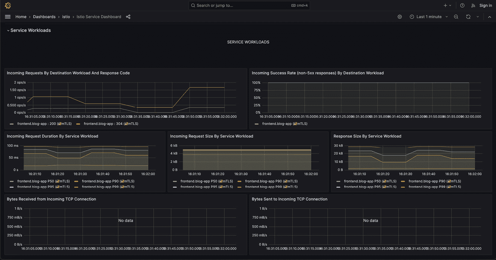

# 15

# 使用 Istio 实施流量管理、安全性和可观察性

在上一章中，我们讨论了**站点可靠性工程**（**SRE**）及其如何通过 DevOps 实践帮助管理生产环境。在本章中，我们将深入探讨一种名为 Istio 的服务网格技术，它将帮助我们实施 SRE 实践，并在生产中更好地管理我们的应用。

在本章中，我们将讨论以下主要主题：

+   重新审视博客应用

+   服务网格简介

+   Istio 简介

+   了解 Istio 架构

+   安装 Istio

+   使用 Istio Ingress 来允许流量

+   使用 Istio 保护你的微服务

+   使用 Istio 管理流量

+   使用 Istio 观察流量并设置告警

# 技术要求

本章中，我们将启动一个基于云的 Kubernetes 集群——**Google Kubernetes Engine**（**GKE**），用于练习。在撰写本文时，**Google Cloud Platform**（**GCP**）提供了一个为期 90 天、价值 300 美元的免费试用，你可以在[`console.cloud.google.com/`](https://console.cloud.google.com/)注册一个。

你还需要克隆以下 GitHub 仓库以完成一些练习：[`github.com/PacktPublishing/Modern-DevOps-Practices-2e`](https://github.com/PacktPublishing/Modern-DevOps-Practices-2e)。

你可以使用 GCP 提供的 Cloud Shell 来完成本章内容。进入 Cloud Shell 并启动一个新的会话。运行以下命令将仓库克隆到你的主目录中，以便访问所需资源：

```
$ git clone https://github.com/PacktPublishing/Modern-DevOps-Practices-2e.git \
modern-devops
```

我们还需要设置项目 ID，并启用一些我们将在本章中使用的 GCP API。为此，运行以下命令：

```
$ PROJECT_ID=<YOUR_PROJECT_ID>
$ gcloud services enable iam.googleapis.com \
 container.googleapis.com \
 binaryauthorization.googleapis.com \
 containeranalysis.googleapis.com \
 secretmanager.googleapis.com \
 cloudresourcemanager.googleapis.com \
 cloudkms.googleapis.com
```

如果你没有按照前几章的内容进行学习，想要快速开始，可以继续阅读下一个部分，*设置基础环境*，不过我强烈建议你先阅读前几章，了解整个流程。如果你已经跟着前几章的实操练习走了，那么可以跳过这一部分。

## 设置基础环境

为了确保与前几章的连续性，我们首先创建一个服务账户，用于 Terraform 与我们的 GCP 项目进行交互：

```
$ gcloud iam service-accounts create terraform \
--description="Service Account for terraform" --display-name="Terraform"
$ gcloud projects add-iam-policy-binding $PROJECT_ID \
--member="serviceAccount:terraform@$PROJECT_ID.iam.gserviceaccount.com" \
--role="roles/editor"
$ gcloud iam service-accounts keys create key-file \
--iam-account=terraform@$PROJECT_ID.iam.gserviceaccount.com
```

你会看到一个名为`key-file`的文件已经在你的工作目录中创建。现在，在 GitHub 上创建一个名为`mdo-environments`的新仓库，并添加一个`README.md`文件，重新命名`main`分支为`prod`，并使用 GitHub 创建一个名为`dev`的新分支。导航至`https://github.com/<your_github_user>/mdo-environments/settings/secrets/actions/new`，创建一个名为`GCP_CREDENTIALS`的密钥。在**values**字段中，打印`key-file`文件，复制其内容并粘贴到 GitHub 密钥的**values**字段中。

接下来，创建另一个密钥`PROJECT_ID`，并在**values**字段中指定你的 GCP 项目 ID。

接下来，我们需要为 Terraform 创建一个**GCS bucket**作为远程后端。为此，运行以下命令：

```
$ gsutil mb gs://tf-state-mdo-terraform-${PROJECT_ID}
```

接下来，我们需要设置我们的 Secrets Manager。让我们创建一个名为 `external-secrets` 的密钥，在其中传递 MongoDB 的凭证，格式为 JSON。为此，请运行以下命令：

```
$ echo -ne '{"MONGO_INITDB_ROOT_USERNAME": "root", \
"MONGO_INITDB_ROOT_PASSWORD": "itsasecret"}' | \
gcloud secrets create external-secrets --locations=us-central1 \
--replication-policy=user-managed --data-file=-
Created version [1] of the secret [external-secrets].
```

我们需要创建 `Secret` 资源，它将与 GCP 交互以获取存储的密钥。首先，我们需要使用以下命令创建一个 GCP 服务账户与 Secrets Manager 进行交互：

```
$ cd ~
$ gcloud iam service-accounts create external-secrets
```

由于我们遵循最小权限原则，我们将添加以下角色绑定，仅提供对 `external-secrets` 密钥的访问，具体如下：

```
$ gcloud secrets add-iam-policy-binding external-secrets \
--member "serviceAccount:external-secrets@$PROJECT_ID.iam.gserviceaccount.com" \
--role "roles/secretmanager.secretAccessor"
```

现在，让我们使用以下命令生成服务账户密钥文件：

```
$ gcloud iam service-accounts keys create key.json \
--iam-account=external-secrets@$PROJECT_ID.iam.gserviceaccount.com
```

接下来，将 `key.json` 文件的内容复制到一个新的 GitHub Actions 密钥 `GCP_SM_CREDENTIALS` 中。

我们还需要创建以下 GitHub Actions 密钥，以使二进制授权生效：

```
ATTESTOR_NAME=quality-assurance-attestor
KMS_KEY_LOCATION=us-central1
KMS_KEYRING_NAME=qa-attestor-keyring
KMS_KEY_NAME=quality-assurance-attestor-key
KMS_KEY_VERSION=1
```

由于工作流在结束时会自动提交拉取请求，我们需要定义一个 GitHub token。这个 token 允许工作流在创建拉取请求时代表当前用户执行操作。以下是步骤：

1.  访问 [`github.com/settings/personal-access-tokens/new`](https://github.com/settings/personal-access-tokens/new)。

1.  为 `mdo-environments` 仓库创建一个具有“仓库”访问权限的新 token，授予它 `读写` 拉取请求权限。这种方法符合最小权限原则，提供更精细的控制。

1.  创建 token 后，复制它。

1.  现在，创建一个名为 `GH_TOKEN` 的 GitHub Actions 密钥，并将复制的 token 作为值粘贴进去。

现在所有先决条件都已满足，我们可以克隆我们的仓库并复制基础代码。运行以下命令进行此操作：

```
$ cd ~ && git clone git@github.com:<your_github_user>/mdo-environments.git
$ cd mdo-environments/
$ git checkout dev
$ cp -r ~/modern-devops/ch15/baseline/* .
$ cp -r ~/modern-devops/ch15/baseline/.github .
```

现在我们处于基础阶段，让我们进一步了解本章将要部署和管理的示例博客应用。

# 重温博客应用

既然我们之前讨论过博客应用，那么让我们再看一遍它的服务及其交互：


图 15.1 – 博客应用及其服务和交互

到目前为止，我们已经使用 GitHub Actions 为构建、测试和推送博客应用微服务容器创建了 CI 和 CD 管道，并通过 Argo CD 在 GKE 集群中部署它们。

正如你可能记得的，我们为确保应用的顺利运行创建了以下资源：

+   **MongoDB**：我们部署了一个启用了身份验证的 MongoDB 数据库，并使用 root 凭证。凭证通过来自 Kubernetes **Secret** 资源的环境变量注入。为了持久化数据库数据，我们创建了一个挂载到容器的 **PersistentVolume**，并使用 **PersistentVolumeClaim** 动态供应它。由于容器是有状态的，我们使用 **StatefulSet** 来管理它，并因此使用无头 **Service** 来公开数据库。

+   **帖子、评论、评分和用户**：*帖子*、*评论*、*评分*和*用户*微服务通过根凭证与 MongoDB 交互，这些凭证通过来自同一**Secret**的环境变量注入。我们使用各自的**Deployment**资源部署它们，并通过单独的**ClusterIP Services**暴露它们。

+   **前端**：*前端*微服务不需要与 MongoDB 交互，因此没有与 Secret 资源的交互。我们也使用**Deployment**资源部署了该服务。由于我们希望将该服务暴露到互联网，我们为其创建了一个**LoadBalancer Service**。

我们可以通过以下图示来总结它们：


图 15.2 – 博客应用 – Kubernetes 资源和交互

现在我们了解了应用的结构，接下来我们了解一下服务网格是什么以及它在这个用例中的优势。

# 服务网格介绍

想象一下你处在一个繁忙的城市中，城市里有着复杂的道路和高速公路网络。你正在驾驶汽车，从城市的一侧开到另一侧。在这种情况下，你会接触到以下实体：

+   **你的汽车**：你的汽车代表计算机系统中的一个独立服务或应用。它有一个特定的目的，就像软件架构中的微服务或应用一样。

+   **道路和高速公路**：道路和高速公路就像是你应用中不同服务之间的网络连接和通信路径。服务需要互相交互和通信来执行各种功能，就像车辆需要道路从一个地方开到另一个地方。

+   **交通灯和标志**：交通灯、标志和交通规则帮助管理交通流量，确保车辆（服务）能够安全、高效地在城市中行驶。这些就像服务网格中的规则、协议和工具，调节服务之间的通信和数据交换。

+   **交通控制中心**：可以把交通控制中心看作是服务网格。它是一个集中式的系统，监控和管理城市的交通流量。类似地，服务网格是一个集中式基础设施，监督并促进服务之间的通信，确保它们能够可靠、安全地通信。

+   **流量监控与优化**：交通控制中心确保安全通行并能够优化交通流量。它可以重新规划车辆路线，避免拥堵或事故。在服务网格的上下文中，它能够优化数据和请求在服务之间的流动，确保高效和弹性的通信。

+   **安全性和可靠性**：在城市中，交通控制中心有助于防止事故，确保每个人都能安全到达目的地。同样，服务网格通过提供负载均衡、安全性和容错等功能，提高计算机系统的安全性和可靠性。

就像交通控制中心让你在复杂的城市中更容易、安全地出行一样，计算机系统中的服务网格简化并保护了不同服务之间的通信，确保数据和请求能够顺畅、可靠、安全地流动。

容器及其管理平台，如 Kubernetes，简化了我们处理微服务的方式。容器技术的引入在推广这一概念方面起到了关键作用，它使得各个应用组件能够作为独立的实体执行和扩展，每个组件都有一个隔离的运行环境。

尽管采用微服务架构提供了加速开发、增强系统稳定性、简化测试和能够独立扩展应用各个部分等优势，但它也有其挑战。管理微服务可能是一项复杂的工作。你不再处理单一的单体应用，而是拥有多个动态组件，每个组件都承担特定的功能。

在大规模应用的背景下，看到数百个微服务相互交互并不罕见，这可能会迅速变得令人不知所措。你的安全和运维团队可能会提出以下主要问题：

+   确保微服务之间的安全通信。你需要保护许多小服务，而不是保护一个单体应用。

+   在出现问题时，如何隔离一个有问题的微服务。

+   在全面发布前，以有限比例的流量进行部署测试，以建立信任。

+   整合现在分布在多个来源的应用日志。

+   监控服务的健康状况变得更加复杂，因为应用由许多组件组成。

虽然 Kubernetes 有效地解决了一些管理问题，但它主要作为容器编排平台，并且在这一角色中表现出色。然而，它并没有固有地解决微服务架构的所有复杂性，因为这些架构需要特定的解决方案。Kubernetes 本身并不提供强大的服务管理功能。

默认情况下，Kubernetes 容器之间的通信缺乏安全措施，强制在 Pod 之间使用 TLS 需要管理大量的 TLS 证书。Pod 之间的身份和访问管理也不是开箱即用的。

虽然像 Kubernetes 网络策略这样的工具可以用于在 Pod 之间实施防火墙，但它们在第 3 层而非第 7 层运作，而现代防火墙正是基于第 7 层操作。这意味着你可以识别流量的来源，但无法检查数据包，从而做出基于元数据的决策，例如基于 HTTP 头进行路由。

尽管 Kubernetes 提供了部署 Pod、进行 A/B 测试和金丝雀发布的方法，但这些过程通常涉及容器副本的扩展。例如，部署一个新版本的微服务并将 10% 的流量导向它，至少需要 10 个容器：9 个用于旧版本，1 个用于新版本。Kubernetes 在 Pod 之间平均分配流量，而没有智能流量拆分。

每个 Kubernetes 容器在 Pod 内保持独立的日志记录，因此需要一个定制的解决方案来捕获和汇总日志。

虽然 Kubernetes 仪表盘提供了监控 Pod 和检查其健康状况等功能，但它无法提供关于组件如何交互、Pod 之间流量分配情况或构成应用程序的容器链的信息。无法追踪流量在 Kubernetes Pod 中的流动意味着你无法确定请求在链中遇到故障的位置。

为了全面应对这些挑战，像 Istio 这样的服务网格技术可以提供极大的帮助。它可以有效应对 Kubernetes 中微服务管理的复杂性，并为安全通信、智能流量管理、监控等提供解决方案。让我们通过简要介绍来了解 Istio 服务网格是什么。

# Istio 简介

Istio 是一种服务网格技术，旨在简化服务连接、安全性、治理和监控。

在微服务应用的背景下，每个微服务独立运行，使用容器，从而产生了一个复杂的交互网络。这就是服务网格发挥作用的地方，它简化了这些交互的发现、管理和控制，通常通过旁车代理来实现。让我一步一步为你解析。

想象一个标准的 Kubernetes 应用，由前端和后端 Pod 组成。Kubernetes 提供了使用 Kubernetes 服务和 CoreDNS 进行 Pod 之间的内建服务发现。因此，你可以使用服务名称将流量从一个 Pod 引导到另一个 Pod。然而，你对这些交互和运行时流量管理的控制将有限。

Istio 通过将旁车容器注入到 Pod 中，充当代理。你的容器通过这个代理与其他容器进行通信。这种架构使得所有请求都通过代理流动，从而使你能够控制流量并收集数据以供进一步分析。此外，Istio 提供了加密 Pod 之间通信的手段，并通过统一的控制平面实施身份和访问管理。

由于这种架构，Istio 拥有一系列核心功能，能够提升微服务环境中的流量管理、安全性和可观测性。

## 流量管理

Istio 通过利用 sidecar 代理（通常称为 envoy 代理）以及**入口**和**出口网关**，有效地管理流量。借助这些组件，Istio 使你能够塑造流量并定义服务交互规则。这包括实现诸如**超时**、**重试**、**熔断器**等功能，所有这些都可以通过控制面中的配置进行设置。

这些功能为智能实践提供了可能，比如**A/B 测试**、**金丝雀部署**和**分阶段发布**，以及**基于百分比的流量划分**。你可以无缝执行渐进式发布，从现有版本（**Blue**）过渡到新版本（**Green**），所有操作都可以通过用户友好的控制界面完成。

此外，Istio 允许你在生产环境中进行操作测试，通过**实时流量镜像**来测试实例。这使你能够收集实时数据并在问题影响应用程序之前识别潜在的生产问题。此外，你还可以基于**地理位置或用户档案**等因素，将请求路由到不同语言版本的微服务。

## 安全性

Istio 重视安全性，通过 envoy 代理保护你的微服务，并通过互信 TLS 在 pods 之间建立身份访问管理。这是一种强大的防御机制，能够防止中间人攻击，且在 pods 之间提供开箱即用的**流量加密**。这种互认证确保只有受信任的前端可以连接到后台，从而建立强大的信任关系。因此，即使其中一个 pod 被攻破，它也无法威胁到应用程序的其他部分。Istio 进一步增强了安全性，提供了**细粒度的访问控制策略**，并引入了目前 Kubernetes 中缺乏的审计工具，从而提升了集群的整体安全性。

## 可观察性

由于 envoy sidecar 的存在，Istio 能够敏锐地感知流经 pod 的流量，从而使你能够从服务中收集至关重要的遥测数据。这些丰富的数据有助于深入了解服务行为，并为应用程序未来的优化提供了一个窗口。此外，Istio 还整合了应用程序日志，并通过多个微服务实现**流量追踪**。这些功能使你能够更迅速地识别和解决问题，帮助你隔离有问题的服务并加快调试过程。

## 面向开发者的友好性

Istio 最显著的特点是，它能够减轻开发者在实现过程中管理安全性和操作复杂性的负担。

Istio 对 Kubernetes 的深刻理解使得开发者可以继续像标准 Kubernetes 部署那样构建应用程序。Istio 会无缝且自动地将 sidecar 容器注入到 pods 中，免去开发者对这些技术细节的担忧。

一旦这些边车容器被集成，运维和安全团队就可以介入，执行与流量管理、安全性及应用程序整体运营相关的政策。这为所有相关方创造了互利的局面。

Istio 使安全和运维团队能够高效地监管微服务应用程序，而不妨碍开发团队的生产力。这种协作方法确保组织内的每个团队都能保持其专业焦点，并有效地为应用程序的成功做出贡献。现在我们已经了解了 Istio，接下来我们将看看它的架构。

# 理解 Istio 架构

Istio 通过两个基本组件简化了微服务的管理：

+   **数据平面**：数据平面由 Istio 注入到微服务中的边车 envoy 代理组成。这些代理承担着在不同服务之间路由流量的关键角色，并收集重要的遥测数据，以便于监控和分析。

+   **控制平面**：控制平面充当指挥中心，指示数据平面如何有效地路由流量。它还负责配置细节的存储和管理，便于管理员与边车代理交互并控制 Istio 服务网格。本质上，控制平面是 Istio 的智能和决策中心。

类似地，Istio 管理两种类型的流量：

+   **数据平面流量**：这种流量由微服务之间交换的核心业务相关数据组成。它涵盖了应用程序处理的实际交互和事务。

+   **控制平面流量**：相反，控制平面流量由 Istio 组件之间的消息和通信组成，主要负责管理服务网格的行为。它充当着控制机制，协调微服务架构中的路由、安全性和整体功能。

下图详细描述了 Istio 架构：


图 15.3 – Istio 架构

正如我们在前面的图示中看到的，控制平面和数据平面是两个不同的部分，接下来我们将深入了解它们。

## 控制平面架构

Istio 将控制平面作为一个单独的 **istiod** 组件进行部署。Istio 控制平面，或称 istiod，包含多个关键组件，每个组件在管理服务网格中扮演着独特的角色。

### Pilot

**Pilot** 作为服务网格的中央控制中心，使用 Envoy API 与 envoy sidecar 通信，并将 Istio 清单中指定的高级规则转换为 envoy 配置。Pilot 支持服务发现、智能流量管理和路由功能。它使您能够实施 A/B 测试、蓝绿部署、金丝雀发布等实践。此外，Pilot 通过配置 sidecar 处理超时、重试和断路等任务，增强了服务网格的弹性。它的一个显著特点是提供 Istio 配置与底层基础设施之间的桥梁，使 Istio 能够在多种平台上运行，如 Kubernetes、**Nomad** 和 **Consul**。无论平台如何，Pilot 都能确保一致的流量管理。

### Citadel

**Citadel** 专注于在您的服务网格内进行身份和访问管理，促进 Kubernetes pod 之间的安全通信。它通过确保加密通信来保护您的 pod，即使您的开发人员设计的组件使用了不安全的 TCP 连接。Citadel 通过管理证书的复杂性简化了相互 TLS 的实现。它提供用户身份验证、凭证管理、证书处理和流量加密，确保 pod 在必要时能够安全地相互验证。

### Galley

**Galley** 负责服务网格中的基本配置任务。它验证、处理并分发配置更改到 Istio 控制平面。例如，当您应用新的策略时，Galley 会摄取该配置，验证其准确性，处理并为目标组件准备，最后无缝地在服务网格中分发。简而言之，Galley 作为 Istio 控制平面与底层 API 之间的接口，促进了服务网格的顺利管理。

现在，让我们深入了解数据平面架构。

## 数据平面架构

Istio 的数据平面组件由 **envoy 代理**、**入口网关** 和 **出口网关** 组成。

### Envoy 代理

Envoy 代理在启用服务网格的各个方面中发挥着至关重要的作用。这些 **第 7 层** 代理能够根据它们处理的消息内容做出重要决策，并且它们是唯一直接与您的业务流量交互的组件。以下是这些 envoy 代理如何贡献于 Istio 的功能：

+   **流量控制**：它们提供对服务网格内流量流动的细粒度控制，允许您为各种类型的流量定义路由规则，包括 **HTTP**、**TCP**、**WebSockets** 和 **gRPC**。

+   **安全性和认证**：Envoy 代理执行**身份和访问管理**，确保只有经过授权的 pod 可以相互交互。它们实现**相互 TLS**和**流量加密**，以防止**中间人攻击**，并提供如速率限制等特性，以防止超出预算的成本和**拒绝服务攻击**。

+   **网络弹性**：它们通过支持**重试**、**故障转移**、**断路器**和**故障注入**等特性来增强网络弹性，保持服务的可靠性和健壮性。

接下来，我们来看看入站和出站网关。

### 入站和出站网关

在 Istio 中，入站网关是一组一个或多个 envoy 代理，Pilot 在其部署时动态配置这些代理。这些 envoy 代理在控制和路由外部流量进入您的服务网格中至关重要，确保流量根据定义的路由规则和策略正确地指向相关服务。这种动态配置使得 Istio 能够有效地管理和保护外部流量流动，而无需大量的人工干预，确保您的应用程序可以在服务网格内高效、安全地运行。

出站网关与入站网关相似，但它们处理的是出站流量。为了更好地理解这一点，我们可以参考*图 15.3*，了解**服务 A**和**服务 B**之间的流量流向。

在这个架构中，服务网格中的流量遵循一个结构化的路径，通过**入站**、微服务（**服务 A**和**服务 B**）以及**出站**，确保高效的路由和安全措施。让我们分解一下流量包在服务网格中的流动过程。

#### 入站

流量通过入站资源进入服务网格，入站资源本质上是一个 envoy 代理集群。Pilot 在部署时配置这些 envoy 代理。由于基于 Kubernetes 服务端点的配置，入站代理了解其后端服务。入站代理执行健康检查、负载均衡，并基于负载、数据包、配额和流量平衡等指标做出智能路由决策。

#### 服务 A

一旦入站网关将流量路由到一个 pod，它会遇到服务 A pod 的边车代理容器，而不是实际的微服务容器。envoy 代理和微服务容器共享 pod 内的同一网络命名空间，并且具有相同的 IP 地址和 IP 表规则。envoy 代理控制 pod，处理通过它的所有流量。该代理与 Citadel 进行交互，执行策略，检查流量是否需要加密，并与后端 pod 建立 TLS 连接。

#### 服务 B

服务 A 的加密数据包被发送到服务 B，服务 B 会遵循类似的步骤。服务 B 的代理通过与源代理进行 TLS 握手来验证发送者的身份。在建立信任后，数据包被转发到服务 B 的容器，继续流向出口层。

#### 出口

出口资源管理着来自网格的出站流量。出口定义了哪些流量可以离开网格，并使用 Pilot 进行配置，类似于入口层。出口资源使得可以实施限制出站流量只流向必要服务的策略。

#### 遥测数据收集

在这些步骤中，代理收集来自流量的遥测数据。这些遥测数据会发送到**Prometheus**进行存储和分析。这些数据可以在**Grafana**中可视化，提供对服务网格行为的洞察。遥测数据也可以发送到外部工具，如**ELK**，以便对收集的指标进行更深入的分析和机器学习应用。

这一结构化流程确保流量在服务网格中安全高效地流动，同时为监控、分析和决策过程提供宝贵的洞察。

现在我们已经理解了 Istio 的架构和特点，接下来让我们看看如何安装它。

# 安装 Istio

安装 Istio 的一般方式是通过提供的链接下载 Istio 并运行一个 shell，这将把 Istio 安装到我们的系统中，包括**istioctl**组件。然后，我们需要使用**istioctl**在 Kubernetes 集群中安装 Istio。然而，由于我们使用的是 GitOps，我们将使用 GitOps 原则来安装它。Istio 还提供了另一种安装方式——使用 Helm。由于我们知道 Argo CD 支持 Helm，因此我们将使用它。

因此，我们将创建新的 Argo CD 应用程序来部署它。我们将为`istio-base`创建一个 Argo CD 应用程序：

```
apiVersion: argoproj.io/v1alpha1
kind: Application
metadata:
  name: istio-base
  namespace: argo
spec:
  project: default
  source:
    chart: base
    repoURL: https://istio-release.storage.googleapis.com/charts
    targetRevision: 1.19.1
    helm:
      releaseName: istio-base
  destination:
    server: "https://kubernetes.default.svc"
    namespace: istio-system
  syncPolicy:
    syncOptions:
    - CreateNamespace=true
    automated:
      selfHeal: true
```

如我们所见，它将从[`istio-release.storage.googleapis.com/charts`](https://istio-release.storage.googleapis.com/charts)部署`istio-base`的`v1.19.1` helm 图表到 Kubernetes 集群的`istio-system`命名空间。类似地，我们将使用以下配置将`istiod`部署到`istio-system`命名空间：

```
...
  source:
    chart: istiod
    repoURL: https://istio-release.storage.googleapis.com/charts
    targetRevision: 1.19.1
    helm:
      releaseName: istiod
  destination:
    server: "https://kubernetes.default.svc"
    namespace: istio-system
...
```

最后，我们将使用以下配置在`istio-ingress`命名空间中安装`istio-ingress`组件：

```
...
  source:
    chart: gateway
    repoURL: https://istio-release.storage.googleapis.com/charts
    targetRevision: 1.19.1
    helm:
      releaseName: istio-ingress
  destination:
    server: "https://kubernetes.default.svc"
    namespace: istio-ingress
...
```

我们还将在 Terraform 中定义配置，以便我们可以使用基于推送的 GitOps 自动创建我们的应用。因此，我们将以下内容附加到`app.tf`文件中：

```
data "kubectl_file_documents" "istio" {
    content = file("../manifests/argocd/istio.yaml")
}
resource "kubectl_manifest" "istio" {
  depends_on = [
    kubectl_manifest.gcpsm-secrets,
  ]
  for_each  = data.kubectl_file_documents.istio.manifests
  yaml_body = each.value
  override_namespace = "argocd"
}
```

现在，我们可以提交并推送这些文件到我们的远程仓库，并等待 Argo CD 使用以下命令进行变更协调：

```
$ cd ~
$ cp -a ~/modern-devops/ch15/install-istio/app.tf \
 ~/mdo-environments/terraform/app.tf
$ cp -a ~/modern-devops/ch15/install-istio/istio.yaml \
 ~/mdo-environments/manifests/argocd/istio.yaml
$ git add --all
$ git commit -m "Install istio"
$ git push
```

一旦我们推送代码，我们将看到 GitHub Actions 工作流已触发。要访问该工作流，请前往`https://github.com/<your_github_user>/mdo-environments/actions`。不久后，工作流将应用配置并创建 Kubernetes 集群，部署 Argo CD、外部机密、我们的 Blog 应用和 Istio。

一旦工作流成功执行，我们必须访问 Argo Web UI。为此，我们需要使用 GKE 集群进行身份验证。执行以下命令来完成身份验证：

```
$ gcloud container clusters get-credentials \
 mdo-cluster-dev --zone us-central1-a --project $PROJECT_ID
```

要使用 Argo CD Web UI，您需要`argo-server`服务的外部 IP 地址。要获取该地址，请运行以下命令：

```
$ kubectl get svc argocd-server -n argocd
NAME          TYPE        EXTERNAL-IP  PORTS          AGE  
argocd-server LoadBalaner 34.122.51.25 80/TCP,443/TCP 6m15s
```

现在，我们知道可以通过`https://34.122.51.25/`访问 Argo CD。

接下来，我们将运行以下命令来重置管理员密码：

```
$ kubectl patch secret argocd-secret -n argocd \
-p '{"data": {"admin.password": null, "admin.passwordMtime": null}}'
$ kubectl scale deployment argocd-server --replicas 0 -n argocd
$ kubectl scale deployment argocd-server --replicas 1 -n argocd
```

现在，等待 2 分钟让新凭证生成。之后，执行以下命令以获取密码：

```
$ kubectl -n argocd get secret argocd-initial-admin-secret \
 -o jsonpath="{.data.password}" | base64 -d && echo
```

现在我们已经有了凭证，可以登录了。我们将看到以下页面：


图 15.4 – Argo CD Web UI – 主页

如我们所见，Istio 应用程序已启动并运行。尽管 Istio 已经安装并运行，但除非我们要求 Istio 注入侧车，否则侧车不会被注入。接下来我们会讲解这个部分。

## 启用自动侧车注入

由于 envoy 侧车是 Istio 功能背后的关键技术，它们必须添加到现有的 Pod 中，以便 Istio 能够管理它们。更新每个 Pod 的配置以包含这些侧车可能具有挑战性。为了解决这个问题，Istio 提供了解决方案，通过启用这些侧车的自动注入功能。要在命名空间上启用自动侧车注入，我们必须添加一个标签——即`istio-injection: enabled`。为此，我们将修改`blog-app.yaml`文件，并将标签添加到命名空间资源中：

```
apiVersion: v1
 kind: Namespace
 metadata:
   name: blog-app
   labels:
     istio-injection: enabled
...
```

现在，我们可以将此资源提交到 Git 并使用以下命令将更改推送到远程：

```
$ cd ~
$ cp -a ~/modern-devops/ch15/install-istio/blog-app.yaml \
 ~/mdo-environments/manifests/blog-app/blog-app.yaml
$ git add --all
$ git commit -m "Enable sidecar injection"
$ git push
```

在下一次 Argo CD 同步中，我们将很快找到附加到命名空间的标签。标签应用后，我们需要重新启动部署和有状态集，此时新 Pod 将启动并带有注入的侧车。使用以下命令进行操作：

```
$ kubectl -n blog-app rollout restart deploy frontend
$ kubectl -n blog-app rollout restart deploy posts
$ kubectl -n blog-app rollout restart deploy users
$ kubectl -n blog-app rollout restart deploy reviews
$ kubectl -n blog-app rollout restart deploy ratings
$ kubectl -n blog-app rollout restart statefulset mongodb
```

现在，让我们使用以下命令列出`blog-app`命名空间中的 Pod：

```
$ kubectl get pod -n blog-app 
NAME                      READY   STATUS    RESTARTS   AGE
frontend-759f58f579-gqkp9 2/2     Running   0          109s
mongodb-0                 2/2     Running   0          98s
posts-5cdcb5cdf6-6wjrr    2/2     Running   0          108s
ratings-9888d6fb5-j27l2   2/2     Running   0          105s
reviews-55ccb7fbd9-vw72m  2/2     Running   0          106s
users-5dbd56c4c5-stgjp    2/2     Running   0          107s
```

如我们所见，Pod 现在显示两个容器，而不是一个。额外的容器是 envoy 侧车。Istio 的安装和设置已完成。

现在，我们的应用已经注入了 Istio 侧车，我们可以使用 Istio 入口控制器来允许流量访问我们的应用，当前该应用通过负载均衡服务暴露。

# 使用 Istio 入口控制器来允许流量

我们需要创建一个 Blog 应用的入口网关，将我们的应用与 Istio 入口网关关联起来。这是配置我们的应用通过 Istio 入口网关路由流量所必需的，因为我们希望利用 Istio 的流量管理和安全功能。

Istio 在安装过程中会部署 Istio 入口网关，并且默认将其暴露在负载均衡器上。要确定负载均衡器的 IP 地址和端口，你可以运行以下命令：

```
$ kubectl get svc istio-ingress -n istio-ingress
NAME           EXTERNAL-IP    PORT(S)       
istio-ingress  34.30.247.164  80:30950/TCP,443:32100/TCP
```

如我们所见，Istio 在负载均衡器上暴露了多个端口，而我们的应用程序需要运行在端口 80，因此我们可以使用`http://<IngressLoadBalancerExternalIP>:80`来访问它。

下一步是使用这个入口网关并暴露我们的应用程序。为此，我们需要创建**网关（Gateway）**和**虚拟服务（VirtualService）**资源。

Istio 网关是一个**自定义资源定义**（**CRD**），它帮助你定义外部流量如何访问你的服务网格中的服务。它充当服务的入口点，并作为传入流量的负载均衡器。当外部流量到达网关时，它会根据指定的路由规则来决定如何将流量路由到相应的服务。

当我们定义一个 Istio 网关时，我们还需要定义一个使用该网关并描述流量路由规则的`VirtualService`资源。如果没有`VirtualService`资源，Istio 网关将不知道如何以及将流量路由到哪里。`VirtualService`资源不仅用于从网关路由流量，还用于在网格中的不同服务之间路由流量。它允许你定义复杂的路由规则，包括流量分配、重试、超时等。虚拟服务通常与特定的服务或工作负载关联，并决定如何将流量路由到这些服务。你可以使用虚拟服务来控制流量如何在服务的不同版本之间分配，从而支持 A/B 测试、金丝雀发布和蓝绿部署等实践。虚拟服务还可以根据 HTTP 头、路径或其他请求属性来路由流量。在当前的上下文中，我们将使用`VirtualService`资源根据路径过滤流量，并将它们全部路由到**前端**微服务。

让我们首先查看`Gateway`资源的定义：

```
apiVersion: networking.istio.io/v1alpha3
kind: Gateway
metadata:
  name: blog-app-gateway
  namespace: blog-app
spec:
  selector:
    istio: ingress
  servers:
  - port:
      number: 80
      name: http
      protocol: HTTP
    hosts:
    - "*"
```

如我们所见，我们定义了一个使用 Istio 入口网关（由`istio: ingress`选择器定义）的`Gateway`资源，并监听 HTTP 端口`80`。它允许连接到所有主机，因为我们将其设置为`"*"”。为了使网关正常工作，我们需要定义一个`VirtualService`资源。接下来我们来看看这个资源：

```
apiVersion: networking.istio.io/v1alpha3
kind: VirtualService
metadata:
  name: blog-app
  namespace: blog-app
spec:
  hosts:
  - "*"
  gateways:
  - blog-app-gateway
  http:
  - match:
    - uri:
        exact: /
    - uri:
        prefix: /static
    - uri:
        prefix: /posts
    - uri:
        exact: /login
    - uri:
        exact: /logout
    - uri:
        exact: /register
    - uri:
        exact: /updateprofile
    route:
    - destination:
        host: frontend
        port:
          number: 80
```

`VirtualService`资源监听所有主机，并如指定的那样应用于`blog-app-gateway`。它允许`/static`和`/posts`作为`前缀（prefix）`匹配。这意味着所有以这些路径开头的 URI 请求都会被路由。`/login`、`/logout`、`/register`、`/updateprofile`和`/`路径具有`精确（exact）`匹配，这意味着只有完全匹配的 URI 才会被允许。这些请求将被路由到`frontend`服务的端口`80`。

我们还必须修改`blog-app.yaml`文件中的`frontend`服务，将服务类型更改为`ClusterIP`。这样会将附加的负载均衡器从服务中移除，所有请求将通过入口网关路由。

现在，让我们通过以下命令来应用这些更改：

```
$ cd ~/mdo-environments
$ cp ~/modern-devops/ch15/istio-ingressgateway/gateway.yaml \
manifests/blog-app/gateway.yaml
$ cp ~/modern-devops/ch15/istio-ingressgateway/blog-app.yaml \
manifests/blog-app/blog-app.yaml
$ git add --all
$ git commit -m "Added gateway"
$ git push
```

我们将等待 5 分钟以便同步生效，之后可以访问`http://<Ingress` **LoadBalancerExternalIP>** 来访问我们的博客应用。你应该能看到以下页面。这表明应用程序运行正常：


图 15.5 – 博客应用 – 主页

你可以通过注册、登录、创建帖子和写评论来玩一下这个应用程序。尝试更新帖子和评论，看看应用的各个方面是否正常工作。现在，让我们看看我们微服务的安全性方面。

# 使用 Istio 保护你的微服务

在生产环境中运行微服务具有众多优势，如独立的可扩展性、增强的敏捷性、减少的变更范围、频繁的部署和可重用性。然而，它们也带来了独特的挑战，尤其是在安全方面。

在单体架构中，安全性关注的是保护单一应用程序。然而，在典型的企业级微服务应用中，可能需要数百个微服务相互安全地互动。Kubernetes 是托管和编排微服务的绝佳平台。然而，微服务之间的默认通信是不安全的，因为它们通常使用明文 HTTP。这可能无法满足你的安全需求。为了将与传统企业单体应用相同的安全原则应用到微服务中，必须确保以下几点：

+   **加密通信**：微服务之间的所有交互必须加密，以防止潜在的中间人攻击。

+   **访问控制**：需要实施访问控制机制，以确保只有经过授权的微服务才能相互通信。

+   **遥测和审计日志**：捕获、记录和审计遥测数据对于了解流量行为并主动检测入侵至关重要。

Istio 简化了处理这些安全问题，并提供了开箱即用的核心安全功能。通过 Istio，你可以强制执行强大的**身份和访问管理**、相互**TLS**和**加密**、**认证**和**授权**以及全面的**审计日志**—所有这些都在统一的控制平面内。这意味着你可以为你的微服务建立强大的安全实践，在动态分布的环境中提升应用程序的安全性和可靠性。

在 Istio 的背景下，你应该了解它会自动将边车代理注入到你的 Pod 中，并修改 Kubernetes 集群的 IP 表，以确保所有连接都通过这些代理进行。这种设置旨在默认强制启用 TLS 加密，增强你的微服务安全性，而无需特定配置。这些 Envoy 代理之间的通信会通过 TLS 自动加密。

尽管默认配置提供了基础的安全性，并有效防止了中间人攻击，但建议通过应用特定策略来进一步增强微服务的安全性。在深入了解详细功能之前，理解 Istio 中安全性如何运作是有益的。

Istio 包含以下关键组件来执行安全策略：

+   **证书颁发机构**（**CA**）：此组件管理密钥和证书，确保在服务网格中进行安全和认证的通信。

+   **配置 API 服务器**：配置 API 服务器将身份验证策略、授权策略和安全命名信息分发给 Envoy 代理。这些策略定义了服务如何进行身份验证和授权，并管理安全通信。

+   **边车代理**：边车代理作为微服务的配套部署，对于强制执行安全策略至关重要。它们充当策略执行点，实施提供给它们的策略。

+   **Envoy 代理扩展**：这些扩展使得可以收集遥测数据和审计信息，提供流量行为的洞察，并帮助识别和缓解安全问题。

在这些组件协同工作下，Istio 为你的微服务提供了一个强大的安全框架，可以通过定义和执行特定的安全策略进一步优化，以满足你应用的需求。

由于我们的应用程序目前运行在 HTTP 上，因此在博客应用中实现 TLS 并通过 HTTPS 暴露是一个很好的主意。让我们从创建一个安全的入口网关开始。

## 创建安全的入口网关

安全的入口网关就是**启用了 TLS 的入口网关**。要在入口网关上启用 TLS，我们必须为其提供**私钥**和**证书链**。我们将在这个练习中使用自签名证书链，但在生产环境中你必须使用正确的 CA 证书链。CA 证书是由可信的 CA（如 Verisign 或 Entrust）授予的数字证书，属于**公钥基础设施**（**PKI**）的一部分。它在保障数字交互和交易的安全性与可靠性方面发挥着关键作用。

让我们从创建**根证书**和**私钥**开始，通过以下命令签署应用程序的证书：

```
$ openssl req -x509 -sha256 -nodes -days 365 \ 
-newkey rsa:2048 -subj '/O=example Inc./CN=example.com' \ 
-keyout example.com.key -out example.com.crt 
```

使用生成的根证书，我们现在可以使用以下命令生成 **服务器证书** 和密钥：

```
$ openssl req -out blogapp.example.com.csr \ 
-newkey rsa:2048 -nodes -keyout blogapp.example.com.key \ 
-subj "/CN=blogapp.example.com/O=blogapp organization" 
$ openssl x509 -req -sha256 -days 365 \ 
-CA example.com.crt -CAkey example.com.key -set_serial 1 \ 
-in blogapp.example.com.csr -out blogapp.example.com.crt 
```

下一步是在 `istio-ingress` 命名空间中生成一个 Kubernetes TLS 秘密供我们的入口网关读取。然而，考虑到我们不希望将 TLS 密钥和证书存储在 Git 仓库中，我们将改用 **Google Secrets Manager**。因此，我们将运行以下命令来实现：

```
$ echo -ne "{\"MONGO_INITDB_ROOT_USERNAME\": \"root\", \
\"MONGO_INITDB_ROOT_PASSWORD\": \"itsasecret\", \
\"blogapptlskey\": \"$(base64 blogapp.example.com.key -w 0)\", \
\"blogapptlscert\": \"$(base64 blogapp.example.com.crt -w 0)\"}" | \
gcloud secrets versions add external-secrets --data-file=-
Created version [2] of the secret [external-secrets].
```

现在，我们必须创建一个外部秘密清单，从 Secrets Manager 获取密钥和证书，并生成 TLS 秘密。以下清单将帮助我们实现这一目标：

```
apiVersion: external-secrets.io/v1alpha1
kind: ExternalSecret
metadata:
  name: blogapp-tls-credentials
  namespace: istio-ingress
spec:
  secretStoreRef:
    kind: ClusterSecretStore
    name: gcp-backend
  target:
    template:
      type: kubernetes.io/tls
      data:
        tls.crt: "{{ .blogapptlscert | base64decode | toString }}"
        tls.key: "{{ .blogapptlskey | base64decode | toString }}"
    name: blogapp-tls-credentials
  data:
  - secretKey: blogapptlskey
    remoteRef:
      key: external-secrets
      property:  blogapptlskey
  - secretKey: blogapptlscert
    remoteRef:
      key: external-secrets
      property: blogapptlscert
```

现在，让我们在环境仓库中创建一个目录，并将外部秘密清单复制到其中。使用以下命令进行操作：

```
$ mkdir ~/mdo-environments/manifests/istio-ingress
$ cp ~/modern-devops/ch15/security/blogapp-tls-credentials.yaml \
~/mdo-environments/manifests/istio-ingress
```

接下来，我们需要修改入口网关资源以配置 TLS。为此，我们必须将 `Gateway` 资源修改为以下内容：

```
apiVersion: networking.istio.io/v1alpha3
kind: Gateway
metadata:
  name: blog-app-gateway
  namespace: blog-app
spec:
  selector:
    istio: ingress
  servers:
  - port:
      number: 443
      name: https
      protocol: HTTPS
    tls:
      mode: SIMPLE
      credentialName: blogapp-tls-credentials
    hosts:
    - "*"
```

网关配置与之前类似，但我们使用 `port 443` 来替代 `port 80`，用于 `HTTPS`。我们还有一个 `tls` 部分，并设置为 `SIMPLE` 模式，这意味着它是一个标准的 TLS 连接。我们已经指定了 `credentialName`，指向我们使用 TLS 密钥和证书创建的秘密。由于所有设置已就绪，让我们使用以下命令提交并推送代码：

```
$ cp ~/modern-devops/ch15/security/gateway.yaml \
~/mdo-environments/manifests/blog-app/
$ cp ~/modern-devops/ch15/security/run-tests.yml \
~/mdo-environments/.github/workflows/
$ git add --all
$ git commit -m "Enabled frontend TLS"
$ git push
```

等待 `blog-app` 同步。一旦完成，我们可以通过 `https:` **//<IngressLoadBalancerExternalIP>** 访问我们的应用程序。这样，进入应用程序的连接就已经加密。

尽管我们已经保护了进入服务网格的连接，但作为额外的安全层，保护所有内部服务之间的 TLS 通信也是非常重要的。接下来，我们将实施这一措施。

## 在服务网格中强制启用 TLS

如我们所知，默认情况下，Istio 为注入了 sidecar 代理的工作负载之间的通信提供 TLS 加密。然而，需要注意的是，这个默认设置处于兼容模式。在这种模式下，两个具有 sidecar 代理的服务之间的流量是加密的。但是，没有 sidecar 代理的工作负载仍然可以通过明文 HTTP 与后端微服务通信。这个设计选择是为了简化 Istio 的采用，因为新引入 Istio 的团队不需要立即解决将所有源流量启用 TLS 的问题。

让我们创建并进入 `default` 命名空间中的一个 Pod 的 shell。由于该命名空间没有自动的 sidecar 注入，后端流量将是明文的。然后，我们将在那里 `curl` `frontend` 微服务，看看是否能收到响应。运行以下命令进行操作：

```
$ kubectl run -it --rm --image=curlimages/curl curly -- curl -v http://frontend.blog-app
*   Trying 10.71.246.145:80…
* Connected to frontend (10.71.246.145) port 80
> GET / HTTP/1.1
> Host: frontend
> User-Agent: curl/8.4.0
> Accept: */*
< HTTP/1.1 200 OK
< server: envoy
< date: Sat, 21 Oct 2023 07:19:18 GMT
< content-type: text/html; charset=utf-8
< content-length: 5950
< x-envoy-upstream-service-time: 32
<!doctype html>
<html la"g="en">
...
```

如我们所见，我们得到了 `HTTP 200` 响应。

这种方法在安全性和兼容性之间取得了平衡，允许逐步过渡到完全加密的通信模型。随着时间的推移，随着更多服务注入了边车代理，微服务应用程序的整体安全态势将得到改善。然而，由于我们是从头开始，强制执行严格的 TLS 来保护我们的 Blog 应用程序是有意义的。所以，让我们这样做。

要在工作负载、命名空间或整个集群启用严格的 TLS，Istio 提供了使用 `PeerAuthentication` 资源的对等身份验证策略。由于我们只需要在 Blog 应用程序上实现严格的 TLS，因此在命名空间级别启用它是有意义的。为此，我们将使用以下 `PeerAuthentication` 资源：

```
apiVersion: security.istio.io/v1beta1
kind: PeerAuthentication
metadata:
  name: default
  namespace: blog-app
spec:
  mtls:
    mode: STRICT
```

现在，让我们使用以下命令应用此配置：

```
$ cp ~/modern-devops/ch15/security/strict-mtls.yaml \
 ~/mdo-environments/manifests/blog-app/
$ git add --all
$ git commit -m "Enable strict TLS"
$ git push
```

一旦我们推送更改，Argo CD 应该会接收新配置并应用严格的 TLS 策略。等待 Argo CD 同步处于干净状态，并运行以下命令检查严格的 TLS 是否工作：

```
$ kubectl run -it --rm --image=curlimages/curl  curly -- curl -v http://frontend.blog-app
*   Trying 10.71.246.145:80...
* Connected to frontend.blog-app (10.71.246.145) port 80
> GET / HTTP/1.1
> Host: frontend.blog-app
> User-Agent: curl/8.4.0
> Accept: */*
* Recv failure: Connection reset by peer
* Closing connection
curl: (56) Recv failure: Connection reset by peer
```

如我们所见，请求已被拒绝，因为它是明文请求，后台将只允许 TLS。这表明严格的 TLS 工作正常。现在，让我们继续并进一步增强服务的安全性。

从我们的设计中，我们知道服务如何相互交互：

+   `frontend` 微服务只能连接到 `posts`、`reviews` 和 `users` 微服务。

+   只有 `reviews` 微服务可以连接到 `ratings` 微服务。

+   只有 `posts`、`reviews`、`users` 和 `ratings` 微服务可以连接到 `mongodb` 数据库

因此，我们可以定义这些交互，并仅显式允许这些连接。因此，`frontend` 微服务将无法直接连接到 `mongodb` 数据库，即使它尝试这样做。

Istio 提供了 `AuthorizationPolicy` 资源来管理这个问题。让我们使用它来实现上述场景。

让我们从 `posts` 微服务开始：

```
apiVersion: security.istio.io/v1beta1
kind: AuthorizationPolicy
metadata:
  name: posts
  namespace: blog-app
spec:
  selector:
    matchLabels:
      app: posts
  action: ALLOW
  rules:
  - from:
    - source:
        principals: ["cluster.local/ns/blog-app/sa/frontend"]
```

`AuthorizationPolicy` 有多个部分。它从 `name` 和 `namespace` 开始，分别为 `posts` 和 `blog-app`。`spec` 部分包含 `selector`，在这里我们指定需要将此策略应用于所有具有 `app: posts` 标签的 pod。我们为此使用 `ALLOW` 动作。请注意，Istio 对所有匹配选择器的 pod 有一个隐式的 `deny-all` 策略，任何 `ALLOW` 规则都将在此基础上应用。任何不匹配 `ALLOW` 规则的流量将默认被拒绝。我们有规则来定义允许哪些流量；在这里，我们使用 `from` > `source` > `principals`，并将 `frontend` 服务帐户设置在此。因此，总结起来，这条规则将应用于 `posts` 微服务，并仅允许来自 `frontend` 微服务的流量。

同样，我们将对 `reviews` 微服务应用相同的策略，如下所示：

```
...
  name: reviews
...
  rules:
  - from:
    - source:
        principals: ["cluster.local/ns/blog-app/sa/frontend"]
```

`users` 微服务也只需要接受来自 `frontend` 微服务的流量：

```
...
  name: users
...
  rules:
  - from:
    - source:
        principals: ["cluster.local/ns/blog-app/sa/frontend"]
```

`ratings` 微服务应该仅接受来自 `reviews` 微服务的流量，因此我们将对主体部分进行一些小的修改，如下所示：

```
...
  name: ratings
...
  rules:
  - from:
    - source:
        principals: ["cluster.local/ns/blog-app/sa/reviews"]
```

最后，`mongodb` 服务需要来自所有微服务的连接，除了 `frontend`，因此我们必须在主体部分指定多个条目：

```
...
  name: mongodb
...
  rules:
  - from:
    - source:
        principals: ["cluster.local/ns/blog-app/sa/posts", "cluster.local/ns/blog-app/sa/
reviews", "cluster.local/ns/blog-app/sa/ratings", "cluster.local/ns/blog-app/sa/users"]
```

由于我们使用了服务帐户来了解请求的来源，因此我们还必须为相应的服务创建并分配服务帐户。所以，我们将修改 `blog-app.yaml` 文件，并为每个服务添加服务帐户，类似于以下内容：

```
apiVersion: v1
kind: ServiceAccount
metadata:
  name: mongodb
  namespace: blog-app
---
apiVersion: apps/v1
kind: StatefulSet
metadata:
...
spec:
...
  template:
...
    spec:
      serviceAccountName: mongodb
      containers:
...
```

我已经在新的 `blog-app.yaml` 文件中复制了相同的设置。让我们提交更改并推送到 GitHub，以便我们可以将其应用到集群中：

```
$ cp ~/modern-devops/ch15/security/authorization-policies.yaml \
 ~/mdo-environments/manifests/blog-app/
$ cp ~/modern-devops/ch15/security/blog-app.yaml \
 ~/mdo-environments/manifests/blog-app/
$ git add --all
$ git commit -m "Added auth policies"
$ git push
```

现在，我们必须等待同步完成，然后验证设置。首先，我们将获取 `frontend` pod 的 shell，并尝试使用 `wget` 连接后端微服务。我们将尝试与每个微服务连接，看看结果。如果返回 `HTTP 200` 或 `404`，则表示后端允许连接；如果返回 `HTTP 403` 或 `Error`，则表示后端正在阻止连接。运行以下命令进行操作：

```
$ kubectl -n blog-app exec -it $(kubectl get pod -n blog-app | \
grep frontend | awk {'print $1'}) -- /bin/sh
/ # wget posts:5000
Connecting to posts:5000 (10.71.255.204:5000)
wget: server returned error: HTTP/1.1 404 Not Found
/ # wget reviews:5000
Connecting to reviews:5000 (10.71.244.177:5000)
wget: server returned error: HTTP/1.1 404 Not Found
/ # wget ratings:5000
Connecting to ratings:5000 (10.71.242.178:5000)
wget: server returned error: HTTP/1.1 403 Forbidden
/ # wget users:5000
Connecting to users:5000 (10.71.241.255:5000)
wget: server returned error: HTTP/1.1 404 Not Found
/ # wget mongodb:27017
Connecting to mongodb:27017 (10.68.0.18:27017)
wget: error getting response: Resource temporarily unavailable
/ # exit
command terminated with exit code 1
```

如我们所见，`posts`、`reviews` 和 `users` 微服务返回了 `HTTP 404` 响应。`ratings` 微服务返回了 `403 Forbidden` 响应，而 `mongodb` 服务报告资源不可用。这意味着我们的设置工作正常。

我们来试试 `posts` 微服务：

```
$ kubectl -n blog-app exec -it $(kubectl get pod -n blog-app | \
grep posts | awk {'print $1'}) -- /bin/sh
/ # wget mongodb:27017
Connecting to mongodb:27017 (10.68.0.18:27017)
saving to 'index.html'
index.html           100% |************|    85  0:00:00 ETA
'index.html' saved
/ # wget ratings:5000
Connecting to ratings:5000 (10.71.242.178:5000)
wget: server returned error: HTTP/1.1 403 Forbidden
/ # wget reviews:5000
Connecting to reviews:5000 (10.71.244.177:5000)
wget: server returned error: HTTP/1.1 403 Forbidden
/ # wget users:5000
Connecting to users:5000 (10.71.241.255:5000)
wget: server returned error: HTTP/1.1 403 Forbidden
/ # exit
command terminated with exit code 1
```

如我们所见，`posts` 微服务可以成功与 `mongodb` 通信，但其他微服务返回 `403 Forbidden`。这正是我们预期的结果。现在，我们来试试 `reviews` 微服务：

```
$ kubectl -n blog-app exec -it $(kubectl get pod -n blog-app | \
grep reviews | awk {'print $1'}) -- /bin/sh
/ # wget ratings:5000
Connecting to ratings:5000 (10.71.242.178:5000)
wget: server returned error: HTTP/1.1 404 Not Found
/ # wget mongodb:27017
Connecting to mongodb:27017 (10.68.0.18:27017)
saving to 'index.html'
index.html           100% |**********|    85  0:00:00 ETA
'index.html' saved
/ # wget users:5000
Connecting to users:5000 (10.71.241.255:5000)
wget: server returned error: HTTP/1.1 403 Forbidden
/ # exit
command terminated with exit code 1
```

如我们所见，`reviews` 微服务能够成功地与 `ratings` 微服务和 `mongodb` 连接，同时从其他微服务获得 `403` 响应。这正是我们预期的结果。现在，我们来检查 `ratings` 微服务：

```
$ kubectl -n blog-app exec -it $(kubectl get pod -n blog-app \
   | grep ratings | awk {'print $1'}) -- /bin/sh
/ # wget mongodb:27017
Connecting to mongodb:27017 (10.68.0.18:27017)
saving to 'index.html'
index.html           100% |************|    85  0:00:00 ETA
'index.html' saved
/ # wget ratings:5000
Connecting to ratings:5000 (10.71.242.178:5000)
wget: server returned error: HTTP/1.1 403 Forbidden
/ # exit
command terminated with exit code 1
```

如我们所见，`ratings` 微服务只能成功连接到 `mongodb` 数据库，并且对其他服务返回 `403` 响应。

现在我们已经测试了所有服务，设置正常工作。我们的微服务已经得到了极大程度的安全保护！接下来，让我们看看使用 Istio 管理微服务的另一个方面——流量管理。

# 使用 Istio 管理流量

Istio 提供了强大的流量管理功能，构成了其核心功能的一部分。当您在 Kubernetes 环境中使用 Istio 进行微服务管理时，您可以精确控制这些服务之间的通信方式。这使您能够在服务网格中精确地定义流量路径。

以下是您可以使用的一些流量管理功能：

+   请求路由

+   故障注入

+   流量切换

+   TCP 流量切换

+   请求超时

+   电路断路

+   镜像

前一节使用了入口网关来启用流量进入我们的服务网格，并使用虚拟服务将流量分配到各个服务。在虚拟服务的情况下，流量分配默认是轮询方式。然而，我们可以通过目的地规则来更改这一点。这些规则为我们提供了对服务网格行为的精细控制，允许我们在 Istio 生态系统中更细粒度地管理流量。

在深入讨论之前，我们需要更新我们的博客应用程序，使其包含一个作为 `ratings-v2` 部署的新版本的 `ratings` 服务，该服务将返回黑色星星而不是橙色星星。我已经在代码库中更新了该清单。因此，我们只需要将其复制到 `mdo-environments` 仓库，提交并通过以下命令推送到远程：

```
$ cd ~/mdo-environments/manifests/blog-app/
$ cp ~/modern-devops/ch15/traffic-management/blog-app.yaml .
$ git add --all
$ git commit -m "Added ratings-v2 service"
$ git push
```

等待应用程序同步。完成后，我们需要做以下几件事：

1.  转到博客应用主页 > **登录** > **还不是用户？创建帐户**，然后创建一个新帐户。

1.  点击 **操作** 标签 > **添加帖子**，添加一个新帖子，选择标题和内容，然后点击**提交**。

1.  使用**添加评论**文本框添加评论，提供评分，并点击**提交**。

1.  再次点击**帖子**并访问我们创建的帖子。

现在，继续刷新页面。我们会看到，流量一半时间会得到橙色星星，另一半时间则是黑色星星。流量在 `v1` 和 `v2` 之间平分（即橙色和黑色星星）：


图 15.6 – 循环路由

之所以发生这种情况，是因为缺少目的地规则，导致 Istio 无法区分 `v1` 和 `v2`。让我们为我们的微服务定义目的地规则，以此纠正问题，清楚地告诉 Istio 这些版本的区别。在我们的例子中，每个微服务有一个版本，除了 `ratings` 微服务，因此我们将相应地定义以下目的地规则。

让我们从定义 `frontend` 微服务的目的地规则开始：

```
apiVersion: networking.istio.io/v1alpha3
kind: DestinationRule
metadata:
  name: frontend
  namespace: blog-app
spec:
  host: frontend
  subsets:
  - name: v1
    labels:
      version: v1
```

提供的 YAML 清单在 `blog-app` 命名空间内引入了一个名为 `frontend` 的 `DestinationRule` 资源。这个资源与名为 `frontend` 的主机相关联。随后，我们定义了标记为 `v1` 的子集，目标是带有 `version: v1` 标签的 pods。因此，配置我们的虚拟服务将流量定向到 `v1` 目的地时，将请求路由到带有 `version:` `v1` 标签的 pods。

同样的配置方式可以复制到 `posts`、`users` 和 `reviews` 微服务。但是，由于部署了两个版本，`ratings` 微服务需要稍微不同的配置，如下所示：

```
...
spec:
  host: ratings
  subsets:
  - name: v1
    labels:
      version: v1
  - name: v2
    labels:
      version: v2
```

`ratings` 微服务的 YAML 清单与其他微服务非常相似，唯一显著的区别是：它包含一个标记为 `v2` 的第二子集，对应着带有 `version:` `v2` 标签的 pods。

因此，路由到 `v1` 目标的请求会定向到所有具有 `version: v1` 标签的 Pod，而路由到 `v2` 目标的请求则会定向到标记为 `version: v2` 的 Pod。

为了在实际应用中说明这一点，我们将继续为每个微服务定义虚拟服务。我们的起点是定义 `frontend` 微服务的虚拟服务，如以下清单所示：

```
apiVersion: networking.istio.io/v1alpha3
kind: VirtualService
metadata:
  name: frontend
  namespace: blog-app
spec:
  hosts:
  - frontend
  http:
  - route:
    - destination:
        host: frontend
        subset: v1
```

提供的 YAML 清单描述了一个名为 `frontend` 的 `VirtualService` 资源，位于 `blog-app` 命名空间内。该资源将主机 `frontend` 配置为具有 HTTP 路由目标，所有流量都被导向 `frontend` 主机，并指定了 `v1` 子集。因此，所有面向 `frontend` 主机的请求都会路由到我们之前定义的 `v1` 目标。

我们将为 `posts`、`reviews` 和 `users` 微服务复制这种配置方式，创建相应的 `VirtualService` 资源。对于 `ratings` 微服务，决定将所有流量路由到 `v1`（橙色星标）版本。因此，我们也为 `ratings` 微服务应用类似的 `VirtualService` 资源。

现在，让我们将清单复制到 `mdo-environments` 仓库，并使用以下命令提交并推送代码到远程仓库：

```
$ cd ~/mdo-environments/manifests/blog-app
$ cp ~/modern-devops/ch15/traffic-management/destination-rules.yaml .
$ cp ~/modern-devops/ch15/traffic-management/virtual-services-v1.yaml .
$ git add --all
$ git commit -m "Route to v1"
$ git push
```

等待 Argo CD 同步更改。现在，所有请求都将路由到 `v1`。因此，您将只看到评论中的橙色星标，如下图所示：


图 15.7 – 路由到 v1

现在，让我们尝试通过金丝雀发布方法发布 `v2`。

## 流量切换和金丝雀发布

假设你已经开发了一个新的微服务版本，并迫切希望将其推向用户群。然而，你显然会对其对整个服务的潜在影响感到谨慎。在这种情况下，你可以选择一种名为**金丝雀发布**（也称为**蓝绿部署**）的部署策略。

金丝雀发布的本质在于其渐进式方法。与其进行突兀的版本过渡，不如通过有条不紊地将流量从先前版本（称为**蓝色**）转移到新版本（**绿色**）。这种渐进的迁移方式允许你在将其应用到整个用户群体之前，先在有限的用户子集上彻底测试新版本的功能性和可靠性。这种方法能够最大程度地减少发布新特性或更新时的风险，并确保发布过程更加可控和安全。下图形象地展示了这一过程：


图 15.8 – 金丝雀发布

以下是*金丝雀发布*策略的工作原理：

1.  **初始发布**：现有版本（称为*基准*或*当前版本*）继续服务大多数用户。

1.  **早期访问**：一个小的用户或系统组，通常选定为具有代表性的样本，被认定为*金丝雀组*。他们将接收到新版本。

1.  **监控与评估**：金丝雀组中软件的性能和行为会被密切监控。通过收集度量、日志和用户反馈，及时发现问题或异常。

1.  **逐步扩展**：如果新版本在金丝雀组中表现稳定且符合预期，其曝光度将逐步扩展到更广泛的用户群体。此扩展可以分阶段进行，每个阶段将“晋升”一定百分比的用户使用新版本。

1.  **持续监控**：在发布过程中，持续的监控和分析至关重要，以便及时识别并解决任何新出现的问题。如果发现问题，可以暂停或回滚发布，以保护大多数用户。

1.  **完全部署**：一旦新版本通过金丝雀发布阶段成功验证，它将最终对所有用户开放。

所以，让我们将`ratings-v2`服务推送到`20%`的用户中。为此，我们将使用以下`VirtualService`资源：

```
...
  http:
  - route:
    - destination:
        host: ratings
        subset: v1
      weight: 80
    - destination:
        host: ratings
        subset: v2
      weight: 20
```

正如我们所看到的，我们已修改了`ratings`虚拟服务，引入了指向`v2`子集的第二个目标。在此配置中一个值得注意的新增项是引入了`weight`属性。对于`v1`目标，我们分配了`80`的权重，而`v2`目标的权重为`20`。这意味着`20%`的流量将被引导到`ratings`微服务的`v2`版本，从而提供了两版本之间的流量控制和可调分配。

让我们复制清单，然后使用以下命令将更改提交并推送到远程仓库：

```
$ cd ~/mdo-environments/manifests/blog-app 
$ cp ~/modern-devops/ch15/traffic-management/virtual-services-canary.yaml \
virtual-services.yaml 
$ git add --all
$ git commit -m "Canary rollout"
$ git push
```

完成 Argo CD 同步后，如果你刷新页面 10 次，你会观察到在其中的 10 次中，黑色星星会出现两次。这是金丝雀发布实践的一个典型例子。你可以继续监控应用程序，并逐步调整权重，将流量转向`v2`。金丝雀发布有效地降低了生产发布过程中的风险，提供了一种应对未知风险的方法，尤其是在实施重大变更时。

然而，还有一种方法可以在生产环境中测试你的代码，这种方法涉及使用实时流量，但不会将应用程序暴露给最终用户。这种方法称为流量镜像。我们将在接下来的讨论中深入探讨它。

## 流量镜像

**流量镜像**，也称为影像，是一种最近受到关注的概念。它是一种强大的方法，允许你在生产环境中评估发布，而不对最终用户造成任何风险。

传统上，许多企业维持了一个与生产环境高度相似的暂存环境。在这种设置中，运维团队将新版本发布到暂存环境，而测试人员生成合成流量来模拟真实世界的使用。这种方法为团队提供了一种评估代码在生产环境中表现的方式，评估其功能性和非功能性方面，在推广到生产环境之前。暂存环境充当性能、体量和操作验收测试的基础。虽然这种方法有其优点，但也并非没有挑战。维持静态测试环境是其中之一，这需要大量的成本和资源。创建和维护一个生产环境的副本需要一支工程师团队，从而导致高额的开销。

此外，合成流量通常偏离真实的实时流量，因为前者依赖于历史数据，而后者反映的是当前用户的交互。这种差异偶尔会导致某些场景被忽视。

另一方面，流量镜像提供了一种解决方案，它同样使得操作验收测试成为可能，同时更进一步。它允许你使用实时流量进行测试，而不会对终端用户产生任何影响。

下面是流量镜像的工作原理：

1.  部署应用程序的新版本并激活流量镜像。

1.  旧版本继续照常响应请求，同时将流量的异步副本发送到新版本。

1.  新版本处理镜像流量，但不会对终端用户做出响应。

1.  运维团队监控新版本的行为，并将任何问题报告给开发团队。

该过程如以下图所示：


图 15.9 – 流量镜像

流量镜像通过使团队能够发现传统暂存环境中可能隐藏的问题，彻底改变了测试过程。此外，你可以利用诸如 Prometheus 和 Grafana 等监控工具来记录和监控测试结果，提升发布的整体质量和可靠性。

现在，废话不多说，让我们为我们的`ratings`服务配置流量镜像。流量镜像通过`VirtualService`资源进行管理，因此让我们将`ratings`虚拟服务修改为以下内容：

```
...
  http:
  - route:
    - destination:
        host: ratings
        subset: v1
      weight: 100
    mirror:
      host: ratings
      subset: v2
    mirror_percent: 100
```

在此配置中，我们设置了一个单一的`destination`，目标为`v1`，`weight`值为`100`。此外，我们定义了一个`mirror`部分，将流量引导到`ratings:v2`，并设置`mirror_percent`为 100。这意味着，所有最初路由到`ratings:v1`的流量都被镜像并同时发送到`v2`。

让我们使用以下命令提交更改并将其推送到远程仓库：

```
$ cp ~/modern-devops/ch15/traffic-management/virtual-services-mirroring.yaml \
virtual-services.yaml
$ git add --all
$ git commit -m "Mirror traffic"
$ git push
```

在完成 Argo CD 同步过程后，我们将刷新页面五次。随后，我们可以使用以下命令检查`ratings:v1`服务的日志：

```
$ kubectl logs $(kubectl get pod -n blog-app | \
grep "ratings-" | awk '{print $1}') -n blog-app
127.0.0.6 - - [22/Oct/2023 08:33:19] "GET /review/6534cba72485f5a51cbdcef0/rating 
HTTP/1.1" 200 -
127.0.0.6 - - [22/Oct/2023 08:33:19] "GET /review/6534cbb32485f5a51cbdcef1/rating 
HTTP/1.1" 200 -
127.0.0.6 - - [22/Oct/2023 08:33:23] "GET /review/6534cba72485f5a51cbdcef0/rating 
HTTP/1.1" 200 -
127.0.0.6 - - [22/Oct/2023 08:33:23] "GET /review/6534cbb32485f5a51cbdcef1/rating 
HTTP/1.1" 200 -
127.0.0.6 - - [22/Oct/2023 08:33:25] "GET /review/6534cba72485f5a51cbdcef0/rating 
HTTP/1.1" 200 -
```

在启用流量镜像后，预计在`ratings:v1`服务中观察到的相同日志集也会被镜像到`ratings:v2`服务中。为了确认这一点，我们可以使用以下命令列出`ratings:v2`服务的日志：

```
$ kubectl logs $(kubectl get pod -n blog-app | \
grep "ratings-v2" | awk '{print $1}') -n blog-app
127.0.0.6 - - [22/Oct/2023 08:33:19] "GET /review/6534cba72485f5a51cbdcef0/rating 
HTTP/1.1" 200 -
127.0.0.6 - - [22/Oct/2023 08:33:19] "GET /review/6534cbb32485f5a51cbdcef1/rating 
HTTP/1.1" 200 -
127.0.0.6 - - [22/Oct/2023 08:33:23] "GET /review/6534cba72485f5a51cbdcef0/rating 
HTTP/1.1" 200 -
127.0.0.6 - - [22/Oct/2023 08:33:23] "GET /review/6534cbb32485f5a51cbdcef1/rating 
HTTP/1.1" 200 -
127.0.0.6 - - [22/Oct/2023 08:33:25] "GET /review/6534cba72485f5a51cbdcef0/rating 
HTTP/1.1" 200 -
```

确实，日志和时间戳完全匹配，提供了`ratings:v1`和`ratings:v2`中并发日志条目的清晰证据。这一观察有效地展示了镜像功能的运作，展示了如何在两个版本中复制流量以进行实时监控和分析。

流量镜像是一种非常有效的方法，用于识别传统基础设施设置中常常难以发现的问题。它是一种强大的方法，用于对软件版本进行操作验收测试。这种做法简化了测试并防范了潜在的客户事件和操作挑战。

Istio 提供了其他流量管理方面的功能，但本章无法涵盖所有内容。请随时访问 Istio 文档，探索它的其他功能：[`istio.io/latest/docs/tasks/traffic-management/`](https://istio.io/latest/docs/tasks/traffic-management/)。

如我们所知，Istio 利用 envoy 代理作为边车组件，配合你的微服务容器。鉴于这些代理在流量的引导和管理中发挥着核心作用，它们还会收集宝贵的遥测数据。

这些遥测数据随后被传输到 Prometheus，一个监控和告警工具，在那里它可以被存储并有效地可视化。Grafana 等工具通常与 Prometheus 一起使用，为这些遥测数据提供深刻且易于访问的可视化，帮助你有效地监控和管理服务网格。因此，我们将在下一节中进一步探讨 Istio 的可观察性部分。

# 使用 Istio 观察流量并发出警报

Istio 提供了多种工具，通过 Istio 附加组件来可视化流经我们网格的流量。**Prometheus**是遥测数据收集、存储和查询的核心层，**Grafana**和**Kiali**为我们提供了互动的图形工具，帮助我们与这些数据进行交互。

让我们通过以下命令安装可观察性附加组件来开始这一节：

```
$ cd ~
$ mkdir ~/mdo-environments/manifests/istio-system
$ cd ~/mdo-environments/manifests/istio-system/
$ cp ~/modern-devops/ch15/observability/*.yaml .
$ git add --all
$ git commit -m "Added observability"
$ git push
```

一旦我们推送代码，Argo CD 应该会创建一个新的`istio-system`命名空间并安装附加组件。安装完成后，我们可以从访问 Kiali 仪表盘开始。

## 访问 Kiali 仪表盘

**Kiali** 是一个强大的可观察性和可视化工具，专门用于微服务和服务网格管理。它提供了有关你的服务网格行为的实时洞察，帮助你高效地监控和故障排除问题。

由于 Kiali 服务部署在集群 IP 上，因此不对外暴露，我们需要做一个端口转发，以便使用以下命令访问 Kiali 仪表板：

```
$ kubectl port-forward deploy/kiali -n istio-system 20001:20001
```

一旦端口转发会话开始，点击 Google Cloud Shell 的网页预览图标，选择**更改端口为 20001**，然后点击**预览**。你将看到以下仪表板。该仪表板为我们提供了有关在服务网格中运行的应用程序的宝贵见解：


图 15.10 – Kiali 仪表板

为了可视化服务之间的交互，我们可以通过点击`blog-app`命名空间切换到图形视图。我们将看到以下仪表板，该仪表板提供了流量流动情况、成功流量百分比以及其他指标的准确视图：


图 15.11 – Kiali 服务交互图

虽然 Kiali 仪表板提供了有关我们的服务网格的宝贵见解，并帮助我们实时观察服务交互，但它缺乏提供高级监控和告警功能的能力。为此，我们可以使用 Grafana。

## 使用 Grafana 进行监控和告警

**Grafana** 是一个领先的开源平台，用于可观察性和监控，提供动态仪表板和强大的告警功能。它使用户能够可视化来自不同来源的数据，同时设置告警以主动检测问题。

由于我们已经安装了带有必要插件的 Grafana，让我们通过打开一个端口转发会话来访问它。确保终止现有的 Kiali 端口转发会话，或者使用不同的端口。运行以下命令来实现：

```
$ kubectl port-forward deploy/grafana -n istio-system 20001:3000
```

一旦端口转发会话开始，就像我们对 Kiali 所做的那样访问 Grafana 页面，然后进入**首页** > **仪表板** > **Istio** > **Istio 服务仪表板**。我们应该能看到类似于以下的仪表板：



图 15.12 – Istio 服务仪表板

该仪表板提供了有关我们可能想要监控的一些标准 SLI（服务级指标）的丰富可视化，例如请求的*成功率*、*持续时间*、*大小*、*流量*和*延迟*。它帮助你细致地观察你的服务网格，并且你还可以通过使用**Prometheus 查询语言**（**PromQL**）构建额外的可视化，PromQL 学习和应用起来都很简单。

然而，监控和可视化必须与告警相结合，才能确保完整的可靠性。所以，让我们深入探讨一下。

### 使用 Grafana 进行告警

为了启动告警过程，建立清晰的标准至关重要。鉴于目前的流量较低，模拟准确的 SLO 违约可能具有挑战性。为简化起见，我们的告警标准将在流量超过每秒一个事务时触发。

该过程的初始阶段涉及编写查询以获取必要的度量指标。我们将使用以下查询来实现这一目标：

```
round(sum(irate(istio_requests_total{connection_security_policy="mutual_tls",destination_
service=~"frontend.blog-app.svc.cluster.local",reporter=~"destination",source_
workload=~"istio-ingress",source_workload_namespace=~"istio-ingress"}[5m])) by (source_
workload, source_workload_namespace, response_code), 0.001)
```

提供的查询确定了通过 Istio 入口网关传递到`frontend`微服务的所有事务的流量速率。

下一步是创建警报规则并应用查询。为此，导航至**首页** > **告警** > **告警规则**。然后，填写表单，如下方截图所示：


图 15.13 – 定义警报规则

警报规则配置为在 1 分钟的间隔内监控违反情况，持续 2 分钟。一旦设置了警报规则，触发警报就非常简单，只需每 1 到 2 分钟快速刷新博客应用首页 15 到 20 次即可。这一操作应该会激活警报。要观察此过程，导航至**首页** > **告警** > **告警规则**。你会发现警报在第一分钟内处于**待处理**状态。这意味着它已经在其中一次检查中检测到违反情况，并将在 2 分钟内等待另一次违反情况，之后触发警报。

在生产环境中，通常会设置较长的检查间隔，通常为 5 分钟，并设置 15 分钟的告警间隔。这种做法有助于避免对自我解决的短暂问题发出过多警报，从而确保 SRE 团队不会被虚假警报淹没。目标是保持平衡，避免团队将每个警报都视为潜在的虚假警报。以下截图显示了一个待处理的警报：


图 15.14 – 警报待处理

在 2 分钟的监控期结束后，你应该观察到警报被触发，如下方截图所示。这表示警报规则已经成功识别出持续违反定义标准的情况，并正在积极通知相关方或系统：


图 15.15 – 警报触发

由于在此上下文中未配置特定的警报通道，触发的警报将仅在 Grafana 仪表盘中可见。强烈建议设置专门的警报目标，将警报发送到指定的通道，使用如**PagerDuty**之类的工具通知值班工程师，或通过**Slack**通知你的值班团队。合适的警报通道确保相关个人或团队能及时收到关键问题通知，从而快速响应并解决问题。

# 总结

随着我们结束本章并总结本书，我们的旅程带领我们走过了各种各样的概念和功能。虽然本章我们已覆盖了大量内容，但必须认识到 Istio 是一项丰富而多面的技术，很难在一章内涵盖其所有复杂性。

本章标志着我们进入了服务网格的世界，阐明了它在微服务环境中的独特优势。我们的探索涉及 Istio 的各个方面，从安装 Istio 开始，到通过自动 sidecar 注入扩展我们的示例博客应用。随后，我们进入了安全部分，深入探讨了如何使用 mTLS 加强入口网关的安全性，强制微服务间使用严格的 mTLS，并利用授权策略来管理流量。

接着我们的旅程带领我们进入流量管理，我们介绍了诸如目标规则和虚拟服务等基本概念。这些概念使我们能够执行金丝雀发布和流量镜像，展示了受控部署和实时流量分析的强大功能。我们的探索最终进入了可观察性，我们利用 Kiali 仪表盘可视化服务交互，并深入探讨了使用 Grafana 进行高级监控和告警功能。

随着我们结束这段精彩的旅程，我想对你表达衷心的感谢，感谢你选择了这本书并陪伴我走过它的每一页。我相信你已经从书中的每个部分获得了愉悦和启发。我希望这本书能为你提供必要的技能，让你在不断发展的现代 DevOps 领域中脱颖而出。祝愿你在当前和未来的所有努力中取得最大的成功。

# 问题

回答以下问题以测试你对本章的理解：

1.  在使用 GitOps 方法的可选选项中，你会选择哪种方式来安装 Istio？

    A. Istioctl

    B. Helm charts

    C. Kustomize

    D. Manifest bundle

1.  要让 Istio 自动将 sidecar 注入到你的工作负载中，必须进行哪些配置？

    A. 将 `istio-injection-enabled: true` 标签应用到命名空间

    B. 不需要配置 — Istio 会自动将 sidecar 注入所有 pod

    C. 修改清单以包含 Istio sidecar 并重新部署

1.  Istio sidecar 会自动使用 mTLS 进行相互通信。（正确/错误）

1.  哪种资源强制执行指定哪些服务可以相互通信的策略？

    A. `AuthenticationPolicy`

    B. `AuthorizationPolicy`

    C. `PeerAuthentication`

1.  以下哪项资源适用于金丝雀发布？（选择两项）

    A. `VirtualService`

    B. `IngressGateway`

    C. `DestinationRule`

    D. `Egress Gateway`

1.  为什么在生产环境中使用流量镜像？（选择三项）

    A. 实时监控生产环境性能和行为分析

    B. 将流量路由到新版本并复制流量以测试后端服务的性能

    C. 在不冒生产中断风险的情况下安全地测试更改或更新

    D. 简化故障排除和调试，以便识别和解决问题

1.  你会使用哪种可观察性工具来可视化实时服务交互？

    A. Prometheus

    B. Grafana

    C. Kiali

    D. Loki

# 答案

以下是本章问题的答案：

1.  B

1.  A

1.  正确

1.  B

1.  A 和 C

1.  A、C 和 D

1.  C

# 附录：AI 在 DevOps 中的角色

随着 ChatGPT 推出的生成性 AI，**人工智能**（**AI**）的最新发展震动了科技行业。许多现有的 AI 参与者纷纷转型，且大多数公司现在都在寻找最佳方式将其应用到产品中。自然，DevOps 及其相关工具也不例外，AI 正在慢慢地在这一领域站稳脚跟，而这个领域历史上更多依赖传统的自动化方法。在我们深入探讨 AI 如何改变 DevOps 之前，让我们先了解什么是 AI。

本附录将涵盖以下主题：

+   什么是 AI？

+   AI 在 DevOps 无限循环中的角色

# 什么是 AI？

AI 模拟计算中的人类智能。你知道我们的计算机能做出惊人的事情，但它们需要告诉每一步该做什么，对吧？而 AI 不需要那样，它通过大量的信息学习，就像我们从经验中学习一样。这样，它就能独立发现模式，并做出决策，而不需要每次都有人告诉它该做什么。这使得 AI 变得智能，因为它能够不断学习新事物，并在其执行的任务中不断变得更好。

想象一下，如果你的计算机能够从它所看到的每一件事中学习，就像你从周围的一切中记住一样。这就是 AI 的工作原理——它是计算机变得更智能的一种方式。AI 不再需要逐步指令，它可以从大量信息中学习。这使得它非常擅长在数据中发现模式并做出决策。而在 DevOps 中，AI 可以提供极大的帮助！我们接下来来看一下。

# AI 在 DevOps 无限循环中的角色

正如我们已经知道的那样，DevOps 实践通常遵循一个无限循环，而不是传统的线性软件交付路径，如下图所示：


图 A.1 – DevOps 无限循环

DevOps 实践极大地强调自动化，以确保这个无限循环顺利运行，我们需要工具。大多数这些工具帮助构建、部署和运营软件。通常，你会在**集成开发环境**（**IDE**）中开始编写代码，然后将代码提交到如 Git 这样的中央源代码仓库。会有一个持续集成流水线，它从你的 Git 仓库构建代码并将其推送到制品仓库。你的 QA 团队可能会编写自动化测试，以确保在使用持续部署流水线将制品部署到更高环境之前进行测试。

在 AI 出现之前，设置所有工具链并操作它们依赖于传统的编码方法；也就是说，你仍然需要编写代码来自动化过程，而自动化会更可预测地按照指令执行。然而，随着 AI 的出现，事情正在发生变化。

AI 正在通过自动化任务、预测故障和优化性能来改变 DevOps。换句话说，通过利用 AI 的能力，DevOps 团队可以实现更高的效率，减少错误，并更快、更可靠地交付软件。

下面是 AI 在 DevOps 中的一些关键角色：

+   **自动化重复任务**：AI 可以自动化重复且乏味的任务，如代码测试、部署和基础设施供应。这让 DevOps 工程师能够专注于更具战略性和创造性的工作，如开发新特性和改进应用性能。

+   **预测和防止故障**：AI 可以分析大量数据，包括日志、性能指标和用户反馈，以识别模式并预测潜在故障。这种主动的方式使 DevOps 团队能够在问题影响用户或导致重大中断之前就进行处理。

+   **优化资源利用率**：AI 可以分析资源使用数据，优化基础设施分配并防止资源瓶颈。这确保了应用程序能够获得所需的资源以实现最佳性能，从而减少停机时间并提高整体系统效率。

+   **增强安全性**：AI 可以通过分析网络流量、识别异常行为并标记可疑活动来检测和防止安全威胁。这帮助 DevOps 团队保持强大的安全态势并保护敏感数据。

+   **改善协作与沟通**：AI 可以通过提供实时见解、自动化工作流和启用无缝沟通渠道来促进 DevOps 团队之间的协作与沟通。这打破了信息孤岛，促进了更具凝聚力的 DevOps 文化。

让我们看看 DevOps 无限循环的各个领域，看看 AI 如何影响它们。

## 代码开发

在这个领域，我们看到了生成式 AI 和其他 AI 技术的最大影响。AI 通过自动化任务如代码生成、错误检测、优化和测试，彻底改变了代码开发。通过自动完成功能、错误检测算法和预测分析，AI 加速了编码过程，提升了代码质量，并确保了更好的性能，同时帮助文档编写和代码安全分析。它的角色贯穿于从辅助编写代码到预测问题，最终简化软件开发生命周期，赋能开发者创造更高效、更可靠和更安全的应用程序。

许多工具在代码开发中应用了 AI，其中最受欢迎的工具之一是**GitHub Copilot**。

GitHub Copilot 是 **GitHub** 和 **OpenAI** 的合作成果，推出了一项代码补全功能，利用 OpenAI 的 **Codex**。Codex 在 GitHub 上大量的代码库中进行训练，能够根据当前文件的内容和光标位置快速生成代码。它兼容流行的代码编辑器，如 **Visual Studio Code**、**Visual Studio**、**Neovim** 和 **JetBrains IDEs**，并支持 **Python**、**JavaScript**、**TypeScript**、**Ruby** 和 **Go** 等语言。

受到 GitHub 和用户们的共同赞誉，Copilot 能生成完整的代码行、函数、测试和文档。其功能依赖于所提供的上下文以及 GitHub 上开发者的广泛代码贡献，无论其软件许可如何。被**微软**称为世界上首个 AI 配对程序员，它是一个付费工具，提供 60 天试用期后，每位用户每月收取 10 美元或每年 100 美元的订阅费。

使用 Copilot，你可以通过先写下你打算做的事情的注释来开始，它会为你生成所需的代码。这大大加快了开发速度，大多数时候，你只需要审查和测试你的代码，看看它是否按预期运行。的确是一股强大的力量！它能够优化现有代码并通过生成代码片段提供反馈。它还可以扫描你的代码，查找安全漏洞，并建议替代方案。

如果你不想支付那 10 美元，你也可以选择一些免费的替代工具，如 **Tabnine**、**Captain Stack**、**GPT-Code Clippy**、**Second Mate** 和 **Intellicode**。付费替代工具包括亚马逊的 **Code Whisperer** 和谷歌的 **基于 ML 的** **代码补全**。

AI 工具不仅有助于增强开发工作流，还能帮助软件测试和质量保证。接下来我们来看看这一点。

## 软件测试与质量保证

传统上，软件测试更倾向于手动方式，因为大多数开发者并不希望将软件测试作为全职职业。尽管自动化测试近年来逐渐普及，但知识差距仍然制约着大多数组织的这一进程。因此，AI 将对测试功能产生重大影响，因为它弥补了人类与机器之间的差距。

集成 AI 的测试技术正在革新 **软件测试生命周期**（**STLC**）的每个阶段，其中一些如下：

+   **测试脚本生成**：传统上，创建测试脚本是一个耗时的过程，需要对系统有深入的理解。现在，AI 和 **机器学习**（**ML**）通过分析需求、现有测试用例和应用行为，快速生成更优化的测试脚本，提供可直接使用的模板，内含预配置的代码片段和详尽的注释，并使用 **自然语言处理**（**NLP**）技术将简单语言指令转化为完整的测试脚本。

+   **测试数据生成**：AI 装备的测试工具提供详细且丰富的测试数据，以实现全面覆盖。它们通过从现有数据集中生成合成数据来针对特定测试目标，转换数据以创建多样的测试场景，优化现有数据以提高精度和相关性，以及扫描大规模代码库以理解上下文。

+   **智能测试执行**：AI 通过自动分类和组织测试用例，针对不同设备、操作系统和配置智能地选择测试，并巧妙地执行关键功能的回归测试，从而缓解了测试执行的挑战。

+   **智能测试维护**：AI/机器学习通过实施自我修复机制处理选择器故障，并分析 UI 和代码变更关系，以识别受影响的区域，从而最大限度减少测试维护的挑战。

+   **根本原因分析**：AI 通过分析日志、性能指标和异常来帮助理解和修复问题，准确找出影响区域，追溯问题到受影响的用户故事和功能需求，并利用知识库进行全面的根本原因分析。

市场上有多个工具可以帮助你实现这一切，其中一些最流行的工具如下：

+   **Katalon 平台**：一款全面的质量管理工具，简化了跨多个应用和环境的测试创建、执行和维护。它拥有 AI 功能，如**TrueTest**、**StudioAssist**、**自我修复**、**视觉测试**和**AI 驱动的测试失败分析**。

+   **TestCraft**：基于**Selenium**构建，TestCraft 提供了手动和自动化测试功能，具有用户友好的界面和 AI 驱动的元素识别，支持多浏览器并行运行测试。

+   **Applitools**：以其基于 AI 的视觉测试而闻名，Applitools 高效地识别视觉缺陷，监控应用程序的视觉方面，并使用 AI 和机器学习提供准确的视觉测试分析。

+   **功能**：利用 AI/机器学习进行功能、性能和负载测试，简单易用，支持通过简单的英语输入创建测试、自动修复、测试分析和多浏览器支持。

+   **Mabl**：一款 AI 驱动的工具，提供低代码测试、直观智能、数据驱动功能、端到端测试以及有价值的洞察生成，促进团队协作。

+   **AccelQ**：自动化 UI、移动端、API 和 PC 软件的测试设计、计划和执行，具备**自动化测试生成**、**预测分析**和全面的测试管理功能。

+   **Testim**：通过机器学习加速测试创建和维护，允许快速的端到端测试创建、智能定位器用于可靠测试，并结合录制功能和编码来创建强大的测试。

正如我们已经看到的，AI 在开发和测试中的好处，我们接下来看看软件交付。

## 持续集成和交付

在**持续集成**（**CI**）和**持续交付**（**CD**）中，人工智能通过优化和自动化软件开发流程的各个阶段，带来了变革性的优势。人工智能增强了持续集成，通过自动化代码分析、识别模式和预测潜在的集成问题。它通过分析代码变化、建议适当的测试用例并促进更快的集成周期，从而简化了流程。通过机器学习（ML），人工智能可以理解过去构建的历史数据，识别导致失败的模式，从而帮助更高效地调试和改善代码质量。

在持续交付（CD）中，人工智能通过自动化发布策略、预测性能瓶颈并建议优化方案，以实现更顺畅的交付。它分析部署模式、用户反馈和系统性能数据，推荐最有效的交付路线。此外，人工智能驱动的 CD 工具提高了风险预测能力，帮助团队预见潜在的部署失败，并在生产环境受到影响之前做出明智决策以减轻风险。最终，人工智能在持续集成/持续交付（CI/CD）中的作用加速了开发周期，提升了软件质量，并增强了软件发布的可靠性。

以下是一些用于软件发布和交付的人工智能驱动工具：

+   **Harness**：Harness 利用人工智能自动化软件交付流程，包括持续集成、部署和验证。它通过机器学习分析部署管道中的模式，预测潜在问题，并优化发布策略，以提高效率和可靠性。

+   **GitClear**：GitClear 采用人工智能算法分析代码库，提供关于开发者生产力、代码贡献和团队表现的洞察。它帮助了解代码库变化、识别瓶颈并优化开发工作流。

+   **Jenkins**：得益于其插件架构，广泛使用的自动化服务器 Jenkins 采用了大量人工智能插件和扩展，增强了其在 CI/CD 中的能力。人工智能驱动的插件通过分析历史数据，帮助自动化任务、优化构建时间并预测构建失败。

+   **CircleCI**：CircleCI 整合了人工智能和机器学习，以优化 CI/CD 工作流。它分析构建日志，识别导致失败的模式，并提供改善构建性能和可靠性的建议。

这些人工智能驱动的工具通过自动化任务、优化工作流、预测问题并提供有价值的洞察，改善了软件发布和交付过程的速度、质量和可靠性，从而帮助做出更好的决策。

现在，让我们看一下流程中的下一阶段——软件运维。

## 软件运维

AI 在现代软件运维中至关重要，彻底改变了系统监控、管理和优化的方式。通过利用机器学习算法，AI 帮助自动化日常任务，如监控系统性能、分析日志和实时识别异常。它通过检测系统故障前的模式来实现预测性维护，从而进行主动干预，防止潜在的停机。此外，AI 驱动的工具通过关联警报、优先处理关键问题和提供可操作的见解来简化事件管理，增强了软件运维的整体弹性和可靠性。

此外，AI 通过分析大量数据来增强决策过程，识别趋势、预测资源需求，并优化基础设施利用率。AI 通过其持续学习的能力适应变化的环境，使软件运维团队能够应对不断变化的挑战和复杂性。总体而言，AI 在软件运维中的作用确保了更高的效率、提升的系统性能和主动的问题解决，从而显著地促进了 IT 基础设施的无缝运行。

以下是一些在软件运维中使用的 AI 驱动工具：

+   **Dynatrace**：Dynatrace 利用 AI 进行应用性能监控和管理。它使用 AI 算法分析大量数据，提供应用性能的实时洞察，识别瓶颈，并在问题影响最终用户之前预测潜在问题。

+   **PagerDuty**：PagerDuty 集成了 AI 驱动的事件管理、警报和值班调度。它使用机器学习关联事件和警报，减少噪音并为关键事件提供智能通知。

+   **Opsani**：Opsani 利用 AI 实现云应用的自主优化。它分析应用性能，动态调整配置，并优化资源以最大化性能和成本效益。

+   **Moogsoft**：Moogsoft 提供 AI 驱动的 IT 运维和 AIOps 平台。它使用机器学习检测异常、关联事件并自动化事件解决，帮助团队主动管理和解决复杂 IT 环境中的问题。

+   **Sumo Logic**：Sumo Logic 使用 AI 进行日志管理、监控和分析。它利用机器学习识别日志和操作数据中的模式、异常和安全威胁，从而实现主动故障排除和安全事件检测。

+   **New Relic**：New Relic 利用 AI 进行应用和基础设施监控。其 AI 驱动的平台有助于识别性能问题、预测系统行为，并优化资源利用，以提高应用性能。

+   **LogicMonitor**：LogicMonitor 利用 AI 进行基础设施监控和可观察性分析。它分析度量数据和性能数据，提供系统健康状况的洞察，预测潜在问题，并在复杂环境中优化资源分配。

+   **OpsRamp**：OpsRamp 利用 AI 进行 IT 运维管理，提供监控、事件管理和自动化功能。它使用机器学习（ML）来检测异常、自动化常规任务并优化工作流，从而提高运维效率。

这些 AI 驱动的工具有助于自动化任务、预测和防止问题、优化资源分配，并提高软件运维中整体系统的可靠性。

AI 在 DevOps 实践中的集成仍处于初级阶段，但其潜在影响巨大。通过自动化任务、优化流程和增强协作，AI 可以彻底改变软件的开发、部署和管理方式。随着 AI 技术的不断发展，我们可以期待看到更多 AI 被用于改进 DevOps 过程的方式。

# 总结

AI 通过在每个开发和运维周期阶段注入智能，彻底改变了 DevOps 实践。它简化了流程，提高了效率，并确保开发和运维团队之间的协作更加顺畅。AI 自动化常规任务，预测潜在瓶颈，优化工作流，改变了软件的构建、测试、部署和监控方式。从自动化代码分析到预测系统故障，AI 通过加快决策过程、减少错误以及促进更加敏捷和响应迅速的软件开发环境，赋能 DevOps。

本质上，AI 充当着一个无声的伙伴，持续从数据中学习，提出改进建议，并帮助 DevOps 团队在问题影响软件性能之前预见并解决问题。它是推动敏捷性和创新的催化剂，使 DevOps 从仅仅是团队之间的协作，发展为 AI 提升开发和运维双方能力的共生关系，为更高效、可靠的软件交付铺平道路。
