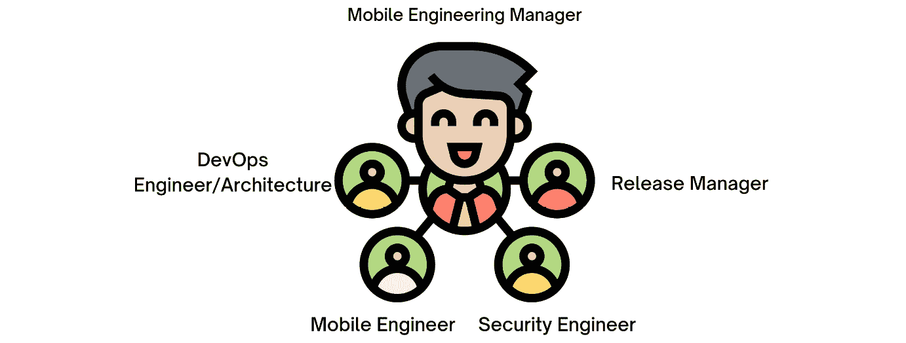

# 解决移动 DevOps 中的挑战

由于其性质，移动应用的发布周期可能会延长。以移动优先为原则的功能帮助你更高效、更快速地进行测试、构建和发布。

为确保移动 DevOps 的成功，开发、运维和 QA 团队必须紧密合作。建立明确的沟通渠道，确保每个人都在同一页面上。

因此，在本章中，我们将涵盖以下主要内容：

+   移动应用的重要性

+   理解移动 DevOps

+   敏捷方法在移动 DevOps 中的作用是什么？

+   有效转型移动 DevOps

+   如何加速组织中的移动 DevOps

+   移动 DevOps 团队的角色与职责

+   大规模移动应用开发的挑战

# 移动应用的重要性

数字化转型日益取得进展。如今，消费者要求更好的产品和服务，而企业必须采用新技术以保持竞争力。这将帮助他们提高效率并做出更好的决策。

此外，还有满足客户需求的创新空间。所有这一切都需要集成、持续开发、创新和部署。这一切都可以通过移动 DevOps 实现。

尤其是，移动应用开发变得越来越具有挑战性和复杂性。如今，我们依赖移动应用来完成许多任务，包括在线购物、在线支付、资金转账、医疗咨询、在线学习、社交分享等等。

随着这些活动的增加，客户期望移动应用能够更高效地运行，拥有友好的用户界面，可定制的功能，支持多语言，并且具备更多高级功能，同时占用更小的存储空间。

当你的移动应用上线后出现 bug 时，维护和修复它非常困难，甚至可以说几乎不可能。找出根本原因、准备新版本、测试并发布热修复补丁的过程需要团队付出大量努力。你可能需要等待几周或几个月才能完成这些工作。因此，在这段时间内，客户**肯定**会在应用商店留下负面评价。

“*为了最大化客户满意度和价值，必须审视你的流程和工具，找出可以改进的机会*。”

但是问题是，你当前的工作流程或配置能否在长期内支持你的移动应用？未来又如何？你的团队能应对这种规模吗？如果业务和团队不断扩展，会发生什么？最后但同样重要的是，你的团队对日常执行的任务感到满意吗？

移动团队专注于处理日益具有挑战性的任务。正因为如此，往往容易忽视整个过程。移动开发人员如果定期停下来检查自己的工作（例如采用 DevOps 流程），会花更少的时间去修复 bug。

## 持续的挑战

智能手机的使用在全球范围内持续增长。**预计到 2025 年，全球智能手机用户将达到 74.9 亿人，比 2022 年的 72.6 亿人有所增加**。更多详情请见此链接：[`shorturl.at/vCQ13`](https://shorturl.at/vCQ13)。

到 2026 年，预计全球在高级应用、应用内购买和订阅上的支出将达到 2330 亿美元，比 2021 年消费者支出的 1320 亿美元增长了 77%。

此外，预计在未来五年内，两个应用商店的总收入将继续以 12%的速度增长，**年复合增长率（CAGR）为 19%**，到 2026 年将达到 2330 亿美元。更多详情请见此链接：[`sensortower.com/blog/sensor-tower-app-market-forecast-2026`](https://sensortower.com/blog/sensor-tower-app-market-forecast-2026)。

哇，真多！毫无疑问，所有企业都需要为下一波浪潮做好准备，意识到自己的挑战，制定下一步的计划，并且不忘提及成长和改进的机会。

在移动开发中，每个企业都面临以下情况：

+   独特的流程

+   独特的投资和目标

+   独特的人员和文化

## 这是一个例子

金融科技应用在我们日常活动中扮演着重要角色。个人可以使用这些应用管理财务并做出金融决策，它们通常会使用人工智能和机器学习等先进技术提供个性化的推荐和洞察。

无论是在电子商务、食品/杂货配送还是数字银行，金融科技（fintech）正成为我们个人和职业生活中不可或缺的一部分。

在数字时代，金融科技已经产生了显著影响，而这些针对私人和市场金融的先进技术工具将在使用和效果上进一步发展。

这类移动应用需要不同于其他应用的流程。它们需要一个有效的自动化测试策略，包括安全性测试，因为安全性在这里非常重要，应用的性能也很关键，而且由于竞争或客户满意度，频繁和快速的发布是优先考虑的事项。

另一方面，如果我们在创建一个社交媒体应用，需求和流程将会有所不同。

因此，我认为**没有万能的解决方案**，每个团队或公司都应该制定自己的解决方案。

## 让我给你讲个故事

为了理解移动 DevOps 的重要性，让我与您分享一个实际的场景，这个场景发生在我们尚未建立任何流程、技术或技术栈的情况下。

假设我们在 XYZ 公司工作，这是一家金融科技公司，开发和发布移动应用的过程本可以更快更高效。在应用发布之前，开发团队需要花费数周甚至数个月的时间来构建和测试新功能，QA 团队会发现需要手动修复的漏洞，因为他们没有自动化测试脚本。由于这个原因，新的应用版本很少发布，而且发布时通常会有问题，需要后续修复。

当前面临的挑战可以总结如下：

+   **我们的新功能每 3 个月发布一次**：这是一个巨大的因素，因为我们必须跟上竞争对手的步伐，并尽可能快速地发布新功能。

+   **我们的部署过程混乱且痛苦**，因为我们没有清晰的部署流程或发布经理。

+   **持续集成（CI）流水线或工作流不灵活且脆弱**，我们的团队花费大量时间和精力处理与 CI 服务器、配置、网络问题以及设备问题相关的日常事务。

+   **手动测试存在很多问题**，包括它们既耗时又费力。此外，如果我们有自动化测试，UI 测试和模拟器可能无法正常工作，这使得我们面临不稳定的测试结果。

+   **我们没有可用的安全测试工具**，也不知道该使用哪些工具进行安全测试。

管理团队看到应用开发进度缓慢以及众多问题时感到沮丧。尽管知道需要改善开发和发布移动应用的方式，但他们不知道从哪里开始。此前，团队每**3 个月**发布一次，首要目标是将发布周期缩短至**1 个月或 2 周（每周或每两周发布一次）**。

为了改善其移动应用开发过程，公司采用了**移动 DevOps**实践。它开始了移动开发和 QA 团队之间基于 Mobile DevOps 原则的协作过程，涵盖了 CI、持续交付和持续部署等方面。

*移动 DevOps =* *更快的发布*

通过移动 DevOps，公司能够显著提高移动应用开发过程的速度和可靠性。移动开发团队能够对应用进行小而频繁的更新，QA 团队也能够快速识别并修复出现的任何问题。

*因此，公司能够更频繁地发布应用的新版本，且* *问题更少。*

管理团队对移动 DevOps 实施的结果感到满意，应用程序更加稳定且频繁更新，显著提高了用户满意度。因此，公司能够比以前更快速高效地向用户交付高质量的应用。

但是这很容易吗？不，成功的实现需要团队思维方式的转变以及所有团队成员的参与。

这需要很短的时间吗？不，这是一场永无止境的旅程，是一个始终在不断发展的过程，以应对移动应用开发中的挑战。

从我的角度来看，我相信以下几点：

“*移动 DevOps 是一场旅程，而不是* *一个终点。*”

既然我们已经解决了移动团队每天面临的大部分主要挑战，那么让我们来看看为什么我们需要考虑像移动 DevOps 这样的流程。

## 为什么移动 DevOps 重要？

移动 DevOps 使团队能够以更快的速度发布新功能、更新和 bug 修复。这种灵活性有助于满足不断变化的用户需求，并在市场中获得竞争优势。它通过自动化测试和持续监控来确保更高的应用质量，减少达到最终用户的 bug 和问题，从而提高用户体验和客户满意度。

它还促进了开发人员、测试人员和运维团队之间的协作与沟通。这种协作环境促进了知识共享、反馈交流以及团队合作和集体所有感文化的形成。

在之前的简短故事中，我们遇到了一些阻碍进展的挑战，如下所示：

+   不灵活且脆弱的开发环境

+   QA 团队需要很长时间来批准新版本

+   发布新版本的应用程序需要很长时间

+   我们没有清晰的发布流程或职责

然后，团队意识到移动 DevOps 流程能够帮助解决所有这些问题，因为移动 DevOps 的好处包括以下几点：

+   更快地解决问题和交付结果

+   你的业务将因此变得更加灵活

+   建立信任与合作

+   创新源自自动化

+   成本和风险大大降低

+   专注于客户满意度

+   更快的反馈和市场响应时间

+   改善构建正确解决方案的能力

+   更好的产品质量

+   更可靠的发布

+   提高生产力

移动 DevOps 流程能够帮助企业更快地解决问题，变得更加灵活，建立信任与合作，降低成本与风险，专注于客户满意度，提高产品质量、可靠性、生产力和上市时间。

这将是对移动 DevOps 的简短介绍，因为我们将在*第三章*中进一步探讨，*移动* *DevOps 基础*。

# 理解移动 DevOps

移动 DevOps 是一套加速移动应用开发和交付的实践方法。这一方法结合了 DevOps 的原则，强调软件开发中的协作和自动化，以及开发移动应用所面临的具体挑战和考虑因素。

移动 DevOps 涉及以下内容：

+   **协作与沟通**：移动 DevOps 需要开发、运维和 QA 团队之间的密切协作与沟通。建立清晰的沟通渠道和反馈与协作的途径，确保每个人都朝着相同的目标共同努力，是非常重要的。

+   **持续集成、部署和交付**：移动 DevOps 依赖于自动化流程进行移动应用的 CI 和交付。这意味着代码更改会自动构建、测试，并部署到预发布和生产环境中，无需人工干预。

+   **测试与质量保证**：测试和质量保证是移动 DevOps 的关键组成部分。应将自动化测试工具和流程集成到开发工作流中，以确保新的代码更改不会引入漏洞或回归问题。

+   **监控和反馈**：移动 DevOps 还包括监控移动应用在生产环境中的性能和使用情况，并利用这些数据向开发团队提供反馈。这有助于快速识别和解决问题，提升整体用户体验。

+   **工具与技术**：为了有效实施移动 DevOps，组织需要投资于合适的工具和技术。这可能包括用于 CI 和交付、自动化测试、监控和反馈的工具。

为了让移动 DevOps 方法尽可能有效，你还应在整个移动应用发布的生命周期中集成安全性。移动 DevOps 方法从一开始就将安全集成到流程中，安全性成为共享责任。这就是为什么它被称为“DevSecOps”，因为所有 DevOps 举措必须基于安全的基础。

## DevOps 与移动 DevOps

几乎每个公司现在都使用 DevOps 来构建、测试和交付其后端服务（API）、网站或基础设施。

在移动工程的背景下，移动 DevOps 是 DevOps 的一种变体，重点是通过更快的迭代周期和提高移动开发、运维和 QA 团队之间的协作，迅速将高质量的应用交付到市场。移动 DevOps 和 DevOps 的一个关键目标是通过自动化、协作和团队间的沟通，推动快速且高质量的软件交付。

在移动 DevOps 生命周期中，采用了略有不同的方法。尽管步骤有所调整，但连续性符号保持不变，以便频繁地向客户交付有价值的应用、保持质量，并实时监控应用的健康状况。更新后的移动开发生命周期可能包括 **持续集成/持续交付**（**CI/CD**）策略、构建、测试、发布、监控和度量。

图 1.1 – 移动 DevOps 与 DevOps

移动 DevOps 将 DevOps 的原则扩展到移动应用开发中，强调在整个开发生命周期中促进协作和自动化。因为它促进了开发人员、测试人员和运维团队之间的协作，所以我使用了前面的图示。它们使用相同的实践，但对于移动应用来说，它们是独特的，并包含不同的挑战。

### 重点

DevOps 关注不同类型的软件或应用程序，例如网站和后端服务，但移动 DevOps 专注于移动应用程序。

### 复杂性

移动应用程序必须支持的设备类型、操作系统版本和网络条件范围广泛，通常使其部署环境比传统软件或应用程序更加复杂和多样化。

# 敏捷方法如何在移动 DevOps 中工作？

由于我们已经花费大量时间在不同的书籍、文章和视频中描述瀑布模型与敏捷方法之间的差异，因此我不想再花时间描述瀑布模型。不过，让我问你一个问题：**瀑布模型可以与 DevOps 结合使用吗，还是敏捷方法** **更合适？**

如果你将移动 DevOps 的优势（前面列出）与移动应用开发中的挑战（前面列出）结合起来，并将它们应用于瀑布模型和敏捷方法，你可以找到答案。

如果你仍然感到困惑，请记住以下链接中的敏捷宣言：[Agile Manifesto](https://agilemanifesto.org/principles.html)。

现在答案是什么？我可以帮助你，但首先，让我们回顾一下瀑布模型并识别问题所在。

## 瀑布模型

瀑布模型是一种**线性**的软件开发方法，涉及从一个阶段到下一个阶段的顺序和线性流程，且方向是向下的。因此，每个阶段必须完全完成，才能开始下一个阶段。

图 1.2 – 瀑布模型

瀑布模型的阶段如下：

+   **需求收集与分析**：这一阶段涉及确定软件将解决的问题，确定软件的需求，并创建规格说明书。

+   **设计**：创建软件的详细技术设计，包括各个组件之间的接口，并制定实现软件的计划。

+   **实现**：在这一阶段，软件的实际编码工作开始。代码是基于前一阶段的设计创建的。

+   **测试**：在这一阶段，进行软件测试以确保软件满足规格说明书中的要求，并按预期执行。

+   **部署**：在这一阶段，软件被部署到目标环境中，例如生产服务器或移动设备。

+   **维护**：作为维护阶段的一部分，软件中发现的任何错误或问题将被修复，新增功能或特性将被添加，并且软件的性能将得到改进。

瀑布模型有一些缺点。它假设可以在前期收集并分析软件需求，但这并非总是可能的。此外，它假设软件的设计是正确且完整的，但这也并非总是如此。最后，一旦开发过程开始，软件就不能再进行任何更改。

瀑布模型适用于移动 DevOps 吗？实际上，不适用，因为移动 DevOps 涉及持续集成（CI）、持续测试、持续部署和持续监控，变更是常态，且各个阶段不是孤立的。移动 DevOps 中，所有跨职能团队共同协作，在一个流程中共同努力，目标和宗旨是快速、频繁地交付高质量的移动应用，以满足客户需求。

## 敏捷

相较之下，敏捷方法论被视为瀑布模型的直接继承者。它是一套强调**协作、灵活性和快速迭代**的软件开发原则。这是一个建立在敏捷宣言基础上的体系，敏捷宣言概述了一套在短时间内交付高质量软件的关键价值观和原则。

通常，敏捷通过使用如**Scrum**等敏捷方法来实施，其中团队成员在短周期开发（称为冲刺）中进行沟通和相互反馈。

在敏捷宣言背后的敏捷原则中（[`agilemanifesto.org/principles.html`](https://agilemanifesto.org/principles.html)），我们可以找到**第一条**原则如下：

“*我们最优先的任务是通过尽早和持续交付有价值的软件来满足客户。*”

你还记得移动 DevOps 的好处吗？**客户分层**和**频繁交付**移动应用。基于此，结合移动 DevOps 的敏捷原则旨在通过持续集成（CI）、持续交付和持续部署策略加速移动应用的开发和交付，使团队能够快速、可靠地发布移动应用。

在移动 DevOps 和敏捷中，都非常强调**团队间的协作与沟通**，同时两者都强调**自动化重复任务的重要性**，以便尽可能快速高效地生成高质量的软件产品。两者还强调**尽快且高效地交付高质量软件产品的重要性**。

敏捷强调短周期开发，而 DevOps 强调持续交付。

图 1.3 – 敏捷方法论

**目标是以最小的风险实现最大的速度**——你需要进行实验、测试，尽可能地探索每一个细节，以免在客户需求面前落后或在过程中崩溃。关键不是防止失败，而是迅速恢复。唯一重要的就是你恢复的速度。

## 移动 DevOps 阶段

和 DevOps 一样，移动 DevOps 也有多个阶段，从规划到监控，包括所有帮助移动团队顺利、快速、频繁交付高质量移动应用的实践。

图 1.4 – 移动 DevOps 阶段

+   **战略与规划**：这涉及到识别移动应用的目标和任务，明确目标用户以及任何特定的需求或限制。

+   **开发**：在这一阶段，移动应用采用敏捷方法和 CI/CD 实践进行开发。这包括编写代码、构建和测试应用程序，并集成任何所需的 API 或服务。

+   **测试**：移动应用测试是 DevOps 流程中的重要环节，旨在确保应用在不同设备和操作系统上稳定运行并且表现良好。这包括单元测试、集成测试和用户验收测试。

+   **发布**：一旦应用测试完成并准备好发布，就可以将其发布到适当的应用商店或分发平台。

+   **监控**：应用部署后，重要的是要监控其性能并解决任何出现的问题。这可能包括崩溃报告、错误追踪、网络请求分析、内存泄漏和应用性能。

这只是对各阶段的简要介绍，但在*第三章*《移动 DevOps 基础》中，我们将深入探讨这些阶段，而在接下来的章节中，我们将分别用实际案例和用例来探索每个阶段。

在了解了 DevOps 和移动 DevOps 之间的差异、敏捷与移动 DevOps 之间的紧密关系，并看到了移动 DevOps 的不同阶段后，让我们看看如何能够成功、有效地将我们的团队或组织转型为移动 DevOps。

# 有效地转型移动 DevOps

移动 DevOps 转型和 CI/CD 实施的成功可以通过关键绩效指标（KPI）来追踪，这些是可衡量的数值。通过设定具体、量化的 KPI，并定期监控其进展，您可以追踪移动 CI/CD 努力的有效性。

为了推动移动 CI/CD 转型，可以使用以下 KPI：

+   **部署频率**决定了新代码更改部署到生产环境的频率。高效和成功的 CI/CD 流程要求有高频率的部署。

+   **恢复时间中位数**（**MTTR**）衡量组织在发生故障后多快能够恢复正常运营。具有较低 MTTR 的 CI/CD 流程表明其稳健，能够快速发现并解决问题。移动应用可能面临一些挑战，因为一旦应用发布后，衡量起来会较为困难，但通常我们可以将测量应用到其他移动应用所使用的服务上。

+   **缺陷密度**：生产环境中发现了多少个 bug？如果 bug 数量很低，说明 CI/CD 流程非常完善，能够有效地识别和修复问题。

+   **用户满意度**：移动应用是否受到用户的好评？应用质量的一个重要指标是用户满意度。如果你的应用评分较低或在应用商店中有负面反馈，这可能表明你的质量和发布流程需要重新审视。

+   **衡量开发者满意度**，了解他们在构建和维护公司产品时所使用的工具、流程以及获得的支持。为了节省成本，公司通常会自建工具，但开发者可能对这些工具不满意，公司应该了解开发者是否满意。这是一个极其重要的问题。在 0 到 10 的评分范围内，公司询问内部开发者，他们愿意将公司开发环境推荐给同事的可能性有多大。根据这些数据，可以对开发环境进行改进，以更好地支持内部开发者的需求。

我们还可以使用各种指标来衡量 DevOps 和移动 DevOps 的性能和生产力，[例如 MODAS 调查](https://shorturl.at/beAX1)，以及来自 Google 的 DORA 指标 ([`shorturl.at/beAX1`](https://shorturl.at/beAX1))。

## 移动 DevOps 的 ROI

**投资回报率**（**ROI**）是衡量投资效率的标准。通过确定实施移动 DevOps 方法的成本，并将其与所获得的收益进行对比，可以计算出移动 DevOps 的 ROI。

首先，你需要确定实施移动 DevOps 方法进行移动应用开发的相关成本，包括团队的培训或认证费用、将使用的工具或技术，以及其他相关成本。通过这些信息，你可以计算出实施移动 DevOps 的总成本。

下一步是确定使用移动 DevOps 的收益，例如提高效率、改善团队成员之间的协作和沟通，以及更快的部署和发布周期。为了衡量这些收益，你可以进行我们之前提到的调查（开发者满意度），分析项目绩效数据，并将结果与没有使用 DevOps 的类似项目进行对比。

为了计算移动 DevOps 的 ROI，你需要确定成本和收益：

**ROI = (收益 - 成本) / ** 成本

# 如何加速组织中的移动 DevOps 实施

移动 DevOps 是一项协作努力，涉及团队、心态和承诺，以及流程和工具集。

图 1.5 – 移动 DevOps 考虑事项

为了加速移动 DevOps 过程和成功，团队应考虑以下事项和最佳实践：

+   确保版本控制健壮，以减少合并冲突和丢失工作

+   构建自动化（CI/CD），让你可以专注于创造而不是管理复杂的流水线

+   经常进行测试并自动化以回应反馈（左移测试）

+   管理你的移动应用工件，确保它们发布到正确的地方

+   确保时刻关注安全

+   从小处开始，并从那里智能地成长

+   创造是关于设计和开发

+   持续进行应用监控和状态检查

# 移动 DevOps 团队的角色与职责

正如我们之前讨论的，移动 DevOps 涉及一个跨职能的团队，每个角色都有独特的责任，如 CI/CD 流水线、云架构、安全合规性和待命（事件管理）。它们彼此补充。如果团队采用小队与部落的方式，或许一个专门集中化的团队可以处理以下移动 DevOps 实践和流程：

+   发布经理

+   移动工程经理

+   质量保证工程师

+   DevOps 工程师

+   移动工程师

+   安全工程师

+   云/DevOps 架构

图 1.6 – 移动 DevOps 团队

这种方法或配置可以帮助企业公司有效地扩展他们的团队和业务。

在中小型团队中，移动开发人员与 DevOps 工程师可以完成相同的工作，但这可能需要他们付出时间和努力，因此始终取决于移动 DevOps 的目标。

# 大规模移动应用开发挑战

除了移动应用的独特性外，开发它们时还面临许多挑战。以下是最常见的一些挑战：

+   **整合多个平台以创建无缝的用户体验**：移动应用通常需要为多个平台（如 iOS 和 Android）开发。这在测试、部署和维护方面可能会带来额外的复杂性。

+   **单体代码库与多个代码库**：在处理大规模项目时，协调和版本控制会变得具有挑战性。

+   **适配应用到不同的设备和操作系统**：模拟器和仿真器对于测试可能有用，但它们无法复制用户在真实设备上可能遇到的所有体验和问题。这可能导致确保移动应用的质量和可靠性变得困难。

+   **确保应用程序安全并符合安全性和数据隐私要求**：移动应用程序通常处理敏感数据，如个人信息和金融交易。这需要对安全性和隐私风险进行细致的管理。

+   **紧跟移动应用趋势和技术**：为了开发移动应用，你需要一个不断发展的独特工具集。随着市场需求的不断增长，总有新的技术用于构建、部署和监控性能。

+   **确保持续交付和部署**：移动应用程序需要频繁更新以修复漏洞、添加新功能并提升性能。这要求有一个强大的 DevOps 流程，能够处理每天多个版本的发布。

+   **与 API 集成**：移动应用程序通常依赖外部 API 提供功能，如位置追踪和数据存储。这些 API 可能会发生变化或出现停机，从而影响移动应用的稳定性。

正如我们之前在《移动 DevOps 基础》一文中提到的，由于每个企业都有独特的投资、目标和流程，开发移动应用可能会面临挑战。以下是几种不同类型的移动应用，每一种都需要简要探讨，以便更好地理解它们的目的。

鉴于所有这些挑战，可以开发出不同类型的移动应用公司。

## 超级应用

超级应用是一种提供多种服务的移动应用。服务的例子包括打车、外卖、在线购物和金融服务。超级应用为用户提供一站式服务，使他们可以无需下载和使用多个独立的应用程序，便可访问多项服务。

亚洲是超级应用的热门地区，因为它们增加了[用户参与度和收入](https://www.gojek.com/en-id/)，为提供这些应用的公司带来了好处：

+   Gojek ([`www.gojek.com/en-id/`](https://www.gojek.com/en-id/)) – 一款印度尼西亚超级应用，允许用户使用各种[服务，如消息和支付处理](https://www.grab.com/sg/)

+   Grab ([`www.grab.com/sg/`](https://www.grab.com/sg/)) – 一款按需提供[外卖、支付及其他服务的应用](https://paytm.com/)

+   Paytm ([`paytm.com/`](https://paytm.com/)) – 一款流行的印度电子钱包和支付应用，提供购物、投资等功能，并且可以[预订旅行、电影和活动的门票](https://line.me/en/)

+   LINE ([`line.me/en/`](https://line.me/en/)) – 一款日本的消息应用，也允许进行支付和预订酒店房间

通过为用户提供便利，超级应用可以使他们无需在多个应用之间切换，就能访问各种服务。企业主可以通过超级应用生成新的收入，并吸引新客户。

## 白标应用

应用程序的白标版本显示的是重新销售该应用程序的公司的徽标和名称，而不是最初开发它的原始开发者的名称。通常，这些应用程序被定制以满足公司的特定需求，然后重新销售给其他企业或客户，以为公司带来收入。

因此，它们被推荐为公司提供可定制的应用解决方案，而不必投入时间和资源来从零开始开发应用，从而提高客户的满意度。

电子商务是白标应用程序的一个常见示例，企业可以购买现有软件并以其自己的品牌、产品和价格进行定制，例如 Shopify（[`www.shopify.com/`](https://www.shopify.com/)）。这使它们能够快速轻松地推出自己的在线商店，而无需从头开始构建平台。

此外，白标应用程序在医疗保健、教育和政府领域也有所应用。例如，医疗保健提供者使用白标应用程序来安排和跟踪患者的治疗，而学校使用它们来评分和跟踪学生的进展。

使用白标应用有多个好处，包括以下几点：

+   从头开始开发应用可能昂贵且耗时。白标应用更具成本效益和效率。

+   由于其预先存在的特性，白标应用可以比定制建造的应用更快地实施和发布。

这里有一些白标移动应用程序的示例：

+   适用于本地餐厅连锁店的品牌化和定制化食品送货应用程序

+   酒店或度假村品牌的预订和预订应用程序

+   定制和品牌化的门票和活动管理软件，适用于音乐会和体育场馆

此外，开发一个目标受众会发现有价值且吸引人的应用程序，并优化应用程序的功能，可能具有挑战性。

移动团队可以通过实施 CI/CD 和自动化测试等最佳实践来应对这些挑战。此外，他们可以使用诸如移动设备云和测试自动化框架之类的工具来简化流程并改善其移动应用程序。

让我们总结一下：

*由于移动应用开发具有独特性，因此 DevOps 也应该* *独一无二*。

# 总结

移动 DevOps 的概念涉及集成开发和运维（DevOps）实践，以提高移动应用程序开发的效率和速度。为了实现这一目标，我们使用移动优先功能来更快地测试、构建和发布移动应用程序，并实施移动应用程序的持续集成、测试、部署、交付和监控。

一个有效的移动 DevOps 流程还涉及开发、运维和质量保证团队之间的协作与沟通，以及使用合适的工具和技术以实现预期的结果。为了保持竞争力并满足客户对高质量移动应用的需求，企业应该采纳移动 DevOps。

确保不要盲目复制网上找到的他人流程。制定一个适合你的利益相关者和团队成员需求的策略和计划。在一开始就为你的移动 DevOps 最佳实践建立一个标准流程。

我们向移动 DevOps 迈进的旅程刚刚开始，在接下来的章节中，我们将进一步探索并学习如何有效地使用移动 DevOps。
