# 理解移动生态系统

一个应用的移动生态系统包括它在移动设备上正常运行所需的所有元素，包括硬件、软件、操作系统、网络和使其运作的服务。为了成功实施移动 DevOps 并满足客户需求，理解移动生态系统至关重要，因为这有助于了解所面临的挑战，并找到解决方法以交付成功的移动应用。

在本章中，我们将覆盖以下主题：

+   移动应用像冰山一样

+   移动应用的伟大之处

+   市场上的不同移动操作系统、框架和平台

+   移动应用功能，如盈利化、推送通知、状态管理、深度链接等

+   移动应用架构

# 移动应用像冰山一样

在我看来，一个移动应用程序就像一个*冰山*，有明显的部分（**用户界面或 UI**）和不显眼的部分（**UI 下方的代码和功能**）。尽管最终用户是唯一能够看到成品的人，但这个比喻常常能说明构建和维护一个移动应用程序所需的努力、复杂性和工作量，如下图所示：

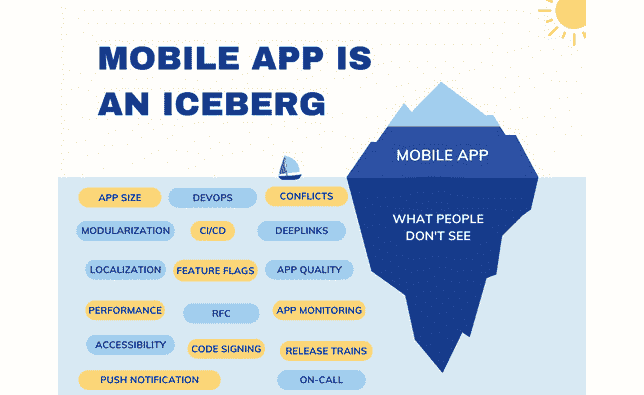

图 2.1 – 移动应用是一个冰山

当一个用户例如下载并首次使用一个应用时，他们看到的仅仅是它的界面、功能和特性。用户看不到后台发生的许多事情，但这些远比他们意识到的要重要。一个移动应用连接着服务器、数据库和 API，使其能够与其他应用和设备进行通信、检索数据、传输数据并执行各种任务。

一个**移动应用**，从最简单的意义上讲，就是一种为某个平台（如 Android 或 iOS）设计的运行软件。因此，它需要大量的编码才能开发出来。如*图 2.2*所示，它由多种编程语言、框架、库和工具组成，这些都用于开发应用的功能和特性：

图 2.2 – 移动应用开发

除了移动应用的技术方面，很多工作还集中在其规划、设计、测试和发布阶段。必须开发线框图、原型和用户流程，并进行用户测试，以确保应用直观、易用且性能优良。

现在我们已经探讨了移动应用开发的基础，让我们将焦点转移到大多数移动开发团队在构建优秀应用时面临的挑战。

# 什么使得移动应用伟大？

为了制作一个优秀的移动应用，它需要有一个简洁直观的用户界面，易于使用，但与 Web 应用不同，原因如下（如*图 2.3*所示）：

+   这变得更加重要。

+   这个平台是高度碎片化的。

+   工具经常变化。

+   它迭代得非常迅速：

图 2.3 – 移动应用是独特的

基于移动应用的性质和复杂性，在评估移动应用的优点时，有几件事情需要考虑，如下所示：

+   移动应用帮助用户解决问题或满足他们的需求，因此它们需要经过精心设计，并且具有一系列有用的功能和特性，且要可靠。

+   它们应该快速、响应迅速，并且能够完美地处理各种平台和设备，且不会崩溃或出现卡顿。

+   对于移动应用而言，兼容多种设备和平台非常重要，这样尽可能多的用户才能使用它们。

+   它们被设计用来保护敏感数据，并防止未经授权的访问。

+   它们需要定期更新，增加新功能和改进，以保持用户兴趣，并确保未来仍然具有相关性。

既然我们已经了解了移动应用的重要性，现在让我们更详细地看看今天市场上可用的平台和框架，以及在实施移动 DevOps 流程和实践时需要考虑的事项。

# 当前可用的移动平台和框架

在写这本书的时候，目前市场上有很多不同的移动平台，包括**原生**平台和**跨平台**平台，下面我们快速了解一下它们之间的差异，帮助你更好地理解在思考移动 DevOps 时需要考虑的因素。

注意

我不想详细解释移动开发，因为这本书是关于移动 DevOps 的，而关于移动开发的书籍有很多。然而，正如我们之前提到的，我们应该能够解读不同平台的需求，然后根据这些需求实施 DevOps 流程。

作为起点，让我们来看一下原生应用，如 iOS 和 Android。

## iOS

如我们所知，**iOS**是运行在 iPhone 和 iPad 上的操作系统。现在，iPad 有了专门的 iPadOS。众所周知，iOS 除了拥有用户友好的界面、与其他 Apple 产品的整合以及通过 App Store 提供的大量应用外，还与其他 Apple 产品兼容。在写这本书时，iOS 的最新版本是 *16*。

在开发、测试和发布 iOS 应用时，务必始终使用最新版本的 macOS，并配备最新的 SDK 和工具，以满足应用的需求。这对于移动 CI/CD 来说是一个大挑战，因为如果你想构建和发布 iOS 应用，你就必须始终保持最新。

为了避免浪费开发人员在设置和维护移动 CI/CD 平台上的时间，我们应该始终寻找一个即插即用的平台。在 *第四章*，*通过移动 DevOps 实现持续集成与交付* 中，我们将深入探讨如何为我们的团队选择合适的 CI/CD 提供商。

### iOS 16 新增功能

2022 年 9 月，Apple 发布了其新操作系统 *iOS 16*。该版本的 iOS 操作系统在 Apple 的 *WWDC22* 大会上发布（[`developer.apple.com/videos/wwdc2022/`](https://developer.apple.com/videos/wwdc2022/)）。iOS 包含适用于广泛设备的功能和性能改进，包括以下内容：

+   **全新锁屏**：现在，你可以使用 WidgetKit 为 Apple Watch 创建复杂功能，并为 iPhone 锁屏创建小部件，扩展便捷查看的体验，并拥抱 SwiftUI

+   **iPhone 一触即付**：通过 Apple Pay、Apple Watch 和其他数字钱包，iPhone 上的支付应用现在可以通过接触式信用卡和借记卡接受非接触式支付

+   **SwiftCharts** 是一个强大且简洁的 SwiftUI 框架，用于将数据转化为信息丰富的可视化效果

+   **3D 地图**：在全新的地图上体验高度详细的 3D 城市体验

+   **App Intents** 将为用户提供仅通过语音或点击应用即可执行快速任务的能力

+   改进的应用内购买体验，新增 API 和增强功能

+   在视频和应用中使用**实时文本**执行简单任务，如复制和粘贴

所有这些功能都伴随着安全性、可访问性和隐私方面的新特性和增强功能，帮助开发者构建安全且丰富的 iOS 应用。所有细节可以在这里找到：[`www.apple.com/ios/ios-16/features/`](https://www.apple.com/ios/ios-16/features/)。

除了在这里提到的新功能外，我还想强调，我们在 UI 测试这些功能时面临不同的挑战，例如小部件和图表的 UI 测试以及锁屏测试，因此当涉及到下一个可能的挑战时，我们必须始终考虑更大的范围。

只需准备好，在你阅读本书时，新版本的 iOS 就会发布。

除了 iOS 16 中的上述功能外，Apple 还发布了最新版本的 **Xcode**，即*15*（[`apps.apple.com/us/app/xcode/id497799835?mt=12/`](https://apps.apple.com/us/app/xcode/id497799835?mt=12/)），这本书写作时，Xcode 是开发 iOS、tvOS、iPadOS、watchOS 或 macOS 应用的主要开发 IDE。Xcode 的二进制文件比以前小了 30%，因此启动速度比以往更快。Xcode 还提供可下载的 watchOS 和 tvOS 模拟器运行时，让开发者可以随时接触到最新的平台。另一个重要的功能是通过单一的应用目标来配置多平台应用。让我们深入了解一下什么是多平台应用。

## 配置多平台应用程序

使用多平台应用程序（[`developer.apple.com/documentation/xcode/configuring-a-multiplatform-app-target`](https://developer.apple.com/documentation/xcode/configuring-a-multiplatform-app-target)），你可以通过使用多平台目标共享应用程序的项目设置和代码，正如*图 2.4*所示，这将允许你将应用程序的体验扩展到应用程序支持的多个平台：

图 2.4 – 多平台目标

注意

尽管 iOS、iPadOS、macOS 和 tvOS 应用程序可以共享一个目标，但 watchOS 应用程序仍然保持在一个单独的目标中。更多信息请参见：[`developer.apple.com/documentation/Xcode/configuring-a-multiplatform-app-target`](https://developer.apple.com/documentation/Xcode/configuring-a-multiplatform-app-target)。

在设计 CI/CD 管道时，我们应该考虑到这一点，因为我们需要为每个目标考虑**代码签名**机制、**证书**和**配置文件**，以及在归档或构建应用程序进行测试时必须采取的步骤。

## Android

**Android**（[`www.android.com/`](https://www.android.com/)）操作系统是由 Google 为智能手机和平板电脑开发的开源平台。这个操作系统基于 Linux 内核，主要用于移动设备，但也已在手表、电视、汽车和其他设备上实现。Android 之所以如此受欢迎，有很多原因，包括设备的定制能力，以及通过 Google Play 商店提供的各种应用。

作为 Android 操作系统的替代版本，**Android Go**（[`www.android.com/versions/go-edition/`](https://www.android.com/versions/go-edition/)）旨在平稳运行于*低配置*的智能手机和平板电脑，这些设备具有*有限的资源*。通过一个*更轻量*版的 Google Play 商店、Google 应用以及一系列优化为低端设备的应用，它旨在平稳运行于资源有限的入门级智能手机和平板电脑。

Android Go 的主要目标是为资源有限的用户提供流畅、可靠且易于使用的用户体验。

注意

你可以在这里了解更多关于如何为 Android Go 开发应用程序的信息：

[`developer.android.com/guide/topics/androidgo/develop`](https://developer.android.com/guide/topics/androidgo/develop)

### Android 13 新功能

同样，iOS 始终拥有 Android 的最新版本，包括新的功能和现有功能的增强。让我们一起探索其中的一些：

+   作为 Android 13 的一部分，Material You ([`material.io/blog/announcing-material-you`](https://material.io/blog/announcing-material-you)) 被整合到操作系统的外观和样式中。通过自定义非 Google 应用程序，您可以通过匹配您选择的主题和颜色，使主屏幕更具连贯性和独特性。

+   当您复制敏感信息，如电子邮件地址、电话号码或用户名和密码时，Android 将在一段时间后自动清除您的剪贴板历史记录。

+   现在 Android 13 可用后，在平板上执行多任务更加容易了。

注意

还有更多内容 — 您可以在以下链接找到所有新功能的详细信息：[`www.android.com/android-13/#a13-highlights`](https://www.android.com/android-13/#a13-highlights)。您可以在以下链接查看所有发布和版本信息：[`developer.android.com/about/versions`](https://developer.android.com/about/versions)。

在持续集成/持续交付方面，Android 可以在 macOS、Windows 或 Linux 等各种操作系统上构建，但要构建 Android 应用程序，您需要拥有 Android 的 SDK 和工具，例如 **Gradle**，这是 Android 应用开发的官方和主要工具。

接下来，让我们来看看可以在多个平台或跨平台运行的应用程序。

## Flutter

**Flutter** ([`flutter.dev/`](https://flutter.dev/)) 是由 Google 创立的移动应用开发框架。Flutter 平台使开发者能够从单一代码源创建适用于 Android 和 iOS 的移动应用，这些应用具有高响应性、视觉吸引力和高性能，以及适用于 macOS 和 Windows 的桌面应用、Web 应用和嵌入式应用 ([`flutter.dev/multi-platform/`](https://flutter.dev/multi-platform/))。

因此，Flutter 是一个生态系统，在这里您可以从单一代码库构建六种应用程序。正如 *图 2**.5* 所示，使用 Flutter 您可以构建 Web、移动嵌入式应用程序和桌面应用程序（Windows、macOS 和 Linux）:

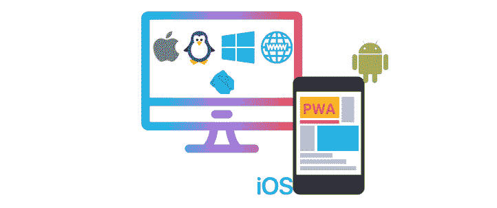

图 2.5 – Flutter 多平台

Flutter 使用 **Dart** 编程语言 ([`dart.dev/`](https://dart.dev/)) 并采用响应式编程模型，允许实现流畅无缝的应用交互。它还包括各种可定制的 UI 组件和构建工具，以及访问摄像头和存储等本地设备功能。

Flutter 是一个出色的工具，可以帮助您构建诸如 **渐进式 Web 应用** (**PWAs**) 等 Web 应用，并将现有的移动应用扩展到 Web，但 Web 本身是一个灵活的平台。

在涉及 Flutter 时，考虑 CI/CD 流水线是有挑战性的，因为每个应用都需要特定的工具和预请求才能发布。由于 Flutter 也支持 iOS 应用，因此它还需要 macOS 机器以及最新的工具和 SDK。例如，使用 Flutter SDK 时，Linux 除了需要 Flutter SDK 之外，还需要其他工具，而在 Windows 上，你肯定需要 Windows 操作系统才能构建应用。

## React Native

**React Native** 框架 ([`reactnative.dev/`](https://reactnative.dev/)) 是 Facebook 最受欢迎的框架之一，因为它允许开发者使用 JavaScript 和 React 库构建类似原生的应用。React Native 使用声明式编程，并包含大量组件和工具，用于创建高性能的应用。在此链接中，你可以了解哪些公司在使用 React Native，例如 Shopify、Microsoft、Facebook（Meta）等：[`reactnative.dev/showcase`](https://reactnative.dev/showcase)。如 *图 2.6* 所示，你可以通过 React Native 和 JavaScript 从一个单一代码库构建 iOS 和 Android 应用：

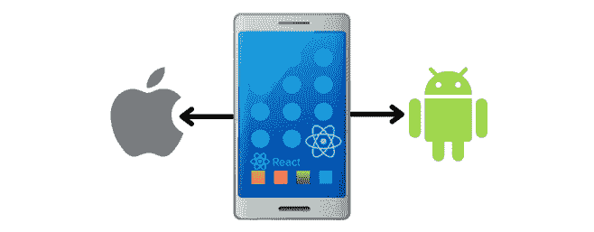

图 2.6 – React Native 框架

React Native 团队最近宣布了 React Native 的新版本 0.72.4 ([`github.com/facebook/react-native/releases`](https://github.com/facebook/react-native/releases))。该版本带来了若干改进，包括统一的 CodeGen 配置、新的 Android 构建支持 CMake 以及新架构的文档。

此外，他们宣布了新架构，因为旧架构存在多个挑战，具体包括以下几点：

+   数据被 *异步* 提交到桥接层，然后 *异步* 等待被另一个层处理。

+   由于 JS 是单线程的，因此所有计算都发生在这个线程中。

+   决定使用 JSON 作为最简单且易于人类阅读的格式，但它确实带来了一些开销，因为每当一个层需要使用另一个层时，都必须序列化一些数据。

尽管如此，新的架构会带来几个好处，具体包括以下几点：

+   现在可以执行 *同步* 函数。在过去，这些函数是异步的。

+   新架构不再需要序列化或反序列化数据，因此不需要支付序列化的成本。

+   通过使用 C++，现在可以抽象出所有的 *平台无关* 代码，并且可以轻松地在各个平台之间共享。

+   包含一层由一个或多个 JavaScript 规范自动生成的代码，确保 JavaScript 可以调用 C++ 方法，反之亦然。

注意

通过此链接可以了解更多关于新架构的信息：

[`reactnative.dev/docs/next/the-new-architecture/why`](https://reactnative.dev/docs/next/the-new-architecture/why)

构建时间方面还有一个改进：从 **React Native 0.71** 开始，您将能够使用来自 **Maven Central** 的预构建工件，这些工件可以从 Android 消耗。因此，新架构 ([`github.com/reactwg/react-native-new-architecture/discussions/105`](https://github.com/reactwg/react-native-new-architecture/discussions/105)) 在构建时间上有了巨大的改进。

最后但同样重要的是，**Shopify** ([`www.shopify.com/`](https://www.shopify.com/)) 最近宣布其整个移动应用已迁移至 React Native。

注意

以下链接详细解释了为什么 Shopify 这么做，它是如何做到的，以及公司从中获得了什么：[`shopify.engineering/migrating-our-largest-Mobile-app-to-React-Native`](https://shopify.engineering/migrating-our-largest-Mobile-app-to-React-Native)。

## Ionic

**Ionic** 提供与主要框架的集成，包括 **Angular**、**React** 和 **Vue**，以便使用 Web 技术提供高质量、高性能的移动应用。Ionic 框架 ([`ionicframework.com/docs/`](https://ionicframework.com/docs/)) 提供了一整套 UI 工具包，用于构建高质量、高性能的移动应用，如下图所示：

图 2.7 – Ionic 框架

对于构建移动应用的开发者来说，使用 Ionic 的优势在于，它提供了各种预设计的 UI 组件和布局，使开发者能够轻松构建用户友好且具有视觉吸引力的应用。此外，Ionic 拥有一个活跃且庞大的社区，提供了多种插件和资源，可以在广泛的方式中扩展其功能。

Ionic 框架的本地应用可以通过应用商店进行分发，并能在移动设备上运行，因为 Ionic 应用通常作为本地应用进行部署。它还提供用于开发 PWA（渐进式 Web 应用）的工具和服务，PWA 是像本地应用一样能够离线工作的 Web 应用，并且可以作为本地应用安装到设备上。

Ionic 拥有 **Capacitor** ([`capacitorjs.com/`](https://capacitorjs.com/))，一个开源跨平台应用运行时，允许基于 Web 的应用在 iOS 和 Android 上原生运行。将这些应用称为本地 **PWA**（渐进式 Web 应用）是有帮助的，因为它们代表了超越传统混合应用思维的下一个进化阶段，如 *图 2.8* 所示：

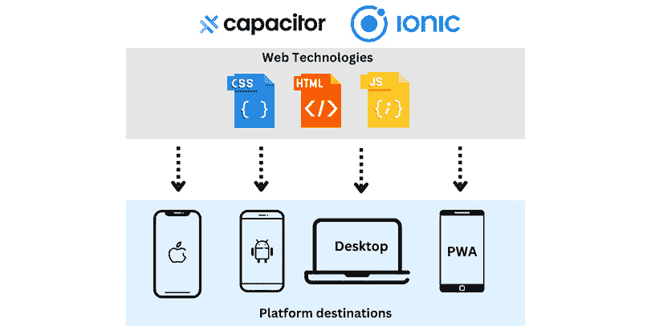

图 2.8 – Ionic 和 Capacitor

对于 Ionic 的 CI/CD，**Appflow** ([`ionic.io/appflow`](https://ionic.io/appflow)) 允许团队构建具有混合移动架构的应用，包括 Cordova、Capacitor 和 React Native 应用。别担心，在 *第四章*，*实现移动 DevOps 的持续集成与交付* 中，我们将学习更多关于 Appflow 的内容以及如何与 Ionic 应用一起使用它。

## Cordova

**Cordova** 框架 ([`cordova.apache.org/`](https://cordova.apache.org/)) 允许你使用标准的 Web 技术（如 HTML5、CSS3 和 JavaScript）开发跨平台应用程序，如 *图 2.9* 所示。

注意

更多信息可以在这个链接中找到：

[`cordova.apache.org/docs/en/11.x/guide/overview/index.html`](http://cordova.apache.org/docs/en/11.x/guide/overview/index.html)

每个平台都通过其自己的封装器进行目标定位，该封装器提供对传感器、数据、网络状态等的访问，使用符合标准的 API 绑定：

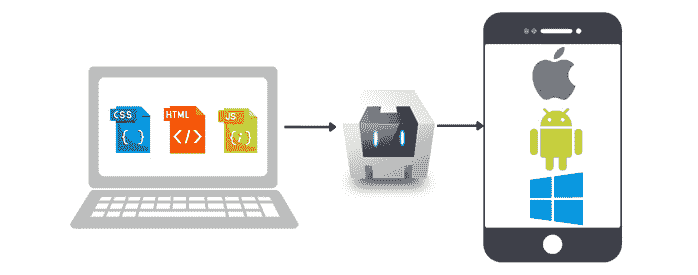

图 2.9 – Cordova 框架

如果你想做以下操作，可以使用 Apache Cordova：

+   将你的移动应用扩展到多个平台；你不必使用每个平台的语言和工具重新实现它。

+   开发一个应用程序，并通过打包它进行 web 部署，以便在应用商店中分发。

作为 Cordova 社区的一部分，已经开发了各种插件来扩展 Cordova 应用程序的功能，例如通过 Cordova 插件访问本地设备功能，如相机、GPS 和加速度计。

注意

在这个链接中，你可以找到 Cordova 和 Capacitor 之间的对比：

[`ionic.io/enterprise-guide/capacitor-vs-cordova`](https://ionic.io/enterprise-guide/capacitor-vs-cordova)

## Xamarin

在 **Xamarin** 框架 ([`dotnet.microsoft.com/en-us/apps/xamarin`](https://dotnet.microsoft.com/en-us/apps/xamarin)) 中，开发者能够用 C# 编写代码，并通过使用特定平台的 API 来访问平台的本地功能和能力，正如 *图 2.10* 所示：

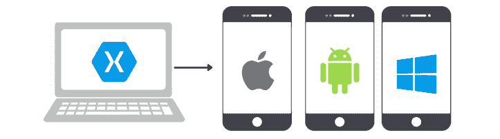

图 2.10 – Xamarin 框架

作为 Xamarin.Forms 工具包的一部分，Xamarin 为开发者提供了定义其应用程序 UI 布局的能力，这些布局可以在多个平台上重用，使用单一的 UI 工具包。

### Xamarin 是死是活？

最近，我们注意到微软宣布，如果你想从单一代码库构建原生的跨平台桌面和移动应用程序，你可以使用 **.NET MAUI**。

所以，我们曾假设 Xamarin 可能已经结束，但实际上，它是 .NET MAUI 的开始。

如 *图 2.11* 所示，.NET MAUI ([`dotnet.microsoft.com/en-us/apps/maui`](https://dotnet.microsoft.com/en-us/apps/maui)) 旨在取代 Xamarin.Forms，并为构建可以在 iOS、Android 和 Windows 平台上运行的移动应用程序提供一个更现代、功能更强大且一致的 UI 工具包。

.NET MAUI 构建于 .NET 6 之上，但在写作时该框架的当前版本为 .NET 7 ([`dotnet.microsoft.com/en-us/download`](https://dotnet.microsoft.com/en-us/download))：

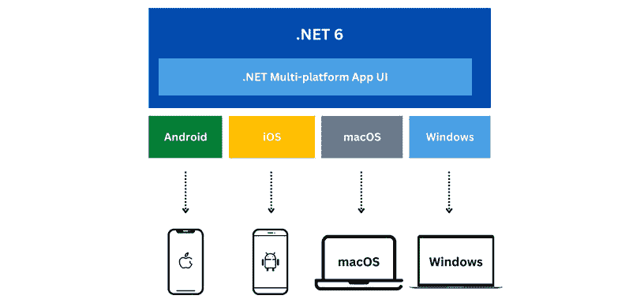

图 2.11 – 多平台目标

注意

要将你的应用从 Xamarin 迁移到 .NET MAUI，请访问以下链接：

[`learn.microsoft.com/zh-cn/dotnet/maui/get-started/migrate?view=net-maui-7.0`](https://learn.microsoft.com/zh-cn/dotnet/maui/get-started/migrate?view=net-maui-7.0)

最后，Xamarin、React Native、Ionic、Cordova 和 Capacitor 之间的区别如以下截图所示：

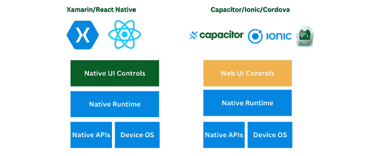

图 2.12 – Xamarin、React Native、Ionic、Cordova 和 Capacitor

正如我们之前讨论的，不同的框架使用如 HTML、JavaScript 和 CSS 等 Web 技术来构建移动应用，以模拟原生应用的体验。让我们解释一下 PWA 背后的概念。

## PWA

PWA（[`web.dev/progressive-web-apps/`](https://web.dev/progressive-web-apps/)）是一种旨在模拟原生应用体验的网页应用。除了它们可以在任何设备上运行，无论该设备是否支持现代网页标准外，它们还被称为*渐进式*，因为随着运行它们的设备变得更强大，它们也变得更强大。

PWA 通过使用 HTML、CSS 和 JavaScript 等 Web 技术通过网络浏览器访问。用户还可以将它们安装到设备上，并像使用原生应用一样使用它们，享受离线支持、推送通知、访问硬件（如摄像头和麦克风）等功能，如*图 2.13*所示：

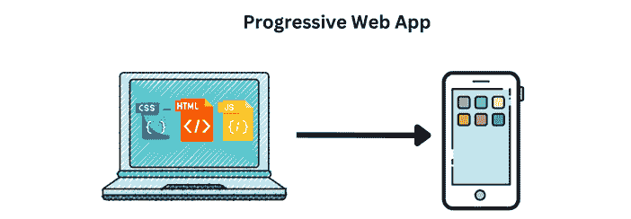

图 2.13 – PWA

PWA 的主要优点之一是它们*易于分发和安装*，因为它们*不需要*应用商店下载。这使得用户可以更轻松地使用应用程序，也使得更新速度更快，在设计和功能方面更具灵活性。

除了提供与原生应用相同的许多优点外，PWA（渐进式网页应用）还可以通过网络浏览器轻松访问，这使得它们在构建移动应用时越来越受欢迎。在一些情况下，当企业或组织希望为用户提供移动应用体验，但又无法为不同平台构建和维护独立的原生应用时，它们可以使用 PWA。

以下是一些流行的 PWA 示例：

+   **Twitter Lite**：这是 Twitter 应用的极简版本，可以直接从任何具有网络浏览器的设备访问

+   **Starbucks（星巴克）**：用户可以通过星巴克 PWA 从移动设备上进行订购、支付和跟踪购买

+   **Trivago**：用户可以搜索并预订酒店，还可以访问他们的历史预订

注意

由于有很多关于跨平台框架的书籍、文章或视频，我不会浪费你的时间进行比较，但我建议根据应用的性质、业务需求、目标和目标受众，以及团队的技能水平来选择框架。

现在我们简要地探讨了不同的移动应用操作系统、框架和平台，让我们来看一看移动应用最有价值的功能。

# 移动应用的最有价值功能

移动应用中包含了众多有价值的功能，满足了用户多样化的需求和偏好。接下来将描述一些最有用的功能。

## 大屏幕和可折叠设备

为了确保你的应用在大屏幕和可折叠设备上正常工作，你需要确保它针对不同的屏幕尺寸进行了优化。这可能意味着重新设计布局，以充分利用额外的屏幕空间，或将应用设置为支持纵向和横向屏幕。

可折叠设备为用户与设备互动提供了新的方式，例如可以在**折叠**或**展开**模式下使用。如图*2.14*所示，当可折叠设备处于折叠状态时，它可能会影响应用的显示和使用方式。在设计应用时，确保考虑到这一点，并进行测试，确保设备在折叠和展开时都能平稳运行。

图 2.14 – 可折叠设备

为了确保你的应用在大屏幕和可折叠设备上看起来既好又能正常运行，请遵循你正在开发的平台的设计指南，例如 Android ([`developer.android.com/guide/topics/large-screens/get-started-with-large-screens`](https://developer.android.com/guide/topics/large-screens/get-started-with-large-screens))。提供一致的用户体验将有助于你的应用与操作系统的其他部分保持一致。你还可能需要投资一些额外的硬件以获得最佳效果。

此外，开发者还必须确保他们的应用*与没有可折叠屏幕的旧设备兼容*，尽管可折叠移动设备是一项相对较新的技术。为了确保应用在所有设备上正常工作，我们需要开发并测试应用的不同版本。在这种情况下，测试自动化可以帮助实现这一目标。

因此，QA 工程师需要确保应用和自动化测试能够帮助他们在测试大屏幕和可折叠设备上的应用时实现这一目标。这个挑战可以通过使用截图测试或**人工智能**（**AI**）测试工具来解决，该工具能够检测 UI 屏幕并进行对比。在*第五章*《实现强大的移动应用测试策略》中，我们将讨论大屏幕和可折叠设备的测试实践。

## 深度链接

在移动应用中，**深度链接**是允许用户通过点击应用内的链接直接访问应用中特定内容或功能的链接，而不需要手动导航到相关内容。

深度链接有多种方式可以用于推广应用内的内容，或者让用户快速访问应用内的特定功能或特性。它们可以被包含在电子邮件营销、社交媒体帖子或其他类型的营销材料中，鼓励用户与应用互动。

除了改善用户体验，深度链接还可以用于将用户引导到他们希望快速且轻松访问的内容或功能。例如，深度链接可以用于将用户引导到电子商务应用中的特定产品页面，或游戏中的特定界面，如*图 2.15*所示：

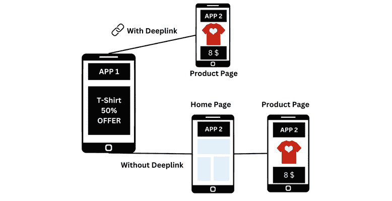

图 2.15 – 深度链接的工作原理

需要注意的是，要使用深度链接，应用必须已安装在用户的设备上。如果应用未安装，深度链接通常会将用户重定向到应用商店下载该应用。

对开发人员和 QA 工程师来说，另一个挑战是如何测试深度链接，这将在*第五章*《实施健壮的移动应用测试策略》中讨论。

## 碎片化

iOS 和 Android 应用在设备和操作系统上出现碎片化是常见现象。由于操作系统的升级和新设备的发布，更频繁地测试移动应用显得尤为重要。Android 和 iOS 设备的碎片化以及与硬件相关的错误是常见问题。

设备的制造商、屏幕尺寸、连接类型、电池寿命、分辨率和操作系统版本可能会有所不同，如*图 2.16*所示：

图 2.16 – 设备和操作系统碎片化

对开发人员来说，开发和维护跨所有设备和操作系统的应用可能是一项挑战，因为设备碎片化可能让他们在创建和维护应用时遇到困难。例如，一款在某设备上运行完美的应用，可能在另一款配置不同的设备上出现性能问题或显示故障。

团队需要在不同设备和操作系统版本上尽早并频繁地测试他们的移动应用，以增加测试覆盖率并确保我们的移动应用表现正确，这一点非常重要。

除了碎片化问题，企业可能由于不支持的设备和操作系统而失去潜在客户和收入。

在这种情况下，你可以使用云设备服务来设置不同的设备和操作系统版本，确保支持所需的设备。我们将在*第五章*《实施健壮的移动应用测试策略》中一起探讨市场上不同类型的设备实验室。

## 本地化

移动应用的**本地化**是指将其适配为特定语言或文化的过程，如*图 2.17*所示。相关任务包括翻译应用的文本和界面，调整图片和图形以符合不同的文化习惯，并根据当地需求调整应用的功能。

本地化移动应用非常重要，原因如下：

+   它有助于覆盖更广泛的用户群体，从而帮助你扩大用户基础，接触更多的受众。

+   它改善了不精通应用语言的用户体验，同时也改善了精通应用语言的用户体验。通过提供应用本地语言的内容，用户可以更好地与应用产生联系，因为他们可以接收与自己文化和语言相关的内容。

图 2.17 – 本地化

要本地化移动应用，需要考虑几个因素，包括你打算针对的语言和文化、可用的资源和预算，以及在本地化过程中可能遇到的技术挑战。

此外，你还需要考虑随着时间的推移，如何维护和更新本地化版本的应用程序，因为语言和文化会不断变化和演变。*第五章*，*实施强健的移动应用测试策略*，讨论了如何通过屏幕截图和其他方法测试移动应用的本地化。

## 可访问性

在移动应用中，**可访问性**是指开发和设计能让残疾人士（如视力或听力障碍者）使用的应用程序，如*图 2.18*所示。你必须确保你的移动应用具有可访问性，因为这将使更广泛的用户群体能够使用并从中受益，同时提升所有用户的体验。

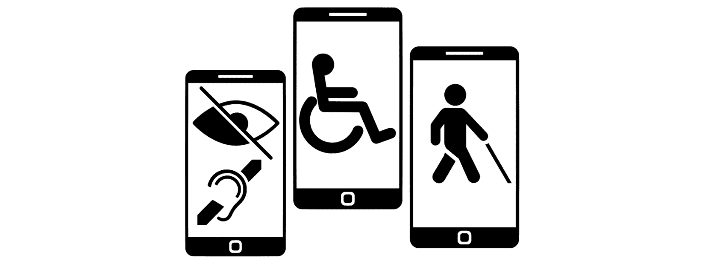

图 2.18 – 可访问性

移动应用可以通过以下几种方式实现可访问性：

+   对于有视力障碍的用户，确保*文本格式正确，且文本与背景之间有足够的对比度*尤其重要。

+   为了确保有视力障碍的用户能够理解内容，请为图像、视频及*其他媒体*提供*替代文本*。

+   有听力障碍的用户可能会从*音频和视频内容的字幕和文字记录*中受益。

+   *语言应该清晰简洁*。避免使用可能令某些用户困惑的行话或技术术语。

+   *遵循可访问性指南*和最佳实践。

+   *使用辅助技术进行测试*，如屏幕阅读器或文本转语音软件。在*第五章*，*实施强健的移动应用测试策略*中，我们将更详细地讨论这一点。

通过实施这些和其他可访问性措施，您可以确保您的移动应用对更广泛的用户群体可用，并改善所有用户的体验。

## 推送通知

**推送通知**是一种从服务器发送到移动设备的消息，通知用户有关新内容、交易、事件或更新的信息。

用户可以在收到新邮件、任务完成或新功能可用时接收推送通知。推送通知也可以用于推广产品和服务，或鼓励用户使用应用，正如以下截图所示：

图 2.19 – 推送通知

只有用户选择并授权应用发送推送通知时，才能接收到推送通知。通常，用户可以在应用设置或操作系统的设置中进行授权。

即使应用没有运行，用户也会通过推送通知收到提醒，这使得推送通知成为与用户互动的有用工具。然而，不应过度使用推送通知，因为过多的通知可能会让用户感到烦扰，甚至可能导致用户禁用通知或卸载应用。推送通知的测试具有挑战性，但我们将在*第五章*，*实施强大的移动应用测试策略*中讨论这一点。

## 离线功能

在移动应用中，对**离线功能**的需求通常是最大的。除了应用必须在用户是否有网络连接的情况下都能正常工作外，一些应用（如外勤工作应用）还可以在网络连接较差或完全没有网络的地方使用，正如以下截图所示：

图 2.20 – 启用离线功能

当互联网连接不可靠或无法使用，或者用户不想产生数据费用时，此应用设计为即使没有互联网连接也能正常工作。

开发人员可以通过以下策略在移动应用中启用离线功能：

+   移动应用可以*在设备上本地缓存数据*，例如图片或文本，并在设备离线时访问这些缓存文件，从而使用户在没有互联网连接的情况下仍能使用应用的某些功能。

+   当互联网连接可用时，应用可以*在设备与服务器之间同步数据*，使用户能够随时在线访问最新信息。

+   设备可以作为本地存储使用，例如*SQLite*设备，当应用安装时存储数据，并在离线时访问这些数据。

+   内容可能会在服务器上渲染，并通过服务器端渲染缓存到设备上。在某些情况下，应用可能会在服务器上渲染某些内容，并将其缓存到设备上，以便在设备离线时仍然能够显示这些内容。

测试连接性也是一个挑战，因为你必须使用真实设备来测试各种连接类型和条件，这需要测试实验室和良好的测试设计。别担心——在*第五章*中，*实施稳健的移动应用测试策略*会详细讨论这一问题。

## 盈利

**盈利**的目标是为应用开发者创造收入，同时为用户提供价值。盈利策略根据应用和其受众的不同而有所不同，可能涉及多种不同方法的组合。

应用内购买是一种功能，允许用户在移动应用内购买额外的内容或功能。这些购买通常通过用户的应用商店账户直接在应用内完成，如下图所示：

图 2.21 – 盈利

使用多种支付方式（如信用卡、PayPal 或 Apple Pay 等移动支付服务）可以进行应用内购买。开发者可以设置应用内购买的价格，这些购买可以是一次性购买，也可以是订阅。

*第五章*，*实施稳健的移动应用测试策略*，将讨论如何测试 Android 和 iOS 设备的应用内购买，并介绍实现这一目标所需做的事情。

## 模块化

在移动应用中，**模块化**是指将应用*划分为更小、更独立的模块或组件*。代码可以更容易地在应用的其他部分或未来的项目中复用，从而节省时间和精力。

模块化过程还可以通过让你仅加载需要的模块，而不是一次性加载整个应用，从而*提高应用的性能*。因此，你可以在不影响其他部分的情况下修改某个模块，使得应用的维护和更新变得更加容易。

各个模块之间的交互可以通过使用如**依赖注入**（**DI**）或**控制反转**（**IoC**）等技术来管理，如下图所示：

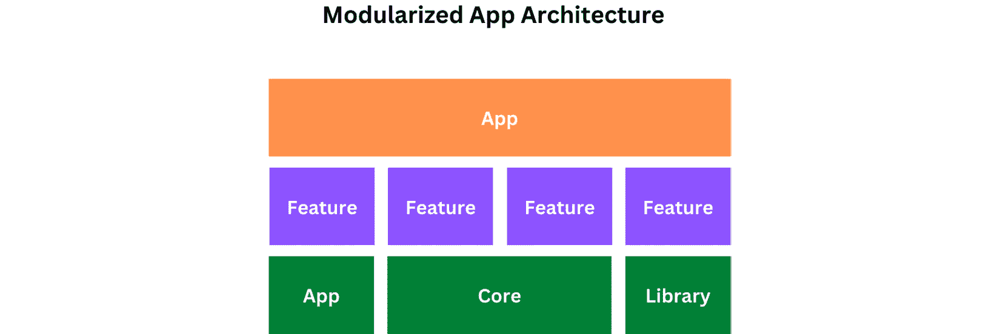

图 2.22 – 模块化的应用架构

移动应用开发可以通过模块化架构带来多种好处：

+   *跨不同部分或不同应用重用模块的能力*减少了编写新代码的需求，加快了开发进度。

+   模块化架构*简化了应用的维护和更新*，因为可以在不影响整个应用的情况下对单个模块进行更改。

+   通过添加新模块或修改现有模块，*模块化架构使应用能够在成长和发展过程中进行扩展*。

+   使用模块化架构更容易测试应用程序，因为*每个模块可以单独测试，从而减少错误* *或 bug* 的风险

注意

欲了解更多信息，您可以访问以下链接—例如，查看如何将 Android 应用进行模块化：[`developer.android.com/topic/modularization`](https://developer.android.com/topic/modularization)。

## 性能优化

由于用户期望移动应用响应迅速且快速，**性能**是一个重要的考虑因素。

在多种设备和网络上测试应用程序很重要，以确保它在真实世界条件下表现良好。各种移动性能优化工具和库（如**Flipper**，[`github.com/facebook/flipper`](https://github.com/facebook/flipper)）可以用于此目的。此外，我们可以使用不同的实践来优化移动应用性能，如下所示：

+   **缓存**减少了应用程序发出的网络请求次数，并提高了其整体性能

+   编写干净、高效的代码，以最小化资源使用并减少应用程序的加载时间

+   使用**性能分析工具**可以揭示应用程序的瓶颈或问题，并提供有关其性能的详细信息

+   使用较小的、更优化版本的图像和视频可以*最小化资源的使用*

+   您可以通过**性能**监控工具来识别和诊断应用程序中的性能问题

+   如果您*减小应用程序的大小*，其下载和安装时间将更快

下一章将讨论如何使用缓存来改善应用程序的构建过程，尤其是在 CI/CD 流水线中，如何使用工具来减少应用程序的大小和提高性能。

正如我们所讨论的，模块化是指将应用程序分成更小的、独立的模块或组件，了解移动应用架构及其设计良好的考虑因素是非常重要的。

# 移动应用架构

移动应用架构描述了应用程序的设计和结构，如下图所示。它包括所有组件及其之间的关系，以及为开发所选的设计模式和框架：

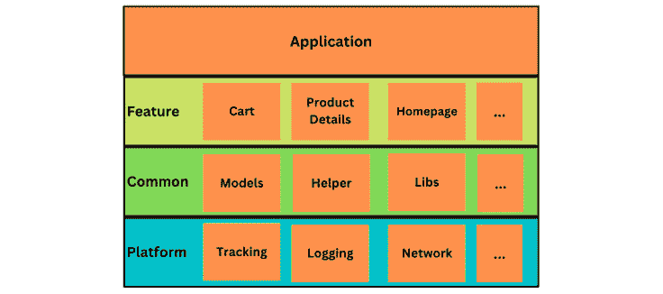

图 2.23 – 购物应用架构示例

设计移动应用架构需要考虑多个因素，包括以下几点：

+   架构将受到应用程序开发和运行平台的影响（例如，iOS；Android）

+   组件和设计模式将由应用程序的功能决定

+   一个设计良好的架构应在设计时考虑应用程序的性能

+   可扩展架构对于应用程序随着人气和使用量的增长非常重要

这里提供了一些移动应用架构的最佳实践：

+   设计你的应用，使其可以通过将其划分为更小的独立模块，轻松进行更新或替换。

+   通过使用清晰的命名约定和遵循已建立的编码标准，使你的代码库更易于阅读和维护。

+   考虑使用**最小可行产品**方法。从用户认为有价值的最小功能集开始，根据需要进行迭代。

+   确保你的应用可扩展，能够处理大量数据和多个用户而不导致性能下降。

+   根据新技术和新特性调整你的设计：使用一种灵活且可适应的架构。根据平台，有多种架构可供移动开发使用，例如以下几种：

    +   **模型-视图-控制器** (**MVC**) ([`shorturl.at/bjuO0`](https://shorturl.at/bjuO0))

    +   **模型-视图-呈现器** (**MVP**) ([`shorturl.at/hkHWX`](https://shorturl.at/hkHWX))

    +   **模型-视图-视图模型** (**MVVM**) ([`shorturl.at/fptP2`](https://shorturl.at/fptP2))

    +   **视图-交互器-呈现器-实体-路由** (**VIPER**) ([`www.objc.io/issues/13-architecture/viper/`](https://www.objc.io/issues/13-architecture/viper/))

    +   **视图 - 交互器 - 呈现器** (**VIP**) ([`github.com/thetay55/VIP-Architecture/blob/master/VIP_Architecture.md`](https://github.com/thetay55/VIP-Architecture/blob/master/VIP_Architecture.md))

    +   **可组合** ([`github.com/pointfreeco/swift-composable-architecture`](https://github.com/pointfreeco/swift-composable-architecture))

    +   **Redux** ([`www.kodeco.com/books/advanced-ios-app-architecture/v3.0/chapters/6-architecture-redux`](https://www.kodeco.com/books/advanced-ios-app-architecture/v3.0/chapters/6-architecture-redux))

+   通过使用自动化测试和持续集成，确保你的应用程序是可靠的。

+   创建一个可维护的架构，采用设计模式和实践，使得应用的更新和维护更加便捷。

+   通过使用依赖注入（DI）使你的应用更具灵活性和可测试性。

+   确保你的后台和前端之间的网络层是稳健且高效的。

+   确保你的应用数据存储在高效且可靠的数据库中。

+   通过实现强大的错误处理机制来改善用户体验。

+   使用强大的日志机制可以使故障排除和调试变得更加容易。

为了为客户提供更好的用户体验，移动应用开发者应遵循这些实践，使其应用性能更好，提供更佳的用户体验。

# 总结

当我们一起踏上这段旅程，探索移动平台、框架以及移动设备独特功能的复杂世界时，我们越来越明显地发现，这些为从事移动开发的人员，包括开发者、QA 工程师、发布工程师等，带来了许多挑战。这些平台和技术复杂且不断演变，要求我们保持警觉和积极主动的态度，持续寻求创新解决方案，克服我们面前的障碍。

我们应对这些挑战的一种方法是通过利用自动化来简化和增强移动应用开发过程。无论是在构建、测试、发布还是监控方面，自动化都提供了诸多好处，可以极大地帮助我们高效地开发高质量、可靠的移动应用。

通过全面了解这些不同的移动平台、框架和功能，我们可以自信地应对前方的挑战，利用自动化作为强大的工具，在我们创造优秀移动应用的过程中不断前行。因此，让我们继续探索和发现，拥抱我们面前的障碍和机会，始终努力突破移动开发领域不断变化的可能性边界。

我们的下一章将讨论 Mobile DevOps 的基础知识，以及如何在接下来的章节中开始实施的实际步骤。
