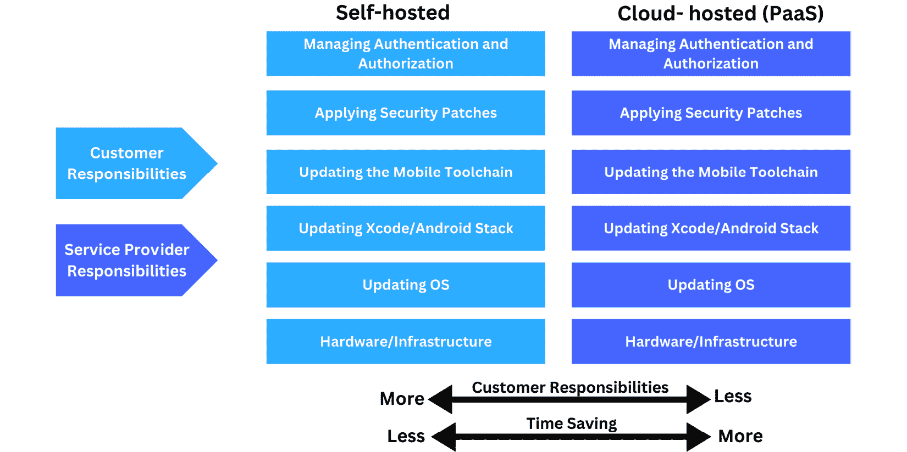

# 第三章：Mobile DevOps 基础

毋庸置疑，Mobile DevOps 正迅速成为移动开发过程中的一个关键部分，使团队和组织能够快速开发和发布移动应用程序。我们将讨论 Mobile DevOps 的基础，并介绍它如何通过这一过程帮助您的团队实现移动开发目标。

在本章中，我们将涵盖以下主题：

+   移动持续集成/持续交付（CI/CD）基础

+   在自托管和基于云的持续集成/持续交付（CI/CD）之间做出选择

+   我们需要一名 Mobile DevOps 工程师吗？

听起来很有趣！让我们开始向 Mobile DevOps 进军吧。

# Mobile DevOps 的重要性

如今，企业越来越依赖移动应用程序。DevOps 是移动开发过程中的关键部分，因为它管理着移动应用的开发和发布。为了简化开发过程并提高移动应用的质量，采用了 CI、**持续测试**（**CT**）、CD 和持续部署等技术。

这是一种开发移动应用的方式，*强调开发、质量、产品和运维团队之间的协作*，以确保移动应用能够*快速、频繁且可靠地交付*，如下图所示：

图 3.1 – Mobile DevOps

通过 Mobile DevOps，团队可以*更有效、更高效地协作*，因为他们可以*更快地开发和发布移动应用程序*，并且错误较少（尽可能地），因为他们可以更多地合作。这有助于*缩短开发移动应用的时间*，同时确保应用程序*符合质量、安全性和性能*标准。

在*第一章*，*解决 Mobile DevOps 中的挑战*中，我们讨论了传统的移动应用开发往往是*缓慢、容易出错且孤立的*。开发者通常是单独工作，将工作交给质量团队进行测试，然后再交给运维团队进行部署和发布。这个过程通常很慢，导致了*关键问题、延迟、糟糕的用户体验*和*不满情绪*。

因此，Mobile DevOps 正在改变移动应用程序的开发和维护方式。它涉及运用 DevOps 原则和实践来提升移动应用开发的速度、安全性和质量。

Mobile DevOps 的许多优势可以总结如下：

+   更快的开发周期

+   不同团队之间的协作改善

+   更好的质量保证实践

+   高效的部署过程

+   快速响应客户反馈

+   通过自动化节省成本

+   部署时间减少

+   确保应用程序安全并符合规定

Mobile DevOps 过程对寻求最大化移动开发努力的组织来说，已被证明是极为宝贵的。

让我们深入探讨并了解更多关于移动 DevOps 的基础知识。

# 移动 CI/CD 基础

如果你熟悉 Web 应用、后台服务或其他类型应用的 DevOps 基础知识，你已经了解了**CI/CD**的概念。在移动端也是一样，只是需要一些特定的任务来构建、测试和发布移动应用。

在进入 CI/CD 部分之前，我想先给你介绍一下准备阶段，也就是规划阶段。

## 持续规划

作为一个团队，我们应该就实施移动 DevOps 和 CI/CD 的过程达成一致。**持续规划阶段**涉及从利益相关者收集需求、创建项目计划并确定必要的资源。这是确保应用满足用户需求并与整体业务目标一致的重要步骤。

此外，我们还需要清楚地定义你希望通过移动 CI/CD 策略实现的目标。这可能包括提高发布的速度和质量、增加团队成员之间的合作，或减少错误的风险。

可以用来改善 DevOps 实践的框架之一是**CALMS**（[`www.atlassian.com/devops/frameworks/calms-framework`](https://www.atlassian.com/devops/frameworks/calms-framework)），如*图 3.2*所示。它也可以应用于移动 DevOps，优化开发、测试和发布移动应用的过程：

图 3.2 – CALMS 框架

CALMS 可以用来实现以下目标：

+   团队可以通过协作和共享知识与资源，更快地识别和解决问题，从而交付更高质量的应用。

+   合作与沟通能够提升团队士气和生产力，进而提高效率和生产力。

+   通过确保每个成员了解项目目标和进展，团队可以避免误解和错误。

+   团队成员之间的沟通与合作可以促进更快的决策，进而提高项目进展的效率。

CALMS 有五个主要组成部分，如下所示：

+   **文化**：本质上，这指的是团队的价值观和信念，以及团队的整体工作环境和动态。每个团队都需要积极的文化才能取得成功。

+   **自动化**：自动化工作流减少了手动干预的需求，并通过使用工具和流程最小化错误的机会。

+   **精益**：在整个开发过程中，精益方法旨在最大化价值并最小化浪费。作为这一过程的一部分，需要识别并消除不必要的步骤，简化工作流程，并持续改进过程。

+   **衡量**：识别改进领域需要收集和分析数据。指标可以包括交付时间和周期时间，以及缺陷率。

+   **共享**：当知识和资源在部门内外共享时，协作和效率会得到提升。定期的团队会议、结对编程和代码审查都可以促进这一点。

现在我们已经确定了您的移动 CI/CD 策略应该实现的目标，让我们进一步了解 CI/CD 流程。

DevOps 文化是为组织构建有能力的工程团队的关键组成部分。它在向需求旺盛且具有广泛职业选择的工程师展示公司质量方面起着重要作用。

## 持续集成

**持续集成**（**CI**）定期且可靠地进行增量代码更改。CI 使得*自动化构建和测试过程*得以实施，从而在代码更新合并到代码库或特别合并到主分支或主分支之前，使得更新可靠，我们必须始终执行此操作，以保持主分支始终无冲突或错误，因为它是我们业务的主要来源。如果需要发布新版本，这是基准，如下所示的屏幕截图所示：

图 3.3 – CI 流程

移动应用的 CI 流程主要包括以下步骤：

+   从代码库克隆源代码

+   构建应用二进制文件

+   运行不同类型的测试，如单元测试、集成测试、UI 测试等

+   根据应用类型创建并部署工件（`.aab` 或 `.ipa`），这些工件稍后可用于分发。

## 持续测试

**持续测试**（**CT**）的实践是将测试作为开发过程的一部分，而不是等到周期结束后再进行测试。高质量的应用程序对移动应用尤为重要，因为它们通常由许多用户使用，并且消耗大量数据。

移动应用可以通过多种方式进行持续测试，例如：

+   在开始测试之前，确定一个清晰的移动测试策略。

+   在整个开发过程中，确保在初始阶段就开始应用测试，并逐步进行。

+   遵循自动化测试流程，使用不同的测试工具执行测试，如单元测试、集成测试、UI 测试等，而无需人工干预。这对于以一致且及时的方式运行大量测试尤其有用。

+   可以通过基于云的测试，在各种设备和操作系统上运行测试，无需拥有或维护设备。通过在多种设备上测试应用，您可以确保其正常工作。

+   确保在真实的移动设备上测试 UI，而不仅仅是在仿真器或模拟器上。

+   执行足够的性能、压力和安全性测试。

+   进行测试以评估应用程序的互操作性、电池消耗和**容错性**（**FT**）。

在*第五章*，*实施强大的移动应用测试策略*中，我们将深入探讨移动测试策略、工具和框架。

## 持续交付

一旦这个过程顺利完成且没有错误，代码就可以通过**持续交付**（**CD**）过程快速且轻松地部署；否则，如果有任何错误，过程将停止，并将错误报告给开发人员修复，如下图所示：

图 3.4 – CI/CD 过程

一旦代码提交或变更合并到中央分支（如 main、master 等），CD 会自动将通过 CI 检查的构建版本交付到生产环境（如预发布环境），在那里进行测试和审查，然后才会发布到生产环境。

*目标是自动化开发和部署流程，以确保快速、可靠且符合预算的移动应用交付。*

移动应用的 CI/CD 过程主要包括以下几个步骤：

1.  将构建版本发布给 QA 团队进行额外的检查和测试。

1.  如果公司或团队已经参与该程序，则将构建版本发布给 Beta 测试人员。

1.  如果一切正常，之后，发布经理或任何负责发布过程的人可以批准该构建并将其发布到应用商店或生产环境中。

## 持续部署

持续部署通常是 CI/CD 管道的一部分，这意味着部署到代码库的代码将自动部署到生产环境，或者在我们的移动应用案例中，将被部署到 App Store。CI/CD 管道通常被称为这些实践的组合，如下图所示：

图 3.5 – CI/持续部署过程

持续部署过程自动化了应用构建的部署，防止人工干预。唯一会阻止新变更部署到生产环境的情况是构建或测试失败。这种方式用于加速应用生产并更快获得客户反馈。

## 持续监控

在我们将移动应用发布到生产环境后，这并不是 CI/CD 生命周期的结束，而是进入了另一个阶段。**持续监控**（**CM**）涉及监控应用的性能并收集用户行为数据，如*图 3.6*所示。

这有助于组织改善用户体验、识别潜在问题，并优化移动应用程序的性能。收集的数据可以包括设备性能、网络状况、应用崩溃、用户行为等信息。通常，使用先进的分析工具和技术来分析这些数据，从而提供有关移动应用性能和用户体验的洞察。在 *第七章*，《建立移动应用监控、可观察性和分析》中，我们将深入探讨移动应用的监控和分析工具，并学习如何有效地将它们与移动 CI/CD 和 DevOps 一起使用：

图 3.6 – CI/CD 的完整过程

有效且具体的移动 CI/CD 平台由一系列不同的移动 DevOps 工具组成，用于解决特定的业务挑战。通过连接移动开发人员、质量工程师和客户，它们确保了一个有利可图的循环。

正如我们发现的，建立移动 DevOps 流程并不容易。自动化流程需要持续的实验和完善。

因此，我强烈建议在你决定开始移动 DevOps 之旅后，*从小做起，逐步建立移动 DevOps 工具链和 CI/CD 管道*。

根据我之前的经验，我相信如果你尝试一次性实施所有流程和步骤，你会失败并感到沮丧。相反，应该慢慢来，一步步建立；成功是小小努力的总和。

在我看来，如*图 3.7*所示，移动 DevOps 之旅分为三个阶段：

+   **起始阶段/CI 阶段**：只实现最小化的 CI 管道，通过克隆源代码、运行静态分析代码或 lint，并运行单元测试。

+   **履行承诺阶段——移动 CI/CD 部分管道**：通过添加其他一些步骤，如在云设备上运行 UI 测试、生成 UI 测试报告，并根据需求运行安全或性能测试，持续改进第一阶段的管道。此阶段还可以包括将应用程序发布给 QA 团队或相关利益方，并向不同团队发送关于状态的通知。

+   **持续阶段——完全自动化的移动 CI/CD 管道**：添加更多步骤来实现完全移动 CI/CD，例如将应用程序发布给测试人员和应用商店的步骤，以及通过并行运行 UI 测试来减少构建时间，或添加其他步骤来提高 CI/CD 管道的质量：

图 3.7 – 移动 DevOps 实施阶段

使用这种方法将始终帮助团队改进移动 DevOps 过程，并增强发布过程的性能。这些职责可能由平台工程团队、内部开发者生产力团队或移动工程团队承担，具体取决于组织内部的团队拓扑结构。在 *第四章*，*使用移动 DevOps 实现持续集成和交付*，我们将开始使用不同平台实现移动 CI/CD 流水线的实施阶段。

现在我们已经讨论了移动 DevOps 的基础知识，并解释了流程的每个阶段，让我们一起探讨移动 DevOps 和移动应用开发的好处以及 CI/CD 的好处。

# CI/CD 对移动应用开发的好处

拥有移动 CI/CD 比仅仅提高现有流程效率有更多正面影响，原因如下：

+   它使开发人员能够专注于编写代码并监控生产中的移动应用

+   更快的部署时间和更快的市场交付

+   所有版本的移动应用程序都可供 QA 和产品利益相关者访问

+   测试结果、代码更改日志和发布日志始终可用

+   提升沟通与生产力

+   提升员工参与度

+   客户更加满意

确定移动 CI/CD 流水线中将使用的工具和技术。版本控制系统、构建自动化工具、测试框架或部署平台可能包含在此列表中。

## 移动 DevOps 的工具和基础设施

正如我们之前讨论的，移动 DevOps 是一组旨在简化移动应用开发和发布的实践、工具和基础设施。它实现了持续集成、测试、交付和监控，确保开发人员能够快速迭代、部署和维护高质量的移动应用。移动 DevOps 基础设施的关键组成部分如下所述：

+   版本控制管理系统，如 GitHub，允许团队跟踪其代码库的更改并进行协作。在 *第九章*，*移动 DevOps 最佳实践*，我们将更多地了解诸如单体仓库之类的不同 Git 仓库类型，以及如何使用它们。

+   自动化构建和测试过程的工具，如 Gradle、面向 Android 的 Gradle Enterprise 或 iOS 的 Fastlane，允许开发人员专注于编写代码而不是构建和测试。在 *第四章*，*使用移动 DevOps 实现持续集成和交付*，我们将更多地了解实践中移动应用程序的不同构建工具，以及如何使用缓存来加速这些工具的构建时间。

+   **用于在各种物理设备上测试应用的实验室**：这些实验室通常托管在云端，允许团队在多个设备上测试应用程序。在*第五章*中，*实现强大的移动应用测试策略*一章，我们将了解使用云设备加速测试过程的最佳实践。

+   用于部署和管理移动应用后端服务的基础设施由云平台提供，如**Amazon Web Services**（**AWS**）、**Google Cloud Platform**（**GCP**）或 Azure。在*第九章*中，*移动 DevOps 最佳实践*一章，我们将了解如何将云服务与移动应用结合使用。

+   测试工具如 Appium、Espresso、XCUITest 和 Detox 可以自动化测试不同平台和设备上的移动应用。在*第五章*中，*实现强大的移动应用测试策略*一章，我们将学习各种测试工具的差异，以及哪些工具或框架适合我们的团队。

+   使用 fastlane 等工具，管理移动应用分发过程，如自动管理代码签名、证书、配置文件和密钥库，变得更加简单。在*第六章*中，*移动应用发布管理*一章，我们将学习如何使用不同的工具（如 Firebase App Distribution、fastlane、TestFlight 等）自动将应用分发给 Beta 用户或 App Store。

在我看来，移动 CI/CD 流水线就像乐高玩具——你总是在使用不同的工具、配置和依赖。你所需要做的就是决定你的流水线应该是什么样子的。

当你玩乐高积木时，你会感觉自己像个建筑师。你可以通过构建不同的形状和结构来创造不同的结果。

构建适合自己需求的移动 CI/CD 流水线的核心思想是知道如何正确使用各个组件。构建移动 CI/CD 流水线没有固定的模板，关键是始终实施适合自己需求的步骤。

通过移动 DevOps，开发人员、测试人员、产品经理和发布管理团队可以更加高效地协同工作。

DevOps 和 CI/CD 基于快速开发、测试和发布的理念，这使得技术能够快速迭代。

这是一种紧密契合公司需求的理念，从初创公司到大型企业都可以受益。企业需要能够快速将产品推向市场，并不断提高质量，以获得竞争优势。

制定移动 CI/CD 策略是确保成功交付移动应用的关键部分。它涉及创建一个自动化开发、测试和部署应用的过程，帮助确保应用具有高质量并能快速发布。

因此，团队或组织应该选择适合业务和**投资回报率**（**ROI**）的移动 DevOps 和 CI/CD 平台。让我们比较自托管和基于云的 CI/CD 选项，以了解哪种选项或选择最适合我们的组织。

## 选择自托管和基于云的 CI/CD 之间的区别

使用**自托管 CI/CD**，组织可以完全控制其环境和数据。作为额外的好处，从长远来看，这种方式可能更具成本效益，因为组织可以通过利用现有基础设施避免云服务的费用。

例如，如果团队已经为 Web 应用、API 和后端服务使用了 CI/CD 平台，它就需要将移动部分集成进去。

这需要教育 DevOps 团队了解移动应用的要求，以便能够将移动部分添加到现有的 CI/CD 平台中，例如配置所需的硬件和软件，并实现支持移动发布流程所必需的流程和前提条件，以便将应用发布到应用商店，如应用签名、上传证书、配置配置文件以及创建密钥库。

此外，设置自托管的 CI/CD 解决方案可能*非常耗时*，并且可能需要*专业知识*。此外，团队还需要承担*维护和更新其环境和基础设施*的责任，这可能对资源造成负担。

另一方面，**基于云的 CI/CD** 解决方案相较于自托管解决方案有几个优势，具体包括：

+   *设置和维护它们的过程通常更容易*，并且它们具有更好的可扩展性。由于基于云的服务可以*远程访问*，它们也更加便捷。此外，它们可以更加*灵活*，因为它们可以*轻松地与其他工具和服务集成*。基于云的 CI/CD 通过提供异地托管，消除了对现场基础设施的需求。通过允许立即使用 CI/CD，基于云的 CI/CD 可以*减少成本和设置时间*。

+   云中的 CI/CD 还具有可扩展性，可以轻松扩展或缩减资源。

除了其好处，基于云的 CI/CD 也有一些缺点。对数据缺乏控制可能带来安全隐患。此外，基于云的服务费用可能迅速增加，特别是当组织需要使用多个服务时，因为必须监控机器和构建的费用。

需要注意的是，这还取决于项目的具体需求和要求，以及组织的规模和资源。如以下屏幕截图所示，自托管 CI/CD 可能耗时，但它更具可定制性；另一方面，云 CI/CD 可以通过管理必要的任务（如更新基础设施或技术栈）帮助开发者节省时间：

图 3.8 – 自托管与云托管（PaaS）CI/CD

基于云的 CI/CD 解决方案可能是 *小团队或初创公司* 的最佳选择，而更大的组织可能更倾向于拥有 *更多的环境控制，并选择自托管解决方案*，但最终选择总是取决于团队的期望和需求。

基于云的 CI/CD 版本通常被称为 **CI/CD 即服务**。CI/CD 工具由专门的组织开发、维护并托管，客户可以通过互联网访问。

相比之下，自托管的 CI/CD 意味着你要么构建自己的 CI/CD 工具，要么使用第三方 CI/CD 工具（通常是开源的）托管在你的基础设施上。它可以是本地服务器或 IaaS 平台，如 AWS、**GCP** 或 Microsoft Azure。

总结来说，这个对比表概述了自托管与基于云的 CI/CD 解决方案之间的主要差异，包括控制、成本、可扩展性和安全等因素。选择哪种方案取决于项目和组织的具体需求：

| **标准** | **自托管 CI/CD** | **基于云的 CI/CD** |
| --- | --- | --- |
| 控制 | 对环境和数据有完全的控制 | 对数据和环境的控制较少 |
| 成本 | 从长远来看更具成本效益；利用现有基础设施 | 成本可能迅速累积；需要监控机器和构建成本 |
| 设置与维护 | 设置耗时；需要专门的技术知识；团队维护基础设施 | 设置更简单；维护需求较少；托管在异地 |
| 可扩展性 | 受现有基础设施的限制 | 高度可扩展；可以轻松扩展或减少资源 |
| 可访问性 | 仅限于内部或本地网络访问 | 可以远程访问；更易于访问 |
| 灵活性与集成 | 可定制；可能需要与其他工具和服务进行更多的手动集成 | 更易与其他工具和服务集成；更灵活 |
| 安全性 | 对数据安全有更高的控制 | 由于对数据的控制较少，可能存在安全隐患 |
| 适用性 | 更适合有资源来管理环境和数据的大型组织 | 更适合需要立即访问和较低前期投资的小团队或初创公司 |
| 实施 | 自建 CI/CD 工具或使用托管在你基础设施上的第三方工具 | 由专门的组织提供的 CI/CD 即服务，客户可通过互联网访问 |

表 3.1 – 自托管与基于云的 CI/CD 解决方案之间的差异

## 移动特定的 CI/CD

**移动 CI/CD PaaS** 是指使用基于云的服务平台来自动化移动应用的构建、测试和部署。移动 CI/CD PaaS 提供商提供一系列工具和服务，帮助组织简化和优化其移动应用的开发和发布过程。市场上有不同的平台提供此类服务，例如 **Bitrise** ([`www.bitrise.io/`](https://www.bitrise.io/))、**Codemagic** ([`codemagic.io/`](https://codemagic.io/)) 或 Apple 的 **Xcode Cloud** ([`developer.apple.com/xcode-cloud/`](https://developer.apple.com/xcode-cloud/))。市场上所有这些平台将会在*第四章*，《实现移动 DevOps 中的持续集成和交付》中进行讨论并展示实例。

移动 CI/CD 服务有以下几个好处：

+   这些平台通常配备了管理代码变更和协作工具，能够与版本控制系统如 GitHub、Bitbucket 和 GitLab 集成。

+   开发人员可以通过自动化构建和测试过程，专注于编写代码，利用移动 CI/CD 服务。

+   云设备的集成：这些平台提供用于跨各种设备和平台测试和部署移动应用的工具。

+   使用监控和分析工具识别并解决移动应用中的问题：移动 CI/CD 服务平台通常提供跟踪移动应用性能和使用情况的工具。

+   与建立和维护内部移动 CI/CD 基础设施相比，移动 CI/CD PaaS 需要的是每月订阅费用，而不是前期投资。

+   组织可以根据需要调整其移动 CI/CD 能力，利用移动 CI/CD 服务的可扩展性。

+   对于那些刚接触移动 CI/CD 或者在此领域缺乏内部专业知识的组织，移动 CI/CD PaaS 可以非常有价值。

+   它通常通过允许移动 CI/CD 服务提供商维护和更新基础设施，释放 IT 员工去专注于其他任务。

+   许多提供移动 CI/CD 服务的供应商提供强大的安全措施，保护移动 CI/CD 过程和敏感数据的完整性。

发布过程可能还需要加速，因为移动应用需要高性能的快速机器来构建、测试和发布应用。在*第四章*，《实现移动 DevOps 中的持续集成和交付》中，我们将深入探讨，了解不同的移动 CI/CD 平台及其优缺点。

在讨论了自托管和云托管 CI/CD 对我们团队的利弊之后，每个团队应该自己决定哪个是最佳选择。现在是时候讨论我们是否需要一个移动 DevOps 工程师，还是可以自己管理。

正如我们讨论了移动 DevOps 和 CI/CD 基础知识，并了解了自托管和云 CI/CD 平台，你可能在想，*我们需要一位移动 SRE 或 DevOps 工程师吗*？这是一个重要的问题，我们来回答一下。

# 我们需要一位移动 DevOps 工程师吗？

最好的答案通常是，这取决于团队的目标、规模、技能和经验。你可以让不同的团队成员负责移动 DevOps 各个阶段，但不要忘记我们之前提到过，这是一项团队合作的工作。然而，如果团队中已经有一位 DevOps 工程师负责公司的 DevOps 实施工作，那么他也可以帮助移动团队，或通过以下方式参与到移动部分工作中：

+   理解移动的 DevOps 实践，例如代码签名和发布移动应用。

+   学习移动应用开发的基础知识。学习新的编程语言，例如 Kotlin 或 Swift，并积累构建移动应用的经验。

+   在你发展云计算知识的过程中，在云端创建、部署和管理移动应用。

+   参与开源项目或从事个人项目，获取在移动 DevOps 项目中动手实践的经验。

+   跟上最新的趋势和移动 DevOps 的最佳实践。

另一方面，经验丰富的移动开发者可能能够承担实施移动 DevOps 的责任，因为他们熟悉移动开发过程、大多数挑战，并且有必要提高他们在移动应用 CI/CD 方面的知识。

有一种观点认为，这是你在工作中采用的一种做事方式和过程。通过理解这四个基本的 DevOps 实践，即使是独立开发者或独立开发团队也能提高他们的生产力。

但就我而言，我认为这可以是两种方法的结合，因为我们可以让 DevOps 工程师和经验丰富的移动工程师一起合作，帮助移动团队更快速、更可靠地实现他们的目标并交付应用。确保有人负责服务器的基础设施，有人负责工具和框架，这一点至关重要。

# 总结

移动 DevOps 是高质量移动应用开发的关键实践。它是一个强大的过程，能够帮助团队快速高效地开发和部署移动应用。通过利用自动化、测试和持续部署，团队可以确保其应用程序稳定、安全并保持最新。借助移动 DevOps，团队可以更快速、更高效地实现他们的移动开发目标。

移动 DevOps 还通过自动化重复性任务简化了开发过程。这使得开发人员可以专注于开发中的创新性方面，例如创建创新功能，而不必担心日常琐事。此外，它确保移动应用遵循最佳实践，并针对特定平台和设备进行了优化。这使得组织能够创建高质量的移动应用，充分满足用户需求。

通过使用自动化、版本控制、云服务、监控与分析以及安全措施，开发人员可以简化开发过程，提高应用的整体质量。在这些实践的帮助下，移动应用开发人员可以更快速、更可靠地交付更好的应用。

CI/CD 流水线的实现将在下一章讨论，首先从 CI 部分开始，探索不同的 CI 提供商和需要遵循的步骤，然后集成 CD 部分，创建我们将在移动应用开发中使用的自动化 CI/CD 流水线。

# 第二部分：实现移动 DevOps 环境

移动 DevOps 依赖于自动化过程来实现移动应用的持续集成和交付。这意味着代码更改会自动构建、测试，并部署到预发布和生产环境，无需人工干预。

本部分包含以下章节：

+   *第四章**，通过移动 DevOps 实现持续集成与交付*

+   *第五章**，实施强大的移动应用测试策略*

+   *第六章**，移动应用发布管理*
