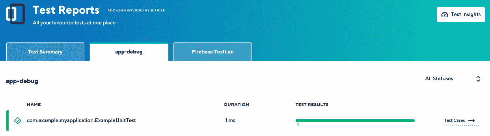
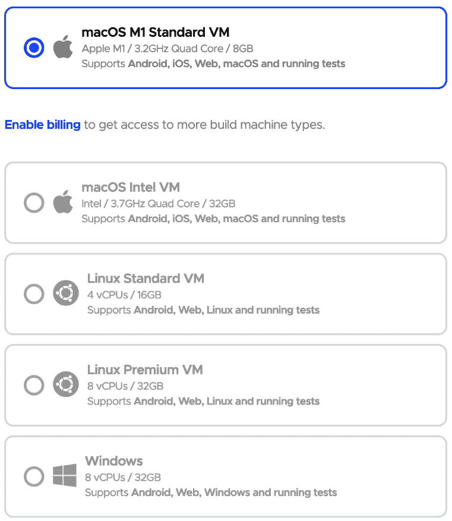
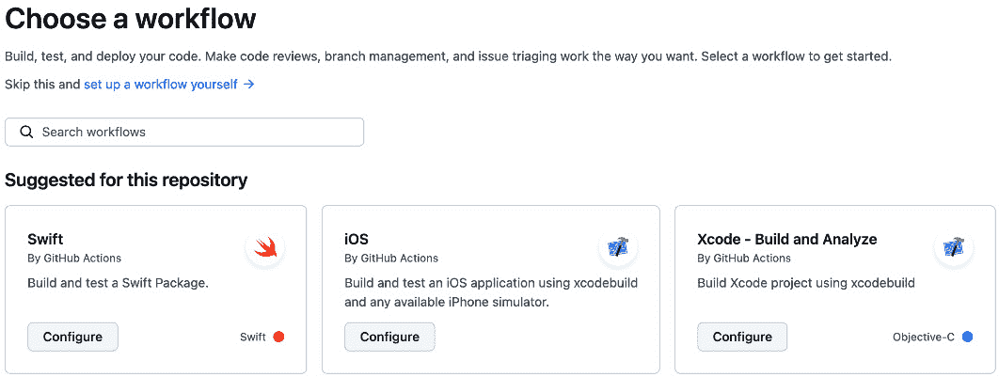

# 4

# 通过移动 DevOps 实现持续集成与交付

在持续交付中，移动应用中的代码更改会自动进行构建、测试和发布。借助移动 DevOps，软件开发人员、测试人员、发布经理和 DevOps 工程师携手合作，以提升移动应用开发的速度和质量。当这些实践结合时，移动应用的交付可以实现持续交付。

本章将讨论以下主题：

+   选择 CI/CD 提供商时需要考虑的因素

+   选择 CI/CD 提供商

+   为移动应用实施 CI/CD 流水线

+   为移动应用设置构建和单元测试

# 介绍

移动应用的 CI/CD 是一个能够让组织快速高效地发布和更新其移动应用的过程。它还允许团队快速测试和发布他们的移动应用，确保代码的稳定性、安全性和最新性。此外，它还允许团队快速解决在移动应用中发现的任何漏洞或问题。

在快速发展的移动应用开发领域，**持续集成**（**CI**）和**持续部署**（**CD**）已成为优化开发流程、提高代码质量和实现快速迭代发布的关键实践。本章将探讨 CI/CD 在移动应用开发中的重要性，阐明其好处，并通过实际案例展示它对移动开发生命周期的影响。

如在*第三章*《移动 DevOps 基础》中提到的，我们将讨论如何在移动 DevOps 中实施 CI 和 CD 的步骤，但首先，让我们讨论如何选择适合您团队规模和业务需求的移动应用 CI/CD 提供商：

图 4.1 – 持续集成工作流程

我们将从 CI 部分开始，自动化构建和测试过程，内容包括以下内容：

+   为移动应用选择 CI/CD 提供商

+   为移动应用设置 CI 服务器

+   为移动应用设置构建和单元测试

在此之前，让我们讨论如何为移动应用选择 CI/CD，如何与市场上最受欢迎的 CI/CD 提供商一起设置 CI 服务器，以及每个提供商的优缺点。

选择适合您移动应用的 CI/CD 提供商至关重要，以确保开发、测试和发布过程的顺利进行。选择移动应用开发项目的 CI/CD 提供商时需要考虑以下因素：

+   **平台支持**：确保 CI/CD 提供商支持您的应用所针对的平台（例如，iOS、Android、React Native、Flutter 等）。某些提供商专注于单一平台，例如 Xcode Cloud，而其他一些提供商支持多个平台，例如 Bitrise。如果您的团队正在构建多个移动应用，请考虑这个因素。

+   **性能和可靠性**：提供商应能提供高性能、最小的停机时间和快速的构建时间。例如，CI/CD 平台提供了洞察和指导功能，用以跟踪我们的 CI/CD 性能和健康状态。这将确保一个顺畅且高效的开发过程。

+   **构建配置和环境**：选择适合你移动应用的 CI/CD 提供商时，要考虑可用的构建配置和构建环境选项。寻找具有灵活构建流水线和可定制环境的提供商，以支持你项目的需求。这些功能能够节省时间和精力，同时确保高效的构建过程和成功的项目部署。例如，大多数公司都在构建白标应用，这些应用需要使用不同的配置进行构建，以便能够在不同的值下复用相同的构建流水线。

+   **可扩展性**：扩展和发展你的团队需要考虑此因素，确保 CI/CD 提供商能够处理日益增长的复杂性、构建频率和应用开发人员的数量。你的提供商应提供可扩展的基础设施和资源，以满足你不断增长的需求，有时还需为你的团队提供专用机器，或者更换机器类型和技术规格。

+   **集成**：提供商应能与现有工具无缝集成，如版本控制系统、项目管理工具、缺陷跟踪工具、云工具、监控工具或特性标记工具，以便能够衡量整个移动 DevOps 过程的成功。

+   **安全性和合规性**：提供商应遵循严格的安全标准，并提供加密、访问控制和审计日志等功能。确保提供商支持你的应用符合特定的合规性要求，特别是如果它是云提供商，并且你的数据和客户的数据将存储在云中，例如在电子银行应用中。

+   **易用性**：选择一个具有用户友好界面、全面文档和良好支持的提供商。如果你遵循这些步骤，CI/CD 流水线就可以更容易地设置、维护和故障排除；例如，Bitrise 和 Codemagic 提供了构建流水线的 GUI。

+   **社区和支持**：通过一个活跃的社区和强大的客户支持，你可以轻松解决问题并得到答复。你可以通过专业论坛、支持渠道或社区论坛了解是否提供专业服务或咨询。

+   **定价**：在我看来，这个因素非常重要，即使 CI/CD 提供商在购买工具时有不同的功能，各种因素也会影响这个决策，因此在考虑每月构建次数、并行构建、构建分钟数和存储等因素时，你需要比较不同 CI/CD 提供商的定价计划。最好的提供商会在不妥协功能的情况下，为你的预算提供最大价值。

因此，选择 CI/CD 提供商最终是一个需要团队根据业务和团队需求做出的决定。

# 六个最受欢迎的移动应用 CI/CD 提供商概述

在讨论了需要考虑的因素后，我们来看看移动 CI/CD 市场上可用的 CI/CD 提供商。以下是六个最受欢迎的移动 CI/CD 提供商：

+   Bitrise

+   Codemagic

+   GitHub Actions

+   Xcode Cloud

+   Visual Studio App Center

+   Ionic AppFlow

要找到最适合你的移动应用项目的提供商，你需要根据前述因素评估每个提供商。

## Bitrise

Bitrise ([`bitrise.io/`](https://bitrise.io/)) 是一个基于云的 CI/CD 平台，专门为移动应用开发设计。它简化了构建、测试和部署 iOS、Android 和跨平台应用的过程，帮助开发者确保他们的应用可靠且高质量：

图 4.2 – Bitrise 主页

Bitrise 的移动优先策略使其成为移动应用开发者的 CI/CD 解决方案，并提供专门针对移动开发工作流的功能和工具。

Bitrise 与流行的版本控制系统（如 GitHub、GitLab、自托管 GitLab 和 Bitbucket）以及移动应用开发工具（如 fastlane、Xcode 和 Android SDK）无缝集成，如*图 4.3*所示：

图 4.3 – Bitrise 的版本控制系统

Bitrise 的可视化工作流编辑器允许开发者轻松设计和配置他们的 CI/CD 管道，而无需手动编辑配置文件，如*图 4.4*所示：

图 4.4 – Bitrise 的工作流编辑器

Bitrise 提供了广泛的预构建和社区步骤，可以轻松添加到工作流中，简化了设置常见移动应用开发任务的过程，如*图 4.5*所示：

图 4.5 – Bitrise 的集成步骤

Bitrise 支持 iOS 模拟器和 Android 模拟器，简化了在各种设备和环境中测试移动应用的过程。

该平台提供免费的（爱好者）计划，包含 90 分钟的构建时长、每月 300 个积分，并支持最多 5 个同时构建，使用 macOS M1 虚拟机，使其对小型项目和个人用户具有成本效益。

升级到高级计划可以为大型项目或团队提供更频繁或更长时间的构建。然而，Bitrise 的定价可能会对需要额外构建能力或功能的大型团队或项目来说较为昂贵。

通过与知名应用商店和测试服务（如 Google Play、Apple App Store 和 TestFlight）的无缝集成，Bitrise 简化了发布流程。

开发人员可以利用 Bitrise Insights 来识别并解决瓶颈，优化构建流程，并更有效地使用积分。

数据和配置设置可以安全存储，确保未经授权的人员无法访问。通过使用 Bitrise 的团队管理功能，开发人员可以在项目中协作并控制对特定工作流和环境的访问。

### 示例

让我们来看一个关于为 Android 创建 Bitrise 应用并进行配置的示例。

### 前提条件

你需要以下内容：

+   一个 Bitrise 账户 ([`app.bitrise.io/users/sign_up`](https://app.bitrise.io/users/sign_up))

+   一个 GitHub 账户 ([`github.com/join`](https://github.com/join))

+   一个 Android 应用

+   一个 Google Play Console 账户或 Apple Developer ID，以便将来可以将你的移动应用发布到相关的应用商店

让我们开始吧！

### 开始使用

请按照以下步骤操作：

1.  要开始使用 Bitrise for Android，你需要选择 **添加新应用**，如 *图 4.6* 所示：

图 4.6 – 添加新应用

1.  然后，选择工作区类型，以指定应用是否具有私人或公共访问权限，如下图所示：

图 4.7 – 选择应用的隐私设置

1.  下一步是从提供商（如 GitHub）选择仓库，如下图所示：

图 4.8 – 选择仓库

1.  然后，选择添加 SSH 密钥，以便能够访问源代码，如下图所示：

图 4.9 – 添加 SSH 密钥

1.  从列表中选择分支名称，并选择 **是，自动检测配置** 选项，让 Bitrise 自动检测应用程序类型，如下图所示：

图 4.10 – 选择分支

1.  Bitrise 将检测到该应用为 Android 应用，并会提供适当的机器类型和堆栈。现在，你可以添加应用模块和变体，如下图所示：

图 4.11 – 选择应用模块

这是项目配置，包括 Android 堆栈和所有其他信息：

图 4.12 – 确认配置

1.  下一屏幕将是**应用图标**。在这里，你可以上传自定义图像或使用应用程序目录中的图标，如下图所示：

图 4.13 – 应用图标

1.  接下来，你必须注册一个 webhook 并触发第一次构建，如*图 4.14*和*图 4.15*所示：

图 4.14 – 注册 webhook

图 4.15 – 运行第一次构建

1.  第一次构建将开始。此时，你可以查看构建日志和构建的详细信息，如下图所示：

图 4.16 – 构建日志详情

1.  一旦构建完成，你可以检查构建的状态，查看它是成功还是失败，如下图所示：

图 4.17 – Bitrise 上的成功构建

1.  之后，你可以点击**工作流编辑器**按钮，查看或修改 CI 工作流，添加或移除步骤，如下图所示：

图 4.18 – Android 工作流

1.  在**工作流编辑器**区域，你可以配置触发映射，或根据 Gitflow 运行工作流时的条件，例如在每次拉取请求、新标签或推送新代码时运行，具体如下图所示：

图 4.19 – 如何在 Bitrise 上触发构建

1.  此外，你还可以为任何第三方工具或服务（如 Slack webhook）添加秘密环境变量，如*图 4.20*和*图 4.21*所示：

图 4.20 – 添加秘密环境变量

图 4.21 – 添加 Slack webhook

1.  你还可以更改堆栈和机器类型，如下图所示：

图 4.22 – 更改堆栈和机器类型

1.  如果工作流中包含任何单元测试或 UI 测试，你可以在**测试报告**插件中访问自动生成的测试结果，如下图所示：

图 4.23 – 测试报告插件

Bitrise 还具有一个 `bitrise.yml` 文件，用于保存你在 `yml` 文件中的所有配置；你可以将其与源代码一起保存，或者保存在 Bitrise 网站上。以下是一个 `bitrise.yml` 文件的示例链接：[`github.com/PacktPublishing/Mobile-DevOps-Playbook/blob/main/Chapter-4/bitrise.yml`](https://github.com/PacktPublishing/Mobile-DevOps-Playbook/blob/main/Chapter-4/bitrise.yml)。

注意

其他应用程序，如 iOS、macOS、Flutter、React Native、Ionic 和 Cordova，使用相同的流程，但步骤会根据类型有所不同。

## Codemagic

Codemagic ([`codemagic.io/start/`](https://codemagic.io/start/)) 是一个完全托管在云端的 CI/CD 解决方案，专为移动应用开发设计，特别强调跨平台项目。

该平台简化了构建、检查和发布 iOS、Android 以及跨平台应用程序的过程，使开发者能够高效地生产高质量的移动应用程序。本分析将涵盖 Codemagic 的优点、缺点和功能，并比较 Codemagic 与市场上其他 CI/CD 解决方案的表现：

图 4.24 – Codemagic 首页

开发者可以通过用户界面或高度可定制的`codemagic.yaml`文件轻松配置 Flutter 构建，从而在 Android、iOS、Web 和桌面平台上创建应用程序。

Codemagic 无缝集成了 GitHub、GitLab 和 Bitbucket 等知名版本控制系统，并兼容各种应用商店、beta 测试服务和通知工具。

该平台简单的设置过程使开发者能够快速建立他们的 CI/CD 管道，而无需深入的技术知识。

通过 Codemagic，开发者可以使用 YAML 配置文件或基于 Web 的配置编辑器设计自定义工作流，赋予 CI/CD 过程更多灵活性和控制权。

该平台提供慷慨的免费套餐，包括每月 500 分钟的构建时间、120 分钟的构建超时限制和 macOS M1 虚拟机，适合小型项目和个人开发者，但需要启用计费才能使用完整功能。

Codemagic 提供专门支持 Flutter 项目的功能，自动检测项目设置并应用构建和测试 Flutter 应用程序的优化。

该平台支持 iOS 模拟器和 Android 模拟器，使开发者能够在各种设备和配置上评估他们的移动应用程序。

Codemagic 与 Google Play 和 Apple App Store 等流行的应用商店以及 TestFlight 等 beta 测试服务集成，简化了部署流程。

敏感数据和配置设置可以安全存储，确保不会在日志中泄露或被未经授权的用户访问。

Codemagic 还包括无限的团队席位和访问管理功能，方便项目协作，并允许开发者控制对特定工作流和环境的访问。

### 示例

在这个示例中，我们将使用 Codemagic 构建和测试一个 Flutter 应用程序，并根据我们的需求进行配置。

### 前提条件

你将需要以下内容：

+   Codemagic 账户 ([`codemagic.io/signup`](https://codemagic.io/signup))

+   GitHub 账户 ([`github.com/join`](https://github.com/join))

+   Flutter 应用程序

+   一个 Google Play Console 账户或 Apple Developer ID，以便之后将你的移动应用发布到相关的应用商店

让我们开始吧！

### 开始使用

按照以下步骤操作：

1.  创建账户后，你可以开始在 Codemagic 上设置你的第一个应用程序，方法是选择仓库和项目类型，如下图所示：

图 4.25 – 选择仓库和项目类型

1.  接下来，在 **工作流编辑区**，选择你偏好的配置，例如来自你的 Flutter 应用的 iOS、Android 或两者，以及你的机器类型，如 *图 4.26* 和 *图 4.27* 所示：

图 4.26 – Codemagic 的工作流编辑区

图 4.27 – Codemagic 上的机器类型

1.  然后，你可以配置构建触发器，或者在测试失败时让构建失败，如 *图 4.28* 和 *图 4.29* 所示：

图 4.28 – 构建触发器

图 4.29 – 配置测试

1.  接下来，你可以配置 Android 的 Flutter 配置，包括 **Flutter 版本**、**项目路径** 和 **Android 构建格式**，如下图所示：

图 4.30 – 指定 Flutter 配置

1.  然后，你可以设置通知，并选择是否需要发送电子邮件或 Slack 通知，如下图所示：

图 4.31 – 配置通知

1.  现在，你可以通过选择工作流名称和分支名称来触发第一次构建，如下图所示：

图 4.32 – 启动新构建

1.  现在，你可以查看构建日志及其状态，如 *图 4.33* 和 *图 4.34* 所示：

图 4.33 – 构建视图

图 4.34 – 构建成功

使用 Codemagic，类似于 Bitrise，你可以通过 `codemagic.yml` 文件将 `.yaml` 文件保存在 Codemagic 网站上，如 *图 4.35* 和 *图 4.36* 所示：

图 4.35 – 从工作流编辑区将设置更改为 codemagic.yaml

图 4.36 – YAML 文件

这是一个通过 iOS 和 Android 构建 Flutter 的 YAML 文件示例：[`github.com/PacktPublishing/Mobile-DevOps-Playbook/blob/main/Chapter-4/codemagic.yml`](https://github.com/PacktPublishing/Mobile-DevOps-Playbook/blob/main/Chapter-4/codemagic.yml)。

## GitHub Actions

GitHub Actions ([`github.com/features/actions`](https://github.com/features/actions)) 是一个自动化平台，旨在通过启用 CI/CD 工作流来简化移动开发：

图 4.37 – GitHub Actions 首页

作为 GitHub 生态系统的一部分，GitHub Actions 与平台紧密集成，使得移动开发者可以轻松设置并使用他们现有的代码库。

GitHub Actions 允许开发者使用简单的 YAML 语法创建自定义工作流，从而实现高度特定和复杂的自动化任务。尽管在 CI 构建过程中提供了一个图形用户界面（GUI）来显示步骤和连接，但目前使用 Codemagic 或 Bitrise 等图形平台构建工作流并不可行：

图 4.38 – 应用程序仓库中的工作流文件夹

GitHub Actions Marketplace 提供了社区贡献的各种预构建操作，这些操作可以轻松地集成到工作流中，从而节省时间和精力。

GitHub Actions 支持多种平台，包括 Windows、macOS 和 Linux，类似于 Codemagic，使得移动开发者可以在多个环境（如 Flutter 应用）上测试和发布项目。您可以从单一代码库构建和发布移动、Web 和桌面应用程序：

图 4.39 – GitHub Actions 中的机器类型

GitHub 提供自托管的运行器，您可以自定义环境以在 GitHub Actions 工作流中运行任务。

它提供了慷慨的免费额度，对于个人和组织的私有仓库，每月提供 2,000 分钟的使用时间。然而，较大的项目和团队可能很快就会超过分配的分钟数，并需要升级到付费计划。

此外，GitHub 提供了一些功能，如 Codespace，它是一个具有灵活计算和预配置容器的云开发环境，包存储，GitHub 问题（如错误或安全问题）和项目管理，以及新的 GitHub Copilot 插件，可以在编辑器中提供整行或整个函数的建议。

对于不熟悉 YAML 或 CI/CD 概念的用户来说，设置 GitHub Actions 可能需要一定的学习曲线。由于 GitHub Actions 是 GitHub 生态系统的一部分，迁移到其他版本控制平台可能会遇到挑战。

虽然 Marketplace 提供了许多预构建的操作，GitHub Actions 可能不支持某些第三方服务，用户需要创建自定义操作或寻找替代解决方案。

GitHub Actions 支持多种触发器，包括推送、拉取请求、问题创建和计划事件。这个功能让开发人员可以同时在多个版本的编程语言、平台和配置上测试代码。

缓存是 GitHub Actions 提供的另一个功能。它允许你缓存依赖项，加速构建时间，减少资源使用。GitHub Actions 存储构建工件和日志，使得访问和与团队成员共享结果变得更容易。

除了提供安全性，GitHub 还包括代码扫描、秘密扫描、依赖项审查（带有 dependabot 警报），以及防止敏感数据或配置设置在日志中泄露或与未授权人员共享的功能。

### 示例

让我们看一个为 Android 应用设置 GitHub Actions 的例子，以便构建并运行单元测试和 lint 测试。

### 前提条件：

+   一个 GitHub 账户（[`github.com/join`](https://github.com/join)）

+   一个 Android 应用

+   你需要一个 Google Play 控制台帐户或 Apple Developer ID，才能将你的移动应用发布到相关的应用商店。

让我们开始吧！

### 开始使用

让我们开始吧：

1.  如果你已经有一个 Android 应用，可以点击**Actions**按钮开始使用 GitHub Actions，如下图所示：

图 4.40 – 开始使用 GitHub Actions

1.  点击`Android`找到这个模板，如下图所示：

图 4.41 – 默认的 gradle.yaml 文件

1.  在提交更改后触发构建。GitHub Actions 将启动新的构建。此时，你可以查看日志，如*图 4.42*和*图 4.43*所示：

图 4.42 – 构建日志视图

图 4.43 – 构建成功

这是一个 GitHub Actions Android CI YAML 文件示例：[`github.com/PacktPublishing/Mobile-DevOps-Playbook/blob/main/Chapter-4/.github/workflows/android.yml`](https://github.com/PacktPublishing/Mobile-DevOps-Playbook/blob/main/Chapter-4/.github/workflows/android.yml)。

### 示例

在下一个例子中，我们将为 iOS 应用设置 GitHub Actions，以便我们可以构建该应用并运行必要的单元测试：

图 4.44 – 开始使用 iOS 应用

这是一个 iOS 应用的 YAML 文件示例：[`github.com/PacktPublishing/Mobile-DevOps-Playbook/blob/main/Chapter-4/.github/workflows/iOS.yml`](https://github.com/PacktPublishing/Mobile-DevOps-Playbook/blob/main/Chapter-4/.github/workflows/iOS.yml)。

注意

如果你的应用不包含 podfile，可以删除安装 CocoaPods 步骤。

## Xcode Cloud

Xcode Cloud ([`developer.apple.com/xcode-cloud/`](https://developer.apple.com/xcode-cloud/)) 是苹果构建的 CI/CD 服务，直接集成到 Xcode 开发环境中。它旨在简化 iOS、macOS、watchOS 和 tvOS 应用的构建、测试和部署过程：

图 4.45 – Xcode Cloud 首页

Xcode Cloud 完全集成到 Xcode 开发环境中，为苹果开发者提供无缝的体验。

与 Xcode 的集成意味着设置 CI/CD 流程非常简单，几乎不需要配置。

使用 Xcode Cloud，您必须拥有 Apple Developer Program 会员资格。

Xcode Cloud 提供免费版，但每月仅包含 25 小时的计算时间。Xcode Cloud 为构建和测试苹果平台应用进行了优化，确保最佳性能和兼容性。它支持在多个设备和配置之间并行测试，加速测试过程，提高整体效率。

作为苹果的服务，Xcode Cloud 旨在保护源代码和构建工件，贯穿整个 CI/CD 过程。Xcode Cloud 专门为苹果平台设计，因此不适用于 Android 或其他非苹果平台的应用开发。

Xcode Cloud 与 Xcode 的紧密集成可能会限制其与更通用的 CI/CD 解决方案相比可用的自定义程度。

由于 Xcode Cloud 集成了 Xcode，开发者如果偏好其他开发环境，可能会觉得它不太吸引人。

### 特性

Xcode Cloud 提供自动化的代码诊断功能，帮助您识别问题并提供改进建议。

Xcode Cloud 与 App Store Connect 集成，简化了将应用分发给测试人员并提交到 App Store 的过程。它支持团队协作，允许团队成员共同参与项目，分享结果并协调工作。

### 示例

让我们看一个使用 Xcode Cloud 构建、测试和归档 iOS 应用的示例。

### 前提条件：

您需要具备以下条件：

+   一个 Apple Developer ID，用于发布您的移动应用到 App Store

+   一个 GitHub 账户 ([`github.com/join`](https://github.com/join))

+   一个 iOS 应用

让我们开始吧！

### 入门

按照以下步骤操作：

1.  要开始使用 Xcode Cloud，请在 Xcode 中打开 iOS 应用，点击左侧菜单中的 **报告导航器**，然后点击 **开始使用 Xcode Cloud**。之后，您必须选择一个产品，即您要构建的应用：

图 4.46 – Xcode Cloud 在 Xcode IDE 内部

1.  此时，**工作流编辑器**区域将打开。在这里，您可以根据需要修改步骤，如 *图 4.47* 和 *图 4.48* 所示：

图 4.47 – 工作流程编辑区域

图 4.48 – 编辑工作流程

1.  您可以为您的 iOS 应用添加不同的步骤，如**构建**、**测试**、**分析**和**存档**，如下图所示：

图 4.49 – 添加不同步骤，如测试和分析

1.  接下来，您需要将 Xcode Cloud 连接到 GitHub 存储库，以便访问您的源代码并安装 Xcode Cloud 应用，如 *图 4**.50*、*图 4**.51* 和 *图 4**.52* 所示：

图 4.50 – 授予访问源代码的权限

图 4.51 – 将 Xcode Cloud 与 GitHub 连接

图 4.52 – 安装 Xcode Cloud 应用

1.  选择您的存储库用于 Xcode Cloud 应用，如下图所示：

图 4.53 – 选择存储库

1.  接下来，您可以通过 App Store Connect 从 Xcode Cloud 创建一个应用记录，以便发布应用到 App Store（如果您没有现有的），如下图所示：

图 4.54 – 在 App Store Connect 上创建应用

1.  现在，您可以通过选择分支名称并单击 **开始构建** 按钮来启动构建，如下图所示：

图 4.55 – 开始构建

1.  您现在可以通过 Xcode IDE 查看构建日志，如下图所示：

图 4.56 – 构建视图

1.  一旦构建完成，您可以检查其状态，查看是否成功完成：

图 4.57 – 成功构建

1.  另外，您可以查看日志和测试工件中的测试结果，如*图 4**.58* 和 *图 4**.59* 所示：

图 4.58 – 测试 - iOS 视图

图 4.59 – 存档 - iOS 视图

注

Xcode Cloud 的工作流程中没有 YAML 文件。但是，您可以从 Xcode IDE 或 App Store Connect 修改或访问工作流程，如下图所示：

图 4.60 – Xcode Cloud 在 App Store Connect 上

## Visual Studio App Center

Visual Studio App Center（[`appcenter.ms/`](https://appcenter.ms/)）是由微软开发的专为移动应用开发设计的基于云的 CI/CD 平台。

它支持 iOS、Android、React Native 和 Xamarin 项目，简化了构建、测试、分发和监控移动应用的过程。本节将讨论 Visual Studio App Center 的优缺点和功能，以及它与市场上其他 CI/CD 解决方案的比较：

图 4.61 – App Center 首页

该平台拥有用户友好的设置过程，使开发者能够快速建立 CI/CD 管道。你可以与广泛使用的版本控制系统（如 GitHub、Bitbucket 和 Azure Repos）集成，并连接应用商店和 Beta 测试服务。

App Center 使得在云端设备上进行自动化测试成为可能，帮助开发者验证在多个目标平台间的兼容性和性能。尽管对于需要更多构建能力或功能的大型团队或项目来说，其定价可能较高，但其简化的设置过程弥补了这一缺点。然而，它可能缺乏其他 CI/CD 平台提供的自定义选项。

由于 App Center 专注于移动应用开发，因此它可能不是非移动或 Web 开发项目的理想选择。该平台简化了构建和签名 iOS 和 Android 应用的过程，确保发布过程中的一致性。它支持在云端的各种真实设备上进行测试，保证在目标平台间的兼容性和性能。

App Center 简化了将应用分发给 Beta 测试者、应用商店或企业环境的过程，并支持 **空中下载** (**OTA**) 更新。此外，它提供崩溃报告和分析功能，使开发者能够实时监控应用性能并检测问题。最后，该平台还管理并推送通知给用户，支持细分和定向推送。

### 示例

让我们学习如何为 Android 应用设置 Visual Studio App Center。

### 前提条件

你需要以下内容：

+   一个 App Center 账户 ([`appcenter.ms/create-account`](https://appcenter.ms/create-account))

+   一个 GitHub 账户 ([`github.com/join`](https://github.com/join))

+   一个 Android 应用

+   一个 Google Play Console 账户或 Apple Developer ID，以便稍后将你的移动应用发布到相关的应用商店

开始吧！

### 开始使用

按照以下步骤操作：

1.  创建 App Center 账户后，下一步是通过选择应用类型并连接源代码提供商来添加新应用，如 *图 4.62* 和 *图 4.63* 所示：

图 4.62 – 添加新应用

图 4.63 – 连接源代码服务

1.  接下来，选择应用模块、变体和其他配置选项，然后点击 **保存并构建** 按钮以启动新的构建，如 *图 4.64* 和 *图 4.65* 所示：

图 4.64 – 配置构建

图 4.65 – 运行构建

注意

使用 App Center 的工作流没有 YAML 文件；你只能从网站修改或访问工作流。

## Ionic AppFlow

Ionic AppFlow ([`ionic.io/appflow`](https://ionic.io/appflow)) 是一个基于云的 CI/CD 平台，专门为使用 Ionic 框架进行移动应用开发而设计。它简化了构建、测试和部署基于 Ionic 构建的 iOS、Android 和 **渐进式 Web 应用** (**PWA**) 的过程，帮助开发人员高效地交付高质量的应用：

图 4.66 – AppFlow 首页

Ionic AppFlow 专为 Ionic 框架项目设计，提供了专门的功能和增强功能，用于构建和部署 Ionic 应用。该平台简化了设置过程，使开发人员能够高效地配置 CI/CD 管道，而无需深入的技术专长。支持实时更新，允许将更改和 bug 修复直接部署到用户设备，而无需通过应用商店审核。

Ionic AppFlow 无缝集成了流行的版本控制系统，如 GitHub、GitLab 和 Bitbucket，以及应用商店、测试服务和通知工具。它还自动化了 iOS 和 Android 的构建过程，简化了移动应用的部署。

然而，Ionic AppFlow 对 Ionic 框架的专注可能不适合非 Ionic 或非移动应用开发项目。与其他 CI/CD 解决方案相比，它的定价对于需要额外构建能力或功能的大型团队或项目来说可能较为昂贵。虽然它简化了设置过程，但 Ionic AppFlow 可能缺少其他 CI/CD 平台的定制选项。

喜欢其他移动应用开发框架的开发人员，可能会觉得 Ionic AppFlow 对于非 Ionic 项目的专注性较低，从而不那么吸引人。尽管如此，它仍提供专门的支持，并且经过优化，适合构建和部署 Ionic 应用。

Ionic AppFlow 自动生成 iOS 和 Android 构建版本，供通过应用商店或内部测试进行分发，并直接将更新和 bug 修复部署到用户设备，而无需应用商店下载。

### 示例

让我们来学习如何为 Ionic 应用设置 Ionic AppFlow。

### 前提条件

你必须具备以下条件：

+   一个 AppFlow 账户 ([`ionic.io/signup?source=appflow&product=appflow`](https://ionic.io/signup?source=appflow&product=appflow))

+   一个 GitHub 账户 ([`github.com/join`](https://github.com/join))

+   一个 Ionic 应用

+   一个 Google Play 控制台账户或 Apple 开发者 ID，以便将来能够将你的移动应用发布到相关应用商店

开始吧！

### 开始使用

按照以下步骤操作：

1.  创建账户后，你可以开始创建一个新应用或将现有应用导入 AppFlow，如下图所示：

图 4.67 – 添加新应用或导入现有的 Ionic 应用

1.  接下来，点击**创建你的第一个构建**，如下面的图所示：

图 4.68 – 创建你的第一个构建

1.  接下来，选择应用类型，例如 Android，然后选择堆栈和构建类型。然后，点击**构建**按钮，如下面的图所示：

f

图 4.69 – 选择要构建的应用

1.  一旦构建开始，你可以查看构建的日志视图和构建状态，如下面的图所示：

图 4.70 – 构建日志视图

现在，我们已经讨论了针对移动应用的不同 CI/CD 提供商及其工作原理，我们可以创建一个工作流来构建、测试和发布移动应用。现在你对移动 DevOps 和哪种 CI/CD 提供商适合你的应用、业务、团队以及前面提到的预算有了更好的理解。

注意

此外，市场上还有不同的 CI/CD 提供商，但它们并非专注于移动端，例如 CircleCI、GitLab、Azure Pipelines（DevOps）和 Jenkins。如果其他团队已经在后端和 Web 应用程序中使用其中的某一个，某公司可能会选择其中之一。

在前面的示例中，我们快速覆盖了集成到工作流或管道中的测试步骤，因为在*第五章*，*实施健全的移动应用测试策略*中，我们将深入探讨测试，从设计测试策略到在 CI/CD 管道中运行不同类型的测试。当我们继续学习*第六章*，*移动应用发布管理*时，我们将完成 CI/CD 周期，并进一步了解应用发布的内容。

# 总结

移动应用的 CI/CD 是一种可以帮助组织快速高效地发布和更新其移动应用程序的过程，确保代码稳定、安全并且是最新的。

选择合适的 CI/CD 提供商对于确保无缝的开发、测试和发布过程至关重要。我们探讨了移动 CI/CD 市场上最流行的 CI/CD 提供商，包括 Bitrise、Codemagic、GitHub Actions、Xcode Cloud、Visual Studio App Center 和 Ionic AppFlow。

每个服务提供商提供独特的功能、定价方案和支持级别，选择一个满足团队特定需求的提供商是至关重要的。

需要考虑的一个关键因素是平台支持，确保所选的提供商支持应用程序所针对的平台。例如，一些提供商专注于单一平台，如 Xcode Cloud，而其他提供商则支持多个平台，如 Bitrise。组织还应考虑性能和可靠性、构建配置与环境、可扩展性、集成、安全性、易用性、社区支持以及定价。

我们还讨论了实施 CI 并提供了详细步骤，介绍了为移动应用设置不同 CI 服务器的过程，包括设置必要的构建和单元测试。

在接下来的几章中，我们将继续迈向实现完整 CI/CD，包括测试自动化、发布管理和 DevSecOps。
