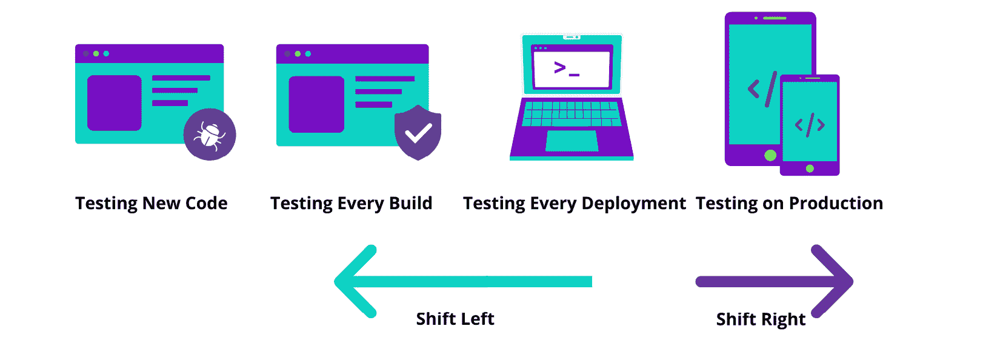
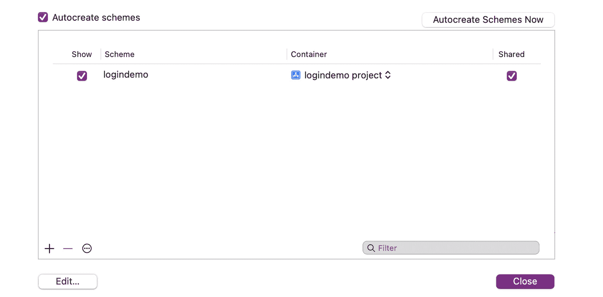
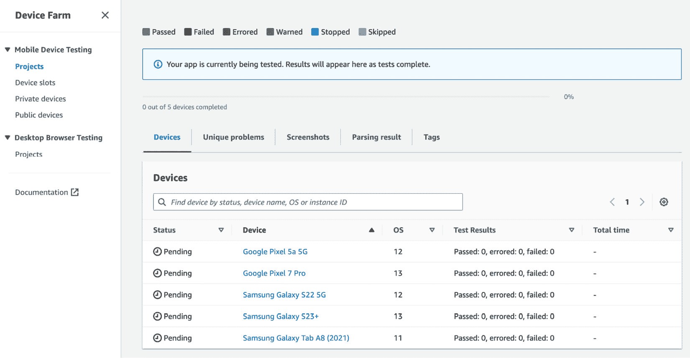

# 第五章：实施强大的移动应用测试策略

如前几章所讨论的，移动应用已成为我们日常生活的一部分。随着智能手机和平板电脑的普及，开发和交付跨不同设备和平台提供无缝用户体验的移动应用变得至关重要。移动应用测试涉及测试应用的不同方面，包括其功能、性能、安全性、可用性和兼容性。此外，还应在各种设备、操作系统和网络配置下进行测试，以确保应用能够在所有可能的场景中无缝运行。

毫无疑问，移动应用测试在确保应用表现良好、蓬勃发展并具有积极用户体验方面起着至关重要的作用。通过投入时间和资源进行测试，开发者更有可能开发出响应迅速的应用并提供卓越的用户体验。

移动应用在移动 DevOps 中的测试自动化就像汽车的轮子——它为项目提供必要的牵引力，使项目能够高效推进并最小化风险。有了它，你将能够顺利到达目的地。

然而，由于设备、操作系统和网络配置的多样性，开发和测试移动应用可能具有挑战性。在本章中，我们将讨论如何实施一个强大的移动应用测试策略，帮助你交付高质量的移动应用，内容包括以下主题：

+   理解移动应用测试

+   移动应用测试自动化的重要性

+   移动应用测试的挑战和陷阱

+   什么是移动应用测试策略？

+   移动应用的测试工具、框架和服务

+   移动应用的 UI 和功能测试

+   在云设备上的测试

+   人工智能（AI）和机器学习（ML）如何改变移动测试

+   测试用例管理

+   实现成功的移动测试覆盖

让我们从理解移动应用测试开始。

# 理解移动应用测试

移动应用测试涉及测试应用的不同方面，包括功能、性能、安全性、可用性和兼容性。此外，还应在各种设备、操作系统和网络配置下进行测试，以确保应用能够在所有可能的场景中无缝运行。移动应用应在发布前后进行测试，以便识别和修复任何可能影响用户体验的漏洞和新特性。

首先，让我们讨论一下软件开发和移动开发中的不同测试层级。

## 测试层级

软件开发领域正在不断发展，特别是在移动开发领域。这是因为我们始终在努力引入新的改进功能和技术，以更好地帮助我们的客户完成日常任务。因此，所有移动开发者都需要将测试作为必要的实践，以确保所有功能按预期运行。

测试有多种类型，每种类型都有其独特的范围。通常，我们使用测试金字塔作为参考来对这些类型进行分类。

### 单元测试

这些测试专注于具有单一责任的独立组件。实际上，这是测试的最低级别。在这个测试级别中，开发者会验证一组必须为真的条件，以及一些需要为假的条件。

假设我们正在开发一个计算器应用——开发者会验证点击加号（+）按钮时会发生什么，且预期结果会被精确地定义。

作为代码单元，单元测试无法检测集成错误或系统级错误，这些会在集成测试和**端到端**（**E2E**）测试中覆盖。

在验证程序的不同方面时，单元测试可以用来查找以下内容：

+   预期情况或“理想路径”

+   边界情况

+   边界条件

+   程序逻辑

在 iOS 中，我们可以使用 **XCTest** 框架来为我们的 Xcode 项目编写单元测试，它与 Xcode 的测试工作流程无缝集成。

在 Android 中，单元测试会被编译以在 **Java 虚拟机**（**JVM**）上执行，从而减少执行时间。如果你的测试依赖于 Android 框架中的对象，可以使用 **Robolectric** ([`robolectric.org/`](https://robolectric.org/)) 工具。在测试依赖项时，可以利用模拟对象来模拟这些依赖项的预期行为。

在 Flutter 中，可以使用 `test` 包编写单元测试，使用 `flutter_test` 包测试组件。

在 React Native 中，开发者使用像 **Jest** ([`jestjs.io/`](https://jestjs.io/)) 这样的测试框架以及像 **React Testing Library** ([`testing-library.com/docs/react-testing-library/intro/`](https://testing-library.com/docs/react-testing-library/intro/)) 这样的测试工具来便于单元测试。

在编写高效的单元测试时，有一些标准需要记住：

+   测试应当快速高效。

+   测试必须完全自动化，并且只应显示“通过”或“失败”结果。

+   测试应当是独立的，彼此隔离，意味着它们不应共享状态。

+   建议在编写生产代码之前先编写测试。这就是所谓的**测试驱动** **开发**（**TDD**）。

#### 单元测试和代码覆盖率

代码覆盖率测试的目的是确定有多少代码被测试。可以使用以下公式来计算它：

```
Code Coverage Percentage = (Number of lines of code executed)/(Total number of lines of code in an application) * 100
```

以下是单元测试中使用的不同代码覆盖技术：

+   语句覆盖率

+   决策覆盖率

+   分支覆盖率

+   条件覆盖率

还有其他不同的代码覆盖率工具，例如以下几种：

+   **JaCoCo** ([`docs.gradle.org/current/userguide/jacoco_plugin.html`](https://docs.gradle.org/current/userguide/jacoco_plugin.html)) 可以为 Android 单元测试生成 HTML 报告，并与持续集成服务器集成。

+   **Flutter Console Coverage Test** ([`pub.dev/packages/test_cov_console`](https://pub.dev/packages/test_cov_console)) 是一个 Dart 工具，用于生成 Flutter 覆盖测试报告。

+   **dlcov** ([`pub.dev/packages/dlcov`](https://pub.dev/packages/dlcov)) 是一个命令行工具，用于验证代码覆盖率的阈值。

+   **SonarQube** ([`www.sonarsource.com/products/sonarqube/`](https://www.sonarsource.com/products/sonarqube/)) 与多种构建系统集成，并支持 Android 项目。它提供一个全面的质量分析平台，包括代码覆盖率指标。

+   **Codecov** ([`about.codecov.io/`](https://about.codecov.io/)) 是一个提供各种编程语言代码覆盖解决方案的服务，包括移动应用开发平台。它可以与 CI/CD 管道集成，收集并展示覆盖率报告。

另一种可以与单元测试一起使用的技术，以提高代码库质量的是 **TDD**。让我们来探索一下这个概念及其优势。

#### 测试驱动开发

TDD 是一种与传统方法不同的测试方法。TDD 不是等到代码或功能完全开发完成再进行测试，而是根据功能需求创建测试，然后编写代码以确保测试通过，具体过程如图所示：


图 5.1 – TDD 如何工作

使用 TDD 是一种极为宝贵的技术，它可以提高代码库的内部质量。它还是训练你和你的团队以有纪律的方式设计更好软件的一个重要工具。

这是 TDD 过程的概述及其工作方式：

1.  编写测试。在这个阶段，开发者为他们想要添加的每个功能编写测试。这些测试作为新代码必须满足的要求，首先编写它们可以确保开发者在编写代码之前就考虑到潜在的问题。

1.  运行测试并故意使其失败。此步骤确认测试有效，并且需要新代码。

1.  编写通过失败测试的代码。虽然代码可能并不完美，但它必须满足测试要求。如果失败，代码必须被修正，直到它通过测试，并确保新代码不会破坏任何现有功能。

1.  重构代码，以提高可读性和可维护性。在这个阶段运行测试，确保功能得以保持。

1.  对每个功能模块重复*步骤 1*的过程。

### TDD 的好处是什么？

通过在编写代码之前编写测试，TDD 挑战我们更清晰、批判性地思考我们试图解决的问题。

将问题分解为更小的部分会导致更模块化的代码，从而最终产生更高质量的代码，并降低维护成本。

总结来说，TDD 的好处如下：

+   提高代码质量

+   给开发者信心去做出更改

### TDD 的缺点是什么？

虽然 TDD 可以提高软件质量，但它也有缺点。一些开发者对这种方法表示担忧，并认为它并不总是最佳选择。

主要的批评意见是 TDD 可能会减慢开发进度，并增加额外的代码维护工作。

### 什么时候应该避免使用 TDD？

虽然 TDD 帮助团队在早期优先关注代码库的内部质量，但它并不是唯一的方式。是否采用 TDD 应该取决于项目的实际情况和周围环境。

下面是一些可能不适合使用 TDD 的场景或情况：

+   在进行实验或创建概念验证时

+   在处理语言/框架方法时

+   在进行 GUI 开发时

### 是选择 TDD 还是不选择 TDD

实施 TDD 涉及到文化和测试实践的根本转变，需要工程团队和管理层的支持。

如果你在一个使用大量遗留代码的组织中工作，你可能会好奇 TDD 如何能为你带来好处。虽然它可能不会影响现有的代码库，但你可以逐步将 TDD 整合到新的功能和 bug 修复中，随着时间的推移，代码库会得到改善。

### 集成测试

这些测试旨在检查各个组件的集成。这个过程确保应用程序的不同层次，如 UI、业务逻辑、数据存储和外部服务，能够无缝地协同工作。集成测试有助于发现由于这些不同部分之间的交互而可能出现的问题。

### 验收/E2E 测试

验收测试侧重于验证移动应用是否满足规定的需求并准备好发布。其目标是确保应用与预期功能、用户期望和业务需求保持一致。

**E2E**测试侧重于测试应用程序的完整流程，通常跨越多个组件和系统。在移动应用的背景下，E2E 测试确保应用的所有不同部分能够无缝地协同工作，从 UI 到后端系统。

### TDD 与单元测试的区别

单元测试包括编写许多小的测试，每个测试针对一个非常简单的函数或对象的行为。TDD 是一种思维过程，它通过单元测试的方式得以实现，“以测试为思维”通常会导致更加细粒度、全面的测试，并使软件设计更易于扩展。

让我们继续了解更多关于移动应用测试的类型。

## 移动应用测试的类型

在移动应用测试中，有多种测试类型可以确保你的应用程序健壮、可靠并提供卓越的用户体验。以下是一些最常见的移动应用测试类型：

+   **功能测试**：此项测试旨在确定应用程序的功能是否符合要求并按预期工作。它涉及测试应用程序的各个方面，例如 UI、导航、数据处理和业务逻辑。

+   **回归测试**：此项测试确保新功能或更改不会影响应用程序的功能性。回归测试检查在引入新功能或更改后，应用程序现有的功能是否正常工作。

+   **可用性测试**：此项测试专注于用户体验，检查应用程序是否易于使用、导航和理解。它涉及测试应用程序的设计、布局、颜色、字体大小及其他影响用户体验的元素。这里一些流行的测试活动包括**快照**和**视觉测试**；我们将在本章讨论这两种测试。

+   **兼容性测试**：此项测试检查应用程序与不同设备、操作系统和屏幕尺寸的兼容性。测试应用程序与硬件、网络和软件配置的兼容性是必要的。使用云设备测试工具，如 Sauce Labs 或 Firebase Test Lab，帮助你在不同设备和配置上运行测试套件，确保应用程序按预期工作。

+   **本地化测试**：此项测试检查应用程序是否支持不同的语言、地区和文化，测试语言支持、日期和时间格式、货币格式及其他文化元素，尤其是当应用程序支持如阿拉伯语等语言时，因为这会将 UI 转换为**从右到左**（**RTL**）显示。

+   **性能测试**：此项测试检查应用程序在不同场景下的性能和响应性，例如低电量、弱网络连接或高使用量。它测试应用程序的负载、响应、内存使用和电池消耗。在*第七章*《建立移动应用监控、可观测性和分析》中，我们将讨论如何使用不同的工具和服务来监控移动应用的性能。

+   **可访问性测试**：此项测试检查应用程序的 UI 是否对残障人士友好，例如视觉障碍者。可访问性测试可以识别应用程序布局、设计和 UI 中可能会阻碍残障用户使用的潜在问题。

+   **安全性测试**：此项测试检查应用程序的安全功能，并识别可能会危及用户数据的漏洞。它包括测试应用程序的身份验证、授权、加密和数据存储机制。在*第八章*《保持移动应用和 DevOps 安全》中，我们将讨论安全性测试及如何将安全性融入到移动 DevOps 流程中。

通过执行这些类型的移动应用测试，您可以确保您的应用具有高质量，满足用户期望，并提供出色的用户体验。

测试自动化对移动应用至关重要，因为它提高了效率，降低了成本，改善了应用质量，并确保了在各种设备和操作系统上的良好用户体验。通过投资测试自动化，移动应用开发者可以创建和维护符合用户期望的高质量应用，并在竞争激烈的市场中脱颖而出。

现在，让我们讨论测试自动化对移动应用的重要性。

# 测试自动化对移动应用的重要性

在移动 DevOps 中，测试自动化至关重要，因为它使移动开发生命周期更快、更可靠。

移动 DevOps 无法在没有测试自动化的情况下存在，原因如下：

+   **更快的发布周期**：移动 DevOps 旨在快速且一致地交付移动应用。测试自动化通过允许团队快速而反复地执行测试，帮助实现这一目标，缩短了识别和修复问题的时间，从而加速了部署前的修复过程。

*测试脚本可以重复使用，便于在更新* *或修改后重新测试应用。*

+   **持续集成与部署/交付（CI/CD）**：移动 DevOps 依赖**CI/CD**来简化移动发布过程。测试自动化对这些过程至关重要。作为开发周期的一部分，自动化测试会在每次提交代码或进行更改时运行，确保移动应用保持稳定和功能正常。例如，我们在上一章中实现的 CI 工作流和管道可以使用不同的测试自动化工具，如**Espresso**、**XCUITest**和**Appium**来确保应用质量。

+   **增加测试覆盖率**：通过这种方式，可以快速运行更多的测试，从而获得更好的测试覆盖率。持续测试可以在开发过程中更早发现问题，减少最终生产缺陷的可能性。在本章后面，我们将讨论如何实现成功的移动测试覆盖率、持续测试和左移测试。

+   **改善协作**：自动化移动测试使开发人员和测试人员能够更高效地合作，提供有关代码更改如何影响应用程序的即时反馈。它们可以防止错误进入生产环境，并增强团队成员之间的沟通。

+   **成本效益**：手动测试可能导致测试自动化减少，从而节省时间和金钱。通过自动化重复性任务，团队可以专注于更复杂的任务，提高生产力并增加**投资回报率**(**ROI**)。

现在，让我们先讨论在移动开发中遇到的挑战，然后再讨论为何需要一个强有力的移动测试策略。

# 移动应用测试挑战与陷阱

移动技术正在迅速发展，这给移动测试团队带来了独特的挑战。让我们来看看团队在测试移动应用时最常面临的挑战，以便我们能够克服它们：

+   随着移动应用测试变得越来越重要，找到合适的自动化工具和框架变得具有挑战性。

+   随着设备和操作系统数量的增加，测试移动设备兼容性和跨平台兼容性变得具有挑战性。

+   要确定应用在不同网络（如 2G、3G、4G 和 5G）上的表现，有必要在每个网络上对应用进行测试。

+   为了确保应用与**互联网协议第六版**（**IPv6**）设置的兼容性，需要进行多项检查。这包括评估地址兼容性、网络配置、防火墙和 NAT，并确定如何解决可能出现的问题。

+   应对移动应用在各种条件下的性能进行测试，以确保最佳的用户体验。团队应确保应用在速度、响应性和稳定性方面经过测试。

+   安全性和隐私在移动测试中变得越来越重要。团队必须确保所有应用都经过漏洞测试，并且用户数据得到保护。

这些挑战要求团队拥有一个全面的测试策略，涵盖所有移动应用测试的各个方面。团队应专注于制定策略以应对复杂性，自动化测试，优化性能，提升安全性和隐私，并确保跨平台兼容性。

此外，团队应寻找可以帮助他们简化移动测试过程的工具和服务。通过战略性地规划和准备，团队可以有效应对移动测试的挑战。

为了确保测试策略保持相关性和时效性，团队应定期审查他们的流程，评估新工具，并根据需要调整他们的方法。

*移动测试策略应该不断地* *制定和维护。*

这应该包括定义测试工作的范围、目标和优先级。确定应用所需的测试类型，并相应分配资源。审查测试流程，评估新工具和技术，并根据需要调整方法。

团队通过采取正确的方向并利用合适的工具，可以确保他们的移动应用成功。团队需要定期审查他们的测试流程，并评估新兴技术，以帮助简化移动测试过程。

## 需要一个强大的测试策略。

如在*第一章*中讨论的，*解决移动 DevOps 中的挑战*，金融科技公司或其他公司实施移动 DevOps 并遵循测试策略至关重要。未能做到这一点可能会导致手动测试的众多问题，例如消耗大量时间和精力，最终影响发布过程并延迟新功能的推出。为了确保移动应用的最佳功能和用户体验，移动测试策略涵盖了各种测试类型、工具和技术，所有这些都经过细致处理，以覆盖每个可能的场景。这包括**单元**、**集成**、**系统**、**性能**、**兼容性**和**可用性**测试。

在我看来，*不要遵循测试金字塔。它只是一个模型*。没有万能的解决方案或魔法棒；每个团队或公司应根据自身情况制定测试策略。有些企业更注重功能测试，有些注重性能测试，还有一些注重安全性测试。

注意

**Mobile Native Foundation**有一篇有趣的讨论([`github.com/MobileNativeFoundation/discussions/discussions/6`](https://github.com/MobileNativeFoundation/discussions/discussions/6))，讨论了像 Lyft、Spotify、Uber 等公司如何进行测试并实施测试策略。

# 什么是移动应用测试策略？

移动应用测试策略是一个全面的计划，概述了移动应用的测试过程。它包括各种测试技术和工具，帮助确保应用的质量和可靠性。

在制定移动应用测试策略时，需要考虑以下一些关键要素：

+   **明确定义你的测试目标和目的**，考虑你希望通过测试实现的目标，例如确保应用在所有设备和平台上正常工作、在发布前识别并修复漏洞，或提升应用的整体用户体验。

+   **确定目标设备和平台**，你希望在其上测试应用。为了确保兼容性，考虑在不同操作系统、屏幕大小和硬件配置的多种设备上进行测试。

+   **选择最适合你应用需求和目标的测试技术**。考虑使用功能测试、可用性测试、性能测试、安全性测试、兼容性测试和本地化测试等技术。

+   **使用可以帮助你自动化测试的工具**，并提供全面的覆盖。考虑使用像 Appium、XCUITest、Espresso 和 Detox 这样的工具。

+   **定义涵盖所有应用功能、特性和用户场景的测试用例和场景**。测试用例和场景应设计为涵盖正向和负向测试场景。

+   **制定测试执行计划**，概述测试过程、测试时间表以及执行测试所需的资源。该计划还应明确测试团队的角色和责任。

+   **实施测试自动化**以节省时间并确保一致的测试结果。自动化执行那些可以快速执行的重复性测试，例如回归测试。

+   **让最终用户参与用户验收测试**（**UAT**），获取关于应用程序可用性和功能的反馈（beta 测试）。这些反馈可以帮助你发现任何问题并改善整体用户体验。在*第六章*《移动应用发布管理》中，我们将讨论移动应用的 beta 测试概念。

然而，有时人们会将测试策略与测试计划混淆。让我们来看一下它们之间的区别：

| **测试计划** | **测试策略** |
| --- | --- |
| 描述计划测试活动的范围、方法、资源和时间表的文档 | 定义系统或产品整体测试方法的高层文档，包括所使用的测试方法、工具和过程 |
| 定义具体的测试目标和验收标准 | 确定整体测试目标和目的 |
| 提供关于如何进行测试的详细信息 | 提供关于测试方法的一般概述 |
| 描述测试团队的角色和责任 | 描述测试过程以及测试团队的角色和责任 |
| 提供详细的测试活动时间表 | 提供测试活动的高层计划 |
| 包含测试计划、测试用例、脚本和数据 | 包含测试方法、测试工具和测试过程 |
| 侧重于测试过程和测试用例的执行 | 侧重于整体测试方法和测试目标 |

表 5.1 – 测试计划与测试策略的区别

正如我们在本章之前提到的，测试自动化帮助我们增加测试覆盖率，更多的测试可以在开发过程中快速且持续地执行，从而获得更好的测试覆盖率。由此，我们得出了持续测试和左移测试的概念。接下来，让我们更详细地探讨这些概念。

## 持续测试

持续测试鼓励在整个软件开发过程中进行测试，而不仅仅是在最后阶段。通过对软件质量的早期和持续反馈，持续测试旨在帮助团队尽早发现和解决问题，以尽可能快的速度进行改进。

现代软件开发方法论，如敏捷开发和移动 DevOps，强调频繁发布和更新，这些方法严重依赖持续测试。团队可以通过将测试融入开发过程中，确保每个版本都具有高质量并满足最终用户的需求。

持续测试的做法是指在软件开发过程中进行测试，而不是等到开发周期结束或移动应用发布后才进行测试，正如我们在*第三章*《移动 DevOps 基础》中所讲的那样。高质量的应用程序对于移动应用至关重要，因为它们通常被许多用户使用，且消耗大量数据：


图 5.2 – 与 CI 的持续测试

由于持续测试过程的实施，左移测试变得越来越流行。

你可以通过 Katalon 的持续测试成熟度评估（[`katalon.com/continuous-testing-self-assessment`](https://katalon.com/continuous-testing-self-assessment)）来衡量你团队的成熟度，并获得领域专家的建议。

传统上，测试是在开发过程的末尾进行的，即代码编写完成后。然而，通过左移测试方法，测试从一开始就融入到开发过程中。

让我们解释一下左移测试的概念和优势。

## 什么是左移测试？

左移测试是一种软件测试方法，侧重于软件开发生命周期的早期阶段。在传统的软件开发中，测试通常在大部分代码完成后进行，接近开发阶段的结束时。

相比之下，左移测试是指将测试任务融入到开发的早期阶段，如需求收集、设计和实现，以下图所示：



图 5.3 – 测试中的左移

持续测试和左移测试有若干优点，诸如以下几点：

+   **缺陷的早期发现（及早测试，频繁测试）**：通过在开发过程的早期进行测试，可以在缺陷传播并变得更加昂贵和难以解决之前，及时发现并修复缺陷。

+   **改进的协作和沟通**：左移测试鼓励开发人员和测试人员之间的合作与沟通，有助于及早发现和解决潜在问题，从而提高软件的整体质量。

+   **更快速的交付和部署**：通过将测试提前，团队可以更快地交付和部署软件。他们可以更早开始测试，避免在开发过程结束时出现延迟和瓶颈。

组织需要采用持续测试方法来实施左移测试，在这种方法中，测试被集成到开发过程中并贯穿整个生命周期。这可能需要文化和思维方式的转变，并采用合适的工具和技术来支持持续测试。

现在，让我们更详细地了解一下目前市场上可用的用于移动应用的测试工具、框架和云服务，帮助您决定最适合您公司的工具。

# 移动应用的测试工具、框架和服务

开发人员和测试人员可以使用众多的测试工具、框架和服务来帮助他们快速测试移动应用程序。

但首先，让我们从选择适合移动应用的测试自动化框架或工具时需要考虑的因素开始讨论。

在选择移动测试自动化工具时，有几个因素需要考虑：

+   工具应与您测试自动化生态系统中的其他工具（如 CI 和测试管理工具）集成，以便您可以在 CI/CD 流水线中使用它

+   工具应与您计划测试的不同移动设备和操作系统兼容

+   工具应易于设置、配置和使用

+   工具应提供清晰、详细的测试结果报告

+   工具应拥有强大的支持系统和庞大的用户社区，能够提供帮助和指导

+   随着移动应用和用户基础的增长，工具应能够处理大规模的测试

在决定某个工具或框架是否适合您的业务、应用和团队之前，评估几种不同的工具，并进行小范围的试点测试或**概念验证**项目，总是一个不错的选择。

# 移动应用的 UI 和功能测试

优秀的用户体验需要对移动应用的 UI 进行测试。测试人员通过在测试过程中执行自动化测试，可以识别并解决应用程序功能和 UI 的问题，从而带来良好的客户体验。

以下是一些本地和跨平台的移动测试框架，供您在测试应用功能时参考：

+   iOS：

    +   XCUITest

    +   EarlGrey

+   Android：

    +   Espresso

    +   Jetpack Compose

+   跨平台：

    +   Appium

    +   Detox

    +   Flutter Driver 和 Flutter 集成测试

    +   Maestro

让我们从 iOS 应用的本地框架开始。

## XCUITest

**XCUITest**（[`developer.apple.com/documentation/xctest`](https://developer.apple.com/documentation/xctest)）是由苹果公司专为 iOS、macOS、tvOS 和 watchOS 应用测试创建的移动测试框架。旨在帮助开发人员和质量保证团队自动化测试过程，它支持 Swift 和 Objective-C 语言，提供选择偏好语言的灵活性。

*基于苹果的 XCTest 框架，XCUITest 使得单一框架内进行单元测试和 UI 测试成为可能，从而简化了* *过程。*

XCUITest 通过要求应用程序中使用正确的**可访问性标识符**来倡导可访问性，确保普遍的可用性。

此外，对于不熟悉 Swift 或 Objective-C 的测试工程师来说，可能会面临更陡峭的学习曲线。

要使用 XCUITest，开发人员必须导入 XCTest 框架并创建 XCTestCase 的子类。然后，他们可以定义测试方法，并使用 XCUITest 的 API 与应用的 UI 进行交互：


图 5.4 – iOS 应用中的 XCUITest 目录

该框架还提供了额外的功能，例如截图、执行滑动和捏合等手势，以及其他各种元素交互。更多信息可以参考苹果官方文档和 API 参考。

### 示例

这是一些简单的 XCUITest 代码，用于测试登录功能：[`github.com/PacktPublishing/Mobile-DevOps-Playbook/blob/main/Chapter-5/iOS/XCUITest/simpleTest.swift`](https://github.com/PacktPublishing/Mobile-DevOps-Playbook/blob/main/Chapter-5/iOS/XCUITest/simpleTest.swift)。

你也可以在 XCUITest 中使用 Page Object 模式，该模式涉及为应用中的每个屏幕创建单独的类。这些类将包含特定屏幕的 UI 元素和操作。这样可以促进更好的代码组织和可维护性。

对于给定的 SwiftUI 应用，我们可以创建两个页面对象：`LoginPage` 和 `WelcomePage`。以下是如何在 XCUITest 中使用 Page Object 模式的一些示例：

+   创建 `LoginPage.swift` 文件 ([`github.com/PacktPublishing/Mobile-DevOps-Playbook/blob/main/Chapter-5/iOS/XCUITest/PageObjects/LoginPage.swift`](https://github.com/PacktPublishing/Mobile-DevOps-Playbook/blob/main/Chapter-5/iOS/XCUITest/PageObjects/LoginPage.swift))

+   创建 `WelcomePage.swift` 文件 ([`github.com/PacktPublishing/Mobile-DevOps-Playbook/blob/main/Chapter-5/iOS/XCUITest/PageObjects/WelcomePage.swift`](https://github.com/PacktPublishing/Mobile-DevOps-Playbook/blob/main/Chapter-5/iOS/XCUITest/PageObjects/WelcomePage.swift))

+   更新你的测试类以使用这些页面对象 ([`github.com/PacktPublishing/Mobile-DevOps-Playbook/blob/main/Chapter-5/iOS/XCUITest/TestClassWithPO.swift`](https://github.com/PacktPublishing/Mobile-DevOps-Playbook/blob/main/Chapter-5/iOS/XCUITest/TestClassWithPO.swift))

XCUITest 可以轻松集成到大多数 CI 提供商中，如 Xcode Cloud、Bitrise、GitHub Actions 和 Codemagic，但要能够运行 UI 测试，必须拥有带目标 iOS SDK 和 iOS 模拟器的 macOS 机器。该方案还应该是共享的：



图 5.5 – iOS 应用中的共享方案

然后，如果你具备前提条件，可以在你喜欢的 CI 提供商上运行这些测试。

例如，在 Codemagic 上，你可以在 `codemagic.yml` 文件中使用以下链接的代码：[`github.com/PacktPublishing/Mobile-DevOps-Playbook/blob/main/Chapter-5/iOS/XCUITest/codemagic.yml`](https://github.com/PacktPublishing/Mobile-DevOps-Playbook/blob/main/Chapter-5/iOS/XCUITest/codemagic.yml)。

在 Bitrise 上，您可以为 iOS 集成步骤添加 Xcode 测试，以构建应用进行测试并运行 UI 测试：


图 5.6 – Bitrise iOS 工作流

## EarlGrey

**EarlGrey** ([`github.com/google/EarlGrey`](https://github.com/google/EarlGrey))，由谷歌开发，是一个专门的 iOS 测试框架，旨在支持原生 iOS 应用测试。它允许开发人员和 QA 团队根据需要使用 Objective-C 或 Swift 自动化他们的 iOS 应用 UI 测试。

EarlGrey 通过自动与应用程序的 UI 同步，确保平稳且可靠的测试执行。它还提供了广泛的断言和匹配器，使开发人员能够创建彻底且富有表现力的测试。

要使用 EarlGrey 为给定的 SwiftUI 应用创建 UI 测试，您需要在项目中设置 EarlGrey。之后，您可以编写测试用例。以下是使用 EarlGrey 为给定的 SwiftUI 应用编写的 UI 测试：[`github.com/PacktPublishing/Mobile-DevOps-Playbook/blob/main/Chapter-5/iOS/EarlGrey/EarlGreyTest.swift`](https://github.com/PacktPublishing/Mobile-DevOps-Playbook/blob/main/Chapter-5/iOS/EarlGrey/EarlGreyTest.swift)。

相同的页面对象概念也适用于 EarlGrey，就像在 CI/CD 工作流中运行必要的测试时一样。

现在，让我们讨论一下适用于 Android 应用的原生测试框架。

## Espresso

**Espresso** ([`developer.android.com/training/testing/espresso`](https://developer.android.com/training/testing/espresso))，由谷歌创建，是一个专门的 Android 测试框架，旨在支持原生 Android 应用测试。它允许开发人员和 QA 团队根据需要使用 Java 或 Kotlin 自动化他们的 Android 应用 UI 测试。

它通过自动与应用程序的 UI 同步，确保平稳且可靠的测试执行，从而实现更快和更准确的测试。Espresso 还提供了各种断言和匹配器，允许开发人员创建全面且富有表现力的测试。

Espresso 轻松集成 AndroidJUnit4，允许开发人员在单一框架内执行单元测试和 UI 测试。作为谷歌官方支持的产品，开发人员可以依赖最新的文档、资源以及与新 Android 版本的兼容性。此外，对于不熟悉 Java 和 Kotlin 的开发者来说，入门时可能会面临较陡的学习曲线。

### 示例

这里有一些简单的 Espresso 代码，用于测试登录功能：[`github.com/PacktPublishing/Mobile-DevOps-Playbook/blob/main/Chapter-5/Android/LoginTest.kt`](https://github.com/PacktPublishing/Mobile-DevOps-Playbook/blob/main/Chapter-5/Android/LoginTest.kt)。

您可以使用页面对象模式使您的 Espresso 测试更易于维护和阅读（[`github.com/PacktPublishing/Mobile-DevOps-Playbook/blob/main/Chapter-5/Android/PageObjects/LoginPage.kt`](https://github.com/PacktPublishing/Mobile-DevOps-Playbook/blob/main/Chapter-5/Android/PageObjects/LoginPage.kt)）。

下面是一个示例，展示了如何在 Kotlin 中为登录屏幕的 Espresso 测试中实现页面对象模式：[`github.com/PacktPublishing/Mobile-DevOps-Playbook/blob/main/Chapter-5/Android/LoginScreenTest.kt`](https://github.com/PacktPublishing/Mobile-DevOps-Playbook/blob/main/Chapter-5/Android/LoginScreenTest.kt)。

此外，您可以与 Espresso 一起使用**UI Automator**（[`developer.android.com/training/testing/other-components/ui-automator`](https://developer.android.com/training/testing/other-components/ui-automator)），进行跨系统和已安装应用的功能 UI 测试。

Espresso 与大多数 CI 提供商（如 Bitrise、GitHub Actions 和 Codemagic）轻松集成，但要能够运行 UI 测试，您必须拥有安装有 Gradle 和目标 Android SDK 的 Ubuntu 或 Windows 机器，并具有 Android 模拟器。然后，您需要运行 Gradle 命令`./gradlew connectedDebugAndroidTest`。此命令使用 connectedDebugAndroidTest Gradle 任务在单个步骤中构建和安装主应用和测试应用。此任务构建主应用及其相关的 Android 测试应用，将它们安装在连接的设备上，然后运行测试应用中定义的测试。

一旦完成这些步骤，如果您符合先决条件，可以在首选的 CI 提供商上运行测试。

例如，在 Codemagic 上，您可以在`codemagic.yml`文件中使用以下链接中的代码：[`github.com/PacktPublishing/Mobile-DevOps-Playbook/blob/main/Chapter-5/Android/codemagic.yml`](https://github.com/PacktPublishing/Mobile-DevOps-Playbook/blob/main/Chapter-5/Android/codemagic.yml)。

在 Bitrise 上，您可以添加**Android Build for UI Testing**和**Virtual Device Testing for Android**集成步骤，以构建应用程序进行测试，并在 Firebase Test Lab 上运行 UI 测试，该步骤已与 Bitrise 集成：


图 5.7 - Bitrise Android 工作流程

最后，使用 GitHub Actions，您可以使用以下 YAML 文件：[`github.com/PacktPublishing/Mobile-DevOps-Playbook/blob/main/Chapter-5/.github/android.yml`](https://github.com/PacktPublishing/Mobile-DevOps-Playbook/blob/main/Chapter-5/.github/android.yml)。

## 基于 Espresso 的开源项目

有许多开源 UI 测试库是基于 Espresso 为 Android 应用程序构建的，它们简化并优化了编写 UI 测试的过程，使开发者能够轻松创建强大且易于维护的测试。包括 Kaspresso（[`github.com/KasperskyLab/Kaspresso`](https://github.com/KasperskyLab/Kaspresso)）、Barista（[`github.com/AdevintaSpain/Barista`](https://github.com/AdevintaSpain/Barista)）和 Kakao（[`github.com/KakaoCup/Kakao`](https://github.com/KakaoCup/Kakao)）。它们流畅的接口、高级测试拦截器、自动截图和增强的日志功能，使它们成为 Android 开发者提升 UI 测试体验的强大选择。

## Jetpack Compose

**Jetpack Compose**（[`developer.android.com/jetpack/compose`](https://developer.android.com/jetpack/compose)）是 Google 为 Android 应用程序提供的现代 UI 工具包。Jetpack Compose 测试库（[`developer.android.com/jetpack/compose/testing`](https://developer.android.com/jetpack/compose/testing)）旨在简化为使用 Jetpack Compose 构建的应用程序编写和维护 UI 测试的过程。

Jetpack Compose 测试提供了 Compose 测试规则，它设置了测试 Compose UI 所需的环境，并使在测试中创建和操作可组合的 UI 变得容易。

Jetpack Compose 测试支持截图测试，允许开发者在测试执行期间将 UI 元素的视觉外观与参考图像进行比较。

由于 Jetpack Compose 是一个工具化测试，因此可以使用 Espresso 作为测试框架，但 Compose 已经包含了测试 API，用于查找、验证和对元素执行用户操作。时间操作和其他高级功能也包含其中。

一般来说，如果你有特定类型的 UI 元素或组件，你应该有特定的 API 或方法来测试它们在不同场景中的表现。

要了解更多 Compose 测试的信息，可以查看备忘单（[`developer.android.com/jetpack/compose/testing-cheatsheet`](https://developer.android.com/jetpack/compose/testing-cheatsheet)），该备忘单作为一些最常用 Compose 测试 API 的快速参考。

相同的页面对象概念可以应用于 Jetpack Compose，并在必要的 CI/CD 工作流中运行测试（[`github.com/PacktPublishing/Mobile-DevOps-Playbook/blob/main/Chapter-5/Android/JetpackCompose/CounterTest.kt`](https://github.com/PacktPublishing/Mobile-DevOps-Playbook/blob/main/Chapter-5/Android/JetpackCompose/CounterTest.kt)）。

这是来自 Reddit 的一个示例，展示了他们的 Android 应用程序端到端 UI 自动化框架，以及他们如何使用页面对象和 Fluent 设计模式：[`shorturl.at/ajH78`](https://shorturl.at/ajH78)。

## Appium

**Appium** ([`appium.io`](https://appium.io)) 是一个开源的跨平台移动测试框架，使开发人员和 QA 团队能够在 Android、iOS 和 Windows 平台上自动化测试他们的移动应用。

Appium 支持多种编程语言，包括 Java、Ruby、Python、C# 和 JavaScript，允许开发人员选择他们喜欢的语言。

Appium 与流行的测试框架如 JUnit 和 TestNG 集成，允许开发人员使用他们喜欢的测试工具。

Appium 可轻松集成于 Bitrise、GitHub Actions 和 CircleCI 等 CI 工具中，简化开发工作流中的测试过程。

Appium 的大型活跃社区提供广泛的文档、资源和定期更新。但通常，Appium 的初始设置和配置可能会耗费大量时间，并需要大量努力来确保其正常运行 ([`github.com/PacktPublishing/Mobile-DevOps-Playbook/blob/main/Chapter-5/Appium/AppiumDemo.java`](https://github.com/PacktPublishing/Mobile-DevOps-Playbook/blob/main/Chapter-5/Appium/AppiumDemo.java))。

您还可以使用页面对象模式使您的 Appium 测试更易于维护和阅读。

要在 CI 工作流中运行 Appium 测试，您需要安装并运行 Appium 服务器，以及 Android 模拟器或 iOS 模拟器。您可以使用以下 Shell 脚本来完成这些操作：[`github.com/PacktPublishing/Mobile-DevOps-Playbook/blob/main/Chapter-5/Appium/emulator.sh`](https://github.com/PacktPublishing/Mobile-DevOps-Playbook/blob/main/Chapter-5/Appium/emulator.sh)。

然后，您可以使用 Gradle 或 Maven 的命令行来运行测试。

## Detox

**Detox** ([`github.com/wix/Detox`](https://github.com/wix/Detox)) 是专为 React Native 应用设计的端到端移动测试框架。它使开发人员和 QA 团队能够在 Android 和 iOS 平台上自动化测试他们的 React Native 应用。

Detox 作为灰盒测试框架运作，平衡了白盒测试的速度和可靠性以及黑盒测试的真实性。Detox 与 Jest 完美集成，这是一个流行的 JavaScript 测试框架，允许开发人员使用他们喜欢的测试工具和方法。

Detox 自动将测试执行与应用程序的 UI 同步，确保测试顺利可靠运行。

Detox 可轻松集成于 Jenkins、Travis CI 和 CircleCI 等 CI 工具中，简化开发工作流中的测试过程。

Detox 拥有一个活跃的开发者和用户社区，提供资源、支持和定期更新。

### 示例

这是一个简单的 React Native 登录应用的 Detox 测试示例：[`github.com/PacktPublishing/Mobile-DevOps-Playbook/blob/main/Chapter-5/Detox/LoginTest.js`](https://github.com/PacktPublishing/Mobile-DevOps-Playbook/blob/main/Chapter-5/Detox/LoginTest.js)。

Detox 还要求你拥有一个配置 JSON 文件，类似于以下内容：[`github.com/PacktPublishing/Mobile-DevOps-Playbook/blob/main/Chapter-5/Detox/config.json`](https://github.com/PacktPublishing/Mobile-DevOps-Playbook/blob/main/Chapter-5/Detox/config.json)。

要在 CI/CD 工作流或像 GitHub Actions 这样的管道中运行 Detox 测试，你需要 Android 模拟器或 iOS 模拟器。此外，还需要安装 Node.js 和 NPM，并使用上述配置文件构建应用。你可以使用以下 YAML 文件：[`github.com/PacktPublishing/Mobile-DevOps-Playbook/blob/main/Chapter-5/Detox/.github/detox.yml`](https://github.com/PacktPublishing/Mobile-DevOps-Playbook/blob/main/Chapter-5/Detox/.github/detox.yml)。

类似于我们提到的 Bitrise、Codemagic 和其他 CI 提供商的方式，你需要使用脚本步骤来安装必要的依赖项，然后运行 Detox 测试。

## Flutter Driver

**Flutter Driver** ([`api.flutter.dev/flutter/flutter_driver_extension/flutter_driver_extension-library.html`](https://api.flutter.dev/flutter/flutter_driver_extension/flutter_driver_extension-library.html)) 是一个用于 Flutter 应用程序的测试框架，使开发者和 QA 团队能够自动化 Flutter 应用的集成测试和 UI 测试。

它支持在 Android 和 iOS 平台上进行测试，允许开发者在各种设备和操作系统上测试他们的 Flutter 应用。

Flutter Driver 设计用于集成测试，使开发者能够测试他们应用的不同组件如何协同工作。

它使用 Dart 语言，这是开发 Flutter 应用程序所使用的编程语言，使开发者更容易用熟悉的语言编写测试。

Flutter Driver 会自动同步测试执行和应用的 UI，确保测试顺利且可靠地运行——Flutter Driver 与应用 UI 的自动同步确保了稳定和可靠的测试执行。

此外，对于不熟悉 Dart 或 Flutter 框架的测试人员，在开始使用 Flutter Driver 时可能会面临较陡的学习曲线。

### 示例

这是一个 Flutter Driver 测试的示例，用于一个简单的 Flutter 登录应用： https://github.com/PacktPublishing/Mobile-DevOps-Playbook/blob/main/Chapter-5/Flutter/Flutter%20Driver/LoginTest.dart。

也有一个集成测试（https://docs.flutter.dev/testing#integration-tests），可以用来测试 Flutter 应用。以下是一个简单的 Flutter 登录应用示例：[`github.com/PacktPublishing/Mobile-DevOps-Playbook/blob/main/Chapter-5/Flutter/Integration%20Test/LoginTest.dart`](https://github.com/PacktPublishing/Mobile-DevOps-Playbook/blob/main/Chapter-5/Flutter/Integration%20Test/LoginTest.dart)。

要在 CI/CD 工作流或管道（如 GitHub Actions）中运行 Flutter 测试，你需要 Android 仿真器或 iOS 模拟器以及 Dart SDK。你可以使用以下 YAML 文件来帮助实现这一点：[`github.com/PacktPublishing/Mobile-DevOps-Playbook/blob/main/Chapter-5/Flutter/.github/FlutterIntegration.yml`](https://github.com/PacktPublishing/Mobile-DevOps-Playbook/blob/main/Chapter-5/Flutter/.github/FlutterIntegration.yml)。

这是一个 YAML 文件示例，它通过 GitHub Actions 在 Android 仿真器和 iOS 模拟器上运行 Flutter Driver 测试：[`github.com/PacwktPublishing/Mobile-DevOps-Playbook/blob/main/Chapter-5/Flutter/.github/FlutterDriver.yml`](https://github.com/PacktPublishing/Mobile-DevOps-Playbook/blob/main/Chapter-5/Flutter/.github/FlutterDriver.yml)。

在 Bitrise 上，有用于构建和测试 Flutter 应用的集成步骤：


图 5.8 – Bitrise Flutter 工作流

同样，在 Codemagic 上，也有支持 Flutter Driver 和 Flutter 测试的步骤：


图 5.9 – Codemagic Flutter 工作流

## Maestro

**Maestro** ([`maestro.mobile.dev/`](https://maestro.mobile.dev/)) 是最简单且最有效的开源移动 UI 测试框架，由 mobile.dev 开发。它允许你轻松定义和测试你的流程（即应用中的用户旅程——换句话说，就是 E2E 场景）。

Maestro 基于 YAML，这意味着你需要在 `flow.yml` 文件中定义测试流程（[`github.com/PacktPublishing/Mobile-DevOps-Playbook/blob/main/Chapter-5/Maestro/flow.yml`](https://github.com/PacktPublishing/Mobile-DevOps-Playbook/blob/main/Chapter-5/Maestro/flow.yml)），然后在设备上运行它们。

Maestro 具有多种功能，例如：

+   使用 Maestro，可以容忍不稳定性。应用和设备设计时考虑到不稳定性，UI 元素也专门设计来应对这一点。

+   在测试中无需反复调用 `sleep()`。当某个过程（例如通过网络）需要较长时间时，Maestro 会自动等待内容加载（但不会等待太久）。

+   当测试文件发生变化时，Maestro 会自动重新运行测试，因此无需重新编译任何内容。

+   Maestro 支持所有主要的移动开发平台，包括 Android、iOS、Flutter、React Native 和 Web Views。

+   此外，还有 Maestro Studio，Maestro 的个人助手，它将帮助你编写 Maestro 流程。

你可以轻松在 Maestro Cloud 上测试你的流程，因为它们在云端运行，这样你就不需要配置任何模拟器或仿真器。

流程也可以通过 Maestro CLI 在支持 ADB 连接的 Android 设备/仿真器和支持 Facebook 的 IDB 的 iOS 设备/模拟器上运行。你可以手动协调你的流程执行，针对任何支持这些协议的提供者进行操作。你可以像在本地一样使用 Maestro CLI 运行你的流程。

Bitrise 提供了一个集成步骤，帮助你在云端运行 Maestro 测试。如果你使用其他 CI 提供商，可以使用 Maestro CLI：


图 5.10 – Bitrise 和 Maestro 工作流

通过探索当前市场上可用的测试框架以及如何在 CI 工作流中运行它们，我们发现了一个新的挑战：在不同的设备和操作系统版本上同时运行测试。让我们来谈谈如何使用不同的服务在云设备上运行测试，以最大化覆盖面。

# 在云设备上测试

开发者和 QA 团队可以通过云设备测试在广泛的设备和平台上测试他们的应用，而无需使用物理设备，这是一种现代的移动应用测试方法。

一个基于云的基础设施远程托管多个模拟器或真实设备。以下是目前最受欢迎的移动应用云设备测试服务：

+   Sauce Labs

+   BrowserStack

+   AWS Device Farm

+   Firebase Test Lab

+   LambdaTest

让我们更详细地了解一下这些内容。

## Sauce Labs

**Sauce Labs** ([`saucelabs.com/products/mobile-testing`](https://saucelabs.com/products/mobile-testing)) 通过消除购买和管理大量设备库存的需求，简化了测试过程，使用户能够在云端的真实设备上测试应用。得益于该平台的全面设备覆盖，用户可以通过在最新设备上测试应用，提前发现问题。

Sauce Labs 支持 Android 和 iOS 平台，使开发者能够在多个设备和操作系统上测试他们的应用。它提供访问大量真实设备的权限，确保测试结果准确，并减少在真实设备上遇到问题的可能性。除了真实设备，Sauce Labs 还提供模拟器和仿真器，用于更快速、更具成本效益的测试。

该功能允许同时执行多个测试，显著减少整体测试时间。

Sauce Labs 与流行的 CI 工具（如 Bitrise、GitHub Actions 和 Codemagic）无缝集成，允许在开发工作流中进行自动化测试。它支持流行的测试自动化框架，如 Appium、Espresso 和 XCUITest，为项目选择合适的框架提供灵活性。

此外，Sauce Labs 提供了详细的测试报告、日志和测试会话的视频记录，便于高效的调试和问题解决。

你可以使用 `saucectl` CLI 配合任何 CI 提供商来配置你的账户，并从相关的 `config.yml` 文件运行测试 ([`github.com/PacktPublishing/Mobile-DevOps-Playbook/blob/main/Chapter-5/SauceLabs/config.yml`](https://github.com/PacktPublishing/Mobile-DevOps-Playbook/blob/main/Chapter-5/SauceLabs/config.yml))。

你可以更改配置，以增加并发性，从而在不同设备上并行运行测试。

## BrowserStack

**BrowserStack** ([`www.browserstack.com/app-automate`](https://www.browserstack.com/app-automate)) 是一个基于云的测试平台，允许开发者在各种设备和操作系统上测试他们的移动应用。通过广泛的功能和用户友好的界面，BrowserStack 旨在为开发者和 QA 团队提供全面的测试解决方案。

BrowserStack 提供访问大量真实设备的权限，用于准确测试移动应用，确保它们在消费者使用的真实设备上表现良好。除了真实设备外，BrowserStack 还提供模拟器和仿真器，便于快速且具有成本效益的测试。

此功能支持同时执行多个测试，减少整体测试时间，提高工作效率。

BrowserStack 与广泛的 CI 工具集成，如 Jenkins、TeamCity、Bamboo、CircleCI、Travis CI、Azure、Bitrise 和 GitLab CI/CD，简化了开发工作流程中的测试过程。

例如，Bitrise 有与 BrowserStack 集成的步骤，可以上传并运行 Espresso 和 XCUITest 测试：


图 5.11 – Bitrise 和 BrowserStack 集成步骤


图 5.12 – Bitrise 和 BrowserStack 工作流程

如果你有其他 CI 提供商或服务器，可以使用 `curl` 命令从命令行将测试上传到 BrowserStack：

```
curl -u "YOUR_USERNAME:YOUR_ACCESS_KEY" -X GET "https://api-cloud.browserstack.com/app-automate/recent_apps"
```

BrowserStack 支持多种测试自动化框架，包括 Appium、Espresso 和 XCUITest，为项目选择最合适的框架提供了灵活性。

你可以使用 BrowserStack App Automate 和 Appium 自动化框架，在各种真实的 Android 和 iOS 设备上测试本地和混合型移动应用。

## LambdaTest

**LambdaTest** ([`www.lambdatest.com/mobile-app-testing`](https://www.lambdatest.com/mobile-app-testing)) 是一个基于云的测试平台，提供给开发者和 QA 团队访问多种设备和操作系统，用于 Web 和移动应用测试。

LambdaTest 支持 Android 和 iOS 移动应用测试，允许开发者在各种设备和操作系统上测试他们的应用。

LambdaTest 还提供真实的移动设备测试，确保测试结果的准确性，并提供更真实的测试环境。

LambdaTest 与许多流行的测试框架集成，如 Appium、XCUITest 和 Espresso，使其可以轻松地集成到现有的测试套件中。它还支持并行测试，可以同时运行多个测试，加速整体测试过程。

LambdaTest 的云基础设施提供可扩展性和协作功能，适用于小型和大型团队。

最后，LambdaTest 与广泛使用的 CI 工具集成，如 AWS CodePipeline、Jenkins、CircleCI、Travis CI、GitLab CI、Azure Pipelines 和 Bitrise。

使用命令行中的 `curl` 命令，您可以像在 Sauce Labs 和 BrowserStack 上一样，在 LambdaTest Cloud 上上传并运行测试。

这是一个上传 iOS 应用并运行 XCUITest 测试的示例：

```
curl -u "YOUR_LAMBDATEST_USERNAME:YOUR_LAMBDATEST_ACCESS_KEY" \--location --request POST 'https://manual-api.lambdatest.com/app/uploadFramework' \
--form 'appFile=@"/Users/macuser/Downloads/proverbial.ipa"' \
--form 'type="xcuit-ios"'
curl -u "YOUR_LAMBDATEST_USERNAME:YOUR_LAMBDATEST_ACCESS_KEY" \
--location --request POST 'https://manual-api.lambdatest.com/app/uploadFramework' --form 'appFile=@"/Users/macuser/Downloads/proverbial_ios_xcuitest.ipa"' --form 'type="xcuit-ios"'
```

这是一个上传 Android 和测试应用的示例：

```
curl -u "YOUR_LAMBDATEST_USERNAME:YOUR_LAMBDATEST_ACCESS_KEY" \--location --request POST 'https://manual-api.lambdatest.com/app/uploadFramework' --form 'appFile=@"/Users/macuser/Downloads/proverbial_android.apk"' --form 'type="espresso-android"'
curl -u "YOUR_LAMBDATEST_USERNAME:YOUR_LAMBDATEST_ACCESS_KEY" \
--location --request POST 'https://manual-api.lambdatest.com/app/uploadFramework' --form 'appFile=@"/Users/macuser/Downloads/proverbial_android_expressotest.apk"' --form 'type="espresso-android"'
```

如果您的 CI 提供商支持集成步骤，如 Bitrise，您可以直接使用它，而不必使用命令行：


图 5.13 – Bitrise 和 LambdaTest 集成步骤


图 5.14 – Bitrise 和 LambdaTest 工作流

## AWS Device Farm

**AWS Device Farm** ([`aws.amazon.com/device-farm/`](https://aws.amazon.com/device-farm/)) 是由 **AWS** 提供的移动应用测试服务。它支持在 Android 和 iOS 平台上进行测试，允许开发人员在各种真实移动设备上测试他们的应用。

AWS Device Farm 提供对一系列真实设备的访问，以便更准确地测试移动应用，确保更好的与消费者使用的真实设备的兼容性。

开发人员可以远程访问设备进行手动测试，支持交互式调试和故障排除。

AWS Device Farm 支持流行的测试自动化框架，如 Appium、Espresso 和 XCUITest，使开发人员能够自动化他们的测试过程。

AWS Device Farm 与流行的 CI 工具集成，如 AWS CodePipeline、GitHub Actions、Codemagic 和 Bitrise，简化了开发工作流中的测试过程。

使用 AWS Device Farm，您可以手动上传移动应用和测试文件来运行测试，如以下截图所示。您还可以通过 CI 构建上传应用：


图 5.15 – AWS Device Farm – 选择应用程序

接下来，您可以配置测试类型并设置测试框架，如 **Instrumentation**，如图所示：


图 5.16 – AWS Device Farm – 设置测试框架

完成此操作后，您可以选择一个 APK 并选择您的执行环境：


图 5.17 – AWS Device Farm – 上传测试应用

接下来，您可以选择要使用的设备。您可以组合不同设备制造商，如 Google 和 Samsung，如下所示：



图 5.18 – AWS Device Farm – 选择设备

一旦运行了测试，您将看到测试结果，包括视频、日志和截图，如下所示：


图 5.19 – AWS Device Farm – 测试结果

AWS Device Farm 提供灵活的按需计费定价模型，允许开发人员仅为他们使用的测试资源付费，这对某些团队来说是一种成本效益高的选择。

## Firebase Test Lab

**Firebase Test Lab** ([`firebase.google.com/products/test-lab`](https://firebase.google.com/products/test-lab))，作为 Google Firebase 开发工具套件的一部分，是一个基于云的测试服务，允许开发人员在各种真实设备和虚拟设备（模拟器和仿真器）上测试他们的移动应用：


图 5.20 – Firebase Test Lab 矩阵

Firebase Test Lab 支持在 Android 和 iOS 平台上进行测试，使开发人员能够在各种设备和操作系统上测试他们的应用。

Firebase Test Lab 支持流行的自动化测试框架，如 Espresso 和 XCTest，但不支持 Appium 和 Detox：


图 5.21 – Firebase Test Lab 结果

Firebase Test Lab 与流行的 CI 工具（如 Jenkins、GitLab CI 和 Bitrise）集成，在开发工作流程中简化了测试过程。

Firebase Test Lab 会自动生成一个发布前报告，包含详细的测试结果、性能指标和截图，帮助开发人员在发布应用之前识别和解决问题。

作为 Firebase 工具套件的一部分，Firebase Test Lab 与其他 Firebase 服务（如 Cloud Functions）无缝集成，简化了整体测试和开发流程。

你可以使用 **Flank** ([`github.com/Flank/flank/`](https://github.com/Flank/flank/))，这是一个用于 Firebase Test Lab 的大规模并行 Android 和 iOS 测试工具。

Flank 与 `gcloud` CLI 兼容。它提供了额外的功能来加速速度并提高质量。

你可以通过以下步骤使用 Flank：

1.  创建一个 Google Cloud 项目和账户。

1.  创建 Firebase 账户。

1.  将你的项目添加到 Firebase。

1.  创建服务账户以获取 API 访问权限。

1.  下载服务账户的 JSON 文件。该文件包含一个私钥，可直接添加到你的 CI 服务器并用于身份验证。

完成此步骤后，你可以为你的应用创建一个配置文件，类似于[`github.com/PacktPublishing/Mobile-DevOps-Playbook/blob/main/Chapter-5/Flank/flank.yml`](https://github.com/PacktPublishing/Mobile-DevOps-Playbook/blob/main/Chapter-5/Flank/flank.yml)中的文件。

然后，你可以运行以下脚本：

```
wget --quiet https://github.com/TestArmada/flank/releases/download/v22.05.0/flank.jar -O /usr/local/bin/flank.jarjava -jar /usr/local/bin/flank.jar firebase test android run
```

最后，你需要监控 Flank 的使用情况，因为你正在运行并行设备，这会产生费用。

其他服务提供云设备，例如**Genymotion**（[`www.genymotion.com/`](https://www.genymotion.com/)），这是一款流行的安卓模拟器和移动测试平台，使开发人员和质量保证（QA）团队能够在各种虚拟设备上测试他们的移动应用程序。此外，**emulator.wtf**（[`emulator.wtf/`](https://emulator.wtf/)）是一个专注于性能的安卓云模拟器，旨在为您的拉取请求（PRs）提供快速反馈。

**Kobiton**（[`kobiton.com/`](https://kobiton.com/)）是一个基于云的移动测试平台，使开发人员和 QA 团队能够在各种真实设备和模拟器上测试他们的移动应用程序。它提供了丰富的功能，确保在不同平台和设备上进行全面的应用测试。

此外，**Perfecto**（[`www.perfecto.io/`](https://www.perfecto.io/)）是 Perforce 推出的移动测试平台，使开发人员和 QA 团队能够在安全的云环境中，在各种真实设备和模拟器上测试他们的移动应用程序。它提供了丰富的功能，确保在不同平台和设备上进行全面的应用测试。

# 人工智能（AI）和机器学习（ML）如何改变移动测试

移动测试已经被人工智能（AI）和机器学习（ML）彻底革新。开发人员可以更快速、准确地测试应用程序，因为他们实现了测试的自动化。在预测分析的帮助下，错误可以更快地修复。智能化的测试用例生成根据用户行为和使用趋势生成测试用例，从而暴露潜在问题。

此外，借助 AI 和机器学习，移动测试的费用可以减少，除了前面提到的优势之外。公司通过自动化测试，能够减少与人工劳动相关的费用，并简化测试流程。

## 无代码和基于 AI 的测试工具

人工智能（AI）可以在自动化测试中成为游戏规则的改变者。AI 驱动的测试工具有助于提高测试覆盖率，减少测试所需的时间和精力，并提供更准确的测试结果。

这里有一些可以帮助软件测试人员在自动化测试中释放人工智能（AI）威力的工具：

+   Applitools

+   Katalon

+   Waldo

让我们仔细看看。

### Applitools

**Applitools**（[`applitools.com/solutions/mobile-testing`](https://applitools.com/solutions/mobile-testing)）是一个视觉测试平台，旨在帮助开发人员和 QA 团队自动验证他们的移动应用程序在不同设备和屏幕分辨率上的外观。它通过利用 AI 驱动的视觉比较和验证，旨在简化测试流程，减少人工工作量。

它利用 AI 对应用程序的 UI 进行视觉比较，以高准确度检测差异，减少误报，这在可用性测试和快照测试中非常有益。

Applitools 与许多流行的测试框架（如 XCUITest、Appium 和 Espresso）集成，使得将视觉验证纳入现有测试套件变得简单。

它提供对不同浏览器、设备和屏幕分辨率的广泛覆盖，确保应用程序在各种配置上得到视觉测试。

### Katalon AI 视觉测试

除了 Katalon 生态系统，Katalon 视觉测试通过无缝集成，帮助您优化测试性能并节省时间，无需任何设置工作。除了功能性测试外，它还能识别 UI 中的意外视觉变化。

使用 AI，Katalon 识别并匹配基准图像与检查点图像之间的各个区域，然后突出显示布局中的变化。此外，机器学习模型用于提取并比较两幅图像中的文本，帮助用户识别出无论字体、字体大小或颜色如何变化的已修改文本。

您还可以将其与功能性测试并行运行，以涵盖 E2E 场景和视觉回归。

### Waldo

其他服务为我们提供了 AI 测试工具和平台，例如 Tricentis 的**Waldo** ([`www.waldo.com/`](https://www.waldo.com/))。这是一个无代码的移动应用测试平台，旨在帮助开发人员和 QA 团队自动化并简化 iOS 和 Android 应用程序的测试过程。其无代码方法最大程度地减少了学习曲线，并减少了测试脚本创建和维护所花费的时间。

Waldo 使用户无需编写代码即可创建测试脚本，通过可视化界面定义和记录测试场景。Waldo 会在每次构建时自动运行测试，简化了流程并确保应用程序始终得到测试。

Waldo 提供云端真实移动设备测试，提供准确的结果和逼真的测试环境。Waldo 的无代码方法简化了测试脚本创建过程，使不同编程技能的测试人员都能轻松使用。

另外两个值得提及的工具是 Testsigma 和 Sofy.ai。

**Testsigma** ([`testsigma.com/ai-driven-test-automation`](https://testsigma.com/ai-driven-test-automation))与移动 CI/CD 工具无缝集成，便于将其纳入现有的开发工作流程中。

**Sofy.ai** ([`sofy.ai/`](https://sofy.ai/)) 是一个 AI 驱动的移动应用测试平台，旨在帮助开发人员和 QA 团队自动化并简化 Android 和 iOS 应用程序的测试过程。其 AI 驱动的方法旨在减少测试脚本创建和维护所花费的时间，同时提高整体测试效率。在本评测中，我们将重点关注 Sofy.ai 的移动测试能力，讨论其主要特点、优缺点，并与市场上其他技术进行比较。Sofy.ai 与移动 CI/CD 工具无缝集成，便于将其纳入现有的开发工作流程中。

通过有效管理测试用例，测试团队可以确保全面覆盖软件功能，识别和修复缺陷，最终交付高质量的软件给终端用户。

测试用例管理工具在简化这个过程和提高测试效率方面发挥着至关重要的作用。让我们讨论一下测试用例管理的概念，并介绍一些流行的测试用例管理工具。

# 测试用例管理

为了确保高质量的移动应用交付给客户，测试用例管理必须与测试自动化和移动 DevOps 集成。集成意味着使用一个与自动化工具无缝对接并提供实时报告的测试用例管理系统。

这种集成使开发人员能够自动化不同场景的测试，并在多个设备上以受控的环境执行测试。

此外，将测试集成到 DevOps 管道中有助于自动化测试、早期缺陷识别和快速反馈。

与测试自动化和移动 DevOps 集成的测试用例管理可以提高移动应用的质量，减少开发时间并提高效率。

一个与测试自动化和移动 DevOps 集成良好的流行测试用例管理工具是**TestRail**。它是一个基于 Web 的测试用例管理工具，允许团队创建、管理和组织测试用例。TestRail 可以嵌入到 CI/CD 管道中，如 Jenkins、GitLab、GitHub Actions 等，也可以与 Appium、Espresso 和 XCUITest 等移动测试框架集成。

利用 TestRail 强大的 API、webhooks 或 CLI，你可以轻松自定义你的 QA 流程，使其适应特定的测试工作流程，并与技术栈集成。

其他一些测试用例管理工具包括**Zephyr** ([`smartbear.com/test-management/zephyr/`](https://smartbear.com/test-management/zephyr/)) 和**Testmo** ([`www.testmo.com/`](https://www.testmo.com/))。

测试报告、洞察和分析是成功的测试过程和策略中的关键组成部分。当你在衡量测试自动化进展的成功时，测试报告、洞察和分析帮助利益相关者理解缺陷的根本原因，并做出数据驱动的决策。

让我们来看看测试报告、测试洞察和测试分析之间的区别：

+   **测试报告**：通过报告，你可以总结测试结果，包括执行的测试数量、通过和失败的测试数量，以及整体的测试覆盖率。测试报告应易于理解，并为软件的质量提供洞察。

+   **测试洞察**：测试洞察通过分析缺陷的根本原因并识别需要改进的领域，提供对测试过程的更深入理解。测试洞察有助于利益相关者理解测试失败背后的原因，并采取纠正措施以提高软件质量。

+   **测试分析**：测试分析涉及分析测试数据，以识别趋势和模式。测试分析可以帮助利益相关者识别应用程序中容易出现缺陷的区域，并根据数据做出提高软件质量的决策。

以下是一些测试洞察和分析的示例：

+   测试覆盖率指标显示了应用程序已测试和未测试的部分。

+   失败率和缺陷密度提供了有关发现的缺陷数量以及它们被发现的速度的信息。

+   测试执行时间和效率有助于识别测试过程中的瓶颈和改进领域。

+   测试结果和通过/失败率总结了应用程序的整体质量和测试的有效性。

可以使用许多工具和技术来收集测试洞察和分析，例如**Buildkite Test Analytics**（[`buildkite.com/test-analytics`](https://buildkite.com/test-analytics)）、**Bitrise Insights**（[`bitrise.io/bitrise-insights`](https://bitrise.io/bitrise-insights)）和**Sauce Labs** **Insights**（[`saucelabs.com/products/sauce-insights`](https://saucelabs.com/products/sauce-insights)）。

在软件测试中，测试自动化工具和测试用例管理对创建、组织和管理测试用例至关重要。这有助于确保软件应用程序经过彻底测试。然而，实现移动测试覆盖率同样重要。让我们学习如何做到这一点。

# 实现成功的移动测试覆盖率

在确保移动应用的质量和功能时，测试移动应用可能具有挑战性，甚至更难以实现成功的移动测试覆盖率。以下准则可能会有所帮助：

+   **了解应用的目标和需求**：在开始测试过程之前，彻底理解移动应用的需求和目标至关重要。应该理解应用的目的和功能，以及它们的特定特性和能力。

+   **确定最重要的特性和功能**：根据影响和风险优先考虑测试用例。移动应用最关键的特性和功能应该优先考虑，因为并非所有特性和功能都同等重要。可能需要识别哪些特性和功能是用户最常使用的，或者哪些最有可能影响应用的性能或稳定性。

+   **应制定全面的测试计划**：在识别移动应用的关键特性和功能后，您可以制定一个全面的测试计划，涵盖所有这些特性和功能。该测试计划包括各种测试用例和场景，以识别并解决潜在的应用缺陷和问题。

+   **结合手动和自动化测试**：手动测试和自动化测试都是至关重要的。手动测试可以有效地识别那些难以自动化的缺陷和问题，而自动化测试可以快速高效地运行大量测试。在开发过程中加入持续测试，并使用合适的测试工具和框架。

+   **与开发人员和其他相关方合作**：为了实现成功的移动测试覆盖，整个测试过程中与开发人员和其他相关方的合作至关重要。共同识别和修复潜在的应用问题和缺陷，可能需要共享测试结果和反馈。

这些指南将帮助你确保你的移动应用经过彻底测试，准备发布并有效。

## 成功的 CI/CD 管道和测试自动化的建议

任何成功的软件开发项目都需要有 CI/CD 管道和测试自动化。

以下是确保这些领域成功的一些建议：

+   为你的 CI 管道和测试自动化策略奠定坚实基础，涉及识别需求、选择合适的工具和技术，以及制定明确的实施计划。

+   选择合适的测试工具和框架对于你所做的测试非常重要。目前有许多工具可以用于手动测试、自动化测试和性能测试。

+   提供必要的设备、模拟器、仿真器和网络条件，以设置所需的环境。

+   根据市场分析选择你的测试目标设备和平台。使用真实设备和模拟器/仿真器相结合。为了确保广泛覆盖，确保包含流行设备、操作系统版本、屏幕分辨率和外形尺寸的混合。

+   分析 CI 管道和测试自动化的结果可以帮助你识别趋势、改进的领域和潜在问题。利用这些洞察，你可以不断完善和改进你的流程。

+   投资于团队培训可以帮助他们发展实施和维护 CI 管道及测试自动化策略所需的技能和知识。

+   通过不断根据结果和反馈改进测试策略，确保你的移动应用达到最高质量。根据需要更新测试用例、脚本和工具。

## 移动测试人员的技能

移动测试人员在确保移动应用质量和可靠性方面发挥着至关重要的作用。以下是移动测试人员应具备的一些基本技能：

+   移动测试人员应该能够与其他相关方有效沟通和合作，包括开发人员、产品负责人和业务分析师。

+   移动测试人员必须能够识别、分析和解决移动应用中的问题和缺陷。

+   移动测试人员需要了解他们所测试的移动平台的操作系统、设备类型和屏幕尺寸。

+   为了识别潜在的问题和缺陷，移动测试人员应该熟悉移动应用的架构，包括前端和后端如何交互。

+   为了自动化重复性测试并提高测试覆盖率，移动测试人员应该熟悉测试自动化工具和技术，包括 Appium、Espresso 和 XCUITest 等框架。

+   移动测试人员需要能够测试移动应用的性能，包括检查应用崩溃和加载缓慢等问题。

+   成为一名成功的移动测试人员，测试人员应该具备扎实的应用安全知识，并能够测试潜在的安全问题，如恶意软件和未经授权的访问。

+   移动测试人员必须熟练使用缺陷跟踪和报告工具，以便有效地记录、跟踪和报告问题给开发团队。

## 如何提升你的移动测试技能

现在我们已经讨论了移动测试人员需要的技能，接下来我们来探讨如何提升我们的移动测试技能。

跟上移动应用快速发展的步伐，需要不断提升自己的移动测试技能。你可以通过多种方式实现这一点：

+   了解各种可用的移动平台和操作系统，如 Android 和 iOS，是一个很好的起点。

+   参与真实项目，体验真实世界中的移动测试。

+   跟上最新的移动技术趋势，如 5G 或物联网，将帮助你预见未来的挑战和机遇。

+   熟悉不同的移动设备、操作系统和浏览器。

+   了解 Appium、XCUITest、Espresso、Detox 和 Maestro 等一些当今最流行的移动测试工具和框架。

+   为了交流知识和最佳实践，加入一个移动测试人员的社区，如在线论坛或本地聚会。

+   通过参加在线课程、阅读博客、参加网络研讨会和行业活动，持续学习。跟上这些资源将帮助你在快速变化的移动测试领域保持信息灵通并具备适应能力。

+   测试人员应能够将技术技能（如移动平台和测试自动化的知识）与软技能（如沟通和解决问题的能力）结合起来。移动测试人员必须具备多样化的技能组合，以帮助确保移动应用的质量和可靠性，最终确保最佳的客户体验。

# 总结

本章我们讨论了移动应用测试的众多方面。我们了解到，测试移动应用对于提供高质量的用户体验至关重要。我们还探讨了测试自动化的优势，如更快的测试周期和跨平台与设备的一致结果。这帮助我们理解了制定良好测试策略的重要性，以克服移动应用测试中的挑战和障碍。

此外，我们获得了关于各种移动应用测试工具、框架和服务的宝贵见解。我们理解了测试移动应用 UI 和功能的重要性，以确保无缝的用户体验。我们对云端设备上进行测试以及 AI 和 ML 对移动测试的影响的探索，加深了我们的理解，使我们认识到全面的测试用例管理的必要性。

这简化了测试过程，确保在各种设备、操作系统版本和网络条件下都能成功覆盖移动测试。通过引入这些概念，开发者可以实施有效的移动应用测试策略，创建满足用户期望的强大且可靠的应用程序。

下一章将涵盖移动应用发布管理。由于技术发展迅速和用户体验需求的不断变化，高效发布移动应用至关重要。我们还将讨论最佳实践和面临的挑战。
