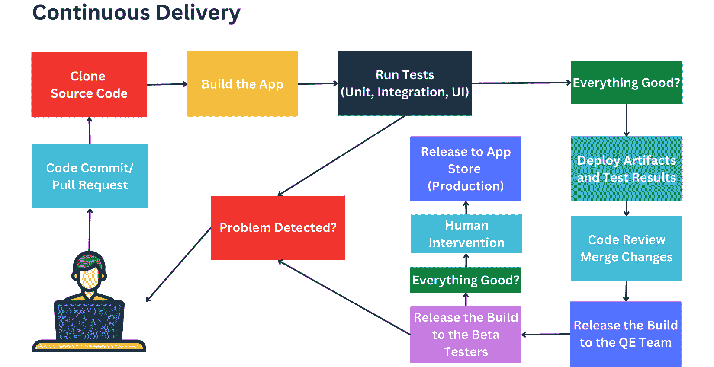
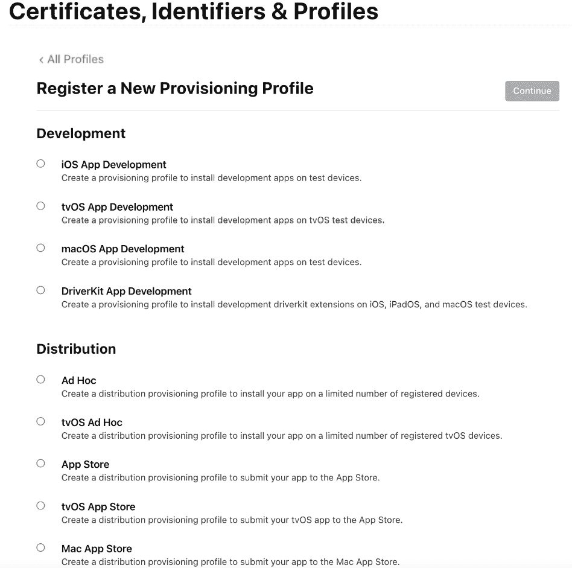
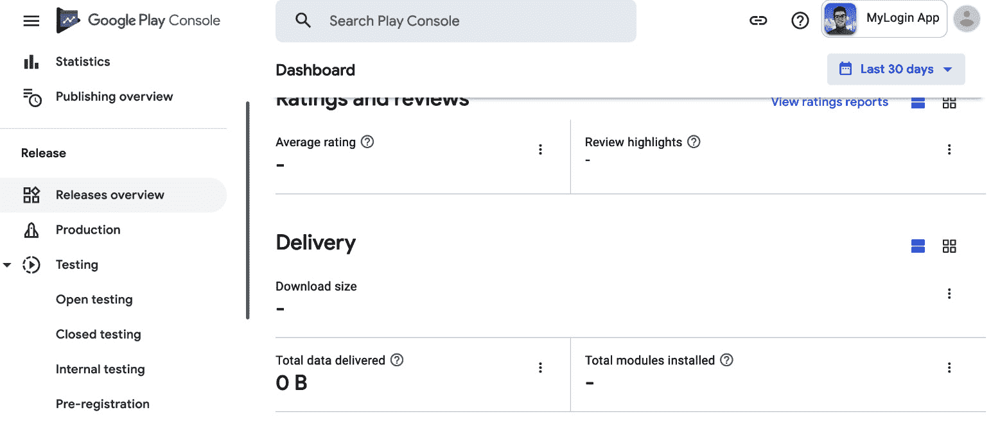

# 第六章：移动应用发布管理

我们现在处于移动 DevOps 和 CI/CD 进展的持续阶段。一旦应用程序成功开发和测试完毕，它就准备好发布到应用商店。这通常包括将移动应用发布到测试版或生产版本，并使其对用户可用。移动应用发布管理对于企业优化用户体验并保持高质量至关重要。它涉及规划和实施新功能/更新和热修复。

但发布移动应用需要不同的流程、步骤和工具。在本章中，我们将探讨移动应用发布管理过程的各个阶段，并涵盖以下主题：

+   移动应用发布管理中的挑战

+   移动应用程序发布的定义

+   实施完整的 CI/CD 过程

+   确保遵守应用商店的指南和规定

+   发布和分发移动应用程序

+   将用户反馈与测试版测试结合

+   应用商店提交

+   应用商店优化（ASO）

+   监控和报告发布进度

+   实施发布列车

首先，我们将讨论在发布移动应用时遇到的最大挑战，以便知道如何通过相关的发布策略、流程和工具来应对它们。

# 移动应用发布管理中的挑战

作为一名应用开发者，了解移动应用发布管理过程至关重要，以确保顺利部署并获得用户的高度满意。

为发布应用程序设立流程对企业至关重要，从初创公司到企业级公司，因为这是确保应用程序在长期内成功的最佳方式。这不仅有助于保持用户的参与度，还帮助建立企业与客户之间的强大关系。

此外，通过确保应用程序保持最新且无漏洞，企业可以降低用户不满意和昂贵的技术问题的风险。

作为一家以移动为主的公司，应用商店上的客户反馈和评分非常重要，因为它为我们提供了应用质量、功能和整体表现的指标——我们不能忽视它们，因为这将帮助我们改善开发和发布过程。

正如前面章节中所讨论的，移动开发是独特的，因此，由于以下原因，发布过程将是独特且具有挑战性的：

+   发布新功能或热修复没有简单直接的流程。

+   发布移动应用程序没有先决条件的工具、服务或平台来帮助我们顺利且频繁地发布；大多数情况下，我们是手动操作，这消耗了团队的时间和精力，而且发布可能会延迟数月。

+   在多个设备、平台和配置上进行测试可能会耗时且复杂。因此，在*第五章*，*实施强大的移动应用测试策略*中，我们建议使用测试自动化和云设备测试，因为手动测试可能需要数周时间才能对新版本发布有足够信心。

+   每个应用商店都有具体的政策和审查程序。 navigating 这些程序并确保遵守应用商店的规则可能会很有挑战性，且可能会导致应用发布延迟。

+   在发布后发现错误时，您可能需要恢复到先前的版本。管理多个软件版本并有效处理回滚可能会很困难。

+   发布跨平台应用程序具有挑战性，因为您需要管理两个具有不同要求、指南和流程的应用。

# 移动应用发布的定义

当移动应用发布后，客户可以下载、安装并在其设备上使用该应用。这涉及多个阶段，包括构建、测试和将应用发布到应用商店或其他分发平台。最终目标是为客户提供一个可靠、安全且功能齐全的应用，满足他们的需求和期望。

制定一个稳健的移动应用发布策略对于确保成功的上线和长期成功至关重要。以下是为您的移动应用定义发布策略的分步指南。

## 定义发布策略

拥有一个**发布策略**对确保成功的发布管理至关重要。这个策略应考虑各种方面，例如发布频率、发布功能类型、测试和验证过程、每次发布的风险以及减轻这些风险的最佳方法。

*自信发布并通过工具和策略帮助全球发布、管理和分发应用程序，以确保您的应用成功上线。*

移动应用发布策略是一个精心规划的方法，旨在启动、更新和维护移动应用程序。它概述了确保顺利发布过程的关键步骤、里程碑和所需资源，同时尽量减少干扰并最大化用户满意度。一个明确的发布策略可以帮助您管理期望，分配资源并衡量成功。

# 理解移动应用发布管理流程

移动应用发布管理涉及规划、安排、协调和向用户部署新版本或更新。这个过程对希望定期更新应用的新功能、修复程序和安全补丁至关重要。但是，在发布过程中，我们需要考虑不同的步骤；让我们一起来探索它们：

1.  发布前：

    +   计划发布

    +   构建和测试应用

1.  准备发布：

    +   管理代码签名

    +   准备`versionCode`和`versionName`

1.  发布应用

1.  选择合适的发布渠道：

    +   测试版测试

    +   应用商店提交

1.  启动应用：

    +   应用内更新

    +   监控应用的性能

1.  发布后：

    +   处理用户反馈和评论

    +   分析应用性能数据

    +   规划未来的版本发布

    +   移动发布列车

    +   应用商店优化（ASO）

为了更深入了解每个阶段，让我们详细查看每一个阶段。

## 发布前

这是初始阶段，在这个阶段，我们应该作为一个团队，定义并达成一致关于发布过程的内容，包括发布策略、责任划分等。

### 发布规划

一旦发布策略已被定义，开发实现过程就显得尤为重要。这个过程应该包括*发布安排*、*管理代码更改*和*确保应用符合质量标准*。还应包括确保应用在发布前经过测试和验证的步骤。

### 构建和测试应用

如前章所述，我们应该使用**持续集成**（**CI**）流水线来构建和测试移动应用，确保我们没有任何阻碍因素或问题会延迟发布过程。然后，我们可以继续进行**持续交付和持续部署**（**CD**），将应用发布到应用商店。

### 持续交付和部署（CD）

如在*第三章*《移动 DevOps 基础》一书中提到，**持续交付**会自动将通过 CI 检查的构建交付到生产环境（例如*暂存环境*），在那里进行测试和审查，确保其符合要求后再发布到生产环境。

*目标是自动化开发和部署过程，以确保移动应用的快速、可靠和经济的交付。*

移动应用的 CI/CD 过程主要包括以下几个步骤：

1.  将构建版本发布给 QA 团队，以便他们进行额外的检查和测试，例如探索性测试，以确保构建符合预期。

1.  如果公司或团队已经参与该计划，可以将构建版本发布给测试人员。

1.  如果一切正常，发布经理或负责发布过程的人可以批准构建并将其发布到相关的应用商店或生产环境中。

1.  以下图中可以看到这些步骤：



图 6.1 – 持续交付过程

**持续部署**通常是 CI/CD 流水线的一部分，这意味着部署到代码库的代码将自动部署到生产环境——在我们这里，移动应用将自动部署到相关的应用商店。CI/CD 流水线通常被称为这些实践的结合体：


图 6.2 – 持续部署过程

持续部署过程自动化了应用构建的部署流程，避免了人工干预。阻止新更改部署到生产环境的唯一因素是构建或测试失败。这一流程有助于加快应用生产，并更快速地获得客户反馈。

注意

要了解 GitHub 移动团队如何通过 GitHub Actions 自动化发布流程，请访问[`github.blog/2022-01-12-how-we-ship-github-mobile-every-week/`](https://github.blog/2022-01-12-how-we-ship-github-mobile-every-week/)。

## 准备发布版本和标签

我们需要根据应用的不同执行不同的步骤。例如，在应用级别的 `build.gradle` 文件中，需要处理 `versionCode` 和 `versionName`。

接下来的步骤是使用 **Build** 菜单中的 **Generate Signed Bundle / APK...** 选项生成签名的 APK 或应用包；本节后面我们将介绍代码签名和生成包文件的过程。这也可以在 CI 服务器上自动完成。

同时，对于 **iOS 应用**，有不同的步骤，涉及在应用目标设置的 **General** 选项卡中更新版本和构建号。完成后，选择 **Generic iOS Device** 作为构建目标，从 **Product** 菜单归档应用，然后选择 **Archive** 菜单。本节后面我们将介绍如何进行代码签名和归档应用。

完成这些步骤后，GitHub 仓库中的发布标签和发布说明将为下一个发布版本做好准备。

## 准备发布

将任何应用发布到 Apple App Store、Google Play Store 或其他任何商店，都需要证书、配置文件或 **Keystores** 来识别应用已由受信任的公司或开发者构建。

因此，我们需要在构建发布应用之前管理代码签名过程。

### 设置开发者账户

该过程的第一步是设置 *Apple 开发者账户*。您需要提供姓名、地址和联系方式，还需要提供支付信息并同意 *Apple Developer Program License Agreement*。设置好账户后，您可以访问 *Apple Developer Portal*。对于 Google 开发者账户也需要执行相同的步骤，以便将应用发布到 Google Play 商店。

### 管理代码签名

**代码签名** 是对应用程序可执行代码进行数字签名的过程，确保其完整性和真实性。这个过程在 Android 应用开发生命周期中至关重要，它帮助确认应用来自受信任的来源，并且自签名以来没有被篡改。

让我们解释一下 Android 和 iOS 所需的代码签名步骤。

首先，让我们从 Android 应用的代码签名步骤开始。

要对 Android 应用进行签名（[`developer.android.com/studio/publish/app-signing`](https://developer.android.com/studio/publish/app-signing)），请按照以下步骤操作：

1.  设置一个开发者账户（[`play.google.com/console/`](https://play.google.com/console/)）。

1.  使用 keytool 工具创建一个唯一的私钥-公钥对（[`docs.oracle.com/javase/8/docs/technotes/tools/unix/keytool.html`](https://docs.oracle.com/javase/8/docs/technotes/tools/unix/keytool.html)）。

1.  使用私钥签署应用程序，并将公钥嵌入到自签名证书中。

Android Studio 或 *apksigner* 工具用于使用生成的密钥对打包并签署应用程序。

Android 系统在安装过程中验证应用程序的签名，以确保其完整性和真实性。

要生成私钥-公钥对和自签名证书，请按照以下步骤操作：

1.  打开终端或命令提示符。

1.  执行以下命令：

    ```
    keytool -genkey -v -keystore my-release-key.jks -keyalg RSA -keysize 2048 -validity 10000 -alias my-alias
    ```

1.  在提示时提供所需信息，如你的姓名、组织和位置。

1.  选择一个强密码用于你的密钥库和密钥对。

你的密钥对和自签名证书将存储在指定的 `.jks` 文件中，如下图所示：


图 6.3 – keytool 输出

要在 Android Studio 中签署应用程序，请按照以下步骤操作：

1.  在 Android Studio 中，打开 **构建** 菜单并选择 **生成已签名的 Bundle / APK...**：


图 6.4 – 生成已签名的 Bundle / APK…

选择 `.aab`（Android 应用包）。然后，点击 **下一步**：


图 6.5 – 选择 Android 应用包或 APK

1.  点击 `my-release-key.jks`：


图 6.6 – 选择密钥库路径

1.  输入密钥库和密钥对密码以及密钥别名。

1.  选择你的 **目标文件夹** 和 **构建变体** 参数，然后点击 **完成**：


图 6.7 – 选择构建变体

Android Studio 将创建一个已签名的 App Bundle，准备好分发，如下图所示：


图 6.8 – Gradle 执行任务

在发布文件夹中，你可以找到生成的 `.aab` 文件，如下图所示：


图 6.9 – .aab 文件

注

保持你的签名密钥和密钥库文件的安全——它们用于标识和验证你的应用程序。如果你丢失了签名密钥或密钥库文件，将无法更新或维护你的应用程序。

现在，让我们看一下 iOS 应用程序代码签名的步骤。

要签署 iOS 应用程序，请按照以下步骤操作：

1.  登录或创建一个 Apple 开发者账户（[`developer.apple.com/`](https://developer.apple.com/)），如果你还没有的话。

1.  访问 Apple 开发者门户，并从仪表板选择 **证书、标识符与描述文件**。

**证书**是用来验证应用开发者身份并签署应用代码的数字文件。

有两种类型的证书：

+   **开发证书**，用于应用开发过程中

+   **App Store（发布）证书**，用于将应用分发到 Apple App Store

**标识符**是用于将你的应用与开发者账户关联、启用某些应用功能（如推送通知）并创建配置文件的唯一标识符。

有三种类型的标识符：

+   **应用 ID**：此 ID 用于标识特定应用

+   **包 ID**：此 ID 用于标识特定应用组内的应用

+   **团队 ID**：此 ID 用于标识开发者或组织

**配置文件**是包含关于你的应用、证书和设备标识符的文件。这些配置文件允许你的应用在 iOS 设备上运行，并访问某些应用功能，如推送通知、应用内购买和 iCloud。

有两种类型的配置文件：

+   **开发配置文件**，用于应用开发过程中。

+   **发布配置文件**，用于将应用分发到 App Store，如下图所示：


图 6.10 – Apple 开发者证书

在 Apple 开发者门户中，打开**证书、标识符与配置文件**([`developer.apple.com/account/resources/certificates/list`](https://developer.apple.com/account/resources/certificates/list))页面，然后点击**+**按钮创建新的证书。选择**iOS 应用开发**并点击**继续**，如下图所示：


图 6.11 – 创建新的 Apple 开发者证书

按照屏幕上的指示从 Mac 的钥匙串访问应用生成**证书签名请求**（**CSR**）([`developer.apple.com/help/account/create-certificates/create-a-certificate-signing-request`](https://developer.apple.com/help/account/create-certificates/create-a-certificate-signing-request))。上传 CSR 并下载生成的开发证书。

接下来，你需要创建一个应用 ID。这个唯一标识符将你的应用与其配置文件和证书关联起来。点击**标识符**，然后点击**+**按钮。填写必要的详细信息，点击**继续**注册你的应用 ID，如下图所示：


图 6.12 – 创建应用标识符

现在，让我们创建一个配置文件。点击**Profiles**，然后点击**+**按钮。选择**iOS App Development**并点击**Continue**。选择你刚创建的 App ID、开发证书，以及你想用于测试的设备。为你的配置文件命名并点击**Generate**，如下面的截图所示：



图 6.13 – 注册新配置文件

选择我们之前创建的 App ID，并配置配置文件，如下面的截图所示：


图 6.14 – 生成配置文件 | 选择一个 App ID

打开你的 Xcode 项目并进入**Signing & Capabilities**标签。点击**Team**下拉菜单，选择你的开发者账户。Xcode 应该会自动处理配置文件和证书。如果没有，点击**Import Profile**并找到你下载的配置文件。

一旦你设置好账户、配置文件、App ID 和证书，你就需要为发布准备你的应用。这包括完成创建截图和设置应用元数据等任务。

但在此之前，你需要上传并保存你的凭据到 CI 提供商，以便在发布过程中自动签署应用。例如，**Bitrise** 在工作流编辑器中提供了一个标签，你可以上传你的配置文件和代码签名证书，以便它们能在 iOS CI/CD 流水线中使用：


图 6.15 – Bitrise 的 iOS 代码签名与文件标签

对于 Android，你可以上传 Keystore 文件以在 CI/CD 流水线中签署你的应用：


图 6.16 – Bitrise 的 Android 代码签名与文件标签

在 GitHub Actions 中也应该是一样的情况；你可以将凭据存储在 GitHub Secrets 中（[`docs.github.com/en/actions/reference/encrypted-secrets`](https://docs.github.com/en/actions/reference/encrypted-secrets)），这样可以快速将凭据传递给 GitHub Actions。你还可以使用 Codemagic 来处理 iOS（[`docs.codemagic.io/yaml-code-signing/signing-ios/`](https://docs.codemagic.io/yaml-code-signing/signing-ios/)）和 Android（[`docs.codemagic.io/yaml-code-signing/signing-android/`](https://docs.codemagic.io/yaml-code-signing/signing-android/)），采用相同的方法，或使用任何其他 CI 提供者。

注

或者，你可以通过 API 密钥连接到 Apple 服务（如 App Store Connect 或 Apple Developer Portal），以自动上传 iOS 应用到 App Store。

### 使用 fastlane match 管理大规模移动团队中的证书和配置文件

在一个大型且可扩展的移动团队中，集中且安全地管理证书和配置文件至关重要，以防止冲突并确保所有团队成员使用最新的统一文件。

工具如**fastlane**和**fastlane match**（[`docs.fastlane.tools/actions/match/`](https://docs.fastlane.tools/actions/match/)）可用于在大型团队中管理证书和配置文件。这些工具会在构建和发布应用时自动下载开发人员的最新签名证书和配置文件。

文件应根据仓库中的**Matchfile**进行存储和访问。一旦证书和配置文件被下载，团队成员可以使用 fastlane match 构建和发布应用，如下图所示：


图 6.17 – fastlane match 的工作原理。

使用 fastlane match 有助于消除许多与代码签名相关的常见问题，如过期的证书或不匹配的配置文件。这是一个推荐的安全且协作的代码签名管理方法。在*第九章*，*移动 DevOps 最佳实践*中，我们将讨论如何在构建、测试和发布移动应用时使用 fastlane。

## 发布应用。

**发布候选版本**（**RC**）构建在满足以下条件时准备好交付给我们的测试人员：

+   为处理发布候选版本所需的任何紧急修复，创建了一个*分支*。

+   *构建*是根据适当的版本号生成并上传到 TestFlight/Firebase App Distribution，具体取决于应用的类型。

+   所有的*单元测试*、*UI 测试*和*快照测试*都已通过。

+   创建一个问题来跟踪*发布过程*。

+   *发布说明*已准备好。

+   如果没有问题，构建可以自动提交到 App Store 或 Google Play Store，或者可以由发布经理和相关人员手动批准。

这个工作流或管道可以通过你的 CI 提供商实现，如在*第四章*中讨论的，*通过移动 DevOps 实现持续集成与交付*，但如前所述，它应支持与不同工具和服务的集成，以简化发布过程。

团队需要为给定的构建生成一个应用二进制文件。然后，必须定义一个包含多个步骤的任务，生成构建，执行测试用例，然后将其归档并上传到 TestFlight（iOS）或 Firebase App Distribution（Android）。你可以为每个版本创建一个专用的分支，这样可以随时回溯并挑选任何想要包含的更改，如下图所示：


图 6.18 – 移动发布周期。

现在，让我们深入了解不同的发布阶段，例如 beta 测试和应用商店提交。

### Beta 测试

移动应用的 Beta 测试是创建过程中的一个关键阶段。在正式发布之前，它使开发者能够在实际移动设备上测试他们的应用并收集用户反馈。通常，Beta 测试使用一小群愿意测试发布版本并提供功能、可用性和整体用户体验反馈的用户。

移动应用开发过程中的 Beta 测试阶段至关重要，因为它为开发者提供了在公开发布前评估应用的可用性和功能的机会。然而，由于以下原因，构建有效的 Beta 测试计划可能会让人感到紧张：

+   **害怕负面反馈**：当将应用交给 Beta 测试人员时，可能会担心他们会提供负面反馈或遇到可能会削弱开发团队信心的关键漏洞。

+   **资源不足**：创建一个合适的 Beta 测试计划需要资源，如时间、金钱和人员。与测试人员协调、管理反馈以及实施更改可能会消耗大量资源，特别是对于较小的开发团队或独立开发者来说。

+   **确定合适的测试人员**：找到真正有兴趣提供有价值反馈并代表目标用户群的 Beta 测试人员可能具有挑战性。

+   **时间限制**：Beta 测试阶段可能会引入延迟，这可能会被视为快速部署的障碍。

设置应用的 Beta 测试计划有不同的步骤。我们来看一下。

### 定义应用的范围

设置成功的移动应用 Beta 测试计划的第一步是定义应用的范围。这应该包括对应用功能、目标用户以及应用可用平台的清晰描述。这对于确保应用在正确的环境中进行测试至关重要。

此外，开发者应该考虑在 Beta 测试过程中想要跟踪哪些指标。这可能包括下载数量、使用统计数据和用户反馈。

一旦应用的范围确定，就可以开始设置 Beta 测试计划。

### 准备发布

一旦 Beta 测试计划建立完成，准备应用的发布至关重要。这包括确保在测试阶段识别出的任何问题都得到了处理，并且应用已准备好公开发布。开发者还应考虑如何推广应用以及采取哪些措施以确保成功的发布。

对于 iOS，开发人员需要创建一个 App Store Connect 账户（[`appstoreconnect.apple.com/login`](https://appstoreconnect.apple.com/login)），并通过平台提交他们的应用程序。对于 Android，则需要一个 Google Play 控制台账户（[`play.google.com/console/about/`](https://play.google.com/console/about/)），并必须通过该平台提交他们的应用程序。这包括提供必要的元数据，如应用程序的名称、描述、关键字、截图、应用图标和定价信息。

开发人员还需要提供一个测试帐户及其登录凭据，如果他们的应用程序需要身份验证，则可以访问应用商店的内容或功能。这使他们能够在 Beta 测试和应用商店提交阶段测试应用程序。

通过允许一组用户在应用程序发布之前测试该应用程序，开发人员可以获取有关产品性能的宝贵反馈，并在确定版本发布之前进行任何必要的调整或增强。

### 招募测试员

你可以联系那些对测试应用程序表示兴趣的目标用户群体。你也可以在与应用相关的论坛和社交媒体上发布信息，或使用像 TestFlight 这样的服务来找到测试员。以下是一些有效的招募测试员的方法：

+   **提供清晰的说明**：一旦你招募了测试员，向他们提供清晰的安装和使用应用程序的说明，以及如何提供反馈意见。

+   **监控反馈**：监控测试员的响应，并在向公众发布之前对应用程序进行任何必要的更改。

### Beta 测试工具

在移动应用程序开发中，Beta 测试是一个重要的阶段。它允许开发人员在应用程序全面发布之前从有限的用户群体中获取宝贵的反馈意见，识别和修复问题，并确保更顺利的发布。有多种工具可用于在移动应用程序上进行 Beta 测试。以下是一些流行的工具：

+   TestFlight

+   Google Play Beta 测试

+   Firebase 应用分发

让我们仔细看看。

#### TestFlight

**TestFlight**（[`developer.apple.com/testflight/`](https://developer.apple.com/testflight/)）是 iOS 应用开发者的宝贵工具，允许他们在将应用程序发布到应用商店之前进行测试。它现在是 iOS 应用开发生态系统的一部分。

TestFlight 简化了开发人员邀请 Beta 测试员尝试他们的应用程序的流程。您只需提供测试人员的电子邮件地址，他们将收到通过 TestFlight 下载应用程序的邀请。

TestFlight 与 iOS 开发环境的集成使得在 iPhone、iPad 和其他 Apple 设备上分发和测试应用程序变得简单。它是免费的，适用于各种规模的开发者，从个人到大公司。

开发人员可以同时分发多个应用构建版本，从而测试不同的版本并确定最成功的版本。

TestFlight 使测试版测试者能够轻松地在应用中直接提供反馈。这确保开发者能够获得宝贵的意见，并在公开发布应用之前进行必要的改进。

开发者可以邀请最多 10,000 名外部测试者，这使他们能够收集大量反馈并发现潜在问题。有关使用 TestFlight 测试应用的更多信息，请访问 [`testflight.apple.com/`](https://testflight.apple.com/)。

以下是您必须遵循的使用 TestFlight 进行测试的基本步骤：

1.  在 Xcode 中创建一个新版本，并确保它符合所有应用商店的指南和要求，包括截图和元数据。

1.  将您的应用上传到 App Store Connect，并选择要分发给测试版测试者的版本。

1.  通过从 App Store Connect 发送电子邮件邀请，邀请测试版测试者来测试您的应用。每个应用最多可以邀请 10,000 名测试者。邀请后，他们将收到一封邀请邮件，接受邀请并在其 iOS 设备上安装 TestFlight。

1.  在测试版测试者接受邀请并安装 TestFlight 后，您可以将他们添加到 App Store Connect 的一个组中。这样，您可以管理不同版本应用的分发，将其分发给不同的测试者组。

1.  一旦您将测试版测试者添加到一个组中，就可以通过在 App Store Connect 中选择要分发的应用版本，并选择要分发给的测试者组，来将应用分发给他们。

1.  测试版测试者可以通过 TestFlight 应用提供关于应用的反馈，包括截图、评论和评分。

1.  监控应用的表现并跟踪测试版测试者报告的问题，然后修复发现的任何问题。

在测试版阶段完成并解决所有问题后，应用就可以发布到相关的应用商店。

#### Google Play 测试版

**Google Play 测试版** ([`support.google.com/googleplay/android-developer/answer/9845334?hl=en&visit_id=638185357369512451-3818777855&rd=1`](https://support.google.com/googleplay/android-developer/answer/9845334?hl=en&visit_id=638185357369512451-3818777855&rd=1)) 是 Android 应用开发者的重要工具，提供了一个直接的方式来在应用发布到 Google Play 商店之前进行测试。它的简单设置、与 Google Play 商店的无缝集成以及对大量测试者的支持，使其成为 Android 应用测试的首选工具。

Google Play 测试版允许开发者通过电子邮件邀请或共享链接的方式将应用分发给测试者。测试者可以像访问其他应用一样，通过 Google Play 商店轻松访问应用。

测试者可以直接在应用中提供反馈，为开发者提供改进应用的重要意见，从而在应用发布到公众之前进行必要的优化。

Google Play beta 测试还支持分阶段发布，允许开发者将应用更新发布给一部分用户，并逐步增加该部分用户的比例。

你可以使用 Google Play Console 针对特定群体进行测试，或者将测试向 Google Play 用户开放，如下图所示：



图 6.19 – Google Play Console

Google Play 提供三种测试类型：

+   **内部测试**：最多可以让 100 名测试者快速访问你的应用进行初步质量保证检查：


图 6.20 – Google Play Console – 内部测试

+   **开放测试**：这允许你与大量用户进行测试，并在 Google Play 上展示测试版本的应用：


图 6.21 – Google Play Console – 开放测试

+   **封闭测试**：这允许你在发布前的测试阶段，从更广泛的测试者中收集更有针对性的反馈：


图 6.22 – Google Play Console – 封闭测试

以下是在 Google Play Console 上实施 beta 测试的一般步骤：

1.  通过创建 beta 版本并使用 Keystore 签名，确保应用准备好进行测试。

1.  通过将测试者的 Google 电子邮件地址添加到 Google Play Console，创建一个 beta 测试者列表。

1.  将应用的 beta 版本上传至 Google Play Console，beta 测试者可以访问它。

1.  通过电子邮件向测试者发送 beta 测试邀请，其中包含一个下载应用程序 beta 版本的链接。

1.  监控来自 Google Play Console 的 beta 测试反馈，并解决任何报告的问题或 bug。

1.  根据收到的反馈，我们可以对应用进行修改和改进，然后再向公众发布。

1.  一旦完成测试并解决所有问题，便可以通过 Google Play Store 向公众发布。

#### Firebase 应用分发

**Firebase 应用分发** ([`firebase.google.com/docs/app-distribution`](https://firebase.google.com/docs/app-distribution)) 可以通过简单的流程将你的应用分发给可信赖的测试者，将应用迅速部署到测试者的设备上。这样，你可以提前并频繁地收到反馈，并将其与移动 DevOps 和 CI/CD 目标对齐。

Firebase 应用分发允许开发者在 iOS 和 Android 设备上分发和测试应用，使其成为多平台应用开发的多功能选择。然而，iOS 开发者通常更喜欢使用 TestFlight，因为它是免费的，并且与 Apple 的服务和应用集成得更紧密。

使用 Firebase 应用分发分发应用给测试者非常简单。你可以通过电子邮件邀请测试者，或者分享一个链接，让他们快速访问应用。

Firebase App Distribution 与**Crashlytics** ([`firebase.google.com/products/crashlytics`](https://firebase.google.com/products/crashlytics)) 无缝集成，这是一个实时崩溃报告工具。它帮助开发者快速识别并修复问题，提高应用的稳定性和性能。

Firebase App Distribution 支持流行的 CI/CD 工具，允许开发者自动化构建、测试和分发应用的过程。

使用 Firebase App Distribution 进行 Android 测试的基本步骤如下：

1.  创建 Firebase 账户和项目。

1.  将 Firebase SDK 添加到你的项目中。

1.  创建一个已签名的发布版应用包。

1.  使用 Firebase CLI、Gradle 或 CI 服务器将你的应用构建上传到 Firebase App Distribution。

1.  通过添加测试者的电子邮件地址或在 Firebase 控制台中创建测试者组来邀请测试者。你也可以导入包含测试者电子邮件地址的 CSV 文件。

1.  一旦构建完成并上传，且测试者已添加，便可以将应用分发给选定的测试者。他们将收到一封包含访问和安装应用 Beta 版本的说明的电子邮件邀请。

一旦测试阶段完成，我们可以进入最后阶段，即将应用提交到应用商店。

### 提交应用

在提交应用进行审核之前，开发者必须确保其符合*App Store 审核指南*，该指南涵盖了诸如用户隐私、内容、设计和功能等广泛的主题。开发者还应在不同设备和 iOS 版本上广泛测试应用，以确保流畅的用户体验。

提交应用即意味着将其上传到应用商店（如 App Store 或 Google Play）进行审核和批准，并让用户可以下载。

一旦你的应用准备好，你需要将其提交到相关的应用商店。这包括上传应用、提供*截图*和其他*元数据*，并提交应用进行审核。审核过程可能需要长达一周的时间，只有当应用符合应用商店的指南时，它才有可能被接受。

审核过程通常需要几天时间，但根据应用的复杂性和提交量，时间框架可能会有所不同。在审核过程中，Apple 团队会根据 App Store 审核指南对应用进行评估，检查其功能性、性能、设计和内容问题。

审核过程后，可能有几种结果：

+   如果应用符合所有指南，它将被*批准*并发布到 Apple App Store。你将收到通知，应用将可供下载。

+   如果应用不符合指南，它将被*拒绝*，并且你将收到反馈，说明需要解决的具体问题。然后，你可以进行必要的更改并重新提交应用进行审核。

+   如果应用的元数据不符合指南，它将被*拒绝*，但二进制文件无需重新审核或重新构建。你可以更新元数据并重新提交进行审核。

我们现在准备好发布应用了。但在此之前，我们需要了解可以使用哪些移动应用分发平台来公开发布它。

### 移动应用分发平台

**移动应用分发平台** 是开发者发布、分发并销售移动应用的数字市场。这些平台对于开发者而言至关重要，可以帮助他们触及更广泛的受众，并为其应用赢得曝光。一些最受欢迎的移动应用分发平台包括：

+   **Apple App Store** ([`www.apple.com/de/app-store/`](https://www.apple.com/de/app-store/)): iOS 设备的官方应用商店，包括 iPhone、iPad 和 iPod Touch。开发者可以提交应用进行审核，并在审核通过后提供下载。

+   **Google Play Store** ([`play.google.com/store/apps`](https://play.google.com/store/apps)): Android 设备的官方应用商店，提供各种应用、游戏和其他数字内容，供用户下载。与 Apple App Store 类似，开发者可以提交应用进行审核，并在审核通过后提供下载。

+   **Amazon Appstore** ([`www.amazon.com/mobile-apps/b?ie=UTF8&node=2350149011`](https://www.amazon.com/mobile-apps/b?ie=UTF8&node=2350149011)): 亚马逊的应用商店，是 Android 应用的替代市场，提供广泛的应用和游戏，包括一些仅在该平台上独有的应用。

+   **Microsoft Store** ([`apps.microsoft.com/store/apps`](https://apps.microsoft.com/store/apps)): Windows 设备的应用商店，包括 Windows Phone、Surface 平板电脑和 Windows PC 等设备。开发者可以通过该平台分发移动应用和桌面应用。

+   **Samsung Galaxy Store** ([`galaxystore.samsung.com/apps`](https://galaxystore.samsung.com/apps)): 三星的应用商店，提供专为三星设备定制的各种应用和游戏，包括独家内容和促销活动。

+   **Huawei AppGallery** ([`appgallery.huawei.com/`](https://appgallery.huawei.com/)): 华为的官方应用商店，提供适用于华为和荣耀设备的应用和游戏。由于与谷歌服务断开连接，华为一直在发展其应用商店，作为 Google Play Store 的替代方案。

需要注意的是，所有这些应用商店都有相关的指南和政策，提交应用时必须遵守：

+   App Store ([`developer.apple.com/app-store/review/`](https://developer.apple.com/app-store/review/))

+   Google Play ([`play.google.com/console/about/guides/releasewithconfidence/`](https://play.google.com/console/about/guides/releasewithconfidence/))

+   亚马逊应用商店 ([`developer.amazon.com/docs/app-submission/understanding-submission.html`](https://developer.amazon.com/docs/app-submission/understanding-submission.html))

+   华为应用市场 ([`developer.huawei.com/consumer/en/doc/distribution/app/50104`](https://developer.huawei.com/consumer/en/doc/distribution/app/50104))

+   微软应用商店 ([`learn.microsoft.com/en-us/windows/apps/publish/publish-your-app/create-app-submission?pivots=store-installer-msix`](https://learn.microsoft.com/en-us/windows/apps/publish/publish-your-app/create-app-submission?pivots=store-installer-msix))

确保你的应用符合所有要求和指南，以便按时完成审核过程。

### App Store 提交

将 iOS 应用上传到 Apple App Store 包括以下步骤：

1.  你需要配置你的 Xcode 项目，以便使用必要的配置文件和证书构建并归档你的应用。确保你拥有用于应用分发的必要配置文件和证书，而不仅仅是开发用的证书。

1.  访问**App Store Connect**网站，并使用你的 Apple Developer 账户登录。

1.  点击**我的应用**并选择你要提交的应用。

1.  在左侧边栏中，点击**App Store**标签，滚动到**元数据**部分，点击**编辑**按钮。在这里，你可以为你的应用添加必要的元数据，包括应用名称、副标题、描述、关键词和类别。

1.  滚动到**截图与视频**部分并点击**编辑**按钮。在这里，你可以为每种设备类型和你支持的语言添加应用截图。确保你的截图符合 App Store 的指南，包括正确的尺寸和分辨率。

1.  你可以通过拖放截图到**截图**部分，或点击**+**按钮从电脑中选择截图进行上传。

1.  你还需要设置你的应用价格或选择将其免费提供。你还可以选择哪些国家或地区可以使用你的应用。

1.  完成所有必要步骤后，你可以将应用提交到 App Store 进行审核。确保你已彻底测试应用，并符合 Apple 的所有指南和政策。

1.  Apple 将审核你的应用，以确保它符合所有技术、设计和内容要求。审核过程通常需要几天时间，但如果应用存在问题，可能会更长。

一旦你的应用获得批准，你可以在 App Store 上发布它。你可以选择立即发布，或者安排未来某个日期发布。

### App Store 提交提示

提交应用到 App Store 时，有几个步骤可以增加被接受的机会。首先，你应确保所有必填信息已包含并准确无误。这些信息包括截图、视频、联系方式、应用描述和隐私政策：

+   确保应用程序与最新的 iOS 版本和设备兼容。

+   使用 beta 测试工具在提交应用到 App Store 之前进行测试。

+   投资于优质的设计和开发服务，以确保您的应用符合 App Store 对质量的标准。

+   遵循 App Store 提交应用的指南，包括提供完整且准确的应用描述。

通过遵循这些提示，应用开发者可以提高应用被 App Store 接受的机会。

### Google Play 商店提交

Google Play 商店 ([`play.google.com/store/apps`](https://play.google.com/store/apps)) 是 Android 设备的官方应用分发平台。与 Apple App Store 类似，开发者可以将他们的应用提交到 Play 商店进行审批，并分发给 Android 用户。

发布 Android 应用可能令人兴奋，但了解涉及的过程对于确保应用的成功至关重要。

将 Android 应用上传到 Google Play 商店涉及以下步骤：

1.  在 Google Play 控制台中，进入**所有应用程序**标签页，点击**创建应用**按钮。选择一个默认语言并为您的应用输入标题。这将创建一个应用的草稿列表，您可以稍后更新更多细节。

1.  接受开发者计划政策和美国出口法律，然后点击**创建** **应用**按钮：


图 6.23 – Google Play 控制台 – 创建应用

1.  请确保使用安全证书签名您的 APK 或 AAB 文件，创建版本代码，并更新应用的版本名称。

1.  在 Google Play 控制台中，进入**发布概览**部分，然后选择**生产**。通过选择适当的发布轨道（alpha、beta 或 production）来创建一个新的发布版本。上传您的 AAB 文件并填写必要的详细信息，如下图所示：


图 6.24 – Google Play 控制台 – 发布仪表板

1.  现在，您可以创建一个新的生产发布版本，如下图所示：


图 6.25 – Google Play 控制台 – 创建生产发布

1.  如果您的应用有应用内产品、订阅或使用任何其他 Google Play 服务，请在**获利**部分中进行相应配置：


图 6.26 – Google Play 控制台 – 获利

最后，在**应用内产品**下，您可以添加 Google 支付详细信息，如下所示：


图 6.27 – Google Play 控制台 – 应用内产品

提交后，谷歌将审核您的应用，通常需要几个小时到几天时间。审核通过后，您的应用将在 Google Play 商店上线，您可以开始跟踪其性能、管理更新并回应用户反馈。

此外，您可以将安卓应用上传到其他应用商店，而不是 Google Play 商店，例如亚马逊应用商店、华为应用市场和三星 Galaxy Store。

要将应用上传到亚马逊应用商店，您需要拥有一个亚马逊开发者账户（[`developer.amazon.com/`](https://developer.amazon.com/)）。

将安卓应用上传到亚马逊应用商店涉及以下步骤：

1.  您需要配置您的 APK，并使用有效的证书进行签名。确保您的应用符合亚马逊的技术和设计指南（[`developer.amazon.com/docs/app-submission/understanding-submission.html`](https://developer.amazon.com/docs/app-submission/understanding-submission.html)），并且使用有效的签名证书构建：


图 6.28 – 亚马逊开发者仪表盘

1.  一旦您的应用准备好上传，您需要提供一些有关应用的信息。这包括应用的名称、描述、关键词、截图以及其他元数据，帮助用户发现并下载您的应用。亚马逊应用商店目前支持分阶段发布（[`developer.amazon.com/docs/app-submission/release-updates-in-staged-rollouts.html`](https://developer.amazon.com/docs/app-submission/release-updates-in-staged-rollouts.html)），让您逐步将应用的新版本引入市场。

1.  完成所有必要的步骤后，您可以将应用提交到亚马逊应用商店进行审核。确保您已彻底测试应用，并遵守所有亚马逊的指南和政策。

1.  亚马逊将审核您的应用程序，以确保其符合所有技术、设计和内容要求。审核过程通常需要几个小时，但如果应用程序存在问题，可能会花费更长时间。

一旦您的应用被批准，您可以在亚马逊应用商店发布它。您可以选择立即发布或安排未来的发布日期。

### 完成 CI/CD 工作流

要完成我们在*第四章*《通过移动 DevOps 实现持续集成和交付》中创建的 CI/CD 工作流，您可以将所需的步骤添加到您的流水线中，以将 iOS 和安卓应用发布到 TestFlight、App Store、Firebase App Distribution、Google Play 商店或任何其他分发平台。

例如，以下是使用 **Xcode Archive & Export for iOS** 和 **Deploy to App Store Connect** 等步骤，通过 Bitrise 构建、测试和发布 iOS 应用到 App Store 的工作流概览，如下所示的截图所示：


图 6.29 – Bitrise iOS CI/CD 工作流

这是一个高层次的概述，展示了使用 Codemagic 构建、测试并发布 iOS 应用到 App Store 的 YAML 文件：[`github.com/PacktPublishing/Mobile-DevOps-Playbook/blob/main/Chapter-6/codemagic-iOS.yml`](https://github.com/PacktPublishing/Mobile-DevOps-Playbook/blob/main/Chapter-6/codemagic-iOS.yml)。

此外，你还可以使用 GitHub Actions 执行相同的步骤，构建、测试并发布 iOS 应用到 App Store：[`github.com/PacktPublishing/Mobile-DevOps-Playbook/blob/main/Chapter-6/.github/ios.yml`](https://github.com/PacktPublishing/Mobile-DevOps-Playbook/blob/main/Chapter-6/.github/ios.yml)。

现在，让我们来看看使用 Bitrise、Codemagic 和 GitHub Actions 构建、测试和发布 Android 应用的一些示例。

我们将从 Bitrise 开始。以下截图展示了 Firebase 应用分发和 Google Play 的高级 Android CI/CD 工作流：


图 6.30 – Bitrise Android CI/CD 工作流，用于 Firebase 应用分发和 Google Play

对于 Codemagic，你可以在 [`github.com/PacktPublishing/Mobile-DevOps-Playbook/blob/main/Chapter-6/codemagic-android.yml`](https://github.com/PacktPublishing/Mobile-DevOps-Playbook/blob/main/Chapter-6/codemagic-android.yml) 找到 YAML 文件。

最后，对于 GitHub Actions，你可以在 [`github.com/PacktPublishing/Mobile-DevOps-Playbook/blob/main/Chapter-6/.github/android.yml`](https://github.com/PacktPublishing/Mobile-DevOps-Playbook/blob/main/Chapter-6/.github/android.yml) 找到 YAML 文件。

此外，我们还可以将 Android 应用上传到其他应用商店，例如针对华为设备的 Huawei 应用商店。以下是使用 Bitrise 构建、测试和部署 Android 应用到 Huawei 应用商店的工作流示例：


图 6.31 – Bitrise Android CI/CD 工作流，用于 Huawei 应用商店

一旦我们将应用发布并部署到不同的应用商店，我们需要等待质量团队给我们反馈关于版本的意见。如果通过审批，它可以发布到不同的商店；否则，我们将收到拒绝的理由。在这种情况下，我们必须修复问题并上传另一个版本。

现在，让我们来看一些常见的应用拒绝原因以及如何避免它们。

#### 应用商店何时拒绝应用？

开发一个应用可能是一个耗时且昂贵的过程。应用开发者希望他们的应用能被应用商店接受，但有时它们会被拒绝。

当应用被拒绝时，这对开发者来说可能是一次令人沮丧的经历。理解应用被拒的原因非常重要，以便避免再次发生。

让我们来看一下 App Store 拒绝应用的最常见原因（[`developer.apple.com/app-store/review/#common-app-rejections`](https://developer.apple.com/app-store/review/#common-app-rejections)），以及应用开发者可以做些什么来提高被接受的机会。

#### 不完整或不正确的信息

最常见的拒绝原因之一是*不完整或不正确的信息*。例如，如果应用开发者没有提交所有必需的截图和视频，App Store 会拒绝该应用。应用开发者还应确保应用的名称、描述和关键词准确无误并且是最新的，提供完整且准确的信息，以确保应用能够被接受。

#### 质量差

App Store 还会拒绝不符合质量标准的应用。这包括那些难以使用、存在过多漏洞，或者用户体验不佳的应用。因此，在*第五章*《实施稳健的移动应用测试策略》中，我们建议在 DevOps 和 CI/CD 流水线中使用测试自动化，以作为移动应用质量的把关。

此外，App Store 有特定的设计指南（[`developer.apple.com/app-store/review/guidelines/#design`](https://developer.apple.com/app-store/review/guidelines/#design)），必须遵循这些指南才能让应用被接受。例如，应用应易于导航，具有简洁的用户界面，并且没有拼写错误或其他问题。如果应用的设计未符合 App Store 的标准，可能会被拒绝。

#### 不可接受的内容

App Store 还会拒绝包含非法内容的应用。这包括包含冒犯性或不当语言、侵犯版权或商标的内容，以及宣传仇恨或暴力的应用。应用开发者应确保其应用不包含任何可能被视为冒犯性或非法的内容。

正如你可能已经注意到的，我们讨论了手动发布移动应用的过程，目的是理解每个应用的流程和前提条件。

现在，让我们探讨一些自动化工具，这些工具可以帮助移动团队自动发布应用，而不是按照这里讨论的手动流程。

#### 使用自动化发布工具自动化你的发布流水线

在撰写本文时，市面上有多种工具可帮助移动团队加速并自动化移动应用发布过程。这包括像 Runway 这样即用型的解决方案，以及 Bitrise 的发布管理附加组件。

#### Runway

**Runway.team**（[`www.runway.team/`](https://www.runway.team/)）是一个简化移动应用发布过程的平台。它拥有一个用户友好的界面，使开发者能够轻松上传和分发他们的移动应用：


图 6.32 – Runway 仪表盘

只需几次点击，你就可以将应用推送到不同的应用商店，省去了手动提交的烦恼。Runway 提供了不同 CI/CD 平台之间的集成，如 Bitrise、Codemagic、GitHub Actions 等，自动化构建、测试和发布应用程序的过程。这节省了你的时间和精力，并通过早期发现问题确保高质量的产品。

它支持 Android 和 iOS，使其成为开发跨平台应用程序的多功能选择。你可以在一个中心位置管理两个平台的应用发布，如下所示，针对 iOS 应用：


图 6.33 – iOS 提交的 Runway 仪表板

你也可以对 Android 应用做同样的操作：


图 6.34 – Android 提交的 Runway 仪表板

它允许你设置不同的发布渠道（例如 alpha、beta 和生产），让你可以在上线前与不同的用户群体进行测试：


图 6.35 – Android 发布摘要的 Runway 仪表板

集成是 Runway 的核心，它投入大量精力使集成成为体验的一部分，确保其无缝、强大和安全：


图 6.36 – Runway 与分发服务的集成

你可以通过其 iOS ([`demo.runway.team/dashboard/org/demo/app/appollo-ios`](https://demo.runway.team/dashboard/org/demo/app/appollo-ios)) 和 Android ([`demo.runway.team/dashboard/org/demo/app/appollo-android`](https://demo.runway.team/dashboard/org/demo/app/appollo-android)) 的沙盒解决方案体验该平台。

#### Bitrise 发布管理附加组件

在 **Bitrise 发布管理** ([`devcenter.bitrise.io/en/release-management.html`](https://devcenter.bitrise.io/en/release-management.html)) 中，你可以查看应用程序的发布状态。这样，所有团队成员都能了解即将发布的进度，从而更有效地协调工作。

使用发布管理，你可以自动化与特定发布相关的任务，例如监控功能准备情况或提交应用程序进行 App Store 审核：


图 6.37 – Bitrise 发布管理附加组件

你可以随时检查提交过程的状态。例如，下面的截图显示我们已经将应用提交到 TestFlight，下一步是将应用提交到 App Store：


图 6.38 – Bitrise 发布管理阶段

此外，其他工具也可以帮助你发布移动应用，例如 TestFairy ([`testfairy.com/app-distrubution`](https://testfairy.com/app-distrubution)) 和 AppCenter ([`learn.microsoft.com/en-us/appcenter/distribution/`](https://learn.microsoft.com/en-us/appcenter/distribution/))。

## 启动应用

一旦应用被 App Store 团队批准，你可以通过多种方式通知用户新的版本发布，并且尝试通过**ASO**优化你的应用。让我们一起探索如何使用应用内更新。

### 应用内更新

用户可以直接通过应用更新他们的应用，而无需访问应用商店，这是一种很好的方式来更新应用的最新功能和修复的漏洞。应用内更新让用户能够直接在应用内更新，而无需去应用商店。

通过定期更新你的应用，你可以保持用户的参与度，减少用户因故障或缺乏新功能而放弃应用的可能性。

应用内更新有两种类型：

+   使用**灵活的应用内**更新意味着用户可以在下载和安装更新的同时继续使用应用。更新完成后，用户会被提示重新启动应用，以便使用更新后的版本。

+   **即时应用内**更新要求用户在使用更新版本之前先进行更新。一旦用户同意更新，更新后的应用就会被下载并安装。

应用内更新可以成为应用开发者改进用户体验、确保更多用户使用最新版本应用的强大工具。开发者通过实施应用内更新，可以增加用户参与度，减少流失，并在快速发展的移动应用市场中保持竞争力。

### 应用商店优化（ASO）

ASO 旨在优化移动应用，以便在应用商店中获得更好的可见度和更高的排名。这个过程包括研究关键词、撰写引人注目的标题和描述、建立链接、以及创建截图和视频。

ASO 受到以下因素的影响：

+   *应用的标题*在搜索引擎优化中起着至关重要的作用，因为它是用户在搜索应用时首先看到的内容。

+   *应用的描述*应该清楚地解释它是什么以及它的用途。描述中应该使用关键词，但要确保它自然流畅，而不是听起来像是垃圾信息。

+   应用关键词是用户可能在应用商店搜索的词语或短语。将相关关键词包含在应用的描述、标题和其他元数据中，以提高应用的可见度。

+   你可以通过鼓励用户评分和评论，以及回应负面反馈，来提高应用在搜索引擎结果中的可见度。

+   确保应用图标醒目，并且能够反映应用的用途，帮助用户在浏览应用商店时快速识别。

+   视频和截图可以帮助用户理解应用的功能。您应该使用高质量的图片和视频展示应用的核心功能。

+   如果您的应用支持多语言，请优化每种语言的应用商店元数据。这样可以提高在不同地区的应用可见性。

+   确保您的应用定期更新，添加新功能、修复 bug 和提升性能。

+   对应用图标、截图和描述进行 A/B 测试，以找到表现最佳的组合。

ASO 是一个持续的过程，定期监控和更新应用商店列表非常重要，确保其保持最新状态并反映应用的任何变化。

根据收集到的数据，对应用商店列表进行迭代和优化。

遵循此检查清单可以提高您的应用的可见性和转化率，进而增加下载量和用户参与度。市场上有不同的工具可以帮助您进行 ASO，例如 **appfigures** ([`appfigures.com/aso-tools`](https://appfigures.com/aso-tools))。他们提供了关于 iOS 应用商店排名前列应用的有趣见解 ([`appfigures.com/top-apps/ios-app-store/united-states/iphone/top-overall`](https://appfigures.com/top-apps/ios-app-store/united-states/iphone/top-overall))，Google Play 应用 ([`appfigures.com/top-apps/google-play/united-states/top-overall`](https://appfigures.com/top-apps/google-play/united-states/top-overall))，以及其他商店的相关数据。此外，他们还提供了关于 ASO 的不同资源和指南 ([`appfigures.com/resources/guides`](https://appfigures.com/resources/guides))。

## 发布后

一旦移动应用发布到不同的应用商店，开发者仍然需要执行各种维护任务。这包括监控应用评论、回应用户咨询、并更新应用以修复 bug 和添加新功能。

### 监控应用性能

一旦应用发布，就必须密切监控，以确保它符合发布策略要求。作为这一过程的一部分，您可以监控用户反馈和使用分析，处理用户反馈和评论，分析应用和 bug 报告。通过这样做，我们可以发现潜在问题，并确保用户获得最佳体验。我们将在*第七章*中探讨移动应用监控、可观察性和分析，*建立移动应用监控、可观察性和分析*。

### 规划未来的发布

在发布当前版本后，保持您的移动应用更新并持续改进是保持用户参与度的关键。为了规划未来的发布，您可以按照以下步骤进行：

1.  根据反馈和分析，更新您的产品路线图，包括新功能、增强功能和 bug 修复。您的业务目标应该与那些最能帮助用户的功能保持一致。

1.  在实现计划的功能和增强时，请遵循编码和设计的最佳实践。确保所有的 bug 和问题都能被识别和修复。

### 实施发布列车

移动发布列车是一种加速您发布周期的过程。这种方法将帮助您更一致地发布，并允许分布式团队围绕应用开发更加对齐。

一旦您有了 CI/CD，您就可以构建列车。

在开发阶段，您的团队有时间审查、构建、测试和合并应该成为列车一部分的主分支功能，如下图所示：


图 1.39 – 移动发布列车

在发布列车期间，可能涉及广泛的利益相关者，包括开发团队、质量保证团队、产品管理以及最终发布完成前的多次迭代和测试阶段。

#### 如何实施发布列车

要实施发布列车，您必须执行以下步骤：

1.  采用固定发布列车的时间表（例如，2 周或 1 周）。

1.  确定谁将负责管理发布（发布经理）。

1.  使用功能标志和分阶段发布来增加发布的信心。

1.  确定发布列车的范围。发布计划包括每个发布中将包含的功能和功能。

1.  根据明确的流程计划和优先考虑功能。产品经理、开发人员和用户等广泛的利益相关者应参与此过程。

请记住，这是一个持续的过程，因为我们处于维持阶段，这需要外部支持以确保我们保持在轨道上。

# 总结

移动应用发布管理是一个关键的应用开发过程，需要仔细规划、测试和执行。遵循本章中概述的最佳实践可以确保顺利的发布过程并最大化用户满意度。

移动应用的发布管理涉及计划、调度、协调和部署移动应用的新版本或更新到用户。这一过程对于定期更新应用程序以及新功能、错误修复和安全补丁至关重要。但是，在发布过程之前、期间和之后，我们应考虑不同的步骤。让我们一起探讨它们。

移动应用发布管理对企业优化用户体验和保持高质量至关重要。它涉及计划和实施新功能/更新和热修复。

然而，发布移动应用程序需要不同的流程、步骤和工具。我们在本章涵盖的主题中发现了移动应用程序发布管理过程的各个阶段。

在下一章中，我们将继续向我们的移动应用和 CI/CD 管道添加更多功能，以确保我们向用户快速而频繁地发布。

# 第三部分：监控、优化和保障移动 DevOps

移动 DevOps 涉及在生产环境中监控移动应用的性能和使用情况，并利用这些数据向开发团队提供反馈。这有助于快速识别和解决问题，提升整体用户体验。

本部分包含以下章节：

+   *第七章**，建立移动应用监控、可观察性和分析*

+   *第八章**，确保移动应用和 DevOps 安全*

+   *第九章**，移动 DevOps 最佳实践*
