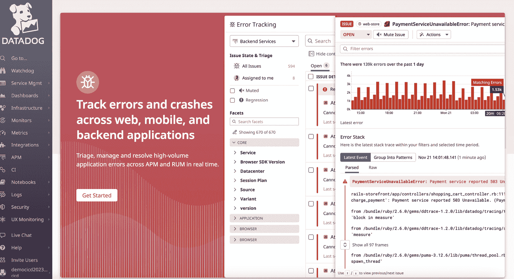
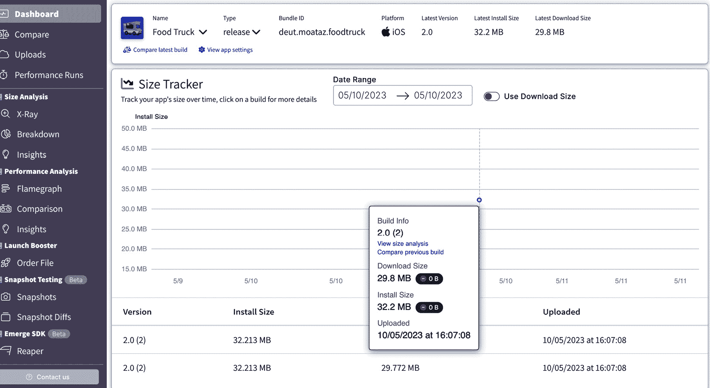
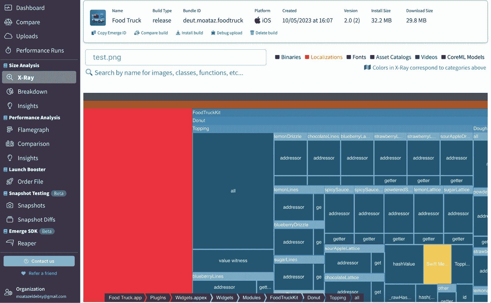

# 7

# 建立移动应用的监控、可观测性和分析

在前一章中，我们学习了如何成功将移动应用发布到相关的应用商店。然而，这并不是 CI/CD 过程的最后阶段。下一个阶段是持续支持我们的客户并追踪应用使用情况、性能、崩溃等。这就是移动应用的监控、可观测性和分析发挥作用的地方。在本章中，我们将涵盖以下内容：

+   什么是监控？

+   什么是可观测性？

+   实施监控和可观测性对移动应用的好处

+   监控和可观测性之间的区别

+   什么是分析？

+   在监控和可观测性中考虑的因素

+   实施移动应用的监控和可观测性的步骤

+   移动应用的监控、可观测性和分析工具

+   移动应用监控、分析和可观测性的关键指标

+   实施移动应用的持续监控

移动应用之所以复杂，是因为它们与各种外部系统交互，如服务器、API 和数据库。这种复杂性会使得在问题发生时识别和诊断问题变得具有挑战性。监控、可观测性和分析可以实时反馈应用性能、用户行为和系统交互情况。这些信息可以帮助开发人员在问题影响用户之前识别潜在问题，并在问题发生时开发有效的解决方案。

另外，为了提高应用的评级、用户参与度和收入，您应建立监控和可观测性实践，以在它们对用户产生负面影响之前识别和解决任何问题。确保您的移动应用程序表现最佳非常重要，提供无缝的用户体验。

但首先，让我们更多了解监控、可观测性和分析。

# 什么是监控？

移动应用的监控指的是*持续跟踪和分析移动应用程序的性能、可靠性和整体稳定性，以确保无缝的用户体验*。它涉及收集关于应用崩溃、错误、冻结和其他性能问题的数据，帮助开发人员识别和解决可能会对用户体验产生负面影响的任何问题。

监控的目标是识别和解决可能影响用户体验质量的任何问题，例如崩溃或加载时间过长。

下图重点介绍监控中的不同关键组件，如应用崩溃、错误跟踪和应用性能：

图 7.1 – 监控组件

为了确保应用程序的最佳性能和用户满意度，开发团队必须优先解决这些关键组件。通过分析和解决潜在问题，团队可以保证卓越的用户体验。让我们深入了解每个组件，以充分理解它们的重要性：

+   **应用崩溃报告**：这包括识别和收集崩溃信息，包括应用崩溃的频率、受影响的设备以及导致崩溃的具体情况。这些数据有助于理解和修复根本原因。

*“监控崩溃的症状，而不仅仅是* *崩溃本身*。”*

+   **错误追踪**：这包括 API 错误、网络错误或应用运行时发生的代码异常。这些信息可以用来解决和诊断应用代码中的问题。

+   **应用性能监控**：这衡量应用的响应性、加载时间及其他性能指标，以确保平稳的用户体验。

# 什么是可观察性？

移动应用的可观察性指的是*通过分析应用的外部输出（如日志、指标和追踪）来获得对应用内部状态的洞察*。它使开发人员或发布团队能够监控、理解和排查应用的行为和性能。

“*可观察性是我们通过* *应用二进制文件* 在用户设备生产环境中看到发生的事情的能力。*”

可观察性对维护高质量的用户体验至关重要，确保应用的可靠性和稳定性。

可观察性专注于不同的关键方面，如*图 7.2*所示：

图 7.2 – 可观察性组件

如我们所见，可观察性的目标是深入了解系统的运行方式，检测问题并有效地排除故障。可观察性关注多个关键方面，包括以下内容：

+   **日志**：在应用运行时，日志包含关于用户操作、系统事件和错误信息的内容。分析日志可以帮助开发人员识别模式、诊断问题，并更好地了解应用。

+   **指标**：指标跟踪应用的健康状况，识别瓶颈并优化性能。

+   **追踪**：追踪提供了对单个请求或事务的详细视图，展示它们如何在应用的各个组件中流动，如网络调用、API 交互和数据库查询。

为移动应用实施监控和可观察性带来了许多好处，这些好处提升了应用的性能、用户体验和整体成功。让我们来看一些主要的优势。

## 实施移动应用监控和可观察性的好处

实施移动应用监控和可观察性有多个好处，其中一些如下：

+   监控和可观察性使你能够识别和解决应用中的性能瓶颈。

+   持续跟踪应用性能和用户行为有助于你做出数据驱动的决策，从而改善用户体验，最终提高用户留存率和满意度。

+   你可以通过监控和可观察性快速检测和诊断问题，并在它们对用户产生负面影响之前解决问题。

+   在问题变得严重之前，通过更好地理解应用的行为，可以主动解决可观察性相关的潜在问题。

*“一旦我们在应用中具有可观察性，当事情变得奇怪但仍然* *工作时，我们可以发出警报。”*

+   可分析您应用的性能数据以优化资源使用，从而节省成本并提高效率。

## 监控与可观察性的区别

监控和可观察性是互补的实践，在一起使用时，有助于团队构建和维护高质量的移动应用。正如*图 7**.3*所示，监控侧重于积极追踪性能并响应已知问题，而可观察性则强调深入理解应用行为，以识别趋势、诊断未知问题和优化性能：

图 7.3 – 监控与可观察性

监控系统是被动的，而可观察性系统是主动的。通过结合这两种实践，团队可以创建全面的策略来维护和改进他们的移动应用。

# 什么是分析？

在移动应用分析中，收集、测量、分析和解释有关应用使用、用户行为和性能的数据。开发人员、营销人员和产品经理可以利用移动应用分析来优化应用性能、增强用户参与度和提高客户忠诚度。分析用户偏好和痛点能够实现数据驱动的决策和持续改进。

分析帮助您了解如何优化用户行为和应用，以实现业务目标。

分析侧重于不同的关键方面，如*图 7**.4*所示：

图 7.4 – 分析组件

正如我们所看到的，分析涵盖了各种关键方面：

+   **用户获取和归因**：跟踪新用户的来源，如有机搜索、付费广告或推荐，有助于确定营销活动的有效性，并识别最有价值的用户获取渠道。

+   **用户参与度**：监控用户与应用的互动，包括会话持续时间、会话频率、访问的屏幕和执行的应用内操作，可以深入了解用户偏好，帮助识别改进的方向。

+   **用户保留和流失**：分析用户保留率和流失模式有助于了解影响用户满意度或不满意度的因素，并帮助开发人员实施促进长期用户忠诚的改变。

+   **用户分割**：根据人口统计、行为和偏好对用户进行分组，可实现个性化营销活动、定向促销和量身定制的用户体验。

+   **应用内购买和收入**：跟踪应用内购买、订阅收入和广告收入有助于评估应用的盈利策略，并识别优化和增长的机会。

## 监控和可观察性中的考虑因素

为移动应用建立监控和可观察性策略时，我们需要考虑以下因素：

+   定义监控和可观察性策略的关键目标和目标。这决定了需要跟踪的指标，如应用性能、用户参与度和错误率，从而减少停机时间，确保符合法规或改善用户体验。

+   考虑应用的目的和用户期望，以确定合适的指标。例如，如果应用是一个游戏，你应该跟踪用户参与度，例如玩游戏的时间、完成的关卡数和社交分享。另一方面，如果应用是生产力工具，你应该跟踪应用性能，例如响应时间、加载时间和错误率。

+   定义实现这些目标所需的工具和技术也非常重要。一旦目标确定，接下来的步骤就是实施监控和可观察性工具。监控和可观察性有多种工具可供选择，包括 APM（应用性能管理）、日志管理和分析工具。选择与目标和需求相符的正确工具至关重要。

+   确定需要监控的关键指标和 KPIs（关键绩效指标），如系统性能、资源利用率、错误率和响应时间。确保这些指标是相关的、可操作的，并且可以用来跟踪朝着目标的进展。

+   收集数据只是第一步。分析已收集的数据并根据获得的洞察采取行动至关重要。你可以利用这些数据来识别性能瓶颈、解决问题并优化应用性能。

+   确定哪些数据源是必要的，以收集所需的指标。这可以包括日志、应用程序追踪和系统或网络指标。

+   选择适当的工具和技术来分析和可视化数据，如仪表板、异常检测和警报机制。确保这些工具能够提供可操作的洞察，以支持决策。

+   设置警报和通知机制，及时通知相关利益相关者出现问题或潜在问题。配置警报阈值和升级策略，以平衡误报和漏报。实时警告开发者应用崩溃和错误，并提供关于问题原因的详细信息。

+   实施应用内反馈。可以直接在应用内提供反馈和建议，这有助于开发者识别改进点。

+   确保你的监控和可观察性策略与其他基础设施中的工具（如事件管理或 CI/CD）良好集成。

+   为团队成员提供培训和文档，确保他们能有效使用监控和可观测性工具，并理解收集到的数据。

## 实现移动应用监控和可观测性的步骤

让我们看看实现监控和可观测性的步骤：

1.  根据你的需求、预算和平台支持选择适合的工具。一些流行的选择包括以下几种：

    +   **监控工具**：Firebase Crashlytics、Bugsnag、Sentry、Embrace 和 Instabug

    +   **分析工具**：Firebase Analytics、Amplitude、Mixpanel 和 Google Analytics for Mobile

    +   **可观测性工具**：Datadog 和 NewRelic

    +   **移动性能** **工具**：Emerge

    +   **事件管理**：PagerDuty、Incident.io 和 Grafana Incident

1.  对于选择的工具，按照官方文档的步骤在移动应用中设置 SDK。这通常涉及向构建或依赖文件中添加依赖项，并在应用代码中初始化 SDK。

1.  配置监控工具以捕捉崩溃、非致命错误和性能问题。你还可以设置自定义事件、标签或用户属性，以便为调试提供更多上下文。

1.  定义你希望追踪的事件和用户属性，同时考虑用户参与度、转化率和留存率等方面，使用分析工具来辅助决策。

1.  通过在应用中添加代码来实现事件追踪，记录在相关节点上定义的事件和用户属性。例如，当用户完成购买或到达特定应用页面时，你可以记录一个事件。

1.  定期监控你选择的监控工具的仪表盘，以识别崩溃、性能瓶颈和其他问题。

1.  设置警报和通知，以便及时了解需要立即处理的关键问题。如果发生紧急问题，你还可以将这些警报通过 ChatOps 集成发送为 Slack 消息给 Microsoft 团队，甚至通过 SMS 或电话通知。

1.  使用你选择的分析工具的仪表盘分析用户行为，例如活跃用户数、会话时长和用户留存率。

1.  创建自定义报告或使用内建报告来识别趋势、模式和改进的方向。

1.  利用分析洞察设计并实施 A/B 测试，以优化应用的用户体验、参与度和转化率。

1.  分析 A/B 测试的结果，并做出基于数据的决策以改进你的应用。

现在我们已经了解了如何开始进行移动应用的监控和可观测性，接下来让我们讨论市场上移动应用的监控、可观测性和分析工具，以及它们之间的差异。

# 移动应用的监控、可观测性和分析工具

开发者可以使用工具监控应用性能，接收实时通知，并通过 SDK 与警报工具集成。我们一起来看看这些工具。

## 监控和可观测性工具

如前所述，监控和可观察性工具应与事件管理工具集成，以便能够处理值班管理或应对事件。

可观察性工具对于移动应用开发和维护至关重要。它们提供宝贵的数据和指标，帮助识别瓶颈、改善应用稳定性并增强用户体验。流行的选项包括监控工具。

让我们讨论一些可以帮助我们实现这一目标的工具。

### Firebase Crashlytics

**Firebase Crashlytics** ([`firebase.google.com/products/crashlytics`](https://firebase.google.com/products/crashlytics)) 是一个优秀的崩溃报告工具，专为移动应用开发者设计，提供 *实时崩溃报告、详细诊断和与其他 Firebase 工具的无缝集成*。其直观的仪表板和准确的崩溃报告使其成为开发者改善应用稳定性的可靠选择。

以下是 Firebase Crashlytics 的一些功能：

+   **实时崩溃报告**：它监控你的应用并自动捕获崩溃数据，提供关于任何问题的最新信息。

+   **详细的崩溃诊断**：它深入分析每次崩溃的细节，并提供丰富的诊断信息，如堆栈跟踪、设备信息和用户数据，帮助你定位问题。

+   **崩溃分析**：它提供有价值的分析，帮助识别趋势、检测常见问题并优先修复漏洞。

+   **与 Firebase 的集成**：作为 Firebase 套件的一部分，Crashlytics 能与其他 Firebase 工具无缝协作，简化你的应用开发工作流程。

+   **跨平台支持**：它支持 Android 和 iOS 应用，使其成为移动应用开发者的多功能选择。

你可以通过访问 https://firebase.google.com/docs/crashlytics/get-started?platform=android#add-sdk 来轻松地将 Crashlytics SDK 添加到你的 Android 应用中；对于 iOS、Flutter 和 Unity 应用，你可以按照相同的步骤操作。

此外，你还可以将 Crashlytics 数据导出到 BigQuery ([`firebase.google.com/docs/crashlytics/bigquery-export`](https://firebase.google.com/docs/crashlytics/bigquery-export)) 进行进一步分析。你可以使用 BigQuery SQL 分析数据，导出到其他云服务提供商，并使用 Google Data Studio 可视化数据并创建自定义仪表板。

此外，你还可以通过 Android Studio 内的 App Quality Insights 分析 Firebase Crashlytics 中的任何问题 ([`developer.android.com/studio/debug/app-quality-insights`](https://developer.android.com/studio/debug/app-quality-insights))。

### Xcode Organizer

**Xcode Organizer**（[`developer.apple.com/documentation/xcode/analyzing-the-performance-of-your-shipping-app`](https://developer.apple.com/documentation/xcode/analyzing-the-performance-of-your-shipping-app)）是一个优化 Apple 生态系统内移动应用性能的工具。它能够提供详细的性能数据、实时监控和以用户为中心的分析，使其成为开发者在提供卓越用户体验过程中不可或缺的资源。

Xcode Organizer 帮助你管理 iOS、macOS、watchOS 和 tvOS 应用开发项目的各个方面。它提供了组织、归档和分发应用的功能，如下图所示：

图 7.5 – 从窗口菜单打开 Xcode Organizer

你可以查看崩溃情况以及与特定版本相关的不同指标，如下图所示：

图 7.6 – Xcode Organizer 的主屏幕

以下是 Xcode Organizer 的一些功能：

+   **深入的性能洞察**：这个工具提供了丰富的性能指标，从 CPU 和内存使用情况到网络活动。它可以帮助你深入了解应用的内部运行情况。

+   **实时监控**：你可以实时观看应用在用户交互时的表现。这个功能特别有助于识别可能影响用户体验的性能问题和崩溃。

+   **以用户为中心的分析**：Xcode Organizer 的一大亮点是能够根据不同的用户交互分析性能数据。这对进行有针对性的改进、提升最常见的用户场景至关重要。

+   **对比分析**：你可以衡量不同版本或构建的应用性能。这有助于你追踪所做更改的影响，并找出需要关注的区域。

然而，值得注意的是，这个工具仅与在 Apple 生态系统内为 iOS、macOS、watchOS 和 tvOS 开发的应用兼容。开发跨平台应用的开发者可能会觉得这个工具不太有用。

需要记住的是，Xcode 的界面和特性可能会随着新的更新而有所变化。为了保持信息的更新，最好参考 Xcode 文档（[`developer.apple.com/documentation/xcode`](https://developer.apple.com/documentation/xcode)）或相关资源以获取最新信息。

### Firebase 性能监控

**Firebase 性能监控** ([`firebase.google.com/products/performance`](https://firebase.google.com/products/performance)) 是一个旨在帮助您分析和优化应用性能，从而提供流畅用户体验的工具。它是移动应用开发者分析和优化性能的一个好选择。凭借实时性能监控、可自定义的指标以及与其他 Firebase 工具的无缝集成，它是确保流畅用户体验的强大工具。

以下是 Firebase 性能监控的一些功能：

+   **实时性能监控**：它自动实时跟踪应用的性能指标，为您提供有关应用运行情况的宝贵见解

+   **可自定义的指标**：可以根据应用的具体需求创建定制的性能指标

+   **详细的性能数据**：它分析延迟、渲染、网络使用等方面的详细数据，以确定性能瓶颈并优化您的应用

+   **跨平台支持**：它与安卓和 iOS 应用无缝兼容，是移动应用开发者的多功能选择

+   **与 Firebase 集成**：它作为 Firebase 套件的一部分，这意味着性能监控可以与其他 Firebase 工具无缝集成，从而简化您的应用开发流程

+   **性能数据仪表盘**：性能数据以用户友好的仪表盘形式展示，便于您分析指标并优化应用

您可以通过遵循 [`firebase.google.com/docs/perf-mon`](https://firebase.google.com/docs/perf-mon) 上的步骤，轻松将性能监控 SDK 添加到您的 Android、Flutter 或 iOS 应用中。

当您添加性能监控 SDK 时，Firebase 会自动收集应用中若干常见过程的数据，包括以下内容：

+   苹果和安卓应用的启动时间

+   苹果和安卓应用的屏幕渲染

+   所有类型应用的网络请求

以下是从性能监控中收集到的一些信息示例：`https://firebase.google.com/support/privacy?authuser=0&hl=en#performance-monitoring-collected-info`。

### Instabug

**Instabug** ([`www.instabug.com/`](https://www.instabug.com/)) 是一个强大的全方位平台，专为寻求全面的错误报告、崩溃报告和性能监控工具的移动应用开发者设计。其便捷的集成、直观的仪表盘和广泛的功能使其成为那些希望提升应用稳定性和用户体验的开发者的优秀选择，如下图所示：

图 7.7 – 发布视图

以下是 Instabug 的一些功能：

+   **应用内错误报告**：它允许用户在应用内直接报告错误，并附带注释截图，使收集宝贵反馈变得更加简单：

图 7.8 – Bug 报告视图

+   **崩溃报告**：它帮助实时获取崩溃报告，并提供详细信息，如堆栈跟踪和用户数据，使你能够快速识别并修复问题：

图 7.9 – 崩溃视图

+   **性能监控**：Instabug 通过其监控工具帮助你关注应用的性能，跟踪关键指标，如应用启动时间、网络请求和 UI 响应性：

图 7.10 – Bug 报告详细视图

+   **应用内调查**：此调查通过可定制的应用内调查轻松收集用户反馈，帮助你做出数据驱动的决策，从而提升你的应用：

图 7.11 – 创建测试调查

+   **集成**：Instabug 与流行的项目管理、沟通和问题跟踪工具（如 Jira、Slack 和 GitHub）集成，简化你的开发工作流程。

+   **跨平台支持**：Instabug 与 Android、Flutter、React Native、Xamarin、Cordova 和 iOS 应用无缝兼容，满足各种开发者需求：

图 7.12 – Instabug 支持的平台

此外，Instabug 还提供了一个沙盒环境 ([`demo-dashboard.instabug.com/demo`](https://demo-dashboard.instabug.com/demo))，让你可以体验产品并了解更多功能。

但请注意，Instabug 的免费版本有一些限制，可能需要升级到付费计划才能访问高级功能和更高的使用限制。

这是将 SDK 添加到你的 iOS 应用的文档：[`docs.instabug.com/docs/ios-integration`](https://docs.instabug.com/docs/ios-integration)。

### Embrace

**Embrace** ([`embrace.io/`](https://embrace.io/)) 是一款强大的移动应用性能管理平台，提供全面的性能监控、崩溃报告和用户会话跟踪，具体如以下截图所示。其独特的重播功能和详细的洞察分析使其成为开发者优化应用性能和用户体验的绝佳选择。然而，缺乏免费版本以及初期的学习曲线可能是一些用户的挑战：

图 7.13 – ANR 摘要

以下是 Embrace 的一些功能：

+   **性能监控**：Embrace 提供详细的应用性能洞察，涵盖关键指标，如应用启动时间、网络请求和用户界面响应性

+   **崩溃报告**：你可以获取实时崩溃报告，包含丰富的信息，如堆栈跟踪、设备数据和用户操作，帮助你快速识别并解决问题：

图 7.14 – 崩溃摘要

+   **用户会话跟踪**：Embrace 使你能够监控单个用户会话，提供完整的用户体验图景，包括交互和遇到的问题：

图 7.15 – 用户时间线

这里是将 SDK 添加到你的 Android 应用程序的文档：[`embrace.io/docs/android/integration/integration-steps/`](https://embrace.io/docs/android/integration/integration-steps/)。

### Sentry

**Sentry** for 移动应用 ([`sentry.io/for/mobile/`](https://sentry.io/for/mobile/)) 是一款强大的错误监控和报告解决方案，简化了调试过程。它的易于集成、实时错误追踪和直观的仪表板，使其成为一个在快速捕获和修复问题方面非常有价值的工具：

图 7.16 – 项目视图

以下是 Sentry 的一些功能：

+   **实时错误监控**：Sentry 帮助自动跟踪和捕捉应用中的错误，提供关于任何问题的最新信息。

+   **详细的错误诊断**：Sentry 帮助获取深入的诊断信息，如堆栈跟踪、设备信息和用户数据，帮助你准确定位错误的根本原因：

图 7.17 – 问题详细视图

+   **问题分组**：Sentry 智能地将相似的错误分组，使得识别趋势和优先修复变得更加容易：

图 7.18 – 问题视图

+   **集成**：Sentry 与流行的项目管理、通信和问题追踪工具如 Jira、Slack、GitHub 等进行集成，以简化你的开发工作流程：

图 7.19 – 集成视图

+   **跨平台支持**：Sentry 支持 Android、Flutter、React Native 和 iOS 应用，成为开发者的多功能选择。

+   **实时错误追踪**：Sentry 的实时错误监控可以帮助你快速发现和修复问题，确保更流畅的用户体验。

+   **直观的仪表板**：Sentry 的用户友好型仪表板让错误监控和数据分析变得轻松，帮助你随时掌握应用的稳定性。

这里是将 SDK 添加到你的 Flutter 应用程序的文档：[`docs.sentry.io/platforms/flutter/`](https://docs.sentry.io/platforms/flutter/)。Sentry 还为客户提供沙盒环境 ([`try.sentry-demo.com/organizations/noted-baboon/issues/`](https://try.sentry-demo.com/organizations/noted-baboon/issues/))，以便他们通过演示应用程序探索产品。

### Google Play 控制台关键数据

**Google Play Console vitals** ([`developer.android.com/topic/performance/vitals`](https://developer.android.com/topic/performance/vitals)) 是一个为 Android 应用开发者提供的工具，旨在轻松监控和优化应用性能。它的无缝集成、数据驱动的见解以及免费的使用方式，使其成为跟踪应用稳定性、电池使用情况和渲染性能的理想选择：

图 7.20 – Android vitals 概览

以下是 Android vitals 的一些功能：

+   **Android vitals 仪表盘**：Google Play Console vitals 提供一个用户友好的仪表盘，概述应用的性能指标，如崩溃率、**应用无响应**（**ANR**）率等。

+   **稳定性监控**：您可以实时跟踪崩溃和 ANR，以识别并解决影响应用稳定性的问题。

+   **渲染性能**：您可以监控应用的渲染性能，包括渲染缓慢和帧冻结等问题，以确保流畅的用户体验。

+   **电池使用**：您可以关注过度唤醒和唤醒锁，以优化应用的电池使用并最小化用户设备的电量消耗。

+   **用户反馈**：您可以访问用户评论和评分，获取有关应用性能和改进方向的深入见解。

请注意，Google Play Console vitals 仅适用于 Android 应用。因此，iOS 应用开发者应考虑其他性能监控解决方案。Android Studio 的最新版本现在支持 Android vitals，无需任何额外的 SDK 或配置（[`developer.android.com/studio/preview/features#aqi-android-vitals`](https://developer.android.com/studio/preview/features#aqi-android-vitals)）。

### Datadog

**Datadog** for mobile apps ([`www.datadoghq.com/dg/real-user-monitoring/mobile-rum/`](https://www.datadoghq.com/dg/real-user-monitoring/mobile-rum/)) 是一个强大的监控和分析平台，提供性能监控、详细的错误报告以及强大的分析功能。它的灵活性和跨平台支持使其成为开发者在寻找一体化移动应用监控平台时的理想选择。

以下是 Datadog 的一些功能：

+   **实时性能监控**：您可以实时监控移动应用的性能，包括网络请求、错误和延迟等关键指标。

+   **详细的错误报告**：Datadog 提供关于错误和崩溃的详细信息，包括堆栈跟踪、设备信息和用户操作，帮助您快速识别和解决问题：

图 7.21 – 错误和崩溃跟踪视图

+   **可自定义仪表盘**：Datadog 创建个性化的仪表盘，以可视化和分析应用的性能数据，以最适合您团队的方式进行展示：

图 7.22 – 仪表板视图

+   **日志管理** ([`docs.datadoghq.com/logs/log_collection/android/?tab=kotlin`](https://docs.datadoghq.com/logs/log_collection/android/?tab=kotlin))：它自动收集并分析应用程序的日志数据，以检测异常并排查问题：

图 7.23 – 添加新的日志

以下截图显示了如何将 SDK 依赖项添加到 Android 应用程序的 Gradle 文件中，以便你能够监控应用程序的性能：

图 7.24 – 添加新的 Android 日志

+   **集成**：Datadog 与广泛的其他工具和平台集成，允许你集中管理数据并简化开发流程，如以下截图所示：

图 7.25 - 集成视图

+   **RUM 和会话回放** ([`docs.datadoghq.com/real_user_monitoring/`](https://docs.datadoghq.com/real_user_monitoring/))：Datadog 提供对单个用户活动和体验的实时可见性，从而带来以下好处：

    +   跟踪移动应用程序屏幕、用户操作、网络请求和前端代码的性能

    +   跟踪长期和版本中的持续性错误和问题：

图 7.26 – UX 监控视图

图 7.27 – 为 Android 设置实时用户监控

你可以通过将 SDK 添加到应用程序的依赖项中来为应用程序设置实时用户监控，以下截图展示了如何操作：

图 7.28 – 设置实时用户监控

+   确定应用程序使用的国家、设备和操作系统，监控单个用户的操作流程，并分析用户与应用程序的互动（最常访问的页面、点击、交互和功能使用）：

图 7.29 – 为 iOS 设置实时用户监控

+   获取有关用户会话的所有信息以排查问题（会话持续时间、交互、加载的资源和错误）

### New Relic

**New Relic** 移动应用版 ([`newrelic.com/platform/mobile-monitoring`](https://newrelic.com/platform/mobile-monitoring)) 是一款性能监控和分析解决方案，提供监控、详细的崩溃报告和高级分析功能。它的可定制性和对 Android、iOS、React Native、Capacitor、Cordova 和 Flutter 的跨平台支持，使其成为开发者优化应用性能和用户体验的优秀选择。然而，其复杂性和缺乏免费套餐可能会成为一些用户的障碍。

以下是 New Relic 的一些功能：

+   **实时性能监控**：New Relic 提供对关键性能指标的实时监控，如应用加载时间、网络请求和错误率

+   **崩溃报告**：你可以获取有关崩溃的详细信息，包括堆栈跟踪、设备信息和用户操作，以帮助你快速识别并解决问题

+   **可定制仪表盘**：你可以创建个性化的仪表盘，以一种适合团队需求的方式来可视化和分析应用的性能数据

+   **用户互动跟踪**：你可以监控用户在应用中的互动，深入了解用户体验并识别需要改进的地方

+   **集成**：New Relic 与流行的工具和平台集成，使你能够集中管理数据并简化开发工作流，如下图所示：

图 7.30 – 在 New Relic 上设置移动应用

你可以从选择希望使用的平台开始，比如 Android，然后继续完成其余配置，如下图所示：

图 7.31 – 在 New Relic 上设置 Android 应用

之后，你可以将 SDK 添加到 Gradle 文件中，如下图所示：

图 7.32 – Android 构建配置

配置完成后，你将看到一个显示 Android 应用概览的仪表盘，如下图所示：

图 7.33 – Android 应用概览

你可以找到不同的示例，了解如何为 Android ([`docs.newrelic.com/docs/mobile-monitoring/new-relic-mobile-android/get-started/introduction-new-relic-mobile-android/`](https://docs.newrelic.com/docs/mobile-monitoring/new-relic-mobile-android/get-started/introduction-new-relic-mobile-android/))、iOS ([`docs.newrelic.com/docs/mobile-monitoring/new-relic-mobile-ios/get-started/introduction-new-relic-mobile-ios/`](https://docs.newrelic.com/docs/mobile-monitoring/new-relic-mobile-ios/get-started/introduction-new-relic-mobile-ios/))、Flutter ([`docs.newrelic.com/docs/mobile-monitoring/new-relic-mobile-flutter/monitor-your-flutter-application/`](https://docs.newrelic.com/docs/mobile-monitoring/new-relic-mobile-flutter/monitor-your-flutter-application/)) 和 React Native ([`docs.newrelic.com/docs/mobile-monitoring/new-relic-monitoring-react-native/monitor-your-react-native-application/`](https://docs.newrelic.com/docs/mobile-monitoring/new-relic-monitoring-react-native/monitor-your-react-native-application/)) 设置 New Relic。

### Emerge

Emerge ([`www.emergetools.com/`](https://www.emergetools.com/)) 是一个创新的移动应用优化平台，旨在帮助开发者减少应用大小并提高整体性能。

它专注于*应用大小减少*、*资源优化*和*代码分析*，使其成为移动开发者在希望最小化应用占用空间并提升用户体验时的推荐选择。

以下是 Emerge 的一些关键功能：

+   **应用大小减少**：Emerge 分析你的移动应用，找出优化的地方，使你能够在不影响功能的前提下减少应用的大小：

图 7.34 – iOS 应用仪表盘

此外，你还可以使用 Emerge 来分析应用的大小，例如，iOS 应用，如下图所示：

图 7.35 – iOS 应用大小分析

+   **资源优化**：Emerge 帮助优化应用的图像、字体和其他资源，最小化它们对应用大小和性能的影响。

+   **代码分析**：你可以深入了解应用的代码库，识别未使用的代码，发现重构和优化的机会：

图 7.36 – iOS 大小分析 X 光

+   **快照测试（测试版）**：你可以为每次上传创建快照。这些快照会自动与拉取请求进行比较，帮助你看到哪些内容发生了变化，哪些被添加或移除，如下图所示：

图 7.37 – 快照测试视图

+   **CI 集成**：通过 GitHub Actions 和 Codemagic，你可以配置自动化的比较（PR 评论/状态检查）显示在你的版本控制系统（VCS）中，使得组织中的每个人都能轻松了解你的性能指标。更多细节可以在此查看：[`docs.emergetools.com/docs/integrate-into-ci`](https://docs.emergetools.com/docs/integrate-into-ci)。

+   **自动告警**：例如，通过 Slack 告警 ([`docs.emergetools.com/docs/slack`](https://docs.emergetools.com/docs/slack))，当上传的构建触发配置阈值时，可以向某个频道发送告警。

### 事件管理

移动应用的事件管理工具在确保应用的顺利运行和稳定性方面起着至关重要的作用，帮助你检测、分析和应对事件，如崩溃、性能问题以及其他技术问题。

让我们来看一些在移动应用开发中常用的流行事件管理工具。

#### Incident.io

Incident.io ([`incident.io/`](https://incident.io/)) 是一款强大的事件管理平台，旨在帮助团队有效地处理事件并提高系统韧性。它的集中事件跟踪、改进的沟通、自动化功能和事后分析能力使其成为那些希望简化事件响应流程的团队的优秀选择。

以下是 Incident.io 的一些功能：

+   **事件跟踪**：集中所有与事件相关的信息，使得可以通过一个平台轻松追踪和管理事件

+   **沟通**：通过内建聊天功能以及与流行的沟通工具集成，促进事件期间团队的沟通和协作

+   **自动化**：通过触发预定义的操作来自动化事件响应流程，例如告警响应者、创建工单和更新利益相关者

+   **事后分析**：通过综合报告进行事后回顾，帮助团队从事件中学习并提高系统的韧性

+   **集成**：与流行的监控和工单工具集成，简化事件管理工作流程

#### PagerDuty

**PagerDuty** ([`www.pagerduty.com/`](https://www.pagerduty.com/)) 是一款事件管理平台，旨在帮助团队有效地处理事件并提高系统可靠性。它的全面事件跟踪、灵活的告警功能、改进的沟通、自动化功能和事后分析能力使其成为那些希望简化事件响应流程的团队的优秀选择。

以下是 PagerDuty 的一些功能：

+   **事件跟踪**：集中所有与事件相关的信息，使得可以通过一个平台轻松追踪和管理事件

+   **告警和升级**：配置告警规则和升级策略，确保在事件发生时，正确的团队成员得到通知并参与其中

+   **沟通**：在事件发生期间，通过内置聊天功能和与流行通信工具的集成，促进团队之间的沟通与协作。

+   **自动化**：通过预定义的操作（如告警响应者、创建工单和更新利益相关者）自动化事件响应过程。

+   **事后分析**：进行事后事件回顾，提供全面报告，帮助团队从事件中学习并提高系统的韧性。

+   **集成**：与流行的监控、告警和工单工具集成，简化事件管理工作流。

此外，我们还可以通过以下步骤使用分析工具优化移动应用的性能：

1.  **识别性能问题**：确定需要改进的应用性能的具体方面，如启动时间、帧率或内存使用。

1.  **选择分析工具**：选择一个适合平台和解决的性能问题类型的工具。一些常见的移动应用分析工具包括 XCode Instruments（iOS）([`developer.apple.com/documentation/xcode`](https://developer.apple.com/documentation/xcode)）、Android Profiler ([`developer.android.com/studio/profile/android-profiler`](https://developer.android.com/studio/profile/android-profiler)) 和 Flutter Profiler ([`docs.flutter.dev/perf/ui-performance`](https://docs.flutter.dev/perf/ui-performance))。

1.  **运行分析工具**：使用分析工具收集应用性能的数据。这可能涉及在设备或模拟器上运行应用，并执行特定的操作或场景，以模拟实际使用情况。

1.  **分析结果**：回顾由分析工具收集的数据，以识别应用性能中的任何问题或瓶颈。

1.  **优化应用**：利用从分析工具中获得的见解，通过修复任何已识别的问题或提高应用代码和资源的效率来优化应用的性能。

## 分析工具

移动应用的分析工具在帮助团队做出数据驱动决策、增强用户体验和实现商业目标方面起着至关重要的作用。

通过提供有价值的指标和用户洞察，这些工具使开发者和营销人员能够持续优化他们的应用，并在动态的移动应用市场中保持竞争力。

让我们来看看一些用于移动应用的流行分析工具。

### 移动应用的 Google Analytics

**Google Analytics for Mobile Apps** ([`developers.google.com/analytics/solutions/mobile`](https://developers.google.com/analytics/solutions/mobile)) 就像为你的应用配备了一个私人侦探。这款强大的工具帮助你收集关于用户如何与应用互动的宝贵信息。无论你是在运行一个游戏、生产力应用，还是介于两者之间的应用，这个工具都能提供有助于你做出更好决策的见解。

以下是 Google Analytics for Mobile Apps 的一些功能：

+   **用户群体分析和人口统计学**：了解您的应用程序有多少用户，他们的特征是什么，以及他们来自哪里

+   **用户行为分析**：深入了解用户在应用中的行为和交互

+   **应用内购买收入测量**：跟踪和分析货币化和支付指标

+   **定制报告**：创建对您的业务有益的报告

+   **视觉用户旅程导航**：通过图形路径分析增强用户体验

+   **用户群体行为分析**：通过数据分割和分析获得更深入的洞察

+   **利用谷歌分析数据**：在谷歌产品中利用谷歌分析数据

+   **多平台支持**：Google Analytics 为 Android、iOS 和 Flutter 移动应用提供分析数据

您可以在 [`firebase.google.com/docs/analytics`](https://firebase.google.com/docs/analytics) 学习如何将 SDK 添加到您的 Android、iOS、Flutter 和 Unity 应用中。

### 振幅

**振幅** ([`amplitude.com/`](https://amplitude.com/)) 是一个强大的产品分析平台，可以深入洞察用户行为，帮助团队做出数据驱动的决策，优化其产品。其易用性、可扩展性和集成能力使其成为企业驱动产品增长的优秀选择：

图 7.38 – 振幅首页

图 7.40 – 向振幅添加新移动应用

以下是振幅的一些关键特点：

+   **行为分析**：跟踪用户在产品中的动作，帮助您理解用户行为模式并识别改进的空间

+   **漏斗和队列**：分析用户转化漏斗和队列保持，以衡量产品功能和营销工作的成功

+   **实时分析**：实时监控产品性能，使您能够快速响应用户行为的任何问题或变化

+   **可定制仪表板**：创建个性化仪表板，可视化和分析团队最关注的数据

+   **A/B 测试和实验**：运行实验和 A/B 测试，优化产品的用户体验并测量变化的影响

### Mixpanel

**Mixpanel** ([`mixpanel.com/`](https://mixpanel.com/)) 是一个产品分析平台，可以深入洞察用户行为，帮助团队做出数据驱动的决策，优化其产品。其易用性、可扩展性和集成能力使其成为企业驱动产品增长的优秀选择：

图 7.40 – 向 Mixpanel 添加新移动应用

以下是 Mixpanel 的一些特点：

+   **行为分析**：跟踪用户在产品中的操作，帮助你理解用户行为模式并识别改进的地方。

+   **漏斗和用户群体**：分析用户转化漏斗和用户群体留存情况，以衡量你的产品特性和营销效果的成功。

+   **实时分析**：实时监控产品性能，使你能够迅速响应任何问题或用户行为的变化。

+   **可定制的仪表板**：创建个性化的仪表板，以可视化和分析对你的团队最重要的数据。

+   **A/B 测试和实验**：进行实验和 A/B 测试，以优化你的产品用户体验，并衡量变更的影响。

现在我们已经探讨了不同的监控、可观察性、事件管理和分析工具，接下来我们来概述一下在使用这些工具时通常考虑的关键指标。

# 移动应用监控、分析和可观察性的关键指标

在这一部分，我们将查看一些适用于移动应用监控、分析和可观察性的关键指标，你应该在这些方面考虑使用。

## 监控指标

一些关键的监控指标如下：

+   **应用加载时间**：应用初始化并准备好用户交互所需的时间。更快的加载时间能提供更好的用户体验。

+   **API 响应时间**：你的应用从后端服务或第三方 API 获取响应所需的时间。较长的响应时间可能让你的应用感觉缓慢或反应迟钝。

+   **帧率**：应用每秒渲染的帧数。低帧率可能表明存在性能问题，尤其是在动画繁重或游戏类应用中，可能会导致用户体验差。

## 可观察性指标

一些可观察性指标如下：

+   **错误率**：导致错误的应用请求比例，例如失败的 API 调用或后端问题。高错误率可能会影响应用的性能和可靠性。

+   **延迟**：请求从用户设备到服务器再返回所需的时间。高延迟会让你的应用感觉缓慢且反应迟钝。

+   **吞吐量**：你的应用每单位时间能处理的请求数。监控吞吐量有助于识别瓶颈和可扩展性问题。

## 分析指标

移动应用的分析指标指的是提供用户行为、应用性能和整体成功洞察的数据和度量。通过利用分析工具和平台，应用开发者和营销人员可以跟踪、分析和解读这些指标，从而优化用户体验、增强应用功能，并推动用户参与和留存。

一些移动应用分析的关键指标包括以下内容：

+   **日活跃用户**（**DAU**）：表示每天与应用互动的独立用户数量。日活跃用户是衡量用户参与度的关键指标。

+   **月活跃用户**（**MAU**）：MAU 指的是每月与您的应用程序互动的独立用户数量。此指标为应用程序的整体覆盖范围和受欢迎程度提供了见解。

+   **会话时长**：这是用户在单次会话中在应用程序内花费的平均时间。较长的会话时长表明更高的用户参与度和满意度。

+   **会话间隔**：此指标显示用户会话之间的平均时间，揭示用户多频繁地返回应用程序。较短的间隔通常表示较强的用户留存率。

+   **留存率**：留存率表示在特定时期（如几天或几周）后返回应用程序的用户百分比。较高的留存率意味着积极的长期用户参与。

+   **流失率**：流失率表示在特定时间内停止使用应用程序的用户百分比。较高的流失率可能突出显示与用户满意度或应用程序功能相关的问题。

+   **用户生命周期价值**（**LTV**）：LTV 估算用户在整个使用过程中为应用程序带来的收入。了解 LTV 有助于您评估获取和留住用户的价值。

+   **转化率**：转化率衡量完成特定期望动作（如购买、注册或订阅）的用户百分比。较高的转化率表示应用程序性能和用户满意度较好。

+   **漏斗分析**：漏斗分析可视化用户在应用程序中通过不同步骤或事件的流程，帮助您识别用户流失点以及优化用户旅程的机会。

+   **自定义事件**：自定义事件跟踪应用程序中用户的特定互动或里程碑，为用户行为和应用程序使用模式提供有价值的见解。这些事件可以根据应用程序的独特目标和需求进行定制。

实施移动应用程序的持续监控对于确保其性能和整体质量至关重要。持续监控包括定期跟踪和分析应用程序的行为、使用情况和性能指标，从而使开发人员能够及时识别和解决问题。

现在，让我们看看实施移动应用持续监控的推荐实践。

# 实施移动应用持续监控

**持续监控**涉及收集和分析有关移动应用程序的性能、使用情况和安全性的数据显示，以识别并解决任何问题或潜在的改进。让我们来看一下它的一些好处：

+   **提高可靠性**：持续监控可以帮助在问题影响用户之前识别并修复它们，从而提高应用程序的可靠性并减少停机风险。

+   **更好的性能**：通过收集应用程序性能的数据，团队可以识别并解决瓶颈或其他性能问题，从而提高用户体验。

+   **增强的安全性**：持续监控有助于识别和解决安全漏洞或其他风险，从而提高应用程序的整体安全性

+   **更快的解决问题**：通过不断收集应用程序性能的数据，团队可以快速识别和解决问题，从而缩短问题解决的时间

# 摘要

监控和可观察性对于移动应用开发至关重要。开发人员可以通过建立有效的实践并使用合适的工具来收集和分析数据，确保应用程序的最佳性能并提供无缝的用户体验。监控使开发人员能够收集应用性能、用户行为和系统交互的数据，从而在问题影响用户之前识别潜在问题。

以下是关于移动应用开发中监控和可观察性的关键学习点：

+   实现监控和可观察性的好处

+   监控和可观察性中需要考虑的因素

+   实施移动应用监控和可观察性的步骤

+   移动应用的监控、可观察性和分析工具

+   移动应用监控、分析和可观察性的关键指标

+   为移动应用实现持续监控

随着我们在移动 DevOps 旅程中的前进，我们将更深入地探讨如何将安全性融入我们的 CI/CD 和移动 DevOps 生命周期中，这是将其加入移动 DevOps 生命周期中的关键一步。在下一章中，我们将讨论移动应用安全的重要性，以及如何将自动化安全测试注入移动 DevOps 和 CI/CD 流水线中。
