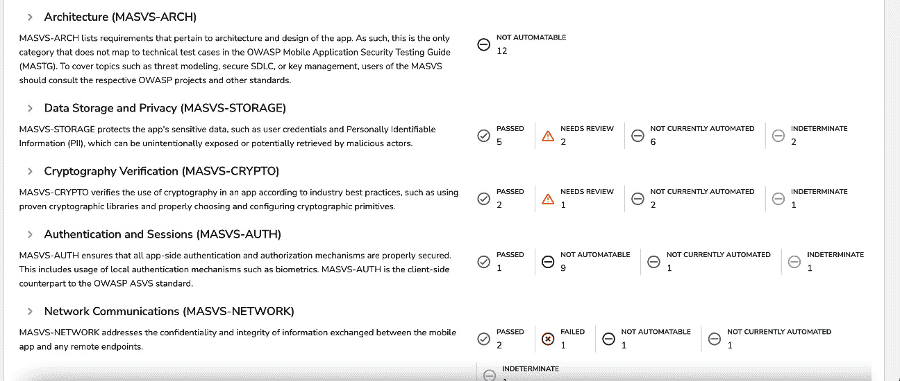
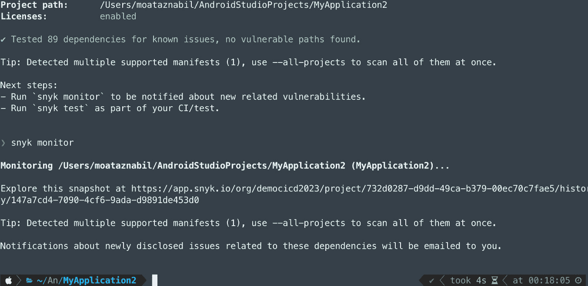

# 8

# 保持移动应用和 DevOps 的安全

从前面的章节中，我们已经了解到，移动应用已成为数字时代我们日常生活的重要组成部分，必须不断进行创新和优化。组织越来越多地实施 *Mobile DevOps* 方法，以实现这一目标，使开发、测试和发布团队能够无缝合作。

然而，快速的开发和发布可能导致移动应用程序的安全漏洞。为了保护您的移动应用和 DevOps 过程，在本章中，我们将探讨移动应用安全的基础知识、安全测试自动化以及 DevSecOps 的基本概念。我们还将探讨在移动应用开发和移动 DevOps 中，安全性重要性的背后原因，内容包括以下主题：

+   移动开发中的安全性重要性

+   移动应用安全威胁

+   架构安全的移动应用

+   传统的安全测试方法

+   引入移动 DevSecOps

+   移动 DevSecOps 的好处

+   构建安全文化

+   开始您的 DevSecOps 之旅

+   通过移动持续自动集成和持续交付（CI/CD）以及 DevOps 自动化移动安全测试

+   移动 DevOps 安全自动化的技巧

+   人工智能与移动应用安全

# 移动开发中的安全性重要性

在数字化转型的时代，安全在生活的各个领域都至关重要。在汽车、医疗、金融、零售和电子商务等行业，以及嵌入式和物联网设备中，我们使用包括电子邮件、地址、信用卡和手机号码等敏感数据，涉及不同的移动应用程序。

移动应用开发在过去十年经历了指数级增长，数百万个应用程序可以在各种平台和应用商店中找到。这些应用程序提供各种服务，从社交网络到在线银行及其他各种服务。随着越来越多的用户依赖移动应用来访问服务并存储敏感数据，移动应用开发中的安全性重要性不容忽视。

移动应用开发中的安全性是开发人员必须优先考虑的关键方面，以保护用户数据、维持强大的声誉并遵守相关法规。通过了解安全性的重要性并实施切实可行的措施，开发人员可以创建提供更安全、更可靠体验的应用程序。

“以牺牲可用性为代价的安全，最终会以安全为代价。”

- *Avi Douglen，OWASP 董事会* *成员*

因此，确保安全措施到位，以保护用户数据免受未经授权的访问，至关重要。

你知道吗？

通过谷歌的应用安全改进计划（[`developer.android.com/google/play/asi`](https://developer.android.com/google/play/asi)），开发人员修复了影响超过 30 万个应用、累计安装量约 2500 亿的超过 50 万个安全问题。据谷歌称，2022 年通过改进的安全功能和应用审核流程，有 143 万不良应用未能进入 Play 商店（[`security.googleblog.com/2023/04/how-we-fought-bad-apps-and-bad-actors.html`](https://security.googleblog.com/2023/04/how-we-fought-bad-apps-and-bad-actors.html)）。

受到安全问题影响的最重要行业之一是*金融科技*领域以及在我们日常活动中发挥巨大作用的*数字银行*应用。金融科技正在成为我们个人和职业生活的重要组成部分。客户始终关注安全问题。如果他们对应用的安全性产生怀疑，他们会立即卸载该应用并切换到其他服务。

大多数数字银行应用都有强大的安全功能，如**支付阻止**、**生物识别**和**双因素认证**（**2FA**），并且仅允许用户提交复杂的密码。此外，客户数据的保护和处理至关重要，特别是当你在欧盟地区运营时，*GDPR*规则适用。

## 什么是 GDPR？

**通用数据保护条例（GDPR）**（[`gdpr.eu/`](https://gdpr.eu/)）是一个全面的数据保护法，于 2018 年 5 月 25 日在**欧盟**（**EU**）实施。其主要目标是通过规范组织如何收集、处理、存储和共享数据，来保护个人的隐私和个人信息。

GDPR 确立了一系列原则和规定，组织必须遵守这些规定，以确保尊重数据主体（即被收集数据的个人）的权利。不遵守这些规定可能会导致公司面临罚款。因此，GDPR 帮助保护你的个人信息，并确保公司适当处理这些信息。

上述示例仅是许多需要考虑保护自己的行业中的一个。

在移动开发过程中，安全性可以在多个层面上进行集成。首先，应实施强大的身份验证协议，确保只有授权用户才能访问应用。这可以包括*生物识别认证*、*指纹扫描*或*基于密码的认证*。

移动开发人员还应注意第三方库和 API 可能带来的风险。任何添加到应用中的额外代码都应经过彻底审查，以确保其安全并保持最新。

因此，安全性对移动开发至关重要，必须认真对待。按照这里列出的步骤，开发人员可以确保他们的应用是安全的，并为用户提供安全的体验。

## 移动应用安全威胁

移动应用面临各种安全威胁，这些威胁可能危及用户数据和应用程序的整体完整性。以下是一些常见的移动应用安全威胁：

+   黑客可以通过逆向工程、代码注入或绕过认证机制来获得未经授权的访问权限，提取敏感的用户信息。

+   移动应用通常处理个人信息、财务细节或登录凭证。如果未实施适当的安全措施，攻击者可能在数据传输或存储过程中拦截或窃取数据，从而导致数据泄露和隐私侵犯。

+   移动设备可能通过多种方式受到攻击或感染恶意软件。这些恶意程序可以危害设备的安全、窃取数据或执行未经授权的操作。

+   如果应用未加密或保护用户数据，攻击者可能通过物理设备的漏洞、文件系统漏洞或不安全的服务器配置来访问用户数据。

+   弱或无效的认证机制可能导致未经授权的访问用户账户。此外，授权控制不足可能允许攻击者执行超出其权限的操作，如访问敏感功能或篡改用户数据。

+   应用代码中的不良编码实践或未修复的漏洞可能引入安全弱点。攻击者可以利用这些漏洞执行任意代码、提升权限或获得设备的未经授权访问。

+   攻击者可以向移动应用服务器发送大量请求，导致服务中断，使应用无法被合法用户访问。

移动应用开发者必须通过遵循安全编码实践、加密敏感数据、实施强大的认证机制，并教育用户有关最佳安全实践，来减轻这些威胁。

移动开发者在架构和开发移动应用时应将安全性放在首位。接下来我们来探讨这一点。

## 架构安全的移动应用

在如今广泛使用的移动设备环境中，构建安全的移动应用至关重要。忽视移动应用安全可能导致各种错误，从而将用户数据和隐私置于风险之中。为了确保移动应用的安全，开发者应遵循以下最佳实践：

+   通过考虑保护用户数据、确保安全通信和防止未经授权访问等因素，识别应用的安全目标。评估特定于应用和行业的潜在威胁和漏洞。

+   实施强加密技术来保护存储在设备上的敏感数据。

+   采用多因素认证和最新的认证框架，如*OAuth 2.0*，以安全地管理用户访问。

+   使用*SSL/TLS*进行数据传输，并验证证书以建立应用与后端服务器之间的加密通信。

+   使用最新的加密算法和技术保护敏感数据，例如*SHA-256*。

+   实施安全方法来存储敏感信息，例如使用环境变量或安全存储解决方案。

+   在客户端和服务器端验证用户输入，以防止注入攻击和其他安全漏洞。

+   进行安全测试，包括静态和动态分析、渗透测试和漏洞评估，以识别和解决潜在的安全缺陷。

+   定期更新第三方库和框架，以避免过时版本中可能存在的漏洞。

+   在整个开发生命周期中整合安全措施，从设计、编码到测试和部署。

+   确保开发人员接受安全编码实践的培训，并了解常见的移动应用程序安全风险及其缓解技术。

+   持续监控应用程序的安全事件，并及时处理任何问题。保持对行业最佳实践和新兴安全发展的更新，以确保持续的保护。

让我们来看一下移动开发和安全团队通常如何进行安全测试，以及为什么这可能不是 Mobile DevOps 的最佳实践。

## 传统的安全测试方式

传统的安全实践通常是在开发的后期阶段应用安全措施，导致潜在的漏洞可能被忽视，如下图所示。DevSecOps 旨在通过在整个开发过程中嵌入安全性来解决这些问题。


图 8.1 – 传统的安全测试过程

通过这些实践，我们通常会具有以下特点：

+   过程过于缓慢；如*图 8.1*所示，从 1 到 2 周需要较长时间，甚至可能延长至 1 个月，才能确保应用程序在发布之前的安全性。

+   团队各自为战，移动开发、测试和安全团队之间缺乏协作。

DevOps 的出现导致了 DevSecOps 的兴起，因为传统的方法已经无法很好地适应变化中的环境。这些因素促使了新方法的需求。

让我们一起探讨 DevSecOps，了解其好处以及如何实施它。

# 移动 DevSecOps 简介

**移动 DevSecOps**将软件开发、安全性和运维工程学科结合在一起，以确保移动应用程序的安全性、可靠性和维护性。

DevSecOps 一词指的是*“在开发的早期阶段将安全性注入到移动 CI/CD 管道中。安全性作为跨文化、自动化和平台设计的共享责任，贯穿整个移动 DevOps 生命周期。”*

团队文化的转变是必要的，将安全测试从阻碍变为促进因素。移动 DevSecOps 与 DevOps 结合，重点是持续交付移动应用程序和安全，如下图所示。


图 8.2 – DevSecOps 生命周期

移动 DevSecOps 涵盖了许多开发活动，如*图 8.2*所示，诸如**威胁建模**、**代码扫描**、**漏洞扫描**、**安全代码审查**和安全编码实践等活动，这些活动确保移动应用程序的安全性、可靠性和可维护性。

以下是移动应用程序的 DevSecOps 原则：

+   DevSecOps 的最根本特点是从移动应用开发过程一开始就集成安全措施。这与传统方法不同，传统方法通常将安全检查作为最后一步。在 DevSecOps 中，安全在开发过程的每个阶段都会被考虑，从规划、编码到测试和发布。

+   每个人都有责任确保将安全融入软件开发的各个方面，包括开发人员、测试人员、DevOps 工程师、安全专业人员和业务利益相关者。

+   通过使用工具和技术自动检查在编码过程中潜在的安全漏洞，可以比等待人工审核更快、更高效地识别和解决问题。这可以包括**静态应用程序安全测试**（**SAST**）、**动态应用程序安全测试**（**DAST**）和渗透测试等技术。

+   安全措施不应只是一次性措施。DevSecOps 方法强调持续的安全性，这意味着即使应用程序已经发布，也应持续监控和更新，以应对可能出现的新安全威胁。

+   DevSecOps 鼓励一种文化，在这种文化中，开发人员、安全团队和测试团队共同合作，分享对应用程序安全的责任。这通常被称为*shift-left*方法，即将安全考虑因素提到开发过程的前沿。

+   在问题发生之前识别潜在威胁。这可能包括数据泄露、不安全的 API 或移动应用程序的恶意软件攻击。

+   开发人员应接受安全编码实践的培训。这意味着在编写代码时考虑安全因素。

+   最后，一个健全的 DevSecOps 方法应包括应对和恢复安全事件的计划。这可能包括补丁管理、灾难恢复计划和专门的事件响应团队。

DevSecOps 是一个结合了 DevOps 和安全原则的过程，旨在确保组织能够更快、更安全地开发和发布移动应用程序。

## 移动 DevSecOps 的好处

移动 DevSecOps 提供了一种积极主动、协作的移动应用开发方法，确保安全是过程的不可或缺的一部分。它有助于构建更强大、更安全的移动应用，同时降低安全漏洞的风险并提升整体开发效率。

首先，它有助于降低移动应用中安全漏洞的风险。通过在开发过程中实施安全措施，移动 DevSecOps 有助于在问题变得严重之前识别并缓解安全问题。

其次，移动 DevSecOps 有助于加快交付安全、可靠和可维护的移动应用程序。通过自动化流程和实施持续交付，移动 DevSecOps 帮助移动团队更快地交付应用，并提高质量。此外，以下是 DevSecOps 的一些其他好处：

+   DevSecOps 有助于识别并解决可能导致应用程序变慢或不可靠的问题。这有助于确保应用程序持续保持最佳性能。

+   移动 DevSecOps 通过自动化安全流程，帮助减少与人工安全检查和审计相关的成本。这有助于公司节省开支，将资源集中在开发的其他方面。

+   移动 DevSecOps 有助于通过确保应用程序的安全性和可靠性来提升整体用户体验。这可以增加用户参与度并提高用户对应用程序的满意度。

对于希望保持竞争优势的企业来说，移动 DevSecOps 是必不可少的。

组织可以通过遵循此处概述的最佳实践来确保其移动 DevOps 流程是安全的。这将有助于保护用户数据，确保安全的移动应用程序开发，并降低恶意攻击的风险。

在实施 DevSecOps 之前，培养安全意识和建立一个信奉安全的团队至关重要。让我们先讨论如何作为第一步建立安全文化。

## 建立安全文化

为了使 DevSecOps 能够有效运作，团队首先必须建立开发团队与安全团队之间的协作文化。你需要做以下几件事：

+   实施安全优先的策略

+   在团队中建立以安全为重点的思维方式

+   采用 DevSecOps 方法，并将安全左移（开发团队与安全团队的协作），同时使用**CI/CD**管道，对于防止安全事件的发生至关重要。

+   确保开发人员拥有合适的工具

+   将你的安全策略纳入移动测试策略中

+   提供可信的安全指导（通过 OWASP MASVS 推荐增强你的移动应用安全性）– 我们将在本章稍后讨论这一点。

+   构建仪表盘以显示移动应用的安全健康状况

+   培训开发人员和 QA 工程师掌握安全编码实践

+   让非技术团队成员参与安全意识

+   如有需要，利用外部资源和合作伙伴的安全专长

让我们深入探讨 DevSecOps 并开始实施。

## 开始你的 DevSecOps 之旅

正如我们在本书开头所提到的，DevOps 和 DevSecOps 的实施不仅依赖于工具，还涉及必须考虑的多个步骤和其他因素。

以下是将安全融入移动应用 DevOps 过程中的一些步骤。

### 确定你的目标和目的

开始 DevSecOps 之旅的第一步是确定你的目标和目的。你希望通过 DevSecOps 实现什么？你是否希望提高部署速度？你是否希望减少移动应用中的安全问题？无论你的目标和目的是什么，设置清晰且可衡量的指标，以确保能够追踪和衡量你的成功。但始终确保目标是*在不拖慢开发进度*和*交付速度*的情况下保持安全。

### 构建合适的团队

拥有合适的团队对于实现你的 DevSecOps 目标至关重要。你需要拥有一个了解 DevOps 和安全原则、并且有移动开发经验的团队。你还需要确保你的团队配备了合适的工具和流程，以确保 DevSecOps 之旅的成功。

### 将安全作为共享责任

*DevSecOps 宣言* ([`www.devsecops.org/`](https://www.devsecops.org/)) 强调了软件开发过程中所有团队成员之间合作的必要性。安全性不应是专门的安全团队的唯一责任；相反，开发人员、运维人员和其他利益相关者必须共同合作，在整个软件生命周期中识别并解决安全问题。

### 将安全性提前

根据 *第五章**，实施强大的移动应用测试策略*，建议将测试提前，以确保在每个 DevOps 周期阶段执行不同类型的测试。同样，DevSecOps 确保在 DevOps 周期的每个阶段都进行安全检查，以确保不存在漏洞或安全问题。


图 8.3 – 提前进行安全测试

**将安全性提前**意味着将安全实践尽早融入开发过程，而不是等到后期再考虑。这个方法使团队能够在安全漏洞在生产环境中变得严重之前识别并解决这些问题。

我们可以通过以下实践将安全性提前，并保持移动 DevOps 的安全：

+   建立一个安全的开发过程；这一过程应在整个移动 DevOps 团队中得到建立并强制执行。该过程应包括安全编码实践、安全测试以及移动应用的安全部署。

+   在规划和设计阶段融入安全要求。

+   在开发过程中实施安全编码实践，并使用安全聚焦的工具。

+   在**持续集成**（**CI**）过程中进行安全审查和测试，例如静态和动态分析。

+   这样可以让安全团队与开发和测试团队紧密合作，以便能够快速返回测试结果，并在需要时随时进行测试。

### 建立安全的开发生命周期

一旦团队到位，*建立安全的开发生命周期*就是下一步。这涉及到设立流程和程序，确保安全在开发过程的每一个步骤中都得到落实。包括设置自动化测试、代码审查、渗透测试、安全扫描等。以下是建立安全开发生命周期的推荐步骤：

+   **自动化安全测试**：将自动化安全测试工具集成到您的 CI/CD 管道中。这包括静态和动态分析工具、依赖性检查器和漏洞扫描器。定期进行安全测试，以便尽早发现漏洞，缩短发现和修复问题之间的时间。

+   **安全代码审查**：将以安全为重点的代码审查融入到开发过程中。使用同行评审和自动化工具来识别并解决代码中的潜在安全问题。

+   **威胁建模**：在设计阶段进行威胁建模演练，以识别潜在的风险和漏洞，并制定相应的缓解策略。定期更新威胁模型，以应对应用、基础设施或威胁环境的变化。

+   **漏洞管理**：建立一个跟踪、优先排序和处理在开发、测试或生产环境中发现的漏洞的流程。创建一个清晰的沟通渠道来报告安全问题，并确保所有团队成员理解这个流程及及时解决漏洞的重要性。

+   **持续监控和审计**：监控移动应用的安全事件、性能问题和可疑活动。使用监控工具、日志分析和入侵检测系统实时检测潜在的安全事件或漏洞。

+   **事件响应计划**：制定一个事件响应计划，以有效且高效地处理安全事件，例如数据泄露或网络攻击。定期审查和更新该计划，并进行演练，确保所有团队成员在发生事件时都能做好响应准备。

+   **与安全团队合作**：鼓励开发、运维和安全团队之间的紧密合作。打破信息孤岛，促进共享安全责任，确保所有团队成员理解在保护应用和用户数据中的角色。

+   **持续改进**：定期审查和改进您的安全实践、工具和流程。保持对最新安全趋势和最佳实践的关注，并根据需要更新您的 DevSecOps 策略。

### 选择合适的安全工具集

安全工具集的选择基于多种因素，包括您的具体安全需求、组织的规模和复杂性、预算限制以及技术栈。

以下是一些通用的考虑因素，帮助您选择合适的安全工具集。

#### OWASP 安全测试指南（MASTG）

**OWASP 移动应用安全** (**MAS**) ([`mas.owasp.org/`](https://mas.owasp.org/)) 项目定义了移动应用安全的行业标准，并为移动应用提供了两个部分的安全标准：

+   **OWASP 移动应用安全验证标准** (**MASVS**) 是确保行业内移动应用安全的首选标准。它对那些想要开发安全移动应用的移动软件架构师和开发人员，以及那些希望确保其测试结果完整和一致的安全测试人员非常有益。

+   **OWASP 移动应用安全测试指南** (**MASTG**) 涵盖了移动应用安全测试中使用的过程、技术和工具，并提供了一套全面的测试用例，使测试人员能够提供一致和完整的测试结果。您可以在[`github.com/OWASP/owasp-mastg/releases/latest/download/OWASP_MAS_Checklist.xlsx`](https://github.com/OWASP/owasp-mastg/releases/latest/download/OWASP_MAS_Checklist.xlsx)找到检查表。

+   OWASP 移动应用 Top 10 是一个列出移动应用最重要安全风险的清单，开发人员可以使用它来识别和解决关键的安全问题。根据 OWASP 网站（[`owasp.org/www-project-mobile-top-10/`](https://owasp.org/www-project-mobile-top-10/)），2023 年版的 Top 10 目前正在开发中，并包括以下风险：

    +   **M1：不当的平台使用**

滥用平台功能，如 Android 意图或 iOS Touch ID，或者未遵循平台的安全最佳实践

+   **M2：不安全的数据存储**

在用户设备上不安全地存储敏感数据，可能导致未授权访问或数据泄露

+   **M3：不安全的通信**

未能保护应用与后端服务或第三方 API 之间传输的数据，可能会暴露于拦截或中间人攻击中

+   **M4：不安全的身份验证**

实现弱或无效的身份验证机制，允许未授权用户访问应用或冒充其他用户

+   **M5：加密不足**

使用弱或过时的加密算法、密钥或协议，或者错误地实现它们，可能导致敏感数据暴露并被解密

+   **M6：不安全的授权**

未能在服务器端实现适当的访问控制或授权检查，允许用户执行其不应有权执行的操作或访问数据

+   **M7：客户端代码质量**

编写不安全或维护不善的代码，可能导致漏洞，如缓冲区溢出或内存泄漏

+   **M8：代码篡改**

未能保护应用程序免受篡改或修改，可能允许攻击者修改应用程序的行为或注入恶意代码。

+   **M9:** **逆向工程**

未能保护应用程序的源代码或知识产权免受逆向工程或反编译的威胁，可能允许攻击者发现漏洞或提取敏感信息。

+   **M10:** **多余功能**

在应用程序中包含隐藏或未使用的功能，可能引入安全风险或暴露敏感信息。

此外，当团队开始考虑实施安全测试时，他们应当探索不同的方法，包括以下内容：

+   **静态应用程序安全测试** (**SAST**): 这涉及分析应用程序的源代码，而不执行它以发现漏洞。

+   **动态应用程序安全测试** (**DAST**): 分析正在运行的应用程序的漏洞，需要实时检查应用程序。

+   **互动应用程序安全** (**IAST**): 这是一个过程，涉及通过软件仪器监控应用程序的性能，无论是主动的还是被动的。

让我们更详细地研究 SAST 和 DAST。

#### SAST

**SAST**扫描应用程序的源代码，以检测任何潜在的安全问题。这是一种主动的方式，可以在问题成为隐患之前识别风险。这使得开发人员能够在问题被利用之前解决它们。

此外，SAST 使开发人员能够避免手动检查每一行代码，这是节省时间和成本的安全测试方法。

通过利用 SAST，开发人员可以降低应用程序在遭受安全漏洞风险时的可能性，从而确保应用程序更加安全可靠。

#### DAST

**DAST**分析应用程序的源代码、移动应用程序及其他组件，以识别并报告任何安全漏洞。这种类型的测试通常用于防范恶意攻击、数据泄露和其他形式的恶意活动。它有助于确保应用程序保持安全并及时更新。

DAST 是一个很好的工具，可以帮助减少数据泄露的风险，因为它能够在问题发生之前发现并提醒您潜在的安全漏洞。它还可以帮助您确保应用程序已经更新至最新的安全补丁和更新版本。此外，DAST 可以为您提供应用程序如何与其他应用程序交互的洞察，并帮助您识别更广泛环境中的任何风险或漏洞。

此外，DAST 可以为您的应用程序的安全性和性能提供有价值的洞察，帮助您做出有关改进应用程序安全态势的明智决策。

现在我们已经了解了如何开始使用 DevSecOps 以及静态测试和动态测试之间的区别，接下来让我们探讨如何通过 CI/CD 和移动 DevOps 自动化安全测试。

# 使用移动 CI/CD 和 DevOps 自动化移动安全测试。

在 CI/CD 和 DevOps 环境中自动化移动安全测试可以帮助提高安全测试流程的效率、速度和可靠性。

以下是你如何在这种设置中自动化移动安全测试的概述：

1.  研究并选择适合的工具，确保它们能集成到你的 CI/CD 管道中。一些流行的移动安全测试工具包括**NowSecure**、**Guardsquare**、**Snyk**、**Oversecured**和**Mobile Security Framework**（**MobSF**）。确保所选工具支持自动化，并能够轻松集成到你的开发和部署流程中。

1.  将移动安全测试过程集成到你的 CI/CD 管道中。通常，这包括在你的管道中添加安全测试阶段，例如预提交钩子、构建阶段和部署后验证。

1.  利用移动模拟器和仿真器来复制不同设备配置和环境。这样，你可以在多种设备上进行自动化测试，而无需为每个测试都提供物理设备。

1.  使用静态代码分析工具扫描你的移动应用源代码中的安全漏洞。这些工具可以识别常见的编码缺陷、不安全的编码实践和潜在的安全弱点。将代码分析工具集成到你的 CI/CD 管道中，有助于在开发早期发现安全问题。

1.  配置你的 CI/CD 管道，在构建和部署阶段执行自动化安全测试。这些测试应在每次提交新代码时、构建过程中以及部署后触发，以确保持续的安全验证。

1.  配置你的自动化框架，在每个测试周期后生成安全报告。这些报告应提供有关识别到的漏洞、其严重性以及修复建议的详细信息。

让我们来看看一些你可以用来自动化安全测试的工具。

## 自动化安全测试的工具

有几种工具可以用来自动化安全测试，从而使过程更加高效和全面。请记住，安全工具的生态系统在不断变化，因此可能会有更新的工具出现。

这里是一些流行的安全测试工具。

### NowSecure

**NowSecure**（[`www.nowsecure.com/`](https://www.nowsecure.com/)）提供了一个强大且易于访问的移动应用安全测试平台。凭借其用户友好的界面、全面的测试功能和广泛的平台支持，它是寻求增强移动应用安全性的组织的理想选择，如以下截图所示。


图 8.4 – NowSecure 仪表板

NowSecure 提供以下功能：

+   它提供了一个简洁直观的用户界面，使得即使是技术经验有限的用户也能轻松使用。该工具提供了逐步指导，帮助用户快速完成测试过程。

+   它覆盖了广泛的安全测试方面，包括漏洞扫描、行为分析和渗透测试。其强大的功能确保能够有效识别并修补各种安全漏洞。

+   它支持在多个平台上进行测试，包括 iOS 和 Android，使开发者和安全专家能够评估其应用在不同操作系统上的安全态势，如下图所示。


图 8.5 – NowSecure – 包或应用详情

+   它提供自动化扫描和测试功能，显著减少了识别潜在安全风险所需的时间和精力。对于拥有大量应用组合的组织而言，这一功能尤其有利。

f


图 8.6 – 应用分析

+   它生成详细的报告，突出显示漏洞，并提供详细的解释和修复建议。这些报告使开发者能够更高效地优先处理和解决安全问题。


图 8.7 – NowSecure MASVS 报告

此外，NowSecure 会根据 MASVS 分类提供安全扫描结果，如下图所示。



图 8.8 – 基于 MASVS 分类的安全扫描结果

+   它可以集成到 CI/CD 流水线中，例如 Bitrise。通常，这涉及将安全测试阶段添加到流水线中，例如预提交钩子、构建阶段和部署后验证。你只需要拥有一个 NowSecure 账户、一个访问令牌和一个组 ID：


图 8.9 – Bitrise 上的秘密管理

然后，你可以将 NowSecure 集成步骤添加到 CI/CD 工作流程或流水线中，以执行安全测试，如下图所示。


图 8.10 – 使用 NowSecure 的 Android 工作流程

NowSecure 集成步骤需要添加 NowSecure API 令牌和组 ID，如下图所示。


图 8.11 – NowSecure 配置

NowSecure 还可以与 GitHub Actions 一起运行 ([`github.com/nowsecure/nowsecure-action`](https://github.com/nowsecure/nowsecure-action))，使用以下 YAML 文件 ([`github.com/PacktPublishing/Mobile-DevOps-Playbook/blob/main/Chapter-8/android.yml`](https://github.com/PacktPublishing/Mobile-DevOps-Playbook/blob/main/Chapter-8/android.yml))。

此外，NowSecure 支持 GitLab、Azure DevOps 和 CircleCI ([`www.nowsecure.com/solutions/by-need/mobile-devsecops/`](https://www.nowsecure.com/solutions/by-need/mobile-devsecops/))。

### Guardsquare

**Guardsquare** ([`www.guardsquare.com/`](https://www.guardsquare.com/)) 是一款强大的移动应用保护套件，提供先进的代码混淆和防篡改措施，以保护移动应用免受逆向工程和篡改。凭借其强大的功能集、多平台支持和优化的性能，Guardsquare 是开发者和组织保护应用代码及知识产权的理想选择。

Guardsquare 提供以下功能：

+   它提供强大的代码混淆技术，将应用程序代码的结构和逻辑进行转换，使得攻击者更难进行逆向工程或理解应用的内部工作原理。这有助于保护知识产权、阻止未经授权的访问，并威慑恶意活动。

+   它采用防篡改机制，能够检测和防止应用在运行时被修改，防御针对篡改或绕过安全措施的攻击。这些措施确保了应用代码的完整性，并保护免受未经授权的修改。

+   Guardsquare 的代码混淆技术旨在尽量减少对应用性能的影响。优化过程有助于保持应用的功能性和响应性，确保流畅的用户体验。

+   它支持广泛的平台，包括 Android、iOS 和 Xamarin，使其成为一个多功能的解决方案，能够跨不同操作系统保护移动应用。

以下是 Guardsquare 提供的不同产品：

+   **DexGuard** ([`www.guardsquare.com/dexguard`](https://www.guardsquare.com/dexguard))：提供全面的移动应用保护。

+   **iXGuard** ([`www.guardsquare.com/ixguard`](https://www.guardsquare.com/ixguard))：确保为您的移动应用提供最高级别的保护。该解决方案为您的 iOS 应用和 SDK 提供全面的安全措施，包括多层代码加固和**运行时应用自我保护**（**RASP**）。

+   **AppSweep** ([`www.guardsquare.com/appsweep-mobile-application-security-testing`](https://www.guardsquare.com/appsweep-mobile-application-security-testing))：帮助你发现并修复 Android 应用代码和依赖项中的安全问题，符合如 OWASP 等安全标准，如下图所示：


图 8.12 – AppSweep 项目仪表板

它还提供应用发布分析详细信息，如下图所示。


图 8.13 – 发布分析

你还可以查看最近构建的详细信息，包括扫描和分析结果，并且可以比较两个构建版本，如以下截图所示。


图 8.14 – 最近的构建

AppSweep 的扫描结果已映射到 OWASP MASVS，如以下截图所示。


图 8.15 – 扫描结果映射到 OWASP MASVS

它还可以提供应用中发现的安全问题的详细视图，并将其分为不同类别，例如应用安全、不安全通信等，如以下截图所示。


图 8.16 – 问题视图

最后，在问题详情部分，你可以找到基于 OWASP 指南的代码修改建议。


图 8.17 – 带有推荐的详细问题信息

+   **ThreatCast** ([`www.guardsquare.com/threatcast-mobile-threat-defense`](https://www.guardsquare.com/threatcast-mobile-threat-defense)): 它实时监控移动应用，并不断提升你的安全实现。

### Snyk

**Snyk** ([`snyk.io/learn/application-security/mobile-application-security/`](https://snyk.io/learn/application-security/mobile-application-security/)) 是一个有价值的移动应用安全平台，特别是在漏洞管理和代码修复领域。凭借其全面的漏洞检测、简便的集成、持续监控、推荐以及对语言/平台的支持，Snyk.io 简化了识别和解决移动应用代码中的安全弱点的过程。


图 8.18 – Synk 仪表板

以下是 Snyk 的一些功能：

+   它提供了一个广泛的漏洞数据库和扫描功能，帮助识别移动应用代码中的安全弱点。它能检测常见漏洞，并提供详细的代码行分析，帮助开发者轻松导入并扫描项目，理解并解决问题，如以下截图所示。


图 8.19 – 从 GitHub 导入项目

+   它与流行的开发工具和工作流无缝集成，包括使用 Snyk CLI ([`github.com/snyk/cli`](https://github.com/snyk/cli)) 的 CI/CD 管道和源代码仓库。这使得开发者可以将安全检查融入现有的开发流程中，确保在开发生命周期早期发现漏洞，如以下图所示：


图 8.20 – Snyk CLI

+   它提供了详细的修复建议和修复指导，帮助开发者解决已识别的漏洞。它提供了可操作的步骤和代码片段，以简化修复安全问题的过程，帮助开发者有效地修复漏洞。

+   它支持多种编程语言和平台，包括流行的移动应用开发框架，如 iOS 和 Android。这种多样性确保开发者无论选择何种语言或平台，都可以利用该平台，如下图所示。


图 8.21 – Snyk 集成

您可以将 Snyk 与现有的工具和工作流无缝集成。此集成将帮助您在开发的各个阶段高效地保障项目安全。

+   **Snyk** **Code** ([`snyk.io/product/snyk-code/`](https://snyk.io/product/snyk-code/))


图 8.22 – 带有不同扫描选项的应用详情

要在 Android 应用中使用 Snyk，请按照以下一般步骤操作：

1.  首先，在您的开发机器上安装 Snyk **命令行界面**（**CLI**）。您可以在针对您的操作系统的 Snyk 文档中找到安装说明。

1.  打开终端或命令提示符，并导航到您的 Android 应用项目的根目录。

1.  在终端中运行 `snyk auth` Snyk 登录命令，并按照提示进行身份验证，以便将您的应用与 Snyk 帐户关联，如下图所示：


图 8.23 – 运行 Snyk 命令

1.  使用 Snyk `test` 命令分析您的 Android 应用依赖项中的已知漏洞，如下图所示。在您的项目目录中运行以下命令：`snyk test`。



图 8.24 – snyk 测试和监控命令

Snyk 将扫描您的应用依赖项，并提供任何发现的漏洞报告。它还将建议以下步骤来修复这些问题：

+   如果 Snyk 发现任何漏洞，它将在扫描报告中提供修复建议。通常，这涉及将受影响的依赖项更新为包含安全补丁的较新版本。

+   您可以配置 Snyk 作为 CI 流水线的一部分运行（[`docs.snyk.io/integrations/ci-cd-integrations`](https://docs.snyk.io/integrations/ci-cd-integrations)），或者设置定期扫描。

### Oversecured

**Oversecured** ([`oversecured.com/`](https://oversecured.com/)) 是一个强大的移动应用安全测试和漏洞修复平台。凭借其先进的安全测试能力、实时反馈、集成修复以及对多个平台的支持，它提供了一种全面的解决方案，能够提升移动应用的安全性，如下图所示。


图 8.25 – Oversecured 仪表板

以下是 Oversecured 功能的简要概述：

+   它提供多种先进的安全测试技术，包括 SAST、DAST 和 IAST。

+   它在测试过程中提供实时反馈和可操作的指导。它会突出显示漏洞，解释潜在风险，并建议具体的修复步骤，帮助开发者高效地解决安全问题。

+   它提供集成修复功能，使开发者能够直接在平台内处理已识别的漏洞。这种简化的工作流程有助于加速漏洞修复过程，并确保安全问题得到及时解决。

+   它支持 Android 和 iOS 等移动平台。这种灵活性使其适用于使用不同技术栈的开发者，如下图所示：


图 8.26 – 应用视图

+   它提供协作功能，允许开发者、安全团队和其他相关人员无缝合作。它还生成包含详细漏洞信息、支持文档和进度跟踪的报告，促进沟通和责任追踪，如下图所示。


图 8.27 – 代码视图中的漏洞

Oversecured 支持不同的 CI/CD 工具 ([`oversecured.com/docs/ci-cd/`](https://oversecured.com/docs/ci-cd/)) 和公开 API。无论你使用哪个 CI/CD 工具，你都需要执行以下操作：

+   在活动集成列表中获取集成 ID

+   生成 API 令牌

目前支持以下工具：

+   Bitrise

+   Jenkins

+   CircleCI

+   Travis CI

### MobSF

**MobSF** ([`github.com/MobSF/Mobile-Security-Framework-MobSF`](https://github.com/MobSF/Mobile-Security-Framework-MobSF)) 是一个开源自动化框架，用于进行渗透测试、恶意软件分析和移动应用（Android/iOS）的安全评估。你只需上传你的 iOS 或 Android 应用，如下图所示：


图 8.28 – MobSF 登陆页

接下来，MobSF 将通过扫描 `.apk` 或 `.ipa` 文件开始分析过程，如下图所示。


图 8.29 – 正在分析应用

然后，扫描结果和报告将显示，报告包括安全评分和分析结果，截图如下所示。


图 8.30 – 扫描结果

以下截图展示了应用内证书分析的示例。


图 8.31 – 应用中的证书分析视图

你还可以使用 MobSF 和亚马逊 Web 服务在云端运行你的 Android 或 iOS 静态分析测试，并使用 Docker。

你可以通过运行以下命令来安装预构建的 Docker 镜像（更多信息请参见 MobSF 文档：[`mobsf.github.io/docs/#/docker`](https://mobsf.github.io/docs/#/docker)）：

```
docker pull opensecurity/mobile-security-framework-mobsfdocker run -it --rm -p 8000:8000 opensecurity/mobile-security-framework-mobsf:latest
```

Docker 将开始拉取镜像并构建容器，它将在端口 `8000` 上运行。

MobSF 是一个开源项目，但一些公司可能会选择使用许可的自动化安全工具。这是因为许可工具通常包括培训、支持和访问安全专家的权限。

### GitHub 高级安全

**GitHub 高级安全**（[`docs.github.com/en/get-started/learning-about-github/about-github-advanced-security`](https://docs.github.com/en/get-started/learning-about-github/about-github-advanced-security)）可以帮助解决包括以下在内的各种安全问题和漏洞：

+   依赖扫描

+   通过使开发者能够在他们的本地工作流程中修复漏洞，从而实现实时保护代码。

+   启用来自数百万开发者和研究人员的众包智能。

+   促进团队成员之间的轻松协作，无论他们身处何地。

+   以自动化的方式交付安全软件，这种方式能够加速开发，而不是拖慢速度。

识别可能通过利用移动应用的弱点而引发的潜在安全问题至关重要，这突显了在安全团队中负责任和道德行为的重要性。

道德黑客的目的是增强安全性并防止潜在的攻击，而不是造成伤害。始终负责任地行为，遵守法律限制，并坚守道德行为是至关重要的。

让我们考虑一个假设的移动应用示例，该应用在设备的内部存储中以纯文本文件的形式存储用户登录凭证（用户名和密码）。如果攻击者能够物理访问该设备，就可能检索到这些凭证。以下是我们调查并修复此漏洞的步骤：

1.  定位代码中存储敏感数据（如用户登录凭证）的部分，这些数据存储在设备上。

1.  验证数据是否确实以不安全的方式存储，例如纯文本文件或未加密的数据库。

1.  为了解决这个漏洞，敏感数据应该以加密格式存储。

1.  将安全扫描工具，如 SAST 和 DAST，集成到您的安全流程中，可以大大增强您识别和缓解漏洞的能力。将这些自动化测试集成到您的 CI 管道中。每当有新代码推送到代码库时，运行这些测试，以确保应用在演进过程中保持安全。

1.  定期将自动化安全测试作为您应用测试计划的一部分。随着应用的安全机制或代码库的任何变化，保持测试计划的最新状态。

1.  考虑由安全专业人员定期进行手动渗透测试。他们可以提供自动化测试可能遗漏的潜在漏洞的见解。

## 移动 DevOps 的安全自动化技巧

以下是一些避免在实施 DevSecOps 时由于注入安全检查和扫描导致构建速度变慢并影响开发者生产力的建议：

+   重要的是，CI 构建不应被拖慢。然而，某些安全工具可能需要时间来扫描移动应用，这可能会影响 CI 构建时间，并导致开发者在一段时间内处于空闲状态。

+   如果需要，可以将测试拆分，以减少扫描执行时间，特别是在测试耗时较长时。并行在不同的移动设备上运行自动化安全测试可以减少总体执行时间，同时不会影响 CI 构建的运行时间。这一过程可以避免在单一设备上按顺序运行测试。

+   如果关键漏洞或安全问题可能对最终用户或系统造成伤害，请阻止构建或在进行安全测试后发布（建议优先处理那些优先级高、严重性大的关键问题）。开发和安全团队应合作，决定是否阻止构建或发布，并考虑潜在的影响和风险以及修复的时间框架。

# 总结

在本章中，我们的重点是保护您的移动应用和 DevOps 流程。我们探讨了移动应用安全的基础，自动化安全测试以及 DevSecOps 的基本知识。

阅读本章后，您将获得宝贵的见解和基本技能，这些将极大地帮助您的移动应用开发之旅，并且您将理解在移动应用开发和移动 DevOps 领域中安全的重要性。

您已经了解了移动 DevSecOps 的介绍及其如何显著增强您的移动应用安全性。理解各种移动应用安全威胁和架构考虑因素，使您能够从零开始构建安全的移动应用。

确保移动应用安全的关键方面是采用全面的测试方法和工具。您现在已经熟悉了静态和动态分析、渗透测试以及 API 安全测试等技术。通过将这些安全措施纳入您的开发管道，您可以高效地在早期阶段发现并缓解漏洞。

你现在的技能已经扩展到在移动 DevOps 过程中自动化安全性。关于 CI/CD、容器化和自动化代码分析的实用技巧使你能够在应用开发生命周期中简化安全实践。

通过理解和实施本章讨论的概念，组织可以确保其移动应用在面对不断演变的威胁时保持安全和具有韧性。

进入下一章，我们将讨论加速整个过程并提高开发者生产力的移动 DevOps 最佳实践。
