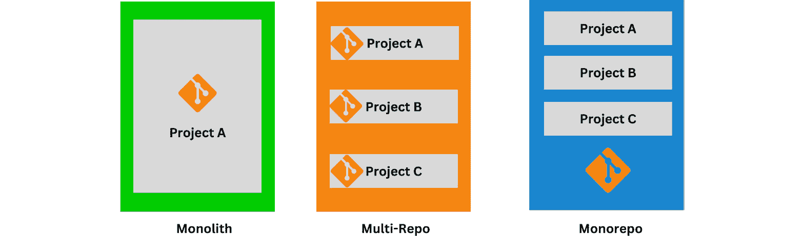
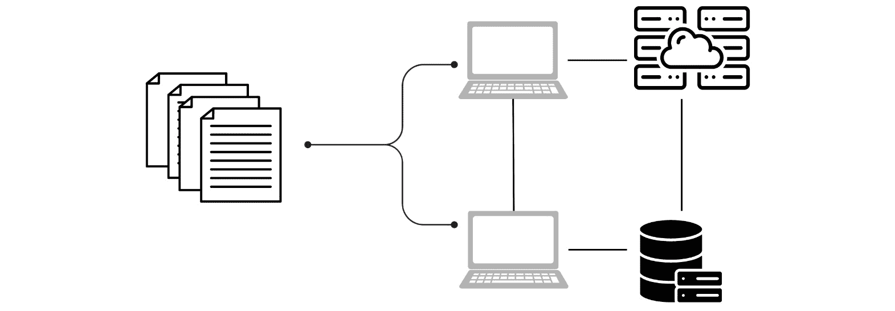
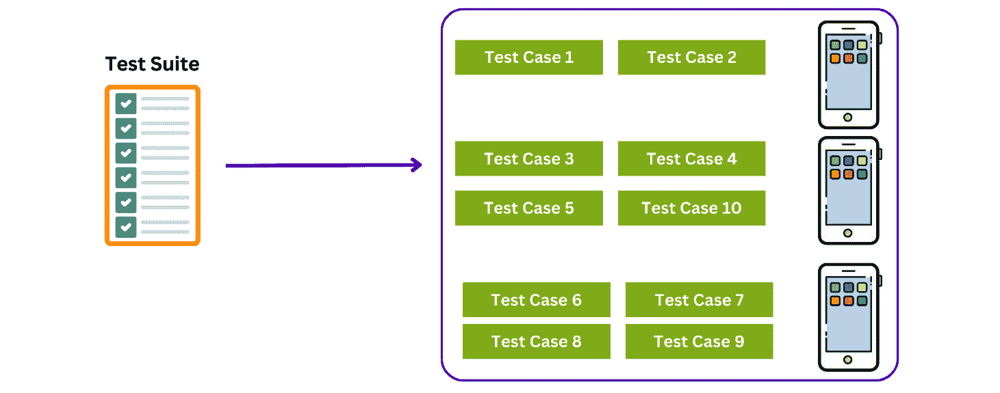
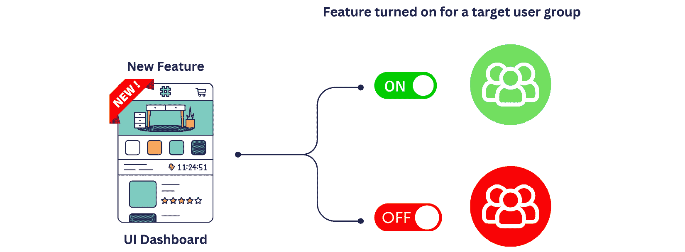
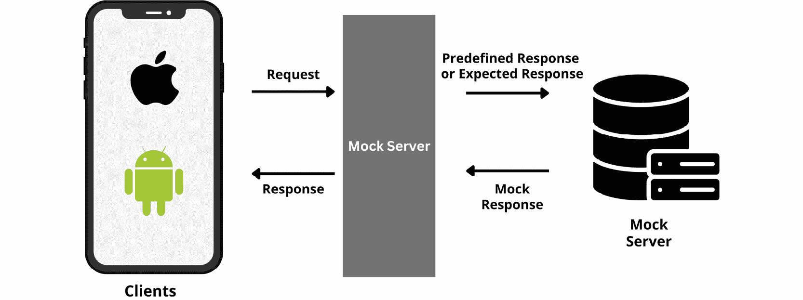
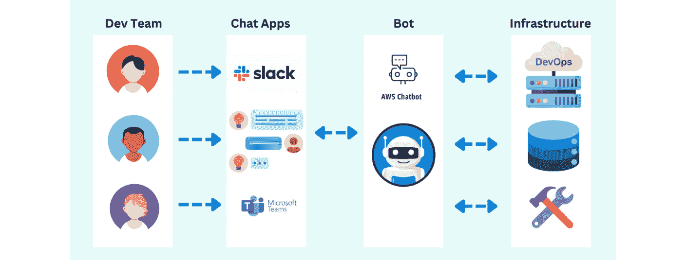

# 第九章：移动 DevOps 最佳实践

正如前几章所讨论的那样，采用移动 DevOps 流程对于频繁且快速地开发和发布高质量的移动应用至关重要。通过结合开发者、测试工程师、发布专家和其他相关人员的最佳实践，可以加快移动应用的开发和分发。因此，较短的交付时间也将提高质量和用户体验。

在本章中，我们将探讨一系列关键主题，帮助移动应用开发者和 DevOps 团队实施高效且有效的**持续集成/持续交付**（**CI/CD**）流水线；我们将深入研究推动成功移动应用开发的基本实践。

本章将涵盖以下主题：

+   移动应用开发中的 CI/CD 最佳实践

+   管理移动应用版本和发布

+   管理移动应用基础设施

+   A/B 测试和功能标记

+   移动应用的远程与依赖缓存

+   CI 构建和测试并行执行

+   使用 fastlane 自动化构建、测试和发布

+   模拟 API

+   移动 DevOps 协作的 ChatOps

# 移动应用开发中的 CI/CD 最佳实践

保持移动 DevOps 流程的有效性、高效性，并与您整体的移动应用开发战略对齐，需要您和您的团队定期审查和优化这些流程。没有万灵药，因此我们应根据团队和业务的成长不断优化我们的移动 DevOps 流程。

有许多实践可以添加到移动 DevOps 流程中，以优化 CI/CD 流水线、代码审查流程、开发速度等。

在前几章中，我们讨论了实施 CI/CD 流水线或工作流时的不同阶段。

以下是确保移动应用 CI/CD 流水线成功的一些最佳实践：

+   **尽可能实现自动化：** 自动化构建、测试、代码分析、发布和其他任务，以减少人工干预、最小化错误并加速开发过程。

+   **实施测试策略：** 采用单元测试、集成测试、UI 测试和端到端测试的组合，以确保高质量代码。使用模拟器或真实设备测试各种设备、屏幕尺寸和操作系统。

+   **优化构建和测试时间：** 使用缓存、并行化和增量构建来减少构建时间。并行化测试执行，优先执行关键测试，以加快测试运行速度。

+   **采用明确的分支策略：** 在处理大型或复杂代码时，使用如 GitFlow 或基于主干的开发等分支策略非常有帮助。这可以保持清晰的提交历史，并简化集成和部署。

+   **执行良好的提交规范**：这包括原子提交、描述性的提交信息和频繁的代码审查，以保持代码质量并确保变更的可追溯性。这有助于确保代码的质量和正确性，并改善团队成员之间的协作。有多种工具可以用来改进和自动化代码审查过程，例如以下工具：

    +   **What The Diff** ([`whatthediff.ai/`](https://whatthediff.ai/))：这是一个由 AI 驱动的代码审查助手。它的目的是帮助团队编写更好的拉取请求描述，甚至可以加速审查和合并过程。此外，它还能让非技术团队成员保持信息同步并参与其中。

    +   **Danger** ([`github.com/danger/danger`](https://github.com/danger/danger))：这是一个非常棒的工具，可以帮助你的团队自动化代码审查规范。通过在流程中加入一个额外的逻辑步骤，Danger 可以在日常代码审查过程中帮助执行这些常规任务的 lint 检查。

    +   **MergeQueue** ([`mergequeue.com/`](https://mergequeue.com/))：一种更快速的方式来自动化合并工作流程，管理大型团队中的队列，并且再也不用担心构建失败了。

+   **关注关键的 CI/CD 指标**：监控 CI/CD 指标非常重要，例如构建时间、测试执行时间、部署频率和代码质量。本章将进一步讨论这些指标，以帮助识别瓶颈和改进领域。

+   **将安全措施纳入 CI/CD 流程**：为了确保 CI/CD 流程的安全性，重要的是要加入安全措施。可以通过使用静态和动态代码分析工具，扫描依赖项中的漏洞，以及通过最小权限原则来实施访问控制。

+   **制定明确的回滚策略**：在部署过程中遇到任何问题时，拥有一个清晰且明确的回滚计划是非常重要的。这可能需要为移动应用提交一个新的更新到应用商店。

+   **建立清晰的沟通渠道**：在团队成员之间建立清晰的沟通渠道，以确保每个人都能了解项目的进展和任何可能出现的问题。

+   **与跨职能团队合作**：与跨职能团队合作，确保开发和部署过程的各个方面都得到充分考虑。这涉及与设计师、开发人员、测试人员和运维团队的协作。

此外，随着我们改进移动 DevOps 流程和 CI/CD 实施，我们还应关注 CI 构建和 CI 服务器的整体性能。让我们看看一些要跟踪的 CI/CD 指标。

## 移动应用开发中需要跟踪的关键 CI/CD 指标

在你的 CI/CD 管道中跟踪关键指标可以帮助你衡量开发和部署过程的有效性，识别瓶颈，并优化管道。

以下是移动应用开发中需要跟踪的一些基本指标：

+   **构建成功率**：衡量每次构建所需的时间，包括编译、打包和其他任何与构建相关的任务。跟踪此指标可以帮助你识别低效环节并改进构建性能——例如，你可以选择加入缓存步骤，以减少应用程序构建时间，前提是应用模块没有从上次构建以来发生任何变化。这样可以防止应用程序从头开始构建，并从上次构建中断的地方继续。我们将在本章稍后讨论缓存。

+   **部署频率**：跟踪你部署新版本或更新到移动应用的频率。高部署频率表明成熟的 CI/CD 过程，并能更快地将功能和漏洞修复交付给用户。

+   **更改的领先时间**：衡量从提交到生产的代码更改所需的时间。较短的领先时间表明管道高效，并能更快地向用户交付价值；我们将在本章稍后讨论帮助代码提交过程的不同工具。

+   **更改失败率**：监控导致失败或需要回滚的更改百分比。较低的更改失败率表明你的测试和发布过程有效地在生产前捕捉到了问题。

+   **平均恢复时间**（**MTTR**）：衡量修复问题或从生产中的故障中恢复所需的平均时间。较短的 MTTR 表明你的团队能够迅速有效地识别和解决问题。

+   **测试执行时间**：监控执行测试套件所需的时间。较长的测试执行时间可能会减慢开发进程。识别慢速测试或优化测试并行化可以减少执行时间。我们将在本章稍后讨论并行化。

+   **测试覆盖率**：跟踪代码库中被测试覆盖的百分比，以确保你有足够的测试来捕捉问题并保持高代码质量。

+   **测试通过/失败率**：监控每次构建中测试的通过或失败百分比。高通过率表明代码库稳定，而高失败率可能表明代码或测试过程存在问题。易波动的测试会产生不一致的结果，在某些运行中通过，在另一些运行中失败，且没有明显原因。尽早解决易波动的测试，以避免虚假的负面结果，并保持对测试套件的信心。以下是 Slack 团队如何在大规模中处理易波动测试的一个例子：[`slack.engineering/handling-flaky-tests-at-scale-auto-detection-suppression/`](https://slack.engineering/handling-flaky-tests-at-scale-auto-detection-suppression/)。

+   **代码质量指标**：跟踪与代码质量相关的指标，如代码复杂度、代码重复性和遵循编码标准的情况。这些指标可以帮助你保持干净且易于维护的代码库。

在移动应用开发中，跟踪 CI/CD 的关键指标对于评估开发和部署过程的效率至关重要。通过监控这些指标，团队可以识别瓶颈，优化流水线，并确保功能和更新的平稳、可靠交付给用户。

这些指标为 CI/CD 流水线的整体健康和有效性提供了宝贵的见解，使团队能够进行数据驱动的改进，并保持稳定且高质量的代码库。

通过精心监控的 CI/CD 流水线和清晰理解的关键指标，让我们一起探索管理移动应用版本和发布的基本策略。

# 移动应用版本和发布管理

管理移动应用的版本和发布可能是一个复杂的任务，但有一些最佳实践可以帮助简化这一过程：

+   **遵循语义化版本控制**：采用明确且一致的版本编号系统至关重要。语义化版本控制（[`semver.org/`](https://semver.org/)）是开发人员广泛认可的标准。版本号由三个部分组成：**主版本.次版本.修订版本**。**主版本**的更改表示有破坏性变化，**次版本**的更改引入新功能，**修订版本**的更改修复错误和问题。

+   **全面的发布说明**：为每个发布提供详细的发布说明，包括新功能、修复的 bug、已知问题以及额外的说明或要求。

+   **简化的分支策略**：采用明确且定义良好的分支策略，如**GitFlow**或**基于主干的开发**，以避免混淆并保持清晰的提交历史。这将有助于确保顺利的集成和部署过程。

现在，让我们一起看一下用于组织和管理版本控制系统中源代码的两种策略：*单一仓库*和*多仓库*。

## 单一仓库

**单一仓库**（[`monorepo.tools/`](https://monorepo.tools/)）是一个包含多个不同项目并具有明确关系的单一仓库。这种方法旨在通过为项目提供一个统一的代码和资源的源，简化管理和开发大型复杂软件系统的过程。

*单体应用*和*单一仓库*之间存在差异；一个好的单一仓库与单体应用正好相反，如下图所示：

图 9.1 – 单体应用与多仓库与单一仓库的对比

单一仓库为项目开发提供了若干优势：

+   首先，将所有代码存储在一个单一的仓库中，可以更容易地理解不同系统组件是如何互相配合并依赖于彼此的。这也简化了依赖管理，减少了开发过程的复杂性，并促进了变更的无缝构建和部署。

+   单一仓库通过提供一个集中存储所有相关代码和资源的位置，增强了开发者之间的协作。这改善了沟通，减少了冲突，并促进了项目上的顺利协作。

然而，单一仓库也有一些挑战：

+   它们可能变得很大，增加了磁盘空间需求和克隆时间，从而使得克隆和使用仓库变得更加困难。

+   它们可能更复杂，尤其是对于大型和复杂的项目，因为更改会影响整个仓库。

安全执行也可能带来困难，因为所有代码都存储在一个位置并对多个开发者开放。这对于敏感项目尤其具有挑战性，需要谨慎的授权流程。

## 多仓库

多仓库是一种开发方法，其中项目的每个组件存储在自己的独立仓库中。它促进了模块化，并允许团队在特定组件上独立工作。虽然它提供了灵活性，但在多个仓库之间协调更改可能具有挑战性。

以下是与多仓库相关的一些特点和挑战：

+   在多仓库方法中，每个项目、库或模块都有自己独立的仓库。这使得每个项目的代码库保持隔离和独立。

+   每个仓库都有自己的版本控制历史，允许项目独立版本化。这为管理发布周期和更新提供了灵活性。

+   项目之间的依赖关系必须显式地进行管理和版本控制，从而增强了对项目间依赖关系的可视性和控制。

+   每个仓库只包含特定项目的代码，保持仓库的大小较小，可能提高性能。

+   多仓库方法允许更去中心化的开发过程，因为每个团队可以独立管理自己的仓库。

+   管理多个仓库之间的依赖关系、版本和配置，比单一仓库更加复杂且耗时。

+   在多个项目中进行更改可能是具有挑战性的，因为这可能需要在多个仓库之间协调提交和发布。

因此，选择单一仓库（monorepo）和多仓库（multi-repo）之间的决策，取决于团队规模、项目复杂性、开发流程和工具偏好等因素。有些组织偏好单一仓库的简化和统一方式，而另一些则偏爱多仓库设置的独立性和去中心化特性。

由于移动应用依赖于后端服务、数据库和配置管理，因此团队应考虑自动化发布和管理这些服务，以防止出现任何问题。让我们来探讨一下管理移动应用基础设施的概念。

# 管理移动应用基础设施

管理移动应用基础设施是成功开发和部署应用的关键方面。它涉及监督支撑应用功能和用户体验的底层系统、服务器、数据库和云资源。

高效的基础设施管理确保了可扩展性、可靠性和性能。任务包括配置和部署服务器、设置数据库、监控资源利用率和实施安全措施。采用现代的**基础设施即代码**（**IaC**）实践，可以让团队自动化基础设施的配置和部署，从而更容易保持一致性并无缝地进行变更部署。

一个良好管理的移动应用基础设施对于提供流畅且可靠的用户体验至关重要，同时能够高效处理日益增长的用户需求并随着应用的扩展进行扩展。让我们讨论一下如何管理移动应用的基础设施。

# 移动应用的基础设施即代码（IaC）

**IaC** 是一种强大的方法，它允许你通过代码定义和管理应用的基础设施，带来了可重现性和可扩展性等好处。虽然 IaC 通常与基于服务器的基础设施相关，但它也可以应用于移动应用，如下图所示：

图 9.2 – 基础设施即代码 (IaC)

以下是如何更详细地利用 IaC 管理移动应用的说明：

+   IaC 使你能够轻松创建可重现的环境。你可以为不同的环境（如开发、测试、预生产和生产）启动相同的基础设施设置。通过使用相同的基础设施代码，确保环境之间的一致性，减少配置漂移和环境相关问题的可能性。

+   定义支持移动应用所需的基础设施组件。这可能包括服务器资源、数据库、存储服务、**内容分发网络**（**CDN**）以及其他必要的资源。确定这些组件之间的配置设置、依赖关系和相互关系。

+   选择一个支持移动应用基础设施配置的 IaC 工具。常见的选择包括 Terraform 和 AWS CloudFormation。这些工具允许你描述和管理你的 IaC，并支持多种云提供商和服务。

+   将基础设施代码存储在版本控制系统（如 Git）中，以便跟踪更改、实现协作，并维护基础设施修改的历史记录。

+   利用 IaC 为移动应用的基础设施定义自动扩展能力。这使得您的应用能够根据需求自动增加或减少资源，从而确保最佳性能和成本效率。在基础设施代码中指定扩展策略和阈值。

+   借助 IaC，您可以将配置设置和变量作为代码进行管理，使得保持一致性变得更容易，同时避免手动错误。例如，您可以在基础设施代码中定义特定于环境的配置值（例如 API 端点和数据库凭据），并在不同环境中始终如一地使用它们。

+   借助 IaC，您可以对这些变化进行版本控制和跟踪，确保透明性并简化部署。您无需手动修改资源，而是修改基础设施代码并应用更改，IaC 工具将处理更新。

+   将测试原则应用于基础设施代码。编写自动化测试以验证基础设施定义的正确性和完整性。这有助于在配置或修改基础设施之前捕捉潜在问题。

+   将基础设施代码集成到您的 CI/CD 流水线中。这使您能够自动化移动应用基础设施的配置和更新，同时处理应用代码，确保一致性和可靠的部署。

在 IaC 之后，我们来探讨一下移动应用的配置管理以及如何使用它。

# 移动应用的配置管理

管理不同环境的配置设置和变量，确保一致性并避免手动错误，具体步骤如下：

+   确定移动应用所需的配置设置和变量。这些可以包括 API 端点、数据库连接字符串、功能标志、日志级别、凭据以及任何可能在不同环境之间变化的值。

+   将配置设置与应用代码分开。将配置值直接硬编码到代码中，会使在不同环境之间迁移时更新这些配置变得困难。相反，应将配置值抽象到单独的配置文件中，或通过环境变量将其外部化。

+   使用特定于每个环境的配置文件。例如，您可以为开发、测试、预发布和生产环境分别设置配置文件。这些文件可以是 JSON、XML、YAML 或属性文件。每个文件都包含该环境的相应值。

+   利用环境变量存储配置值。环境变量在系统级别设置，您的移动应用可以在运行时访问这些变量。此方法提供了灵活性，并且可以轻松更改配置，而无需修改文件。

+   使用集中式配置管理解决方案来存储和管理您的配置设置。这些解决方案包括 AWS Secrets Manager 的机密、Parameter Store 的参数或 HashiCorp Vault 的配置值。它们允许您为每个环境存储不同的配置，并提供在运行时检索值的 API。

+   自动化配置设置在不同环境中的部署，作为 CI/CD 管道的一部分。这确保了正确的配置值与移动应用一起部署，减少了在手动更新配置时发生人为错误的风险。

+   将配置文件或脚本存储在版本控制中，以跟踪变更、维护历史记录并启用协作。这使得在需要时可以恢复到先前的配置，并提供配置修改的审计跟踪。

+   避免直接将敏感信息存储在配置文件或环境变量中。相反，使用您选择的配置管理解决方案提供的安全存储机制，或在存储之前加密敏感值。

+   将配置测试纳入自动化测试策略的一部分。编写测试用例，以验证配置设置的正确性和完整性。这有助于在开发早期捕捉到与配置相关的问题，并确保应用在不同环境中按预期行为运行。

+   为修改配置设置建立变更管理流程。实施审批工作流，确保在将变更应用于生产环境之前，相关利益相关者已对其进行审查和批准。这有助于保持控制并防止未经授权或计划外的变更。

优化构建过程以减少构建时间，因为构建时间过长会拖慢开发周期并增加开发者的等待时间。使用缓存、并行化和增量构建等技术来加速过程。在下一部分中，我们将深入探讨移动应用的远程和依赖缓存，并探索其带来的好处。

# 远程和依赖缓存

构建和发布移动应用通常需要下载依赖项和资源到 CI 服务器或本地机器上，以便能够构建应用，这可能是耗时且数据密集的。然而，随着远程和依赖缓存解决方案的出现，开发人员现在拥有了一种强大的工具来提高生产力。

移动应用的远程和依赖缓存是指*从远程服务器存储和获取常用的依赖项和资源*。开发者无需每次构建应用时都下载这些资源，而是可以利用缓存显著减少构建过程中所需的时间和带宽。这种优化技术可以显著简化应用开发工作流程，缩短构建时间，提高迭代周期，并减少数据消耗。

以下是远程和依赖缓存的一些好处：

+   它消除了重复下载相同资源的需求，使开发人员在构建过程中节省宝贵的时间。当处理依赖项较多的大型项目时，这种加速效果尤为明显。

+   缓存有助于团队成员之间的协作，确保每个人都能访问相同的依赖和资源。这有助于避免版本冲突，确保团队内一致的开发环境。

+   开发人员可以快速迭代他们的应用程序，无需等待资源下载，从而加快测试和调试的周期。

+   一些缓存解决方案提供离线支持，使得开发人员即使在没有互联网连接时也能继续进行项目工作。这个功能对于经常外出的开发人员或在网络连接不稳定的地区特别有用。

但根据选择的缓存解决方案，开发人员可能需要监控和管理缓存，以防止缓存增长过大或堆满过时的资源。有效的缓存管理策略对于保持最佳性能至关重要。

在移动应用的远程和依赖缓存方面，一些工具和平台提供了类似的功能，包括以下内容：

+   **Gradle 构建缓存** ([`docs.gradle.org/current/userguide/build_cache.html`](https://docs.gradle.org/current/userguide/build_cache.html))：Gradle 是一个流行的构建自动化系统，提供了一个构建缓存功能，可以用来缓存依赖和资源。它与基于 Gradle 的 Android 项目无缝集成，适用于大规模构建。

+   `npm` 包管理器包括一个缓存机制，可以有效地解析和获取依赖。npm 的缓存显著减少了获取和安装常用包所需的时间。

+   `Bazel.build` 利用复杂的依赖图和缓存机制，智能地确定需要重新构建的内容，大幅减少构建时间，提高开发人员的生产力。你可以阅读 Reddit 如何在 iOS 应用中使用 Bazel 的例子 ([`www.reddit.com/r/RedditEng/comments/syz5dw/ios_and_bazel_at_reddit_a_journey/`](https://www.reddit.com/r/RedditEng/comments/syz5dw/ios_and_bazel_at_reddit_a_journey/))，以及 Square 如何在 Apple Silicon 上使用 Bazel 的例子 ([`developer.squareup.com/blog/getting-squares-ios-build-ready-for-apple-silicon-with-bazel/`](https://developer.squareup.com/blog/getting-squares-ios-build-ready-for-apple-silicon-with-bazel/))。

+   **Tuist**（[`tuist.io/`](https://tuist.io/)）：Tuist 是一个命令行工具，使用声明式方法简化 iOS 项目的设置和维护过程。Tuist 缓存（[`docs.tuist.io/building-at-scale/caching`](https://docs.tuist.io/building-at-scale/caching)）通过存储和重用先前构建的依赖项、资产和中间构建工件来优化构建时间。这种缓存机制可以大大减少构建和迭代 iOS 项目所需的时间。

+   **BuildBuddy**（[`www.buildbuddy.io/`](https://www.buildbuddy.io/)）：BuildBuddy 是一个基于云的构建执行平台，帮助开发人员将构建卸载并分发到远程机器。它提供了一个用户友好的界面、广泛的构建洞察和协作功能，以简化开发工作流。通过使用 BuildBuddy，团队可以减少构建时间，节省基础设施成本，并提高开发人员效率。以下是如何使用 GitHub Actions 进行远程构建执行的示例：[`www.buildbuddy.io/docs/rbe-github-actions`](https://www.buildbuddy.io/docs/rbe-github-actions)。

+   **XCRemoteCache**（[`github.com/spotify/XCRemoteCache`](https://github.com/spotify/XCRemoteCache)）：XCRemoteCache 是一个 Xcode 项目的远程缓存工具。它重用在远程机器上生成的目标工件，并通过一个简单的 REST 服务器提供服务。

+   **Carthage 缓存**：Carthage 是一个 iOS 应用的依赖管理工具，提供缓存功能以加速依赖项的获取和构建时间。它与 Xcode 兼容，并简化了团队成员之间共享依赖项的过程。此外，你还可以使用 Rome（[`github.com/tmspzz/Rome`](https://github.com/tmspzz/Rome)），这是一个为使用 Carthage 构建的框架提供的共享缓存，允许苹果平台的开发人员使用 Amazon 的 S3、本地文件夹或自定义引擎。

如果在 iOS 应用中使用，你还可以使用 Cocoapods 缓存（[`cocoapods.org/pods/Cache`](https://cocoapods.org/pods/Cache)）或 **Swift 包管理器**（**SPM**）（[`github.com/apple/swift-package-manager`](https://github.com/apple/swift-package-manager)）缓存。

移动应用的远程和依赖缓存是移动应用开发和移动 DevOps 中的游戏规则改变者，它在节省时间、带宽节约、协作和迭代效率方面提供了实际的好处。

移动 CI/CD 系统使用缓存来在隔离的构建之间传输数据。由于 CI 构建运行在短暂的、隔离的虚拟机中，典型的 CI 工作流必须采取额外的步骤来引导开发人员通常可用的本地环境。

缓存这些操作将使你的 CI 工作流更快，因为安装 CLI 工具和下载第三方依赖项需要时间，如下图所示：

图 9.3 – CI 构建机器之间的缓存

虽然初始的设置可能会有一些复杂性，并且需要考虑缓存管理的问题，但总体的优势使得缓存成为任何开发者工具包中的宝贵补充。

这是一个如何使用 GitHub Actions 设置一个简单的 Gradle 缓存管道来加速 Android 应用构建时间的示例：

1.  在`.github/workflows`目录下，创建一个 YAML 文件，例如`android_build.yml`。

1.  添加以下`android_build.yml`文件：[`github.com/PacktPublishing/Mobile-DevOps-Playbook/blob/main/Chapter-9/.github/android_build.yml`](https://github.com/PacktPublishing/Mobile-DevOps-Playbook/blob/main/Chapter-9/.github/android_build.yml)。该工作流根据 Gradle 文件的内容缓存 Gradle 依赖项。

1.  根据应用的复杂性和需求，您可能需要添加更多的步骤，例如运行测试、部署构件或与其他服务集成。

让我们来看一个如何在 Bitrise 的 CI/CD 工作流中使用缓存的示例。

Bitrise 提供了**缓存拉取步骤**和**缓存推送步骤**，这些功能可以基于应用的依赖关系，在构建之间缓存和检索特定的目录或文件。

要为您的 iOS 项目设置缓存，您需要将以下步骤添加到您的 Bitrise 工作流中：[`github.com/PacktPublishing/Mobile-DevOps-Playbook/blob/main/Chapter-9/bitrise.yml`](https://github.com/PacktPublishing/Mobile-DevOps-Playbook/blob/main/Chapter-9/bitrise.yml)。

您可以通过以下链接了解更多关于 Bitrise 依赖和缓存的内容：[`devcenter.bitrise.io/en/dependencies-and-caching.html`](https://devcenter.bitrise.io/en/dependencies-and-caching.html)。

最后，通过根据项目的需求对比并选择最合适的缓存解决方案，您可以优化应用开发过程，解锁更高的生产力。

对于你的移动应用和 CI 提供商，始终寻找合适的缓存解决方案是非常重要的。

# 并行执行 CI 构建和测试

在移动应用开发中利用并行执行进行 CI 构建和测试，可以显著提高开发者生产力，缩短反馈周期，提升整体效率。考虑使用 Fastlane、Firebase Test Lab 以及 CI 工具的能力，以实现最佳并行化并加速您的移动应用开发过程。

移动应用 CI 构建中并行执行的一些好处如下：

+   **更快的反馈**：并行执行减少了构建步骤和测试套件所需的时间，提供了更快速的代码更改反馈。这使得开发者能够更快地进行迭代，并在开发周期的早期捕捉到问题。

+   **提高效率**：通过利用并行执行，您可以充分利用可用资源，并将工作负载分配到多个代理或设备上。这提高了资源效率，并最大化了 CI 基础设施的利用。

+   **可扩展性**：并行执行使您的 CI 流水线能够随着移动应用项目的增长无缝扩展。它使您能够处理更大的代码库、增加的测试套件，并支持多个平台和配置，而不会牺牲速度或性能。

+   **时间和成本节省**：通过并行执行来减少构建和测试时间，您节省了宝贵的开发时间，并可能降低与维护 CI 基础设施相关的成本。

大多数 CI/CD 工具支持并行构建，或者将 CI 流水线或工作流拆分成小的补丁或任务，以并行运行，从而节省构建时间。例如，在 GitHub Actions 中，您可以使用 Matrix（[`docs.github.com/en/actions/using-jobs/using-a-matrix-for-your-jobs`](https://docs.github.com/en/actions/using-jobs/using-a-matrix-for-your-jobs)）在多种语言版本或多个操作系统上测试您的代码。

使用 Bitrise，您可以使用构建流水线（[`bitrise.io/why/features/pipeline`](https://bitrise.io/why/features/pipeline)），它帮助您组织整个移动 CI/CD 构建过程，并允许您设置多个任务和测试的高级配置，可以并行和/或顺序执行。

在并行执行中，多个 UI 测试在不同的设备或模拟器上同时执行，如下图所示：

图 9.4 – 并行 UI 测试执行

移动应用 UI 测试的并行执行有助于提高测试过程的速度和质量，从而使您的移动应用更加可靠和健壮。

以下是并行执行在移动应用 UI 测试中的一些好处：

+   通过并行运行 UI 测试，您可以显著减少整体执行时间。与按顺序执行测试不同，并行执行允许在不同设备或模拟器上并发执行多个测试。这有助于节省时间，并提高测试过程的效率。

+   通过并行执行，您可以在多个设备或模拟器上同时执行测试。这使得您能够在更短的时间内覆盖更广泛的设备配置、操作系统和屏幕尺寸。它有助于确保您的应用在各种设备上都经过测试，并增加捕捉到设备特定问题的可能性。

+   并行执行为您的 UI 测试过程提供了可扩展性。随着测试套件的增长，并行执行测试可以让您处理更多的测试，而不会显著增加执行时间。您可以轻松地向测试基础设施中添加更多设备或模拟器，并将测试工作负载分配到它们上。

+   并行执行充分利用可用资源。通过同时使用多个设备或模拟器，您可以最大化测试基础设施的利用率。这有助于优化资源分配，并确保测试在没有不必要等待时间的情况下执行。

+   并行执行非常适合集成到 CI/CD 流水线中。通过并行执行测试，你可以实现更快的反馈周期和构建过程。它允许你将 UI 测试无缝集成到 CI/CD 工作流程中，并确保每次代码更改后，应用保持稳定和功能正常。

使用 Flank（[`flank.github.io/flank/`](https://flank.github.io/flank/)）可以运行并行的 Android 和 iOS 测试，它与 gcloud CLI 兼容。Flank 提供额外的功能来加速速度并提高质量。

移动团队安全快速发布功能的一种有用做法是实现特性标志。让我们讨论一下这一概念及其如何被利用。

# A/B 测试与特性标志

A/B 测试和特性标志是移动应用开发中常用的强大技术，用于实验、验证和逐步推出新功能或变体给一部分用户。让我们深入探讨 A/B 测试和特性标志如何为移动应用带来好处以及可用的实施工具。

## 移动应用的 A/B 测试

A/B 测试涉及向不同用户组展示应用的不同版本或特定功能，以评估其对用户体验、参与度或**关键绩效** **指标**（**KPI**）的影响。

这是它的工作原理：

1.  **实验**：A/B 测试工具使开发者能够定义实验，创建不同的变体（A 和 B），并将用户随机分配到每个变体中。例如，你可能会测试不同的应用布局、导航结构或按钮位置。

1.  **衡量**：指标和分析对于评估 A/B 测试的成功至关重要。通过监测用户交互、转化率或其他相关 KPI，你可以评估哪个变体表现更好并推动所需的用户行为。

1.  **分析与迭代**：分析测试结果帮助你做出数据驱动的决策。你可以根据获得的见解来改进并迭代测试过的功能或版本，从而提升应用的性能和用户体验，如下图所示：

图 9.5 – A/B 测试的工作原理

## 移动应用的特性标志

特性标志（或开关）使开发者能够控制应用程序中特定功能或代码段的可见性和行为。特性标志提供了灵活性，允许开发者逐步推出新功能，在生产环境中进行测试，或动态启用/禁用它们。

这是特性标志的工作原理：

+   特性标志库或 SDK 被集成到应用程序的代码库中，以实现对功能可用性的运行时控制。标志可以根据预定义条件（如用户群体、设备类型或应用版本）配置为启用或禁用功能。

+   功能标记使开发者能够通过为特定用户群体选择功能来进行有针对性的测试。这有助于评估功能性能，收集反馈，并在将功能发布给更广泛的受众之前做出数据驱动的决策，如下图所示：

图 9.6 – 功能标记的工作原理

以下是一些最受欢迎的移动应用功能标记工具：

+   **LaunchDarkly** ([`launchdarkly.com`](https://launchdarkly.com)) 是一个功能管理平台，提供强大的功能标记能力。它允许您控制功能的可用性，定位特定的用户群体，并通过基于 Web 的仪表盘轻松管理标记。

+   **ConfigCat** ([`configcat.com/`](https://configcat.com/)) 提供了一个支持移动应用开发的功能标记和配置管理平台。它允许您创建功能标记，控制其可见性，并动态更新配置，无需应用更新。

+   **Flagsmith** ([`flagsmith.com/`](https://flagsmith.com/)) 是一个开源功能标记和远程配置平台。它提供了一系列功能，包括 A/B 测试、目标规则，并与各种开发框架集成，适用于移动应用实现。

+   **Firebase 远程配置** ([`firebase.google.com/products/remote-config`](https://firebase.google.com/products/remote-config)) 是一个基于云的服务，允许开发者动态配置和定制应用程序，无需新发布或应用更新。它使开发者能够远程控制和个性化应用程序的各个方面，如文本、图像、颜色和行为，从而实现有针对性的内容推送和 A/B 测试。

+   **Optimizely** ([`www.optimizely.com`](https://www.optimizely.com)) 是一个强大的实验和个性化平台，帮助企业做出数据驱动的决策，并提升数字化体验。

以下是 A/B 测试和功能标记在移动应用中的一些好处：

+   它们帮助您基于真实的用户数据做出明智的决策，提高功能发布和更新成功的机会。

+   通过逐步推出功能或仅对特定用户群体启用功能，您可以降低与 bug、性能问题或负面用户反应相关的风险。这确保了更平滑、更安全的部署过程。

+   它们允许根据用户反馈和可衡量的结果快速迭代和优化功能。这个迭代过程增强了开发周期，并加速了功能交付。

+   功能标记通过根据特定用户群体或个别用户定制应用功能，来提供个性化体验。这种定制化增强了用户的满意度和参与度。

A/B 测试和功能标志为移动应用开发者提供了宝贵的实验、验证和控制发布的技术。可以考虑使用像 Firebase Remote Config、Optimizely、LaunchDarkly、ConfigCat 或 Flagsmith 这样的工具来实现这些策略，并在移动应用开发过程中解锁数据驱动决策和灵活功能管理的好处。

接下来，我们将探讨在移动 UI 测试中使用模拟 API，这可以通过让你在不设置真实 API 或等待网络响应的情况下测试应用 UI，节省时间和精力。它还可以帮助你在不同的场景和条件下测试应用行为，而这些可能是通过真实 API 很难设置的。

# 模拟 API

**模拟 API** 在简化移动应用开发中至关重要，它通过解耦后端依赖、加速开发周期并增强可测试性，帮助提升开发效率。

在选择模拟 API 解决方案时，考虑其与开发工作流的集成、定制选项、文档和社区支持。通过利用模拟 API，移动应用开发者可以简化开发流程，提高应用质量，并更高效地进行迭代。

用于移动 UI 测试的模拟 API 是一种模拟的 API，允许你在不连接真实 API 的情况下测试移动应用的 UI。在许多不同的情况下，它都非常有用，例如当真实 API 尚不可用时，当你想要测试应用在不同场景下的行为，而这些场景可能无法通过真实 API 设置，或是你希望在不受网络延迟影响的情况下测试应用性能时。

图 9.7 – 模拟服务器的工作原理

你可以使用多个工具为移动 UI 测试创建模拟 API，例如 **WireMock**（[`wiremock.org/`](https://wiremock.org/)），这是一款开源工具，允许你通过定义 HTTP 请求和响应来创建模拟 API。它可以作为独立服务器运行，也可以作为 Java 库在你的测试代码中使用。

这是一个设置简单模拟 API 端点返回 JSON 响应的示例：[`github.com/PacktPublishing/Mobile-DevOps-Playbook/blob/main/Chapter-9/mockTest.kt`](https://github.com/PacktPublishing/Mobile-DevOps-Playbook/blob/main/Chapter-9/mockTest.kt)。

这是一个如何将 WireMock 服务器整合到 Android 测试设置中的示例：[`github.com/PacktPublishing/Mobile-DevOps-Playbook/blob/main/Chapter-9/MyApiTest.kt`](https://github.com/PacktPublishing/Mobile-DevOps-Playbook/blob/main/Chapter-9/MyApiTest.kt)。

运行 Android 测试。对本地模拟服务器上指定 API 端点（例如 `http://localhost:8080/api/endpoint` 或 `http://mock-server.com/api/endpoint`）发出的请求将被 WireMock 拦截，并返回配置的模拟响应。

# 使用 fastlane 进行构建、测试和发布

**fastlane** ([`fastlane.tools/`](https://fastlane.tools/)) 是一款功能强大的自动化工具，专门设计用于简化构建、测试和发布移动应用的过程。它提供了多种功能和集成，能够自动化重复任务，从而为移动开发者节省宝贵的时间和精力。

让我们深入了解使用 fastlane 构建、测试和发布移动应用的关键方面：

+   fastlane 简化了构建配置过程。你可以通过 fastlane 的配置文件（Fastfile） ([`docs.fastlane.tools/advanced/Fastfile/`](https://docs.fastlane.tools/advanced/Fastfile/)) 以可读的方式定义构建设置，例如代码签名、配置文件和构建风味。这消除了手动配置的需要，并减少了出错的可能性。

+   fastlane 与流行的测试框架（如 XCTest 和 Espresso）集成，允许你在构建过程中运行单元测试、UI 测试以及其他自定义测试。它还可以处理测试报告并生成详细的测试结果报告。

+   fastlane 与流行的 CI/CD 平台（如 GitHub Actions、Codemagic 和 Bitrise）无缝集成。它提供了专门的插件和集成功能，帮助将 fastlane 平滑地融入到 CI 工作流中。这确保了你可以在 CI 流程中持续、自动化地构建、测试和发布移动应用。

+   fastlane 简化了将应用发布到应用商店的过程。通过其 App Store Connect 和 Google Play 插件，你可以自动化整个发布流程，包括版本控制、代码签名、元数据管理，以及上传应用包或 APK 文件。

+   fastlane 的可扩展性允许你通过创建自定义动作或使用许多现有插件来扩展其功能。fastlane 的插件生态系统 ([`docs.fastlane.tools/plugins/available-plugins/`](https://docs.fastlane.tools/plugins/available-plugins/)) 提供了大量的预构建插件，这些插件可以与第三方服务如 Slack、Firebase App Distribution、Sentry、BrowserStack 等集成。这些插件使你能够将额外的功能（如崩溃报告、beta 测试或分析）融入到 fastlane 的工作流中。

+   fastlane 拥有一个充满活力和积极参与的社区，社区成员积极贡献开发工作。定期发布更新、新功能和修复漏洞，确保你可以访问到最新的改进和增强功能。

开始使用 fastlane 相对简单。以下是一步一步的指南，帮助你快速上手：

1.  确保你的系统上已安装 Ruby。你可以通过在终端运行 `ruby -v` 来检查。如果 Ruby 未安装，你可以使用包管理工具进行安装，例如 **Homebrew**（适用于 macOS）或 **Chocolatey**（适用于 Windows）。

1.  通过在终端运行 `gem install fastlane` 来安装 fastlane。此命令将获取并安装 fastlane 的最新版本。

1.  使用终端导航到您的移动应用项目目录。

1.  在项目目录中运行 `fastlane init`。此命令初始化 fastlane 并创建一个新的 fastlane 文件夹，其中包含配置文件。

1.  fastlane 使用 Fastfile 来定义和管理自动化任务。使用文本编辑器打开位于 fastlane 目录中的 Fastfile。

1.  fastlane 提供了广泛的内置操作，涵盖了常见任务。例如，您可以使用 scan 操作运行测试，使用 delivery 操作将您的应用上传到 App Store。

1.  fastlane 允许您安全地存储敏感信息，如代码签名证书和 API 密钥。在 fastlane 目录中创建一个新的 `.env file`，并添加项目所需的环境变量。

1.  更新位于 fastlane 目录中的 `Appfile`，添加相关信息，如您的应用的包标识符和 Apple 开发者帐户详细信息。

1.  要执行特定的 lane，请在终端中运行 `fastlane <lane_name>`。例如，运行 fastlane beta 将执行您在 Fastfile 中定义的 beta lane。

这是一个 iOS 应用的 Fastfile 示例，包含用于构建、测试和将应用发布到 TestFlight 和 App Store 的 lanes（[`github.com/PacktPublishing/Mobile-DevOps-Playbook/blob/main/Chapter-9/fastlane/Fastfile%20`](https://github.com/PacktPublishing/Mobile-DevOps-Playbook/blob/main/Chapter-9/fastlane/Fastfile%20)）。

这是一个基本示例，展示了如何使用 fastlane 和 GitHub Actions 自动化您的 iOS 应用部署过程：

1.  如果 `.github/workflows` 目录不存在，请在 GitHub 仓库中创建该目录。在该目录下创建一个 YAML 文件（例如，`i0S-fastlane.yml`）。

1.  配置一个 GitHub Actions 工作流，例如这个示例：[`github.com/PacktPublishing/Mobile-DevOps-Playbook/blob/main/Chapter-9/.github/iOS-fastlane.yml`](https://github.com/PacktPublishing/Mobile-DevOps-Playbook/blob/main/Chapter-9/.github/iOS-fastlane.yml)。

1.  将 `./path/to/your/project` 替换为您的 iOS 项目目录的实际路径，并将 `your_lane` 替换为您要运行的 fastlane lane（例如，beta、release 等）。

现在，每当您将更改推送到 `main` 分支时，GitHub Actions 工作流将被触发，并执行定义的步骤，这些步骤包括设置环境、安装依赖项并运行您的 fastlane lane。

这是一个基本示例，您可能需要根据您的项目设置和需求进行调整。

确保查看 fastlane 和 GitHub Actions 文档（[`docs.fastlane.tools/best-practices/continuous-integration/github/`](https://docs.fastlane.tools/best-practices/continuous-integration/github/)）以了解更多高级配置和选项。

在使用 Bitrise、Codemagic 或任何其他 CI 提供商时，过程类似。您需要将管道步骤替换为 fastlane 命令，并确保在虚拟机上安装了 fastlane 所需的必要先决条件。

记住，fastlane 高度可定制，因此可以根据你的具体项目需求进行调整。不要犹豫，参考官方 fastlane 文档（[`docs.fastlane.tools`](https://docs.fastlane.tools)）以获取更详细的信息和示例。

下一部分将探讨 ChatOps，以及如何将聊天工具纳入团队对话中，从而加速移动 DevOps 生命周期。

# 移动 DevOps 协作中的 ChatOps

在当今快节奏的软件开发世界中，有效的协作与沟通是实现无缝移动 DevOps 的关键。随着远程工作和分布式团队的兴起，拥有一个可靠且功能丰富的平台，以促进实时互动变得尤为重要。

ChatOps 是一种协作方法，通过使用聊天平台作为沟通和自动化的核心枢纽，将开发、运维及其他团队结合在一起。它能实现无缝协作并整合各种工具，使得管理软件开发和部署过程变得更加便捷，如下图所示：

图 9.8 – ChatOps 的工作原理

在移动 DevOps 项目中，实施 ChatOps 可以使协作更加高效和透明。这将改善沟通并加快开发团队的决策过程。

ChatOps 带来的好处如下：

+   沟通与自动化任务的机器人部署提高了跨职能团队的敏捷性，从而缩短了问题解决的时间。

+   ChatOps 允许我们将不同领域的熟练工人组合成一个团队，而不影响组织结构。

+   自动化：集成机器人是最重要的成就之一。它们是根据预定命令执行任务的助手。通过这种方式，机器人可以被分配执行如代码搜索、部署和服务器重置等功能，大大减少了处理问题的时间。

让我们一起探索可以帮助实现 ChatOps 的各种工具和服务，以优化我们的移动 DevOps 流程。

## Slack

**Slack** ([`slack.com/`](https://slack.com/)) 是一个因其多功能性和集成能力而广受欢迎的沟通工具。Slack 被证明是移动 DevOps 协作中 ChatOps 的一个强大工具。利用 Slack 进行 DevOps，也被称为**SlackOps**，是指利用这一流行的团队协作工具 Slack，来简化并增强 DevOps 流程中的沟通、协作和自动化。DevOps 是一种结合软件**开发**（**Dev**）和 IT**运维**（**Ops**）的方式，旨在促进协作文化、持续集成/持续交付（CI/CD）以及自动化。SlackOps 利用 Slack 的实时消息、频道、集成和机器人功能，提升 DevOps 团队的效率和效能。以下是使用 Slack 与 DevOps 的一些好处：

+   它为团队提供了一个集中的空间，便于沟通、分享想法和讨论项目更新。它提供实时消息和语音、视频通话，便于快速高效的协作。

+   Slack 的最大优势之一是其广泛的集成生态系统。它能够与 DevOps 生态系统中使用的各种工具和平台无缝连接，例如 GitHub Actions 用于 CI/CD 管道，GitHub 用于版本控制系统，Jira 用于项目管理工具以及监控服务。这种集成能力可以实现自动化通知和更新，减少在不同应用程序之间切换的需要。

+   Slack 的移动应用提供流畅的用户体验，使团队成员能够保持联系和参与。它提供推送通知、直观的导航和访问所有基本功能，确保无论身处何地都能持续协作。

移动 DevOps 团队可以使用 Slack 简化工作流程、自动化发布过程、共享测试结果，并保持高效。

## AWS Chatbot

**AWS Chatbot** ([`aws.amazon.com/chatbot/`](https://aws.amazon.com/chatbot/)) 是 **亚马逊网络服务**（**AWS**）提供的一个服务，旨在通过将其与流行的聊天平台集成来简化这些过程。它可以与流行的消息服务集成，如 Slack、Microsoft Teams 和 Amazon Chime。你需要选择你想使用的消息服务并将 AWS Chatbot 连接到它。这将使你能够在消息服务中接收来自 AWS 服务的通知和警报。

首先，重要的是要在你的 AWS 账户中创建一个 AWS Chatbot。这可以通过访问 AWS 管理控制台并选择 AWS Chatbot 服务来轻松完成。然后，你可以创建一个新的聊天机器人，并根据需要自定义其设置。请记住，AWS Chatbot 提供了多个优势，包括以下几点：

+   与流行的聊天平台如 Slack、Microsoft Teams 和 Amazon Chime 无缝集成。这种集成使团队能够直接在他们首选的聊天环境中接收实时通知、警报和更新，减少上下文切换，让每个人保持信息同步。

+   团队可以为 ChatOps 定义自定义工作流程，自动化重复任务并促进协作。通过使用聊天命令，团队成员可以对 AWS 资源执行操作、检索信息、启动部署并执行预定义脚本。这种能力使团队能够高效管理基础设施，无需离开聊天环境。

总之，采用移动 DevOps 最佳实践是实现高效、高质量移动应用开发的关键一步。通过结合开发人员、测试工程师、发布专家和其他利益相关者的专业知识，组织可以加速开发和部署过程，从而缩短交付时间并改善用户体验。

# 摘要

在本章中，我们重点讨论了移动 DevOps 的最佳实践，旨在加速高质量移动应用的开发与发布过程。通过结合开发人员、测试工程师、发布专家及其他利益相关者的专业知识，组织可以优化移动应用开发流程，并向客户提供频繁的更新，从而提高速度和质量。

在本章中，你掌握了 CI/CD 最佳实践、移动应用版本管理、基础设施即代码（IaC）、配置管理、A/B 测试、远程与依赖缓存、并行 CI 构建、fastlane 自动化、API 模拟和 ChatOps 协作等关键技能。这些技能将帮助你在移动应用开发中脱颖而出，并有效地优化你的流程。

在下一章，我们将讨论平台工程和**开发者体验**（**DevX**）如何提高生产力。

# 第四部分：超越移动 DevOps 与 DevOps 的未来

移动 DevOps 的未来可能会继续专注于提升移动应用开发的速度和质量。这可能涉及使用更新的技术和实践，以帮助提高移动应用开发的速度和质量。

本部分包含以下章节：

+   *第十章**，通过开发者体验与平台工程提高生产力*

+   *第十一章**，预测移动 DevOps 的未来*
