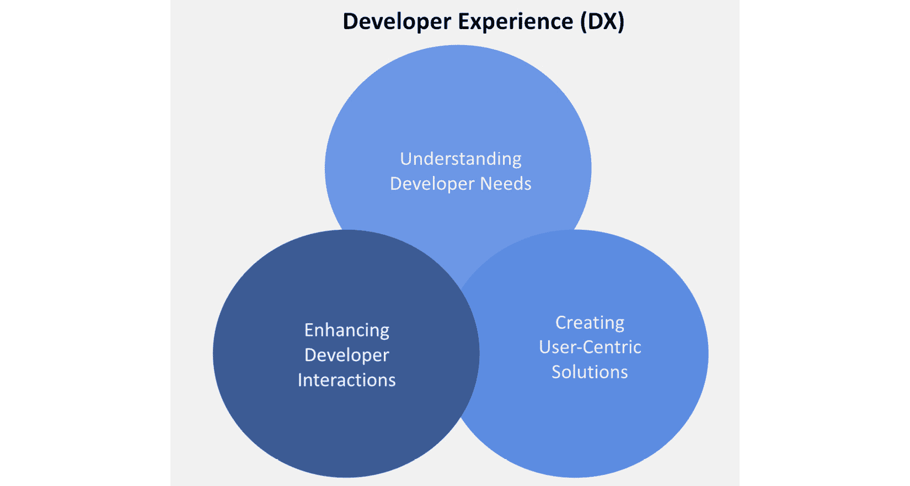

# 通过开发者体验和平台工程提高生产力

移动开发者是许多公司和组织的基石，拥有一个专门的团队来理解他们的需求并提供最佳体验，对于成功和提高生产力至关重要，尤其是在团队扩展和公司成长的过程中。这就是**开发者体验**（**DX**）、**内部开发平台**（**IDP**）和**平台工程**（**PE**）团队的作用所在。

在本章中，我们将涵盖以下主题：

+   DX 和 IDP 的概念

+   拥有 DX 和 IDP 团队的重要性

+   移动 DevOps 与 DX 团队的关系

+   PE 的概念、好处和原则

+   DevOps 工程、站点可靠性工程和 PE 的区别

在今天的移动应用开发环境中，交付高质量、创新和用户友好的应用不仅仅是关于编写代码、测试和发布应用。移动 DevOps 团队需要管理一套复杂的活动，如我们在前几章中所讨论的，包括**持续集成与交付**（**CI/CD**）、发布编排、监控和分析。投资 DX 可以帮助移动 DevOps 团队简化和自动化这些活动，从而提高应用质量、加快**上市时间**（**TTM**）并提高团队生产力。

*这不仅仅是工具、流程和活动；开发者的幸福感和生产力应该是 DX 团队最重要的目标。*

让我们更深入地探讨 DX，了解它意味着什么。

# 什么是 DX？

DX 描述了移动开发者在使用工具或平台时的整体体验。为了提高开发者的采用率、参与度和留存率，DX 专注于为移动开发者创造积极的体验。

对于与大规模和远程移动开发者合作的公司来说，拥有一个 DX 团队变得越来越重要。这能确保移动开发者能够使用最新的工具和资源，同时也能为组织提供有价值的反馈和见解，从而提升移动应用和服务，并让移动开发者更开心。

*DX 是一种思考工程卓越和最大化工程表现的方法，通过提升个人和团队整体的能力和表现来实现。*

组织可以采取若干步骤将 DX 融入到他们的移动 DevOps 文化中。这可以包括提供必要工具和流程的访问、创建开放且协作的环境，并鼓励持续学习和改进的文化。

此外，组织还可以专注于为移动开发者提供资源和支持，并认可他们的成就，以进一步建立积极的 DX。

确保在移动 DevOps 文化中实现良好的 DX 对组织至关重要，因为这能带来诸多好处，如*缩短 TTM*、*提高团队间的协作*、以及*吸引并留住* *顶尖人才*。

组织应专注于提供适当的工具和流程，创造一个开放和协作的环境，促进持续学习和改进的文化，并为移动开发人员提供资源和支持，以实现这一目标。

# DX 团队做什么？

DX 团队的角色基于三个支柱：理解开发者需求、创建以用户为中心的解决方案，以及改善开发者互动。如下面的图所示，DX 团队的目标是提升使用其平台的开发者的生产力、效率和满意度：

图 10.1 – DX 的重点

DX 团队代表并倡导公司内部的开发者，优先考虑他们的需求和体验。它提供技术支持，开发简化开发过程并提高应用性能的工具和接口。

# 理解开发者需求

DX 团队的主要目标是了解移动开发人员的需求，以确保组织为移动开发人员创造最佳体验。

这涉及到审查移动开发人员当前使用的工具和服务，并理解他们在使用这些工具时面临的问题。通过清晰且全面地了解移动开发人员的需求，DX 团队可以提出量身定制的解决方案和服务，以满足这些需求。

## 通过组织工作流程创建以用户为中心的解决方案

一旦识别出移动开发人员的需求，DX 团队就可以开始创建以用户为中心的解决方案。这意味着团队将设计量身定制的软件和服务，旨在让移动开发人员的体验更加直观和愉悦。通过设计符合移动开发人员需求的软件和服务，团队可以确保移动开发人员在与组织合作时获得最佳体验。

## 通过清晰且标准化的沟通增强开发者互动

DX 团队还致力于确保移动开发人员与组织的互动是积极的。这可能包括为移动开发人员提供他们成功所需的资源，确保他们在使用组织的产品和服务时获得良好体验。此外，团队将寻找方法来创造更积极且富有成效的组织与移动开发人员之间的关系，例如定期进行调查，征询他们对流程、工具和公司目标的反馈。

## DX 与移动 DevOps

DX 团队可以提供*对移动开发者需求的宝贵理解*，这有助于确保所有团队成员达成共识。它还可以充当*移动开发者、产品经理和高层之间的桥梁，帮助确保每个人的需求得到满足*。这有助于创造一个团队协作的环境，共同开发成功的移动应用。

DX 涵盖了开发者与移动开发平台或生态系统互动的各个方面。以下是 DX 团队的一些关键职责：

+   **入职支持**：为移动开发者提供适当的材料、培训和业务文档，以帮助新员工或加入者顺利完成入职过程。这将使他们能够快速融入工作，避免浪费时间和精力去了解业务或代码。

+   **文档**：全面且清晰的文档对于移动开发者理解如何使用库、API、SDK、框架以及其他工具和流程至关重要。文档应易于查找、阅读和理解，并提供常见使用场景的示例和解释。

+   **工具和 SDK**：平台提供的工具、库、API 和 SDK 应直观易用，并提供清晰的文档和示例。这些工具应帮助移动开发者自动化重复任务，加快开发和发布速度，并提供代码质量和性能的洞察。

+   **测试**：测试和调试工具应易于使用、全面且可靠。移动开发者应能够快速识别和解决问题，并高效地调试代码。

+   **性能与可扩展性**：DX 团队应关注移动应用的性能，同时也要考虑后端服务的可扩展性。

+   **安全与合规性**：DX 团队应提供强有力的安全与合规指导，例如数据加密、访问控制和审计。它应遵循行业标准和法规，并为公司内的移动开发者提供明确的安全开发实践指南。

了解更多关于 Slack 移动开发者体验团队如何帮助移动开发者保持高效的内容，请访问[`slack.engineering/Mobile-developer-experience-at-slack/`](https://slack.engineering/Mobile-developer-experience-at-slack/)。

探讨了 DX 背后的概念后，接下来让我们讨论一下 IDP 与移动 DevOps 之间的关系。

# 什么是 IDP？

IDP（[`internaldeveloperplatform.org/`](https://internaldeveloperplatform.org/)）关注的是如何最好地为你的移动开发团队提供高效和有效的工具与资源。

在我看来，正如以下截图所示，IDP 是 DX 的一个子集，DX 是将各种工具和技术汇聚在一起的集合。IDP 提升了开发者的生产力，改善了 DX，减少了手动操作，降低了成本，并减轻了团队的维护负担。它们在保持低认知负荷的同时，支持开发者自助服务：

图 10.2 – DX 与 IDP

如我们在第一章中讨论的，Mobile DevOps 是一套实践方法，能够帮助组织以安全且高效的方式构建、测试、发布和监控移动应用。为了确保开发者的最高生产力，投资合适的工具、流程和实践至关重要。

这包括投资自动化工具，设置敏捷开发环境，并提供访问最新技术的权限。还应利用如 CI/CD 等技术，尽可能地自动化开发和发布周期。

对于 Mobile DevOps 来说，确保拥有合适的工具和流程是很重要的。这包括一个自动化测试框架，以及一个允许移动开发者快速测试和推送应用更新的移动设备实验室。

注意

了解更多关于 Netflix 在开发者生产力方面的经验，参见 [`www.droidcon.com/2022/06/28/netflix-gradle-a-journey-in-developer-productivity/`](https://www.droidcon.com/2022/06/28/netflix-gradle-a-journey-in-developer-productivity/)，了解 Uber 如何进行开发者生产力工程，参见 [`www.youtube.com/watch?v=YdmzVzxz9DI`](https://www.youtube.com/watch?v=YdmzVzxz9DI)，以及 DoorDash 如何进行开发者生产力工程，参见 [`www.youtube.com/watch?v=MN9U-JmRFJA`](https://www.youtube.com/watch?v=MN9U-JmRFJA)。

IDP 和 DX 能够解决组织面临的诸多痛点。

IDP 减少了整个组织的认知负担，使得移动开发者可以自助服务，而不需要抽象上下文或隐藏底层技术，具体包括以下内容：

+   **移动 CI/CD 基础设施编排和发布管理**：管理能够使这些阶段发生的工具和流程。这包括构建和测试应用的工具、自动化部署过程的工具，以及管理新版本应用发布的工具，正如我们在*第六章*中讨论的，*移动应用* *发布管理*。

+   **移动应用配置**：用户可以自定义的设置和偏好，以定制应用的外观和行为。其中包括语言选择、主题自定义、通知设置、隐私设置和用户偏好等选项。

+   **管理开发环境**：开发者大多数时间都花在设置环境上，一个设计良好的开发环境对生产力和代码质量有着显著影响。

通过这种方式，团队可以确保开发环境根据他们的需求量身定制，并包含完成目标所需的所有工具和集成。

有不同的开发环境作为服务或产品，提供完全配置的开发环境，包括以下内容：

+   **Coder** ([`coder.com/`](https://coder.com/)): 这是一个自托管的远程开发平台，将软件开发从本地机器转移到本地和公有云基础设施上。在强大的服务器上构建代码，并在几分钟内为新开发者提供入职体验，同时确保源代码和数据的安全。

+   **GitHub Codespaces** ([`github.com/features/codespaces`](https://github.com/features/codespaces)): 这是一个完全配置的云端开发环境，能够通过 GitHub 在几秒钟内启动，使用 Visual Studio Code、Jupyter 或 JetBrains，并配备编辑器、终端、调试器、版本控制、设置同步和所有扩展。无论你是在浏览器中工作还是在桌面上工作，都可以在任何设备上完成。这就是它的全部功能。

+   **Gitpod** ([`www.gitpod.io/`](https://www.gitpod.io/)): 该平台为任何类型的软件项目提供完全初始化和完美配置的开发环境。任何团队成员都可以使用 Gitpod 运行代码。通过一次配置环境，PE 团队能够实现开发者自服务。

在我看来，如果团队决定转向基于云的开发环境，可能会遇到困难，因为移动应用开发需要特殊的环境、工具和 SDK，但优步的开发者平台最近通过 Kubernetes 构建了一个基于单一代码库的远程开发平台，这是一个很好的例子 ([`www.uber.com/en-DE/blog/devpod-improving-developer-productivity-at-uber/`](https://www.uber.com/en-DE/blog/devpod-improving-developer-productivity-at-uber/))。

+   **管理机密**：安全地存储密码、API 密钥和其他凭证，并确保它们保持受保护。通过有效管理机密，敏感数据能够防止未经授权的访问。

可以使用不同的秘密管理工具和服务，以下是一些例子：

+   **HashiCorp Vault** ([`www.vaultproject.io/`](https://www.vaultproject.io/)): 使用 UI、CLI 或 HTTP API 安全存储并严格控制访问令牌、密码、证书和加密密钥，从而保护机密和其他敏感数据。

+   **AWS Secrets Manager** ([`aws.amazon.com/secrets-manager/`](https://aws.amazon.com/secrets-manager/)): 跟踪数据库凭证、API 密钥和其他机密的生命周期，允许您根据需要检索、轮换和存储它们。

+   **Doppler** ([`www.doppler.com/`](https://www.doppler.com/)): 允许开发人员和安全团队在设备、环境和团队成员之间同步和保护机密与应用配置。

如前面章节所讨论的，随着规模的扩大，所有上述责任应由一个专门的团队管理，这个团队可以是 IDP 和 DX 团队。

IDP 优化开发流程，使得移动应用的开发和发布变得更加高效。

这包括审视开发环境、工具和流程，寻找提升整体生产力的方法。这可能包括自动化流程、引入新工具，或重组移动开发团队等。

通过生产力工程，移动开发者能够将更多时间花在实际开发工作上，减少繁琐任务的时间。这样，你能够提升团队士气，加速开发周期。

例如，Netflix 的**移动生产力**（**MoPro**）团队帮助全球的工程师快速创建 Netflix 移动应用。为了实现这一目标，它使用优化开发者体验的工具和基础设施。通过先进的自动化测试和生产力解决方案，支持实验、自治和所有权的文化。

为了更好地理解开发者生产力，有一个框架叫做**SPACE** ([`queue.acm.org/detail.cfm?id=3454124`](https://queue.acm.org/detail.cfm?id=3454124))，它涵盖了以下几个重要方面：

+   满意度与福祉

+   性能

+   沟通与协作

+   效率与流程

组织和团队可以通过识别和衡量生产力，基于多个维度做出更好的决策。

移动开发者可以使用多种工具和技术来提升生产力，包括以下分析与协作平台：

+   **Backstage** ([`backstage.io`](http://backstage.io)): 这是一个开放平台，用于构建开发者门户。通过 Backstage 的集中式软件目录，你可以恢复微服务和基础设施的秩序，并使产品团队能够快速交付高质量的代码。

+   **LinearB** ([`linearb.io/developer-experience/`](https://linearb.io/developer-experience/)): 这是一个平台，通过工作流自动化和优化你的交付流水线，提升开发者体验，使用你移动开发者喜爱的工具。

+   **Compass** ([`developer.atlassian.com/cloud/compass/`](https://developer.atlassian.com/cloud/compass/)): 这是一个开发者体验平台，将你的分布式软件架构和相关团队汇聚在一个统一的地方。

+   **Okay** ([`www.okayhq.com/`](https://www.okayhq.com/)): 这是一个平台，帮助你基于 Jira、GitHub、PagerDuty 等开发者工具构建查询和仪表板。

通过使用这些工具和技术，移动开发者可以简化工作流程，消除耗时的任务。

除了使用生产力工具，移动开发者还应优化他们的流程。开发过程可以被分解成更小的任务，或者可以为代码审查和修复漏洞创建更高效的流程。通过系统地优化流程，移动开发者可以最大化他们的生产力。

## IDP 工程的好处

通过采用 IDP，移动开发者可以通过提高效率来增加生产力。它还能帮助开发者更快地发现和修复错误，并通过自动化重复性任务来节省时间。此外，IDP 还可以帮助减少与长周期开发相关的成本，如错过的截止日期和延期。

开发者生产力的概念充满了误解和神话，这些误解和神话可能导致错误的决策。其中包括以下几点：

+   **一个常见的误区是认为工作时间越长，生产力越高**。实际上，往往情况正好相反。过度工作可能导致倦怠，进而降低动机和生产力。

+   毫无疑问，干扰会妨碍生产力，但同样重要的是认识到，休息和停机时间对于防止倦怠和保持专注也同样重要。**工作与生活的平衡** **至关重要**。

+   **人们常常认为最优秀的移动开发者是单打独斗的，不需要其他人的帮助或合作**。实际上，合作与团队合作能够带来更好的结果并提高生产力。

在 DX 和 IDP 团队的背景下，是时候了解新时代的 PE，以及它如何与 IDP 协同工作了。

# 什么是 PE？

PE 的概念是指定义、构建和维护一个平台的过程，这个平台将作为软件开发、发布和扩展的基础。

这包括设计基础设施和**基础设施即代码**（**IaC**），设置 CI/CD 管道，并自动化测试和发布过程。

PE 在确保移动 DevOps 平台成功方面扮演着至关重要的角色。

为了确保平台能够优化用于构建和发布移动应用，PE 与移动开发团队密切合作。在这个过程中，我们设置了构建、测试和部署应用所需的工具和框架，并确保平台具有可扩展性和可靠性。

PE 团队还负责监控和维护平台。任务包括监控平台的性能和稳定性，识别和修复问题，以及根据需要实施升级和更新。

PE 的原则包括以下几点：

+   处理不断增加的负载和使用量的能力

+   维护平台的可用性和功能性

+   保证平台及其用户免受恶意攻击和数据泄露是安全团队的责任。

+   保持平台的更新并易于维护

+   平台应该能被多个团队和应用重复使用

在许多情况下，平台工程师是更大工程团队的一部分，因此，考虑团队如何沟通及工作流程至关重要。因此，它变得更像是一个集中的产品团队，专注于内部平台客户，如移动开发者、测试人员和产品经理。

在 PE 中，常见的工程资源被整合为一个内部工具/平台，以简化软件开发。

平台工程师的技术能力还应包括云计算、容器化、基础设施即代码（IaC）、自动化和监控专长。可能还需要掌握编程语言和工具的熟练程度。

如今，平台工程师社区非常庞大（[`platformengineering.org/`](https://platformengineering.org/)），但大多数话题似乎主要集中在云计算和 Kubernetes 相关内容上。不过，我相信随着时间的推移，越来越多与移动相关的话题将被加入和支持。

## PE 的好处

有了 PE，企业能够更快速、更具成本效益地开发和部署符合需求的软件解决方案。

此外，PE 使公司能够快速轻松地更新其软件解决方案，保持领先于竞争对手。此外，PE 还降低了成本，因为它消除了手动编码、测试和调试的需求。

如果想了解规模化 PE 的好例子，可以阅读**Wise**的**PE**历史（[`www.wise.jobs/2021/03/25/introduction-to-the-wise-platform-team/`](https://www.wise.jobs/2021/03/25/introduction-to-the-wise-platform-team/))。

为了确保有效的 PE，遵循最佳实践至关重要。这包括确保*应用的架构是可扩展和模块化的，使得随着应用的发展，新增功能和特性变得容易*。平台工程师还应确保*数据库设计合理，并经过性能优化，同时确保应用的数据* *安全存储*。

定期测试应用的后端以识别并修复任何问题也是非常重要的，避免它们影响用户体验。

最后，平台工程师应时刻关注移动应用开发领域的最新技术和趋势，以确保其应用保持竞争力和相关性。

随着移动应用使用量的持续增长，平台工程师的角色将变得更加重要。随着移动应用变得更加复杂和功能丰富，新的工具和框架将被需要来应对不断增加的工作负载。包括 5G、**人工智能**（**AI**）、云计算、**增强现实**（**AR**）和**虚拟现实**（**VR**）等新技术，将为平台工程师提供创新和创造引人入胜的移动体验的新机会。

# 平台工程师、移动 DevOps 工程师和移动端站点可靠性工程师的区别

随着更多组织采用移动 DevOps，理解三个相关角色——移动 DevOps 工程师、网站可靠性工程师和平台工程师之间的差异变得越来越重要。

这些角色中的每一个都需要自动化和基础设施来部署、维护和监控软件。尽管如此，每个角色在职责和重点上都具有独特性。

网站可靠性工程师、DevOps 工程师和平台工程师在移动应用开发中都扮演着至关重要的角色。每个角色的具体重点取决于组织的需求，每个角色在移动应用的成功中都发挥着关键作用。

## 移动应用平台工程师

如前所述，移动应用平台工程师构建和维护运行移动应用的平台。他们的职责包括以下内容：

+   构建和维护运行移动应用的平台服务，如数据库、缓存系统和消息队列

+   开发自动化工具，以简化常见的移动应用开发任务

+   通过微调平台服务来优化移动应用系统的性能

+   设计和实现移动应用系统的安全性和合规性功能

+   与移动应用开发人员合作，确保平台服务的设计和构建能够满足移动应用开发的需求

平台工程师的关键指标包括正常运行时间、可扩展性、开发者满意度、上市时间、安全性、基础设施成本效率和移动应用用户满意度。

## 移动应用 DevOps 工程师

在移动应用 DevOps 中，DevOps 工程师简化了移动应用的开发和部署过程。为了确保代码尽可能快速且可靠地交付给用户，他们与移动应用开发人员紧密合作，自动化移动应用系统的部署和测试。

DevOps 工程师应熟悉如 React Native 和 Flutter 等移动应用开发框架。此外，他们还应熟悉 GitHub Actions、GitLab 和 Bitrise 等 CI/CD 工具。

除了自动化和管理配置外，移动 DevOps 工程师还具有安全方面的专业知识。他们自动化应用交付，设置 CI/CD 管道，并管理移动应用的云基础设施。他们的日常职责包括以下内容：

+   通过 CI/CD 管道交付移动应用

+   通过构建和维护测试与集成系统来确保代码质量

+   解决由移动应用引发的事故

+   通过与移动应用开发人员合作简化移动应用交付

除了技术能力，移动 DevOps 工程师还必须具备出色的问题解决能力，能够识别并解决发布过程中出现的问题。

DevOps 的关键指标包括频率、交付时间、**平均恢复时间**（**MTTR**）和**变更失败率**（**CFR**）。

## 移动应用网站可靠性工程师

移动站点可靠性工程师负责确保移动应用程序的可靠性、可用性和性能。作为其职责的一部分，他们与开发团队密切合作，识别潜在的性能问题并优化应用程序，以实现最大效率。此外，他们必须熟悉诸如 Prometheus、Grafana 和 Elasticsearch 等监控和日志工具。

他们的专业知识包括监控和管理移动应用性能、自动化重复任务以及故障排除。以下是他们的职责：

+   建立监控和警报系统，以便在问题影响用户之前发现它们

+   创建和维护移动应用数据备份和 **灾难恢复**（**DR**）系统

+   与移动应用开发人员合作，设计和构建可扩展、可靠且容错的系统

移动应用站点可靠性工程师的关键指标包括应用程序稳定性、崩溃率、用户参与度、响应时间和服务器正常运行时间。

尽管这三个角色都需要与移动应用开发团队合作，但他们的具体重点各不相同。移动应用站点可靠性工程师的目标是与移动开发人员合作，确保移动应用系统的可靠性、可扩展性和性能。为了简化移动应用的交付过程，DevOps 工程师与移动开发人员密切合作。平台工程师与移动开发人员合作，设计和构建支持移动应用的平台。

# 我的公司是否需要 DX、IDP 或 PE？

为了在数字时代保持竞争力，企业需要 DX、IDP 和 PE 团队。PE 使公司能够创建安全、可扩展且强大的软件解决方案。通过 PE，公司还可以更快、更具成本效益地开发和发布软件解决方案，并对符合需求的开发过程有更多的控制权。

当公司利用 DX、IDP 和 PE 团队时，它们可以降低成本。如果你希望在数字时代保持竞争力，PE 可能是你公司成功的关键。

投资 PE 时，必须选择合适的工具，建立强大的基础设施，并需要跨团队的协作。为了确保成功，移动 DevOps 团队应定期评估其 PE 策略。

# 总结

任何与移动开发人员合作的组织都应该拥有 DX 团队。除了提高员工士气和忠诚度外，它还确保移动开发人员在公司产品和服务中的最佳体验。为了建立 DX 团队，必须进行细致的规划和执行，团队还应配备必要的资源和工具。

此外，DX 团队可以承担各种项目，从创建新工具到提供支持和指导。

本章中，我们涵盖了以下主题：

+   DX 和 IDP 的概念

+   拥有 DX 和 IDP 团队的重要性

+   移动 DevOps 和 DX 团队之间的关系

+   PE 的概念、优势和原则

+   DevOps 工程、站点可靠性工程和 PE 之间的区别

对于移动 DevOps 来说，确保拥有正确的工具和流程至关重要。这包括一个自动化测试框架，以及一个可以让移动开发者快速测试并推出应用更新的移动设备实验室。

最终，DX 团队将通过为移动开发者提供更好的体验，帮助公司或组织在开发工作中取得更大的成功。根据 DX 团队的设置和执行情况，它可以成为任何组织的宝贵资产。DX 团队可以用于各种项目，从开发新工具和资源到响应功能需求。

PE 使公司能够创建安全、可扩展和强大的软件平台和解决方案。通过 PE，公司还可以更快速、成本更低地开发和发布软件解决方案，同时在满足需求的开发过程中拥有更多的控制权。

最后，移动应用的站点可靠性工程师致力于确保移动应用系统的可靠性、可扩展性和性能，并与移动开发者协作。DevOps 工程师与移动开发者合作，优化移动应用交付流程。平台工程师与移动开发者合作，设计并构建用于运行移动应用的平台。

在下一章中，我们将讨论移动应用开发和移动 DevOps 的未来趋势，并将以总结我们的书籍以及我们对未来的预测作为结尾。

平台工程师、移动 DevOps 工程师和移动站点可靠性工程师之间的区别
