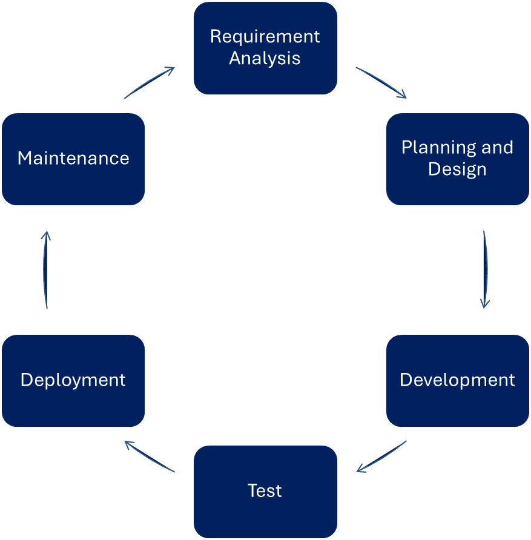
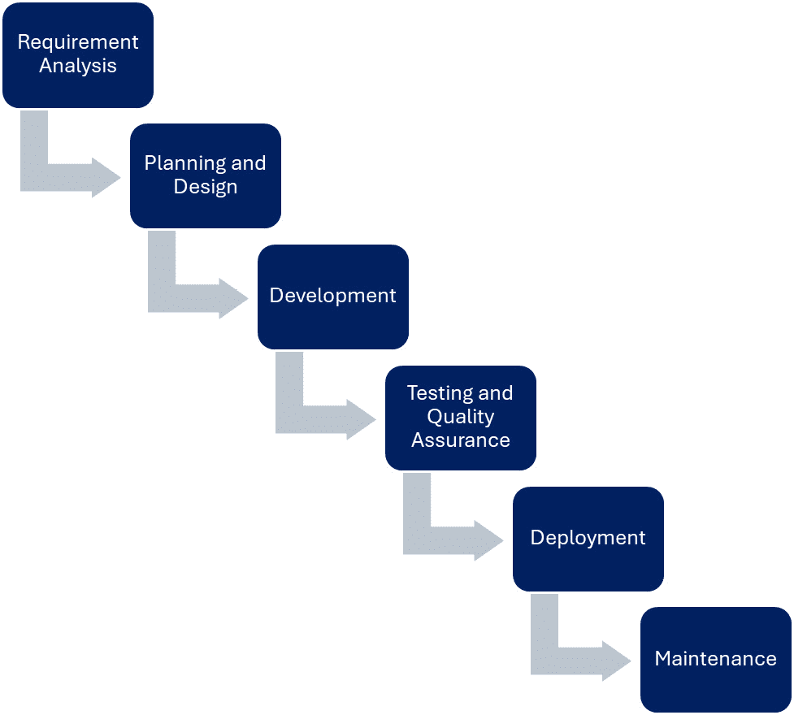
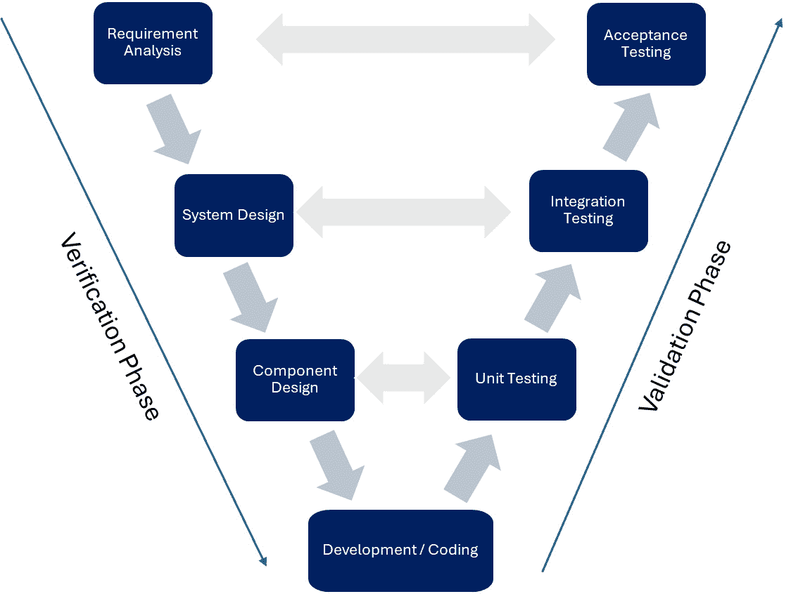
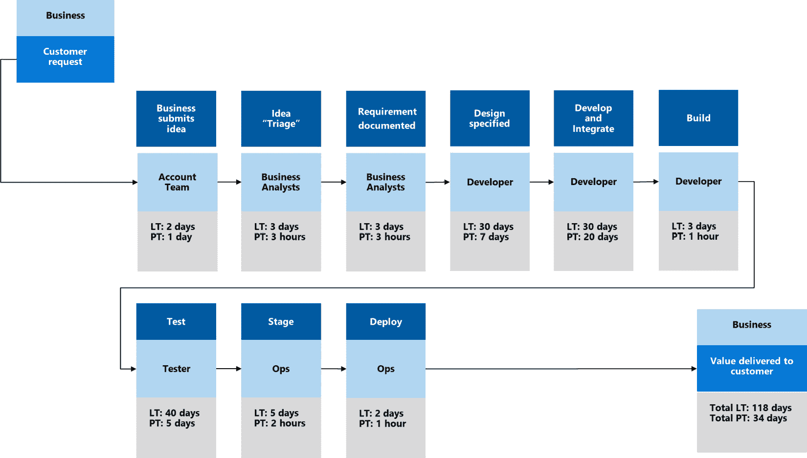
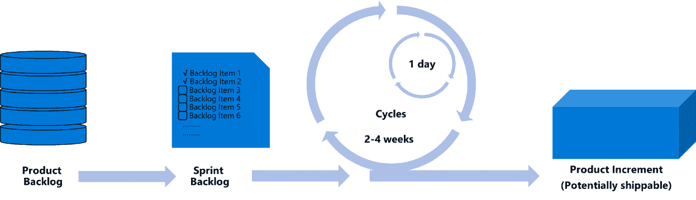
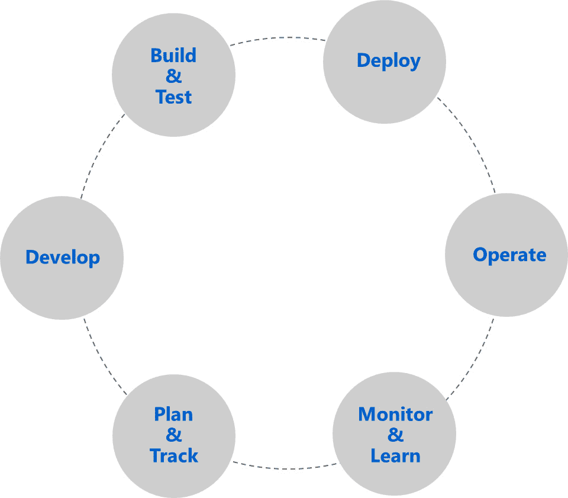
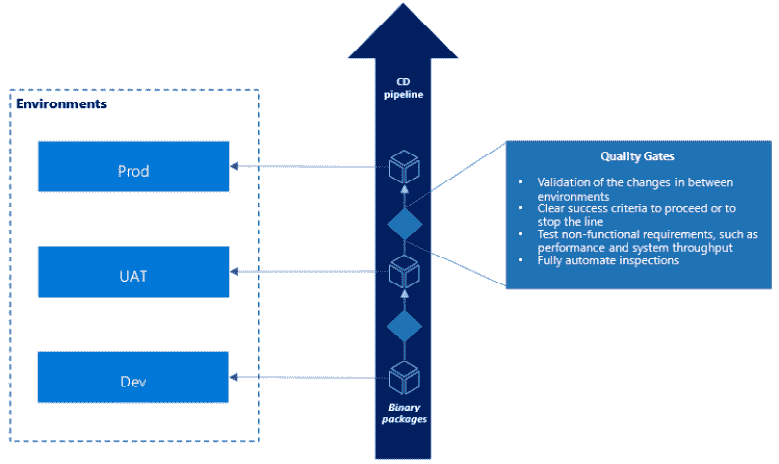
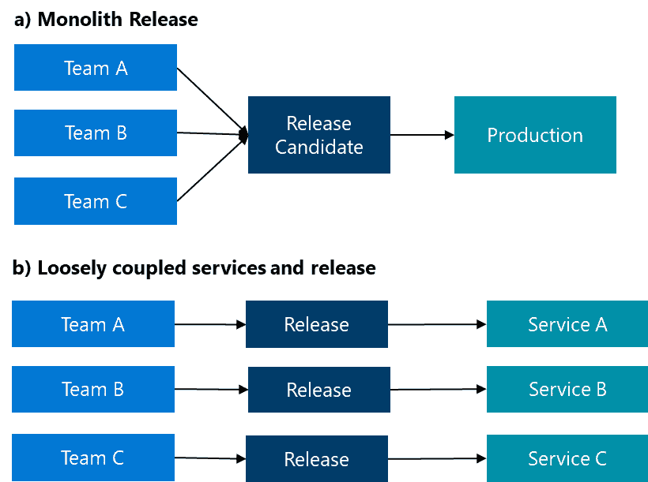

# 掌握 DevOps 和 ALM 以实现高效的软件开发

自从第一个程序在打孔卡上编写以来，软件开发实践和方法论已经发生了很大的变化。 如今，各行各业的每个业务流程都依赖软件，我们甚至无法想象没有应用程序的生活，因为它们几乎在我们与世界的每一次互动中都被使用。 在疫情期间，数字化转型得到了加速，创建更多应用程序的需求已达到一个无法仅通过传统软件开发工具和框架来满足的程度。 如今，所有组织都可以看作是软件开发公司，不论其所属行业，得益于全球的 数字化转型。

在本章中，我们将 探讨 **应用生命周期管理** (**ALM**) 在软件开发中的背景。 我们将从 **软件开发生命周期** (**SDLC**)概述开始，接着讨论各种软件开发方法论。 然后，我们将深入探讨 ALM 的概念，从 SDLC 的角度审视它，并探讨从需求工程到开发、测试、生产和维护的全过程。 这些知识至关重要，因为它为我们提供了有效管理和简化规划、创建、测试以及部署各种应用程序过程所需的理解。 我们还将探讨精益（Lean）概念的起源，这是一种强调为客户创造价值和消除浪费的哲学，起源于汽车 制造行业。

接着，我们将介绍敏捷宣言和 Scrum 方法论，这是现代软件开发实践中的关键框架。我们将进一步学习 DevOps 支持的架构，包括各种设计模式和非功能性需求，如可测试性和可部署性。我们还将涵盖**持续集成**（CI）和**持续部署**（CD），这两种实践自动化了应用程序生产的各个阶段。最后，我们将讨论**发布列车**和**发布周期**的概念，这些是以协调和可预测的方式管理新特性发布的策略。这些知识将帮助我们优化开发流程并提高产品质量。

到本章结束时，我们将熟悉最先进的应用程序开发流程和模式，以及前沿的 DevOps（将**开发**和**运维**团队整合在一起，持续为客户交付价值）和 ALM 实践。

本章我们将涵盖以下主要内容：

+   软件开发生命周期（SDLC）——它的全部内容

+   软件开发方法概述

+   什么是 ALM？

+   精益原则、敏捷宣言和 Scrum 方法论

+   DevOps 支持的架构模式

+   持续集成（CI）和持续交付（CD）

# 软件开发生命周期（SDLC）——它的全部内容

软件开发生命周期（SDLC），有时也被称为**软件开发过程**，是用于以成本效益高的方式生产高质量软件的系统化方法论。我们可以使用过去几十年中开发的几种方法论来开发或修改计算机系统。

最初，这一概念是在 1960 年代创建的。 它的主要目标是建立一个可重复、可审计的、当时顺序的软件开发过程，覆盖从应用程序的构思到最终交付解决方案的步骤，目标是企业大型计算机系统。 自那时以来，许多改进、创新和发明已被实施，从面向对象的编程语言引入，到 DevOps 和 DevSecOps 实践，再到云原生架构，这些都推动了更新的 SDLC 方法论的出现。 随着持续的过程改进，大多数现代软件开发方法论如今遵循敏捷 原则。

## 阶段

无论选择哪种软件开发方法论，软件开发过程的阶段（阶段）是 相同的：

图 1.1 – 软件开发阶段

让我们来探索 这些阶段：

+   **需求分析** 或 需求工程是开发团队收集客户需求和目标的步骤。 开发团队与客户代表密切合作，以确定解决方案的关键特性。 在此阶段，需求也会被分析，即需求会被验证并且明确记录。 该阶段还包括识别系统的非功能需求，如性能、资源需求或可用性预期。 这是确保最终产品满足客户需求 和期望的关键步骤。

+   **规划与设计阶段** 是开发团队制定项目计划、安排节奏和关键交付成果的阶段。 这个过程通常以 **工作分解结构** (**WBS**) 为结束，开发团队接着将里程碑分配到 WBS 的不同部分，以便在更高层次上跟踪进度。 里程碑通常表示合同义务的完成，从而触发财务结算。 在这一 阶段，团队还设计软件架构和 **用户体验** (**UX**) 。通常使用 UI 的线框图和架构的原型图来获取更多的工作量估算输入。 另一种计算 WBS 任务工作量和复杂度的方法是进行 所谓的 **规划扑克**。团队成员使用带有数字的卡片分别为任务分配值。 最后，扑克团队成员展示他们的卡片，并讨论结果，直到达成 共识。

+   **开发阶段** 本质上是编码部分。 团队实现应用程序，编写单元测试，并调试代码。 传统方法将开发阶段视为仅仅是编写代码。 与此不同，敏捷方法消除了这种分离，并将测试和部署早期纳入过程。 他们这样做是为了能够以迭代方式多次重复编码-测试-部署循环。 此外，这些现代方法通过在 每个迭代结束时提供工作软件的访问，促进了开发团队与客户代表之间的协作。

+   **测试与质量保证阶段** 是关于为应用程序创建不同层次的测试。 开发团队编写并执行集成测试、系统测试、端到端测试、性能测试以及其他非功能性测试，如资源使用或混沌测试，以验证系统是否符合定义的需求。 过去，曾有专门的测试团队，其主要任务是提供这些测试并确保软件满足客户需求。 当 验证通过后，软件就可以交付到生产环境了。

+   **部署阶段** 是 开发团队将解决方案部署到客户环境中的步骤。 它不仅涉及安装系统，还可能包括配置系统和在某些情况下迁移来自旧解决方案的数据。 部署可以针对本地或云基础设施进行。 如今，这一过程已经完全自动化。 如果需要，开发团队还会进行用户培训，并将文档（用户手册）交给 客户。

+   **维护阶段** 是 监控生产环境中解决方案的阶段。 根据结果和客户反馈，开发团队会提供更新、升级、修复错误、安全补丁，甚至新增功能。 这一阶段有时被称为支持期，客户需要支付额外费用才能获得开发团队提供的这些服务。 开发团队。

应用运行平台

低代码/无代码平台 是 应用运行平台 ，使专业开发团队能够开发各种类型的应用。 由于这种应用开发与任何其他定制应用开发完全相同，因此可以将相同的 SDLC 方法论应用于这些低代码或 无代码应用。

根据软件开发项目的不同，组织可以采取不同的工作方式，从遵循固定的指南到适应变化的情况。 然而，在所有情况下，上述阶段是相同的。 在下一部分，我们将学习最常用的方法论。

## 方法论

正如我们所见，SDLC 描述了软件开发过程的主要阶段，重点关注 *为什么*，但它没有定义 *什么* 或 *如何* 实现这些阶段。 方法论告诉我们在这些阶段中应该交付什么，以及如何工作 的细节。

通过考察以下两种不同的方法论，我们可以更好地理解它们各自在软件 开发项目中旨在定义的内容：

+   Scrum 框架会在每 2-4 周 迭代完成 SDLC 的所有阶段，包括需求分析、规划、开发、测试、部署和维护。

+   瀑布方法论 仅按顺序一次性完成 SDLC 阶段，通常需要几个月，甚至有时 需要数年

一些主要的方法论包括以下几种，按时间顺序排列：

+   瀑布

+   V 模型

+   XP

+   迭代式和 增量开发

+   敏捷（Scrum）

在接下来的部分中，我们将深入了解这些框架和方法论，以及它们如何应用于低代码/无代码平台，如 Microsoft Power Platform。

### 瀑布

这是最古老的软件 开发过程，按顺序严格定义软件 开发阶段。 并且要求严格。

它常常因为其僵化和顺序化的方法而受到批评。 正如我们将看到的，所有后续的方法论都试图以不同的方式改进这种原始方法，但它在软件开发项目中仍然有一些优势，尤其是在编写内核驱动程序或编程关键任务应用程序（如核电厂软件）方面。 下图展示了本章前面讨论过的瀑布模型中的开发阶段：

图 1.2 – 瀑布模型

这些 阶段，包括需求分析、规划和设计、开发、测试和 质量保证、部署和维护，与本章前面描述的阶段相当。 不同之处在于 这些阶段的顺序执行方式。

该模型的优点如下： 如：

+   它是 用于任务或 业务关键项目的首选方法论。

+   当 *重复的* 应用程序开发是必要时，它是首选。 这种情况发生在项目高度相似时，比如开发自助服务机应用或编写嵌入式软件。 在这些情况下，需求和客户期望非常明确，不预期会有任何变更。

+   项目 里程碑和截止日期已经 明确定义。

缺点 如下： 如：

+   较高的前期 设计成本

+   在 需求分析后，客户期望无法再被考虑

+   市场推出时间巨大，通常以年为单位进行衡量，并可能导致 交付过时

+   测试 直到 SDLC 的最后才开始进行 测试

尽管有上述缺点，即使在低代码/无代码平台上，我们仍然可以使用这种方法论，利用 平台提供的基础来创建我们的应用程序。

### V 模型

该模型是对 之前模型的改进，以通过在 过程中引入并行活动来提高 市场推出时间 **关键绩效指标** (**KPI**)，并通过此方式提升软件质量。

下图展示了该过程 的详细信息：

图 1.3 – V 模型

一切 从将需求（领域空间）分解为可以单独实现的模块或组件开始。 V 模型期望的是模块化架构，但不一定是松散耦合的架构，其中这些组件被视为大系统设计的子系统。 低代码/无代码平台，如微软 Power 平台，提供内建的测试和验证工具，帮助开发人员确保他们的应用程序符合需求并按预期功能运行。 在低代码/无代码环境中，可以通过遵循一个结构化的开发过程来实现 V 模型，该过程包括需求分析、设计、开发、测试和部署。 过程的每个阶段都可以使用低代码/无代码平台提供的工具和功能来完成，使开发人员能够以流畅和 高效的方式构建、测试和部署他们的应用程序。

作为美国政府标准的一部分，针对美国政府机构有一个相应的 V 模型定义。 它比原始的 V 模型定义更加详细和严格，以满足美国 政府的要求。

优点如下： 如下：

+   更快的 市场推出时间，具有更高的 整体速度

+   内建 质量保证

缺点如下： 如下： 如下：

+   它仍然是一个 僵化的过程

+   需求 变化几乎 无法管理

### 极限编程

**极限编程** (**XP**)作为 一种软件开发方法论，强调 通过保持高 软件质量， 来加速开发团队对客户不断变化的需求作出反应的时间——这是任何软件开发项目中预期的——

这种方法论 已经因为一些范式的转变而闻名，例如引入 **结对编程** 和严格的代码审查，以及追求最简架构解决方案，这些方案被称为 **最小可行产品** (**MVPs**)。 结对编程技术意味着两个开发者一起编写相同的代码。 一个开发者编写代码，另一个实时审查每一行新代码。 两个开发者经常在这些活动（编写和审查）之间切换，但最终，他们会在 WBS 中专注于相同的活动。 MVP 是最简化的产品，可能存在技术债务和架构违例，但已经能够展示客户或实际需求方要求的特性。 MVP 用于收集来自客户或 合同合作伙伴的反馈。

MVP 的目标是测试产品的核心假设，并评估它是否具备市场适配性，即是否对客户有价值。 在 XP 中，通常的做法是保持这些 MVP 不变，不做超出预期的事情。 XP 的主要原则如下：

+   **客户参与**: XP 强调开发团队与 客户之间的紧密协作

+   **频繁发布**: XP 主张频繁发布可用的软件，即使它没有完全实现所有功能

+   **结对编程**: XP 鼓励开发者成对工作，一人编写代码，另一人 进行代码审查

+   **测试驱动开发**: XP 强调在实现业务逻辑之前先编写测试，以 确保代码符合 需求

+   **持续集成**: XP 鼓励频繁集成代码变更，以尽早发现集成 问题

虽然 XP 并不是专为低代码/无代码平台设计的，但 XP 的许多原则可以应用于这些平台的开发。

XP 与低代码/无代码平台

微软 Power 平台作为低代码/无代码平台的市场领导者，支持这些原则中的一些。即使是配对编程（PowerApps 画布应用程序的共同编写功能，带有基于 YAML 的代码编辑器）、画布应用的测试驱动开发以及 CI 也已完全适配到 PowerApps 中。

优点如下：

+   它促进了团队合作与协作，从而可以更有效地解决问题和做出决策。

+   它强调客户满意度，确保客户获得他们需要的产品，也就是产品完全符合他们的期望。

+   它允许灵活性和适应性，因为随着需求的变化和新要求的出现，开发过程可以随时调整。

+   它鼓励频繁的沟通和反馈，这有助于在开发过程中尽早识别并解决问题。

缺点如下：

+   最基本的架构解决方案增加了整体的技术债务。

+   在具有严格等级制度或不重视团队合作与协作的组织中实施可能会面临挑战。

+   准确估算每次迭代所需的时间和资源可能是困难的，这会使项目规划和管理更加困难。

### 迭代与增量开发

在软件开发中，有两个同样重要的目标：**速度**和**质量**。我们已经在之前的方法中看到质量是如何融入到流程中的。然而，质量意味着减速，因为它需要开发团队花费时间和精力，而这些本可以用来创建新的功能和需求。这就是为什么软件行业引入了速度这一概念。速度通过团队在一段时间内交付的功能（故事点）的数量来定义。这是几乎每种 SDLC 方法中的主要 KPI 之一，也是推动增量和**迭代方法**发展的主要驱动力之一。

**迭代和增量开发** 是一种软件开发方法，强调将开发过程分解为小块可管理的任务，并 在每次迭代中交付可用的软件。 这种方法提供了灵活性和适应性，因为变更和新需求可以在 它们出现时被整合到开发过程中。

低代码平台，如微软 Power Platform，可以用来支持迭代和增量开发。 这些平台提供构建模块，使得开发人员能够快速构建和部署应用程序，而无需大量编码。 这使得能够快速和迭代地交付可用软件，从而允许频繁的反馈和适应。 在使用低代码平台进行的迭代和增量开发过程中，开发人员可以处理小块、可管理的功能，并随着开发进展不断构建和部署它们。 这使得从最终用户处获得频繁反馈成为可能，并使开发人员能够根据需要整合变更和新需求。 低代码平台提供的可视化开发环境使得更改和添加新功能变得容易，从而使开发人员能够迅速适应 不断变化的需求。

优点如下： 如以下所示：

+   它使得 能够从最终用户那里获得早期反馈和验证，从而确保产品完全符合 他们的期望

+   它使开发人员能够在开发过程中随着问题的出现实时整合变更和新需求，从而提供更大的灵活性 和适应性

+   它降低了项目失败的风险，因为问题可以在 开发过程中早期识别并加以解决

+   它使得 能够快速和迭代地交付可用的软件，从而在 开发过程中早期为最终用户和利益相关者提供价值

缺点如下： 如以下所示：

+   它可能 会给准确估算每个迭代所需的时间和资源带来挑战，这可能使得项目规划和管理 变得更加困难

+   它要求团队成员之间高度的协作和沟通 。

+   由于变更和新需求不断被整合到 开发过程中， 因此很难保持项目的一致愿景和方向 。

### 快速应用程序开发

**快速应用程序开发** （**RAD**）最初作为瀑布模型的替代方法开发，正如其名字所示，它关注在软件开发生命周期中追求速度和效率。 它由 James Martin 于 1991 年正式提出。 RAD 方法强调通过迭代发布和持续的客户反馈来快速开发应用程序。 通过应用敏捷方法和快速原型设计，RAD 确保了软件的可用性、对用户反馈的响应能力和及时交付。 RAD 的过程驱动特性，专注于 **测试原型** 和快速调整，使得在 较短的时间内交付预期产品成为可能。

低代码或无代码平台，如 Microsoft Power Platform，是 RAD 的理想工具，因为在传统软件开发中的现有构件——如软件组件和包——之上，开发人员可以轻松添加自定义功能并专注于 价值创造过程。

优点 如下：

+   **缩短开发时间并提高团队效率**：RAD 方法专注于快速原型设计和迭代发布，这可以显著减少 开发时间。

+   **灵活性和适应性**：RAD 方法允许在开发过程中进行更改，使其更加灵活，能够适应项目需求的变化。

+   **更容易的风险管理**：通过将开发过程拆解为更小、更易管理的模块，可以在开发初期识别并解决问题，从而降低 重大挫折的可能性。

+   **更少的自定义代码和更短的测试时间**：RAD 方法依赖于使用预构建的组件和代码生成工具，这可以减少所需的手动 编码量。

+   **实时用户反馈**：RAD 方法允许客户随时向开发人员提供反馈，因为开发迭代非常快速，并且它们 最终总是能够交付可用的软件。

缺点 如下：

+   它可能不适用于需要详细规划和设计的大型复杂项目。 RAD 依赖于软件组件的重用，这可能会限制最终产品的灵活性和定制性。 最终产品可能会受到影响。

+   RAD 可能导致产品质量较低，因为专注于快速开发可能导致采取捷径和在 开发过程中做出妥协。

+   RAD 可能不适用于对安全性、可靠性和性能有严格要求的项目，因为快速开发过程可能无法进行彻底的测试 和优化。

这些缺点 与定制软件开发项目相关，因为测试原型（MVP）和技术债务是硬编码进开发过程中的。 如今，RAD 工具通过公共仓库提供框架和可重用包，支持专业开发团队获得所有快速开发的优势。

RAD 的繁荣

由于企业的数字化转型需求，世界面临传统的长开发周期和软件开发人员短缺的困境，根据 IDC 的预测，到 2025 年，大约 400 万开发人员将从市场上消失。 低代码/无代码平台抓住这一机遇，为 专业开发人员提供 RAD 工具。

### 敏捷

敏捷 原则强调 灵活性、协作和客户满意度。 *“唯一不变的是变化”*， *“快速测试，快速失败”*， *“个人和协作优于流程”*，以及 *“客户优先的思维方式”* 是关于敏捷开发过程最常听到的短语。

RAD 与敏捷

尽管 RAD 和敏捷方法论在某些方面有相似之处，但它们在方法上有关键的不同。 RAD 优先开发原型以收集用户 反馈，而敏捷将项目划分为更小的功能，并通过一系列迭代的冲刺逐步交付这些功能 ，贯穿整个开发周期。

在软件开发生命周期中，敏捷是一种迭代方法，专注于频繁交付可用软件，并高度适应不断变化的需求。 敏捷开发团队与客户和利益相关者紧密合作，以优先考虑特性和需求。 他们使用如 CI、自动化测试和频繁发布等技术，确保软件始终处于 工作状态。

在使用低代码平台的敏捷开发过程中，开发人员可以与终端用户密切合作，收集反馈并将变更纳入开发过程中。 低代码平台提供的可视化开发环境使得更改和添加新功能变得容易，允许开发人员迅速适应 变化的需求。

优点是 如下：

+   敏捷 开发允许早期获得终端用户的反馈和验证，这有助于确保最终产品完全符合 预期

+   它使得开发人员能够在开发过程中随时加入变更和新需求，从而提供更大的灵活性 和适应性

+   它降低了项目失败的风险，因为问题和风险可以在 开发过程中 尽早被识别和解决

+   它允许快速和迭代地交付可用软件，在 开发过程中 为终端用户和利益相关者提供价值

缺点是 如下：

+   准确估计每次迭代所需的时间和资源可能具有挑战性，这会使得项目规划和管理 更加困难

+   它需要团队成员之间高度的协作和沟通，这在某些 组织文化 中可能很难实现

+   在项目中维持一致的愿景和方向可能很困难，因为变更和新需求会不断融入 开发过程

理解敏捷概念的一种方式是将其与另一种 SDLC 方法进行比较，例如 V 模型方法。 在 V 模型方法中，产品的范围是预定的，而时间和资源是可以调整的。 使用 V 方法的组织会增加程序员的数量并延长进度，以交付他们计划发布的产品。 另一方面，在敏捷方法中，产品的范围是 可以适应的，而资源和时间是固定的。 敏捷团队承诺按时交付软件，且不增加人员。 他们交付的产品是客户需求和他们在给定 时间范围内能够创造的功能的灵活组合。

# 敏捷、Scrum 和精益

过去几十年里，软件行业受到了其他概念、理念和看法的重大影响。 一些方法被借鉴自其他行业，例如丰田生产系统的精益管理，另一些则由软件行业的关键人物创立。 我们将简要讨论这些方法，以便了解 DevOps 和 DevSecOps 如何成为软件行业的下一个重要步骤。 软件行业。

## 敏捷宣言

我们已经讨论过将敏捷作为一种软件开发生命周期（SDLC）方法，因为这个总称不仅可以直接应用于软件开发阶段，还可以映射到整个软件开发组织 及其更广泛的领域。

**敏捷宣言** 由一群软件开发者于 2001 年创建，他们正在寻求一种更好的软件开发方式。 他们提出了四个核心价值观和十二条原则，成为了敏捷运动的基础。 这四个核心价值观和十二条原则， 自此成为敏捷运动的基础。 敏捷宣言的四个核心价值观如下：

+   **个人与互动** 重于过程 和工具

+   **可工作的软件** 重于 详尽的文档

+   **客户协作** 重于 合同谈判

+   **应对变化** 重于 遵循 计划

这些价值观和原则已被广泛采纳，帮助软件开发团队提高了软件开发过程的效能和效率。

敏捷（Agile）作为 一个总括性术语，是一个涵盖多种方法论的广泛概念，包括精益、Scrum、看板（Kanban） 等。

## 精益管理

精益管理由 丰田生产方式的创始人大野耐一发展，是一种通过优化资源、减少浪费（*muda* ，日语中意指“浪费”）和持续改进流程来为客户创造价值的方法论。 大野的目标是缩短从汽车订单到汽车交付之间的时间：

“我们所做的就是从客户下订单的那一刻起，到我们收取现金的时刻，观察整个时间线。 我们通过去除不增加价值的浪费，来缩短这一时间线。”——大野耐一

精益管理的原则包括 以下内容：

+   **价值**：识别 客户重视的内容，并集中精力将其交付给客户 。

+   **价值流**：识别产品或服务的所有步骤，并去除那些没有 创造价值的步骤 。

+   **流动**：确保 创造价值的步骤平稳连续地流向 客户

+   **拉动**：让客户需求通过价值流拉动产品或服务，而不是根据 预测推动它 。

+   **完美**：不断 追求改进，识别并消除流程中的浪费（追求 完美）

任何类型的组织 都可以应用这些原则和流程来提高效率，最小化成本，并提高客户满意度。 其他行业领域，如会计，也已经应用了精益原则。 软件行业采纳这一概念也并不令人惊讶，它将自己视为一个软件生产工厂，并相应地应用 这一类比。

**价值流** 和 **价值流分析** 是 最相关的领域，为任何 组织提供了一个工具，用以理解、可视化并改善其价值 创造流程。

下图展示了一个假设的软件开发组织，以及它如何响应客户请求。 **交付时间** (**LT**) 是指从进入阶段到关闭阶段所花费的时间，而 **处理时间** (**PT**) 是指实际工作 或活动所花费的时间：

图 1.4 – 实践中的价值流分析

客户请求会经过不同的团队（如账户、业务分析、工程和运维），每个团队有不同的 LT 和 PT，直到它们到达生产环节。 这个假设的组织可以通过减少每个阶段的 LT 时间，并加快 PT 时间，来提高效率。

显然，低代码/无代码平台，如微软的 Power Platform，可以显著降低 不仅是 PT（处理时间），还包括任何应用程序开发项目的整体 LT（交付时间）。 它们通过使用预先构建的构件，如前端视觉组件、业务逻辑组件和数据访问层，来减少整体开发、测试和部署成本， 从而降低定制应用程序的开发成本。

## Scrum

Scrum 是一种源自于一般敏捷原则的框架，常用于软件开发。 它是最广泛应用的敏捷方法之一。 正如我们之前讨论的，敏捷是一个总括性术语，可以在许多方面应用于软件开发生命周期（SDLC）方法、项目管理和组织。 Scrum 是敏捷的具体实现，具有自己的角色、事件、产物 和规则。

Scrum 是一种敏捷 框架，基于透明度、评估和调整的价值观运作。 它采用迭代和增量的方法，以增强可预测性并管理风险。 Scrum 团队通过简短且时间有限的迭代（称为冲刺）交付功能性软件，同时不断评估和调整其过程，以改善产品和工作流程。 下图展示了增量规划 和交付过程：

图 1.5 – Scrum 过程

自主的 Scrum 团队根据客户的优先级和团队的速度决定在给定冲刺中将处理哪些待办事项。这些待办事项将从产品待办列表转移到冲刺待办列表。一个冲刺通常持续 2-4 周，并且每个冲刺结束时，Scrum 团队可以交付一个潜在可交付的产品。

Scrum框架定义了三个主要的角色：**产品负责人**、**Scrum 主管**和**开发团队**。**产品负责人**负责最大化产品的价值，并代表利益相关者（客户）。**Scrum 主管**负责推动和支持 Scrum，组织著名的仪式，并鼓励每个人遵守 Scrum 的规则和价值观。**开发团队**是一个自组织的跨职能团队，负责在每个冲刺结束时交付一个潜在可交付的产品。

Scrum 有多个仪式或事件，用于规划、回顾和改进流程。这些包括**冲刺规划**、**每日 Scrum**、**冲刺回顾**和**冲刺回顾会**。冲刺规划用于规划即将到来的冲刺的工作。每日 Scrum 是一个简短的日常会议，用于同步开发团队的工作。冲刺回顾安排在当前冲刺结束时，回顾完成的待办事项，并将未完成的项转移到下一个冲刺。冲刺回顾会安排在冲刺回顾后，讨论诸如“哪些做得好？”、“哪些可以做得更好？”以及“我们如何作为团队进行改进？”等问题。结果，团队可以发现潜在的改进点，并将其规划到下一个冲刺中。

Scrum 框架很容易应用于低代码/无代码平台，因为这些平台提供一个生态系统，确保在每个冲刺结束时交付可交付的产品（应用），并且框架定义了角色和仪式。

# 什么是 ALM？

有很多 关于 ALM 的书籍和文章，看看这些定义，有一点在所有定义中都是共同的：ALM 比 SDLC 更广泛，涵盖了应用程序从构思到开发 再到终止的整个生命周期。

根据定义，ALM 指的是计算机程序整个生命周期的管理，包括治理、开发、维护和终止。 它涉及广泛的活动，如需求管理、软件架构和 项目管理。

SDLC 是 ALM 的一个组成部分，提供了应用程序开发阶段的详细描述。 ALM 在应用程序生命周期中可以涉及多个 SDLC 的迭代，即在不同阶段可以应用多种方法论，如敏捷方法和 V 模型。 ALM 在开发和首次发布后继续进行，直到应用程序不再使用。 不再使用。

ALM 将多个学科和角色结合在一起。 它包括项目管理、变更管理、需求管理、软件架构、CI、开发、CD、测试、发布管理和维护。 这些学科在过去是分开管理的，组织在建立 ALM 之前，通常是高度孤立的。 内部流程优先于不同角色和部门之间的协作与沟通。 组织内部。

如今，ALM 工具为软件开发团队和相关部门（如项目管理、业务分析、测试和 IT 运维）之间的沟通与协作提供了一个标准化的平台。 这些工具还可以通过自动化简化软件开发和交付的过程。 通过自动化。

现代集成的 ALM 工具，如 Azure DevOps Services、GitHub 或 GitLab，支持 以下内容：

+   需求工程

+   项目管理 – 包括规划 和跟踪

+   错误和 问题跟踪

+   版本 控制系统

+   构建 – CI

+   自动化测试

+   发布 – CD

+   在生产环境中监控应用程序，并从使用模式、遥测日志 和故障中学习

下图展示了 ALM 的主要领域以及这些不同学科如何以 循环方式协同工作：

图 1.6 – ALM 的主要领域

ALM 很容易应用于低代码/无代码平台，因为这些平台旨在作为现代应用程序运行平台，承载和执行由 专业开发人员创建的数百个甚至数千个应用程序。

在接下来的章节中，我们将学习如何结合 Microsoft Power Platform 实现 ALM 的各项规范。

# CI 和 CD

CI 和 CD 是现代软件开发和 ALM 实践中广泛使用的 过程和工具。 CI 管道（工作流）用于编译源代码并使用构建代理生成二进制文件，而 CD 管道则将这些二进制文件及其配置整个解决方案部署到不同的环境，如开发、测试、 或生产环境。

CI 有时被称为 CI 构建，因为它最终在专用构建机器上执行源代码的官方编译（有时这些机器只是 Docker 容器）。 在 CI 构建过程中，还会执行单元测试；这些测试不需要协调应用程序，并且运行在毫秒级别。 CI 是确保软件质量并避免应用程序回归的最重要过程之一。 对于大型开发项目，创建 **构建农场** 是非常常见的， 这些构建农场由数百台构建机器组成，用于在每次 代码变更时生成交付物或包。

实践中有两个 CD 术语。 **持续交付** 意味着应用程序随时准备交付，但部署过程并不自动化。 持续交付的典型例子是编译代码后创建 Docker 镜像，或为生成的二进制文件创建安装程序。 **持续部署** 则需要一个额外的步骤，并且自动化部署过程到目标环境。 在本书中，CD 的缩写指的是后一种定义。 需要注意的是，CD 过程会将应用程序的相同版本传输到不同的环境，并在每个阶段设立质量门。 下图展示了一个典型的 CD 过程：

图 1.7 – 带质量门的 CD

在 CI 过程中成功编译源代码后，生成的二进制包会通过部署流水线。 部署流水线将这些包以完全自动化的方式传递到不同的环境（开发、UAT、生产），并通过执行 自动化测试来验证和确认更改。

在 DevOps 实践高度成熟的组织中，通常会频繁进行 CD，有时一天进行几十次甚至上百次，以将解决方案的一部分直接交付到生产环境。

作为部署过程的一部分，通常会使用 CD 工作流来实施开发应用的部署策略。 有几种部署策略可以用来发布新版本的 应用程序：

+   **基本部署** 是最简单的 部署策略，方法是 将应用的新版本部署到生产环境中，替换掉旧版本。 这种方法直接明了，但可能会导致停机时间，并且如果出现问题，不能提供一个简单的方式回滚到之前的版本。

+   **蓝绿部署** 涉及拥有两个完全相同的生产环境。 一个运行着 旧版本的 应用（蓝色），另一个运行着新版本（绿色）。 一旦新版本经过测试并准备好发布，流量将逐渐从蓝色环境切换到绿色环境。 这种方法使得如果出现问题，回滚变得容易，因为流量可以简单地切换回 蓝色环境。

+   **金丝雀部署** 类似于蓝绿部署， 但不是一次性切换所有流量，而是最初只有一小部分流量会被导向应用的新版本。 这种方法可以在完全发布之前，使用真实用户和真实流量来测试新版本。 如果一切顺利，流量将逐步转向新版本，直到它处理所有流量。

+   **A/B 测试** 是一种 常用于测试应用新功能或更改的部署策略。 它涉及同时运行两个版本的应用，一部分用户被引导到旧版本，另一部分用户被引导到 新版本。

+   **滚动部署** 是一种策略，通过这种策略，应用程序的新版本会逐步发布到生产环境。 此操作通过一次更新一部分服务器或实例来完成，而其余的服务器或实例则继续运行应用程序的旧版本。 一旦更新完成并确认正常工作，接下来的一部分服务器或实例将被更新，以此类推，直到所有服务器或实例都运行新版本的 应用程序。

现代的 ALM 工具，如 Azure DevOps Services、GitHub 或 GitLab，提供了端到端的 CI/CD 管道和工作流支持，并自动化了所有在代码提交到 Git 仓库之后的操作。

在使用 Kubernetes 编排器托管和扩展高度分布式服务的云原生微服务架构中，广泛采用所谓的 **拉取** 模型 将最新版本部署到生产环境中。 这种方法被称为 **GitOps**。诸如 ArgoCD 或 FluxCD 之类的工具运行在 Kubernetes 集群内，当监控的 Git 仓库发生变更或提交时，这些工具会在集群内部署更新，并实现零停机时间的发布。 在低代码或无代码平台中，这种方法仅部分适用于可以考虑拉取模型的场景，例如从中央仓库获取配置数据或利用 功能开关（feature flags）。

# DevOps 支持的架构模式

DevOps 是我们在软件行业中看到的左移（shift-left）方法之一。 它将运维团队（ops）与开发团队（devs）紧密结合，以实现并加速持续的价值交付给我们的客户。 这意味着对人们的思维方式和文化的改变；它要求有流程和工具来将一个组织转变为 DevOps 组织。

“你构建，它就由你来运行”是描述开发和运维团队如何需要紧密合作，形成一个多元化团队，覆盖从编码到部署再到运营的端到端重复过程的最有力的名言之一。 运维成为团队的一部分。 这种左移方法提高了组织的整体生产力。 DevOps 是一个范式转变，也是一个文化上的变革，旨在提升开发和运维团队之间的协作，并提高软件生产的效率和质量。 一种复兴 **Day 0 公司** 心态的方法，通常被称为 **创业心态**，涉及定义企业客户在受监管行业中需要实施和维护的基本规则、流程和保障措施。 在大规模下保持敏捷和价值导向意味着去除所有不属于价值创造过程的浪费。 DevOps 还为企业带来了另一个好处，那就是仅维护一个版本的已开发产品：即运行在 生产环境中的版本。

此外，DevOps 期望对生产环境中的软件进行高级监控，以避免盲目操作服务。收集遥测数据、追踪和调用栈以防故障至关重要，能够了解已开发的 服务或组件是如何被使用的。 **应用性能监控** (**APM**)工具，如 Azure 应用洞察，可以用于监控并主动发现性能下降，避免 故障发生。

DevOps团队同样强调，解决方案应该能够创建**零停机部署**的生产环境。 如 Kubernetes 等调度器和应用程序运行时通过设计本身支持这一方法，采用 滚动部署。

在高度成熟的 DevOps 团队中，**滚动向前**的概念也被广泛应用。滚动向前意味着，如果在生产部署过程中遇到问题或错误，团队会为其修复并推出该版本。 回滚到先前版本不再被考虑。

DevOps 还在软件开发行业定义了新的角色。 其中之一是 **直接负责个人** （**DRI**）角色，这个角色 也被称为 Google 的 **警长** 或 Facebook 的 **指定响应个人**。该 DRI 负责事故管理、服务可用性和服务健康。 他们是冲刺期间的唯一联系人，既包括内部也包括外部。 如果发生高影响或中等影响的停机，他们将与客户、报纸以及其他媒体沟通。 这显著改善了整体客户体验。 另一方面，他们还在服务事故发生期间，向其他 DevOps 团队提供信息。

高度成熟的 DevOps 团队及其成员甚至可以在每个冲刺中担任不同的角色。 例如，DRI 角色在团队内每个冲刺中轮换。 这为团队成员带来了巨大的好处：经过几个冲刺后，团队中的每个人都可以在每个领域（编码、测试和操作 服务）积累专家知识。

DevOps 还假设高度自动化的流程。 在大型 IT 公司中，有一些工程团队遵循自动化一切的原则。 经验法则是：如果我们只需要做一次，我们可以手动完成，但如果需要重复做，即使只是再做一次，我们就有责任创建自动化脚本 来实现它。

任何架构都涉及到所谓的 **-ilities** ，它们是非功能性要求，如可审计性、可用性、兼容性、组合性、可配置性、可访问性、适应性、可承受性、可定制性、可演示性、可部署性、耐用性、可用性、可扩展性、灵活性、互操作性、可管理性、可移植性、可预测性、可恢复性、可靠性、可重复性、可重用性、可扩展性、可维护性、社会性、简易性、可测试性、可持续性、可追溯性、可复制性等。

Power Platform 和 -ilities

Power Platform 组件 被设计成这样，几乎所有这些能力都可以开箱即用。 作为 Power Platform 解决方案架构师，我们无需担心诸如审计性、可用性、可重用性等要求，因为这些都由 底层应用程序运行时作为 **软件即服务** （**SaaS**）提供。

有两个非常重要的因素 对于 DevOps 来说：

+   **可部署性** 指的是 能够轻松、可靠地将应用程序的新版本部署到生产环境的能力。 生产环境

+   **可测试性** 指的是 系统或其组件是否能够轻松地进行测试，以确保它们符合指定要求并且 正确地运作

这两者 **能力** 使得开发人员能够更改代码库中的任何部分，并轻松、可靠地部署新版本。 理想的 DevOps 架构基于松耦合的服务（不一定是微服务），这些服务可以在不同的发布周期中部署到生产环境。 应用程序及其组件被设计为支持多种部署策略，例如基础部署、蓝绿部署、金丝雀部署、A/B 测试和滚动部署，正如 前面提到的那样。

下图展示了基于单体架构的部署与现代 基于微服务的方法：

图 1.8 – 单体架构与松耦合服务和发布

在单体架构中，尽管 团队们在软件的不同部分进行工作，但发布只能是一次性进行的，包含所有服务的更改。 如果 A 团队开发的 A 服务导致发布失败，那么 B 团队和 C 团队的更改也无法到达生产环境。 另一方面，如果底层软件架构基于松耦合服务（例如，基于 OpenAPI 规范的 REST API 端点），那么不同团队开发的服务可以并行部署到生产环境中。 部署 失败的影响仅限于局部，从而减少了 **爆炸半径** 在生产环境中的影响。

ALM 和 DevOps

ALM 是一个更广泛的概念，涵盖了软件开发的各个方面，而 DevOps 主要关注开发与运维团队之间的协作，以提高软件开发过程的效率。 DevOps 可以视为 ALM 的一部分，因为它有助于简化软件应用程序的开发、测试和部署。

如果大型工程组织需要基于 DevOps 实践在企业规模上运行敏捷， **精益敏捷框架** （**SAFe**）提供了 合适的结构。

SAFe 是一个用于在企业规模实施敏捷原则的模式和实践框架。 它详细定义了角色和职责，并提供了如何通过价值创造过程在如此大规模上规划和管理工作的具体指导。 SAFe 旨在在大型团队和业务单元中实施敏捷实践，并使得能够获得这些敏捷 团队进展的组合级概览。

SAFe 基于七个核心的业务敏捷能力，这些能力包括精益敏捷领导力、团队和技术敏捷性、敏捷产品交付、企业解决方案交付、精益组合管理、组织敏捷性和持续学习文化。 这些能力旨在帮助组织实现其业务目标，并为 客户提供价值。

SAFe 还包括 一个 **敏捷发布列车**的概念，这是一个跨职能的敏捷团队，负责按同步节奏规划、构建和交付软件。 在这种方法中， **发布列车** 负责协调应用程序新版本的部署，使用 DevOps 架构支持的部署策略。 这使得发布过程更加顺畅高效，同时确保应用程序以高质量和高可靠性持续交付给用户。 SAFe 可以通过定制我们的工作项跟踪体验来支持功能、史诗、发布列车以及 多个待办事项列表，在 Azure DevOps 服务中的 Azure Boards 上实现。

# 总结

在本章中，我们探索了软件行业中最重要的突破，深入研究了各种 SDLC 方法论、敏捷宣言、精益管理、Scrum 框架、ALM 和 DevOps 实践。 我们了解了定义现代应用程序开发和架构的模式和实践。 这些技能和经验是软件开发的基础，且是每位工程师必须掌握的核心概念。

正如我们所总结的，现代应用程序开发遵循 DevOps 原则，利用 ALM 工具和学科来最大化价值。 现代应用程序架构基于松耦合服务或微服务，并支持两个关键模式：可部署性 和可测试性。

在接下来的章节中，我们将探索如何将这些现代应用程序开发模式和实践应用于 Microsoft Power Platform，以及如何为 Power Platform 实施 DevOps 和 ALM。

# 进一步阅读

+   Geoffrey Elliott (2004)*. 全球商业信息技术：一种集成系统方法。* 皮尔森 教育*:* [https://www.amazon.com/Global-Business-Information-Technology-integrated/dp/0321270126](https://www.amazon.com/Global-Business-Information-Technology-integrated/dp/0321270126)

+   Everatt, G.D.; McLeod, R Jr (2007)*. “**第二章**: 软件开发生命周期”。 软件测试：跨整个软件开发生命周期的测试。* 约翰·威利与 儿子公司*:* `[https://dahlan.unimal.ac.id/files/ebooks/2007%20[McLeod_R.]_Software_Testing_Testing_Across_the_E.pdf](https://tinyurl.com/uw2r7c8r)`

+   V-Model： *美国交通部，联邦公路管理局。 系统工程手册* *ITS*: [https://www.fhwa.dot.gov/cadiv/segb/index.cfm](https://www.fhwa.dot.gov/cadiv/segb/index.cfm)

+   Power Apps RAD： [https://powerapps.microsoft.com/zh-cn/rapid-application-development-rad/](https://powerapps.microsoft.com/zh-cn/rapid-application-development-rad/)

+   ALM: DAVID CHAPPELL (2008): *什么是应用程序生命周期管理？*: [https://aws.amazon.com/what-is/application-lifecycle-management/](https://aws.amazon.com/what-is/application-lifecycle-management/)

+   精益管理： *大野耐一：丰田生产方式* *系统：* [https://www.amazon.com/Toyota-Production-System-Beyond-Large-Scale/dp/0915299143](https://www.amazon.com/Toyota-Production-System-Beyond-Large-Scale/dp/0915299143)

+   DevOps： [https://learn.microsoft.com/en-us/devops/what-is-devops](https://learn.microsoft.com/en-us/devops/what-is-devops)

+   麦肯锡公司*：通过开发者速度推动商业成果* *2020：* [https://www.mckinsey.com/industries/technology-media-and-telecommunications/our-insights/developer-velocity-how-software-excellence-fuels-business-performance#/](https://www.mckinsey.com/industries/technology-media-and-telecommunications/our-insights/developer-velocity-how-software-excellence-fuels-business-performance#/)

+   DRI 角色： [https://www.microsoft.com/insidetrack/blog/rotating-devops-role-improves-engineering-service-quality/](https://www.microsoft.com/insidetrack/blog/rotating-devops-role-improves-engineering-service-quality/)

+   SAFe: [https://scaledagileframework.com/agile-release-train/](https://scaledagileframework.com/agile-release-train/)
