# 开始使用 Microsoft Power Platform

**Microsoft Power Platform**，作为多年来被公认为领先的企业低代码应用平台，是一种帮助组织实现业务流程数字化的技术。 在本章节中，我们将为你提供 Microsoft Power Platform 的概述，并帮助你理解为什么每位专业软件开发人员或业务用户都应该掌握这项低代码/无代码 应用平台的技能。

我们将探索 Microsoft Power Platform 家族中的各种产品，例如 Power Automate、Power Pages 和 Copilot Studio。 熟悉 Microsoft Power Platform 家族成员将帮助你更好地理解如何挑选和选择合适的服务来简化你的工作流程。 我们将创建我们的第一个试用环境，以测试 Power Platform 的功能。 然后，我们将进入 Power Platform 管理，讨论 Microsoft Power Platform 遵循的标准和合规性规定，并以使用 Power Apps 和 Power Automate 的一些常见真实世界商业解决方案的解释作为结束。

在本章节中，我们将讨论以下 主要内容：

+   低代码/无代码的崛起 低代码/无代码的崛起

+   开始使用 Microsoft Power Platform 服务

+   Power Platform 管理

+   治理、合规性和 数据隐私

+   开始构建真实世界的 商业解决方案

# 技术要求

本章节不要求任何特定的技术前提。 我们将介绍 Microsoft Power Platform 服务和管理配置选项，你可以通过使用带有现代浏览器并连接互联网的工作站来跟随学习。

在本章节中，我们将使用一组试用的 Microsoft Power Platform 许可证，以便创建一个 Power Platform 环境，之后你可以继续使用它来测试 Microsoft Power Platform 服务。

如果你已经拥有自己的 Microsoft Power Platform 环境，可以随时使用它来跟随本章节的内容，更重要的是，之后的章节会有更多动手练习，你可以继续使用它。 我们建议为本书中的工作创建一个单独的 Power Platform 环境。

# 低代码/无代码的崛起

在本 节中，我们将探讨 **低代码**/**无代码** (**LCNC**) 开发的概念，并探索为什么市场上对采用这种方法及其相关工具的需求日益增加。 通过这样做，我们将深入了解这种应用开发方法的意义以及它在 未来的发展方向。

LCNC 是一种应用开发方法，允许开发者在较短时间内以较少或无需编写代码的方式创建软件应用，并借助 **软件即服务** (**SaaS**) 平台，抽象化了与扩展、数据管理等相关的复杂性。 尽管我们经常看到 *LCNC* 作为一个完整的术语，但 LC 和 NC 之间还是存在一些区别。

LC 开发方法仍然要求应用开发者至少具备基本的软件开发知识，因为某些部分的应用可能仍然需要使用代码来支持业务逻辑或某些功能。 这使得我们能够构建比 NC 应用程序更为复杂和精密的软件应用。

在今天的 **人工智能** (**AI**) 和 AI 助手（例如微软的 Copilots），它们通过仅使用自然语言指令帮助我们提高工具使用效率，我们也可以通过仅提供自然语言提示，从中获得完整的代码。 这缩小了 LC 和 NC 开发方法之间的差距。 然而，这些 AI 助手之所以被称为 Copilot，是有原因的，因为用户仍然需要理解收到的建议，以验证其是否会执行所指示的操作。 本书的最后一章将介绍微软的 Copilots，特别是适用于 Power Platform 服务的 Copilots，这将帮助我们进一步了解如何从中受益。

NC 开发方法专注于使用可视化工具，通过拖放功能直观地构建应用程序，允许进行简单的定制，如属性和配置。 使用这种方法意味着我们的定制性会更受限制；相反，我们不需要任何软件开发的先验知识。 这使得几乎任何组织中的人都可以成为应用程序开发者。 NC 方法还可以用于快速原型开发应用程序，之后将其交给具有 LC 经验的专业开发者或应用程序开发者，进一步扩展应用程序的 复杂逻辑。

许多平台，包括 Microsoft Power Platform，结合了这两种开发方法，从而使组织能够根据项目/应用程序和 可用资源选择合适的方法。

LCNC 应用程序开发方法并不是什么新鲜事物。 LCNC 开发平台可以追溯到 20 世纪 80 年代。 Microsoft Excel、第四代编程语言以及快速应用程序开发工具在 Microsoft Power Platform 的发展中都发挥了重要作用。 **第四代编程语言** (**4GLs**)实际上是专门为那些不一定是软件开发者的人设计的，因为与其他编程语言相比，编程语言更简化，操作时需要的命令更少。 编程语言。

尽管市场上有许多工具可以使用户使用 NC 方法构建他们的应用程序和网站，但微软工具如 Microsoft Excel、Access 以及其他商务生产力工具的丰富历史，在我们今天所知的 LCNC 开发平台的创建中，起到了重要作用。 它们今天的面貌。

LCNC 开发方法背后的理念是为非开发者、业务分析师和业务用户提供一个平台，他们可以利用已有的知识来使用该平台。 由于许多用户已经知道如何使用像 Microsoft Excel、Microsoft Word 和 Microsoft PowerPoint 这样的微软工具，他们可以轻松学习如何使用 Microsoft Power Platform，它就像是这些产品的组合。 这使得任何人都能更快地创建业务应用程序，无需或仅需少量编写代码。 有趣的是，甚至代码编写部分也遵循相同的模式，并与 Microsoft Excel 中的公式编写经验相匹配，这进一步强化了微软工具之间连接体验的理论。 Microsoft 工具。

## LCNC 开发的当前状态与未来趋势

随着工作节奏的加快 以及不断推动数字化运营的需求，许多公司寻求在更短的时间内做更多的事情，借助的工具不仅可以被传统的软件开发人员使用，还能被其他员工使用。 任何有决心开发新应用、数字化并优化业务流程的人，都可以成为应用开发者，构建支持业务运营的应用程序、自动化工作流和聊天机器人。 “每个人都可以成为开发者”这一理念推动了 LCNC 工具的普及。 然而，我们看到这些工具普及的背后，还有其他一些原因。 这些工具的普及有着更多的推动力。

在过去五年中，全球范围内对 LC 开发平台的兴趣显著增加。 推动这一增长并促使各组织加速数字化转型的最大里程碑无疑是 COVID-19 大流行。 在全球大流行期间，各组织急于寻找快速适应市场变化并数字化其运营的方式。 这需要更快地开发业务应用程序，从而 *增加了对熟练专业开发人员的需求*。 然而，结果是，这导致了市场上专业开发人员的短缺。

根据 2022 年美国劳工统计局的预测，在未来 10 年内，应用开发和质量保证测试需求将增长 25%，这一增速远高于所有职业的平均水平，正如他们报告中所提到的。 公司现在可以通过招聘 LC 开发人员或培训其业务用户成为 应用开发者 来弥补专业开发人员的短缺。

根据 Gartner 的预测，LC 开发技术市场将进一步增长。 根据 2022 年的市场研究，预计到 2024 年，LC 应用平台将成为 LC 开发技术市场的最大组成部分，收入将接近 123 亿美元。 LC 应用平台预计将在 2024 年达到接近 123 亿美元的收入。 收入将继续增长。

在我们讨论 LC 开发工具时，你可能会认为这只涉及软件应用程序开发领域；然而，我们不应忽视对*超自动化*的日益关注。 这是一个涵盖多种技术的领域，包括 **机器人过程自动化** (**RPA**) 和 **数字过程自动化** (**DPA**)，这些技术帮助组织 应对其 业务操作数字化的巨大需求。

同样，AI 助手，如 Microsoft Copilot，可以帮助提高 LCNC 工具的采用率。 仅凭自然语言，应用开发者就可以将他们的想法转化为完全 功能性的应用程序。

## 理解 LCNC 的好处

LCNC 开发 方法为组织提供了多个好处。 其中一个最大好处是，几乎任何人都可以成为应用开发者，无论他们的开发技能如何，这有助于弥合专业开发者的差距。 那些没有软件开发经验、且偏好可视化开发体验的人可以利用 NC 方法，而那些具有一定软件开发技能或编写公式经验的人可以从 LC 方法中受益，在这种方法中，应用开发者可以专注于特定业务应用的业务逻辑，而非专注于软件应用程序的底层源代码。 软件应用程序。

这种开发方法能够帮助组织节省时间和成本，使他们能够以更少的资源、更快速和更轻松的方式构建定制的软件应用程序，同时其应用程序由 SaaS 平台提供支持，该平台提供安全性、可扩展性、治理和 数据管理。

最后，我们不能忽视这样一个事实，即 LCNC 开发工具提供了与第一方和第三方工具的极好集成可能性，这使得软件应用程序的开发速度更快，不同系统、应用程序 和服务之间实现集成。

# 开始使用 Microsoft Power Platform 服务

本节将介绍 Microsoft Power Platform 及其基本组成部分。 我们将解释这些工具如何帮助用户创建业务应用程序、自动化流程，甚至获取数据洞察。 我们还将解释如何创建自己的 Power Platform 试用帐户，以创建一个可用于测试平台功能的环境，并帮助你跟随以下章节。

## 什么是 Microsoft Power Platform？

Microsoft 的 LCNC 开发方法不限于单一工具；相反，它提供了一个用户 **工具套件** ，涵盖不同的重点领域， **允许用户单独使用或结合使用这些工具，构建端到端的** **业务解决方案**。

Microsoft Power Platform 包括五个 主要产品：

+   Power Apps

+   Power Automate

+   Copilot Studio

+   Power Pages

+   Power BI

这些服务都通过一个可扩展的基于云的数据存储系统连接，称为 Microsoft **Dataverse**。

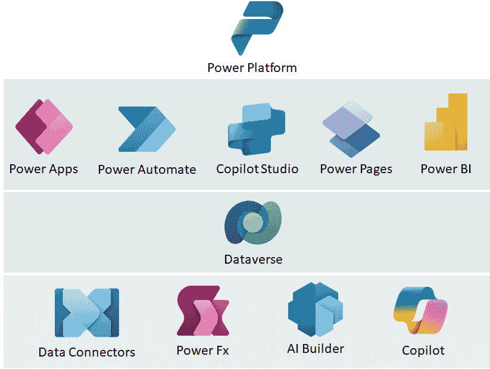

图 2.1 – Power Platform 的五大主要产品和支持服务

拥有多样化的 LCNC 产品组合使用户能够以灵活且模块化的方式构建业务解决方案。 这些工具不仅与其他 Microsoft 产品本地集成，还使用户能够更 高效地构建解决方案。

通过此功能，用户还可以灵活地仅为所使用的产品购买许可证，因为 Microsoft Power Platform 的服务是单独授权的。 许可证可以是独立的，例如 Power Apps Premium 许可证，也可以与 其他许可证一起包含。

作为一个包含许可的示例，一些微软产品（例如 Microsoft 365 或 Dynamics 365）使你可以使用选定的微软 Power Platform 服务的有限功能。此类封装许可类型被称为**“种子许可”**。例如，Microsoft 365 E3 或 E5 的许可证包括 Power Apps 和 Power Automate 的有限功能集。要启用 Power Apps 和 Power Automate 的所有 Premium 功能，需购买并使用单独的 Premium 许可证。通常，这些许可证使用按用户订阅的模式；不过，也有其他变体。

重要提示

尽管本书不会深入讨论许可细节，但我们鼓励大家浏览微软网站上提供的各种许可模型，因为微软 Power Platform 的许可会定期更新，这使得它成为一个高度动态的话题。管理员和 DevOps 工程师应将定期检查变更作为其职责的重要组成部分。保持信息更新有助于在 Power Platform 生态系统中确保有效的管理和合规性。

有关 Power Platform 功能和定价的更多信息，请参阅 Power Platform 许可指南，您可以在以下文档页面访问：[`learn.microsoft.com/en-us/power-platform/admin/pricing-billing-skus`](https://learn.microsoft.com/en-us/power-platform/admin/pricing-billing-skus)。

2016 年 10 月，微软发布了普遍可用的 Power Apps 和 Flow（现称为 Power Automate），今天，我们拥有一个非常成熟的平台，连续五年被 Gartner 评为“企业 LC 应用平台”领域的领导者，在 Gartner Magic Quadrant TM 中名列前茅。

虽然该平台主要面向市民开发者，但它使你能够构建集成场景，并且具有可扩展性，甚至适用于专业开发者（例如，通过在 Azure API 管理中发布的自定义 API 构建自定义连接器，使用 Power Apps 组件框架开发代码控件，以及使用**AI Builder**发布自定义模型）。

接下来，让我们来看看微软 Power Platform 的**家庭成员**。

### Power Apps

Power Apps 是一款 允许用户创建和运行定制业务应用程序的产品。 应用程序可以通过使用 Visual Maker Studio 和拖放功能，无需大量编码就能快速开发。 专业开发者和应用程序开发者可以创建连接到各种数据源，并通过连接器与许多现有应用程序和服务集成的应用程序。 应用程序可以作为画布应用程序开发，重点是设计和定制界面，或者作为模型驱动的应用程序开发，重点是数据模型。 画布应用程序的一个有趣方面是，这种类型的应用程序可以打包成原生的移动应用程序包，类似于定制的 Android 和 iOS 应用程序。 然后，这些应用程序可以通过 Google Play 商店、Apple Business Manager、Microsoft Intune 和 Microsoft App Center 分发给移动终端用户。

### Power Automate

Power Automate 是一款 基于云的工作流服务，帮助客户解决超自动化问题。 它不仅限于构建自动化简单的日常重复任务的工作流，还可以自动化跨各种服务和系统的复杂业务流程。 如果你已经使用 **应用程序接口** (**API**)来访问一些后台服务，那么 **数字化流程自动化** (**DPA**)可以通过 Power Automate 来实现。 如果你想要 自动化在桌面应用程序中执行的重复任务，或者通过 RPA 构建网页自动化，Power Automate 可以为你提供 支持。

### Copilot Studio

Copilot Studio 是一个 构建独立助手的平台。 它基于 Power Virtual Agents 平台构建，该平台用于构建智能虚拟助手和聊天机器人。 Copilot Studio 使我们能够通过构建控制对话流程或使其更具动态性的主题来创建自定义助手，借助 **大型语言模型** (**LLMs**)，例如 GPT。 自定义助手帮助用户执行任务或回答问题。 它们可以通过连接器和插件与组织数据相连接，组织数据作为知识库，通过后端系统来解决复杂任务。 助手可以通过不同的渠道发布，如网站、自定义的移动/网页应用程序，或任何其他用于通信的服务，如 Facebook、Slack、 或 Twilio。

### Power Pages

Power Pages 是一个 企业级、可扩展且安全的基于云的服务，用于构建丰富且数据驱动的网站。 它广泛依赖于 Dataverse 来存储配置和数据，这些数据会在网站上展示。 尽管它是 Power Platform 家族中最年轻的成员之一，但 Power Pages 在发展成今天所知的产品过程中，经历了相当长的历程。 它始于微软收购 Adxstudio Inc.，然后变成了 Power Apps Portals，而今天，我们 拥有了 Power Pages。 它的核心保持不变——一个允许用户创建、托管和管理现代且具有视觉吸引力的网站的平台，以数据为 核心。

### Power BI

而 Power Platform 家族中的其他产品旨在自动化业务流程和构建业务应用程序，Power BI 是一套工具，使我们能够深入了解数据并构建智能报告，帮助我们快速提取数据中的关键信息。 仪表板和报告可以遵循与业务应用开发相同的 LCNC 方法进行构建。 通过使用拖放体验，我们可以连接各种数据源，构建表示 提取数据的图表和方块。

### Power Platform 的扩展生态系统

除了这五个核心产品外，Power Platform 产品还由其他服务和功能支持，如 Dataverse、Power Fx、连接器、Copilots 和 AI Builder。 Power Platform 中的 Copilots 和 AI Builder 将在本书的最后一章深入讲解，但我们将在 这一章讨论其余内容。

### Dataverse

Dataverse 是一个 安全且可扩展的云数据存储，广泛应用于 Dynamics 365 和 Power Platform。 它允许我们创建将被业务应用程序使用的新表，并对其应用严格的安全模型和治理策略，如权限、基于列的安全性和审计能力。 它还允许我们在 Dataverse 中创建视图和表单，随后可以在数据模型上快速构建应用程序。 Dataverse 还允许我们构建定义数据生命周期流转和适用业务规则的业务流程流。 这些规则适用于表格。

### Power Fx

Power Fx 是一个 通用的 LC 语言，广泛应用于 Microsoft Power Platform。 最初在 Power Apps 中出现的 Power Fx，现在已扩展到其他 Power Platform 服务，为构建公式提供了统一的体验。 Power Fx 被用于在业务解决方案中构建自定义逻辑。 凭借类似电子表格的公式和与 Microsoft Excel 的相似性，它促进了快速的采用。 Power Fx 是开源的，这 使得它具有更高的透明度并且 支持社区协作。

### 连接器

连接器 在 Microsoft Power Platform 生态系统中发挥着至关重要的作用。 它们充当 Power Platform 与外部服务或数据源之间的集成桥梁。 每个连接器都有一组自己的触发器和操作。 从许可角度来看，它们被分为标准连接器和高级连接器，但从技术角度来看，它们被分为预构建连接器（连接到第一方或第三方服务）和自定义连接器。 我们将在 后续章节中深入探讨连接器。

## 设置我们的第一个环境

现在我们对 Power Platform 家族中的产品有了更好的了解，接下来我们来创建一个环境，用于测试 这些服务。

如前一部分简要提到的，Power Platform 产品是单独授权的，因此在创建试用环境时需要特别注意。 我们建议首先创建一个 **Microsoft 365 E3** 或 **E5** 试用环境。 这 将使我们能够测试与 Microsoft 365 或 Office 365 服务的集成功能——例如，在 Power Automate 中创建一个工作流，使用 Office 365 中的 Outlook 发送电子邮件。 另外，可以使用 OneDrive for Business/SharePoint Online 文档库来存储和管理一些 Excel 文件，然后这些文件在 Power Apps 中使用，数据通过表单 和图库进行可视化展示。

### 获取 Microsoft 365 E3 或 E5 试用账户

通过搜索 **Microsoft 365** (**M365**) 网站上的 可用计划和 定价，我们可以找到多个带有一个月免费试用的 M365 计划。 此类计划的示例如下： [https://www.microsoft.com/en-us/microsoft-365/enterprise/office-365-e3](https://www.microsoft.com/en-us/microsoft-365/enterprise/office-365-e3)。由于链接可能会发生变化，我们建议浏览 M365 网站上的可选项，并在 **立即购买** 按钮下，会有一个 **免费试用** 选项，可以启用免费试用。 然后，向导会引导我们完成试用许可证的配置过程。 首先，我们需要 提供我们的电子邮件地址和 登录 信息。

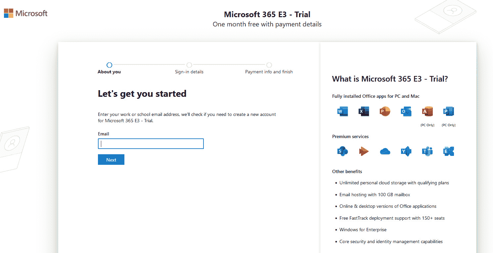

图 2.2 – 一个 Microsoft 365 E3 试用账户

请记住，我们可能需要添加信用卡，仅用于验证。 我们建议在租户中至少保持添加的支付方式，直到完成所有所需试用许可证的配置，因为 Power Platform 许可证也需要支付方式进行验证。 一旦我们完成了将选择的试用许可证添加到租户，或者我们想要移除支付方式以避免任何可能的许可证延期和相关费用时，我们可以在 **Microsoft 365 管理中心** ([https://admin.microsoft.com](https://admin.microsoft.com)) 使用全局管理员帐户移除支付方式。 如果我们后来决定 继续使用此试用帐户并将其转换为更长期的测试环境或生产环境，我们可以向帐户中添加支付方式，并继续在 此租户中运行服务。

我们可以通过登录到 Microsoft 365 管理中心，进入 **帐单** | **支付方式** 部分，添加新支付方式，或者选择现有的支付方式并 将其移除。

现在我们已经创建了一个 Microsoft 365/Office 365 租户，接下来让我们将 Power Platform 产品添加到 租户中。

### Power Platform 试用许可证

由于 Power Platform 产品 是单独授权的，因此每个我们即将测试的产品都需要单独获得试用许可证。 不过，如果我们打算将大部分时间投入到 Power Apps 和 Power Automate 中，另有一种选择——Power Apps 开发者计划。 让我们仔细看看 这两种选择。

#### 单独的产品试用许可证

在 Microsoft 365 管理中心停留，前往 **帐单** | **购买服务** 并寻找你想要添加的 Power Platform 产品许可证。 它们中的大多数都有可以添加到租户的免费试用。 我们可以使用右侧的搜索功能 **购买服务** 部分来更快速地找到产品，例如 **Power Automate Premium**，如下所示的 截图所示。

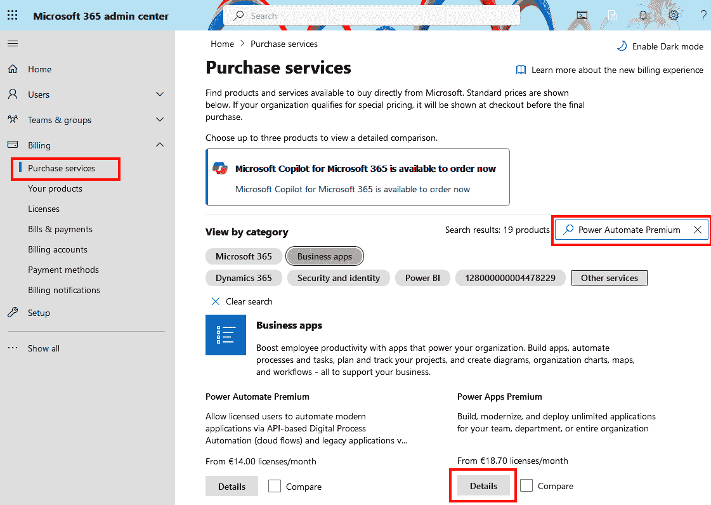

图 2.3 – 购买服务

接下来，点击所选产品许可证的 **详细信息** 按钮，这将打开一个 **产品详情** 页面。 如果所选产品允许添加试用许可证，则会在 **开始免费试用** 选项旁边显示 **购买** 按钮。 选择后，您将开始将许可证添加到租户的过程。 如果您在前一步中已将信用卡作为 Microsoft 365 租户的支付方式，您将能够通过点击 **立即试用** 按钮在 **结账** 屏幕上添加试用许可证。 我们可以采用相同的方法将任何其他 Power Platform 产品添加到 租户中。

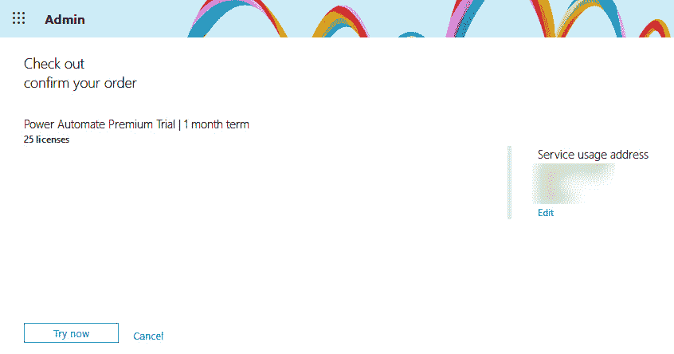

图 2.4 – 确认试用许可证的订单

试用许可证通常以 25 个用户许可证为一组，非常适合在业务用户和开发人员之间进行内部分发，以测试产品功能。 试用许可证的有效期为 30 天。 试用许可证到期后，我们可以购买所需的计划以继续使用 该产品。

某些产品也 附带附加组件，例如 Power Automate 无人值守 RPA 附加组件。 这些附加组件通常依赖于独立许可证，通常称为合格的基础许可证。 一旦我们为租户添加了所需的合格基础许可证，例如 Power Automate Premium 试用版，就可以添加选择的附加组件——在这种情况下，是 Power Automate 无人值守 RPA 附加组件试用版。 我们可以在 **计费** | **购买服务** 部分搜索附加组件，正如我们之前所做的，或者在 **附加组件** 部分找到它们，位于 **产品详情** 屏幕中，如下图所示：

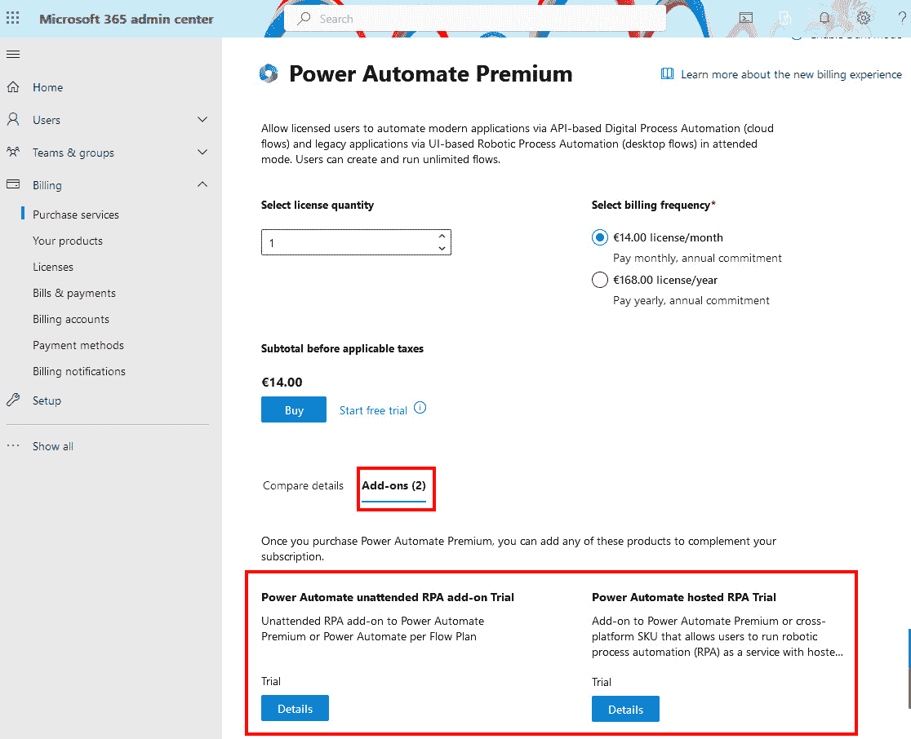

图 2.5 – 添加附加组件试用许可证

#### Power Apps 开发者计划

Power Apps 开发者计划 是一个免费的开发环境，可用于开发和测试业务应用程序。 它允许您使用 Power Apps 和 Power Automate 的高级功能，包括高级连接器和 Dataverse。 任何拥有 Microsoft 工作或学校帐户并连接到 Microsoft Entra ID 的用户，都可以注册此开发者计划。 我们可以通过以下网站获取 Power Apps 开发者计划 ：  [https://powerapps.microsoft.com/en-us/developerplan/](https://powerapps.microsoft.com/en-us/developerplan/)。如果开发者拥有 Visual Studio 订阅，则可以在 Visual Studio 订阅的 Dev Essentials 网站上激活 Power Apps 开发者计划 （[https://my.visualstudio.com/benefits](https://my.visualstudio.com/benefits)）：

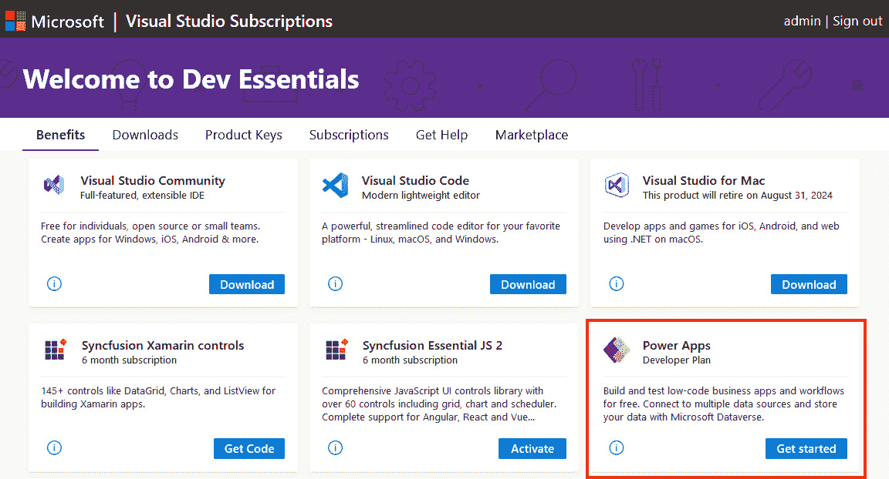

图 2.6 – 通过 Visual Studio 订阅启用 Power Apps 开发者计划

每个用户最多可以拥有 三个 Power Platform 租户中的开发环境。 开发者环境可以由管理员为用户创建，也可以由用户自行创建；但是，管理员也可以阻止用户创建此类环境 的可能性。

与期限为 30 天的试用许可证相比，Power Apps 开发者计划不会过期，并且只要该计划有任何活动，就会保持有效。 如果超过 90 天没有活动，计划将被删除。 另一个重要说明是，试用许可证带来了付费许可证的所有功能，而 Power Apps 开发者计划则不包含所有功能/能力。 此外，开发者环境不能转换为生产环境，尽管试用环境可以转换为生产环境。 开发者环境在 Dataverse 容量上也有限制，最大数据库大小为 2 GB。

开发者计划是一个完美的选择，可以在独立的开发环境中测试和构建 Power Platform 中的业务解决方案。 一旦我们对解决方案感到满意，就可以遵循 **持续集成**/**持续部署** (**CI**/**CD**) 管道 将解决方案部署到测试和 生产环境中。

# Power Platform 管理

本节探讨了 Power Platform 管理员可以使用哪些工具来配置 Power Platform 环境、管理 Power Platform 产品功能，以及如何了解不同环境中 Power Platform 产品的使用情况。 不同的环境。

除了 Microsoft 365 管理中心，管理员还应该知道另一个管理中心，帮助他们管理 Power Platform 租户。

**Power Platform 管理中心** 是一个统一平台，用于与 Power Platform 相关的管理任务。 它可以通过 [https://admin.powerplatform.microsoft.com/](https://admin.powerplatform.microsoft.com/) 访问，并允许管理员执行与 Power Platform 相关的大多数操作，例如一般环境管理、产品功能管理，以及获取关于 产品使用情况的分析洞察。

重要说明

需要注意 Power BI 有一个单独的管理中心，叫做 Power BI 管理中心（可通过 [https://app.powerbi.com/admin-portal](https://app.powerbi.com/admin-portal)）访问，允许 Power BI 管理员管理其 Power BI 实例。 Power BI 管理中心不在 本书的讨论范围内。

Power Platform 为管理员提供了三种交互和管理方式——通过 Power Platform 管理中心、PowerShell cmdlet 和连接器——Power Platform 管理员和 Power Platform 开发者。

## Power Platform 管理中心

熟悉 Microsoft 365 管理中心的用户会发现这个管理中心相似且易于使用。 使用 Power Platform 管理中心，管理员可以管理环境、查看关键指标和使用情况、理解并采取有关许可证和容量利用的措施等等。 这些控制项被整齐地分组，放置在管理中心左侧的导航菜单栏中，提供简洁的 用户体验。

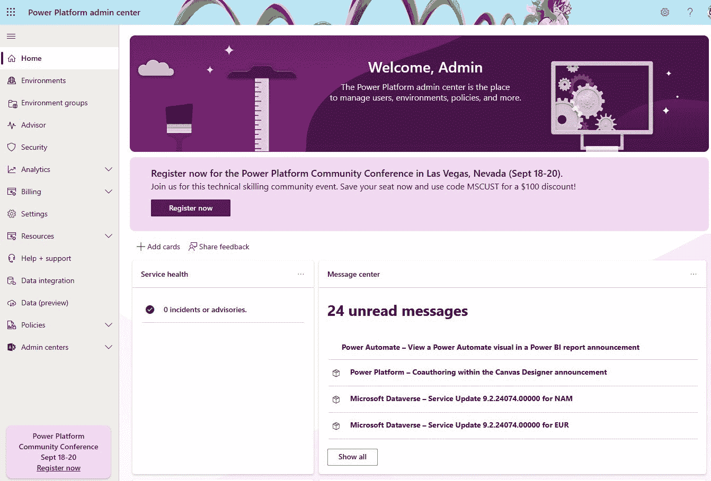

图 2.7 – Power Platform 管理中心

一个常被忽视的功能是 **帮助 + 支持** 功能，允许管理员在需要 Microsoft 支持时提交支持请求。 在这里，管理员还可以查看之前提交的支持请求、其状态以及 沟通历史。

在 **帮助 + 支持** 中有一个方便的功能，名为 **已知问题**，该功能通知管理员有关 Dynamics 365 和 Power Platform 产品当前已知的活动问题。 它解释了每个已知问题，并提供了一个解决方法。 这是一个方便的方式，可以主动向管理员告知平台已知问题的状态。 除此之外，还有 Power Platform 的服务健康状况。 有关此信息可以在 Power Platform 管理中心的主页上找到，在那里我们可以找到一个 **服务健康** 仪表板，包含关于 Power Platform 服务的任何事件或通知的信息。

**消息中心** 提供有关之前和即将进行的服务更新的信息，说明它们可能如何影响用户，以及如何做好准备以尽量减少潜在影响。 有关服务健康和即将进行的计划变更的更多信息，可以在 Microsoft 365 管理中心找到。

Power Platform 管理中心还为管理员提供了设置各种 **策略**的可能性，从 **数据丢失防护** （**DLP**）策略 到 计费策略。

租户设置可以通过进入 Power Platform **管理中心** | **设置**来访问。这些是适用于整个 Power Platform 组织的租户级设置。 在这里，您可以配置诸如租户级分析、未分配的 AI Builder 信用使用情况和环境分配等设置。 我们将在本书后续章节中详细介绍这些设置，当我们探讨 IT 团队与 DevOps 原则对齐的重要性时。 了解哪些租户级设置可用非常重要，因为它们对用户体验有很大影响。 IT 管理员应当检查这些设置，理解它们，并为 他们的组织进行正确配置。

在 租户级别的设置旁边，我们有环境设置，可以通过访问 Power Platform 管理中心 | **环境** | 选择一个环境 | **设置**来访问。 **设置** 按钮会在选择环境后出现在上方工具集选项中。 此 **设置** 部分为您提供环境设置的访问权限，包括从 **产品** 和 **功能** 配置到 **审计和日志** 管理，适用于所选环境：

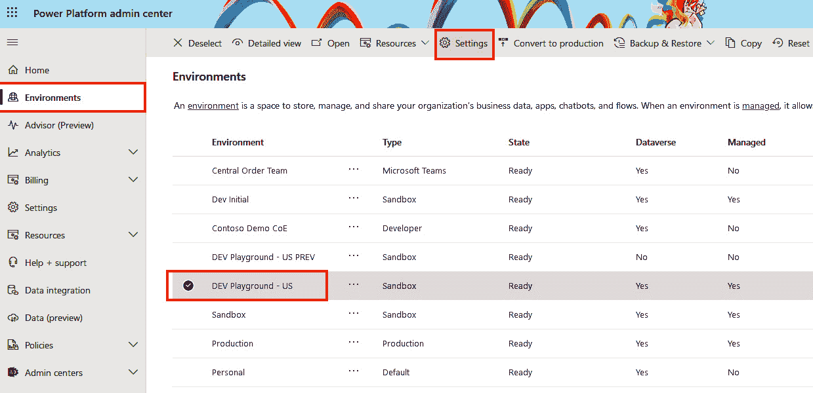

图 2.8 – 访问环境设置

**功能** 配置允许我们启用或禁用 Power Platform 中通常可用的功能或预览功能。 例如，随着生成性人工智能的引入，Copilot 和其他与 AI 相关的功能现在可以提供给 Power Platform 用户，但前提是这些功能在 **功能** 配置中已启用。 一些新功能默认启用，管理员可以在此处禁用它们。 我们建议访问 **消息中心** （可以在 Power Platform 管理中心的主页上找到），阅读微软 Power Platform 博客上的文章，或者查看 Dynamics 365 和 Microsoft Power Platform 发布计划，以 了解 Microsoft 中的新版本和即将发布的功能 Power Platform：

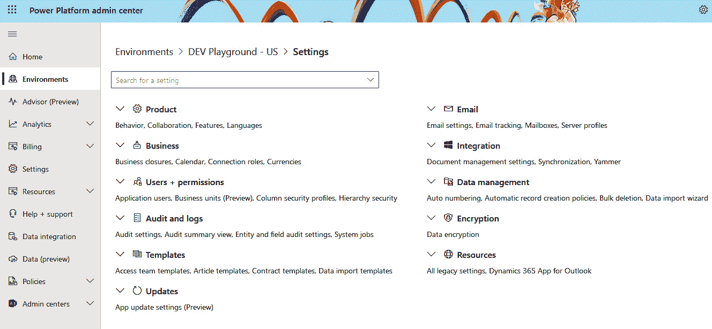

图 2.9 – 环境设置

## Power Platform 管理和自动化，适用于管理员、开发者和开发人员

从管理员中心的图形用户界面切换到 **命令行界面** （**CLI**），我们可以看到 Power Platform 提供了一套命令工具，用于自动化管理任务。 根据我们是否来自负责管理环境的 IT 运维团队，是否是需要管理应用的应用开发者，或者是旨在打包解决方案并自动化业务解决方案部署的专业开发者，每个人都会使用不同的 CLI 工具。

### 开发人员的 Power Platform CLI

**Power Platform CLI** (**PAC CLI**) 是管理 Power Platform 的首选和最推荐的 CLI 工具。 它面向开发者和管理员，提供一套命令，支持与解决方案打包、环境生命周期、代码组件、Dataverse 环境等相关的各种操作。 管理员将会发现许多便捷的命令，可以简化管理任务。 PAC CLI 支持内环和外环开发，这意味着在内环开发中，开发人员使用该 CLI 来处理解决方案，而在外环中，开发人员使用 CLI 工具确保所生产的解决方案能够部署到 其他环境中，遵循 **应用生命周期管理** (**ALM**) 策略。

Power Platform CLI 的安装可以在 Windows、macOS 和 Linux 设备上进行。 可以通过 一个 `.MSI` 安装包进行安装。

首先，针对 VS， **Power Platform 工具** 可以 在 VS Code 内的 **扩展** 部分找到，或者在 VS Code 的 **市场**中找到。你可以在 VS Code 内使用搜索框查找该扩展，然后点击 **安装** 按钮进行安装。 市场也可以采用类似的方法。 请访问 [https://marketplace.visualstudio.com/vscode](https://marketplace.visualstudio.com/vscode) 进入 VS Code 市场，使用搜索框查找 **Power Platform 工具** 扩展，然后点击 **安装**。该扩展由微软发布（我们可以看到已验证的发布者标记），并且是免费的。 安装完成后，VS Code 将激活该扩展，并在主侧边栏中显示。 卸载扩展在 VS Code 中进行，方法与安装类似，只需点击 **卸载** 按钮：

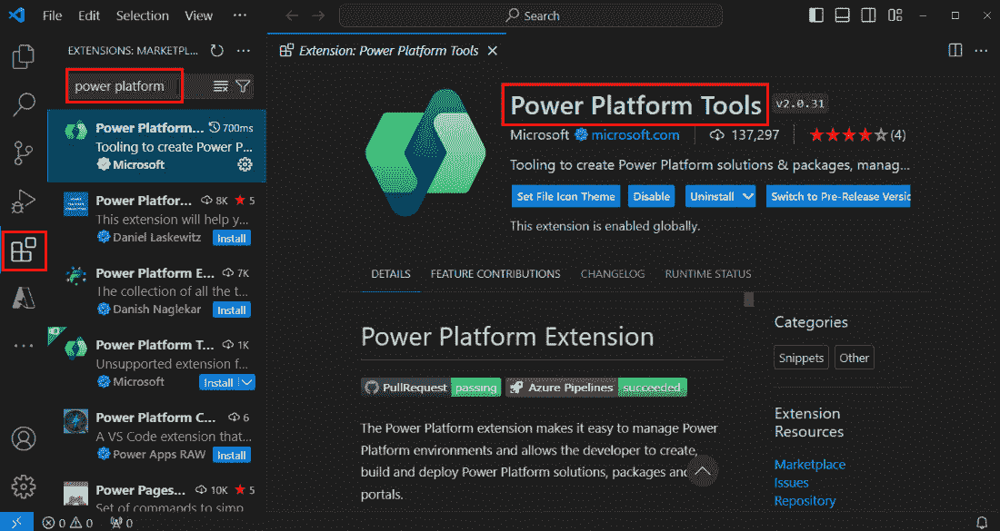

图 2.10 – VS Code 的扩展

接下来，我们还可以使用 PAC CLI，通过 使用 **.NET 工具** (**dotnet 工具**)。 在这种情况下，工作站上需要安装 .NET（目前推荐使用 .NET 6.0 版本）。 然后可以在终端或命令提示符下使用以下命令进行安装：

```
 dotnet tool install --global Microsoft.PowerApps.CLI.Tool
```

同样的方法适用于 macOS 和 Linux。

命令目前分为 23 个组。 每个组都有其特定的用途，例如 `pac admin` 用于操作 Power Platform 管理员帐户， `pac data` 用于操作 Dataverse 组织， `pac pcf` 用于操作 Power Apps 组件框架项目， `pac connector` 用于连接器。

在我们开始使用这些命令之前，我们需要在计划运行命令的工作站上创建一个身份验证配置文件。 可以使用 `pac auth create` 命令创建身份验证配置文件，系统会打开一个提示框 用于输入凭证：

```
 # more specific auth profile creation with environment info
pac auth create --environment xxxxxxxx-xxxx-xxxx-xxxx-xxxxxxxxxxxx --name DevInitialAuth
```

为了列出选定设备上的所有身份验证配置文件，我们可以运行 以下命令：

```
 pac auth list
```

这将返回关于工作站上所有身份验证配置文件的信息。 我们可以通过提供授权配置文件的索引或名称，在它们之间来回切换： 授权配置文件：

```
 pac auth select --name DevInitialAuth
```

现在我们已经有了身份验证配置文件，可以运行 `pac` 命令来执行所需的任务。 为了了解 PAC CLI 中有哪些可用的命令，我们可以运行 以下命令：

```
 pac help
```

为了获得某个特定命令的详细帮助，我们只需在每个命令后添加 `help` 即可： 我们想要使用的每个命令：

```
 pac admin help
pac admin list help
```

命令中的帮助开关 返回一个使用示例，非常方便，特别是当我们第一次运行命令时。 以下是一个 `admin` 命令的示例，用于列出我们在连接的 Power Platform 组织中的所有沙盒类型环境。

```
 pac admin list –-type Sandbox
```

在接下来的章节中，我们还将使用 PAC CLI，并提供更多具体的示例。

### 管理员使用的 PowerShell

在PAC CLI旁边，我们有适用于管理员的 PowerShell 命令，模块名称为`Microsoft.PowerApps.Administration.PowerShell`，它允许我们执行一系列操作来管理 Power Platform 租户、环境以及 Power Apps 和 Power Automate 产品。

管理员的 PowerShell 模块可以通过以管理员身份运行 PowerShell 并安装必要的模块来进行安装，使用以下命令。 作为前提条件，我们应使用 Windows PowerShell 版本 5.x，并且在安装过程中，设备上应已安装 NuGet 提供程序。 如果 NuGet 提供程序尚未安装，安装过程会要求我们先安装它，然后再继续安装 PowerShell 管理员模块。 使用 PowerShell 命令的管理员需要具备以下角色之一才能操作 PowerShell cmdlet – Power Platform Administrator、Dynamics 365 Service Administrator 和 Microsoft Entra ID Global Administrator：

```
 Install-Module -Name Microsoft.PowerApps.Administration.PowerShell
```

另外，如果我们没有管理员权限，可以将作用域设置为当前用户， 针对选定设备：

```
 Install-Module -Name Microsoft.PowerApps.Administration.PowerShell -Scope CurrentUser
```

我们可能会被要求更改`InstallationPolicy`，确认从不受信任的存储库安装，并然后继续。

更新模块可以通过以下命令完成：

```
 Update-Module -Name "Microsoft.PowerApps.Administration.PowerShell"
```

一旦 cmdlets 安装完成，并且在我们开始执行管理 Power Platform 的命令之前，我们需要获取一个授权令牌，该令牌将与我们执行的 Power Platform PowerShell 命令相关联。 要获取令牌，我们需要调用`Add-PowerAppsAccount`，该命令将提供一种交互式方式，通过我们的管理员帐户登录。 如果我们的帐户 受到 `USGov` 或 `Preview`保护，我们应向 `Add-PowerAppsAccount` 命令添加 `-Endpoint` 参数，并指定 所需的端点：

```
 $password = ConvertTo-SecureString "securePassword" -AsPlainText -Force
Add-PowerAppsAccount -Username adminuser@domain.com -Password $password
```

一旦我们提供了凭证并获得了授权令牌，就可以继续运行管理员命令。 如果我们需要支持来查看可用的命令以及如何使用它们，我们可以使用一个简单的命令，`Get-Help`，后面跟上 cmdlet 名称，如下所示：

```
 Get-Help Get-AdminPowerApp -Detailed
```

`Get-Help`将下载模块的最新帮助文件，并为我们提供反馈。

重要提示

查找任务的正确命令及如何编写命令的示例，可以通过`Get-Help`来完成。然而，随着技术的发展，借助生成式 AI，我们现在可以更快地获得命令的答案和支持。现在，我们可以通过自然语言向像 Microsoft Copilot 这样的工具寻求帮助，完成某项任务。

所有管理员可用命令的列表可以在[这里找到](https://learn.microsoft.com/en-us/power-platform/admin/powerapps-powershell#power-apps-cmdlets-for-administrators)。

### PowerShell 用于应用程序开发者

应用程序开发者有自己的模块，可以让他们管理 Power Apps 应用、Power Automate 流程，以及在流、应用和连接器之间定义的连接器和权限。

安装过程与管理员模块相同——通过以管理员身份运行 PowerShell 或定义`-Scope`为`CurrentUser`。首先，我们需要安装该模块：

```
 Install-Module -Name Microsoft.PowerApps.PowerShell -AllowClobber
```

我们可能会被要求更改`InstallationPolicy`。确认从不受信的存储库安装并继续。

管理员的处理流程与之前相同——在运行任何命令之前，我们需要获取一个授权令牌。此操作通过`Add-PowerAppsAccount`命令完成，支持交互式身份验证模式；它还可以与 MFA 支持的帐户一起使用：

```
 Update-Module -Name "Microsoft.PowerApps.PowerShell"
```

所有可用的制造商命令列表可以在[这里找到](https://learn.microsoft.com/en-us/power-platform/admin/powerapps-powershell#cmdlet-list---maker-cmdlets)。

## 管理员和管理连接器

最后但同样重要的是，使用管理员和管理连接器的选项，它们在 Power Platform 中与其他 1,000 多个可用连接器一起随时可用。

连接器被分为五个不同的组：

+   **Power Platform for Admins**：使 管理员能够管理环境生命周期，管理 DLP 策略，并在 指定环境中创建 Dataverse 数据库。

+   **Power Apps for Admins**：使 管理员能够查看和设置跨 Power App 应用程序、连接器，以及连接的各种权限和所有者。

+   **Power Apps for Makers**：允许 应用程序开发者发布他们的应用程序，并查看和管理他们的应用程序、连接器，以及连接。

+   **Power Automate for Admins**：使 管理员能够管理 Power Automate 流程状态，通过停止、运行或删除 流程。

+   **Power Automate Management**：允许 应用程序开发者查看和编辑他们在特定环境中有权限的流程。 此连接器还包含一些特定于管理员的操作，可以用来修改流程所有者或恢复 已删除的流程。

所有这些连接器都是标准类型的连接器，并且可以在所有地区的 Power Apps 和 Power Automate 中使用。 Power Platform for Admins **版本 2** (**V2**) 在公共预览中可用，您可以在 Azure Logic Apps 中使用相同的连接器。 目前它还不完全与 V1 兼容，但连接器会随着时间的推移不断更新，因此我们可以预期，在某个时刻，V2 会替代 V1。 通过使用连接器中可用的操作，管理员可以自动化重复的管理任务。 例如，管理员可以使用 Power Automate 创建自动化工作流，自动化创建 Power Platform 环境的过程，同时获得 Power Automate 产品的所有好处，比如能够查看流程 运行历史的输出。

# 治理、合规性和数据隐私

本节介绍了 Microsoft Power Platform 如何符合许多法规和标准，以及它如何为客户提供一套工具，以使其应用程序符合所需的法规。 它解释了 Microsoft Power Platform 如何遵循与其他 Microsoft 产品和服务相同的方法，保持合规，并遵循 Microsoft 对 客户的承诺。

微软承诺对其客户透明，展示用于确保客户数据在微软产品线中安全、合规和隐私保护的政策、操作实践和技术。 微软声明数据仍由客户掌控，并且对数据存储的位置保持透明。 微软还解释了数据在静态存储时如何保护，以及如何在传输过程中进行加密，并且最终通过其服务和部门来保护客户数据。 这样的承诺非常大胆，并为客户提供了信任感。 这些声明支持微软的 **云服务** ，这些服务建立在四个基本原则之上： 安全性、隐私与控制、合规性和透明度。 安全性 专注于保护客户免受外部网络威胁。 隐私与控制 使客户能够控制对其数据的访问。 合规性 确保微软的服务符合全球标准。 透明度则是为客户提供政策和程序的洞察。

即使微软为其客户提供了所有承诺，我们仍然需要理解，云部署遵循共享责任模型。 这意味着， 根据组织使用的云服务模型类型，无论是 基础设施即服务（ **IaaS** ）、平台即服务（ **PaaS** ）还是 SaaS，不同的责任层次分别由云服务提供商和其客户承担。

Power Platform 是一个企业级 SaaS 平台，这意味着管理物理数据中心、物理网络、主机、操作系统和网络控制是微软的责任领域。 然而，客户使用的 Power Platform 产品属于共享责任模型。 在共享责任模型下，组织必须记住，它们有责任确保其最终产品的安全性，并遵守相关的法规。 需要遵守的规定。

共享责任模型的一个好例子是微软如何持续监控威胁态势，并以一种保护 Power Platform 免受 OWASP 前十名风险的方式构建 Power Platform。 OWASP 前十名 是针对有兴趣了解 web 应用安全的开发人员的标准意识文档。 微软在 Power Platform 中实施控制措施来防范这些风险，同时也为客户提供了可以在 Power Platform 或支持的服务中使用的指导和控制措施，如 Entra ID，以进一步保护他们的 Power Platform 应用免受威胁，例如破坏性访问控制、加密失败和 安全配置错误。

治理和合规性也与数据驻留领域相关。 让我们来看看微软如何处理 客户数据。

## 数据驻留

与其他微软服务一样，Power 平台服务托管在微软遍布全球的数据中心，并通过微软的网络基础设施进行连接，以减少网络延迟并确保数据传输的安全性。 Power Platform 客户可以在全球不同地理位置（区域）创建环境，从而将服务和数据更靠近最终用户。 这种方式对拥有全球分支机构的公司非常便利。 世界各地的公司都可以受益。

客户可以在全球各地的数据中心区域创建环境，如美国、欧洲、亚洲、澳大利亚、阿联酋、英国、日本、法国、 和瑞士。

有时，环境的位置在 Power Platform 中某些产品功能的可用性方面可能起到重要作用。 尽管功能会逐步在所有数据中心位置启用，但评估拥有一个备用测试环境的选项以验证 预览功能始终是明智之举。

对于在 以下地区运营的组织 而言， **欧盟** （**EU**），Power Platform 支持 欧盟数据边界 **（EU Data Boundary）**，这是一个地理上定义的边界，帮助客户满足其数据驻留要求，将 数据驻留限制在仅限欧盟和 **欧洲自由贸易协会** （**EFTA**）国家。

实践中数据驻留要求的一个好例子是 **生成性人工智能** （**GenAI**）功能 在 Microsoft Power Platform 中的应用。 Power Platform 利用 Azure OpenAI 服务来实现其 GenAI 功能，但也可能发生 Azure OpenAI 服务并不位于与 Power Platform 托管的相同数据中心区域。 组织可以选择允许或禁止数据在区域之间的流动。 这意味着，如果特定功能在某个环境区域没有启用，通过允许数据流动，数据可能会流向启用了某项服务的区域。

观察托管在欧洲地区的环境，一旦启用数据移动功能，并使用 GenAI 能力，数据交易可以转移到瑞典或瑞士地区，这些地区已启用相应的服务。 这两个国家都位于欧盟数据边界内。 其他国家/地区可能有其他与 GenAI 功能相关的地理区域对。

与欧盟一起，另一项保护个人及其数据的法规是**通用数据保护条例** （**GDPR**）。GDPR 为那些向欧盟居民提供商品和服务或收集并分析欧盟居民数据的组织引入了新规则，无论您或您的企业位于何处。 Microsoft Power Platform 为组织提供了一组服务和 功能，这些服务和功能可在接收到 **数据主体权利** （**DSR**）请求后使用。 **DSR 请求** 是数据主体（个人）向数据控制者（提供服务的组织）提出的正式请求，要求数据控制者处理存储在其系统中的个人数据。 数据主体有权要求删除其数据，限制数据的处理，获取其在数据控制者系统中的数据副本等。 这意味着 Power Platform 必须为管理员提供基于 DSR 请求的能力，以查找并处理数据。

在 Power Apps 中，管理员可以使用 Power Platform 管理中心或上一节中的 CLI 命令集来查找并导出用户的数据。 例如，在 Power Apps 中，这些数据可能包括用户有权使用的应用列表、用户创建的环境、用户创建的连接或作为共享连接使用的连接，等等。

重要提示

关于欧盟数据边界和 GDPR 以及如何使用 Power Platform 中的功能响应 DSR 请求，还有很多内容可以写，我们在这里无法详细讨论。 要了解更多信息，我们建议访问 Microsoft Trust Center（[https://www.microsoft.com/en-us/trust-center/product-overview](https://www.microsoft.com/en-us/trust-center/product-overview)），以及在 Microsoft Docs 中响应 DSR 请求（[https://learn.microsoft.com/en-us/power-platform/admin/powerapps-privacy-dsr-guide](https://learn.microsoft.com/en-us/power-platform/admin/powerapps-privacy-dsr-guide)）。

## 合规性要求

公司必须满足其商业解决方案的监管合规标准。 这就是为什么微软确保其产品和服务符合许多全球、地区、行业或美国政府特定的合规性规定。 因此，Power Platform 和其他微软在线服务实施了一个安全框架，遵循行业最佳实践，并遵守各种全球 标准，例如 **国际标准化组织（ISO）** 的标准，如 ISO 27000 系列标准（ISO 27001，ISO 27017，ISO 27018 等）和 **系统和组织控制（SOC）** ，例如 SOC 1 和 2；行业特定的 标准，如 HIPAA 和 PCI-DSS；或者与特定国家或地区相关的区域性标准，如适用于欧盟的 GDPR。

Power Platform 和其他微软在线服务会定期接受合格的第三方认证评估员的审计，以确保符合全球标准 和规定。

除了全球标准和法规外，微软通过其产品条款，之前发布了一份单独的文档，名为**《在线服务条款》**（**OST**），该文档解释了微软对客户的合同承诺，涵盖了使用微软产品的不同方面，包括关于客户数据处理和安全的隐私与安全条款及其他数据类型的条款。

任何人都可以使用微软信任中心，了解微软的产品及其如何遵循不同的安全、隐私和合规性标准及法规。

使用微软服务信任门户，客户可以调查与数据安全和合规性相关的各种文档，例如针对特定标准或法规的合规证明，或其他文档，如审核检查或对 Power Platform 产品的渗透测试。

## 数据保护

微软 Power Platform 具备安全策略和流程，帮助保护客户数据免受损坏、泄露和丢失的风险。这包括帮助保护客户数据免受数据泄露和数据丢失事件的机制。微软在多个层面应用安全机制并保护数据，从数据中心的物理安全到网络安全，保护静态数据和传输中的数据，并允许客户设置嵌入产品中的额外安全控制，从而进一步提升安全级别。

在微软在线服务的核心部分，包括 Power Platform 服务中，租户隔离至关重要，这就是为什么微软采取了帮助正确**隔离租户**的机制。微软 Entra ID 在此过程中发挥了重要作用，帮助隔离客户的租户。一旦用户完成身份验证，他们只能访问自己租户环境内的数据。

然后，用户**许可证验证**也随之而来。用户可以使用他们已获得许可证的 Power Platform 产品和组件。没有许可证，用户将无法访问并操作服务。

Power Platform 产品的数据存储的主要服务是 Microsoft Dataverse。 作为 Power Platform 产品的中央数据存储平台，Microsoft Dataverse 拥有三个不同的存储区域。 第一个是存储 **数据**，第二个是存储 **日志**，第三个是存储 **文件**。Dataverse 实现了数据静态加密和传输加密机制。 对于静态数据，Dataverse 数据库使用 SQL **透明数据加密** (**TDE**) 进行 在读/写操作期间对数据进行实时加密和解密。 此机制作为数据和日志文件的数据静态加密机制。 为了存储图像和文档等文件，Dataverse 在后台使用 Azure Blob 存储。 为了保护这些二进制数据，Azure 存储加密与 Azure Blob 存储一起使用。 这是一种自动加密/解密机制，采用 256 位 AES 加密。 这两种解决方案（SQL TDE 和 Azure 存储加密）都符合 FIPS 140-2 标准。

对于数据加密，使用的是 由微软管理的密钥，密钥由微软存储和管理。 那些希望获得更多数据保护控制或需要满足特定法规或合规要求的客户 可以使用 **客户管理的加密密钥** (**CMK**) 功能。 这使得客户可以提供自己的加密密钥，该密钥由 他们的 **硬件安全模块** (**HSM**) 生成并管理，并且该模块必须是 Azure 密钥保管库提供的受支持 HSM 之一。 另外，他们还可以使用 Azure 密钥保管库来生成和管理 加密密钥。

传输中的数据通过 行业标准传输协议进行保护，其中之一是 **传输层安全协议** (**TLS**)。 为了加密客户端与服务器之间的消息，并确保符合安全策略以建立安全连接，使用最新的 TLS 1.2 协议，并结合一组称为加密套件的密码算法。 数据在用户客户端设备与服务之间、在 Microsoft 数据中心之间的通信中，以及在 Microsoft 数据中心内部，即使在使用 Microsoft 网络骨干时，也得到保护。 这样可以确保数据免受拦截，并确保 事务的完整性。

在用户身份验证并检查其许可证后，Power Platform 实现了一系列控制措施，这些控制措施可以进一步保护在应用程序或流程中使用的应用、数据或连接。 这些控制措施的例子包括共享应用程序、在 Dataverse 中使用安全角色来限制用户对其数据操作的访问，以及使用连接凭据来确定对 给定服务的访问权限。

我们将在 *第十一章*中更深入地讨论一些关于治理和安全的控制措施。

# 开始构建现实世界的业务解决方案

本节演示了 Power Platform 提供的一些选项和模板思路，帮助你快速入门，构建现实世界的业务解决方案。 我们将查看 Power Platform 产品中有哪些模板可用，以及有哪些其他选项可以从之前生成的设计或通过 自然语言描述的想法开始构建应用程序。

## 使用 Power Platform 模板创建解决方案

我们将从 模板开始。 Power Platform 产品，如 Power Apps、Power Pages、Power Automate 和 Copilot Studio，都提供了预定义的模板，帮助我们启动一个想法或业务流程。 Power Apps 拥有一份广泛的预构建应用模板列表，可以作为起点使用。 这些模板可以被采用，并对其进行额外的自定义。 在这里，我们可以找到支持业务场景的应用模板，如预定房间、提交费用报告、提交休假申请、通过帮助台助手将最终用户与支持专家连接，以及通过预算跟踪器保持项目预算。 这些都作为快速创建业务应用程序的方式。 应用模板可以通过访问 Power Apps 制作门户主页上的 **从应用模板开始** 来找到（[https://make.powerapps.com/](https://make.powerapps.com/)）。 使用这种方法有助于应用开发者快速开始构建应用程序。 由于所有这些模板都使用数据源来存储应用程序中使用的数据，一个非常重要的步骤是设置正确的数据源，并将其与应用程序正确连接。 然后，改变应用程序的图形外观可能是应用开发者的下一步操作——应用符合公司徽标和图形设计外观的图形。 图形设计。

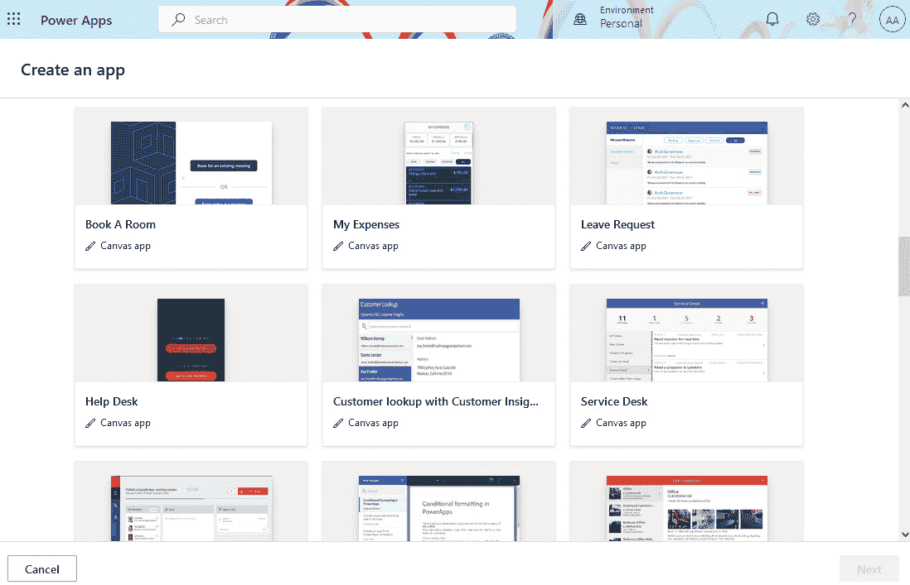

图 2.11 – 使用应用模板创建应用程序

应用 模板还 提供了一种便捷的方式来学习如何构建 这样的应用程序，配置控件，构建业务逻辑，并在应用程序内连接和集成不同的组件。 应用程序。

类似的方法可以在 Power Automate、Power Pages 和 Copilot Studio 中找到。 在 Power Automate 中，你可以找到一组预定义的工作流，它们可以作为构建工作流的起点。 在 Power Pages 中，提供了包括网站图形设计和布局的布局模板。 拥有 Dynamics 365 许可证的用户可能会看到额外的 Dynamics 365 模板，其中包括客户自助服务、合作伙伴门户、员工自助服务和社区模板等示例。 在 Copilot Studio 中，我们可以找到构建 自定义助手的模板。

无论你选择哪个模板，都有很大概率需要实现与数据源的连接，因为许多应用程序会使用并存储数据用于 它们的操作。

## 企业模板

那些希望从更高级 模板入手的用户，应选择企业模板。 微软推出了一套免费的六个企业模板供使用。 企业模板可以在 Microsoft AppSource 上找到，并附有 Microsoft Learn 平台的文档，您可以在这里阅读更多关于每个模板场景的内容 以及如何实现 它（[https://learn.microsoft.com/en-us/power-platform/enterprise-templates/overview](https://learn.microsoft.com/en-us/power-platform/enterprise-templates/overview)）。

企业模板涵盖了六种案例，从员工认可计划、入职伙伴、奖励与认可等人力资源案例，到 IT 案例，如硬件请求和预约 预定流程。

与上一节中提到的模板一样，企业模板的目的是减少在组织中围绕某些案例构建应用所需的时间。 我们还可以使用它们来学习如何利用 Power 平台服务开发特定场景。

这些模板中的每一个都包含两个应用程序；一个是**画布** 应用程序 ，面向最终用户。 它是一个富含 UI 的应用程序，具有响应式布局或适配移动设备，因此也可以随时使用。 第二个应用程序是**模型驱动** 的，面向管理员。 它是一个*数据密集型* 应用程序，管理员可以在其中对数据进行管理操作，或者后台团队可以管理数据源中的所有条目。

应用程序也使用 Dataverse 作为数据源，其中创建并使用一个或多个表来 存储数据。

最重要的是，还会生成 Power Automate 流，根据 项目执行某些业务操作。

这是 Power Apps 中非常常见的应用开发方式，整个过程由 Power Automate 支持，同时数据保留在 Dataverse 中，安全角色可以应用于进一步保护数据访问 。

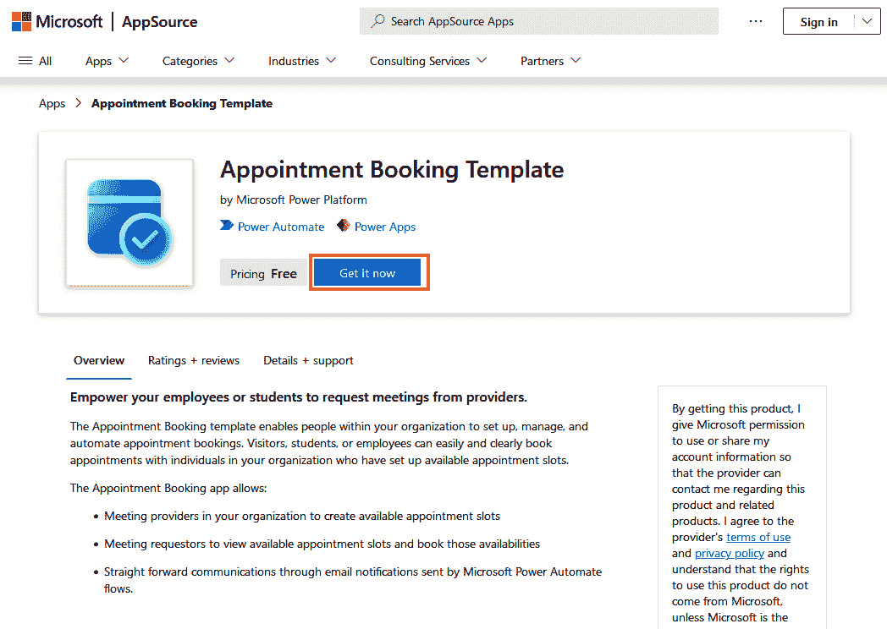

图 2.12 – 使用 Microsoft AppSource 获取企业模板

你可以通过访问 Microsoft AppSource，选择所需的模板，并点击 **立即获取**。首先，我们会被要求使用账户登录，并在继续安装前确认权限详情。 之后，我们将被重定向到 Power Platform 管理中心 | **资源** | **Dynamics 365 应用**，在这里我们选择要安装该模板的环境。 接受条款后，我们可以安装应用程序。 当我们想要更新或移除已部署的应用程序时，可以返回到 Power Platform 管理中心，选择环境，然后点击 **Dynamics 365 应用** 进行 操作：

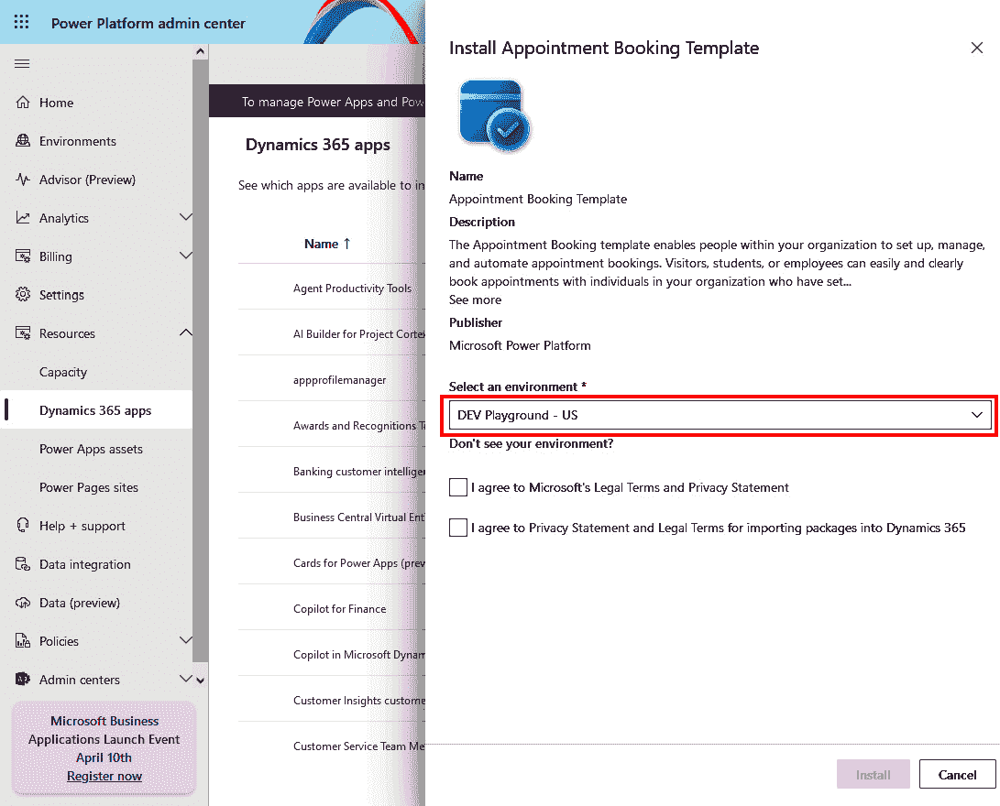

图 2.13 – 安装企业模板

## Power Platform 模式

Power Platform 项目 开发包括项目规划、设计、开发、测试和部署等阶段。 由于 Power Platform 项目的开发遵循敏捷方法论，它是一个迭代和可重复的过程。 这种方法意味着，一旦我们部署了解决方案，就可以轻松地回到项目开发的初始阶段，在那里我们设计和开发应用程序的新版本。 在接下来的章节中，我们将看看如何遵循我们的业务应用程序和解决方案的 ALM；然而，值得一提的是，许多基于 Power Platform 构建的项目遵循类似的模式。 这些模式包括审批、资产管理和检查应用程序。 微软将它们整合在一起，并创建了一个列出所有已识别 Power Platform 模式的清单，包括每种模式的模板解决方案及其安装文档。

这些模式 与模板可以在 此处找到： [https://learn.microsoft.com/en-us/power-apps/guidance/patterns/overview](https://learn.microsoft.com/en-us/power-apps/guidance/patterns/overview)。

每种模式都有其独特的目的；然而，从技术角度来看，它们通常由一个或多个 Power Apps 应用程序、中央数据存储（例如 Dataverse、SQL 数据库或 SharePoint Online）以及支持业务流程的 Power Automate 流程组成。 某些模式还包括 Power Pages，用于用户前端体验，而不是 Power Apps 应用程序。

## 构建业务解决方案的其他方式

让我们来看几种不同的方式来构建一个 业务解决方案。

### 从对话中创建

Power Platform 使你能够通过与 Copilot for Power Platform 的自然语言对话来创建业务解决方案。 Copilot 可在所有产品的主页上使用，例如 Power Apps、Power Automate、Power Pages 和 Copilot Studio。

描述我们想要创建的应用程序类型非常简单，AI 会尝试理解我们描述的上下文，并帮助我们构建应用程序。 它不仅帮助我们创建应用程序，还能帮助我们设计应用程序将使用的数据表模式。 将使用的数据表模式。

在 *第十二章*中，我们将深入探讨 Copilot for Power Platform 及其功能。 深入了解。

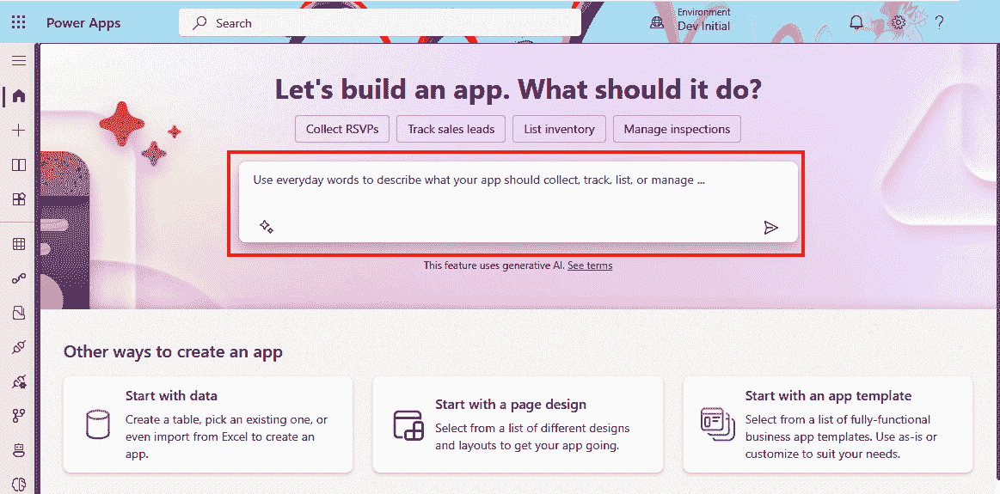

图 2.14 – 从对话中创建应用程序

### 从设计（图像或 Figma）创建

了解用户如何与数据交互有助于我们构建应用程序的概念设计。 概念设计帮助我们确定应用程序中将执行哪些任务。 这使我们能够绘制一个简单的画布应用程序屏幕或 Power Pages 表单的表示。 在画布应用程序中，Power Apps 允许我们将纸上绘制的应用程序屏幕草图转换为应用程序或表单。 这个 Power Apps 功能将我们的草图转换为功能性屏幕，并从草图中识别出组件。 我们还可以使用 Figma 和 **Figma 中的画布应用程序** 功能。

**Figma** 是一个 用于界面设计的协作网页应用程序。 它允许每个人创建应用程序的用户界面和原型。 Microsoft Power Platform 提供了一个 Figma UI 套件，允许我们直接从 Figma 创建 Power Apps 应用程序 ：

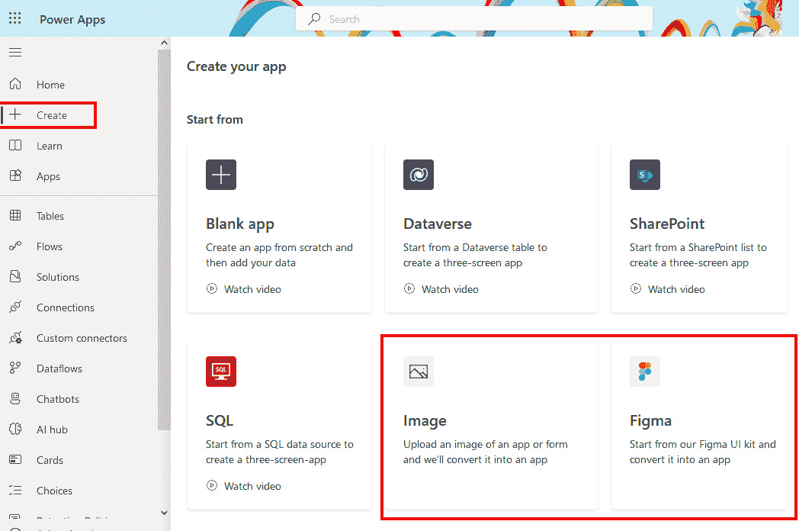

图 2.15 – 从图片或 Figma UI Kit 创建画布应用

## 客户故事

微软在他们的 Power Apps 客户案例网站（[https://powerapps.microsoft.com/en-us/blog/power-platform-stories/](https://powerapps.microsoft.com/en-us/blog/power-platform-stories/)）上有一 个汇总的真实客户故事列表，任何人都可以阅读，了解客户面临的挑战以及他们如何通过构建解决方案来解决问题，使用的正是微软 Power Platform。

2020 年，微软宣称 97% 的《财富》500 强公司以多种方式使用微软 Power Platform。 毫无疑问，我们可以看到该平台的受欢迎程度正在不断攀升，这也是我们相信越来越多的真实世界案例将被记录并与更广泛的社区分享的原因，从而让人们从中学习并应用这些案例来解决他们 自己的挑战。

尽管并非所有客户故事都对外公开，但公开的那些给我们提供了宝贵的洞察，了解客户为何决定使用这项技术，我们也可以了解到他们是如何 实施解决方案的。

# 摘要

本章介绍了 LCNC 开发方法的兴起以及它在近年来获得的关注。 我们希望本章能帮助你理解为何意识到这种开发方法如此重要，它的好处是什么，以及它与经典软件 开发方法的区别。

我们简要介绍了 Power Platform 的主要组件，并重点讲解了如何开设试用账户。 这应该有助于你了解如何开始使用该平台，因为接下来的章节将专注于实践活动，而准备一个测试环境以便 跟随操作是非常重要的。

接下来，我们介绍了管理 Power Platform 的工具，从管理中心到不同的 CLI 工具，PAC CLI 是首选工具，还有各种连接器可以帮助自动化管理任务。 无论你是 IT 管理员、DevOps 工程师还是专业开发人员，都很有可能在开发或管理 解决方案时，使用一个或多个这些工具与 Power Platform 配合。

本章节的最后两个部分专注于理解如何保持平台的安全性和符合不同标准及法规的要求，以及如何利用 Microsoft 公共网站发布的各种模板和模式。 这将帮助你建立对平台的信任，并加速你的初始项目设置，使用现有的模板（至少是前几个 项目）。

在下一章节，我们将运用 Power Platform 的知识，探讨为什么 ALM 和 DevOps 对 Power Platform 项目至关重要。 我们还将深入了解 Power Platform 采用成熟度模型，以及它如何帮助组织评估当前的成熟度水平并改善 DevOps 过程。

# 进一步阅读

+   Microsoft Power Platform 博客： [https://www.microsoft.com/en-us/power-platform/blog/](https://www.microsoft.com/en-us/power-platform/blog/)

+   Dynamics 365 和 Power Platform 发布 计划： [https://releaseplans.microsoft.com/en-US/](https://releaseplans.microsoft.com/en-US/)

+   Power Platform 管理员 文档： [https://learn.microsoft.com/en-us/power-platform/admin/](https://learn.microsoft.com/en-us/power-platform/admin/)

+   Power Platform CLI： [https://learn.microsoft.com/en-us/power-platform/developer/cli/introduction](https://learn.microsoft.com/en-us/power-platform/developer/cli/introduction)

+   PowerShell 支持管理员和 开发者： [https://learn.microsoft.com/en-us/power-platform/admin/powerapps-powershell](https://learn.microsoft.com/en-us/power-platform/admin/powerapps-powershell)

+   管理员和管理 连接器： [https://learn.microsoft.com/en-us/connectors/powerplatformforadmins/](https://learn.microsoft.com/en-us/connectors/powerplatformforadmins/)

+   Microsoft 信任 中心： [https://www.microsoft.com/en-US/trust-center](https://www.microsoft.com/en-US/trust-center)

+   Microsoft 产品 条款： [https://www.microsoft.com/licensing/docs/view/Product-Terms](https://www.microsoft.com/licensing/docs/view/Product-Terms)

+   Microsoft 企业 模板： [https://learn.microsoft.com/en-us/power-platform/enterprise-templates/](https://learn.microsoft.com/en-us/power-platform/enterprise-templates/)

+   Power Apps 模式： [https://learn.microsoft.com/zh-cn/power-apps/guidance/patterns/overview](https://learn.microsoft.com/zh-cn/power-apps/guidance/patterns/overview)

+   Power Platform 故事： [https://powerapps.microsoft.com/zh-cn/blog/power-platform-stories/](https://powerapps.microsoft.com/zh-cn/blog/power-platform-stories/)
