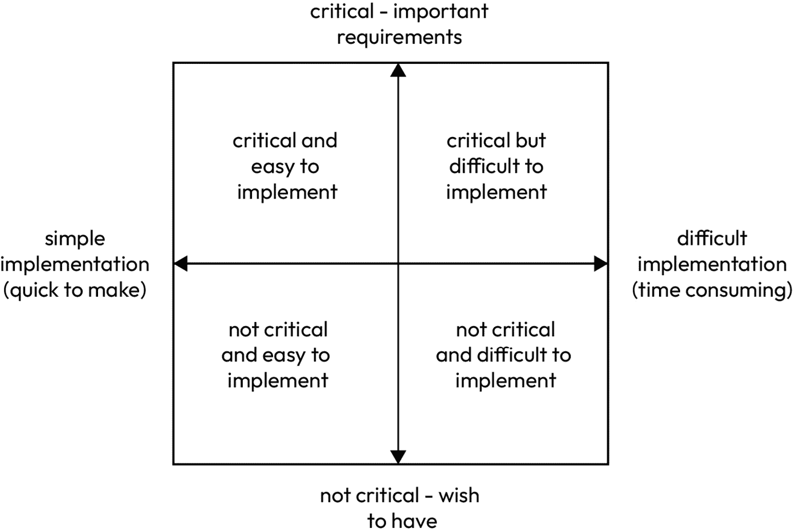
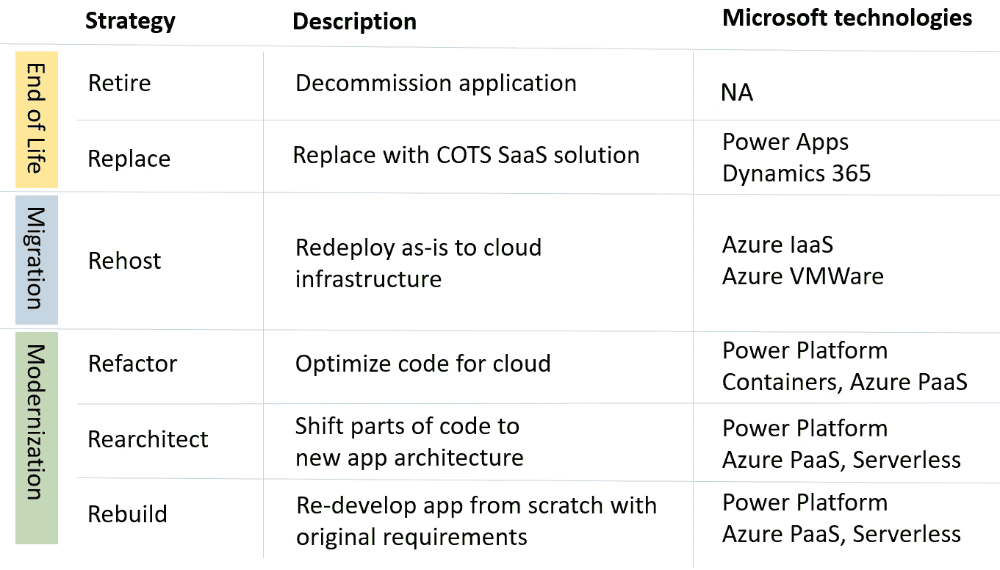

# <st c="0">3</st>

# <st c="2">探索 Microsoft Power Platform 中的 ALM 和 DevOps</st>

<st c="54">Microsoft Power Platform 使用户能够以更简单、更快捷的方式创建业务应用程序，这对于任何人来说都是具有吸引力的，无论其开发技能如何。</st> <st c="226">一旦我们超越了个人生产力应用程序的创建，并开始自动化具体的业务流程，我们就需要开始规划如何为这些新构建的应用程序设置最佳的生命周期模型，以便在</st> <st c="451">组织中进行管理。</st>

<st c="469">客户案例帮助我们理解，一旦组织采用了 Power Platform，组织中生产的应用程序数量很可能会大幅增加。</st> <st c="646">组织应该有一个计划，来处理如何构建、部署、管理和维护这些应用程序。</st> <st c="760">这就是</st> **<st c="774">应用生命周期</st>** **<st c="791">管理</st>** <st c="807">(</st>**<st c="809">ALM</st>**<st c="812">) 的作用所在。</st> <st c="821">然而，这不仅仅是关于开发人员的事情。</st> <st c="875">IT 专业人员和安全工程师必须与开发人员沟通，确保他们参与到规划、创建、管理和监控应用程序运行环境的过程当中。</st> <st c="1101">这就是为什么</st> <st c="1113">将 ALM 与 DevOps 结合扩展对于</st> **<st c="1163">低代码/无代码</st>** <st c="1179">(</st>**<st c="1181">LCNC</st>**<st c="1185">)</st> <st c="1188">开发方法来说也非常重要。</st>

<st c="1209">在本章中，我们将继续在前几章的基础上，解释为什么 LCNC 项目应该使用 ALM 和 DevOps，以提高整体协作和质量保证。</st> <st c="1408">在探索 ALM 如何帮助我们构建应用程序后，我们将深入探讨应用现代化的话题，因为组织通常有许多现有的遗留应用程序，这些应用程序应该进行评估并决定其未来。</st> <st c="1654">本章的最后，我们将了解 Power Platform 采用成熟度模型如何与 ALM/DevOps 和应用现代化相关联，以及为什么提高组织的成熟度水平至关重要。</st> <st c="1867">在组织中。</st>

<st c="1884">在本章中，我们将涵盖以下</st> <st c="1938">主要主题：</st>

+   <st c="1950">为什么在</st> <st c="1983">Power Platform 中实施 ALM 和 DevOps？</st>

+   <st c="1998">通过</st> <st c="2033">LCNC 方法进行应用现代化</st>

+   <st c="2046">构建 Power Platform</st> <st c="2071">采用之旅</st>

# <st c="2087">为什么在 Power Platform 中实施 ALM 和 DevOps？</st>

<st c="2135">本节</st> <st c="2149">探讨了为什么像微软 Power Platform 这样的 LCNC 平台需要实施 ALM 流程，以及它将如何改善团队协作、提高质量保证并帮助减轻</st> <st c="2330">潜在风险。</st>

<st c="2346">在采纳的初期阶段，我们可以看到组织将 Power Platform 服务提供给</st> <st c="2442">他们的</st> **<st c="2449">公民开发者</st>**<st c="2467">。公民开发者是指在组织内部不具备传统编程技能的个人或员工，他们通常来自业务部门，而非 IT 或开发团队。</st> <st c="2673">他们使用 Power Platform 主要为自己构建业务应用程序，以提升个人生产力，并且不对</st> <st c="2830">使用方式施加严格的指导。</st>

<st c="2840">随着组织的成熟，对 Power Platform 的认识和知识逐渐增加，开始构建更复杂的项目时，他们会寻求可扩展、一致、稳定且安全的构建和维护业务应用程序的方法。</st> <st c="3088">这与理解 ALM 的重要性直接相关，ALM 为如何共同治理、开发和维护应用程序提供了实践。</st> <st c="3247">采用 ALM 方法来构建应用程序可以对开发速度、可靠性和最终</st> <st c="3375">用户体验产生积极影响。</st>

<st c="3391">在谈到</st> **<st c="3415">开发速度</st>**<st c="3435">时，我们需要提到 ALM 提供了一个框架，旨在使用允许多个贡献者同时在应用程序上进行工作的平台。</st> <st c="3601">这时版本控制工具就显得尤为重要。</st> <st c="3648">由于如今许多工具，如 Azure DevOps 和 GitHub，提供了一个单一平台来覆盖 ALM/DevOps 生命周期，我们可以通过实施自动化构建、测试和部署管道，利用 CI/CD 流水线提高开发速度。</st> <st c="3897">然而，我们也可以通过改进开发方式来提高交付时间。</st> <st c="3993">构建可重用的代码组件可以让我们在不同项目中复用这些构建块，从而节省开发时间。</st> <st c="4118">在可靠性方面，由于我们已经建立了版本控制系统，我们有可能将系统回滚到之前的版本，因为在开发过程中错误是难以避免的。</st> <st c="4311">拥有这一能力可以增加我们维持系统稳定性的选择。</st> <st c="4383">前面提到的 CI/CD 流水线将帮助我们确保应用程序在不同环境中持续部署，从而最大限度地减少配置漂移和</st> <st c="4556">意外行为。</st>

<st c="4576">最后，拥有一个</st> <st c="4593">无 bug 的应用程序在塑造用户体验中起着重要作用。</st> <st c="4671">实施持续自动化测试将帮助我们在流程早期发现潜在问题。</st> <st c="4774">通过自动化测试，我们还可以查看潜在的性能瓶颈。</st> <st c="4853">这有助于我们去除或优化这些问题，从而提高性能，并最终改善</st> <st c="4969">用户体验。</st>

<st c="4985">每当我们在考虑 Power Platform 中的应用生命周期管理时，我们会集中关注两个主要概念：</st> **<st c="5104">解决方案</st>** <st c="5113">和</st> **<st c="5118">环境</st>**<st c="5130">。我们在项目中开发的所有内容，作为业务解决方案的一部分，无论是画布应用、流程、Dataverse 表格还是自定义组件，都作为一个</st> **<st c="5324">解决方案组件</st>**<st c="5342">呈现。这些解决方案组件被添加到一个解决方案中，并且我们应用 ALM 过程，使得能够自动化地将解决方案导出和导入到不同的环境中。</st> <st c="5539">环境充当一个容器，隔离我们租户中的内容，并允许目标受众的分离。</st> <st c="5665">解决方案和环境这两个概念可能对于 IT 专业人士、专业开发人员和 DevOps 工程师来说是非常熟悉的。</st> <st c="5800">这是因为在传统的软件开发中，也使用类似的方法，其中应用程序被打包成一个包（在 Power Platform 的上下文中是解决方案），并部署到不同的目标环境中，如开发环境、测试环境、预生产环境和</st> <st c="6063">生产环境。</st>

<st c="6087">解决方案和环境的概念将在</st> *<st c="6161">第四章</st>*<st c="6170">中详细描述。Power Platform 中的 ALM 只是故事的一部分。</st> <st c="6225">许多人认为 ALM 仅仅是将解决方案部署到不同环境的过程，但实际情况远不止于此。</st> <st c="6349">我们应该将其与 DevOps 结合，并考虑实施额外的步骤，例如构建环境管理策略、自动将 Power Platform 资源打包成解决方案、保障和管理环境，以及最后，在确保所生成的工作经过适当测试的情况下，一致地自动部署到不同环境。</st> <st c="6720">Power Platform 上的 DevOps 不仅关注应用开发者和专业开发者，还着眼于帮助 IT 管理员构建强大的平台和 IT 运营（IT ops）流程，这些流程使我们能够自动化平台特定任务，如环境配置、平台管理、DLP 政策管理、审计等。</st> <st c="7047">许多时候，商业应用扩展超出了 Power Platform，因此 IT 运营团队还需要负责网络管理，例如在配置 Power Platform 与 Azure 服务或其他本地后端系统的集成时。</st> <st c="7298">后端系统。</st>

<st c="7314">正如在</st> *<st c="7331">第一章</st>*<st c="7340">中提到的，ALM 是一个将软件开发多个阶段以循环方式连接起来的软件开发过程。</st> <st c="7453">现在，让我们从一个更高的视角来看看这些阶段在</st> <st c="7538">Power Platform 中的意义。</st>

## <st c="7553">计划和跟踪</st>

<st c="7568">我们在开始开发项目之前，需要做的第一件事是进行充分的项目准备和规划，</st> <st c="7573">我们可以通过进行一个</st> **<st c="7737">需求研讨会</st>** <st c="7758">流程来实现。</st> <st c="7768">这有助于我们理解项目的目标和范围。</st> <st c="7822">它让我们开始为这个阶段构建成果。</st> <st c="7877">这个步骤需要提出有效的验证问题，帮助我们理解目标和项目范围。</st> <st c="7984">理解项目范围有助于我们了解可用的时间表和资源，包括预算。</st> <st c="8100">它还让我们可以进行可行性研究，以确定是否存在一些我们应当注意的重要障碍。</st> <st c="8251">一旦我们理解了项目的范围，就可以继续收集所有的功能需求并优先排序。</st> <st c="8369">然后使用</st> **<st c="8384">四象限法</st>**<st c="8405">：</st>

<st c="8693">图 3.1 – 四象限法</st>

<st c="8730">接下来，我们将</st> <st c="8745">识别与所选项目相关的所有团队成员，并为他们分配</st> <st c="8825">各自的角色。</st> <st c="8866">指定的敏捷方法论，如 Scrum，已经有预定义的角色及其相应的任务，当我们将角色分配给团队成员时，可以参考这些方法论。</st> <st c="9042">这将帮助我们在项目规划工具中将团队成员分配到定义好的任务和用户故事中。</st> <st c="9152">使用所选的项目规划工具，我们将把工作项类型与我们将在项目中使用的方法论对齐，并开始创建工作项，如用户故事和任务，并根据项目进度和责任人进行映射。</st> <st c="9413">团队成员。</st>

<st c="9426">从项目规划的角度来看，这也是一个我们应当定义和构建环境设计、定义数据战略并开始进行数据建模的阶段。</st> <st c="9621">在这里，我们正在进行项目架构设计。</st> <st c="9679">安全团队还应该开始进行威胁建模，以识别潜在威胁，并通过调整架构设计（无论是物理的还是逻辑的）来减轻这些威胁。</st> <st c="9862">最后，为了解决用户体验部分和功能请求，我们可以从应用程序故事板或线框图开始。</st> <st c="9976">或线框图。</st>

<st c="9990">如我们所见，在 ALM 的第一阶段，我们甚至可能还没有接触到 Power Platform 服务。</st> <st c="10088">相反，我们将专注于与项目规划相关的活动。</st> <st c="10161">我们可以通过</st> <st c="10191">项目规划工具来支持这个阶段，比如</st> **<st c="10224">Azure Boards</st>** <st c="10236">（</st>**<st c="10238">Azure DevOps</st>**<st c="10250">），它内置了项目规划功能。</st> <st c="10304">它允许我们通过工作项定义项目，并随着时间的推移计划和跟踪已完成的工作。</st> <st c="10397">时间进展时。</st>

<st c="10413">在这里，我们还将决定我们的战略，这将影响下一阶段——我们的分支策略。</st> <st c="10522">我们还将决定是使用单一仓库还是</st> <st c="10575">多仓库方法。</st>

## <st c="10601">开发</st>

<st c="10613">开发阶段是应用开发人员和专业开发者合作，按所使用的方法论和项目计划中的一系列冲刺实现已定义任务和用户故事的阶段。</st> <st c="10618">根据项目的不同，在这一阶段我们将使用 Power Platform 服务来开发我们的业务应用程序、流程、定制协助工具和网站。</st> <st c="10812">为了支持这一阶段，我们将启用并将项目与版本控制系统连接。</st> <st c="10977">版本控制系统通过保存代码的快照来保护开发团队，让他们能够恢复到之前的版本。</st> <st c="11070">它还通过为开发人员提供一种简单的方式来识别并系统地解决代码冲突，保护他们免受可能出现的并行开发冲突。</st> <st c="11214">这种系统的一个例子是 Azure Repos，它是 Azure DevOps 的一部分，或者是</st> <st c="11405">GitHub 仓库。</st>

<st c="11502">即使我们已经从规划和跟踪阶段转向开发阶段，但这一阶段以及生命周期中所有后续阶段仍然依赖于第一阶段，因为我们将继续使用选定的项目规划工具，如 Azure Boards。</st> <st c="11764">这些工具将帮助我们跟踪工作项的状态并相应地更新它们。</st> <st c="11857">我们还使用 Azure Boards 与其他项目成员合作，通过交换想法和评论来共同处理工作项。</st> <st c="11965">工作项。</st>

<st c="11976">开发</st> <st c="11993">任务是在 Power Platform 服务和</st> **<st c="12046">集成开发环境</st>** <st c="12081">(</st>**<st c="12083">IDEs</st>**<st c="12087">) 中完成的，</st> <st c="12105">例如 Visual Studio Code。</st>

<st c="12117">作为 Power Platform 服务中协作的一个例子，我们可以提到 Power Apps 支持在模型驱动应用中进行协同创作，并且即将在画布应用中支持这一功能，这使得多个开发者能够同时在应用中进行更改，并且他们的更改实时反映给其他人。</st> <st c="12415">然而，并不是所有服务目前都支持相同程度的协同创作体验；因此，为了缓解代码优先开发者与公民开发者之间的协作挑战，微软推出了 Power Platform Tools 扩展，这在</st> <st c="12681">前一章中已提到。</st>

<st c="12698">与 DevOps 一样，我们努力自动化手动任务。</st> <st c="12751">在这一阶段，我们将开始构建 CI/CD 流水线，帮助我们自动化构建、测试和部署过程，这将在 DevOps 的下一个阶段中完成。</st> <st c="12913">自动化的 CI/CD 流水线是在 DevOps 工具中构建的，并配备有 Power Platform 中自动化任务的工具。</st> <st c="12994">这些工具的例子包括 Power Platform Build Tools、</st> **<st c="13081">Power Platform CLI</st>** <st c="13099">(</st>**<st c="13101">PAC CLI</st>**<st c="13108">)，</st> <st c="13112">PowerShell cmdlets。</st>

## <st c="13131">构建和测试</st>

<st c="13146">一旦</st> <st c="13152">必要的功能已开发完毕或问题已解决，且开发人员准备好进入下一个阶段，他们需要启动一系列任务，将完成的工作构建并打包成一个准备好部署到</st> <st c="13426">目标环境的解决方案。</st>

<st c="13446">DevOps 中的最佳实践之一是</st> <st c="13488">尽可能地实现自动化。</st> <st c="13525">在</st> **<st c="13528">持续集成</st>** <st c="13550">(</st>**<st c="13552">CI</st>**<st c="13554">) 流水线中，我们定义了构建和测试解决方案所需的任务。</st> <st c="13638">对于此任务，我们可以使用 CI/CD 工具，例如 Azure DevOps，它本身内置了 Azure Pipelines 功能。</st> <st c="13768">或者，我们可以使用 GitHub Actions，它是 GitHub 产品的一部分。</st>

<st c="13846">每当工作提交到代码库时，CI 流水线可以自动触发。</st> <st c="13947">这减少了启动过程时对人工干预的需求。</st> <st c="14001">该过程由系统自动开始。</st>

<st c="14013">在我们的 CI 流水线中，我们已经放置了一系列使用 Power Platform Build Tools 或 PAC CLI 来执行</st> <st c="14126">必要操作的任务。</st>

<st c="14144">我们不能不提测试。</st> <st c="14194">在继续到下一个阶段之前，应该在这里进行一组适当的测试。</st> <st c="14287">Azure DevOps Pipelines 或 GitHub Actions 使我们能够在 CI 流水线期间自动运行测试。</st> <st c="14390">例如，使用管理员和开发人员的 Solution Checker 或 PowerShell cmdlets，特别是</st> `<st c="14495">Microsoft.PowerApps.Checker.PowerShell</st>` <st c="14533">模块，我们可以将解决方案检查器功能集成到 CI 流水线中。</st> <st c="14617">这种方法允许开发人员在构建验证过程中实施静态分析检查，并在开发过程中识别出问题模式。</st> <st c="14790">从这里开始，我们可以使用 Power Platform 中的其他测试工具，如 Power App Test Studio 或 Power Apps Test Engine，来构建 Power Apps 中的端到端测试。</st>

<st c="14951">作为</st> <st c="14959">此阶段的结果，使用我们提到的工具，我们已经生成了一个构建工件。</st> <st c="15050">工件是构建过程的副产品，在 Power Platform 的背景下，它将是一个打包的解决方案，其中包含已添加到解决方案中的所有组件。</st> <st c="15230">这将在接下来的</st> <st c="15261">部署阶段中使用。</st>

## <st c="15278">部署</st>

<st c="15285">既然我们</st> <st c="15297">在前一个阶段的结果中有了一个工件，我们可以专注于将其部署到必要的环境，并在那里运行额外的测试，如集成、性能、安全和 UI 测试。</st> <st c="15499">与</st> <st c="15511">前一个阶段一样，**<st c="15527">持续部署</st>** <st c="15548">(</st>**<st c="15550">CD</st>**<st c="15552">)**旨在自动将解决方案部署到各种环境，包括生产环境。</st> <st c="15641">通过使用 DevOps 工具和 CD 流水线，再加上 Power Platform 构建工具，我们可以确保部署过程</st> <st c="15775">得到自动化。</st>

<st c="15790">此过程中的一个重要步骤是为解决方案准备好环境。</st> <st c="15876">这涉及遵循环境策略并按照组织定义的治理准则行事。</st>

<st c="15995">环境准备就绪后，我们可以遵循协商一致的部署策略。</st> <st c="16076">此策略定义了我们如何向用户交付应用程序。</st> <st c="16151">存在各种部署策略，如蓝绿部署流程、A/B 测试、金丝雀发布等。</st> <st c="16272">所有这些部署策略的目的都是以受控的方式将更新的应用程序提供给一组用户，以便分析不同的指标，如性能、用户行为、功能影响等。</st> <st c="16508">作为实际部署策略的示例，我们可以采用蓝绿部署策略，并使用应用程序共享选项向一组用户引入新功能。</st> <st c="16686">向多个用户或组共享的过程可以通过 CLI/cmdlets 自动化</st> <st c="16756">完成。</st>

<st c="16773">由于部署有时可能不如预期，我们应该准备好回滚策略，以防在部署或</st> <st c="16914">测试阶段出现任何问题。</st>

<st c="16928">在此阶段，我们还可以执行与数据相关的任何活动，例如将测试数据导入 Dataverse 表格或为测试环境提供新表格，并从不同环境中复制数据</st> <st c="17161">使用数据流。</st>

## <st c="17177">操作</st>

<st c="17185">此阶段的</st> <st c="17190">目的是确保系统的</st> **<st c="17229">可用性</st>** <st c="17241">以及部署解决方案的稳定和健康状态。</st> <st c="17322">由于 Power Platform 是一项 SaaS 解决方案，IT 管理员无法控制运行服务的基础设施，这就是他们必须依赖</st> <st c="17480">微软来保持系统正常运行的原因。</st> **<st c="17526">服务水平协议</st>** <st c="17550">(</st>**<st c="17552">SLA</st>**<st c="17556">) 描述了微软对正常运行时间和连接性的承诺。</st> <st c="17619">然而，事情会发生，为了验证服务的状态，IT 管理员可以在 Power Platform 管理中心的</st> **<st c="17745">服务健康</st>** <st c="17759">仪表板中验证当前状态。</st> <st c="17806">在这里，他们可以看到是否有任何正在进行的服务降级或未来的</st> <st c="17887">计划中断。</st>

<st c="17909">一套工具，比如在 Power Platform 管理中心或</st> **<st c="17988">卓越中心</st>** <st c="18008">(</st>**<st c="18010">CoE</st>**<st c="18013">) 启动工具包，帮助</st> <st c="18034">我们了解环境和部署解决方案的状态。</st> <st c="18109">通过将我们的应用程序与应用程序性能监控解决方案，如 Azure Application Insights，连接，我们可以收集并分析健康、性能和使用数据，</st> <st c="18302">覆盖应用程序。</st>

<st c="18319">此外，在此阶段，我们可以控制新开发的功能和应用程序对最终用户的暴露。</st> <st c="18444">通过功能标志和商定的部署策略，我们可以验证开关的功能，并确保用户能够按设计访问特定</st> <st c="18641">用户组的功能或服务。</st>

## <st c="18652">监控和学习</st>

<st c="18670">连续 DevOps 生命周期的</st> <st c="18675">最后阶段旨在确保监控工具到位，并为我们提供可以用来</st> *<st c="18845">分析使用情况和性能</st>* <st c="18878">的业务应用程序的遥测数据。</st> <st c="18908">这些信息帮助我们学习并改进当前的 DevOps 流程。</st> <st c="18983">它能为我们提供洞察，帮助判断是否需要构建更好、更具吸引力的</st> <st c="19059">应用程序。</st>

<st c="19081">除了其他方面，DevOps 还关注特性功能的持续交付。</st> <st c="19162">如果我们使用特性标志，允许对新功能的启用进行精细控制，那么必须有一个监控服务来捕获或收集新功能的使用信息。</st> <st c="19406">这可以通过向 Azure 应用程序洞察发送自定义遥测数据来完成。</st> <st c="19484">Azure 应用程序洞察是 Azure 监控的扩展，最初用于监控不同环境中的应用程序。</st> <st c="19624">它允许我们了解性能和用户流，创建针对存储在日志分析中的日志的自定义查询等等。</st> <st c="19763">通过创建警报，我们可以对性能或使用中的异常进行响应。</st> <st c="19854">正如我们所看到的，通过收集用户遥测数据，我们可以了解应用程序的使用情况，以及我们是否根据</st> <st c="20035">用户的需求投资构建正确的功能。</st>

<st c="20051">然而，需要注意的是，这一阶段并不仅仅关注理解来自用户的遥测数据。</st> <st c="20170">在此阶段，我们的项目和开发团队还需要反思已完成的工作，诚实地回答 ALM 流程中哪些部分有效，哪些无效。</st> <st c="20361">这种方法将帮助他们在过程中不断学习和成长，并在方向错误时进行修正。</st> <st c="20472">所学的经验将反馈到 ALM 中，并用于下一个迭代周期。</st> <st c="20545">持续学习和持续改进展示了我们对优化流程和为用户交付有价值产品的承诺。</st> <st c="20689">考虑到这一点，让用户向开发团队提供反馈可以解锁有关如何使应用程序对用户更有意义的宝贵信息</st> <st c="20853">。</st>

<st c="20863">从</st> <st c="20873">工具的角度来看，团队将利用 Power Platform 内的分析功能以及 Azure 应用程序洞察。</st> <st c="21001">团队还将使用项目规划工具，如 Azure Boards，来调查流程和团队表现中的瓶颈。</st> <st c="21144">通过 Power BI 仪表板和报告，可以直观地展示</st> <st c="21218">并进行调查。</st>

<st c="21235">我们已经提到了一些可以支持 ALM 和 DevOps 流程的工具。</st> <st c="21334">在下一部分，我们将更深入地了解本书中将使用的两个工具的功能</st> <st c="21469">以便进行动手操作。</st>

## <st c="21483">ALM 和 DevOps 工具</st>

<st c="21506">市场上有许多不同的工具可用于管理 ALM/DevOps。</st> <st c="21587">有些工具仅设计用于覆盖 CI/CD 过程，而另一些则构建成涵盖整个 DevOps 过程，包括项目规划、构建、管理测试场景等工具。</st> <st c="21788">从生产力和集成的角度来看，拥有一个可以在整个应用程序生命周期管理过程中使用的工具总是一个不错的选择。</st> <st c="21960">我们将深入了解微软提供的两个最重要的支持 ALM 和 DevOps 的工具：Azure DevOps 和</st> <st c="22078">GitHub Enterprise。</st>

### <st c="22096">Azure DevOps</st>

<st c="22109">Azure DevOps</st> <st c="22122">有着与微软开发者密切相关的悠久传统。</st> <st c="22180">这一切始于一款名为微软</st> **<st c="22229">Team Foundation Server</st>** <st c="22251">(</st>**<st c="22253">TFS</st>**<st c="22256">)的产品</st>，<st c="22266">该产品于 2006 年初发布。</st> <st c="22294">TFS 是一个用于管理开发项目配置工作流的协作工具。</st> <st c="22389">顾名思义，它是一个客户必须部署到其本地环境中的服务器产品。</st> <st c="22498">随着世界的发展以及云计算的兴起，微软开始寻找将 TFS 转变为 SaaS 产品的途径。</st> <st c="22631">2011 年，TFS 作为 SaaS 解决方案在 Windows Azure 平台上推出。</st> <st c="22720">它被命名为 TFS。</st> <st c="22738">后来，它被</st> <st c="22752">更名为</st> **<st c="22763">Visual Studio Team Services</st>** <st c="22790">(</st>**<st c="22792">VSTS</st>**<st c="22796">)。</st> <st c="22800">2018 年，微软将 VSTS 重新命名为 Azure DevOps 服务，同时也将 TFS 更名为 Azure DevOps Server。</st> <st c="22914">Azure DevOps Server 2019 是首个重新命名后的本地版本。</st> 

<st c="22997">由于一些组织尚未采用云战略，或者在受监管的行业中运营，Azure DevOps 仍然提供两种版本，以便客户可以根据自己的需求选择最适合的产品版本——Azure DevOps 服务或 Azure DevOps Server。</st> <st c="23279">有时，客户可能会遇到需要混合配置的复杂环境。</st> <st c="23385">在这种情况下，</st> **<st c="23399">构建代理</st>** <st c="23411">可以位于本地服务器上，用于 CI/CD 管道，同时仍然使用 Azure DevOps 服务在线的其他功能。</st> <st c="23550">这是可能的，而且是一个非常常见的场景。</st> <st c="23595">它解决了特定客户的需求，这些需求通常与法规有关，但也可以用于其他</st> <st c="23705">技术原因。</st>

<st c="23723">Azure DevOps 包含</st> <st c="23745">五个服务，支持</st> <st c="23780">ALM/DevOps 流程：</st>

+   **<st c="23799">Azure Boards</st>**<st c="23812">：用于项目规划和工作跟踪，提供看板、待办事项和</st> <st c="23903">团队仪表板。</st>

+   **<st c="23919">Azure Repos</st>**<st c="23931">：专注于提供私有</st> **<st c="23964">Git</st>** <st c="23967">(以及较早的</st> **<st c="23979">Team Foundation 版本控制</st>** <st c="24010">(</st>**<st c="24012">TFVC</st>**<st c="24016">)) 仓库。</st> <st c="24034">支持分支和</st> <st c="24057">拉取请求机制。</st>

+   **<st c="24081">Azure Pipelines</st>**<st c="24097">：专注于为任何项目构建 CI/CD 管道，支持任何语言，并可部署到任何平台。</st> <st c="24200">由构建代理组成，构建代理是执行在 Azure Pipelines 中定义的操作的组件。</st> <st c="24297">代理可以是微软托管的，当使用 Azure DevOps 服务时，或是自托管的，当在本地配置 Azure DevOps Server 时。</st> <st c="24444">两者的组合，也可以作为混合设置。</st>

+   **<st c="24504">Azure Test Plans</st>**<st c="24521">：旨在构建测试场景，以支持手动和</st> <st c="24582">探索性测试。</st>

+   **<st c="24602">Azure Artifacts</st>**<st c="24618">：作为一个包管理功能，允许用户从公共和</st> <st c="24771">私有源创建和分享 NuGet、Maven、npm、Python 和通用包源。</st>

<st c="24787">Azure DevOps 非常可扩展。</st> <st c="24821">通过扩展，管理员可以增强 Azure DevOps 的功能。</st> <st c="24892">扩展可以通过 Visual Studio Marketplace（</st>[<st c="24965">https://marketplace.visualstudio.com/azuredevops</st>](https://marketplace.visualstudio.com/azuredevops)<st c="25014">）找到并安装，那里有 Azure DevOps 服务和 Azure DevOps Server 的扩展。</st> <st c="25091">Microsoft Power Platform 构建工具是这些扩展的一个例子，我们将使用它来支持</st> <st c="25200">ALM 流程。</st>

<st c="25212">Azure DevOps 还支持 REST API 集成，用于自动化任务和与其他系统及应用程序的集成。</st> <st c="25345">IT 管理员或 DevOps 工程师还可以利用 Power Platform 中的 Azure DevOps 连接器，这使他们能够对 Azure DevOps 中的项目执行操作，如创建新版本、创建新工作项或仅查看</st> <st c="25593">项目状态。</st>

### <st c="25608">GitHub Enterprise</st>

<st c="25626">GitHub</st> <st c="25634">成立于 2007 年，GitHub 服务于 2008 年 2 月推出。</st> <st c="25705">2018 年 6 月，微软宣布收购 GitHub。</st> <st c="25766">这次收购也强调了微软对开源社区的承诺。</st> 

<st c="25849">GitHub 提供不同的定价计划，根据计划解锁不同的产品功能。</st> <st c="25944">GitHub 的计划旨在适应个人、小型团队，甚至更大的组织：个人或组织可以使用 GitHub Free，个人帐户可以使用 GitHub Pro，而大型公司则可以选择 GitHub Team 或 GitHub Enterprise。</st>

<st c="26182">GitHub Enterprise 是功能最丰富的选项，适用于大规模开发项目。</st> <st c="26288">从功能角度来看，它与 Azure DevOps 类似，但也有一些区别。</st> <st c="26383">与 Azure DevOps 一样，GitHub Enterprise 也有两种变体，分别是</st> <st c="26462">作为云服务的 GitHub Enterprise Cloud，或者作为本地实例的 GitHub Enterprise Server。</st> <st c="26585">这为客户提供了灵活性，选择如何部署和使用该工具。</st> 

<st c="26659">与 Azure DevOps 类似，GitHub 产品旨在覆盖 DevOps 生命周期的所有阶段，具有以下功能：</st> 

+   **<st c="26798">GitHub Issues 和 GitHub Projects</st>**<st c="26832">：用于计划和跟踪项目中的工作。</st> 

+   **<st c="26891">GitHub 仓库</st>**<st c="26909">：专门用于提供私有或公共 Git 仓库，用于存储和协作项目中的源代码和文件。</st> <st c="27040">支持分支和拉取请求机制。</st> 

+   **<st c="27084">GitHub Actions</st>**<st c="27099">：专注于提供支持 CI/CD 的平台，用于自动化构建、测试和部署流水线。</st> <st c="27206">GitHub Actions 允许 DevOps 工程师扩展 CI/CD 流水线以外的任务，并根据仓库中的活动自动化项目中的其他任务。</st> <st c="27362">GitHub Runners 是运行 CI/CD 流水线的关键组件。</st> <st c="27436">它们执行 GitHub Actions 中定义的活动。</st> <st c="27500">与 Azure DevOps 相比，它们类似于构建代理。</st> <st c="27562">GitHub 还提供 GitHub 托管的运行器，或者可以在本地环境中部署的自托管运行器。</st> 

+   `<st c="27823">npm</st>`<st c="27826">、NuGet、Maven</st>，<st c="27842">等等。</st> 

<st c="27851">GitHub 在其产品组合中拥有一套旨在增强开发者体验、改善 DevOps 过程中的协作，并实施 DevSecOps 的工具。</st> <st c="28020">这些产品越来越受欢迎，值得一提的是：</st> <st c="28069">这些工具包括：</st>

+   **<st c="28086">GitHub Codespaces</st>**<st c="28104">：允许</st> <st c="28114">开发人员快速提供一个安全的云开发环境，为选定项目配置。</st> <st c="28222">这意味着它包含必要的开发工具，如 Visual Studio Code 和所有必需的扩展，帮助开发人员更快地开始项目开发。</st>

+   **<st c="28396">GitHub Copilot</st>**<st c="28411">：这是</st> <st c="28421">一个 AI 编码助手，通过提供基于 AI 的实时代码补全建议，帮助开发人员编写代码。</st> <st c="28552">有关 Microsoft Copilot 的更多信息将在本书的最后一章中介绍。</st>

+   **<st c="28632">GitHub 高级安全</st>**<st c="28657">：提供</st> <st c="28669">额外的工具，进一步保护项目的安全。</st> <st c="28734">通过代码扫描、密钥扫描和依赖项审查等功能，GitHub 高级安全使组织能够在开发周期中提前进行安全检查。</st> <st c="28922">代码扫描让我们可以发现源代码中潜在的安全漏洞和编码错误。</st> <st c="29027">密钥扫描会扫描我们的源代码，寻找任何可能被开发人员和 IT 工程师无意中提交到代码中的密钥和令牌等机密信息。</st> <st c="29218">最后，依赖项审查使我们能够查看项目中使用了哪些依赖项，并检查项目所用版本是否存在已知漏洞。</st> <st c="29394">GitHub 高级安全还可以与</st> <st c="29441">Azure DevOps 一起使用。</st>

<st c="29454">现在我们已经</st> <st c="29470">了解了 DevOps 生命周期阶段和支持 DevOps 生命周期的工具，我们准备深入探讨具体的现代化选项。</st> <st c="29638">在决定将应用程序从现有技术栈迁移到</st> <st c="29789">LCNC 平台时，我们将考虑可用的现代化策略。</st>

# <st c="29803">LCNC 方法的应用程序现代化</st>

<st c="29851">在这一</st> <st c="29859">部分，我们将重点讨论通过 Power Platform 进行的应用程序现代化。</st> <st c="29932">我们将讨论不同的应用程序现代化策略选项，以及 LCNC 开发方法如何作为现代化应用程序的选项之一。</st>

<st c="30106">组织</st> <st c="30121">现在，比以往任何时候都面临一个挑战，他们需要以快速的速度创新，以在市场上建立竞争优势。</st> <st c="30274">拥有一堆构建在过时技术栈上的遗留应用程序，使其与现代系统集成的可能性变得更加复杂。</st> <st c="30423">这类应用程序往往因为技术过时和难以</st> <st c="30545">维护而存在潜在的安全威胁。</st>

<st c="30562">过时的技术也会在人员配备方面带来挑战，因为可能很难找到愿意继续使用旧编程语言和框架以及老旧开发工具进行开发的开发人员。</st> <st c="30789">另一方面，维护现有的遗留应用程序可能会导致技术债务</st> <st c="30920">显著增加。</st>

<st c="30930">因此，组织正在考虑现代化遗留应用程序的可能性。</st> <st c="31026">Power 平台的 LCNC 开发方法允许组织加速交付新应用程序，减少开发成本，并通过允许公民开发人员参与流程来扩展资源池，并最小化对大量</st> <st c="31296">定制编码的需求。</st>

<st c="31310">遗留应用通常没有我们可以连接的 API。</st> <st c="31370">通过 Power Automate，Power 平台允许组织实施</st> **<st c="31444">机器人流程自动化</st>** <st c="31470">(</st>**<st c="31472">RPA</st>**<st c="31475">) 进程，这些进程</st> <st c="31492">模拟用户与遗留应用程序的交互。</st> <st c="31545">它允许他们将这些流程插入到新的现代业务流程和</st> <st c="31628">云流中。</st>

<st c="31640">当现有应用程序公开 API 时，我们可以专注于为应用程序构建新的前端，并使用自定义连接器连接到后端 API。</st> <st c="31797">这些用于执行特定操作，如数据库操作或功能逻辑。</st> <st c="31892">这两种方法都允许我们以较小批次的迭代方式逐步现代化遗留应用程序，在进行现代化过程中启用功能。</st> <st c="32045">这种</st> **<st c="32065">逐步现代化应用程序的方法</st>** <st c="32103">也有助于在不干扰</st> <st c="32206">业务运营的情况下现代化组织高度依赖的应用程序。</st>

<st c="32226">Power Platform 可以与 Microsoft Azure 集成。</st> <st c="32282">这使得已经采用 Microsoft Azure 云服务的组织能够以 LCNC 开发方式构建新应用或扩展现有应用，并简化 Power Platform 服务的采用。</st> <st c="32498">由于 Power Platform 通过连接器支持与许多服务的集成，因此它也适用于现有应用的现代化。</st> *<st c="32637">第九章</st>* <st c="32646">将讨论</st> <st c="32667">Power Platform 与 Microsoft Azure 之间的集成场景，希望能够为</st> <st c="32775">应用现代化提供新思路。</st>

<st c="32793">已经采用融合开发方法的组织在进行应用现代化时将受益匪浅，因为这种方法允许专业开发人员、应用创建者和 IT 运维团队专注于他们在应用现代化过程中各自的角色。</st> <st c="33068">我们将在</st> *<st c="33132">第九章</st>* <st c="33141">中进一步讨论</st> <st c="33145">该方法。</st>

## <st c="33154">应用现代化选项</st>

<st c="33188">在决定</st> <st c="33203">现代化遗留应用的战略时，我们应该考虑应用现代化的不同选项，以便做出有根据的决策。</st> <st c="33373">组织不应仅仅将遗留应用重写为使用更现代的框架和语言。</st> <st c="33489">相反，他们还应该审查和更新使用的流程和数据库。</st> <st c="33567">遗留应用是基于当时可用的技术开发的，同时也围绕适合当时的流程进行。</st> *<st c="33692">那个时候</st>*<st c="33704">，同一个项目现在可能会与当时遗留应用开发时的方式完全不同。</st> <st c="33824">现有的技术可能在当时并不存在，而我们今天能够交付的流程也可能与当时的完全不同。</st> <st c="33984">现在我们正处于更广泛采用 AI 的时代，因此我们应该探索通过 AI 优化流程和创新的方式。</st> <st c="34112">曾经手动完成的工作，现在有可能通过 AI 的帮助完全实现自动化。</st> <st c="34230">因此，在处理应用现代化时，我们应该从流程优化和现代化的角度看待现代化——包括应用</st> <st c="34408">和数据库。</st>

### <st c="34421">流程现代化</st>

<st c="34443">我们应该首先</st> <st c="34459">从</st> **<st c="34471">流程现代化</st>** <st c="34492">开始，以便能更多地从实际应用中受益</st> <st c="34545">现代化和数据库现代化的过程。</st> <st c="34596">流程现代化包括评估现有流程，以便了解我们可以在哪些方面进行改进。</st> <st c="34701">然后我们可以继续优化和重新设计现有的业务流程，并利用现代技术的能力使其与现代时代相适应。</st> <st c="34861">这个过程的结果是现代化和优化后的流程，在分析过程中识别出了瓶颈，并通过自动化在一定程度上或完全消除了这些瓶颈。</st> <st c="35069">这使我们能够获得操作效率，从而降低现代化工作负载的总拥有成本。</st> <st c="35159">现代化的工作负载。</st>

<st c="35180">Power Platform</st> <st c="35196">有一个名为</st> **<st c="35219">Power Automate 流程挖掘</st>**<st c="35248">的产品。</st> <st c="35280">Power Automate 流程挖掘是一个可以帮助我们发现、监控和改进流程的产品。</st> <st c="35352">在 2024 年 5 月，微软的流程挖掘解决方案被评为 2024 年 Gartner® 魔力象限™ 流程挖掘平台的领导者。</st> <st c="35477">流程挖掘平台。</st>

<st c="35494">我们不应忘记提到，流程现代化的一个关键部分是组织文化和人员，而不仅仅是技术。</st> <st c="35640">现代化不仅仅是关于技术，它是一种思维方式的转变，涉及到组织中每个人都参与到这一变化中，从领导层到一线员工。</st> <st c="35816">接下来我们将探讨 Power Platform 采纳成熟度模型如何帮助我们实现这一目标。</st> <st c="35915">下一部分将详细讲解。</st>

### <st c="35925">应用现代化</st>

<st c="35951">应用程序现代化是一个</st> <st c="35983">将软件应用程序更新以与技术进步对齐，满足当前业务需求，并改善用户体验的过程。</st> <st c="36142">如今，在许多情况下，应用程序现代化与迁移到云端密切相关，但不仅仅是这样。</st> <st c="36257">类似于流程现代化，它需要全面审视应用程序的状态，以改善用户体验，使应用程序更安全、更可靠、兼容更新的技术栈等。</st> <st c="36480">应用程序现代化的一个好处是能够加速创新。</st> <st c="36574">Power Platform 使我们能够做到这一点。</st> <st c="36611">使用一个可以快速原型设计以及实际开发应用程序的平台意味着组织将有更多时间进行创新。</st> <st c="36762">通过将 DevOps 或 DevSecOps 整合到整个过程中，我们还可以提高市场响应速度，同时保持我们的</st> <st c="36873">应用程序安全。</st>

<st c="36893">在开始现代化应用程序之前，组织应该首先进行</st> **<st c="36994">应用程序合理化</st>**<st c="37021">。这</st> <st c="37027">将帮助他们了解他们的应用程序组合中有哪些应用，以及应该如何处理它们。</st> <st c="37135">在识别了整个组织的所有应用程序之后，我们应该对这些应用程序进行评估。</st> <st c="37254">这不仅将帮助我们建立一个应用程序清单，还能深入了解每个应用程序的情况。</st> <st c="37362">这种评估可以通过手动或使用特定工具自动进行。</st> <st c="37450">在这里，我们将查看应用程序的架构、应用程序依赖关系、基础设施架构、用户分析和使用模式，包括应用程序的使用频率，更重要的是，应用程序上次使用的时间。</st> <st c="37717">许多时候，客户尝试现代化或迁移所有</st> <st c="37771">应用程序，但实际上可能没有必要这样做，因为某些应用程序已经多年未使用。</st> <st c="37880">在这种情况下，为审计目的保留数据可能就足够了，同时可以停用</st> <st c="37965">这些应用程序。</st>

<st c="37981">一旦应用程序评估完成并且应用程序清单建立，我们应该决定应用程序的</st> **<st c="38086">现代化策略</st>**。

<st c="38109">在 2011 年，Gartner 提出了</st> <st c="38137">五个 R 迁移战略</st> **<st c="38142">five Rs migration strategy</st>** <st c="38168">，帮助我们将应用程序划分为迁移战略。</st> <st c="38235">今天，我们可以看到市场上出现了更多的迁移战略选项，超越了五个 R 模型。</st> <st c="38350">然而，它们或多或少建立在原始的五个 R 迁移战略基础上，具体如下：</st> <st c="38442">如图所示：</st><st c="38450">如下：</st>

<st c="38972">图 3.2 – 应用现代化战略</st>

<st c="39011">我们可以看到，我们</st> <st c="39030">可以将每个应用程序分为三个</st> <st c="39071">主要部分。</st>

+   <st c="39084">首先是通过完全停用现有应用程序，或用基于 Power Apps 或</st> <st c="39275">Dynamics 365 的现成解决方案替换它，从而终结现有应用程序。</st>

+   <st c="39288">接下来是迁移过程，将应用程序按原样重新部署到云基础设施中，通常是在虚拟机等 IaaS 工作负载上。</st> <st c="39443">在这里，我们从 Power Platform 的角度并没有做太多，只是意识到该应用程序存在于 Azure IaaS 上，并且在构建任何新应用程序时，我们可能会更轻松地连接到 Azure 云上的现有应用程序。</st> <st c="39665">更容易。</st>

+   <st c="39677">最后一个部分涉及实际的现代化，其中部分代码得到现代化，或者整个应用程序从零开始构建。</st> <st c="39814">这是我们回到项目规划阶段的部分，收集所有需求，构建架构设计，并开始利用 Power Platform 服务开展新项目。</st> <st c="40003">当我们完成应用程序的现代化后，我们应在组织中安排团队负责培训和推广，鼓励用户开始使用</st> <st c="40200">新应用程序。</st>

<st c="40216">目前，市面上有一些工具可以评估遗留应用程序，并根据评估结果将其映射到合适的迁移策略。</st> <st c="40362">然而，使用工具只是实际评估的一小部分。</st> <st c="40439">评估的大部分工作是通过分析工具的结果来完成的。</st> <st c="40537">这一步骤是为了验证结果，并将其与手动评估过程中的发现进行对比，手动评估过程可能还包括与应用程序用户和管理员的访谈。</st> <st c="40726">工具可能会根据评估的源代码或提供给工具的输入，决定采用一种迁移策略。</st> <st c="40868">然而，在进行深入分析和访谈后，可能会选择另一种迁移策略。</st> <st c="40980">所有这些输入对于我们在开始实际的应用开发工作之前，决定迁移策略至关重要。</st> <st c="41098">开发工作。</st>

### <st c="41115">数据库现代化</st>

<st c="41138">数据库现代化</st> <st c="41161">不仅仅是更新现有的数据库系统，还涉及如何改进存储、处理和管理</st> <st c="41290">应用程序数据的过程。</st>

<st c="41309">通常，我们会在进行应用评估的同时，也进行数据库评估，因为这两者是密切相关的。</st> <st c="41421">许多时候，应用逻辑是以存储过程的形式写在数据库中的，因此在评估并决定应用现代化方法时，我们也应该考虑这部分内容，并决定如何将这部分逻辑从数据库系统中提取出来，并转移到处理该逻辑的服务上。</st> <st c="41762">话虽如此，进行数据库评估仍然非常重要。</st> <st c="41835">这将帮助我们创建数据库、表格及其关系的清单。</st> <st c="41934">我们还应该关注性能指标，并了解</st> <st c="42008">瓶颈所在。</st>

<st c="42024">与应用程序现代化战略类似，数据库现代化时，我们也必须决定不同的现代化战略。</st> <st c="42167">这些策略可以与应用程序现代化的策略相同，只是适用于</st> <st c="42238">数据库的上下文：</st>

+   **<st c="42251">退休</st>**<st c="42258">: 我们</st> <st c="42264">决定淘汰该数据库。</st> <st c="42295">如果我们要这么做，应该研究现有数据库的归档选项以及停用数据库对</st> <st c="42430">其他系统的影响。</st>

+   **<st c="42444">保留</st>**<st c="42451">：有时，由于特定的限制或需求，我们可能无法迁移到更新的数据库系统，这时保留现有系统成为我们的选择。</st> <st c="42469">在这种情况下，Power Platform 可以通过许多连接器和本地数据网关支持我们，通过这些方式，我们可以将应用程序与</st> <st c="42737">数据库系统连接。</st>

+   **<st c="42753">重新托管</st>**<st c="42763">：我们可以在不改变数据结构的情况下，将数据库迁移到新平台。</st> <st c="42850">这可以是运行在 IaaS 上的解决方案，比如 Azure 虚拟机上的 SQL Server，或者其他开源 SQL 和 NoSQL 数据库解决方案，例如运行在虚拟机上的 MySQL 或 PostgreSQL，具体取决于</st> <st c="43050">所使用的解决方案。</st>

+   **<st c="43064">重构</st>**<st c="43073">：这</st> <st c="43080">将涉及修改或扩展现有的数据结构，以通过性能、可扩展性和可靠性等方面改善与数据库系统的体验，或改善其他方面。</st> <st c="43265">在这里，我们</st> <st c="43273">旨在利用更新的技术，例如为某些部分使用云数据库服务，同时将其余部分保留在现有的基础数据库技术上。</st> <st c="43429">在这种情况下，某些部分我们可能会使用 Microsoft Dataverse，或者切换到 PaaS 服务，如 Azure</st> <st c="43542">SQL 数据库。</st>

+   **<st c="43555">替换与重建</st>**<st c="43575">：这两个</st> <st c="43587">选项放在一起，因为在支持 Power Platform 服务的情况下，Dataverse 可用作使用 Power</st> <st c="43750">Platform 服务开发的新应用程序的数据库。</st>

<st c="43768">无论我们选择哪种</st> <st c="43785">现代化战略，我们都应该致力于实施和采纳支持组织内部 DevOps 的流程。</st> <st c="43919">应用程序现代化不是一次性的过程，而是一个迭代过程。</st> <st c="44001">组织应该在现代化过程中跟踪进展和经验教训，并在有需要时进行改进。</st> <st c="44125">这为组织提供了灵活性，使其能够在必要时改变战略。</st> <st c="44230">拥有敏捷开发团队，并配备 DevOps 工具，能够在一个中心位置共同工作并跟踪项目进度，这使我们在</st> <st c="44401">执行时更加高效。</st>

<st c="44410">然而，这不仅仅是关于 DevOps 工具。</st> <st c="44463">在一个对大多数组织来说可能是新的平台上构建的应用程序，将需要我们在内部进行工作，增加组织对新构建应用程序的采用度。</st> <st c="44664">这就是 Power Platform 采纳成熟度模型可以</st> <st c="44725">帮助我们的地方。</st>

# <st c="44733">构建 Power Platform 采纳之旅</st>

<st c="44774">在前一节中，我们提到过，应用现代化不是一次性的过程，且它将需要对进展和潜在改进进行持续评估。</st> <st c="44790">为了充分发挥 Power Platform 的潜力，组织应探索引入增加 Power Platform 采纳率的战略的方法。</st> <st c="44970">这可能涉及授权新的应用程序开发者或提供全面的培训，以及实施有助于开发人员在受控环境中工作的防护措施、流程和工具。</st> <st c="45123">本节将讨论 Power Platform 采纳成熟度模型，并强调其对组织的重要性。</st> <st c="45317"> </st>

<st c="45436">Power Platform 采纳成熟度模型帮助组织了解它们在成熟度量表上的位置，并确保采纳与业务目标和关键绩效指标（KPI）对齐，同时推动数字化转型。</st> <st c="45474">对于那些在 Power Platform 上较为成熟的组织来说，使用 Power Platform 构建新应用或现代化现有遗留应用会与刚刚接触 Power Platform 的组织不同。</st> <st c="45677">公司应了解当前的成熟度水平，并实施有助于提高成熟度的战略，这将使公司成为更具弹性、更有经验和更具适应性的组织。</st> <st c="45879">这样做还可能使应用现代化过程更加顺畅。</st>

## <st c="46140">Power Platform 采纳成熟度模型</st>

<st c="46067"> </st> <st c="46183">Power Platform 采纳成熟度模型的目的是帮助组织评估当前的成熟度水平，并利用一套最佳实践、模式和工具指导组织如何提升其能力。</st> <st c="46187">通过持续改进的过程，组织可以不断评估并提升其在最关键领域的成熟度。</st> <st c="46424"> </st> <st c="46576"> </st>

<st c="46584">Power Platform 采纳成熟度模型与变更管理过程密切相关，这基本上是组织为实现从当前状态到期望状态的转变，通过实施控制变更的战略并帮助人们适应变化而采取的一种结构化方法。</st> <st c="46903">正如我们所提到的，这也是采纳成熟度模型的目的——帮助定义 Power Platform 服务采纳的战略或计划。</st> <st c="47064">该计划应与组织的业务部门对齐并获得批准，因为改进目标应基于</st> <st c="47197">业务目标。</st>

<st c="47217">Power Platform</st> <st c="47232">采用成熟度模型基于</st> **<st c="47273">能力成熟度模型</st>** <st c="47298">(</st>**<st c="47300">CMM</st>**<st c="47303">)</st>。<st c="47307">像 CMM 一样，在这个模型中，我们也遵循五个成熟度层级，从级别 100 到</st> <st c="47403">级别 500：</st>

<st c="47415">图 3.3 – Power Platform 采用成熟度模型层级</st>

<st c="47477">每个层级</st> <st c="47489">涵盖多个学科，这些学科为组织在各个领域的成熟度提供了见解。</st> <st c="47601">这些学科如下：</st>

+   <st c="47634">战略</st> <st c="47644">与愿景</st>

+   <st c="47654">业务价值</st>

+   <st c="47669">培育</st>

+   <st c="47677">管理</st> <st c="47684">与治理</st>

+   <st c="47698">支持</st>

+   <st c="47706">自动化</st>

+   <st c="47717">融合团队</st>

<st c="47730">在 ALM 和 DevOps 方面，很多改进可以在自动化领域完成。</st> <st c="47836">组织的自动化状态从级别 100 开始，ALM 流程大多是手动且非常个性化的，发展到级别 300，部署可能仍然是手动完成，但组织已经开始使用解决方案，一直到级别 500，ALM 流程已集中实施并由融合团队负责。</st> <st c="48185">稍后，在</st> *<st c="48195">第六章</st>*<st c="48204">中，我们还将看看 ALM 加速器，它帮助组织加速为</st> <st c="48321">Power Platform 设置 ALM。</st>

<st c="48336">与</st> <st c="48351">DevOps 和采用之旅紧密相关的，还有组织中融合团队的状态。</st> <st c="48439">成熟度层级展示了融合开发团队在组织中的不同参与度。</st> <st c="48534">级别 100 是融合团队尚未出现，专业开发人员没有参与 Power Platform 项目开发，工作主要由应用制作人员完成。</st> <st c="48702">随着向级别 300 发展，我们可以看到团队开始形成。</st> <st c="48775">融合团队成员了解并使用版本控制系统，甚至开始实施 ALM；然而，这些团队所做的工作仍然大多是分散的，尚未完全集中。</st> <st c="48971">进入级别 500，形成了跨领域的融合团队，融入了跨职能的技能。</st> <st c="49073">在级别 5，制定了统一的开发战略，拥有一个支持组织协作的集中式源代码管理系统。</st> *<st c="49222">第九章</st>* <st c="49231">详细解释了融合</st> <st c="49263">开发方法。</st>

### <st c="49284">各阶段的采纳成熟度模型</st>

<st c="49326">Power Platform 的采纳成熟度模型涵盖了五个成熟度级别。</st> <st c="49402">接下来，我们将通过</st> <st c="49452">一个示例来看每个级别。</st>

#### <st c="49463">级别 100 – 初始</st>

<st c="49483">在这个阶段，我们</st> <st c="49501">可以看到，组织可能会有一些成功的案例，它们是通过使用 Power Platform 开发的。</st> <st c="49611">用户可能会自行访问 Power Platform，通常通过 Microsoft 365，使用他们的预置许可证。</st> <st c="49727">他们在 Office 365 服务上构建应用程序，通常使用 Excel 或 SharePoint 作为数据源。</st> <st c="49837">由于这些应用程序是由个人开发的，个人也负责维护它们，而且这些应用程序大多不可重复使用。</st> <st c="49973">没有集中式的治理或 ALM 策略。</st> <st c="50029">用户主要在默认环境中工作；然而，由于没有保护措施，用户甚至可能会打开新的环境并使用任何连接器。</st> <st c="50183">尽管通过这些成功的案例，组织可能会发现 Power Platform 的潜力，但尚未制定向组织范围推广的策略，也没有计划建立</st> <st c="50393">一个 CoE。</st>

<st c="50399">为了达到下一个成熟度水平，在培养和提升未来应用开发者方面还有很多工作要做。</st> <st c="50512">组织可以组织培训课程或黑客马拉松活动，在这些活动中，人们可以学习</st> <st c="50590">并共同合作，构建解决特定业务问题的方案。</st> <st c="50665">识别出在技术上早期采用的应用开发者对组织来说是有益的。</st> <st c="50769">通过他们，我们可以将这些工作的经验</st> <st c="50828">推广给其他人。</st>

#### <st c="50838">级别 200 – 可重复</st>

<st c="50861">组织</st> <st c="50876">已经迈出了第一步，开始发现组织内用户所做的工作。</st> <st c="50990">他们可能已经实施了 CoE 启动工具包，该工具包提供了一系列工具，帮助组织洞察 Power Platform 的采纳情况。</st> <st c="51181">已开发的业务应用程序已经有一些文档，使其在需要时可以重复使用。</st> <st c="51301">组织在 IT 和业务之间建立了共同的愿景，但新项目仍然是单独管理的。</st> <st c="51416">一些政策已经开始实施，包括 DLP 政策，但仍然没有环境战略。</st> <st c="51531">应用开发者可以组成团队或社区，通过这些团队和社区彼此支持，共同推进</st> <st c="51618">开发过程。</st>

<st c="51638">为了晋升到下一个层级，组织可以在默认环境中实施 DLP（数据丢失防护）策略，访问 Power Platform 管理中心的分析功能，获得跨租户的洞察，改善与应用开发者的沟通，并继续建设内部培训资源。</st> <st c="51939">后者可以通过集中式的内部 SharePoint 网站或其他</st> **<st c="52020">学习管理系统</st>** <st c="52046">(</st>**<st c="52048">LMS</st>**<st c="52051">) 工具来完成。</st>

#### <st c="52060">级别 300 – 已定义</st>

<st c="52080">在这个</st> <st c="52088">层级，LCNC 开发方法成为标准业务流程的一部分。</st> <st c="52173">组织通常会有一位代表或整个团队，担任 Power Platform 产品负责人。</st> <st c="52275">应用程序可以由个人用户、业务单元或部门开发，因此创新既可以从下往上，也可以从上往下进行。</st> <st c="52421">已经有更多使用 Power Platform 的成功案例，这些案例甚至可以进行量化。</st> <st c="52501">已经建立了 CoE 团队，尝试自动化许多流程，如环境创建请求。</st> <st c="52619">团队已经开始实施源代码控制系统，以便开始进行 ALM（应用生命周期管理）；然而，部署仍然主要是手动完成的。</st> <st c="52759">应用开发者理解可重用性的重要性，并开始构建和</st> <st c="52839">利用组件。</st>

<st c="52860">为了提升</st> <st c="52871">成熟度，组织可以实施环境策略并配置 Power Platform 中的各种安全和治理控制。</st> <st c="53020">我们应该继续通过他们开发的成功案例，培养和推广我们的应用开发者和团队。</st> <st c="53131">这些案例是他们已经开发的。</st>

#### <st c="53146">级别 400 – 能力成熟</st>

<st c="53166">处于这个阶段的组织</st> <st c="53181">已经非常先进。</st> <st c="53222">他们已经建立了衡量 Power Platform 影响力的流程。</st> <st c="53292">一个完善的 CoE 团队能够管理和监控 Power Platform 租户。</st> <st c="53377">组织已经有了与融合团队合作的经验，这些团队具备跨职能的技能。</st> <st c="53477">这使得开发过程中能够更好地合作。</st> <st c="53537">ALM 流程已被定义，组织使用工具来集中管理 ALM 和 DevOps 流程。</st> <st c="53641">部署流水线已实施并自动完成。</st> <st c="53702">管理员能够通过分析识别未使用的应用，并采取自动化措施来管理环境。</st> <st c="53827">在组织内，可能存在一个独立的支持团队，负责支持最终用户和</st> <st c="53912">应用开发者。</st>

<st c="53923">为了推进到下一个成熟度水平，组织可以更加关注可重用性，实施应用程序目录，以确保可重用组件能够被访问，从而在应用程序之间提供一致性。</st> <st c="54130">CoE 团队与 IT 运维团队之间的工作可以通过聊天机器人</st> <st c="54204">实现自动化。</st>

#### <st c="54221">级别 500 – 高效</st>

<st c="54243">这是最</st> <st c="54256">先进的阶段，在这个阶段，Power Platform 已成为数字化转型战略的一部分。</st> <st c="54354">处于这个阶段的组织已经标准化和自动化了流程，能够快速开发项目以支持业务需求。</st> <st c="54494">大型应用程序被构建以供整个组织使用。</st> <st c="54563">在设计新项目的架构时，会包含 Power Platform 服务。</st> <st c="54648">仪表板和报告已经实施，用于支持业务决策并验证 Power Platform 在每个项目中的影响。</st> <st c="54780">组织内部对 Power Platform 的使用提供高层支持。</st> <st c="54860">行政任务已实现自动化，尽可能利用自动化技术，包括带有审批流程的聊天机器人来执行租户管理操作。</st> <st c="55020">融合团队已到位，并且拥有共同的开发战略，配备了完全自动化的</st> <st c="55109">ALM 管道。</st> <st c="55134">支持任务大多已自动化，包括用于内部支持的聊天机器人</st> <st c="55211">或常见问题解答。</st>

## <st c="55219">提升成熟度水平的方法</st>

<st c="55254">尽管</st> <st c="55264">我们已经定义了每个级别，并提到组织应该努力提高成熟度水平，但常常会出现每个级别中的学科各自独立发展的情况。</st> <st c="55442">这意味着，组织内部的级别提升并非在所有领域内系统地进行，而是专注于</st> <st c="55562">特定领域。</st>

<st c="55579">我们可能会遇到刚刚开始采用 Power Platform 且处于初始阶段的公司，这些公司面临一个重要的应用程序现代化项目，这推动它们在非常具体的领域内适应并提升成熟度水平，以支持该项目。</st> <st c="55859">这些公司会围绕它们希望在每个学科中达到的级别，制定自己的计划和战略，并创建一个有时间表的聚焦计划，帮助它们</st> <st c="56038">实现目标。</st>

<st c="56049">为了更快地实现目标，他们可以遵循 Power Platform 采纳</st> <st c="56115">最佳实践。</st>

### <st c="56130">采纳最佳实践</st>

<st c="56154">提高</st> <st c="56164">采用成熟度有助于组织更有效地使用技术，使他们能够建立支持数字化转型的流程。</st> <st c="56327">为了支持这一采用过程，微软提供了一套最佳实践和指南，对任何人都有帮助：无论是刚开始使用 Power Platform 的人员，还是希望提高采用成熟度的人员，甚至是那些经验丰富但在推动组织服务采纳时遇到一些挑战的人。</st> <st c="56693">组织中的人员。</st>

<st c="56710">采用最佳实践分为四个领域，涵盖了采用成熟度模型中的大多数学科：</st>

+   <st c="56828">战略</st> <st c="56838">与愿景</st>

+   <st c="56848">管理员</st> <st c="56855">与治理</st>

+   <st c="56869">培养</st> <st c="56878">与教育</st>

+   <st c="56889">支持</st>

### <st c="56897">Power Platform 着陆区</st>

<st c="56926">此</st> **<st c="56931">Power Platform 着陆区</st>** <st c="56959">参考文档作为一个模块化架构参考</st> <st c="57013">指南，帮助组织按照设计原则和关键设计领域实施所需的 Power Platform 租户状态。</st> <st c="57154">它帮助我们创建符合已达成治理政策的 Power Platform 环境。</st> <st c="57265">正如我们所看到的，采用成熟度模型强调了自动化环境管理方法如何区分不同成熟度水平的组织。</st>

### <st c="57429">Power Platform 架构良好的框架</st>

<st c="57461">该</st> <st c="57466">Power Platform</st> **<st c="57481">架构良好的框架</st>** <st c="57507">(</st>**<st c="57509">WAF</st>**<st c="57512">) 是一个框架，它汇集了最佳实践和建议，帮助各类组织实现 Power Platform 应用工作负载的最优架构设计。</st> <st c="57716">组织可以确保，通过遵循 Power Platform WAF，他们的环境将准备好应对未来的扩展，并设置必要的控制措施，确保环境和数据的合规性与安全性。</st> <st c="57921">以及数据。</st>

<st c="57930">我们将在*<st c="57982">第十一章</st>*中深入探讨这些主题，届时将讨论更多关于 IT 操作的内容。</st> <st c="58042">在那里，我们还将讨论这些最佳实践的安全方面以及可用于集中管理环境的工具</st> <st c="58169">和自动化工具。</st>

# <st c="58187">摘要</st>

<st c="58195">本章介绍了</st> *<st c="58221">为什么</st>* <st c="58224">以及</st> *<st c="58229">如何</st>* <st c="58232">使用 ALM 和 DevOps 与 Microsoft Power Platform 的相关内容。</st> <st c="58303">理解 ALM 和 DevOps 对组织带来的价值非常重要，因为我们需要向组织展示，这不是一项不可能完成的任务，而是每个组织都可以并且应该实现的目标。</st> <st c="58511">我们在本章中学习了这一点。</st> <st c="58544">这就是为什么学习 ALM/DevOps 流程如何实现以及有哪些工具可用如此重要，正如我们在本章中所做的那样。</st> <st c="58682">由于这是一个持续学习和改进的过程，组织不必担心第一次尝试时可能无法完全做到。</st> <st c="58835">通过不断迭代改进和适应过程，使其量身定制以适应组织，是实现</st> <st c="58974">卓越的正确方法。</st>

<st c="58993">我们讨论了应用现代化的话题，以及为什么组织需要审视其现有的遗留应用，并探讨了应用现代化战略的选项。</st> <st c="59179">我们看到，DevOps 和采纳是数字化转型和应用现代化的核心。</st> <st c="59285">这就是为什么我们要了解 Power Platform 采用成熟度模型是什么，以及组织如何确定自己在每个领域的成熟度水平。</st> <st c="59469">很可能，组织在某些领域的成熟度较高，而在其他领域则较低，正如我们在本章中学到的那样。</st> <st c="59606">我们还了解到，组织制定如何改善这些差距的战略、实现平台潜力，并看到 Power Platform 的投资回报是非常重要的。</st> <st c="59806">下一章将深入探讨解决方案和环境。</st> <st c="59877">我们将了解这些概念在 Power Platform 中的含义、可用的类型是什么，以及它们之间的差异。</st> <st c="60023">这将帮助我们熟悉托管环境和解决方案，以及如何使用管道并开始构建我们的第一个 CD，使用</st> <st c="60171">托管管道。</st>

# <st c="60189">进一步阅读</st>

+   <st c="60205">Azure</st> <st c="60212">DevOps：</st> [<st c="60220">https://azure.microsoft.com/en-us/products/devops</st>](https://azure.microsoft.com/en-us/products/devops)

+   <st c="60269">GitHub:</st> [<st c="60278">https://github.com/</st>](https://github.com/)

+   <st c="60297">Power Platform 采用成熟度</st> <st c="60335">模型：</st> [<st c="60342">https://learn.microsoft.com/en-us/power-platform/guidance/adoption/maturity-model</st>](https://learn.microsoft.com/en-us/power-platform/guidance/adoption/maturity-model)

+   <st c="60423">Power Platform 采用</st> <st c="60448">指南：</st> [<st c="60458">https://learn.microsoft.com/en-us/power-platform/guidance/adoption/methodology</st>](https://learn.microsoft.com/en-us/power-platform/guidance/adoption/methodology)

# <st c="0">第二部分：在 Microsoft Power Platform 上实施 DevOps</st>

<st c="55">在本部分中，我们将探讨 Microsoft Power Platform 的环境和解决方案，以及它们如何集成到 DevOps 相关流程中。</st> <st c="195">通过实际操作，我们将熟悉 PAC CLI、Git 版本控制系统、Azure DevOps Services 管道和 GitHub 工作流。</st> <st c="341">我们还将发现 Power Platform 管道和托管环境的最新功能。</st> <st c="437">此外，我们将深入了解 Power Platform 上的 DevSecOps，利用 GitHub 的高级安全功能，针对 GitHub 和 Azure DevOps 进行深入探讨。</st> <st c="575">最后，我们将把所学知识应用到一个实际案例中，进一步巩固对</st> <st c="690">这些概念的理解。</st>

<st c="705">本部分包含以下章节：</st>

+   *<st c="743">第四章</st>*<st c="753">， *<st c="755">理解 Power Platform 环境和解决方案</st>*

+   *<st c="810">第五章</st>*<st c="820">， *<st c="822">通过 DevOps 工具简化 Power Platform 开发</st>*

+   *<st c="881">第六章</st>*<st c="891">， *<st c="893">深入了解持续集成/持续部署（CI/CD）管道</st>*

+   *<st c="972">第七章</st>*<st c="982">， *<st c="984">Power Platform 中的 DevSecOps 概述</st>*

+   *<st c="1026">第八章</st>*<st c="1036">， *<st c="1038">展示 ALM 和 DevOps 实施</st>*
