# <st c="0">4</st>

# <st c="2">了解 Power Platform 环境和解决方案</st>

<st c="57">现在我们已经了解了 Power Platform 产品，以及</st> **<st c="129">应用生命周期管理</st>** <st c="162">(</st>**<st c="164">ALM</st>**<st c="167">) 和 DevOps 方法，在前几章中，接下来是探索成功的 ALM 基础构建模块，介绍</st> **<st c="322">环境</st>** <st c="334">和</st> **<st c="339">解决方案</st>**<st c="348">的概念。我们将从解释 Power Platform 中构成解决方案的内容开始，然后讨论</st> **<st c="445">Dataverse</st>** <st c="454">以及在该框架下的数据建模。</st> <st c="496">我们还将涵盖平台中解决方案和包的版本控制，以了解如何管理不同版本的解决方案。</st> <st c="633">我们将学习</st> **<st c="669">托管环境</st>** <st c="689">和</st> **<st c="694">托管管道</st>**<st c="711">的概念，还将发现如何使用它们来自动化和简化软件开发过程。</st> <st c="820">我们将以一个逐步指南结束本节，介绍我们在 Power Platform 中的第一个</st> **<st c="889">持续集成和持续部署</st>** <st c="937">(</st>**<st c="939">CI/CD</st>**<st c="944">) 管道，帮助我们实践理解在此特定环境下 CI/CD 过程的工作原理。</st> <st c="1051">具体情况。</st>

<st c="1068">在本章结束时，我们将能够使用内置的 Power Platform 管道设置 CI/CD 管道，将解决方案部署到不同的环境，并使用 Copilot 生成部署说明</st> <st c="1274">在管道中。</st>

<st c="1287">在本章中，我们将讨论以下</st> <st c="1340">主要主题：</st>

+   <st c="1352">解决方案涉及的内容？</st>

+   <st c="1378">解决方案和包的版本控制</st> <st c="1403">和包</st>

+   <st c="1415">数据相关内容——Dataverse 和数据</st> <st c="1453">建模方面</st>

+   <st c="1469">环境——托管环境和</st> <st c="1510">环境策略</st>

+   <st c="1530">托管管道——我们的</st> <st c="1555">第一个 CI/CD</st>

# <st c="1566">技术要求</st>

<st c="1589">为了能够使用 Power Platform 管道创建我们的第一个 CD 管道，我们需要拥有一个 Power Platform 订阅。</st> <st c="1712">如果我们已经拥有 Microsoft Entra ID 工作账户，可以注册 Power Apps 开发者计划（</st>[<st c="1760">https://www.microsoft.com/en-us/power-platform/products/power-apps/free</st>](https://www.microsoft.com/en-us/power-platform/products/power-apps/free)<st c="1832">）；或者我们也可以加入 Microsoft 365 开发者</st> <st c="1933">计划（</st>[<st c="1942">https://developer.microsoft.com/en-us/microsoft-365/dev-program</st>](https://developer.microsoft.com/en-us/microsoft-365/dev-program)<st c="2006">）。</st>

<st c="2009">此外，我们需要安装 PAC CLI 工具和 PowerShell 管理员模块。</st> <st c="2096">请参见</st> *<st c="2100">第二章</st>* <st c="2109">以获取设置和</st> <st c="2124">安装信息。</st>

# <st c="2149">什么是解决方案？</st>

<st c="2175">正如我们在前几章中所学，Power Platform 包含多个产品，包括 Power Apps、Power Automate、Power Pages、Microsoft Copilot Studio、Dataverse、AI Builder 等。</st> <st c="2378">我们通常将这些产品中可以创建的构建块称为资产或解决方案组件。</st> <st c="2487">一个资产可以是一个画布应用、连接引用、云流、自定义 Copilot，甚至是为 Dataverse 或 Dataverse 表</st> <st c="2635">架构定义而开发的插件。</st>

**<st c="2653">解决方案</st>** <st c="2663">是</st> <st c="2667">构建 Power Platform 应用程序的资产容器。</st> <st c="2741">它们可以包含一个或多个应用程序，以及其他组件，如流、定制 Copilot、Power Pages 网站、站点地图、实体、流程、Web 资源、选项集、专业开发组件（如插件、PCF 组件等）。</st> <st c="2980">一些组件嵌套在其他组件中；例如，Dataverse 表包含表单、视图、图表、列、表关系、消息和业务规则。</st> <st c="3154">这些组件中的每一个都需要一个表才能存在，并且不能存在于表之外。</st> <st c="3247">另一方面，解决方案需要安装了</st> <st c="3299">Dataverse 的环境。</st>

<st c="3319">我们需要解决方案，因为 Power Platform 解决方案是将应用和组件从一个环境传输到另一个环境或将一组自定义应用于现有应用的方式。</st> <st c="3502">这是 Power Platform 中 ALM 流程的关键基础之一。</st> <st c="3574">要实现这些发布并且</st> <st c="3608">让</st> **<st c="3613">持续部署</st>** <st c="3635">（</st>**<st c="3637">CD</st>**<st c="3640">）顺利工作，平台定义了两种类型</st> <st c="3692">的解决方案：</st>

+   **<st c="3705">托管解决方案</st>** <st c="3723">是</st> <st c="3728">通过将一个非托管解决方案导出为托管解决方案包来创建的。</st> <st c="3802">一旦将托管解决方案导入目标环境，解决方案中的组件将被锁定，并且只能由解决方案的发布者进行修改。</st> <st c="3970">这使得</st> <st c="3981">发布者能够控制如何在目标环境中使用和更新该解决方案。</st> <st c="4071">托管解决方案就像生成的二进制文件；它们在</st> <st c="4144">目标环境中是不可变的。</st>

+   **<st c="4164">非托管解决方案</st>** <st c="4184">通常用于开发环境，其中会对应用程序进行更改和定制。</st> <st c="4237">与托管解决方案不同，非托管解决方案中的组件没有被锁定，任何具有适当权限的人都可以进行修改。</st> <st c="4443">这些解决方案类似于应用程序的源代码</st> <st c="4499">在定制开发项目中。</st> <st c="4532">非托管解决方案作为非托管解决方案包进行导出，并可以导入到其他环境中进行进一步的开发或测试。</st> <st c="4676">然而，值得注意的是，非托管解决方案不应在生产环境中使用，因为任何有权限访问其定义组件的人都可以对其进行更改。</st>

<st c="4866">每个开发项目都从非托管解决方案开始，开发人员通过添加组件来扩展，以实现原始客户需求。</st> <st c="5015">在完成开发并通过测试阶段后，非托管解决方案会转换为</st> <st c="5126">托管解决方案。</st>

<st c="5138">我们还可以手动导出解决方案，这会生成 ZIP 文件。</st> <st c="5206">对于托管解决方案，ZIP 文件只包含少数几个文件。</st> <st c="5281">其中之一是一个</st> `<st c="5299">.msapp</st>` <st c="5305">文件。</st> <st c="5312">另一方面，非托管解决方案的 ZIP 文件包含大量描述 Power Platform 资产配置的 JSON 和 XML 文件，这些资产包含在解决方案中。</st> <st c="5496">如果需要，我们也可以编辑后者。</st> <st c="5529">如果需要的话。</st>

<st c="5539">考虑到传统的开发术语和方法论，创建托管解决方案等同于生成二进制文件，因此它正是</st> <st c="5683">一个</st> **<st c="5690">持续集成</st>** <st c="5712">(</st>**<st c="5714">CI</st>**<st c="5716">) 构建所做的。</st> <st c="5731">将托管解决方案移至不同环境对应于</st> <st c="5805">CD 步骤。</st>

<st c="5814">解决方案作为起点</st>

<st c="5841">强烈建议通过创建一个解决方案来开始对任何 Power Platform 组件或资产进行定制。</st> <st c="5961">然后我们应当在解决方案内创建组件，而不是在相应的编辑器中创建。</st> <st c="6059">当我们使用这种方法时，平台会立即将所有依赖项添加到 Power</st> <st c="6149">Platform 解决方案中。</st>

**<st c="6167">解决方案分层</st>** <st c="6185">是 Power Platform 中的一项功能，允许我们管理解决方案内组件的依赖关系和行为。</st> <st c="6309">当我们将一个解决方案导入到环境中时，解决方案内的组件会根据其依赖关系被组织成多个层。</st> <st c="6446">每一层代表一个特定的解决方案，该解决方案扩展或更改了组件的行为。</st> <st c="6546">解决方案层允许我们控制不同解决方案之间的交互方式，以及一个解决方案的更改如何影响其他解决方案。</st> <st c="6691">当我们有多个解决方案修改同一组件时，这尤其有用，因为它允许我们管理冲突，并确保组件的行为在所有解决方案中保持一致。</st> <st c="6901">下图展示了解决方案分层如何在实际中工作：</st>

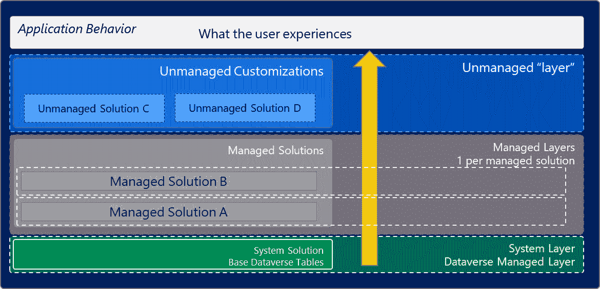

<st c="7171">图 4.1 – 解决方案层</st>

<st c="7199">在</st> **<st c="7214">系统解决方案</st>** <st c="7229">和</st> **<st c="7238">系统层</st>**<st c="7250">的基础上，每个</st> <st c="7258">托管解决方案会创建自己的托管解决方案层。</st> <st c="7286">如果多个解决方案更改同一底层组件（资产），则最后的自定义会生效（</st>*<st c="7417">最后的更改有效</st>*<st c="7431">）。</st> <st c="7435">为了避免与其他解决方案的合并冲突，最佳做法是使用唯一的资产名称，例如在常见 Dataverse 表中使用唯一的表单和视图名称。</st> <st c="7592">由于自动化部署管道在后台运行，我们也需要关注此类冲突</st> <st c="7696">情况。</st>

<st c="7711">为了支持现代的 ALM 和 DevOps 流程，除了拥有不可变的二进制文件（解决方案）外，我们还</st> <st c="7827">需要版本号。</st> **<st c="7849">版本号</st>** <st c="7864">帮助开发人员和运维团队识别生产环境中运行的软件。</st> <st c="7956">Power Platform 解决方案也提供版本管理功能，我们将在</st> <st c="8047">下一节中讨论。</st>

# <st c="8060">解决方案和包的版本管理</st>

<st c="8097">每个</st> <st c="8103">解决方案都有一个版本号，遵循以下</st> <st c="8152">知名</st> <st c="8163">模式：</st>

```
 Major.Minor.Build.Revision
```

<st c="8198">版本号的每个部分都有一个</st> <st c="8237">特定的含义：</st>

+   `<st c="8254">主要</st>`<st c="8260">：当软件发生重大变化时，如添加新功能或不兼容的更改时，这个数字会增加。</st>

+   `<st c="8422">小版本</st>`<st c="8428">：当软件进行小幅更改时，例如添加新功能或改进现有功能，且这些更改</st> <st c="8594">向后兼容时，版本号会增加。</st>

+   `<st c="8613">构建</st>`<st c="8619">：当软件发生变化但不影响其功能时，例如修复漏洞或</st> <st c="8747">性能改进时，构建号会增加。</st>

+   `<st c="8771">修订</st>`<st c="8780">：当软件进行小幅更改时，例如修补程序或</st> <st c="8876">安全更新时，修订号会增加。</st>

<st c="8892">Power Platform 解决方案的生命周期涉及多个阶段，包括创建、更新、升级、修补和升级准备。</st> <st c="9038">以下是各个操作的适用时机概述：</st> <st c="9083">这些操作：</st>

+   **<st c="9097">更新</st>**<st c="9104">：此选项用新版本替换我们的解决方案。</st> <st c="9111">不属于新版本的资产不会被删除，仍然可以在环境中使用。</st> <st c="9167">此选项通常比升级方法完成的时间更短，性能最好。</st> <st c="9284">我们可以为托管解决方案创建更新，这些更新会部署到父托管解决方案下。</st> <st c="9383">我们不能通过更新删除组件。</st>

+   **<st c="9550">升级</st>**<st c="9558">：升级将所有补丁合并到解决方案的新版本中。</st> <st c="9570">在升级过程中，任何不再包含在新版本中的组件将被删除。</st> <st c="9626">升级可以立即进行</st> <st c="9733">或分阶段进行。</st>

+   **<st c="9779">升级准备</st>**<st c="9800">：此操作用于在部署解决方案之前准备目标环境。</st> <st c="9807">升级准备不会删除解决方案的先前版本；旧版本和新版本会并排安装。</st> <st c="9881">如果我们需要在完成解决方案升级之前进行数据迁移，可以使用此场景。</st> <st c="10011">解决方案升级。</st>

+   **<st c="10113">补丁</st>**<st c="10119">：补丁仅包括对父托管解决方案所做的修改，例如添加或修改组件和资产。</st> <st c="10129">补丁用于进行小的更新，如热修复。</st> <st c="10248">导入补丁后，它将应用于父解决方案之上。</st> <st c="10311">无法通过补丁删除组件。</st>

<st c="10436">下图显示了 Power Platform 解决方案的生命周期，突出了应用程序的主要阶段：</st> <st c="10540">一个应用程序：</st>


<st c="10650">图 4.2 – 一个解决方案的生命周期</st>

<st c="10686">每个解决方案</st> <st c="10701">都从</st> **<st c="10731">创建</st>** <st c="10737">阶段开始其生命周期。</st> <st c="10745">在</st> **<st c="10756">开发和发布</st>** <st c="10780">阶段，多个更新、升级和补丁作为托管解决方案发布。</st> <st c="10876">在应用程序生命周期结束时，托管解决方案将被删除，进而从</st> <st c="10996">Dataverse 中移除所有自定义对象。</st>

<st c="11010">在托管解决方案的情况下，</st> `<st c="11049">升级</st>` <st c="11056">操作是默认选项，介于</st> `<st c="11096">更新</st>`<st c="11102">、</st> `<st c="11104">升级</st>`<st c="11111">、</st> `<st c="11113">升级阶段</st>`<st c="11130">和</st> `<st c="11136">补丁</st>` <st c="11141">操作之间，而未托管解决方案只能进行</st> <st c="11186">更新。</st>

<st c="11199">Power Platform 解决方案补丁是一种仅更新解决方案中已更改的组件，而不是重新部署整个解决方案的方法。</st> <st c="11351">它们有助于减少部署时间并避免与其他解决方案的冲突。</st> <st c="11441">补丁仅包含父级托管解决方案的更改，如添加或编辑组件和资源。</st> <st c="11554">使用补丁的典型例子包括在画布应用上添加新按钮或扩展自定义或系统表的列定义。</st> <st c="11696">补丁的版本号在</st> `<st c="11738">1</st>` <st c="11739">上递增，反映在</st> `<st c="11747">构建</st>` <st c="11752">号中：</st>

```
 {major}.{minor}.{build+1}.{version}
```

<st c="11796">只有未托管解决方案可以有一个或多个补丁，我们可以将它们导出为托管补丁，部署到其他环境中。</st> <st c="11927">创建补丁的解决方案被锁定，直到补丁被合并并且新版本的解决方案被克隆。</st> <st c="12060">这个版本将获得</st> `<st c="12086">{major}.{minor+1}.{build}.{version}</st>` <st c="12121">版本号，正如我们在</st> <st c="12158">下图中所见：</st>

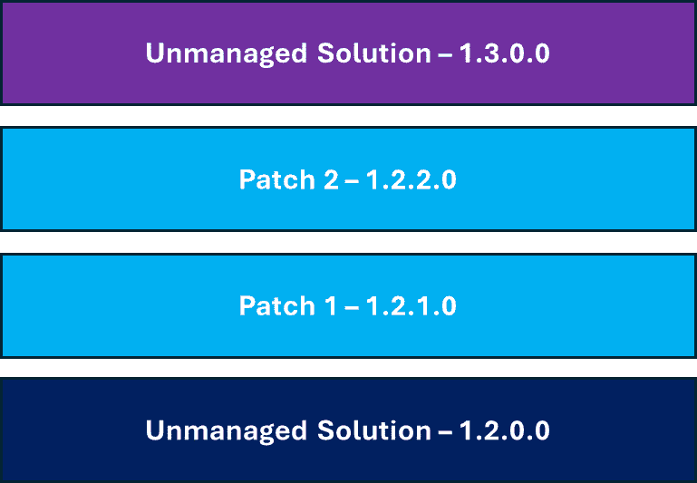

<st c="12247">图 4.3 – 补丁和版本</st>

<st c="12280">父级</st> <st c="12291">解决方案是版本为 1.2.0.0 的未托管解决方案。</st> <st c="12349">补丁分别获得递增的版本号 1.2.1.0 和 1.2.2.0。</st> <st c="12432">在汇总补丁后，未托管解决方案的新版本将</st> <st c="12509">为 1.3.0.0。</st>

<st c="12520">我们建议尽量少使用补丁，因为迟早我们需要将补丁汇总起来，并发布一个</st> <st c="12644">解决方案更新。</st>

<st c="12660">如果我们的解决方案包含太多自定义内容，那么在同步导入过程中可能会遇到超时问题。</st> **<st c="12775">解决方案分阶段</st>** <st c="12791">将导入过程拆分成更可控的阶段，并异步执行这些步骤。</st> <st c="12889">此选项在 Dataverse SDK for .NET 中、通过 Web API、在 Azure DevOps 和 GitHub 的构建工具中，以及在</st> <st c="13020">PAC CLI 中均可使用。</st>

<st c="13028">有两个高级的专业开发工具，我们可以用来深入自定义解决方案的导入和导出过程：</st> 

+   `<st c="13569">SolutionPackager</st>` <st c="13585">是用来解包解决方案 ZIP 文件到解决方案文件夹，或者将解决方案文件夹打包成解决方案 ZIP 文件的工具。</st> <st c="13706">我们还可以配置</st> <st c="13728">是否将生成的 ZIP 文件设置为托管解决方案或</st> <st c="13782">非托管解决方案。</st>

+   **<st c="13801">Package Deployer 工具</st>** <st c="13827">是 Power Platform 中的一个强大工具，允许管理员在 Microsoft Dataverse 实例上部署包。</st> <st c="13949">一个 Package Deployer 包可以包含以下任意内容：</st> <st c="14002">或全部内容：</st>

    +   <st c="14016">一个或多个 Dataverse</st> <st c="14039">解决方案文件</st>

    +   <st c="14053">纯文本文件或从配置迁移工具导出的配置数据文件</st> <st c="14131">。

<st c="14145">Package Deployer 是一个出色的工具，可以将多个解决方案打包为一个整体包，部署到我们的 Power Platform 环境中。</st> <st c="14268">我们只需要在 Visual Studio 2019 或更高版本中创建一个 MSBuild 项目文件，或者使用 Visual Studio Code。</st> <st c="14377">然后，我们可以将解决方案、附加的配置文件、HTML 内容，甚至自定义代码添加到该 MSBuild 项目中。</st> <st c="14500">构建完包后，管理员可以将其安装到目标环境中。</st> <st c="14585">我们的自定义代码会在导入过程中执行，而 HTML 内容会显示给管理员，以便他们了解我们的包究竟做了什么。</st> <st c="14730">我们在</st> *<st c="14780">第二章</st>* <st c="14789">中学习的企业模板也是以这种方式创建的。</st>

<st c="14824">现在我们已经了解了 Power Platform 的解决方案概念，接下来让我们来看看 Dataverse，这些解决方案（以及其他内容）</st> <st c="14958">就存储在这里。</st>

# <st c="14969">那数据呢——Dataverse 和数据建模方面</st>

<st c="15023">我们都知道，没有数据，应用程序是无法正常工作的。</st> <st c="15079">它们要么使用数据来改变自身行为（比如数据驱动的应用程序），要么通过众所周知的</st> **<st c="15210">创建-读取-更新-删除</st>** <st c="15235">(</st>**<st c="15237">CRUD</st>**<st c="15241">) 操作来处理数据。</st>

<st c="15255">Microsoft Dataverse 是一个</st> <st c="15280">基于云的数据平台，是 Microsoft Power Platform 的一层强大的数据库服务，不仅存储关系数据（类似 SQL 表格），还存储文件、日志以及 NoSQL 物联网数据。</st> <st c="15493">在其背后，Dataverse 无缝地使用了许多 Azure 服务，作为</st> **<st c="15570">多语言持久层</st>**<st c="15596">。下图展示了 Dataverse 及其使用的 Microsoft Azure</st> <st c="15628">服务的高级架构：</st>

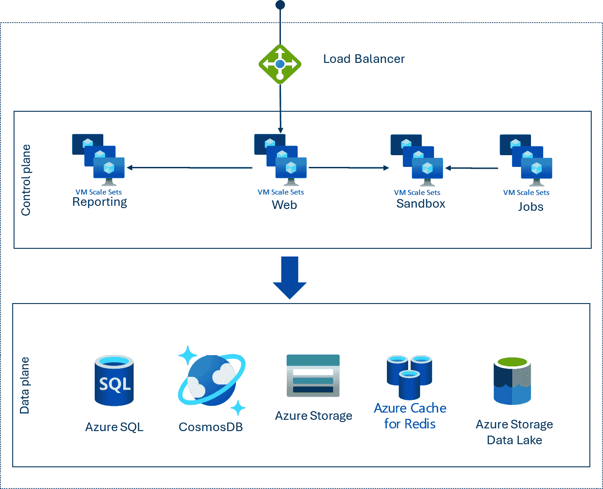

<st c="15928">图 4.4 – Dataverse 多语言概念内部结构</st>

<st c="15986">正如我们在</st> <st c="16007">图中所见，Azure 负载均衡器将请求分发到多个</st> <st c="16070">计算服务：</st>

+   <st c="16087">Web 用于处理</st> **<st c="16105">OData</st>** **<st c="16111">API</st>** <st c="16114">请求</st>

+   **<st c="16123">Azure 作业</st>** <st c="16134">用于处理</st> <st c="16148">异步处理</st>

+   <st c="16171">用于运行客户 C# 代码的沙箱，代码将在</st> <st c="16237">处理流水线中执行</st>

+   <st c="16256">报告服务器处理</st> <st c="16287">分页报告</st>

<st c="16304">我们使用多种存储服务，以最有效和高性能的方式持久化我们的数据。</st> <st c="16416">关系数据</st> <st c="16431">存储在</st> **<st c="16445">Azure SQL 托管实例</st>**<st c="16471">，文件和附件写入</st> **<st c="16510">Azure Blob 存储</st>**<st c="16528">，由 DataFlows 生成的分析</st> <st c="16544">数据存储在</st> <st c="16582">**<st c="16585">Azure 数据湖存储</st>**<st c="16608">。我们还使用</st> **<st c="16618">弹性表</st>** <st c="16632">，一个用于存储</st> **<st c="16665">物联网</st>** <st c="16683">(</st>**<st c="16685">IoT</st>**<st c="16688">) 数据</st> <st c="16696">的全新概念，支持数千万条记录</st> <st c="16729">，由</st> **<st c="16740">Azure</st>** **<st c="16746">Cosmos DB</st>**<st c="16755">提供支持。</st>

<st c="16756">Dataverse 管理</st> <st c="16775">所有这些 Azure 数据服务，提供 99.9% 的可用性、企业级可扩展性、备份、审计日志和灾难恢复管理。</st> <st c="16930">Dataverse 也是 Dynamics 365</st> <st c="17003">产品系列背后的主要数据存储解决方案。</st>

<st c="17018">数据库服务的一个关键特点是内置的安全解决方案，采用严格的基于角色的访问模型，以及行级和列级的安全配置。</st> <st c="17210">Dataverse 安全性基于基于角色的安全模型，保护数据的完整性和隐私，同时支持高效的数据访问和协作。</st> <st c="17368">可以访问 Dataverse 的用户是 Microsoft Entra ID 账户，也就是 Azure AD 用户。</st> <st c="17457">每个用户可以被分配一组预定义的安全角色，这些角色决定了用户可以访问的记录类型、用户可以管理的数据范围以及他们可以执行的具体任务。</st> <st c="17664">该模型被称为行级安全性，它仅提供用户进行工作所需的适当级别的信息访问。</st> <st c="17815">例如，用户可以查看和编辑他们创建的记录。</st> <st c="17884">他们的主管可以查看和编辑他们下属创建的所有记录。</st> <st c="17961">常见的</st> **<st c="17968">安全角色</st>** <st c="17982">如下：</st>

+   **<st c="17998">系统管理员</st>**<st c="18019">：此</st> <st c="18026">角色可以访问所有数据，并执行所有任务，包括定制</st> <st c="18104">系统</st>

+   **<st c="18114">系统定制员</st>**<st c="18132">：此</st> <st c="18140">角色可以定制系统，但无法访问</st> <st c="18198">所有数据</st>

+   **<st c="18206">环境管理员</st>**<st c="18224">：此</st> <st c="18232">角色可以访问环境中的所有资源</st> <st c="18284">包括 Dataverse</st>

+   **<st c="18303">环境创建者</st>**<st c="18321">：此</st> <st c="18328">角色可以创建新的环境资源，例如应用、流程和 API，但不能访问</st> <st c="18433">环境中的数据（Dataverse）</st>

+   **<st c="18456">基础用户</st>**<st c="18467">：此</st> <st c="18475">角色对数据的访问有限，并且只能执行</st> <st c="18523">基本任务</st>

<st c="18534">Dataverse 还</st> <st c="18549">提供</st> `<st c="18826">薪资</st>` <st c="18832">列，位于</st> <st c="18847">这些记录中。</st>

<st c="18861">此外，Dataverse</st> <st c="18884">提供</st> **<st c="18894">数据丢失预防</st>** <st c="18914">(</st>**<st c="18916">DLP</st>**<st c="18919">) 功能，以强制执行跨连接器的策略。</st> <st c="18974">策略可以在租户或环境级别定义。</st> <st c="19034">稍后我们将看到，每个环境可以创建一个或零个 Dataverse。</st> <st c="19115">环境级别的策略适用于环境级别，仅在该级别适用，而租户级别的策略适用于整个租户，并优先于环境级别的策略。</st> <st c="19315">DLP 的管理和治理涉及事件警报和报告，为管理员提供关于策略匹配的详细信息，使其能够有效监视和保护敏感数据。</st> <st c="19527">这些报告帮助管理员了解随时间变化的 DLP 策略和规则匹配次数，通过动作和位置过滤这些匹配，并确定规则匹配是上升还是下降。</st>

<st c="19729">零信任安全原则</st> **<st c="19734">是</st>** <st c="19763">基于的理念，即信任是一种漏洞，安全必须设计为</st> *<st c="19872">从不信任，始终验证</st>*<st c="19898">的策略。这意味着，与其假设企业防火墙后的所有内容都是安全的，零信任模型假定存在入侵，并像来自不受控网络的请求一样验证每个请求。</st> <st c="20109">在 Dataverse 和 Power Platform 的背景下，可以通过使用基于角色的访问控制、字段级安全性和 DLP 功能来应用零信任安全原则，以强制执行策略和保护数据。</st> <st c="20323">通过在设计安全角色时实施</st> <st c="20338">最低特权策略，我们可以确保用户只能访问他们工作所需的资源。</st> <st c="20487">此外，我们可以使用 Microsoft Entra ID 管理用户身份和访问，并实施</st> **<st c="20582">即时访问</st>** <st c="20594">(</st>**<st c="20596">JIT</st>**<st c="20599">) 和</st> **<st c="20606">仅够访问</st>** <st c="20624">(</st>**<st c="20626">JEA</st>**<st c="20629">) 策略，以确保用户只在需要时访问所需内容。</st> <st c="20716">遵循零信任安全原则，我们可以最大限度地减少数据泄露风险，并保护组织的数据，同时仍能实现高效的数据访问和协作。</st>

<st c="20903">除了这些全面的功能外，Dataverse</st> <st c="20958">还有一个通用的数据库架构。</st> <st c="20989">该</st> **<st c="20993">通用数据模型</st>** <st c="21010">（</st>**<st c="21012">CDM</st>**<st c="21015">）是由微软及其合作伙伴发布给开源社区的，存储在 GitHub 上的一组共享、标准化的数据架构。</st> <st c="21022">它将数据统一为已知的形式，并在多个应用程序和部署中应用结构化和语义一致性，使数据管理和应用开发更加简便。</st> <st c="21151">CDM 受到 Dynamics 365 中数据架构的影响，涵盖了广泛的业务领域。</st> <st c="21323">它带来了包括</st> **<st c="21489">账户</st>**<st c="21496">，</st> **<st c="21498">客户</st>**<st c="21506">，</st> **<st c="21508">产品</st>**<st c="21515">，</st> **<st c="21517">机会</st>**<st c="21528">，</st> **<st c="21530">销售</st>**<st c="21534">，</st> **<st c="21536">采购订单</st>**<st c="21550">，等等，通用数据表定义已加入 Dataverse。</st> <st c="21580">CDM 定义是开放的，任何希望使用这些定义的服务或应用程序都可以访问。</st> <st c="21677">通过使用 CDM，我们可以轻松地与 Dataverse 和其他服务集成，并可以构建使用我们可用的实体定义的自定义应用程序。</st> <st c="21840">这可以节省我们的时间和精力，因为我们不需要从头开始构建新的数据模型</st> <st c="21917">。

<st c="21930">Dataverse 架构定义，如</st> **<st c="21969">表格</st>**<st c="21975">，</st> **<st c="21977">列</st>**<st c="21984">，</st> **<st c="21986">关系</st>**<st c="21999">，</st> **<st c="22001">业务规则</st>**<st c="22015">，</st> **<st c="22017">视图</st>**<st c="22022">，</st> **<st c="22024">表单</st>**<st c="22029">，</st> **<st c="22031">仪表盘</st>**<st c="22041">，</st> **<st c="22043">图表</st>**<st c="22049">，</st> **<st c="22051">消息</st>**<st c="22059">，</st> **<st c="22061">键</st>**<st c="22065">，和</st> **<st c="22071">命令</st>**<st c="22079">，是解决方案定义的一部分，这意味着数据库级别的更改是开发人员可以包含在他们的解决方案中的资产之一。</st> <st c="22228">另一方面，解决方案本身存储在 Dataverse 中。</st> <st c="22293">当我们将解决方案导入到 Dataverse 时，它的元数据和依赖配置会被导入到各种系统表中，例如</st> **<st c="22427">解决方案</st>**<st c="22435">，</st> **<st c="22437">解决方案组件属性配置</st>**<st c="22479">，</st> **<st c="22481">解决方案历史</st>**<st c="22497">，</st> **<st c="22499">解决方案组件历史</st>**<st c="22525">，等等。</st> <st c="22538">在元数据导入后，底层系统流会安装解决方案并应用</st> <st c="22624">这些更改。</st>

<st c="22636">Dataverse 和解决方案中的数据</st>

<st c="22667">要向 Power Platform 解决方案中的 Dataverse 表添加数据，我们可以使用</st> **<st c="22746">导入数据</st>** <st c="22757">选项，该选项位于 Power Apps 的</st> **<st c="22795">表格</st>** <st c="22801">页面顶部的命令栏中。</st> <st c="22822">（故意）没有方法将数据包含在 Power Platform 解决方案中。</st> <st c="22900">但是，我们可以将数据导出，然后将其导入到新环境中。</st> <st c="22977">另外，如果当前生产环境中没有内容，我们可以在 Power Platform 管理中心复制整个开发环境。</st> <st c="23120">推荐的工具和方法包括使用配置迁移工具、包部署工具、Power Platform 数据流，或在 Dataverse SDK for .NET 中编写代码以在目标环境中创建实体，这些都是导入数据</st> <st c="23350">到环境中的推荐工具和方法。</st>

<st c="23368">Dataverse</st> <st c="23379">实例存在于环境中，这是一个用于在租户范围内组织我们的应用和解决方案的附加概念。</st> <st c="23489">在下一部分中，我们将了解如何从</st> <st c="23564">专业开发者的角度考虑这些环境。</st>

# <st c="23585">环境、托管环境和环境策略</st>

<st c="23646">环境</st> <st c="23660">是我们的应用、流程、连接和其他组件的容器，同时还具备安全性和数据访问管理功能。</st> <st c="23790">借用云计算世界的类比，我们可以将 Microsoft Azure 订阅看作是环境，它们作为逻辑容器，能够托管一个或多个应用。</st> <st c="23975">也许</st> *<st c="23992">工作负载</st>* <st c="24000">这个术语在这里更为合适，因为我们的 Power Platform 应用可能包括 Power Apps、Flows、自定义 Copilots、Power Pages 网站等。</st> <st c="24142">强烈推荐使用解决方案将工作负载</st> <st c="24204">部署到环境中。</st>

<st c="24220">Microsoft Power Platform 租户可以拥有数千个环境。</st> <st c="24290">Microsoft Entra ID 是提供安全控制、治理和环绕 Power Platform 每个产品的保护框架的粘合剂。</st> <st c="24428">如前所述，Power Platform 运行在 Microsoft Azure 之上。</st> <st c="24497">环境是隔离的关键概念，用于在不同的地理位置定义系统边界。</st> <st c="24603">我们可以创建没有 Dataverse 的环境，但这些环境仅提供非常</st> <st c="24690">有限的功能。</st>

<st c="24711">没有 Dataverse 的环境</st>

<st c="24742">没有 Dataverse 的环境仅支持 Power Apps 画布应用和 Power Automate</st> <st c="24829">云流。</st>

<st c="24841">如果我们使用 Dataverse 创建环境，我们将获得 Power Platform 安全功能的整个范围</st> <st c="24936">。</st> <st c="24955">这意味着我们可以在环境内部的不同层级上分配基于角色的安全角色来</st> <st c="25063">划分安全性。</st>

<st c="25080">在 Power Platform 中，</st> **<st c="25106">业务单元</st>** <st c="25119">代表了一个组织中的单位，该单位执行一个或多个可以在管理层级中汇总的业务职能。</st> <st c="25251">业务单元可以用于镜像公司的组织结构，并控制数据访问。</st> <st c="25358">每个业务单元都有自己的安全角色，这些角色定义了业务单元内用户的访问权限。</st> <st c="25476">有内置的安全角色，如基本用户、系统管理员等，我们也可以创建自己的安全角色。</st> <st c="25611">例如，如果我们引入一个自定义表格来存储审核记录，我们可以创建一个自定义安全角色（例如审核员），使其成员可以读取自定义表格中的所有记录，而其他人只能看到自己的记录。</st> *<st c="25862">我们还可以将这些安全角色添加到</st>* *<st c="25897">解决方案中</st>*<st c="25910">。</st>

**<st c="25911">团队</st>** <st c="25917">是</st> <st c="25922">一群一起工作并共享共同访问权限的用户。</st> <st c="25997">Power Platform 中有两种类型的团队：</st> **<st c="26049">所有者团队</st>** <st c="26061">和</st> **<st c="26065">访问团队</st>**<st c="26077">。所有者团队</st> <st c="26090">拥有记录，并且有安全角色分配给它们，而</st> <st c="26150">访问团队用于授予记录访问权限，但不拥有它们。</st> <st c="26221">一个团队可以由同一组织（在同一环境下）内的一个或多个业务单元的用户组成。</st> <st c="26339">一个用户可以被分配到一个或</st> <st c="26372">多个团队。</st>

<st c="26383">业务单元、团队和用户之间的关系对于控制数据访问和确保用户对记录具有适当的访问权限非常重要。</st> <st c="26556">通过正确设置业务单元和团队，管理员可以确保用户能够有效地协作和共享信息，同时维护</st> <st c="26711">数据安全。</st>

<st c="26725">Microsoft Entra ID 和 Power Platform 环境</st>

<st c="26776">由于 Microsoft Entra ID 和 Power Platform 之间的连接，通常的做法是使用 Microsoft Entra ID 组来授予对 Power Platform 环境以及其中的业务单元和团队的访问权限。</st> <st c="26988">这些环境中的访问权限。</st>

<st c="27007">环境有不同类型</st> <st c="27034">：</st>

+   **<st c="27050">生产环境</st>**<st c="27061">：这是</st> <st c="27075">创建和运行应用、流程及其他资源的默认环境类型。</st> <st c="27160">它具有完整的功能，且可以连接到任何数据源。</st> <st c="27227">只有生产环境才有服务级别协议（SLA）保障，所有生产数据都会备份到配对或辅助的 Azure 区域（启用了地理复制）。</st>

+   **<st c="27386">试用环境</st>**<st c="27392">：这是一个</st> <st c="27405">临时环境，可以用于测试或学习目的。</st> <st c="27478">它具有与生产环境相同的功能，但在 30 天后到期且无法延长或转换。</st>

+   **<st c="27602">沙盒环境</st>**<st c="27610">：这是一个</st> <st c="27621">隔离的环境，可以用于开发、测试或培训目的。</st> <st c="27710">它具有有限的功能，无法连接到生产数据源。</st> <st c="27791">可以根据需要重置、复制或转换回生产环境。</st>

+   **<st c="27858">开发者环境</st>**<st c="27868">：这是一个</st> <st c="27880">特别的环境类型，个人开发者可以使用它来创建和测试应用、流程以及其他资源。</st> <st c="28001">它具有与沙盒环境相同的功能，但容量较小，只能由一个用户使用。</st> <st c="28119">开发者环境不需要许可证，且每个开发者最多可以拥有三个不同的开发者环境。</st> <st c="28233">管理员可以根据</st> <st c="28322">组织的需求，允许或禁止创建开发者环境。</st>

<st c="28343">环境绑定</st> <st c="28366">到一个</st> **<st c="28371">地理位置</st>** <st c="28390">，该地理位置在环境创建后无法更改。</st> <st c="28442">微软 Power Platform 保证数据将保留在选定的地区（数据驻留），且数据永远不会被转移到</st> <st c="28582">其他位置。</st>

<st c="28598">环境还用于</st> <st c="28629">分配</st> **<st c="28638">容量附加组件</st>** <st c="28654">，这些是我们可以购买的，额外添加到我们的 Power Platform 订阅中的。</st> <st c="28722">容量附加组件包括微软 Copilot Studio 消息、Power Pages 容量层级、AI Builder 积分、Power Automate 托管的 RPA、Power Automate 流程或流程挖掘的容量附加组件。</st> <st c="28936">我们可以将其中一些或所有这些容量分配到 Power Platform</st> <st c="29027">管理中心中的不同环境。</st>

<st c="29040">最后，环境可以与 Microsoft Azure 订阅绑定。</st> <st c="29109">Power Platform 的</st> **<st c="29113">按需付费</st>** <st c="29126">(</st>**<st c="29128">PAYGO</st>**<st c="29133">) 服务</st> <st c="29144">例如每个应用的 Power Apps 计量器、Power Pages 认证用户计量器、Power Pages 匿名用户计量器、Dataverse 数据库容量计量器、Dataverse 文件容量计量器以及 Dataverse 日志容量计量器，均通过现有的 Microsoft</st> <st c="29411">Azure 订阅进行交叉计费。</st>

<st c="29431">还有一个更加受控的环境，我们建议在生产中使用。</st> <st c="29516">让我们来了解一下</st> **<st c="29534">托管环境</st>**<st c="29554">。</st>

## <st c="29555">托管环境</st>

<st c="29576">托管环境</st> <st c="29598">是一套帮助管理员大规模管理 Power Platform 的功能。</st> <st c="29671">它提供了多项好处，包括使用 Microsoft Defender 进行的风险评估和威胁警报、具有多年度历史的丰富分析、合规报告以及推荐。</st> <st c="29852">它还允许你审计用户行为。</st> <st c="29890">它通过根据我们组织的需求定制权限、政策和自动化，或仅需单击一下即可激活最佳的开箱即用设置，提供更多的控制。</st> <st c="30083">以下列表详细介绍了</st> <st c="30114">这些功能：</st>

+   **<st c="30140">限制共享</st>** <st c="30154">允许管理员控制其组织内数据和资源的共享。</st> <st c="30241">管理员可以阻止与安全组的共享，并限制可以共享的个人数量。</st>

+   **<st c="30347">每周使用情况洞察</st>** <st c="30369">提供关于我们最热门应用、最具影响力的创建者以及可以安全清理的非活动资源的分析。</st> <st c="30487">这些洞察每周发送到我们的邮箱。</st>

+   **<st c="30543">数据策略</st>**<st c="30557">：Power Platform 中的数据策略允许我们在 Power Apps 和 Power Automate 内使用数据连接器时控制数据流。</st> <st c="30694">DLP 策略使管理员能够通过将 Power Platform 连接器分为业务和非业务组，来隔离业务数据和个人使用数据。</st> <st c="30873">我们还可以选择阻止某些连接器的使用。</st>

+   **<st c="30937">Power Platform 中的管道</st>** <st c="30965">旨在为 Power Platform 客户普及应用生命周期管理（ALM）。</st> <st c="31019">管道为所有创建者、管理员和开发者提供了一个简单易用的方法来进行 ALM 自动化、持续集成（CI）和持续交付（CD）工作流。</st> <st c="31152">我们将在</st> <st c="31184">接下来的章节中介绍这个话题。</st>

+   **<st c="31198">Maker 欢迎内容</st>** <st c="31220">允许管理员为新加入的 Maker 添加欢迎信息。</st> <st c="31284">此信息可以包括经过验证的资源、公司特定的资源以及即将举行的内部活动链接，以帮助新 Maker 启动 Power Platform。</st> <st c="31298">欢迎内容可以添加到托管环境中，并且可以包括纯文本</st> <st c="31462">或 Markdown。</st>

+   **<st c="31559">解决方案检查器</st>** <st c="31580">工具允许我们检查解决方案的最佳实践和常见问题。</st> <st c="31657">它分析我们的代码和定制，并提供详细报告，包含问题信息以及如何修复。</st> <st c="31775">这有助于提高我们在托管环境中的解决方案的性能、可维护性和可靠性。</st> <st c="31886">管理员可以在部署过程中强制执行解决方案检查器的执行。</st>

+   **<st c="31962">IP 防火墙</st>** <st c="31978">允许我们根据来访请求的 IP 地址限制对我们的数据和资源的访问。</st> <st c="32082">这有助于防止外部未经授权的访问我们组织的数据和资源。</st>

+   **<st c="32180">IP Cookie 绑定</st>** <st c="32198">是一项安全功能，将用户的会话 Cookie 绑定到其 IP 地址。</st> <st c="32277">这有助于防止会话劫持攻击，其中攻击者窃取用户的会话 Cookie 并用它来</st> <st c="32387">冒充用户身份。</st>

+   **<st c="32404">客户管理密钥</st>** <st c="32427">（</st>**<st c="32429">CMK</st>**<st c="32432">）允许我们使用自己的加密密钥对静态数据进行加密。</st> <st c="32505">这使我们对数据安全性有更多控制，并帮助我们满足</st> <st c="32580">合规要求。</st>

+   **<st c="32604">Lockbox</st>** <st c="32612">为我们的数据提供额外的安全层。</st> <st c="32668">它允许我们控制微软支持工程师是否可以访问我们的数据来解决支持案例。</st> <st c="32774">我们可以批准或拒绝每一个访问请求，所有访问都将记录和审计</st> <st c="32854">以确保合规。</st>

+   **<st c="32869">扩展备份</st>** <st c="32885">允许我们保留更长时间的数据备份。</st> <st c="32947">这可以帮助我们在数据意外删除</st> <st c="33013">或损坏的情况下恢复数据。</st>

+   **<st c="33027">桌面流 DLP</st>** <st c="33048">是 Power Platform 中的一项功能，允许我们对桌面流（机器人流程自动化流）应用 DLP 策略。</st> <st c="33170">这有助于防止在不同系统</st> <st c="33271">和应用程序之间意外或故意共享敏感数据。</st>

+   **将数据导出到 Azure Application Insights** <st c="33333">使我们能够将应用和流程的遥测数据发送到 Azure Application Insights。</st> <st c="33422">这使我们能够监控</st> <st c="33452">应用和流程的性能和使用情况，并进行诊断和</st> <st c="33516">故障排除。</st>

+   **Power Platform 中的目录** <st c="33562">是我们在组织中存储资产的中央仓库。</st> <st c="33623">它是一个私有市场，我们可以通过它与</st> <st c="33820">其他开发者共享自定义连接器、PAC 框架控件、Power Automate 流程、Canvas 应用和基于模型的应用，以及各种其他模板。</st>

+   **默认环境路由** <st c="33865">允许我们控制哪个环境作为组织中新用户的默认环境。</st> <st c="33963">这有助于确保新用户自动加入适合其角色</st> <st c="34067">和职责的环境。</st>

+   **通过 Copilot 创建应用描述** <st c="34129">是一个由 AI 驱动的功能，帮助我们创建应用描述。</st> <st c="34194">它使用自然语言处理技术理解我们的需求以及我们所做的更改，从而为</st> <st c="34342">我们的应用提供类似人类的描述（变更日志）。</st>

<st c="34358">托管环境</st>

<st c="34379">我们强烈建议在生产工作负载中使用托管环境。</st> <st c="34453">一般来说，所有环境类型为</st> `<st c="34505">生产</st>` <st c="34515">的环境都应为托管环境。</st> <st c="34548">微软在托管环境方面投入巨大，越来越多的功能正在发布。</st> <st c="34645">我们可以通过发布计划跟踪即将发布的功能；</st> <st c="34705">请见</st> [<st c="34709">https://releaseplans.microsoft.com</st>](https://releaseplans.microsoft.com)<st c="34743">。</st>

<st c="34744">在讨论环境之后，让我们探索一下为什么</st> **环境策略** <st c="34817">对在企业层面维护和管理成百上千的环境至关重要。</st>

## <st c="34902">环境策略</st>

<st c="34925">这是我们需要决定的最关键问题之一，不仅在首次注册我们的 Power Platform 租户时需要考虑，每次启动新项目时也必须做出此决定。</st> <st c="35097">环境策略定义了如何创建环境，针对每个工作负载和项目我们需要多少环境，如何应用我们组织的安全策略，如何建立基于角色的访问管理，以及环境如何与其他产品相关联，例如 Microsoft Azure 订阅、Azure DevOps 项目或 GitHub</st> <st c="35436">企业存储库。</st>

<st c="35460">以下是最</st> <st c="35488">常见的策略：</st>

+   **<st c="35506">临时</st>**<st c="35513">：顾名思义，这里完全没有策略。</st> <st c="35523">环境是随机创建的；即使是默认环境也用于托管</st> <st c="35647">生产工作负载。</st>

+   **<st c="35668">部门级</st>**<st c="35681">：组织中的每个部门都有自己的环境。</st> <st c="35690">人力资源、财务、销售、运营及所有其他部门都有专用的生产环境，在其中托管和执行多个解决方案。</st> <st c="35746">这些部门环境还可以有开发和测试环境，有时这些环境是与更多的</st> <st c="36005">业务单元共享的。</st>

+   **<st c="36020">基于项目</st>**<st c="36034">：大型</st> <st c="36043">工作负载有专用的开发、测试和生产环境。</st> <st c="36114">这些项目会有开发、测试、生产环境，但较小的解决方案仍然存在于</st> <st c="36201">部门环境中。</st>

+   **<st c="36227">多租户</st>**<st c="36240">：开发人员</st> <st c="36253">在不同的租户中工作，以创建和开发 Power Platform 解决方案。</st> <st c="36329">高级自动化的管道和工作流将解决方案部署到</st> <st c="36436">生产租户的测试和生产环境。</st>

<st c="36454">下图展示了结合部门级和基于项目策略的典型部门环境策略，基于</st> <st c="36596">项目需求：</st>

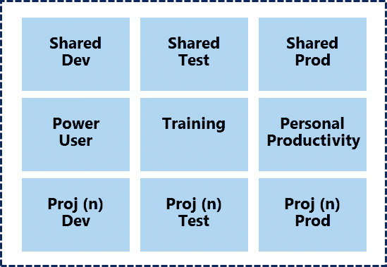

<st c="36656">图 4.5 – 一个业务单元的环境策略</st>

<st c="36712">这里有</st> <st c="36723">共享的开发、共享的测试和共享的生产环境，用于在业务单元内部共享的工作负载。</st> <st c="36837">小型工作负载和/或部门广泛使用的应用程序在这里托管。</st> <st c="36924">复杂的解决方案将获得专用的基于项目的环境，包括开发、测试和生产环境类型（参见</st> *<st c="37037">Proj (n) Dev</st>* <st c="37049">–</st> *<st c="37052">Proj (n) Test</st>* <st c="37065">和</st> *<st c="37070">Proj (n) Prod</st>*<st c="37083">，其中</st> *<st c="37091">n</st>* <st c="37092">表示唯一项目的数量）。</st>

<st c="37135">还有专门的环境用于培训和 Power Platform 的高级用户，他们会试验新功能。</st> <st c="37259">例如，这是唯一一个启用了过程挖掘附加组件供测试的环境。</st> <st c="37378">个人生产力为业务用户提供一个沙箱环境，供他们进行个人实验</st> <st c="37477">用例的测试。</st>

<st c="37487">需要特别注意的是，这个概念为每个业务单元提供了隔离的环境，确保这些环境在部门内的治理、合规性和安全控制。</st> <st c="37695">其他业务单元完全无法访问这些环境。</st> <st c="37753"> </st>

<st c="37760">为了在全球拥有多个站点的全球组织中扩展这一概念，我们建议采用以下方法：</st> <st c="37875"> </st>

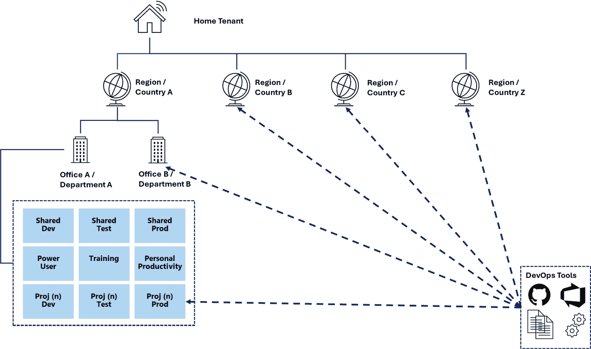

<st c="38394">图 4.6 – 全球组织的环境策略</st>

<st c="38456">办公室 A/部门 A 代表</st> <st c="38489">一个在区域/国家 A 内部的业务单元，使用一个共同的租户。</st> <st c="38561">每个地区和办公室（业务单元或部门）都拥有相同的结构，并根据性能（靠近最终用户）和合规性要求（数据驻留要求）共享和专用环境。</st> <st c="38772">解决方案的开发可以在这个租户中进行，但该概念允许我们使用更多租户进行开发。</st> <st c="38891">自动化在这里是不可避免的。</st> <st c="38923">ALM 和 DevOps 工具帮助我们根据项目需求自动创建环境，并将解决方案自动部署到不同的地理位置，甚至是</st> <st c="39086">不同的租户。</st>

<st c="39104">Power Automate 流程</st>

<st c="39125">Power Automate 流程</st> <st c="39146">与 Power Platform for Admins V2 连接器结合，在平台内提供类似 ALM 和 DevOps 的功能。</st> <st c="39257">我们可以使用一些活动来创建环境、分配安全角色，并设置 DLP 策略。</st> <st c="39363">这个连接器还支持跨租户集成，这是一种先前描述的多租户概念，属于</st> <st c="39476">环境策略之一。</st>

<st c="39499">环境策略不仅仅关注 Power Platform 中的环境，它还描述了与其他周围服务的交互。</st> <st c="39642">它定义了是否需要为任何新环境或新项目创建一个新的 Azure 订阅</st> <st c="39685">，或者仅在现有的 Azure 订阅中创建一个资源组。</st> <st c="39817">它还为 ALM 过程提供了指导方针，例如</st> *<st c="39872">Proj (n)</st>* <st c="39880">应将其工件（托管和非托管解决方案）存储在</st> <st c="39945">一个新的</st> **<st c="39950">Azure DevOps Services</st>** <st c="39971">项目中，或者存储在该</st> **<st c="39991">GitHub Enterprise</st>** <st c="40008">代码库中。</st> <st c="40021">最后</st> <st c="40025">但同样重要的是，该策略涵盖了安全性考虑因素，例如在环境创建过程中为管理员、开发者、制造者和用户创建 Microsoft Entra ID 安全组。</st> <st c="40217">当我们完全</st> <st c="40230">定义这些围绕环境策略的领域时，我们部分地解决了</st> **<st c="40309">DevSecOps</st>** <st c="40318">原则。</st>

<st c="40330">在熟悉环境策略的概念后，让我们深入了解第一个 Power Platform 管道，它可以在</st> <st c="40494">一个部门内部部分管理这种方法。</st>

# <st c="40507">托管管道 – 我们的第一个 CI/CD</st>

<st c="40543">现在我们已经</st> <st c="40556">具备了一切</st> <st c="40567">创建我们第一个 Power Platform CI/CD 管道的条件，借助平台内置的功能。</st>

## <st c="40685">Power Platform 管道</st>

<st c="40710">Power Platform 管道</st> <st c="40735">是由平台管理的 CI/CD 管道。</st> <st c="40781">它们提供 ALM 功能，可以以完全自动化的方式构建和部署我们的解决方案，而无需深入了解 DevOps 工具，如 Azure</st> <st c="40926">DevOps Services 或 GitHub Enterprise。</st> <st c="40965">当然，我们可以将这些工具集成到我们的托管管道中，将托管和非托管解决方案存储在 Git 仓库中，但这不是强制性的。</st> <st c="41131">Power Platform 管道的理念是让构建和发布过程民主化，并为管理员</st> <st c="41304">和开发者提供一个易于配置和使用的体验。</st>

<st c="41319">平台管道是一个 Dynamics 365 应用，我们需要在我们的环境之一中安装它。</st> <st c="41420">对于内置的管道管理，我们只需拥有托管环境；无需 Dynamics 365 许可证。</st> <st c="41540">强烈建议为安装此应用创建一个专用环境。</st> <st c="41632">该环境被称为</st> **<st c="41663">主机环境</st>** <st c="41679">，因为</st> <st c="41688">它托管着管道定义、管道运行历史、安全设置以及部署工件历史，正如以下</st> <st c="41829">图所示：</st>

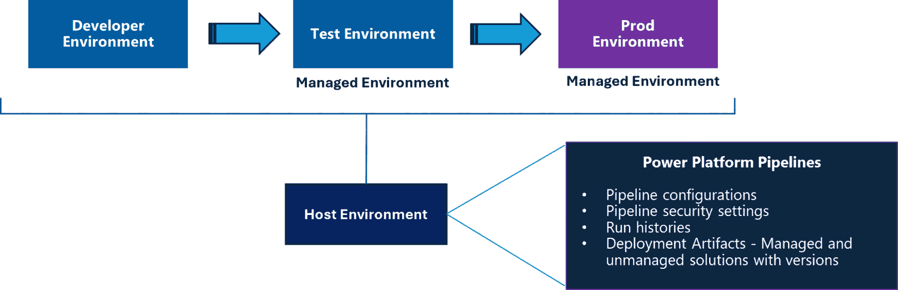

<st c="42083">图 4.7 – Power Platform 管道中的环境</st>

<st c="42136">开发者环境</st> <st c="42159">是开发者或创作者创建和修改解决方案的环境。</st> <st c="42240">测试和生产环境代表</st> <st c="42276">那些</st> **<st c="42281">目标环境</st>** <st c="42300">，这些环境通过我们定义的管道部署已托管版本的解决方案。</st> <st c="42381">测试和生产环境必须是托管环境，而开发者环境和主机环境可以是普通环境。</st> <st c="42514">每个管道从一个开发者环境开始，并继续在一个或多个链式的</st> <st c="42604">目标环境中运行。</st>

<st c="42624">Azure DevOps 服务管道</st>

<st c="42656">Power Platform 管道 Dynamics 365 应用</st> <st c="42698">采用底层 Azure DevOps 服务管道和 Azure DevOps 服务部署组的完全托管方式。</st> <st c="42818">这一切对我们是完全隐藏的，作为 Azure</st> <st c="42911">DevOps 服务上的一个 SaaS 功能提供。</st>

<st c="42927">作为托管环境的高级功能之一，名为 Power Platform 管道的 Dynamics 365 应用将以下 Dataverse 表带到</st> <st c="43080">主机环境中：</st>

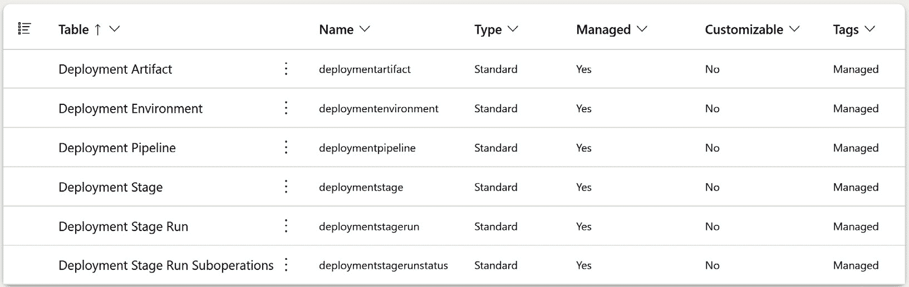

<st c="43540">图 4.8 – Power Platform 管道在主机环境中的 Dataverse 表</st>

**<st c="43617">部署工件</st>**<st c="43637">，</st> **<st c="43639">部署环境</st>**<st c="43661">，</st> **<st c="43663">部署管道</st>**<st c="43682">，</st> **<st c="43684">部署阶段</st>**<st c="43700">，</st> **<st c="43702">部署阶段运行</st>**<st c="43722">，和</st> **<st c="43728">部署阶段运行子操作</st>** <st c="43762">是标准的 Dataverse 表，我们也可以使用它们基于不同的触发条件创建审批流程。</st> <st c="43845">该</st> **<st c="43882">部署工件</st>** <st c="43901">表格回溯存储了由管道创建的托管和非托管解决方案。</st> <st c="44004">托管和非托管解决方案的最大大小为</st> <st c="44063">128 MB。</st>

<st c="44070">除了这些表，Power Platform Pipeline 在</st> <st c="44170">主机环境中引入了两个额外的安全角色：</st>

+   **<st c="44187">部署管道管理员</st>**<st c="44221">：此角色的所有者可以在</st> **<st c="44288">部署管道</st>** <st c="44265">配置中创建部署</st> <st c="44307">配置。</st> <st c="44323">这是一个由 Power Platform Pipelines D365 应用安装的模型驱动应用，帮助管理员配置存储在上述</st> <st c="44518">Dataverse 表中的环境、阶段和管道。</st>

+   **<st c="44535">部署管道用户</st>**<st c="44560">：此角色的所有者可以在相应的环境中使用在部署管道配置应用中创建的管道。</st> <st c="44693">如果该用户有权访问该环境，并且来自</st> **<st c="44770">部署管道</st>** <st c="44789">表格的管道记录与他们共享，那么他们有资格在该环境中的任何解决方案中使用该管道。</st>

<st c="44897">在解决方案视图中，</st> **<st c="44933">Pipelines</st>** <st c="44942">选项卡的用户（开发者）体验如下：</st>

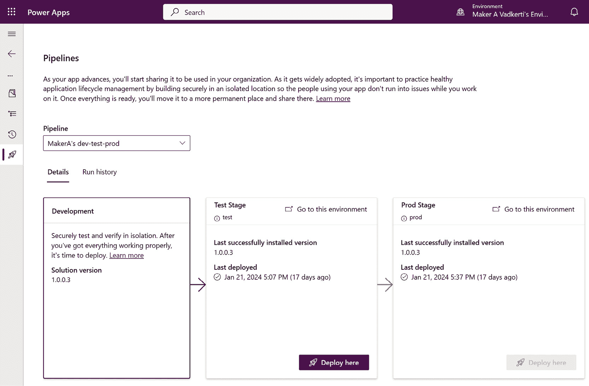

<st c="45885">图 4.9 – 解决方案中的 Pipelines 用户体验</st>

<st c="45940">我们处于一个解决方案中（编辑一个非托管解决方案），当配置了管道时，左侧将显示一个额外的</st> **<st c="46047">管道</st>** <st c="46055">选项卡。</st> <st c="46093">在我们的示例中，下拉框中有一个管道，目标是两个环境：首先是测试环境，然后是生产环境。</st> <st c="46215">由于该用户通过共享的 Dataverse 部署管道表的行访问更多的管道，下拉框提供了</st> <st c="46344">更多选择。</st>

<st c="46357">为了能够从源环境执行在部署管道配置工具中配置的管道，必须满足以下条件：</st> <st c="46507"> </st>

+   <st c="46514">我们需要与制造者共享管道记录（</st>**<st c="46553">读取权限</st>**<st c="46569">）。</st> <st c="46585">我们应该使用适当的 Microsoft Entra 组来赋予他们这个权限。</st> <st c="46657"> </st>

+   <st c="46665">我们需要具有从源环境导出解决方案的权限，并且需要具有将解决方案导入到目标环境的适当权限。</st> <st c="46829">内置的</st> **<st c="46842">系统自定义者</st>** <st c="46859">和</st> **<st c="46864">环境制造者</st>** <st c="46881">安全角色具有</st> <st c="46891">这些权限。</st> <st c="46902"> </st>

<st c="46915">然后，管道默认会代表触发操作的用户部署管理解决方案。</st> <st c="47026">如果我们希望使用服务帐户而不是用户，则支持使用服务主体。</st> <st c="47119">在这种情况下，解决方案导入到目标环境是由分配的服务主体代表进行的，主要的安全优势是只有服务主体能够访问</st> <st c="47319">生产环境。</st>

<st c="47342">部署管道的真正优势在于，我们可以在 CD 管道中引入那些额外的</st> *<st c="47428">质量门</st>* <st c="47441">，正如我们在</st> *<st c="47488">第一章</st>* <st c="47497">中讨论的那样，通过在新版本解决方案部署到目标环境之前构建我们自己的部署审批逻辑（发布审批）。</st> <st c="47622">这些质量门可以从非常简单的发布经理审批到高级自动化测试执行不等。</st> <st c="47733">在每个</st> **<st c="47746">部署阶段</st>** <st c="47774">都有一个</st> **<st c="47790">预部署步骤要求</st>** <st c="47806">选项，我们可以使用该选项通过 Power Automate Cloud Flow 触发基于自定义逻辑的审批流程。</st> <st c="47905">部署请求将处于待审批状态，直到获得批准。</st> <st c="47970">下图显示了在部署管道配置工具中</st> **<st c="48001">预部署步骤要求</st>** <st c="48029">和</st> **<st c="48034">预导出步骤要求</st>** <st c="48058">选项：</st> <st c="48094"> </st>

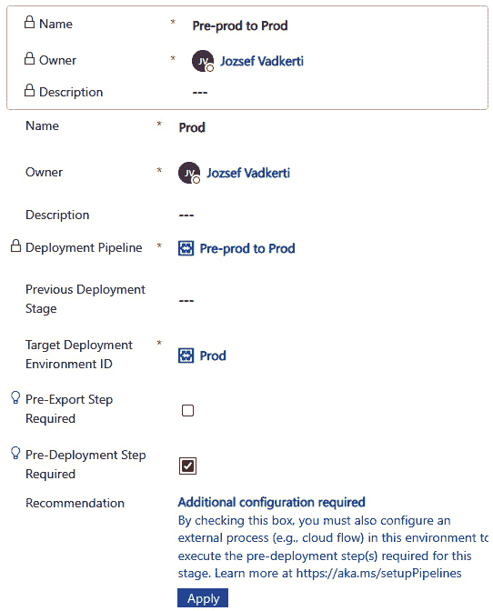

<st c="48580">图 4.10 – 在部署管道配置工具中创建新的部署</st>

<st c="48661">借助</st> **<st c="48679">导出前步骤要求</st>**<st c="48703">，我们可以引入在解决方案首次从开发环境导出为托管和未托管解决方案之前执行的自定义验证逻辑。</st>

<st c="48870">质量门控中涉及的</st> <st c="48875">云流应在主机环境中创建，其触发条件为 Dataverse 操作。</st> <st c="49009">我们可以创建多个云流来响应同一个</st> <st c="49065">管道事件。</st>

<st c="49080">目前，使用</st> <st c="49128">托管管道存在一些限制：</st>

+   <st c="49146">多个开发者在专用的开发环境中协作同一解决方案时，需要更谨慎的流程以避免覆盖彼此的更改。</st> <st c="49314">目前，管道只支持从开发环境到生产环境的单向流动。</st> <st c="49426">这意味着将解决方案的最新版本拉取并部署到不同的开发环境中需要谨慎且</st> <st c="49562">手动干预。</st>

+   <st c="49582">回滚功能部分支持。</st> <st c="49616">我们已经可以在 Power Platform 管道中将解决方案的早期版本重新部署到目标环境，但我们无法像</st> <st c="49789">一个步骤一样回滚整个多阶段管道。</st>

## <st c="49798">逐步操作指南 – 创建我们的第一个 CI/CD 管道</st>

<st c="49859">让我们使用 Power Platform 管道创建我们的</st> <st c="49876">第一个端到端的 CI/CD 管道</st> <st c="49908">。</st> <st c="49941">我们将做的是从 GitHub 仓库中选取一个环境模板和一个可用的解决方案。</st> <st c="50067">我们将使用这些设置一个管道，将解决方案的托管版本从未托管版本中构建出来，并将其从开发环境部署到</st> <st c="50231">生产环境：</st>

1.  <st c="50254">安装 PAC CLI（假设.NET 6.0 已安装在</st> <st c="50310">我们的环境中）：</st>

    ```
    <st c="50327">dotnet tool install --global Microsoft.PowerApps.CLI.Tool</st>
    ```

1.  <st c="50385">安装</st> <st c="50398">PowerShell 模块：</st>

    ```
    <st c="50416">Install-Module -Name Microsoft.PowerApps.Administration.PowerShell</st>
    ```

1.  <st c="50483">为托管托管管道创建一个环境。</st> <st c="50541">此环境将代表管道的主机环境。</st> <st c="50612">我们应选择与我们开发、测试和生产环境相同的区域创建环境：</st>

    ```
    <st c="50716">#Authentication – in both tools</st>
    <st c="50748">Add-PowerAppsAccount</st>
    <st c="50769">pac auth create</st>
    <st c="50785">#Create Host Environment - Pipelinehost</st>
    <st c="50825">$result=New-AdminPowerAppEnvironment -Location europe -DisplayName 'Pipelinehost' -ProvisionDatabase -EnvironmentSku Production</st>
    ```

1.  <st c="50953">安装</st> <st c="50965">Power Platform Pipelines Dynamics 365 应用。</st> <st c="51009">PAC CLI 提供了一种简便的方式将 Dynamics 365 应用安装到环境中</st> <st c="51070">（截至本书写作时没有 PowerShell cmdlet）：</st>

    ```
    <st c="51153">#Install Power Platform Pipelines to "Pipelinehost"</st>
    <st c="51205">#It takes approx.</st> <st c="51224">5 minutes</st>
    <st c="51233">pac application install `</st>
     <st c="51259">--environment $resultNewEnvironment.EnvironmentName `</st>
     <st c="51313">--application-name "msdyn_AppDeploymentAnchor"</st>
    ```

1.  <st c="51360">创建一个</st> <st c="51370">开发环境：</st>

    ```
    <st c="51392">pac admin create `</st>
     <st c="51411">--name "DevelopmentEnvironment" `</st>
     <st c="51445">--currency EUR `</st>
     <st c="51462">--region europe `</st>
     <st c="51480">--type Sandbox</st>
    ```

1.  <st c="51495">创建目标环境（托管</st> <st c="51533">和生产）：</st>

    ```
    <st c="51549">#Create a production environment</st>
    <st c="51582">$resultProductionEnvironment=New-AdminPowerAppEnvironment -DisplayName 'Production' `</st>
     <st c="51668">-ProvisionDatabase `</st>
     <st c="51689">-Location europe `</st>
     <st c="51708">-EnvironmentSku Production</st>
    <st c="51735">#Turn on Managed Environment</st>
    <st c="51764">pac admin set-governance-config `</st>
     <st c="51798">--environment $resultProductionEnvironment.EnvironmentName `</st>
    <st c="51970">Pipelinehost</st> environment:1.  <st c="51995">Start</st> <st c="52002">the application.</st>2.  <st c="52018">Go to</st> **<st c="52025">Environments</st>** <st c="52037">under</st> **<st c="52044">Pipeline Setup</st>**<st c="52058">, open it, and click on the</st> **<st c="52086">New</st>** <st c="52089">button at</st> <st c="52100">the top.</st>3.  <st c="52108">Fill out it with the data of your developer environment as the following</st> <st c="52182">figure shows:</st>
    ```

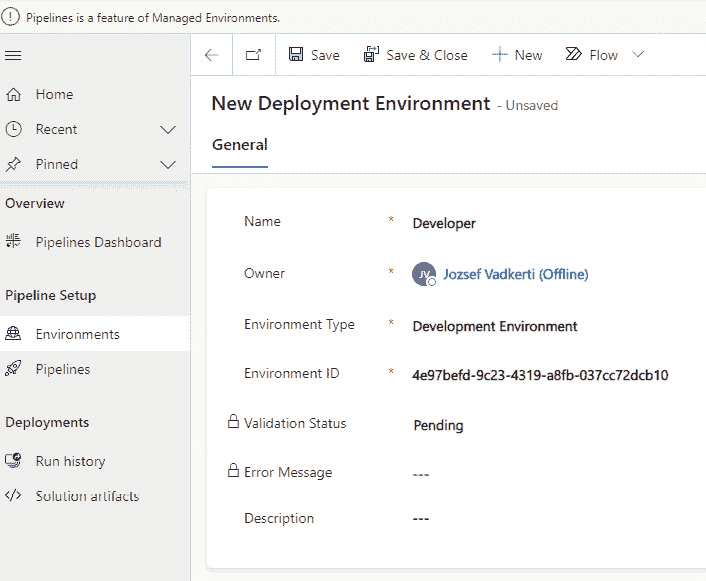

<st c="52690">图 4.11 – 创建新的部署环境</st>

1.  <st c="52741">创建</st> <st c="52749">另一个</st> **<st c="52757">部署环境</st>** <st c="52779">，并使用您最近创建的生产环境的配置数据</st> <st c="52784">以及</st> **<st c="52869">环境类型</st>** *<st c="52885">目标环境</st>*<st c="52904">，请参阅之前的图示以获取详细信息。</st>

<st c="52942">提示</st>

<st c="52946">使用</st> `<st c="52955">pac admin list</st>` <st c="52969">命令获取您最近创建的环境的环境 ID。</st>

1.  <st c="53043">前往</st> `<st c="53138">PipelineToProd</st>` <st c="53152">名称并保存表单，以便能够完全配置它。</st> <st c="53215">如果我们希望获取 AI 部署笔记，可以在这里启用：</st> <st c="53289">同样：</st>

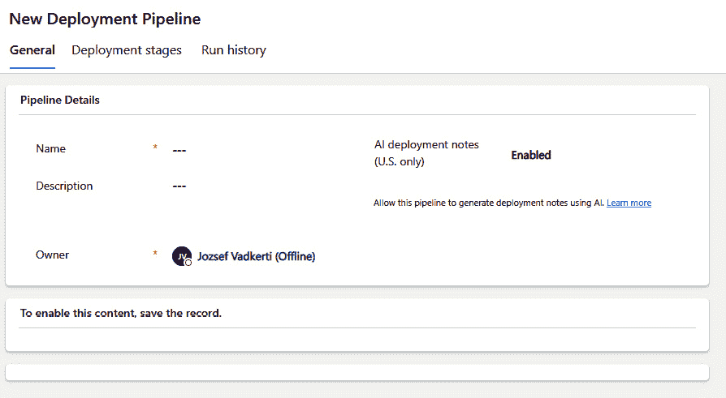

<st c="53584">图 4.12 – 新的部署管道详细信息</st>

1.  <st c="53640">添加</st> <st c="53645">开发环境（</st>**<st c="53672">开发环境</st>**<st c="53695">）到</st> **<st c="53705">已链接的开发</st>** **<st c="53724">环境</st>** <st c="53736">部分。</st>

1.  <st c="53745">点击</st> **<st c="53795">新建部署</st>** **<st c="53810">阶段</st>** <st c="53815">按钮，创建一个新的部署阶段。</st>

1.  <st c="53823">设置</st> **<st c="53832">名称</st>** <st c="53836">和</st> **<st c="53841">目标部署环境 ID</st>** <st c="53873">字段。</st>

1.  <st c="53893">保存</st> <st c="53899">记录。</st>

1.  <st c="53910">设置</st> <st c="53915">安全性：</st>

    1.  <st c="53927">将此新的部署管道 Dataverse 记录共享给开发环境中将使用此管道的用户或用户组，即</st> **<st c="54082">开发环境</st>** <st c="54104">，在我们的例子中。</st>

    1.  <st c="54117">将</st> **<st c="54126">系统定制器</st>** <st c="54143">或</st> **<st c="54147">环境创建者</st>** <st c="54164">内建安全角色添加到这两个成员的</st> **<st c="54218">生产</st>** <st c="54228">和</st> **<st c="54233">开发环境</st>** <st c="54255">环境中。</st>

    1.  <st c="54269">将</st> **<st c="54278">部署管道用户</st>** <st c="54302">安全角色添加到</st> **<st c="54341">管道主机</st>** <st c="54353">环境中的这些成员。</st>

1.  <st c="54366">前往</st> <st c="54373">开发者环境并导入</st> <st c="54405">**<st c="54410">未管理的解决方案</st>**</st> <st c="54428">从 Power Platform 企业模板中导入 IT 基础包。</st> <st c="54484">你可以在</st> <st c="54500">以下位置找到它：</st> [<st c="54503">https://github.com/microsoft/Templates-for-Power-Platform/blob/main/Solution%20Packages%20For%20Manual%20Install/IT/IT%20Base%20Pack/mpa_ITBase_managed.zip</st>](https://github.com/microsoft/Templates-for-Power-Platform/blob/main/Solution%20Packages%20For%20Manual%20Install/IT/IT%20Base%20Pack/mpa_ITBase_managed.zip)<st c="54658">。</st>

1.  <st c="54659">打开解决方案并寻找左侧的流水线图标（看起来像火箭）。</st> <st c="54752">打开流水线并选择</st> **<st c="54786">PipelineToProd</st>** <st c="54800">流水线：</st>

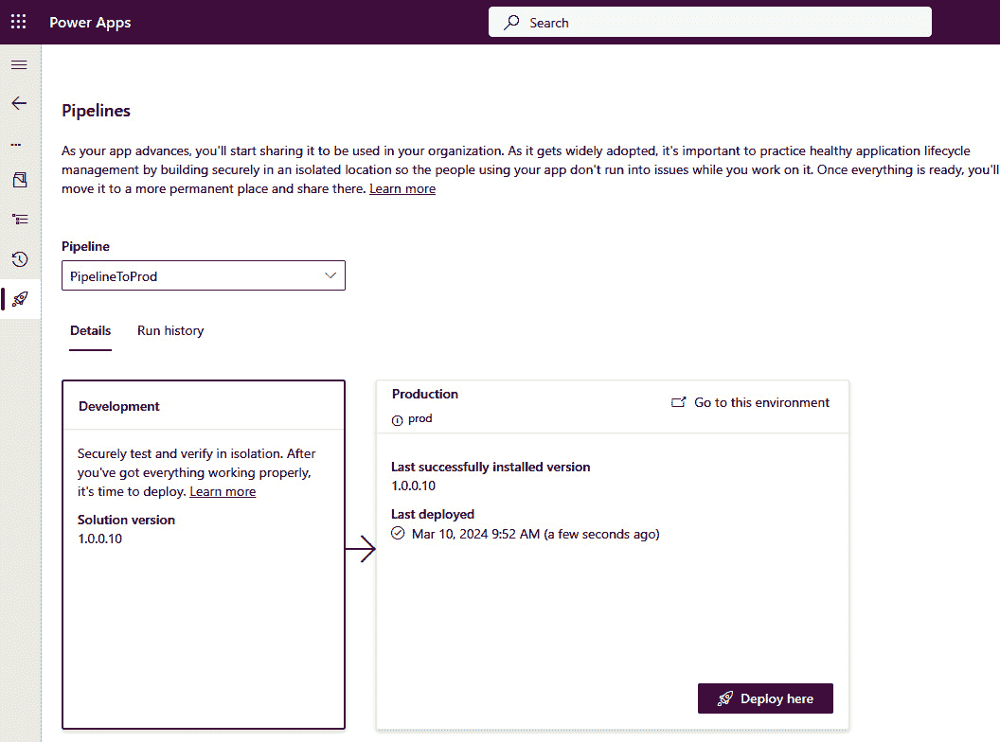

<st c="55562">图 4.13 – 选择 PipelineToProd</st>

1.  <st c="55600">点击</st> `<st c="55633">pac pipeline</st>` `<st c="55646">deploy</st>` <st c="55652">命令。</st>

1.  <st c="55661">检查</st> <st c="55697">生产环境中的部署结果。</st>

<st c="55720">恭喜，我们已经创建了我们的第一个 CI/CD Power</st> <st c="55776">平台流水线。</st>

<st c="55794">为了让这个</st> <st c="55808">流水线更加专业和安全，我们</st> <st c="55855">可以在</st> **<st c="55919">Microsoft Entra ID</st>** <st c="55937">（在</st> **<st c="55946">Microsoft Azure 门户</st>**<st c="55968">内）创建一个服务主体和企业应用，并将其分配给部署阶段，如下图所示：</st> <st c="56026">。

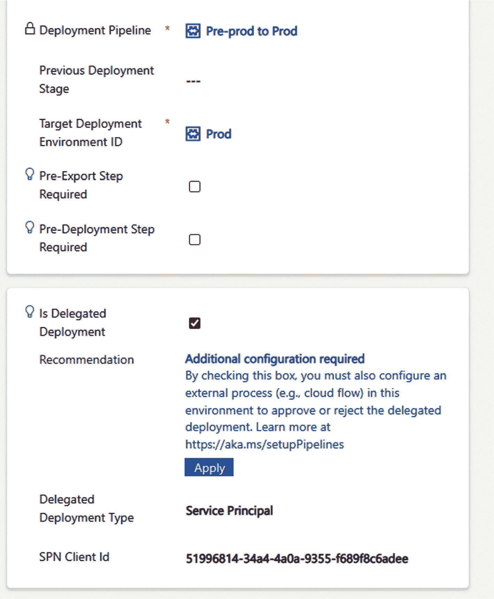

<st c="56581">图 4.14 – 在流水线中使用服务主体</st>

<st c="56634">这就是</st> **<st c="56647">委托部署</st>** <st c="56667">过程</st> <st c="56675">，我们通过它将</st> <st c="56695">我们的</st> **<st c="56699">服务主体名称</st>** <st c="56721">（</st>**<st c="56723">SPN</st>**<st c="56726">）客户端 ID 分配给流水线引擎，以便它在解决方案导入阶段使用。</st> <st c="56803">创建此分配后，我们需要做最后一件事。</st> <st c="56879">这就是创建一个委托的审批流程，通过使用服务主体及其客户端密钥连接到 Power Platform 流水线 Dataverse 表格，以批准部署。</st> <st c="57062">下一个图将展示最简单的审批流程，通过响应</st> **<st c="57129">OnApprovalStarted</st>** <st c="57146">Dataverse 动作，等待五秒钟，然后将审批状态设置为 20（20 表示已批准；30 表示</st> <st c="57261">拒绝状态）：</st>

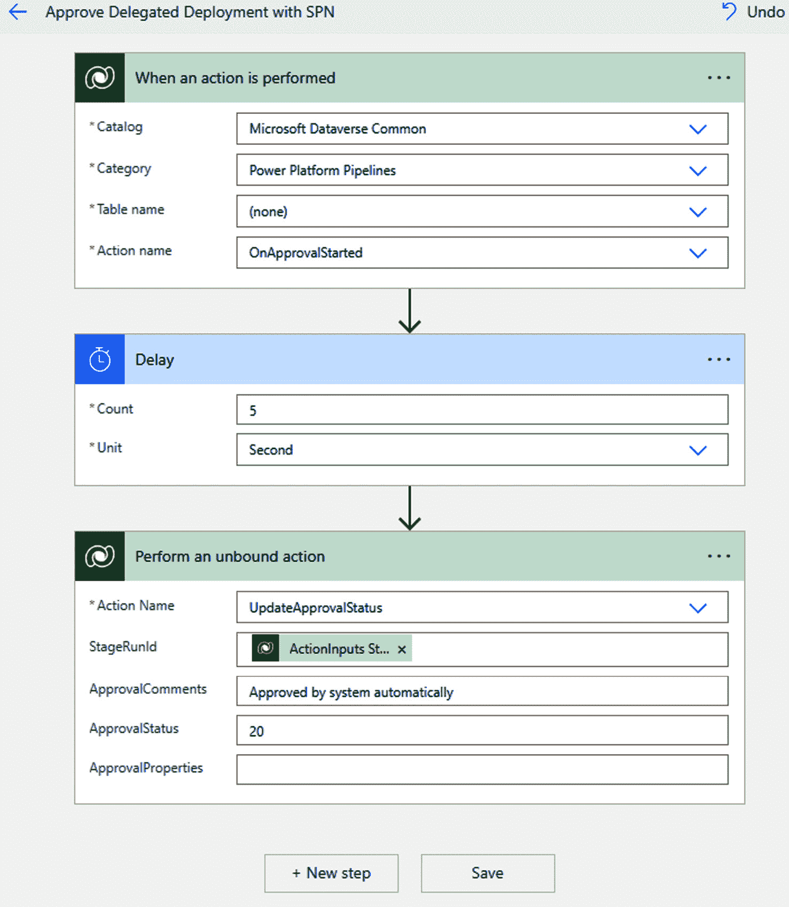

<st c="57474">图 4.15 – 使用服务主体的委托部署</st>

<st c="57534">底层</st> <st c="57549">Power Platform 流水线引擎使用</st> <st c="57585">此流程代表定义的服务主体而非用户执行。</st> <st c="57677">通过这些额外的步骤，我们显著提高了</st> <st c="57768">我们流水线的弹性和安全性。</st>

# <st c="57781">总结</st>

<st c="57789">在本章中，我们了解了 Power Platform 解决方案，这些现代可执行文件可以在环境之间移动，了解了它们的升级选项，以及如何实现解决方案分层和版本管理的不同方法。</st> <st c="58015">之后，我们讨论了 Dataverse，这是一款具备高级安全性和治理能力的企业级数据平台。</st> <st c="58138">我们还了解了 CDM，这是一个行业广泛接受的用于建模数据的数据库模式。</st> <st c="58240">我们还花时间了解了环境，它是我们解决方案的执行主机，了解了托管环境的高级功能，并详细阐述了大规模全球企业的环境策略。</st> <st c="58453">在本章的最后，我们学习了 Power Platform 流水线——作为托管环境的最大特色之一——如何在幕后工作。</st> <st c="58601">我们还成功创建了我们的第一个</st> <st c="58640">CI/CD 流水线。</st>

<st c="58655">在下一章中，我们将探索用于创建这些 CI/CD 流水线和其他 ALM 自动化的专业开发者工具，部分内容我们已经在 Power</st> <st c="58833">Platform 流水线中看到过。</st>

# <st c="58852">进一步阅读</st>

+   <st c="58868">解决方案</st> <st c="58878">层：</st> [<st c="58886">https://learn.microsoft.com/en-us/power-apps/maker/data-platform/solution-layers</st>](https://learn.microsoft.com/en-us/power-apps/maker/data-platform/solution-layers)

+   **<st c="58966">常见数据</st>** **<st c="58979">模型</st>** <st c="58984">(</st>**<st c="58986">CDM</st>**<st c="58989">):</st>

    +   [<st c="58992">https://learn.microsoft.com/en-us/common-data-model/use</st>](https://learn.microsoft.com/en-us/common-data-model/use)

    +   [<st c="59048">https://github.com/microsoft/CDM</st>](https://github.com/microsoft/CDM)

+   <st c="59081">解决方案</st> <st c="59091">修补：</st> [<st c="59101">https://learn.microsoft.com/en-us/power-platform/alm/create-patches-simplify-solution-updates</st>](https://learn.microsoft.com/en-us/power-platform/alm/create-patches-simplify-solution-updates)

+   <st c="59194">托管</st> <st c="59203">环境：</st> [<st c="59217">https://learn.microsoft.com/en-us/power-platform/admin/managed-environment-overview</st>](https://learn.microsoft.com/en-us/power-platform/admin/managed-environment-overview)

+   <st c="59300">环境</st> <st c="59313">策略：</st> [<st c="59323">https://learn.microsoft.com/en-us/power-platform/guidance/adoption/environment-strategy</st>](https://learn.microsoft.com/en-us/power-platform/guidance/adoption/environment-strategy)

+   <st c="59410">企业</st> <st c="59422">模板：</st> [<st c="59432">https://github.com/microsoft/Templates-for-Power-Platform</st>](https://github.com/microsoft/Templates-for-Power-Platform)

+   <st c="59490">Power Platform</st> <st c="59506">管道：</st> [<st c="59517">https://learn.microsoft.com/en-us/power-platform/alm/pipelines</st>](https://learn.microsoft.com/en-us/power-platform/alm/pipelines)

+   <st c="59579">Microsoft Entra ID 服务</st> <st c="59607">主体：</st> [<st c="59619">https://learn.microsoft.com/en-us/entra/identity-platform/app-objects-and-service-principals</st>](https://learn.microsoft.com/en-us/entra/identity-platform/app-objects-and-service-principals)

+   <st c="59711">管道中的</st> <st c="59734">服务主体：</st> [<st c="59745">https://learn.microsoft.com/en-us/power-platform/alm/delegated-deployments-setup</st>](https://learn.microsoft.com/en-us/power-platform/alm/delegated-deployments-setup)
