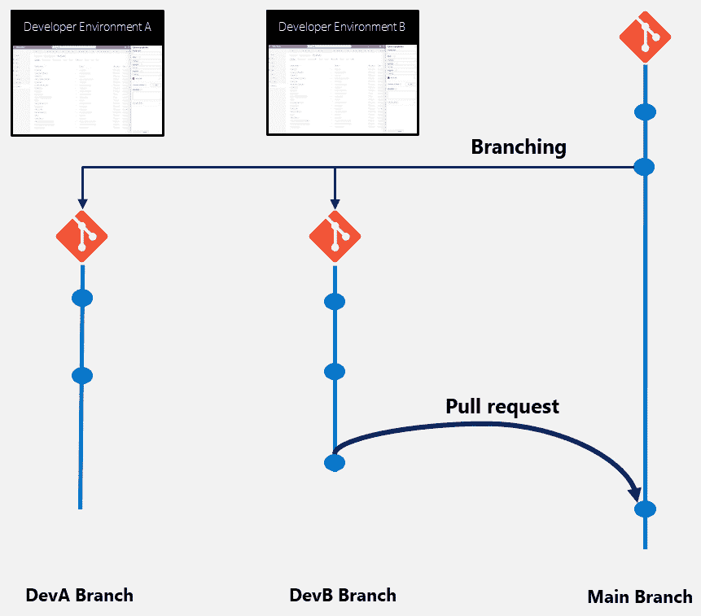
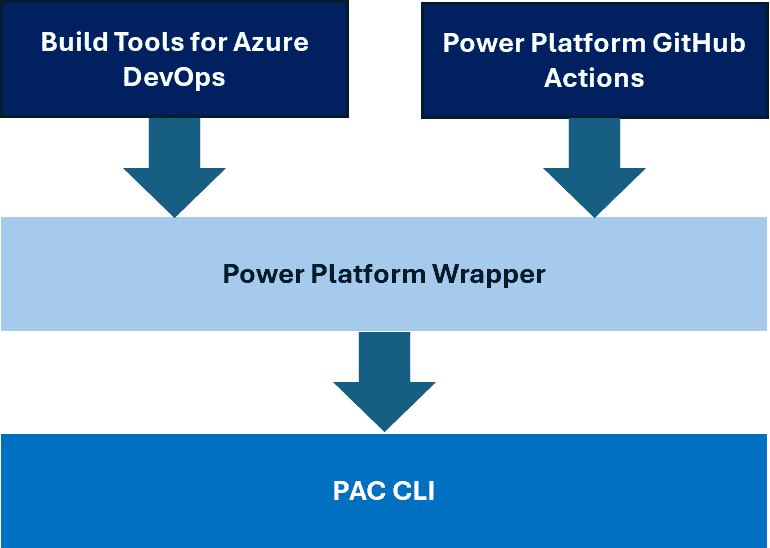
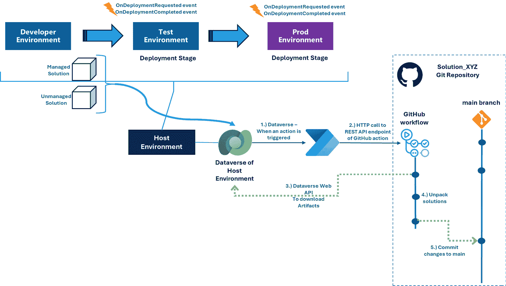
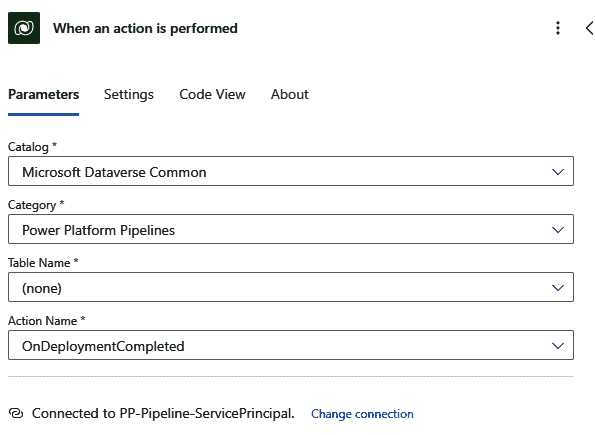
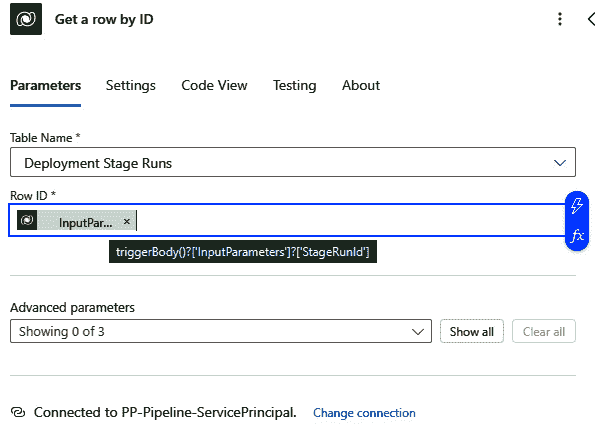
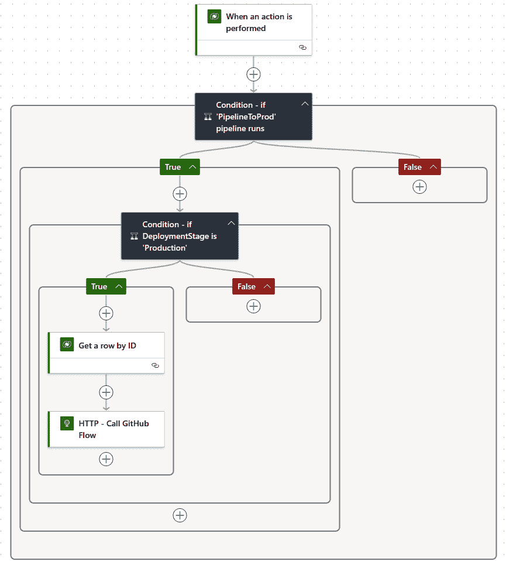

# <st c="0">5</st>

# <st c="2">通过 DevOps 工具简化 Power Platform 开发</st>

<st c="61">在上一章中，我们使用服务主体创建了第一个 Power Platform 管道，将我们的解决方案从一个环境部署到另一个环境。</st> <st c="214">本章介绍了可以帮助我们简化 Power Platform 开发过程的专业开发 DevOps 工具。</st> <st c="330">第一个工具是</st> `<st c="505">clone</st>`<st c="510">，</st> `<st c="512">push</st>`<st c="516">，</st> `<st c="518">pull</st>`<st c="522">，</st> `<st c="524">checkout</st>`<st c="532">等。</st> <st c="544">我们还将探索如何在 Git 仓库中管理 Power Platform 解决方案的纯文件和文件夹，以及如何通过命令行进行拉取请求和合并。</st> <st c="723">然后，我们将学习如何将 Power Platform 管道连接到这些 Git 仓库。</st> <st c="809">我们将花时间介绍</st> **<st c="836">Power Platform CLI</st>** <st c="854">(</st>**<st c="856">PAC CLI</st>**<st c="863">)，它</st> <st c="872">允许我们在任何脚本语言中与 Power Platform 解决方案进行交互。</st> <st c="949">我们还将学习如何在</st> **<st c="1017">YAML</st>** <st c="1021">(即</st> **<st c="1033">Yet Another Markup Language</st>**<st c="1060">) 格式中创建 Azure DevOps 服务管道，并</st> <st c="1075">理解 YAML 规范及相关方法，如变量、参数和任务。</st> <st c="1180">我们还将了解 Microsoft 为 Power Platform 解决方案提供的构建任务。</st> <st c="1272">最后，我们将学习</st> <st c="1294">如何使用</st> **<st c="1306">GitHub Copilot</st>**<st c="1320">，一个 AI 驱动的代码补全工具，可以帮助我们更高效地编写代码</st> <st c="1385">。</st>

<st c="1402">本章结束时，我们将深入理解并掌握如何通过专业开发的 DevOps 工具（如 Azure DevOps pipelines 和 GitHub Actions）来设置端到端的 CI/CD 管道，这些工具将我们的解决方案交付到不同的 Power</st> <st c="1671">Platform 环境中。</st>

<st c="1693">在本章中，我们将涵盖以下</st> <st c="1746">主要内容：</st>

+   <st c="1758">Git – 单一的真实来源</st> <st c="1783">真理之源</st>

+   <st c="1791">Power</st> <st c="1798">Platform CLI</st>

+   <st c="1810">Power Platform 构建工具用于</st> <st c="1842">Azure DevOps</st>

+   <st c="1854">GitHub Actions for</st> <st c="1874">Power Platform</st>

+   <st c="1888">托管管道 – 源</st> <st c="1916">控制集成</st>

+   <st c="1935">Power Platform 中的 Copilot</st> <st c="1963">管道开发</st>

# <st c="1983">技术要求</st>

<st c="2006">要使用专业开发的 DevOps 工具创建我们的第一个 CI/CD 管道，我们需要具备</st> <st c="2090">以下条件：</st>

+   <st c="2104">一个 Power Platform 订阅。</st> <st c="2136">如果我们已经拥有 Microsoft Entra ID 工作帐户，我们可以注册 Power Apps 开发者计划（</st>[<st c="2184">https://www.microsoft.com/en-us/power-platform/products/power-apps/free</st>](https://www.microsoft.com/en-us/power-platform/products/power-apps/free)<st c="2256">）。</st> <st c="2313">或者，我们可以加入 Microsoft 365 开发者</st> <st c="2357">计划（</st>[<st c="2366">https://developer.microsoft.com/en-us/microsoft-365/dev-program</st>](https://developer.microsoft.com/en-us/microsoft-365/dev-program)<st c="2430">）。</st><st c="2432">。</st>

+   <st c="2433">一个 Azure DevOps Services 组织：我们可以随时创建一个 DevOps 组织</st> *<st c="2518">免费</st>* <st c="2526">（</st>[<st c="2528">https://learn.microsoft.com/en-us/azure/devops/user-guide/sign-up-invite-teammates</st>](https://learn.microsoft.com/en-us/azure/devops/user-guide/sign-up-invite-teammates)<st c="2610">）。</st> <st c="2614">如果我们在 Azure DevOps 中创建一个公共项目，我们将获得多个免费管道并免费访问该服务的所有功能 – 请参见</st> **<st c="2750">Azure DevOps for Open</st>** **<st c="2772">Source</st>** <st c="2778">优惠。</st>

+   <st c="2788">GitHub 用户名和公共仓库（</st>[<st c="2828">https://github.com/signup</st>](https://github.com/signup)<st c="2854">），该仓库也</st> *<st c="2872">免费</st>* <st c="2876">提供给</st> <st c="2881">公共仓库。</st>

+   <st c="2901">GitHub Copilot 免费试用（</st>[<st c="2931">https://github.com/login?return_to=%2Fgithub-copilot%2Fsignup</st>](https://github.com/login?return_to=%2Fgithub-copilot%2Fsignup)<st c="2993">）或访问 Microsoft</st> <st c="3019">Copilot（</st>[<st c="3028">https://copilot.microsoft.com</st>](https://copilot.microsoft.com)<st c="3058">）。</st>

+   <st c="3061">Visual Studio Code – 强烈建议使用这个免费的代码编辑器来创建、编辑和更新本章节中的 YAML 文件。</st> <st c="3197">我们可以通过</st> [<st c="3252">https://code.visualstudio.com/download</st>](https://code.visualstudio.com/download)<st c="3290">在任何平台上下载 Visual Studio Code，并借助 Power Platform、Git、Azure DevOps 管道和 GitHub 工作流的 VS Code 插件，我们可以对更改进行语法高亮和语义检查。</st> <st c="3480">通过 Git 插件，我们还可以管理 Git 仓库。</st> <st c="3543">有关更多信息，请参见</st> *<st c="3551">进一步阅读</st>* <st c="3566">部分，了解 Visual Studio Code 的更多内容。</st> <st c="3615">另外，我们可以直接访问</st> [<st c="3656">https://vscode.dev</st>](https://vscode.dev) <st c="3674">在我们喜欢的浏览器中在线使用 Visual Studio Code 编辑器，编辑任何文件并打开一个</st> <st c="3775">远程仓库。</st>

+   <st c="3793">本章节的代码文件可以从我们的 GitHub 仓库下载</st> <st c="3865">，链接为</st> [<st c="3868">https://github.com/PacktPublishing/Mastering-DevOps-on-Microsoft-Power-Platform/tree/main/Chapter05</st>](https://github.com/PacktPublishing/Mastering-DevOps-on-Microsoft-Power-Platform/tree/main/Chapter05)<st c="3967">。</st>

# <st c="3968">Git——单一的真理来源</st>

<st c="4001">在定制开发项目中，源代码保存在</st> **<st c="4067">版本控制系统</st>**<st c="4090">中。这些</st> <st c="4097">系统允许开发人员在同一个代码库上协作工作，以便他们可以不断引入新功能和/或修复 bug，而不会与他人的更改冲突。</st> <st c="4272">我们使用此类代码库（版本控制系统）的原因之一是提供生产环境中的代码（运行中的应用程序）与在推送版本到生产环境之前所做的源代码更改之间的端到端前后追溯性。</st> <st c="4543">在现代的 DevOps 工具中，项目管理部分，开发工作项直接与开发人员所做的代码更改相链接。</st> <st c="4705">版本控制系统提供了项的历史，并支持跨多个文件和文件夹的事务性更改，这些更改存在于代码库中。</st> <st c="4852">这些更改</st> <st c="4866">通常以</st> <st c="4884">作为</st> **<st c="4888">版本或</st>** **<st c="4899">历史树</st>**<st c="4912">的形式表示。</st>

<st c="4913">为了让开发人员以最有效和高效的方式工作</st> *<st c="4977">并行</st>*<st c="4988">，版本控制系统提供了分支功能。</st> <st c="5046">一个</st> **<st c="5048">分支</st>**<st c="5054">，顾名思义，是代码行的快照——一个分支，它随后</st> <st c="5128">管理自己的历史。</st> <st c="5154">我们提交（回放）到此分支的更改在我们创建分支时的原始分支中不可见。</st> <st c="5271">主线或根——主分支本身——在这种方法中也被表示为一个分支。</st> <st c="5370">在子分支中完成待办事项后，我们</st> **<st c="5428">合并</st>** <st c="5433">这些更改回父分支。</st> <st c="5473">分支可以在任何深度上创建，但一般来说，我们建议保持分支层次结构的深度尽可能平坦，以避免后续的集成债务。</st> <st c="5636">分支将进行中的工作与稳定且</st> <st c="5691">已测试的代码分开。</st>

<st c="5703">为了维护和控制一个健康的开发环境，我们需要定义我们的分支策略。</st> <st c="5802">一个</st> **<st c="5804">分支策略</st>** <st c="5819">是管理版本控制系统中分支的一组指南和最佳实践。</st> <st c="5913">它帮助团队组织代码库、简化开发流程，并在合并代码时尽量减少冲突。</st> <st c="6037">有几种流行的分支策略。</st> <st c="6082">团队需要选择适合他们开发流程的分支策略，并且要始终如一地遵循它，以确保顺畅的协作和高效的代码管理。</st> <st c="6264">让我们来看一下最流行的两种</st> <st c="6307">分支策略：</st>

+   **<st c="6325">基于主干的开发</st>** <st c="6349">是一种</st> <st c="6354">版本控制管理实践，开发人员将小的、频繁的更新合并到一个核心分支</st> <st c="6455">叫做</st> **<st c="6462">主干</st>** <st c="6467">或</st> **<st c="6471">主分支</st>**<st c="6475">。这种方法的主要特点是，唯一长期存在的分支是主分支，且始终可部署。</st> <st c="6601">开发人员不能直接将更改提交到主分支，而是他们在短期分支上工作，并将更改频繁地合并到主分支。</st>

+   **<st c="6763">Git Flow / GitHub flow</st>** <st c="6786">最初是</st> **<st c="6802">Git Flow</st>** <st c="6810">定义了几个长期存在的分支，比如</st> <st c="6816">发布、热修复和补丁分支，旁边还有主分支。</st> <st c="6921">在过去十年里，软件行业发生了很大的变化，软件开发团队通常只维护一个版本的软件——即最新版本。</st> <st c="7080">这意味着不再需要维护这么复杂的分支层次结构，这也是从 Git Flow 转向 GitHub flow 的原因。</st> **<st c="7219">GitHub flow</st>** <st c="7230">是一种</st> <st c="7236">轻量级、基于分支的工作流，支持定期进行部署的团队和项目。</st> <st c="7342">这个工作流在开发人员中非常受欢迎，因为它允许他们在不影响主代码库的情况下，进行新特性的开发、修复 bug 或进行实验。</st> <st c="7501">一旦某个分支上的工作完成，就可以通过拉取请求将其合并回主代码库。</st> <st c="7610">GitHub flow 与基于主干的开发非常相似，但它包含了 GitHub 特有的功能，如</st> <st c="7713">拉取请求。</st>

**<st c="7727">Git</st>** <st c="7731">是</st> <st c="7735">最广泛使用的版本控制系统。</st> <st c="7780">它是一个</st> **<st c="7788">分布式版本控制系统</st>**<st c="7822">，这意味着我们可以将一个代码库下载到自己的开发机器上，并且在没有互联网连接的情况下，我们可以通过分支和修改来工作。</st> <st c="7990">当然，如果我们想要将我们的更改传播回团队，我们需要连接互联网并</st> *<st c="8095">上传</st>* <st c="8101">我们的更改。</st> <st c="8115">市场上也有</st> <st c="8124">**<st c="8130">集中式版本控制系统</st>**<st c="8165">。</st> <st c="8181">这些系统需要持续的互联网连接，这通常会减慢与此类代码库的交互速度。</st> <st c="8285">一般来说。</st>

<st c="8296">Git 是一个</st> <st c="8304">快速、可扩展、分布式的版本控制系统，并且是开源的。</st> <st c="8372">有很多 DevOps 工具提供了开源 Git 引擎，比如 GitHub Enterprise、Azure DevOps Services 和 GitLab。</st> <st c="8512">当然，这些引擎是经过定制的，服务提供商可以实现</st> <st c="8595">他们自己的操作方式，并将 Git 提供为</st> **<st c="8648">软件即服务</st>** <st c="8669">（</st>**<st c="8671">SaaS</st>**<st c="8675">）产品，但客户端 API 与任何这些分发版本兼容。</st> <st c="8735">这些分发版。</st>

<st c="8755">通常，版本控制系统</st> <st c="8791">管理纯文本文件，因为这些文件在发生冲突时可以被开发者合并（冲突是可读的）。</st> <st c="8934">随着软件历史的发展，越来越多的二进制文件，如图像、视频、音频文件、3D 对象和媒体文件，已成为软件解决方案的一部分。</st> <st c="9104">在软件开发的早期，这些文件与代码库并行维护，尽管它们也是由开发者修改/分支的版本的一部分。</st> <st c="9290">Git 已经支持大文件</st> <st c="9323">（</st>**<st c="9331">Git 大文件存储</st>**<st c="9354">）和大规模单体代码库，简化了从其他版本控制系统的迁移。</st> <st c="9430">控制系统的迁移。</st>

<st c="9446">单体大规模代码库</st>

<st c="9474">例如，Microsoft Windows 的代码库，大小为 250 GB，维护在一个大型的 Git 单体代码库中，并托管在 Azure DevOps</st> <st c="9612">服务项目中。</st>

<st c="9629">**<st c="9634">Git 命令行界面</st>** <st c="9660">(</st>**<st c="9662">CLI</st>**<st c="9665">) 是一个</st> <st c="9672">强大的工具，允许开发人员使用命令行终端与 Git 仓库进行交互。</st> <st c="9775">Git CLI 可在所有主要操作系统上使用，包括 Windows、macOS 和 Linux。</st> <st c="9869">一些常用的 Git 命令有：</st> <st c="9907">以下是一些：</st>

+   `<st c="9921">git clone</st>`<st c="9931">: 这个</st> <st c="9939">命令</st> <st c="9947">用于在你的</st> <st c="10003">本地机器上创建远程仓库的副本。</st>

+   `<st c="10017">git pull</st>`<st c="10026">: 这个</st> <st c="10033">命令用于从远程仓库获取并合并更改到你的</st> <st c="10114">本地仓库。</st>

+   `<st c="10131">git push</st>`<st c="10140">: 这个</st> <st c="10148">命令用于将本地仓库的更改（提交和分支）上传到</st> <st c="10234">远程仓库。</st>

+   `<st c="10252">git commit</st>`<st c="10263">: 这个</st> <st c="10271">命令用于将更改保存到本地仓库。</st> <st c="10329">它会在仓库历史中创建一个新的</st> `<st c="10346">提交</st>` <st c="10352">对象，记录仓库的当前状态。</st>

+   `<st c="10427">git branch</st>`<st c="10438">: 这个</st> <st c="10446">命令用于管理 Git 仓库中的分支。</st> <st c="10502">它可以用于列出、创建、删除以及</st> <st c="10546">重命名分支。</st>

+   `<st c="10562">git checkout</st>`<st c="10575">: 这个</st> <st c="10583">命令用于在分支之间切换，或者从</st> <st c="10677">版本库中恢复工作目录中的文件。</st>

+   `<st c="10692">git merge</st>`<st c="10702">: 这个</st> <st c="10709">命令用于将一个分支的更改合并到另一个分支。</st> <st c="10773">它将指定提交的更改集成到</st> <st c="10826">当前分支。</st>

<st c="10842">通常，我们克隆一个仓库，创建一个本地分支，提交更改，将分支推送回远程源，最后将更改合并回主分支。</st> <st c="11014">这个最后的操作是一个特殊操作，根据不同的 Git 发行版，可能被称为拉取请求，如 GitHub 或 GitLab。</st> <st c="11151">我们也可以在没有拉取请求的情况下合并分支。</st>

<st c="11200">**拉取请求**</st> <st c="11205">是一个</st> <st c="11217">开发人员通知团队成员他们已完成一个功能的机制。</st> <st c="11307">一旦他们的功能分支准备好，开发人员就会通过在线代码库提交拉取请求。</st> <st c="11407">然后，其他团队成员会审查代码并提出意见和建议。</st> <st c="11489">一旦团队达成一致，认为代码已经准备好，就可以将其合并到主代码库中。</st> <st c="11576">拉取请求是一个*促进代码审查* </st> <st c="11603">和团队协作的方式</st> <st c="11622">在</st> <st c="11650">开发团队中。</st>

<st c="11667">拉取请求</st>

<st c="11681">拉取请求</st> <st c="11699">不仅仅是一个</st> `<st c="11717">git merge</st>` <st c="11726">操作。</st> <st c="11738">像 GitHub 或 Azure DevOps 服务这样的 DevOps 工具提供了网页 UI 支持以及自己的 CLI 工具来发起拉取请求</st> <st c="11864">在分支上。</st>

<st c="11876">理解了 Git 的关键概念后，我们来看一下它是如何与我们的 Power Platform 解决方案结合的。</st> <st c="11978">正如我们之前讨论过的，在</st> *<st c="12006">第四章</st>*<st c="12015">中，Power Platform 解决方案</st> <st c="12041">有托管和非托管两种格式。</st> <st c="12090">根据解决方案的内容，托管和非托管解决方案之间的区别可能会有很大差异。</st> <st c="12204">例如，如果一个解决方案包含 PowerApps 应用程序，那么托管的解决方案会包含几个文件，其中一个是</st> `<st c="12336">msapp</st>` <st c="12341">文档，其中包括 PowerApps 画布应用的所有资产，以压缩格式保存。</st> <st c="12429">另一方面，非托管解决方案将由 XML 和 JSON 文件组成，按照一个定义明确的文件夹结构来描述解决方案及其所有资产，如应用程序、流程、机器人、连接引用等，以纯文本</st> <st c="12655">格式表示。</st>

<st c="12667">而这正是版本控制系统发挥重要作用的地方，正如下图所示：</st>



<st c="12871">图 5.1 – 开发者环境及其相应的子分支</st>

<st c="12940">应用开发者和开发人员（</st>**<st c="12968">DevA</st>** <st c="12973">和</st> **<st c="12978">DevB</st>** <st c="12982">在我们的案例中）使用专门的开发环境来构建解决方案。</st> <st c="13057">当他们创建应用程序的第一个版本时，他们将托管和非托管的</st> <st c="13156">Power Platform 解决方案——后者作为解包形式——提交到自己从主分支创建的子分支中。</st> <st c="13271">之后，他们在这些分支上工作，并在相应的环境中进行工作，通过不断同步环境与分支之间的变化。</st> <st c="13436">当他们准备好时，他们提交拉取请求，将子分支中的更改合并回主分支。</st> <st c="13552">理想情况下，没有合并冲突，变更会顺利地集成到主分支中。</st> **<st c="13659">合并冲突</st>** <st c="13674">是</st> <st c="13679">冲突的更改——即在父分支和子分支中相同位置的文件发生了变更。</st> <st c="13796">如果发生合并冲突，拉取请求将被拒绝，开发人员需要将主分支的更改合并回开发分支，并在那里解决冲突。</st> <st c="13986">在 Power Platform 中，这不仅仅意味着解决代码层面的冲突，还需要将非托管解决方案加载回开发环境，检查一切是否按预期工作，然后发布更改。</st> <st c="14222">之后，我们需要将解决方案导出回开发分支，并重新提交</st> <st c="14311">拉取请求。</st>

<st c="14324">总体而言，分支和子分支使得开发人员即使在同一个 Power Platform 解决方案中也能并行工作，但我们需要特别注意，让开发人员处理不同的资产</st> <st c="14522">在解决方案中。</st>

<st c="14535">了解了 Git 的功能后，让我们来了解一下我们可以用来导出和导入解决方案的工具</st> <st c="14654">Power Platform。</st>

# <st c="14669">Power Platform CLI</st>

<st c="14688">我们在前几章中已经见过一些</st> <st c="14721">PAC CLI 命令，例如登录到不同的环境或将 Power Platform 管道作为 Dynamics 365 应用程序安装到我们的环境中。</st> <st c="14906">除了这些命令，PAC CLI 还支持许多其他命令和功能，我们可以代表服务主体进行身份验证，并管理我们的解决方案、环境、部署、管道等。</st> <st c="15110">PAC CLI 的最大优势之一是它可以在任何平台上运行，并可以与任何</st> <st c="15215">DevOps 工具集成。</st>

<st c="15227">PAC CLI 最常用的命令之一是</st> <st c="15280">以下这些：</st>

+   `<st c="15294">The</st>` `<st c="15299">pac admin</st>` `<st c="15308">命令</st>` `<st c="15316">组提供一组命令，用于与您的 Power Platform 管理员帐户一起工作，例如创建环境、创建服务</st>` `<st c="15448">主体、将 Microsoft Entra ID 组分配给环境等。</st>`

+   `<st c="15523">The</st>` `<st c="15528">pac application</st>` `<st c="15543">命令</st>` `<st c="15551">组用于列出并安装来自 AppSource 的可用 Dataverse 应用程序。</st>` `<st c="15637">我们使用了</st>` `<st c="15645">pac application install</st>` `<st c="15668">将 Power Platform 管道作为 Dynamics 365 应用程序部署到我们的生产环境中，</st>` *<st c="15767">第四章</st>*<st c="15776">。</st>

+   `<st c="15777">The</st>` `<st c="15782">pac auth</st>` `<st c="15790">命令</st>` `<st c="15798">组提供一组命令，用于在不同的服务中进行身份验证，例如环境或整个租户。</st>` `<st c="15910">我们可以使用服务帐户以及服务主体。</st>` `<st c="15969">我们的凭证会被本地存储</st>` `<st c="16004">（如有需要）</st>`。

+   `<st c="16014">The</st>` `<st c="16019">pac canvas</st>` `<st c="16029">命令</st>` `<st c="16039">与 Power Apps</st>` `<st c="16060">.msapp</st>` `<st c="16066">文件</st>` `<st c="16074">一起使用。这些文件是在我们直接从 Power Apps Studio 导出画布应用程序时创建的，或者作为我们 Power</st>` `<st c="16181">平台解决方案</st>`。

+   `<st c="16200">The</st>` `<st c="16205">pac catalog</st>` `<st c="16216">命令</st>` `<st c="16224">组提供用于管理</st>` `<st c="16395">pac catalog</st>` `<st c="16406">命令组的命令，包括</st>` `<st c="16429">pac catalog install</st>` `<st c="16448">，它将在目标环境中安装目录项，以及</st>` `<st c="16511">pac catalog list</st>` `<st c="16527">，它列出当前</st>` `<st c="16586">Dataverse 组织中的所有已发布目录项。</st>`

+   `<st c="16609">The</st>` `<st c="16614">pac copilot</st>` `<st c="16625">命令</st>` `<st c="16633">组提供用于管理聊天机器人和 AI Builder 模型的命令（包括新型大语言模型等）。</st>` `<st c="16745">一些可用的命令包括</st>` `<st c="16784">pac copilot predict</st>` `<st c="16803">，该命令将文本或提示发送到 AI 模型，</st>` `<st c="16849">pac copilot create</st>` `<st c="16867">用于使用现有模板文件作为参考创建新机器人，</st>` `<st c="16945">pac copilot list</st>` `<st c="16961">用于列出当前或目标 Dataverse 环境中的虚拟代理。</st>`

+   `<st c="17036">The</st>` `<st c="17041">pac package</st>` 命令组是一组用于管理包的工具和实用程序。它包括一些命令，比如`<st c="17151">pac package add-external-package</st>`用于将一个外部的包添加到 Dataverse 解决方案系统中，`<st c="17286">pac package add-reference</st>`用于向 Dataverse 解决方案项目中添加引用，以及`<st c="17372">pac package add-solution</st>`用于将一个预构建的 Dataverse 解决方案文件添加到 Package Deployer 项目中。请注意，我们在*<st c="17495">第四章</st>*中也讨论了 Power Platform 企业模板中的 Package Deployer。

+   `<st c="17599">The</st>` `<st c="17604">pac pcf</st>` 命令组用于与`<st c="17741">pac pcf init</st>`一起初始化当前目录中的新 Power Apps 组件框架项目，并且与`<st c="17846">pac pcf push</st>`一起将组件推送到 Power Apps 组件框架开发环境中。

+   `<st c="17945">The</st>` `<st c="17950">pac pipeline</st>` 命令组用于与 Power Platform 管道一起工作。举例来说，`<st c="18037">pac pipeline deploy</st>` 用于启动管道部署，而`<st c="18101">pac pipeline list</st>` 用于列出给定环境中的管道。此命令组为管理员和操作团队提供了以完全自动化的方式启动部署的选项，正如我们在*<st c="18309">第四章</st>*中讨论的那样。

+   `<st c="18319">The</st>` `<st c="18324">pac plugin</st>` 命令组用于与`<st c="18446">pac plugin init</st>`一起初始化一个新的 Dataverse 插件类库目录，而`<st c="18545">pac plugin push</st>`则用于将插件导入到 Dataverse 中。我们可以使用基于.NET Framework 的插件，在 Dataverse 引擎的上下文中响应服务器端的 Dataverse 事件。

+   <st c="18739">`<st c="18744">pac powerpages</st>` <st c="18758">命令组</st> <st c="18772">用于</st> <st c="18780">管理</st> `<st c="18853">pac powerpages list</st>` <st c="18872">用于列出当前 Dataverse 环境中的所有 Power Pages 网站，而</st> `<st c="18960">pac powerpages download</st>` <st c="18983">用于从当前 Dataverse 环境下载 Power Pages 网站内容，以便将其迁移到另一个环境，配合</st> `<st c="19110">pac</st>` `<st c="19114">powerpages upload</st>`<st c="19131">。</st>

+   <st c="19132">`<st c="19137">pac solution</st>` <st c="19149">命令组</st> <st c="19163">用于操作</st> <st c="19179">与</st> `<st c="19249">pac solution</st>` <st c="19261">命令组包括</st> `<st c="19284">pac solution init</st>`<st c="19301">，用于初始化一个基于 MSBuild 的</st> `<st c="19338">cdsproj</st>` <st c="19345">文件，适用于组件框架组件；</st> `<st c="19387">pac solution add-reference</st>`<st c="19413">，用于将当前目录中的项目引用添加到指定路径下的项目；以及</st> `<st c="19522">pac solution add-solution-component</st>`<st c="19557">，用于将一个或多个解决方案组件添加到 Dataverse 中的目标非托管解决方案。</st> <st c="19649">解决方案的导入和导出也通过相应的</st> `<st c="19719">pac</st>` `<st c="19723">solution</st>` <st c="19731">命令进行支持。</st>

<st c="19741">PAC CLI 和 Power Platform PowerShell 模块</st>

<st c="19787">PAC CLI 是 Power Platform 的下一代命令行工具，能够在任何操作系统平台上运行。</st> <st c="19888">PowerShell 管理功能正在不断迁移到 PAC CLI，以便在未来达到功能上的一致性。</st> <st c="19994">PAC CLI 和 PowerShell 模块是对</st> <st c="20082">Power Platform</st> 的底层 REST API 端点的封装。</st>

<st c="20097">要安装 PAC CLI，我们需要先确保机器上已部署 .NET Core 3.1 或更高版本（推荐使用 .NET 6）。</st> <st c="20214">然后，我们可以在喜爱的终端（Windows 上使用 CMD，Linux 上使用 Bash，macOS 上使用 Terminal）中执行以下命令：</st>

```
 dotnet tool install --global Microsoft.PowerApps.CLI.Tool
```

<st c="20400">现在我们已经了解了 PAC CLI 中命令的广度和深度，在接下来的章节中，我们将了解该 CLI 工具如何被 Azure DevOps Services 和</st> <st c="20592">GitHub Enterprise</st> 使用。</st>

# <st c="20610">Power Platform 构建工具用于 Azure DevOps</st>

**<st c="20654">Azure Pipelines</st>** <st c="20670">作为 Azure DevOps Services 中的一个强大功能脱颖而出，提供</st> <st c="20742">全面的</st> **<st c="20757">持续集成</st>** <st c="20779">（</st>**<st c="20781">CI</st>**<st c="20783">）和</st> **<st c="20790">持续交付</st>** <st c="20809">（</st>**<st c="20811">CD</st>**<st c="20813">）服务。</st> <st c="20825">它兼容您选择的 Git 提供商（GitHub 或</st> <st c="20879">Azure DevOps），并支持跨多个主要云提供商进行部署，包括微软 Azure。</st> <st c="20983">此服务简化了构建、测试和部署代码库的过程。</st> <st c="21072">它支持广泛的编程</st> <st c="21086">语言和平台，例如 .NET、Java、Node.js、Android、Xcode 和 C++，并支持使用各种测试框架和服务。</st> <st c="21273">此外，Azure Pipelines 还支持在命令行、PowerShell、Bash 或 Shell 中执行脚本，作为自动化工作流的一部分。</st>

<st c="21417">Azure Pipelines 还提供了运行脚本和流水线任务所需的基础设施。</st> **<st c="21516">Azure Pipelines 代理</st>** <st c="21538">是</st> <st c="21542">容器（虚拟机规模集中的虚拟机），执行我们的作业（流水线任务）。</st> <st c="21644">代理被安装在这些机器中，并通过 HTTP 出站连接到 Azure DevOps 端点，拉取它们需要执行的活动。</st>

<st c="21790">代理有不同类型，包括微软托管代理、自托管代理和 Azure 虚拟机规模集</st> <st c="21915">代理：</st>

+   **<st c="21926">微软托管代理</st>** <st c="21950">提供了一个</st> <st c="21960">无忧的解决方案，用于执行您的作业。</st> <st c="22007">这些代理由微软全面管理，确保始终使用您 YAML 流水线中指定的最新虚拟机映像，而无需我们进行任何维护或升级。</st>

+   **<st c="22222">自托管代理</st>** <st c="22241">是</st> <st c="22251">我们在自己的虚拟机上设置并维护的代理。</st> <st c="22309">此选项使我们能够更好地控制代理使用的机器规格和操作系统映像。</st>

+   **<st c="22441">Azure 虚拟机规模集代理</st>** <st c="22480">是</st> <st c="22485">一种自托管代理，充分利用虚拟机规模集的自动扩展功能。</st> <st c="22588">Azure DevOps 根据</st> <st c="22651">流水线队列的大小扩展或缩减虚拟机。</st>

<st c="22667">在 Azure Pipelines 中，</st> **<st c="22690">作业</st>** <st c="22693">是一系列按顺序运行的步骤，作为一个单元执行。</st> <st c="22748">每个管道至少有一个作业，作业是可以调度运行的最小工作单元。</st> <st c="22854">作业可以组织成阶段，并且你可以指定条件和依赖关系来控制作业的运行时机。</st> <st c="22963">作业可以在 Microsoft 托管的代理、自托管的代理或 Azure 虚拟机规模集代理上运行，并且可以直接在代理的主机机器上或在容器中运行。</st> <st c="23143">Azure Pipelines 支持在 Linux、macOS 和 Windows 上并行运行作业。</st> <st c="23223">你可以在 Azure DevOps Web 门户中创建和配置管道，使用经典的用户界面编辑器，也可以使用最新的基于 YAML 的脚本编辑器。</st> <st c="23385">我们更倾向于后者，因为这种情况下，YAML 文件的版本控制管理也是可用的。</st>

<st c="23496">Azure Pipelines 的高级功能，如 Microsoft 托管和自托管构建代理的基础设施和</st> <st c="23526">拓扑，超出了本书的范围，但你可以在</st> *<st c="23717">进一步</st>* *<st c="23725">阅读</st>* <st c="23732">部分找到更多信息和学习模块。</st>

<st c="23741">在 Azure</st> <st c="23758">Pipelines 之上，</st> **<st c="23769">Microsoft Power Platform Build Tools（Microsoft Power Platform Build Tools for Azure DevOps）</st>** <st c="23865">提供了 Azure DevOps 中的附加任务，可用于自动化与 Microsoft Power Platform 上构建的解决方案相关的常见构建和部署任务。</st> <st c="24027">其中一些可用任务包括</st> **<st c="24067">Power Platform 工具安装程序</st>**<st c="24096">，该程序安装</st> <st c="24113">Power Platform 工具（包括 PAC CLI 在代理中的安装）。</st> <st c="24176">这是每个构建和发布管道开始时的必选步骤，尤其是当我们希望使用其他 Power Platform 构建任务时。</st> <st c="24329">这些构建工具适用于画布应用、模型驱动应用、Microsoft Copilot Studio、云端和桌面流程、Power Pages 网站、AI Builder 模型、自定义连接器以及数据流，适用于所有可以添加到</st> <st c="24547">解决方案中的内容。</st>

<st c="24558">每个构建任务都在后台使用 PAC CLI，Power Platform 包装器为 Azure DevOps Pipelines 和</st> <st c="24694">GitHub Actions 提供了一个通用接口：</st>



<st c="24793">图 5.2 – Power Platform 构建工具和 GitHub Actions 架构</st>

`<st c="24864">这意味着，当我们</st>` `<st c="24889">使用类似</st>` `<st c="24908">PowerPlatformExportSolution@2</st>` `<st c="24937">的任务时，</st>` `<st c="24997">该管道任务会通过包装器执行相应的 PAC CLI 命令，</st>` `<st c="25059">并使用适当的参数。</st>` `<st c="25256">让我们来看一个导出受管解决方案的管道，它解压并发布到构建工件中（请参见</st>` `<st c="25182">.pipelines/powerlatform-exportsolution.yml</st>` `<st c="25224">文件，位于</st>` `<st c="25232">Chapter05</st>` `<st c="25241">文件夹中，</st>` `<st c="25256">GitHub 仓库中）：</st>`

```
 trigger:
- none
pool:
  vmImage: ubuntu-latest
steps: <st c="25322">- task: PowerPlatformToolInstaller@2</st> inputs:
    DefaultVersion: true <st c="25388">- task: PowerPlatformExportSolution@2</st> inputs:
    authenticationType: 'PowerPlatformSPN' <st c="25473">PowerPlatformSPN: '[Service_Connection_Name]'</st> SolutionName: '[Our_Solution_Name]'
    SolutionOutputFile: '$(Build.ArtifactStagingDirectory)/Solution/[Our_Solution_Name].zip'
    Managed: true
    AsyncOperation: false
    MaxAsyncWaitTime: '60' <st c="25703">- task: PowerPlatformUnpackSolution@2</st> inputs:
    SolutionInputFile: '$(Build.ArtifactStagingDirectory)/Solution/TranslatorSolution.zip'
    SolutionTargetFolder: '$(Build.ArtifactStagingDirectory)/Solution/out'
    SolutionType: 'Managed'
- task: PowerPlatformChecker@2
  inputs: <st c="25970">PowerPlatformSPN: [Service_Connection_Name]'</st> FilesToAnalyze: '$(Build.ArtifactStagingDirectory)/Solution/*.zip'
    RuleSet: '0ad12346-e108-40b8-a956-9a8f95ea18c9'
- task: PublishBuildArtifacts@1
  enabled: true
  inputs:
    PathtoPublish: '$(Build.ArtifactStagingDirectory)'
    ArtifactName: 'Translator'
    publishLocation: 'Container'
```

`<st c="26290">The</st>` `<st c="26295">PowerPlatformExportSolution@2</st>` `<st c="26324">使用服务连接（</st>` `<st c="26352">PowerPlatformSPN: 'PowerPlatformE5-Default'</st>` `<st c="26396">）连接到 Dataverse。</st>` **<st c="26428">服务连接</st>** `<st c="26447">允许</st>` `<st c="26454">您连接到外部和远程服务，以在</st>` `<st c="26520">您的管道中执行任务。</st>` `<st c="26537">它们提供了一种方法，能够使用外部服务对 Azure DevOps 进行身份验证和授权，</st>` `<st c="26621">使 Azure DevOps 能够代表您或代表服务主体访问资源并执行操作。</st>` `<st c="26739">为</st>` `<st c="26783">Power Platform 提供了专用的服务连接。</st>`

`<st c="26798">我们刚刚发现，如何使用熟悉的 Azure Pipelines 基于 YAML 的方法来进行 Power Platform CI/CD，</st>` `<st c="26940">就像我们为其他自定义开发项目所做的那样。</st>`

# `<st c="26961">GitHub Actions for Power Platform</st>`

**<st c="26995">GitHub Actions</st>** `<st c="27010">最初由与创建 Azure Pipelines 相同的工程团队设计和开发，</st>` `<st c="27015">这是在微软收购 GitHub 后的事情。</st>` `<st c="27150">在收购时，GitHub 甚至没有支持 Azure Pipelines 提供的任何自动化功能。</st>`

`<st c="27268">因此，GitHub Actions 引擎、基础设施、代理（在 GitHub 中是 runners）和概念与 Azure DevOps 的几乎相同，也不奇怪。</st>` `<st c="27447">在某些情况下，GitHub Actions 甚至更好。</st>` `<st c="27497">它可以提供比 Azure Pipelines 更多的触发条件。</st>` `<st c="27563">例如，GitHub Actions 可以响应 GitHub 问题中的变化——包括拉取请求评论、Wiki 页面上的变化，以及 GitHub 项目相关资产的其他变化。</st>` `<st c="27741">这些操作是轻量级函数，触发框架可以通过 webhook 轻松扩展。</st>`

`<st c="27845">GitHub 有自己的构建代理，这些代理被称为</st>` **<st c="27896">GitHub runners</st>**`<st c="27910">。</st>`

在幕后，托管 GitHub Actions 的代理运行时、Windows 服务和 Linux/macOS 守护进程与 Azure DevOps 服务中使用的运行时几乎相同。GitHub 运行器是运行 GitHub Actions 工作流的虚拟机。它们有两种类型：**GitHub 托管**和**自托管**。对于专业人员，GitHub 提供了一系列托管虚拟机，这些虚拟机具有更多的内存、CPU 和磁盘空间，供 GitHub Team 和 GitHub Enterprise Cloud 计划的客户使用。这些较大的运行器由 GitHub 托管，预装了运行器应用程序和其他工具。GitHub 托管的运行器使 GitHub Enterprise 计划的客户能够轻松、安全地将其 CI/CD 机器连接到云端或本地的其他 DevOps 服务，例如**Artifactory**、**Nexus**或任何其他服务，利用保留的静态 IP 范围或通过使用 Azure 虚拟网络来实现。在公共 GitHub 仓库的情况下，每个月前 2,000 分钟的 GitHub 托管运行器执行是免费的。

为了获得更细粒度的控制，您还可以将运行器组与标签结合使用。**运行器组**只能包含大型运行器或自托管运行器作为成员。这样，专业人员可以灵活选择最适合其特定需求的运行器。GitHub 运行器也可以在 Docker 容器中运行。通过这样做，我们甚至可以轻松地构建基于 Kubernetes 的构建/部署集群。

GitHub 运行器和 Azure DevOps 代理都是开源项目，欢迎来自世界各地的贡献者（请参阅“*进一步阅读*”下的 GitHub 仓库链接）。

关于工作流定义：YAML 标签和关键字也存在一些差异，但主要设计原则是相同的。

Azure DevOps 服务与 GitHub

<st c="29672">在行业中，一个常见的问题是 Azure DevOps Services 还是</st> <st c="29708">GitHub 是未来的趋势。</st> <st c="29753">在撰写本文时，微软的策略是建议绿色场景组织（即刚开始 DevOps 之旅的组织）使用 GitHub。</st> <st c="29934">如果一个组织已经使用了 Azure DevOps，那么微软建议只在能带来显著优势的领域引入 GitHub。</st> *<st c="30082">这种显著优势现在体现在 GitHub Copilot</st>*<st c="30129">。在过去几年中，我们看到对 GitHub 功能的投资比 Azure DevOps Services 大了 5-10 倍。</st>

<st c="30264">在下一节中，我们将仔细研究 GitHub 工作流和操作</st> <st c="30339">的实际应用。</st>

# <st c="30347">管理管道 – 与 Git 的源代码控制集成</st>

<st c="30403">在</st> *<st c="30407">第四章</st>*<st c="30416">中，我们创建了第一个 Power Platform 管理的管道，该管道通过服务主体将我们的</st> `<st c="30491">mpa_ITBase</st>` <st c="30501">解决方案从开发环境部署到生产环境。</st> <st c="30599">在本节中，我们将继续我们的旅程，并基于关于 PAC CLI 的经验，构建针对 Azure DevOps Services 和 GitHub Actions 的工具，为 Power Platform 提供支持，我们将借助 GitHub Actions for Power Platform 和 Power Platform 管道上下文中的 Dataverse 触发事件，将我们的解决方案构件提交到 GitHub 仓库。</st>

<st c="30965">让我们来看看在我们的 Power Automate 云流中，可以在</st> `<st c="31056">Pipelinehost</st>` <st c="31068">环境中使用的事件，以响应部署管道中的某些变化：</st>

+   `<st c="31133">OnApprovalStarted</st>` <st c="31151">–</st> `<st c="31154">OnApprovalCompleted</st>`<st c="31173">：当部署阶段配置了审批流程时，这些事件会在部署解决方案之前触发。</st> <st c="31308">我们通常使用这一步骤通知发布经理或环境拥有者关于</st> <st c="31392">计划部署的情况。</st>

+   `<st c="31411">OnPredeploymentStarted</st>` <st c="31434">–</st> `<st c="31437">OnPredeploymentCompleted</st>`<st c="31461">：这些事件在将我们的解决方案发布到部署阶段之前发生。</st> <st c="31540">我们可以利用这些事件在目标环境中做一些配置，比如在解决方案部署前更新环境变量和导入（静态）数据。</st>

+   `<st c="31710">OnDeploymentRequested</st>` <st c="31732">–</st> `<st c="31735">OnDeploymentStarted</st>` <st c="31754">–</st> `<st c="31757">OnDeploymentCompleted</st>`<st c="31778">：这些事件发生在将解决方案部署到</st> <st c="31849">部署阶段的过程中。</st>

<st c="31866">Dataverse 管道事件</st>

<st c="31892">Dataverse Power Platform 管道相关事件在每个部署阶段触发，无论阶段和管道的数量如何。</st> <st c="32032">管道触发器提供额外的属性来过滤出我们感兴趣的管道和阶段。</st>

<st c="32154">借助这些</st> <st c="32178">构建模块，我们可以制定不同的策略，来管理我们的管道以及如何在 Power Platform 环境之外维护我们的解决方案。</st> <st c="32362">我们应该决定</st> <st c="32379">以下事项：</st>

+   <st c="32393">我们是否为每个解决方案使用单独的 Git 仓库？</st> <st c="32447">或者，我们是否计划将多个解决方案存储在同一个 Git 仓库中？</st> <st c="32513">我们是否计划引入管道模板化以便于</st> <st c="32561">重用？</st>

+   <st c="32582">我们是否为每个环境引入一个 Git 仓库？</st> <st c="32621"> </st>

+   <st c="32637">我们是否计划将部署到不同部署阶段的解决方案工件存储在不同的</st> <st c="32724">子分支中？</st>

+   <st c="32739">我们是否使用拉取请求将子分支中的最新更改合并回主分支？</st> <st c="32840">我们是否在管道中使用拉取请求触发器以完成生产环境中的部署？</st> <st c="32946">这也意味着受管管道不会到达生产环境，仅到达</st> <st c="33047">预生产/测试环境。</st>

+   <st c="33074">我们是否计划只存储已经成功部署到生产环境的部署工件在主分支上？</st> <st c="33209">我们是否应该考虑分支策略</st> <st c="33248">呢？</st>

<st c="33255">没有万灵药来回答这些问题，因为所选的策略真正取决于组织的成熟度、项目的复杂性以及内部定义的整体 DevOps 流程。</st> <st c="33458">。</st>

<st c="33477">下图展示了一种可能的方法，通过 Power</st> <st c="33628">Platform 管道在部署到生产环境后将解决方案提交到主分支：</st>



<st c="34167">图 5.3 – Git 与 Power Platform 管道的集成</st>

<st c="34225">我们通过 Power Platform 管道启动的部署过程中，</st> <st c="34242">生成了托管和非托管解决方案。</st> <st c="34366">当托管管道运行时，其他开发人员无法排队执行此管道，从而保证了互斥性。</st> <st c="34476">生成的工件存储在 Dataverse</st> `<st c="34528">DeploymentArtifacts</st>` <st c="34547">表格中，位于</st> `<st c="34561">Pipelinehost</st>` <st c="34573">环境中。</st> <st c="34587">随着包（托管解决方案）通过管道阶段（</st>`<st c="34655">测试</st>` <st c="34660">和</st> `<st c="34665">生产</st>` <st c="34669">环境，以我们为例），前述事件会被触发。</st> <st c="34746">我们使用</st> `<st c="34757">OnDeploymentCompleted</st>` <st c="34778">事件来执行我们的云流，它将通过</st> `<st c="34860">HTTP POST</st>`<st c="34869">调度我们的 GitHub 工作流，并下载部署工件，解压并提交到</st> <st c="34953">主分支。</st>

<st c="34965">为了能够从 Dataverse 下载工件，我们创建一个服务主体，并在 GitHub 流程中使用 Bash 脚本直接调用 Dataverse Web API，通过</st> <st c="35186">OData 协议</st> 下载我们的部署工件。</st>

<st c="35201">让我们使用 PAC CLI 创建一个服务主体，供我们在</st> <st c="35279">GitHub 工作流中使用：</st>

```
 # First we need to authenticate
pac auth create
# List our environments to find the URL of the environment hosting our Power Platform pipelines (HOST)
pac admin list
# Create the service principal
pac admin create-service-principal -env <<URL>> -n VersionControlSPN --role "System Administrator"
```

<st c="35592">最后的调用</st> <st c="35607">不仅需要在 Power Platform 租户中具有管理员权限，还需要在 Microsoft Entra ID 中具有管理员权限（</st> `<st c="35712">Application.ReadWrite.Allpermission</st>` <st c="35747">角色）。</st> <st c="35760">该调用的输出包含应用注册的客户端密钥、应用 ID（客户端）和租户 ID，以及相应的企业应用。</st> <st c="35923">此命令还通过将其作为应用用户添加到环境中，将该服务主体注册到 Dataverse。</st> <st c="36043">我们需要保存最后一个命令的输出，以便以后在我们的</st> <st c="36160">GitHub 工作流中使用客户端 ID、客户端密钥和租户 ID：</st>

```
 pac admin create-service-principal -env https://org48448b9d.crm4.dynamics.com -n VersionControlSPN
Connected as XXXXXX@YYYYYYY.onmicrosoft.com
Creating Entra ID Application 'VersionControlSPN'... Done
Creating Entra ID Service Principal... Done
Connected to... pipelinehost
Registering Application '7be14619-8224-4235-9c6b-2701fb98f203' with Dataverse... Done
Creating Dataverse system user and assigning role... Done
Application Name         VersionControlSPN
Tenant Id                XXXXXXXX-XXXX-XXXX-XXXX-XXXXXXXXXXXX
Application Id           XXXXXXXX-XXXX-XXXX-XXXX-XXXXXXXXXXXX
Service Principal Id     XXXXXXXX-XXXX-XXXX-XXXX-XXXXXXXXXXXX
Client Secret            YYYYYYYYYYYYYYYYYYYYYYYYYYYYYYYYY
Client Secret Expiration 2025\. 02\. 24\. 16:03:31 +00:00
System User Id           XXXXXXXX-XXXX-XXXX-XXXX-XXXXXXXXXXXX
```

<st c="36941">创建了带有客户端 ID 和客户端密钥的服务主体后，让我们继续进行使用它们的 GitHub 工作流。</st>

## <st c="37071">GitHub 工作流</st>

<st c="37088">现在是时候在我们的一个 GitHub 仓库中设置</st> <st c="37110">GitHub 流程了。</st> <st c="37157">我们将在接下来的步骤中使用</st> **<st c="37169">Visual Studio Code</st>** <st c="37187">来创建我们的 YAML 文件。</st> <st c="37235">另外，我们也可以使用 GitHub UI 来创建</st> <st c="37287">我们的工作流：</st>

1.  在选定的 GitHub 仓库中创建名称为 `TENANT_ID`、`CLIENT_ID` 和 `CLIENT_SECRET` 的仓库密钥。

1.  创建一个名为 `downloadunpackcommitbash.yml` 的 GitHub 流并设置其触发条件为 `workflow_dispatch`：

    ```
     name: DownloadUnpackCommitBash
    run-name: VersionControlIntegration-Bash
    on:
      workflow_dispatch:
    ```

1.  引入由 Power Automate 云流调用的输入参数：

    ```
     inputs: <st c="37721">artifact_url</st>:
            description: "The URL of the Dataverse record ID for the artifact created by the pipelines." required: true
          solution_name:
            description: "Name of the solution in Dataverse"
            required: true
          user_name:
            description: "User name for the commit"
            required: true
          user_email:
            description: "User name email address"
            required: true
          source_branch:
            description: "Branch for the solution commit"
            default: "main"
            required: true
          target_branch:
            description: "Branch to create for the solution"
            required: false
          commit_message:
            description: "Message to provide for the commit"
            default: "test without Dataverse trigger"
            required: true
    ```

1.  配置标准权限和 GitHub 托管构建代理的操作系统：

    ```
     permissions:
      contents: write
    jobs:
      export-unpack-commit:
        runs-on: ubuntu-latest
    ```

1.  在构建代理中检出源分支：

    ```
     steps:
          - uses: actions/checkout@v3
            with:
                ref: ${{ github.event.inputs.source_branch }}
    ```

1.  如果指定了目标分支，则创建新分支：

    ```
     # Commit changes to the existing or new branch
         - name: create new branch if specified
           shell: bash
           run: |
            if [ -n "${{ github.event.inputs.target_branch }}" ]; then
                  git checkout -b ${{ github.event.inputs.target_branch }} ${{ github.event.inputs.source_branch }}
             fi
    ```

1.  执行一个 Bash 脚本，从 Microsoft Entra ID 请求具有 Dataverse 范围的访问令牌，使用由 PAC CLI 生成的租户 ID、客户端 ID 和客户端密钥。获取令牌后，我们访问 Dataverse Web API 端点的表（`DeploymentArtifacts`），并使用 *curl* 下载由 GUID 标识的工件：

    ```
     # Export the solution from the artifact created by pipelines
         - name: download solution from artifact
           env:
               CLIENT_ID: ${{secrets.CLIENT_ID}}
               TENANT_ID: ${{secrets.TENANT_ID}}
               CLIENT_SECRET: ${{secrets.CLIENT_SECRET}}
           shell: bash
           run: |
               aadHost="login.microsoftonline.com"
               #adding $value to the end of the artifact url to download binary content
               url="${{ github.event.inputs.artifact_url }}/\$value"
               dataverseHost=$(echo $url | cut -d'/' -f3)
    body="client_id=${CLIENT_ID}&client_secret=${CLIENT_SECRET}&grant_type=client_credentials&scope=https://$dataverseHost/.default"
               OAuthReq=$(curl -s -X POST "https://$aadHost/${TENANT_ID}/oauth2/v2.0/token" -d $body)
                spnToken=$(echo $OAuthReq | jq -r .access_token)
                # Download the managed solution
                response=$(curl -H "Authorization: Bearer $spnToken" \
                  -X GET $url \
                  -o "${{ github.event.inputs.solution_name }}_managed.zip")
                # Download the unmanaged solution (for now we will need to use string manipulation to get the unmanaged solution URL, until the API provides this value)
                unmanaged_artifact_url=$(echo "$url" | sed 's/artifactfile/artifactfileunmanaged/g')
                response=$(curl -H "Authorization: Bearer $spnToken" \
                  -X GET $unmanaged_artifact_url \
                  -o "${{ github.event.inputs.solution_name }}.zip")
    ```

1.  使用 GitHub Power Platform 操作（`unpack-solution`），我们将解决方案的托管版和非托管版解压到构建代理上的仓库：

    ```
     # Unpack the solution to a folder named as the solution
          - name: unpack solution <st c="40798">uses: microsoft/powerplatform-actions/unpack-solution@v0</st> with:
              solution-file: "${{ github.event.inputs.solution_name }}.zip"
              solution-folder: "${{ github.event.inputs.solution_name }}"
              solution-type: 'Both'
              process-canvas-apps: false
              overwrite-files: true
    ```

1.  在构建代理中将更改提交到目标分支或源分支：

    ```
     # Commit changes to the existing or new branch
         - name: commit changes
           shell: bash
           run: |
             rm -rf ${{ github.event.inputs.solution_name }}.zip
             rm -rf ${{ github.event.inputs.solution_name }}_managed.zip
             git config user.name ${{ github.event.inputs.user_name }}
             git config user.email ${{ github.event.inputs.user_email }}
             git pull
             git add --all
             git commit -am "${{ github.event.inputs.commit_message }}" --allow-empty
    ```

1.  将更改推送到远程源：

    ```
     # Push the committed changes to the source branch
         - name: push to branch
           shell: bash
           run: |
             if [ -n "${{ github.event.inputs.target_branch }}" ]; then
               git push origin "${{ github.event.inputs.target_branch }}"
             else
               git push origin "${{ github.event.inputs.source_branch }}"
             fi
    ```

Dataverse Web API – OData 协议

我们使用 Dataverse Web API，通过 OData 协议的 REST API 查询 Dataverse 表和记录。我们 GitHub 工作流的输入参数，`artifact_url`，期望以下字符串以获取通过其唯一标识符和列 `ArtifactFile` 标识的记录，`https://.$Value`，指向二进制内容。由于我们使用的是 Bash，而 Bash 将 `$` 符号视为特殊字符，因此我们需要使用转义字符（反斜杠）来将 `$value` 添加到工件 URL 的末尾。

为了测试我们的 GitHub 流，我们可以通过在 GitHub UI 中提供输入手动使用 `run workflow` 命令：

![图 5.4 – GitHub – 手动运行工作流

<st c="43098">图 5.4 – GitHub – 手动运行工作流</st>

现在，我们有一个 GitHub 工作流，<st c="43141">它可以下载部署工件并将其提交到子分支或主分支，具体取决于输入的参数。</st> <st c="43297">查看</st> `<st c="43301">.github/downloadunpackcommitbash.yml</st>` <st c="43337">文件，它位于书籍 GitHub 仓库的</st> `<st c="43345">Chapter05</st>` <st c="43354">文件夹中，包含整个 GitHub 工作流。</st> <st c="43432">同样的工作流也可以通过 PowerShell 命令实现。</st> <st c="43500">查看</st> `<st c="43504">.github/</st>` `<st c="43512">downloadunpackcommit.yml</st>` <st c="43537">文件，它位于</st> `<st c="43545">Chapter05</st>` <st c="43554">文件夹中，了解更多细节。</st>

<st c="43574">良好的做法是先将更改提交到功能分支，然后再提交拉取请求，因为我们从不直接在主分支上工作。</st> <st c="43726">通常还会有分支策略，禁止开发人员直接在主分支上工作。</st> <st c="43839">另一方面，GitHub 工作流可以在创建并提交更改到</st> <st c="43958">功能分支后立即启动拉取请求。</st>

我们可以使用完全相同的<st c="43973">方法，结合</st> **<st c="44050">Azure DevOps 服务</st>** <st c="44071">的仓库、管道以及</st> **<st c="44101">Power Platform 管理管道</st>** <st c="44133">同时</st> <st c="44139">考虑以下几点</st> <st c="44177">：</st>

+   <st c="44185">机密作为变量或在</st> <st c="44247">YAML 管道中的变量组中存储。</st>

+   GitHub 输入映射到 Azure DevOps 管道变量（<st c="44324">而不是参数</st>）。

+   <st c="44341">我们可以使用与 GitHub 工作流相同的 Bash 脚本。</st> <st c="44414">无需更改任何内容。</st> <st c="44451">微软托管的构建代理支持 Ubuntu</st> <st c="44496">Linux 发行版。</st>

+   我们需要通过 Power Platform<st c="44510">构建工具</st>任务（`PowerPlatformToolInstaller@2`）在<st c="44634">构建代理中安装 PowerPlatform 工具。</st>

+   我们需要使用<st c="44646">`PowerPlatformUnpackSolution@2`</st>任务来解包<st c="44711">解决方案。</st>

## <st c="44724">Dataverse 与 Power Automate 云流</st>

<st c="44766">在创建了 DevOps 部分后，让我们介绍一个</st> <st c="44819">Power Automate 云流程，它将响应</st> `<st c="44869">OnDeploymentCompleted</st>` <st c="44890">事件，在</st> [<st c="44900">适当的部署阶段</st>](https://make.powerautomate.com)<st c="44930">。</st> <st c="44935">我们将在</st> `<st c="44971">Pipelinehost</st>` <st c="44983">环境中创建此云流程：</st>

1.  <st c="44996">访问</st> [<st c="45003">https://make.powerautomate.com</st>](https://make.powerautomate.com) <st c="45033">并选择我们的 Power Platform</st> <st c="45089">管道所在的环境。</st>

1.  <st c="45106">然后我们进入</st> **<st c="45125">我的流程</st>** <st c="45133">面板，打开</st> **<st c="45150">新建流程</st>** <st c="45158">下拉菜单，并点击</st> **<st c="45188">自动化</st>** **<st c="45198">云流程</st>**<st c="45208">。</st>

1.  <st c="45209">我们可以将流程命名为</st> `<st c="45246">ManagedPipelineOnDeploymentCompletedFlow</st>` <st c="45286">并选择</st> **<st c="45304">当执行某个操作时</st>** <st c="45331">作为 Dataverse 的触发条件。</st>

1.  <st c="45372">创建流程后，我们需要提供以下值作为触发器操作的参数：</st>



<st c="45750">图 5.5 – Dataverse – 当执行某个操作时</st>

<st c="45802">请注意，在这里，我们使用服务主体连接到底层的 Dataverse，这不是</st> *<st c="45910">不是</st>* <st c="45913">我们在 GitHub 工作流中使用的服务主体。</st> <st c="45973">这是我们在</st> *<st c="46022">第四章</st>*<st c="46031">中创建的服务主体，用于</st> *<st c="46041">代表</st>* <st c="46053">管道部署。</st>

1.  <st c="46074">我们可以使用触发器操作的输出数据（</st>`<st c="46103">ActionOutputs</st>` `<st c="46117">ArtifactName</st>`<st c="46130">,</st> `<st c="46132">ActionOutputs</st>` `<st c="46145">DeploymentPipeIineName</st>`<st c="46168">,</st> `<st c="46170">ActionOutputs</st>` `<st c="46183">DeploymentStageName</st>`<st c="46203">）来引入多个条件，只对我们的管道（</st>`<st c="46292">PipelineToProd</st>`<st c="46307">）以及最终部署阶段（</st>`<st c="46345">Production</st>`<st c="46356">）做出反应。</st>

1.  <st c="46359">在</st> <st c="46365">引入这些条件来限制我们的云流执行仅限于此受管管道后，我们需要从</st> `<st c="46505">DeploymentStageRun</st>` <st c="46523">Dataverse 表中获取一些额外的数据，这些数据与本次运行相关（通过</st> `<st c="46584">StageRunId</st>`<st c="46594">来标识）。</st> <st c="46598">我们使用</st> **<st c="46609">按 ID 获取一行数据</st>** <st c="46624">操作，并结合触发器活动中的</st> **<st c="46641">行 ID</st>** <st c="46647">参数来获取</st> <st c="46691">这些信息：</st>



<st c="46949">图 5.6 – 按 ID 获取一行数据操作</st>

1.  <st c="46984">最后，我们需要调用 GitHub 工作流的 REST API 端点。</st> <st c="47056">由于这些端点是</st> <st c="47081">受保护的，我们需要创建一个</st> `<st c="47373">https://api.github.com/repos/[org-name]/[repository]/actions/workflows/downloadunpackcommitbash.yml/dispatches</st>`

1.  <st c="47483">HTTP</st> <st c="47489">方法：POST</st>

1.  <st c="47501">头部</st>

<st c="47509">我们仅</st> <st c="47517">定义</st> **<st c="47529">Authorization</st>** <st c="47542">头部，使用与我们的 GitHub 个人访问令牌完全相同的承载令牌，如下图所示：</st> <st c="47649">图所示：</st>


<st c="47708">图 5.7 – 带 GitHub 访问令牌的授权头</st>

<st c="47766">请注意，我们应该将承载令牌存储在一个由 Azure Key</st> <st c="47876">Vault 服务支持的环境变量中。</st>

<st c="47890">HTTP 负载（正文）包含 GitHub 工作流的</st> <st c="47946">输入参数：</st>

```
 {
 "ref": "main",
 "inputs": {
   "artifact_url": "https://[your-env-id].api.crm4.dynamics.com/api/data/v9.0/deploymentartifacts(@{body('Get_a_row_by_ID')?['_artifactid_value']})/artifactfile",
   "solution_name": "mpa_ITBase",
   "user_name": "jovadker",
   "user_email": "jozsef.vadkerti@hotmail.com",
   "source_branch": "main",
   "commit_message": "new version deployed to prod"
 }
}
```

<st c="48331">下图显示了我们如何在</st> <st c="48345">HTTP 操作中应用这些参数：</st>


<st c="49054">图 5.8 – 用于调度 GitHub 工作流的 HTTP 操作</st>

<st c="49108">当一切</st> <st c="49125">整合在一起时，我们的 Power Automate 云流应该包含以下操作和</st> <st c="49212">条件情况：</st>



<st c="49340">图 5.9 – 端到端云流</st>

<st c="49374">通过最后一步，我们已经完成了最初的计划，将我们的 Power Platform 管道的部署工件保存到</st> <st c="49505">GitHub 仓库。</st>

<st c="49523">为了完成循环，我们可以引入另一个 Power Automate 云流程，该流程由</st> *<st c="49619">提交到主分支</st>* <st c="49636">或</st> *<st c="49640">拉取请求提交</st>* <st c="49665">的 GitHub 事件触发，通过 webhooks 跟踪 GitHub 工作流调度 REST API 的结果，回传到我们的 Power Platform</st> *<st c="49785">Pipelinehost</st>* <st c="49797">环境。</st> **<st c="49811">Webhooks</st>** <st c="49819">提供了一种机制，用于在</st> <st c="49887">其他服务上注册 HTTP 端点作为事件处理程序。</st> <st c="49904">在我们的案例中，我们可以在 GitHub 侧将 Power Automate 云流程注册为 webhook。</st> <st c="49996">如果 GitHub 中发生了一个定义良好的事件，GitHub 将执行所有已注册的 webhook。</st> <st c="50084">已经有可用的 GitHub</st> <st c="50109">连接器，用于这些类型的触发器，比如 Power Automate 中的</st> *<st c="50171">当拉取请求被创建或修改时</st>* <st c="50213">webhook。</st>

<st c="50255">最后但同样重要的是，值得看一下当我们在 Dataverse 触发的</st> <st c="50400">云流程中使用 Azure DevOps Services 而非 GitHub 时的差异：</st>

+   <st c="50411">我们需要启用</st> `<st c="50434">通过 OAuth 的第三方应用程序访问</st>` <st c="50474">复选框，位于组织级别的</st> **<st c="50516">组织设置</st>** <st c="50537">|</st> **<st c="50540">安全</st>** <st c="50548">|</st> **<st c="50551">策略</st>** <st c="50559">|</st> **<st c="50562">应用程序访问策略</st>** <st c="50589">在 Azure DevOps Services 中，以便能够在我们的 Power Automate</st> <st c="50699">云流程</st>中使用可用的 Azure DevOps Services 操作。</st>

+   <st c="50709">然后，我们使用</st> **<st c="50726">排队一个新的构建</st>** <st c="50743">操作，通过 Azure DevOps 连接器执行</st> <st c="50795">该管道</st>

+   <st c="50807">如前所述，我们的 Azure DevOps 管道期望输入参数作为在</st> **<st c="50913">变量</st>** <st c="50921">面板中定义的变量</st>

+   **<st c="50931">排队一个新的构建</st>** <st c="50948">操作将参数传递为以下格式：</st>

    ```
     {
    "artifact_url": "https://[your-env-id].api.crm4.dynamics.com/api/data/v9.0/deploymentartifacts(@{body('Get_a_row_by_ID')?['_artifactid_value']})/artifactfile",
    "solution_name": "mpa_ITBase",
    "user_name": "jovadker",
    "user_email": "jozsef.vadkerti@hotmail.com",
    "source_branch": "main",
    "commit_message": "new version deployed to prod"
    }
    ```

<st c="51346">做得好！</st> <st c="51360">我们刚刚学会了如何让两个工作流引擎协作，以便使用我们在自定义软件</st> <st c="51526">开发项目中每天应用的相同 DevOps 原则。</st>

# <st c="51547">Power Platform 管道开发中的协同工作者</st>

<st c="51595">为了显著减少在 GitHub 或 Azure DevOps Services 中开发管道的工作量，我们可以利用</st> <st c="51721">**<st c="51724">大型语言模型（LLMs）</st>** <st c="51745">的能力</st> **<st c="51747">（例如 GPT-4）</st>** <st c="51751">以及基于这些模型构建的产品，以支持开发者和 DevOps 工程师。</st> <st c="51853">其中一款产品是</st> **<st c="51878">GitHub Copilot</st>**<st c="51892">，它</st> <st c="51899">作为一名配对程序员助手，通过自然语言提示合成代码。</st> <st c="52002">GitHub Copilot 集成到 Visual Studio Code、Visual Studio、Neovim 和 JetBrains IDE（甚至在 Azure Data Studio 中）中，并且也可以直接在</st> <st c="52167">GitHub 网站上使用。</st>

<st c="52182">使用 GitHub Copilot 内联编辑器或</st> <st c="52224">**<st c="52229">GitHub Copilot Chat 窗口</st>**<st c="52255">，我们可以提示基础模型创建管道，这些管道使用构建工具与我们的 Power Platform 环境进行交互。</st> <st c="52387">我们的提示越精确，GitHub Copilot 合成 YAML 文件的准确性就越高。</st> <st c="52485">这一概念也被称为</st> <st c="52517">**<st c="52521">提示工程</st>**<st c="52539">。以下是我们在本章中执行的活动的一些真实世界提示：</st>

+   *<st c="52629">“通过使用 Microsoft Power Platform 构建工具，任务创建一个 Azure DevOps 管道，导出一个 Power Platform 环境中的解决方案，解包它，并在一个新分支中提交更改</st>* *<st c="52832">在 main 下。”</st>*

+   *<st c="52844">“创建一个 Bash 脚本，从 Dataverse 获取访问令牌，使用 AAD 应用注册并查询一个 Dataverse 表</st>* `<st c="52963">DeploymentArtifacts</st>` *<st c="52982">行，提供其 GUID。”名为“artifactfile”的列应当</st>* *<st c="53060">随后下载。”</st>*

+   *<st c="53082">“通过使用 Power Platform GitHub actions，创建一个 GitHub 工作流，其中包含触发条件调度，导出一个 Power Platform 环境中的解决方案，解包它，并在一个新分支中提交更改</st>* *<st c="53296">在 main 下。”</st>*

<st c="53308">如果我们无法访问 GitHub Copilot，我们可以</st> <st c="53359">使用</st> **<st c="53363">Microsoft Copilot</st>** <st c="53380">(</st>[<st c="53382">https://copilot.microsoft.com</st>](https://copilot.microsoft.com)<st c="53411">)，使用我们的个人账户或其他 LLM 来获取一些模板和逐步说明，帮助我们了解如何构建 YAML 管道。</st>

<st c="53550">Copilot 也可在 Power Platform 中使用，通过自然语言帮助我们更直观地创建应用、流程、网站、聊天机器人和报告。</st> <st c="53707">在之前 Dataverse 触发的工作流示例中，我们可以在 Power Automate UI 中使用以下提示</st> <st c="53825">在</st> **<st c="53828">Copilot for</st>** **<st c="53840">Power Automate</st>**<st c="53854">中：</st>

<st c="53856">“创建一个由 Power Platform 管道中的“When an action is performed”Dataverse 操作触发的工作流，并通过 OnDeploymentCompleted 事件进行触发。</st> <st c="54013">如果管道是“PipelineToProd”且部署阶段为生产，则调用 HTTP 操作。”</st>

<st c="54110">Copilot 将很快成为我们日常工作不可或缺的一部分。</st> <st c="54173">我们需要发展这些技能，获得新能力，才能保持在技术的前沿</st> <st c="54275">。</st>

# <st c="54289">总结</st>

<st c="54297">在本章中，我们探索了分布式版本控制系统 Git 的世界，并发现如何使用 PAC CLI 在 Git 仓库中导出/导入和解压 Power Platform 解决方案。</st> <st c="54493">我们还深入了解了专业 DevOps 管道的内部工作原理，了解了 Azure DevOps 任务和 GitHub actions 等构建工具如何使用底层的 PAC CLI 在提供商托管或</st> <st c="54707">自托管代理中执行操作。</st>

<st c="54726">在本章的下半部分，我们将 Power Platform 托管管道的结果与</st> *<st c="54823">第四章</st>* <st c="54832">中的专业 DevOps 工具结合，实现了直接从托管管道进行版本控制集成。</st> <st c="54940">更重要的是，我们还使用了 GitHub Copilot 和 Power Automate 的 Copilot 来生成我们之前</st> <st c="55094">手动创建的 YAML 管道和 Power Automate 云流。</st>

<st c="55111">但请准备好，因为在下一章中，我们将更进一步，深入探讨 YAML 技术，通过管道模板做一些真正的魔法</st>[<st c="55267">，GitHub 工作流模板和 AL</st>](https://code.visualstudio.com/learn)<st c="55302">M 加速器</st> <st c="55321">为 Power Platform。</st>

# <st c="55336">进一步阅读</st>

+   [<st c="55352">了解 Visual Studio</st>](https://github.com/git/git) <st c="55379">代码：</st> [<st c="55385">https://code.visualstudio.com/learn</st>](https://code.visualstudio.com/learn)

+   <st c="55420">Git 开源项目 – Git 的代码库：</st> [<st c="55469">https://github.com/git/git</st>](https://github.com/git/git)

+   <st c="55495">GitHub</st> <st c="55503">流程：</st> [<st c="55509">https://docs.github.com/en/get-started/using-github/github-flow</st>](https://docs.github.com/en/get-started/using-github/github-flow)

+   <st c="55572">PAC CLI</st> <st c="55581">参考：</st> [<st c="55592">https://learn.microsoft.com/en-us/power-platform/developer/cli/reference/</st>](https://learn.microsoft.com/en-us/power-platform/developer/cli/reference/)

+   <st c="55665">Azure Pipelines 学习</st> <st c="55691">模块：</st> [<st c="55699">https://learn.microsoft.com/en-us/training/modules/explore-azure-pipelines/</st>](https://learn.microsoft.com/en-us/training/modules/explore-azure-pipelines/)

+   <st c="55774">集成 Azure</st> <st c="55791">管道：</st> [<st c="55802">https://learn.microsoft.com/en-us/training/modules/integrate-azure-pipelines/</st>](https://learn.microsoft.com/en-us/training/modules/integrate-azure-pipelines/)

+   <st c="55879">Azure DevOps 演示</st> <st c="55898">生成器：</st> [<st c="55909">https://azuredevopsdemogenerator.azurewebsites.net</st>](https://azuredevopsdemogenerator.azurewebsites.net)

+   <st c="55959">GitHub Actions 学习</st> <st c="55984">模块：</st> [<st c="55992">https://learn.microsoft.com/en-us/training/modules/introduction-to-github-actions/</st>](https://learn.microsoft.com/en-us/training/modules/introduction-to-github-actions/)

+   <st c="56074">使用 Azure DevOps 和 GitHub 实现 CI 管道</st> <st c="56127">Actions：</st> [<st c="56136">https://learn.microsoft.com/en-us/training/paths/az-400-implement-ci-azure-pipelines-github-actions/</st>](https://learn.microsoft.com/en-us/training/paths/az-400-implement-ci-azure-pipelines-github-actions/)

+   <st c="56236">使用 GitHub 构建持续集成（CI）工作流</st> <st c="56297">Actions：</st> [<st c="56306">https://learn.microsoft.com/en-us/training/modules/github-actions-ci/</st>](https://learn.microsoft.com/en-us/training/modules/github-actions-ci/)

+   <st c="56375">Microsoft Power Platform 构建工具 for Azure DevOps</st> <st c="56430">服务：</st> [<st c="56440">https://learn.microsoft.com/en-us/power-platform/alm/devops-build-tools</st>](https://learn.microsoft.com/en-us/power-platform/alm/devops-build-tools)

+   <st c="56511">GitHub Actions for Microsoft Power</st> <st c="56547">Platform：</st> [<st c="56557">https://learn.microsoft.com/en-us/power-platform/alm/devops-github-actions</st>](https://learn.microsoft.com/en-us/power-platform/alm/devops-github-actions)

+   <st c="56631">Power Platform 构建工具的 GitHub 仓库</st> <st c="56675">工具：</st> [<st c="56682">https://github.com/microsoft/powerplatform-build-tools</st>](https://github.com/microsoft/powerplatform-build-tools)

+   <st c="56736">Azure Pipelines 代理源代码</st> <st c="56766">代码：</st> [<st c="56772">https://github.com/microsoft/azure-pipelines-agent</st>](https://github.com/microsoft/azure-pipelines-agent)

+   <st c="56822">GitHub 运行器源代码</st> <st c="56844">代码：</st> [<st c="56850">https://github.com/actions/runner/tree/main/src</st>](https://github.com/actions/runner/tree/main/src)

+   <st c="56897">与 GitHub 的管道集成：</st> [<st c="56932">https://learn.microsoft.com/zh-cn/power-platform/alm/extend-pipelines-github-export</st>](https://learn.microsoft.com/en-us/power-platform/alm/extend-pipelines-github-export)

+   <st c="57015">Dataverse Web</st> <st c="57030">API：</st> `<st c="57035">https://learn.microsoft.com/zh-cn/power-apps/developer/data-platform/webapi/overview</st>`

+   <st c="57119">GitHub 调用 REST</st> <st c="57139">API：</st> [<st c="57144">https://docs.github.com/zh-cn/rest/actions/workflows?apiVersion=2022-11-28#create-a-workflow-dispatch-event</st>](https://docs.github.com/en/rest/actions/workflows?apiVersion=2022-11-28#create-a-workflow-dispatch-event)

+   <st c="57248">GitHub 秘密</st> <st c="57263">管理：</st> [<st c="57275">https://docs.github.com/zh-cn/actions/security-guides/using-secrets-in-github-actions</st>](https://docs.github.com/en/actions/security-guides/using-secrets-in-github-actions)

+   <st c="57357">GitHub 个人访问</st> <st c="57381">令牌：</st> [<st c="57389">https://docs.github.com/zh-cn/authentication/keeping-your-account-and-data-secure/managing-your-personal-access-tokens</st>](https://docs.github.com/en/authentication/keeping-your-account-and-data-secure/managing-your-personal-access-tokens)

+   <st c="57504">Power Platform GitHub</st> <st c="57527">连接器：</st> [<st c="57539">https://learn.microsoft.com/zh-cn/connectors/github/</st>](https://learn.microsoft.com/en-us/connectors/github/)

+   <st c="57591">Azure DevOps 服务中的应用连接策略：</st> [<st c="57650">https://learn.microsoft.com/zh-cn/azure/devops/organizations/accounts/change-application-access-policies?view=azure-devops</st>](https://learn.microsoft.com/en-us/azure/devops/organizations/accounts/change-application-access-policies?view=azure-devops)

+   <st c="57772">使用 GitHub</st> <st c="57804">Copilot 进行提示工程：</st> [<st c="57813">https://learn.microsoft.com/zh-cn/training/modules/introduction-prompt-engineering-with-github-copilot/</st>](https://learn.microsoft.com/en-us/training/modules/introduction-prompt-engineering-with-github-copilot/)

+   <st c="57916">OpenAI 提示</st> <st c="57931">工程：</st> [<st c="57944">https://platform.openai.com/docs/guides/prompt-engineering</st>](https://platform.openai.com/docs/guides/prompt-engineering)
