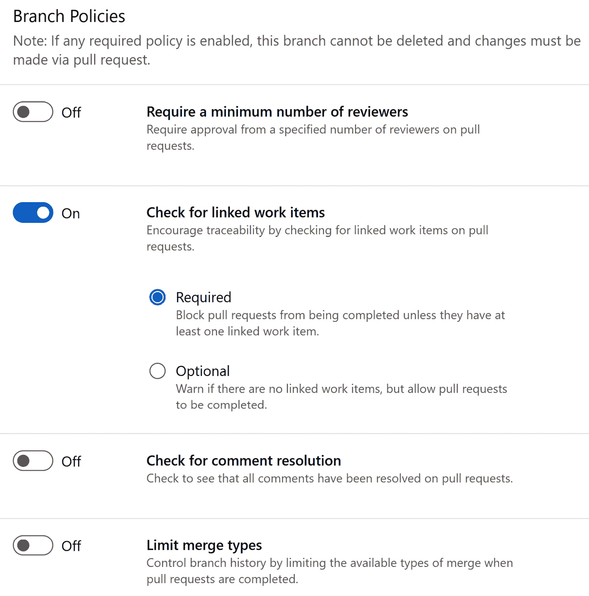

# 第六章：深入了解持续集成/持续部署（CI/CD）管道

在本章中，我们将 亲身体验设计 **应用生命周期** **C** **ycle Management** (**ALM**) 过程，适用于具有代码优先和低代码/无代码组件的应用程序。 此外，我们还将讨论 DevOps 工程师如何标准化管道 并为它们注入活力 在任何其他 新的 Power Platform 项目中，使用 **管道模板** 和 **可重用工作流** 在 **Azure DevOps** 和 **GitHub** 作为可重用的构建模块。 我们将深入了解 并对 **Power Platform 的 ALM 加速器** 包有一个扎实的理解，这个包是 Power Platform 卓越中心启动工具包的一部分，以及我们如何在自己的 DevOps 环境中重用该包中的内容。 我们还将学习 **Power Platform 管道** 、托管管道，以及它们如何利用专业 DevOps 工具的功能，比如自动化测试。 最后，本章 还将教我们如何 **使用开源框架进行自动化测试** 及其在 **持续集成与持续部署** (**CI/CD**)管道中的集成。

在本章中，我们将涵盖以下 主要主题：

+   当所有内容汇聚在一起——分支、环境和 Power Platform 目录

+   Azure 管道模板和可重用 GitHub 工作流

+   Power Platform 的 ALM 加速器

+   DevOps 和 Power Platform 管道中的自动化测试

# 技术要求

要通过使用专业开发 DevOps 工具深入了解我们的 CI/CD 管道，我们需要具备 以下内容：

+   **Power Platform 订阅**：如果我们已经有了 Microsoft Entra ID 工作账户，我们可以注册 Power Apps 开发者计划（[https://www.microsoft.com/en-us/power-platform/products/power-apps/free](https://www.microsoft.com/en-us/power-platform/products/power-apps/free)），或者我们也可以加入 Microsoft 365 开发者计划（[https://developer.microsoft.com/en-us/microsoft-365/dev-program](https://developer.microsoft.com/en-us/microsoft-365/dev-program)）。

+   **Azure DevOps Services 组织**：我们可以随时创建一个 DevOps 组织 *免费* ([https://learn.microsoft.com/en-us/azure/devops/user-guide/sign-up-invite-teammates](https://learn.microsoft.com/en-us/azure/devops/user-guide/sign-up-invite-teammates))。 如果我们在 Azure DevOps 中创建一个公共项目，我们将获得多个免费的流水线，并免费访问服务的所有功能（请参阅 **Azure DevOps for Open** **Source** 提供）。

+   一个 **GitHub 账号** 和公共代码库（[https://github.com/signup](https://github.com/signup)），这也 *是免费的* ，适用于公共代码库。

+   本章讨论的示例和教程位于 在 [https://github.com/PacktPublishing/Mastering-DevOps-on-Microsoft-Power-Platform/tree/main/Chapter06](https://github.com/PacktPublishing/Mastering-DevOps-on-Microsoft-Power-Platform/tree/main/Chapter06)。

# 当一切都合而为一时

在上一章中，我们看到 Azure DevOps Services 流水线和 GitHub 流程如何与我们的 Dataverse 环境和 Power Platform 解决方案互动，以实现 DevOps CI/CD 能力。

## 分支和环境

如果我们遵循 基于主干的分支策略 或非常相似的 **GitHub flow**，我们将经常创建短生命周期的分支用于开发目的。 这些分支就是 所谓的 **功能分支** ，我们可以用它们来实现新的用户需求或修复客户或内部质量保证过程中发现的漏洞。 。

我们可以使用 **Power Platform 构建工具** 以及相应的底层 **Pac CLI** 来创建 开发者 环境。 一个特定解决方案的典型分支 结构可能如下所示：

```
 main
    test
        devA
        devB
        devZ
```

在 **分支策略**的帮助下，我们可以强制开发者 使用拉取请求将更改合并回测试和/或主分支。 在 Azure DevOps Services 中，如果我们为某个分支配置了任何分支策略（**要求** **最低审阅者数量**， **检查链接的工作项**， **检查评论解决**，或者 **限制合并类型**），该分支 将无法删除，并且要求 **拉取请求** (**PRs**) 用于所有更改。 因此，我们可以避免将意外更改直接提交到这些 专用分支：



图 6.1 – 分支策略

检查链接的工作项

我们强烈建议在您的专用主分支和测试分支上强制执行此设置。 它仅仅确保，在没有明确定义的用户故事或 待办事项的情况下，不会有任何更改。

我们也可以在 GitHub 上实现类似的配置。 这被称为 **分支保护规则**，它提供了更多 选项。 例如，我们可以要求在合并之前进行 PR 审核，要求在合并之前通过状态检查，并限制谁可以推送到该分支。 我们还可以强制 **签名提交** 通过附加加密签名来验证 提交的真实性。 这个签名是使用提交者的私钥创建的，其他人可以使用提交者的公钥进行验证。 签名提交提供了代码更改来自可信且 授权源的保证。

下图显示了所有可用的保护规则 适用于 GitHub 分支：


图 6.2 – 分支保护规则

无论我们使用哪个 DevOps 工具，我们的目标是创建一个 DevOps 框架，使得专业开发人员不仅能够相互协作，还能与每一个开发人员（公民开发者）合作。 为了在开发过程中设置正确的 **质量门控** ，建议 在专用和临时/开发人员 Power 平台环境中映射我们的分支结构：


图 6.3 – 分支与环境

在前面的图中，Power Platform 环境和 Git 分支之间的箭头表示代码 和部署流程。 生产环境 和测试环境只能处理 PR（即解决方案仅被导入到这些环境中），而开发环境应当是双向的，因为这些环境中的更改将被导出回 Git 仓库，并分别更新到开发分支。 在我们的案例中， `US_XXX_Y` 分支表示 一个短期的功能分支，包含了用户故事的实现。 具有不同触发条件的 CI/CD 流水线管理着这两个世界之间的互动，从解决方案生命周期的开始开始。 流水线/工作流甚至可以用于在整个 开发者旅程中创建这些自动化。

让我们详细看看如何 使用 Azure Pipelines 自动化一些最常见的步骤： 步骤：

1.  **创建开发者分支**：我们可以使用以下 Bash 脚本来创建 一个分支：

    ```
    git config user.name $(Build.RequestedFor)
    git config user.email $(Build.RequestedForEmail)
    #creating the branch under "dev" folder
    newbranch=dev/${{ parameters.devbranch }}
    git checkout -b $newbranch
    git -c http.extraheader="AUTHORIZATION: bearer $(System.AccessToken)" push origin $newbranch
    ```

1.  **为 Power Platform 开发者环境提供服务**：首先，我们需要通过使用 Microsoft 托管的 Windows 机器上的服务主体登录到 Power Platform 环境，因为 Pac CLI 将身份验证凭证以纯文本形式存储在 Linux 机器上：

    ```
    pac auth create --applicationId 862e5a17-d38b-43ff-b24f-88a77f59623f \
     --clientSecret $(ClientSecret) \
     --tenant 4ae51f31-033a-48fa-be48-5ece14d2c081
    ```

    我们还需要使用相同的服务主体登录到我们的 Azure 租户，以查明是谁触发了此 Azure Pipeline：

    ```
    az login --service-principal \
     -u 862e5a17-d38b-43ff-b24f-88a77f59623f \
     -p $(ClientSecret) \
     --tenant 4ae51f31-033a-48fa-be48-5ece14d2c081
    AADObjectID=$(az ad user show \
     --id $(Build.RequestedForEmail) \
     --query id \
     --output tsv)
    $(Build.RequestedForEmail) system variable contains the email address of the user who started the pipeline. We use the Microsoft Entra ID’s user object ID to create a Power Platform developer environment on behalf of this user (the command, per se, runs under the name of the service principal and not on behalf of our users):

    ```

    pac admin create --name "dev-US_XXX_Y" \

    --type Developer \

    --user $AADObjectID

    ```

    After creating the Power Platform environment, we need to assign the developer (who has started the pipeline) to it as the System Administrator:

    ```

    # 获取环境 ID（倒数第二行包含此信息）

    rawOutput=$(pac admin list --name dev-us_XXX_Y | tail -n 2)

    environmentId=$(echo $rawOutput | cut -d ' ' -f 2)

    #为创建开发者环境的用户添加系统管理员角色

    pac admin assign-user --environment $environmentId --user $AADObjectID --role "系统管理员"

    ```

    ```

开发者环境

Power Platform 中的每个用户最多可以免费创建三个开发者环境 。

1.  `导出解决方案`, `导入解决方案`, `复制环境`, 和 `备份`，针对该环境。 如果我们希望自动化服务连接创建过程，也是可行的。 我们需要创建一个 JSON 文件，将其作为有效载荷发布到 `REST` 端点上，供 Azure DevOps 服务使用（参见 `AzDO/.pipelines/config-tokenizer.yml` 在 `第六章` 文件夹中的 GitHub 仓库）：

    ```
     {
       "authorization": {
          "parameters": {
             "tenantId": "GUID",
             "applicationId": "GUID",
             "clientSecret": "secret"
          },
          "scheme": "None"
       },
       "createdBy": {},
       "data": {},
       "isShared": false,
       "isOutdated": false,
       "name": "ConnenctionName",
       "owner": "library",
       "type": "powerplatform-spn",
       "url": "DataverseURL",
       "administratorsGroup": null,
       "description": "",
       "groupScopeId": null,
       "operationStatus": null,
       "readersGroup": null,
       "serviceEndpointProjectReferences": [
        {
             "description": "",
             "name": "ProjectName",
             "projectReference": {
                "id": "ProjectID",
                "name": "ProjectName"
             }
         }
       ]
    }
    ```

    我们可以使用以下 Bash 脚本来标记这个 JSON 文件（参见 `AzDO/.pipelines/create-service-connection.yml` 在 `第六章` 文件夹中的 GitHub 仓库）：

    ```
    # Set the filename
    filename="config_tokenizer.json"
    # Read the JSON file
    json_string=$(cat .pipelines/$filename)
    # Replace the value
    new_json_string=$(jq '.authorization.parameters.clientSecret = "$(ClientSecret)"' <<< "$json_string")
    new_json_string=$(jq '.authorization.parameters.tenantId = "$(tenantId)"' <<< "$new_json_string")
    new_json_string=$(jq '.authorization.parameters.applicationId = "$(applicationId)"' <<< "$new_json_string")
    new_json_string=$(jq '.url = "${{ parameters.ppdevenvironmentURL }}"' <<< "$new_json_string")
    new_json_string=$(jq '.name = "${{ parameters.ppdevenvironment }}"' <<< "$new_json_string")
    new_json_string=$(jq '.serviceEndpointProjectReferences[0].projectReference.id = "$(System.TeamProjectId)"' <<< "$new_json_string")
    new_json_string=$(jq '.serviceEndpointProjectReferences[0].projectReference.name = "$(System.TeamProject)"' <<< "$new_json_string")
    new_json_string=$(jq '.serviceEndpointProjectReferences[0].name = "${{ parameters.ppdevenvironment }}"' <<< "$new_json_string")
    # Write the modified JSON data back to the file
    echo $new_json_string > config.json
    ```

    如果我们想要在本地执行 这个脚本，那么我们可以使用 `az devops` CLI 命令来自动创建我们的 服务连接：

    ```
    echo $(PatToken) | az devops login --organization $(System.CollectionUri)
    az devops service-endpoint create \
     --organization $(System.CollectionUri) \
    AzDO/.pipelines/import-solution.yml in the Chapter06 folder of the GitHub repo):

    ```

    steps:

    - checkout: git://PowerPlatform/Copilot@${{parameters.sourceBranch}}

    displayName: '检出源分支'

    persistCredentials: true

    - task: PowerPlatformToolInstaller@2

    inputs:

    DefaultVersion: true

    - task: PowerPlatformPackSolution@2

    inputs:

        SolutionSourceFolder: '$(System.DefaultWorkingDirectory)/src/$(solutionName)'

        SolutionOutputFile: '$(Build.ArtifactStagingDirectory)/Solution/$(solutionName).zip'

        SolutionType: 'Unmanaged'

    - task: PublishBuildArtifacts@1

    inputs:

        PathtoPublish: '$(Build.ArtifactStagingDirectory)/Solution'

        ArtifactName: 'Solution'

        publishLocation: '容器'

    - task: PowerPlatformImportSolution@2

    inputs:

        authenticationType: 'PowerPlatformSPN'

        PowerPlatformSPN: ${{parameters.serviceconnection}}

        SolutionInputFile: '$(Build.ArtifactStagingDirectory)/Solution/$(solutionName).zip'

        AsyncOperation: true

        MaxAsyncWaitTime: '60'

    - task: PowerPlatformPublishCustomizations@2

    inputs:

        authenticationType: 'PowerPlatformSPN'

        PowerPlatformSPN: ${{parameters.serviceconnection}}

    ```

    We use `${{parameters.serviceconnection}}` as a string parameter of the pipeline, which represents the name of the service connection previously created.We can put these steps together into one pipeline or keep them separately. We can also chain these pipelines by using other trigger conditions, such as `branch created`. For instance, a new dev branch is created under the `dev/*` condition looks, as follows:

    ```

    trigger:

    -  dev/*

    ```

    ```

经过这些自动化步骤之后，我们最终得到了一个开发分支，可以在上面开始我们的工作。 建议使用 Azure DevOps 中的可用工具将一个或多个工作项分配给该分支；否则，后续提交的 PR 将会被自动拒绝（如果配置了推荐的分支策略）。

下图显示了如何分配 分支到 **Issue** 工作项：


图 6.4 – 将分支链接到工作项

在 Power 平台环境中进行更改 应该在开发分支上反映出版本控制系统中的更改。 为了实现这一点，我们需要创建另一个管道（`Export-to-Git`），导出我们的托管和非托管解决方案，解包并提交更改到我们的开发分支。 我们在 *第五章* 中看到了这些构建模块。除了该管道外，我们还需要添加一个步骤来导出未托管的解决方案，并以 `Both` 类型解包解决方案。要将更改提交回分支，我们可以在 `PowerPlatformExportSolution@2` 和 `PowerPlatformUnpackSolution@2` 构建任务完成后，执行以下 Git 命令作为 Bash 脚本：

```
 -  checkout:  git://$(System.TeamProject)/$(Build.Repository.Name)@${{parameters.targetBranch}}
    displayName:  'Checkout  Source  Branch'
    persistCredentials:  true
#  Configure  email/name  and  checkout  git  branch
-  script:  |
      git  config  user.name  $(Build.RequestedFor)
      git  config  user.email  $(Build.RequestedForEmail)
      git  checkout  origin/${{parameters.targetBranch}}  --track
[[Adding here those PowerPlatformExportSolution@2 and PowerPlatformUnpackSolution@2 steps discussed earlier.]]
-  script:  |
        #!/bin/bash
        set  -e
        #  Set  the  path  to  the  directory  containing  the  solution
        solution_dir="$(Build.SourcesDirectory)/src/$(solutionName)"
        #  Find  all  Solution.xml  files  in  the  solution  directory  and  its  subdirectories
        find  "$solution_dir"  -type  f  -name  "Solution.xml"  |  while  read  -r  file;  do
                #  Replace  the  content  of  the  <Version>  tag  with  0.0.0.0
                sed  -i  's|<Version>.*</Version>|<Version>0.0.0.0</Version>|g'  "$file"
        done
    displayName:  "Set  version  number  to  0.0.0.0"
-  script:  |
        rm  -rf  ./out/$(solutionName).zip
        rm  -rf  ./out/$(solutionName)_managed.zip
        git  add  --all
        git  commit  -am  "Solution  is  committed"  --allow-empty
        git  -c  httpO.extraheader="AUTHORIZATION:  bearer  $(System.AccessToken)"  push  origin  ${{parameters.targetBranch}}
```

通过这个管道的帮助，我们的开发人员可以不断地将他们的更改提交回他们自己的 专用开发分支，进行特性开发。 我们有意将解决方案的版本号设置为 `0.0.0.0` ，以避免冲突的合并，并通过 Azure 管道管理版本号。 当开发人员准备好时，他们可以提交 PR 回到 父分支。

让我们讨论一些额外的 DevOps 设计原则和建议 与我们的 DevOps 过程相结合：

+   `PowerPlatformPackSolution@2` 构建任务可以随时从源代码控制中打包我们的解决方案。 这是一个压缩步骤，实际上是将我们的文件夹打包成 ZIP 文件，因此不需要长时间的编译时间。 当然，如果我们有 需要构建的代码组件，例如 **PowerApps 组件框架** (**PCF**) 控件或 Dataverse 插件，或者我们针对同一清单（解决方案）目标多个环境，则值得创建专门的 CI 管道。

+   `Export-to-Git` 管道，我们可以提交 PR 来将我们的更改合并到测试分支，然后再合并到生产分支。 我们可以引入 CD 管道，该管道在目标分支上的 PR 完成后执行。 分支触发：

    ```
    trigger:
    SolutionChecker or performing automated tests. We can introduce approval processes for staging environments (test and production) to control when changes are approved by release managers or environment administrators, with the help of Azure DevOps Services environments.
    ```

+   **解决方案的版本号 - 何时需要设置它们？** 如前所述，随着 DevOps 的兴起，我们希望只维护一个版本，即我们应用程序在生产中的最新版本。 我们使用版本控制和版本号来追踪更改到 源代码：

    ```
     #  Solution  version  in  source  control  is  not  used. Instead,  create  version  at  build  time  from  the  current  build  number. -  pwsh:  |
          Get-ChildItem  -Path  "$(Build.SourcesDirectory)\$(RepoName)\${{parameters.solutionName}}\SolutionPackage\**\Solution.xml"  |
          ForEach-Object  {
                    (Get-Content  $_.FullName)  `
                            -replace  '<Version>0.0.0.0<\/Version>',  '<Version>$(Build.BuildNumber)</Version>'  |
                    Out-File  $_.FullName
          }
        displayName:  'Update  Solution  XML  with  Build  Number'
    name:  1.0.$(Date:yyyyMMdd)$(Rev:.r)
    ```

    这意味着在构建/部署过程中，版本 是实时计算的，使用 Azure 管道的构建名称。 这提供了解决方案版本与生成该版本的管道之间的一对一关系。 该版本。

+   `导出到 Git` 管道中，我们可以引入一个参数，该参数期望部署父分支当前版本的分支名称。 如果我们不想以这种方式覆盖我们的工作，我们可以使用诸如 `git rebase` 等 Git 命令将我们的开发分支恢复到父分支的最新版本。 之后，我们需要使用另一个管道将解决方案导入到我们的 开发环境。

总的来说，我们可以通过以下方式管理我们的开发工作 四个管道：


图 6.5 - 管理解决方案的管道

我们可以以同样的方式创建 GitHub 工作流。 那些 Bash 和 PowerShell 脚本可以轻松迁移到 GitHub 工作流，还可以建立与 Azure 类似的分支和仓库结构，并分配 Power Platform 环境。 DevOps 服务。

## Power Platform 目录

除了这种 CI/CD 交付到 Power Platform 环境之外，Power Platform 还提供了一个新的概念，用于管理我们可重用的软件包。 该 **Power Platform 目录** 是一个软件包管理器，包含解决方案模板、PCF 组件、端到端解决方案以及其他可重用资产。 它基于我们在专业开发场景中发布软件包到不同的包管理库时使用的相同概念，例如 NuGet、npm、Maven 和 Pip。 Power Platform 中的目录是一个功能，允许开发者和创建者轻松发现并使用组织内的 Power Platform 模板和代码组件。 它提供了一个私有的中央位置，用于查找和安装最新且最可靠的组件版本，提供能够立即产生价值的模板。 对于管理员和业务审批人而言，目录作为一个唯一的权威来源，用于存储和维护 Power Platform 工件，允许他们策划和控制内容，加速创作者和开发者的价值。 它还为在敏感的监管和法定场景中使用批准的组件和模板启用了审批工作流，提供具有设置 和元数据的管理功能。

为了将目录带入一个专用环境（建议提供一个单独的环境，例如 `目录`），我们需要将其作为 Dynamics 365 应用从 AppSource 安装： [https://appsource.microsoft.com/product/dynamics-365/powerappssvc.catalogmanager-preview?flightCodes=dde212e5c66047c59bf2b346c419cef6](https://appsource.microsoft.com/product/dynamics-365/powerappssvc.catalogmanager-preview?flightCodes=dde212e5c66047c59bf2b346c419cef6)。

安装此 D365 应用后，我们可以提交并部署以下资产 到其中：

+   **Dataverse 解决方案** (已管理或未管理) 或 **软件包部署器软件包** （企业模板也可以 发布到 目录中）

+   **模板** 用于 Power App 或 Power Automate 流程

+   **Power Platform 代码优先组件** 如自定义连接器 或 **Power Apps 组件框架** (**PCF**) 控件

Power Platform 目录 引入了额外的安全角色来管理目录项的生命周期—— **目录提交者** 用来提交项目到目录， **目录只读成员** 用来发现和安装 目录中的项目， **目录批准者** 用来批准提交到 目录的项目， 以及 **目录管理员** 用来管理目录。 我们也从目录中获得了这种企业级的安全性。

我们的 Azure 管道和 GitHub 工作流不仅可以面向环境，还可以面向目录。 Pac CLI 提供了适当的命令，将我们的解决方案、自定义连接器和 PCF 组件提交到目录。 以下脚本创建一个提交到我们的 `mpa_ITBase_managed` 解决方案（我们在 *第四章* 用于管理的管道），并从企业模板提交一个新的 目录项：

```
 # Power Platform Catalog Manager application's GUID
pac admin list --application 83a35943-cb41-4266-b7d2-81d60f383695
# environment is the "Catalog" environment
pac catalog list --environment 0b90d036-e017-e840-9287-b1de3d95e252
# create a submission json file
pac catalog create-submission
# update the generated json file
pac catalog submit --environment 0b90d036-e017-e840-9287-b1de3d95e252 --path .\submission.json --solution-zip .\mpa_ITBase_managed.zip
```

这些脚本也可以代表服务 主体运行。 默认情况下，提交需要由目录管理员批准，但我们可以更改配置，使某些发布者，例如在 Azure 管道或 GitHub 工作流中运行的服务主体，获得 自动批准。

下图展示了 `mpa_ITBase_managed` 解决方案：


图 6.6 – Power Platform 目录管理器

Power Platform 目录

Power Platform 目录 将在它们变为 **管理环境的一部分** 后， 正式 发布。

现在让我们继续讨论管道模板和可重用的工作流，它们可以在大规模上提供我们的 Azure 管道和 GitHub 工作流的可重用性。

# Azure 管道模板和可重用的 GitHub 工作流

回顾我们前一节中的 Azure 流水线 ，我们可以说，这其实是一个非常好的起点，可以让所有工作自动化。 然而，如果我们需要支持数百甚至数千个应用程序，那么在每个包含这些解决方案的存储库中保留三到四个流水线的方法将变得更加复杂。 随着我们开发的应用程序越来越多，这些 Azure 流水线的不同版本将会并行存在。 如果能有一个集中式存储库，包含这些流水线的业务逻辑，且只在调用它们之前定制一些参数，那就太好了。 这就是 Azure 流水线模板和可重用 GitHub 工作流背后的理念。

**Azure 流水线模板** 使我们能够创建可重用的业务逻辑，这些逻辑可以在我们的 YAML 流水线实例中使用。 这些模板还可以用来控制流水线中允许的内容，通过定义调用者应遵循的策略。 例如，我们可以通过使用一个充当保护措施的模板来强制执行任务执行约束，确保执行的任何任务都符合我们组织的 安全指南。

例如，以下 `AzDO/.pipelines/template/include-paccli-steps.yml` 位于 `Chapter06` 文件夹中的 GitHub 仓库）：

```
 # File: templates/include-paccli-steps.yml
steps:
-  bash:  |
        echo  "Installing  Pac  CLI"
        dotnet  tool  install  --global  Microsoft.PowerApps.CLI.Tool
    displayName:  "Installing  Pac  CLI"
```

使用此模板的流水线文件会在 Linux 上执行，然后在 Windows 代理上执行（参见 `AzDO/.pipelines/azure-pipeline-template.yml`）：

```
 # File: azure-pipelines.yml
jobs:
- job: Linux
  pool:
    vmImage: 'ubuntu-latest'
  steps:
  - template: templates/include-paccli-steps.yml
- job: Windows
  pool:
    vmImage: 'windows-latest'
  steps:
  - template: templates/include-paccli-steps.yml
```

我们还可以对 Azure 流水线模板 文件进行参数化，调用者流水线可以根据其 定制需求设置这些参数。

相同的 概念，称为 `workflow_call`。以下可重用的工作流将在目标平台上安装 Pac CLI。 该工具的版本号和目标平台是此流程的参数（参见 `GitHub/.github/workflows/install-paccli.yml`）：

```
 on:
  workflow_call:
    inputs:
      version:
        required: true
        type: number
      platform:
       required: true
       type: string
       description: "platform"
jobs:
  installpac:
    runs-on: ${{inputs.platform}}
    steps:
     - name: install pac cli
       shell: bash
       run: |
          echo "version number: ${{inputs.version}}"
          dotnet tool install --global Microsoft.PowerApps.CLI.Tool
```

要从其他工作流中调用我们的工作流 ，我们需要在我们的 *调用者* GitHub 工作流中创建一个专门的任务（参见 `GitHub/.github/workflows/Deploy.yml`）：

```
 name: Call a reusable workflow
on:
  workflow_dispatch:
jobs:
  call-paccli-workflow:
    uses: jovadker/ppmanaged/.github/workflows/install-paccli.yml@main
    with:
      version: 8
      platform: ubuntu-latest
  call-workflow-windows:
    uses: jovadker/ppmanaged/.github/workflows/install-paccli.yml@main
    with:
      version: 8
      platform: windows-latest
```

这个概念在 Azure DevOps 和 GitHub 中的真正力量在于，我们可以将模板 和可复用的工作流放置在同一代码库中的不同位置，甚至放在不同的 Git 代码库中。 如果我们查看为启动开发人员环境、创建服务连接、以及分别从/向环境导出/导入解决方案而创建的管道，我们现在可以将这些模板或可复用的工作流放置在专用的 Git 代码库中。 不同的项目和解决方案可以通过使用这个可复用的概念来调用我们的模板。 相反，我们可以通过减少管理大量项目的整体工作量来集中改进和维护这些工作流。 项目。

除了可复用的 工作流，GitHub 还提供了所谓的 **GitHub 启动工作流**。GitHub 启动工作流也是存储在组织的 *GitHub 代码库*中的模板。 当我们在 GitHub 用户界面中创建新工作流时，这些模板会显示出来。 创建工作流后，模板会被复制到我们的代码库中，至此，我们将实例与模板解耦。 我们可以使用 GitHub 启动工作流帮助项目基于我们的 可复用工作流来设置它们的工作流。

现在我们已经了解了管道模板和可复用工作流，接下来让我们学习一下 Power Platform 的 ALM 加速器，它在背后大量使用了这个概念。 

# Power Platform 的 ALM 加速器

Power Platform 的 ALM 加速器 是一个帮助开发人员自动化 Power Platform 软件开发工作流的工具。 尽管 它是 **卓越中心** (**CoE**) **启动工具包**的一部分，该工具包是帮助组织开始采用 Power Platform 的组件和工具的集合，但它也可以作为独立的解决方案安装在我们的 Dataverse 环境中。

ALM Accelerator 包括 Azure 管道模板、Azure 管道和 Power Platform 应用程序，帮助专业开发人员在项目中实现 DevOps 和 ALM。这个加速器包被称为**ALM Accelerator for Advanced Makers**（**AA4AM**）解决方案，包含了最初由微软 CoE Starter Kit 工程团队开发的参考实现。成功实现后，团队决定将其开源，并使每个组织都能使用，证明了如何在 Power Platform 中实现健康的应用生命周期管理。我们可以直接使用这些管道和应用程序，或者根据我们的组织需求对其进行自定义，当然，我们也可以从这个团队几年前设计的基本概念中学到很多东西。

我们可以找到关于加速器的全面文档，了解如何安装它，如何基于可用的管道模板创建管道，以及如何在 Azure DevOps 仓库中管理我们的 Power Platform 解决方案。

本章前面讨论过的分支、环境和管道模板，对于理解 ALM Accelerator 如何在后台工作至关重要。加速器的主要功能如下：

+   有一个模型驱动的应用程序，**ALM Accelerator for Power Platform Administration**，用于创建和管理部署配置文件。**部署配置文件**描述了解决方案在我们环境中的 CD 流程。它在概念上与我们如何定义 Power Platform 管理管道相同。建议为每个 Power Platform 解决方案创建一个部署配置文件，因为该配置文件还包含有关 Azure DevOps 项目、Git 仓库和目标分支的信息，以及相应的 Power Platform 环境。

+   另有一个画布应用程序，ALM Accelerator for Power Platform，为开发人员提供了一个 UI，并在给定的 Power Platform 环境中可视化解决方案和分配的部署配置文件。

+   通过 ALM Accelerator for Power Platform 画布应用程序，我们可以轻松创建一个分支，并将我们的解决方案版本（更改）多次提交到该分支。

+   Canvas 应用程序提供了一种通过定义的环境移动我们更改的方式。 每次部署（发布）都是对父分支的 PR。 在 Azure DevOps 中完成 PR 后，管道将解决方案导入到部署配置文件中定义的分配环境。

+   建议为每个解决方案创建一个仓库。 该仓库包含我们的管道，利用了加速器提供的管道模板。

+   我们可以添加更多环境，并创建我们在本章开头讨论的相同分支结构。

+   Canvas 应用程序使用自定义连接器，并调用 Azure DevOps Services 的 REST API 端点与 定义的管道进行交互。

+   该 `coe-alm-accelerator-templates` GitHub 仓库包含了 ALM 加速器使用的管道模板。 我们需要将此仓库分叉到我们的 Azure DevOps 项目中，作为一个额外的 Git 仓库。

+   我们可以根据我们 组织的需求自定义管道模板。

+   Power Platform 的 ALM 加速器 仅适用于 Azure DevOps Services。

下图展示了 Power Platform 的 ALM 加速器 的工作原理：


图 6.7 – Power Platform 的 ALM 加速器

我们可以看到所选环境中可用的未管理解决方案（开发者环境）。 我们可以使用 **提交解决方案**、 **部署解决方案**和 **删除解决方案** 按钮来触发我们的管道，提交我们的更改，或 启动 PR。

Power Platform 的 ALM 加速器

通过观察本章中前面展示的广泛灵活性 以及管道在托管环境中的有效性，我们应该考虑将 Power Platform 的 ALM 加速器作为一个工具，以帮助我们熟悉各种设计模式和概念。 然后，这些可以被纳入我们自定义的 Azure DevOps 管道，并随后集成到我们的 GitHub 工作流中。

现在，我们已经准备好在组织中操作和管理大量的项目和解决方案。 确保我们应用程序质量的最后一件事是 **自动化测试**。

# DevOps 和 Power Platform 管道中的自动化测试

测试自动化和自动化测试 是 ALM 和 DevOps 流程的核心部分。 没有自动化 测试，我们无法 与其他开发人员共享解决方案，无法作为独立的 SCRUM 团队共同合作解决方案，而且每次修改解决方案时都是一项巨大的挑战，因为我们无法知道我们的应用程序会在回归测试中跌落多远。 为了避免回归并实现高测试覆盖率，我们需要建立与定制开发项目相同的质量保证流程。 Power Platform 提供了多种工具和框架来为 我们的解决方案创建功能测试。

`选择`, `设置属性`, `断言`, 和 `追踪`. 测试表达式构建测试用例。 `真` 或 `假` 在测试中。 如果断言返回 `假`, 测试 用例失败。

使用 Power Apps 测试工作室创建的测试可以通过 Azure 管道执行。 在 *进一步阅读* 部分提供的逐步指南（*使用 Azure DevOps Pipelines 自动化测试*）使用测试的回放 URL 作为自动化测试执行的输入。 在 [https://github.com/microsoft/PowerAppsTestAutomation](https://github.com/microsoft/PowerAppsTestAutomation) 下提供的仓库 `MSTest` 测试方法使用 `AppMagic.TestStudio.GetTestExecutionInfo()` `MSTest` 测试方法然后根据这些结果决定成功或失败。 测试方法的结果还会写回我们的 Azure 管道，我们可以直接在 Azure DevOps 服务的 构建结果中查看测试结果。

**Power Apps 测试引擎** 是测试 PowerApps 画布应用的最新方法，使用基于 Playwright 的引擎。 **Playwright** 因其稳定性 和性能、简便的设置、对 Chromium、Firefox 和 WebKit 的统一 API 支持，以及 JavaScript、Python 和 C# 的官方绑定而广受欢迎。 Playwright 最初由微软开发，现已开源并发布供 社区贡献。

PowerApps 测试引擎允许我们使用直观的 Power Fx 语言以 YAML 格式编写测试， **文档对象模型** (**DOM**) 抽象化使得我们可以使用在设计阶段建立的控件名称引用来编写测试。 这种方法意味着测试作者不需要具备 JS 知识 或对与应用程序视觉输出相关的浏览器 DOM 的了解。 以下 YAML 文件 展示了一个这样的例子：

```
 testSuite:
   testSuiteName: Regression test suite
   testSuiteDescription: ''
   persona: User1
   appLogicalName: vadkerti_contentgenerator_48e05
   appId: ''
   onTestCaseStart: ""
   onTestCaseComplete: ""
   onTestSuiteComplete: ""
   networkRequestMocks:
   testCases:
   - testCaseName: Test with empty input
      testCaseDescription: ''
      testSteps: |
         =
         SetProperty(Prompt.Text, "Writing some test");
         Select(SystemPrompt);
         SetProperty(Prompt.Text, "");
         Select(SystemPrompt);
         Select(Prompt);
         Select(Button4);
         Assert(IsMatch(TextInput4.Text, "I'm sorry, I'm not sure what you are asking. Can you please provide more context or clarify your question?<|im_end|>"), "Different output");
testSettings:
   filePath:
   browserConfigurations:
   - browser: Chromium
      device:
      screenWidth: 0
      screenHeight: 0
   locale: en-US
   recordVideo: true
   headless: true
   enablePowerFxOverlay: false
   timeout: 30000
environmentVariables:
   filePath:
   users:
   - personaName: User1
      emailKey: user1Email
      passwordKey: user1Password
```

我们可以从 Power Apps 测试工作室 下载这个 YAML 文件 并导入 到我们的 PowerApps 测试引擎。

测试引擎还支持 **连接器模拟**，允许我们在应用程序中围绕连接器和连接创建模拟。 因此，我们可以将应用程序与第三方生产服务隔离进行测试。 此外，测试引擎支持截图和视频录制，允许我们在测试执行的任何时候截屏，并通过视频记录文档化测试序列，这对于故障排除未通过的测试和分析实际用户体验非常有帮助。 未通过的测试场景。

其他我们可以在管道执行期间调用的知名工具，借助 Pac CLI 和 PowerShell 模块， 是 `AppChecker` (`pac solution check`) 用于 画布应用程序。

在测试 **Microsoft Copilot Studio**时，我们可以使用 **PVA 测试框架**，一个可以在 GitHub 上找到的示例解决方案。 它演示了如何使用 API 和 Direct Line 通道对 Microsoft Copilot Studio 聊天机器人进行测试。 该框架确认机器人在多种情况下按预期运行，包括 以下情况：

+   测试自然语言理解模型以触发 正确的话题。

+   验证多个匹配话题的选项（“*您是指...*”如果用户意图 模糊不清，副驾驶助手会提出此问题）

+   进行负载测试 的大规模测试

+   完整的 端到端对话测试

+   测试 自适应卡片的功能

+   在 CI/CD 部署管道中添加一个测试步骤，以防测试失败时防止部署 测试失败

我们可以手动创建 **对话脚本** ，或者我们可以使用 PVA 测试框架 从 Dataverse 导出现有对话 ，并以 *CHAT 格式*进行转换。然后，我们可以借助 PVA 测试框架将这些 CHAT 文件转换为 JSON，并让它们通过 Direct Line REST API 端点执行。 该框架可以轻松集成到我们的 Azure 管道和 GitHub 工作流中，因为它是一个.NET 6 控制台应用程序，可以在基于 Windows 的 托管代理上运行。

要测试 **基于模型的 Power Apps** 和 **Power Pages 网站**，我们可以使用其他 网页测试 框架，例如： 以下内容：

+   **Selenium 测试框架** 是一个自动化测试工具集，允许开发人员创建强大的基于浏览器的回归自动化套件和测试。 它可以扩展并分配脚本到多个环境，并支持广泛的编程语言。

+   Playwright 是一个跨浏览器、跨平台、跨语言的 可靠的端到端网页应用测试工具。 它支持所有现代渲染引擎、本地移动模拟、自动等待、网页优先的断言、追踪和完全隔离。 Playwright 使用其 自有 API 与浏览器进行交互。

+   **Appium.io 用于移动应用程序测试**：Appium 是一个免费开放源代码的软件套件和生态系统，旨在促进跨各种应用平台的用户界面自动化。 这包括移动操作系统（iOS、Android 和 Tizen）、网页浏览器（Chrome、Firefox 和 Safari）、桌面环境（macOS 和 Windows）以及电视操作系统（Roku、tvOS、Android TV 和 Samsung）。 其目标是使任何移动应用程序的自动化成为可能，无论使用什么编程语言或测试框架，完全访问后端 **应用程序编程接口** (**APIs**)和 **数据库** (**DBs**)都可以在 测试脚本中进行访问。

+   Cypress 是一个基于 JavaScript 的端到端测试 框架，建立在 Mocha 上。 它旨在简化为 Web 应用程序设置、编写、运行和调试测试的过程。 Cypress 可以测试任何在 Web 浏览器中运行的内容，并特别擅长处理现代 JavaScript 框架。 Cypress 的一些关键优势包括更快且更可靠的测试、减少的故障率、支持详细报告的仪表盘、并行 测试 执行，以及支持 **行为驱动开发** (**BDD**) 和 **测试驱动开发** (**TDD**) 测试。

+   JMeter 是由 Apache 软件基金会开发的开源工具，用于负载测试和分析各种服务的性能。 JMeter 是用 Java 编写的，可以用于测试各种应用程序和协议的性能和功能行为，例如 **HTTP** (**超文本传输协议**)， **SOAP** (**简单对象访问协议**)， **FTP** (**文件传输协议**)，以及 **LDAP** (**轻量级目录访问协议**)。 它 提供了一个功能齐全的 IDE、动态 HTML 报告、多线程框架以及一个高度可扩展的核心，支持可插拔的采样器 和插件。

测试 Power Automate 云流和桌面流是比在浏览器或移动设备上执行 UI 自动化测试更复杂的工程挑战。 截至写作时，没有推荐的框架来实现针对我们的云流和桌面流的集成和系统测试。 由于这些组件被视为业务逻辑层的一部分，我们可以通过它们前面的 UI 组件进行测试，作为 端到端测试。

相反，我们可以通过调用其相应的 REST API 端点并将其结果与我们 期望的结果进行比较，提供部分解决方案来测试 HTTP 触发和 Webhook 触发的云流。

正如我们在 *第五章*中学习到的， `OnDeploymentCompleted` 事件可以用于测试我们在部署到目标环境后 的解决方案，该环境被表示为一个部署 阶段。 我们的 Power Automate 云流作为该事件的事件处理程序，可以调用 Azure 管道或 GitHub 工作流执行代码优先的专业开发测试自动化脚本（类似于我们在 *第五章*中如何调用 GitHub 工作流）来将我们的解决方案提交到 Git 仓库。 下一个部署阶段的预审批门（`OnApprovalStarted` 或 `OnPredeploymentStarted`）可以检查前一个环境中测试执行的结果。 如果测试通过，部署到下一个环境 可以继续进行。

最后，我们可以使用其他 Microsoft Azure 服务，如 **Azure 负载测试** 服务，来对我们的 **JMeter** 进行测试 Power Platform 解决方案。 JMeter 还提供录制功能，而 Azure 负载测试服务可以模拟数百个并行用户同时与 我们的应用进行交互。

根据解决方案的类型，我们需要选择具有适当深度和广度的测试工具。 我们需要设计和交付的业务或任务关键应用越多，我们就应该在这一 DevOps 领域投入更多的时间和精力。

# 总结

在本章中，我们探讨了 DevOps CI/CD 流程的高级模式，并学习了如何建立一个强大的分支策略，反映我们解决方案的开发、测试和生产环境。 我们检查了许多自动化创建分支、使用服务连接启动 Power Platform 环境、以及使用各种 Pac CLI 脚本导入和导出解决方案的示例。

我们还深入了解了 Power Platform 目录，作为 Power Platform 的包管理解决方案。 此外，我们还了解了 Power Platform 的 ALM 加速器，以及该解决方案如何使用管道模板、分支策略和环境管理。 最后，我们熟悉了可以与 Power Platform 解决方案一起使用的测试自动化框架。

在下一章中，我们将更进一步，学习在 Power Platform 上实现 DevSecOps 流程。

# 进一步阅读

+   `az devops` CLI： [https://learn.microsoft.com/en-us/cli/azure/devops?view=azure-cli-latest](https://learn.microsoft.com/en-us/cli/azure/devops?view=azure-cli-latest)

+   Windows Subsystem for Linux： [https://learn.microsoft.com/en-us/training/modules/wsl-introduction/](https://learn.microsoft.com/en-us/training/modules/wsl-introduction/)

+   Azure DevOps 批准 流程： [https://learn.microsoft.com/en-us/azure/devops/pipelines/process/approvals?view=azure-devops&tabs=check-pass](https://learn.microsoft.com/en-us/azure/devops/pipelines/process/approvals?view=azure-devops&tabs=check-pass)

+   Power Platform 目录： [https://learn.microsoft.com/en-us/power-platform/developer/catalog](https://learn.microsoft.com/en-us/power-platform/developer/catalog)

+   Azure DevOps 管道 模板： [https://learn.microsoft.com/en-us/azure/devops/pipelines/process/templates?view=azure-devops&pivots=templates-includes](https://learn.microsoft.com/en-us/azure/devops/pipelines/process/templates?view=azure-devops&pivots=templates-includes)

+   GitHub 启动 工作流： [https://docs.github.com/en/actions/using-workflows/creating-starter-workflows-for-your-organization](https://docs.github.com/en/actions/using-workflows/creating-starter-workflows-for-your-organization)

+   GitHub 可重用 工作流： [https://docs.github.com/en/actions/using-workflows/reusing-workflows](https://docs.github.com/en/actions/using-workflows/reusing-workflows)

+   Power Platform 的 ALM 加速器： [https://learn.microsoft.com/en-us/power-platform/guidance/alm-accelerator/overview](https://learn.microsoft.com/en-us/power-platform/guidance/alm-accelerator/overview)

+   ALM 的源代码 加速器： [https://github.com/microsoft/coe-starter-kit/tree/main/CenterofExcellenceALMAccelerator](https://github.com/microsoft/coe-starter-kit/tree/main/CenterofExcellenceALMAccelerator)

+   ALM 加速器管道 模板： [https://github.com/microsoft/coe-alm-accelerator-templates/tree/main](https://github.com/microsoft/coe-alm-accelerator-templates/tree/main)

+   Power Apps 测试工作室: [https://docs.microsoft.com/en-us/powerapps/maker/canvas-apps/test-studio](https://docs.microsoft.com/en-us/powerapps/maker/canvas-apps/test-studio)

+   Visual Studio 单元测试: [https://learn.microsoft.com/en-us/visualstudio/test/getting-started-with-unit-testing?view=vs-2022&tabs=dotnet%2Cmstest](https://learn.microsoft.com/en-us/visualstudio/test/getting-started-with-unit-testing?view=vs-2022&tabs=dotnet%2Cmstest)

+   使用 Azure DevOps 自动化测试的管道: [https://docs.microsoft.com/en-us/powerapps/maker/canvas-apps/test-studio-classic-pipeline-editor](https://docs.microsoft.com/en-us/powerapps/maker/canvas-apps/test-studio-classic-pipeline-editor)

+   PowerApps 测试引擎: [https://learn.microsoft.com/en-us/power-apps/developer/test-engine/overview](https://learn.microsoft.com/en-us/power-apps/developer/test-engine/overview)

+   Azure 负载测试服务: [https://learn.microsoft.com/en-us/azure/load-testing/overview-what-is-azure-load-testing](https://learn.microsoft.com/en-us/azure/load-testing/overview-what-is-azure-load-testing)

+   Microsoft Copilot Studio 测试框架: [https://powervirtualagents.microsoft.com/en-us/blog/automate-testing-of-your-power-virtual-agents-chatbots-with-the-pva-test-framework-sample-solution/](https://powervirtualagents.microsoft.com/en-us/blog/automate-testing-of-your-power-virtual-agents-chatbots-with-the-pva-test-framework-sample-solution/)

+   Microsoft Copilot Studio 实施指南: [https://aka.ms/CopilotStudioImplementationGuide](https://aka.ms/CopilotStudioImplementationGuide)
