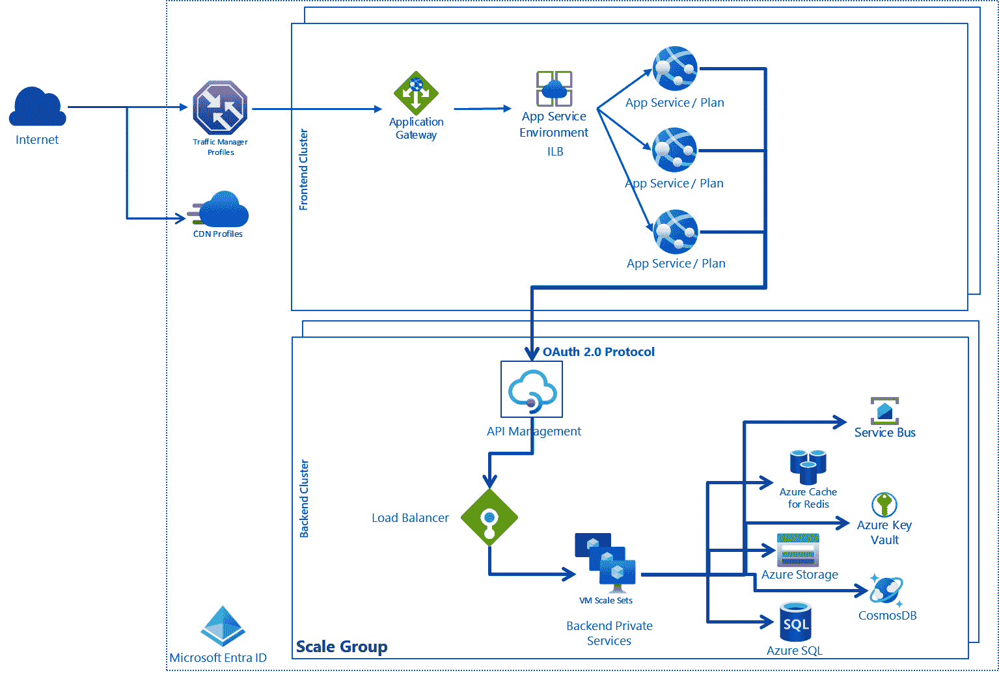

# Power Platform 中的 DevSecOps 概述

DevSecOps 是一种将安全实践融入整个 **软件开发生命周期** (**SDLC**)的软件开发方法论，包括需求分析、规划与设计、开发、测试和质量保证，直到部署和维护。 Power Platform 是一个现代化的应用程序运行平台，使开发者能够构建自定义应用程序、自动化工作流、创建聊天机器人、设计和发布网站等。 该平台拥有强大的安全模型，确保数据保护并遵守行业标准（*超过 90 个合规证书*）；由 Azure DevOps 或 GitHub 建立的应用程序生命周期管理和 DevOps 流程，在处理任何类型的 开发项目时，默认部分考虑到这种安全整合。

本章将介绍设置安全的 DevOps 开发项目所需的步骤和行动，涵盖多个环境以及 **Microsoft Entra ID**支持的身份和访问管理。 我们还将学习如何使用 DevOps 工具大规模启动基于 Power Platform 的开发项目，使开发人员和贡献者能够快速构建和部署应用程序，同时保持安全性和合规性标准。 该平台还提供静态分析工具和报告，用于监控某些类型的安全威胁。 这有助于我们在减少网络风险的同时实现高效的生产力。 我们还将讨论使用开源库的自定义代码的安全影响，并将从 安全的角度检查我们的 DevOps 工具。

本章我们将涵盖以下 主要主题：

+   什么是 DevSecOps？

+   Power Platform 的 安全模型

+   机密扫描和静态代码 分析工具

+   解决方案检查器

+   大规模启动 DevSecOps 项目 的实施

+   DevOps 流程的 安全性

# 技术要求

要深入了解 DevSecOps 方法和工具，我们需要具备 以下内容：

+   **Power Platform 订阅**：我们可以注册 Power Apps 开发者计划（ [https://www.microsoft.com/en-us/power-platform/products/power-apps/free](https://www.microsoft.com/en-us/power-platform/products/power-apps/free)），如果我们已经有 Microsoft Entra ID 工作帐户，或者我们可以加入 Microsoft 365 开发者 计划（ [https://developer.microsoft.com/en-us/microsoft-365/dev-program](https://developer.microsoft.com/en-us/microsoft-365/dev-program)）

+   **Azure DevOps 服务组织**：我们可以随时创建一个免费的 DevOps 组织（ [https://learn.microsoft.com/en-us/azure/devops/user-guide/sign-up-invite-teammates](https://learn.microsoft.com/en-us/azure/devops/user-guide/sign-up-invite-teammates)）。

+   **GitHub 账户和公共** **仓库**： [https://github.com/signup](https://github.com/signup)

+   **GitHub 高级安全**：此功能对公共仓库免费开放； 参见 [https://docs.github.com/en/get-started/learning-about-github/about-github-advanced-security#about-advanced-security-features](https://docs.github.com/en/get-started/learning-about-github/about-github-advanced-security#about-advanced-security-features)。

+   **示例和演练** 本章讨论的内容可以在以下位置找到 ：  [https://github.com/PacktPublishing/Mastering-DevOps-on-Microsoft-Power-Platform/tree/main/Chapter07](https://github.com/PacktPublishing/Mastering-DevOps-on-Microsoft-Power-Platform/tree/main/Chapter07)

# 什么是 DevSecOps？

**DevSecOps** 代表 的是 **开发、安全和运维** 以及这些领域的协作，以交付安全的应用程序。 它的原则是在定义 DevOps 过程和方法论后不久建立的。 这个理念相同，就是将 **左移** 的思维方式应用于安全领域，这与我们在质量保证和后来的运维中应用左移思维方式类似。 它是一个框架，将安全性整合到 SDLC 的所有阶段，从这个角度看，它是软件开发组织在处理安全问题时的一次演进，旨在通过引入“安全第一”的思维文化，并在软件开发生命周期的每个阶段（从设计到交付）自动化安全。 组织广泛采用这种方法，减少发布含有安全漏洞的代码的风险，不仅避免了声誉损失，还避免了因 此类失败而造成的高额财务损失。

如果我们回顾在 *第一章* 中学习到的 SDLC 的主要阶段（需求分析、规划与设计、开发、测试与质量保证、部署和维护），那么我们可以将安全活动和自动化映射到这些阶段，如下图所示：


图 7.1 – SDLC 中的安全性

这些步骤和活动 以及它们的持续改进构成了 **安全开发生命周期** (**SDL**)。 SDL 是一种 软件开发过程，帮助开发人员构建和设计更安全的软件，满足安全合规要求，同时降低开发成本。 它在各项服务中标准化了安全最佳实践，并最终交付更 安全的产品。

让我们详细查看这些活动，并通过 SDLC 分析相应的 安全范围。

## 设置

在项目的 初始阶段，我们重点关注两个主要的 安全话题：

+   **库存管理** 是 安全性的重要元素之一，因为它 catalogizes 我们为客户提供的应用程序和服务。 这是我们的 **应用目录** ，其中包含 我们的应用程序（**产品**）和 服务（**服务树**）在生产中的资产（源代码位置、发布的二进制文件、版本号、Azure DevOps 项目、Azure 管道、GitHub 项目、GitHub 工作流等）在我们组织内部。 借助库存管理，我们可以轻松找到受安全漏洞影响的组件的应用程序所有者。 在具有成熟 DevSecOps 流程的组织中，库存管理是完全自动化的，这意味着每当启动一个新项目时，就会创建一个新的目录项，并触发工作流来启动 Azure DevOps 或 GitHub 项目、Git 仓库、Microsoft Entra ID 组、服务主体、自托管代理、管道等。

+   **访问控制管理** 指的是 从工程角度访问应用程序工件，以及相应的底层 DevOps 工具。 我们需要定义框架 和 **身份与访问管理** (**IAM**) 解决方案，用于授予产品所有者、工程师、测试人员、架构师、发布经理和运营团队在与开发项目交互时的访问权限。 我们还需要定义如何处理条件访问策略，例如 强制 **多因素认证** (**MFA**) 以访问生产环境，以及我们在与特权身份管理 （**PIM**）合作时的程度， 例如，向高特权用户或全局管理员提供“即时”特权访问 Microsoft Entra ID 和 Azure 资源。 启用 PIM 后，这些高度特权的活动会被监控并 审计。 值得注意的是，这种访问控制并非我们要开发的应用程序或服务用于身份验证和授权的控制方式。

## 计划和设计

在设置好项目的适当访问权限和库存管理后，我们从安全角度深入探讨*计划与设计*阶段：

+   **威胁建模** 被用来识别我们系统的潜在威胁，通过潜在攻击者的视角，以及他们对我们的应用程序的可能性和影响，在实施任何缓解措施之前进行评估。它是一个典型的风险管理过程，专注于安全。 市场上有多种工具可用于建模威胁，例如 微软威胁建模工具（请参见*进一步阅读*部分）。作为冲刺计划过程的一部分，我们可以进行威胁建模演练，并根据风险分析来决定是否应缓解某些威胁，并将这些活动作为产品待办事项，标记为安全类别。

+   `SecureString` 类型用于处理我们代码中的凭证。

+   **同行评审指南** 用于制定同行评审过程：评审将何时执行，执行的频率以及是否会涉及安全专家。 如今，DevOps 流程已经规定了在有拉取请求时必须进行代码审查，DevOps 工具也会详细记录和支持这些发现。

+   **预提交钩子** 定义了在提交代码更改到代码库之前，我们执行哪些安全检查，例如，在提交之前检查提交内容是否包含敏感信息。 由于时间限制，预提交钩子只能执行静态代码分析规则集的一小部分，但它们是 防止安全漏洞的必要部分，能立即阻止不安全的提交。 我们可以 使用 **IDE 安全插件** 来执行本地的轻量级安全分析。

## 提交（CI）

在通过了预提交钩子和代码审查结果后，下一阶段是执行 CI 构建和相关的安全活动，作为拉取请求验证过程的一部分：

+   **依赖管理**：如今，定制开发的应用程序在很大程度上依赖于 开源软件包。 目前应用程序中，平均 90%的代码包含基于外部软件包或 库的组件。 术语 **软件供应链管理** 非常常见，因为我们在应用中使用的这些软件包也使用其他第三方组件，而这些组件又使用其他包，依此类推，形成了一个链条。 如果不刷新我们的供应链，识别和暴露这些第三方包中的漏洞将使我们的应用变得脆弱。 像 **GitHub Dependabot** 这样的工具可以 识别我们供应链中的漏洞（*继承的漏洞*），并自动创建 Dependabot 警报，发起拉取请求，将更改提交回我们的主分支。 Dependabot 检查可以在 CI 构建过程中执行。

+   **静态应用安全测试** (**SAST**)：这是对代码进行静态分析和安全扫描 以确保安全性。 市场上有几种工具可以用来对我们的代码库进行这种分析，例如 SonarCloud、Fortify 或带有 CodeQL 的 GitHub 高级安全。 这些工具可以集成到我们的 CI 管道中，以便进一步自定义。 静态代码分析结果的输出为 **静态分析结果交换格式** (**SARIF**)开放标准数据。 基于 SARIF 结果，系统会自动创建代码扫描警报， 并且它们可以作为待办事项进行跟踪。 在使用 GitHub 企业版高级安全功能的情况下，我们还可以使用 GitHub Copilot 来自动修复我们的安全问题， 实现完全自动化。

+   **安全单元和功能测试**：这些是维护我们代码库高质量的其他方式，旨在避免实现 安全漏洞。

+   **安全管道**：我们需要谨慎关注自动化管道的安全性：谁可以访问哪些管道，管道机密信息存储在哪里（Azure Key Vault），以及我们是否可以使用托管标识来执行工作流程。 在 CI 构建期间，所谓的 **软件材料清单** (**SBOMs**)会被创建，以跟踪构建管道中使用的组件。 SBOM 是软件组件的列表，包括它们的层次关系、版本号、依赖关系和许可要求，通常以 JSON 格式呈现。 SBOM 有助于透明度和供应链的可追溯性声明，并帮助符合要求的启用。 托管池可以用于构建和签署代码，确保构建的完整性和组件治理。 构建成功后，代码会存储在安全的 构件存储中。

+   **凭证扫描**：我们 可以使用工具扫描我们的代码库，以减少凭证泄露的风险。

## 部署（CD）

在这个阶段，我们 查看代码库的整体健康状况，除了在提交阶段检查的内容（这些内容也可以在部署阶段重复检查）。 我们在发布过程中引入了额外的安全检查：

+   **动态应用安全测试** (**DAST**)是一种评估软件应用安全性的技术，它在应用程序运行时进行。 它涉及使用 DAST 工具对 Web 应用程序进行模拟的网络攻击，以识别 SQL 注入、跨站脚本攻击和不安全配置等漏洞。 这种安全测试模拟恶意攻击者的行为，以发现实时应用程序中的安全弱点，使开发人员能够在应用发布之前解决这些问题。 安全管道 是为了避免凭证泄露或在生产环境中执行恶意代码。

+   **云配置验证** 是验证云资源配置是否正确、安全，并符合最佳实践和政策的过程。 这可以通过自动化工具完成，这些工具扫描云资源的配置文件和设置，并报告任何问题或违规行为（例如生产环境中的配置更改，或 IaC 脚本与实际运行配置之间的不一致）。 验证有助于防止配置错误、安全漏洞和合规问题，确保云资源的正确设置和 管理。

+   **基础设施即代码** (**IaC**) **扫描** 是分析 IaC 文件以查找 安全漏洞、配置错误以及是否符合最佳实践和政策的过程。 IaC 扫描工具可以检测政策违规并提出修复建议。 甚至可以使用基于 LLM 的工具提示 GPT-4 模型，检测 IaC 文件中的政策违规，并为任何违规行为提供修复建议。 违规和修复会以 SARIF 文件形式报告。

+   **安全验收测试** 是验证系统在发布或部署前是否满足已定义的 安全要求和标准的过程。 这种测试通常在新系统、升级或部署时进行，包括对信息安全要求的测试以及遵循安全系统开发实践的测试。 验收测试活动可以在单个组件或集成系统上进行，验证活动可以在测试环境中进行，以确保系统不会引入漏洞。 在选择测试数据或来自运营中信息系统的数据时，必须小心，确保没有捕获任何个人身份信息、密码等机密数据或哈希值。 该数据集。

在成功部署到测试环境并随后部署到生产环境后，SBOM 和证据存储用于跟踪 版本发布。

## 操作与监控

在这个阶段，成功将我们的应用程序发布到生产环境后，我们需要关注以下 安全相关的活动：

+   **持续监控** 是 持续跟踪、评估和审查信息系统的安全控制和风险的过程。 这一过程有助于确保安全控制随时间保持有效，并确保系统或其环境的任何变化不会引入新的漏洞。 持续监控可以通过自动化工具和过程来实现，这些工具和过程收集并分析来自各种来源的数据，如日志、网络流量和系统配置。 然后，这些数据被用来识别潜在的安全问题，并生成可以用来提高系统安全性的警报或报告。 该系统的安全性。

+   **审计日志** 是 用于安全检测的监控对象。 进行管理员监控和扫描，以确保系统的安全性。 我们可以考虑我们解决方案的审计日志，就像我们的 DevOps 工具一样。 审计日志对于理解和检测可能来自可疑来源的变化至关重要。 可疑来源。

+   **威胁情报** 是 收集、分析和传播当前及潜在网络安全威胁信息的实践。 它帮助组织主动检测和应对安全威胁。 Microsoft 威胁情报是一个云服务，利用全球收集的信号上的机器学习算法来检测和缓解安全风险。 该基础设施用于支持 Azure 服务、传统产品、端点（设备）以及其他企业资产。 其目的是保护全球基础设施，支持如 Microsoft Azure 和 Power Platform 等服务。 **安全事件和事件管理** (**SIEM**)工具，如 Microsoft Sentinel 或 Microsoft Defender for Cloud，利用审计日志通过不同的机器学习算法来检测异常和不寻常的模式。 学习算法。

+   **无责事后分析** 是一种以非惩罚性的方式分析事件或故障的过程，目的是识别根本原因并改进系统和流程，以防止类似事件再次发生。重点在于学习和改进，而不是指责或惩罚。无责事后分析鼓励开放和诚实的沟通，允许团队成员分享他们的错误并从中学习，而不必担心遭受报复。这种方法培养了持续改进的文化，帮助团队构建更具弹性的系统。

在接下来的部分中，我们将看到我们可以为 Power Platform 解决方案应用哪些活动，以及哪些任务由 Power Platform 的运维团队提供。

现在让我们继续了解 Power Platform 的安全模型，学习其安全设计和原则。

# Power Platform 的安全模型

微软 Power Platform 运行在微软 Azure 上，受益于在该超大规模平台上可用的所有 PaaS 安全服务，如 Microsoft Sentinel、Microsoft Defender for Cloud、Microsoft Entra 的全面审计日志等。

微软 Power Platform 的安全模型建立在**最小权限访问**（**LPA**）的原则之上，这有助于创建具有更精细访问控制级别的应用程序。Power Platform 利用微软身份平台来授权所有 API 请求，采用广泛认可的 OAuth 2.0 协议。此外，作为 Power Platform 基础数据层的 Dataverse 拥有一个全面的安全模型，涵盖了环境级安全、基于角色的安全以及记录和字段级安全、安全角色、通过安全组和应用用户的业务单元和团队，正如我们在*第四章*中所了解的。

此外，Power Platform 构建在不同的环境中，这些环境是我们应用程序、流程、连接和其他组件的容器，并具有在创建这些环境时定义的地理位置的安全性和数据访问管理能力。

Power Platform 的架构基于零信任安全原则， *永不信任，总是验证* 的哲学。 零信任策略 **要求对每个用户和 设备进行严格的身份验证，无论其位置如何（公司内网或外部边界），并且每次访问公司资源时都会进行此检查。 这种方法通过微软身份平台和 Microsoft Entra ID 的能力得以实现。 每次访问 Power Platform 服务端点时，都需要有效的访问令牌（承载令牌）才能执行该端点。 在服务器端，每次请求到达端点时，都会将访问令牌发送到身份提供者（即 Microsoft Entra ID）以验证其有效性。 这些经过数字签名的访问令牌包含关于调用者的声明，用于身份验证和授权目的。 在识别出调用者后，Power Platform 会结合该端点确定其授权级别。 在此，考虑到自定义和内置安全角色、业务单元层级以及团队分配，这些都是 应用级授权。

下图 展示了 Power Platform 在一个 Microsoft Azure 区域中的架构：



图 7.2 – Power Platform 架构

一组网页 前端服务器包含托管在 Azure 应用服务环境中的 ASP.NET 网站。 应用服务环境 提供了底层的专用计算单元，应用服务计划在其上部署。 应用服务计划可以托管一个或多个应用程序（网站）。 这些都是 Azure 应用服务的一部分。 当访问 Power Platform 服务或应用时，客户端的 DNS 会将请求定向到最近的数据中心，具体由 Azure Traffic Manager 确定。 Azure Traffic Manager 提供了几种路由和负载均衡选项，在 OSI 模型的第 4 层进行，例如性能路由（按延迟选择最接近的端点）、加权轮询和基于地理位置的路由（按 地理位置选择最接近的端点）。

前端集群负责处理登录和身份验证过程。 一旦用户通过验证，他们会收到一个 Microsoft Entra ID 访问令牌（OAuth2 令牌）。 ASP.NET 系统会检查令牌，以识别用户的组织（后台使用的是 *多租户* 帐户类型的 Azure 应用注册）。 然后，它与 Power Platform 全球后端服务进行通信，通知浏览器该组织租户所在的具体后端集群。 之后，客户端与后端集群之间的所有进一步交互都会直接发生，绕过 网页前端。

对于静态资源，如 JavaScript、CSS 和图像文件，浏览器通常会从 **Azure 内容分发** **网络** (**CDN**) 获取它们。

Power Platform 服务的核心 运行在 **后端集群** 中，提供服务端点、后台服务、数据库、缓存和其他各种元素。 后端集群遍布多个 Azure 区域。 单个区域可能容纳多个集群（在前面的图中表示为 **规模组** ），使 Power Platform 服务能够超越单个集群的垂直和水平扩展能力，进行水平扩展。

这些后端集群旨在 *保持状态*，承载它们所服务的所有租户的完整数据集。 存储某个租户数据的特定集群被称为该租户的主集群。 Power Platform 全球后端服务将有关用户主集群的详细信息提供给 Web 前端集群，后者会将请求定向到适当的主后端集群。 *每个环境都驻留在一个规模组内*，这是一个集体基础设施，旨在提供可扩展且可维护的资源集合。 一个规模组容纳多个客户组织，每个组织拥有自己的数据库，同时共享服务基础设施。 此设置利用了多种 Azure 服务，例如 Azure SQL、Azure 虚拟机和 Azure Cache for Redis。 这些规模组成对建立，分别对应客户选择的区域。 例如，选择美国作为区域时，会在西部美国和东部美国区域形成规模组。 虽然租户元数据和数据通常驻留在集群内，但数据也可以复制到位于同一 Azure 地理区域中配对区域的次要后端集群。 该次要集群在区域性中断期间作为应急备用，否则保持不活动状态。 此外，分散在集群虚拟网络内各种机器上的微服务也有助于 后端的功能。

DevSecOps 流程和活动由 Power Platform 产品团队实现并运营，我们将其视为 这部分 **软件即服务** (**SaaS**)提供的一部分。 这意味着产品工程团队已经建立了从库存管理、访问控制、提交前钩子、同行评审、SAST 和 DAST 分析、安全管道、IaC 扫描到通过威胁情报进行的依赖性分析等一系列控制和防护措施，涵盖了他们的开发流程。 这一方法经过第三方独立审计员的定期审计和认证。 在开发过程中，这些团队还使用 Microsoft SDL 来确保编码最佳实践和威胁建模。 由此得出的结论是，我们需要专注于平台的定制化和可扩展性点，因为这些是 我们可能引入 漏洞的地方。 这些包括但不限于 以下内容：

+   环境 访问管理

+   自定义开发的 **Power Apps 组件框架** （**PCF**）组件

+   Dataverse 自定义工作流活动和 Dataverse Web 资源（HTML 和 JavaScript）

+   Dataverse 配置和 Dataverse 自定义开发的插件

+   Power Fx 表达式

+   Power Pages 自定义代码（HTML、JavaScript、 和 Liquid）

+   我们自己的 DevOps 流程与 CI/CD 自动化脚本

+   解决方案和 库存管理

+   Fusion 架构组件 在 Microsoft Azure 中

在了解 Power Platform 的安全模型及从安全角度看该 SaaS 产品的优势后，让我们进一步了解可以用于静态代码分析、依赖性检查和 密钥扫描的工具。

# 密钥扫描和静态代码分析工具

尽管市场上有许多其他 SAST 工具， **GitHub 高级安全性** （**GHAS**）提供了 最全面的静态安全代码分析功能，同时支持 Copilot 安全功能。 GHAS 功能 对于私有 GitHub 代码库如下：

+   **代码扫描** 使用 **CodeQL** 或其他 您喜欢的工具来查找漏洞 和编码错误。 结果以 SARIF 格式存储，并在 GitHub 的代码库级别进行管理。

+   **CodeQL CLI** 是一个独立的 工具，我们可以用它扫描代码库中的漏洞和编码错误。 该 **CodeQL CLI** 与前述的（代码扫描）一起使用，或者可以在其他 DevOps 工具中使用，例如 GitLab 或 Jenkins。

+   **密钥扫描** 查找 代码库中的秘密、密钥和敏感令牌。 **预提交钩子** 也可用来阻止本地提交 在到达代码库并创建新 历史记录之前。

+   **自定义自动分类规则** 有助于 大规模协调 你的 **Dependabot 提示** 。使用自定义自动分类规则，你可以决定忽略、推迟或触发 Dependabot 安全 更新。

+   **依赖性审查** 帮助我们 在将不安全的依赖引入我们的代码库之前进行识别 并提供有关许可证、依赖项和依赖项年龄的信息。

这些高级安全功能在每个公共的 GitHub 仓库中都可以使用，无需额外的 费用。

GHAS for Azure DevOps 于 2023 年 9 月正式发布。 此产品提供的代码扫描、密钥扫描和依赖扫描功能与 GitHub 企业版中的功能相同。 GitHub 工程团队已与 Azure DevOps 团队分享这一功能集，就像几年前 Azure DevOps 团队将构建代理（托管运行器）功能提供给 GitHub 产品组一样。

哪种工具，何时使用？

我们只能在 Azure DevOps 中使用 GHAS 来处理 Azure Git 仓库。 如果我们有一个附加到 Azure DevOps 流水线的 GitHub 仓库，我们需要在 GitHub 端使用 GHAS。 Azure DevOps 中的 GHAS 构建任务将 无法工作。

GHAS 基于 的 **代码查询语言** (**CodeQL**)，可以用于构建不同编程语言的代码分析数据库。 CodeQL 支持 C、C++、C#、Java、Go、Kotlin、JavaScript、Python、Ruby、Swift 和 TypeScript。 CodeQL 将代码视为数据，比传统的静态分析工具更有保障地发现潜在的安全漏洞。 通过创建一个与代码库相匹配的 CodeQL 数据库，你可以对这个数据库执行 CodeQL 查询，以查明代码中的问题。 查询结果将显示为 *代码扫描警报* ，当你在 GitHub 和 Azure DevOps 中使用 CodeQL 进行 代码扫描时。

CodeQL 在底层创建了一个关系数据库。 每种语言都有自己的架构，CodeQL 使用 **提取器** (每种语言都有独特的提取器)来读取代码文件和编译后的二进制文件（脚本语言除外），并建立代码表达式、抽象语法树、数据流图和控制流图的层次表示。 这些构建块存储在数据库中，安全查询会针对这些表执行，以发现特定语言的漏洞和编码错误。 CodeQL 的数据库是我们执行分析时的快照。 GitHub 提供了适用于任何支持语言的查询包。 **查询包** 由 组成 **CodeQL 套件** (**qls**) 是查询语言文件集（**ql 文件**）。 这些查询套件帮助我们立即受益于 GitHub 的安全知识和专业技术，并在我们的代码库上执行这些代码扫描规则。 我们还可以使用 Visual Studio Code 和 CodeQL 扩展编写自己的查询，并可以从现有查询套件中派生，增加我们自己的检查（Windows 驱动验证团队就是这样做的，引入了他们自己的自定义 规则： [https://docs.microsoft.com/en-us/windows-hardware/drivers/devtest/static-tools-and-codeql](https://docs.microsoft.com/en-us/windows-hardware/drivers/devtest/static-tools-and-codeql)）。

CodeQL CLI 是 GHAS 服务的一部分，对学生和学术人员免费。 作为独立工具的 CodeQL CLI 支持 macOS、Linux 和 Windows 操作系统，我们可以将其作为二进制文件下载（请参见 *进一步阅读*）。

我们可以使用 CodeQL CLI 在本地、Azure DevOps 构建代理，或我们的 GitHub 执行器上执行代码分析。

Azure DevOps 和 GitHub 都提供围绕 CodeQL CLI 的构建任务和操作，便于将代码扫描功能轻松集成到现有的流水线 和工作流中：


图 7.3 – DevOps 工具中的 CodeQL CLI 包装器

由于 在 Power Platform 中有许多地方可以引入自定义代码，建议首先了解如何使用 CodeQL CLI 以及如何设置管道和工作流来执行不同的查询包。 最好的地方是 [找到Power Platform 的自定义代码在 `Pow`](https://github.com/microsoft/PowerApps-Samples)`erApps-Samples` 仓库，地址是 [https://github.com/microsoft/PowerApps-Samples](https://github.com/microsoft/PowerApps-Samples)。让我们检查一下本章中的 GitHub 仓库中的自定义 `runcodeql_javascript.ps1` 文件：

1.  我们可以下载 CodeQL CLI 二进制文件（见 *深入阅读* | *CodeQL CLI 二进制文件*），并将解压后的文件夹位置添加到我们的 环境路径中。

1.  然后我们克隆该仓库并导航到 目标文件夹：

    ```
    git clone https://github.com/microsoft/PowerApps-Samples
    ```

1.  让我们下载 JavaScript 和 TypeScript 的查询包：

    ```
    codeql.exe pack download codeql/javascript-queries --dir ./codeql-pack/javascript
    ```

1.  让我们为 JavaScript/TypeScript 创建 CodeQL 数据库（目前只有一个 JS/TS 提取器）：

    ```
    codeql-pack and export the results in a CSV file:

    ```

    codeql.exe database analyze .\codeql-database-js .\codeql-pack\javascript\codeql\javascript-queries\0.8.12\codeql-suites\javascript-code-scanning.qls --format=csv --output=results.csv

    ```

    ```

1.  当然，我们可以分析代码并以 SARIF 格式获取结果：

    ```
    codeql github upload-results to upload our SARIF file to one of our GitHub repositories (we cannot upload back the results to the original repository due to lack of privileges). We need to create a PAT token that grants us access to the repo (security_event):

    ```

    # 上传结果到 GitHub 仓库

    $env:GH_PAT = "ghp_PAT TOKEN"

    $env:GH_PAT | & codeql.exe github upload-results `

            --repository=ourrepo/test `

            --ref=refs/heads/main `

            --commit 18cd21585b94dd16c48dc13bc1365269696a75a4 `

            --sarif=javascript.sarif --github-auth-stdin

    ```

    We also need to have a commit hash ID to which we upload the SARIF result.
    ```

对于 C# 项目和解决方案，CodeQL 命令略有不同。 例如，当 我们需要实现 Dataverse 插件时，可以使用 C# 查询包，但在这种情况下，我们还需要在分析过程中构建 Visual Studio 项目（见 `runcodeql_dotnet.ps1` 文件，位于 `Chapter07` 文件夹下，在 GitHub 仓库中）：

```
 codeql.exe pack download codeql/csharp-queries --dir ./codeql-pack/csharp
codeql.exe database create --language=csharp --source-root . codeql-database --command "dotnet build .\dataverse\DiscoveryService\DiscoveryService.sln" --overwrite
codeql.exe database analyze .\codeql-database .\codeql-pack\csharp\codeql\csharp-queries\0.8.12\codeql-suites\csharp-code-scanning.qls --format=csv --output=csharp-results.csv
```

我们使用 `--command` 参数来为一种或多种编译语言创建数据库。 它需要我们用来构建解决方案的 `build` 命令，例如 `dotnet build <<sln 文件路径>>`。如果我们使用的是 Python 或 TS/JS，则不需要此选项。

在大规模代码库的情况下，我们可以使用以下技巧来优化 CodeQL 的运行时：

+   **查询包**：我们 可以创建自己的查询包，基于公开可用的查询包，也可以创建自己的查询套件，专注于不同的代码扫描和安全扫描分析，这取决于我们在流水线中的时间。 例如，在拉取请求验证构建期间，我们希望通过专注于最关键的安全漏洞来最小化分析的执行时间，而构建主分支时则会执行所有可用的 查询套件。

+   `codeql database analyze`：如果我们希望使用多个线程运行查询，可以使用 `--thread` 参数 。默认值为 `1`，这意味着分析仅在一个线程中运行。 我们可以指定更多的线程来加速查询执行。 要将线程数设置为逻辑处理器的数量，我们可以将此参数设置为 `0` 。

+   **仅针对部分代码库执行 CodeQL**：理想情况下，我们可以拥有拉取请求流水线/工作流，这些工作流不仅包含拉取请求发生的触发条件，还可以 包含 **路径过滤器** 来过滤源代码中的变更。 这样，CodeQL 只会针对源代码层次结构中已变更的部分执行。 通过这种方式，CodeQL 仅在源代码中已更改的区域运行。

最后，我们深入了解可用的 Azure 流水线构建任务 在 `.pipelines/codeql.yml` 文件中，该文件位于 `Chapter07` 文件夹下的 GitHub 仓库中：

1.  让我们 导入 [https://github.com/microsoft/PowerApps-Samples](https://github.com/microsoft/PowerApps-Samples) 到我们的 Azure DevOps 项目中。 我们需要进入 **代码库** 并点击包含所有仓库的下拉列表，在该列表中我们可以找到 **导入仓库** 操作项：


图 7.4 – 导入 Git 仓库

在这里，我们可以添加 GitHub 公共仓库的 URL 并 导入 `PowerApps-Samples`。

1.  通过打开项目设置启用 **Advanced Security** 功能（需要项目管理员权限），然后选择最近导入的仓库。 我们 需要启用 **Advanced Security** ，方法是切换 按钮：


图 7.5 – 在 Azure DevOps 中启用高级安全功能

1.  启用此安全功能后，我们可以导航到 **Pipelines**，然后我们可以创建一个新的管道 YAML 文件，该文件将存储在新的 Git 仓库中。

1.  YAML 文件应如下所示：

    ```
     trigger:
    - none
    pool:
      vmImage: ubuntu-latest
    steps: - task: PowerPlatformToolInstaller@2
     inputs:
     DefaultVersion: true
    - task: AdvancedSecurity-Codeql-Init@1
     inputs:
     languages: 'javascript'
     querysuite: 'code-scanning'
    - task: AdvancedSecurity-Codeql-Analyze@1
     inputs:
     WaitForProcessing: true
    ```

    此 YAML 文件将执行与之前使用 PowerShell 对 JavaScript 进行的相同的 CodeQL 分析，通过 CodeQL CLI。

1.  代码扫描和密钥扫描警报列在 **Repos** 下的 **Advanced Security** 选项卡中，位于 Azure DevOps 中：


图 7.6 – 在 Azure DevOps 中的代码和密钥扫描结果

在 GitHub 的情况下，我们可以通过分叉 `PowerApps-Samples` 并创建 与代码分析相关的操作（请参阅 `.github/workflows/codeql.yml` 文件，位于 `Chapter07` 文件夹中的 GitHub 仓库中）：

```
 name: "CodeQL"
on:
  workflow_dispatch:
jobs:
  analyze:
    name: Analyze javascript
    runs-on: ubuntu-latest
    timeout-minutes: 120
    permissions:
      # required for all workflows
      security-events: write
      # only required for workflows in private repositories
      actions: read
      contents: read
    steps: - name: Checkout repository
 uses: actions/checkout@v4
 - name: Initialize CodeQL
 uses: github/codeql-action/init@v3
 with:
 languages: javascript-typescript
 build-mode: none
 - name: Perform CodeQL Analysis
 uses: github/codeql-action/analyze@v3
 with:
 category: "/language:javascript-typescript"
```

使用 Azure DevOps 管道模板和可重用的 GitHub 工作流，我们可以轻松地在每个项目中引入这些额外的代码扫描和安全分析步骤。 幸运的是，还有另一种方法可以在 Power Platform 解决方案中注入安全验证和代码扫描检查，那就是 **解决方案检查器**。

# 解决方案检查器

解决方案检查器 利用 Power Apps 检查服务，通过提交任务到 Power Platform 后端执行代码分析。 有 预定义的 **规则集** 和 **规则** 用于覆盖我们解决方案的某些安全建议和编码最佳实践。 解决方案检查器可以以 SARIF 格式报告找到的问题，我们可以轻松将其上传到我们的 DevOps 工具中，例如使用 GitHub 的 GHAS 或 Azure DevOps 的 GHAS。 解决方案检查器检查以下 Power Platform 资产 中的非托管解决方案：

+   Dataverse 自定义 工作流活动

+   Dataverse Web 资源（HTML 和 JavaScript）

+   Dataverse 配置，例如 SDK 消息步骤

+   Power Automate 流程（通过 Power Automate Flow Checker）

+   Power Fx 表达式（通过应用检查器 – Power Apps 检查服务的一部分）

规则集及其规则是预定义并分类的，涵盖了之前列出的组件：插件或工作流活动、Web 资源以及画布应用。 我们可以通过多种方式执行 解决方案检查器，以检查 非托管解决方案：

+   在 Power Apps 创建者门户的 **解决方案** 面板中。

+   使用 `pac solution check` 命令，带上正确的参数，例如 如下：

    ```
    pac solution check call on that blob using Microsoft.PowerApps.Checker.PowerShell, and respectively the Get-PowerAppsCheckerRulesets cmdlet for fetching the pre-built rulesets and the Invoke-PowerAppsChecker cmdlet for submitting the analysis job to the Power Platform backbone. However, these cmdlets are in the pre-release version and they might change.
    ```

+   使用 以下 **Power Apps 检查器 Web API**：Power Apps 创建者门户、PAC CLI 和 PowerShell 模块都依赖于这些 REST API 端点。 我们可以直接调用这些端点，前提是有适当的访问令牌；例如， [美国端点可通过以下](https://unitedstates.api.advisor.powerapps.com) URL 访问： 以下是 [https://unitedstates.api.advisor.powerapps.com](https://unitedstates.api.advisor.powerapps.com)。

+   使用 **托管环境** 在导入解决方案到目标环境之前强制执行解决方案检查器运行。 在此，我们可以阻止导入解决方案，如果遇到违反这些规则的情况 。

+   利用 `PowerPlatformChecker@2`) 在从 Git 仓库导入解决方案的过程中。 此任务在后台使用 PAC CLI。

让我们来看一下在 Azure 管道中执行静态代码分析的构建任务，该任务分析我们的 解决方案（见 `.pipelines/solution-checker.yml` 在 `第七章` 文件夹中的 GitHub 仓库）：

```
 trigger:
- none
pool:
  vmImage: ubuntu-latest
variables:
 solutionName: "PacktCopilotSolution"
steps:
- task: PowerPlatformToolInstaller@2
  inputs:
    DefaultVersion: true
- task: PowerPlatformPackSolution@2
  inputs:
    SolutionSourceFolder: '$(System.DefaultWorkingDirectory)/src/$(solutionName)'
    SolutionOutputFile: '$(Build.ArtifactStagingDirectory)/Solution/$(solutionName).zip'
    SolutionType: 'Unmanaged' - task: PowerPlatformChecker@2
 inputs:
 authenticationType: 'PowerPlatformSPN'
 PowerPlatformSPN: 'dev-US_XXX_Y'
 FilesToAnalyze: '$(Build.ArtifactStagingDirectory)/Solution/$(solutionName).zip'
 RuleSet: '0ad12346-e108-40b8-a956-9a8f95ea18c9'
PowerPlatformChecker@2 task to perform the solution check. The RuleSet GUID is the solution checker ruleset. There is only one other and that is AppSource certification for submitting solutions for Microsoft AppSource. We need to define a service connection, as we did in *Chapter 6*, to connect to an environment because the AppChecker service job executes solution validations in environments. Although we reference here a local unmanaged solution, that solution is uploaded to the environment before the analysis. The results are not stored in the environment but exported as a SARIF file. The build task also publishes the SARIF result to the artifacts of pipeline results.
			In the case of GitHub, we can use the following workflow to achieve the same result (see `.github/workflows/solution-checker.yml` in the `Chapter07` folder of the GitHub repo):

```

名称：解决方案检查器

触发：

workflow_dispatch:

作业：

solutioncheck:

    在：ubuntu-latest

    环境：

    解决方案：mpa_ITBase

    步骤：

    - 使用：actions/checkout@v3

    - 名称：安装 Power Platform 工具

        使用: microsoft/powerplatform-actions/actions-install@v1 - 名称: 打包未管理的解决方案

使用: microsoft/powerplatform-actions/pack-solution@v1

使用：

解决方案文件夹: ${{ env.Solution }}

解决方案文件: ${{ env.Solution }}_unmanaged.zip

解决方案类型：未管理

- 名称：检查解决方案

使用: microsoft/powerplatform-actions/check-solution@v1

使用：

环境网址: https://yourorg.crm.dynamics.com

应用程序 ID: 862e5a17-d38b-BBBB-FFFF-88a77f59623f

客户端密钥：“${{ secrets.CLIENTSECRET_DEV }}”

租户 ID：4ae51f31-033a-XXXX-YYYY-5ece14d2c081

microsoft/powerplatform-actions/pack-solution@v1，还将 SARIF 结果上传到 GitHub 工作流运行的工件中。

            管理发现

            无论是使用带有 SARIF 结果的解决方案检查器、GHAS，还是其他代码和依赖扫描工具执行 SAST，在收集结果后，我们还需要管理这些发现。 我们可以通过接受这些风险来减轻风险，例如在测试代码中的安全警报不被修正，或者我们可以引入新的问题或工作项，根据发现和相应描述的漏洞 在 **常见弱点枚举** (**CWE**) 数据库中。 现代 DevOps 工具支持将代码扫描、依赖扫描和密钥扫描警报链接到工作项或问题，并在开发 生命周期中引入修复需求。

            现在我们已经熟悉了解决方案检查器、GHAS 功能以及与 SDLC 方法论相关的 DevSecOps 流程中的任务，我们将这些知识与来自 *第六章*的自动化 DevOps 流程结合起来。

            大规模启动 DevSecOps 项目

            在 *第六章*中，我们学习了如何为我们的 Git 仓库分配解决方案并相应地设置底层分支来启动 Power Platform 环境。 我们在 GitHub 中创建了管道模板和可重用的工作流，以提供以下自动化功能：

                +   启动新的 Power Platform 开发者环境

                +   为这些 Power Platform 环境创建服务连接

                +   从开发者环境导出解决方案到 Git 分支

                +   通过拉取请求或直接将解决方案从 Git 仓库和分支导入目标环境，或导入到我们的 开发分支

            我们可以在这段旅程中迈出一步，自动化整个 Power Platform 解决方案的开发过程。 首先，让我们引入一个新术语：工作负载。 **工作负载** 由一个或多个相互配合的解决方案组成，旨在实现复杂的业务需求。 我们可以将它们视为包部署器包的输入解决方案，例如我们在 **企业模板** 中学到的内容，在 *第四章*中学到的内容。要为工作负载或独立解决方案设置一个企业级的 DevSecOps 项目，我们需要完成以下额外的自动化任务：

                1.  为所有者和贡献者创建 AAD 组（Microsoft Entra ID 组）。 必须至少有两个所有者在 `所有者` 组中。 在大多数情况下，我们建议指定一个预算所有者和一个技术所有者来负责 项目。

                1.  为每个工作负载创建测试和生产环境，或者使用现有的共享环境来托管更多的解决方案 。

                1.  为这些环境创建 服务主体，使用 `pac admin create-service-principal` 和之前创建的 `所有者` AAD 组 。

                1.  创建一个 Azure DevOps 项目，并将 `所有者` AAD 组分配给 `贡献者` 组， **贡献者** 组分配给 Azure DevOps。

                1.  为工作负载或解决方案在 Azure DevOps 项目中创建一个 Git 仓库，并设置分支策略 。

                1.  为这些环境创建服务连接，使用我们创建的服务主体。 这正是我们在 *第六章*中所做的。

                1.  创建使用位于单独专用库中的管道模板的 CI/CD 管道，并配置它们以使用这些新的服务连接 作为参数。

            最终，我们可以实现以下的 项目设置：

            

            图 7.7 – DevSecOps Power Platform 项目

            我们可以在此看到 这里的 `所有者` 和 `贡献者`) 可以在项目中工作。 成员变更被记录到 **Azure Log Analytics 工作区** 并 由 SIEM 解决方案监控，如 Microsoft Sentinel（威胁情报）。

            我们可以借助 的帮助 **Azure 管道** 位于一个单独的 Azure DevOps 项目中。 让我们详细查看这些步骤 ：

                1.  创建 AAD 组：

    要创建 AAD 组，我们可以使用以下脚本（参见 `create-aad-group.sh` 在 `第七章` 文件夹中的 GitHub 仓库）：

    ```
     #!/bin/bash
    set -e
    # Variables
    SERVICE_PRINCIPAL_APP_ID="<your-service-principal-app-id>"
    SERVICE_PRINCIPAL_SECRET="<your-service-principal-password>"
    TENANT_ID="<your-tenant-id>"
    GROUP_NAME="<your-group-name>"
    # Login as the service principal az login --service-principal -u $SERVICE_PRINCIPAL_APP_ID -p $SERVICE_PRINCIPAL_SECRET --tenant $TENANT_ID # Create the AAD group az ad group create --display-name $GROUP_NAME --mail-nickname $GROUP_NAME # get the user object id AADObjectID=$(az ad user show \
     --id $userPrincipalName \
     --query id \
     --output tsv) # add a member to the group pac admin create commands to create Power Platform developer environments. To create a sandbox or a production environment, we can use the following script (see create-powerplatform-env.sh in the Chapter07 folder of the GitHub repo):

    ```

    #!/bin/bash

    set -e

    # 定义环境变量

    SERVICE_PRINCIPAL_APP_ID="<your-service-principal-app-id>"

    SERVICE_PRINCIPAL_SECRET="<your-service-principal-password>"

    TENANT_ID="<your-tenant-id>"

    ENV_NAME="YOUR_ENV_NAME"

    REGION="YOUR_REGION"

    CURRENCY="YOUR_CURRENCY"

    LANGUAGE="YOUR_LANGUAGE"

    # 使用服务主体登录到 Power Apps pac auth create --applicationId $SERVICE_PRINCIPAL_APP_ID --clientSecret $SERVICE_PRINCIPAL_SECRET \

    --tenant $TENANT_ID # 创建一个新环境 pac admin create --name $ENV_NAME --region $REGION \

    --currency $CURRENCY --language $LANGUAGE \

    --type 生产环境

    rawOutput=$(pac admin list --name $ENV_NAME | tail -n 2)

    environmentId=$(echo $rawOutput | cut -d ' ' -f 2) #启用托管环境 pac admin set-governance-config \

    --environment $environmentId \

    pac admin set-governance-config 命令以启用托管环境功能。

    ```

    ```

                    1.  创建 服务主体 用于环境：

    正如我们在 *第五章*中所做的，我们可以使用以下 PAC CLI 命令来创建一个分配给新创建环境的服务主体：

    ```
    AzureKeyVault@2 build task.
    ```

                    1.  创建一个 Azure DevOps 项目：

    在这里，我们需要使用 一个 `System.AccessToken` ，并且我们可以引用这个令牌来执行管理或全组织范围的操作。 通过这种方式，我们可以消除 个人访问令牌的使用，并且我们可以在集合级别为构建服务帐户授予访问权限和特权。 为此，我们需要禁用 **将作业授权范围限制为当前项目（针对非发布管道）** 和 **将作业授权范围限制为当前项目（针对发布管道）** 选项，位于 **项目设置** 中的 **设置** 面板，在将托管我们管理管道的项目中，如下图所示：

            

            图 7.8 – System.AccessToken：项目与组织范围

            如果这些切换按钮被禁用，我们需要在组织级别关闭它们。 最后，我们需要在我们的管道中授予权限，使用 `$(System.AccessToken)` 系统变量来执行以下脚本（请参见 `.pipelines/setup-azure-devops-project.yml` ，位于 `Chapter07` 文件夹中的 GitHub 仓库）：

```
echo $(System.AccessToken) | az devops login --organization $(System.CollectionUri)
az devops project create --name ${{ parameters.projectName }} --org $(System.CollectionUri)
aadAdminGroupId=$(az ad group show --group $(AADGroupForAdmin) --query id -o tsv) echo "Admin group id: $aadAdminGroupId" azureDevopsAdminGroupDescriptor=$(az devops security group list --organization $(System.CollectionUri) --project ${{parameters.projectName}} | jq -r '.graphGroups[] | select(.displayName=="Project Administrators") | .descriptor') echo "Azure DevOps Admin Group Descriptor: $azureDevopsAdminGroupDescriptor"
# Add the AAD group to the Administrators groups in Azure DevOps
collectionUri=$(System.CollectionUri)
orgnamewithouthttps=${collectionUri//https:\/\//} curl -u :$(System.AccessToken) \
 -H "Content-Type: application/json" \
 -d "{\"originId\": \"$aadAdminGroupId\"}" \
az devops security group membership add --group-id $azureDevopsAdminGroupId --member-id $aadAdminGroupId --org $(System.CollectionUri) command doesn’t work across projects.

				1.  Create a Git repository:

    When creating a new Azure DevOps project, a default Git repository with the name of `project` and a default team is created. To create a repository, we can use the `az repos create` command with the appropriate parameters. We need the following variables in our Bash script:

    ```

    # 变量

    organizationURL="<Your-Azure-DevOps-Organization-URL>"

    project="<Your-Azure-DevOps-Project>"

    repository="<Your-New-Repository-Name>"

    pat="<Your-Personal-Access-Token>"

    main 分支：

    ```

    ```

    organizationName=$(basename $organizationURL) git clone https://$organizationName@dev.azure.com/$organizationName/$project/_git/$repository cd $repository git checkout -b main echo "# $repository" >> README.md git add .

    git commit -m "初始提交"

    main 分支通过引入对拉取请求中关联工作项的检查，防止直接提交（请参见 GitHub 仓库中create-gitrepo-and-branch-policy.sh，位于Chapter07文件夹）：

    ```
    az repos policy work-item-linking create \ ....--branch "refs/heads/main" \
     --enabled true --organization $organization --project $project \
     --repository $repositoryId --blocking true --detect false
    ```

    ```

    				2.  Create service connections for Power Platform environments:

    We did this exercise in *Chapter 6*, in the *Branches and* *environments* subsection.

				3.  Create CI/CD pipelines on pipeline templates:

    To create an Azure pipeline that uses a pipeline template from a different Git repository in a different Azure DevOps project, we can use the `resources` keyword in our pipeline YAML file to specify the repository containing the template. Then, we can reference the template in our pipeline. Here is an example for this (see `.pipelines/azure-pipelines-using-template.yml` in the `Chapter07` folder of the GitHub repo):

    ```

    资源：

    仓库：

    - 仓库：templates

    类型：git

    名称：OtherProject/TemplateRepo

    引用：refs/heads/main

    端点：MyServiceConnection 步骤： #或阶段：

    - 模板：.pipelines\ include-paccli-steps.yml@templates

    --yml-path 选项。要创建这些 YAML 文件，我们可以使用先前讨论过的 Git 命令提交基线流水线，这些流水线已经引用了丰富了秘密扫描和静态代码分析的流水线模板。

    ```

			At the end of these steps, we have the new Azure DevOps project and the new Git repository with pipelines in place that use the service connections to connect to the Power Platform environments and leverage pipeline templates located in a centralized repository governed by Microsoft Entra ID.
			We can realize the same approach in GitHub. The only difference here is that we need to configure our GitHub organization to use Microsoft Entra ID through the **SAML protocol**. GitHub can provision enterprise accounts with the help of a **system for cross-domain identity management** (**SCIM**) configuration. This means we can add Microsoft Entra ID accounts to GitHub Enterprise organizations and, respectively, repositories, and those users can sign in.
			Microsoft Entra ID
			Regarding the DevOps tools we use, the main security takeaway is that we need to embrace Microsoft Entra ID accounts and, respectively, groups to manage access to projects, repositories, pipelines, work items, workflows, and so on. From the administration perspective, we want to manage only memberships of Entra ID groups to grant or remove access to DevOps services and we do not allow individuals account-level access to our services.
			Of course, there are many other tasks that we can introduce in our development life cycle stages. One of the most crucial activities is Inventory Management as discussed in the *Setup* section of this chapter. Inventory Management can be realized within Power Platform on Dataverse as well. The setup of new development projects can be managed with the help of Power Automate cloud flows that execute those previously discussed Azure DevOps pipelines behind the scenes. The Inventory Management repository can store the metadata about our projects, such as who the owners are, where the source code/solution packages are located, which Entra ID groups are created, which Power Platform environments are spun up, and so on.
			However, as illustrated in the following figure, there are numerous additional tasks, including those activities we discussed at the beginning of the chapter in conjunction with custom development projects, that occur at different stages of the SDLC of Power Platform solutions:
			

			Figure 7.9 – DevSecOps activities in Power Platform solutions
			For instance, we can introduce more security analysis tasks in our pipelines, such as using GHAS or CodeQL for SAST, we can create our own build farms for our dedicated builds, apply code signing for our binary components or even for our Power Apps native mobile apps (wrap the app), perform DAST, execute test automation during CI/CD steps, and also set up advanced monitoring to read and analyze the DevOps audit logs or even the application logs. This is only the tip of the iceberg since projects and organizations are continuously improving their DevSecOps practices and, with that, their security postures as well.
			We now delve into our final topic, the security of our established DevOps processes.
			Security of DevOps processes
			Creating DevSecOps processes and setting up whole development projects fully automated from scratch is necessary to infuse security tasks in every phase and stage of the development life cycle. On the other hand, we need to consider our established DevSecOps processes for security vulnerabilities and the attack surface as well. In the previous sections, we have seen that with the help of Microsoft Entra ID groups, we can control and guardrail access to our running projects, but it is only one of the first steps to create more secure methods in those processes. We need to continuously monitor the activities of our engineers and DevOps teams, such as accessing repositories and executing workflows/pipelines by logging them to Log Analytics workspaces. We can then use threat intelligence tools such as Microsoft Azure Sentinel to discover unusual patterns throughout the application life cycle. We can also create threat models using Microsoft’s Threat Modeling Tool on our own CI/CD pipelines to play around with security scenarios, such as how to avoid vulnerable code injections through DevOps tools, or how to avoid granting access to a developer in production environments via DevOps pipelines or GitHub workflows from risk and probability perspectives.
			Mission-critical workloads operating in highly regulated industries and environments, such as the US government cloud or deployments in the financial sector, require even more guardrails in place. We can fully isolate Power Platform development tenants from production ones. The handover between these separate tenants can happen through **Azure Service Bus** or other messaging queue services, as the following figure shows:
			

			Figure 7.10 – Isolated tenants
			On the development side, Azure pipelines or GitHub workflows build the managed and unmanaged solutions and place them in Azure Blob Storage. They also queue new messages in the message queue that contain the metadata information about the deployment, such as which solution from which blob container with which version the production side pipelines should deploy to. They also contain the SAS tokens to access Blob Storage from the production tenant. On the production side, Power Automate cloud flows pick up the queue message triggered by the Service Bus condition and execute the deployment based on the queue message to the targeted environments. With that, there is no direct, synchronous connection between development and production tenants. We apply the **asynchronous design pattern** here (pulling model) to terminate the original synchronous deployment call to our production environment.
			Summary
			In this chapter, we explored the DevSecOps process, delving into its evolution, the concept of a shift-left mindset, and the integration of security tasks within our SDLC. We then acquainted ourselves with the security architecture and guiding principles underpinning Power Platform. Our journey continued with an examination of GHAS, leveraging CodeQL to conduct SAST. We also investigated the solution checker, utilizing Azure DevOps build tasks and GitHub Actions to perform the platform’s built-in analysis. Our deep dive extended into the realms of the Azure CLI, Azure DevOps scripts, pipelines, and pipeline templates, enabling us to construct an Azure DevOps project embedded with security from the ground up in a fully automated manner. Lastly, we dedicated time to understanding the security threats that could potentially compromise our DevOps pipelines or workflows and discussed strategies to mitigate these risks.
			In the next chapter, we will craft a tangible solution, applying every aspect of DevOps and ALM through practical, hands-on walkthroughs.
			Further reading

				*   DevSecOps controls: [https://learn.microsoft.com/en-us/azure/cloud-adoption-framework/secure/devsecops-controls](https://learn.microsoft.com/en-us/azure/cloud-adoption-framework/secure/devsecops-controls)
				*   **Security Development Life Cycle**(**SDL**) Practices: [https://www.microsoft.com/en-us/securityengineering/sdl/practices](https://www.microsoft.com/en-us/securityengineering/sdl/practices)
				*   Threat Modeling: [https://www.microsoft.com/en-us/securityengineering/sdl/threatmodeling](https://www.microsoft.com/en-us/securityengineering/sdl/threatmodeling)
				*   Microsoft threat modeling tool: [https://aka.ms/threatmodelingtool](https://aka.ms/threatmodelingtool)
				*   GitHub Dependabot: [https://docs.github.com/en/code-security/dependabot](https://docs.github.com/en/code-security/dependabot)
				*   CodeQL: [https://docs.github.com/en/code-security/code-scanning/introduction-to-code-scanning/about-code-scanning-with-codeql](https://docs.github.com/en/code-security/code-scanning/introduction-to-code-scanning/about-code-scanning-with-codeql)
				*   Security in Power Platform: [https://learn.microsoft.com/en-us/power-platform/admin/security/overview](https://learn.microsoft.com/en-us/power-platform/admin/security/overview)
				*   GitHub Advanced Security for Azure DevOps: [https://azure.microsoft.com/en-us/products/devops/github-advanced-security](https://azure.microsoft.com/en-us/products/devops/github-advanced-security)
				*   CodeQL CLI binaries: [https://github.com/github/codeql-cli-binaries](https://github.com/github/codeql-cli-binaries)
				*   CodeQL query packs: [https://github.com/github/codeql](https://github.com/github/codeql)
				*   CodeQL analysis: [https://docs.github.com/en/code-security/codeql-cli/getting-started-with-the-codeql-cli/preparing-your-code-for-codeql-analysis](https://docs.github.com/en/code-security/codeql-cli/getting-started-with-the-codeql-cli/preparing-your-code-for-codeql-analysis)
				*   Solution checker: [https://learn.microsoft.com/en-us/power-apps/maker/data-platform/use-powerapps-checker](https://learn.microsoft.com/en-us/power-apps/maker/data-platform/use-powerapps-checker)
				*   PAC CLI for solution checker: [https://learn.microsoft.com/en-us/power-platform/developer/cli/reference/solution#pac-solution-check](https://learn.microsoft.com/en-us/power-platform/developer/cli/reference/solution#pac-solution-check)
				*   Microsoft.PowerApps.Checker.PowerShell module: [https://learn.microsoft.com/en-us/powershell/module/microsoft.powerapps.checker.powershell/invoke-powerappschecker?view=pa-ps-latest](https://learn.microsoft.com/en-us/powershell/module/microsoft.powerapps.checker.powershell/invoke-powerappschecker?view=pa-ps-latest)
				*   System access token: [https://learn.microsoft.com/en-us/azure/devops/pipelines/process/access-tokens?view=azure-devops&tabs=yaml](https://learn.microsoft.com/en-us/azure/devops/pipelines/process/access-tokens?view=azure-devops&tabs=yaml)
				*   Work item branch policy: [https://learn.microsoft.com/en-us/rest/api/azure/devops/policy/configurations/create?view=azure-devops-rest-7.1&tabs=HTTP#work-item-policy](https://learn.microsoft.com/en-us/rest/api/azure/devops/policy/configurations/create?view=azure-devops-rest-7.1&tabs=HTTP#work-item-policy)
				*   GitHub enterprise accounts: https://docs.github.com/en/enterprise-cloud@latest/admin/managing-your-enterprise-account/about-enterprise-accounts

```

```

```
