# 展示 ALM 和 DevOps 实现

在本章中，我们将通过一个动手练习，使用真实的例子，结合代码片段和逐步说明。 我们将使用 Power Platform 企业模板 **Power Platform 企业模板** 来演示 DevOps 流程的端到端场景。 该模板是 **员工奖励模板**，我们可以用它来表扬 他人出色的成就。 可用的解决方案 提供了一个基于模型的应用程序（**Kudos 管理应用**），用于管理奖励、选择退出用户并创建徽章，这些徽章可以在画布应用中使用，填写奖励内容。 这个画布应用，称为 **Kudos 应用** 在解决方案中，提供了一个用户界面 供组织中的用户使用。 由于 Kudos 解决方案依赖于 **员工体验基础解决方案** ，我们将学习如何通过引入多个 **GitHub 工作流** 在发布火车中同时管理两个解决方案，并利用部署包。 我们将为此应用定义分支策略，并深入了解不同的 GitHub 工作流，以及 **DevSecOps** 任务来管理这些解决方案的开发。 我们将介绍待办事项管理，并使用分支策略来保护我们的主分支，避免意外更改。 我们将为 Kudos 应用创建测试，并引入 **监控** 到我们的应用和流程中。 最后，我们将学习 **功能开关** 以及如何使用它们启用或禁用 我们应用中的某些功能。

在本章中，我们将涵盖以下 主要主题：

+   练习 – 存储库管理和分支策略 对于应用程序

+   练习 – 构建 CD 流水线和一个 发布火车

+   练习 – 待办事项管理 在 GitHub 中

+   练习 – 测试解决方案

+   练习 – 监控应用程序

+   练习 – 引入 功能开关

# 技术要求

要深入了解 DevSecOps 方法和工具，我们需要具备以下内容：

+   **Microsoft Azure 订阅**：我们可以通过 [https://azure.microsoft.com/en-us/free](https://azure.microsoft.com/en-us/free)注册 Microsoft Azure 订阅。如果我们拥有 Visual Studio 订阅或是 Microsoft 认证培训师，可以通过 MSDN 订阅加入，每月获得 150 美元的信用额度。

+   **Power Platform 订阅**：如果我们已经拥有 Microsoft Entra ID 工作账户，可以注册 Power Apps 开发者计划（[https://www.microsoft.com/en-us/power-platform/products/power-apps/free](https://www.microsoft.com/en-us/power-platform/products/power-apps/free)），或者可以加入 Microsoft 365 开发者计划（[https://developer.microsoft.com/en-us/microsoft-365/dev-program](https://developer.microsoft.com/en-us/microsoft-365/dev-program)）。

+   **GitHub 账户和公共** **仓库**：（[https://github.com/signup](https://github.com/signup)）

+   **GitHub 高级安全功能** 对于公共 仓库免费提供： [https://docs.github.com/en/get-started/learning-about-github/about-github-advanced-security#about-advanced-security-features](https://docs.github.com/en/get-started/learning-about-github/about-github-advanced-security#about-advanced-security-features)。

+   **示例和操作指南** 将在本章中讨论，并位于 以下位置： [https://github.com/PacktPublishing/Mastering-DevOps-on-Microsoft-Power-Platform/tree/main/Chapter08](https://github.com/PacktPublishing/Mastering-DevOps-on-Microsoft-Power-Platform/tree/main/Chapter08)。

+   **Azure CLI**：我们可以通过安装指南直接在机器上安装 Azure CLI（[https://learn.microsoft.com/en-us/cli/azure/install-azure-cli#install](https://learn.microsoft.com/en-us/cli/azure/install-azure-cli#install)），或者可以通过 Azure 门户使用 **Azure Cloud Shell** 获取交互式 Bash 或 PowerShell 会话。

+   **GitHub Codespaces**：GitHub 每月为个人提供 60 小时的计算资源，免费使用。 要创建并启动 GitHub Codespaces，只需拥有一个 **GitHub 账户**。

+   `.devcontainer/devcontainer.json`。

# 练习 – 应用程序的仓库管理和分支策略

在我们深入实际操作之前， 值得先了解一下 Power Platform 企业模板中的 Kudos 应用。 我们可以通过访问企业模板的官方文档 了解更多关于该解决方案的信息： [https://learn.microsoft.com/en-us/power-platform/enterprise-templates/hr/employee-kudos/install-and-set-up](https://learn.microsoft.com/en-us/power-platform/enterprise-templates/hr/employee-kudos/install-and-set-up)。我们为本书提供的仓库中包含了此解决方案的源代码，包含了我们将在整个练习过程中使用的额外扩展和工作流。

在本练习中，我们 将创建一个公共的 **GitHub 仓库** ，该仓库将托管本章的应用程序，并且我们将 设置我们的分支策略并创建 部署 Kudos 应用到 Power Platform 生产环境的前置条件。 我们将采取以下步骤：

| **步骤** | **描述** |
| --- | --- |
| 1. | 克隆示例仓库到我们自己的 GitHub 公共仓库中。 |
| 2. | 创建我们的 Power Platform 生产环境，该环境将托管 Kudos 应用以及我们将在 GitHub 工作流中使用的服务主体。 该服务主体的凭证存储在 GitHub secrets 中。 |
| 3. | 创建一个 Microsoft Entra ID 组（Azure AD 组），该组将包含可以使用 该应用程序的用户。 |
| 4. | 在生产环境中创建 Kudos 应用的连接。 |
| 5. | 创建部署设置文件，以管理 CI/CD 工作流中的连接引用，并执行`Release to Production` 流程，将 Kudos 应用部署到 生产环境中。 |
| 6. | 基于 GitHub flow 定义我们的分支策略。  |
| 7. | 创建我们的第一个分支保护规则，以强制对主分支的拉取请求 进行保护。 |

表 8.1 – 练习步骤

为了简化接下来的 脚本执行 和 后续步骤 及章节的操作，我们将使用 **GitHub Codespaces**。GitHub Codespaces 提供的计算资源 和开发容器托管在 GitHub 云端。 我们已经准备了一个包含各种工具的容器，例如 GitHub CLI、 **Git CLI**、 **PAC CLI**以及 Azure CLI，这些工具已预装在其中。 其配置文件位于以下位置： 直接位于 [https://github.com/PacktPublishing/Mastering-DevOps-on-Microsoft-Power-Platform/blob/main/.devcontainer/devcontainer.json](https://github.com/PacktPublishing/Mastering-DevOps-on-Microsoft-Power-Platform/blob/main/.devcontainer/devcontainer.json)。

要启动容器，我们需要在网页浏览器中导航至本书的 GitHub 仓库（[https://github.com/PacktPublishing/Mastering-DevOps-on-Microsoft-Power-Platform](https://github.com/PacktPublishing/Mastering-DevOps-on-Microsoft-Power-Platform)），然后点击 **代码** 按钮，再点击 **在主分支上创建代码空间** 按钮，如下图所示：

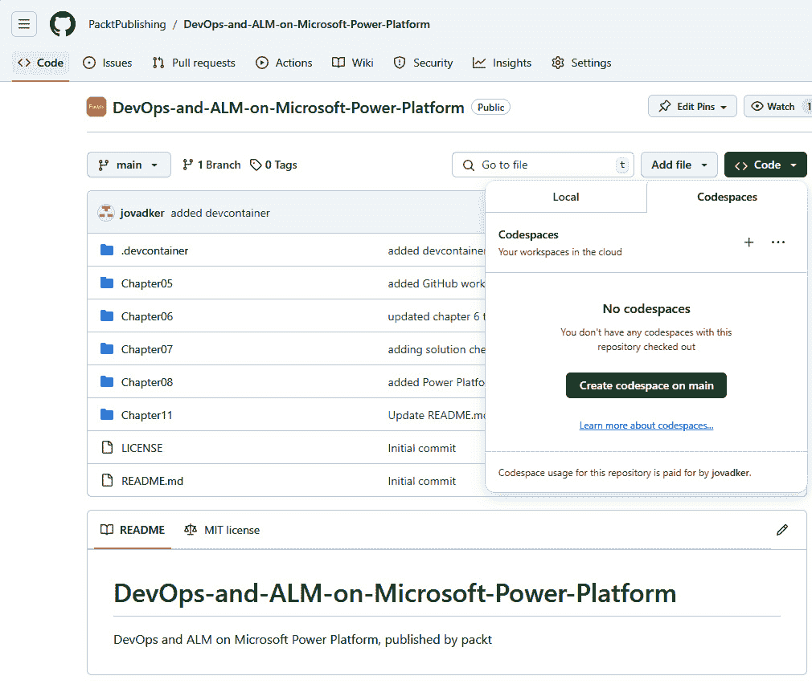

图 8.1 – 在 GitHub 中创建代码空间

点击按钮后， 系统会解析 `devcontainer.json` 文件， 该文件位于 `.devcontainer` 文件夹中，然后 基于该配置， 在后台创建一个新的 **Docker 镜像** 。 该镜像将作为容器运行，并且在新的浏览器窗口中，Visual Studio Code 将很快启动，预装了在 JSON 文件中描述的功能：

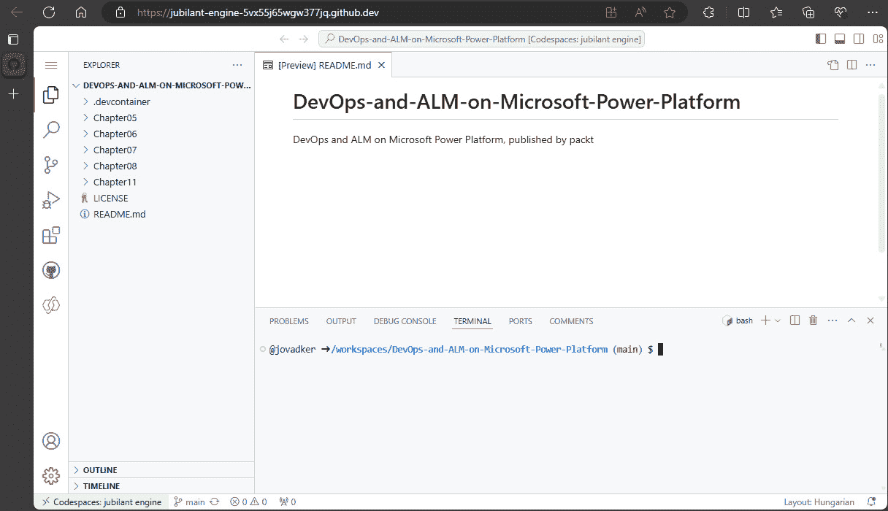

图 8.2 – 浏览器中的代码空间

在 终端 窗口（通常是 **Bash**，但也可以使用 **PowerShell** ）中，我们 将开始创建我们自己的 代码库，按步骤进行：

1.  `copilot suggest` 或 `copilot explain` 参数，用于在不切换上下文的情况下与 GitHub Copilot 进行交互。 `Gh copilot suggest` 将我们的自然语言提示转换为正确的 GitHub CLI 命令，并附带适当的参数，而 `gh copilot explain` 则用自然语言描述我们感兴趣的命令。 我们可以使用以下脚本，在我们自己的 GitHub 企业组织中创建一个名为 `Kudos` 的仓库（如果可用），或者在登录后使用我们自己的 GitHub 账户（GitHub Codespaces 默认提供有限访问 GitHub 管理端点的权限）：

    ```
     export GITHUB_TOKEN=
    gh auth login
    gh auth switch
    # move out of the book repoto "/workspaces"
    cd .. gh repo create Kudos --public --clone
    git clone https://github.com/PacktPublishing/Mastering-DevOps-on-Microsoft-Power-Platform.git
    ```

    克隆后，我们可以将 `Chapter08` 文件夹中的文件和文件夹复制到我们的 `Kudos` 文件夹中（即 git 仓库）：

    ```
    cp -rT ./Mastering-DevOps-on-Microsoft-Power-Platform/Chapter08/ ./Kudos
    ```

    然后，我们可以使用以下脚本将文件添加、提交并推送到 新仓库：

    ```
    # use the credentials of gh CLI in Git commands
    gh auth setup-git
    git config --global user.email "ouremail@address.com"
    git config --global user.name "Our Name"
    git add . git commit -m "Baseline Kudos app"
    git branch -M main
    git push -u origin main
    ```

    这样，我们 就拥有了新 仓库中的一切，将在 我们的 动手操作练习中使用：

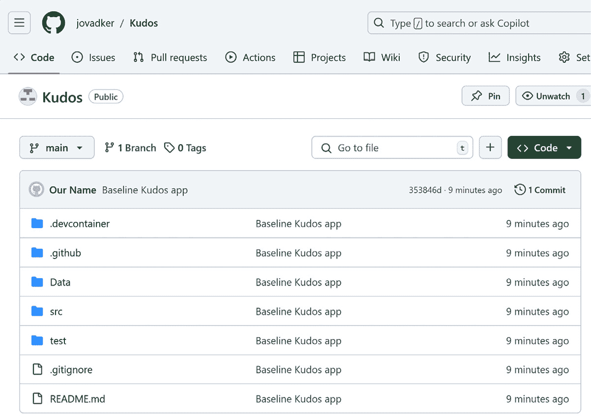

图 8.3 – 我们自己的仓库与 Kudos 应用程序

在我们的新仓库中， 也有一个 `.devcontainer` 文件夹，里面包含 GitHub Codespace 定义。 在这里，让我们在主分支上创建自己的 codespace，并再次通过 GitHub 进行身份验证，以便获得对 仓库的写权限：

```
 export GITHUB_TOKEN=
gh auth login
gh auth switch
```

此外，如果 我们已经正确完成了每个准备步骤，并且现在打开 **Actions** 标签 ，我们应该看到可用的 GitHub 工作流，如下图所示：

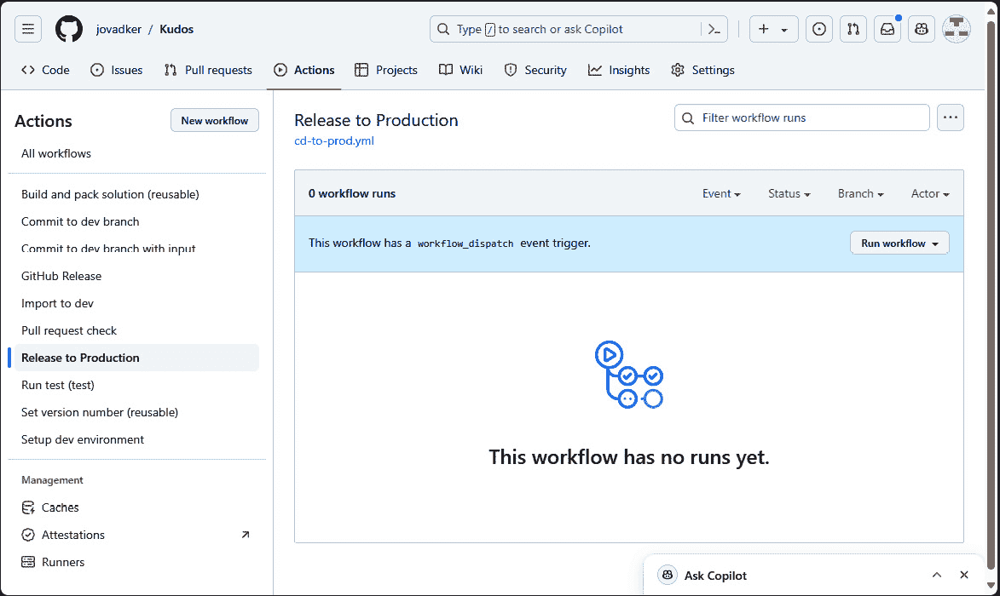

图 8.4 – Kudos 应用程序的 GitHub 工作流

我们将很快使用这些工作流，将我们的 Kudos 应用程序部署到 Power Platform 生产环境中。

1.  `pac admin create` 命令，而创建服务主体时，我们应用 `pac admin create-service-principal` 命令。 所以，让我们使用交互式登录在 GitHub Codespaces 或本地创建我们的 Kudos 应用程序的生产环境：

    ```
     pac auth create pac admin create --name Kudos-Prod --region Europe \
     --currency EUR \
    gh repo create command in our GitHub codespace, the default repository is our Kudos repository. Otherwise, we can use gh repo set-default owner/repo command to set it as default.
    ```

1.  **创建 AAD 组**：如果我们使用服务主体将解决方案部署到目标环境，那么解决方案中的应用将归服务主体所有。 为了让其他人访问这些应用，我们需要 创建一个 **Microsoft Entra ID 安全组** （我们在 *第七章*中学习了如何操作）。 我们需要被分配 *组管理员* Microsoft Entra 内置角色，才能管理组的创建和成员分配。 让我们执行以下 脚本来创建 Microsoft Entra ID 组：

    ```
    az login
    az ad group create --display-name $GROUP_NAME --mail-nickname $GROUP_NAME # get the user object id AADObjectID=$(az ad user show \
     --id $userPrincipalName \
     --query id \
     --output tsv) # add a member to the group \.github\workflows\share-app.ps1, we can share the Kudos app with the created security group. At the time of writing, there is no PAC CLI command that can be used to share an app with Entra ID groups; that’s why we had to use Set-AdminPowerAppRoleAssignment -PrincipalType "Group" -PrincipalObjectId $GroupID -RoleName CanView -AppName $AppName -EnvironmentName $EnvironmentName cmdlet here. The security group’s object ID needs to be provided as an input parameter to the script. The GitHub workflows available in the repository also expect this AAD group ID as input.
    ```

1.  **准备 Power Platform 生产环境**：Kudos 应用程序包含四个 Power Automate 云流和 Power Apps 画布应用，这些应用使用连接引用及其对应的连接，已为 *Dataverse*、 *Office 365 Outlook* 和  *Office 365 Users* 连接器创建。 这些 **连接引用** 用于在其他环境中使连接 可调整。 这些 **连接器** 是连接的定义；就像 **面向对象编程** （**OOP**）中的类一样，它们是基于 **OpenAPI** **REST API** 规范， 并在环境中实例化为 **连接** （即面向对象编程中的对象）。 当我们使用解决方案创建流、应用及其他 Power Platform 资产时，每次在流或应用中启动新的连接时，都会在解决方案中自动创建一个 **连接引用** 。 如果我们在解决方案外工作并在 **我的流**下创建流，则会创建直接连接，而不是连接引用。 然而，PAC CLI 可以代表服务主体在我们的生产环境中创建 Dataverse 连接，使用以下脚本：

    ```
     pac connection create [--environment] --tenant-id --name --application-id --client-secret
    ```

    Office 365 Outlook 和 Office 365 用户 连接器需要服务账户 和真实用户账户，而不是服务主体，用于在 Outlook 和 Office 365 API 中进行身份验证。 我们不能将 O365 或 M365 许可证分配给服务主体。 这就是为什么我们需要在部署解决方案之前，在目标环境中创建这些 连接。 我们可以在 **PowerApps 制作门户** 中的 **连接** 面板，通过点击 **+ 新建连接** 按钮，如下图所示：

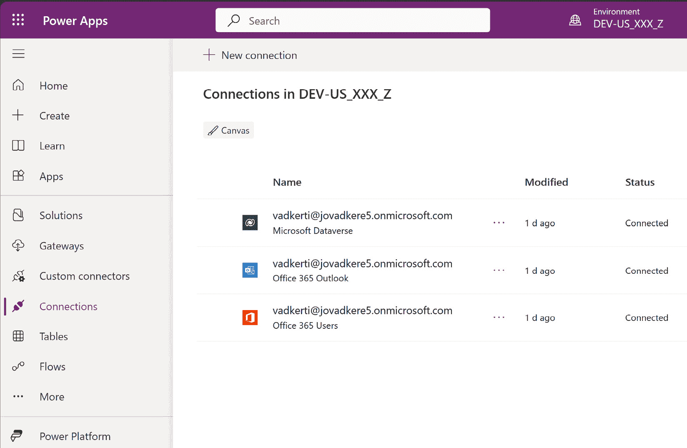

图 8.5 – Kudos 应用的连接

创建三个 连接后，我们应该看到与图中显示相同的结果。 最后，我们需要将这些连接与服务主体和之前在 *步骤 2*中创建的应用用户共享，通过点击三个点并选择 **共享** 菜单项 在 **连接**：

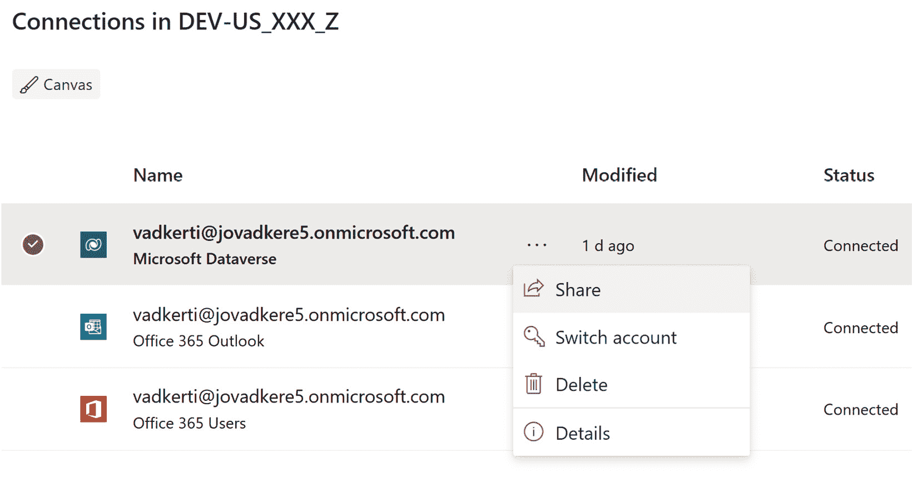

图 8.6 – 与服务主体共享连接

让我们通过 引入部署 设置文件 来在部署中使用这些连接。

1.  **部署设置文件**：为了在解决方案部署期间使用这些连接，我们需要使用一个所谓的 **部署设置文件**。该文件已经为解决方案生成，脚本如下：

    ```
     pac solution create-settings --solution-zip .\mpa_Kudos_1_0_0_36.zip
    ```

    此命令提取 `\src\mpa_Kudos\deploymentSettings.json` 文件，该文件位于 GitHub 仓库中：

    ```
    {
      "EnvironmentVariables": [], "ConnectionReferences": [ {
          "LogicalName": "mpa_KudosDataverse",
          "ConnectionId": "[Dataverse]",
          "ConnectorId": "/providers/Microsoft.PowerApps/apis/shared_commondataserviceforapps"
        }, {
     "LogicalName": "mpa_KudosO365",
     "ConnectionId": "[O365]",
     "ConnectorId": "/providers/Microsoft.PowerApps/apis/shared_office365users"
     }, {
          "LogicalName": "mpa_KudosOutlook",
          "ConnectionId": "[Outlook]",
          "ConnectorId": "/providers/Microsoft.PowerApps/apis/shared_office365"
        }]}
    ```

    缺失的 `ConnectionId` 值会在 GitHub 工作流运行时 设置。 这些值 是我们工作流的输入参数。 要从我们的 Power Platform 环境中获取这些值，我们 需要点击 Power Apps maker portal 中的连接 **Power Apps 创建者门户** 并复制连接的 ID 从相应的 URL 中。 下图展示了 Dataverse 连接的连接 ID，突出显示在 URL 中：


图 8.7 – URL 中的连接 ID

第一个 GUID 在 URL 中是环境 ID，而 第二个 GUID 是连接 ID。 以下示例突出了 第二个 GUID：

```
 https://make.powerapps.com/environments/<<Environment GUID>>/connections/shared_commondataserviceforapps/\.github\workflows\cd-to-prod.yml contains the default values of these connection IDs, which we can overwrite and commit back to the main branch. With everything in place, we can deploy the Kudos app from the main branch to our production Power Platform environment, by starting this workflow with the gathered connection IDs:
			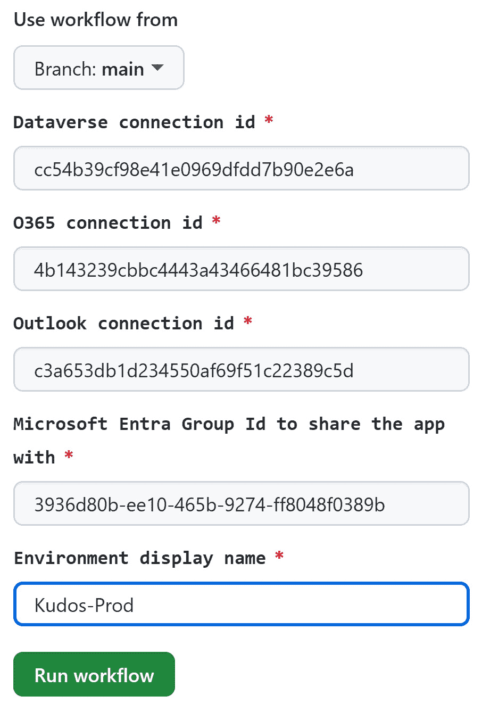

			Figure 8.8 – The Release to Production workflow with parameters
			To store these connection IDs, we can alternatively use **GitHub environments**. In the case of our developer branch, we will use a dedicated GitHub environment to pre-configure these values later in this chapter.

				1.  **Create our branch strategy**: At the beginning of our development project, we need to design which branching and merging strategy we will use. In *Chapter 5*, we learned about the **GitHub flow**, and this is what we are going to create for the Kudos application. The following figure shows our strategy and the direct mapping between Power Platform environments and Git branches:

			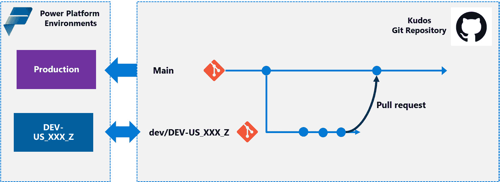

			Figure 8.9 – The branch strategy
			The arrows between the Power Platform environments and Git branches represent the code and deployment flows. A production environment can handle only `dev/DEV-US_XXX_Z` branch represents a short-lived feature branch containing the implementation of a user story or a bug fix.

				1.  `main` in the **Branch name pattern** field, and we need to select the **Require a pull request before merging** checkbox, as shown in the following figure:

			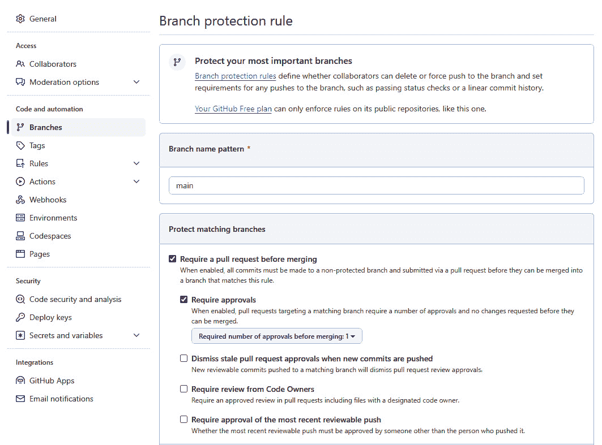

			Figure 8.10 – The branch protection rule for main
			At the bottom of the page, we need to click on the **Create** button. With this setting, we ensure that only pull requests are allowed to our main branch. Note that, by default, **Require approvals** is checked, which means at least someone else should review our pull requests. Since we cannot assign a pull request to ourselves, if we work alone, it is recommended to uncheck **Require approvals**. However, it is obviously not best practice to do so in a real-world project. Besides this setting, we need to define the type of merge that we want to allow developers to do. It is recommended to use **squash merging**, which combines all commits from the head branch into a single commit in the target branch. This significantly reduces the commit history, since all changes we commit in our developer branch sequentially will be combined into one commit after a successful pull request to the parent branch. We can force this type of merge by going to the **Settings** menu in GitHub and, under the **General** blade, removing every other merge type:
			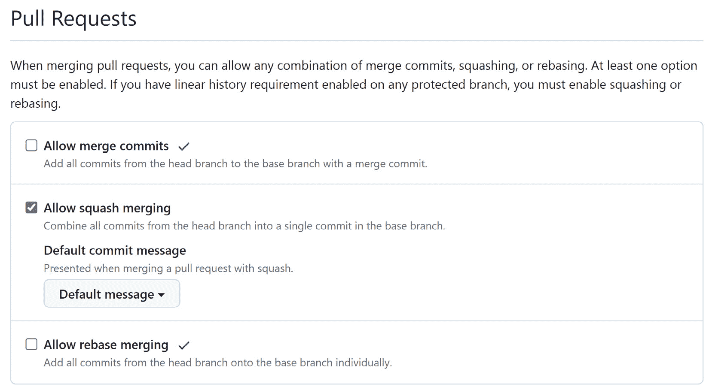

			Figure 8.11 – Enforcing squash merging
			Checking only **Allow squash merging** will force the pull requests to be squash commits. The other two options, **Allow merge commits** and **Allow rebase merging**, will copy the commit history of the child branches into the main branch, leading to large history nodes in the commit history.
			If we encounter any issue in the previous steps, we can use the following settings to get verbose logging of the commands.

				*   `GH_DEBUG` environment variable. If its value is `1`, it provides more insights, but if we set this variable to `api`, then we will see every REST API call to the GitHub endpoints:

    ```

    export GH_DEBUG=gh 命令执行将会在标准输出中打印详细的跟踪信息。

    ```

    				*   `--debug` flag to the end of every command that we want to troubleshoot:

    ```

    az login --debug

    ```

    				*   **The PAC CLI**: At the time of writing, the PAC CLI doesn’t offer any flag or environment variable to enrich the verbose logs in the standard output. If we need to troubleshoot PAC CLI commands, we can only use the log available under the following:

    ```

    %userprofile%\.dotnet\tools\.store\microsoft.powerapps.cli.tool\1.30.7\microsoft.powerapps.cli.tool\1.30.7\tools\net6.0\any\logs\pac-log.txt

    ```

			Now, we are fully prepared to make some changes to the Kudos application. Let’s understand the existing GitHub workflows and their roles in the DevOps processes.
			Exercise – building CD pipelines and a release train
			In the GitHub repository, we will find the following prebuilt GitHub workflows to manage the life cycle of our development project, end to end:

				1.  `.github/workflows/setup-dev-environment.yml`, this workflow creates a developer branch with the name provided before the workflow execution (the branch name follows the naming rule, `dev/branch_name`). The pipeline spins up a Power Platform developer environment with the same name used for the branch. We need to add the work account that we use in the Power Platform tenant to create the developer environment on behalf of our account. At the end of the workflow, we can see additional steps that grant **System Administrator rights** to our work account and to the service principal that we created for the production environment earlier. Let’s execute this workflow with the following parameters:

			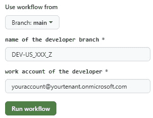

			Figure 8.12 – Workflow inputs of “Setup dev environment”
			After a successful run, we will see a new Power Platform developer environment with the name `DEV-US_XXX_Z` and a branch with the name `dev/DEV-US_XXX_Z`.

				1.  `dev` prefix. In our case, it is `dev/DEV-US_XXX_Z`. We can create the GitHub environment by opening the `DATAVERSE_CONNECTION_ID`2.  `O365_CONNECTION_ID`3.  `OUTLOOK_CONNECTION_ID`

We can see how we’ve introduced the variables in the following screenshot:

			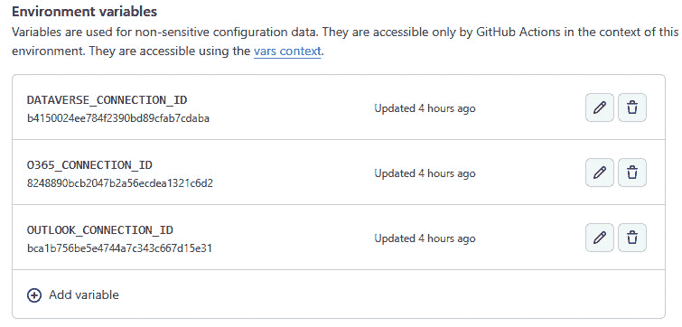

			Figure 8.13 – The GitHub environment with connection IDs
			As a next step, we need to create these three `KudosSPN`), and copy the connection IDs from the appropriate URLs into the `deploymentSettings.json` file. Our workflow expects to find this information in the assigned GitHub environment with the matching name. Let’s execute the *Import to dev* workflow located under `github/workflows/import-to-dev.yml` from the dev branch, to import the **unmanaged solutions** to the developer environment:
			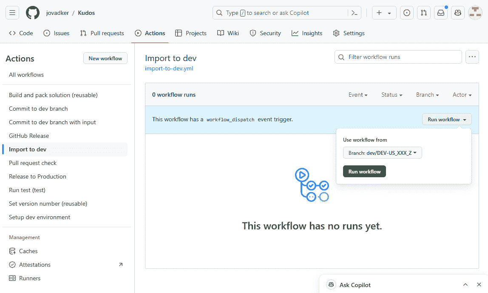

			Figure 8.14 – The Import to dev workflow
			We need to select our recently created developer branch to use its name to find the right environment in the Power Platform tenant:
			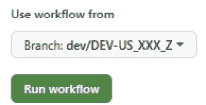

			Figure 8.15 – Executing the workflow on the dev branch
			When everything is set up right according to the previous steps, we will see the GitHub workflow running during the execution of the job. The `import-to-dev` job will run in the `dev/DEV-US_XXX_Z` environment, displaying the GitHub environment name in the job’s rectangular box of the workflow run (`Import to dev`), as shown in the following figure:
			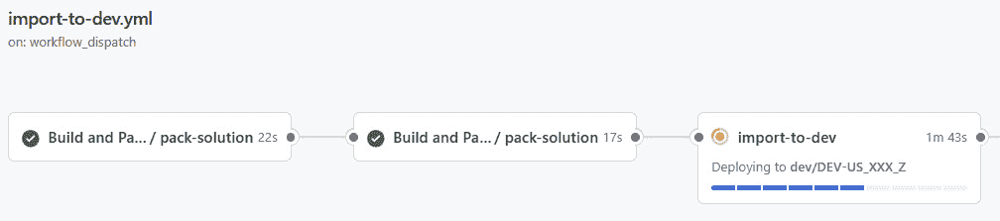

			Figure 8.16 – The GitHub workflow import-to-dev job
			After the successful run, we have only one task left, which is to turn on the **Power Automate cloud flow**, *Kudos App – Notification email*, by opening the Kudos solution and viewing the flow under the **Cloud flows** solution asset. We will not see the flows under **My flows** because these flows are intentionally not shared with us.
			When we examine the YML file of the workflow in detail, we can see that this pipeline uses a `deploymentSettings.json` file with the right connection IDs. Finally, we execute the `microsoft/powerplatform-actions/import-solution@v1` action to import the unmanaged solutions with the right deployment configurations to our Power Platform environment. We also import data to the `Badge`, with the help of the `microsoft/powerplatform-actions/import-data@v1` GitHub action.
			*The branch name is the glue that ties the Power Platform environment, the Git branch, and the GitHub environment together to help developers easily find their* *own environments/configurations.*

				1.  `\.github\workflows\commit-to-dev.yml`, this workflow has been built to easily commit the changes made in the Power Platform developer environment back to the developer branch. We can make changes by going directly to the Kudos solution in the **maker portal** and opening the canvas app, (the Kudos app) for editing. On the main screen of the application, let’s change the textbox to include the current date, as shown in the following figure:

			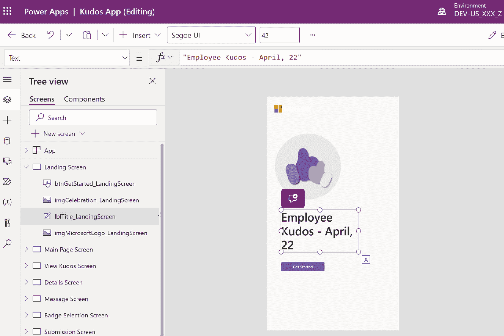

			Figure 8.17 – Editing the Kudos App in the developer environment
			We need to save the app and publish the customizations before executing the *Commit to dev branch* GitHub workflow. If we want to run the app locally in this environment, we also need to share the application within the solution with our account. The *Commit to dev branch* expects no input parameter; we only need to set the branch to our developer branch. If we started the workflow directly on the main branch, it would fail because of the branch protection rules that are applied. Under the hood, this workflow exports both solutions as managed and unmanaged (`microsoft/powerplatform-actions/export-solution@v1`) and also unpacks them to the right folders in the developer branch (`microsoft/powerplatform-actions/unpack-solution@v1`). Finally, the flow commits the changes to the dev branch. As we did earlier, we use the branch name to find the **Power Platform environment URL** to export the solutions from the right Dataverse instance, with the help of the following Bash script snippet:

```

ref=${{ github.ref }}

branch="${ref#refs/heads/dev/}"

echo "$branch"

# 工作流在 dev 分支上执行，所以我们需要从 dev 分支获取环境 URL rawOutput=$(pac admin list --name $branch | tail -n 2)

environmentURL=$(echo $rawOutput | cut -d ' ' -f 3) echo "Environment URL: $environmentURL"

# 设置 env.devEnvironmentURL

echo "devEnvironmentURL=$environmentURL" >> "$GITHUB_ENV"

```

			In the final line, we create an environment variable with the value of the URL to use in the upcoming actions within the GitHub job. We hand over this URL to other jobs in the workflow by using the `outputs` and `needs` keywords in the YML file.

				1.  `dev/DEV-US_XXX_Z` branch to `main`. The pull request will compare the two branches and list every change that has been made since the creation of the developer branch. We can use **GitHub Copilot** to generate a summary of these changes by clicking the Copilot icon on the pull request page:

			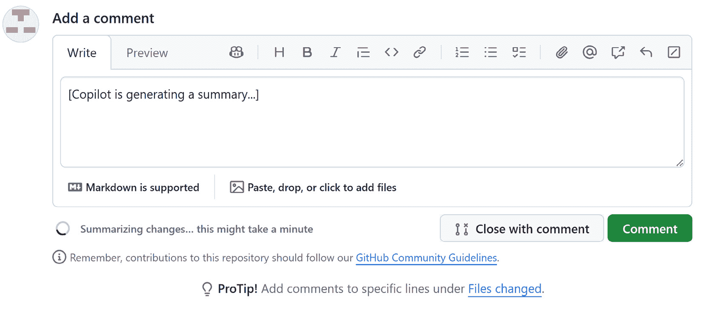

			Figure 8.18 – A Copilot-generated pull request summary
			By clicking the **Merge** button, our pull request will close and the changes will merge back to the parent branch. Usually, we delete developer branches after a successful pull request, but this time, let’s keep our dev branch to execute some additional exercises in the upcoming sections.

				1.  `\.github\workflows\cd-to-prod.yml`, this workflow deploys the latest version of the main branch to the production environment, as we discussed in the previous section. We can execute this workflow to deploy the latest version of the Kudos app to the production environment.

			In *Chapter 6*, we learned about the `0.0.0.0.` in Azure DevOps Services during the development phase. We can apply the same concept in GitHub by introducing a reusable workflow located under `\.github\workflows\set-version-number.yml`. This workflow has two parameters; one is the source folder of our solutions, and the other is the version number to be set. The workflow checks out the repository, searches for the `Solution.xml` file under the source folder, and replaces the inline version tags with the version number, provided as an input parameter:

```

- shell: bash

run: |

# 在解决方案目录及其子目录中查找所有 Solution.xml 文件 find ${{ inputs.source_folder }} -type f -name "Solution.xml" | while read -r file; do

# 使用输入的版本号替换<Version>标签中的内容 sed -i 's|<Version>.*</Version>|<Version>${{ inputs.version_number }}</Version>|g' "$file"

    done

```

			The final action in the flow commits back the changes to the branch on which the workflow runs.
			We need to add this reusable workflow to the *Commit to dev branch* workflow to set the version number of the solutions to `0.0.0.0`. Let’s update the workflow in the dev branch (`dev/DEV-US_XXX_Z`) with the following lines, directly adding them to the end of the workflow:

```

set-version-number:

    needs: [ commit-to-dev-kudos ]

    name: 将版本号设置为 0.0.0.0

    uses: jovadker/ppdemo/.github/workflows/set-version-number.yml@main

    with:

        source_folder: src/

        version_number: "0.0.0.0"

```

			Let’s commit the changes locally and push them back to the remote repository. We can work in `dev/DEV-US_XXX_Z`) and create another codespace:
			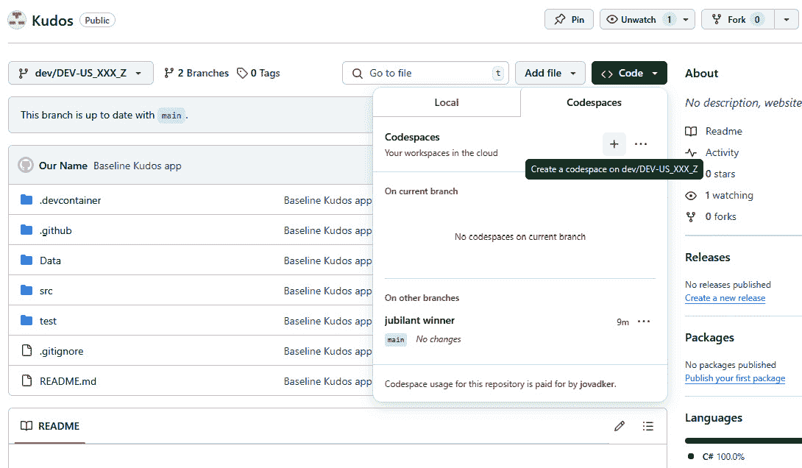

			Figure 8.19 – A GitHub codespace on the dev branch
			After launching the newly created codespace, we can add the workflow snippet (the GitHub job with the name `set-version-number`) to the end of the file, as shown in the following figure:
			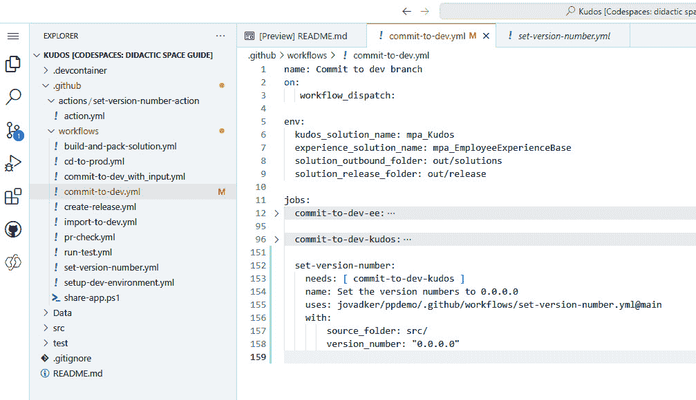

			Figure 8.20 – The commit-to-dev.yml file in the GitHub codespace
			After saving the file in the VS Code editor in the browser, we can navigate to the source control icon on the left menu and commit our changes, by providing a commit message and clicking on the **Commit** button:
			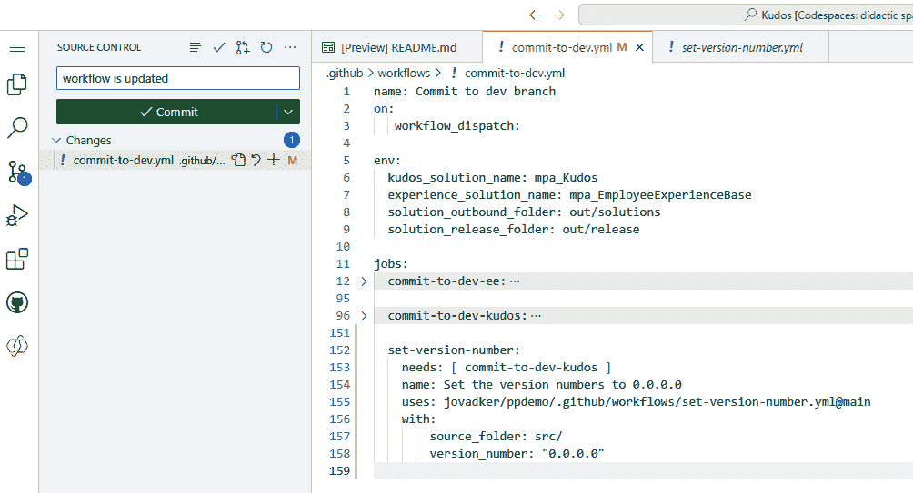

			Figure 8.21 – A Git commit in a GitHub codespace
			After clicking on the **Commit** button, we should not forget to click on **Sync Changes** to push back the changes to the remote origin.
			To test the GitHub workflow upon our changes, we can start it on the branch, `dev/DEV-US_XXX_Z`, and see how the two solutions and their `Solution.xml` files are updated. Similarly, we can introduce this job to other flows if we plan to maintain a homogenous versioning in our solutions.
			Version number – 0.0.0.0
			If we use the `0.0.0.0` version number, then the solutions imported to Power Platform developer environments will also have this version. This approach is ideal for multiple developers working on the same solution or project, since they will not override the versions by committing their changes back to developer branches and later, through pull requests, to the main branch.
			Finally, we can leverage the releases feature of GitHub to publish our new versions. **GitHub releases** offer an easy way to package our software, along with release notes and links to binary files, for other people to use. We can manage these releases in GitHub workflows; the platform provides a special trigger that we can use to add our solutions to a release, and there are actions available in the **GitHub marketplace** to create releases within workflows. We will create our release by executing a new GitHub workflow that builds our solutions, using **MSBuild**, creates a deployment package, and publishes the generated artifacts as part of the new release version.
			The Kudos application provides `MSBuild` and `dotnet` CLIs. We can create these `.cdsproj files` at any time by executing the following PAC CLI command in the `solution` folder:

```

pac solution init --publisher-name developer --publisher-prefix dev

```

			This command creates a wrapper around our solution, if empty, and then it will create an empty solution under the `src` folder, into which we can copy our solution files (XML and JSON files).
			In *Chapter 4*, we learned about deployment packages and the `.csproj` file under the `DeploymentPackage` folder:

```

pac package init --outputDirectory DeploymentPackage

cd .\DeploymentPackage pac package add-solution --path <<PATHTORELEASE>>\mpa_EmployeeExperienceBase_managed.zip

pac package add-solution 命令将之前由 MSBuild 构建的托管解决方案作为引用添加到此 .csproj 文件中。设置部署包后，我们可以使用 dotnet publish -c Release 命令来构建部署包的发布版本。

            部署包

            我们在 GitHub 仓库中创建了一个文件夹结构，其中两个解决方案和 `DeploymentPackage` 文件夹位于 `src` 文件夹下。 在 `csproj` 文件中， `DeploymentPackage` 文件夹引用了两个解决方案的发布构建，分别是 Employee Experience Base 和 Kudos。

            最后，我们可以通过使用 *GitHub Release* 工作流来创建我们的 GitHub 发布，该工作流位于 `/.github/workflows/create-release.yml`。该工作流的高层步骤和关键要点如下：

                1.  `/.github/actions/set-version-number-action/action.yml`，它设置了 Power Platform 解决方案的版本号。 正如我们之前所看到的，可重用的工作流需要作为作业运行，这意味着 GitHub 运行器将在完成可重用工作流作业并继续下一个作业后清理本地仓库。 如果我们不希望提交版本号，我们需要将所有操作都运行在同一个作业中。 这就是为什么我们创建了这个 复合操作。

                1.  `MSBuild` 和 `dotnet` CLI 可用于我们的构建操作。 我们使用以下命令构建解决方案：

    ```
    proj file contains the references to the cdsproj files under the solutions folders. We generate the deployment package with the dotnet publish -c Release /p:Version=${{inputs.release_version}} command by setting the version of the package to the one provided as the workflow parameter. After having the binaries generated, we upload every build artifact to the GitHub artifact store.
    ```

                    1.  `gh cli` 命令用于创建一个 GitHub 发布：

    ```
     gh release create ${{inputs.release_version}} --title "${{inputs.release_title}}" --generate-notes ${{ env.solution_release_folder}}/*.*
    ```

    通过使用 `generate-notes` 参数，GitHub 发布说明将自动生成。 我们还通过引用文件夹及其内容将二进制文件附加到创建的发布中， `${{` `env.solution_release_folder}}/*.*`。

            现在，让我们使用默认参数执行此流程，并在完成后检查是否能在 GitHub 仓库的主页上看到 **Releases**下的一个名为 **Initial release**的发布。打开它后，我们应该能发现关于第一次发布的更多细节——例如， 附加的资产：

            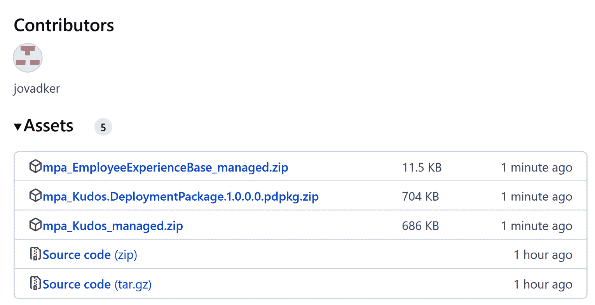

            图 8.22 – 包含 Power Platform 包的 GitHub 发布

            包部署器

            该 `.pdpkg` （ `pac package deploy --package` `.\bin\Release\mpa_Kudos_DeploymentPackage.1.0.0.pdpkg.zip` 在另一个租户上进行部署。 这些包 还可以上传数据并为 解决方案准备目标环境。

            通过 GitHub 发布，我们可以 将我们的开发项目结果分发给负责生产租户的 IT 运维团队，而无需直接将我们的开发租户和工作流与 生产租户连接。

            如果在尝试运行 工作流时遇到问题，请考虑以下 故障排除选项：

                +   **检查运行日志**：第一步是检查工作流运行的日志。 GitHub 为每个工作流步骤提供详细日志，这可以帮助我们识别错误发生的地方。

                +   `ACTIONS_STEP_DEBUG` 密钥用于启用步骤调试日志，提供每个步骤的更详细输出。 步骤日志的详细输出可以帮助我们诊断问题。

                +   **在本地运行工作流**：我们可以使用诸如 **act** ([https://github.com/nektos/act](https://github.com/nektos/act))等工具在本地机器上运行工作流。 这可以帮助我们在受控的环境中调试工作流。

                +   `.yml` 工作流文件格式正确，且所有必需字段都已包含。 语法错误或缺失字段可能导致工作流失败。 我们需要非常小心地更改 YML 文件中的行缩进，因为仅一个额外的空格就可能导致语法错误。

                +   **检查外部更改**：有时，外部依赖项或环境的变化会导致工作流失败。 我们需要确保所有外部服务和依赖项 都是正常运行的。

            现在，让我们进入下一个话题，深入了解 待办事项管理。

            练习 – GitHub 中的待办事项管理

            在 *第一章*中，我们了解了为何跟踪我们的活动、用户故事、变更请求和 bug 修复在任何代码库中都是至关重要的。 让我们回顾一下 关键要点：

                +   我们希望在每个冲刺前规划好开发人员的工作 以便集中精力 处理最关键的 功能 **特性**, **缺陷**和 **问题**。整个 **冲刺规划过程** 基于一个健康的 **产品待办事项** ，每个开发人员 和产品负责人 都需要 维护它。

                +   健康的待办事项管理只允许计划中的源代码更改 ，以避免 **黄金镶嵌** (开发人员添加不属于活动范围的额外功能) 和 **范围蔓延** (当项目团队在不调整项目成本或时间表的情况下，处理客户请求的功能) 。

                +   **待办事项管理** 提供 **向后追溯性** 以及追溯 从生产环境中运行的应用程序到生成该应用程序的源代码 的能力。 **二进制文件** 的生成。 我们可以利用这些信息进行根本原因分析，发现哪个工作项跟踪的更改导致了生产环境中的问题。

            Azure DevOps 服务 和 GitHub 提供了这些需求工程 和问题管理功能，具备先进的项目管理特性，例如安排我们的活动并分配给团队成员 在冲刺中。

            为了保持 GitHub 中健康的待办事项管理，我们可以 改进最小 `pull_request` 操作，目标是 main 分支并执行以下操作：

            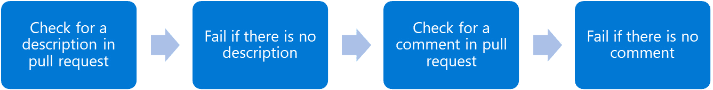

            图 8.23 – 触发拉取请求的工作流，用于分支保护

            我们的工作流关键部分如下所示（位于 `/.github/workflows/pr-check.yml` ）：

```
name: Pull request check
on:
 pull_request:
 types: [edited, synchronize, opened, reopened]
 branches: [ "main" ] jobs:
  prcheck:
    runs-on: ubuntu-latest
    steps:
      - name: Check for comments in PR id: check-comments run: |
          # every pull request is an issue as well
          #- we can address them through /issues/ endpoint
          comments=$(curl -s -H "Authorization: token ${{secrets.GITHUB_TOKEN}}" \
             "https://api.github.com/repos/${{ github.repository }}/issues/${{ github.event.pull_request.number }}/comments") if [ $(echo "$comments" | jq '. | length') -eq 0 ]; then
            echo "There is no comment added to the PR." echo "no_comments=true" >> $GITHUB_OUTPUT else
            echo "Comments are added to the PR." echo "no_comments=false" >> $GITHUB_OUTPUT fi
        shell: bash
      - name: Fail if no comments
        run: |
          if [[ "${{ steps.check-comments.outputs.no_comments }}" == "true" ]]; then
           echo "No comments added to the pull request. Failing the build." exit 1
          fi
        shell: bash
```

            我们使用 `curl` 通过 REST API 端点查询属于该问题的评论 （https://api.github.com/repos/${{ github.repository }}/issues/${{ github.event.pull_request.number }}/comments ），因为每个拉取请求也被建模为一个 `no_comments`，因此。 下一步操作会使用前一步操作的输出，判断构建是否通过。 如果工作流失败，拉取请求将被阻止，无法合并。 工作流还会在开始时检查拉取请求是否添加了描述，采用相同的方法。 我们可以通过回溯写描述并添加评论来修正我们的拉取请求。 此外，我们还可以使用 GitHub Copilot 根据子分支和 父分支之间的更改生成拉取请求描述：

            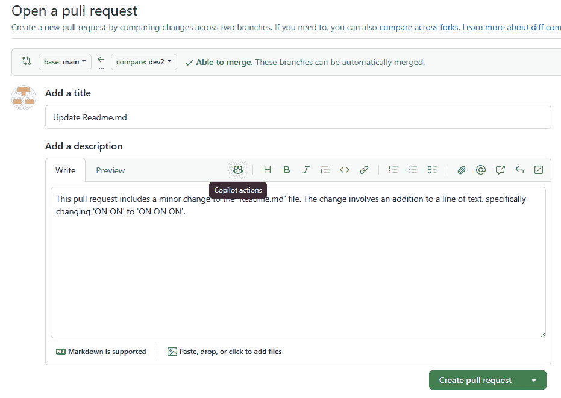

            图 8.24 – 使用 GitHub Copilot 生成 PR 描述

            我们只需要点击 Copilot 图标，然后底层的 **GPT-4 模型** 会生成拉取请求的摘要 ——在我们的案例中， **该拉取请求对** **Readme.md 文件进行了微小的更改……**。

            如果我们想要在拉取请求中引入更复杂的检查，以配合待办事项管理，我们可以访问这个 `verify-linked-issue` （[https://github.com/marketplace/actions/verify-linked-issue](https://github.com/marketplace/actions/verify-linked-issue)），它会检查拉取请求是否至少关联了一个 问题。

            现在我们已经建立了严格的仓库和工作管理控制，接下来我们进入下一个话题， **质量保证**。

            练习 – 测试解决方案

            在 *第六章*中，我们深入探讨了 **质量保证** (**QA**) 主题，并了解了 可用于端到端 UI 测试的工具和框架 ，例如 **Power Apps 测试引擎**，或开源的 Web 测试框架，如 **Selenium**、 **Playwright**、 **Appium** 或 **Cypress**。我们还得出结论，Power Automate 云流和 **桌面流** 被视为我们的业务逻辑层，我们可以通过 UI 组件进行端到端测试。 在本节中，我们将进行以下操作：

                +   在我们的 Power Platform 开发环境中，为 Kudos 应用创建一个 Power Apps 测试工作室的测试 （`DEV-US_XXX_Z`）。

                +   将其作为测试套件下载 **YAML 文件** 并提交到我们的开发 分支（记得这个分支 仍然存在）。

                +   在本地运行，借助 PAC CLI。

                +   将这一步引入到我们的 *提交到开发分支* GitHub 工作流中。

            我们还有一些先决条件 用于这个测试 自动化场景：

                +   为了能够在 CI/CD 过程中执行我们的测试，我们还 需要一个没有 **多因素认证** (**MFA**) 的用户在我们的开发租户中；可以通过 *进一步阅读* 部分中的链接了解更多信息（Power Apps 测试引擎）。

                +   我们还需要在 **解决方案** 页面下共享 Kudos 应用 **Microsoft Entra** **ID 用户**。

                +   我们必须将此用户添加到开发环境（`DEV-US_XXX_Z`）中，**Power Platform 管理中心**，并且我们需要为该用户分配内置的**安全角色**，**基本用户**和自定义角色**Kudos 员工**，这样才能访问由 Kudos 解决方案创建的自定义表格，其中包含徽章以及已经共享的 Kudos。

                +   我们需要代表测试用户第一次交互式启动该应用，且不启用 MFA，授予他们对 Kudos 应用、Office 365 用户和 Office 365 Outlook 中使用的连接的访问权限。

                +   最后，我们需要与该用户共享*Kudo 应用 – 与发送者共享 Kudo*，*分配给接收者*，以及*Kudos 应用 - 通知邮件*云流程，作为*仅限运行的用户*在 PowerAutomate 云流程 UI 中。

            我们可以通过使用`/test/SmokeTestSuite.yaml`文件来轻松记录我们的测试，继续进行这项练习。

            一旦我们有了 YAML 文件，我们需要进行一些更改，以便能够在`0x0`中运行，像是`102x768`像素（`screenWidth` `X screenHeight`）：

```
 testSettings:
  filePath:
  browserConfigurations:
  - browser: Chromium
    device: screenWidth: 1024screenHeight: 768 locale: en-US recordVideo: trueheadless: true enablePowerFxOverlay: false
  timeout: 30000
```

            除了这些更新之外，我们可以将`headless` 参数设置为`false`，以便在 Chromium 浏览器中进行本地测试，跟踪 UI 操作。要在本地执行此测试 YAML 文件，我们可以使用以下 Bash 脚本：

```
 export user1Email="USEREMAIL"
export user1Password="PASSWORD"
pac test run --test-plan-file ./test/SmokeTestSuite.yaml -env 4d3c1075-FFFF-GGGG-VVVV-40c6f5edd705 --tenant 4ae51f31-XXXX-YYYY-ZZZZ-5ece14d2c081
```

            我们需要将测试用户的电子邮件地址和密码设置为环境变量，并且还需要提供测试文件位置、环境 ID 和租户 ID。成功执行后，我们将在`TestOutput`文件夹中找到测试结果及视频录制，文件格式也将是`.webm`。

            要在 GitHub 中执行此测试，我们需要 创建两个额外的 `TESTUSER` 和 `TESTUSERPSW`，并且 – 与我们在本章开始时创建的其他三个（`PPAPPID`, `PPAPPSECRET`, 和 `PPTENANTID`）类似。

            我们提前创建了一个 GitHub 工作流，以便在开发分支上轻松执行我们的 `SmokeTestSuite.yaml` 文件。 此工作流位于 `/.github/workflows/run-test.yml` 并使用以下 Bash 脚本运行 测试：

```
 - name: Run test shell: bashrun: | set -e ref=${{ github.ref }} branch="${ref#refs/heads/dev/}"
       echo "$branch"
       # Get the environment Id rawOutput=$(pac admin list --name $branch | tail -n 2) environmentId=$(echo $rawOutput | cut -d ' ' -f 2) export user1Email="${{secrets.TESTUSER}}" export user1Password="${{secrets.TESTUSERPSW}}" DEV-US_XXX_Z). Based on the branch name, the workflow finds our developer environment and then calls pac test run with the appropriate parameters.
			To avoid feature regression and maintain the high quality of our solution, we can introduce this step in our *Commit to dev branch* GitHub workflow to fail fast and early in the development process. All we need to do is to append the entire job, called `test`, from the `/.github/workflows/run-test.yml` as the first job in the workflow, as we want to only allow new commits landing in the branch when our automated tests pass:
			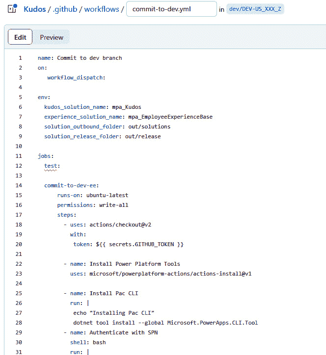

			Figure 8.25 – The Commit to dev branch with a placeholder for “test” job
			Additionally, we can introduce this quality check in our pull request triggered workflow (*Pull request check*), in the production workflow (*Release to Production*), or even in the release workflow (*GitHub Release*) based on our preferences. Some of these workflows need to be extended, for instance, to be able to spin up new Power Platform environments, deploy the release candidate, and execute the tests. Only our imagination and project costs can limit our QA investments.
			Now, our application is ready to run in production. There is only one task left, which is to get real-time insights and telemetry data about our application’s runtime characteristics and behavior. Let’s discover what monitoring options we have in Power Platform.
			Exercise – monitoring the applications
			After publishing our application to the production environment, we want to understand how it performs, how users interact with the application, and how far the application is stable and can run without errors. As Microsoft Power Platform runs on **Microsoft Azure**, it can leverage the existing Azure **platform-as-a-service** (**PaaS**) services to provide real-time telemetry data collection and analysis for the Power Platform portfolio – Power Apps, Power Automate, Copilot Studio, Power Pages, and even Dataverse. Azure’s PaaS service is **Azure Application Insights**, which is tidily connected to **Azure Monitor** and **Azure Log Analytics workspaces**. Azure Application Insights is an **Application Performance Management** (**APM**) solution that can be used in live production monitoring scenarios. Application Insights provides application dashboards, application maps, live metrics, transaction search, availability view, failures view, performance view, monitoring alerts, workbooks, and so on. With Application Insights, we can also discover the usage patterns of our users, how people interact with the app, and how the churn rate or the conversion rate looks. It also visualizes the user journey on web applications. The Application Insights service offers machine learning-based analysis of telemetry data (called **Smart Detection**) to identify anomalies or performance degradation before outages or blackouts occur. If the built-in detection features are not enough, we can write our own queries to look for anomalies with the help of **Kusto Query Language** (**KQL**). We can introduce our custom alerting and notifications based on the query results of KQL scripts that can trigger **Azure Playbooks**, **Azure Logic Apps**, **Azure Functions**, **Azure EventHub**, and **custom Webhooks**. The custom webhooks can trigger Power Automate cloud flows to react to the anomalies and outriders in the Power Platform. Last but not least, Application Insights provides SDKs, available in JavaScript, Java, C#, Node.js, and Python, based on the **OpenTelemetry framework**.
			Since Power Apps are browser-based applications and the web player that hosts the apps in the browser is based on `react-native` in the native mobile apps through **wrap functionality**, it is a very straightforward approach to embrace Application Insights’ capabilities in our low-code/no-code platform. We can add Application Insights’ endpoint directly to the canvas app – in our case, to the Kudos app. We just need to edit the app in the developer environment through the Kudos solution and select the **App** node in the tree view on the left side:
			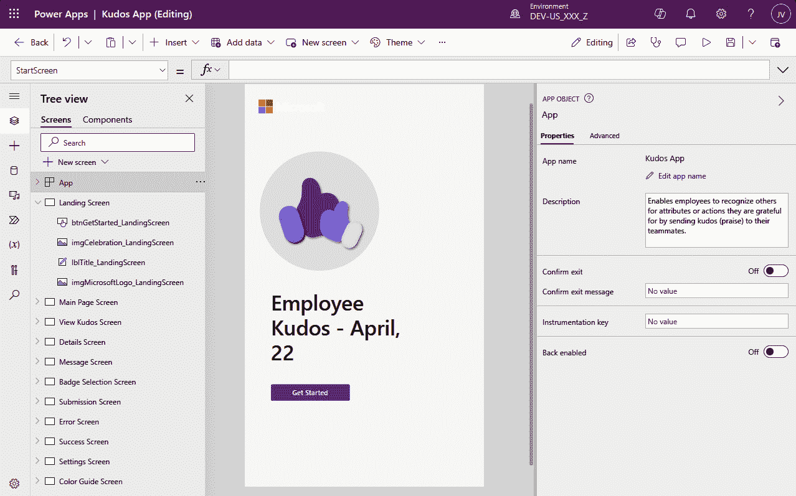

			Figure 8.26 – Application Insights in Power Apps Studio
			On the right side, among the properties of **App**, we will find the **Instrumentation key** field, and here, we should provide the instrumentation key of our Application Insights instance. Let’s create an Application Insights instance in our Azure subscription:

```

# 交互式登录

az login

# 选择正确的订阅

az account set --subscription baa70448-593c-4dc7-8a91-c92cf7eaf66e

az group create --location westeurope --resource-group KudosApp.AI.RG workspace=$(az monitor log-analytics workspace create \

--resource-group KudosApp.AI.RG \

--workspace-name KudosWorkspace \

--location westeurope --query id --output tsv)

az monitor app-insights component create \

--app KudosAppInsights \

--location westeurope \

--workspace $workspace \

instrumentationKey 密钥。我们现在可以将该密钥添加到 Kudos 应用并试用，查看数据如何被导入到应用程序 洞察 仪表板。

            Canvas 应用洞察

            要查看遥测 信息，我们需要在 Power Platform 管理中心启用 Canvas 应用洞察。 转到 **设置**，它列出了所有租户设置，然后选择 **Canvas 应用洞察** 项。 在右侧的 **Canvas 应用洞察** 面板中，我们可以开启此 功能。

            当然，我们不希望直接在画布应用中存储仪表密钥。 使仪表密钥与应用程序独立的最简单方法是引入一个新的环境变量，但在撰写本文时，仪表密钥属性尚不支持此方法。 我们可以做的是更新我们的部署管道，并将仪表密钥替换为正确的值，该值存储为 `json 文件` 在我们的解决方案文件夹中 – `/src/mpa_Kudos/src/CanvasApps/src/mpa_KudosApp/AppInsightsKey.json`。这个文件包含了我们可以在 GitHub 工作流中替换为正确的仪表密钥。

            尽管我们的解决方案中没有自定义聊天机器人， **Microsoft Copilot Studio** 同样支持这种与 Azure 应用程序洞察的集成 。 我们可以在 **设置** 中配置 Azure 应用程序洞察实例的连接字符串 ，位于 **Copilot 详细信息** 菜单下的 **高级** 标签页，如下图所示：

            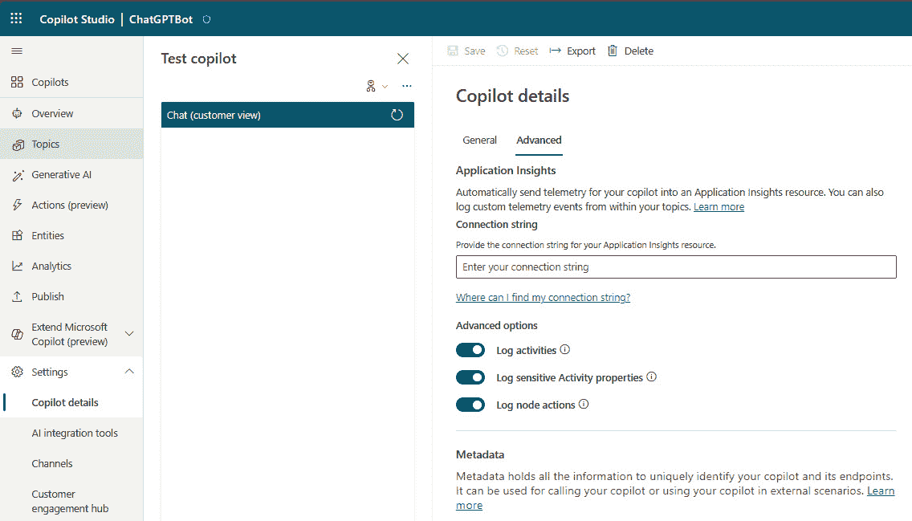

            图 8.27 – Microsoft Copilot Studio 中的应用程序洞察

            在这里，我们需要提供 完整的连接字符串，格式如下：

```
 InstrumentationKey=XXXXXXXX-YYYY-YYYY-YYYY-XXXXXXXXXXXX;IngestionEndpoint=https://westeurope-5.in.applicationinsights.azure.com/;LiveEndpoint=https://westeurope.livediagnostics.monitor.azure.com/;ApplicationId=TTTTTTTT-ZZZZ-ZZZZ-ZZZZ-SSSSSSSSSSSS
```

            我们可以在 **概览** 页找到此字符串，属于我们的 Azure 应用程序 洞察实例。

            对于 **Power Pages 网站**，我们需要注入跟踪用户在网站上操作的代码片段，并将遥测数据发送到 Azure 应用程序洞察终端。 我们只需获取文档中提供的客户端 JavaScript 代码片段 并将其作为内容片段添加到我们的 **Power Pages** **管理** 应用程序中：

            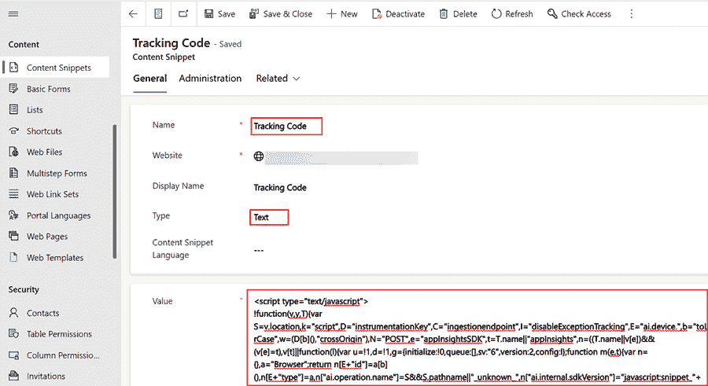

            图 8.28 – Power Pages 中的应用程序洞察

            代码片段本身 可以在此链接找到： [https://learn.microsoft.com/en-us/azure/azure-monitor/app/javascript-sdk?tabs=javascriptwebsdkloaderscript](https://learn.microsoft.com/en-us/azure/azure-monitor/app/javascript-sdk?tabs=javascriptwebsdkloaderscript)，只需要更新连接字符串为 我们自己的。

            除了画布应用、自定义 聊天机器人和 Power Pages 网站外，Azure Application Insights 作为通用的 APM 框架 可用于监控 **模型驱动应用**、Power Automate 云流，以及 **Dataverse 诊断和性能事件**。这可以通过使用 **将数据导出到 Application Insights** 功能实现，该功能可在 Power Platform 管理中心中使用，如果我们拥有付费/高级 Dataverse 许可证的话。 对于我们来说，这意味着我们可以创建导出包，将选定环境中的遥测数据推送到我们的 Application Insights 服务，而无需将端点或连接字符串注入到 Power Platform 资产中。 我们无需在解决方案中准备或创建任何内容；环境和此导出作业将负责遥测数据的摄取。 建议每个环境使用一个 Application Insights 实例，并且请注意，此功能仅在托管 环境中开启和支持。

            遥测数据的延迟摄取

            在 **服务级别协议** (**SLA**) 中规定的遥测数据流交付时间框架 从支持此功能的 Power Platform 产品到 Application Insights 的交付时间为 24 小时。

            如果我们想要收集 来自这些 Power Platform 资产的实时遥测数据，我们可以创建自己的扩展，例如 以下内容：

                +   在模型驱动应用中，我们可以创建一个 **Power Platform 组件框架** (**PCF**) 控件，该控件显示在 UI 中并通过客户端 JavaScript 连接到 Application Insights 端点。

                +   通过 Power Automate 云流，我们可以使用在 Dataverse 中记录的有关开始时间、持续时间、结束时间、状态（例如失败、取消或成功）和执行操作 的信息，并借助 **Dataverse 插件**将其发送到 Application Insights 端点。 监控这些流的另一个选项是使用 Power Automate 中新内置的 **自动化中心** 面板：

            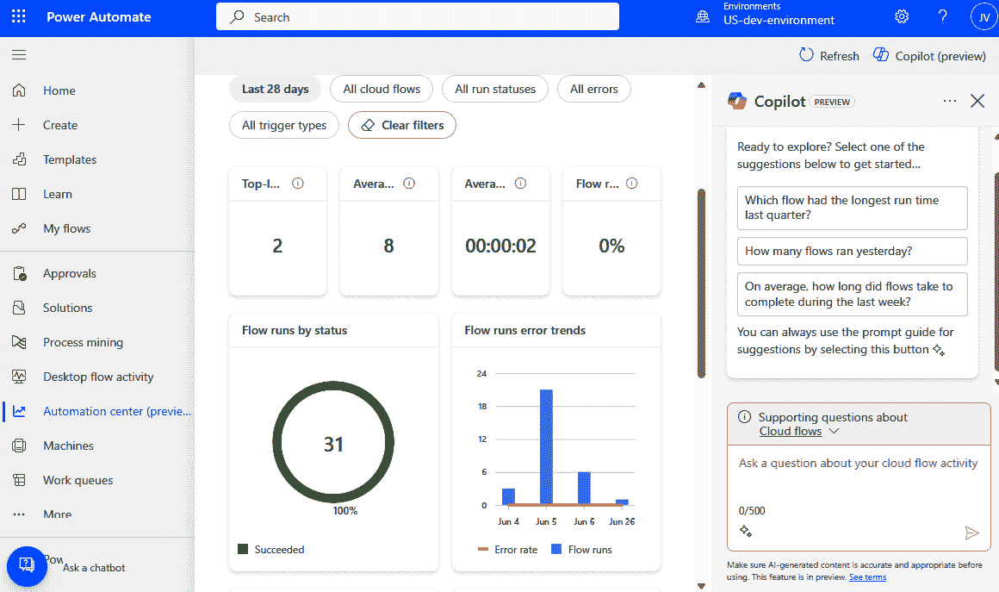

            图 8.29 – Power Automate 自动化中心

            在这里，我们可以可视化记录在 Dataverse 中的数据，并且可以在右侧使用 Copilot 获得 故障排除的帮助。

                +   使用 Dataverse，我们可以开发一个 **自定义 Dataverse 插件** ，将这些信息发送到 Application Insights 端点，并借助 **C# SDK**。

            正如我们所见，Azure Application Insights 是一个企业级的应用程序性能管理 PaaS 解决方案，我们可以轻松地将其集成到我们的 Power Platform 产品组合中。

            现在，我们将深入探讨最后一个主题——功能标志的世界，以及它们能为我们的 Power Platform 解决方案带来什么。

            练习 - 引入功能标志

            在自定义开发项目中， **功能标志** 用于启用或禁用应用程序的功能。 敏捷团队非常受益于这一概念，因为具有重大影响和较长开发周期的功能，跨越多个冲刺，可以在完全开发之前对最终用户保持隐藏。 考虑一些功能，例如启用 Microsoft Azure 中的 Copilot 功能或在公共仓库中提供 GitHub Copilot。 这些功能在向公众发布之前，都是在功能标志下开发的。 我们也经常使用功能标志来为一组用户（例如参与 Beta 测试活动的用户）启用新功能。 上述的 Copilot 功能最初是作为专门客户的私人预览版提供的，之后进入了公共预览阶段，最终它们变得 全面可用。

            特定于解决方案的 **环境变量** 在 Power Platform 中可以提供此功能标志能力，前提是我们 在新功能前使用它。 要在 Power Platform 解决方案中将环境变量用作功能标志，我们可以按照 以下步骤操作：

                1.  在我们的解决方案中创建一个环境变量。 这可以通过选择 **新建** | **更多** | 解决方案中的 **环境变量** 来完成，我们正在 进行的工作。

                1.  设置环境变量的数据类型，可以是 `布尔值`、 `选项集`，或 `文本`，具体取决于我们为 功能标志所需的类型。

                1.  在我们的解决方案组件中使用环境变量，例如 Power Automate 流、Power Apps 画布应用或自定义连接器。 对于 Power Apps，我们可以使用 `LookUp()` PowerFX 函数来访问环境变量的值，对于 Power Automate，我们可以使用 Dataverse 的 `执行外部操作` ，并选择操作 名称 `RetrieveEnvironmentVariableSecretValue`。

                1.  将我们的解决方案部署到不同的环境，并根据我们的功能标志设置更改环境变量值。 这使我们能够根据 环境设置启用或禁用某些功能或功能。

            让我们为我们的 Kudos 应用解决方案引入一个功能标志 来控制登陆页面上需要显示哪个标签——是原始的标签，还是我们在 *练习——构建 CD 管道和发布列车* 一节中早些时候创建的标签：

            

            图 8.30 – 作为功能标志的环境变量

            我们定义这个 环境变量，数据类型为 `布尔` ，并将其默认值设置为 `featureFlagLabel`。

            要在画布应用中使用 PowerFX 读取环境变量的值，我们可以使用以下方法：

                +   确保我们已将 `环境变量值` 表添加到我们的画布应用的数据源中。

                +   使用 `LookUp()` 函数，结合我们环境变量的架构名称——例如， `LookUp('环境变量值', '环境变量定义'.'架构名称' = "``YourEnvironmentVariableSchemaName").Value`。

                +   这将检索我们指定的环境变量的当前值。 。

            让我们打开我们的 Kudos 应用来编辑 从我们的解决方案中，然后引入新的数据源， `环境变量值`。之后，我们需要将 `文本` 属性从 `lblTitle_LandingScreen` 的静态文本更改为 以下内容：

```
 If( IsBlank(LookUp('Environment Variable Values', 'Environment Variable Definition'.'Schema Name' = "mpa_featureFlagLabel").Value),
    "Employee Kudos",
    If( LookUp('Environment Variable Values', 'Environment Variable Definition'.'Schema Name' = "mpa_featureFlagLabel").Value = "no",
        "Employee Kudos",
        "Employee Kudos - April 2024"
    )
)
```

            正如我们在本章第一节中所学到的，部署设置文件不仅包含连接引用，还包含环境变量。 我们的 `deploymentSettings.json` 文件位于 `\src\mpa_Kudos\deploymentSettings.json`。在 `cat` 命令的帮助下，我们已经在 GitHub 工作流中更新了此文件（*发布到生产环境* 和 *导入到开发环境*），关于连接引用：

```
 newDataverseId="${{ github.event.inputs.dataverseConnectionId }}"
newO365Id="${{ github.event.inputs.o365IdConnectionId }}"
newOutlookId="${{ github.event.inputs.outlookIdConnectionId }}"
cat ${{ env.solution_source_folder}}/${{ env.kudos_solution_name }}/deploymentSettings.json | jq --arg dataverseId "$newDataverseId" --arg o365Id "$newO365Id" --arg outlookId "$newOutlookId" '.ConnectionReferences[] |=
         if .ConnectionId == "[Dataverse]" then .ConnectionId = $dataverseId
         elif .ConnectionId == "[O365]" then .ConnectionId = $o365Id
         elif .ConnectionId == "[Outlook]" then .ConnectionId = $outlookId
        else . end' > temp.json && mv temp.json ${{ env.solution_source_folder}}/${{ env.kudos_solution_name }}/deploymentSettings.json
```

            类似地，我们可以更新此 JSON 文件中的环境变量值，以便在部署管道中完全自动化它们。 我们只需 将 `.ConnectionReferences[]` 数组替换为 `.EnvironmentVariables[]` 数组来调整 我们的变量。

            在本节中，我们学习了如何利用环境变量将功能标志添加到我们的应用程序和 云流中。

            总结

            在本章中，我们踏上了一段激动人心的旅程，深入探讨了 DevOps 和 ALM 原则的实际应用。 我们通过各种实践练习，掌握了从存储库分支策略到构建稳健的 CD 管道、有效管理待办事项以及强制执行分支保护规则等内容。 我们还深入探讨了解决方案的自动化测试，通过 APM 监控应用程序在运行时的性能，并利用功能标志的强大功能。 这些练习不仅仅是理论上的；我们还将其应用于一个真实世界的例子，利用 GitHub 作为我们首选的 DevOps 工具。 通过这些实践教程，我们将 DevOps 和 ALM 的每一个环节编织成了一个 [实践 经验的画卷。](https://learn.microsoft.com/en-us/power-platform/enterprise-templates/overview)

            [在接下来的章节中，我们将深入探讨](https://learn.microsoft.com/en-us/power-platform/enterprise-templates/overview) 融合架构，并查看如何在我们的 Power Platform 解决方案中利用 Azure PaaS 服务。

            进一步阅读

                +   Power Platform 企业版 模板： [https://learn.microsoft.com/en-us/power-platform/enterprise-templates/overview](https://learn.microsoft.com/en-us/power-platform/enterprise-templates/overview)

                +   Kudos 应用程序： [https://learn.microsoft.com/zh-cn/power-platform/enterprise-templates/hr/employee-kudos/install-and-set-up](https://learn.microsoft.com/zh-cn/power-platform/enterprise-templates/hr/employee-kudos/install-and-set-up)

                +   GitHub CLI： [https://github.com/cli/cli](https://github.com/cli/cli)

                +   GitHub CLI 与 GitHub Copilot： [https://docs.github.com/zh-cn/copilot/github-copilot-in-the-cli/using-github-copilot-in-the-cli](https://docs.github.com/zh-cn/copilot/github-copilot-in-the-cli/using-github-copilot-in-the-cli)

                +   预填充连接 引用： [https://learn.microsoft.com/zh-cn/power-platform/alm/conn-ref-env-variables-build-tools#get-the-connection-reference-information](https://learn.microsoft.com/zh-cn/power-platform/alm/conn-ref-env-variables-build-tools#get-the-connection-reference-information)

                +   GitHub 环境： [https://docs.github.com/zh-cn/actions/learn-github-actions/variables#using-the-vars-context-to-access-configuration-variable-values](https://docs.github.com/zh-cn/actions/learn-github-actions/variables#using-the-vars-context-to-access-configuration-variable-values)

                +   GitHub 输出： [https://docs.github.com/zh-cn/actions/using-jobs/defining-outputs-for-jobs](https://docs.github.com/zh-cn/actions/using-jobs/defining-outputs-for-jobs)

                +   GitHub 作业和 需求： [https://docs.github.com/zh-cn/actions/using-jobs/using-jobs-in-a-workflow](https://docs.github.com/zh-cn/actions/using-jobs/using-jobs-in-a-workflow)

                +   GitHub 复合 操作： [https://docs.github.com/zh-cn/actions/creating-actions/creating-a-composite-action](https://docs.github.com/zh-cn/actions/creating-actions/creating-a-composite-action)

                +   GitHub 拉取 请求： [https://docs.github.com/zh-cn/pull-requests/collaborating-with-pull-requests/proposing-changes-to-your-work-with-pull-requests/about-pull-requests](https://docs.github.com/zh-cn/pull-requests/collaborating-with-pull-requests/proposing-changes-to-your-work-with-pull-requests/about-pull-requests)

                +   GitHub 市场： [https://github.com/marketplace](https://github.com/marketplace)

                +   Power Apps 测试 引擎： [https://learn.microsoft.com/zh-cn/power-apps/developer/test-engine/overview](https://learn.microsoft.com/zh-cn/power-apps/developer/test-engine/overview)

                +   使用 Power Apps 测试 工作室： [https://learn.microsoft.com/en-us/power-apps/maker/canvas-apps/working-with-test-studio](https://learn.microsoft.com/en-us/power-apps/maker/canvas-apps/working-with-test-studio)

                +   Azure 应用程序洞察 概述： [https://learn.microsoft.com/en-us/azure/azure-monitor/app/app-insights-overview](https://learn.microsoft.com/en-us/azure/azure-monitor/app/app-insights-overview)

                +   指标 警报： [https://learn.microsoft.com/en-us/azure/azure-monitor/alerts/tutorial-metric-alert](https://learn.microsoft.com/en-us/azure/azure-monitor/alerts/tutorial-metric-alert)

                +   操作 组： [https://learn.microsoft.com/en-us/azure/azure-monitor/alerts/action-groups](https://learn.microsoft.com/en-us/azure/azure-monitor/alerts/action-groups)

                +   Power Apps 与应用程序 洞察： [https://learn.microsoft.com/en-us/power-apps/maker/canvas-apps/application-insights](https://learn.microsoft.com/en-us/power-apps/maker/canvas-apps/application-insights)

                +   应用程序洞察 集成概述： [https://learn.microsoft.com/en-us/power-platform/admin/overview-integration-application-insights](https://learn.microsoft.com/en-us/power-platform/admin/overview-integration-application-insights)

                +   将数据导出到应用程序 洞察： [https://learn.microsoft.com/en-us/power-platform/admin/set-up-export-application-insights](https://learn.microsoft.com/en-us/power-platform/admin/set-up-export-application-insights)

                +   Power Pages 和应用程序 洞察： [https://learn.microsoft.com/en-us/power-pages/go-live/telemetry-monitoring](https://learn.microsoft.com/en-us/power-pages/go-live/telemetry-monitoring)

                +   环境 变量： [https://learn.microsoft.com/en-us/power-apps/maker/data-platform/environmentvariables](https://learn.microsoft.com/en-us/power-apps/maker/data-platform/environmentvariables)

                +   Power Automate 自动化 中心： [https://learn.microsoft.com/en-us/power-automate/automation-center-overview](https://learn.microsoft.com/en-us/power-automate/automation-center-overview)

```

```

```

```

# 第三部分：探索 DevOps 最佳实践及未来发展

在本部分中，我们将探索构建融合团队的可能性，在这些团队中，专业开发者和 DevOps 工程师可以帮助低代码/无代码开发方法的实施。 我们将了解文化如何在更快的开发周期中发挥重要作用，以及构建可重用组件的重要性。 我们将看看 Microsoft Azure 云服务如何与 Power Platform 解决方案进行集成。 专业开发者将了解 Power Platform 的可扩展性，并能够利用自定义代码组件，扩展 Power Platform 的功能。 我们将通过研究人工智能如何改变我们开发业务应用程序的方式，来总结本章内容，探讨它如何帮助我们构建定制的副驾驶，不仅支持我们的 DevOps 流程，还能丰富我们的 业务解决方案。

本部分包括以下章节：

+   *第九章*， *实施融合开发方法*

+   *第十章*， *在 Power Platform 中实现专业开发者扩展性*

+   *第十一章*， *通过设计最佳实践管理环境生命周期*

+   *第十二章*， *展望副驾驶、ChatOps 和 AI 驱动的应用程序*
