# <st c="0">9</st>

# <st c="2">实现融合开发方法</st>

<st c="46">Power Platform 采用低代码/零代码方法，允许接近业务流程的公民开发人员利用他们对业务问题的了解来设计并更快地将新应用投入使用。</st> <st c="262">然而，他们所面临的挑战可能会变得更加复杂，或是功能需求超出了他们的能力，因此需要专业开发人员支持开发过程，帮助公民开发人员避免</st> <st c="498">重复性的任务。</st>

<st c="515">在本章中，我们将探讨组织如何将不同的角色联系在一起，构建有效的团队，合作解决挑战，并为组织提供数字化的业务解决方案。</st> <st c="727">我们将从聚焦融合开发方法的基本理解及团队如何通过不同角色进行表现开始。</st> <st c="870">接着，我们将介绍一些好的开源开发实践，这些实践同样适用于低代码/零代码，并深入了解 Power Platform 中一个支持这些实践的工具。</st>

<st c="1040">最后一部分将集中讨论 Azure 云与 Power Platform 之间的集成。</st> <st c="1130">这里将重点介绍特定的 Azure 服务，如 Azure API 管理服务，它作为 Azure 与 Power Platform 之间的集成服务。</st> <st c="1300">此外，还将涵盖一些在与 Power Platform 集成场景中经常使用的其他常见 Azure 服务。</st> <st c="1427">最后，我们将通过构建低代码应用与</st> <st c="1537">代码优先解决方案的集成示例来结束。</st>

<st c="1557">本章将涵盖以下主要内容：</st> <st c="1601">：</st>

+   <st c="1614">什么是融合</st> <st c="1634">开发方法？</st>

+   <st c="1655">Microsoft Azure 和 Power</st> <st c="1682">平台的结合</st>

+   <st c="1699">Azure 和 Power Platform 的集成示例</st> <st c="1739">场景</st>

# <st c="1759">技术要求</st>

<st c="1782">本章将连接 Power Platform 解决方案与 Azure 服务。</st> <st c="1860">为了跟上进度，我们建议提前准备好以下要求：</st> <st c="1916">：</st>

+   **<st c="1925">Power Platform 订阅</st>**<st c="1953">：如果你已经拥有 Microsoft Entra ID 工作账户，可以注册 Power Platform 开发者计划（</st>[<st c="2009">https://powerapps.microsoft.com/en-us/developerplan/</st>](https://powerapps.microsoft.com/en-us/developerplan/)<st c="2062">）；或者，你也可以加入 Microsoft 365 开发者计划（</st>[<st c="2173">https://developer.microsoft.com/en-us/microsoft-365/dev-program</st>](https://developer.microsoft.com/en-us/microsoft-365/dev-program)<st c="2237">）。</st>

+   **<st c="2240">Azure 订阅</st>**<st c="2259">：你可以按照此网站上的指导，注册一个免费的 Azure 账户：</st> [<st c="2341">https://azure.microsoft.com/en-us/free</st>](https://azure.microsoft.com/en-us/free)<st c="2379">。注册完成后，可以通过以下</st> <st c="2460">网址</st> [<st c="2465">https://portal.azure.com/</st>](https://portal.azure.com/)<st c="2490">访问 Microsoft Azure 门户。</st>

+   **<st c="2491">Visual Studio</st>**<st c="2505">：如果你无法访问其他版本的 Visual Studio，可以使用免费的 Community Edition（</st>[<st c="2613">https://visualstudio.microsoft.com/vs/community/</st>](https://visualstudio.microsoft.com/vs/community/)<st c="2662">）。</st> <st c="2666">一些示例展示了 Power Platform 工具在 Visual Studio 中的功能，这些功能在 Visual Studio Code 中不可用。</st> <st c="2797">在其他情况下，你也可以使用</st> **<st c="2831">Visual Studio Code</st>** <st c="2849">(</st>**<st c="2851">VS Code</st>**<st c="2858">) 和</st> **<st c="2870">Power Platform Tools</st>** <st c="2890">扩展。</st> <st c="2902">VS Code 可以在以下网址找到：</st> [<st c="2929">https://code.visualstudio.com/</st>](https://code.visualstudio.com/)<st c="2959">。</st>

+   **<st c="2960">示例</st>** <st c="2968">本章讨论的示例位于以下</st> <st c="3024">代码库：</st> [<st c="3036">https://github.com/PacktPublishing/Mastering-DevOps-on-Microsoft-Power-Platform/tree/main/Chapter09</st>](https://github.com/PacktPublishing/Mastering-DevOps-on-Microsoft-Power-Platform/tree/main/Chapter09)<st c="3135">。</st>

# <st c="3136">什么是融合开发方法？</st>

<st c="3177">本节介绍不同团队成员如何通过一个名为</st> **<st c="3298">融合开发方法</st>**<st c="3325">的概念进行协作，以实现项目目标。</st> <st c="3430">我们将解释这是什么，以及它如何弥合公民开发者与专业开发者之间的差距。</st> <st c="3625">我们还将解释 Power Platform 如何受益于来自开源开发世界的实践，最后将我们的开发环境配置为连接 Power Platform。</st>

<st c="3640">融合开发涉及整合不同的团队及其技能，以促进业务能力的数字化，并提供价值。</st> <st c="3786">这一术语首次由 Gartner 定义，指的是一个跨学科的数字商业团队，结合了技术和业务领域的专业知识，负责交付数字产品。</st> <st c="3983">Gartner 的研究表明，与传统的集中式团队相比，实施分布式融合团队可以更快地加速实现组织数字化转型的进程。</st> <st c="4204">你可以在这篇文章中阅读更多关于 Gartner 研究的内容：</st> <st c="4280">页面：</st> [<st c="4286">https://www.gartner.com/en/articles/why-fusion-teams-matter</st>](https://www.gartner.com/en/articles/why-fusion-teams-matter)<st c="4345">。</st>

<st c="4346">在 Power Platform 的世界里，融合开发方法</st> <st c="4410">将低代码/无代码开发方法与传统软件开发方法以及 IT 运营相结合，用于管理资源和平台。</st> <st c="4572">这些多学科团队合作的目的是利用团队所掌握的知识，并通过使用低代码/无代码工具来扩展应用程序现代化或业务流程的数字化。</st> <st c="4826">它帮助组织在快速变化的商业环境中实现业务转型的成功，在这个环境中，必须尽早提供市场上可用的商业解决方案，以获得</st> <st c="5023">竞争优势。</st>

<st c="5045">我们可以将融合团队的成员分为三种不同的</st> <st c="5109">角色组：</st>

+   **<st c="5124">公民开发者</st>**<st c="5143">：这一群体由具备商业知识、理解</st> <st c="5215">商业</st> <st c="5228">流程和商业挑战的人组成，他们决心将现有的业务流程数字化。</st> <st c="5328">在这里，我们可以找到商业用户、业务分析师和业务工程师。</st> <st c="5405">他们将使用支持低代码/无代码开发方法的工具，如 Microsoft Power Platform，以可视化的方式设计和构建项目的某些部分。</st> <st c="5577">这可能包括在 Power Apps 中构建应用程序的前端原型，或在 Power Automate 中支持业务流程的工作流。</st>

+   **<st c="5717">专业开发人员</st>**<st c="5741">：这是一个由经验丰富的专业开发人员组成的团队</st> <st c="5760">他们精通多种编程语言，能够解决复杂的应用程序开发挑战。</st> <st c="5794">通过使用传统的软件开发工具，如 Visual Studio，他们将主要为低代码解决方案构建扩展。</st> <st c="5919">他们的工作将侧重于开发后端 API、集成场景或由公民开发人员在其低代码/无代码项目中使用的自定义代码组件。</st> <st c="6055">如果可能，建议专业开发人员也使用与公民开发人员相同的低代码开发工具，以支持开发更简单的任务</st> <st c="6230">并将自定义解决方案集成到新开发的解决方案中。</st>

+   **<st c="6472">IT 专业人士/DevOps 工程师</st>**<st c="6506">：最后一组是 IT 专业人士，他们将负责管理资源</st> <st c="6597">这些资源将会</st> <st c="6610">运行新建的业务应用程序，以便以受管理和受管控的方式使用，并与组织的 IT 政策对齐。</st> <st c="6745">在这一组中，我们会找到 DevOps 工程师，他们将负责管理业务解决方案的 DevOps 流程。</st> <st c="6875">他们将确保项目与 DevOps 实践对齐，例如确保 CI/CD 管道正常运行，并确保业务解决方案的所有组件都</st> <st c="7049">得到正确的版本控制。</st>

<st c="7077">下图展示了各个角色如何相互连接并协作以实现构建</st> <st c="7192">业务解决方案的目标：</st>

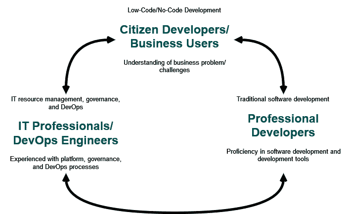

<st c="7577">图 9.1 – 融合开发方法</st>

<st c="7621">此外，我们应该</st> <st c="7645">在融合开发方法中引入另外两个人物角色，这将为</st> <st c="7740">融合团队带来好处。</st>

<st c="7752">第一个角色是</st> **<st c="7774">融合团队领导</st>**<st c="7792">。他们的职责是监督</st> <st c="7818">整个项目的开发并协调团队成员，负责沟通和</st> <st c="7920">项目交付。</st>

<st c="7937">第二个角色是</st> **<st c="7960">解决方案架构师</st>** <st c="7978">角色。</st> <st c="7985">建议在项目的规划和设计阶段引入解决方案架构师，因为他们将深入研究技术细节并帮助创建解决方案的高级架构设计，关注设计模式，分享关于工具和技术选择的建议，</st> <st c="8301">等等。</st>

<st c="8310">融合团队的规模建议与敏捷团队规模的普遍建议非常相似。</st> <st c="8426">没有一种适合所有的标准；这将取决于项目的复杂性和组织的成熟度。</st> <st c="8533">然而，我们应该保持融合团队的</st> *<st c="8574">小型</st>* <st c="8579">规模，以保持团队的自主性和敏捷性。</st> <st c="8637">团队。</st>

<st c="8646">团队规模在 5 到 7 人之间被认为是合适的敏捷团队规模。</st> <st c="8737">这通常与亚马逊的</st> *<st c="8775">“两块披萨规则”</st>* <st c="8789">有关，该规则表示团队应该足够小，能够被两块披萨喂饱。</st> <st c="8866">小型团队有助于提高沟通和协作效率，同时保持敏捷性。</st> <st c="8961">这包括迅速适应团队面临的挑战的能力，而不会引入</st> <st c="9062">必要的瓶颈。</st>

<st c="9084">融合团队</st> <st c="9100">本身可能是一个临时的，</st> **<st c="9128">短期团队</st>**<st c="9144">。它的目的是解决一个特定的业务问题，一旦完成，团队解散，团队成员继续他们的正常工作例程——例如，公民开发者，可能是业务用户和业务分析师，将继续他们的工作，而软件开发人员可能会回到另一个传统的软件</st> <st c="9484">开发项目。</st>

<st c="9504">如前所述，在某些方面，融合开发</st> <st c="9551">与敏捷文化有所重叠。</st> <st c="9584">融合开发方法遵循精益方法论，我们在</st> *<st c="9668">第一章</st>*<st c="9677">中进行了描述。精益方法论的理念是专注于在快速迭代的开发中交付价值。</st> <st c="9777">融合团队可以在冲刺中工作，以跟踪和交付工作，使用 DevOps 工具和项目规划工具，例如</st> <st c="9892">Azure Boards。</st>

## <st c="9905">Power Platform 中融合开发方法的常见示例</st>

<st c="9974">融合团队汇聚在一起解决业务问题。</st> <st c="10030">在规划和设计阶段，这些挑战被深思熟虑，任务在利益相关者之间分配。</st> <st c="10153">接下来，我们将提供几个例子，展示通过融合方法，专业开发人员和公民开发人员如何通过</st> <st c="10297">技术解决方案来解决这些问题。</st>

### <st c="10321">自定义连接器到后端 API</st>

<st c="10353">我们经常</st> <st c="10363">在组织中看到，已经有一套系统和服务正在被旧有应用程序和业务流程所使用。</st> <st c="10508">如果我们只希望现代化前端应用程序或从头开始构建一个全新的应用程序，但利用一些后端服务，我们可以在 Power Platform 中使用自定义连接器，将后端服务与 Power Platform 应用程序连接起来。</st> <st c="10768">在 Power Platform 中构建自定义连接器可以帮助组织解锁对这些 API 的访问，并允许开发者在任何潜在的</st> <st c="10950">新场景中重用它们。</st>

<st c="10963">如果我们正在构建新的 API，我们可以记住它们可能会在 Power Platform 中使用。</st> <st c="11056">因此，在构建应用程序、流程和助手时，构建和使用自定义连接器是一种常见做法，尤其是在使用 Power Platform 服务时。</st> <st c="11203">从角色的角度来看，举个例子，我们可能会看到专业开发人员构建新的 Web API，公民开发者在 Power Apps 应用程序中使用它们，IT 运维人员则负责管理 Power Platform 环境，构建数据丢失防护策略，并描述</st> <st c="11496">所需的基础设施，使用</st> **<st c="11531">基础设施即代码</st>** <st c="11553">(</st>**<st c="11555">IaC</st>**<st c="11558">) 方法，这将用于配置所需的基础设施，包括 Azure API 管理，以运行支持服务。</st> <st c="11692">DevOps 工程师将与专业开发人员一起，确保 CI/CD 管道已配置好，以自动化的方式构建和部署应用程序和 API。</st>

<st c="11858">一旦自定义连接器构建并部署到 Power Platform，我们可以在 Power Automate 中重用它，将我们旧有系统和服务的能力引入到</st> <st c="12052">Power Automate 流程</st> <st c="12072">所实现的业务逻辑中。</st>

<st c="12088">Copilot Studio</st> <st c="12103">现在还提供了在自定义助手中直接使用连接器，包括自定义连接器的能力。</st>

### <st c="12214">通过 PCF 控件扩展</st>

<st c="12241">有时，Power Pages 或 Power Apps 画布和</st> <st c="12338">模型驱动应用中提供的控件可能不足以满足需求。</st> <st c="12377">也许我们正在寻找一个图形上更丰富的组件，或者只是一个执行特定任务的自定义组件。</st> <st c="12491">在这种情况下，我们可以联系专业开发人员</st> <st c="12539">支持我们通过使用</st> **<st c="12594">Power Apps 组件框架</st>** <st c="12624">(</st>**<st c="12626">PCF</st>**<st c="12629">) 构建自定义代码组件。</st> <st c="12633">PCF 组件是可重用的，并能增强</st> <st c="12676">用户体验。</st>

<st c="12692">这是另一个很好的例子，展示了专业开发人员如何运用他们的软件开发技能。</st> <st c="12792">通过使用 TypeScript</st> <st c="12815">编程语言，他们开发了一个组件，市民开发人员可以将其添加到他们在 Power Apps 中构建的应用程序或在 Power Pages 中构建的网站中，以改善用户体验或实现某些额外的</st> <st c="13033">业务场景。</st>

<st c="13052">虽然之前使用自定义连接器的示例让专业开发人员几乎可以与 Power Platform 分离，因为他们只关注 Web API 和代码组件，但专业开发人员应该了解 Power Platform，因为每种应用类型（画布应用、模型驱动应用或网站/门户）都有其独特的开发最佳实践</st> <st c="13218">和限制。</st>

### <st c="13411">在自定义助理中启用复杂技能</st>

<st c="13454">另一个</st> <st c="13463">融合方法的例子与在</st> <st c="13544">Copilot Studio 中构建自定义助理或机器人有关。</st> <st c="13560">Copilot Studio 允许通过 Power Automate 流程、连接器、插件和 Copilot 框架技能扩展自定义助理的功能。</st> <st c="13702">如果使用现有连接器并构建与 Copilot Studio 集成的流程是市民开发人员可以完成的事情，那么构建技能操作则需要专业开发人员的参与。</st> <st c="13887">。</st>

<st c="13905">技能</st> <st c="13913">是一个可以为另一个机器人/技能消费者执行一系列操作的机器人，通常是面向用户的机器人。</st> <st c="14023">它支持多轮操作，例如进行产品订单，而与 Power Automate 流程集成的则仅支持单轮操作，例如获取</st> <st c="14210">包裹的状态。</st>

<st c="14219">在这种情况下，专业开发人员将使用 Copilot 框架 SDK 构建一个技能，然后该技能将在自定义助理机器人中由市民开发人员使用，该机器人将在</st> <st c="14409">Copilot Studio 中构建。</st>

<st c="14424">所有这些示例有一个共同点——可重用性。</st> <st c="14484">让我们看看在 Power Platform 中构建目录如何帮助组件的可发现性和可重用性。</st>

## <st c="14620">通过开源开发实践增强协作</st>

<st c="14684">组织将以快速的</st> <st c="14719">速度实施</st> <st c="14737">新应用、流程或聊天机器人。</st> <st c="14776">Fusion 团队将在 Power Platform 中开发许多可以在其他项目中重用的组件，而不是浪费时间重新发明轮子。</st> <st c="14925">我们如何消除组织中的信息孤岛，赋能任何开发者，无论是专业开发者还是公民开发者，让他们了解已经完成的工作，并允许他们在自己的项目中重用这些成果呢？</st> <st c="15155">在回答这个问题之前，让我们稍微退一步，看看传统软件</st> <st c="15271">开发世界是如何解决这个问题的。</st>

<st c="15289">不久前，许多组织</st> <st c="15326">都非常封闭，独立</st> <st c="15358">进行项目工作，缺乏合作。</st> <st c="15402">这导致了重复的工作和开发过程中的低效率。</st> <st c="15482">团队之间相互隔离，合作和沟通非常差，甚至根本不存在。</st> <st c="15570">我们有时也会遇到对新想法或做法的抵触，这些新方法可能会改变团队的运作方式。</st>

<st c="15688">然而，如果我们看看开源世界中的软件开发实践，我们可以看到开源软件如何可能与任何人共享，开放供使用和修改。</st> <st c="15876">几乎任何人都可以审查项目，修改和重用开源软件。</st> <st c="15966">这种方法的目标是构建更可靠</st> <st c="16034">和更优质的代码。</st>

<st c="16045">这时我们需要引入</st> **<st c="16081">InnerSource</st>**<st c="16092">。InnerSource 是一种开发</st> <st c="16122">方法论，它将开源软件开发的优秀实践应用到一个封闭的群体——组织的员工中。</st> <st c="16268">这意味着软件开发项目将成为组织的私有开源项目。</st> <st c="16359">一个组织的项目。</st>

<st c="16375">有趣的是，这种使用 DevOps 工具（如 Azure DevOps 和 GitHub）的开发方式，可以用于任何类型的项目，甚至是软件开发之外的项目。</st>

<st c="16572">InnerSource 为软件开发带来了现代化的方法，帮助我们消除传统专有软件在组织中带来的挑战。</st> <st c="16757">在组织中开放地合作将有助于改进创新，因为更多人可以参与项目并做出贡献。</st> <st c="16892">开发人员不必总是从头开始构建项目，因为 InnerSource 有助于</st> **<st c="16985">发现性</st>**<st c="17000">。也许我们的组织内已经存在可以重复使用的东西。</st> <st c="17086">这将推动快速开发，降低开发成本，提高上市时间。</st> <st c="17177">它将改善协作，并且最重要的是，培养开放的文化。</st>

<st c="17259">InnerSource Commons Foundation 每年进行的研究称为</st> *<st c="17343">InnerSource 状态报告</st>* <st c="17370">(可在</st> [<st c="17385">https://innersourcecommons.org/</st>](https://innersourcecommons.org/)<st c="17416">找到)，它识别了 InnerSource 的好处和阻碍。</st> <st c="17473">未应用 InnerSource 实践的常见阻碍包括组织文化、独立思维以及对 InnerSource 原则的认知和熟悉度不足。</st> <st c="17651">因此，确保开发人员熟悉这些实践，并在组织中推广这一策略至关重要，这将有助于我们分配资源和时间来实施和释放 InnerSource 的好处。</st> <st c="17911">该组织内。</st>

<st c="17928">这些良好的实践也可以应用于低代码/无代码</st> <st c="17994">开发方法。</st>

<st c="18015">融合开发团队，尤其是专业开发人员和 DevOps 工程师，使用诸如 Azure DevOps 和 GitHub 等 DevOps 工具执行许多任务，其中 InnerSource 方法是产品的核心。</st> <st c="18234">Azure Boards 或 GitHub Issues 等工具使开发人员能够提出新功能的想法，报告产品中的错误，评论任务等。</st> <st c="18388">拉取请求机制通过构建验证和同行审查确保最终生成物符合所有要求，从而实现更好的结果。</st> <st c="18526">为了进一步支持良好的 DevOps 实践，公司可以通过产品如 Microsoft Teams 扩展其工具集，以改进融合团队的沟通和协作，并</st> <st c="18709">实现 ChatOps。</st>

<st c="18727">DevOps 工具的服务和功能</st> <st c="18765">是以帮助</st> <st c="18795">组织更轻松地实现和促进 InnerSource 的方式构建的。</st> <st c="18853">为了让组织了解是否朝着目标前进，他们应该实施定期评审，以了解 InnerSource 的</st> <st c="19008">采用情况。</st>

## <st c="19022">构建目录流程</st>

<st c="19049">在为 Power Platform 开发业务解决方案时，我们还应该考虑如何遵循 InnerSource 最佳实践，允许融合团队共享他们的工作，并允许其他团队重用组件和构建的模板。</st> <st c="19275">虽然在 Azure DevOps 和 GitHub 中打开项目可以让专业开发人员了解组织中有哪些项目，但我们不能指望业务用户按照与专业开发人员相同的步骤进行操作。</st> <st c="19497">还有一种方法可以将我们的工作分享给组织中的任何人。</st> <st c="19551"> </st>

<st c="19568">Power Platform 中的</st> **<st c="19573">目录</st>** <st c="19580">是所有已部署到目录并需要进行目录化和重用的组件和模板的唯一真实来源。</st> <st c="19619">它以模型驱动应用的形式出现在 Power Apps 中，帮助我们了解组织中已经有哪些资源可用。</st> <st c="19853">Power Platform 目录不是一个版本控制系统，不能替代用于版本控制和 CI/CD 流水线的 DevOps 工具。</st> <st c="19987">然而，它确实增强了 ALM/DevOps 流程，因为它支持通过 PAC CLI 命令进行自动化场景，就像我们在</st> *<st c="20140">第六章</st>* 中的示例所看到的那样。</st>

<st c="20150">组件和模板在目录中作为项目呈现。</st> <st c="20217">专业开发人员和公民开发人员将使用目录了解组织中现有的项目，以及谁发布了这些项目。</st> <st c="20373">它还将用于在新项目中查找和重用组件，或从现有模板开始。</st> <st c="20476">另一方面，IT 运维团队将使用目录的管理功能来控制代码组件</st> <st c="20610">和模板的使用。</st>

<st c="20624">我们建议首先在组织中安装一个目录。</st> <st c="20694">然而，在某些情况下，组织需要在 Power Platform 租户中安装多个目录——例如，如果一个组织有非常敏感的项目，必须与其他项目隔离。</st> <st c="20908">在这种情况下，应该安装另一个目录，以提供所需的</st> <st c="20982">隔离级别。</st>

<st c="20999">预览功能</st>

<st c="21021">请注意，</st> <st c="21034">截至撰写本文时，</st> **<st c="21059">Power Platform 中的目录</st>** <st c="21084">是一个预览功能，因此在功能上有一些限制，例如它不能在使用客户管理密钥的环境中使用。</st> <st c="21255">在预览阶段，目录可以在所有类型的环境中使用，但发布到正式版后，这将仅在</st> **<st c="21403">受管</st>** <st c="21410">环境中可用。</st>

### <st c="21424">目录过程</st>

<st c="21440">Power Platform 中的目录</st> <st c="21466">遵循从目录项创建到获取阶段的生命周期，新的团队将在此阶段重复使用之前开发的</st> <st c="21604">目录项。</st>

<st c="21617">这一过程始于由专业开发人员和公民开发者组成的融合团队，创建组件并构建包含解决初始业务挑战的所有组件的目录项。</st> <st c="21808">这些目录项还包括在正确配置目录项时所需的配置参数。</st> <st c="21916">以确保目录项能被正确配置。</st>

<st c="21936">这些目录项随后将提交到目录中，以供重新使用。</st> <st c="22011">一旦提交，IT 管理员和业务线审批人员将审核这些新的目录项并相应地批准它们。</st> <st c="22124">并据此进行批准。</st>

<st c="22141">其他专业开发人员和应用程序开发者</st> <st c="22177">将使用该目录查找现有的解决方案和模板。</st> <st c="22241">那些看似适合他们业务问题的目录项将被重新使用。</st> <st c="22318">为了完成配置，开发者必须提供所有必要的配置参数并建立所需的连接。</st> <st c="22454">之后，该目录项将在他们的环境中成功配置。</st> <st c="22534">现在，他们可以在自己构建的解决方案中重复使用这些组件。</st> <st c="22602">他们正在构建自己的解决方案。</st>

### <st c="22615">从目录管理员开始</st>

<st c="22649">在我们开始在 Power Platform 中使用目录之前</st> <st c="22683">，我们必须首先从 Microsoft AppSource 安装它。</st> <st c="22754">我们应该在环境中分配一个</st> *<st c="22771">系统管理员</st>* <st c="22791">安全角色，以便能够安装目录管理器。</st> <st c="22877">目录管理器将安装在一个 Dataverse 环境中，该环境的数据库版本应至少为</st> `<st c="22991">9.2.22122.00148</st>`<st c="23006">。我们可以在环境设置中的</st> **<st c="23050">版本</st>** <st c="23057">卡片上查看 Dataverse 版本。</st> <st c="23096">我们首先需要打开</st> **<st c="23118">Power Platform 管理中心</st>** <st c="23145">|</st> **<st c="23148">环境</st>** <st c="23160">，然后选择该环境，并选择</st> **<st c="23201">版本</st>** <st c="23208">卡片。</st>

<st c="23214">我们建议为目录创建一个单独的 Power Platform 环境。</st> <st c="23308">这样，任何人都可以访问该环境并查看目录项，也可以将目录中的项安装到他们的环境中。</st>

<st c="23455">一旦我们完成所有前提条件的检查，就可以继续进行</st> <st c="23518">安装。</st>

<st c="23535">我们可以选择通过 PAC CLI 安装目录管理器。</st> <st c="23603">为了做到这一点，我们首先连接到我们希望安装目录管理器的 Power Platform 环境。</st> <st c="23710">在该环境中，我们使用</st> `<st c="23724">pac application list</st>` <st c="23744">查找我们租户中所有可用的应用。</st> <st c="23804">其中之一将是</st> `<st c="23881">mspcat_CatalogManager</st>` <st c="23902">或 GUID 为</st> `<st c="23916">83a35943-cb41-4266-b7d2-81d60f383695</st>`<st c="23952">。这个唯一名称或 GUID 可以用来通过</st> `<st c="24054">pac application install --application-name mspcat_CatalogManager</st>`<st c="24118">安装应用到当前环境。</st> <st c="24182">要将应用安装到不同的环境中，使用</st> `<st c="24182">--environment <ENV_ID></st>` <st c="24204">并替换为适当的环境 ID 或 URL。</st> <st c="24249">为了验证我们是否已在租户中安装了目录，我们可以使用</st> `<st c="24320">pac admin list --application 83a35943-cb41-4266-b7d2-81d60f383695</st>`<st c="24385">，它将返回安装了目录管理器的环境信息。</st>

<st c="24472">如果我们想通过 UI 安装此应用程序，我们需要直接使用此链接进行安装：</st> [<st c="24586">https://appsource.microsoft.com/product/dynamics-365/powerappssvc.catalogmanager-preview?flightCodes=dde212e5c66047c59bf2b346c419cef6</st>](https://appsource.microsoft.com/product/dynamics-365/powerappssvc.catalogmanager-preview?flightCodes=dde212e5c66047c59bf2b346c419cef6)<st c="24719">。当提示我们登录 Microsoft AppSource 时，我们需要使用系统管理员帐户登录并点击</st> **<st c="24858">立即获取</st>**<st c="24868">进行确认。这会将我们带到</st> **<st c="24887">Dynamics 365 应用</st>** <st c="24904">内的</st> **<st c="24912">Power Platform 管理中心</st>** <st c="24939">以完成安装过程。</st> <st c="24978">最后一步，我们需要选择一个环境来安装此应用程序。</st> <st c="25073">我们需要同意条款和隐私声明，然后可以点击</st> **<st c="25150">安装</st>** <st c="25157">来安装应用程序。</st> <st c="25178">安装过程</st> <st c="25189">大约需要几分钟时间。</st> <st c="25221">。</st>

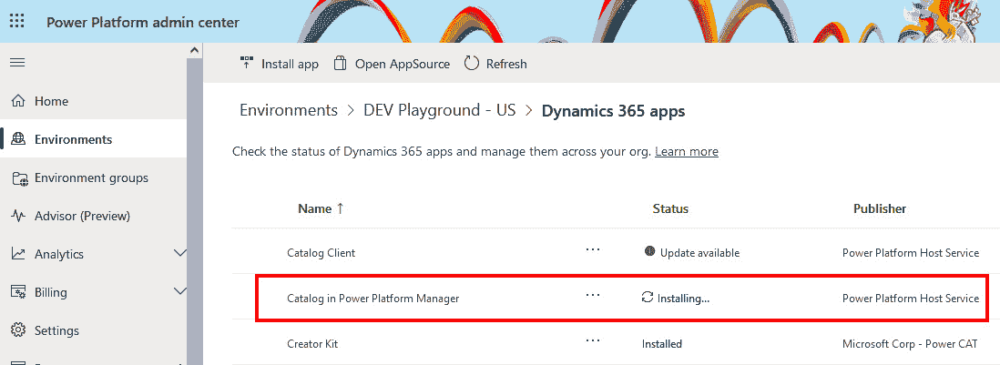

<st c="25728">图 9.2 – 安装目录管理器应用</st>

<st c="25775">安装过程会安装一个新的 Power Apps 应用程序。</st> <st c="25840">安装完成后，我们需要配置目录元数据。</st> <st c="25916">首先，我们需要运行目录管理器。</st> <st c="25959">访问目录管理器是通过 Power Apps 完成的。</st> <st c="26017">我们可以在相应环境的应用程序列表中找到此应用。</st> <st c="26099">只需进入</st> **<st c="26112">Power Apps</st>** <st c="26122">|</st> **<st c="26125">应用</st>**<st c="26129">，将鼠标悬停在</st> **<st c="26146">Power Platform 目录管理器</st>** <st c="26176">应用名称上，点击</st> *<st c="26204">播放</st>* <st c="26208">图标运行应用程序，或者点击名称旁边的三个点，再点击</st> **<st c="26297">播放</st>** <st c="26301">以运行</st> <st c="26309">应用程序。</st>

<st c="26325">现在我们已经启动了应用程序，可以通过打开配置组来配置元数据。</st> <st c="26430">在左侧导航栏的最底部，点击</st> **<st c="26484">目录</st>**<st c="26491">，这将打开一个选择区域的选项；从那里，点击</st> **<st c="26552">设置</st>**<st c="26560">。这将打开配置组，我们可以在这里配置</st> **<st c="26637">目录</st>**<st c="26644">，</st> **<st c="26646">PowerApps 检查器的规则集</st>**<st c="26677">，</st> **<st c="26679">静态分析策略</st>**<st c="26703">，和</st> **<st c="26709">PowerApps 检查器的配置</st>**<st c="26745">。点击</st> **<st c="26756">目录</st>** <st c="26763">将打开</st> **<st c="26774">目录配置</st>**<st c="26795">，如</st> *<st c="26815">图 9.3</st>*<st c="26823">所示。</st> <st c="26825">在这里，我们可以更改目录名称、描述、帮助链接和图像，以帮助我们识别该目录。</st> <st c="26932">在右侧的</st> **<st c="26949">目录配置</st>**<st c="26970">中，我们可以启用目录、允许未管理的解决方案（未来功能计划）部署到目录，并启用在目录级别发布的目录项目的全局自动审批。</st> <st c="27180">此最终设置的自动审批，如果在全局级别配置，将覆盖</st> <st c="27263">发布者级别</st> <st c="27275">的设置。</st>

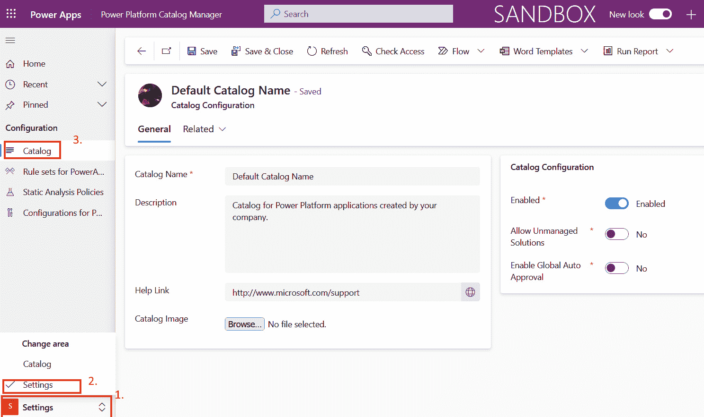

<st c="27945">图 9.3 – 目录元数据和配置</st>

<st c="27992">要返回到主要的</st> **<st c="28015">目录</st>** <st c="28022">区域，我们可以点击左侧导航栏中的</st> **<st c="28049">主页</st>** <st c="28053">导航。</st> <st c="28093">在这里，我们将看到带有操作项的单独仪表板，包含所有审批请求的</st> **<st c="28175">审批</st>** <st c="28184">部分，包含已发布目录项的</st> **<st c="28225">目录</st>** <st c="28232">部分，以及部署历史记录。</st> <st c="28299">每个部分的详细信息和说明可以在</st> <st c="28352">这里找到：</st> [<st c="28358">https://learn.microsoft.com/en-us/power-platform/developer/administer-catalog</st>](https://learn.microsoft.com/en-us/power-platform/developer/administer-catalog)<st c="28435">。</st>

### <st c="28436">发布新的目录项目</st>

<st c="28466">假设我们已经成功</st> <st c="28497">构建了一个我们希望发布到目录并允许其重用的解决方案。</st> <st c="28579">要将项目发布到目录，我们需要一个包含我们希望发布的项目的解决方案或包部署器包，并且还需要一个提交元数据</st> <st c="28729">JSON 文件。</st>

<st c="28739">我们将使用 PAC CLI 来操作目录项目。</st> <st c="28814">正如我们已经习惯的那样，我们将启动终端并运行</st> `<st c="28886">pac auth create</st>` <st c="28901">命令来创建一个认证配置文件（如果我们还没有的话）或重用现有的认证配置文件。</st> <st c="29019">我们可以使用</st> `<st c="29082">pac auth list</st>` <st c="29095">命令检查现有的认证配置文件。</st> <st c="29105">请记住，当我们需要连接到一个环境，以便在其中发布项目时，我们使用</st> `<st c="29234">pac auth create –-environment</st>` <st c="29263">或</st> `<st c="29267">-env</st>` <st c="29271">开关，并提供目录所在环境的名称或 ID。</st>

<st c="29352">使用</st> `<st c="29359">pac catalog list</st>` <st c="29375">将显示我们所有已发布的</st> <st c="29403">目录项目。</st>

<st c="29417">现在，我们已经准备好将新的项目发布到目录中。</st> <st c="29473">我们将使用</st> `<st c="29489">pac catalog create-submission</st>` <st c="29518">命令生成一个默认的提交元数据 JSON 文件，名为</st> `<st c="29590">submission.json</st>` <st c="29605">，该文件位于终端当前操作目录中（要更改路径，我们可以使用</st> `<st c="29691">--path</st>` <st c="29697">开关）。</st> <st c="29707">我们需要编辑这个文件，为计划提交的目录项目做准备。</st>

<st c="29791">注意</st>

<st c="29796">当该预览功能接近正式发布时，这个命令也可能会发生变化。</st> <st c="29900">使用</st> `<st c="29904">pac catalog --help</st>` <st c="29922">可以查看所有</st> <st c="29945">可能的命令列表。</st>

<st c="29963">提交</st> <st c="29978">元数据 JSON 文件包含我们需要更新的提交属性，以使其与我们的目录项目匹配。</st> <st c="30079">使用之前的命令创建的示例文件类似于以下内容：</st>

```
 {
  "modelVersion": "1.0.0.0",
  "sourcePortal": 526430000,
  "operation": "CreateOrUpdate",
  "businessJustification": "Business Justification",
  "publisherDetails": {
    "publisherId": "742d02b8-59ad-4aa4-b95a-bd41cd0459ed",
    "publisherDisplayName": "Publisher Display Name"
  },
  "catalogItemDefinition": {
    "id": "1cd8fe87-f508-42ad-8dcd-d12dda7d8668",
    "displayName": "Catalog Item Display Name",
    "description": "Catalog Item Description",
    "offer": {
      "type": "Component_Collection",
      "deploymentType": "Normal",
      "engineeringName": {
...},
      "supportName": {...}
    },
    "packageFile": {...}
  }
}
```

<st c="30728">从提交元数据</st> <st c="30757">文件中，提交时需要的四个属性为：发布者、目录项目、工程联系人和</st> <st c="30859">支持联系人。</st>

<st c="30875">发布者属性位于 JSON 部分中，描述为</st> `<st c="30941">publisherDetails</st>`<st c="30957">。它们是一个或多个 Microsoft Entra ID 组，这将允许属于该组的用户在未来更新目录项。</st> <st c="31096">当我们提到</st> `<st c="31113">publisher</st>`<st c="31122">时，这可以是一个专注于特定项目的融合开发团队，或者是组织中某个特定部门的开发人员组。</st> <st c="31284">我们建议提供</st> `<st c="31307">publisherID</st>` <st c="31318">和</st> `<st c="31323">publisherDisplayName</st>`<st c="31343">，因为这些用于验证发布者</st> <st c="31395">是否已存在。</st>

<st c="31410">目录项是我们计划发布的解决方案。</st> <st c="31469">我们需要提供</st> `<st c="31488">id</st>` <st c="31490">和</st> `<st c="31495">displayName</st>` <st c="31506">以及</st> `<st c="31518">engineeringName</st>` <st c="31533">和</st> `<st c="31538">supportName</st>`<st c="31549">，因为这些是必需的属性。</st> <st c="31585">工程联系信息帮助那些希望重用该目录项的人了解如果有任何关于该项的问题，应该联系谁。</st> <st c="31743">支持名称</st> <st c="31759">有助于识别谁可以提供支持，如果目录项有任何技术问题。</st> <st c="31840">目录项。</st>

<st c="31853">属性的完整描述</st> <st c="31886">可以在此文档</st> <st c="31922">页面中找到：</st> [<st c="31928">https://learn.microsoft.com/en-us/power-platform/developer/submit-catalog-items</st>](https://learn.microsoft.com/en-us/power-platform/developer/submit-catalog-items)<st c="32007">。</st>

### <st c="32008">示例 - 提交项到目录</st>

<st c="32050">假设我们有一个模板</st> <st c="32077">应用程序，作为 Power Apps 中的画布应用程序构建。</st> <st c="32120">这将代表我们模板化的画布应用程序。</st> <st c="32168">除了应用程序，我们还可以将其他组件作为解决方案的一部分，例如流程、Dataverse 表格等。</st> <st c="32297">所有这些内容都被打包在</st> <st c="32324">一个解决方案中。</st>

从目录过程的角度来看，在创建阶段，我们正在处理我们的解决方案。在前面的章节中，我们已经看到如何将包创建作为 ALM 过程的一部分。现在，一旦我们准备好导出的解决方案，我们可以通过运行`pac catalog create-submission`命令来创建提交 JSON 文件。我们需要更新提交属性，以正确反映我们的目录项目。我们将更新业务类别，提供发布者详情，并通过提供 ID、显示名称、描述、联系人以及其他必需的属性来修改目录项定义。一个示例解决方案的提交 JSON 文件示例已上传到本书 GitHub 仓库的章节文件夹中（[`github.com/PacktPublishing/Mastering-DevOps-on-Microsoft-Power-Platform/tree/main/Chapter09`](https://github.com/PacktPublishing/Mastering-DevOps-on-Microsoft-Power-Platform/tree/main/Chapter09)）。

当我们准备好 JSON 文件并希望开始`提交`过程时，我们使用`pac catalog submit --path <提交 JSON 文件位置> --solution-zip <解决方案文件位置>`。

如果我们希望提交到不同环境中的目录，可以将`--environment`开关添加到命令中并指定环境。这将产生类似于以下内容的输出：

```
 PS E:\PACKT\CH9> pac catalog submit -p .\claims-submission.json -sz .\Claims_managed.zip
Connected as <your_user@domain>
Connected to... <your environment name>
Creating package for catalog submit request... Tracking ID for this submission is 9dc32d51-9de4-ee11-904d-000d3a1e7712
```

我们可以使用`pac catalog status --tracking-id <提交跟踪 ID> --type submit`命令检查提交状态。如果我们是提交到不同的环境，则需要向命令中提供环境名称。`type`参数允许我们检查`install`和`submit`操作的状态。前面的命令将生成类似以下内容的输出，也展示了跟踪 ID 和类型的短别名使用：

```
 PS E:\PACKT\CH9> pac catalog status -id 9dc32d51-9de4-ee11-904d-000d3a1e7712 -t submit
Connected as <your_user@domain>
Connected to... <your environment name>
Status of the Submit request: Submitted
```

如果状态是`Failed Prevalidation`，我们可以在 Catalog Manager 中查看错误的详细信息，在**Failed Pre-Validation**下。

<st c="34652">现在我们看到我们的状态为</st> `<st c="34683">已提交</st>`<st c="34692">，目录过程的第二阶段（提交）已完成，我们正进入下一个阶段（批准和存储）。</st> <st c="34812">我们的目录项已提交等待批准。</st> <st c="34858">批准状态可以在目录管理器应用程序的仪表盘部分查看，位于</st> **<st c="34953">批准请求状态</st>** <st c="34976">或</st> **<st c="34983">批准</st>** <st c="34992">|</st> **<st c="34995">请求</st>**<st c="35002">。</st>

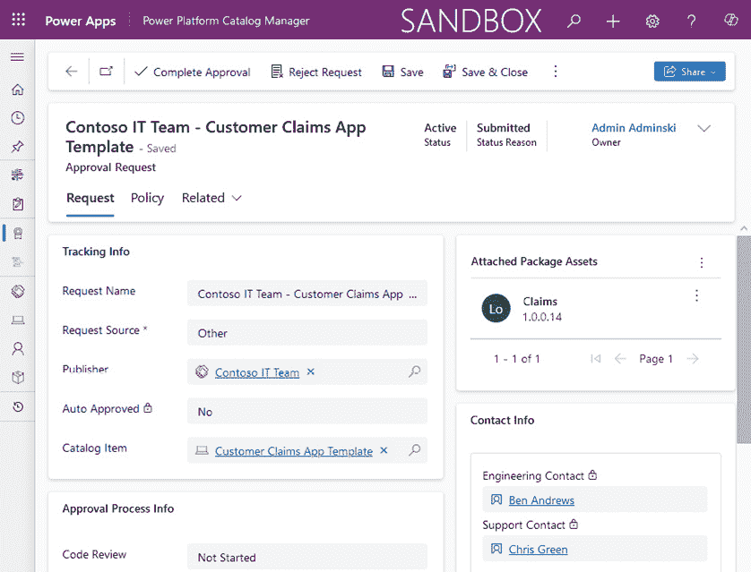

<st c="35604">图 9.4 – 提交的目录项的批准请求</st>

<st c="35661">一旦目录项获得批准，它将被存储在目录中，可以通过访问目录管理器并导航到</st> **<st c="35796">目录项</st>**<st c="35809">找到它。</st> 出版商也将显示在</st> **<st c="35846">目录出版商</st>** <st c="35864">中，工程和支持联系人将被添加到</st> **<st c="35919">联系人</st>** **<st c="35927">信息</st>** <st c="35931">列表中。</st>

<st c="35937">专业开发人员将在目录项详情中找到一个便捷的属性</st> <st c="35985">，该属性提供一个</st> **<st c="36033">代码库</st>** <st c="36048">链接，您可以在目录项的</st> **<st c="36081">链接和法律</st>** <st c="36096">部分找到它。</st> <st c="36126">这使我们能够告知专业开发人员源代码的位置，这仅仅是之前提到的 InnerSource 方法论的进一步完善，因为现在专业开发人员也可以审查代码并参与到</st> <st c="36336">开发过程中。</st>

### <st c="36356">示例 – 从目录安装目录项</st>

<st c="36409">现在我们进入目录过程的发现阶段</st> <st c="36450">。</st> <st c="36475">在此阶段，应用开发者或专业开发人员会审查目录，或使用 PAC CLI 通过</st> `<st c="36607">pac catalog list</st>` <st c="36623">命令列出给定目录中的任何目录项。</st> <st c="36633">这将返回环境中的所有目录项。</st> <st c="36687">我们还可以使用</st> `<st c="36703">--catalog-item-name</st>` <st c="36722">或</st> `<st c="36726">--catalog-item-id</st>` <st c="36743">作为附加的搜索机制，通过名称</st> <st c="36823">或 ID 仅查找特定的目录项。</st>

<st c="36829">一旦我们审查了目录项并决定在开发环境中测试它们，我们可以使用</st> `<st c="36970">pac catalog install --catalog-item-id <catalog-item-id> --environment <your environment guid or absolute https URL></st>`<st c="37085">进行安装。这将把我们带入目录过程的最后阶段，</st> <st c="37144">称为获取阶段。</st>

<st c="37163">请记住，如果我们计划在另一个环境中安装目录项，我们需要在该环境中安装目录管理器</st> <st c="37311">。</st>

<st c="37319">一旦我们运行该命令，我们将获得类似</st> <st c="37372">这样的输出：</st>

```
 PS E:\PACKT\CH9> pac catalog install -env https://<orgid>.crm.dynamics.com/ -cid 1cd8fe87-f508-51ad-8dcd-d12dda7d8668
Connected as <user@domain>
Connected to... <your environment name>
Tracking ID for this installation is 34f8e610-a7e4-ee12-904d-000d3a1d5312
```

<st c="37639">要使用 UI 发现、查看和安装可用的目录项，应用程序开发者还可以前往 Power Apps 或 Power Automate 并点击</st> **<st c="37776">更多</st>** <st c="37780">|</st> **<st c="37783">目录</st>** <st c="37790">在左侧导航栏中（请注意，这项功能当前处于公开预览阶段）。</st> <st c="37888">这将打开</st> **<st c="37907">目录</st>** <st c="37914">区域，在此我们可以在租户的一个或多个目录中搜索所有可用的目录项。</st> <st c="38018">在这里，我们将找到所有可重复使用的已发布目录项以及关于个人活动的信息，包括获取目录项或提交新</st> <st c="38166">目录项。</st>

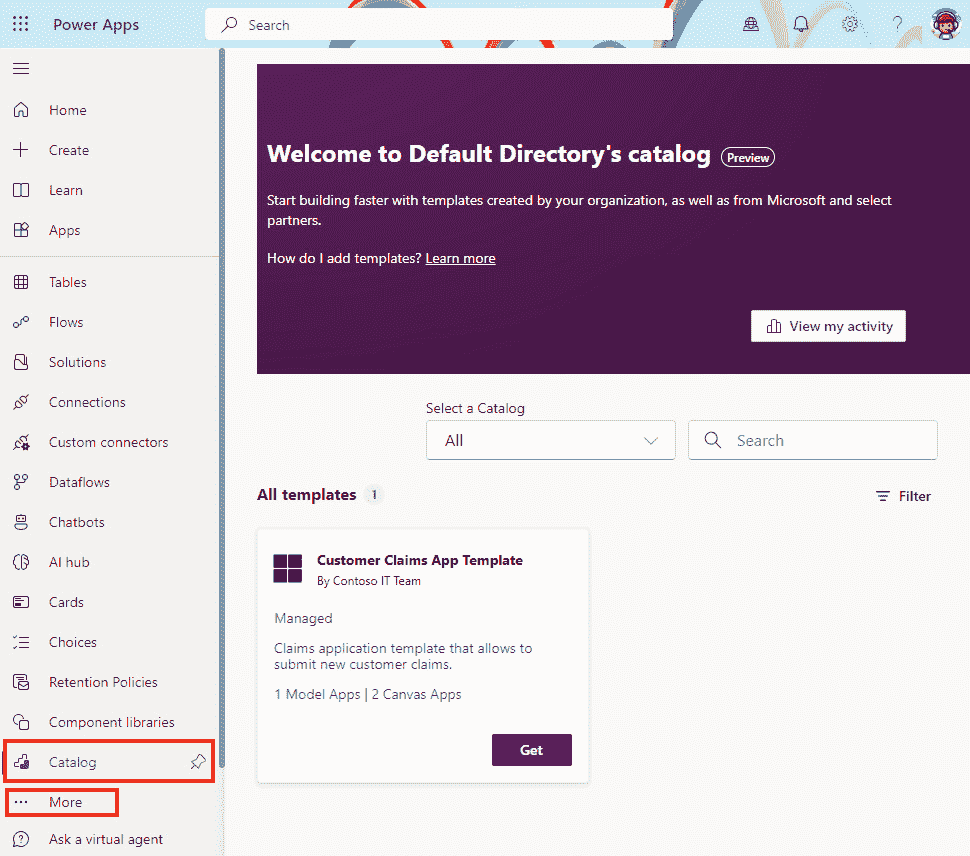

<st c="38757">图 9.5 – Power Apps 中的目录区域</st>

<st c="38796">我们可以继续使用</st> **<st c="38825">获取</st>** <st c="38828">按钮，为我们希望在当前环境中安装的每个目录项，按照安装向导进行操作，并完成</st> <st c="38968">安装过程。</st>

<st c="38989">现在，无论是通过 UI 还是 PAC CLI 安装的该项，我们都可以使用这个新组件。</st> <st c="39090">如果该解决方案作为未管理的形式部署到开发环境，并计划进一步开发它，我们可以继续按照我们的需求进行开发，然后遵循 ALM 流程将其部署到生产环境中，带着</st> <st c="39342">创建的更改。</st>

<st c="39358">别忘了，目录</st> <st c="39392">过程是持续的，涉及到将开发和部署到目录中以便进一步重用。</st> <st c="39489">作为开发人员，我们将在开发阶段花费更多时间，所以让我们来探索一些开发人员在使用 Visual Studio 时可以在</st> <st c="39649">Power Platform 中使用的附加工具。</st>

## <st c="39664">开发人员使用 Visual Studio 的附加工具</st>

<st c="39716">从工具的角度来看，公民开发者</st> <st c="39765">专注于使用低代码/零代码</st> <st c="39797">开发工具，如 Microsoft Power Platform。</st> <st c="39851">尽管专业开发者在可能的情况下也应该使用与公民开发者相同的低代码/零代码工具，但集成和自定义组件则需要自定义编码，针对这些需求，IDE 如 Visual Studio 或 VS Code 将被使用。</st> <st c="40088">一些开发者工具已经在前面的章节中提到并使用过，例如 Power Platform CLI 和 Power Platform Build Tools，结合 Azure DevOps 和 GitHub。</st> <st c="40275">与 VS Code 的 Power Platform Tools 扩展类似，编写代码的 Visual Studio 开发者可以安装 Visual Studio 的 Power Platform Tools 扩展。</st>

<st c="40442">Visual Studio 的 Power Platform Tools 扩展可以在 Visual Studio Marketplace 中找到，类似于我们在</st> *<st c="40571">第二章</st>* <st c="40580">中描述的 VS Code。</st> <st c="40594">作为安装的前提条件，我们需要至少拥有 Visual Studio 2019 或更高版本，并且需要 .NET Framework 4.6.2，如果我们希望构建插件或</st> <st c="40751">工作流活动。</st>

<st c="40771">我们可以从 Visual Studio Marketplace 安装扩展（</st>[<st c="40833">https://marketplace.visualstudio.com</st>](https://marketplace.visualstudio.com)<st c="40870">）或在 Visual Studio 中安装：在顶部菜单栏中，点击</st> `<st c="41124">Power Platform</st>` <st c="41138">在搜索栏中，点击</st> **<st c="41167">下载</st>**<st c="41175">。当下载完成后，我们必须重启 Visual Studio，以完成计划中的扩展安装</st> <st c="41277">。</st>

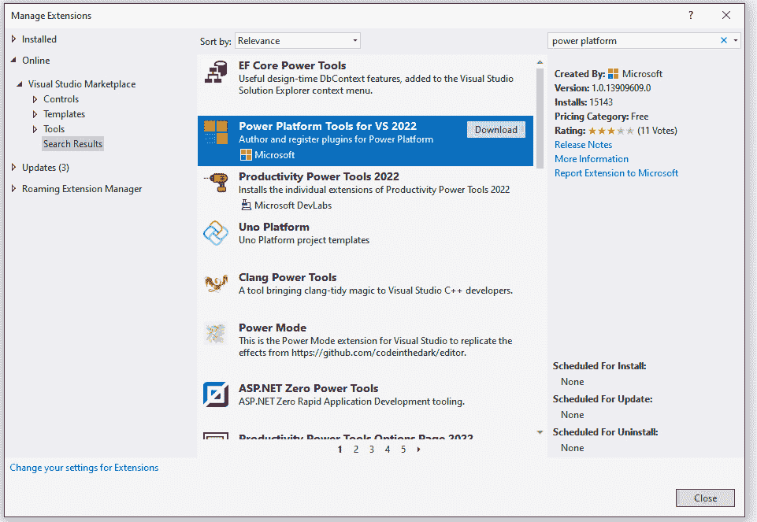

<st c="42312">图 9.6 – 为 Visual Studio 安装扩展</st>

<st c="42367">卸载可以像安装一样</st> <st c="42394">以类似的方式进行。</st> <st c="42429">进入</st> **<st c="42435">扩展</st>** <st c="42445">|</st> **<st c="42448">管理扩展</st>**<st c="42465">。这时，选择</st> **<st c="42485">已安装</st>** <st c="42494">在左侧导航栏中，找到 Power Platform Tools 扩展，然后</st> <st c="42568">点击</st> **<st c="42574">卸载</st>**<st c="42583">。</st>

<st c="42584">扩展只有在我们使用 Power Platform 项目模板创建新项目或打开一个已经包含至少一个使用 Power Platform</st> <st c="42798">Tools 模板创建的项目时才会可见。</st>

<st c="42813">我们还可以在首次连接到 Dataverse 环境后显示</st> **<st c="42831">Power Platform Explorer</st>** <st c="42854">。</st> <st c="42908">我们可以通过在顶部菜单栏中选择</st> **<st c="42936">工具</st>** <st c="42941">，然后点击</st> **<st c="42980">连接到 Dataverse…</st>**<st c="42988">。</st>

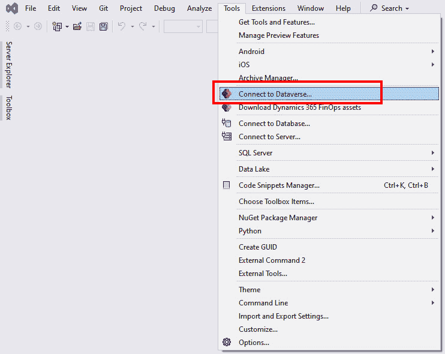

<st c="43404">图 9.7 – 从 Visual Studio 连接到 Dataverse</st>

<st c="43459">这将打开一个新的向导</st> <st c="43487">窗口，我们将在其中使用我们的用户身份验证连接到 Dataverse 环境。</st> <st c="43567">对于登录部署类型，我们选择</st> **<st c="43608">Office 365</st>** <st c="43618">，因为这将允许我们使用 Microsoft Entra ID 作为身份验证提供者。</st> <st c="43702">一旦我们通过用户身份验证，我们将被提示选择将要操作的解决方案。</st>

<st c="43811">如果所有步骤都成功完成，Power Platform Explorer</st> <st c="43876">应出现在我们面前，并连接到所选解决方案所在的环境。</st> <st c="43976">现在我们有机会探索我们的环境，并将插件添加到选定的表格中，注册 Webhooks，添加工作流活动等等。</st> <st c="44119">请注意，对于开发自定义工作流活动，我们需要安装</st> **<st c="44200">Windows Workflow Foundation</st>**<st c="44227">。可以通过 Visual Studio 安装程序安装，方法是选择</st> **<st c="44296">修改</st>** <st c="44302">我们用于开发的 Visual Studio 版本。</st> <st c="44368">在安装程序中，打开修改安装的窗口。</st> <st c="44434">在这里，我们选择</st> **<st c="44450">单个组件</st>** <st c="44471">并搜索 Windows Workflow Foundation。</st> <st c="44520">我们选择它并点击</st> **<st c="44543">修改</st>**<st c="44549">，这将下载并安装该功能。</st>

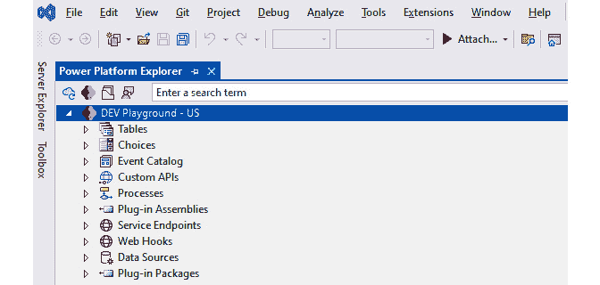

<st c="44863">图 9.8 – Power Platform Explorer</st>

<st c="44899">Power Platform Tools for Visual Studio 提供了一套项目模板，使我们能够使用 C# 编程语言开发前述的 Power Platform 插件、定制工作流活动、解决方案模板和用于将解决方案和自定义代码库部署到我们的</st> <st c="45202">Dataverse 环境的包。</st>

<st c="45224">使用 Visual Studio 开发后端 API 的开发者，还可以通过</st> <st c="45274">“连接服务”</st> <st c="45303">扩展 Visual Studio 的功能，以便在 Power Platform 中创建自定义连接器。</st> <st c="45420">为了利用此功能，我们需要至少使用 Visual Studio 2022，版本 17.7，并安装 ASP.NET 和 Web 开发工作负载。</st> <st c="45577">目前，这项功能在 Visual Studio for Mac 中尚未启用。</st> <st c="45661">我们的 API 应该作为 ASP.NET Core Web</st> <st c="45712">API 项目进行开发。</st>

<st c="45724">我们将在</st> *<st c="45828">第十章</st>*<st c="45838">中进一步讨论自定义连接器、代码组件以及专业开发人员的扩展性。</st>

<st c="45839">现在我们已经准备好了所有工具，接下来可以看看 Power Platform 如何与</st> <st c="45935">Azure 服务集成。</st>

# <st c="45950">微软 Azure 和 Power Platform 携手合作</st>

<st c="45994">本节将重点介绍与 Power Platform 集成场景中最常用的 Azure 服务。</st> <st c="46118">我们将这些服务分为按其提供的功能进行分组，并简要描述了它们。</st> <st c="46234">对于每个工作负载，我们提供了如何将 Azure 服务与</st> <st c="46319">Power Platform 配合使用的示例。</st>

<st c="46334">作为云平台，微软 Azure 使我们能够在云中运行不同的工作负载，例如将我们的应用完全托管在 Azure 中，或者将本地应用与 Azure 服务进行扩展和连接。</st> <st c="46379">正如我们在前面的章节中看到的，当组织在现代化他们的应用或构建新应用时，他们总是有机会选择使用低代码/无代码开发方法来现代化现有应用或构建新应用。</st> <st c="46552">然而，很多时候，场景过于复杂，需要团队作为融合团队来合作，在这个团队中，专业开发人员专注于使用 Azure 提供的服务来开发复杂的场景。</st> <st c="46987">Azure 提供的服务。</st>

<st c="47002">微软 Azure 提供了丰富的云计算服务，可以覆盖从计算服务、网络、存储、Web 服务等多个复杂场景。</st> <st c="47170">让我们来看看一些与 Power Platform 广泛集成的 Azure 服务。</st> <st c="47253">我们无法涵盖所有服务，因为选择太多，因此我们建议你访问</st> <st c="47357">Azure</st> **<st c="47371">产品</st>** <st c="47379">网页，进一步了解这些服务：</st> [<st c="47414">https://azure.microsoft.com/en-us/products</st>](https://azure.microsoft.com/en-us/products)<st c="47456">。</st>

## <st c="47457">应用程序托管服务</st>

<st c="47486">Azure 提供了广泛的服务，可以托管应用程序。</st> <st c="47514">这些服务有不同的用途，从可以运行 Spring Boot 应用程序的服务到容器托管服务，再到多用途 Web 托管服务，如 Azure</st> <st c="47728">App Service：</st>

+   **<st c="47740">Azure App Service</st>** <st c="47758">是一项托管服务，允许</st> <st c="47791">我们托管 Web 应用程序，Web API 和移动后端。</st> <st c="47852">由于它是托管的 PaaS 服务，云提供商负责维护操作系统和基础设施，而我们专注于构建应用程序。</st> <st c="48027">它是一个可扩展的企业级服务，允许根据负载自动缩放应用程序，同时保持高度</st> <st c="48172">的安全性。</st>

+   **<st c="48184">Azure Container Apps</st>** <st c="48205">是一个无服务器平台，专为运行</st> <st c="48246">容器化应用程序而设计。</st> <st c="48275">与</st> **<st c="48287">Azure Kubernetes Service</st>** <st c="48311">(</st>**<st c="48313">AKS</st>**<st c="48316">)相比，后者是一个托管的 Kubernetes 集群，需要我们管理连接到 AKS 集群的节点。而 Azure Container Apps 则提供了一个完全托管的 Kubernetes 服务，可以自动扩展我们的应用工作负载，而无需管理</st> <st c="48568">基础设施。</st>

<st c="48587">让我们来看一个 Power Platform</st> <st c="48618">集成示例。</st> <st c="48640">前面提到的两种服务用于运行前端应用程序或后端 API 端点。</st> <st c="48747">我们可以使用它们来运行后台处理作业或构建并运行我们的 Web API。</st> <st c="48831">当我们选择容器作为打包和部署选项时，还可以将我们的微服务部署到 Azure Container Apps 或类似的 Azure 容器运行服务上。</st> <st c="49006">这些 API 将通过 Azure API Management 安全地公开，并作为我们</st> <st c="49107">自定义连接器的后端。</st>

## <st c="49125">集成服务</st>

<st c="49146">Azure 集成服务是一组 Azure</st> <st c="49191">服务，允许组织构建连接不同系统和应用程序的解决方案。</st> <st c="49303">它们可以用于提供高度安全的消息平台，构建 ETL 流程和执行数据转换，或通过 API 安全地公开后端系统供内部和</st> <st c="49489">外部使用：</st>

+   **<st c="49502">Azure API 管理</st>** <st c="49523">(</st>**<st c="49525">Azure APIM</st>**<st c="49535">) 使组织能够管理 API 并将它们暴露给其他应用程序，</st> <st c="49585">使得这一过程既快捷又安全。</st> <st c="49634">它由三个组件构成：网关、开发者门户和管理员管理面板。</st> <st c="49728">后台应用程序和数据可以驻留在 Azure 或其他环境中（包括本地环境），同时为客户端提供一个前门，</st> <st c="49963">该前门可以将请求路由到后台，同时保持对请求和响应流的控制。</st>

    **<st c="49977">Power Platform 集成示例</st>**<st c="50012">：一旦我们准备好了 API，通过 Azure APIM 将它们暴露出来</st> <st c="50072">使我们能够快速在 Power Platform 中创建自定义连接器。</st> <st c="50139">自定义连接器将用于我们的应用程序</st> <st c="50190">或流程。</st>

+   **<st c="50199">Azure Functions</st>** <st c="50215">是一个事件驱动的无服务器计算平台，允许开发人员使用</st> <st c="50294">事件驱动的触发器和绑定将函数连接到其他服务并执行应用程序逻辑。</st> <st c="50403">由于它是一个无服务器平台，云基础设施的管理由云提供商和平台承担，</st> <st c="50539">因此无需担心管理开销。</st> <st c="50816">Azure Functions 通常用于需要处理数据的场景（例如响应事件、数据库更改或读取存储在 Azure Service Bus 中的请求），</st> <st c="50539">或者当从不同的 IoT 流中捕获数据并需要实时处理时。</st>

    **<st c="50826">Power Platform 集成示例</st>**<st c="50861">：Azure Functions 用于处理存储在数据存储中的数据，包括 Dataverse。</st> <st c="50907">它允许通过 REST 端点实现 Web API，执行特定的复杂逻辑。</st> <st c="50961">这些 API 可以通过自定义连接器与我们的 Power Platform 解决方案连接，执行 API 操作。</st>

+   **<st c="51165">Azure Service Bus</st>** <st c="51183">是一个异步消息传递云平台，</st> <st c="51219">它允许我们创建可靠的消息传递解决方案。</st> <st c="51283">它的设计目标是实现应用程序解耦并构建</st> <st c="51344">可扩展的系统。</st>

    **<st c="51361">Power Platform 集成示例</st>**<st c="51396">：它使我们能够在应用程序和后台服务之间启用异步通信，从而将应用程序和服务彼此解耦。</st> <st c="51456">通过在 Power Platform 中使用 Service Bus 连接器，我们可以执行诸如发送或接收消息</st> <st c="51670">到/从队列的操作。</st>

+   **<st c="51685">Azure Logic Apps</st>** <st c="51702">是一个云平台，用于创建</st> <st c="51732">和运行自动化工作流，类似于 Power Automate，但更侧重于专业开发人员和 IT 专业人士。</st> <st c="51848">它具有 Power Automate 没有的一些独特功能，比如利用 Visual Studio 和 VS Code 通过扩展来开发和审查工作流</st> <st c="52016">代码。</st>

    **<st c="52029">Power Platform 集成示例</st>**<st c="52064">：它可以用于自动化与 Azure 相关的任务或更</st> <st c="52121">复杂的流程，这些流程不一定与 Power Platform 解决方案相关。</st> <st c="52186">我们可以构建自定义连接器，连接到 Logic Apps 工作流，并通过 Power Automate 或</st> <st c="52328">Power Apps 中的自定义连接器运行该工作流。</st>

## <st c="52339">数据分析</st>

<st c="52354">Azure 提供了一套数据分析</st> <st c="52391">服务，帮助我们获取存储在任何地方的数据洞察，支持来自 IoT 设备的实时数据流，处理遥测数据的摄取，</st> <st c="52547">等等：</st>

+   **<st c="52556">Azure Event Hubs</st>** <st c="52573">为集成提供了一个共同的点</st> <st c="52610">，适用于应用程序需要响应实时事件的场景。</st> <st c="52699">它允许从不同来源摄取实时事件数据。</st> <st c="52771">在处理 IoT 场景或应用程序监控时，使用它非常常见。</st> <st c="52858">由于 Power Platform 包含了 Azure Event Hubs 的连接器，我们可以更容易地构建集成。</st>

    **<st c="52960">Power Platform 集成示例</st>**<st c="52995">：当 IoT 设备将数据发送到 IoT Hub 时，数据会被</st> <st c="53054">Azure Functions 处理并发送到 Azure Event Hubs。</st> <st c="53114">当事件在 Event Hubs 中可用时，Power Automate 流程会被触发并执行</st> <st c="53205">相应的逻辑。</st>

+   **<st c="53215">Microsoft Fabric</st>** <st c="53232">是一个统一的分析平台</st> <st c="53271">，连接了如 Azure Data Factory、Azure Synapse Analytics 和 Power BI 等工具。</st> <st c="53368">Fabric 包括</st> <st c="53383">一个多云数据湖，称为 OneLake，它位于上述 Fabric 工具下方，帮助消除数据孤岛。</st> <st c="53506">OneLake 作为一个单一的存储系统，允许组织将来自不同数据源的数据结合起来，包括 Dynamics 365 数据。</st> <st c="53644">一旦数据被表示在 OneLake 中，组织就可以在</st> <st c="53739">Microsoft Fabric 中执行不同类型的分析。</st>

    **<st c="53756">Power Platform 集成示例</st>**<st c="53791">：最近，Power Platform 引入了与 Microsoft Fabric 的 Dataverse</st> <st c="53842">集成。</st> <st c="53877">它开启了将 Dataverse 连接到 Fabric 的可能性，使用</st> **<st c="53938">Link to Fabric</st>**<st c="53952">，以及一个将 Fabric</st> <st c="53981">连接到 Dataverse 的场景，利用虚拟表。</st> <st c="54031">Link to Fabric 允许组织将数据保留在 Dataverse 中，同时启用 Fabric 中的分析功能，以发现数据中的洞察。</st> <st c="54178">这些洞察可以以虚拟表的格式返回到 Dataverse，这使得开发人员能够在业务流程中利用这些发现。</st> <st c="54329">与之前数据停留在 Dataverse 中类似，在这里，数据驻留在</st> <st c="54398">OneLake 中。</st>

## <st c="54409">AI 服务</st>

**<st c="54421">Azure AI 服务</st>** <st c="54439">是一组 REST API 和客户端库 SDK</st> <st c="54486">，使专业开发人员能够使用预构建和可定制的 AI 模型创建智能应用，这些模型具有自然语言理解、语音能力、视觉能力等认知功能。</st> <st c="54724">Azure AI 服务是如 Azure OpenAI、Azure AI 搜索、视觉、语音等服务的总称。</st> <st c="54826">以及更多服务。</st>

<st c="54835">让我们来看一个 Power Platform 集成的示例。</st> <st c="54888">尽管 Power Platform 包括 AI Builder，利用了一些预构建的模型，Azure AI 服务提供了额外的功能，例如集成语音转文本和文本转语音功能，或者利用其他 AI 模型</st> <st c="55124">在我们的</st> <st c="55132">业务应用中。</st>

## <st c="55154">数据存储</st>

**<st c="55167">Azure SQL 数据库</st>** <st c="55186">是一个完全托管的关系型数据库。</st> <st c="55227">它是 Azure SQL 的 PaaS 部署，支持</st> <st c="55276">超大规模（无限的数据库存储）和自动扩展。</st> <st c="55334">由于许多组织已经在使用 SQL Server 作为他们的数据库系统，这样的选项使他们能够现代化其数据库，并消除管理</st> <st c="55506">基础设施的需求。</st>

<st c="55525">让我们来看一个 Power Platform 集成的示例。</st> <st c="55578">Power Platform 根据客户的数据需求提供支持。</st> <st c="55641">这就是为什么 Power Platform 中有超过 1,000 个连接器，其中之一也是用于连接 SQL 服务器。</st> <st c="55774">这使我们能够构建连接到现有</st> <st c="55850">数据源的应用和流程。</st>

Azure 提供了额外的数据库服务。根据项目的需求，我们可以使用其他关系型数据库，如 PostgreSQL、MySQL 或 MariaDB，或者非关系型数据库服务，如 Cosmos DB。对于这些数据服务中的每一项，都有一个连接器，我们可以使用它来构建我们的自动化流程或业务应用程序，利用现有的数据库。

上述服务只是 Azure 所提供的众多选项中的一小部分。在规划项目时，请咨询具有云计算知识的解决方案架构师或企业架构师，以确定哪些服务最适合计划中的项目。

# Azure 和 Power Platform 集成场景示例

本节聚焦于一个实践案例，展示了融合团队如何协同工作。该案例展示了通过使用自定义连接器和 Azure 服务（如 Azure API 管理）将 Power Platform 与 Azure 连接起来。

本章中的示例聚焦于将用 C# 编程语言编写的 Web API 模板与 Power Platform 作为自定义连接器集成，使用 Visual Studio 2022。我们在上一章中已经安装了 Power Platform 工具在 Visual Studio 2022 中。本示例将展示如何通过现代工具，帮助专业开发者构建和测试支持 Power Apps 业务应用程序的 Web API。Web API 将部署到 Azure 服务并通过 Azure API 管理进行暴露。

在这里，我们将介绍两种创建自定义连接器的方法：一种是借助 Visual Studio 2022，另一种是借助 Azure API 管理。

一旦创建了自定义连接器，我们的公民开发者就可以在 Power Platform 中使用这些操作来开发他们的业务解决方案。

下一章将重点介绍 Power Platform 各个组件的 ALM 流程，因此在这里我们将展示融合开发方法的概念。

让我们先从创建 Web API 开始。

## 使用 Visual Studio 2022 创建 Web API 和 Power Platform 自定义连接器

<st c="57951">我们将戴上专业开发者的</st> <st c="57984">帽子，并使用</st> <st c="58021">Visual Studio 2022 中的 ASP.NET Core Web API 模板创建我们的示例 API。</st> <st c="58079">我们这样做是为了展示专业开发者在融合开发团队中使用 Visual Studio 开发项目时所获得的能力，该项目主要部署在 Power</st> <st c="58263">Platform 服务上。</st>

<st c="58281">当 Visual Studio 启动时，它会欢迎我们进入一个窗口，在这个窗口中，我们可以通过点击</st> `<st c="58529">web api</st>`<st c="58536">来创建一个新项目，选择 C# 语言中的</st> **<st c="58549">ASP.NET Core Web API</st>** <st c="58569">模板，然后点击</st> **<st c="58609">Next</st>**<st c="58613">，如以下图所示：</st>

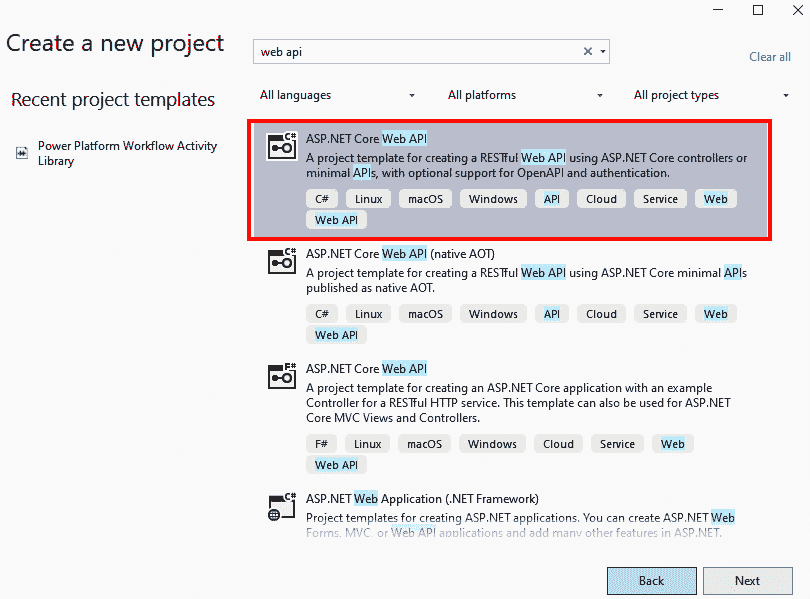

<st c="59634">图 9.9 – 创建一个新的 Web API 项目</st>

<st c="59677">在接下来的</st> <st c="59689">界面中，我们将</st> <st c="59705">提供我们的</st> `<st c="60167">GET</st>` <st c="60170">操作，名为</st> `<st c="60189">WeatherForecast</st>`<st c="60204">，它已经是</st> <st c="60231">模板的一部分。</st>

<st c="60244">作为 DevOps 经验的一部分，我们的任务是对代码进行版本控制，这意味着我们要么在 Azure DevOps 或 GitHub 上创建一个新项目，要么使用现有项目来进行这一部分工作，然后将我们的代码提交到代码库，并进行首次提交。</st> <st c="60530">我们在</st> `<st c="60565">main</st>` <st c="60569">分支上启用分支保护，并配置其他策略，正如我们在前面的章节中学到的那样。</st> <st c="60648">此时，我们的 API 开发者可以按照 DevOps</st> <st c="60754">最佳实践继续他们的工作。</st>

<st c="60769">回到我们的示例，我们可以测试新创建的项目，或者继续开发并删除现有的</st> `<st c="60889">WeatherForecast</st>` <st c="60904">操作，继续开发业务项目要求的 API 操作。</st>

<st c="61030">当我们想测试</st> <st c="61052">已开发的 API 时，我们可以简单地按下</st> *<st c="61089">F5</st>* <st c="61091">键启动调试过程，或者前往顶部导航栏，展开</st> **<st c="61185">调试</st>**<st c="61190">，并选择</st> **<st c="61203">开始调试</st>** <st c="61218">以在浏览器中启动我们的 API。</st> <st c="61251">这将打开 Swagger UI，显示我们的 Swagger 文件，其中包含 Web API 中所有存在的操作。</st> <st c="61362">Swagger 提供了一种方便的方式来设计、文档化并使用我们的 API。</st> <st c="61438">它使用</st> **<st c="61446">OpenAPI</st>** <st c="61453">规范，并提供了一组开源和商业工具来处理 Swagger 文件，该文件采用 JSON 格式描述我们的 API 操作。</st> <st c="61501">OpenAPI 定义在创建自定义连接器时也被 Power Platform 使用</st> <st c="61611">，并且它必须采用 OpenAPI 2.0（之前称为</st> <st c="61756">Swagger）格式。</st>

<st c="61772">当我们准备好 API，并希望在 Power Apps 应用程序或 Power Automate 流程中测试它时，我们可以将 Power Platform 添加为连接的服务。</st> <st c="61934">这样，Visual Studio 将自动为我们在 Power Platform 中创建一个自定义连接器。</st> <st c="62029">为此，我们前往 Visual Studio 中的 Web API 项目。</st> <st c="62090">在</st> **<st c="62097">解决方案资源管理器</st>**<st c="62114">中，我们展开项目，以便看到</st> **<st c="62165">连接的服务</st>** <st c="62183">|</st> **<st c="62186">添加</st>** <st c="62189">|</st> **<st c="62192">Microsoft Power Platform</st>**<st c="62216">。这将打开一个新标签页，并显示在</st> **<st c="62258">连接的服务</st>** <st c="62276">部分，出现一个</st> **<st c="62289">连接到 Microsoft Power</st>** **<st c="62316">平台</st>** <st c="62324">的窗口：</st>

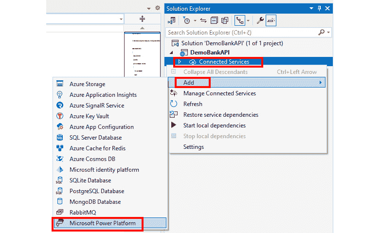

<st c="62796">图 9.10 – 将 Power Platform 添加为连接的服务</st>

<st c="62854">这个新窗口包含所有用于创建新自定义连接器的参数。</st> <st c="62920">在创建之前，我们需要确保已经登录。</st> <st c="62984">如果没有，在右上角，我们可以登录并提供正确的用户凭据。</st> <st c="63079">身份验证通过后，我们选择一个 Power Platform 环境，将自定义连接器部署到其中。</st> <st c="63195">在</st> **<st c="63202">Power Platform 解决方案</st>** <st c="63226">下拉菜单中，我们选择要部署连接器的解决方案。</st>

<st c="63300">接下来，我们连接</st> <st c="63317">到自定义</st> <st c="63331">连接器。</st> <st c="63343">在我们的案例中，由于我们第一次创建它，因此我们将点击</st> **<st c="63412">+</st>** <st c="63413">(加号图标)来创建一个新的自定义连接器。</st> <st c="63464">我们将勾选</st> **<st c="63478">自动生成 OpenAPI V2 规范</st>** <st c="63520">，以便 Visual Studio 为我们生成 OpenAPI 定义。</st> <st c="63584">最后，我们将通过点击</st> **<st c="63609">+</st>** <st c="63626">（加号图标）创建一个</st> **<st c="63639">公共开发隧道</st>** <st c="63640">，点击</st> **<st c="63661">选择公共开发隧道</st>**<st c="63691">，该隧道将用于在自定义连接器与我们实例中的</st> <st c="63784">Visual Studio 之间进行调试。</st>

<st c="63798">开发隧道</st>

<st c="63809">Visual Studio 中的开发隧道提供了一种快速、安全的方式来测试互联网中的 Web API。</st> <st c="63908">在我们的案例中，Power Platform 服务将创建一个连接，连接我们本地运行 Visual Studio 的机器和一个使用自定义连接器的 Power Platform 服务（即使用自定义连接器的 Power Apps 应用程序）。</st> <st c="64168">这种方法旨在为开发和测试目的创建临时连接，不适用于</st> <st c="64274">生产工作负载。</st>

<st c="64295">以下截图展示了</st> <st c="64326">我们如何在连接到 Microsoft Power Platform 后创建一个公共开发隧道。</st> <st c="64353">当我们点击</st> **<st c="64432">下一步</st>**<st c="64436">时，我们会看到</st> **<st c="64453">更改摘要</st>** <st c="64471">页面，通知我们将在 Microsoft Power Platform 中创建一个自定义连接器。</st> <st c="64566">我们通过点击</st> **<st c="64594">完成</st>**<st c="64600">来确认这一操作。该过程将构建我们的项目，配置开发隧道，生成 Swagger JSON 文件（OpenAPI 规范文件），并在我们选择的 Power</st> <st c="64773">Platform 环境中创建一个自定义连接器：</st>

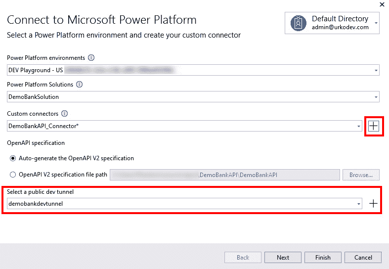

<st c="65285">图 9.11 – 创建自定义连接器</st>

<st c="65326">现在开发隧道和自定义连接器已创建，如果我们现在运行我们的 API（通过按下</st> *<st c="65420">F5</st>* <st c="65422">或点击</st> **<st c="65438">调试</st>** <st c="65443">|</st> **<st c="65446">开始调试</st>**<st c="65461">），我们将看到 Visual Studio 使用</st> *<st c="65509">开发隧道</st>* <st c="65520">功能，并将我们的 Web API 暴露到公共端点，通知也会在 Web 浏览器中弹出，告知我们这一点。</st> <st c="65670">确认后，开发隧道建立成功，我们可以在 Power Platform 中使用这个自定义连接器，它现在已连接到我们的 Visual Studio 开发环境。</st> <st c="65834">这是调试我们的 Web API 和自定义连接器的非常便捷的方法。</st> <st c="65912">我们现在可以在任何 Power Apps 应用程序或其他 Power Platform 服务中使用这个自定义连接器，并在 Visual Studio 中的 Web API 源代码中设置断点进行调试。</st> <st c="66111">一旦 API 操作被执行，我们就能在 Visual Studio 中看到调试引擎已触发我们设置的断点。</st> <st c="66232">这将帮助我们继续进行</st> <st c="66272">调试/测试过程。</st>

<st c="66298">作为一名公民开发者</st> <st c="66321">或应用程序开发者，我们现在可以</st> <st c="66349">在 Power Apps 中看到新创建的自定义连接器。</st> <st c="66404">导航到</st> **<st c="66416">Power Automate</st>** <st c="66430">或</st> **<st c="66434">Power Apps</st>**<st c="66444">。可以点击左侧导航栏中的**<st c="66462">解决方案</st>** <st c="66471">，并打开用于从 Visual Studio 部署自定义连接器的解决方案，或者进入</st> **<st c="66595">自定义连接器</st>** <st c="66612">并找到我们的自定义连接器，然后点击</st> **<st c="66653">编辑</st>** <st c="66657">(铅笔图标)：</st>

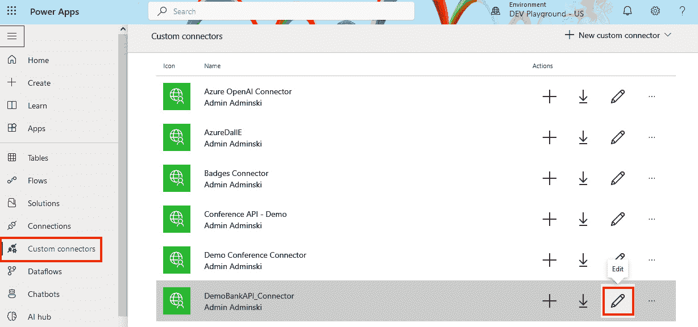

<st c="67132">图 9.12 – 打开自定义连接器定义</st>

<st c="67185">我们可以看到 API 操作定义中的主机和 URL 正指向</st> <st c="67283">开发隧道（dev tunnel）。</st>

<st c="67294">我们可以在 Power Platform 中创建 Power Apps 应用程序、流或其他任何内容，并利用自定义连接器。</st> <st c="67412">只要 Visual Studio 中的开发隧道连接处于活动状态，我们的自定义连接器就能够获取我们将要调用的 API 操作的结果。</st> <st c="67583">使用</st> `<st c="67593">pac connector list</st>` <st c="67611">命令，我们将能够看到所有在 Dataverse 中注册的自定义连接器及其显示名称和 ID。</st> <st c="67723">例如，我们可以使用关于连接器的信息，从 PAC CLI 创建一个示例画布应用。</st> <st c="67831">该应用</st> <st c="67838">是基于</st> <st c="67857">来自自定义连接器的 OpenAI 定义生成的：</st> <st c="67890">自定义连接器示例：</st>

```
 pac canvas create --msapp <new-msapp-file> --connector-id <connector-id>
```

## <st c="67980">使用 Azure APIM 创建 Power Platform 自定义连接器</st>

<st c="68039">让我们继续举例。</st> <st c="68074">假设</st> <st c="68083">我们的专业开发人员</st> <st c="68108">正在推进他们的新 Web API。</st> <st c="68148">他们正在使用 DevOps 原则来构建、测试并将 Web API 部署到测试环境中。</st> <st c="68243">测试环境不同于本地开发机器，因为此环境现在已在 Azure 中进行配置。</st> <st c="68357">为了托管我们的 Web API，我们可以选择 Azure 中提供的众多应用托管服务。</st> <st c="68471">我们将使用 Azure 应用服务，这是一个能够托管</st> <st c="68550">Web API 的 PaaS 服务。</st>

<st c="68559">与 DevOps 最佳实践一样，我们遵循 IaC 方法，并在 Bicep 或 ARM 模板文件中描述环境。</st> <st c="68688">此 IaC 定义文件也在我们的 Azure DevOps/GitHub 仓库中进行版本控制，因此我们可以跟踪更改并对模板文件执行验证检查。</st> <st c="68846">模板文件。</st>

<st c="68860">CI/CD 流水线确保我们的 Web API 作为构件是可部署的，并且我们将其自动部署到新配置的测试环境中。</st> <st c="69013">一旦我们的 API 部署到托管平台，我们就准备好将 Web API 连接到 Azure</st> <st c="69106">API 管理。</st>

<st c="69121">Azure 服务，如 Logic Apps、App Service、Functions 和 Container Apps，提供了 Web API 与 Azure APIM 之间的无缝集成，用于在 APIM 中注册 API。</st> <st c="69299">然而，Azure APIM 也提供了通过提供定义文件（如 OpenAPI、WSDL、OData 和 WADL）来添加 API 的选项。</st> <st c="69424">当然，我们也可以完全从头开始，手动添加 API 的所有属性和操作。</st> <st c="69527">API。</st>

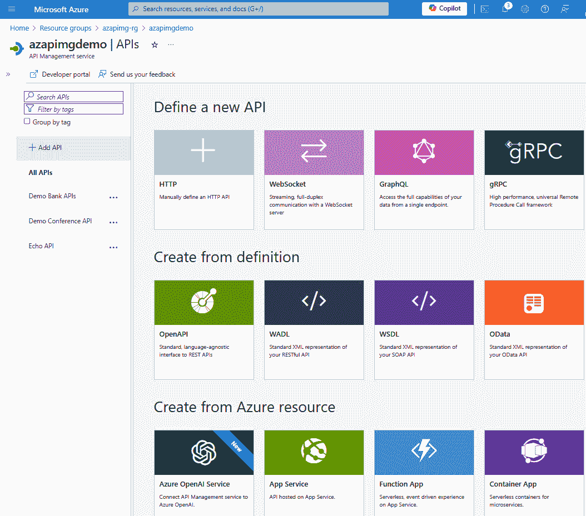

<st c="70529">图 9.13 – 在 APIM 中创建新 API</st>

<st c="70568">APIM 提供了一种便捷的</st> <st c="70595">配置</st> *<st c="70613">模拟响应</st>*<st c="70627">的方式。这有助于加快开发进度，因为专业开发人员</st> <st c="70688">可以将所有操作添加到 Azure APIM 中并模拟响应，而 Power Platform 中的应用开发人员则使用这样的 API 并在 Power Platform 中构建其余服务。</st> <st c="70857">例如，公民开发人员使用已包含所有操作的自定义连接器，但响应是由 APIM 模拟的。</st> <st c="70991">一旦后端 Web API 开发完成并准备好使用，专业开发人员会禁用操作上的模拟响应，将逻辑交由 Web API 执行并返回正确的响应。</st> <st c="71185">另一方面，由公民开发人员开发的前端并不会看到任何差异——只有从 API 返回的数据</st> <st c="71330">有所不同。</st>

<st c="71343">一旦我们的 API 准备好被使用，我们可以直接在 Power Platform 中从</st> <st c="71440">Azure APIM 创建一个连接器：</st>

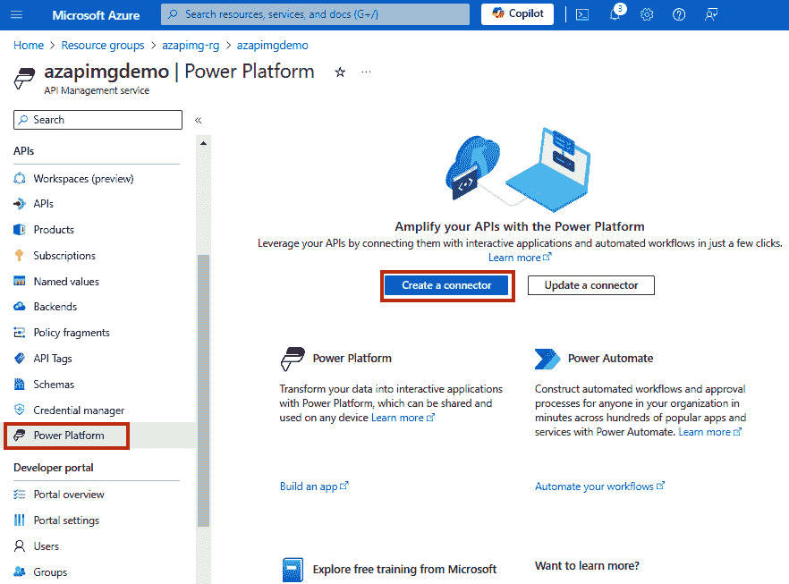

<st c="72427">图 9.14 – 从 Azure APIM 创建自定义连接器</st>

<st c="72484">当我们点击</st> **<st c="72507">创建连接器</st>** <st c="72525">按钮时，接下来的步骤要求我们提供</st> **<st c="72571">API</st>** <st c="72574">名称，该名称将用于</st> <st c="72599">自定义</st> <st c="72614">连接器。</st> <st c="72626">我们需要选择我们正在使用的那个。</st> <st c="72677">接下来，我们需要提供 Power Platform 环境和 API 显示名称，因为这将代表将部署到所选环境的自定义连接器。</st> <st c="72860">一旦我们提供了这些信息，就可以通过点击</st> **<st c="72934">创建</st>** <st c="72940">按钮继续。</st> <st c="72949">之后，一个新的自定义连接器将在选定的 Power Platform 环境中出现，并将准备好供任何 Power Platform 中的应用开发人员使用。</st>

## <st c="73103">将 ALM 应用于自定义连接器</st>

<st c="73137">前面的示例</st> <st c="73160">展示了如何通过 Visual Studio 或 Azure APIM 创建自定义连接器。</st> <st c="73206">然而，如果我们希望使用 CI/CD 流水线将我们的自定义连接器部署到不同的环境，了解如何采用代码优先的方法来操作自定义连接器，并将其部署到不同的目标环境是很有帮助的。</st> <st c="73251">我们将使用 Power Platform CLI 命令来实现</st> <st c="73506">这些目的。</st>

<st c="73570">为了使用 PAC CLI 创建自定义连接器，我们需要获取 API 定义文件并生成支持的属性文件。</st> <st c="73712">API 定义文件是一个 OpenAPI 2.0（Swagger）定义文件，描述了 API 及其操作。</st> <st c="73822">我们可以从头开始创建 Swagger 定义文件，或者从我们在</st> <st c="73953">前一个练习中创建的自定义连接器中获取它。</st>

<st c="73971">与 API 定义文件一起，我们还需要 API 属性文件。</st> <st c="74049">API 属性文件是一个 JSON 文件，包含我们连接器的支持信息，如认证信息、品牌颜色、发布者信息等。</st> <st c="74216">等等。</st>

<st c="74222">可选地，我们可以使用附加文件，如图标文件、脚本文件（CSX 文件）和</st> <st c="74314">设置文件。</st>

<st c="74329">我们可以使用</st> `<st c="74394">pac connector init</st>` <st c="74412">命令从头开始创建一个自定义连接器，并附加其他参数来生成自定义连接器所需的附加文件。</st> <st c="74521">接下来，我们可以看到一个示例，生成一个带有 API 密钥的 API 属性文件，用于验证针对自定义连接器的请求。</st> <st c="74676">它还会生成设置文件、属性文件和脚本文件，所有这些都位于一个单独的</st> `<st c="74761">DemoBankAPI</st>` <st c="74772">文件夹中：</st>

```
 pac connector init --connection-template "ApiKey" --generate-script-file --generate-settings-file --outputDirectory "DemoBankAPI"
```

<st c="74910">如果我们想从之前创建的自定义连接器生成 API 定义文件，可以使用</st> `<st c="75053">pac connector list</st>` <st c="75071">命令获取当前环境中所有连接器的列表及其连接器 ID。</st>

<st c="75184">找到自定义连接器的连接器 ID 信息后，我们可以使用</st> `<st c="75268">pac connector download --connector-id <CONNECTOR-ID></st>` <st c="75320">下载</st> `<st c="75333">apiDefinition.json</st>` <st c="75351">和</st> `<st c="75356">apiProperties.json</st>` <st c="75374">以供所选</st> <st c="75392">自定义连接器使用。</st>

<st c="75409">此时，我们应该已经将文件提交到仓库，以便任何修改都能进行版本控制。</st> <st c="75526">我们将对文件进行更改，以使其反映目标环境的正确值。</st> <st c="75629">这意味着更改</st> *<st c="75653">host</st>* <st c="75657">值，该值是我们自定义连接器指向的端点，以及任何其他</st> <st c="75755">属性值。</st>

<st c="75771">当我们想要在目标</st> <st c="75794">环境中创建自定义连接器时，可以使用简单的</st> `<st c="75859">pac connector create --settings-file .\settings.json</st>` <st c="75911">命令，因为设置文件中已包含有关所有支持文件的信息，以及部署到目标环境的环境值。</st> <st c="76075">接下来，我们可以看到一个示例</st> `<st c="76101">settings.json</st>` <st c="76114">文件：</st>

```
 {
  "connectorId": null,
  "environment": "1f9283b6-deea-eed7-899c-4da273a3f957",
  "apiProperties": "apiProperties.json",
  "apiDefinition": "apiDefinition.json",
  "icon": null,
  "script": "script.csx"
}
```

<st c="76315">在</st> `<st c="76326">settings.json</st>` <st c="76339">以及任何支持文件（如用于身份验证的 API 属性文件）中的值，应该进行更改和参数化，以确保文件中不会硬编码值，而是只使用变量名，这些变量在</st> <st c="76613">CI/CD 流水线</st> <st c="76613">中根据实际值进行更改。</st>

<st c="76629">另一种使用手动定义值的</st> `<st c="76655">create</st>` <st c="76661">命令变体如下：</st>

```
 pac connector create --environment 1f9283b6-deea-eed7-899c-4da273a3f957 --api-definition-file .\apiDefinition.json --api-properties-file .\apiProperties.json
```

<st c="76874">当我们需要更新目标环境中的自定义连接器时，我们应该使用</st> `<st c="76961">pac connector update --</st>``<st c="76984">settings-file .\settings.json</st>`<st c="77014">。</st>

<st c="77015">一旦我们在目标环境中创建了自定义连接器，就可以使用它来测试现有应用程序中的操作，或者使用</st> `<st c="77188">pac canvas create --msapp <new-msapp-file> --connector-id <connector-id></st>`<st c="77260">创建一个新的虚拟应用程序。</st>我们现在准备好</st> <st c="77278">测试我们新部署的</st> <st c="77297">连接器。</st>

# <st c="77316">总结</st>

<st c="77324">本章介绍了采用协作、敏捷和创新方法的重要方面。</st> <st c="77440">组织应该认识到，融合团队可以缩短解决业务挑战的时间，因为这些团队打破了商业用户、专业开发人员和 IT 专业人员之间的传统障碍，通过敏捷的方法</st> <st c="77684">和协同效应。</st>

<st c="77696">组织还应该采纳来自开源开发的最佳实践，这些实践增强了组织内部应用开发者的可能性，因为我们赋予开发者发现和重用已有成果的能力。</st> <st c="77961">与传统软件开发工具类似，Power Platform 提供了支持这一体验的所有工具，如目录管理器和与</st> <st c="78123">Azure 的集成。</st>

<st c="78134">对于已经在 Azure 上注册并在该公共云上运行业务工作负载的组织来说，Azure 集成更加重要。</st> <st c="78290">考虑到集成，我们调查了 Power Platform 如何与</st> <st c="78394">Azure 服务进行连接的一些常见案例。</st>

<st c="78409">我们通过一个专业开发人员在构建 Web API 的示例结束了本章，Web API 将作为 Power Platform 服务的后端使用，并且展示了 Visual Studio 如何促进更快的开发和高效的测试体验。</st> <st c="78651">当 Web API 准备就绪时，我们展示了 Azure APIM 与 Power Platform 服务之间的集成是多么快速和顺畅</st> <st c="78772">。</st>

<st c="78779">下一章将聚焦于 Power Platform 中的专业开发人员扩展性。</st> <st c="78858">我们将继续探索专业开发人员在连接器、代码组件等方面的可能性，并通过可在</st> <st c="79018">DevOps 流程中重用的示例。</st>

# <st c="79033">进一步阅读</st>

+   <st c="79049">InnerSource</st> <st c="79062">基础知识：</st> [<st c="79076">https://resources.github.com/innersource/fundamentals/</st>](https://resources.github.com/innersource/fundamentals/)

+   <st c="79130">在 Microsoft</st> <st c="79164">Fabric 中查看 Dataverse 数据：</st> [<st c="79172">https://learn.microsoft.com/en-us/power-apps/maker/data-platform/azure-synapse-link-view-in-fabric</st>](https://learn.microsoft.com/en-us/power-apps/maker/data-platform/azure-synapse-link-view-in-fabric)

+   <st c="79270">Azure 和 Power Platform 架构</st> <st c="79309">示例：</st> [<st c="79319">https://learn.microsoft.com/en-us/azure/architecture/browse/?products=power-platform</st>](https://learn.microsoft.com/en-us/azure/architecture/browse/?products=power-platform)

+   <st c="79403">Visual Studio 中的开发隧道：</st> [<st c="79434">https://learn.microsoft.com/en-us/connectors/custom-connectors/port-tunneling</st>](https://learn.microsoft.com/en-us/connectors/custom-connectors/port-tunneling)

+   <st c="79511">从 Azure APIM 导出 API 到 Power</st> <st c="79552">Platform：</st> [<st c="79562">https://learn.microsoft.com/en-us/azure/api-management/export-api-power-platform</st>](https://learn.microsoft.com/en-us/azure/api-management/export-api-power-platform)

+   <st c="79642">与 PAC 的自定义连接器</st> <st c="79670">CLI:</st> [<st c="79675">https://learn.microsoft.com/en-us/power-platform/developer/cli/reference/connector</st>](https://learn.microsoft.com/en-us/power-platform/developer/cli/reference/connector)
