# 第十章：在 Power Platform 中启用专业开发人员扩展性

本章重点介绍了 Power Platform 为专业开发人员提供的能力，以扩展在 Power Platform 上构建的业务解决方案的体验。 我们将探讨 Power Platform 如何确保这些扩展选项与 ALM/DevOps 流程的顺利集成，以支持这些组件的软件开发生命周期。 这些组件。

我们将通过了解连接器开始本章内容，并继续研究自定义连接器。 在上一章中，我们展示了专业开发人员如何从 Visual Studio 构建 Web API 并直接部署到 Power Platform；在本章中，我们将探讨使用 PAC CLI 的概念，以确保我们为自定义连接器启用 ALM。 我们还将探讨自定义连接器的其他方面，如环境变量和连接引用，并解释它们在跨不同目标环境移动解决方案时的作用。 目标环境。

之后，我们将讨论 Power Apps 中的 Canvas 组件以及使用它们的主要优势。 接下来，我们将深入研究 Power Platform 的代码组件，特别是 Power Apps 组件框架。 对于 Canvas 组件和代码组件，我们将解释如何将它们包含在 ALM 流程中。

我们将在本章结束时介绍 Power Pages，专业开发人员如何通过自定义代码扩展 Power Pages，以及如何实现 ALM 流程。 实现。

我们将涵盖以下 主要主题：

+   启用集成的力量 – 连接器

+   Canvas 组件概览及 组件库

+   了解 代码组件

+   Power Pages 的 ALM

# 技术要求

要跟随本章内容，您需要 以下内容：

+   **Power Platform 订阅**：如果您已经拥有 Microsoft Entra ID 工作帐户，您可以注册 Power Platform 开发计划（[https://powerapps.microsoft.com/en-us/developerplan/](https://powerapps.microsoft.com/en-us/developerplan/)），或者您可以加入 Microsoft 365 开发者 计划（[https://developer.microsoft.com/en-us/microsoft-365/dev-program](https://developer.microsoft.com/en-us/microsoft-365/dev-program)）。

+   **Visual Studio Code**：我们建议使用 Visual Studio Code 或带有 Power Platform Tools 扩展的 Visual Studio，或者你选择的 IDE。 可以在此找到 Visual Studio Code： [https://code.visualstudio.com/](https://code.visualstudio.com/)。Visual Studio 也可以作为免费的 Community 版获取： [https://visualstudio.microsoft.com/vs/community/](https://visualstudio.microsoft.com/vs/community/)。

+   **Power Platform CLI**：我们将在命令行或终端中使用 PAC CLI。 安装指南可以在此找到 ： [https://learn.microsoft.com/en-us/power-platform/developer/cli/introduction?tabs=windows](https://learn.microsoft.com/en-us/power-platform/developer/cli/introduction?tabs=windows)。

+   **Azure DevOps 或 GitHub**：我们可以随时创建一个 Azure DevOps 服务组织 *免费* （[https://learn.microsoft.com/en-us/azure/devops/user-guide/sign-up-invite-teammates](https://learn.microsoft.com/en-us/azure/devops/user-guide/sign-up-invite-teammates)）。 我们还可以创建 GitHub 账号和公共仓库（[https://github.com/signup](https://github.com/signup)），这对于 *公共仓库* 也是免费的。

+   **Node.js**：要构建 PCF 代码组件，你需要 Node.js。 推荐使用 LTS 版本 （[https://nodejs.org/en](https://nodejs.org/en)）。

+   `msbuild` （Visual Studio 的一部分）或 `dotnet build` 工具（.NET SDK 的一部分： [https://learn.microsoft.com/en-us/dotnet/core/sdk](https://learn.microsoft.com/en-us/dotnet/core/sdk)）。

# 启用集成功能——连接器

本节将深入探讨如何借助 ALM 在不同环境中复用连接器和自定义连接器。 我们将了解环境变量和连接引用的概念，这两个概念对于我们计划进行扩展时至关重要。 我们将学习如何通过解决方案将连接器封装，以便在 不同环境中进行潜在复用。

## 连接器

我们在 第二章中介绍了连接器。 到目前为止，我们讨论的连接器使我们能够从我们的应用程序、流程和聊天机器人中连接到不同的服务和数据源。 连接器可以是认证的，连接到第一方或第三方服务，也可以是自定义的。 认证的连接器是预构建的，不能更改，而自定义连接器则使我们可以自由创建连接到我们自己的自定义服务/API 或其他服务的连接器，即使预构建的连接器尚未存在。

连接器作为 API 操作集的包装，按触发器 或操作分类。

**触发器** 是 连接器中响应某个事件的操作，例如创建 SharePoint 列表项。 存在两种类型的触发器：轮询触发器 和推送触发器。 **轮询** 触发器 主动检查更改。 它们定期执行指定服务端点的调用，以查找新数据。 **推送** 触发器或 Webhook 触发器能够对外部事件做出反应。 当发生某个特定事件时，服务端点通过 回调 URL 通知触发器。

**操作** 是 帮助我们执行在 API 定义文件中指定的方法（检索、创建、更新和删除）的操作。 操作是在连接器连接的服务中的数据上执行的，例如从 站点获取所有 SharePoint 列表。

我们在 *第九章*中使用了自定义连接器。 它们使我们能够根据我们服务的 API 操作定义自己的触发器和操作。

Microsoft Power Platform 的开源存储库

Microsoft 发布了一个开源存储库，允许任何人查看现有的认证和自定义连接器，并通过向存储库提交新连接器来进行协作。 预定义连接器和带有相应定义文件的自定义连接器的列表已发布在 Microsoft 的 GitHub 存储库中，任何人都可以参与 贡献： [https://github.com/microsoft/PowerPlatformConnectors/](https://github.com/microsoft/PowerPlatformConnectors/)。

任何想要认证连接器的人都可以按照这里描述的逐步方法进行： [https://learn.microsoft.com/en-us/connectors/custom-connectors/submit-certification](https://learn.microsoft.com/en-us/connectors/custom-connectors/submit-certification)。

在计划将应用程序部署到不同目标环境时，我们必须确保我们的连接器使用存在于目标环境中的连接。 为了能够通过管道自动切换到目标环境中的正确连接，我们建议使用连接引用。 现在，让我们来看看什么是连接引用以及它们如何 使用。

## 连接引用

当连接器在应用程序或流程中用于执行某个连接器操作时， **连接** 将在特定环境中为连接器创建。 连接绑定到环境，并存储用于执行 操作的身份验证凭据。

由于连接不是解决方案感知的，并且不提供将我们的业务解决方案与连接解耦的选项， 因此引入了连接引用。

**连接引用** 是 指向特定连接器连接的解决方案组件。 使用连接引用使我们能够构建灵活的解决方案，允许我们在应用程序和流程中通过编程方式更改连接信息。 这简化了使用 DevOps 方法将解决方案部署到不同目标环境时的工作，因为它允许我们连接到与 目标环境相关的资源。

让我们探索另一种参数化解决方案配置的方法： 环境变量。

## 环境变量

环境变量充当 解决方案组件的配置参数，允许我们动态更改特定于目标环境的配置值。 环境变量在传统应用程序开发中非常常见，开发人员使用它们将配置与应用程序解耦。 这使开发人员可以在不更改应用程序代码的情况下，使应用程序适应目标环境。 在 Power Platform 中，我们遵循相同的概念，通过仅更改环境变量来在不同目标环境中使用应用程序组件。 这样，我们可以连接到特定于 目标环境的数据源或一组 API。

环境变量通常以键值对的格式存储，值存储在应用程序源代码之外的安全位置，如 **Azure 应用配置** 或 **Azure 密钥保管库**，以防止值被轻易访问。 在应用程序 运行时或 CI/CD 流水线执行过程中，这些值会从这些服务中检索并 按需使用。

使用这种方法使我们能够实现 DevOps 最佳实践之一：尽可能参数化，以增强应用程序的灵活性。 在应用程序源代码中硬编码值不仅可能导致维护问题，还可能带来潜在的 安全漏洞。

总之，使用环境变量的一些 好处包括 以下几点：

+   我们可以将应用程序与配置解耦，从而轻松更改数据源和其他机密的配置值。 例如，我们可以在将应用程序部署到不同的 目标环境时，改变与数据源的连接，例如 API 密钥和服务器 URL。

+   我们可以在其他解决方案组件之间复用环境变量。 例如，我们可以创建一个环境变量，在 Power Automate 和 Power Apps 中都使用，从而 简化配置。

+   通过将机密与解决方案组件分离并 将其存储在密钥保管库中，我们可以提高安全性，减少 滥用的风险。

当我们将环境变量添加到解决方案时，Power Platform 会自动在两个 Dataverse 表中创建条目： **环境变量值** 和 **环境变量定义**。要在 Power Apps 应用程序中使用环境变量，我们应该使用查找函数来查询这两个表，并根据我们创建的环境变量名称获取值，如在 *引入功能标志* 练习中所示 *第八章*。在 Power Automate 中，我们可以通过使用动态 内容选择器来访问环境变量。

为了更好地理解如何简化此操作并遵循 DevOps 最佳实践，我们将通过 一个示例来进一步了解这种方法。

## 示例 - 将配置与应用程序解耦

在这个例子中，我们将 利用连接引用和环境变量来将配置从我们的 业务解决方案中解耦。

首先，我们需要创建一个解决方案并添加所有属于我们业务解决方案的组件，包括新的环境变量和连接引用。 然后，我们将创建一个部署设置文件，该文件将把配置设置与实际应用程序解耦。 这将使我们能够配置特定于目标环境的值。 我们将使用部署设置文件将解决方案导入到目标环境中，并带有相关的 配置值。

### 准备解决方案

让我们来探索准备解决方案与 配置设置的第一步：

1.  在 Power Apps（[https://make.powerapps.com](https://make.powerapps.com)）或 Power Automate（[https://make.powerautomate.com](https://make.powerautomate.com)）主页上，我们可以在左侧导航栏中找到 **解决方案** 选项。 选择该选项将打开一个屏幕，显示当前环境中所有解决方案的列表。

1.  我们可以点击 `pac solution init` 和 `pac solution` `import` 命令。

1.  当我们进入解决方案对象资源管理器时，我们可以通过点击 **新建** | **更多** | **连接引用**来添加新的连接引用。

    要添加一个 现有的连接引用，我们点击 **添加现有** | **更多** | **连接引用**，选择现有的连接引用，然后点击 **下一步**，正如我们在 *图 10**.1\.* 中看到的。 这将把任何现有的组件添加到 解决方案中：

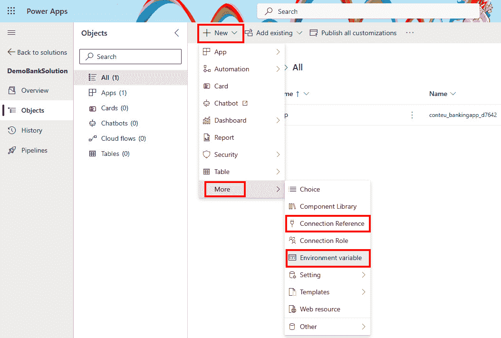

图 10.1 – 在解决方案对象资源管理器中添加组件

1.  每当我们创建新的连接引用时， **新建连接引用** 屏幕将会打开，正如在 *图 10**.2*中所见。

    在这里，我们必须提供 **显示名称**， **名称**， **连接器** 的值，以及 **连接** 值用于所选连接器。 提供描述是可选的，但建议提供，以便更好地理解 连接引用的用途：

    +   如果在环境中没有所选连接器的连接，我们需要通过选择 **+ 新建连接**来创建一个新连接，这将打开一个新连接屏幕，弹出框中显示我们所选的连接器。 我们需要提供所有必需的连接参数，并点击 **创建** 来创建 一个连接。

1.  返回 到之前的 **新建连接引用** 屏幕，我们现在可以点击 **刷新** 按钮，位于连接下拉列表旁边，如 *图 10**.2*所示，这将更新连接列表并显示新创建的连接。 我们可以选择它并点击 **创建**，这将在 我们的 解决方案中创建一个新组件。

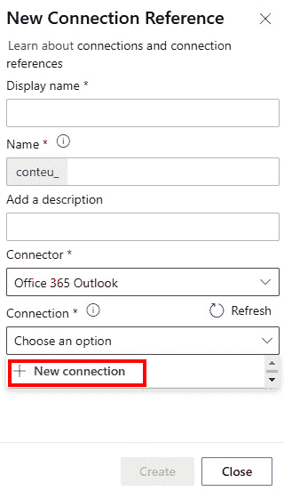

图 10.2 – 创建新的连接引用

1.  要添加一个 环境变量，我们遵循类似于 *步骤 3*中提到的步骤。这次，我们选择 **新建** | **更多** | **环境变量**。

1.  将出现一个新屏幕，我们需要提供更多关于环境变量的信息，例如 **显示名称**， **名称**， **描述**，以及 **数据类型**：

    +   **数据类型** 指定了我们环境变量的类型。 这可以是 **十进制数**， **是/否**， **文本**， **数据源**， **机密**，等等。 选择数据类型后，我们可以配置默认值和当前值，如在 *图 10.3*中所示。如果我们正在创建一个类型为 **数据源**的环境变量，我们可以选择 连接器**。

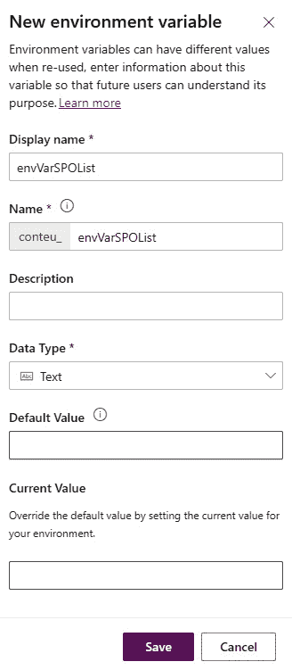

图 10.3 – 添加新环境变量

+   **默认值** 不是必填项；然而，当没有 **当前值** 设置时，它是会被使用的。 **当前值** 会覆盖 **默认值** ，并且在部署到不同的 目标环境时非常有用。

一旦我们按需要配置好环境变量后，可以点击 **保存** 来存储配置，这将会将一个新组件添加到 我们的解决方案中。

如果我们需要将现有的环境变量添加到我们的解决方案中，可以通过点击 **添加现有**| **更多** | **环境变量** 在解决方案对象资源管理器中，选择列表中的现有变量，然后点击 **下一步**。接下来的页面会显示我们选择的环境变量，对于每个变量，我们可以选择 **包含定义** 和 **包含当前值** 复选框。 我们可以审查已选择的现有 环境变量，并点击 **添加** 将其添加到 我们的解决方案中。

环境变量的当前限制

在使用环境变量时仍然存在一些限制；例如，目前无法使用 Microsoft Power Platform Build Tools 管理数据源环境变量。 请确保查看限制并相应地使用环境变量。 有关限制的更新信息，请参考 这里： [https://learn.microsoft.com/en-us/power-apps/maker/data-platform/environmentvariables](https://learn.microsoft.com/en-us/power-apps/maker/data-platform/environmentvariables)。

现在我们已经准备好了解决方案，可以将其部署到不同的环境中。 手动导入解决方案时，导入过程会检查环境中是否已经存在定义的连接引用。 如果存在，导入过程将其与该连接关联；如果不存在，它将提供自动创建并关联连接的机会。 一旦连接配置完成，下一步将允许我们使用目标环境的实际值更新环境变量。

为了将设置解耦并允许我们的解决方案以更具程序化的方式导入，我们将查看如何生成并使用部署设置文件。 和使用。

### 构建部署设置文件

一个 **部署设置文件** 是一个 存储关于连接引用和我们解决方案中使用的环境变量信息的 JSON 格式文件。 同一个文件将在使用 Power Platform Build Tools 或 PAC CLI 进行解决方案导入时使用。 我们在 *第八章*中简要提到过它：

1.  我们应该导出我们的解决方案或克隆它。 我们需要 拥有一个解决方案 ZIP 文件或一个未打包的解决方案文件夹，我们可以通过它来生成设置文件。 我们可以通过 两种方式来实现：

    +   选择解决方案，点击 `pac solution clone --name <solution-name>` 或 `pac solution export --name <name>`，这意味着解决方案文件夹将被本地克隆，或解决方案 ZIP 文件将被 本地下载

1.  现在我们 已经导出了解决方案包 文件，我们准备好按照以下方法创建部署设置文件。

    生成部署设置文件可以使用以下 PAC CLI 命令：

    ```
     pac solution create-settings --solution-zip <solution-file.zip> --solution-folder <unpacked-solution-folder> --settings-file <JSON-file-name>
    deploymentSettings.json file in the current folder.
    ```

    下面是 `deploymentSettings.json` 文件结构的示例，位于本书 GitHub 仓库的 *第十章* 文件夹中。 在该文件中，我们可以看到环境变量和连接引用的结构，并包含相应的值。

    文件中的每个环境变量都有一个 `Value` 属性。 初始时，它是一个空字符串，我们将其更新为目标环境的值。 对连接引用也应进行相同的操作，其中 `ConnectionId` 属性最初为空，需要 提供。

    要更新连接引用值，我们可以使用 PAC CLI 连接到目标环境并列出所有连接。 这将使我们看到给定连接器的连接是否已存在于目标环境中。 当我们将 PAC CLI 指向目标环境时，可以使用 `pac connection list` 命令列出在选定环境中建立的所有连接。 如果连接已存在，请将该连接的 `Id` 值复制到部署设置文件中的正确连接引用 `ConnectionId` 值下，如 *第八章* 所示；否则，创建一个新的连接。

1.  现在我们已经为解决方案准备了部署设置文件，可以继续进行解决方案导入过程，包括指定的部署设置文件。 如果命令中未提供环境值或路径，将使用当前环境和当前文件夹结构进行 解决方案 导入：

    ```
     pac solution import --path <path_to_zip_file> --settings-file .\deploymentSettings.json
    ```

上述方法提供了一种编程方式来生成部署设置文件、编辑它并将解决方案导入目标环境。 为了遵循 DevOps 方法，我们可以在流水线中使用额外任务来管理部署设置文件并部署到 目标环境。

### 部署设置文件和 DevOps 方法

在 *第八章*中，我们看到如何在 DevOps 中使用部署设置文件。 为了保持自动化，我们可以在管道中添加一个额外的任务，该任务将创建一个部署设置文件并将其存储在与我们导出解决方案相同的仓库中。 我们可以使用 PAC CLI 来实现。 我们必须确保在导出管道中使用 Power Platform Tool Installer 任务时，将 PAC CLI 添加到 `PATH` 环境变量中。 以下示例演示了如何在 Azure DevOps 中完成这项操作：

```
 - task: PowerPlatformToolInstaller@2
  inputs:
    DefaultVersion: true
    AddToolsToPath: true
```

为了生成部署设置文件，我们将使用一个 **命令行** 任务，使用我们现在 已经熟悉的命令：

```
 - task: CmdLine@2
  inputs:
    script: |
      echo 'Create Deployment Settings File'
      pac solution create-settings --solution-zip '$(Build.ArtifactStagingDirectory)/$(SolutionName).zip' --settings-file '$(SolutionName).json'
```

我们在导出管道中使用的 `git commit` 命令 将确保这个新的部署设置文件会被添加到我们的仓库中。 如果我们在导出管道中创建一个制品，我们应该确保使用管道中的 **复制文件** 任务将部署设置文件添加到制品中。

现在我们已经在仓库中有了部署设置文件，接下来就是更新文件中的值。 由于我们不希望在源代码中保留任何敏感信息，而这些值可能是可读的，我们建议将环境变量和连接参考的连接 ID 的值参数化。 例如，在部署设置文件中，我们可以将环境变量的值写成如下形式： `„Value": „#{ENV_NAME}#"`，连接参考的连接 ID 值则可以写成如下形式： `„ConnectionId": „#{CONN_O365OUTLOOK}#`。类似的方法在 *第八章*中有展示。

作为我们 部署管道的一部分，在将解决方案导入到环境中的过程中，我们可以更新这些值以确保其正确。 我们可以使用 DevOps 管道中的一个任务/操作，搜索具有正确前缀和后缀的令牌，在我们的案例中是 `#{ … }#`，并用存储在 DevOps 工具或安全密钥库中的实际值替换这些令牌。 例如，在 Azure DevOps 和 GitHub 中，我们可以通过一个 **替换** **令牌** 任务/操作来实现这一点。

一旦在部署管道中将令牌替换为实际值，下一步是使用 **Power Platform 导入解决方案** 任务导入解决方案，该任务是 Power Platform 构建工具的一部分。 这 使我们能够在导入解决方案时引用部署设置文件。 在这里，我们可以看到一个这样的任务在 Azure DevOps 管道中的示例：

```
 - task: PowerPlatformImportSolution@2
  inputs:
    authenticationType: 'PowerPlatformSPN'
    PowerPlatformSPN: '<PP-SPN>'
    SolutionInputFile: '$(Build.ArtifactStagingDirectory)/$(SolutionName).zip'
    UseDeploymentSettingsFile: true
    DeploymentSettingsFile: '$(SolutionName).json'
    AsyncOperation: true
    MaxAsyncWaitTime: '60'
```

现在，我们更清楚地了解了我们的解决方案如何拥有配置设置文件，使其能够在不同的环境中重用，这也将帮助我们构建其他组件，如画布组件和代码组件。 我们将从画布组件和 组件库开始。

# 画布组件和组件库概述

在 Power Apps 中开发应用时，应用开发者使用各种控件来构建应用的基础模块。 为了避免重复，并构建可重用的应用部件，这些部件可以在同一个应用或多个应用中使用，开发者应考虑使用画布组件。 本节介绍了画布组件以及组件库，并帮助你理解它们之间的区别以及它们如何融入 ALM 过程。

## 画布组件

**画布组件** 作为 独立的模块化构建块，封装了特定的功能或用户界面元素。 画布组件可以在 Power Apps 画布应用和基于模型的应用中重用。 这些组件不仅在创建更大、更复杂的企业级应用时起着至关重要的作用，而且在多人协作开发环境中也非常重要，因为开发人员可以分配任务，并在构建业务解决方案时专注于每个单独的组件。 创建画布组件的另一个好处是，它们可以在一个地方集中更新，所有更新都会在应用中的所有实例中反映出来。 该应用。

创建画布 组件是在 Power Apps Studio 中构建画布应用程序时完成的。 在左侧导航栏中，点击 **树视图**，我们可以看到应用程序中所有的屏幕和组件。 点击 **组件** 可以查看所有现有的组件，并通过点击 **新建组件**来创建新的组件。这会创建一个空白的画布组件，我们可以 添加控件：

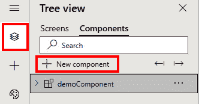

图 10.4 – 在 Power Apps 中创建画布组件

每个组件都可以拥有自定义属性。 自定义属性允许组件接收应用程序传递的值（称为输入属性），或者将数据或状态从组件发送到应用程序（称为输出属性）。 无论属性类型是输入还是输出，自定义属性都可以保存任何数据类型的数据，涵盖从传统的数据类型，如文本和数字，到更符合 Power Apps 特性的类型，如屏幕、颜色和表格。 使用自定义属性可以在组件与应用程序主机之间共享信息。 在画布组件层级还有一个设置， **访问应用程序范围**，可以在组件的属性中找到。 它可以打开或关闭，以允许访问应用程序内更广泛的信息 ，例如全局变量、集合和应用程序中的控件。 这仅适用于应用程序内的画布组件，而不适用于组件库中的组件。 我们可以关闭此设置，并通过 自定义属性 将信息传递给组件。

## 组件库

由于画布组件只能在一个应用程序内使用，为了在环境中跨应用程序重用组件，我们可以创建组件库。 一个 **组件库** 作为组件定义的存储库。 这使得应用程序可以管理其所依赖的组件，这意味着每当组件更新可用时，应用程序开发者将被通知。 可用更新的信息会在 Power Apps Studio 中编辑应用程序时显示，或者通过手动点击刷新按钮来检查组件 库更新。

创建组件库与创建 画布组件不同：

1.  可以通过导航到 Power Apps 主屏幕并从左侧导航面板中选择 **组件库** 来找到组件库。 如果在左侧导航面板中看不到此选项，请点击 **更多** | **查看全部**，在这里可以找到 **应用增强**：

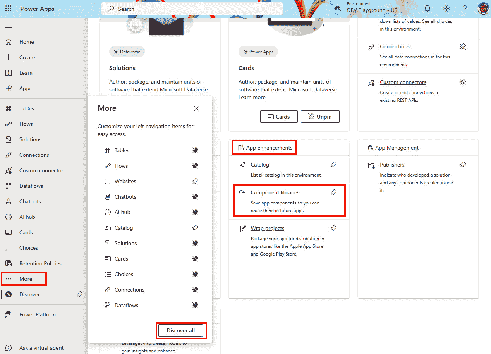

图 10.5 – 访问组件库

1.  一旦我们在 组件库屏幕上，我们可以点击 **+ 新建组件库** 来创建一个空白的画布，用于添加 应用程序组件。

1.  在这里，我们可以按照与常规画布组件相同的过程导入现有组件或创建新组件。 在组件库中创建或导入的每个组件都允许制作者在目标环境中进行自定义。 **允许自定义** 是 Power Apps Studio 内部组件的属性。 如果允许自定义，则一旦应用制作者开始在应用程序中对组件进行更改，这将打破对组件库的引用并创建组件的本地副本。 为了保持对组件的控制并仅允许从组件库内部进行组件更改，关闭此组件设置是 一个良好的实践。

1.  一旦所有组件添加到组件库中，我们需要发布这些更改。 发布过程与任何其他画布组件或画布应用相同。 如果组件库没有发布，则无法 重复使用。

1.  发布后，我们可以在应用程序中重新使用库中的组件。 为此，我们在 Power Apps Studio 中打开我们的画布应用，在左侧导航面板中点击 **插入**，这将打开添加控件的选项 和组件。

    我们点击代表目录搜索的图标，这将打开一个 **导入组件** 屏幕。 在这里，我们可以找到我们的组件库以及库中的所有组件。 我们可以选择需要的组件然后 点击 **导入**：

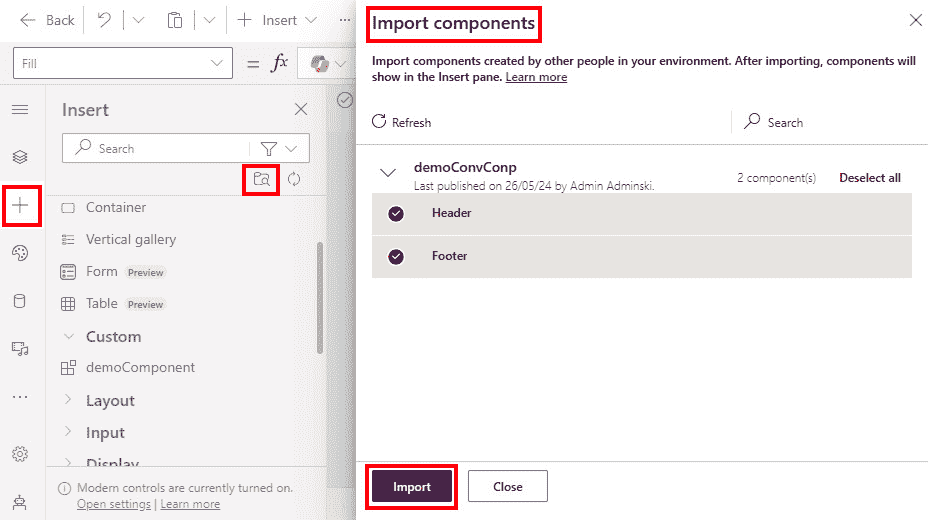

图 10.6 – 从组件库导入组件

1.  组件库中的组件将出现在左侧导航面板的 **插入** 选项下。 我们可以在 **库组件** 组中找到它们，位于 **自定义** 类别下方，该类别包含本地创建的画布组件，如 下图所示：

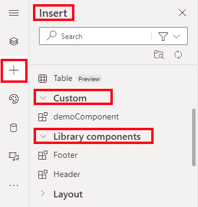

图 10.7 – 从添加的组件库中访问组件

现在我们已经学习了如何构建画布组件和组件库，这些组件库支持在环境中跨画布应用程序的组件可重用性，让我们来探讨如何管理组件库的 生命周期。

## 管理组件库的生命周期

正如我们之前所看到的， 为了在多个应用程序之间重用组件，它们需要被添加到组件库中。 一旦添加到库中，它们就可以被插入到应用程序中。 这样，应用程序就会创建一个来自组件库的选定组件的依赖关系，并简化我们的 解决方案管理。

为了将带有组件依赖关系的应用程序部署到不同的环境中，我们必须确保在部署应用程序之前，目标环境中存在该组件库。 否则，导入解决方案的过程将无法成功。 我们需要确保组件库要么与应用程序一起打包在解决方案中，要么在部署带有 组件依赖关系 的应用程序之前，将其移至目标环境的单独解决方案中。

我们可以通过导航到 **解决方案**，选择我们的解决方案，点击 **对象**，点击应用程序名称旁边的三个点，点击 **高级**，然后点击 **显示依赖关系**，如 *图 10.8*所示：

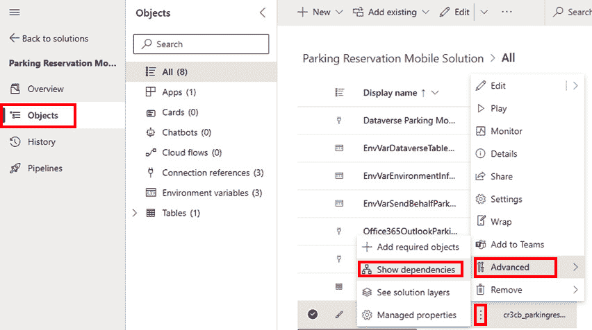

图 10.8 – 检查应用程序的依赖关系

在这里我们会找到一个标签 叫做 **使用**，它显示了哪些对象正在被我们的应用程序使用。 选择组件库名称旁边的三个点将会引导我们到 **默认解决方案**。需要注意的是，组件库会被放置在环境中的默认解决方案中。 当我们迁移到目标环境时，只要该环境已启用 Dataverse，情况将保持不变。

将组件库添加到包含我们应用程序的解决方案中，可以通过进入我们的解决方案，点击 **对象**，然后创建一个新的组件库或添加一个现有的组件库。 创建新组件库的方法是点击 **新建** | **更多** | **组件库**。添加现有组件库的方法是通过 **添加现有** | **更多** | **组件库**。将组件库添加到解决方案后，我们可以启用/禁用允许在目标环境中进行自定义的选项。 该设置可以在解决方案资源管理器中找到。 我们选择组件库，点击其名称旁边的三个点，然后点击 **高级** | **托管属性**。这将打开一个编辑组件库托管属性的界面。 在这里，我们可以切换启用或禁用允许在 目标环境中进行自定义的选项：

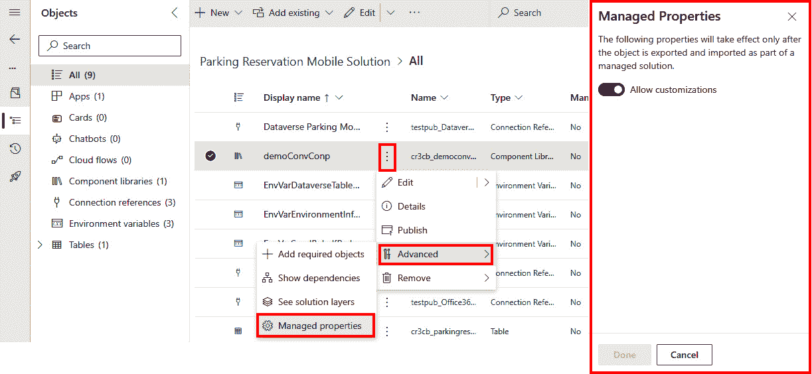

图 10.9 – 在目标环境中启用/禁用自定义

一旦我们将包含所有组件的组件库添加到解决方案中，就可以按照我们已经熟悉的 ALM 流程进行操作：通过导出管道从 Power Apps 导出解决方案，然后通过导入管道将其导入目标环境，并在中间执行所有其他相关步骤 用于测试。

如果我们希望 单独更新组件库，而不是与应用程序一起更新，那么拥有一个专门用于更新组件库的管道过程是有意义的。 我们可以创建一个单独的解决方案，并添加一个或多个我们希望单独管理其应用生命周期的组件库。 我们需要记住，组件库必须在导入引用该组件库的解决方案之前部署到目标环境。 一旦组件更新，应用程序创建者将通过组件更新过程（自动或主动）收到更新通知。

现在我们已经学习了画布组件及其可重用性，接下来我们将进一步探讨在 代码组件中可以进行哪些额外的自定义。

# 了解代码组件

在专业开发者可扩展性的基础上再进一步， **Power Apps 组件框架** (**PCF**) 使得专业开发者可以创建代码组件，在内置组件的外观和体验不足时，提升用户体验。 PCF 是一个非常庞大的话题，足以在本书中单独开设一章。 在本节中，我们将尽量为你提供对 PCF 的初步理解，了解 PAC CLI 如何帮助我们构建代码组件，以及如何使用 DevOps 工具执行 ALM。

PCF 是一个统一的框架，允许开发人员构建可在 Power Apps 和 Power Pages 网站中跨应用重用的自定义代码组件。 这为组织提供了一个绝佳的机会，可以构建代码组件，并在业务解决方案中加以利用。 通过使用 PCF，我们可以开发代码组件，这些组件不仅包含关于组件外观的信息，还包括业务逻辑。 这使得我们能够让应用程序和网站在视觉上更具吸引力，并且根据业务需求进行定制。 PCF 是 HTML Web 资源的继任者，HTML Web 资源曾用于在 PCF 之前，在模型驱动应用中渲染自定义 UI 组件。 与 HTML Web 资源相比，PCF 在性能方面得到了更多的优化，使其更适用于复杂的 业务解决方案。

模型驱动应用中的自定义页面

自定义页面 是模型驱动应用中的一种灵活而强大的页面类型，允许我们将构建画布应用的体验带入模型驱动应用。 我们可以向自定义页面中添加画布和代码组件，这些组件可以作为主页面、中心对话框屏幕或侧边对话框视图显示在模型驱动应用中。 这为我们构建业务应用的体验提供了极大的灵活性。

目前，我们知道有两种类型的 PCF 组件： **标准** 和 **虚拟**。这两种组件都利用了 HTML、CSS 和 TypeScript。 然而，虚拟组件使用了两个平台提供的库，React 和 Fluent UI。 它们被添加到父虚拟 **文档对象模型** (**DOM**)，这意味着不需要为每个组件单独实例化一个 React 虚拟 DOM。 尽管 React 和 Fluent UI 可以与标准 PCF 组件一起使用，但这样做需要开发者将库单独打包到组件中。 对于虚拟组件，我们能够使用平台提供的库，这使得我们可以在使用这些代码组件时提升应用的性能。 需要注意的是，即使我们开始时使用标准代码组件，后续也可以将其转换为 虚拟组件。

根据组件的使用方式，我们可以区分两种类型的 PCF 组件：

+   **字段**，在这里，代码组件可以绑定到 表单中的字段

+   **数据集**，它是一个绑定到视图、数据集或画布应用中的集合的代码组件，可以与来自 数据集 的数据行一起工作

使用这两种类型的 PCF 组件，开发人员可以在数据集和仪表板上构建自定义字段、列和视图，进而替换我们业务应用中的内建组件。

PCF 的社区资源

对于那些愿意学习 更多关于 PCF 的内容，并希望查看更广泛社区使用 PCF 开发的一些示例，微软提供了一系列链接（视频、博客和代码组件库），可以用于此目的。 欲了解更多信息，请访问 ： [https://learn.microsoft.com/en-us/power-apps/developer/component-framework/community-resources](https://learn.microsoft.com/en-us/power-apps/developer/component-framework/community-resources)。

## 代码组件的组成

无论我们决定构建哪种控制类型或组件类型，代码组件由三个主要元素组成——清单文件、组件实现和 资源文件。

### 清单文件

控制清单 是一个用于注册和管理代码组件的 XML 文件。 清单文件的 名称 是 `ControlManifest.Input.xml`。

它包含了关于代码组件的所有信息，例如 以下内容：

+   组件 元数据

+   关于控制类型的信息（标准 或虚拟）

+   是否将使用任何外部服务（这将需要 高级许可）

+   可用的属性 供使用

+   已使用的资源

+   其他 元数据和 配置信息

代码组件中可用的属性可以手动输入或动态设置为来自 应用程序中其他组件的值或数据。

### 组件实现

代码组件的逻辑在一个名为 `index.ts`的文件中实现。在这里，我们可以放置定义代码组件行为的代码。 这是我们可以找到控制代码组件生命周期方法的地方。 代码组件。

代码组件的生命周期可以分为四个 主要方法：

+   `init`：此方法用于初始化组件实例。 此功能不仅配置组件，还可以注册任何事件监听器或添加其他功能，以确保组件正确运行。 此方法需要在代码 实现文件中实现。

+   `updateView`：当组件的属性或组件元数据中的任何值发生变化时，会调用此方法。 它用于反映组件 UI 中的变化。 此方法需要在代码 实现文件中实现。

+   资源文件

+   `getOutputs`：此方法在组件接收新数据之前调用。 此方法在代码 实现文件中是可选的。

### 前提条件

在清单文件中，定义代码组件的节点之一是 `resources`。该节点包含关于代码资源的信息，也就是我们的 `index.ts` 文件，其中包含代码逻辑。 在 `代码` 资源旁边，我们有静态文件，定义了代码组件的视觉外观。 这里我们可以找到一个 **层叠样式表** (**CSS**) 文件 ，其中包含控制组件视觉表现的代码。

由于代码组件可以在不同的应用和环境中重用，因此支持本地化非常有利，因为它允许我们在有其他语言需求的应用之间共享组件。 PCF 支持本地化。 本地化字符串可以存储在 RESX Web 资源文件中，并在清单文件中注册。 其他文件，如图像、图标或任何其他需要的文件，都可以添加。 文件通常存储在一个单独的文件夹结构中，注册在清单文件中，并在 代码逻辑中引用。

现在我们已经了解了代码组件的文件结构，接下来让我们创建一个简单的 代码组件。

## 创建代码组件

在这个练习中，我们将创建一个 虚拟（React）控件类型，因为这是未来推荐的控件类型。

### `destroy`：当组件从 DOM 树中移除时，会调用此方法。 它应被用于执行任何清理操作，并释放组件所使用的任何内存。 此方法需要在代码 实现文件中实现。

为了构建代码 组件，我们需要安装在 *技术* *要求* 部分中提到的工具。

要获取 .NET 构建工具，应安装 Visual Studio 2019 或更高版本（Visual Studio 2022）。 我们可以选择仅在安装向导中选择 .NET 构建工具作为工作负载，而不是安装完整的 Visual Studio。 另一种选择是安装 .NET 8.0 SDK。 目前，.NET 8.0 是最新的长期 支持版本。

### 初始化项目

首先，我们需要初始化 项目。 为此，我们将使用 PAC CLI 以及其特定于 PCF 的命令集。 我们可以使用以下命令来实现这一点：

```
 pac pcf init --name <COMPONENT_NAME> --namespace <COMPONENT_NAMESPACE> --template <COMPONENT_TYPE> --framework <RENDERING_FRAMEWORK> -npm
```

有两个参数非常突出— `template` 和 `framework`。现在， `template` 描述我们是否会创建一个用于字段或数据集的代码组件。 `framework` 定义了我们将使用的框架。 如果使用 `React`，那么它将标记为虚拟控制类型；否则，它将是标准控制类型。 如果我们没有在命令中提供 `--run-npm-install` 或 `--npm` 开关，我们将需要单独运行 `npm install` 命令，以安装 项目依赖。

在我们的示例中，我们使用了 以下命令来初始化一个包含一些 支持文件的文件夹结构的项目：

```
 pac pcf init --name SimpleReactPCF --namespace SimpleReactNS --template field --framework react -npm
```

以下是 文件夹结构：

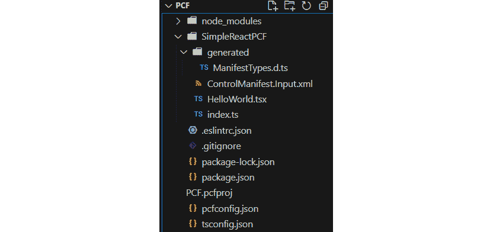

图 10.10 – PCF 初始化项目的文件夹结构

现在，我们已经初始化了项目，并且有了文件和文件夹结构，接下来可以开始实现 代码逻辑。

### 实现代码组件

正如我们在 代码组件的文件夹结构中看到的那样，我们的清单文件也存在于 PCF 项目中。

在 `ControlManifest.Input.xml` 文件中，我们可以看到 `control` 元素，其中包括关于我们的代码组件的信息，包括控制类型设置为 virtual：

```
 <control namespace="SimpleReactNS" constructor="SimpleReactPCF" version="0.0.1" display-name-key="SimpleReactPCF" description-key="SimpleReactPCF description" property node, where we can have multiple properties for our code components.
			We will change the property from `SingleLine.Text` to a number (`Whole.None`) by changing the highlighted property:

```

<property name="sampleProperty" display-name-key="Property_Display_Key" description-key="Property_Desc_Key" of-type="Whole.None" usage="bound" required="true" />

```

			During this step, extensive coding may be done to develop the PCF component. Making changes to the code of the component requires knowledge of TypeScript and React.
			Debugging a developed code component
			With a simple `npm start watch` command, we can run the project in debugging mode, which opens a browser with our local PCF test environment. On the right side of the test application, we can see all the configured data properties that are specified in the manifest file, as shown in *Figure 10**.11*. Here we can adjust the values of the properties and check whether the state of the code component reflects the desired behavior.
			Additionally, we can use the test environment to understand how our code component adjusts to different screen sizes. We can use the **Form Factor** settings as well as **Component Container Width** and **Component Container Height** to adjust the screen size:
			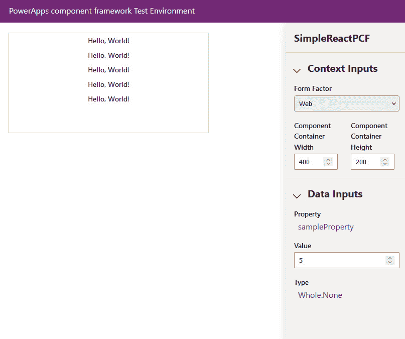

			Figure 10.11 – The PCF test environment
			Packaging the code component
			Code components can be added to solutions to enable reusability across environments. If we already have solutions available, we can simply upload the code component to the solution using the `pac pcf push` command, as shown in the next section. In other cases, we can utilize a set of commands to first create a solution and then add a reference to that solution.
			We will be adding a reference for our code component project to a newly created solution project. The solution project (`cdsproj`) can contain multiple code component references, while the code component project can only contain a single code component. Adding references to multiple code components within a single solution project allows us to reference all the code components required for a particular business solution. They can also be packaged together with other solution objects if needed.
			First, we will initialize a solution using the following command:

```

pac solution init

```

			Then we will add a reference to the code component project:

```

pac solution add-reference --path <LOCATION_TO_PCFPROJ_FILE>

```

			This will create a reference inside the `.cdsproj` file, like this:

```

<ItemGroup>

    <ProjectReference Include="..\SamPCF\SamPCF.pcfproj" />

</ItemGroup>

```

			When we are ready to generate a ZIP file from the solution project, we can use the following:

```

dotnet build /t:build /restore

```

			This will restore all code component projects that are referenced in the solution project and build the project. The final outcome of the process is a ZIP package artifact that can be imported with the code components solutions. Such a solution can now be imported into the downstream environment.
			If we have a business application in another solution that is referencing our code components, we need to make sure that the solution with the code components is deployed to the environment first, before importing the business application that references them.
			Importing the solution into Power Platform
			Importing the solution into Power Platform (Dataverse) can be done manually using the Power Platform web portal or the `pac pcf push` command. It can also be done automatically using Power Platform Build Tools and the DevOps tool of choice. In the next section, we will take a look at how this can be done automatically. In this section, we will complete the process manually.
			First, we should make sure that we are in the right Dataverse environment. To select the right environment, we can proceed with `pac env list` and `pac env select -env <ENVIRONMENT_ID>`. After confirming the environment, we can proceed with the `push` command.
			It is worth noting that the `pac pcf push` command also has a `-env` setting, which allows us to push to a selected environment if we are operating across multiple environments.
			As we are still in the folder of our code component, we can run the command, in which we can either use a publisher prefix from our environment or the unique name of our solution. In both cases, the PAC CLI will check whether the publisher or solution already exists. If it does, it will use it to push the component – here is one option:

```

pac pcf push –solution-unique-name <SOLUTION_NAME>

```

			Here is the other:

```

pac pcf push -pp <PUBLISHER_PREFIX>

```

			Without the name of the solution, this code component will be imported to a temporary `PowerAppsTools_<prefix>` solution.
			Preparing the component for release
			When preparing our code component for release to the production environment, we should add the `<PcfBuildMode>production</PcfBuildMode>` property inside the `pcfproj` file underneath `OutputPath`, as in the following example:

```

<PropertyGroup>

    <Name>PCF</Name>

    <ProjectGuid>e71d2e10-908c-4123-9f29-3283cbd224ab</ProjectGuid>

    <OutputPath>$(MSBuildThisFileDirectory)out\controls</OutputPath>

    <PcfBuildMode>production</PcfBuildMode>

</PropertyGroup>

```

			Development mode produces a larger bundle that holds debugging information, which might impact performance in production. This is why the change should be made to the `pcfproj` file before building and deploying to production.
			Additionally, when preparing the solution project, `SolutionPackagerType`, which is part of `PropertyGroup` in the `cdsproj` file, defines the solution type, stating whether we would like to go for managed, unmanaged, or both solution types:

```

<PropertyGroup>

    <SolutionPackageType>Managed</SolutionPackageType>

</PropertyGroup>

```

			When running the `dotnet build` command, this information will be taken to generate a ZIP file of the defined solution type. When we are preparing for release to production, we can use `dotnet build /p:configuration=Release` to create a release build for the selected solution type.
			Adding code components to applications
			Code components can be used across canvas applications, model-driven apps, and websites. The following are some examples of adding components to apps.
			Model-driven apps
			Adding components to model-driven apps is very easy:

				1.  When editing the form, click on **Components** in the left navigation bar and click **Get** **more components**.
				2.  This will open a **Get more components** sidebar, where newly created code components will appear. Select the necessary components and click **Add**, as can be seen in *Figure 10**.12*:

			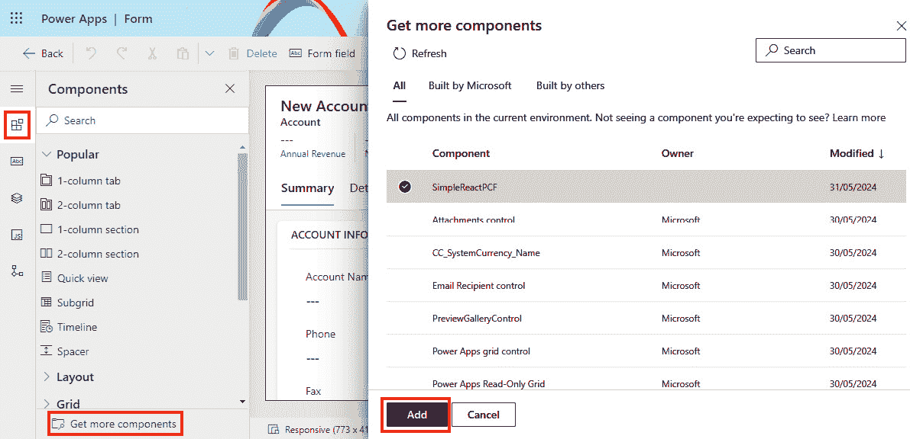

			Figure 10.12 – Adding code component to a form in a model-driven app

				1.  After adding the code components to the list of components, they appear under the **More components** group inside the **Components** option. Simply drag and drop the components to the right places in the form and connect the component values with the correct values.

			Canvas apps
			Adding code components to canvas applications has to be enabled before it’s possible. The setting for enabling it is currently available in the Power Platform admin center:

				1.  Go to **Environments**, select the environment, and then click **Settings** | **Product** | **Features**.
				2.  Here we will find the **Power Apps component framework for canvas apps** setting, which is turned off by default. If needed, enable it.
				3.  Once done, we can go to our canvas application and click **Insert** to see a list of all controls. Then we can proceed to the **Code** tab, select the components, and click **Import**, as shown in *Figure 10**.13*.

			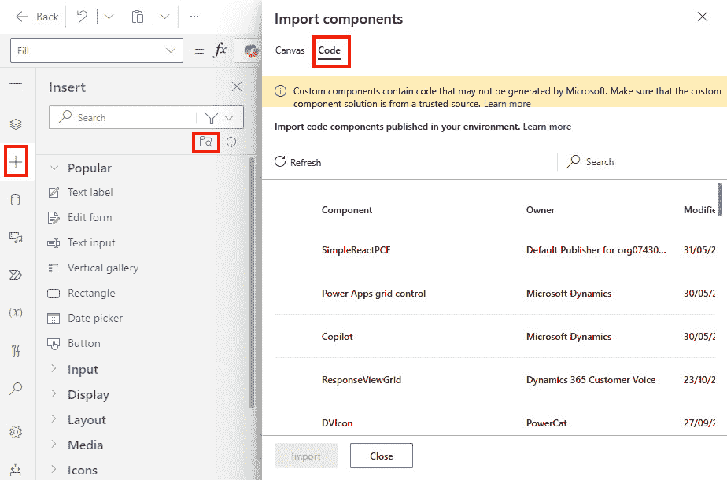

			Figure 10.13 – Adding a code component to the canvas app
			Power Pages
			Adding code components to Power Pages is similar to the process of doing so for model-driven apps:

				1.  Your components can be found by going to **Data** in the left navigation bar.
				2.  Select the table of choice, click **Forms** (or **Views**, depending on the use case), and click **Get** **more components**.

			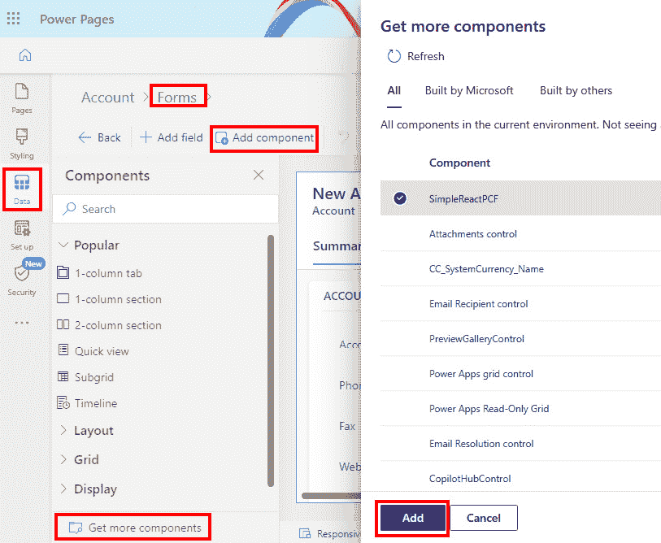

			Figure 10.14 – Adding code components in Power Pages

				1.  This will open a sidebar to help you find a custom code component. Select the one you require and click **Add**, as can be seen in *Figure 10**.14.*

			Now that we have learned how code components are created and added to an application, let’s understand how the application life cycle is managed for these components.
			ALM for code components
			As we saw in the previous section, the development life cycle of a code component consists of the following steps:

				1.  The initialization of the PCF project
				2.  Working on the code component’s implementation
				3.  Testing/local debugging of the developed code component and pushing it to the Power Platform development environment
				4.  Adding the component project reference to the solution in the development environment
				5.  Testing the business solution with the included code components
				6.  Preparing the code component for release
				7.  Importing the solution to other environments and testing

			We recommend building automated pipelines by leveraging Power Platform Build Tools in Azure DevOps or GitHub, together with the PAC CLI, to perform these tasks automatically.
			As with any other development project, when developing code components, it is also recommended that developers use a source code repository, such as GitHub or Azure DevOps, from the beginning, in which to collaborate. Using `pac pcf init` also creates a `.gitignore` file, which instructs the version control system as to which files and folders should be left out since they will be either created or restored during the build process.
			It is worth noting that when we have a code component in a solution, we can export the solution together with the code component using Power Platform Build Tools or `SolutionPackager /action: Extract`, which incrementally exports changes to the solution metadata. When a code component is extracted from a solution package, a `Controls` subfolder will be created for each code component that is included in the solution.
			Using `pac pcf push` to push a code component to an environment, and then using commands such as `msbuild` and `SolutionPackage /action: Pack` to build a solution, allows us to build and repack the solution and make it ready for import.
			Solution strategy for code components
			Another consideration with code components is the solution strategy. As we have learned, our business applications can have dependencies on various solution components. Power Platform allows us to deploy components together, as part of a **single solution**, or separately, in **segmented solutions**, where functionalities of our business applications are split between multiple solutions.
			The segmented approach allows us to be more agile with the development approach of our business solution. Teams can each focus on their own parts of the business solution and can develop and test independently of the final solution. Such an approach allows us to decouple and share code components between multiple applications and across environments. Single solutions have everything in one solution, which means that it is important to follow a good branching strategy if you want to have control over updates to the complete solution.
			Versioning and updates to code components
			Whenever we deliver changes to our code components that should be pushed to our business applications, we should make sure that we follow the standard versioning strategy (`MAJOR.MINOR.PATCH`), which will ensure that Power Apps applications detect and update dependencies to the latest version.
			Inside the manifest file (`ControlManifest.Input.Xml`), under the `control` element, there is a `version` property that should get at least a `PATCH` version increase whenever an update to a code component is deployed. This will ensure that the change can be detected and that both canvas and model-driven apps will receive the latest version of the component:

```

<control namespace="SimpleReactNS" constructor="SimpleReactPCF" version="0.0.1" display-name-key="SimpleReactPCF" description-key="SimpleReactPCF description" control-type="virtual" >

```

			An increase of the version can be done manually by changing the number in the manifest file, or it can be done automatically with the following command:

```

pac pcf version --strategy manifest

```

			There are also other strategies, such as `gittags`; however, the manifest strategy is by far the simplest, since it does everything automatically.
			If we would like to specify the exact value of a version, we can do the following:

```

pac pcf version --patchversion <PATCH VERSION>

```

			`MAJOR` and `MINOR` versions should be aligned with the version of our Dataverse solution. If a significant change is made to a solution, then the `MAJOR` and/or `MINOR` version of the Dataverse solution should be incremented, which should lead also to incrementing the `MAJOR` and/or `MINOR` version of the code component.
			Code component updates for canvas apps
			In order to update a code component to a newer version inside canvas applications, app makers must open the canvas app in Power Apps Studio and click **Update** on the **Update code components** popup. If the update is not done, then the canvas app will continue to use the old version of the code component.
			Automated build pipelines for segmented solutions
			To create a code component from scratch and keep control over it, we start by creating the code component locally and committing the changes to the Git repository:

				1.  Using the `pac pcf init` command, we will create a `pcfproj` folder. Once the project is created, we will be committing the changes to the Git repository. Using `pac pcf push`, we will deploy our code component to the environment.
				2.  Separately, we will be creating a solution project using `pac solution init`, to create a new blank solution, or `pac solution clone`, if we already have a solution that we would like to reuse. The solution is also version-controlled in the Git repository.
				3.  Next, we need to add a reference to the solution using the `pac solution add-reference` command with the path to our PCF component project.
				4.  Now we need to update the solution version in `Solution.xml` to reflect the version of the current build. This can be done by formulating the `MAJOR.MINOR.BUILD.REVISION` version with the variables in Azure DevOps/GitHub. For `MAJOR`, we can create `$(majorVersion)` variables; for `MINOR`, we can create `$(minorVersion)` variables; for `BUILD`, we can use the predefined `$(Build.BuildId)`; and for `REVISION`, we can use `$(Rev:r)`.
				5.  We will also need to change the version value inside `ControlManifest.Input.xml`.
				6.  Once the version numbers are updated, we can run a task, as part of our build pipeline, using the `dotnet build /restore /p:configuration=Release` command (or `msbuild`, depending on what tools are we using). We configure the task in a way that means it builds only the `cdsproj` project. We can achieve this by setting the `*.``cdsproj` wildcard.

			Once the build has been completed, we will store the produced ZIP file in the pipeline release artifact using a **Copy file** task, which can be used for deployment. The deployment process is the same as with other solution import processes.
			Automated build pipelines for single mixed solutions
			The single mixed solutions approach needs to be configured in the solution object explorer, where all the required solution components are added. Then, we utilize `SolutionPackager /action: Extract` to extract the components into the source control system. Just as earlier, we need to update the solution version in `Solution.xml` to reflect the version of the current build. We also need to change the version value inside `ControlManifest.Input.xml`.
			We will add a task to the pipeline called **Power Platform** **Tool Installer**.
			Next, we will restore `node_modules` using `npm task` with the `npm ci` command. For the production release mode, we will use `npm task` with a custom command parameter: `npm run build -- --buildMode release`. The output of the build needs to be stored separately in a folder. Then we will use a `SolutionPackager /action: Pack` to package the files and collect the built solution ZIP in the pipeline artifact.
			More information on ALM for PCF components
			To support this section, we recommend visiting the documentation on ALM for PCF components here: [https://learn.microsoft.com/en-us/power-apps/developer/component-framework/code-components-alm](https://learn.microsoft.com/en-us/power-apps/developer/component-framework/code-components-alm).
			We have mentioned many times that code components can also be used with Power Pages. Since Power Pages allows developers to extend websites greatly with custom code, it is important to take a look at how we can apply ALM to Power Pages.
			ALM for Power Pages
			Power Pages allows app makers and professional developers to build engaging, scalable, and secure websites. Since Power Pages websites are built using the HTML, CSS, JavaScript, and Liquid templating languages, developers can follow common web development practices and use known tools, such as Visual Studio Code. Once changes are made to their websites, developers should follow a process of committing those changes to the repository and applying them to different environments. This section focuses on describing how ALM is applied to Power Pages websites. We will take a look at how Power Platform pipelines enable easier and faster configuration of deployment pipelines and how to use Power Platform Build Tools in Azure DevOps to create the pipelines necessary for exporting and importing solutions into different environments.
			Power Pages was previously known as Power Apps Portals. The older data model, known also as the standard data model, used custom tables to store the configurations of Power Apps Portals websites. As configurations were stored separately, this prevented us from using solutions as was possible with other Power Platform services. However, in the second half of 2023, Microsoft introduced a new and enhanced data model that was built on system tables, non-config tables, and virtual tables. This new approach allows us to contain website configurations in solutions, which simplifies the ALM approach.
			Information about each site, including whether it uses the enhanced or standard data model, can be found inside the **Site details** | **Data model** setting for each website in Power Pages. The same website information can also be found on **Power Platform Admin center** | **Resources** | **Power Pages sites**, where you can select a site and then click **Manage**. The information about the data model is found under **Site Details**.
			Migrating from the standard model to the enhanced data model
			Although all newly created sites in Power Pages use the enhanced data model by default, you might still come across legacy Power Pages websites that are built on the standard data model. Customers who have websites that use the previous data model should consider migrating their websites to the new model. The enhanced data model provides benefits over the standard one, such as faster website provisioning, solution support, and ALM.
			Microsoft has introduced a migration guide that helps customers to migrate from one data model to the other: [https://learn.microsoft.com/en-us/power-pages/admin/migrate-enhanced-data-model](https://learn.microsoft.com/en-us/power-pages/admin/migrate-enhanced-data-model).
			Now that we’ve had a short introduction to Power Pages, we can take a look at how the PAC CLI can support website life cycle management.
			Use of the PAC CLI for Power Pages
			The PAC CLI offers tools for managing the configuration of Power Pages websites, which includes downloading and uploading website content from and to Power Pages.
			There are two specific commands that we will be using in this section. The first one is the `pac pages download` command, which is able to download website content from Dataverse. The other one is the `pac pages upload` command, which can upload website content together with all the manifest files and the deployment profile that is appropriate for the target environment.
			These two commands support ALM for Power Pages and can be used together in our CI/CD pipelines, wherever we are not using Power Platform Build Tools.
			Deployment profiles
			A deployment profile is a file in YAML format that holds a set of values and settings that are relevant to the target environment. Deployment profiles are used in a similar way as deployment settings files are in Power Apps. It is possible to have a deployment profile file for each target environment that we are deploying a website to. Each of these files contains values that match the configuration settings of the target environment.
			Deployment profiles should be added in the `deployment-profiles` folder, in the root of the downloaded website folder. A new folder will need to be created if it has not been created yet. There we can add the `<``profileTag>.deployment.yml` files.
			These files will then be used later on, during the upload process, with a `--deploymentProfile` `test` argument:
			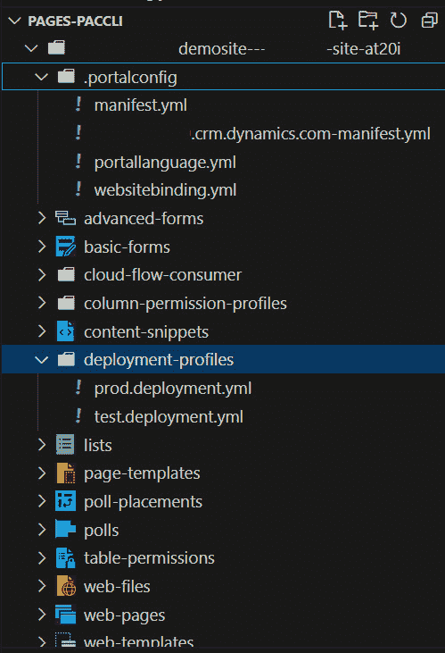

			Figure 10.15 – Deployment profiles and manifest files in Power Pages
			Manifest files
			When downloading a website from Power Pages, the PAC CLI creates two additional manifest files: an environment manifest file (`org-url-manifest.yml`) and a delete-tracking manifest file (`manifest.yml`). Both files are in YAML format and stored with the `.portalconfig` root folder structure of the downloaded website.
			The environment manifest file is created with the purpose of optimizing the upload process. After each download method is run with the PAC CLI, the download method creates a new manifest file, in case one doesn’t exist yet. If the manifest file exists, it reads the existing manifest file and updates the changes, such as any entries that were removed. When uploading content, only the updated and new entries are uploaded to Power Pages.
			The environment manifest file is environment-specific, intended mainly for development environments, and it should be added to the `git` `ignore` list.
			The delete-tracking manifest file is used to keep track of entries removed from the environment. Whenever a download method is called, all the deleted entries are added to the delete-tracking manifest file. Once an upload method is called, the method removes the unnecessary entries from Power Pages. This file is important and should be added to the source control system and transferred to the target environment.
			Example of using the PAC CLI for Power Pages
			We will take a look at the example of using the PAC CLI for the download and upload of Power Pages content:

```

# 显示所有 Power Pages 网站

pac pages list

# 下载 Power Pages 网站的内容并将其传输到选定位置。 pac pages download -id <PAGES_WEB_ID> -p <DOWNLOAD_LOCATION>

# 我们对文件进行更改，并决定上传这些更改，使用部署配置文件。 pac pages upload –path <PATH_LOCATION> --environment <ENVIRONMENT_ID> --deploymentProfile <PROFILETAG>

```

			Using Power Platform Build Tools with Power Pages
			Power Platform Build Tools offers two tasks that we have not yet explored: **Power Platform Download PAPortal** and **Power Platform Upload PAPortal**. Both tasks are intended to operate with Power Pages.
			We will first create an export pipeline that will download the website content and commit everything to the main branch. The following is a snippet of steps with the tasks needed to enable such a pipeline:

```

步骤:

- 任务: PowerPlatformToolInstaller@2

inputs:

    默认版本: true

- 任务: PowerPlatformDownloadPaportal@2

inputs:

    认证类型: 'PowerPlatformSPN'

    PowerPlatformSPN: 'PP-DevUS-SPN'

    下载路径: 'Portal/'

    WebsiteId: '$(WebsiteID)'

- 任务: CmdLine@2

inputs:

    脚本: |

    echo 提交所有更改

    git config user.email "<EMAIL@DOMAIN.COM>"

    git config user.name "<USER_NAME>"

    git init

    git checkout -B main

    git add --all

    git commit -m "代码提交"

    git push --set-upstream origin main

    git -c http.extraheader="AUTHORIZATION: bearer $(System.AccessToken)" push -f origin HEAD:main

```

			After running the export pipeline, we now have the source code in Azure Repos.
			As a next step, we should create deployment profiles with the necessary configuration values, as mentioned in the previous section (on creating a `deployment-profiles` folder with corresponding deployment YAML files). The deployment profile files might not change that often, as they might be environment-specific, but it is worth setting them up and updating them when necessary; it is a good practice to use them from the beginning in order to keep the configuration settings separate between environments.
			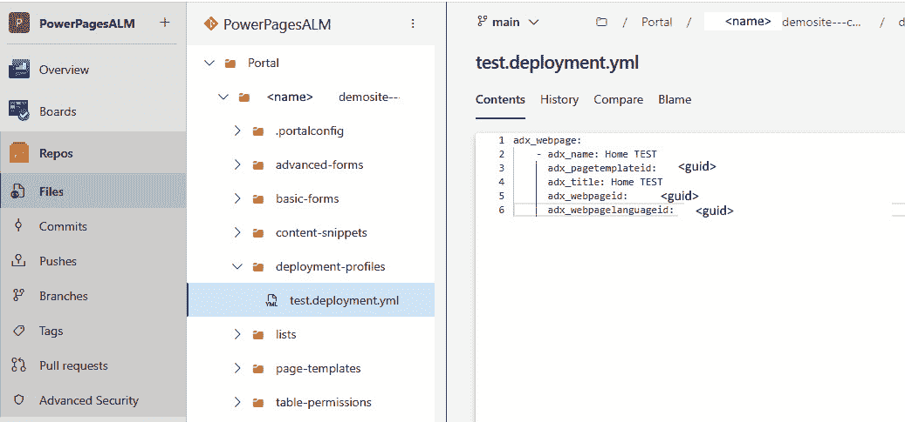

			Figure 10.16 – Deployment profiles in Azure Repos
			Whenever developers have to work on their website, we recommend using a branching strategy and pull request mechanism, in order to keep the main branch protected and always in a deployable state.
			After the pull request is validated and approved, branches can be merged to the main branch.
			Merging branches can automatically trigger the deployment pipeline. The following is a snippet of tasks from the deployment pipeline:

```

步骤:

- 任务: PowerPlatformToolInstaller@2

inputs:

    默认版本: true

- 任务: PowerPlatformUploadPaportal@2

inputs:

    认证类型: 'PowerPlatformSPN'

    PowerPlatformSPN: 'PP-DevUS-SPN'

    上传路径: 'Portal/$(WebsiteName)'

    DeploymentProfile: '$(profileTag)'

```

			Here we have two variables, `WebsiteName` and `profileTag`. The first is the name of our Power Pages instance as it appears in our Azure Repos; `profileTag` should match the tag of the deployment profile.
			We should not forget to perform proper testing of our Power Pages websites in order to validate our work and confirm the rollout to our target environment.
			We familiarized ourselves with Power Platform pipelines in *Chapter 5*, where we talked about managed pipelines. Let’s take a look at how we can utilize Power Platform pipelines to deploy our Power Pages websites.
			Using Power Platform pipelines with Power Pages
			**Power Platform pipelines** allow the quick and easy configuration of deployment pipelines that enable organizations to automate the release of a build from the development environment to other environments, such as test and production.
			In order to utilize Power Platform pipelines, all target environments must be enabled as **Managed Environments**, and all environments that are used in pipelines must be Dataverse-enabled. All websites have to be created using the enhanced data model.
			Once the prerequisites are met, we are able to proceed with deploying our websites to target environments.
			First, we need to prepare the solution. In Power Apps, we open **Solutions**, where we either create a new solution or open an existing one. Then, we open the solution and add our existing website to the solution by selecting **Add existing** | **Site**. In the sidebar that opens, we select the website that we would like to add to the solution. Once the solution objects are added to the solution, we can proceed with setting up the pipeline. While still in the newly created solution, we click **Pipelines**, which can be found in the left navigation bar. In **Pipelines**, we can select existing pipelines that the DevOps or IT operations team has created for us in advance, or we can click **Create new pipeline**. The new popup screen allows us to define the deployment pipeline, which will take our solutions from the source to the target environment:
			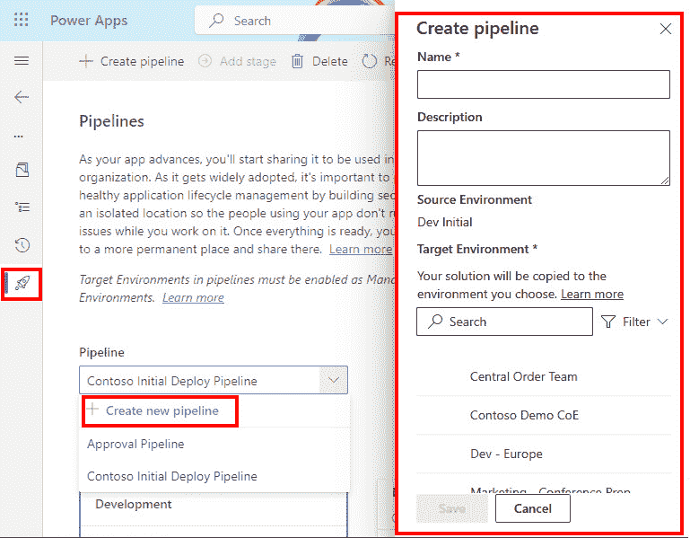

			Figure 10.17 – Power Platform pipelines
			Once the pipeline is configured, we can press the **Deploy here** button and the deployment process will start.
			This is a more simplified kind of deployment process. Still, it is suitable for many scenarios. It opens the door for app makers who might not be skilled in DevOps processes and CI/CD pipelines but are still aware of the importance of the automated approach of deploying business solutions and keeping environments separate.
			Summary
			This chapter continued building on the possibilities that Microsoft Power Platform provides to pro-developers. The platform definitely shouldn’t be taken lightly, even though it is a part of the low-code development toolset. As we have seen, it offers many opportunities for pro-developers to extend the user experience and integrate solutions with complex backend and legacy systems. Now we can see how important it is to form agile fusion teams where pro-developers have the ability to customize solutions using different custom components, in order to deliver on project requirements.
			We looked at examples of how connection references and environment variables can be used together with the DevOps approach. We continued with a look at canvas components and component libraries. We then covered the Power Apps component framework and code components. All these components can be added to solutions as solution objects, and DevOps pipelines can be used to deploy them securely to other environments as development progresses. We closed this chapter by taking a look at Power Pages ALM. We have investigated how we can use Power Platform Build Tools to support ALM process for our websites, as well as checked a simpler approach using managed pipelines in Power Platform.
			The next chapter will focus on best practices for managing environments in a governed and secure way and how the IT operations team can describe environments using code. This is a very important part of the DevOps life cycle that we have to address, even though it is not very pro-dev-oriented.
			Further reading

				*   Connectors architecture: [https://learn.microsoft.com/en-us/connectors/connector-architecture](https://learn.microsoft.com/en-us/connectors/connector-architecture)
				*   Connection references: [https://learn.microsoft.com/en-us/power-apps/maker/data-platform/create-connection-reference](https://learn.microsoft.com/en-us/power-apps/maker/data-platform/create-connection-reference)
				*   Environmental variables: [https://learn.microsoft.com/en-us/power-apps/maker/data-platform/environmentvariables](https://learn.microsoft.com/en-us/power-apps/maker/data-platform/environmentvariables)
				*   Component library: [https://learn.microsoft.com/en-us/power-apps/maker/canvas-apps/component-library](https://learn.microsoft.com/en-us/power-apps/maker/canvas-apps/component-library)
				*   Power Apps component framework: [https://learn.microsoft.com/en-us/power-apps/developer/component-framework/overview](https://learn.microsoft.com/en-us/power-apps/developer/component-framework/overview)
				*   Power Pages ALM: [https://learn.microsoft.com/en-us/power-pages/configure/portals-alm](https://learn.microsoft.com/en-us/power-pages/configure/portals-alm)

```
