# <st c="0">11</st>

# <st c="3">通过设计最佳实践管理环境生命周期</st>

<st c="66">每个组织在开发任何类型的业务应用程序时，都应优先在受治理和安全的环境上构建弹性解决方案。</st> <st c="226">在没有管控和治理的环境中实施</st> **<st c="239">DevOps</st>** <st c="245">可能会导致不合规和不一致的流程，从而影响应用工作负载的效率和可靠性。</st> <st c="422">缺乏治理的环境更容易受到漏洞的攻击，即使潜在的危害是内部员工无意造成的。</st> <st c="533">内部员工。</st>

<st c="552">本章重点探讨经过验证的最佳实践和指南，这些实践和指南可以帮助组织构建有助于负责任创新的环境，同时确保合规性和安全性。</st> <st c="746">我们将深入研究触及治理、合规、安全性和自动化等领域的不同设计原则，并探讨如何自动配置 Power Platform 环境，从而使其减少</st> <st c="962">配置错误的风险。</st>

<st c="983">我们将研究</st> **<st c="1006">Power Platform 良构架框架</st>** <st c="1047">以及</st> **<st c="1052">Power Platform 着陆区</st>** <st c="1080">并解释如何在组织中部署着陆区。</st> <st c="1145">接下来我们将继续探讨如何通过代码描述应用工作负载，以及如何采用自动化方法管理环境，而不是手动管理。</st> <st c="1323">由于运营团队负责为每个人提供一个受治理的工作空间来进行创新，我们将在本章最后讨论 Power Platform</st> **<st c="1461">卓越中心</st>** <st c="1481">（</st>**<st c="1483">CoE</st>**<st c="1486">），它帮助组织培养应用开发者并提高应用采纳度，同时关注</st> <st c="1570">治理问题。</st>

<st c="1584">正如我们所看到的，本章稍微转变了一下话题，更多地讨论了与运营团队相关的能力。</st> <st c="1721">这些是平台采纳和 DevOps 方法成功采纳的非常重要的方面。</st> <st c="1845">尽管如此，开发者和应用开发者仍然可能会发现了解这些选项有价值。</st> <st c="1931">这些选项。</st>

<st c="1945">我们将涵盖以下</st> <st c="1974">主要主题：</st>

+   <st c="1986">基于设计</st> <st c="2010">最佳实践</st>

+   <st c="2024">自动化环境生命周期</st> <st c="2053">管理</st>

+   <st c="2069">Power</st> <st c="2076">平台 CoE</st>

# <st c="2088">技术要求</st>

<st c="2111">为了跟随本章内容，我们建议具备以下条件：</st> <st c="2181">已具备：</st>

+   **<st c="2190">Power Platform 订阅</st>**<st c="2218">：我们可以注册 Power Platform 开发计划（</st>[<st c="2275">https://powerapps.microsoft.com/en-us/developerplan/</st>](https://powerapps.microsoft.com/en-us/developerplan/)<st c="2328">），如果我们已经有 Microsoft Entra ID 工作账户，或者我们可以加入</st> **<st c="2405">Microsoft 365 开发者</st>** **<st c="2429">计划</st>** <st c="2436">(</st>[<st c="2438">https://developer.microsoft.com/en-us/microsoft-365/dev-program</st>](https://developer.microsoft.com/en-us/microsoft-365/dev-program)<st c="2501">)。</st>

+   **<st c="2504">Azure 订阅</st>**<st c="2523">：我们可以按照以下网站的指导，申请一个免费的 Azure 账户：</st> [<st c="2604">https://azure.microsoft.com/en-us/free</st>](https://azure.microsoft.com/en-us/free)<st c="2642">。账户创建完成后，可以通过以下 URL 访问 Azure 门户：</st> [<st c="2718">https://portal.azure.com/</st>](https://portal.azure.com/)<st c="2743">。</st>

+   **<st c="2744">Azure DevOps 服务</st>**<st c="2766">：我们可以随时创建一个 DevOps 组织，并且是免费的：</st> [<st c="2824">https://learn.microsoft.com/en-us/azure/devops/user-guide/sign-up-invite-teammates</st>](https://learn.microsoft.com/en-us/azure/devops/user-guide/sign-up-invite-teammates)<st c="2906">。</st>

+   **<st c="2907">Visual Studio Code</st>**<st c="2926">：这可能是另一种首选的 IDE 或文本编辑工具。</st>

+   **<st c="2988">Terraform</st>**<st c="2998">：Terraform 的安装指导可以在这里找到：</st> [<st c="3060">https://developer.hashicorp.com/terraform/install</st>](https://developer.hashicorp.com/terraform/install)<st c="3109">。</st>

+   **<st c="3110">示例</st>**<st c="3118">：本章讨论的示例位于以下仓库</st> <st c="3189">：</st> [<st c="3192">https://github.com/PacktPublishing/Mastering-DevOps-on-Microsoft-Power-Platform/tree/main/Chapter11</st>](https://github.com/PacktPublishing/Mastering-DevOps-on-Microsoft-Power-Platform/tree/main/Chapter11)<st c="3291">。</st>

# <st c="3292">基于设计最佳实践</st>

<st c="3330">本节专注于 Power Platform 架构良好的框架中定义的指导方针和最佳实践，以及作为参考实现的 Power Platform **<st c="3513">着陆区</st>**<st c="3525">。遵循这些实践将帮助组织构建强大、可扩展且安全的 Power</st> <st c="3618">Platform 工作负载。</st>

## <st c="3637">Power Platform 架构良好</st>

**<st c="3669">Power Platform Well-Architected</st>** <st c="3701">是一个</st> <st c="3707">框架，汇集了最佳实践和建议，帮助各种规模的组织</st> <st c="3797">设计、构建并实现其在 Power Platform 上运行的工作负载的最优架构设计。</st>

<st c="3920">在框架的上下文中，术语</st> **<st c="3963">工作负载</st>** <st c="3971">指的是在 Power Platform 上构建的整个业务解决方案。</st> <st c="4048">该解决方案与业务需求相对应，涵盖了应用程序、数据以及支持其运行的周边基础设施。</st>

<st c="4208">Power Platform Well-Architected 提供的指南应在业务解决方案开发的各个阶段中应用。</st> <st c="4342">这些建议即使在对现有 DevOps 或 DevSecOps 流程进行增强时，仍然适用。</st> <st c="4477">Well-Architected 框架的一个关键目标是让组织能够持续评估其业务解决方案是否符合该框架的指导，并通过获得的评分验证组织在框架每个支柱上的立场。</st> <st c="4729">这有助于组织在确保工作负载与</st> <st c="4820">业务需求保持一致的同时，持续改进。</st>

<st c="4842">Power Platform Well-Architected 框架建立在</st> <st c="4897">Microsoft</st> **<st c="4927">Azure Well-Architected Framework</st>** <st c="4959">（</st>**<st c="4961">Azure WAF</st>**<st c="4970">）</st> <st c="4974">的指导基础上。与后面将在本节中介绍的 Azure 登陆区类似，Power Platform Well-Architected 也可以与 Azure WAF 一起使用，帮助设计跨越 Power Platform 和 Azure 的工作负载架构。</st> <st c="5229">这一点对已经采用 Microsoft Azure 服务并在 Azure 中运行工作负载的组织尤其重要。</st>

<st c="5346">Power Platform Well-Architected 包括五个基础性支柱，旨在提升 Power Platform 工作负载的质量。</st> <st c="5478">这五个支柱围绕以下内容组织：</st>

+   **<st c="5532">可靠性</st>**<st c="5544">：确保用于运行业务解决方案的工作负载能够满足正常运行时间要求，并且我们有一个恢复计划</st> <st c="5676">以应对突发情况</st>

+   **<st c="5684">安全性</st>**<st c="5693">：这</st> <st c="5700">有助于保护服务免受各种威胁</st> <st c="5757">和漏洞的影响</st>

+   **<st c="5776">运营卓越</st>**<st c="5799">：这</st> <st c="5806">专注于促进负责任的开发和安全的</st> <st c="5861">部署实践</st>

+   **<st c="5881">性能效率</st>**<st c="5904">：这</st> <st c="5912">侧重于确保工作负载可扩展，通过健康监控，我们可以深入了解</st> <st c="6017">性能效率</st>

+   **<st c="6039">体验优化</st>**<st c="6063">：这是为了确保运行解决方案的工作负载易于</st> <st c="6138">使用</st>

<st c="6144">每个支柱都有自己的设计原则、检查清单、设计建议、权衡取舍以及评估问题。</st> <st c="6268">对于每个支柱，有些建议容易实现，而另一些则需要从基础设施和应用角度进行适当规划才能实现。</st> <st c="6433">我们还需要意识到，对于每个支柱，都存在权衡取舍，可能需要牺牲一个支柱的某些特性，以便让</st> <st c="6568">另一个受益。</st>

<st c="6578">Power Platform Well-Architected 评估</st>

<st c="6625">无论</st> <st c="6633">我们是构建新的工作负载，还是已经有一个在运行中但希望了解潜在的改进点，Power Platform Well-Architected 都提供了对每个支柱的评估，给出建议和支持材料，帮助改进工作负载的设计。</st> <st c="6926">从评估工具中获得的建议应该导出并添加到 DevOps 工具中的项目待办事项中，如 Azure Boards 或 GitHub Issues。</st> <st c="7096">我们应该遵循持续改进的过程，定期评估我们的环境。</st> <st c="7193">Power Platform Well-Architected 评估可以在</st> <st c="7253">这里找到：</st> [<st c="7259">https://aka.ms/powa/assessment</st>](https://aka.ms/powa/assessment)<st c="7289">。</st>

### <st c="7290">可靠性</st>

<st c="7302">这个支柱的重点是</st> <st c="7326">确保我们正在构建一个具有韧性和可靠性的工作负载，能够在</st> <st c="7468">合理的时间内从任何潜在的操作故障中恢复。</st>

<st c="7489">当我们在 Power Platform 上构建工作负载时，收集并记录所有业务需求是我们的责任。</st> <st c="7501">业务需求将帮助我们决定哪些工具和技术将支持工作负载，以及基础设施和应用设计的形态。</st> <st c="7605">围绕技术的这些决策和遵循业务需求对于制定故障恢复计划至关重要。</st> <st c="7781">为了支持工作负载更加具有韧性，我们应该结合监控功能，通过这些功能，工作负载可以识别并应对操作故障。</st> <st c="7922">它还将作为使用情况的洞察，能够帮助改进</st> <st c="8161">工作负载。</st>

#### <st c="8174">推荐示例</st>

<st c="8198">目前，在可靠性支柱的背景下有八项推荐实践，其中一些与开发人员直接相关，例如在业务解决方案中实现健壮的错误处理和瞬态故障处理机制。</st> <st c="8458">其他建议更多是面向 IT 运维团队，例如持续捕捉运行时间以衡量解决方案的</st> <st c="8582">健康指标。</st>

<st c="8600">其中一项推荐特别有趣，因为它通过应用混沌工程的原理，将 DevOps 实践与应用程序弹性测试相结合。</st> **<st c="8782">混沌工程</st>** <st c="8799">是一种</st> <st c="8805">帮助组织通过系统地向整个应用工作负载引入可控中断来增强其工作负载的实践，从而模拟</st> <st c="8962">现实世界的停机。</st>

<st c="8981">与混沌工程相关的是另一种有趣的工作负载测试实践，称为</st> **<st c="9075">故障注入测试</st>**<st c="9098">。它</st> <st c="9105">有助于我们识别解决方案在面对特定组件或依赖项故障时的响应。</st> <st c="9213">在这种情况下，测试更具针对性，在测试过程中故意向特定组件注入故障。</st> <st c="9318">测试过程中的注入。</st>

<st c="9334">如果我们想进行此类测试，了解我们的基准行为是非常重要的。</st> <st c="9419">根据实验的不同以及我们计划测试的内容，我们可以为实验构建一个假设，通过该实验来衡量基准行为。</st> <st c="9560">基准行为将作为一个基准，我们将其与实验结果进行比较。</st> <st c="9670">为了测量基准，我们可以简单地按常规方式运行并测试我们的应用程序/流程，不做任何中断。</st> <st c="9791">然后，我们开始向系统注入故障，并从我们通过监控工作负载收集的分析和遥测数据中获取见解。</st> <st c="9950">举一个故障注入的例子，我们可以向后端服务或 Power Automate 流程中引入延迟，或者在从 Power Automate 流程或后端服务获取结果时返回（模拟的）错误代码，以模拟服务故障。</st> <st c="10186">我们收集到的见解会被记录下来，随着我们从中学习，我们可以制定修复计划并改进</st> <st c="10303">我们的工作负载。</st>

<st c="10316">正如我们</st> <st c="10323">所看到的，这些做法具有破坏性，因此应该在预生产环境中执行</st> <st c="10417">。</st>

<st c="10430">这两种测试实践是相互关联的，并且应该是 DevOps 推动的持续改进过程的一部分。</st> <st c="10556">我们</st> <st c="10558">可以使用</st> **<st c="10605">Power Apps 测试引擎</st>**<st c="10627">来构建自己的故障注入测试，例如，使用连接器模拟功能。</st> <st c="10685">该测试可以通过 PAC CLI 调用，这使我们能够在 CI/CD 管道中实现自动化。</st> <st c="10786">我们已经在</st> *<st c="10822">第八章</st>*<st c="10831">中展示了这样的一个示例。</st>

<st c="10832">对于可能在 Azure 上有后台系统或通过自定义连接器安全地暴露 API 的情况，我们可以利用一个名为</st> **<st c="11015">Azure Chaos Studio</st>** <st c="11033">的服务来</st> <st c="11038">对在 Azure 上运行的服务进行实验。</st> **<st c="11106">Azure Chaos Studio</st>** <st c="11124">是一个托管的混沌工程实验平台，允许我们设置不同的实验，目标是 Azure 中的服务。</st> <st c="11262">通过这个工具，我们可以定义模拟现实生活中中断的实验，例如网络连接问题和后台服务</st> <st c="11401">性能下降。</st> <st c="11428">更多关于 Azure Chaos Studio 的信息可以在</st> <st c="11468">这里找到：</st> [<st c="11474">https://azure.microsoft.com/en-us/products/chaos-studio</st>](https://azure.microsoft.com/en-us/products/chaos-studio)<st c="11529">。</st>

### <st c="11530">安全性</st>

<st c="11539">Well-Architected 的下一个支柱与安全性相关。</st> <st c="11543">它专注于构建能够承受潜在攻击的工作负载，并整合了三项基本安全原则——保密性、完整性和可用性。</st> <st c="11600">在设计业务解决方案或工作负载架构时，我们建议采用</st> <st c="11852">**<st c="11856">Microsoft 零信任模型</st>**<st c="11882">来减轻安全风险。</st> <st c="11911">Microsoft 零信任模型围绕三个</st> <st c="11963">关键原则展开：</st>

+   **<st c="11978">明确验证</st>**<st c="11996">：确保</st> <st c="12005">通过根据各种数据点进行身份验证和授权，只有可信实体才能获得访问权限。</st> <st c="12134">这样做将允许实体仅访问他们被授权访问的内容，并仅执行他们可以执行的操作。</st> <st c="12262">。</st>

+   **<st c="12270">最小权限访问</st>**<st c="12293">：遵循</st> <st c="12303">最小权限原则。</st> <st c="12338">通过限制身份的权限，我们</st> <st c="12384">正在限制可以做什么、做多久以及可以访问哪些资源。</st> <st c="12439">。</st>

+   **<st c="12455">假设发生泄露</st>**<st c="12469">：工作负载</st> <st c="12481">应当设计成我们假设可能会发生泄露的方式。</st> <st c="12546">考虑到这一点，我们正在实施控制措施，以降低风险和潜在的损害，万一发生</st> <st c="12645">这种情况。</st>

#### <st c="12653">推荐示例</st>

<st c="12677">此</st> <st c="12683">安全支柱侧重于 10 条建议。</st> <st c="12730">其中一些已在</st> *<st c="12767">第七章</st>* <st c="12776">中涉及过，我们当时讨论了 DevSecOps。</st> <st c="12809">这些内容包括威胁建模、静态应用安全测试以及应用程序秘密保护等实践。</st> <st c="12931">我们还提到，开始在身份层面强化我们的安全防御非常重要，因为身份层是防御的第一道防线。</st> <st c="13069">由于所有 Power Platform 产品都利用 Microsoft Entra ID，我们可以通过配置条件访问控制、通过安全角色配置访问权限等方式来构建身份边界。</st> <st c="13264">为了了解系统中谁做了什么，我们应启用相关环境的审计日志。</st> <st c="13366">保留审计记录对于防止潜在的否认攻击至关重要。</st> <st c="13451">然而，我们可以利用专门构建的工具，</st> <st c="13569">而不是手动查看日志以查找常见的攻击模式。</st>

**<st c="13585">Microsoft Sentinel</st>** <st c="13604">是一个云</st> **<st c="13616">安全信息和事件管理</st>** <st c="13657">(</st>**<st c="13659">SIEM</st>**<st c="13663">) 工具，运行在 Microsoft Azure 中，帮助通过分析来自不同 Power Platform 服务的活动日志来监控和检测潜在威胁。</st> <st c="13738">通过使用 Power Platform 解决方案，我们现在可以利用</st> <st c="13805">Microsoft Sentinel 来检测与 Power Platform 相关的各种异常情况，包括 Dataverse。</st> <st c="13968">通过不同的数据连接器，该解决方案获取并分析活动日志和库存数据。</st> <st c="14071">数据连接器从不同的数据源收集数据，</st> <st c="14100">允许 Sentinel 使用内置的分析规则来检测</st> <st c="14189">以下内容：</st>

+   <st c="14203">是否有多个 Power Apps 应用程序</st> <st c="14245">被删除</st>

+   <st c="14257">是否有任何被 Entra ID 标记为受损的用户访问了</st> <st c="14318">Power Platform</st>

+   <st c="14332">是否有应用程序被分享给新创建的</st> <st c="14377">来宾用户</st>

+   <st c="14388">DLP 策略是否已更新或删除</st> <st c="14435">以及更多</st>

+   <st c="14443">当离职员工创建或修改 Power Automate 流程时，</st> <st c="14509">以及更多</st>

<st c="14517">该解决方案的安装是在 Azure 门户中的 Microsoft Sentinel 服务中进行的。</st> <st c="14614">要使用 Azure 门户，我们需要登录到我们的 Azure 订阅。</st> <st c="14692">在那里，我们需要配置一个 Log Analytics 工作区和 Microsoft Sentinel 服务。</st> <st c="14785">完成后，我们可以进入我们的 Sentinel 服务。</st> <st c="14849">在左侧导航栏下，选择</st> **<st c="14882">内容管理</st>** <st c="14900">|</st> **<st c="14903">内容中心</st>**<st c="14914">，我们可以找到 Microsoft Sentinel 提供的所有解决方案列表。</st> <st c="14986">通过搜索，我们可以轻松找到 Power Platform 解决方案。</st> <st c="15052">选择它并点击</st> **<st c="15072">安装</st>**<st c="15079">。安装完成后，我们需要启用数据连接器，如</st> *<st c="15150">图 11</st>**<st c="15159">.1</st>*<st c="15161">所示。完成该过程，我们需要按照一系列步骤操作，例如</st> <st c="15233">创建一个</st> **<st c="15245">Azure Data Lake Storage Gen2</st>** <st c="15273">实例，供 Power Platform 自助分析使用，并确保我们拥有部署所需组件到 Azure 的所有权限。</st> <st c="15449">所有七个数据连接器都必须配置，因为每个连接器都有其特定用途。</st> <st c="15529">我们建议按照</st> *<st c="15597">图 11</st>**<st c="15606">.1</st>* <st c="15608">后面的提示，验证安装是否成功完成：</st>

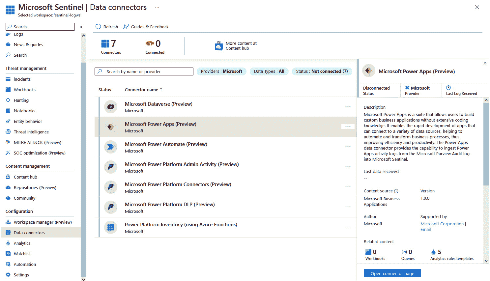

<st c="17486">图 11.1 – Microsoft Sentinel 解决方案 for Power Platform</st>

<st c="17546">Microsoft Sentinel 解决方案 for Power Platform – 先决条件与安装</st>

<st c="17626">该解决方案帮助我们检测并响应与 Power Platform 相关的潜在威胁和事件。</st> <st c="17731">该解决方案目前处于预览阶段。</st> <st c="17769">有关先决条件及其如何部署的信息可以在</st> <st c="17848">这里找到：</st> [<st c="17854">https://learn.microsoft.com/en-us/azure/sentinel/business-applications/deploy-power-platform-solution</st>](https://learn.microsoft.com/en-us/azure/sentinel/business-applications/deploy-power-platform-solution)<st c="17955">。</st>

<st c="17956">在</st> <st c="17964">Power Platform 优良架构的背景下，安全支柱推荐的另一个实践是</st> <st c="18076">进行</st> **<st c="18087">模拟攻击</st>**<st c="18104">。这些模拟攻击有不同的目的。</st> <st c="18150">当然，通过这样的演练，我们希望识别任何潜在威胁，但通过这种方式，我们还可以验证工程师的准备情况以及修复流程，特别是在战争游戏演练中，其中有红队和蓝队。</st> <st c="18409">这首先涉及尝试发起一次模拟攻击，而另一方则试图识别并防御</st> <st c="18530">这次攻击。</st>

<st c="18541">除了模拟攻击，</st> **<st c="18576">安全</st>** <st c="18584">工作区在 Power Pages 中是我们进行安全扫描的地方，用于评估网站是否存在潜在的安全漏洞。</st> <st c="18716">它是一个一站式商店，可以找到与页面相关的所有配置角色和权限信息。</st> <st c="18825">我们还可以为保护</st> <st c="18910">我们网站的 Web 应用防火墙配置额外的规则。</st> <st c="18925">更多关于安全扫描的信息可以在</st> <st c="18976">这里找到：</st> [<st c="18982">https://learn.microsoft.com/en-gb/power-pages/security/security-scan</st>](https://learn.microsoft.com/en-gb/power-pages/security/security-scan)<st c="19050">。</st>

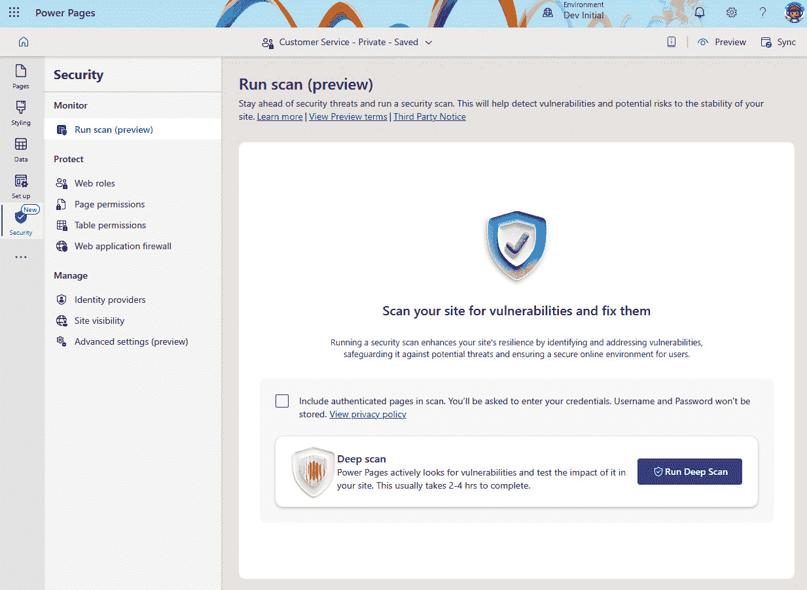

<st c="20121">图 11.2 – Power Pages 安全扫描</st>

<st c="20162">要了解</st> <st c="20177">我们 Power Platform 租户的整体安全状况，微软最近在 Power Platform 管理中心推出了</st> **<st c="20270">安全</st>** <st c="20278">中心。</st> <st c="20319">它允许管理员快速采取措施，根据识别出的建议来提升安全状况，比如为环境应用 DLP 策略、配置</st><st c="20492">租户隔离</st>，<st c="20510">和审计。</st>

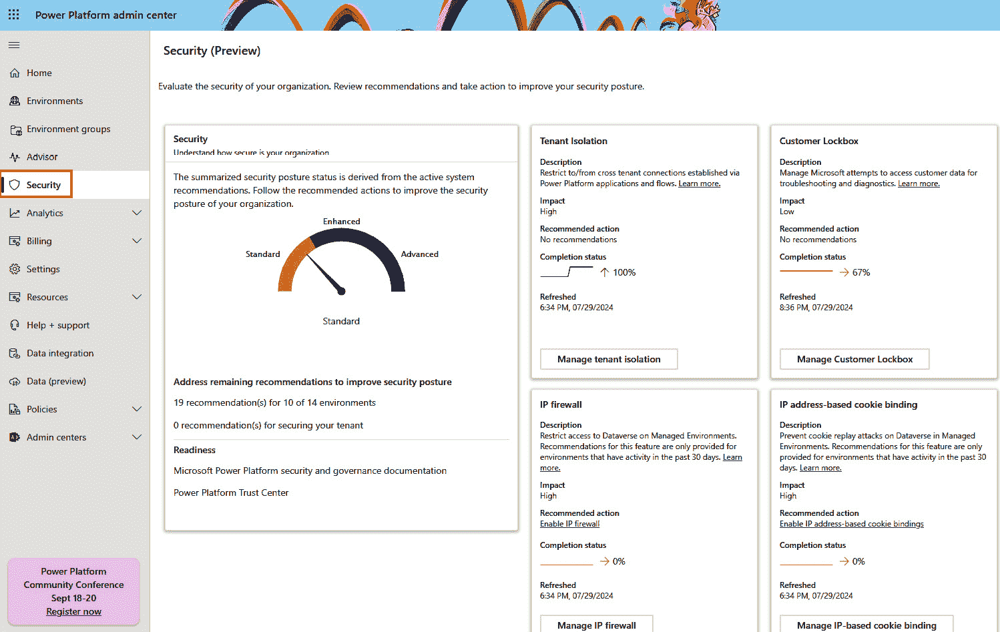

<st c="22366">图 11.3 – Power Platform 安全中心</st>

### <st c="22411">卓越运营</st>

<st c="22434">这一</st> <st c="22440">支柱强调创造一个优先考虑运营卓越的工作环境。</st> <st c="22527">我们的意思是通过实施融合开发方法并采用 DevOps 文化，将最佳开发实践带入工作负载团队。</st> <st c="22677">这样做将使工作负载团队能够遵循自动化和可重复的流程，从而实现安全的开发和部署实践。</st> <st c="22826">流程必须遵循组织内设定的合规性和治理标准，才能高效和有效。</st> <st c="22955">构建与组织政策一致的标准化流程，可能会在交付项目时导致额外的时间和成本。</st> <st c="23099">项目的交付。</st>

<st c="23111">目前，针对这一支柱有 11 条建议，集中于融合开发方法和构建 DevOps 实践，标准化开发实践，构建监控系统，寻找自动化机会以减少手动任务，并实施</st> <st c="23396">测试策略。</st>

<st c="23413">由于这些建议在本书中已有涉及，我们将跳到下一个支柱。</st> <st c="23525">有关深入指导，请访问</st> *<st c="23576">进一步阅读</st>*<st c="23591">提供的链接。</st>

### <st c="23592">性能效率</st>

<st c="23615">下一个支柱关注</st> <st c="23619">与构建可扩展且高效的工作负载相关的建议，并在不牺牲用户体验的情况下理解权衡。</st> <st c="23793">设计原则帮助我们围绕我们正在开发的工作负载的业务需求设定性能目标。</st> <st c="23917">在定义性能目标时，我们应该考虑用户如何看待我们的解决方案，以及什么样的性能对他们来说是不可接受的。</st> <st c="24067">我们应该设定可实现的目标并</st> <st c="24113">记录它们。</st>

<st c="24127">为了确保性能目标的达成，我们持续监控工作负载的整个生命周期，以了解是否达到了预定目标。</st> <st c="24307">如果目标未能按预期达成，我们应该优化工作负载。</st> <st c="24382">在监控方面，我们使用了 Power Platform 的内建功能。</st> <st c="24456">正如我们在本书中已经看到的，Power Platform 可以通过</st> **<st c="24533">Azure Application Insights</st>**<st c="24559">进行扩展。作为 Azure Monitor 的一部分，Azure Application Insights 是一款应用性能监控工具，不仅可以从 Power Platform 应用程序收集遥测数据，还可以从运行在 Azure 云或本地环境中的其他服务中收集数据。</st> <st c="24594">这帮助我们理解解决方案架构中的更广泛图景和瓶颈，因为用户可能会将性能问题归咎于 Power Platform，因为这是他们与之互动的部分。</st> <st c="24854">然而，性能问题可能出现在其他后端系统或数据库系统中，例如某些过程执行时间过长</st> <st c="25044">或查询执行过慢。</st>

<st c="25203">规划高性能工作负载时，一个重要方面就是考虑 Power Platform 的请求限制。</st> <st c="25321">由于 Power Platform</st> <st c="25338">是一个</st> **<st c="25344">软件即服务</st>** <st c="25365">(</st>**<st c="25367">SaaS</st>**<st c="25371">)平台，提供服务的后台系统和服务本身有预定的限制，以确保每个 Power Platform 用户都能满足质量和服务级别协议。</st> <st c="25565">Power Platform 具有</st> **<st c="25584">服务保护限制</st>** <st c="25614">，用以保护 Power Platform 服务免受异常或过量请求的影响。</st> <st c="25623">这些资源限制应当由解决方案架构师在设计工作负载架构时考虑。</st> <st c="25711">这些限制在设计工作负载架构时必须加以考虑。</st>

<st c="25834">Power Platform 请求限制</st>

<st c="25864">尽管</st> <st c="25873">Power Platform 的请求限制已经在增加，并且常规用户不太可能达到请求限制，但值得注意的是这些限制存在，并且在准备架构设计时应该考虑到这些限制。</st> <st c="26112">有关请求限制的更多信息，请访问</st> <st c="26167">此链接：</st> [<st c="26173">https://learn.microsoft.com/en-us/power-platform/admin/api-request-limits-allocations</st>](https://learn.microsoft.com/en-us/power-platform/admin/api-request-limits-allocations)<st c="26258">。</st>

#### <st c="26259">推荐示例</st>

<st c="26283">目前，这个</st> <st c="26299">支柱包含了 10 个推荐措施，重点关注监控工作负载、操作和用户行为，这将帮助我们分析和改进 Power Platform 工作负载的性能。</st> <st c="26492">这个支柱的大部分内容都集中在优化业务逻辑、自定义代码和数据性能，以及了解业务流程的性能并寻找潜在的优化机会。</st> <st c="26717">在 Azure Monitor 中捕获遥测数据使我们能够深入了解性能，并设置警报，以便及时获知工作负载的当前状态。</st> <st c="26878">这种分析数据还可以作为 CI/CD 管道中的部署门控——一个常见的例子是通过 Power Platform 中的自定义连接器使用的后端服务。</st> <st c="27078">如果由于高峰期或性能问题，服务的使用在一段时间内较高，我们可以暂停并推迟工作负载的部署，直到此问题</st> <st c="27241">得到解决。</st>

<st c="27255">一个重要的 DevOps 实践是实施</st> <st c="27302">**反馈循环**</st><st c="27306">。</st> <st c="27319">除了设置监控以收集性能瓶颈、查看工作负载在高峰期的运行情况以及检查是否发生错误外，我们还可以使用 Azure Application Insights 来深入了解用户行为，并利用这些信息规划应用程序的改进。</st> <st c="27612">我们还应考虑实现渠道，使用户能够向工作负载团队分享他们对已开发商业解决方案的反馈和建议。</st> <st c="27795">这将帮助我们确保解决方案符合他们的需求。</st> <st c="27872">这种做法已经在许多现成的产品中得以实现，通常是在应用程序中实现某种反馈按钮。</st>

<st c="28004">类似的做法也可以在 Power Platform 开发的商业解决方案中实现。</st> <st c="28102">此示例提供了逐步指导，可以在以下</st> <st c="28169">网站上找到：</st> [<st c="28178">https://learn.microsoft.com/en-us/power-apps/maker/canvas-apps/application-insights#create-custom-trace-events</st>](https://learn.microsoft.com/en-us/power-apps/maker/canvas-apps/application-insights#create-custom-trace-events)<st c="28288">。</st>

### <st c="28289">体验优化</st>

<st c="28313">Power Platform Well-Architected 框架的</st> <st c="28318">最后一个核心支柱专注于用户</st> <st c="28411">体验，以及开发人员在开发过程中应考虑的事项。</st> <st c="28479">应用程序应该以与用户期望相一致的方式构建，并且要设计以满足特定需求。</st> <st c="28621">与应用程序的交互应该简单且合乎逻辑，以便用户能够高效地完成所需的工作。</st> <st c="28749">应用程序相关的流程也应该简洁易懂</st> <st c="28814">且直观。</st>

<st c="28828">我们应该构建用户友好的应用程序，具有包容性，能够被有障碍的用户使用。</st> <st c="28935">如果该应用程序将被全球用户使用，我们应该考虑提供本地化版本以提高</st> <st c="29046">用户参与度。</st>

#### <st c="29062">推荐示例</st>

<st c="29086">该</st> <st c="29092">支柱包含九条推荐措施，专注于构建包容性、吸引力和直观性的应用程序。</st> <st c="29216">在这里，我们可以找到关于如何构建</st> <st c="29260">响应式应用程序的指导，如何利用</st> **<st c="29335">Fluent Design</st>** <st c="29348">构建可重用组件，以及如何使用</st> **<st c="29359">Power Platform Creator Kit</st>**<st c="29385">，如何实现健壮的</st> <st c="29410">错误处理控制等。</st> <st c="29446">在此支柱的背景下，DevOps 实践帮助我们遵循标准化流程，从而更快速地将更改带给</st> <st c="29586">用户。</st>

<st c="29596">Power Platform Well-Architected 深入指导</st>

<st c="29649">本节</st> <st c="29663">介绍了 Power Platform Well-Architected 核心支柱的一些内容，并分享了一些推荐示例。</st> <st c="29774">每个支柱都有一套自己的设计原则、推荐措施，更重要的是，权衡利弊，工作负载团队应该在遵循此指导时熟悉这些内容。</st> <st c="29921">当遵循这些指导时。</st> <st c="29951">有关可用工具和评估的更多信息，请访问以下</st> <st c="30045">网址：</st> [<st c="30050">https://learn.microsoft.com/en-us/power-platform/well-architected/</st>](https://learn.microsoft.com/en-us/power-platform/well-architected/)<st c="30116">。</st>

<st c="30117">我们已经</st> <st c="30125">简要讨论了帮助我们理解 Power Platform Well-Architected 目标的一些推荐措施。</st> <st c="30253">深入了解每个支柱，并通过一套最佳实践和指南来理解推荐措施，以便在 Power Platform 中设计现代应用程序时做出明智的决策，这将极大地帮助每个人，无论是构建简单还是复杂的</st> <st c="30538">业务解决方案。</st>

<st c="30557">在下一部分中，我们将探讨如何通过参考实现遵循架构最佳实践，该实现描述于</st> *<st c="30687">Power Platform</st>* *<st c="30702">登陆区</st>*<st c="30715">。</st>

## <st c="30716">Power Platform 登陆区</st>

<st c="30745">在开始</st> <st c="30759">Power Platform 采用之旅时，通常会从默认的个人生产力环境开始，并逐步从那里扩展。</st> <st c="30908">正如我们在 Power Platform 采用成熟度模型中看到的那样，这种方法与组织成熟度的早期阶段相吻合。</st> <st c="31050">然而，随着组织对平台的熟悉，它们开始寻找保护租户、设置环境策略并围绕这些策略建立政策的方法。</st> <st c="31233">通常，组织会询问如何设计最优架构，以便设置 Power Platform 来处理企业级场景。</st> <st c="31363">这时，登陆区可以作为一个有价值的资源供</st> <st c="31421">参考。</st>

**<st c="31429">登陆区</st>** <st c="31443">作为参考实现，建立了用于运行特定工作负载的良好管理环境。</st> <st c="31552">它们遵循最佳实践，构建一个强大、安全、可扩展的基础，以便在组织内使用，并随着公司采用特定技术的不断推进而不断发展。</st> <st c="31761">它们遵循跨多个设计领域的关键设计原则，如许可、安全、治理、自动化和 DevOps。</st> <st c="31901">通过登陆区，微软提供了各种技术和服务的参考实现。</st> <st c="32009">其中最广为人知的是 Azure 登陆区，这是一个帮助组织设置 Azure 环境</st> <st c="32139">和服务的总纲登陆区。</st>

### <st c="32152">Power Platform 登陆区</st>

**<st c="32181">Power Platform 登陆区</st>** <st c="32210">代表一个参考实现，组织可以</st> <st c="32271">用它来构建他们在 Power Platform 租户内的初始架构设计。</st> <st c="32369">它也可以看作是一种方法论，包含有关架构设计的指南，遵循实施最佳实践。</st> <st c="32500">在 Power Platform 的上下文中，登陆区代表一个环境，其中配置了所有支持服务、政策和安全角色，为组织提供与最佳实践和建议对齐的起始点。</st> <st c="32758">通过可用的控制，组织可以决定哪些安全政策和治理要求应该配置，以匹配</st> <st c="32898">组织的需求。</st>

<st c="32926">Power Platform 登陆区通过与现有的 Azure 订阅连接，扩展了 Azure 登陆区，这使得已经采用 Azure 云服务的客户能够使用 LCNC 开发平台（如 Microsoft Power Platform）解锁新的应用现代化场景。</st> <st c="33242">连接 Azure 订阅与 Power Platform 环境的核心点是 Microsoft Entra ID，这是一种身份和访问</st> <st c="33373">管理系统：</st>

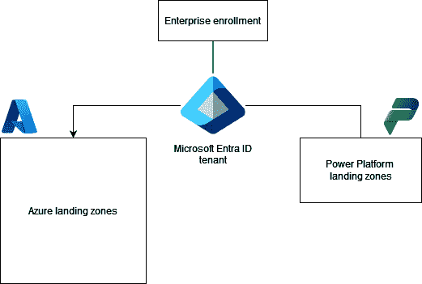

<st c="33494">图 11.4 – 使用 Power Platform 登陆区扩展 Azure 登陆区</st>

### <st c="33571">设计原则和关键设计领域</st>

<st c="33615">Power Platform 登陆区架构基于五个设计原则构建。</st> <st c="33693">这些原则在做出进一步设计决策时，作为</st> <st c="33721">指导方针：</st>

+   **<st c="33782">环境民主化</st>**<st c="33810">：环境作为管理单元，具有安全性和策略边界。</st> <st c="33894">它们的创建是为了支持业务单元和开发者，并解决</st> <st c="33964">业务需求。</st>

+   **<st c="33986">政策驱动治理</st>**<st c="34011">：实施 DLP 政策为应用开发者提供了灵活性，以便在</st> <st c="34107">保持合规的同时创建应用程序工作负载。</st>

+   **<st c="34125">单一控制和管理平面</st>**<st c="34161">：Power Platform 管理通过原生的 Power Platform 管理工具进行，以提供</st> <st c="34254">一致的体验。</st>

+   **<st c="34276">与角色无关</st>**<st c="34293">：任何开发者都欢迎在 Power Platform 中进行创新，并且在能力的视角下，所有开发者都被平等对待。</st>

+   **<st c="34410">Power Platform 原生设计和平台路线图对齐</st>**<st c="34470">：在可能的情况下，应使用原生服务和功能，这将确保一旦发布新功能，应用程序可以从这些新功能中受益。</st> <st c="34650">Power Platform 路线图使管理员和开发者可以及时了解新功能，并根据需要采纳</st> <st c="34754">它们。</st>

<st c="34771">在设计原则之外，Power Platform 登陆区架构还包括了对设计决策起重要作用的设计领域。</st> <st c="34923">它们作为决定架构设计的指南针。</st> <st c="34990">其中有八个设计领域，包含了考虑因素和建议，应该在规划架构设计时加以考虑。</st> <st c="35133">我们可以看到，这些设计领域中的一些与 Well-Architected 支柱中的推荐类似，例如平台自动化</st> <st c="35272">和 DevOps。</st>

<st c="35283">以下是</st> <st c="35297">Power Platform 的</st> <st c="35323">关键设计领域：</st>

+   **<st c="35338">许可与 AD 租户</st>**<st c="35363">：由于许可证是允许用户访问 Power Platform 服务的第一个控制点，因此该设计领域专注于理解许可证如何影响环境访问、哪种许可模型最合适（包括按需付费计划），以及关于分配许可证</st> <st c="35680">给用户的建议。</st>

+   **<st c="35689">身份与访问管理</st>**<st c="35720">：身份与访问管理与</st> **<st c="35768">基于角色的访问控制</st>** <st c="35793">(</st>**<st c="35795">RBAC</st>**<st c="35799">) 在使用户能够操作 Power Platform 中起着重要作用。</st> <st c="35884">该设计领域侧重于通过条件访问策略和多因素身份验证等控制措施来保护对租户的访问，以及与组织的安全性和</st> <st c="36117">合规性要求相一致的其他授权规则。</st>

+   **<st c="36141">环境</st>**<st c="36154">：环境在隔离数据和应用负载中起着重要作用。</st> <st c="36238">该设计领域涵盖了良好的环境策略和配置选项的重要性，例如选择环境的地理位置、启用审计以及其他用于监控用户环境行为的控制措施。</st> <st c="36478">此外，它还专注于启用托管环境，以提供一组额外的高级功能</st> <st c="36594">和控制。</st>

+   **<st c="36606">安全性、治理和合规性</st>**<st c="36643">：在许可证和角色基于访问控制（RBAC）之外，此设计领域专注于提供有关数据丢失防护（DLP）政策的建议，这些政策定义了连接器的分类及其使用政策。</st> <st c="36816">控制连接器的使用在平台的安全采纳中起着重要作用。</st> <st c="36884">平台采纳。</st>

+   **<st c="36902">管理与监控</st>**<st c="36928">：通过使用管理中心和其他第一方工具，管理员配备了管理 Power Platform 环境和构建自动化任务所需的工具。</st> <st c="37109">为了监控性能和查看审计日志，Power Platform 可以与 Azure Monitor、Microsoft Entra ID 和 Microsoft Purview 等其他服务连接，以启用额外的监控和</st> <st c="37312">审计能力。</st>

+   **<st c="37334">业务连续性和灾难恢复</st>**<st c="37376">：组织应该制定场景，确保环境的弹性和持续可用性。</st> <st c="37487">在持续可用性中，这里我们也专注于备份和环境</st> <st c="37568">恢复过程。</st>

+   **<st c="37586">连接性与互操作性</st>**<st c="37620">：这一设计领域涉及可能的连接模型，连接 Power Platform 服务及其外部服务。</st> <st c="37721">由于数据可能位于 Power Platform 外部，理解如何连接到这些数据非常重要，可以通过</st> <st c="37859">本地数据网关或</st> **<st c="37887">虚拟网络</st>** <st c="37902">（</st>**<st c="37904">VNet</st>**<st c="37908">）数据网关进行连接（当使用 Azure 数据服务时）。</st> <st c="37958">这两项服务各自有其局限性和要求，包括许可要求，可能会影响决策。</st> <st c="38065">在必要时，可以使用 Azure ExpressRoute，通过组织本地网络与 Microsoft 云服务之间的私有连接来连接组织与 Microsoft 云服务。</st> <st c="38292">这还使得连接更加可预测，适合于任务关键型应用程序。</st> <st c="38396">具有严格监管要求的组织也可能对 ExpressRoute 感兴趣。</st> <st c="38476">ExpressRoute 可作为其解决方案的一部分。</st>

+   **<st c="38492">平台自动化与 DevOps</st>**<st c="38523">：Power Platform 登陆区鼓励组织实施 DevOps 实践，使 IT 管理团队和专业开发人员能够合作，不仅管理应用生命周期，还通过环境生命周期管理、安全监控、成本管理等全面管理 Power Platform。</st> <st c="38841">以及更多。</st>

<st c="38850">如我们所见，Power Platform 登陆区提供了关于一组设计考虑事项和建议的深刻见解，这些内容可以作为组织构建包含这些设计考虑因素的架构设计的起点。</st> <st c="39108">结合 Power Platform Well-Architected，现在我们有了广泛的指导，可以帮助我们在</st> <st c="39266">Power Platform 上进行现代应用解决方案的架构决策。</st>

<st c="39281">为了查看这些设计领域的实际应用，我们可以查看</st> <st c="39345">参考实现。</st>

### <st c="39370">部署 Power Platform 登陆区参考实现</st>

<st c="39435">Power Platform 登陆区参考实现是一个模块化的架构参考，利用设计原则和关键设计领域，帮助组织构建支持应用工作负载的环境。</st> <st c="39663">这个参考实现可以根据需要进行定制，只部署必要的部分到</st> <st c="39763">组织的租户。</st>

<st c="39785">要部署 Power Platform 登陆区参考实现，我们需要一个 Azure 订阅和一个 Power Platform 租户。</st> <st c="39911">我们在本章的</st> *<st c="39953">技术要求</st>* <st c="39975">部分提供了指导链接，帮助您在需要时进行配置</st> <st c="40015">。</st>

<st c="40025">作为部署登陆区的</st> <st c="40041">前置条件之一，我们需要首先创建一个</st> **<st c="40113">用户分配的托管身份</st>** <st c="40143">（</st>**<st c="40145">UMI</st>**<st c="40148">），该身份</st> <st c="40157">具有使用 Power Platform API 的权限。</st> <st c="40205">这可以通过访问 Azure 门户并创建一个</st> <st c="40266">新的 UMI 来完成：</st>

1.  <st c="40274">在 Azure 门户中，我们应该搜索</st> `<st c="40317">托管身份</st>` <st c="40335">并打开</st> **<st c="40349">托管身份</st>** <st c="40367">页面，页面上展示了您租户中的所有托管身份：</st>

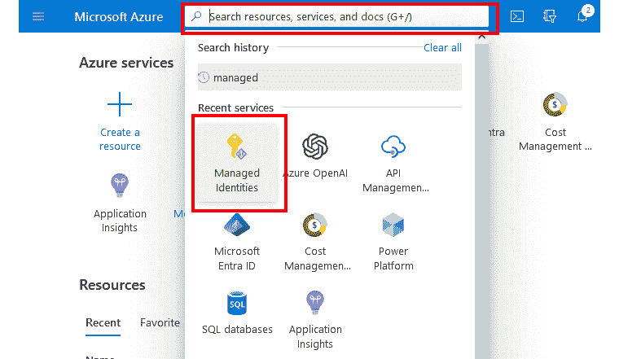

<st c="40785">图 11.5 – 托管身份</st>

1.  <st c="40817">要创建新的 UMI，我们接下来点击</st> <st c="40853">点击</st> **<st c="40856">创建</st>**<st c="40862">：</st>

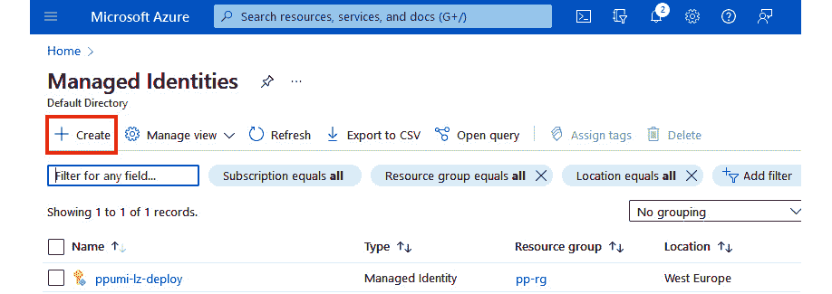

<st c="41300">图 11.6 – 创建新的托管身份</st>

<st c="41345">在此阶段，我们需要提供所有创建托管身份的详细信息。</st> <st c="41431">这</st> <st c="41435">包括选择</st> **<st c="41455">Azure 订阅</st>**<st c="41473">，在此我们可以选择已有的资源组，也可以直接从该</st> <st c="41570">页面提供一个新的资源组。</st>

1.  <st c="41586">通过提供托管身份实例的详细信息，例如选择 UMI 将要配置的 Azure 区域以及名称，我们可以通过</st> <st c="41755">点击</st> **<st c="41764">下一步</st>**<st c="41768">来准备创建 UMI：</st>

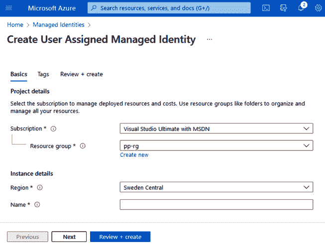

<st c="42135">图 11.7 – 配置新的 UMI</st>

1.  <st c="42171">在下一个屏幕中，我们可以添加标签。</st> <st c="42209">我们建议为 Azure 资源添加标签，</st> <st c="42257">以便以后能够对其进行分类，并将其映射到组织中的正确成本中心。</st> <st c="42354">完成后，我们通过点击</st> **<st c="42393">审查 + 创建</st>**<st c="42408">进行下一步操作，这将启动验证</st> <st c="42440">过程，以验证</st> **<st c="42464">Azure 资源管理器</st>** <st c="42486">（</st>**<st c="42488">ARM</st>**<st c="42491">）模板。</st> <st c="42504">验证过程完成后，我们可以通过</st> <st c="42573">点击</st> **<st c="42582">创建</st>**<st c="42588">来配置资源。</st>

1.  <st c="42589">一旦新 UMI 创建完成，我们继续打开该资源，在</st> **<st c="42666">概述</st>** <st c="42674">屏幕上，进入</st> **<st c="42685">托管身份</st>**<st c="42701">，找到并复制</st> **<st c="42724">客户端 ID</st>** <st c="42733">信息。</st> <st c="42747">这将在下一步中</st> <st c="42787">在 PowerShell 中使用：</st>

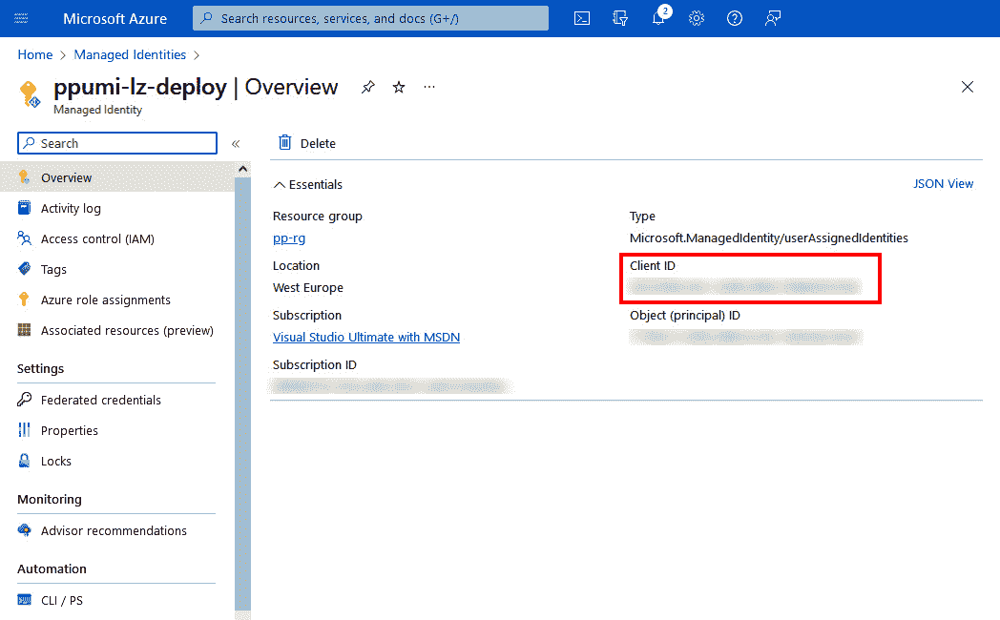

<st c="43313">图 11.8 – 托管身份概述信息</st>

<st c="43368">现在，我们准备好运行本地 PowerShell 会话或继续使用</st> **<st c="43437">Azure Cloud Shell</st>**<st c="43454">。Azure Cloud Shell 提供许多预安装的工具和模块，简化了管理，特别是当我们在权限有限的设备上工作时。</st>

<st c="43630">以下代码展示了如何使用</st> `<st c="43674">PowerOps</st>` <st c="43682">PowerShell 模块访问 Power Platform API，并将新创建的 UMI 注册为管理员管理应用程序。</st> <st c="43798">这是通过</st> <st c="43917">ARM 模板</st> <st c="43798">成功部署 Power Platform 登陆区参考实现的前提条件。</st>

<st c="43931">如果我们在本地运行这些命令，我们应确保安装了</st> `<st c="44019">Az.Accounts</st>` <st c="44030">和</st> `<st c="44035">PowerOps</st>` <st c="44043">模块。</st> <st c="44053">对于 Azure Cloud Shell，这一步</st> <st c="44090">是无需执行的：</st>

```
 Install-Module -Name Az.Accounts -Force
Install-Module -Name PowerOps -Force
```

<st c="44180">一旦模块安装完成，我们需要连接到我们的 Azure 租户。</st> <st c="44253">我们通过使用</st> `<st c="44274">Connect-AzAccount</st>` <st c="44291">命令来完成此操作。</st> <st c="44301">如果我们的 Azure 管理员已配置多重身份验证，我们需要使用带有特殊标志的命令，以便提供与</st> <st c="44479">设备代码</st> <st c="44301">的交互式身份验证：</st>

```
 Connect-AzAccount -UseDeviceAuthentication
```

<st c="44534">连接到 Azure 后，我们需要确保使用的是正确的 Azure 订阅。</st> <st c="44624">如果我们要使用的订阅是默认订阅，则无需执行此命令。</st> <st c="44723">如果我们有多个订阅，应该确保我们位于正确的 Azure 订阅中。</st> <st c="44823">Azure 订阅 ID 可以在 Azure 门户中找到，或者通过使用</st> `<st c="44894">Get-AzSubscription</st>`<st c="44912"> 命令返回所有订阅的列表、其 ID 及其状态。</st> <st c="44986">要设置当前工作上下文，我们使用带有</st> <st c="45049">订阅 ID 的命令：</st>

```
 Set-AzContext -Subscription "xxxx-xxxx-xxxx-xxxx"
```

<st c="45116">最后，我们准备好执行 UMI 的注册。</st> <st c="45179">我们可以从之前创建的身份中复制客户端 ID，方法是在</st> <st c="45249">Azure 门户中：</st>

```
 $clientId = '<Azure UMI Client Id>'
Register-PowerOpsAdminApplication -ClientId $clientId
```

<st c="45352">注册过程完成后，我们可以继续进行部署设置。</st> <st c="45434">在托管 Power Platform 着陆区实施指南的 GitHub 仓库中（</st>[<st c="45524">https://github.com/microsoft/industry/tree/main/foundations/powerPlatform</st>](https://github.com/microsoft/industry/tree/main/foundations/powerPlatform)<st c="45598">），我们可以找到一个</st> **<st c="45617">部署到 Microsoft 云</st>** <st c="45642">按钮。</st> <st c="45651">选择此选项后，我们将被转移到 Azure 门户，Power Platform 着陆区将通过自定义 ARM 模板进行部署：</st>

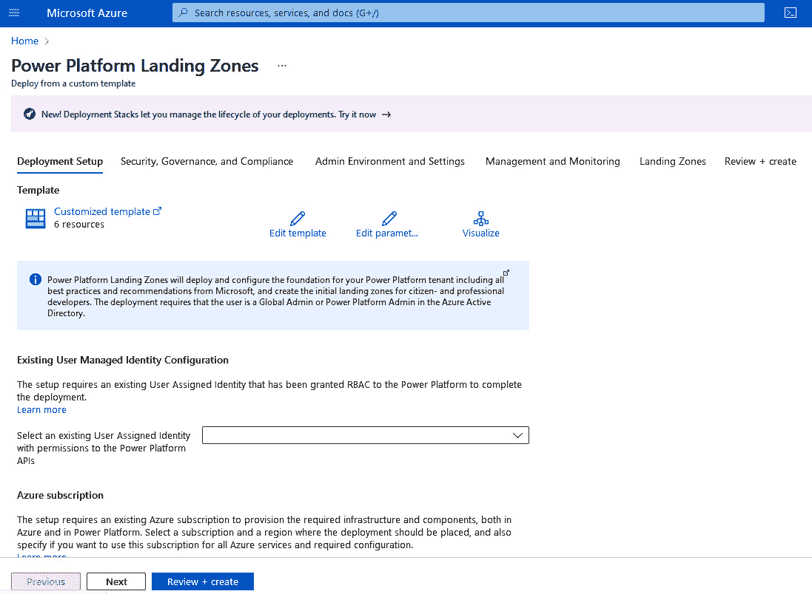

<st c="47001">图 11.9 – 在 Azure 门户中的 Power Platform 着陆区部署模板</st>

1.  <st c="47087">从</st> *<st c="47099">图 11</st>**<st c="47108">.9</st>*<st c="47110">中，我们可以看到设置着陆区参考实现过程中的第一个标签是</st> **<st c="47214">部署设置</st>**<st c="47230">。在这里，我们将连接到新创建的 UMI 并选择我们的 Azure 订阅以及位置。</st>

1.  <st c="47336">下一个标签是</st> **<st c="47351">安全、治理和合规性</st>**<st c="47387">，允许进行租户范围的 DLP 策略配置，通过为连接器选择不同级别的限制。</st> <st c="47496">在此步骤中创建的 DLP 策略将作为基准策略，后续可以添加新的 DLP 策略。</st> <st c="47605">还可以在此应用其他策略，如租户隔离、访客用户和共享设置。</st>

1.  <st c="47707">下一个标签是</st> **<st c="47724">管理员环境与设置</st>**<st c="47754">，允许组织创建仅用于管理目的的独立管理员环境——例如，我们可以创建一个独立环境，在其中部署一个</st> **<st c="47950">CoE 启动工具包</st>**<st c="47965">。创建独立的管理员环境将导致拥有独立的开发、测试和生产环境，以支持我们业务解决方案的应用生命周期管理。</st> <st c="48159">在这里，我们还可以找到一项策略，禁止用户自行创建不同类型的环境。</st>

1.  <st c="48265">接下来，我们有</st> **<st c="48294">管理与监控</st>**<st c="48319">。在这里，我们可以配置用于监控的其他 Azure 服务，例如 Azure Monitor 中的 Application Insights。</st> <st c="48453">此外，我们还可以为</st> <st c="48508">Power Platform 启用租户级分析。</st>

1.  <st c="48523">该过程的最后一步是配置额外的登陆区（环境），这些环境将专门面向公民开发者、专业开发者或行业解决方案。</st> <st c="48694">如果需要，我们可以跳过这一步，稍后当我们意识到需求增加且需要更具体的环境时，我们可以使用</st> **<st c="48846">登陆区自动配置模板</st>** <st c="48884">选项，使用相同的 Power Platform 登陆区 GitHub 仓库来配置</st> <st c="48975">更多环境。</st>

1.  <st c="48993">在过程结束时，我们可以回顾我们所做的所有配置选项，并通过选择</st> **<st c="49131">创建</st>** <st c="49137">按钮来完成配置过程。</st>

<st c="49145">这些标签页包含了针对参考实现的关键设计领域的配置设置。</st> <st c="49254">这些是我们在创建自己的架构设计时需要考虑的事项。</st> <st c="49343">即使我们来自一个较小的组织，实施登陆区似乎过于复杂，我们仍然应该遵循关键设计领域，并将登陆区参考实现作为我们的北极星，作为指导我们前进的方向，实施最佳实践和保护措施，以保护组织数据。</st> <st c="49714">我们可以从小规模开始，但随着采用的增长，我们将通过标准化和一致性的方法看到登陆区在资源配置中的好处。</st> <st c="49871">受管环境。</st>

<st c="49893">现在我们已经看过如何使用登陆区参考实现来配置新的环境，我们将朝着使用各种工具自动创建和管理环境的方向前进，同时仍然包括设计领域中的重要部分，例如添加 DLP 策略</st> <st c="50197">和许可。</st>

# <st c="50211">自动化环境生命周期管理</st>

<st c="50256">到目前为止，我们</st> <st c="50268">一直使用 Power Platform 管理中心来管理环境和 Power Platform 租户。</st> <st c="50367">来自云服务和 DevOps 领域的人可能知道，Azure 云服务可以通过更具描述性的方法和 CI/CD 管道进行管理，而不是通过 Azure 门户进行管理。</st> <st c="50595">通过门户手动操作的方式也无法很好地扩展。</st> <st c="50661">Well-Architected 和关键设计领域的建议之一提到，我们应该寻求自动化所有可能的操作，并在不需要人工干预的地方实现自动化。</st> <st c="50848">在本节中，我们将尝试以类似于其他 Azure 云服务的方式来管理环境。</st> <st c="50975">我们将探讨如何启用一种更自动化的方式来管理环境，遵循来自定制开发和</st> <st c="51121">DevOps 领域的知名实践。</st>

## <st c="51134">基础设施即代码（IaC）与 ClickOps</st>

<st c="51177">首先，让我们从解释什么是 IaC</st> <st c="51189">以及</st> **<st c="51223">配置即代码</st>** <st c="51244">(</st>**<st c="51246">CaC</st>**<st c="51249">)开始，因为它们都涉及到基础设施，但又有所不同。</st> <st c="51284">这两者都是广为人知的 DevOps 实践，能够自动化 IT 操作，并帮助实现一致的软件交付。</st> <st c="51325">这两种实践使得 DevOps 团队不仅能够交付应用程序，还能交付支持应用程序部署的底层基础设施和所需的配置。</st> <st c="51434">这两种实践都使用某种脚本或代码模板，通过这些模板可以管理底层基础设施。</st> <st c="51642">IaC 专注于基础设施的供应；这可能包括服务器、数据库、特定的</st> **<st c="51845">平台即服务</st>** <st c="51866">(</st>**<st c="51868">PaaS</st>**<st c="51872">)服务及其他组件。</st> <st c="51907">而 CaC 则关注于管理我们应用程序所需的系统组件的设置和配置，例如，设置服务器配置、安装和配置数据库服务器，以及配置</st> <st c="52165">网络设置。</st>

<st c="52182">不同的工具使用不同的语言来描述或配置基础设施。</st> <st c="52268">工具通常定义了使用代码的哪种类型的方法。</st> <st c="52338">这意味着代码以</st> *<st c="52381">声明式</st>* <st c="52392">(功能) 或</st> *<st c="52415">命令式</st>* <st c="52425">(过程) 方式描述。</st> <st c="52444">如果方法是声明式的，那么在代码中我们描述</st> *<st c="52505">我们希望目标环境是什么</st>* <st c="52509">，而工具将执行所需的步骤以达到所需的状态。</st> <st c="52621">如果方法是命令式的，我们描述</st> *<st c="52664">我们如何达到目标环境</st>* <st c="52667">，这意味着我们需要按照适当的顺序定义一组命令，这些命令将引导我们到</st> <st c="52811">所需的状态。</st>

<st c="52825">在 Power 平台着陆区，我们使用了通过 Azure 门户配置的参考实现，但在后端，门户的配置映射到了一个 ARM 模板，该模板描述了我们希望拥有的 Power 平台环境的状态。</st> <st c="53119">ARM 模板是一种 JSON 文件类型，遵循 JSON 部署模板架构，在声明方式中描述我们希望 ARM 在目标订阅中提供的基础设施。</st> <st c="53291">目标订阅。</st>

<st c="53311">ARM 模板文件示例——Power 平台着陆区 ARM 模板</st>

<st c="53383">着陆区 ARM 模板文件可以访问</st> <st c="53435">这里：</st> [<st c="53441">https://github.com/microsoft/industry/blob/main/foundations/powerPlatform/landingZones/ppNorthStarLzs-arm.json</st>](https://github.com/microsoft/industry/blob/main/foundations/powerPlatform/landingZones/ppNorthStarLzs-arm.json)<st c="53551">。</st>

<st c="53552">Azure 提供了另一种描述 IaC 的方式——使用</st> **<st c="53581">Bicep</st>**<st c="53605">。然而，在市场上还有其他支持 IaC 的工具可用，其中之一是</st> **<st c="53702">Terraform</st>**<st c="53711">，因其与</st> <st c="53718">Power 平台的关系，我们将仔细研究。</st>

<st c="53795">IaC 部署是可重复的，并防止配置漂移或缺失依赖，因为所有基础设施的信息都在 IaC 文件中提供。</st> <st c="53961">ARM、Bicep、Terraform 和其他 IaC 工具支持幂等操作。</st> <st c="54035">这意味着即使我们多次应用配置，结果都将如描述的一样。</st> <st c="54134">。</st>

<st c="54147">这也是 IaC 方法相比 ClickOps 方法拥有所有优势的主要原因之一。</st> <st c="54244">那么，什么是 ClickOps？</st> <st c="54267">这个</st> <st c="54270">术语</st> **<st c="54276">ClickOps</st>** <st c="54284">来源于</st> **<st c="54296">可点击的操作</st>** <st c="54316">，它用于描述一种过程，其中人们在配置门户中点击不同的配置选项。</st> <st c="54422">在 Power Platform 中，管理员通过 Power Platform 管理中心点击不同的选项来配置和</st> <st c="54557">设置环境。</st>

<st c="54580">虽然可以通过</st> <st c="54634">使用</st> **<st c="54641">用户界面</st>** <st c="54655">(</st>**<st c="54657">UI</st>**<st c="54659">) 自动化工具</st> <st c="54679">或</st> **<st c="54682">机器人过程自动化</st>** <st c="54708">(</st>**<st c="54710">RPA</st>**<st c="54713">) 工具，结合一组记录下来的手动操作，ClickOps 通常容易出错。</st> <st c="54800">要么工程师忘记某些步骤，途中犯错，或者网站发生变化，自动化 UI 方法失败。</st> <st c="54925">这种方法也不具备可扩展性，因为它速度较慢，可能导致配置漂移，导致我们可能在不同的环境状态下</st> <st c="55048">工作。</st>

<st c="55064">由于 IaC 代码可以进行版本控制，并且得到 SDLC 的支持，而可点击的方法缺乏这种协作</st> <st c="55190">以及透明度。</st>

## <st c="55206">使用 Terraform 进行 Power Platform 管理</st>

<st c="55247">我们</st> <st c="55251">现在理解到，必须有一种更好的方式来自动化平台管理，这种方式比 ClickOps 方法更具可扩展性。</st> <st c="55385">关于平台自动化和 DevOps 的关键设计领域，在 Power Platform 着陆区中提到了一个建议，即构建一个跨职能团队，该团队将构建和管理支持环境配置的功能，包括 DLP、RBAC 和其他能力。</st> <st c="55662">该团队还将负责管理着陆区模板文件。</st> <st c="55743">然而，我们也将看看另一种选择——使用 Terraform 构建 IaC 模板。</st> <st c="55836">这样一来，使用 Terraform 文件，平台运维团队将负责环境配置、平台管理、计费和 DLP 策略创建。</st> <st c="56001">这将帮助我们自动化环境管理任务，并逐步摆脱</st> <st c="56083">ClickOps。</st>

**<st c="56097">Terraform</st>** <st c="56107">是</st> <st c="56111">由</st> **<st c="56134">HashiCorp</st>** <st c="56143">创建的 IaC 工具，使用声明式配置语言来配置和管理多云环境中的基础设施。</st> <st c="56257">Terraform 使用的语言也被称为</st> **<st c="56307">HashiCorp 配置语言</st>** <st c="56339">(</st>**<st c="56341">HCL</st>**<st c="56344">)。</st> <st c="56348">Terraform</st> <st c="56358">由核心元素以及称为</st> **<st c="56420">提供程序</st>**<st c="56429">的插件扩展组成，这些提供程序用于对各种云服务进行操作，包括 Azure 和 Power Platform。</st> <st c="56536">要使用 Terraform，我们需要该工具本身和一个 Terraform 配置文件。</st> <st c="56623">工作负载团队首先为 Terraform 文件的工作创建一个分支，该文件定义了基础设施和配置文件。</st> <st c="56750">通常，我们将 IaC 配置分为</st> <st c="56798">不同的文件：</st>

+   `<st c="56814">terraform.tf</st>` <st c="56827">是定义所有使用的提供程序、远程后端和应使用的 Terraform 版本的配置文件。</st> <st c="56945">应该使用此版本。</st>

+   `<st c="56953">main.tf</st>` <st c="56961">将包括使用的资源和</st> <st c="56994">数据源。</st>

+   `<st c="57007">variables.tf</st>` <st c="57020">描述了在</st> <st c="57062">配置中使用的所有变量。</st>

+   `<st c="57080">variables.tfvar</st>` <st c="57096">用于指定不同环境的实际值。</st> <st c="57158">我们也可以在</st> `<st c="57214">variables.tf</st>` <st c="57226">文件中定义具有默认值的变量，然而，这种方法在处理</st> <st c="57295">不同环境时给我们带来了灵活性。</st>

+   `<st c="57318">output.tf</st>` <st c="57328">可以用于存储来自</st> <st c="57378">已创建资源的输出变量。</st>

<st c="57395">在</st> <st c="57402">配置文件编写完成后，定义核心 Terraform 工作流的三个主要步骤将应用此配置到云服务中，这也包括</st> <st c="57579">Power Platform：</st>

1.  `<st c="57671">terraform.tf</st>` <st c="57683">配置文件提供。</st> <st c="57713">在这里，将安装指定的提供程序。</st> <st c="57767">启动此步骤时，我们使用</st> `<st c="57799">terraform init</st>` <st c="57813">命令。</st> <st c="57823">此命令会创建一个 Terraform 锁文件，其中保存了该工作区中使用的提供程序信息。</st> <st c="57935">如果我们希望在</st> <st c="58028">不同环境中使用相同的提供程序版本，这个文件也可以进行版本控制。</st>

1.  `<st c="58219">main.tf</st>` 文件。计划将包括提供、更新或删除基础设施或其组件的步骤。在这一步，我们使用`<st c="58359">terraform plan</st>`命令。如果我们使用`<st c="58397">-out</st>`标志，计划将保存到文件中，这样我们就可以在需要时重新使用相同的计划。为了拥有一个灵活的 IaC 配置文件，我们建议将变量存储在`<st c="58577">main.tf</st>`外部的单独变量文件中。我们在`<st c="58677">variables.tf</st>`中声明变量并提供可选的默认值，其中单独环境的实际值通过`<st c="58758">variables.tfvars</st>`文件进行设置。

1.  `<st c="59029">terraform</st>` `<st c="59039">apply</st>` 命令。

作为 DevOps 实践的一部分，建议将 Terraform 配置文件存储在源代码仓库中，以便进行协作和版本控制，并遵循分支策略以及拉取请求来**合并更改**。

如果我们希望删除已创建的基础设施，可以使用`<st c="59397">terraform destroy</st>`命令来清理资源。此操作将永久删除所有已创建的资源。为了保护生产工作负载免受意外删除的影响，我们可以在我们构建的资源的`<st c="59548">prevent_destroy = true</st>`的生命周期块中设置。

**<st c="59635">Power Platform Terraform 提供程序</st>** 是一个 Terraform 插件，允许管理 Power Platform 环境和额外资源，并遵循 IaC 方法。它定义了一组 Terraform 可以管理的资源和可以用来从 Power Platform 检索信息的数据源。通过使用 Power Platform 提供程序，组织可以遵循相同的方法，并利用现有的知识，以与现在为 Azure 服务所做的一样的方式来管理 Power Platform，使用 IaC 方法。这对于那些工作负载跨越 Power Platform 与其他云提供商（如 Microsoft Azure 云）边界的组织尤为重要。

这种方法有助于解锁在大规模部署和管理 Power Platform 的场景。它使我们能够以完全自动化的方式提供不同类型的环境，从而使开发人员在部署**工作负载**时更加灵活。

<st c="60597">实验性功能</st>

<st c="60618">Power Platform Terraform 提供程序目前处于</st> *<st c="60669">实验模式</st>* <st c="60686">，不应由生产环境用户使用。</st> <st c="60735">然而，我们相信，未来这将成为平台运营团队管理大规模环境的关键能力之一。</st> <st c="60872">。</st>

### <st c="60881">使用 Power Platform Terraform 提供程序</st>

<st c="60921">此</st> <st c="60926">提供程序</st> <st c="60936">要求 Terraform 版本</st> `<st c="60963">>= 0.13</st>` <st c="60970">（考虑到提供程序的最新版本时）。</st> <st c="61026">当前 Terraform 版本已经远超 1.8 版本，因此这一要求不应成为问题。</st> <st c="61124">要启用这个 Power Platform 提供程序，我们需要将以下代码片段添加到</st> `<st c="61213">terraform.tf</st>` <st c="61225">配置文件中：</st>

```
 terraform {
  required_providers {
    power-platform = {
      source = "microsoft/power-platform"
      version = "2.3.1-preview" # change to the latest stable version for your production workload
    }
  }
}
```

<st c="61432">通过这样做，我们确保 Terraform 在运行</st> `<st c="61525">terraform init</st>` <st c="61539">命令时，会安装所需的提供程序，以初始化</st> <st c="61563">工作区。</st>

<st c="61575">为了让 Terraform 访问 Power Platform，我们需要对提供程序进行身份验证，以便连接到 Power Platform。</st> <st c="61678">我们可以使用 Azure CLI、带有 OpenID Connect 的服务主体，或带有客户端密钥的服务主体。</st> <st c="61790">所有选项都要求我们首先执行</st> *<st c="61835">应用注册过程</st>* <st c="61859">在 Microsoft Entra ID 中，为 Power Platform Terraform 提供程序进行注册。</st> <st c="61921">在应用注册过程中，我们需要授予 Dataverse、Power Apps 服务和 Power Platform API 的 API 权限。</st> <st c="62057">Power Platform API 是一个预览功能，支持管理环境、计费策略、Power Pages 管理等功能。</st> <st c="62190">如果我们通过 Azure CLI 进行身份验证，我们还需要在应用</st> **<st c="62254">Expose API</st>** <st c="62264">部分进行配置</st> <st c="62288">注册过程期间。</st>

<st c="62309">API 权限 – 应用注册过程</st>

<st c="62352">Terraform 已经详细记录了在应用注册过程中应设置哪些 API 权限。</st> <st c="62462">可以通过以下链接查看相关 API：</st> [<st c="62502">https://registry.terraform.io/providers/microsoft/power-platform/latest/docs/guides/app_registration</st>](https://registry.terraform.io/providers/microsoft/power-platform/latest/docs/guides/app_registration)<st c="62602">。</st>

<st c="62603">如果 Power Platform API</st> <st c="62626">在我们可以授予 API 权限的 API 列表中没有出现，在应用注册过程中，我们可能需要通过以下 PowerShell 命令将其显示出来：</st> <st c="62799">。 </st>

```
 Install-Module AzureAD
Connect-AzureAD
New-AzureADServicePrincipal -AppId 8578e004-a5c6-46e7-913e-12f58912df43 -DisplayName "Power Platform API"
```

`<st c="62958">AppId</st>` <st c="62964">是使用 Azure 公有云时 API 服务的值。</st> <st c="63039">在任何其他情况下，它需要更新为正确的</st> `<st c="63098">AppId</st>` <st c="63103">值。</st>

<st c="63119">在此干预后，Power Platform API 应该会出现在列表中，我们</st> <st c="63204">可以在应用注册过程中添加 API 权限，如</st> *<st c="63273">图 11</st>**<st c="63282">.10</st>*<st c="63285">所示：</st>

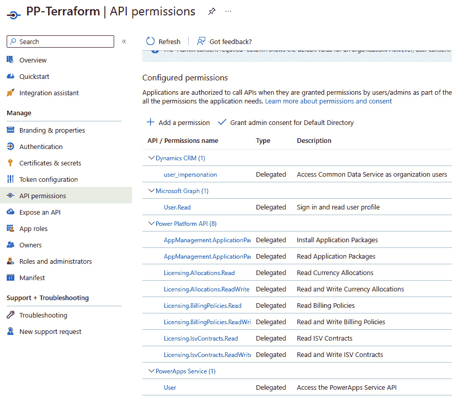

<st c="64785">图 11.10 – Power Platform 提供者的 API 权限，用于 Terraform</st>

<st c="64857">应用注册过程 – Power Platform API</st>

<st c="64903">有关应用注册过程的更多帮助，请参考此</st> <st c="64976">链接：</st> [<st c="64982">https://learn.microsoft.com/en-us/power-platform/admin/programmability-authentication-v2</st>](https://learn.microsoft.com/en-us/power-platform/admin/programmability-authentication-v2)<st c="65070">。</st>

<st c="65071">另外，我们</st> <st c="65086">可以着手准备</st> `<st c="65113">main.tf</st>` <st c="65120">文件和任何支持的</st> <st c="65144">配置文件。</st> <st c="65166">本书的示例 Terraform 文件已上传到 GitHub 仓库的</st> `<st c="65249">第十一章</st>` <st c="65258">文件夹中。</st>

<st c="65266">请注意，在计划使用 Terraform 管理 Power Platform 环境时，服务主体应作为应用用户添加到 Power Platform 环境中，以便能够对现有环境进行更改。</st> <st c="65492">我们可以通过访问</st> **<st c="65519">Power Platform 管理中心</st>** <st c="65546">|</st> **<st c="65549">环境</st>**<st c="65561">，选择环境并点击</st> **<st c="65603">查看所有</st>** <st c="65610">在</st> **<st c="65622">用户</st>** <st c="65627">下方的</st> **<st c="65635">访问</st>** <st c="65641">部分。</st> <st c="65652">然后，点击</st> **<st c="65667">应用用户列表</st>** <st c="65681">|</st> **<st c="65684">新建应用用户</st>** <st c="65696">并使用向导将新创建的服务主体添加到</st> <st c="65762">您的环境中。</st>

<st c="65779">在准备好所有 Terraform 配置文件后，我们现在可以执行工作流中的下一步操作：</st>

```
 terraform plan -var-file dev.variables.tfvars -out <outfile>
```

<st c="65947">如果计划</st> <st c="65960">成功完成，我们应该会在终端看到更长的输出，显示所有的更改计划，最后是类似这样的内容（使用提供的</st> <st c="66117">示例文件）：</st>

```
 Plan: 2 to add, 0 to change, 0 to destroy. ──────────────────────────────────────────────────────────────
Saved the plan to: <outfile>
```

<st c="66267">这里，</st> `<st c="66274"><outfile></st>` <st c="66283">表示上一步骤中输出文件的名称。</st> <st c="66329">。</st>

<st c="66343">现在，我们可以使用以下命令，将计划应用到我们的环境中：</st> <st c="66416">以下命令：</st>

```
 terraform apply <outfile>
```

<st c="66460">如果我们希望在 DevOps 流水线中执行这些步骤，由于我们希望在 CI/CD 流水线期间自动化这些步骤，我们可以在 Azure DevOps 中使用脚本任务或特定的 Terraform 任务，或者在 GitHub 中使用动作。</st> <st c="66678">很可能，我们首先需要从可用的市场安装 Terraform 任务/动作。</st> <st c="66779">安装完成后，我们将能够使用它们。</st> <st c="66831">现在，我们可以创建一个 DevOps 流水线，在规划阶段，我们将使用</st> `<st c="66914">terraform plan</st>` <st c="66928">命令来准备</st> `<st c="66952">tfstate</st>` <st c="66959">文件，然后在部署阶段，我们将使用相同的</st> `<st c="67016">tfstate</st>` <st c="67023">文件将配置应用到 Power</st> <st c="67066">Platform 服务。</st>

<st c="67083">在创建 Terraform 计划时，</st> `<st c="67122">tfstate</st>` <st c="67129">文件可以存储在本地，或者在某个中央存储库中存储，从中可以访问。</st> <st c="67255">由于我们使用的是多阶段流水线和 DevOps 服务，我们决定使用一个 Azure 存储帐户，在其中存储 Terraform</st> <st c="67404">状态文件。</st>

<st c="67415">在这里，我们有一个简单的单阶段 DevOps 流水线，我们使用 Terraform 任务来执行 Terraform 工作流的所有步骤。</st> <st c="67556">在 GitHub 仓库中，我们已经上传了一个</st> `<st c="67601">simple-tf-iac.yml</st>` <st c="67618">流水线文件，它可以作为使用 Terraform 任务的 Azure DevOps 流水线的参考。</st> <st c="67683">Terraform 任务的示例如下：</st> <st c="67716">一个 Terraform 任务的示例是：</st> <st c="67750">如下所示：</st>

```
 - task: TerraformTaskV4@4
    inputs:
      provider: 'azurerm'
      command: 'init'
      workingDirectory: '$(System.DefaultWorkingDirectory)/tf-iac/'
      backendServiceArm: '<SERVICE_CONNECTION>'
      backendAzureRmResourceGroupName: $(test-rg)
      backendAzureRmStorageAccountName: $(storageaccountname)
      backendAzureRmContainerName: $(containername)
      backendAzureRmKey: 'terraform.tfstate'
```

<st c="68120">尽管 IaC 带来了环境生命周期管理的好处，但每种方法总有利有弊，IaC 也不例外。</st> <st c="68278">可能我们没有具备 IaC 和 Terraform 知识的资源，或者我们不想使用 Terraform Power Platform 提供者，因为它目前仍处于实验模式（不应在生产工作负载中使用），或者因为我们不想引入新的工具，或者其他任何原因。</st> <st c="68615">在这种情况下，我们总是可以回归使用更传统的方式来管理 Power</st> <st c="68702">Platform 租户。</st>

## <st c="68719">传统的自动化环境管理方法</st>

<st c="68775">除了</st> <st c="68786">使用 Terraform 提供者的 IaC 方法外，还有其他选项可用来管理环境生命周期，以及与我们合作多年的 Power Platform 租户。</st> <st c="68987">接下来我们将提到一些</st> <st c="69021">示例：</st>

+   <st c="69036">到目前为止，我们已经熟悉了</st> <st c="69073">用于 Azure DevOps 和</st> **<st c="69078">Power Platform Build Tools</st>** <st c="69104">以及</st> **<st c="69109">Power Platform Actions</st>** <st c="69131">工具</st> <st c="69149">和</st> <st c="69152">GitHub。</st>

    <st c="69160">Power Platform Build Tools 提供了可用于 Power Platform 租户管理的任务，包括环境管理。</st> <st c="69296">我们可以创建新环境、配置治理设置和环境设置，例如将环境更改为托管环境，等等。</st>

    <st c="69463">采用这种方法可以让我们构建 DevOps 管道，重点不仅仅是提供应用程序解决方案，而是专注于配置端到端的解决方案生命周期，包括环境的配置、部署应用程序到环境中、测试应用程序，甚至在不再需要时移除环境。</st> <st c="69867">这为整体</st> <st c="69914">解决方案管理提供了额外的灵活性。</st>

+   <st c="69934">下一个选项是使用 PAC CLI。</st> <st c="69968">我们可以将 PAC CLI 安装到运行 CI/CD 管道的构建代理/运行器上，并使用 PAC CLI 任务来执行自动化任务，管理环境生命周期。</st> <st c="70137">通过命令行或 Bash 任务，我们可以编写脚本，利用 PAC CLI 执行操作，并在我们的 Power</st> <st c="70270">Platform 租户上执行操作。</st>

+   <st c="70286">对于那些希望在 CI/CD 管道之外构建自动化流的管理员，我们建议使用</st> <st c="70408">Power Automate 流程并使用</st> **<st c="70439">Power Platform for Admins</st>** <st c="70464">连接器，该连接器专注于环境生命周期管理和 DLP 策略。</st> *<st c="70545">图 11</st>**<st c="70554">.11</st>* <st c="70557">展示了一个示例，属于更大的</st> *<st c="70602">创建已批准环境</st>* <st c="70629">流程的一部分，该流程属于 CoE 启动工具包。</st> <st c="70682">它很好地展示了如何使用</st> <st c="70718">Power Platform Management 连接器来构建环境</st> <st c="70781">生命周期</st> <st c="70793">并通过工作流执行：</st>

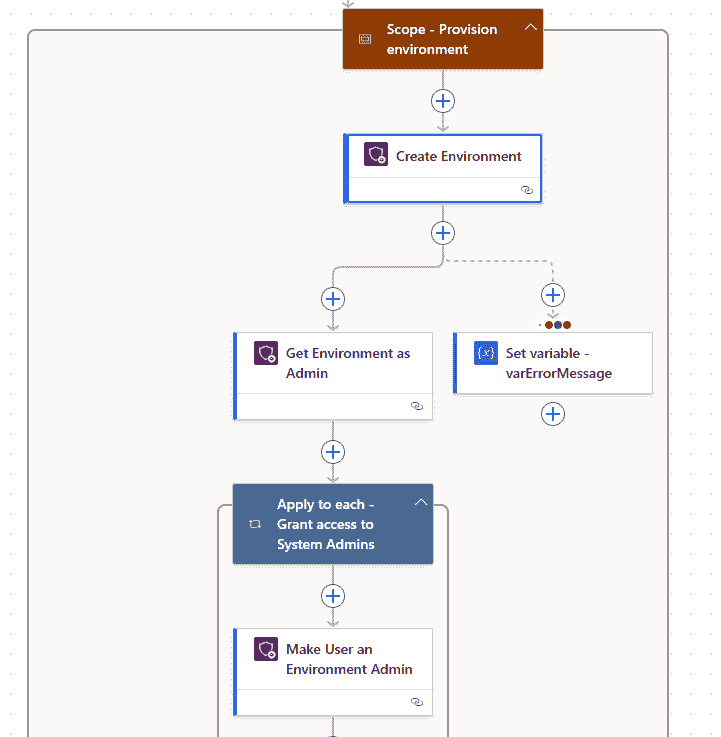

<st c="70978">图 11.11 – 使用 Power Automate 进行环境管理</st>

## <st c="71035">管理环境时的 DLP 注意事项</st>

<st c="71081">在</st> <st c="71089">Power Platform 着陆区部分，我们讨论了关键的设计领域以及在设计 Power Platform 架构时需要考虑的因素。</st> <st c="71232">这包括在 Entra ID 中进行许可和身份管理，但有一个非常重要的领域，它与环境生命周期管理紧密相关。</st> **<st c="71393">数据丢失防护</st>** <st c="71413">（</st>**<st c="71415">DLP</st>**<st c="71418">）是保护数据不超出某些边界的最</st> <st c="71439">重要部分之一。</st> <st c="71508">DLP 策略帮助我们设置保护措施，确保我们的数据得到保护，并且不会与</st> <st c="71611">不必要的受众共享。</st>

<st c="71633">在组织中创建环境策略时，我们还应就一组最基本的 DLP 策略达成一致，以保护用户免受不合规使用的影响。</st> <st c="71813">这些策略可以在租户级别或环境级别设置。</st> <st c="71870">租户级别的策略可以与所有环境或仅与特定环境关联，并作为跨</st> <st c="72003">多个环境的组织范围政策。</st>

<st c="72025">设置 DLP 策略应在创建环境时自动完成。</st> <st c="72107">也可以在根据工作负载或</st> <st c="72181">组织需求调整策略后完成。</st>

<st c="72209">创建</st> <st c="72219">和分配 DLP 策略有多种方式。</st> <st c="72277">我们已经提到了两个例子，一个是使用 Terraform，另一个是通过 Power Automate 流程中的连接器。</st> <st c="72387">这两者都支持创建和分配 DLP 策略。</st> <st c="72437">在 Terraform 中，我们可以通过创建一个</st> `<st c="72483">powerplatform_data_loss_prevention_policy</st>` <st c="72524">资源，并通过一组参数，指定所有业务（敏感）、非业务（非敏感）、阻止和自定义连接器模式的列表。</st> <st c="72691">这将定义哪些连接器被分组以及它们具有何种敏感性标签。</st> <st c="72783">我们还可以指定应用 DLP 策略的环境列表。</st> <st c="72853">这将定义该策略的适用范围。</st>

<st c="72864">在使用 Power Automate 时，我们通过创建使用</st> **<st c="72951">Power Platform for Admins</st>** <st c="72976">连接器的流，来实现相同的结果，</st> <st c="72993">这些动作用于创建和管理 DLP 策略。</st> <st c="73046">通过可视化体验，它们提供了所有</st> <st c="73094">所需的信息。</st>

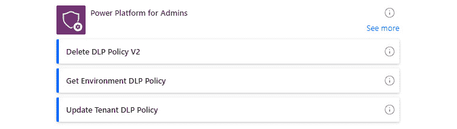

<st c="73210">图 11.12 – Power Platform for Admins 连接器</st>

<st c="73264">使用 Power Platform 的管理员连接器方法在管理环境和其他租户设置的过程中已经得到了很好的应用。</st> <st c="73412">我们可以在许多属于 CoE 启动工具包的流程中找到这种方法。</st> <st c="73490">让我们看看 CoE 启动工具包中有什么内容，以及它如何</st> <st c="73561">被使用。</st>

# <st c="73569">Power Platform CoE</st>

<st c="73588">另一个</st> <st c="73597">部分专注于为 Power Platform 提供指导和最佳实践，将着重于采用和理解现有使用情况。</st> <st c="73740">随着组织在 Power Platform 使用方面的成熟，运行在 Power Platform 上的工作负载数量可能会大幅增加。</st> <st c="73865">组织应当投资于促进这种增长，同时保持环境的治理和安全。</st> <st c="73970">本节将讨论 Power Platform CoE，它是什么，为什么组织应该在其环境中创建这样的团队。</st> <st c="74109">我们将看看 CoE 团队可用的工具，并通过环境管理示例了解它如何</st> <st c="74235">紧密相连。</st>

<st c="74249">CoE 超越了组织中的特定团队；它展示了组织中的文化承诺，帮助推动创新和持续改进。</st> <st c="74420">CoE 团队充当一个知识中心，专注于提高 Power Platform 的采用率，同时确保使用符合内部治理和</st> <st c="74593">合规标准。</st>

<st c="74614">CoE 团队可以由一个或多个人组成，这取决于组织的规模和成熟度。</st> <st c="74725">它可以从组建一个充满热情的 Power Platform 个人团队开始，这些人致力于通过 LCNC 平台支持组织的业务战略。</st> <st c="74893">从那里，它可以发展成一个更大、更具多样化的团队，由来自不同部门、拥有不同技能的角色代表。</st> <st c="75026">它可以包括应用开发者、DevOps 工程师、IT 团队、支持工程师、培训专家和业务代表。</st> <st c="75148">CoE 团队不应与融合团队混淆。</st> **<st c="75200">融合团队</st>** <st c="75212">专注于通过 LCNC 和以代码为先的开发加速业务解决方案的开发，而 CoE 团队旨在推动 LCNC 平台的治理和采用，遵循最佳实践</st> <st c="75417">和指导。</st>

<st c="75430">CoE 团队遵循一个持续的流程，通过这个流程，他们能够了解当前的情况。</st> <st c="75529">在需要的地方，他们会建立安全和治理实践来控制环境。</st> <st c="75620">最后，他们通过帮助提升员工社区的采用率来支持员工群体。</st> <st c="75705">为了促进他们的工作，CoE 团队利用了 Power Platform 管理中心的功能以及 CoE</st> <st c="75827">启动工具包。</st>

<st c="75839">微软还</st> <st c="75855">提供了自动化工具包，这是 CoE 启动工具包的补充工具套件，旨在提高 Power Automate 自动化平台的采用率。</st> <st c="76025">该工具包提供了现成的解决方案，用于管理自动化项目，并且能够</st> <st c="76109">深入了解节省的成本和估算的</st> **<st c="76157">投资回报率</st>** **<st c="76167">（ROI）</st>** <st c="76177">。</st>

<st c="76185">CoE 启动工具包和自动化工具包的安装</st>

<st c="76240">设置</st> <st c="76256">CoE 启动工具包和自动化工具包是一个较长的过程，包含多个步骤。</st> <st c="76331">我们不会深入讨论安装细节，而是提供一个指向文档网站的链接，该网站提供了逐步的安装指南。</st> <st c="76477">我们</st> <st c="76479">建议按照该指南操作，并在</st> <st c="76549">单独的环境中安装 CoE 启动工具包。</st>

**<st c="76570">CoE 启动工具包</st>** **<st c="76587">安装</st>**<st c="76599">：</st> [<st c="76602">https://learn.microsoft.com/en-us/power-platform/guidance/coe/setup</st>](https://learn.microsoft.com/en-us/power-platform/guidance/coe/setup)<st c="76669">。</st>

**<st c="76670">自动化工具包</st>** **<st c="76686">安装</st>**<st c="76698">：</st> [<st c="76701">https://learn.microsoft.com/en-us/power-automate/guidance/automation-kit/setup/prerequisites</st>](https://learn.microsoft.com/en-us/power-automate/guidance/automation-kit/setup/prerequisites)<st c="76793">。</st>

## <st c="76794">CoE 启动工具包</st>

<st c="76814">CoE 启动工具包提供了不同的模块，其中包括一套现成的应用程序和流程，旨在帮助管理员、治理和推广活动。</st> <st c="76975">这些模块被分为</st> <st c="77008">不同的组件：</st>

+   **<st c="77029">核心组件</st>**<st c="77045">：这是主要应用程序</st> **<st c="77083">CoE 管理员命令中心</st>** <st c="77107">所在的位置。</st> <st c="77111">此应用程序是一个用于访问其他与管理员相关的应用程序的中央控制平面。</st> <st c="77119">在这里，我们可以找到</st> **<st c="77233">设置应用权限</st>** <st c="77252">和</st> **<st c="77257">设置流权限</st>** <st c="77277">设置，用于发现应用程序和流并更改用户访问权限及</st> <st c="77356">所有权权限。</st> <st c="77379">此外，</st> **<st c="77383">DLP 编辑器</st>** <st c="77393">有助于监督所有 DLP 策略，并了解哪些应用程序/流受到影响。</st> <st c="77477">另一个重要的组件集是</st> <st c="77638">与</st> **<st c="77649">环境</st>** **<st c="77661">请求管理</st>**<st c="77679">相关。</st>

+   **<st c="77680">治理</st>**<st c="77691">：该组专注于确保 Power Platform 组件得到治理并符合规定。</st> <st c="77789">许多流是审核过程的一部分，审查应用程序、流和机器人状态，并通知管理员或所有者采取必要步骤，以确保其符合规定。</st> <st c="77975">该组中包括</st> **<st c="77979">开发者合规中心</st>** <st c="78006">，为开发者提供一个应用程序，以了解其应用程序、流、机器人、解决方案等的合规状态。</st>

+   **<st c="78157">培养</st>**<st c="78165">：该组中的组件致力于培养内部 Power Platform 社区。</st> <st c="78246">组件如</st> **<st c="78265">视频中心</st>**<st c="78274">，用于查找和观看培训视频内容，</st> **<st c="78318">为开发者提供的培养应用</st>**<st c="78341">，用于查找培训活动，以及</st> **<st c="78376">解决方案评估</st>** <st c="78395">页面，在</st> **<st c="78404">为开发者提供的培养应用</st>**<st c="78427">中，帮助开发者了解其计划解决方案的许可和治理影响。</st>

+   **<st c="78524">主题管理</st>**<st c="78532">：该组帮助创作者创建和管理画布应用的主题。</st> **<st c="78601">主题编辑器</st>** <st c="78613">和</st> **<st c="78618">主题库</st>** <st c="78631">允许创建和浏览已发布的主题，这些主题将在画布应用中使用。</st> <st c="78722">在这里，我们想再次提到</st> **<st c="78764">Power Platform 创作者工具包</st>**<st c="78790">，它不是 CoE 启动包的一部分，但从能力角度来看，它更为丰富，因为它支持使用 Fluent UI 框架，这将帮助组织在模型驱动应用和画布应用中创建一致的现代应用。</st>

+   **<st c="79036">创新积压</st>**<st c="79055">：这包含了</st> **<st c="79076">创新积压</st>** <st c="79094">用于添加创新想法和对现有想法进行投票的应用程序。</st>

<st c="79163">这些组件组每个都包含一组额外的表格、流程和应用程序，虽然我们没有提到这些，但它们支持整个 CoE 体验。</st> <st c="79329">这些组件可以通过不同的方式使用。</st> <st c="79377">我们可以仅使用 CoE Power BI 仪表板来全面了解 Power Platform 当前的状况，或者我们可以用它来驱动一些结论和行动。</st> <st c="79559">通过仪表板，我们可以识别出，例如，孤立的应用，并采取措施重新分配所有权或在不再需要时将其淘汰。</st> <st c="79716">我们还可以看到服务的采用情况，以及哪些连接器和应用程序使用最为频繁。</st> <st c="79814">这些信息中的一部分也已经</st> <st c="79855">可以在</st> **<st c="79868">Power Platform 管理中心</st>** <st c="79895">|</st> **<st c="79898">分析</st>**<st c="79907">中找到，在这里我们可以追踪 Dataverse、Power Apps 和 Power Automate 的使用情况和活动。</st> <st c="79997">有关 CoE 启动包及其组件的更多信息，请访问</st> <st c="80069">此链接：</st> [<st c="80075">https://learn.microsoft.com/en-us/power-platform/guidance/coe/starter-kit-explained</st>](https://learn.microsoft.com/en-us/power-platform/guidance/coe/starter-kit-explained)<st c="80158">。</st>

## <st c="80159">环境管理示例</st>

<st c="80193">既然我们</st> <st c="80202">已经通过 CI/CD 管道和在 Power Automate 中构建流程简要了解了环境管理的样子，我们接下来将看看 CoE 启动包如何支持环境</st> <st c="80403">请求流程。</st>

<st c="80419">如果我们在 Power Platform 中配置了只有管理员可以创建环境的设置，那么对于普通用户来说，就无法为特定项目创建自己的开发环境。</st> <st c="80632">他们应该使用现有的环境，这些环境可能会跨业务单元或组织共享，具体取决于组织的环境策略。</st> <st c="80791">如果应用程序开发人员认为他们的项目需要隔离，那么他们应该申请自己的环境。</st> <st c="80900">环境的创建可以通过 Power Platform 着陆区参考实现、通过 DevOps 管道自动化、通过 Power Automate 流程，或者手动进行。</st> <st c="81081">然而，在所有这些情况下，管理员需要启动该过程，这使得他们成为整个过程中的瓶颈。</st> <st c="81215">因此，在 CoE 启动工具包中，我们可以找到一个环境请求管理流程，帮助任何人申请新的环境和相关的</st> <st c="81369">DLP 策略：</st>

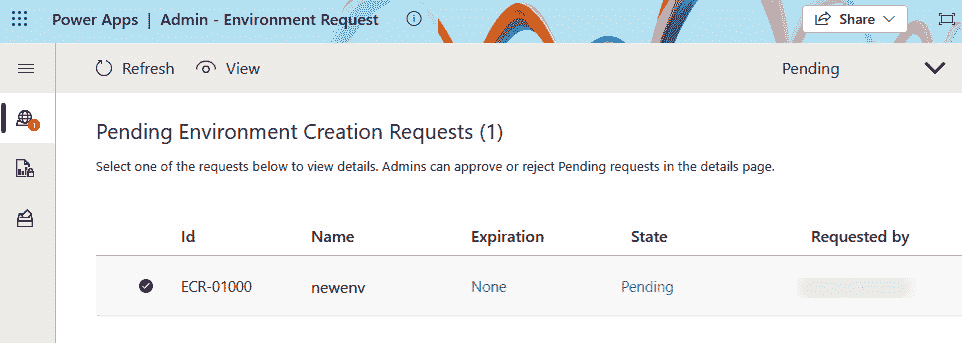

<st c="81645">图 11.13 – 环境管理过程</st>

<st c="81690">使用</st> **<st c="81701">Maker - 环境请求</st>** <st c="81728">应用程序，应用程序开发人员可以提交新的环境请求。</st> <st c="81790">他们选择所需的连接器以及所有者，并且</st> <st c="81870">提供更多关于环境的信息，例如环境类型，是否需要 Dataverse，是否需要其他数据来配置环境。</st> <st c="82045">请求提交后，由管理员来审核该请求。</st> <st c="82131">通过他们的</st> **<st c="82145">Admin - 环境请求</st>** <st c="82172">应用程序，管理员可以审核所选择的连接器，检查是否有 DLP 策略影响了选择的连接器，并且需要对 DLP 策略做哪些修改。</st> <st c="82365">一旦管理员审核并批准创建过程，Power Automate 流程中的 Power Platform for Admins 连接器开始工作，收集所有数据，并配置一个环境以及相关的 DLP 策略。</st> <st c="82593">如果该环境设置了过期日期，环境将在此日期后自动删除，除非环境的所有者在此之前申请延长过期日期。</st> <st c="82803">对于环境的删除，再次使用 Power Automate 流程中的 Power Platform for Admins 连接器来移除</st> <st c="82935">该环境。</st>

<st c="82951">这展示了一个现实世界的例子，说明 Power Platform 运维团队如何通过应用程序和 Power Automate 流程的结合来设置环境生命周期管理过程。</st> <st c="83147">借助 CoE Starter Kit，我们已经获得了这样的流程，任何人都可以重用它们，同时也可以作为一个参考，供组织在想要构建自己的平台管理流程时使用。</st> <st c="83332">管理流程。</st>

# <st c="83353">总结</st>

<st c="83361">在本章中，我们主要集中在 Power Platform 管理的运维部分。</st> <st c="83454">我们详细介绍了不同的设计最佳实践和指南。</st> <st c="83518">我们从 Power Platform Well-Architected 开始，了解了它的目的在于设计具有韧性、可靠性和高效性的应用程序工作负载，并为用户提供出色的用户体验。</st> <st c="83720">接着，我们讨论了 Power Platform 着陆区，帮助管理员创建所需的环境，遵循经过验证的架构设计，并允许组织快速扩展以支持数字化转型的努力，同时为应用开发者提供创新的空间。</st> <st c="84002">我们研究了运维团队在规划</st> <st c="84115">架构设计时应考虑的设计原则和设计领域。</st>

<st c="84135">从设计最佳实践开始，我们转向了其中一项建议的实际实施——平台自动化。</st> <st c="84257">我们尝试了一个想法：如果一个低代码/无代码平台，比如 Power Platform，结合来自专业开发领域的基础设施描述概念，那会是什么样子？在这个领域中，基础设施工作负载和系统配置通常是通过 IaC 文件来编写的。</st> <st c="84555">我们使用 Terraform 演示了如何创建 IaC 文件，并利用 Terraform 来管理 Power Platform 环境。</st> <st c="84683">由于 Power Platform Terraform 提供者仍处于实验阶段，且组织可能更倾向于使用其他方式来管理环境，我们研究了其他工具如何帮助我们解决这个挑战，包括在 Power Automate 中使用 Power Platform for Admins 连接器，这也是 CoE Starter Kit 中管理流程的常用工具。</st> <st c="85041">从一个非常高层次的角度，我们简要介绍了 CoE 是什么，以及 CoE Starter Kit 为组织带来了哪些工具。</st> <st c="85165">通过一个环境管理请求的例子，我们展示了这些最佳实践如何在</st> <st c="85280">现实生活中得以实施。</st>

<st c="85290">在下一章节中，我们将超越 DevOps，探索生成式 AI 给 Power Platform 带来的创新。</st> <st c="85422">我们将探讨如何</st> **<st c="85442">ChatOps</st>** <st c="85449">连接人、流程和工具，并改善我们进行</st> <st c="85518">DevOps 过程的方式。</st>

# <st c="85535">进一步阅读</st>

+   <st c="85551">Power Platform 着陆</st> <st c="85575">区域：</st> [<st c="85582">https://github.com/microsoft/industry/tree/main/foundations/powerPlatform</st>](https://github.com/microsoft/industry/tree/main/foundations/powerPlatform)

+   <st c="85655">Power Platform</st> <st c="85671">良好架构：</st> [<st c="85689">https://learn.microsoft.com/en-us/power-platform/well-architected/</st>](https://learn.microsoft.com/en-us/power-platform/well-architected/)

+   <st c="85755">微软零信任</st> <st c="85777">模型</st><st c="85782">：</st> [<st c="85785">https://www.microsoft.com/en-us/security/business/zero-trust</st>](https://www.microsoft.com/en-us/security/business/zero-trust)

+   <st c="85845">Terraform</st> <st c="85856">文档：</st> [<st c="85871">https://developer.hashicorp.com/terraform</st>](https://developer.hashicorp.com/terraform)

+   <st c="85912">Power Platform Terraform</st> <st c="85938">提供者：</st> [<st c="85948">https://playbook.microsoft.com/business-applications/Enterprise-Solutions/Power-Platform-Terraform-Provider/</st>](https://playbook.microsoft.com/business-applications/Enterprise-Solutions/Power-Platform-Terraform-Provider/)

+   <st c="86056">Power Platform for Admins</st> <st c="86083">连接器：</st> [<st c="86094">https://learn.microsoft.com/en-us/connectors/powerplatformforadmins/</st>](https://learn.microsoft.com/en-us/connectors/powerplatformforadmins/)

+   <st c="86162">Power Platform</st> <st c="86178">CoE：</st> [<st c="86183">https://learn.microsoft.com/en-us/power-platform/guidance/coe/starter-kit</st>](https://learn.microsoft.com/en-us/power-platform/guidance/coe/starter-kit)

+   <st c="86256">Power Platform 自动化</st> <st c="86283">工具包：</st> [<st c="86288">https://learn.microsoft.com/en-us/power-automate/guidance/automation-kit/overview/introduction</st>](https://learn.microsoft.com/en-us/power-automate/guidance/automation-kit/overview/introduction)
