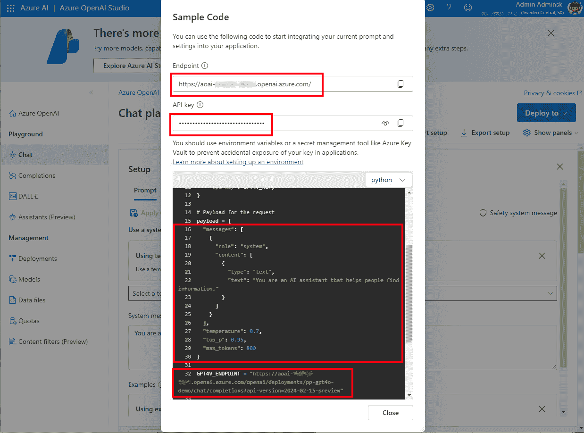

# <st c="0">12</st>

# <st c="3">展望未来：与 Copilot、ChatOps 以及 AI 赋能应用一起前行</st>

<st c="69">我们目前正处于一个时代，在这个时代，构建增强型应用程序变得非常简单，应用**<st c="148">人</st>** **<st c="149">工智能</st>**（**<st c="173">AI</st>**）已经成为一种常态。</st> <st c="211">将**<st c="234">大</st>** **<st c="235">型</st>** **<st c="240">语言</st>** **<st c="249">模型</st>**（**<st c="257">LLMs</st>**）接入我们的应用程序，并为其赋能 AI，正在开启新的选择，并使得组织能够创新并重新定义其业务流程。</st> <st c="411">本章将通过讨论 AI 赋能的低代码/零代码开发方法结束本书。</st> <st c="516">随着 LLM 的引入，如 OpenAI 的**<st c="564">生成预训练转换器</st>**（**<st c="600">GPT</st>**）模型，我们已经见证了在帮助创作者和开发者更高效完成工作并更快实现结果的工具上的巨大变化。</st> <st c="752">Microsoft Copilot 正在将 AI 注入每一款 Microsoft 产品，帮助创作者和开发者通过使用自然语言描述所需状态，利用零代码方法构建更多应用程序。</st> <st c="953">我们将深入探讨 Power Platform 中的 Copilot，以及 Copilot 如何在 Power Platform 产品中得到应用。</st> <st c="1058">我们将查看 AI Builder 的功能，并了解如何通过使用自定义连接器，利用 Azure OpenAI 模型扩展 Power Platform 的能力。</st> <st c="1231">本章将以讨论 ChatOps 作为结尾。</st> <st c="1285">我们将探讨它如何丰富现有的 DevOps 流程，以及如何使用 Copilot Studio 来帮助我们在组织中实施 ChatOps。</st>

<st c="1428">我们将涵盖以下</st> <st c="1457">主要话题：</st>

+   <st c="1469">AI 时代与</st> <st c="1497">GPT 的崛起</st>

+   <st c="1504">Microsoft Copilot 与 Power Platform 中的 Copilot</st>

+   <st c="1552">从创作者的角度看 Copilot 的使用</st>

+   <st c="1598">通过 AI Builder 和</st> <st c="1648">Azure OpenAI</st>扩展业务解决方案

+   <st c="1660">ChatOps 与</st> <st c="1673">Copilot Studio</st>

# <st c="1687">技术要求</st>

<st c="1710">要跟随本章内容，我们建议提前准备以下要求：</st> <st c="1780">以便更好地进行学习：</st>

+   **<st c="1789">Power Platform 订阅</st>**<st c="1819">：我们可以注册 Power Platform 开发计划（</st>[<st c="1876">https://powerapps.microsoft.com/en-us/developerplan/</st>](https://powerapps.microsoft.com/en-us/developerplan/)<st c="1929">），如果我们已经拥有 Microsoft Entra ID 工作帐户，或者我们可以加入 Microsoft 365 开发者</st> <st c="2030">计划（</st>[<st c="2039">https://developer.microsoft.com/en-us/microsoft-365/dev-program</st>](https://developer.microsoft.com/en-us/microsoft-365/dev-program)<st c="2103">）。</st>

+   **<st c="2106">Azure 订阅</st>**<st c="2128">：我们可以按照以下指南申请一个免费的 Azure 账户</st> [<st c="2195">https://azure.microsoft.com/en-us/free</st>](https://azure.microsoft.com/en-us/free)<st c="2233">。一旦创建，Azure 门户可以通过以下链接访问</st> <st c="2286">： </st> [<st c="2289">https://portal.azure.com/</st>](https://portal.azure.com/)<st c="2314">。</st>

+   **<st c="2315">Azure DevOps 服务组织</st>**<st c="2353">：我们可以随时创建一个 DevOps 组织，免费使用（</st>[<st c="2411">https://learn.microsoft.com/en-us/azure/devops/user-guide/sign-up-invite-teammates</st>](https://learn.microsoft.com/en-us/azure/devops/user-guide/sign-up-invite-teammates)<st c="2494">）。</st>

+   **<st c="2497">GitHub 用户名和一个代码仓库</st>**<st c="2530">：作为创建 DevOps 组织的替代方案，我们可以注册一个免费账户（</st>[<st c="2621">https://github.com/signup</st>](https://github.com/signup)<st c="2647">）。</st> <st c="2651">要访问 GitHub 企业云，我们可以获得一个 30 天的试用版（</st><st c="2719">https://docs.github.com/en/enterprise-cloud@latest/admin/overview/setting-up-a-trial-of-github-enterprise-cloud</st><st c="2831">）。</st>

+   **<st c="2834">Microsoft 365 或 Teams 许可证</st>**<st c="2867">：要访问 Teams，需要一个 Microsoft 365 试用许可证或 Teams 许可证。</st> <st c="2954">我们可以使用 Teams</st> <st c="2971">试用版（</st>[<st c="2984">https://learn.microsoft.com/en-us/microsoftteams/teams-exploratory</st>](https://learn.microsoft.com/en-us/microsoftteams/teams-exploratory)<st c="3051">）。</st>

+   **<st c="3054">Visual Studio Code</st>**<st c="3073">：你可以选择使用其他的 IDE 或文本编辑工具。</st>

# <st c="3141">人工智能时代与 GPT 的崛起</st>

<st c="3176">本节将</st> <st c="3194">提供一个宏观视角，回顾我们如何走到今天，在这个阶段，AI 创新几乎已经成为一种商品。</st> <st c="3314">我们将探索那些震撼世界并对社会和全球产业产生巨大影响的 GPTs。</st> <st c="3423">现在，应用程序开发者甚至可以在 Power Platform 服务中使用这些</st> <st c="3458">GPT 模型来提供商业解决方案，但我们稍后会详细讨论。</st> <st c="3555">让我们首先从</st> <st c="3576">开始讲起。</st>

<st c="3590">GPT 已经在市场上存在了一段时间。</st> <st c="3643">它们已经颠覆了市场，带给人们一些恐惧，但也带来了创新的新思路。</st> <st c="3760">由于每个人都可以访问这些模型，任何人都可以利用 AI 创新并构建鼓舞人心的解决方案。</st> <st c="3860">这意味着，使用公开可获得的大型语言模型（LLM）构建的 AI 的竞争优势已经下降。</st> <st c="3974">这促使公司在如何将这项新技术应用于商业流程方面进行创新。</st> <st c="4087">然而，就像任何项目一样，在 AI 融入的项目中，如何快速将一个可靠且安全的解决方案推向市场也非常重要。</st> <st c="4233">在这里，创新和开发应该遵循 DevSecOps 流程，这些流程允许组织将可靠的解决方案带入</st> <st c="4364">市场。</st>

<st c="4375">为了理解当前的情况，我们需要回顾</st> <st c="4441">过去。</st>

## <st c="4449">人工智能简介</st>

<st c="4468">人工智能是一个智能</st> <st c="4490">计算机系统，它利用数学算法和统计模型来模拟人类思维，在分析数据时做出决策。</st>

<st c="4637">1955 年，计算机科学家约翰·麦卡锡提出了“人工智能”（AI）这一术语。</st> <st c="4706">这个术语描述了能够展示类似人类智慧的机器的概念。</st> <st c="4792">然而，人工智能的起源甚至可以追溯得更早。</st> <st c="4843">1940 年，艾伦·图灵创造了一种机器学习算法，</st> <st c="4909">该算法被用于破解恩尼格码密码。</st> <st c="4941">这导致了</st> **<st c="4973">图灵测试</st>** <st c="4984">的产生，后者出现在 1950 年。</st> <st c="5000">这个测试用于判断机器在特定条件下是否能够模仿人类智能。</st> <st c="5105">经过这么多年，AI 专家们现在辩论图灵测试是否仍然相关，因为 AI 模型和自然</st> <st c="5239">语言理解的进展。</st>

<st c="5262">简单来说，人工智能背后是计算机科学和工程领域，它们创造出各种算法，驱动这些 AI 系统的运行。</st> <st c="5426">算法被描述为 AI 系统按照一定规则和程序化指令处理和分析数据的一系列步骤。</st> <st c="5552">这些算法可用于情感分析、物体检测等任务。</st> <st c="5648">AI 模型遵循算法，并通过在大规模、具有代表性的数据集上进行训练，以便利用这些算法来解决特定的任务</st> <st c="5807">或问题。</st>

<st c="5819">一旦 AI 模型在具有代表性的数据上训练完成，它就能理解数据中的关系，从而能够将所学应用于新的、未知的数据。</st> <st c="5976">这种训练 AI 的常见做法是</st> <st c="6037">在</st> **<st c="6040">机器学习</st>**<st c="6056">中进行的。我们用于训练的更多数据和多样化的数据，训练出的模型效果就会更好。</st> <st c="6148">例如，用更多的物体图片训练物体检测模型，并提供每张图片的准确描述信息，将导致该模型的更好效果。</st>

<st c="6317">AI 使计算机系统能够执行在许多应用中都有用的任务。</st> <st c="6402">通过</st> **<st c="6410">自然</st>** **<st c="6411">语言</st>** **<st c="6418">处理</st>** **<st c="6419">（NLP）</st>**<st c="6427">，这是机器学习的一个子领域，系统现在可以理解人类语言，并执行诸如语言检测、语言翻译和情感分析等操作。</st> <st c="6490">通过扩展到语音，微软声称他们在 2016 年达到了人类对话语音识别的水平。</st> <st c="6755">通过加入计算机视觉，借助 AI 的支持，机器甚至能够理解</st> <st c="6844">视觉物体。</st>

<st c="6859">机器学习还有其他子集，如</st> **<st c="6918">强化学习</st>** <st c="6940">以及更进一步的</st> **<st c="6966">神经网络</st>**<st c="6981">。神经网络是一种受人类大脑功能启发的模型。</st> <st c="7063">神经网络由神经元组成，神经元是相互连接的节点，按层次分组。</st> <st c="7158">神经元接收输入，这些输入用于计算函数，以确定数据将被发送到下一层哪个神经元。</st> <st c="7298">神经网络可以用于非常复杂的</st> <st c="7304">数据关系。</st>

<st c="7362">人们可能会问，为什么我们要讨论这些模型。</st> <st c="7423">嗯，这就是 GPT 的作用所在。</st> <st c="7447">它来了。</st>

## <st c="7456">GPT</st>

<st c="7461">AI 在</st> <st c="7485">过去几年中的进展带来了生成式 AI。</st> <st c="7531">生成式 AI</st> <st c="7544">是一种使用 LLM 的 AI 类型。</st> <st c="7577">生成式 AI 能够通过生成文本、图像、语音，甚至视频来响应提示并生成新内容。</st> <st c="7696">有许多 LLM 可用；然而，其中最具代表性的是 GPT，得益于</st> <st c="7797">OpenAI 的</st> **<st c="7806">ChatGPT</st>**<st c="7813">的流行。看到某些技术需要多长时间才能达到 1 亿月均活跃用户，总是令人着迷。</st> <st c="7930">ChatGPT 只用了</st> <st c="7943">两个月就达到了 1 亿月均活跃用户。</st> <st c="8006">这也表明，新的创新解决方案正在缩短达到这一</st> <st c="8092">重大里程碑所需的时间。</st>

<st c="8106">GPT 是 LLM 或文本生成模型的一部分，能够生成新内容（因此，</st> *<st c="8205">生成式</st>*<st c="8215">），已在大量数据集上进行训练（因此，</st> *<st c="8264">预训练</st>*<st c="8275">），并使用神经网络处理输入请求并提供输出（因此，</st><st c="8352">变压器</st>*<st c="8360">）。</st>

<st c="8374">如前所述，许多 LLM 可用，其中包括已向开源社区开放的模型。</st> <st c="8490">目前，最著名和流行的 GPT 包括 OpenAI 的 GPT。</st> <st c="8561">OpenAI 还提供了其他模型，这些模型用于各自的特定目的。</st> <st c="8631">随着每个新版本的发布，我们可以看到 GPT 变得更加复杂和智能。</st> <st c="8728">2024 年 5 月，OpenAI</st> <st c="8748">推出了</st> **<st c="8759">GPT-4o</st>**<st c="8765">，也被称为</st> **<st c="8781">omni</st>**<st c="8785">，这是一个多模态模型，接受文本和图像作为输入，并可以生成文本作为输出。</st> <st c="8891">在发布会上，OpenAI 强调了新的 GPT-4o 模型如何通过音频、视觉和文本与用户进行交互。</st> <st c="9028">OpenAI 还展示了一种新模型，它能够</st> <st c="9075">将文本转化为</st> <st c="9095">视频，名为</st> **<st c="9109">OpenAI Sora</st>**<st c="9120">，并于</st> <st c="9125">2024 年 2 月发布。</st>

<st c="9139">当前已经可用的其他模型包括</st> <st c="9198">以下几种：</st>

+   **<st c="9212">GPT-4 Turbo</st>**<st c="9224">、**<st c="9226">GPT-4</st>**<st c="9231">和</st> **<st c="9237">GPT-3.5 Turbo</st>** <st c="9250">是</st> <st c="9254">可以</st> <st c="9266">理解自然语言指令并生成自然语言</st> <st c="9271">或代码的模型</st>

+   **<st c="9363">DALL-E</st>** <st c="9370">(文本到图像) 是</st> <st c="9389">用于根据提供的自然语言指令生成图像的模型</st>

+   **<st c="9464">Whisper</st>** <st c="9472">是一个模型</st> <st c="9484">用于将音频转换成文本</st>

<st c="9513">虽然 LLM 为生成 AI 铺平了道路，但我们也看到了小型语言模型的出现。</st> <st c="9618">由于训练数据规模较小，这些模型体积较小，但能够在设备上本地运行，这为组织带来了新的创新思路。</st> <st c="9774">。</st>

<st c="9792">AI 模型需要数据、AI 算法或模型以及大量的计算能力来运行。</st> <st c="9919">微软与 OpenAI 合作，并开放 Microsoft Azure Cloud 供 OpenAI 利用其计算能力进行新模型的研发。</st> <st c="10093">作为回报，合作规定 OpenAI GPT 模型独家在 Microsoft 平台上提供。</st> <st c="10203">它们可以作为 Azure OpenAI 服务的一部分提供使用。</st> <st c="10275">这使得已经在使用 Azure 或希望使用 Azure 的客户可以利用安全合规的平台构建利用 AI 能力的安全企业应用。</st> <st c="10461">这项合作使得 Microsoft 能够将 OpenAI LLM 集成到其自己的产品中，并构建新功能以提升用户生产力。</st> <st c="10609">这样一个产品的良好示例是 GitHub Copilot，它</st> <st c="10667">就像一个 AI 的编程伴侣。</st> <st c="10700">它帮助开发人员在使用诸如 Visual Studio、Visual Studio Code、JetBrains IDEs 和 Neovim 等 IDE 时理解和生成代码。</st> <st c="10836">这种合作的另一个例子是为 Microsoft</st> <st c="10912">产品和服务提供各种副驾驶的集成，这些副驾驶集成到各种工具中，通过帮助用户更快地实现结果，从而丰富用户体验。</st> <st c="11045">更有效地。</st>

## <st c="11062">负责任的 AI</st>

<st c="11077">随着 AI 的进步，对其潜在误用的担忧变得合理。</st> <st c="11099">因此，负责任地使用 AI 至关重要。</st> <st c="11162">微软以及其他公司、社区和个人已经意识到这一点，并开始积极倡导负责任使用的必要性。</st> <st c="11214">微软在内部进行了重大投资，以确保其 AI 系统设计具有责任感。</st>

<st c="11509">微软已制定</st> <st c="11528">其</st> **<st c="11533">负责任 AI 标准</st>**<st c="11556">，该标准为确保组织负责任使用 AI 提供了实际指导。</st> <st c="11644">它由六项负责任的 AI 原则定义，将指导</st> <st c="11706">AI 的开发</st> <st c="11722">和使用：</st>

+   **<st c="11730">公平性</st>**<st c="11739">: AI 系统应当平等对待所有人，不带偏见</st> <st c="11799">或歧视</st>

+   **<st c="11816">可靠性和安全性</st>**<st c="11839">: AI 系统应当可靠运行，并优先考虑安全，以防止</st> <st c="11919">不良后果</st>

+   **<st c="11941">隐私和安全</st>**<st c="11962">: AI 系统应当确保安全并通过保护</st> <st c="12028">用户数据</st>

+   **<st c="12037">包容性</st>**<st c="12051">: AI 系统应当吸引广泛的用户，并通过考虑</st> <st c="12133">多元化的视角</st>

+   **<st c="12153">透明度</st>**<st c="12166">: AI 决策和过程应该是可以理解的，并提供清晰的解释以便</st> <st c="12258">提高信任</st>

+   **<st c="12271">问责制</st>**<st c="12286">: 开发者</st> <st c="12300">和组织应对所开发的</st> <st c="12363">AI 系统负责</st>

<st c="12373">除了负责任的 AI 原则之外，我们还应确保 AI 系统的开发符合合规性并遵循治理方式，以确保符合当地的监管要求。</st> <st c="12556">微软更进一步，实施了一个五点蓝图，专注于治理 AI。</st> <st c="12660">这些原则确保 AI 的使用符合政府的 AI 安全标准，并且是负责任的。</st> <st c="12783">它们还确保我们保持对 AI 系统的控制，以便 AI 可以</st> <st c="12856">安全使用。</st>

<st c="12868">微软已将</st> <st c="12893">负责任的 AI 实践不仅融入了协助工具，还融入了其他工具和人们的文化中。</st> <st c="12999">他们这样做是为了促进 AI 的安全和负责任使用。</st> <st c="13059">AI 的使用。</st>

# <st c="13065">微软协助工具与 Power Platform 中的协助工具</st>

<st c="13115">微软已在多个微软产品中嵌入了协助工具</st> <st c="13145">以支持不同的场景。</st> <st c="13207">本节将首先解释什么是协助工具，然后介绍一些可用的协助工具及其如何使用。</st> <st c="13359">接着，我们将重点了解协助工具在</st> <st c="13427">Power Platform 中的能力。</st>

<st c="13442">Microsoft 使用“copilot”一词来描述能够检索信息并执行特定任务（如摘要和内容生成）的 AI 助手。</st> <st c="13621">Copilot 利用 LLM，例如 OpenAI 的 GPT 模型，来响应用户的提示。</st> <st c="13700">并非所有 Copilot 的行为都相同。</st> <st c="13738">一些 Copilot 较为通用，例如 Microsoft Copilot，而其他则是特定产品的，例如</st> **<st c="13840">Microsoft 365 的 Copilot</st>** <st c="13866">或</st> **<st c="13870">Power Platform 的 Copilot</st>**<st c="13896">。这些</st> <st c="13904">Copilot 在特定产品的上下文中运作，并且能够了解该产品中的数据和操作。</st>

<st c="14046">所有这些 Copilot 都共享与用户的共同对话式聊天体验。</st> <st c="14124">然而，当我们查看这些 Copilot 时，我们可以看到一些 Copilot 是集成到产品本身中的，它们的主要任务是支持用户在使用特定产品时提高生产力，例如 Power Platform 中的 Copilot。</st> <st c="14367">其他 Copilot 也是特定于产品的，例如 Microsoft 365 的 Copilot 或 Sales 的 Copilot，它们具有一组标准功能，包括 Copilot 组件，但也可以通过 Copilot Studio 的支持进行扩展。</st> <st c="14621">最后一类 Copilot 是自定义 Copilot，用户可以在 Copilot Studio 或使用 Azure AI 服务上自行构建，并通过不同渠道向</st> <st c="14765">用户提供。</st>

<st c="14820">Copilot 的示例包括</st> <st c="14850">以下内容：</st>

+   **<st c="14864">Microsoft Copilot</st>**<st c="14882">：这款工具使用</st> <st c="14894">OpenAI LLMs 来为用户的提示提供类似聊天的响应体验。</st> <st c="14974">它可以在网络上搜索结果，并能总结针对特定问题的回答，同时提供相关</st> <st c="15101">内容来源的链接。</st>

+   **<st c="15117">Microsoft 365 的 Copilot</st>**<st c="15143">：这个工具</st> <st c="15151">生成基于用户有权限访问的组织数据的响应。</st> <st c="15230">它利用 Microsoft Graph 和 LLMs，并集成于 Microsoft 365 套件（Word、Excel、Teams 等）中，旨在提升</st> <st c="15364">个人生产力。</st>

+   **<st c="15386">GitHub Copilot</st>**<st c="15401">：这是一款</st> <st c="15415">AI 配对程序员或代码补全工具，帮助开发人员在软件开发生命周期（SDLC）中。</st> <st c="15497">它主要围绕编码相关话题，因此可以提供代码建议、解释代码、构建单元测试、</st> <st c="15610">等等。</st>

## <st c="15619">Power Platform 中的 Copilot</st>

<st c="15646">AI 在 Power</st> <st c="15659">平台中已经存在了几年。</st> <st c="15706">2019 年，AI Builder</st> <st c="15725">被引入 Power 平台，帮助将 AI 模型融入到业务流程中，并丰富了应用和流程。</st> <st c="15848">2021 年，Power Apps 中推出了将自然语言提示转换为 Power Fx 函数的功能。</st> <st c="15955">从那时起，新的 AI 功能每年都不断加入到 Power 平台中。</st> <st c="16015">每年都有新的进展。</st>

<st c="16025">在 Power 平台中启用 copilot 功能将平台带入了无代码开发的领域，并且得到了 AI 的辅助。</st> <st c="16137">这意味着，无论我们是专业开发者、低代码应用开发者，还是刚开始学习使用 Power 平台的人，Power 平台中的 copilot 都能提供通过自然语言生成有意义的面向业务的解决方案的能力。</st> <st c="16421">这有助于开发者和组织节省时间并</st> <st c="16471">提高生产力。</st>

<st c="16490">Power 平台家族中的每个产品都包括其专属的 copilot。</st> <st c="16559">这些 copilot 作为 AI 助手，具备产品特定的功能，可以作为开发者或业务解决方案用户使用，</st> <st c="16710">并在 Power 平台上构建。</st>

<st c="16725">Copilot 已集成到产品中，并始终共享产品的主屏幕，这使得</st> <st c="16826">开发者或用户在解决方案工作时更加高效，因为它不需要他们离开当前工作</st> <st c="16836">的上下文。</st> <st c="16961">工作环境：</st>

+   **<st c="16970">Power Apps 中的 Copilot</st>**<st c="16992">：这使得</st> <st c="17007">开发者可以通过自然语言描述来构建新的应用或编辑现有应用，并编写或理解 Power Fx 函数。</st> <st c="17145">作为用户，我们可以在应用中使用 copilot 组件，帮助我们获取有关应用中数据的答案。</st>

+   **<st c="17269">Power Automate 中的 Copilot</st>**<st c="17295">：使用这个功能，开发者可以创建新的流程，并通过自然语言描述所需的连接器。</st> <st c="17304">我们还可以修改现有的流程，并为业务流程获得灵感。</st> <st c="17418">很快，我们将能够构建 AI 流程，LLMs 将创建动态的自动化流程，并通过语音记录指令利用多模态模型，构建 Power Automate 桌面流程。</st> <st c="17495">用户能够深入了解由 Power Automate Process Mining 分析的流程。</st>

+   **<st c="17789">Copilot Studio 中的 Copilot</st>**<st c="17815">：开发者</st> <st c="17824">可以通过对话式构建器创建新的自定义 copilot，还可以使用</st> <st c="17928">自然语言创建和修改主题。</st>

+   **<st c="17945">Power Pages 中的 Copilot</st>**<st c="17968">：此功能</st> <st c="17975">促进了外部网站和页面的创建，允许我们通过自然语言聊天界面添加表单、文本内容和 AI 生成的代码。</st> <st c="18136">用户可以利用定制的 Copilot 聊天体验和通过生成式 AI 丰富的搜索体验进行推理，</st> <st c="18241">从搜索结果中获取信息。</st>

+   **<st c="18256">Power BI 的 Copilot</st>**<st c="18277">：此功能</st> <st c="18284">有助于构建跨云服务和 Power BI Desktop 的报告页面。</st> <st c="18354">作为用户，我们可以获取有关模型中数据的问题答案，获取报告摘要，</st> <st c="18461">以及更多内容。</st>

<st c="18470">Power Platform 中的 Copilot – 预览功能</st>

<st c="18520">需要注意的是，Power Platform 中的一些 Copilot 功能仍处于预览阶段。</st> <st c="18619">这些功能不适用于生产环境。</st> <st c="18659">为了访问这些功能，我们可能需要将环境</st> <st c="18722">设置为</st> **<st c="18729">提前发布周期</st>** <st c="18748">(</st>[<st c="18750">https://learn.microsoft.com/en-gb/power-platform/admin/early-release</st>](https://learn.microsoft.com/en-gb/power-platform/admin/early-release)<st c="18818">)。</st> <st c="18822">我们可以使用沙盒环境，并通过</st> **<st c="18862">预览 URL</st>** <st c="18873">(Power Apps:</st> [<st c="18887">https://make.preview.powerapps.com/</st>](https://make.preview.powerapps.com/)<st c="18922">) 或通过启用</st> **<st c="18940">体验新的数据体验</st>** <st c="18967">在 Power Apps</st> <st c="18986">主页屏幕中。</st>

<st c="18998">一些</st> <st c="19011">Copilot 的配置设置可以在</st> **<st c="19071">Power Platform 管理中心</st>** <st c="19098">|</st> **<st c="19101">设置</st>**<st c="19109">中打开或</st> <st c="19117">关闭</st>**<st c="19117">租户设置</st>**<st c="19132">，我们可以根据组织的政策找到可以启用或禁用的配置设置，正如在</st> *<st c="19254">图 12</st>**<st c="19263">.1</st>*<st c="19265">中所示：</st>


<st c="19954">图 12.1 – 在 Power Platform 中启用或禁用 Copilot</st>

<st c="20016">这些</st> <st c="20030">设置</st> <st c="20040">包括启用数据收集、用户发送反馈的能力，以及在</st> <st c="20197">Power Apps</st> <st c="20040">中启用或禁用 Copilot 预览功能的能力。</st>

# <st c="20208">从创建者角度看 Copilot 的使用</st>

<st c="20256">在本节中，我们</st> <st c="20277">将了解如何在 Power Platform 中使用助手生成带有数据表的 Power Apps 画布应用，并通过 Power Automate 中的流进行支持。</st> <st c="20455">这展示了 AI 如何帮助应用开发者在低代码开发过程中获得额外支持，并转向</st> <st c="20590">无代码方法。</st>

<st c="20607">在 Power Platform 中使用助手的好处之一是，这种方法使开发者能够更快速地构建解决方案原型。</st> <st c="20761">这是因为原型不需要具备应用的所有功能，只需要提供概念的外观和感觉。</st> <st c="20920">借助 Power Platform 应用中的助手，开发者可以使用自然语言描述构建应用或流的模型，并快速验证业务应用构思的可行性。</st> <st c="21137">对于助手提供的每个建议步骤，我们可以通过点击**<st c="21238">撤销</st>** <st c="21242">按钮撤回助手所做的更改。</st> <st c="21251">这使得测试想法变得更加容易，并且在不满意建议的工作时可以快速恢复。</st>

<st c="21353">Power Platform 中的助手具有相同的用户体验。</st> <st c="21416">在该服务的首页，我们可以找到一个大型文本输入组件，允许我们添加想要执行的操作描述。</st> <st c="21556">我们写给助手的提示应该清晰且具体，因为这将帮助助手返回更相关的结果。</st> <st c="21686">为了使用助手获得更好的结果，我们应提供更多关于请求的上下文，或者在需要时，提供一些如何实现某个功能的示例：</st>


<st c="23342">图 12.2 – Power Platform 首页上的助手</st>

<st c="23398">在 Power Apps 首页（</st>[<st c="23430">https://make.powerapps.com/</st>](https://make.powerapps.com/)<st c="23458">）上，我们将首先描述我们希望构建的应用程序的构思。</st> <st c="23554">由于几乎所有的业务应用都依赖于数据，助手将开始在 Dataverse 中创建一个数据架构，作为我们的数据源来管理数据。</st> <st c="23717">在这个步骤中，助手会提取我们提示的上下文</st> <st c="23764">并根据输入开始创建一个</st> <st c="23823">实体关系图。</st>

<st c="23851">我们可以使用提示建议来更改数据架构、添加更多表格、配置它们之间的关系、向表格中添加更多测试数据等等。</st> <st c="24008">此时，</st> **<st c="24012">查看提示</st>** <st c="24024">按钮作为提示指南，提供了 Copilot 可以执行的操作建议。</st> <st c="24104">这些操作包括创建表格和关系、修改表格和列，并作为灵感提供基于当前数据</st> <st c="24263">架构设计的建议：</st>


<st c="25279">图 12.3 – 丰富数据模型创建</st>

<st c="25317">一旦我们点击</st> **<st c="25332">保存并打开应用</st>**<st c="25349">，Copilot 将使用此数据架构创建一个示例应用</st> <st c="25415">，该应用具有多个屏幕，包含表单用于操作表格，同时也有一个独立的欢迎屏幕，可作为屏幕之间的导航</st> <st c="25557">。</st>

<st c="25573">在 Power Apps Studio 中，我们可以利用 Copilot 提问，了解如何在 Power Apps 中实现某些功能。</st> <st c="25680">它利用 Bing 搜索来查找相关内容，并为我们提供指导。</st> <st c="25761">例如，我们可以提问“</st>*<st c="25805">如何将图片添加到图像组件</st>*<st c="25851">？”它会提供与问题相关的回答。</st> <st c="25913">在这种情况下，它会提供逐步的指导，教你如何实现此操作，并提供相关的文档链接，解释整个过程。</st> <st c="26052">我们可以要求它向屏幕添加特定的组件，如按钮或文本标签，但此时我们可能仍然需要手动完成一些任务，因为它尚不能完成</st> <st c="26245">所有任务。</st>

<st c="26255">构建 Power Fx 公式有时会很具挑战性，特别是对于第一次使用 Power Platform 的人。</st> <st c="26391">类似于 GitHub Copilot 的功能，为了支持开发人员，现在我们可以使用自然语言的注释来生成 Power Fx 公式。</st> <st c="26546">它也可以反向工作，帮助理解公式的作用，只需点击公式框旁的 Copilot 图标，然后选择</st> **<st c="26686">解释</st>** **<st c="26694">此公式</st>**<st c="26706">：</st>


<st c="27811">图 12.4 – 使用 Copilot 提供 Power Fx 公式建议</st>

<st c="27878">作为开发人员，我们还可以直接在 Power Apps Studio 中查看代码。</st> <st c="27901">通过选择屏幕或组件旁边的三个点（或右键单击），我们现在可以看到一个</st> **<st c="28062">查看代码（预览）</st>** <st c="28081">选项，显示所选部分的 YAML 格式代码。</st> <st c="28147">这使我们可以复制代码并与其他开发人员讨论，直接修改代码，甚至使用复制/粘贴将此部分放入另一个屏幕</st> <st c="28317">或应用程序中。</st>

<st c="28332">如果我们转向 Power Automate，Copilot 也可以帮助我们完成类似的任务。</st> <st c="28422">这意味着使用自然语言描述我们希望创建的流程，并对现有流程进行修改，例如向流程中添加操作、配置操作的参数，</st> <st c="28615">等等。</st>

<st c="28624">随着人工智能的进步，我们很快就能构建 AI 流程，AI 将决定如何构建一个自动化计划，并满足实现要求所需的所有条件。</st> <st c="28807">我们也很快能够使用语音记录构建 Power Automate</st> <st c="28899">桌面流程的指令。</st>


<st c="29699">图 12.5 – Power Automate 中的 Copilot</st>

<st c="29738">我们必须记住，目前一些 Copilot 功能仍处于预览阶段。</st> <st c="29833">从 DevOps</st> <st c="29847">的角度来看，我们当前能看到一个主要问题，那就是在</st> <st c="29986">解决方案级别上，并未启用使用相同构建方法的能力。</st>

<st c="30003">我们在</st> *<st c="30020">第四章</st>* <st c="30029">中提到，我们应该从解决方案资源管理器内部开始构建我们的 Power 平台组件。</st> <st c="30131">在那里，我们可以使用现有的解决方案或创建新的解决方案，因为解决方案使我们能够在不同环境之间移动应用程序并管理解决方案组件所需的依赖项。</st> <st c="30315">当前的开发方法是从设计体验开始，而不是从解决方案资源管理器开始。</st> <st c="30449">这种方式，通过 copilot 的初始设计体验创建的所有组件都将添加到</st> **<st c="30556">默认解决方案</st>** <st c="30572">并处于未管理状态。</st> <st c="30591">目前，用于构建业务应用程序的 copilot-first 方法不支持从解决方案开始，这使我们只能选择将现有组件添加到新解决方案，并确保将所有必需的依赖项添加到解决方案。</st> <st c="30861">但是，如果我们希望从手动创建 custom copilot 开始，我们可以首先创建一个解决方案，然后从那里创建新组件（如 Power Apps 应用程序）。</st> <st c="31046">我们</st> <st c="31048">希望 copilot 在初始创建应用程序和其他组件方面的体验也可以通过</st> <st c="31169">解决方案方法启用。</st>

# <st c="31187">通过 AI Builder 和 Azure OpenAI 扩展业务解决方案</st>

<st c="31249">现在，我们已经看到 AI 如何帮助我们构建 Power 平台组件，接下来，我们将寻找将 AI 能力融入我们的应用程序和流程中的方法。</st> <st c="31407">本节将介绍 AI Builder 的能力，并比较它与 Azure OpenAI 的区别。</st> <st c="31501">我们将看看如何设置自定义连接器以连接到 Azure OpenAI，在这里，我们将使用我们选择的 Azure OpenAI 模型来丰富用户体验或改进我们在 Power 平台中的业务流程。</st> <st c="31701">Power 平台。</st>

## <st c="31716">介绍 AI Builder</st>

<st c="31739">AI Builder 是一个 Power</st> <st c="31762">平台服务，允许制作者在其解决方案内使用不同的 AI 模型和提示，无需编码或特殊的数据科学知识。</st> <st c="31924">它允许组织通过添加额外的 AI 能力来改善其业务流程，这可以帮助自动化手动和重复的任务，并帮助实现更好的结果。</st>

<st c="32107">它可以通过 Power Fx 公式或使用 AI Builder 组件集成到 Power Apps 应用程序中。</st> <st c="32220">通过使用 AI Builder 动作，AI Builder 还可以在 Power Automate 工作流中使用。</st> <st c="32305">我们还可以选择在</st> <st c="32371">Copilot Studio 内的插件中使用其功能。</st>

### <st c="32386">AI 模型</st>

<st c="32396">AI Builder</st> <st c="32407">提供了一套预构建的模型，这些模型在许多业务流程中得到了广泛应用。</st> <st c="32496">当我们需要更符合数据特定需求的自定义模型时，可以创建自定义模型，并在</st> <st c="32606">自定义数据集上进行训练。</st>

<st c="32621">AI 模型可以根据它们使用的数据类型进行分组。</st> <st c="32697">这些组可以同时包含预构建模型和</st> <st c="32738">自定义模型：</st>

+   **<st c="32752">文档处理</st>**<st c="32772">：该组包含发票处理、文本识别、作为自定义模型的文档处理以及一个</st> <st c="32902">名片识别器</st>

+   **<st c="32913">文本处理</st>**<st c="32929">：在这里，我们可以找到用于文本处理的模型，如关键词提取、情感分析、语言检测和</st> <st c="33067">类别分类</st>

+   **<st c="33090">图像处理</st>**<st c="33107">：提取图像信息的模型，例如图像描述生成图像或物体检测的模型，</st> <st c="33253">都可以在此找到</st>

+   **<st c="33263">结构化数据处理</st>**<st c="33290">：目前只有一个自定义模型能够使用数据进行预测并预测结果</st> <st c="33362">。</st>

<st c="33372">每个模型都有其自身的特点和要求，以获得最佳结果。</st> <st c="33456">要了解更多关于每个具体模型的信息，我们建议阅读以下</st> <st c="33528">文档：</st> [<st c="33543">https://learn.microsoft.com/en-us/ai-builder/model-types</st>](https://learn.microsoft.com/en-us/ai-builder/model-types)<st c="33599">。</st>

<st c="33600">使用预构建模型时，我们无需进行任何特殊配置——它们是即开即用的，不需要任何训练。</st> <st c="33744">我们可以使用组件或连接器操作，将其指向数据并接收输出。</st> <st c="33835">在使用自定义模型时，我们构建的是一个特定于某个业务领域的模型。</st> <st c="33926">它必须先使用历史数据进行训练，才能完成特定任务。</st> <st c="34026">对于文档处理，我们</st> <st c="34053">需要</st> <st c="34060">至少五个具有相同布局的示例，才能准确训练一个</st> <st c="34136">模型。</st>

### <st c="34153">AI 提示</st>

AI 提示使得开发者可以构建指令，告诉大语言模型（LLM）需要执行的任务。指令越精准，任务的结果就会越好。AI Builder 提供了预构建的提示，可以更快速地将这些指令应用于 GPT，例如文本摘要、文本分类、情感分析、草拟回复等任务。然而，就像以前使用 AI 模型一样，开发者仍然有机会创建自定义 AI 提示。在**提示工程**的帮助下，我们可以提供指导 GPT 模型达到预期结果的指令。需要注意的是，指令的质量会直接影响输出结果。AI 提示允许我们提供输入变量和 Dataverse 数据，从而创建高度动态并与我们业务流程相关的提示。

AI Builder 目前使用 GPT-3.5-Turbo 或 GPT-4（预览版）进行 AI 提示的处理。这些都是由 Azure OpenAI 提供支持的。

创建提示非常重要，而且还有其他参数决定了模型的行为，例如模型选择和温度设置，因此了解如何构建 AI 提示是一个好主意，可以通过以下链接了解更多：[`learn.microsoft.com/en-us/ai-builder/create-a-custom-prompt`](https://learn.microsoft.com/en-us/ai-builder/create-a-custom-prompt)。

为了安全起见，我们建议在将响应用于重要的业务流程之前，先对其进行人工检查，**以防**错误或无关的响应带来危害或负面影响。

## 使用 AI 模型和 AI 提示

我们可以从**AI Hub**开始创建 AI 模型或 AI 提示：

1.  在 Power Apps 或 Power Automate 中，我们可以在左侧导航菜单中找到 AI Hub。如果暂时找不到，可以在**更多**中找到并将其固定到左侧导航栏，或者通过访问**更多** | **发现所有**，在其中找到**AI Hub**并将其固定到左侧导航菜单。

1.  <st c="36023">一旦进入</st> **<st c="36039">AI 中心</st>**<st c="36045">，我们可以开始构建 AI 提示和模型。</st> <st c="36092">在那里，我们还可以找到一个文档自动化解决方案，结合 RPA 流程和 AI，从各种文档中提取信息，并继续执行文档</st> <st c="36260">处理工作流。</st>

1.  <st c="36280">从 AI 提示开始 – 在</st> **<st c="36311">AI 中心</st>**<st c="36317">，选择</st> **<st c="36326">提示</st>**<st c="36333">。在这里，我们将看到所有预构建提示的列表，并有选项创建自定义提示</st> <st c="36429">与 GPT。</st>

    <st c="36438">AI 提示由</st> **<st c="36466">提示</st>**<st c="36472">组成，应该准确清晰，还有</st> **<st c="36513">提示设置</st>**<st c="36528">。我们可以配置多个输入变量并将其添加到提示中，使其高度动态。</st> <st c="36626">我们可以使用 Dataverse 中的数据，进一步为 GPT 模型提供知识来源。</st> <st c="36721">输出可以是文本或 JSON，有时后者可能更合适，因为我们对展示层有更多控制。</st> <st c="36858">在</st> **<st c="36861">设置</st>**<st c="36869">中，我们可以选择我们想要使用的模型和温度设置。</st> <st c="36921">来使用。</st>

1.  <st c="36928">现在我们已经创建了 AI 提示，可以将其添加到我们的应用程序或流程中。</st> <st c="37010">在 Power Apps Studio 中开发画布应用时，我们可以在</st> **<st c="37117">数据</st>** <st c="37121">部分找到 AI 提示或 AI 模型。</st>

1.  <st c="37130">在左侧导航栏中，点击</st> **<st c="37168">数据</st>** <st c="37172">|</st> **<st c="37175">添加数据</st>**<st c="37183">，这会打开一个选项以选择数据源。</st> <st c="37232">在这里，我们可以使用搜索栏找到我们的 AI 提示或模型并将其添加</st> <st c="37304">到</st> <st c="37308">我们的应用程序中：</st>


<st c="37553">图 12.6 – 将 AI 提示添加到画布应用程序中</st>

1.  <st c="37604">为了使用 AI 提示或 AI 模型，我们将通过 Power</st> <st c="37682">Fx 函数来触发它：</st>

    ```
     Set(varComplaint, 'Example - Custom prompt Complaint Accommodation'.Predict(txtComplaint.Text,txtApartmentName.Text))
    ```

<st c="37812">在前面的代码中，我们可以看到一个 Power Fx 函数的示例，它将 AI 提示的响应存储为一个变量，之后可以根据我们的业务流程在应用程序中使用该变量。</st> <st c="38023">在 Power Apps 中，我们可以找到专注于特定 AI 模型的 AI Builder 组件，并可以通过组件将其实现到应用程序中，以启用一些额外的功能，如收据和表单处理器、物体检测等。</st>

<st c="38280">在 Power Automate 中添加 AI 提示和 AI 模型与添加任何其他操作一样简单，只需在</st> <st c="38372">工作流中进行添加：</st>

1.  <st c="38385">在 Power Automate 设计器中，工作在我们的工作流时，点击</st> **<st c="38454">添加操作</st>** <st c="38467">在我们希望添加 AI 能力的地方。</st>

1.  <st c="38522">搜索</st> **<st c="38534">AI Builder</st>** <st c="38544">并从列表中选择一个模型或提示类型。</st>

1.  <st c="38593">首先选择模型类型，然后在下一步中，可以将一个连接器操作链接到我们的模型</st> <st c="38692">或提示。</st>

    <st c="38702">与前面提到的示例相关，我们使用了自定义 AI 提示，我们可以通过以下 Power Automate 操作找到我们的自定义 AI 提示：</st> **<st c="38840">AI Builder</st>** <st c="38850">|</st> **<st c="38853">使用 GPT 创建文本，使用</st>** **<st c="38880">提示</st>**<st c="38888">。</st>

1.  <st c="38889">我们对连接器进行身份验证，并在</st> **<st c="38932">参数</st>** <st c="38942">|</st> **<st c="38945">提示</st>**<st c="38951">中，从列表中选择我们的提示。</st>

1.  <st c="38985">我们提供必要的输入，并继续构建</st> <st c="39040">我们的工作流。</st>

<st c="39049">在任何后续</st> <st c="39068">操作中，我们</st> <st c="39079">将能够使用前一操作的输出，这对于 AI Builder 操作也是相同的。</st> <st c="39179">举个例子，在</st> *<st c="39197">图 12</st>**<st c="39206">.7</st>*<st c="39208">中，我们正在使用由 GenAI 构建的生成的投诉回复的输出，在</st> **<st c="39293">审批</st>** <st c="39302">操作中，允许审核人员审查生成的投诉回复是否恰当。</st> <st c="39391">如果是，我们将投诉消息发送给</st> <st c="39445">客户：</st>


<st c="40301">图 12.7 – 将 AI Builder 与 Power Automate 集成</st>

<st c="40357">重要说明</st>

<st c="40373">从</st> <st c="40397">使用</st> <st c="40404">打包我们业务应用程序的解决方案的角度来看，我们需要记住 AI 模型和提示不被视为应用程序的依赖项。</st> <st c="40544">我们需要手动将 AI 提示和模型添加到我们的解决方案中，以便与应用程序</st> <st c="40632">或工作流配合使用。</st>

<st c="40640">此外，AI 模型和提示使用 AI Builder 学分。</st> <st c="40693">不同的模型类型消耗不同数量的学分，因此请确保查看许可指南（</st>[<st c="40797">https://go.microsoft.com/fwlink/?linkid=2085130</st>](https://go.microsoft.com/fwlink/?linkid=2085130)<st c="40845">）以更好地了解您的项目的学分使用情况。</st>

### <st c="40909">AI Builder ALM</st>

<st c="40924">每当我们</st> <st c="40937">创建一个定制的 AI 模型或 AI 提示，我们希望在不同环境中重复使用时，我们可以应用已经在前几章中介绍过的应用生命周期管理原则，与其他 Power</st> <st c="41165">Platform 组件一样。</st>

<st c="41185">由于无法从解决方案资源管理器中创建 AI 模型或提示，首先需要使用 AI Builder 创建一个定制的 AI 模型或 AI 提示，在那里我们可以使用我们的数据集训练 AI 模型或构建定制的 AI 提示。</st> <st c="41427">我们建议遵循环境策略，在开发或沙盒环境中开发定制模型，然后将其部署到其他目标环境。</st> <st c="41602">一旦模型训练完成，我们需要发布它，以便将其添加到</st> <st c="41682">解决方案中。</st>

<st c="41695">由于该模型不被视为应用程序或流程依赖项，我们需要手动添加定制的 AI 模型或 AI 提示以及将要使用它的应用程序或流程。</st> <st c="41872">在此阶段，我们准备将现有模型添加到解决方案中。</st> <st c="41937">我们需要意识到，当模型添加到解决方案时，只会添加模型可执行文件，而不会添加用于训练的数据。</st> <st c="42097">这就是为什么当我们使用文档处理、对象检测或实体提取等模型时，在目标环境中无法修改模型，因为数据没有传输到目标环境。</st> <st c="42327">在这种情况下，如果需要进行修改，应该在</st> <st c="42411">目标环境中创建一个新模型。</st>

<st c="42430">作为 AI Builder 的 ALM 部分，我们还应该考虑实施一个</st> **<st c="42505">持续改进过程</st>** <st c="42535">以改进我们的模型。</st> <st c="42559">到目前为止，我们可以仅通过现成功能为自定义文档处理模型自动化此方法。</st> <st c="42601">但是，我们应该实施一个反馈循环，至少通过使用不同的度量标准来衡量模型的相关性和适用性，从而通知 AI 模型或提示的所有者。</st> <st c="42873">其中之一可以是模型置信度评分。</st> <st c="42921">然而，我们也可以结合人工审查过程，正如我们在之前的示例中所看到的。</st> <st c="43018">为了实现自定义文档处理模型的持续改进，我们可以实施一个 Power Automate 流程，在现有 AI 模型的总置信度评分低于某个阈值时，使用</st> **<st c="43154">保存文件到 AI Builder 反馈循环</st>** <st c="43191">的 AI Builder 操作。</st> <st c="43300">此过程的详细描述已记录在</st> <st c="43353">此处：</st> [<st c="43359">https://learn.microsoft.com/en-us/ai-builder/feedback-loop</st>](https://learn.microsoft.com/en-us/ai-builder/feedback-loop)<st c="43417">。</st>

<st c="43418">当我们准备好解决方案后，可以使用我们在前几章中配置的 CI/CD 流水线来导出解决方案，并将源代码添加到一个代码库中。</st> <st c="43607">之后，我们可以遵循 DevOps 流程，并在准备好后，使用我们的导入流水线将模型导入目标环境。</st> <st c="43748">之后，模型和提示可以在应用程序和流程中使用。</st> <st c="43818">如果我们使用的是托管流水线或全局流水线，我们只需确保已将 AI Builder 组件</st> <st c="43939">添加到</st> <st c="43949">解决方案中。</st>

## <st c="43962">介绍 Azure OpenAI</st>

<st c="43987">有时，开发者和</st> <st c="44009">组织可能希望使用最新版本的 GPT 模型，或者他们可能已经在 Azure OpenAI 上构建了模型，围绕公司数据构建了模型。</st> <st c="44186">他们可能希望重用已经在 Azure OpenAI 上完成的工作，以便应用于其他应用程序，或者也许 Power Platform 中包含的 GPT 模型版本正是他们希望使用的版本。</st> <st c="44382">幸运的是，Power Platform 是一个非常可扩展的平台，支持此类情况</st> <st c="44460">。</st>

<st c="44468">正如我们在</st> *<st c="44501">第九章</st>*<st c="44510">中提到的，Power Platform 支持 Azure 与 Power Platform 之间的多种专业开发集成场景。</st> <st c="44605">构建融合开发团队将有助于我们将相关工程师带入项目。</st> <st c="44697">然后，我们可以将任务分配给数据科学家、AI 架构师或类似角色，确保模型在 Azure OpenAI 中被设计和微调。</st> <st c="44860">开发人员或经验更丰富的应用开发者将确保自定义连接器与 Azure OpenAI 集成。</st> <st c="44971">最后，应用开发者将把自定义连接器作为业务应用或流程的一部分，来产生它们</st> <st c="45104">被构建的结果。</st>

<st c="45114">Azure OpenAI 服务是一个 PaaS 服务，将 OpenAI 模型带到 Azure 云平台。</st> <st c="45213">这些模型通过 REST API 端点进行暴露，借此我们可以使用这些 LLM，同时受益于 Azure 平台的安全性、可扩展性和可靠性。</st> <st c="45388">这些模型支持跨越 NLP、计算机视觉、语音等不同任务。</st> <st c="45472">以及更多。</st>

<st c="45481">Azure OpenAI 旨在为数据科学家和 AI 工程师设计，帮助他们更好地控制模型，允许他们微调模型、生成嵌入、应用内容过滤器等。</st> <st c="45680">此外，在 AI Builder 中，我们可以使用 GPT-4 通过 AI 提示进行文本处理。</st> <st c="45753">Azure OpenAI 提供了其他 LLM 模型，如果我们整体查看 Azure AI 服务，可以发现还有其他 LLM 模型以及 SLM 模型可供使用。</st> <st c="45951">通过这种方式，我们可以超越文本，必要时获得多模态支持，比如最新的 GPT-4o 或其他模型，如 Whisper 或带有视觉功能的 GPT-4 Turbo。</st> <st c="46122">随着 AI 的不断进步以及硬件和 AI 操作的优化，Power Platform 很快将会通过额外的 LLM 模型变得更加丰富，并且这些模型将开箱即用地支持多模态。</st>

### <st c="46348">将 Azure OpenAI 与 Power Platform 集成</st>

<st c="46393">Azure OpenAI</st> <st c="46407">提供了一种名为</st> **<st c="46440">Azure OpenAI Studio</st>**<st c="46459">的用户界面体验，通过它</st> <st c="46469">用户可以构建、测试并管理他们的 Azure OpenAI 部署。</st> <st c="46541">要开始使用它，可以通过 Azure 门户手动配置 Azure OpenAI 服务，也可以使用 Azure CLI 或我们在</st> <st c="46743">上一章中已经熟悉的基础设施即代码的方法。</st>

<st c="46760">为了更好地理解创建 Azure OpenAI 资源和模型部署的过程，我们建议阅读以下文档</st> <st c="46897">文章：</st> [<st c="46906">https://learn.microsoft.com/en-us/azure/ai-services/openai/how-to/create-resource</st>](https://learn.microsoft.com/en-us/azure/ai-services/openai/how-to/create-resource)<st c="46987">。</st>

<st c="46988">Azure OpenAI 模型可以围绕组织数据构建，确保数据在组织的 Azure 订阅内安全。</st> <st c="47130">我们的新 Azure OpenAI 服务现在可以通过 REST API 和 SDK 在自定义开发的应用程序中使用。</st> <st c="47233">在 Power Platform 中，可以通过</st> <st c="47273">连接器进行集成。</st>

<st c="47290">访问 Azure OpenAI 服务</st>

<st c="47322">在我们的 Azure 订阅中第一次配置 Azure OpenAI 服务之前，我们必须提交申请，以获得访问 Azure OpenAI 服务的权限。</st> <st c="47489">这可以通过一个可访问的表单完成，</st> <st c="47538">表单链接为</st> [<st c="47541">https://aka.ms/oai/access</st>](https://aka.ms/oai/access)<st c="47566">。</st>

<st c="47567">我们已经在</st> *<st c="47631">第九章</st>*<st c="47640">中看到了一些构建自定义连接器的示例。</st> <st c="47741">不过，我们将提供连接到 Azure OpenAI 服务时应考虑的具体事项。</st> <st c="47749">所有所需的信息都可以在 Azure</st> <st c="47803">OpenAI Studio 中找到：</st>



<st c="48216">图 12.8 – Azure OpenAI 聊天演示区</st>

<st c="48262">以下是</st> <st c="48272">步骤：</st>

1.  <st c="48282">在 Power Apps</st> <st c="48296">或</st> <st c="48299">Power Automate 中，选择</st> **<st c="48323">自定义连接器</st>** <st c="48340">在左侧导航栏中，然后点击</st> **<st c="48381">新建自定义连接器</st>** <st c="48401">|</st> **<st c="48404">从空白创建</st>** **<st c="48411">。</st>

1.  <st c="48422">除了其他数据外，我们需要提供</st> `<st c="48527"><name>.openai.azure.com</st>` <st c="48550">格式，如下所示：</st> *<st c="48571">图 12.8</st>*<st c="48582">。</st>

1.  <st c="48583">在</st> **<st c="48595">安全</st>** <st c="48603">选项卡中，我们指定</st> **<st c="48620">API 密钥</st>** <st c="48627">作为认证类型，它会添加到</st> **<st c="48678">头部</st>** <st c="48684">位置。</st> <st c="48695">这个密钥是我们在 Power Platform 中创建连接时提供的。</st> <st c="48781">它可以在端点 URL 旁边找到，如</st> *<st c="48834">图 12</st>**<st c="48843">.8</st>*<st c="48845">所示，或者通过进入 Azure 门户，在</st> **<st c="48882">Azure OpenAI 资源</st>** <st c="48903">|</st> **<st c="48906">资源管理</st>** <st c="48925">|</st> **<st c="48928">密钥</st>** **<st c="48933">和端点</st>**<st c="48946">中找到。</st>

1.  <st c="48947">在</st> **<st c="48955">定义</st>** <st c="48965">选项卡中，点击</st> **<st c="48977">新建操作</st>** <st c="48987">来定义聊天完成 API 操作。</st> <st c="49033">在</st> **<st c="49040">请求</st>** <st c="49047">部分，我们可以使用</st> **<st c="49065">从示例导入</st>** <st c="49083">来创建 HTTP POST 请求。</st> <st c="49116">在</st> **<st c="49122">URL</st>**<st c="49125">部分，我们提供完整的端点 URL，该 URL 也可以在</st> **<st c="49192">Azure OpenAI 聊天游乐场</st>** <st c="49220">|</st> **<st c="49223">查看代码</st>**<st c="49232">中找到，如</st> *<st c="49252">图 12</st>**<st c="49261">.8</st>*<st c="49263">所示。聊天完成 API 还需要一个包含系统和用户角色内容的消息体。</st> <st c="49377">我们可以包含来自 Azure OpenAI 聊天游乐场的示例有效载荷，以方便添加</st> <st c="49479">参数。</st>

    <st c="49494">操作可以在</st> **<st c="49536">定义</st>** <st c="49546">选项卡中进一步自定义，以确保我们为</st> <st c="49615">模型提供了所需的信息。</st>

1.  <st c="49625">一旦我们满意，就可以继续到</st> **<st c="49671">测试</st>** <st c="49675">选项卡，在这里我们将通过提供 Azure OpenAI 服务的 API 密钥来创建连接。</st> <st c="49766">之后，我们可以测试</st> <st c="49790">连接器。</st>

1.  <st c="49804">一旦我们有了一个有效的连接器，就可以像使用任何</st> <st c="49917">其他连接器一样，在我们的 Power Platform 解决方案中使用它。</st>

<st c="49933">微软最近发布了一个高级版</st> **<st c="49977">Azure OpenAI 连接器</st>** <st c="49999">(预览版)，适用于</st> <st c="50016">Azure Logic Apps，并且它在 Power Platform 中也能使用。</st> <st c="50075">我们预计，在某个时刻，它会作为 Azure OpenAI 的正式发布连接器进行宣布。</st> <st c="50183">Azure OpenAI 连接器简化了 Azure OpenAI 服务与 Power Platform 解决方案之间的连接，允许开发者利用聊天补全操作与他们的 Azure OpenAI GPT 模型交互。</st> <st c="50393">然而，由于该连接器仍处于预览阶段，我们建议仍然构建并使用连接到</st> <st c="50515">Azure OpenAI 的自定义连接器：</st>


<st c="50813">图 12.9 – 创建与 Azure OpenAI 的连接</st>

<st c="50863">一旦连接器正式发布并广泛可用，我们可以像使用任何其他连接器一样使用它，正如我们在</st> <st c="51022">前面的例子中所看到的。</st>

<st c="51039">此外，</st> <st c="51059">记得</st> <st c="51067">使用</st> **<st c="51093">连接引用</st>** <st c="51114">在我们的</st> <st c="51122">解决方案中，如</st> *<st c="51149">第十章</st>*<st c="51159">中所提到的那样。通过使用部署设置文件（如下片段所示），可以更有效地将我们的解决方案在环境之间迁移：</st>

```
 "ConnectionReferences": [
    {
      "LogicalName": "<CONNECTION-REFERENCE-NAME>",
      "ConnectionId": "<CONNECTION-ID-TARGET-ENVIRONMENT>",
      "ConnectorId": <st c="51444">"/providers/Microsoft.PowerApps/apis/shared_azureopenai"</st> }
  ]
```

<st c="51504">通过这一点，我们已经看到，构建 AI 模型并将其集成到现有的商业解决方案中以改善我们的业务流程是多么容易。</st> <st c="51654">使用 AI Builder 或者甚至是 Azure OpenAI 可以支持许多</st> <st c="51709">业务流程：</st>

+   <st c="51728">通过提取附带发票</st> <st c="51805">和文档中的信息自动生成费用报告</st>

+   <st c="51818">从产品评论中提取情感，以便做出相应的</st> <st c="51879">回应</st>

+   <st c="51895">回复</st> <st c="51915">客户投诉</st>

+   <st c="51934">总结会议内容</st> <st c="51959">要点</st>

+   <st c="51970">利用语音转文本操作构建客户电话的文字记录</st>

+   <st c="52040">将文档翻译成</st> <st c="52066">各种语言</st>

+   <st c="52083">识别</st> <st c="52096">欺诈交易</st>

<st c="52119">现在我们将切换话题</st> <st c="52145">，</st> <st c="52149">从 AI Builder 和 Azure Open AI 的具体内容转向自定义 Copilot 或虚拟 AI 助手，以及它们如何支持我们的</st> <st c="52282">DevOps 流程。</st>

# <st c="52297">ChatOps 和 Copilot Studio</st>

<st c="52324">我们已经查看了嵌入产品中的各种副驾驶。</st> <st c="52404">现在是时候看看我们如何创建一个自定义副驾驶了。</st> <st c="52466">本节将重点介绍一个工具，帮助我们构建自定义副驾驶：</st> **<st c="52542">Copilot Studio</st>**<st c="52556">。从这里，我们将学习</st> <st c="52584">关于</st> **<st c="52590">ChatOps</st>** <st c="52597">的内容，并通过一个示例，看看如何利用 Copilot Studio 构建一个帮助我们实现 ChatOps 实践的助手。</st> <st c="52737">我们还将查看可以支持 ALM 的 PAC CLI 命令，用于</st> <st c="52810">Copilot Studio。</st>

## <st c="52825">深入了解 Copilot Studio</st>

<st c="52857">我们在本书的开头简要介绍了</st> <st c="52880">Copilot Studio。</st> <st c="52925">让我们回顾一下它是什么。</st> <st c="52952">Copilot Studio 是一个低代码工具，用于管理自定义副驾驶。</st> <st c="53016">它源自以前称为</st> <st c="53064">**<st c="53067">Power Virtual Agents</st>**</st> <st c="53087">（**<st c="53089">PVA</st>**<st c="53092">）的产品，该产品用于构建聊天机器人。</st> <st c="53129">随着生成式 AI 的引入以及副驾驶的出现，微软扩展了 PVA 的功能，并将产品更名为 Copilot Studio。</st> <st c="53296">这一变化恰到好处，因为这个工具不仅用于构建聊天机器人，还可以扩展现有的副驾驶，加入更多的自定义功能。</st> <st c="53475">Copilot Studio 现在允许任何人利用生成式 AI 能力构建自定义副驾驶。</st>

<st c="53565">自定义副驾驶充当 AI 助手，可以处理各种请求，从执行由业务流程支持的特定操作，到仅仅使用基于业务数据的 GPT 模型回答问题。</st> <st c="53820">由于其生成式 AI 能力，它们不仅仅是聊天机器人，尽管我们通常称它们为机器人。</st> <st c="53936">组织可以构建不同的内部或外部机器人，支持内部团队，与客户合作，帮助推动内部流程，等等。</st> <st c="54092">考虑到它是一个低代码工具，它使得组织能够快速开发符合业务需求并有助于提高投资回报率（ROI）的副驾驶。</st> <st c="54238">。</st>

<st c="54245">Copilot Studio 提供了一套预定义的系统话题。</st> <st c="54311">它还允许我们创建自己的自定义</st> <st c="54354">话题。</st> <st c="54362">话题</st> <st c="54368">是 Copilot 的基础构建块。</st> <st c="54414">它们定义了用户与 Copilot 之间对话的特定部分，允许自然的互动与交流。</st> <st c="54540">每个话题包括一个触发器，触发器可以表示为一组触发短语和一组对话节点。</st> <st c="54659">这些元素共同定义了话题可以遵循的对话路径。</st> <st c="54739">节点可以表示一个消息或一个问题，机器人将向用户提出该问题。</st> <st c="54820">节点可以执行一个动作，例如触发 Power Automate 工作流或利用 Power Platform 中的任何连接器。</st> <st c="54953">它们还可以涉及话题管理功能，例如设置变量、检查某些值的条件、调用其他话题等。</st> <st c="55113">创建话题使我们能够完全控制机器人和</st> <st c="55206">用户之间的对话。</st>


<st c="56164">图 12.10 – Copilot Studio 话题创建体验</st>

<st c="56224">从生成式 AI</st> <st c="56246">的角度来看，Copilot Studio 允许组织通过启用生成式答案和</st> <st c="56389">生成式动作</st> <st c="56389">来提升用户生产力并改善对话流程。</st>

<st c="56408">生成式答案</st> <st c="56427">是一项功能，GPT 使用不同的知识源，如公共网站、内部 SharePoint 网站、各种文档、自定义数据源等，生成对问题的回答。</st> <st c="56631">当启用生成式答案功能时，我们可以将 GPT 驱动的答案添加到任何自定义话题，并使用一个回退系统话题，在没有其他话题匹配时触发。</st> <st c="56830">Copilot Studio 还允许集成 Azure OpenAI 模型，而不是使用嵌入在 Copilot Studio 中的 GPT 模型。</st> <st c="56960">在这种情况下，用户的问题会被发送到 Azure OpenAI，在那里生成一个答案并返回给 Copilot Studio，后者再将该答案展示给</st> <st c="57115">用户。</st>

**<st c="57124">生成模式</st>**<st c="57140">，也被称为</st> **<st c="57167">生成式动作</st>**<st c="57185">，允许我们通过将各种动作（连接器动作、Power Automate 流程、AI Builder 提示或 Bot Framework 技能）与我们的机器人连接，结合所有自定义和系统话题，并让生成式 AI 自动决定如何响应用户请求，选择最合适的动作或话题来继续</st> <st c="57546">对话。</st>

<st c="57563">在开发完机器人之后，我们可以直接在 Copilot Studio 中测试其功能。</st> <st c="57655">一旦我们对其工作结果满意，就可以通过不同的渠道公开自定义的 Copilot。</st> <st c="57750">它们可以通过 Microsoft Teams 或自定义网站发布。</st> <st c="57812">我们可以构建自己的自定义应用，结合自定义 Copilot 实现聊天功能，并将其发布到内部 SharePoint 或部署到其他各种沟通渠道，如 Facebook Messenger、Twilio、Slack、Direct Line API</st> <st c="58064">等。</st>

<st c="58073">接下来，我们继续</st> <st c="58092">了解什么是 ChatOps，然后看看如何使用</st> <st c="58184">Copilot Studio 实现 ChatOps 过程。</st>

## <st c="58199">什么是 ChatOps</st>

<st c="58215">ChatOps 这个术语</st> <st c="58236">并不新颖；它已经存在超过 10 年，由 GitHub 引入。</st> <st c="58316">ChatOps 在今天的 DevOps 社区中有所消散，因为人们不再频繁讨论它。</st> <st c="58421">然而，我们可以看到，许多 DevOps 团队已经在 Teams 或 Slack 等沟通平台上实现了部分 ChatOps 实践。</st> <st c="58559">尽管 DevOps 社区没有太多讨论 ChatOps，但我们可以看到 DevOps 工程师确实认识到 ChatOps 的好处，并且可能已经在团队频道中实现了一些 ChatOps 实践，甚至他们自己都未意识到这些实际上是</st> <st c="58818">ChatOps 实践。</st>

<st c="58836">ChatOps 是一种也被称为</st> *<st c="58875">以对话为驱动的 DevOps</st>*<st c="58901">的实践。它利用聊天机器人和沟通平台，如 Microsoft Teams 或 Slack，来通过自动化各种与 DevOps 相关的任务，支持开发人员和 IT 运维团队。</st> <st c="59077">这些任务包括创建新的问题或工作项、提供基础设施、在代码库中创建新分支、批准拉取请求、部署应用程序、</st> <st c="59262">等等。</st>

<st c="59271">ChatOps 有许多好处。</st> <st c="59308">ChatOps 可以增加和改善团队之间的协作和沟通，这也有助于更好的知识共享和对 DevOps 过程与项目的可视化。</st> <st c="59483">它允许某些过程被自动化，并通过统一的沟通平台提供给成员。</st> <st c="59593">随着我们自动化任务，操作可以更快地完成。</st> <st c="59656">这种方法也有助于减少过程中的潜在人为错误。</st> <st c="59740">团队成员还可以查看其他成员执行的操作历史。</st> <st c="59841">它促进了团队内部的分享，团队成员可以互相帮助。</st> <st c="59929">就像 DevOps 一样，这里不仅仅是工具和过程，更关乎人</st> <st c="60017">和文化。</st>

<st c="60029">ChatOps 可以</st> <st c="60041">与聊天机器人结合，帮助提供自动化功能。</st> <st c="60107">随着近期有关 Copilot Studio 中具备代理能力的自定义 Copilot 的宣布，我们相信，使用聊天机器人和自定义 Copilot 支持 DevOps 过程和 IT 运维的案例频率</st> <st c="60330">只会增加。</st>

<st c="60344">一个</st> *<st c="60347">具有代理能力的自定义 Copilot</st>* <st c="60385">是 Copilot Studio 中的一项新功能（该功能在 Microsoft Build 2024 大会期间宣布，目前尚不可用），它使创作者能够创建由事件触发的 Copilot，而不仅仅是用户对话。</st> <st c="60612">它们可以支持长时间运行和复杂的过程，减少人工干预。</st> <st c="60693">我们可以创建一个自定义 Copilot，当 Azure DevOps 或 GitHub Enterprise 中发生特定事件时，能够响应该事件并理解事件的结果。</st> <st c="60841">例如，如果新任务分配给了工程师，自定义 Copilot 可以为该工程师创建一个特性分支，并通知工程师有关计划工作的情况。</st> <st c="61028">当构建失败时，它还可以执行一系列操作。</st> <st c="61090">这两个例子都可以完全通过利用生成式 AI 能力和在</st> <st c="61207">Copilot Studio</st> 中注册的操作来处理。</st>

<st c="61222">让我们扩展一下，探讨支持 DevOps 过程的其他可能用例，利用今天在 Copilot Studio 中可访问的能力。</st> <st c="61346">这些能力已经可以使用了。</st>

### <st c="61360">ChatOps 的使用案例</st>

<st c="61382">我们可以开始构建</st> <st c="61404">我们的 ChatOps 实践，涵盖简单但</st> <st c="61450">相关的案例。</st>

<st c="61465">第一组用例侧重于向团队成员通知特定活动。</st> <st c="61554">通过使用通信平台，如 Microsoft Teams，我们可以开始从我们的版本控制系统和项目管理工具中引入信息。</st> <st c="61710">当 DevOps 团队成员在进行项目工作时，他们有时可能会错过项目中一些重要的变更。</st> <st c="61825">这就是为什么我们可以将信息带入他们的团队聊天室，并提供筛选过的内容，如有关新拉取请求、失败的流水线执行、任务或新错误创建的信息等。</st> <st c="62043">我们还应考虑实施一种机制，通知团队成员有关</st> <st c="62124">任何事件的发生。</st>

<st c="62137">在向团队聊天频道提供信息时，我们应该确保不会让他们接收到过多的所有信息。</st> <st c="62288">我们应当筛选内容，发布相关的信息，这是团队可以决定设置的事情。</st> <st c="62393">然而，这些活动本质上是信息性的，旨在告知某项活动。</st> <st c="62483">每当我们想要基于这些信息或任务执行某个操作时，我们应该查看可以通过机器人或在我们案例中的</st> <st c="62676">自定义副驾驶</st>来提供的其他活动。</st>

<st c="62691">在通过 ChatOps 实现的活动第二部分中，我们可以放置任何团队希望自动化的活动。</st> <st c="62832">由于自定义副驾驶可以通过 Copilot Studio 与许多第一方和第三方工具进行连接，借助连接器以及自定义连接器，选项几乎是无限的。</st> <st c="63014">我们可以调用连接器或 API 获取与项目相关的信息，例如获取项目中的所有 bug，或允许团队成员询问如何执行某些活动的常规问题。</st> <st c="63227">我们可以与 Azure DevOps 或 GitHub 等工具集成，以创建新的问题或 bug 工作项，或者我们可以调用 Terraform 或 Power Automate 流程，通过我们在前一章中讨论过的流程来配置新的环境。</st> <st c="63479">我们可以设置诸如拉取请求审批等活动。</st> <st c="63542">正如我们所见，选项</st> <st c="63569">几乎</st> <st c="63573">是无限的。</st>

<st c="63590">操作前的授权</st>

<st c="63625">聊天机器人可以在给定项目的所有团队成员之间共享。</st> <st c="63692">使用 Microsoft Teams 和 Copilot Studio，我们可以利用 Microsoft Entra ID 作为身份管理系统。</st> <st c="63807">我们注册的连接器和操作应该授权用户，以验证这些用户是否有权限在启动任务之前执行操作。</st> <st c="63964">这可以防止他们执行一些</st> <st c="64004">敏感操作。</st>

## <st c="64022">将 Microsoft Teams 与 GitHub 和 Azure DevOps 集成</st>

<st c="64079">让我们来看看如何将</st> <st c="64094">Microsoft Teams 与 Azure DevOps</st> <st c="64123">或</st> <st c="64156">GitHub 进行集成，以便项目中的更改能反映在公共团队频道中。</st> <st c="64244">这两个工具都与 Microsoft Teams 有原生集成。</st> <st c="64311">为了将 Azure DevOps 或 GitHub 的通知配置到 Microsoft Teams，我们需要在 Microsoft Teams 中安装一个连接器。</st> <st c="64446">在 Microsoft Teams 团队频道中，我们右键点击一个频道并选择</st> **<st c="64522">管理频道</st>**<st c="64536">。当进入频道设置时，我们可以看到</st> **<st c="64586">连接器</st>** <st c="64596">部分，点击</st> **<st c="64621">编辑</st>**<st c="64625">，这会打开一个新屏幕，显示特定频道的所有连接器。</st> <st c="64695">在这里，我们可以使用搜索功能找到 Azure DevOps 或 GitHub Enterprise。</st> <st c="64781">点击</st> **<st c="64793">配置</st>** <st c="64802">并按照设置连接器的流程进行操作。</st>

<st c="64852">目前，对于 GitHub Enterprise，仅支持以下事件：问题、拉取请求、推送以及这些类别的评论。</st> <st c="64996">在配置 GitHub 连接器时，我们还将获得非常详细的逐步指导，帮助我们配置</st> <st c="65117">Webhook：</st>


<st c="65370">图 12.11 - GitHub 通知在 Teams 中的示例</st>

<st c="65429">Azure</st> <st c="65435">DevOps</st> <st c="65443">支持</st> <st c="65452">有关已完成构建、推送代码和与拉取请求、发布及工作项相关操作的事件通知。</st> <st c="65569">我们还可以对这些事件类型进行更精细的控制，例如仅在项目中添加了新的**<st c="65689">Bug</st>** <st c="65692">类型工作项时接收信息。</st> <st c="65730">一旦添加连接器，向导将引导我们完成过程并在</st> <st c="65841">Azure DevOps</st> <st c="65841">中创建服务钩子订阅：</st>


<st c="66217">图 12.12 - 通过 Azure DevOps 的连接器创建服务钩子订阅</st>

<st c="66306">除了接收通知，Azure DevOps 还通过允许我们向频道添加标签来与 MS Teams 集成。</st> <st c="66428">这些标签可以显示 Azure DevOps 仪表板或</st> <st c="66480">看板</st> <st c="66488">，提供项目当前状态的实时信息。</st> <st c="66500">这样，团队成员无需切换上下文和工具，就能获得</st> <st c="66510">这些信息。</st>

<st c="66667">GitHub 提供了与 Microsoft Teams 集成的额外功能。</st> <st c="66756">我们可以使用</st> **<st c="66767">GitHub 与 Microsoft Teams 的集成</st>**<st c="66805">，这会在 Microsoft Teams 中安装一个聊天机器人，我们也可以通过它接收项目通知、打开或关闭问题、评论拉取请求等。</st> <st c="66977">安装链接可以在</st> <st c="67012">以下找到：</st> [<st c="67015">https://teams.github.com/</st>](https://teams.github.com/)<st c="67040">。</st>


<st c="67560">图 12.13 – 通过聊天机器人集成 GitHub 和 Microsoft Teams</st>

<st c="67634">GitHub 的机器人已经引导我们进入了支持聊天机器人的 ChatOps 实践。</st> <st c="67723">让我们来看看</st> <st c="67741">如何</st> <st c="67745">构建</st> <st c="67749">我们自己的自定义 copilot，以支持 ChatOps</st> <st c="67802">并使用 Copilot Studio。</st>

## <st c="67817">使用 Copilot Studio 为 Power Platform 构建 ChatOps</st>

<st c="67873">我们将通过创建一个简单的 ChatOps 聊天机器人，并使用 Copilot Studio</st> <st c="67890">来演示如何利用 Copilot Studio 支持</st> <st c="67950">DevOps 任务。</st>

<st c="68017">我们将前往 Copilot Studio，网址为</st> [<st c="68052">https://copilotstudio.microsoft.com/</st>](https://copilotstudio.microsoft.com/) <st c="68088">并点击</st> **<st c="68102">创建</st>** <st c="68108">|</st> **<st c="68111">新建 copilot</st>**<st c="68122">：</st>


<st c="68864">图 12.14 – 创建新的自定义 copilot</st>

<st c="68908">如果我们的环境位于美国地区，我们将提供一个对话式</st> <st c="69003">创建方式。</st> <st c="69023">然而，我们将点击</st> **<st c="69046">跳过配置</st>**<st c="69063">，填写</st> <st c="69072">我们的</st> **<st c="69077">名称</st>** <st c="69081">和</st> **<st c="69086">描述</st>** <st c="69097">字段，点击</st> **<st c="69132">创建</st>**<st c="69138">。这将为我们的 copilot 配置</st> <st c="69177">预构建的主题。</st>

<st c="69193">如果我们希望通过基于我们数据的生成式回答来增强我们的 copilot，可以选择顶部的</st> **<st c="69311">知识</st>** <st c="69320">标签，然后点击</st> **<st c="69344">添加知识</st>**<st c="69357">：</st>


<st c="70070">图 12.15 – 向我们的副驾驶添加知识</st>

<st c="70116">在这里，我们将使用</st> **<st c="70139">文件</st>** <st c="70144">选项</st> <st c="70151">上传任何包含相关</st> <st c="70194">信息的文件，这些信息可能对我们的团队有用。</st> <st c="70241">这可以是包含一般指导或项目特定文档的文件。</st> <st c="70326">我们可以通过拖放文件或使用</st> **<st c="70391">点击浏览</st>** <st c="70406">选项来上传文件。</st> <st c="70415">这样，我们的副驾驶就能回答关于该文档主题的问题。</st> <st c="70500">文档索引并准备好使用需要几分钟时间。</st> <st c="70572">这些文档存储在 Dataverse</st> <st c="70610">文件存储中。</st>

<st c="70623">一旦准备好，我们就可以使用</st> **<st c="70682">测试你的</st>** **<st c="70692">副驾驶</st>** <st c="70699">选项来测试这个功能。</st>

<st c="70707">在副驾驶</st> **<st c="70723">概览</st>** <st c="70731">部分，进入</st> **<st c="70747">知识</st>** <st c="70756">|</st> **<st c="70759">允许 AI 使用其通用知识（预览）</st>**<st c="70814">，我们可以启用或禁用 GPT 模型所拥有的通用知识。</st> <st c="70889">这些是 GPT 被训练时使用的数据。</st> <st c="70937">目前，副驾驶工作室仍使用 GPT-3.5-Turbo，截止日期为 2021 年 9 月。</st> <st c="71025">我们建议在这种情况下禁用它。</st>

<st c="71065">下一步是启用副驾驶中的某个操作。</st> <st c="71121">无论我们希望启用什么场景，我们都需要创建一个主题或向副驾驶添加一个操作。</st> <st c="71231">我们先从</st> <st c="71248">主题开始。</st>

<st c="71261">我们从顶部菜单中选择</st> **<st c="71272">主题</st>** <st c="71278">选项。</st> <st c="71298">在这里，我们可以看到一些预设的主题，分别命名为</st> **<st c="71356">第一课</st>**<st c="71364">，</st> **<st c="71366">第二课</st>**<st c="71374">，和</st> **<st c="71380">第三课</st>**<st c="71388">。这些是我们不需要的预设主题，因此我们可以删除或禁用它们。</st> <st c="71471">我们可以通过点击每个主题旁边的三个点，将状态切换为禁用，或者直接</st> <st c="71578">点击</st> **<st c="71587">删除</st>**<st c="71593">。</st>

<st c="71594">我们将通过点击</st> **<st c="71634">添加话题</st>** <st c="71645">|</st> **<st c="71648">从空白开始</st>**<st c="71658">来创建一个新话题。我们也可以在 Copilot Studio 中使用 Copilot，描述我们需要什么样的话题，并让 Copilot 根据提供的描述提出一个大致的对话流程。</st> <st c="71847">现在我们进入了设计器，可以在这里创建话题。</st> <st c="71908">我们可以通过点击</st> **<st c="71978">编辑</st>** <st c="71982">在</st> **<st c="71990">短语</st>** <st c="71997">的</st> **<st c="72005">触发器</st>** <st c="72012">节点中指定几个短语，这些短语将触发</st> <st c="72083">这个话题。</st>

<st c="72094">一旦短语被</st> <st c="72118">添加后，我们可以继续选择添加节点，点击</st> **<st c="72198">+</st>**<st c="72200">号。</st> <st c="72208">在这里，我们可以添加控制对话的对话节点。</st> <st c="72277">在这个示例中，我们将前往</st> **<st c="72309">调用一个动作</st>** <st c="72323">|</st> **<st c="72326">连接器（预览）</st>** <st c="72345">并搜索</st> **<st c="72361">Azure DevOps</st>**<st c="72373">。我们可以选择任何我们想要添加到我们的 Copilot 中，以支持 ChatOps 的动作。</st> <st c="72461">例如，我们将选择</st> **<st c="72489">创建工作项</st>**<st c="72507">。这会添加一个连接器动作，并包含我们需要配置的所有输入，以便此连接器动作能够</st> <st c="72618">正常工作：</st>


<st c="73355">图 12.16 – 向话题添加动作</st>

<st c="73397">我们可以在这个连接操作之前创建一条对话路径，</st> <st c="73427">通过一系列问题来询问用户，并将回答存储到变量中，这些变量将作为连接操作的参数。</st> <st c="73473">另一种方法是利用 Copilot Studio 中的生成模式，注册连接操作，并让生成式 AI 根据用户问题的上下文自动判断缺失的值。</st> <st c="73664">生成式 AI 然后可以向用户提出一系列问题，来获取连接操作所需的缺失值。</st> <st c="73863">我们使用 Copilot Studio 中的生成模式并添加生成式操作。</st> <st c="73978">首先，我们需要启用生成模式。</st> <st c="74051">我们需要进入</st> **<st c="74115">设置</st>** <st c="74123">|</st> **<st c="74126">生成式 AI</st>** <st c="74139">|</st> **<st c="74142">生成式（预览）</st>**<st c="74162">。请注意，该功能目前仍处于预览阶段，不应在生产环境中使用。</st> <st c="74275">目前它仅适用于</st> <st c="74312">英文协助程序。</st>


<st c="75830">图 12.17 – 在自定义协助程序中启用生成模式（预览）</st>

<st c="75897">选择后，点击</st> **<st c="75919">保存</st>** <st c="75923">该设置上方的按钮。</st> <st c="75944">通过此操作，我们允许生成式 AI 根据用户的消息确定应该调用哪个操作或话题。</st> <st c="76057">这也改变了我们触发</st> <st c="76091">话题的方式。</st> <st c="76100">它们不再是短语，而是转化为话题</st> <st c="76148">描述。</st> <st c="76162">话题描述包含了我们的话题所执行的操作信息。</st> <st c="76227">话题描述的示例可以在</st> *<st c="76276">图 12</st>**<st c="76285">.18</st>*<st c="76288">中看到。这由 GPT 模型使用来确定应该调用哪个操作或话题。</st> <st c="76364">话题或操作描述越准确，GPT 模型就越有可能调用正确的操作</st> <st c="76383">或话题：</st>


<st c="76600">图 12.18 – 在生成模式下触发话题</st>

<st c="76651">我们可以通过点击</st> **<st c="76698">X</st>** <st c="76699">关闭副驾驶设置，点击位置在 Copilot Studio 右上角。</st> <st c="76743">接下来，我们将点击</st> **<st c="76763">操作</st>** <st c="76770">|</st> **<st c="76773">添加操作</st>** <st c="76786">在顶部菜单栏中。</st> <st c="76808">在这里，我们可以使用搜索框查找 Azure DevOps 或 GitHub 连接器的所有可用操作。</st> <st c="76908">我们可以选择我们希望启用的连接器操作，例如</st> **<st c="76981">从 GitHub 创建问题</st>** <st c="76996">，并继续配置选项：</st>


<st c="77612">图 12.19 – 在 Copilot Studio 中添加连接器操作</st>

<st c="77669">每个连接器操作都带有一组输入和输出。</st> <st c="77732">我们可以静态设置输入值，或者让生成式 AI 理解用户消息的上下文，并尝试从消息中提取正确的实体，并将它们输入到参数中。</st> <st c="77925">对于输出，我们可以让 AI 动态生成输出消息，或者手动配置它。</st> <st c="78024">我们将保持默认设置，并允许 AI 针对每个必需的参数向我们提问。</st> <st c="78145">在</st> **<st c="78148">输出</st>**<st c="78155">中，我们将配置默认设置并让 AI 动态生成响应。</st> <st c="78243">通过这种方式，我们现在已经在副驾驶中启用了</st> **<st c="78278">创建新问题</st>** <st c="78294">操作。</st> <st c="78318">我们可以继续启用我们希望在</st> <st c="78391">ChatOps 流程中使用的其他操作。</st>

<st c="78407">最后，我们将创建一个与 Power Automate 工作流的集成，以支持更复杂的流程。</st> <st c="78505">流程可以像我们之前看到的那样注册为操作。</st> <st c="78581">另外，我们可以构建一个主题，并添加一个节点来调用 Power Automate 流程。</st> <st c="78665">由于我们已将副驾驶的生成式 AI 设置更改为生成模式，我们需要提供</st> <st c="78768">关于我们主题的准确和清晰的信息。</st> <st c="78816">在</st> <st c="78822">描述完主题后，我们可以通过使用加号 |</st> **<st c="78914">调用操作</st>** <st c="78928">|</st> **<st c="78931">基本操作</st>** <st c="78944">|</st> **<st c="78947">创建流程</st>**<st c="78960">来添加一个流程。这将单独打开 Power Automate，并带有输入触发器和输出操作，二者都与副驾驶的集成相关</st> <st c="79075">：</st>


<st c="79804">图 12.20 – 为副驾驶创建流程</st>

<st c="79846">我们可以继续这个过程，构建主题和流程，并与将支持我们的</st> <st c="79962">ChatOps 流程的操作进行连接。</st>

<st c="79978">一旦我们对工作满意</st> <st c="80001">并且希望将其部署到 Microsoft Teams，我们需要发布这个机器人。</st> <st c="80096">在副驾驶的右上角，我们有</st> **<st c="80141">发布</st>** <st c="80148">选项。</st> <st c="80157">会弹出一个窗口，我们需要确认发布过程，点击</st> **<st c="80226">发布</st>**<st c="80233">。然后，我们可以返回到</st> **<st c="80255">副驾驶工作室副驾驶</st>** <st c="80277">|</st> **<st c="80280">频道</st>** <st c="80288">|</st> **<st c="80291">Microsoft Teams</st>**<st c="80306">。我们可以点击</st> **<st c="80321">启用 Teams</st>** <st c="80334">来在 Teams 中启用这个机器人。</st> <st c="80364">在这里，我们有</st> **<st c="80378">可用性选项</st>**<st c="80398">，可以让我们将副驾驶分享到 Teams 应用商店中。</st> <st c="80461">返回到 Teams 设置，我们有</st> **<st c="80507">打开副驾驶</st>** <st c="80519">选项，点击它会将副驾驶作为应用打开在 Teams 中。</st> <st c="80576">我们的机器人</st> <st c="80583">现在已准备好与用户互动并执行 DevOps 操作。</st> <st c="80641">如果我们希望将副驾驶添加到 Teams 频道，我们可以在</st> **<st c="80722">编辑详细信息</st>** <st c="80734">中设置，允许同一租户的用户将此副驾驶添加到团队中。</st> <st c="80802">但是，这样会使用户能够将副驾驶添加到他们所在的任何团队中。</st> <st c="80879">我们建议查看 Teams 管理选项，并通过 Teams 管理副驾驶的推广过程</st> <st c="80993">。</st>

<st c="81004">在下图中，我们</st> <st c="81033">可以看到一个成功部署自定义副驾驶到 Microsoft Teams 的示例。</st> <st c="81121">我们可以看到生成式 AI 功能如何在不同主题之间切换，执行操作，甚至通过提问来获取所有</st> <st c="81271">必需的参数值：</st>


<st c="82167">图 12.21 – 在 Microsoft Teams 中使用自定义副驾驶</st>

## <st c="82223">副驾驶工作室的 ALM</st>

<st c="82246">副驾驶</st> <st c="82255">工作室与其他 Power Platform 产品一样，通过解决方案支持应用生命周期管理。</st> <st c="82375">我们应该从</st> <st c="82390">前往</st> **<st c="82403">解决方案</st>** <st c="82413">并点击</st> **<st c="82426">新建解决方案</st>** <st c="82438">或打开一个现有的解决方案。</st> <st c="82467">进入解决方案后，我们可以点击</st> **<st c="82509">新建</st>** <st c="82512">|</st> **<st c="82515">聊天机器人</st>** <st c="82522">开始在副驾驶工作室中创建我们的自定义副驾驶。</st> <st c="82581">使用这种方式可以确保我们可能在副驾驶中作为操作使用并注册的任何潜在连接器，会作为</st> <st c="82748">连接引用</st> 添加到解决方案中。</st>

<st c="82769">我们可以按照前几章中展示的相同方法，使用 Azure DevOps</st> <st c="82908">或 GitHub 导出和导入解决方案。</st>

<st c="82918">由于我们可以在 Copilot Studio 中使用不同的连接器，因此必须确保有有效的 DLP 策略，这将确保在任何给定的环境中，只能使用组织策略允许的连接器。</st> <st c="83149">可以使用。</st>

<st c="83157">除了之前提到的方法，我们还可以专门利用 PAC CLI 来管理 copilot。</st> <st c="83261">如果我们希望仅维护自定义 copilot 的 ALM，我们可以使用这些命令并将其打包成脚本。</st> <st c="83363">自定义 copilots。</st>

<st c="83379">使用以下 PAC CLI 命令，我们可以导出我们 copilot 的 YAML 模板文件：</st> <st c="83457">我们的 copilot：</st>

```
 pac copilot extract-template --bot <BOT-ID> --templateFileName <templateName>.yaml
```

<st c="83552">这有两个目的。</st> <st c="83579">首先，我们可以将整个 copilots 作为代码导出，存储在代码库中，并通过代码进行协作。</st> <st c="83692">其次，采用这种方法，我们可以为组织的 copilots 构建模板。</st> <st c="83777">我们可以使用这种方法准备一个模板，作为组织各部门 copilots 外观的框架或起点。</st> <st c="83930">这将包括一些预定义的主题作为起点。</st> <st c="83992">然后，我们可以将这些 copilots 的定义导出为模板文件，并将这些文件存储在中央代码库中的某个地方。</st> <st c="84118">当有人请求特定的 copilot 时，我们可以使用预先准备好的模板文件，创建一个包含这些预构建主题的 copilot，并与合适的人分享。</st> <st c="84315">导入过程可以通过以下 PAC</st> <st c="84370">CLI 命令完成。</st>

<st c="84382">在我们能够将 copilot 导入目标环境之前，我们需要确保</st> `<st c="84473">connectionReferences</st>` <st c="84493">部分已正确更新，以反映目标环境中的适当值。</st> <st c="84580">在创建的模板 YAML 文件中，在文件的底部，我们可以找到连接引用，如下所示：</st> <st c="84699">以下片段：</st>

```
 connectionReferences:
  - managedProperties:
      isCustomizable: false <st c="84783">connectionId: <CONNECTION-ID-TARGET-ENVIRONMENT></st> connectorId: /providers/Microsoft.PowerApps/apis/shared_visualstudioteamservices
    connectionReferenceLogicalName: template.connectionreference.cr6a8_chatOpsDemo.cr.SyS11HJP
    displayName: cr6a8_chatOpsDemo.cr.SyS11HJP
connectorDefinitions:
  - connectorId: /providers/Microsoft.PowerApps/apis/shared_visualstudioteamservices
```

<st c="85151">此外，我们</st> <st c="85169">还需要确保在启动该命令之前，目标环境中已经准备好解决方案。</st> <st c="85226">我们可以创建一个新的解决方案或使用现有的解决方案。</st> <st c="85276">我们可以创建一个新的解决方案或使用现有的解决方案。</st>

<st c="85335">一旦所有这些设置完成，我们就可以启动导入命令：</st> <st c="85393">导入命令：</st>

```
 pac copilot create --environment <ENVIRONMENT_ID> --schemaName <SCHEMA_NAME> --templateFileName <TEMPLATE-FILE>.yaml --displayName <DISPLAY-NAME> --solution <SOLUTON-NAME>
```

<st c="85576">如果出现任何错误，这将记录在</st> `<st c="85627">pac-log.txt</st>` <st c="85638">文件中，错误信息中已写明。</st>

<st c="85669">现在副驾驶已经配置好，我们可以与创作者组分享副驾驶。</st> <st c="85764">如果我们单独与用户分享副驾驶，他们将获得创作者角色，以共同编辑机器人。</st> <st c="85857">如果我们将副驾驶</st> <st c="85869">分享给安全</st> <st c="85889">组，那么安全组中的用户将获得</st> <st c="85938">仅使用权限。</st>

# <st c="85959">总结</st>

<st c="85967">在本章中，我们对 AI 进行了宏观概述，并讨论了过去两年的一个热门话题：GPTs。</st> <st c="86071">AI 已经成为我们日常任务的不可或缺的一部分。</st> <st c="86122">它无处不在，几乎在我们使用的每个应用程序中。</st> <st c="86181">各组织正在寻求利用 AI 进行创新，或者仅仅是提高业务流程的效率。</st> <st c="86303">无论是哪种方式，我们都必须确保以负责任、伦理和安全的方式构建 AI 解决方案，正如本章中所学。</st> <st c="86436">接下来，我们了解了微软如何将 AI 助手，称为副驾驶，嵌入到每个产品中，以便我们在使用这些工具时能够更高效。</st> <st c="86595">我们特别研究了 Power Platform 中的副驾驶，以及我们作为创作者，如何利用它快速设置数据架构、原型应用、流程</st> <st c="86755">等。</st>

<st c="86764">随着各组织寻求通过 AI 进行创新，他们可能会面临一个问题：Power Platform 中有哪些 AI 服务可供使用。</st> <st c="86920">下一部分重点介绍了 AI Builder 及其组件，如 AI 模型和 AI 提示。</st> <st c="87026">我们了解了如何在应用程序中使用它们，并将 ALM 流程应用于 AI Builder 组件。</st> <st c="87143">然而，AI Builder 并不是唯一可以用来增强我们业务应用程序的 AI 服务。</st> <st c="87250">Azure OpenAI 为组织提供了安全可靠的 OpenAI 模型，可以在任何流程或应用程序中使用，正如</st> <st c="87371">我们所学。</st>

<st c="87382">我们通过聚焦于使用 Copilot Studio 和 ChatOps 来定制助手，结束了这一章节。</st> <st c="87468">我们介绍了 Copilot Studio，它使我们能够构建定制的助手或简单的聊天机器人。</st> <st c="87560">通过将 AI 融入 Copilot Studio，我们可以在数小时内为内部或外部用户构建丰富的对话式 AI 体验，而不是数月。</st> <st c="87715">Copilot Studio 是一个支持业务流程的平台，包括支持 ChatOps 相关的服务。</st> <st c="87814">因此，在这一部分的结尾，我们探讨了 ChatOps，它通过提供与机器人对话的体验，扩展了 DevOps，能够执行与 DevOps 相关的操作。</st> <st c="87996">最后，我们实际探讨了 ChatOps 流程如何通过 Copilot Studio 获得支持，以及在应用生命周期管理（ALM）中，Copilot Studio 有哪些小的特殊性。</st> <st c="88149">Copilot Studio。</st>

<st c="88164">至此，我们将结束这本书。</st> <st c="88201">这本书带我们走过了 DevOps 生命周期的不同阶段，从规划业务解决方案到构建管道、管理 DevSecOps、照料环境生命周期、理解最佳实践，最后以 AI 和 ChatOps 收尾。</st> <st c="88460">我们希望到目前为止，我们已经成功地展示了 Microsoft Power Platform 是一个强大而成熟的平台，具有扩展性，能够帮助组织和个人构建应用并支持其业务流程，利用 Power Platform 中可用的服务和功能。</st> <st c="88751">Power Platform。</st>

# <st c="88766">进一步阅读</st>

+   <st c="88782">微软关于负责任 AI 的</st> <st c="88811">实践：</st> [<st c="88822">https://www.microsoft.com/en-us/ai/responsible-ai</st>](https://www.microsoft.com/en-us/ai/responsible-ai)

+   <st c="88871">Azure OpenAI</st> <st c="88885">服务：</st> [<st c="88894">https://learn.microsoft.com/en-us/azure/ai-services/openai/overview</st>](https://learn.microsoft.com/en-us/azure/ai-services/openai/overview)

+   <st c="88961">Copilot Studio</st> <st c="88977">指南：</st> [<st c="88987">https://learn.microsoft.com/en-us/microsoft-copilot-studio/guidance/</st>](https://learn.microsoft.com/en-us/microsoft-copilot-studio/guidance/)

+   <st c="89055">GitHub 和 Microsoft Teams</st> <st c="89100">集成的文档：</st> [<st c="89114">https://github.com/integrations/microsoft-teams/blob/master/Readme.md</st>](https://github.com/integrations/microsoft-teams/blob/master/Readme.md)

+   <st c="89183">关于 Azure DevOps 和 Microsoft Teams</st> <st c="89232">集成的详细信息：</st> [<st c="89245">https://learn.microsoft.com/en-us/azure/devops/service-hooks/services/teams?view=azure-devops</st>](https://learn.microsoft.com/en-us/azure/devops/service-hooks/services/teams?view=azure-devops)

+   <st c="89338">PAC CLI 命令用于</st> <st c="89363">copilot：</st> [<st c="89372">https://learn.microsoft.com/en-us/power-platform/developer/cli/reference/copilot</st>](https://learn.microsoft.com/en-us/power-platform/developer/cli/reference/copilot)
