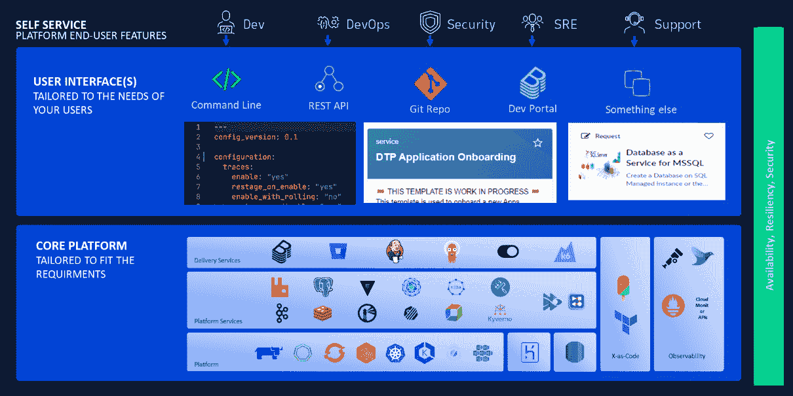
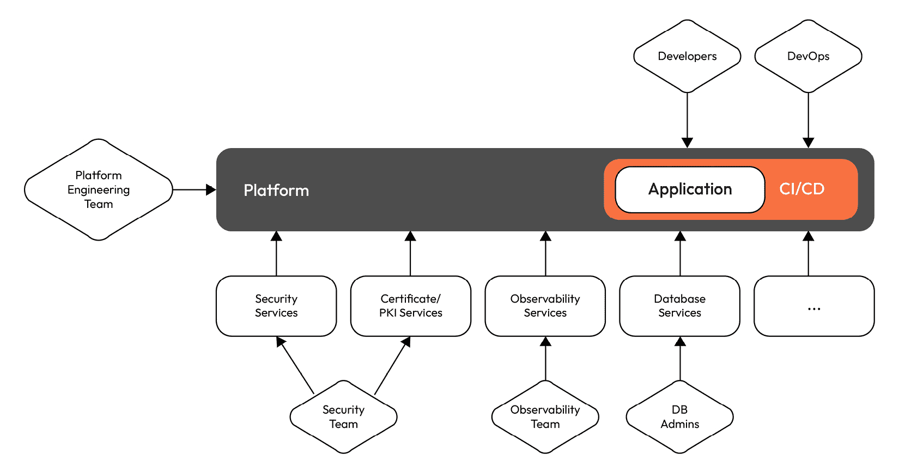
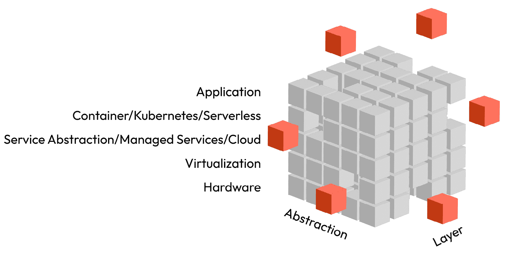
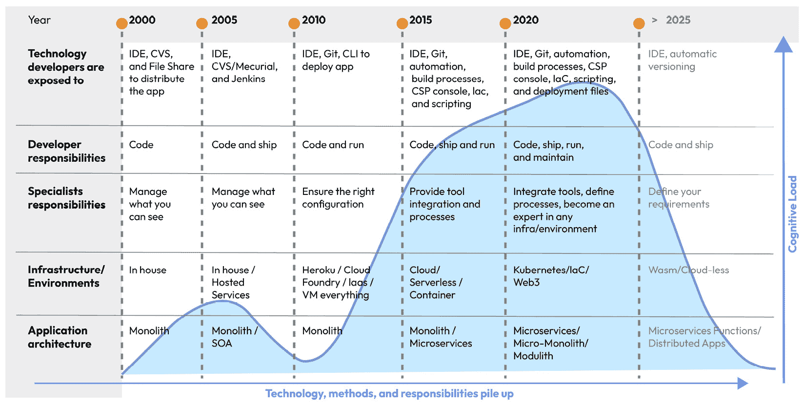
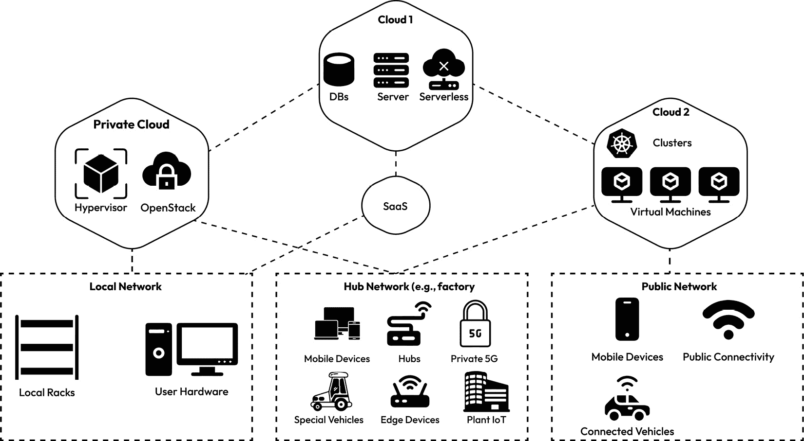
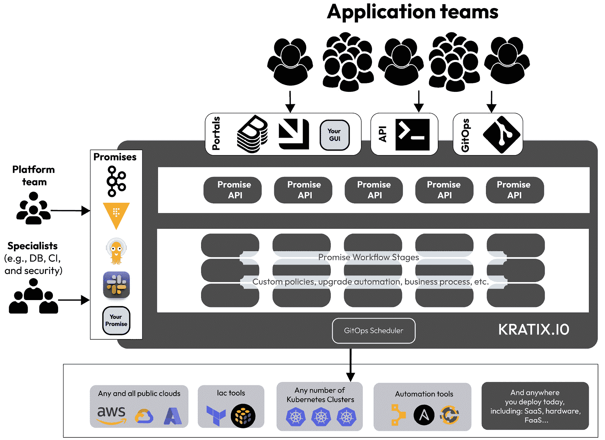
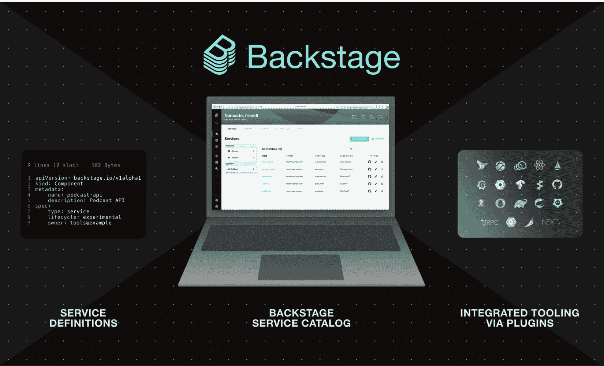
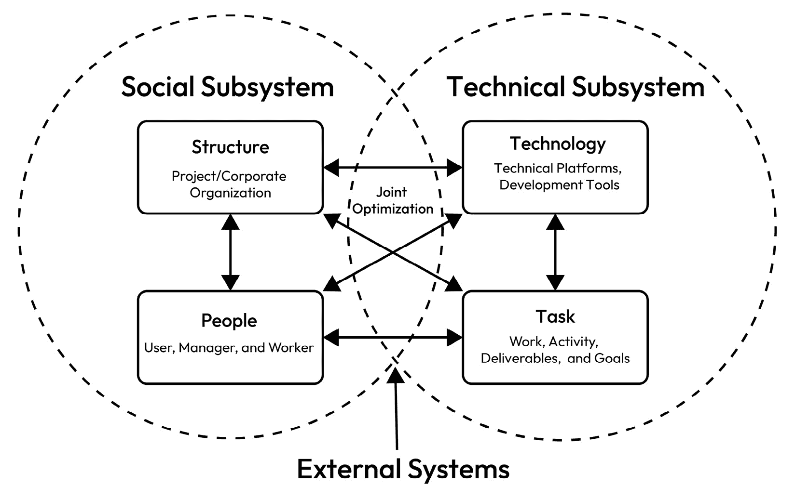

# 平台工程学与平台打造的艺术

在本章中，我们将学习如何判断我们的组织是否处于适合规划平台的状态。 为此，我们将澄清为什么平台成为如此重要的话题，产品思维如何融入其中，以及判断我们是否准备好构建平台的检查点是什么。 我们将了解平台之间的差异以及最常构建的哪些平台类型。 常见的平台类型。

接下来，我们将深入探讨平台的三个核心元素：普及的云、开发者体验和平台的主要特性。 总体而言，我们将看到云原生工程中的一些常见元素。 这引出了一个问题：我们是否真的需要另一个抽象层。 我们还将考虑，平台是否能帮助我们克服由于过度工程化复杂系统和开发流程所带来的高认知负担，还是最终只是成为又一层抽象层。 我们将反思一些这些层，以找到答案 为我们自己。

最后，我们将讨论超越技术和平台实现的方面。 理解社会技术层面的内容并将人类，我们的实际利益相关者，置于中心是至关重要的。 这使我们能够定义更好的平台产品，并为紧密合作找到方法。 紧密合作。

在本章中，我们将讨论以下 主要话题：

+   作为产品的需求 平台作为产品

+   实现以开发者和 产品为中心的解决方案

+   我们是否需要另一个 抽象层？

+   社会技术层面

# 作为产品的需求

在 云原生环境中，近年来几乎没有其他话题像“平台”这一术语一样，给人留下如此深刻的印象，*平台* 以及平台工程师的角色也随之而来。 就像第一个可用的 CI/CD 流水线的引入一样，这场淘金热导致了快速适应，往往没有明确的目的或理性。 现在我们已经进入知识的谷底，可以深入思考一个问题：你需要一个平台吗？如果需要，如何设计和实施它，确保它能够持续发展到 未来？

为了回答这个问题 我们应该首先看看构成这样一个平台的要素。 平台是不同能力的组合，这些能力是掌握传统和云原生环境所必需的，以便它能够在应用程序的开发、交付和运营中支持最终用户。 平台可以作为推动力，将非云原生基础设施转化为有价值的资源。 然而，今天大多数计算平台提供某种形式的 API，可用于自动化部署和工具化可用资源，并构建平台的基础。 平台为最终用户提供任何类型资源的一致性，并通过自服务 API、模板、CLI 或其他解决方案授予其功能访问权限。 以下示例还突出了平台由许多组件组成： 许多组件：

图 1.1：平台/IDP 示例

我们通常会看到 平台的主题出现在云原生的背景下，但为什么会这样呢？ 云原生技术使组织能够在公共云、私有云和混合云中构建和运行可扩展的应用程序。 这种方法通过容器、标准化服务提供、不可变基础设施和声明式 API 等功能得到了最好的体现。 这些功能实现了松耦合的系统，这些系统具有弹性、可管理和可观察性。 这些功能使开发者能够以最小的努力进行频繁的更改。 简而言之，平台是云原生计算的推动力，并利用其工具将其 工具化。

## 公司和开发者从平台中获益是平等的

软件工程师在云原生平台上的体验不同于在云服务提供商上本地开发软件。 专注于构建面向某一 云服务提供商 (**云服务提供商**)（**CSP**）会将你绑定到该封闭生态系统的逻辑中。 当你在云原生平台上构建时，必然会有类似的效果，因为这些平台通常是以 Kubernetes 为中心，利用 Kubernetes API 的高度集成统一性。 然而，问题在于，云原生平台提供相同的体验，而你并不意识到底层基础设施的存在。 由于大多数公司至少有两个到三个云或类似云的服务提供商，而且已经在适应这些服务时遇到困难，云原生平台无疑是一个颠覆性的游戏改变者 *[1]*。 在云原生平台上开发软件改变了思维方式和架构。 然而，如果不采纳这种思维方式，失败的概率 会很高。

然而，有更多方面需要考虑，平台不仅仅是统一的基础设施管理。 平台必须是为了某个特定的目的而创建的。 平台必须有明确的用途。 关于平台面向谁构建，以及平台工程师的利益相关者是谁，通常的定义认为这些仅限于开发人员。 这些定义忽略了一个事实，那就是整个组织、运维团队和其他专业团队同样从平台中受益。 平台为软件工程师提供了一个简便的入口，来构建、测试、部署、发布和运营他们的软件。 它深入提供使用情况的洞察，并允许看护者和管理员无所畏惧地维护基础设施、平台和集成。 用商业术语来翻译，平台可以提供更快的市场进入时间，并且具备更大的灵活性来改变和调整其组件，同时保持高可靠性和 强大的稳健性。

这对现在的公司意味着什么？ 由于市场上 IT 专业人员的短缺、IT 变化的快速节奏，以及培训团队在云技术和云服务提供商方面的超负荷工作，平台为能力引入了合适的断点。 我们需要这些断点，以避免将多个学科合并到一个角色中的趋势，例如 DevOps。 此外，利用 DevOps 方法论的平台工程师并不是 DevOps。 我们需要积极保护这个角色，避免重蹈 DevOps 角色的覆辙，并在定义上保持敏锐。 平台工程师整合专家提供的能力，通过他们的平台简化这些能力的使用，帮助开发人员使用，并为工程师提供自助服务。 然而，开发人员不需要成为多个领域的专家，例如安全性、可观测性、基础设施配置和自动化等。 这与常见的 DevOps 角色有所不同，DevOps 需要成为自己领域内所有必要方面的专家，以确保其应用的正常运行。 未来我们仍然需要 DevOps 来处理更高级的应用管理，但我们也必须让他们的工作 更轻松。

该平台为需要专业知识的自下而上的能力提供集成层，例如安全性、数据库，甚至是虚拟机或裸金属服务器的部署，同时也提供开发人员和 DevOps 的自上而下使用。 如下面的图所示，平台工程团队负责提供 这一层。

图 1.2：平台驱动型组织中的能力与责任

当然，这也 意味着必须培养和教育另一个专家团队。 然而，相比之下，平台工程师的小团队通常能够构建并运行庞大的环境。 理想情况下，平台减少了公司内其他团队的认知负担，让他们能够专注于核心价值，通过简化开发过程中的机制来帮助他们。 这个平台有助于减轻压力并提高透明度。 来自世界各地的公司常常分享他们在平台和平台团队方面的经验，通常的调子是讲述他们如何解决之前无法应对的问题，或者这种方法如何提高了他们产品 和服务的质量。

这些平台通常被 称为 **内部开发者平台** (**IDP**)，因为它们通常是为企业的内部开发团队而构建的。 在本书中，我们将交替使用平台、IDP、平台产品和云原生平台这些术语。 然而，我们首先会稍微强调一些方面：

+   **平台**：统一服务的跨技术层的通用术语，允许开发者使用。 这些平台通常被称为 

+   **IDP**：强调开发者、 **软件开发生命周期** (**SDLC**)，以及 开发软件所需的工具

+   **平台产品或平台即产品**：强调专门的团队负责平台演进能力及其长期承诺，同时建立一种 不同的思维方式

+   **云原生平台**：专注于抽象和使能使用标准化 API 以及集成 的能力

这种视角 可能感觉很细致，但平台这一术语本身往往会导致更多的混淆。 云平台也是一种平台，对吧？ 一个 **软件即服务** (**SaaS**) 也可以视为平台。 提到云原生平台或 IDP 可以引导我们走向正确的方向并获得更准确的理解。 根据您组织的成熟度，明确这些术语并建立共同的理解、语言和 共享知识也是至关重要的。

## 平台案例研究和成功故事

为了 突出平台的积极影响，我们可以通过三个完全不同的公司及其使用 IDP 后的结果来进行展示。 所有这些案例主要集中在 Backstage 作为开发者门户和进入点的角色， 以及 IDP。

作为 Backstage 的发明者和 IDP 运动的发源地，Spotify 声称以下说法适用于其内部的 Backstage 用户：

+   GitHub 上活跃度高出 2.3 倍 更多

+   代码更改多出 2 倍 部署更改次数

+   部署次数增加了 2 倍

+   新开发者的入职时间从 60 天缩短至 20 天

Expedia 集团报告 了不同的数据：

+   平均而言，创建一个新组件 或应用程序需要四分钟

+   超过 4,000 名用户每天至少使用 IDP 20 分钟 以上

+   技术文档每月被查看超过 50,000 次 每月

+   超过 15%的内部开发工具已与 Backstage 集成 从而减少了上下文切换

现在，最后一个 我们应该关注的公司是丰田：

+   项目现在每周交付一次工件 而不是每月

+   每个团队节省了 8-12 周的额外工作，从而减少了超过 500 万美元的成本或用于 价值创造的时间和预算

+   标准化部署模板减少了失败并加速了部署 部署速度

这些数据对于了解数字原生公司、旅游科技公司以及世界上最大的汽车制造商之一的背景非常有趣。 这些数据中的任何一项都能清晰地展现出正面 效果 *[2]*。

## 项目与产品

谈到 组织，引入新解决方案通常作为一个项目来进行。 因此，在某个时间点，有人决定投资建立自己的平台。 这种方法面临一个根本性的问题：截止日期。 项目需要在规定的时间和预算框架内达成目标。 如果项目耗尽时间或资金，它将专注于其运维。 生命周期的这两个部分被当作不同的事情来处理，造成了朝阳与夕阳的时间段。 简单来说，在实施阶段，你会看到大量的投资、沟通和兴奋。 然而，在达到截止日期后，项目变成了一个需要维护的死物。 DevOps 并没有改变这种行为；它只是常常有了新的名称、新的角色和不同的流程。 然而，最终，预算、人力和注意力被转移到下一个项目，而仅有一小部分原有的预算得以保留。 这对于那些在实施过程中辛勤工作的工程师来说是令人沮丧的，随着纯粹运维成本的不断增加，这对于组织来说也将变得令人沮丧。 然而，构建该平台的人可能会离开或加入其他项目。 这种短期视角的系统实施方式，慢慢地扼杀了许多优秀的项目和团队精神。 更重要的是，它显示了解决方案的商业价值并不明确。 当一个实施方案（如平台）能够提供明确的价值时，就不应该有理由转移注意力并导致 它的夕阳。

尽管将许多实现作为项目来进行是一种有效的方式，但对于平台实现而言，这却是它的死刑。 常规实现是功能完整的；完成后它们可以存在。 但是，平台总是在不断发展、不断升级，并且总是实现新的功能。 在与开源和云服务提供商合作时，你将会早早了解到它们在自身开发周期中的工具和软件的更新速度。 功能、修复和安全补丁会持续发布。 这对大公司来说是一个重大挑战，因为它们仍然习惯于远远慢于此的发布周期。 保持与这种快速发展的速度同步的好处在于，作为一个组织，你可以频繁地从新的功能和能力中获利。 它是创新的驱动力和使能器，使你能够以其他方式实现系统，并解决你可能没有意识到的问题。 对于你来说，不痛苦的问题，真的算是个问题吗？ 组织通常不会将这类问题视为问题，因为它们习惯于只识别痛苦的过程 和方法。

让我们看一个例子。 在当前年份（2024 年），欧盟发布了一项法律，旨在改善企业的碳排放报告。 从高层次来看，这也包括 IT 资源。 此外，在过去的几年里，多个开源基金会和项目已开始致力于为软件的能源消耗提供透明度。 一年前，我们只能报告非常粗略、估算的数字，关于数据中心、服务器的能源消耗，以及经过一些人工处理后，某个软件的能源消耗。 今天，我们可以为在裸金属、虚拟机管理程序或 Kubernetes 容器中运行的任何应用获取细粒度的信息，因为工具已经发展到可以提供这些数据。 公共 CSPs 提供越来越多的关于其自身能源消耗的见解。 我们可以期待来年会发生什么？ 我们可以期待更好的数字，包括能源的区域性碳混合，以及这些数字的端到端可见性和透明度。 对于平台和平台工程团队来说，这种透明度将随着时间的推移自然到来。 它不需要一个项目来彻底颠覆 IT。 提出这一需求将促使平台工程团队将这些功能实现到平台的核心中，惠及所有使用该平台进行构建、部署、发布和 运营软件的人。

这被称为产品思维方式，对于平台来说，适应其环境的需求是自然而然的。 他们 的 环境。

## 平台作为一个产品

作为产品的 平台是以用户为中心，倾听并积极研究最终用户的需求，不断改进其服务。 一个产品也意识到它的价值。 类似于你手机上的任何应用，它利用自身的价值来为进一步的开发和新功能提供资金。 在这里，没有截止日期，也没有结束。 目标仅仅是通过每次发布变得更好。 这给组织带来的是一个专家团队，持续致力于为业务提供有价值的平台的核心能力。 价值创造。

将平台设计和开发作为一个产品，超越了单纯的工程学层面。 它面临着组织方面的挑战，这些挑战应当在你决定积极构建平台时考虑进去。 事实上，你需要提供有效的数据来证明你的平台带来了好处，并且展示出平台能够覆盖其自身的成本。 这必须在产品负责人和平台工程师的思维方式中。 这里的想法不是要成为商业人士，而是要能够清楚地传达存在的理由，更重要的是，成为一个没有 截止日期的产品。

现在，你可以找到三种不同类型的作为产品的平台：

+   **IDP 平台**：

    +   为 软件工程师提供最佳体验

    +   为开发和运营团队提供端到端支持和可视化， 支持他们的软件

    +   引入治理、合规性 和安全性

    +   为开发团队建立自助服务，并简化 部署过程

+   **数据科学和机器学习平台** **：**

    +   与 IDP 平台类似，并且通常是从这些平台演变而来的 。 这些平台

    +   利用其可扩展性进行数据的研究、分析和处理， 高效地降低数据成本

    +   克服了复杂的实施过程，并使它们 普遍可用

    +   提供直接、安全的访问相关的 数据源

+   **低代码/商业平台**：

    +   强烈的趋势驱动着提供平台，这些平台能带来解决方案，使得可以在相对较少甚至几乎没有**编码需求**的情况下实现新特性。

    +   我们将在未来几年中更多地看到它们。

在我们的书中，我们将专注于**产品中心化**的 IDP 架构视角。

## 你需要一个平台吗？

和任何其他复杂环境一样，我们首先要问：我们真的需要一个平台吗？我们知道我们将如何使用它吗？

尽管平台可以提供很多好处，但它们并不总是你组织问题的答案。以下是你还未准备好使用平台的迹象：

+   你只有**单体应用程序**。

+   你没有自己的**开发团队**。

+   你的 DevOps、SysAdmin 或基础设施团队工作过度，或者被**孤立**。

+   你有非常简单的应用程序，这些应用可以**运行在任何地方**。

+   你很难为培训提供预算，以帮助**你的团队**提升技能。

+   你通常运行商业化的、**现成的解决方案**。

另一方面，什么时候使用 IDP 对你来说有意义呢？以下标准是你准备好使用**IDP**的指示：

+   你有多个基础设施环境的需求，或者推动一个**多云战略**。

+   你需要对你的环境进行高级控制（安全性、合规性，以及对基础设施和**应用行为**的深度洞察）。

+   你的开发团队不断被**无价值的任务**所压垮。

+   你有一个好奇且感兴趣的 DevOps 或基础设施团队，他们已经迈出了向平台过渡的第一步，尽管他们并没有意识到这一点。

+   你的应用程序由于微服务架构需要某种类型的编排，因为许多组件或不同的集成需要良好地**协同工作**。

+   你希望让组织能够优化 IT，以降低成本、提高透明度、质量，或**安全性**。

在为你的组织定义一个平台产品之前，你应该回答清楚检查清单上的所有问题。 有多个点来说明你为什么需要它是有道理的。 例如，仅仅因为某个团队请求一个 IDP，或有人在会议上提到他们听说过它，并不足以作为做出此类决定的坚实基础。 平台的引入是一个过程，根据我们的经验，它可以在相对较短的时间内成为公司核心的焦点。 在这样的压力下，你仍然需要有明确的目的 和方向。

现在我们已经学会了如何定义平台的目的，接下来我们需要讨论一个问题：我们真的需要这个额外的 抽象层吗？

# 我们真的需要另一个抽象层吗？

让我们简要总结一下到目前为止的内容。 一个平台为你现有的基础设施和环境加上了一个括号，并在其上加了一层抽象。 该平台通过进一步的功能增强它，使得你的开发团队能够以自动化的 自助方式利用它。

从技术角度来看，这代表着下一个抽象层次。 因此，讨论我们放置在其上的这层新结构是有道理的。 从底部到顶部，我们可以看到裸机，接着是虚拟化的超监视器；其上是云服务提供商。 有些人可能会包括容器、Kubernetes 或无服务器组件——而现在，我们将添加我们的平台。 这些至少是四个层次，每一层都承诺让其下方的层次更简单，并通过 一个难以定义的元级脚本、 **基础设施即代码** (**IaC**)、云库和自动化将它们粘合在一起。 那么，我们真的需要这一层额外的抽象层吗，还是我们只是在用它来让自己 忙碌 地建造东西？

## 简化抽象层

没有 简单的答案，但通过探讨每一层的目的，你或许能够更好地理解它 。

最初引入虚拟化技术的目的是简化主机供应，以便软件能够运行并更好地利用服务器。 今天，它们仍然具有同样的作用，但可以被 Kubernetes 和容器运行时所取代。 反对这种替代方案的一个关键论点是，虚拟机提供更好的隔离和更高的安全性。 在不深入讨论的情况下，也有提供非常坚固隔离的选择，比如 Kata 容器。 唯一令人头疼的组件是带有操作系统和其运行时的容器。 展望未来几年，**WebAssembly** (**Wasm**)可能会成为解决这一问题的一部分。 在容器中没有操作系统，只有纯裸二进制文件，几乎没有攻击门路。 然而，让我们再给它一些 时间。

**基础设施即服务** (**IaaS**)提供商 和公共云提供商通过软件定义的存储和网络增强了这一能力，减少了构建自己数据中心及管理所有物理依赖的复杂性。 此外，它们还提供了常用场景的进一步功能，如数据库、负载均衡、用户管理、消息队列或者 ML 平台和预训练的 AI 模型。 这是一个非常有用的实施方案，推动了行业的快速发展，扩展了可能性。 然而，这也导致整个行业朝着一个问题导向发展。 技术的发展速度超过了人们和组织，尤其是它们能够适应的速度。 我们看到全球专业工程师的短缺，而企业每年都在考虑提供更多的数字服务。 因此，解决方案及其依赖关系都是本地化到云端。 这种努力的回报可能是显著的。 你可以用一个相对较小的全球团队管理任何类型的基础设施和服务。 然而，现实也表明，平均每家公司拥有两到三个 IaaS 和公共 CPS，加上（通常还有）自己的计算能力，以及大约 10 个 SaaS 提供商，大企业可能达到 50 个 *[1]*。CSPs 还提供 40 到 200 种不同的服务。 换句话说，今天我们能够取得很大成就，但这些环境的复杂性也 变得相当重要。

为了驯服这个 规模，IaC 和 **云开发工具包** (**CDKs**)已经成为管理你的着陆区和软件集成的首选工具。 故事中有趣的部分是，像 DevOps 这样的实践经常被误解，已经使情况变得更糟。 这些误解现在已经导致开发人员也期望设置和维护他们 软件需求的基础设施。

最后但并非最不重要的是，我们有基于容器、Kubernetes 或无服务器的系统。 每种环境都有几十种选项可供部署代码和运行组件。 理解这些需要关注的层次太多了。 然而，它们的发展是合理的，因为你不希望像以前那样运行软件。 将代码推送到镜像，然后选择运行时简化了 配置过程。

总体而言，要表示复杂性水平，我们可以想象一个三维对象，比如一个由立方体构成的立方体。 下面的插图展示了不同的服务层，代表了抽象的不同成熟度，以及每一层如何组合形成一个 IT 环境。

图 1.3：计算抽象和简化的多维复杂性

现在，这个图表 过于简化，考虑到每个维度中你拥有的数百或数千个选项。 然而，它仍然给出了一个很好的提示：如果你需要一个平台，建立一个包装器围绕这个结构，并驯服它的巨大复杂性以利用它的力量。

## 对软件工程师和其他 IT 专业人员的认知负荷

为了管理所有这些层次，我们需要了解并使用许多工具，并遵循各种流程。 在花费大量时间处理那些本应简化我们工作的事情时，专注于实际工作并创造价值变得困难。 这就是所谓的 **认知负荷** 。最早由丹尼尔·布赖恩特（Daniel Bryant）提出，这个术语概括了许多开发者以及其他 IT 专家的工作过载和心理压力， 以及其他 IT 领域的专业人士。 减少认知负荷能带来更多的幸福感和满足感，同时也能提升工程师的效率和可靠性。 看一下下面的图示，可以简化我们在不同时代作为专业人士需要处理的事务的视角。 然而，往前看，我们必须减少这种负荷。 人工智能可能是其中的一部分，此外，还有运行计算过程的新概念，以及 平台，当然也在其中。

图 1.4：扩展的认知负荷及其对理想未来的预测

不仅仅是 技术随时间变化，它还会不断积累。 这意味着我们不仅要运行和维护遗留系统，还要改变架构风格，引入新的编程范式和新工具。 这也改变了职责范围，并且大大超出了几年前职位描述中的典型边界。 拆解这个问题可以揭示出是否需要一个平台来解决我们的难题，或者实施一个平台是否会再次增加 复杂性。

最终，每个组织都是不同的。 有些组织停留在 2000 年代初，而有些组织则不断尝试适应未来的变化。 即便在同一个组织内部，你也常常会发现巨大的差异。 一个部门可能仍然在自己的数据中心上运行所有虚拟机，而下一个部门可能将功能部署在全球 CDN 或边缘提供商上。 因此，如果你确实需要平台，制定一个愿景、战略和目标就落在了你身上。

我们所经历的复杂性以及对工程师施加压力的行为需要被面对，因为信息技术随着时间的推移往往变得更加复杂。 在接下来的章节中，我们将重点讨论为开发者实施正确的解决方案，以克服我们正在走向的那个麻烦方向，而这个方向甚至可能导致 职业倦怠。

# 实施面向开发者和产品的解决方案

在接下来的几年里，我们将见证云计算的发展。 在此背景下，平台将发挥至关重要的作用。 一方面，云将无处不在，成为基础设施的抽象。 无论它是边缘计算的形式，还是非常专业化的服务或产品，这都不重要。 另一方面，正如我们在上一节中所了解到的，我们必须专注于提供能够为开发者和其他角色带来最佳体验的环境，这样他们就可以专注于创造价值。 将这些元素实践性地结合起来是 IT 组织跟上市场步伐并为公司持续创造价值的关键能力。

## 普遍存在的云

普遍存在的云 **并非** 单一的解决方案。 它聚集了多种正在经历 转型性变革的云计算能力，以显著推动业务和创新。 关键的进展专注于将云技术整合到任何地方，从私有数据中心、分布式计算网络到边缘计算。 然而，普遍存在的云不仅限于此。 它遵循通过传感器、物联网组件、移动设备和其他智能连接解决方案来弥合物理间隙的概念。 因此，它也被称为 **无处不在的计算**、 **环境智能**、 或 **无所不在**。

Gartner，这家研究公司，认为以下六项技术将塑造普遍存在的云并定义其 特性 *[3]*：

+   **增强型 FinOps**：将 DevOps 方法与成本优化 和预算管理相结合

+   **云开发环境** (**CDEs**)：简化和统一开发 环境，减少人为错误并 确保可重现性

+   **云可持续性**：实现 环境、社会和经济效益，减少云计算技术快速增长带来的有害影响，并利用其力量 造福社会

+   **云原生**：实现之前定义的 云特性

+   **云端扩展至边缘**：CSP 能力扩展至 边缘

+   **Wasm**：一种潜在的无处不在的运行时和二进制格式，适用于各个地方，但不 一定适用于所有事物

然而，我们 需要问自己，为什么这些现在对我们作为平台工程师、架构师 和开发者有意义。

首先，你可以在这些定义和假设中找到我们已经在使用的许多技术。 云原生、FinOps、边缘计算和 CDE 已成为日常现实，而可持续 IT 和 Wasm 在近年来经历了大量开发。 这一切都与明确表明我们讨论的不是未来 100 年内无法实现的科幻技术相关。 它正在发生，且已准备好投入使用。 我们开发并创新了所有这些基础；它们可能不像 GenAI 那样显而易见和突出。

其次，为了从云投资中提取最大价值，企业必须采用自动化的运营扩展，利用云原生平台工具，并实施有效的治理。 这些平台集成了 SaaS 等关键服务， **平台即服务** (**PaaS**)，以及 IaaS，以创造具有模块化功能的综合产品。 鼓励 IT 领导者利用这些平台的模块化特性，以保持在快速变化的市场环境中的适应性和灵活性。 想象一下，在没有一个能够驾驭这些广泛变化的的平台的情况下，环境会有多复杂。 尽管如此，面对所有这些复杂性，我们仍然需要保持产品思维，否则在未来提供可靠的 IT 服务和解决方案将变得困难。

图 1.5：云概念在普遍的云中无处不在

查看 前面的图示，你可以发现无处不在的云元素。 我们不应该把这张图看作是独立的项目。 一切都是相互连接的。 手机上的应用与云端或本地集线器中的服务进行通信，企业有多个网络将不同的计算环境连接在一起，而我们完全忽略了更进步的概念 例如 **Web3** 在这里。

重要提示

信息技术正经历着一场重大的变革，无论是可见的还是不可见的领域。 随着我们迈出的每一步，我们在增加其复杂性的同时，面临着人口压力和专业人才短缺的挑战。 迟早，大多数公司将需要拥有自己的平台。 如果他们 没有，他们将购买 作为服务。

## 专注于开发者体验

希望每个开发者都能在没有过度疲劳的情况下，涵盖广泛的工具和技术领域，是不可持续的。 因此，用户体验的质量在决定平台的采用和成功中至关重要。 一个设计良好的平台意味着它是直观的，易于导航，并与开发者的期望和工作流相一致。 提升体验包括简化互动、最小化摩擦点，并提供一个视觉、技术和功能上都令人愉悦的环境。 这不仅提高了用户满意度，还提升了生产力和参与度。 这不仅提升了用户满意度，还增强了生产力和参与度。 问题是如何 实现这一点。

我们必须考虑到每个开发者在设计平台时可能有不同的偏好。 这直接涉及到平台与用户之间的互动问题。 开发者可能会提出各种问题，例如： 我们需要设置一个门户吗？ 在 Git 服务上推送代码就足够了吗？ 我可以通过 CLI 与平台互动吗？ 这些问题可能难以回答，但成功的平台提供了所有这些互动。 从 API 中心的方法开始，将使得任何其他路径可以同时进行。 强大的 API 是一个好平台的核心。 实际上，大多数平台仍然提供多种不同的接口。 快速发展的工具将统一这些接口，从而克服这些挑战。如果考虑到在全新环境下构建，它可以直接嵌入到 核心中。

这样一个核心的例子是 Kratix。 这个 Apache 2.0 许可的开源平台自称是一个“*... 用于构建可组合 IDP 的平台框架*。” 在下图中，你可以看到 Kratix 如何在我们今天使用的所有常见工具之间定位自己，并提供一个 入口点。

图 1.6：Kratix 作为中央集成组件的概述

Kratix 通过 *Promises*的概念实现这一点，它本质上是一个 YAML 文档，定义了平台与用户之间的契约。 每个团队都必须经历一个复杂的入职过程，这并非由于平台本身，而是由于其他依赖项，如 CI/CD、Git 仓库以及将一切连接在一起。 通过 Kratix Promises，你可以将所有这些步骤封装起来，或者将多个 Promises 合并为一个。

目前，Kratix 支持简化平台基础架构以提升开发者体验，但仍然缺少一些内容。 问题的另一面是开发者门户。 Backstage 是一个由 Spotify 开发的开源 Apache 2.0 许可证解决方案的示例。 Kratix 与 Backstage 配合得很好，且实现了无缝集成。 Backstage 是一个框架，旨在声明式地创建图形用户界面，统一基础设施工具、服务和文档，从而提供极佳的开发者体验。 Backstage 有三个核心特性：服务定义、Backstage 服务目录和插件系统，通过它你可以启用其他功能，例如文档。

图 1.7：Backstage 的三个核心特性

此时，我们 已经看到了需要解决的挑战，并且我们已经对解决方案空间有了初步了解。 这应该能让我们在深入探讨接下来的章节中的细节之前，感受到当前的可能性。 下一章将继续探讨具体内容。

## 平台的属性

一个平台 必须具备某些属性，并提供一些核心组件，使我们能够向最终用户提供功能。 到目前为止，我们已经了解了需要处理的所有复杂性、需要集成的内容以及在创建最佳体验和产品时如何专注于最终用户的思维方式。 所有这些都必须与技术、过程或方法论的方式相匹配，以形成属性。 对于你平台的理念开发，我们只能鼓励你先研究这些属性，然后决定最适合你的解决方案，而不是先选择一个解决方案并围绕它构建对你情况的适用性。

一些属性，比如减少认知负担、将平台视为产品或开发者/用户体验，已经得到了很好的覆盖。不过，仍然有更多需要考虑的：

+   **灵活性、可调性和可组合性**：平台应该提供灵活性，允许它们以不同的方式被使用和与其他系统集成。 通过支持模块化和可组合的设计，用户可以根据自己的具体需求自定义和扩展平台，添加可选功能，而不会被不必要的功能所困扰。 这种方法使平台能够为拥有多样化需求的广泛用户群体提供服务，同时 保持简洁性 和可管理性。

+   **安全**：安全是必须嵌入平台设计和架构的关键属性。 **默认安全** 意味着 平台在开箱即用时采用最佳安全实践和配置。 用户应该拥有强大的 安全措施，无需进行大量配置。 这包括数据加密、安全访问控制以及定期安全 更新以防范漏洞。

+   **自助服务**：启用自助服务功能使用户能够执行设置环境、部署应用程序和访问服务等任务，无需等待 IT 支持。 这种能力不仅加速了工作流程，还减少了平台团队的运营负担。 自助服务门户应用户友好，并提供所有必要的工具和权限，使 用户能够独立管理他们的 任务。

+   **文档和支持**：有效的文档和入职培训对于赋予用户权力和减少与平台相关的初始学习曲线至关重要。 全面、清晰和易于访问的文档确保用户能够自主解决问题并了解平台的能力，而无需外部帮助。 入职过程应该指导新用户了解平台的核心功能和功能，使他们从 一开始就感到能力和信心。

你可能已经意识到，这些属性在某种程度上符合本书的大纲，因此它们是我们设计和规划的灯塔 平台。

有时，这些 属性可能过于软化，无法作为实施的参考点。 这一问题的替代方案被内部开发者平台社区（[https://internaldeveloperplatform.org/](https://internaldeveloperplatform.org/)）描述为 IDP 的五个核心组件 *[4]*，我们鼓励您查看作为 替代来源：

+   **应用配置管理**：以动态、可扩展和 可靠的方式管理应用配置

+   **基础设施编排**：根据上下文以动态和智能的方式编排基础设施 方式

+   **环境管理**：使开发者能够在需要时创建新的并且完全配置好的环境 。

+   **部署管理**：实施持续交付或甚至持续部署的交付流水线 。

+   **基于角色的访问控制**：以可扩展的方式管理谁可以做什么 。

在 *第二章*中，我们将详细讨论平台的组织和技术方面，以及制定一个可实施计划来将你的平台打造成一个 产品。

关注开发者视角意味着影响组织，从而影响为其工作的人们。 接下来，我们将探讨在 创建平台时需要考虑的社会技术因素。

# 理解社会技术方面

设计一个 成功的平台不仅仅涉及技术能力；它还需要深入理解用户的多样化需求，从早期阶段开始促进和激励协作，并创建一个欢迎平台文化的开放环境。 平台工程的这些社会技术方面是至关重要的视角，它们不仅强调平台的技术组成部分，还强调人类元素——个人和团队如何与系统互动，系统如何影响他们的工作和行为。 理解这一常常不可见的部分 在创建平台时至关重要。 它是将技术上强大的系统与深度整合的日常工作流和用户行为联系起来的粘合剂。 尊重这一几乎元层面的因素意味着通过高满意度提高生产力并推动采用。 我们必须承认，每一个技术决策都具有后果，既影响技术本身，也影响人类。 因此，设计能够与用户产生共鸣的平台，促进协作文化，推动创新，并让日常工作变得更加轻松是很重要的。 通过关注这些社会技术方面，平台工程师可以创建出更具适应性、可持续性和以用户为中心的系统，这些系统能够在不断发展的 云原生环境中经得起时间的考验。

然而，我们必须意识到，我们的互动是在一个社会技术系统中进行的。 挑战在于，我们在工作、个人和私人环境中不断发生摩擦和优化。 工作环境代表着你在专业领域中的所作所为。 个人环境是一种以“我”为中心的视角，分享着与任何与你接触的人的经历，可以是工作或私人方面的内容。 最后，私人环境是别人可以估计和观察到的内容，也就是发生在你关闭门后但可能对你的观点和视角产生影响的事。 这种不断的变动和调整发生在公司或项目结构、人员、技术以及他们的任务之间。 在此过程中，我们有不同的影响因素和激励驱动因素。 以下的表示应能可视化这一持续的运动。 子系统和系统本身有其自身的规则、活动， 和权力。

图 1.8：社会技术系统，Trancossi 等人。

当我们 在确定实施平台的最佳方法时，试图了解需求、建立社区，并倡导开放时，我们必须意识到这一切都受到并发生在一个社会技术系统内。 有时我们可能会被阻塞或被推向不同的方向，或者发现很难激励人们。 这是花些时间理解子系统和外部系统推动你的时机。 这些子系统和外部系统正在 推动你。

## 理解平台设计中的用户需求

平台 设计必须本质上具有灵活性，以容纳比开发人员更广泛的利益相关者。 我们不能说得太多，但实施一个平台是一个全员参与的决策。 软件工程师、产品负责人、业务利益相关者和操作团队都有独特的需求和挑战，他们期望平台能够应对。 开发人员可能寻求简便的部署和测试工具，而最终用户需要直观的界面和无缝的互动。 与此同时，业务利益相关者很可能主要关注 **投资回报率** (**ROI**)、安全性、治理、合规性和可扩展性。 作为平台工程师和架构师，你有责任识别这些需求，并在平台生命周期中保持平衡。

因此，第一步 在以用户为导向的平台设计中，是准确识别和理解与平台互动的不同利益相关者群体。 在早期阶段，可以通过访谈和调查来获得清晰的了解。 考虑从 360 度角度来看，记住采访一个人多于采访太少的人通常更好。 在后期阶段，更加依赖数据是有帮助的，可以使用平台各个组件的使用数据。 服务请求和帮助台上的未解决问题将是衡量平台可用性的良好指标。 此时，将平台视为产品并拥有产品思维是至关重要的，因为你必须从开发的最早阶段到整个产品生命周期中都考虑用户反馈，确保平台具有可访问性、直观性和高效性。 虚荣心的错觉肯定会将你的努力引向错误的方向。 定义诸如透明性或简洁性等原则会很有帮助，它们能指导你通过开发和决策过程。 在接下来的章节中，我们将深入探讨这个话题 。

为了保持相关性和效率，平台必须不断发展。 记住，项目在遇到截止日期时就会结束；产品则随着每次发布和用户反馈不断发展。 建立健全的发布文档和反馈循环对于这一迭代改进过程至关重要。 哪个渠道最适合你的组织和用户是你需要决定的，但除了调查和访谈之外，还有许多其他方式。 例如，通过沟通工具的直接互动、用户论坛、支持解决方案，甚至是内部企业社交媒体，或者在极端情况下，平台本身内嵌的反馈机制。 由真实用户体验和挑战定义的定期更新和升级，确保平台始终与用户需求和行业标准保持一致，促进忠诚度并 保持持续的参与。

## 促进和增强协作

透明且开放的反馈循环问题在于，它们需要良好的协作架构。 否则，它会显得不自然，从某种意义上说，就像传统的需求工程方法。 作为平台工程师，我们必须将这些经典方法包装成一种更具个人化和欢迎感的方式。 有效的协作是任何成功平台的基石。 通过整合合适的沟通工具，通过定制提供卓越的用户体验，并倡导跨职能团队合作，平台不仅能成为技术解决方案——它们还能成为不同开发团队之间的合作场所，并推动组织 和创新。

为了促进 合作，你的团队和平台必须是开放和欢迎的。 减少任何形式的障碍，使新产品团队能够顺利加入，并为他们提供不同呈现方式的起始点。 必须清楚地说明如何以及在何处联系你的团队以解答各种问题。 这在新用户团队加入你的平台的初期尤为重要。 消除任何隐性期望，即大家清楚地知道如何以及在哪里找到你的团队，因为通常并非如此，尤其是在大型组织中。 这要求你和你的团队成为平台的倡导者，并通过内部公共文档和登陆页面进行宣传。 你必须走出去，与其他团队合作，倾听他们讨论挑战，展示你的解决方案。 在可能的情况下，你必须向你的组织传达新功能和使用场景，并 不断向他们展示如何轻松 开始使用。

## 培养开放的、以平台为中心的文化

培养 一种开放和以平台为中心的文化可能是最难的部分。 这需要来自你组织内其他预算管理角色的支持，除了你自己的参与之外。 培养依赖于培训、激励（可能会有激励措施）和与社区或用户群体的互动。 所有这些活动超出了你的 预算责任。

培训可能看起来是一个昂贵且耗时的活动，而且很快就会过时，但几乎没有比这更好的方式能与最终用户进行紧密且真正开放的接触。 综合培训项目结合了不同的方法 和来源：

+   专注于平台各个组件的面对面工作坊 你的平台

+   入职培训的实践环节，以及一个简单的首次项目或特定的集成，这些 不会太复杂

+   自助教程

+   在线/视频教程 用于通用内容

+   在线/视频教程用于 你的特定需求

如你 所见，你不必一切亲力亲为。 购买常见知识的课程和培训，并提供你自己的内容来深化这些知识，教授你的平台特性。 此外，考虑创建一个资源库和维基，包括常见问题解答、最佳实践指南、故障排除技巧、代码片段和示例、用例推荐以及事后分析等。 这可以帮助用户更有信心，并减少新 技术采纳的学习曲线。

为了保持动力，培训和平台使用可以结合激励措施。 有不同的激励策略，如游戏化、表彰计划和基于绩效的奖励，可以鼓励平台的积极使用。 对于大公司，我们甚至见过内部徽章计划和 *云驾驶执照*，这些通常可以与官方认证结合。 但同时，你需要小心不要设定过高的人工障碍。 那样反而会适得其反。 理想情况下，你的激励措施应该能够激发新用户的兴趣，并为专家提供挑战。 例如，它们可以与现有的绩效指标整合，强化一个重视持续改进和有效利用技术的文化。 通过这种方式，你还可以通过定义的 KPI（如成本降低、绩效提升、 和稳定性）影响企业目标。

最后，我们需要将所有这些方法结合起来。 最好的方法是创建一个社区。 我们可以通过用户小组、定期聚会和论坛来建立这样的社区，让用户分享知识、共同解决问题，并相互提供支持。 为了培养一个社区，我们强烈建议你寻求 C 级高管和市场团队的支持。 这听起来可能很简单，只要把人们聚集在一起，似乎一切都会顺利。 实际上，这是一门完整的学科，需要探索吸引社区成员的策略、促进富有成效的讨论，并培养用户之间的归属感和责任感。 在用户中。

没有人，且不尊重他们的需求，你的平台要么很快被放弃，要么从一开始就无法获得任何吸引力。 专注于培训、激励和繁荣社区的战略举措可以加速开放、以平台为中心的文化。 为了提高平台的有效性，你必须超越其纯粹的技术部署。 这种整体性的方法确保了平台成为组织的基础组成部分，推动创新和效率在各个层级和利益相关者之间流动，从开发者和运营到业务和 流程所有者。

# 总结

在本章开头，我们探讨了平台在现代软件开发中的作用，特别是在云原生环境中的作用。 我们已经确定，平台不仅仅是基础设施元素，它们是需要战略规划和持续改进的基本产品，以适应不断变化的技术和 业务需求。

你已经了解了平台的基础知识，并且意识到平台结合了软件开发、运营和部署，形成了一个紧密的环境，具有全面性。 在此基础上，你看到了平台作为产品思维方式为何是一个关键组成部分。 它包含了持续开发、用户参与以及对反馈的响应，以保持其相关性 和价值。

接下来，我们讨论了简化开发者与平台交互的重要性，显著减少了认知负荷和操作复杂性。 两个简短的工具示例应该激发你对后续章节的好奇心和兴趣，同时也向你展示了所有这些复杂性和挑战 都是可以解决的。

在最后部分，我们了解了社会技术层面的因素以及人类因素的显著相关性。 平台必须同时考虑技术能力和人类因素，确保它们支持用户的工作流程、协作和生产力。 为此，我们介绍了三个支柱：在设计解决方案之前理解用户需求、促进和增强协作，以及培养开放的、 以平台为中心的文化。

这些课程应该激励你深入了解平台架构以及如何构建它们，因为它们提高了运营效率，并在组织内促进了创新和敏捷性。 通过内化这些概念，平台工程师和架构师可以设计出既稳健、以用户为中心，又能适应变化的解决方案，同时为 他们的组织创造真正的价值。

从人力资源方面转向架构，我们将探讨如何定义平台的原则和目标，如何定义平台架构，以及如何衡量平台在下一章中的成功。

# 进一步阅读

+   [1] CNCF 年度调查 2023： [https://www.cncf.io/reports/cncf-annual-survey-2023](https://www.cncf.io/reports/cncf-annual-survey-2023)

+   [2] 关于 IDP 成功的案例研究：

    +   Spotify: [https://engineering.atspotify.com/2024/04/supercharged-developer-portals/](https://engineering.atspotify.com/2024/04/supercharged-developer-portals/)

    +   Expedia: [https://backstage.io/blog/2023/08/17/expedia-proof-of-value-metrics-2/](https://backstage.io/blog/2023/08/17/expedia-proof-of-value-metrics-2/)

    +   Toyota: [https://backstage.spotify.com/discover/blog/adopter-spotlight-toyota/](https://backstage.spotify.com/discover/blog/adopter-spotlight-toyota/)

+   [3] Gartner 2023 年新兴技术的炒作周期： [https://www.gartner.com/en/articles/what-s-new-in-the-2023-gartner-hype-cycle-for-emerging-technologies](https://www.gartner.com/en/articles/what-s-new-in-the-2023-gartner-hype-cycle-for-emerging-technologies)

+   [4] *内部开发者平台的 5 个核心组件（**IDP)*： [https://internaldeveloperplatform.org/core-components/](https://internaldeveloperplatform.org/core-components/)
