# 第二章：理解平台架构以构建平台作为产品

在这一章中，你将被引导完成所有相关的基础工作和创建平台架构的方法。 首先，你将学习到平台原则，以及它们如何成为你平台战略的引导部分。 这将帮助你保持正确的方向，专注于最重要的事情。 我们将通过定义你平台的目标来结束这部分内容。

从这里开始，我们将定义你的架构。 你将学习到平台的组成部分、平台的可组合性，以及如何处理依赖关系。 接下来，你将学习如何为你的需求创建参考架构。 为了给你带来新的视角，我们收集了几个平台作为产品的 用例。

最后，你将学习如何用 **最简可行平台** (**TVP**) 开始你的平台之旅，以及如何通过相关的 **关键绩效** **指标** (**KPIs**) 使平台的采用变得可视化。

你将在 *第二章* 学习到以下内容：

+   理解平台原则并定义你的平台 和团队的目标

+   探索平台架构——层次、组件， 以及元依赖关系

+   探索平台作为产品——用例 和实现

+   理解 TVP（平台作为产品）

+   通过相关的 KPI 来使 采用过程透明化

# 理解平台原则并定义你的平台和团队的目标

你需要两样 主要的东西来为你的平台开发合适的架构并遵循它。 首先，你必须定义引导你前进的护栏，以及开发和运行 你的 **内部开发平台** (**IDP**) 作为产品的步骤。 第二，你需要理解你的目标是什么。 这不仅仅是架构，更是支撑你平台的已识别和定义的目的。

## 将原则作为决策的护栏进行引入

*原则* 可能听起来像是来自被遗忘的企业架构师时代的老派方法，或者非常僵化的组织。 在一切变得敏捷的时代，原则是积极决策的基石。 它们有助于缩短讨论时间，并专注于平台交付。 原则与能力或属性有何不同？ 平台的能力是 IDP 可以提供或提供的功能。 想象一下你需要文件存储，通过在平台内应用资源定义的规范，系统为你提供一个符合 S3 标准的存储桶。 属性是所提供能力的超集，可以主动或被动消费。 如果你定义了一个安全平台，那就是属性，那么这可能结合了节点的硬化 、 **常见漏洞和暴露** (**CVE**) 扫描，以及网络加密和严格的 **基于角色的访问控制** (**RBAC**) 规则等。 一个 原则帮助你决定如何实现这些能力和属性。 因此，你通常会遇到两种类型 的原则：

+   **通用原则**：这些 是面向全组织的计数方向点。 近年来的一个常见例子是： *数据是资产*。这意味着： 以下含义：

    *所有数据对组织都具有价值。* 它是一个可衡量的资源，我们采取措施保护并 使用它：

    +   对于每个数据源，某人 负责

    +   数据对每个人可用 。

    +   我们将保护数据免受丢失和 安全威胁

+   **具体原则**：这些 是面向特定用例的原则，可能与其他人相关，但旨在针对少数人或专家。 来自安全领域的一个例子是： *任何活动都由身份定义*。这可以解释为： 如下：

    +   系统中的每个过程都会记录一个身份 。

    +   未知身份应立即 报告

    +   每个系统都需要 用户身份验证

牢记 这两个原则将在你设计场景架构时，引导你做出不同的决策。 你会发现，特定原则看似描述了一个部门的显而易见的期望。 但如果你想确保事情按照你期望的方式完成，绝不要假设或隐性地期望某些事情。 你想要它的样子。

重要提示

定义 *明确* 规则、指南和框架，如果你对某个人的活动结果有特定的期望。 *隐性* 要求对方能够读懂你的心思，并拥有与你相同的世界观 。

### 平台和平台工程原则示例

在帮助你定义自己原则之前，我们想给你提供一些关于 可能原则的 建议：

+   **关注共性问题**：识别并优先解决那些能够帮助你组织中多个部门或人员的问题。 通过消除共享问题和滚雪球效应的难题，防止他人重新发明轮子，这些问题如果没有处理，会逐渐变得更大 和更严重。

+   **不要重新发明轮子**：研究市场上能够满足你需求的潜在解决方案。 定期检查自制的解决方案，寻找标准化的替代品。 市场发展比我们快。 专注于创造价值，而不是 内部依赖。

+   **每个客户都很重要**：你平台上的每个用户都至关重要，从大型系统到小型产品。 平等地收集和评估每一条反馈。 以同样的方式满足每个人的需求和要求，并提供相同水平的服务。 将这些反馈视为定义你 发展路径的主要方式。

+   **消除浪费**：我们将构建一个尽可能高效利用资源的平台，并帮助我们的客户尽可能优化资源。 我们推动资源消耗的透明度，并提供扩展、减少和调整工作负载的选项。 我们共同开发最佳实践，帮助开发人员了解如何配置和使用先进技术以实现 更大的灵活性。

+   **平台就是一种产品**：每个决策都要保持产品思维。 关注为你的内部客户（如开发人员、运营人员、安全人员等）提供真正价值的内容。 确保功能能够快速发布，并且有短的反馈循环。 识别那些由非价值驱动的技术带来的干扰。 你最高的目标是让你的客户愿意使用你的平台，而不是 强迫他们。

+   **内部源代码**：你平台的每一行代码都对你的内部组织开放。 问题和故障会公开跟踪，并且它们的解决方案会 被记录。 在相关情况下，保持一个常见问题解答（FAQ）。 任何人都可以提出功能、修复漏洞、提交代码和文档，以改进你的平台。 推动社区活动，促进你与 所有用户之间的交流。

这些原则试图涵盖不同的观点和细节层次。 哪个适合你很难说。 如果你发现它们 不起作用，不要害怕随着时间调整措辞或原则。

产品思维作为核心原则

你的内部客户应该希望使用你的平台。 他们不应该被 强迫使用。

### 定义你自己的原则

一旦你 适应了原则的理念，所有原则看起来都不错，对吧？ 现在，挑战是以团队能够采纳的方式定义并写出这些原则。 它们需要融入你的用词，并与公司内部定义 类似元素的方式相契合。

原则可以来源于你的公司价值观、客户反馈或团队的内部研讨会。 无论你做什么，关于原则的来源保持透明非常重要；否则，团队可能会感到被排除在外。 你还需要对它们进行几轮迭代，精炼措辞，并将其浓缩到最基本的内容。 与所有原则一样，它们不应过长，但也不应过短。 句子应简洁明了，不应包含嵌套或条件。 条件往往意味着你对原则不确定，或者说明它可以分成两个原则。 合适的长度是：你只处理一个主题，给出两到三句解释，也许还加上一些动机 或合理化。

我看到过两种非常高效的写作方式，它们在定义原则和寻找常见引用及适应性时非常有效，有时，这些原则出现在 Slack/Teams 的频道描述或 电子邮件 页脚中。

#### 命令和合理化

**命令和合理化**方法通常适用于那些层级较强的组织，在这些组织中，平台团队可能刚刚成立，或者整个倡议会被持怀疑态度审视。 这要求在初始化时有更严格的指导。 然而，我认为这些原则应随着时间的推移进行调整，并应收集平台工程团队和最终用户的意见。

以下是一个大纲，展示如何 编写它：

+   **标题**：每个原则都有类似标题的内容，应该牢记在 脑海中。

    标题后应跟随 命令列表：

    1.  初始命令设定了 方向。

    1.  接着，应说明为什么 这很重要。

    1.  之后，应该考虑一些更详细的操作 步骤。

    1.  然后，应再给出一个行动 或理由。

    1.  在这里，责任应交给 读者。

这是基于前述大纲的一个示例：

+   **标题**: *自服务优先*:

    1.  每个平台功能必须能够由最终用户使用，而无需与平台 工程团队进行交互。

    1.  这使得用户能够自我决定，并减轻平台和 DevOps 团队的工作负担。

    1.  不要规定具体方法，而是通过 最佳实践进行引导。

    1.  打开最终用户部署完全透明的可能性，并允许对 操作数据进行细粒度的访问。

    1.  你提供的是一套极有价值的工具和自动化系统，简化了软件的开发 和运营。

正如你所见，这种风格告诉读者该做什么。 标题很有力地表达了， *无论你做什么，首先要考虑让它可自服务化*。首先处理这样的数字风格命名。 如果每个原则都以“首先”，“首要”或 “总体”命名，这样的做法就行不通了。 然而，在这里，你可以看到，所有你写下的潜在原则中，这个原则永远是第一位的，并且很可能会凌驾于 其他原则之上。

第二至第四句详细说明并合理化了第一句。 它们提供了支持的论点和考虑的指导原则。 结束语和标题或第一句话一样重要。 这必须是一个交接语句。 它像是号召行动，但并不是要求别人做什么——这是前面句子所要表达的。 它必须以个人层面来表达，直接对读者说话。 请查看下面的示例列表，了解如何为原则做结尾的其他想法。 一个原则的结束语。

平台团队将随着时间的推移增长他们的内部信任和动力，这需要一种不同风格的 原则。

#### 我们将…

成熟的平台工程团队 和年轻的组织需要能够触动他们 *我们* 情感的原则。 这几乎就像是兄弟姐妹般的誓言。 然而，你也需要充分了解你的团队，并谨慎处理。 并非每个人都喜欢这种定义原则的方式，因为它们呼吁强大的纽带和沟通。 这只是一个个人问题，没有负面影响，但如果忽视它，你可能会失去宝贵的团队成员。 这就是我如何定义 *我们* *将* 的原则：

+   **大纲**：

    **标题**：标题保持不变；简洁有力，简短精炼， 就是这样：

    1.  第一句话通常结合了原则的意图，并包括帮助说明，以 合理化它

    1.  接下来的 句子都在定义更多的目标 或方法

    1.  每个句子将以“我们”，“一起”，“作为一个团队”，“为了我们的客户”等开始， 以此类推

+   **示例**：

    **标题**： *自服务优先*：

    1.  我们将以自服务的方式为客户提供每一项平台功能，专注于他们的**用户体验** （**UX**）并支持自主决定 软件开发

    1.  我们提供最佳实践，并在定义最有效的方法上进行合作。 这些方法最有效。

    1.  我们共同创造一个透明、创造价值的环境，促进自动化和以最终用户为中心的功能，以简化软件开发 和操作

你对这种方法有何看法？ 我保持了相同的原则，这样你可以做一个并排对比。 你支持哪一个？

你可以看到， *我们将* 更加简洁，但稍显复杂。 这是因为你需要直接面对团队，告诉他们需要关注什么，并用一句话解释背后的理由。 将其切割成短句会失去同样的效果，可能会传达错误的信息。

两种方法的结合可以很好地发挥作用，帮助你识别哪种方式更适合你的团队。 然而，平台团队对这种混合方式感到满意并不罕见。 如果你有四到六个原则都在呼唤你的 *我们* 的感受，这可能会感到沉重，但如果有一长串 命令，它可能会给你带来很大的压力。

以下是这部分内容的总结： 在下面的列表中： ：

+   原则是你在架构和 工程决策中的有益护栏

+   四到六个原则 是最有效的

+   如果你不确定，可以从较少的原则开始，并与最终用户和平台工程师一起识别 接下来的原则

+   经常检查你的原则，看看它们是否仍然适合你的团队，但不要每几 个月就改变它们

## 将平台的目标发展成一种产品

要成功地 开始构建一个平台，我们需要定义其目标和方向，以及如何构建或重构平台工程团队。 这一步骤还帮助你对之前定义的原则进行首次迭代。 反思你自己的看法，并挑战你最初的定义。 这将帮助你学习如何整合两种不同的力量和 相互矛盾的目标。

一开始将平台作为产品看似简单。 改变思维方式、与客户沟通并提供一些良好的功能，这些就是你需要做的。 然而，这只是故事的一部分。 我们需要让你意识到，云原生平台有潜力成为你组织的软件开发、交付和运营的核心动力。 因此，我们将向你介绍一些不同的概念，这些概念你也能在其他组织理论和实践中找到，例如看板（Kanban）、精益起步（Lean Inception）或 团队拓扑学（Team Topologies）。

### 理解你自己的价值

如果人类 在某一方面确实非常糟糕，那就是做估算。 没有尺度或参考点时，我们很难做出正确的估算。 比如，我问你，平台对你组织的价值是什么？ 你可能会提出这样的论点，比如更快的软件开发周期、更少的运营开销、以及减少招聘成本的快乐工程师。 这些说法都没有错，但也没有什么是精确的。 用商业术语来说，平台作为产品的价值在于它促进了市场时间的缩短，或者优化了延迟成本的灵活性。 换句话说：你将服务推向市场所需的时间越长，你创造的价值就越少。 一个好的平台将通过提供高度的灵活性和速度来帮助你优化这个价值， 从而为实施团队提供支持。

在 延迟成本 **成本理论（cost of delay）** [1]中，假设容量 是固定的。 如果你想实施三个项目，你需要决定从哪个项目开始。 每个项目带来的价值不同。 如果你同时启动所有三个项目，假设的情况是你能在同一时间完成所有项目，但无论是依次进行还是同时进行，你的速度都不会更快或更慢。 有了一个支持自助服务、高度自动化和自治、可靠性等的 IDP，你可以减少对可用容量的依赖，从而允许多个项目同时实施。 进一步思考，这也是为什么公共云服务提供商如此成功的原因之一。 然而，随着复杂性的增加和角色定义的错误，这些好处变成了障碍。

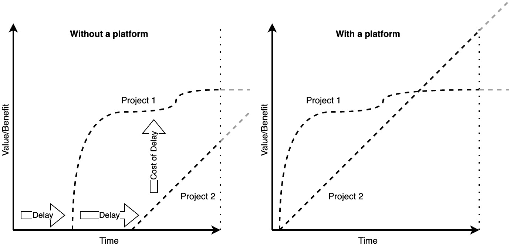

图 2.1：没有平台与有平台的延迟成本

前面的图展示了在没有平台和有平台的情况下实施项目的区别。 左侧我们可以看到至少有两个延迟，这意味着第二个项目在年末或某个期间开始提供价值。 这种延迟可能是由手动流程、对其他团队和团队成员的依赖，或者没有彼此集成的各种技术步骤所导致的。 右侧，项目的同时启动将由于非常好的平台带来显著的价值增长。 请记住，下面的区域代表的是 价值。

重要提示

云原生平台，如 IDP，正在打破延迟成本理论，使得快速且早期的价值生成成为可能。 平台越好，对能力的依赖越少，团队实现和运营产品的效率越高，你的组织能创造的价值就越多。

### 从系统到平台作为产品

最终，一个产品无非是由客户需求、你的 *业务* 利益、一些技术以及整体用户体验（UX）构成的服务对象。 如果缺少这些元素中的任何一个，你的产品将会失败。 在项目的世界里，我们有三个基石在不断拉扯着彼此：时间、金钱和范围。 这被称为 **铁三角** 。在这三个方向之间找到平衡需要仔细的调整。 但由于我们希望摆脱项目视角，我们将在这里介绍产品的铁三角。 它由可行性、可取性 和可行性组成。

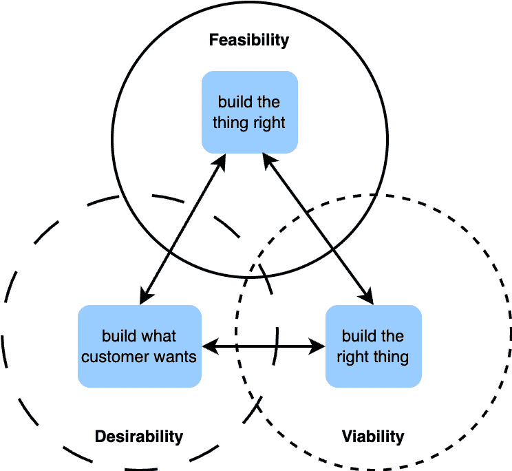

图 2.2：产品的铁三角

我们可以在这种平衡中找到不同的力量在拉扯产品。 所以，我们必须问自己以下问题：

+   我们为客户 和用户解决了什么需求或任务？

+   我们的客户想要什么？ (通常，他们 并不知道。）

+   我们如何使 它运作起来？

+   我们应该使用什么技术？ 该使用什么技术？

+   我们如何才能从中建立一个可持续的业务 呢？

我们现在可以将这种产品视角与 平台视角结合起来。

“*数字平台是一个由自服务 API、工具、服务、知识和支持组成的基础，这些要素被安排成一个引人注目的内部产品*” 甚至 *Bottcher* 曾这样描述过一个平台 *[2]*。此外，他还说，“*自主交付团队可以利用平台以更快的速度交付产品功能，同时* *减少协调*。”

平台和产品有很大的重叠。 两者都 具备以下特点：

+   他们必须倡导其有用性并将其推广到 内部团队

+   它们应该经过精心设计 并且准确

+   它们是以用户为中心设计的，或者更好的是，与用户/开发者共同设计（关注 UX/DevEx）。

+   他们随着时间推移不断发展提供的能力，并且需要一份 清晰的路线图。

在开发 平台作为产品的清晰愿景和目标时，应考虑并检查这些方面。 你会自然发现，对于产品铁三角，两个角色会被 立即分配。

平台的产品负责人将处理可行性，而平台工程师将处理可行性。 但几乎每个组织都缺少负责可取性的人。 这个 角色通常被称为 **开发者** **体验** (**DevX**)。

没有 DevX，一个平台工程团队 是不完整的。

重要提示

平台的产品负责人处理可行性。 平台工程师处理可行性。 DevX 负责可取性。 这些角色定义了平台作为一个产品的成功。

### 利益相关者及其对你的待办事项的影响

谈论 利益相关者和客户时，企业内部世界展开了一幅由许多有不同利益的人组成的景象。 为了聚焦重要内容，我建议将他们分为 三组：

+   **用户**：真正会使用你的平台/产品的一群人。 在我们的案例中，使用者将是开发者 或 DevOps 人员。

+   **客户**：具有预算决策权和/或为整个团队、部门做出决策的人， 或类似角色。

+   **影响者**：其他对你的平台感兴趣的人，如安全团队或 运维团队。

你正在 为那些利益相关者群体构建平台，而不是为了自己！ 在定义平台的目标时，你应当从不同的角度来看待不同的利益相关者群体。 他们的需求可能会随着时间变化，你可以通过频繁的迭代和调查来了解这些变化。 当你为待办事项定义功能时，要明确这些需求来自哪些利益相关者。 如果已经过去一段时间，通常六个月是一个合适的时间框架，那么你应该与利益相关者一起重新优先排序功能请求。 另一方面，这也会影响平台的目标。 让我们看一个 例子。

不久前，我们被要求稳定客户的平台。 我们对工作负载了解不多，但整体系统不可靠，几乎无法作为一个有用的系统。 几周后，经过一段时间的工作，新利益相关者出现了。 他们对平台产生了兴趣，因为它可以自动调整大小以适应工作负载，并且人们普遍对快速且简便的入驻过程感到满意。 此外，在之前的实现过程中，提供了严格隔离的单租户部署。 这些新利益相关者来自数据科学部门，他们希望能够轻松运行自己的模型，而不必成为专家。 他们使用的云服务提供商已经过于复杂，因为他们只专注于机器学习。 平台所有者同意提供几周的资源，用于在平台上实施数据科学家所需的工具。 尽管离完美还很远，但实现和平台足够好，易于使用，成本低廉，并且确保了所有的数据保护法规。 再过一段时间，平台团队的主要目标是为数据科学团队提供隔离的环境，这些环境配备了一整套工具，并且在完成任务后被拆除。 此外，平台仍然可以运行任何其他工作负载，目前对此没有需求。 暂无需求。

这个现实世界的例子表明，有时外部影响力比你自己的推动力更强，但它能导致更高的接受度和整个组织的采纳。 该组织的采纳情况。

重要提示

最终，你建立了一个平台，作为一个面向利益相关者的产品，主要是面向用户，而不是 为了你自己。

### 挑战康威定律

```
 Organizations which design systems are constrained to produce designs which are copies of the communication structures of these organizations. (Melvin Conway, 1967.)
```

我认为平台的主要目标之一是比目前的状态做得更好。 为此，我们必须挑战组织的现状。 公司会不断进行重组，交换责任并调整结构。 但最终，组织结构保持不变。 这就是康威的定律——至少他描述了他对组织的观察。 平台的存在是为了颠覆和协调；一方面，运用 DevOps 方法学识别瓶颈并打破这些结构，另一方面，协调专业团队的努力，形成一个 统一的环境。

作为一个平台团队，你应该首先定义你的目标和你希望遵循的理念，以便在被迫遵循组织结构之前实现你的目标。 可惜的是，这往往导致政治游戏——如何获得更多权力，如何拥有最多用户，以及谁有最好的资源来推动决策。 但不要太天真，以为拥有一个不错的平台和一些出色的功能就足以 取得成功。

因此，你需要对团队的目标有清晰的定义，以便在风雨飘摇时保持方向，在一切都想拖住你时继续前进，或者在你过于迅速和具有牵引力时保持你在正轨上。 它旨在帮助你保持 平衡。

为了将这一切汇聚起来并为你的团队和未来保存，你可以使用 *平台工程目标画布* 作为起点。 你可以使用以下模板（[https://miro.com/miroverse/platform-engineering-purpose-canvas-template/](https://miro.com/miroverse/platform-engineering-purpose-canvas-template/)），或者自己创建一个。

![图 2.3：平台工程目标画布 [3]（此图仅作为视觉参考，文本信息并非关键内容。）](img/B31164_02_03.jpg)

图 2.3：平台工程目标画布 [3]（此图仅作为视觉参考，文本信息并非关键内容。）

由于我们专注于 设计和创建一个作为产品的平台，我们将不会进一步探讨平台工程团队的详细信息，如何建立它们以及提供正确的变更管理方法。 还有其他专注于此的书籍和方法；因此，我们建议您查看 *团队拓扑* 如果您对团队 开发也感兴趣 *[4]*。

凭借您的平台目的，我们可以逐步接受创建您的平台架构的下一个挑战。 在接下来的部分，我们将为您创建一个参考架构和其他图表，以产品的形式呈现。

# 探索平台架构 – 层次结构、组件和元依赖关系

您的平台旅程的导航由参考架构定义，您可以根据这一架构来调整整体实施。 架构，特别是架构图，不是永恒的。 它们是 一个框架，一个蓝图，您必须根据它们进行定位，但是随着市场解决方案的演变，无论它们是开源的还是 闭源的，它们可以并且应该随时间变化。

为了使某些部分更易于理解，我们必须为您提供一些现成的工具和产品。 因此，我们 更倾向于突出开源解决方案而不是商业解决方案。 我们不希望给您任何偏见，因此请始终注意，对于我们提到的每件事情，至少有数种选择可供选择。 我们可能选择某些工具作为参考，因为我们更了解它们，或者因为我们看到它们在社区中更常用 比其他工具。

创建架构永远不应该只包括一个视角。 与以往每个主题一样，我们必须考虑各利益相关者从不同角度看待平台的情况。 我不想为您提供传统企业架构管理工具的完整集合，但我愿意为您提供一些相关的可视化和工具。

## 平台组件模型

*Stephan Schneider* 和 *Mike Gatto* 在 2023 年首次提出了 IDP 参考架构模型 *[5]*，该模型经过社区多次改进。 不幸的是，该模型缺乏一些重要的视角，要么是由于命名问题，要么是因为缺少一个所谓的 plane。 因此，我们开发了一个更为全面的模型，其中包括以下几个 plane：

+   **开发者体验 plane**：这个 plane 涵盖了软件开发和基础设施工程所需的所有第一层组件

+   **自动化与编排 plane**：该 plane 集成了构建、测试、部署、存储和编排应用程序以及基础设施的工具 。

+   **可观察性 plane**：该 plane 包括任何需要的工具，以提供平台及其应用程序发生的透明性和可视化

+   **安全与身份 plane**：该 plane 包含安全执行和监控系统、用户与账户管理解决方案，以及密钥和证书管理工具

+   **资源 plane**：这是一个容器，包含所有可以用于平台的计算资源

+   **能力 plane**：该 plane 位于平台内或平台上方，例如 Kubernetes，提供面向用户的服务

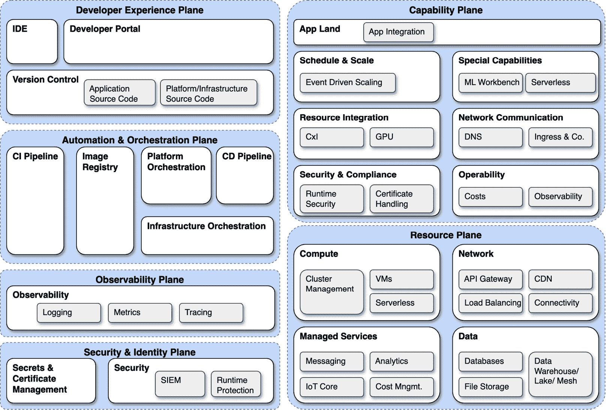

图 2.4：平台参考组件

这个组件视角 表明，平台肯定不只是一个单一的服务器，我只是安装一些容器编排或开发者门户的地方。 通常，这些组件有多个可能的部署位置。 这是一种链接，将相关的元素联系在一起。 例如，为了加强安全性，我们将在资源 plane 中找到相关的元素来遵守合规性并提供加固的配置，比如收集数据并分析的外部系统，位于 Kubernetes 中的能力 plane 之上，扫描容器并保护网络，此外还会出现在 CI/CD 中，以便只交付加固过的容器。 你可以看到，单一的主题可以存在于平台的任何地方。

## 平台的可组合性

一个 平台由许多不断发展的部分组成。 随着这一发展，你的用户和组织可能也会发生变化。 我们经常发现的一个巨大问题是，平台的某些部分不愿意被替换。 虽然常常会有关于优先级或预算的争论，但最常见的问题是它无法轻易替换。 有时，这是因为平台和组件已经陈旧，实际上是相互紧密结合的；有时则是因为技术选择不当，引入了一系列依赖关系，使得替换变得困难。 但也有第三个原因：将自己做事的方式强行塞入 错误的工具中。

组件化是一项原则，也许是一种意识形态，肯定是一种平台构建的方式和决策。 当组件能够相互作用而无需在其间开发中介来进行翻译时，例如脚本或无服务器函数时，组件就是可组合的。 可组合的组件可以以最小的努力，且对平台功能影响最小甚至没有影响地被替换。 Kubernetes 是一个极力支持这种方法的环境，因此它成为了构建平台的事实标准。 然而，平台的组件是分布式的，并不是所有的组件都运行在 Kubernetes 上。 这使得找到 正确的工具 变得具有挑战性。

一个通用的、一刀切的平台听起来总是不错，但它是不现实的，并且增加了复杂性。 你需要将更多组件引入平台时，组件之间难以协作的可能性也会增大。 因此，能够为特定的使用场景提供调整，而无需改变整个架构，将提高其可用性。 组件化的另一个重要好处是关注点的分离。

在 *第一章*中，我们 强调了平台作为即插即用专用解决方案的抽象层的目的。 严格执行组件化将会给组织层面带来大量工作，但它将允许专业团队将其核心能力直接提供到 你的平台。

要评估平台的一个组件是否可组合，你需要寻找 四种能力：

+   **可编排的**：它可以在现代动态环境中运行，例如 Kubernetes，而不 受到影响

+   **模块化**：它不需要任何其他工具或技术前提条件，但可以利用这些工具来扩展 其功能

+   **可发现的**：它需要与其他组件进行交互，遵循标准化的 API，或遵循像 Kubernetes 的自定义资源定义这样的概念 。

+   **自主的**：它必须独立于其他外部输入并自主运行 。

现在，我们知道在设计平台和选择平台组件时应该关注什么。 在接下来的部分中，你将了解那些使组件之间保持联系的东西。

## 依赖关系和隐藏的胶水

无论平台的 组件多么可组合 ，总会存在依赖关系和一些 *隐藏的胶水*。这些隐藏的胶水是组件之间流动的信息，使它们相互响应。 作为架构师，我们的工作是确保这些信息不相互矛盾。 这些信息很重要，但并不 为人所充分理解。

### 管理和处理依赖关系

首先，让我们通过可视化组件之间的依赖关系来构建可组合性。 为此，我们可以使用一个简单的依赖矩阵。 这个工具可以帮助你做决策并规划未来的组件。 此外，它需要一些维护工作；许多平台依赖于单个工程师的知识，并且随着平台随着时间的推移变得更加复杂，文档也会变得更复杂。 因此，映射依赖关系是实现透明度的最短路径。

在下面的例子中，我们有 **工具 A-C**，例如 **容器网络接口** （**CNI**） **1-3**。现在，这些 工具可以是我们之前提到的参考组件列表中的任何工具。

在依赖关系中，我更倾向于明确指出我们拥有的依赖类型。 因此，你可以使用如下内容： 以下内容：

+   **单向和双向依赖**：你可以使用这些来描述 工具 B 是否依赖于工具 A，或者工具 C 是否依赖于工具 B，就像工具 B 依赖于 工具 C 一样。

+   **增强依赖**：增强依赖会解锁更多的能力和功能，如果建立了，但并非必须。 例如，如果你有一个手动用户管理的工具，现在你可以利用 **单点登录** (**SSO**) 来减少你的 人工工作量。

+   **冲突依赖**：顾名思义，这两者无法 很好地协同工作。

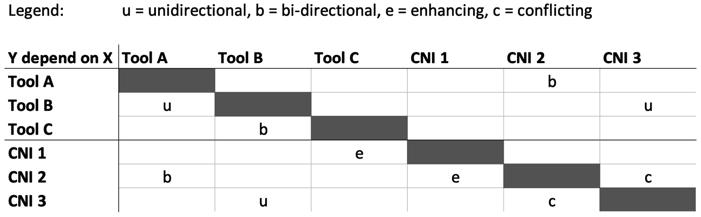

图 2.5：依赖矩阵

你 看过了吗？ 在双向依赖的示例中，工具 B 和 C 之间的关系没有正确 显示。 在工具 C 的列中，工具 B 的双向市场缺失。 当你实现依赖矩阵时，需要提供明确的指导，以跟踪这些关系。 我认为最有用的是为两个工具都设置标记。 然而，你必须明确阅读方向，或者引入更多的标记。 例如，你可以使用 *(u)* 来定义一个 传入依赖关系。

依赖管理是一个持续的任务。 随着时间的推移，你可能会忘记添加新工具。 因此，无论你使用什么方法来实现新功能，创建一个自动子任务来更新依赖矩阵可能是个好主意。 一个很大的好处是定期评估这个矩阵，这可能会发现潜在的 瓶颈或问题， 你可以着手解决。

### 应用 x 平台 – 相互影响

这个 **相互影响** 是 这样定义的：它们之间是相互关联的，以至于 一个补充另一个，或者等同于另一个。 在平台与用户应用之间，你有某种程度的相互影响。 例如，一个应用需要大幅扩展。 作为平台，你支持这种行为，但同时确保它不会影响到其他应用。 另一方面，该应用选择你的平台是因为你支持它的需求。 没有用户的平台是没用的。 为了作为应用发挥最佳效果，你应该在 该平台上运行。

然而，这个例子 非常通用。 相互影响也会影响到 YAML 文件中定义的层级之外的元素。 它也是没有被要求却自然而然产生的需求和要求；它是两个实施方之间的团队动态；它还体现了一个解决方案如何影响其他解决方案的方式 他们的工作。

因此， *依赖* 这个词并不适合用来描述这种关系。 它是一种共存，一种协作，朝着相同的方向一起前进。 对于平台工程团队，尤其是作为架构师的你来说，在设计解决方案时，必须始终牢记这种相互影响。 要让这一点成为你的超能力，你需要教育平台工程师和用户了解这些影响，并专注于如何让他们从平台中获得最佳效果，同时不会感到 任何限制。

相互影响

相互影响是应用与平台之间的无形互动。 将其理解为一种共同的力量，使得平台和用户的应用能够比没有彼此时更好地融合在一起。 相互依赖。

另一个地方这种相互影响变得可见的是 在过程当中。 在过程中。

### 平台的过程定义机会

平台工程 借鉴了许多 DevOps 方法论中的做法。 在 DevOps 角色中，一些部分侧重于自动化。 这些自动化步骤转换为定义流程。 因此，我们也可以说，平台工程师为其创建技术流程，以便作为产品在用户导向的方式中实施。 然而，这些程序在明确的设计决策中并不常见。 流程的形式（或流程的样子）取决于某些组件的工作方式。 关于平台可组合性，这可能是一种固有的方法，但我们能否通过明确设计 流程来改善平台？

它不应该变成业务流程建模。 许多先进功能，诸如 GitOps 或 Kubernetes 上的操作员，支持的工具可能具有多个 基于决策路径的变量。 如果要将这些都绘制出来，那将是非常可笑的。 然而，文档化并设计流程对于理解平台是有帮助的。 困难之处在于多个入口点的流程，这些流程可以从以下开始：

+   基础设施配置

+   用户引导

+   应用部署

+   事件处理

每个都需要自己的 流程定义。

你有机会在关注用户友好性和操作性的基础上发现优化潜力。 利用流程视角可以将以用户为中心的平台开发与更常见的、纯粹的技术驱动特性定义区分开来。 不幸的是，目前我们无法为你提供更多的见解，因为这一领域仍然是新兴的，几乎没有相关的知识分享。 在 *第三章*中，我们将深入探讨 这个话题。

### 供应商锁定讨论

总结 关于依赖性的主题，我们必须触及关于供应商锁定的讨论。 这是战略和架构决策的一部分，并经常推动产生奇怪的结果。 此时，您应该充分意识到，您总是会有依赖性，而供应商锁定仅仅是其中之一。 正如开源为避免专有软件带来了良好的基础一样，它也被用作自行构建事物的论据。 要问的重要问题是：您希望为用户提供平台的速度和服务质量是多少？ *您预期的运营成本是多少？* 除此之外，您还必须考虑 团队的可用性、技能集以及您的 组织更倾向于的成本（**运营费用** （**OPEX**）或 **资本支出** **（**CAPEX**）。

有关供应商锁定的一些不同观点如下：

+   **最好自己构建**：完全自己构建某些能力可能会让您感到终极自由，避免任何类型的供应商。 事实上，您只是成为了自己的供应商。 在某些时候，您可能不想或无法再投资于您的开发（常见的项目行为）。 因此，您作为自己的供应商从自己的市场中退役，并且您害怕的一切都成为了现实。

+   **选择每个问题中的最佳工具，而不是每个上下文中的最佳工具**：在可观察性范围内，有许多选项可用于监控、日志记录和跟踪。 针对这个问题的常见方法是选择最适合的开源工具。 在此基础上，您需要实现日志收集器和代理来转发指标。 您所实现的是一个完全可组合的可观察性解决方案。 另一方面，与单一供应商解决方案相比，您可能会失去上下文意识、可扩展性或操作性等能力。 我不想说专有软件更好；然而，我见过许多组织使用 10-14 种不同版本的工具，运行在最大规模上，并拥有高昂的运营成本。 实际上，对于工具集来说，这种做法在处理事故时并不有益。 在这种情况下，我们不幸地倾向于回避真相，并为为何事情会变得这样找借口。 它更好。

+   **专注于错误的事情**：人们仍然关注部署 Kubernetes 的任务。 这被认为是一个挑战，并且变成了一个永无止境的故事。 考虑利用工具、有明确观点的平台或商业解决方案来完成容器编排，并专注于 你平台中创造价值的部分。

供应商锁定是架构师在定义目标时议程上的一个情感讨论点。 你必须保持眼界开阔，真正考虑什么是重要的，什么仅仅是满足自尊心的东西。 复杂且无法管理的解决方案并不会为你赢得奖项 。

到目前为止，你已经了解了依赖关系以及如何处理它们。 在接下来的章节中，我们将学习如何让 它们可见。

## 参考架构

参考架构 对平台工程团队、你的平台和相关用户来说是非常宝贵的 资产。 它们为讨论和决策过程奠定基础，并帮助通过前瞻性思维定义未来的工作。 不幸的是，许多平台 团队无法清晰地描绘出 他们的系统。

### 特定供应商的参考架构

现在，这些 参考架构可能会因你使用的不同供应商而有所变化。 平台工程社区 *[6]* 已经收集了一些可供构建的选项和模板。 一个好的起点是单一云提供商模板，这里以 AWS 为例。 然而，能力平面仍然缺失。 这里的重点是云服务提供商，因为它通常会为你的平台定义大量的组件。 正如你在下图中看到的， **云服务提供商** (**CSP**) 服务 可以在架构的任何部分找到。 你甚至可以绘制出一个更具观点的目标，利用 CSP 的 CI/CD、密钥管理和 云身份提供者（IDP）。

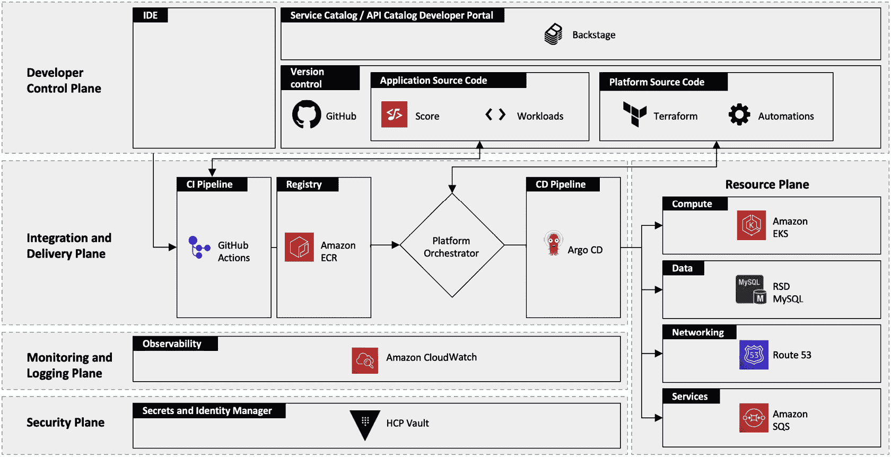

图 2.6：由 platformengineering.org 提供的 AWS 参考架构

与单一供应商平台相比，多供应商平台自带一定的复杂性。 除了每个供应商使用的资源外，我们还必须考虑存储和分发容器镜像的位置、如何提供可观察性，以及 如何跨供应商管理机密和证书。 你可以在以下的参考架构中看到，满足这些期望并不简单。 通过多云平台策略，你将面临大量需要处理的问题。 成本将急剧增加，实施和平台行为会随着每个云服务提供商（CSP）的不同而略有变化，而且很难定义一种完全合适的方法。 可用性、安全性、可扩展性和效率等方面会因构建在 多个环境上而产生冲突。

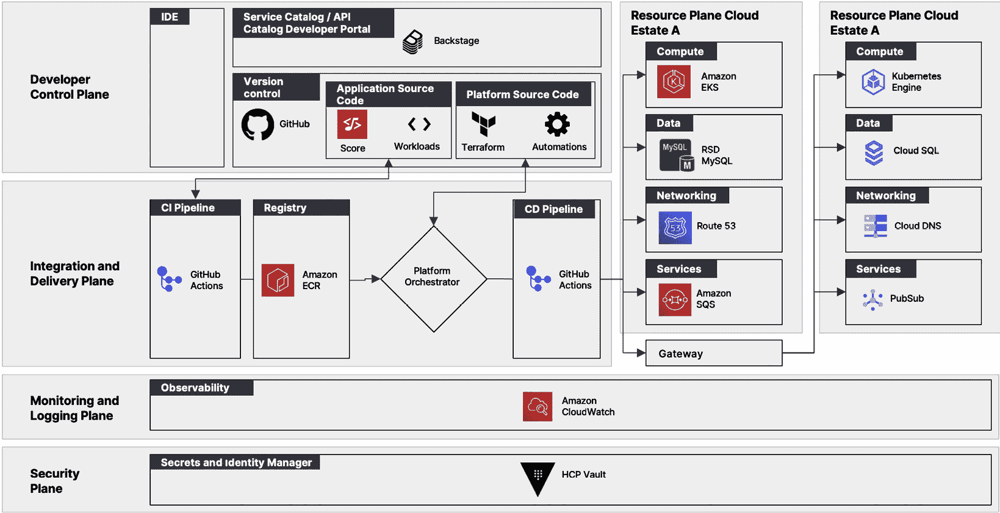

图 2.7：由 platformengineering.org 提供的多供应商参考架构

然而，并非每个平台都需要在云端运行。 可选择的方案是无穷无尽的。 我们在成熟企业中常见的是混合、私有云或扩展至云的环境，这些环境依赖于像 VMware Tanzu 或 Red Hat OpenShift 这样的成熟解决方案。 在以下图中，我们可以看到一个以 OpenShift 为核心的平台架构。

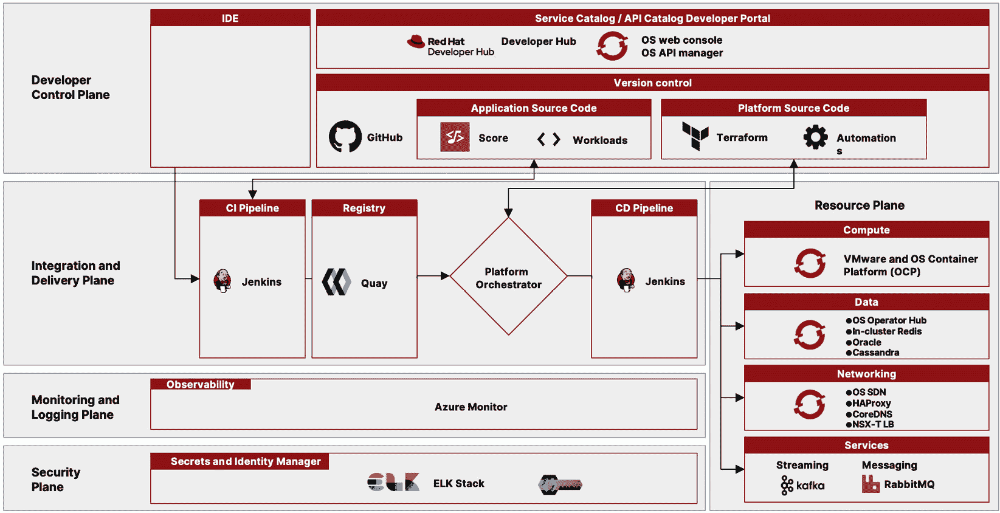

图 2.8：由 platformengineering.org 提供的 OpenShift 参考架构

调整 参考架构以适应其运行环境 非常重要。

重要提示

你为平台选择的环境会自动规定平台的一些部分，无论我们喜欢与否！ 增加云和基础设施提供商的数量会呈指数级增加你平台设计的挑战。 这将显著增加你平台设计的挑战。

### 通过能力平面扩展参考架构

大多数参考架构的弱点在于它们缺乏对实际平台运行时上运行的组件所提供的能力的视图。 这种视角是必需的，因为没有它，用户无法使用平台的功能和特性。 没有它，用户将无法使用平台的功能和特性。

在下一个图中，我们 将提供一些关于 能力平面的参考：

+   **用户空间**：用户实际看到并可以用于托管其应用程序的环境

+   **规模与调度**：支持用户应用响应事件、缩小规模或提供自定义调度选项的能力

+   **网络**：处理进出流量，自动管理 DNS 条目或集群 负载均衡

+   **重量级任务**：通常更倾向于交由管理，而不是自己操作的事物，比如批处理框架或 消息流处理

+   **资源集成**：一个至关重要的组件，将实际的基础设施资源连接到平台运行时；存储或 GPU 集成，也包括资源控制，例如使用 Crossplane 工具

+   **安全与合规**：提供管理和存储机密、主动扫描集群和应用程序中的 CVE 漏洞的能力

+   **可观察性**：提供一个简单且快速的可观察性入口，统一数据收集，或帮助处理 成本

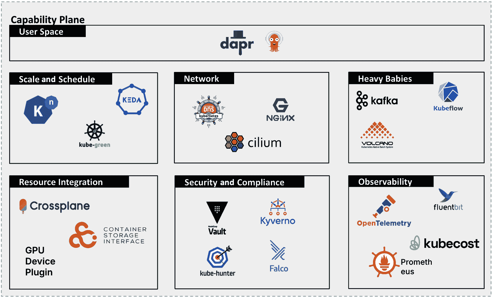

图 2.9：带有示例工具的能力平面

能力平面 对于实际的应用部署和运行至关重要。 它是你与技术互动最密切的空间，如果用户的应用在这里失败，所有其他的努力都将付诸东流。

### 平台架构超越了参考模型

总结参考架构，它们提供了一个易于理解的平台概念。 它们没有提供的是平台的实际架构。 源代码版本管理在哪里运行？ CI/CD 管道组件在哪里？ 容器注册中心在哪里？ IDP 如何托管？

因此，作为平台架构师，我们必须提供一个实际的架构，展示这些组件的位置。 这为进一步的依赖关系、网络通信和需求、可用性以及平台的可扩展性提供了深刻的洞察，或者简单来说，是否平台中有太多其实并不帮助平台稳定性的组件。

以下图表展示了这种架构可能的样子。 你还会看到不同的组件和网络连接分布在各个位置。 然而，当谈到平台架构时，这就是它应该如何在技术上 被表示。

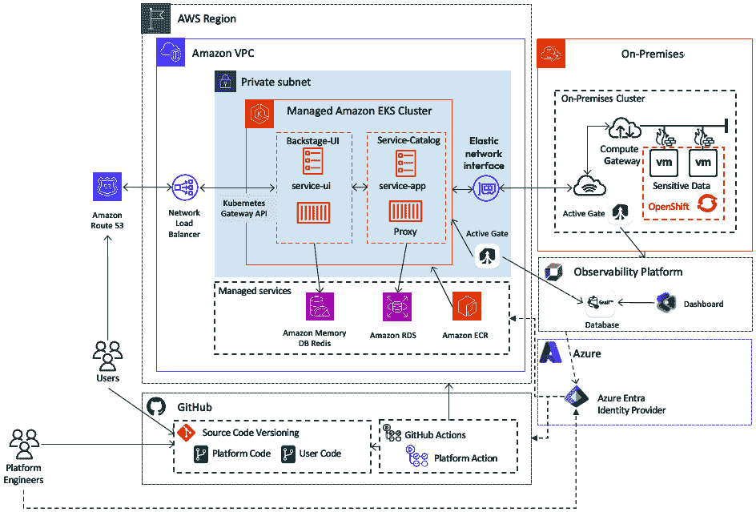

图 2.10：平台架构

很难找到合适的方法将基础设施和平台组件在一张图表中展示。 这不是最干净的方式，但它有必要突出所有的依赖关系和相互影响。 尽可能保持简单，但也要详细到足够的程度。 你甚至可以将其拆分成不同的图表，以突出某些信息。

### 拥有你的架构

看起来 管理和处理不同版本和变种的架构似乎需要大量文书工作。 然而，你可能已经体验过，平台变化的速度远快于图表的更新。 重要的是，图表作为你作为架构师工作的结果，不应拖慢平台的发展，而平台的发展也不应拖慢图表的更新。 我见过一些项目，架构师变成了一个杰出的等级制度。 所有这些项目都失败了，并且在做出正确决策时遇到了困难。 作为架构师，你并非无所不知，但你也不是平台工程团队。 共同合作，保持一致和同步是关键，几乎就像你希望构建的平台一样。 要建立的平台。

同样的道理适用于你的架构。 你必须拥有它们，但不是支配它们。 一个架构必须是一个思想的游乐场，是未来发展的沟通工具，是关于平台能力的真实来源。 这只有在你负责推动它，并且听取他人意见时 才是可能的。

在本书的后续章节中，我们会讨论一个相关的话题，关于拥有你的架构：如何应对技术债务。

## 有主见的平台与质量的成本

在构建平台时，会出现两个问题：有主见的工具和质量的成本。 这两者都有很强的论点需要 考虑，但它们也有强烈的反对理由。

### 有主见的工具和产品

有观点的 工具、产品和服务强调一个严格的概念，并且不提供替代方案。 几乎所有的东西都有其观点，但问题是它们的灵活性和可组合性如何。 对于如何做某件事的强烈观点使得后续的决策变得更容易，因为解决方案空间缩小了。 随着这种方法用户基础的增长，它可能会变得主导，最终成为事实上的标准。 我们必须在架构中仔细考虑这些因素，并澄清对它们潜在 未来影响的理解。

现在，严格执行一个概念可以带来很多好处。 例如，每个解决方案在提供 Kubernetes 集群的领域内都有其观点。 然而，它们提供的是一个一致且通常已经准备好投入生产的整体解决方案。 这样的工具在集成时也可能更快，因为它们覆盖了广泛的主题并预先集成了其他工具。 另一方面，这也可能是一个缺点，因为如果你想实现其他选项，会付出更多的努力。 然而，在某些情况下，这几乎是不可能的，或者成本 过于昂贵。

你还应该区分可见的大概念和那些更隐蔽的、隐藏的概念。 前者容易识别和评估。 它们附带大量的预定义集成，通常基于单一供应商的技术。 而那些小型和隐藏的有观点的工具则更难以识别， 因为你使用得越广泛，它们的缺点就越显现出来。

### 质量的成本

有一句话说： *与其频繁购买便宜的，不如一次性购买昂贵的*。但在平台做得正确的情况下，这句话是错的。 采用产品思维意味着持续的投资。 这更像是你每天都要照料的花园，而不是你一次性投资的手表。

质量的成本是一个多维度的问题。 一个高质量的平台，很可能非常有偏见，对于某些用例来说，可能是完美的选择。 但质量不是免费的，它基于高投资或运营费用。 在大型公司中，你会遇到类似内部成本分摊的情况。 这也意味着你必须分担质量成本。 我们在最终用户社区中经常看到，像这样的平台往往会导致沮丧。 由于成本过高，入门门槛对托管简单应用程序来说太高，或者它的偏见性使得运行一个非常复杂的应用系统变得不可能。 这导致其他人开始从零开始为他们的应用程序构建自己的平台和解决方案。 如你所见，这是一个奇怪的问题。 由于平台的高成本，用户的运营成本也变得很高，而偏见性的解决方案并没有真正提供所需的功能。 这就是所谓的 **质量的成本** **成本**。

然而，你也不能通过快速拼接一些随机工具来绕过这个问题，提供一个既便宜又尽可能开放的平台。 这可能会导致平台的项目初期快速上手，但我可以保证，这条路走得越快，用户离开你的解决方案的速度也越快。 记住，以产品思维方式看，你希望让用户能够自己做事，而你的平台则消除了所有繁重的工作。 理想情况下，你的用户也不需要成为所有 使用技术的专家。

从战略层面来看，质量成本的问题影响了许多决策。 我们见过一些平台经过多年开发，最终却因为其 性能/价格比 而遭遇挑战。

你需要为你的平台找到黄金路径。 然而，不要以为一个完美的平台就符合他人的需求。 如果你遇到这个问题，这显然是一个信号，说明 你已经失去了以产品为导向的思维方式，缺乏 用户导向的视角。

## 创建你自己的架构

行动的时候到了。 到目前为止，我们已经涵盖了所有相关的输入源、关注的主题和需要考虑的视角，现在可以开始构建架构了。 因此，我们准备了一个模板，你可以在本书的 GitHub 仓库中找到，或者作为一个 `Miro` 协作工作的 模板。

在这些模板中，你将通过不同的步骤和架构图来构建你的平台架构：

1.  创建你的参考架构。

1.  专注于能力层面及其组件。

1.  定义平台的基础设施架构。

1.  可视化平台的控制流。

由于架构是一个动态的产物，你需要反复修改它，遵循*PLAN, DO, CHECK,* *ACT* 循环。

花时间浏览这些模板：

+   **GitHub**： [https://github.com/PacktPublishing/Platform-Engineering-for-Architects/tree/main/Chapter02](https://github.com/PacktPublishing/Platform-Engineering-for-Architects/tree/main/Chapter02)

+   **Miro**： [https://miro.com/miroverse/platform-architecture-workshop](https://miro.com/miroverse/platform-architecture-workshop)

### 创建你的参考架构

参考架构概述了你计划的组件，将其分类并将其作为平台实施的核心部分。这也是你在某个阶段定义依赖关系图的帮助来源。

为了给你的参考架构图注入活力，最好从已经确定的组件或给定的基础设施开始。这些固定组件可以是，比如 CI/CD 工具或安全解决方案。首先，基础设施变得重要，因为它影响所提供的资源。如果你选择使用公有云服务商，很多服务可以作为托管解决方案使用。在某些情况下，这也决定了你将使用**基础设施即代码**（**IaC**）工具，或者反过来，如果你仅选择基础设施即服务提供商，这意味着你需要考虑平台中其他地方可能运行的服务。它们很可能会最终出现在能力层面，这就引出了一个问题：我们是否需要为共享服务专门部署一个集群，还是采用服务部署在用户命名空间中的方法？

接下来，处理自动化和编排层面。 出于某种原因，这个层面相对较为确定，并为开发者体验层提供了坚实的决策基础。 你需要确保所选的解决方案是较新版本，并且能够与其他云原生服务集成，而无需任何脚本。

最后但同样重要的是，你需要考虑可观察性和安全性层面。 如前所述，可能你已经有了现成的解决方案。 但特别是对于那些平台工程和云原生之旅还比较新的组织来说，你可能会对现有的解决方案提出挑战。 安全工具需要能够理解云和 Kubernetes。 它们需要与这些平台集成，并能够应对它们非常动态的特性。 同样的理由也适用于可观察性和运营解决方案。 你不希望每次 pod 被终止或在集群中移动时都收到警报。 在集群中。

最重要的是，你最终将所有的视角汇集在一起：平台的原则和目标、关键用户、可组合性，以及这些移动组件之间的相互影响。 但是你的设计不需要完美。 在深入设计过程之前，请继续阅读，因为我们将在本章稍后讨论 TVP 的话题。

### 专注于能力层和组件

当 参考架构搭建完成后，我们需要在下一步中通过能力层来扩展它。 当然，这本身就是一个大步骤，因为实际上有数百种开源解决方案可用于能力层中的任何需求。 如果你从未见过 CNCF 景观，以下快照展示了大约三分之一的 CNCF 列出的开源 项目 *[7]*。

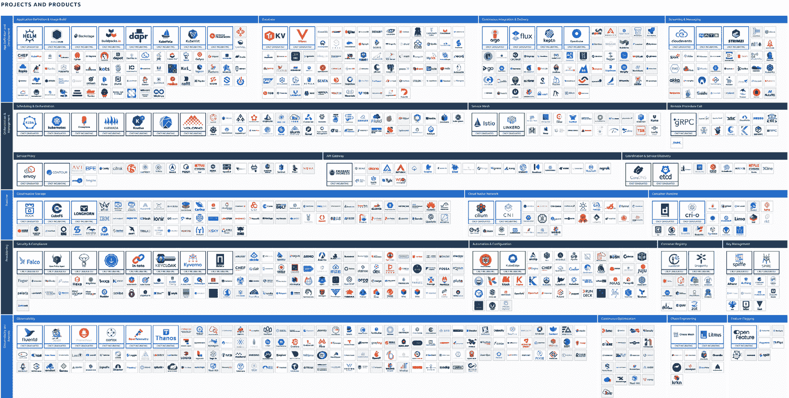

图 2.11：CNCF 景观（该图像仅作为视觉参考，文本信息并不重要。）

请注意， 至少还有一些其他开源组织也管理着数十个项目，你可以将它们算作云原生领域的一部分。

云原生宇宙的好处和坏处在于，对于每一个微小问题，你至少有三个±1 的选项来 解决它。

对于能力平面，建议从 底层向上工作：

+   我们需要哪些资源的集成？

+   我们如何将操作数据提供给可观察性解决方案？ 我们需要在基础架构和应用空间之间拆分吗？如果需要，如何拆分？

+   确保安全和合规性措施正确地转移到 用户的领域。

+   我们如何处理网络流量？ 我们需要在 集群内进行加密吗？

+   我们是暴露一个 API，还是将其与 云 API 集成？

+   扩展和调度可能需要什么？ 是否有其他功能需要 提供？

预计大部分时间在能力平面上工作。 随着每个新用户和新产品的加入，会有新的需求出现。 每当新用户和新产品出现时，新的需求就会随之而来。 最棒的部分是当你能观察到产品的演变，并且要求更多 高级功能。

再次强调，首先关注核心要素。 正确整合网络管理和存储比提供机器学习工作台解决方案或新的容器运行时更为重要，例如 **WebAssembly** (**Wasm**) *[8]*。

### 为平台定义基础架构架构

在定义参考架构的有趣部分之后，我们必须直接进入严肃的架构定义。 听起来像笑话的部分往往被跳过，但许多平台无法提供这个视图。 事实上，这个图表比参考架构更相关，因为它涉及实现、架构讨论以及安全与合规性检查。 然而，它也更加复杂 理解。 。

如前所述，我们必须将一侧的基础架构架构与平台的相关组件结合起来。 这有助于我们理解系统中每个部分的位置以及所需的连接 。

该图必须突出显示计算基础设施使用的不同环境，消耗的托管服务，它们之间的连接方式，以及存在的外部连接。 每个组织都有自己绘制此类图表的方式，遵循特定的标准，或者做得更简化。 我们的模板尝试提供一个 中间方案。

你也可以在架构图中对突出部分进行不同的调整。 我们经常看到，在可视化精确的网络连接、网络隔离或协议方面具有巨大的相关性。 将一个隔离环境与相应的控制流结合，并展示如何将更新导入其中，将利用两种图表类型来 最大化理解。

记得在图表中包含诸如管理环境/集群、集成测试的暂存环境，甚至是开发环境之前的一个步骤。 为了保证连贯性，备份和恢复也可能是有帮助的。 你看，越是投入工作，更多的细节就会浮现出来。 当图表变得过于复杂时，你应该提供 不同的版本。

### 可视化平台的控制流

可能 对你来说比较新的可能是 **控制流**。它是 一个像流程一样的方法的第一步，旨在帮助我们澄清管理平台和用户交付物的相关路径。 平台内有多个流；其中这三个是 最为突出的：

+   **基础设施提供**：此流可视化了基础设施测试环境的重要性，以及在该层级上的变化如何影响它们，从在版本管理系统中提交 IaC 清单，到部署、测试，再到 最终发布。

+   **从代码到部署**：这对于平台用户最为相关。 一个人提交的代码是如何被拾取，构建、集成、扫描和测试的？ 开发和生命周期设置程序 是什么样的？

+   **平台能力管理**：这对于负责 集群交付组件的平台注册工程师尤为重要。

有许多其他较小的控制流可以帮助我们理解平台，例如秘密和证书管理，或者 用户管理。

从纸面工作到实际使用案例，我们将看一些不同平台风格和实现的示例。 在下一部分，你将 把视角从通用平台扩展到 专门化解决方案。

# 探索平台作为产品——使用案例和实现

我们谈到了平台的目的，比如 *优先考虑自服务*。但是我们如何实现这一点， 我们希望提供哪些使用案例作为 自服务？

每个组织 的使用案例和平台实现都有些不同。 这是因为每个组织的技术栈不同，遗留/现有的工具和流程也各不相同，这些都是优化的候选项。

在这一部分，我们讨论了在我们多年来与组织合作中看到的使用案例。 我们可以假设其中一些案例将是你自己未来平台工程计划的好候选者。

## 寻找专家以及他们引起的瓶颈

有一篇 来自 *Thoughtworks* 的精彩博客文章，其中有一段引用，帮助我们开始寻找好的使用案例 案例 *[9]*。

是什么使某个东西成为平台？

平台是集中专业知识的手段，同时将创新下放到客户 或用户。

换句话说，在任何生产、运输和操作软件以支持其业务的 IT 组织中，我们可以找到诸如基础设施配置、访问控制、构建和部署工件、可观测性、质量工程、发布 管理、容量规划、 **网站可靠性工程** (**SRE**)、事件响应、数据分析、自动化、业务洞察等方面的专家 等等。

我们的平台目标是识别使用案例以及它们所需的专业知识，然后以简单的方式将这些使用案例作为自服务提供给每个人使用，无需每次都去找专家 。

通过自服务来集中专业知识

允许每个人完成工作，而不必成为专家或在所有需要的领域请教专家来完成他们的 工作！

如果我们现在 查看整个 **软件开发生命周期** (**SDLC**)，并列出从新应用或功能的初步构想到它发布到最终用户所需的所有任务、专家和时间，我们将能够识别出许多阻碍 SDLC 进展的瓶颈。 这要么是因为某些任务是手动的，要么是因为这些任务需要某个专家来完成。 由于专家通常比较稀缺，他们成为了共享资源，团队在发布新功能时往往需要等待这些专家。 这会导致项目进度拖延。

在 *第三章*中，在 *理解现有 SDLC* 一节，我们将更详细地研究如何最好地理解当前的 SDLC 或组织中的 *价值创造之旅* 。 你将了解不同的方法来理解一个工件的生命周期、所涉及的任务、依赖关系，以及如何跟踪时间，以识别出那些适合自动化的任务，作为 平台服务的一部分。

现在让我们来探索一些我们曾与之合作过的组织中的这些用例和实施选项！

## 将专业知识集中作为自助服务用例

虽然 还有许多其他的用例，但以下是一些你可能会在平台中实施的自助服务功能示例。

### 提供合规的环境

根据行业的不同，数据存储、环境安全性以及所需的报告类型等方面都有一定的规定。 为了确保组织中任何团队请求的每个环境都符合所有这些规定，我们可以将其作为我们平台的自助服务功能来实施。

这是该用例的一个用户故事：“*作为一名数据科学家，我希望将我的新数据模型与一个* *类似生产的数据集进行验证！*”

为了将这个故事分解成具体任务，有 一些细节需要解决，例如：这些数据集来自哪里？ 数据科学家是否希望从多个可用的数据集里选择一个？ 验证的输出是什么？它存储在哪里？谁可以访问它？ 你如何选择数据模型？ 这个验证运行多长时间？我们是否需要设置最大时间来关闭环境，以避免不必要的成本？ 我们需要生成什么类型的审计数据，因为这涉及访问 生产数据？

另一个类似的用户故事可能是：“*作为一名 QA 工程师，我希望使用与 80%终端用户相匹配的浏览器/操作系统组合，在连接到生产数据库的最新版本软件上运行我的手动测试！*”

与前面的用户故事类似，我们需要提出一些额外的问题，例如：你想测试的软件产品是什么？它如何能够自动部署？ 我们在哪里可以找到生产用户浏览器/操作系统使用的数据？ 这个环境需要保持可用多长时间？ 我们可以为这个配置的环境设置过期时间吗？ 工程师可以看到哪些数据，哪些数据不能看到？因为我们正在处理访问 生产数据的问题。

这样的用例实现可能会有很大差异，但我们应该始终从*终端用户的旅程*开始考虑。 我们可能希望我们的数据科学家或质量工程师登录到我们的内部开发平台门户。 在那里，他们可以选择 *配置符合要求的环境*的用例。 然后，他们可以填写相关数据，以回答所有提出的问题。 这些输入可以用来创建该环境，并使其可供 请求该环境的团队使用。 

### 进行性能和韧性测试

性能和韧性测试应该 成为每个软件版本发布的一部分，以确保新功能不会通过变得超级慢来影响用户体验（UX）。 我们还希望确保我们的新软件能够应对不可预见的情况，例如网络连接问题、缓慢或不可用的后端服务或数据，或者异常 高负载。

虽然有很多工具可以生成流量（负载测试工具）或模拟问题（混沌工程），但这些工具及其所需的环境往往需要大量专业知识来设置、配置、运行和后续分析

与其让我们的性能、站点可靠性或混沌工程师成为瓶颈，我们可以努力将这些专业知识集中化，并将其提供为我们工程团队的自助服务。 这里将是正确的用户故事：“*作为开发团队，我们希望知道我们软件的最新版本是否存在任何性能或* *可靠性下降！*”

我们可以实现这种自助服务能力的多个迭代。 从提供包含相关工具的环境开始，所有开发人员需要做的就是执行测试并等待结果。 但理想情况下，我们希望最终达到这样的情况，即完全自动化甚至集成到我们的开发流程中。 我们应该朝着这样的目标努力：“*作为开发团队，我们希望在主要拉取请求上获得性能和可靠性指标，以便知道最新的代码更改是否足够好，可以提升* *到生产环境！*”

就像在前面的例子中，我们可以从一个门户开始，团队可以请求性能测试环境。 要满足第二个完全自动化的用户故事，我们需要考虑提供一个可以从 CI/CD 流水线系统调用的 API，获取所有相关的输入参数，然后返回执行测试的实际结果。

### 新应用的入职

创建 新的应用程序或服务是开发团队的工作。 为此，他们通常必须经历许多不同的步骤，例如创建一个新的 Git 仓库，添加样板代码和元数据设置，配置构建（CI）流水线等等。 更多的步骤。

如果每个开发团队总是从头开始，我们不仅会出现多种本质上相同的做事方式，而且还会在所有开发团队中产生大量重复的工作，这会分散实际编码的时间。  

一个适合平台自助功能的良好用户故事可能是这样的：“*作为开发团队，我们希望基于一个完全配置的模板创建一个新的应用程序，这样我们就可以专注于编写代码，而不用担心如何构建、部署，* *和运行！*”

查看 整个 SDLC，我们的自服务甚至可以从产品团队使用诸如 **Jira**等工具创建的特性需求开始， 以下展示了作者曾与之合作的某个组织中新应用的端到端入职流程：

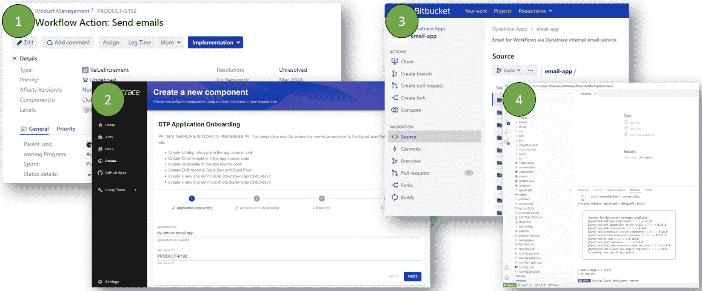

图 2.12：作为自服务的端到端应用入职（该图像仅作为视觉参考，文本信息并不重要。）

对于开发团队而言，旅程从 Jira 工单开始。 接着，他们前往该组织选择的 IDP——Backstage，在那里他们将走过自服务 *应用程序入职* 向导。 该向导会创建一个新的 Git 仓库，并预先加载好现成的代码模板、管道、部署说明、可观察性配置、所有权等内容。 一旦代码提交，管道会自动将构建物部署到开发代码空间，并自动连接到 Visual Studio Code！

### 访问可观察数据以应对事故响应

一旦新软件部署到生产环境，开发人员通常会将焦点转向下一个应用或功能。 然而，当灾难发生时，他们需要支持运维或 SRE 团队进行故障排除，以修复出现的任何问题。

在许多组织中，生产环境中的遥测或可观察数据仅限于由专门团队负责的生产环境访问。 还有合规性原因，毕竟不是每个人都应该访问可能敏感的数据。 但当身处所谓的 *战情室*时，快速访问相关的可观察数据非常重要，而不必填写太多请求表单、将数据从一个环境复制到另一个环境，或将生产可观察工具中的数据转换为开发人员常用的格式。

在 *第三章*，我们会更详细地讲解此用例，在这里我们简要描述用户故事：“*作为开发团队，我们希望能轻松访问生产事故相关的可观察数据，以便快速解决* *问题！”*

现在我们有了几个用例，接下来让我们看看如何将这些想法转化为用户实际可以使用并从中受益的东西。

# 理解 TVP

在产品管理中，我们通常讨论的是一个 **最小可行产品** (**MVP**)。 MVP 定义了你需要构建的产品最简单版本，以便将其推向市场。 MVP 的概念最初是由 精益创业 *运动* 引入的，这一运动由 *埃里克·里斯* *[10]*推动。我鼓励大家阅读这本书或访问其优秀的博客文章，网址是 [theleanstartup.com](https://theleanstartup.com) 网站。

MVP 中的 *最小化* 指的是一款帮助初创团队验证他们的想法是否真的解决了问题或痛点的产品版本。 所有这些精益创业的理念可以直接应用于平台工程 ，比如这样：

+   我们的团队是 初创公司

+   我们的平台是 产品

+   我们的目标市场是我们的 内部用户

+   我们的假设是它实现了 目标

在精益创业中， MVP 被定义为 一款足够**好**的产品的首个版本， *足够好* 以至于可以发布。 它足够好，因为它已经解决了问题，尽管可能不是功能完整的。 它足够好，可以交到用户手中，验证我们的假设，并获得早期反馈，从而为后续迭代和改进提供基础。

现在，让我们深入探讨如何 应用所有这些精益创业的理念，定义我们自己的 MVP——或者，正如我们喜欢称之为的， 我们的 TVP！

## 寻找你的 TVP 用例

在 上一节中，我们已经探讨了我们可以通过平台提供哪些自助服务用例。 我们通过观察专家目前在哪些领域需要帮助以完成工作，或者在哪些地方涉及大量人工 工作，从而识别出了这些用例。

像任何新的软件产品一样，可能有很多我们想要实现的优秀功能。 问题是：我们应该从哪个开始做呢？ 为了回答这个问题，最好根据几个维度来进行优先级排序。 其中一种方法是 *ICE 评分* 模型，但你也可以随意使用任何你熟悉的或已经在组织中使用的评分模型 *[11]*。 **ICE** 代表 **影响力** (我们通过这个功能所能产生的影响)， **信心** (我们有多大信心能够实现预期的影响)，以及 **容易程度** (实施这个功能所需的努力程度)。 我们为每个指标赋值 1-10，并将这些数值相乘。 如果我们对每个功能的想法都这么做，我们就能轻松地进行比较并得出首个优先级列表。 以下是我们之前讨论的四个用例的评分示例，使用一些虚构的数字作为 ICE 评分：

| **用例** | **影响力** | **信心** | **容易程度** | **分数** |
| --- | --- | --- | --- | --- |
| 提供 合规环境 | 6（良好的影响） | 5（中等信心） | 2（不容易） | 60 |
| 性能测试和 弹性测试 | 6 | 5 | 5 | 150 |
| 新应用程序的 入职培训 | 8 | 7 | 3 | 168 |
| 访问 可观察性数据 | 8 | 8 | 3 | 172 |

表 2.1：ICE 评分示例

正如我们所说， 前面的表格中的 ICE 分数只是虚构的。 然而，这些例子应该能给你一些关于这个评分如何工作的指示。 它的另一种形式还包括范围，因此被称为 RICE。 **RICE** 就是简单地将范围、影响力和信心相乘，并将结果除以努力——从而得出一个 易于使用的分数。

根据前面的例子，我们可以辩称，应该先从 *新应用程序的引导* 或 *访问可观测性数据* 开始，因为这两者得分最高。 另一方面，我们也可以认为 *运行性能和弹性测试* 会是更好的候选项，因为它似乎是最容易 实施的。

无论你使用的是 ICE、RICE，还是其他模型，它都应该帮助你决定首先解决哪个用例，目标是迅速产生影响。 在开始实施之前，让我们谈谈第一次实施应该达到的效果 ！!

## 足够好与完美做到了！

我们大概 都同意，一个产品几乎不可能是完美的或已经完成的！ 总有一些我们希望看到的功能，或者那些烦人的 bug 我们希望有人能最终修复。 当我们开始一个新产品时，比如我们的平台，我们需要改变这种思维，并接受第一次发布的版本是 *足够好* 的。这并不意味着我们在走捷径；这只是意味着我们需要抛开完美主义心态，勇敢地说，“ *它已经足够好——让我们* *发布它！* ”

在《精益创业》中，提到了谷歌地图的发布 *[12]* 。看起来团队当时正在向谷歌高级管理团队展示他们的新动态网页（使用 AJAX）地图解决方案。 他们的做法是首创的。 尽管开发团队仍然认为这只是一个早期原型，但管理团队仍然印象深刻。 据传，拉里和谢尔盖仅仅说了，“ *它已经足够好了。 发布它。* ”尽管开发团队有一些保留和担忧，但他们还是按要求进行了发布。 其余的——我们都知道——就是历史：谷歌地图是并且仍然是一个巨大的成功。 这个成功的背后是因为这个解决方案只做了一件事——但是那件事做得极其出色，并且成为了与其他竞争对手区分开来的关键。 仅仅通过有限的功能集发布，正是这让他们的竞争对手措手不及，并给了他们 领先的机会。

这如何转化为我们的 TVP 呢？ 与 Google 的例子不同，我们不必害怕竞争——或者我们真的有吗？ 事实上，我们是有竞争的：我们的竞争对手是那些开发团队，要么浪费时间按旧有方式做事，要么启动自己的项目，构建工具和自动化来解决问题，但只是为自己服务，而不是考虑如何为整个组织规模化解决这个问题。 整个组织。

这意味着我们不必完美无缺地交付我们的 TVP 第一次实施，但它必须足够好，以帮助我们展示提供的价值。 我们需要在假设中明确指出，这个价值是什么，具体是为哪些用例 我们实施的。

## TVP – 验证我们的假设

因此，我们 选择了我们的用例，我们知道我们的第一次交付必须足够好，以便最终用户可以使用并从中获得价值。 但是，那个价值是什么呢？ 我们如何衡量并证明我们的平台功能确实有 影响呢？

这是我们的产品假设所在。 回顾之前提到的相同用例，我们可以提出以下我们希望达到的假设影响： 有：

| **用例** | **假设** |
| --- | --- |
| 提供 合规环境 | 验证新 数据模型 时合规违规减少 80% |
| 性能和 弹性测试 | 在生产环境中，识别并修复问题后，扩展性问题减少 50% |
| 新应用程序的 引导 | 新应用程序的交付时间减少 20% |
| 访问 可观察性数据 | 生产问题的故障排除时间减少 50% |  |

表 2.2：验证用例的产品假设

这个 假设也是一个很好的方式，可以向组织内需要为我们工作提供资金的人推介这个想法。 最终，我们是在做内部推销——我们需要充分论证为何我们要投资时间和金钱来建立一个新的内部开发平台。 我们所称之为假设的价值声明，很可能会与 你的领导层产生共鸣。

剩下的最后一个问题是：我们如何衡量和验证我们的假设？ 对于一些人来说，假设我们有如 *合规违规的工单数量*， *与可扩展性相关的产品问题工单*，或者 *在事件响应工单上预定的开发时间*，应该是很容易的。 更棘手的会是周转时间，因为一个组织如何定义周转时间，首先需要进行解释。 它是从创建初始功能请求开始，还是从开发者开始工作时算起？ 此外，我们如何衡量完整的端到端流程？ 虽然这一切都有可能，但我们必须确保知道如何衡量现状，以便在我们实施 TVP 后能与数字进行比较，从而验证 我们的假设。

## 构建、衡量并学习

我们知道我们想要构建什么，我们的假设是什么，以及如何衡量它。 现在，是时候将这些付诸实践了。 就像任何敏捷产品开发一样，我们要 构建、衡量并学习。 我们希望 尽早让终端用户参与进来。 最好的方式是，在我们仍处于原型阶段时，就将他们纳入并从中学习。 持续的反馈帮助我们及早做出重要决策，而不是等到我们有了最终版本，却因为错过了一些 显而易见的东西 而被用户拒绝。

该过程可以通过以下图示最佳地呈现，你也可以在许多受 Lean 创业运动启发的文献中找到：

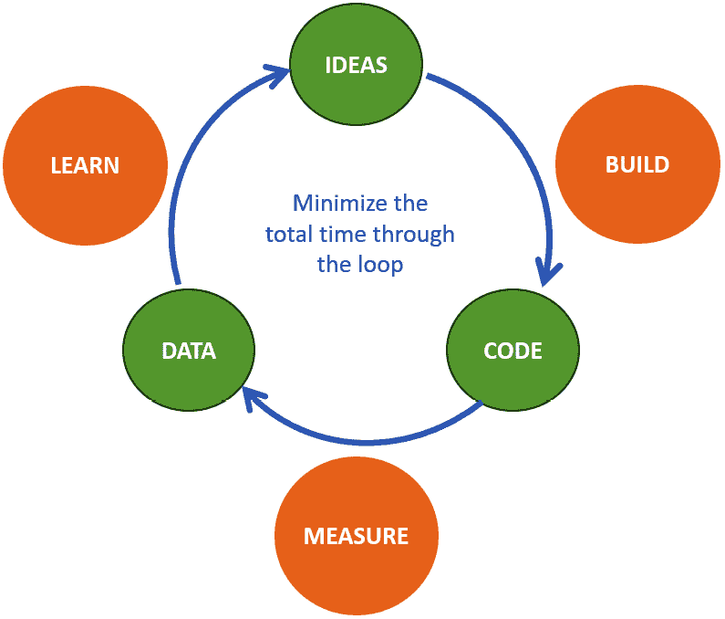

图 2.13：构建、衡量并学习，以实现你的 TVP

这是一个持续的循环，旨在尽量减少构建、衡量和学习阶段之间的时间，以便在我们的测量反馈表明我们走错了 路径时，能够及时修正或调整。

在这一循环中，有几个里程碑是值得考虑的： 如下：

+   **第一个原型**：将其展示给有兴趣和潜在的个人重度用户。 他们会给你非常好的 早期反馈。

+   **足够好**：一旦你达到能够兑现用户故事承诺的阶段，扩大到一组早期采用者，以获取 更广泛的反馈。

+   **假设已验证**：一旦你通过首批早期采纳者验证了假设，便是时候向其他组织推广并宣传这个成果了。 利用你的早期采纳者为你推广这些新功能！

我们来了。 我们有了 我们的 TVP！

TVP

TVP 是我们平台的那个版本，它为最终用户提供价值。 它使平台工程团队能够验证我们的假设，即它实现了我们的使用案例的目的（例如，减少认知负担）。 它让我们以最少的努力收集最大量的验证性学习，为我们的下一个 产品迭代做准备。

当你开始引入一个平台时，追踪其采纳情况并判断是否走在正确的道路上是很重要的。 接下来，我们将帮助你定义 KPIs 以 做到这一点。

# 查看相关的 KPIs 以使采纳过程透明化

做正确的事情，并且谈论它。 (Georg Volkmar Earl of Zedtwitz-Arnim, 1978.)

一个常见的问题 我们在许多平台实施中看到的是缺乏其效益的证据。 理论上，这一切都说得通，但让我们用一些数字来支持它。 此外，它们有助于了解你是否朝着 正确的方向前进。

因此，定义不同的 **KPIs** 是有帮助的，通过这些 KPIs，可以了解平台采纳的进展情况。 第一步，你应该反思你已经衡量了什么。 通常，我们只需要以正确的方式组合现有的数字，就能够定义新的 绩效指标。

首先，我们需要理解度量标准、日志和追踪数据，定义我们如何获取它们所代表的值，以及它们的含义。 虽然它们都是相关的来源，但大多数对你平台的采用并不重要。 这只是代表了系统的一侧。 同时，应该明确的是，我们更关注的是用户及其 体验。 支持渠道、工单系统、开放的拉取请求、注册请求数量以及其他用户互动工具，对于理解适应情况非常有帮助。 这些数字的重要性会随着时间变化。 例如，申请访问平台的人数通常呈现出一个有两个平坦侧面的山丘形状。 在一侧，由于人们过于羞怯，不愿尝试新事物，因此采用初期会很慢。 而在山丘的另一侧，随着新项目较少地被加入平台，平台的采用增速变缓。 另一个例子可能是支持请求的数量。 这些通常会随着用户数量的增加而增加。 然而，随着平台转向自助服务，这些数字预计会随着时间的推移逐渐减少到最低水平，同时你的平台会变得更好，用户也会学会如何 使用它。

因此，第二点，你必须定义你平台当前 KPI 的上下文。 或许看起来显而易见，成熟平台可能会有不同的 KPI，或者你的利益相关者必须以不同的方式解读这些 KPI，但相信我，事实并非如此。 你需要让这一点变得透明、清晰并且易于理解 给每一个人。

重要提示

KPI 及其当前的成熟度背景需要被 明确指定。

举个例子，下面的图示展示了与平台集成不良的环境相比，KPI 可能会如何变化。 这些数字是基于从不同项目中收集的几个测量数据，并在此进行了概括。 在左侧，缺乏明显的改善方向，或者它们不断上下波动。 最明显的就是支持请求数量的增加。 将其放在较少应用使用平台的背景下来看，这是一种不良信号。 现在，在右侧，我们可以看到任何 KPI 都有所改善。 大多数数字不会降到零，但它们会保持稳定，无论是平台增长、最终用户增长，还是其他 长期影响。

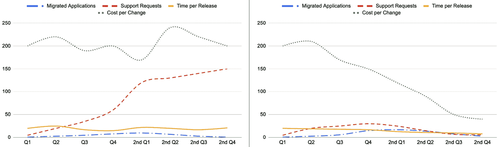

图 2.14: 比较平台影响力（左：无平台，右：有平台）

这些数字 缺乏上下文。 当你通过平台的生命周期声明某个状态时，数字变得更加有意义。 在下一张图中，我们添加了一个 分段的示例。

随着首次采用支持请求的增加，每次变更的成本也在上升，而仅有少数应用程序被迁移。 在逐步推广阶段，可以看到新应用程序的数量迅速增加，同时，支持请求也在增加。 每次变更的成本趋于平稳。 在接下来的优化阶段，我们可以看到大规模的变更。 每次变更的成本和支持请求急剧下降。 新应用程序的数量已达到峰值，并且由于大多数能够使用平台的应用程序 已经迁移，所以数量开始缓慢下降。

在这三个阶段中，每个版本的发布时间逐渐减少。 这是自动化和自助服务的效果，并且在最后一个阶段开始趋于平稳。 这与几乎所有其他关键绩效指标（KPI）的稳定发展相似。 与其他图表相比，我们还改变了添加应用程序数量的表示方式。 现在，你可以看到每个季度迁移的应用程序数量以及总的 应用程序数量。

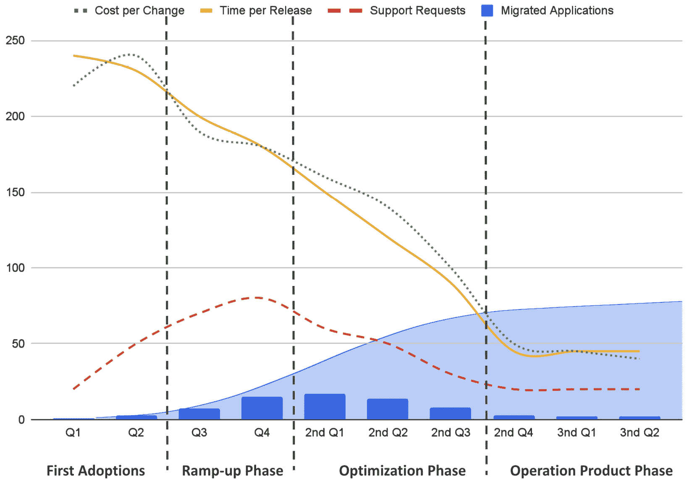

图 2.15：平台生命周期分段的示例 KPI

通常，当公司看到这些数字时，他们会停止在该领域的投资。 以产品思维来看，这些数字意味着你能够在固定的成本下提供持续的改进和创新，同时客户满意并能够进行 快速开发。。

## 定义平台采纳 KPI

我们 可以使用许多技术指标作为我们的 KPI 基础。 这些指标易于获取并且可以关联。 另一方面，这些数字的解读则取决于你。 服务请求的减少可能是因为你有出色的文档，但也可能是因为没有人使用这个平台。 如前所述，这就是为什么它需要提供完整的图景。 这可能变得复杂，因为每一个新的 KPI 可能会为数据添加更多的细节。 在某些时刻，你可能需要 删减这些内容。

对于开发人员和 DevOps 团队，已经有一些框架可以作为 基础使用。

### DORA 指标

**DevOps 研究和评估** (**DORA**) 是由 Gene Kim 和 Jez Humble 创立的初创公司，您可能从 *《DevOps 手册》*中了解到他们。 DORA 指标是一组四个关键绩效指标，可用于衡量 DevOps 团队的表现及其平台对用户的影响。 尽管它们并不总是完全适用，但它们被广泛采纳和使用，例如被诸如 GitLab *[13]*的系统所采纳。

DORA 指标如下：

+   **部署频率**：组织成功发布的频率 生产

+   **变更的交付时间**：从承诺到 进入生产

+   **服务恢复时间**：导致生产中失败的部署的百分比 时间

+   **变更失败率**：组织从失败中恢复所需的时间 时间

我经常看到组织将术语从 *生产* 更改为 *发布* 或 *生产发布*。这是因为大多数公司在发布面向最终用户之前都要经历多个阶段。 由于每个组织的具体情况不同，有多种解决方案来衡量这些数字，但最终通常会采用自己的方法 来实现。

要测量发布次数，您可以针对支持您发布的喜爱的源代码版本控制系统运行一个简单的 API 调用。 这些数字可以导入数据库并通过 Grafana 仪表盘进行可视化。

识别变更交付时间更为复杂。 为此，您必须跟踪提交并查看它们何时包含在发布中。 然而，这两个指标都很容易获取和计算。 另一方面，变更失败率变得更为棘手。 为此，您需要在整个部署和生产链中包含有关您的发布的信息，以便在发生故障时，您可以识别问题属于哪个发布的日志。 此外，您还必须确定是否真的是由发布引起的问题 还是其他原因。

恢复服务的时间与同样的过程一样。 你需要确定何时发生了事故，何时成功关闭，以及何时通过恢复解决。 你的事故管理系统可以提供这两个指标。 这些指标。

关于 DORA 指标的特殊之处在于，他们已经研究了成千上万家公司，为你提供了与其他公司相比的好坏概述。 *[14]*。

|  | **精英** | **高** | **中** | **低** |
| --- | --- | --- | --- | --- |
| **部署** **频率** | 按需 | 每天一次到每周一次之间 一周 | 每周一次到每月一次之间 每月 | 每周一次到每月一次之间 每月 |
| **变更** **交付时间** | 少于 一天 | 一天到 一周之间 | 一周到 一个月之间 | 一周到 一个月之间 |
| **变更** **失败率** | 5% | 10% | 15% | 64% |
| **失败的部署** **恢复时间** | 少于 一小时 | 少于 一天 | 一天到 一周之间 | 一个月到 六个月之间 |
| **%** **的受访者** | 18% | 31% | 33% | 17% |

表 2.3：不同成熟级别的 DORA 指标

DORA 指标的优点在于，大多数公司都能收集到这样的数据。 另一方面，作为平台工程师，我们缺少一些关于直接和个人反馈的方面。

下图是一个终端用户的 Grafana 仪表板，展示了实时数据。 在左上角，你可以看到部署到生产环境的应用程序数量为 105，总共的部署次数为 1.847\。 在右上角，显示了变更的周期时间（单位：小时），为 612.5，变更失败率为 0.522%，部署频率为 5.02，MTTR 为 199\。 底部的图表展示了每个应用程序的部署情况。

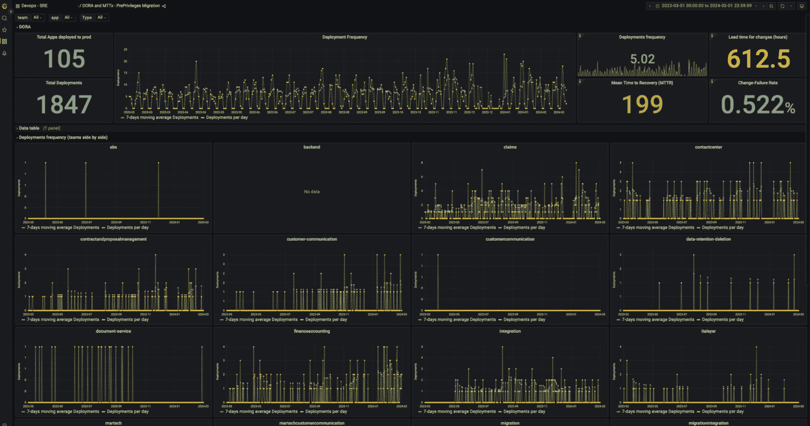

图 2.16：DORA 仪表板的实际示例（该图片仅供视觉参考，文本信息并非必需。）

如何开始使用 DORA？ 一种方法 是利用 **Keptn**，一个 CNCF 孵化项目，提供自动化的可观察性，用于 Kubernetes 上的应用感知部署。 Keptn 可以通过命名空间级别的注释启用，并将创建 Prometheus 指标和 OpenTelemetry 追踪，便于观察部署。 这些指标包括部署的持续时间、部署成功和失败的情况，并为部署、应用、环境和版本提供维度。 开箱即用，这 为你提供了一些核心的 DORA 指标，你可以将它们展示在你的仪表板上，如下图所示：

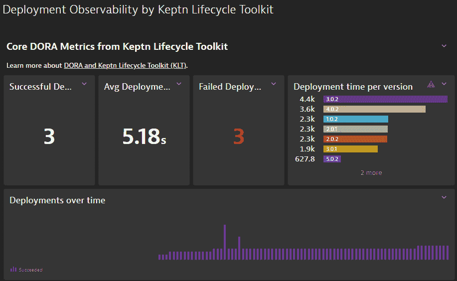

图 2.17：Keptn 提供自动化的部署可观察性，报告一些 DORA 指标

Keptn 提供了额外的功能，比如基于 SLO 的部署成功验证，并且还会在多个阶段追踪部署，以识别额外的指标，例如，“*部署在哪个环节停滞？* *推广过程中遇到了什么问题？*”

要了解更多信息，请查看 Keptn 网站和 DORA 教程 *[15]*。

### SPACE 框架

**SPACE 框架** 结合了五个维度 用于评估开发团队的生产力。 GitHub、微软和维多利亚大学共同开发了这一方法。 它专注于团队协作的方式及其成果。 查看这五个维度 将使 这一点变得清晰：

+   **满意度与福祉**：收集有关整体满足感、幸福感以及与工作相关的心理健康的信息。

+   **绩效**：以输出为导向的指标，如已完成的任务或发布的版本

+   **活动**：关注如提交次数、合并请求或代码审查等活动

+   **沟通与协作**：我们将检查团队的沟通行为和对齐情况，以及使用审查和评论机制

+   **效率与流动**：开发和部署过程的顺畅程度

你可能会觉得可以使用部分或全部的 DORA 指标来回答性能、效率，甚至是活动，没错。

对于满意度和福祉，我们可以使用如下方法，如**员工满意度得分**（**ESS**）、**员工净推荐值**（**eNPS**）或**员工参与指数**（**EEI**）。在开始时，你可以通过简单的调查开始。

性能指标的想法包括交付时间、从事件到恢复的时间、发布次数和测试代码覆盖率。

要衡量活动，你可以参考以下内容：

+   部署频率

+   代码行数

+   提交次数

+   拉取请求数量

+   审查次数

+   完成的任务/问题

+   已解决的故事点

这些数字并不总是容易收集的。在一些国家，明确禁止评估个人的表现，且只允许对一定数量的人进行此类评估。这也常常使得 SPACE 受到批评。因此，如果你希望使用 SPACE，我们不得不承认，这些指标对于了解开发周期很有帮助，你的主要客户，你应该和负责数据保护的团队沟通，他们负责确保正确设置这些内容。

类似的问题 出现在沟通与协作维度上。 如果你不想查看通信工具的用户统计数据，合并请求、合并时间，或提交、合并请求或问题票中的评论数量，都是一个不错的开始。 你还可以通过征求反馈来评估会议的质量。

效率和流动性的最后一个维度可以再次基于 DORA 指标。 此外，评估开发周期中有多少次交接，开发人员真正专注的时间是多少，以及他们的 速度是多少，也是非常有帮助的。

SPACE 框架 可以在个人、团队和组织层面使用。 以下是迈克尔·考夫曼（Michael Kaufmann）书中的图示， *《通过 GitHub 加速 DevOps》*，提供了进一步的 这些层级的示例。

![图 2.18：迈克尔·考夫曼（Michael Kaufmann）提供的 SPACE 指标示例 [16]](img/B31164_02_18.jpg)

图 2.18：迈克尔·考夫曼（Michael Kaufmann）提供的 SPACE 指标示例 [16]

通过 SPACE 框架，我们 现在可以深入洞察开发过程，这对我们作为平台工程师非常有帮助，并且它扩展了 DORA 指标。 我们可以将这些 指标相互叠加。 这使得产品负责人、架构师和平台工程师可以评估他们是否以正确的方式做正确的事情。 然而，我们缺少来自 **开发者体验** (**DevEx**)专家的反馈。

### DevEx 框架

SPACE 和 DORA 缺乏 DevEx 的视角。 此外，虽然 我们正在关注满意度和流动性，但它并没有给我们提供关于平台工程团队的完整画面。 这就是 **DevEx 框架** 发挥作用的地方 *[17]*。它将视角限制为仅仅三个维度。 它们共同构建了 DevEx 的基础，并能够扩展其 行动范围。


图 2.19：DevEx 的三个核心维度

从开发者的角度来看，流动状态是指他们 100%专注于编写代码，几乎忘记了时间、饥饿和其他需求。 流动状态越容易实现和维持， DevEx 就越好。

我们谈论了很多认知负担。 简而言之，一个良好的 DevEx 包含非常低的 认知负担。

最后，反馈循环衡量开发者在其行为上收到反馈的速度和质量。 反馈越好，开发者就能以最小的摩擦和损失，更加持续和可操作地做出反应。

要 衡量 这些是困难的，因为答案介于实际指标和 主观反馈之间：

+   **心流状态**：

    +   **指标**：重新提交的提交记录，变更请求数量，每个 拉取请求的提交次数。

    +   **主观反馈**：他们感到被打断的频率如何？ 他们是否感到持续的压力或紧迫感？ 他们的 决策自主权有多高？

+   **认知负担**：

    +   **指标**：重新打开的缺陷数量，调试时间，组件的依赖项数量，以及解决 技术问题的时间

    +   **主观反馈**：编码时间与其他任务的时间；他们组件的技术范围，以及他们需要多频繁地 切换上下文

+   **反馈循环**：

    +   **指标**：周期时间，部署频率， **平均修复时间** (**MTTR**)，缺陷数量，以及 测试自动化的水平

    +   **主观反馈**：代码审查的有效性、内部团队沟通以及 反馈质量

正如你可以 从这些例子中看到的，解释的空间很大。 当你定义平台的 KPI 时，必须确保这些指标被清晰描述。 你需要特别准确地解释你如何解读哪些反馈和指标以及 如何解读。

重要提示

架构师必须理解这些 KPI 及其含义，以便能够有效地改进平台。

## 使用性能指标

通过 之前的框架，一些性能指标被突出了出来，例如关闭的问题数量或故事点。 这些指标在团队层面上运行良好，但也可能导致 许多误解。

然而，有一种方法并非抽象且不清晰，像故事点那样，而是一种万无一失的方式，用来与用户和利益相关者讨论平台及其效率：成本。 我知道这不是一个创新的 KPI，但许多团队往往做得不正确，产品负责人也对此感到畏惧。 我也并不意味着要报告团队的成本、基础设施或许可证。 你可以利用成本指标作为平台表现的证明，及其平台团队。

### 每次变更的成本

**每次变更的成本** 是一种 有效的方式，能够突出平台的改进和能力。 在云原生生态系统的最终用户社区中，我们可以看到这个 KPI 被用来讨论平台的运行情况。

让我们比较两种不同的每次变更成本： ：

+   **$500 每次变更**：每月$15,000，或每年$180,000，基于每月 30 次变更

+   **$80 每次变更**：每月$2,400，或每年$28,800，基于每月 30 次变更

显然，两个数字之间有着巨大的差距。 但是你应该考虑到，最初你的成本会较高，而且变更次数很少。 理想情况下，平台团队和平台本身会随着时间的推移变得更好，从而稳定整体成本，但变更的次数会增加。 这将导致每次变更的成本降低。 下面的图表展示了这一点，便于更好地可视化。 虚线展示了整体成本的例子。 随着平台变得更加高效，整体成本略微增加。 深色实线表示每年的变更次数，虚线则表示每次变更的成本。 正如你所见，随着你能够进行的变更次数增多，每次变更的成本大幅下降。 这虽然是一个非常基础的数字，但它是你与平台及其平台工程团队沟通的有力工具。

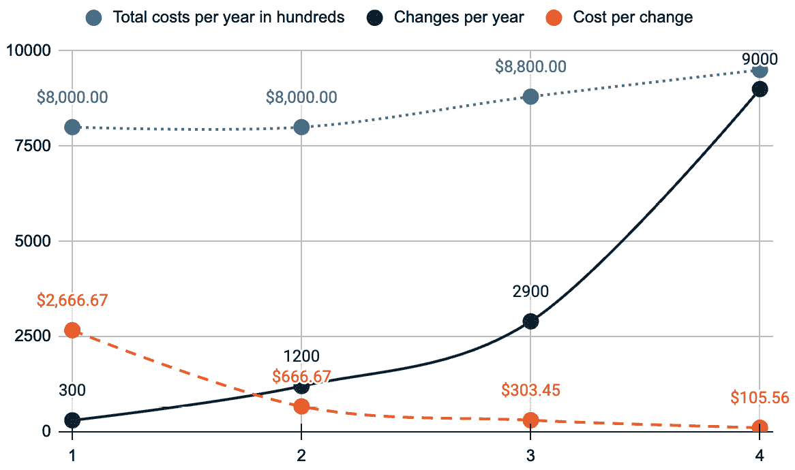

图 2.20：每年总成本 示例

### 每个项目/产品的成本

相关的 成本每变更的成本是每个项目、产品或应用的成本。 我们可以从两个不同的方向来看这些成本：

+   **总共享成本**：仅关注团队成本、额外工作量或非因果关系成本等方面 不是因果关系基础的

+   **平衡的因果关系成本**：因果关系成本包括除共享成本外，项目所消耗的基础设施和服务的实际成本 项目

为了突出平台和团队的表现，我建议选择总共享成本。 这样的数字很容易获取，并且可以在项目之间进行分配，使得你能够在每月不费太多力气的情况下追踪它们。 另一种选择是 *每个项目的引入成本*。对于这个指标，你需要计算每个使用平台的项目在引导过程中的工作量。 然而，我个人不会在这些指标上花费太多精力。 它们更像是修辞数字，并不能提供关于平台性能的深入见解，而更多是关于你在引导过程中的效率 在 引导中的表现。

### 用户/产品的间接成本

间接成本的视角与每变更成本非常相似。 在这里，你将所有直接成本和共享成本相加，并仅减去消耗的资源。 因此，区分像代理、网络流量以及可能的与用户相关的个人成本与产品实际使用的资源是很重要的。 计算这一点比较复杂，但结果是平台及平台团队的性能指标。

这是一种分歧的指标。 一方面，它应该尽可能小，以便能在内部销售平台。 另一方面，这个数字代表了平台实际价值的成本。 因此，我认为我们需要隐藏一个既不太昂贵也不太便宜的中间地带。

# 总结

本章向你介绍了定义平台原则以及如何制定你的平台团队目标。 现在你手中拥有了文档化和设计平台架构的工具，接下来是针对不同平台的最终用户示例。 本章为你提供了关于平台能力的额外视角。 通过 TVP 的方法，你学会了如何专注于单一里程碑而非全局目标，并更快适应需求。 最后，我们向你介绍了几种衡量平台采用情况和 性能指标的方法。

在 *第三章*，我们将讨论为平台构建基础的细节。 首先，我们将向你介绍我们的参考公司和示例公司，并解释一些细节。 你将学习到基础设施基础、混合云以及 **软件即服务** (**SaaS**)的挑战，以及创建基础架构的参考架构 。

# 进一步阅读

+   [1] *延迟成本：项目延迟的经济影响* *交付*： [https://businessmap.io/lean-management/value-waste/cost-of-delay](https://businessmap.io/lean-management/value-waste/cost-of-delay )

+   [2] *Evan Bottcher，关于平台的讨论*： [https://martinfowler.com/articles/talk-about-platforms.html](https://martinfowler.com/articles/talk-about-platforms.html )

+   [3] *Miro 模板，平台工程目标* *画布*： [https://miro.com/miroverse/platform-engineering-purpose-canvas-template](https://miro.com/miroverse/platform-engineering-purpose-canvas-template )

+   [4] **团队** **拓扑结构**： [https://teamtopologies.com/](https://teamtopologies.com/ )

+   [5] *PlatformCon2023，平台即代码：通过参考架构简化开发者平台设计* *架构*： [https://youtu.be/AimSwK8Mw-U?si=1CDAJb1gLtlCgeyH](https://youtu.be/AimSwK8Mw-U?si=1CDAJb1gLtlCgeyH )

+   [6] **PlatformEngineering.ORG** **工具**： [https://platformengineering.org/platform-tooling](https://platformengineering.org/platform-tooling )

+   [7] **CNCF** **景观**： [https://landscape.cncf.io/](https://landscape.cncf.io/ )

+   [8] **Wasm** **示例源代码**：

    +   **通用** **页面**： [https://webassembly.org/](https://webassembly.org/ )

    +   **一个简单的 Kubernetes 运维程序用于运行 Wasm –** **kwasm**： [https://kwasm.sh/](https://kwasm.sh/ )

    +   **一个企业级运维程序和开发工具包用于** **Wasm**： [https://www.spinkube.dev/](https://www.spinkube.dev/)

+   [9] **ThoughtWorks 平台技术战略** **层次结构**： [https://www.thoughtworks.com/insights/blog/platform-tech-strategy-three-layers](https://www.thoughtworks.com/insights/blog/platform-tech-strategy-three-layers )

+   [10] **精益** **创业**： [https://theleanstartup.com](https://theleanstartup.com )

+   [11] *ICE 打分模型* *模型*： [https://www.productplan.com/glossary/ice-scoring-model/](https://www.productplan.com/glossary/ice-scoring-model/ )

+   [12] **谷歌创业课程** **地图**： [https://www.startuplessonslearned.com/2010/09/good-enough-never-is-or-is-it.html](https://www.startuplessonslearned.com/2010/09/good-enough-never-is-or-is-it.html )

+   [13] **GitLab DORA** **指标**： [https://docs.gitlab.com/ee/user/analytics/dora_metrics.html](https://docs.gitlab.com/ee/user/analytics/dora_metrics.html )

+   [14] **DORA 报告** **2023**： [https://cloud.google.com/devops/state-of-devops](https://cloud.google.com/devops/state-of-devops )

+   [15] **DORA** **教程**： [https://keptn.sh/stable/docs/guides/dora/](https://keptn.sh/stable/docs/guides/dora/ )

+   [16] *迈克尔·考夫曼，《通过 GitHub 加速 DevOps》* *GitHub*： [https://www.packtpub.com/product/accelerate-devops-with-github](https://www.packtpub.com/product/accelerate-devops-with-github )

+   [17] **DevEx** **框架**: [https://queue.acm.org/detail.cfm?id=3595878](https://queue.acm.org/detail.cfm?id=3595878)
