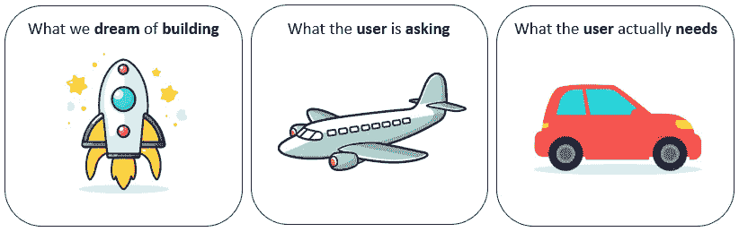
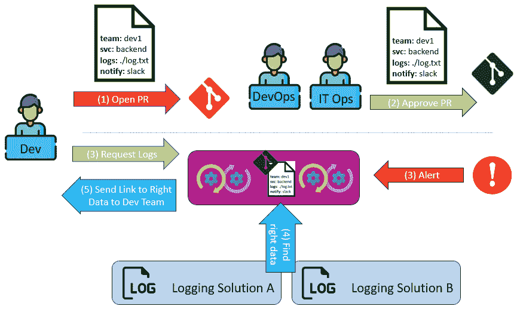
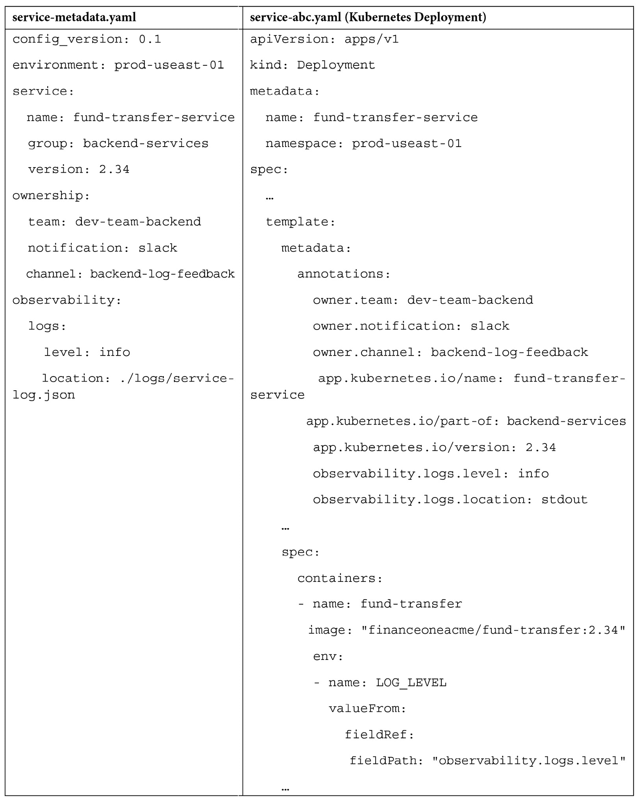
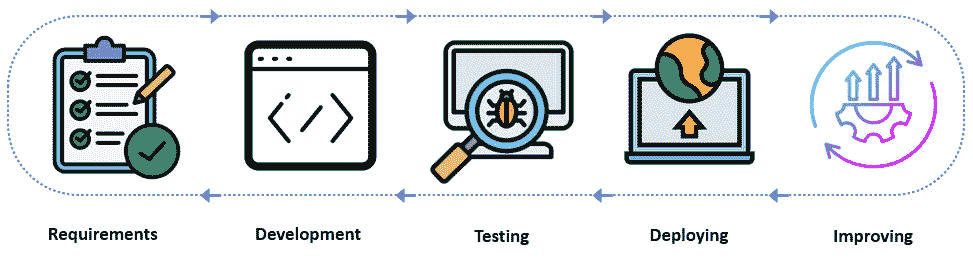
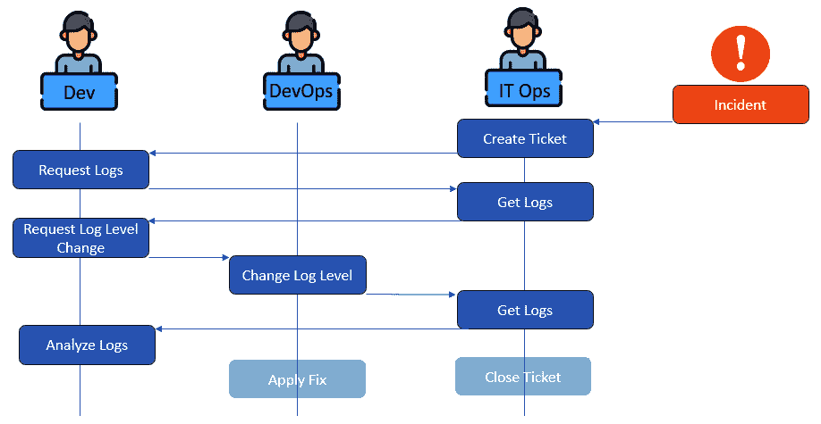
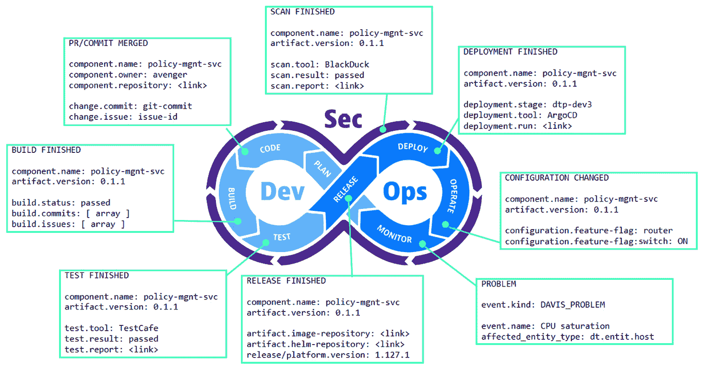
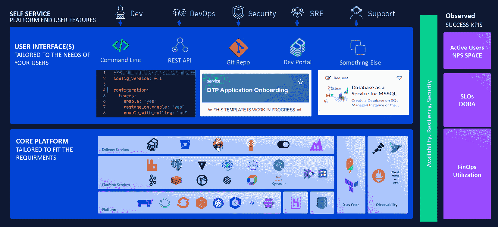

# <st c="0">3</st>

# <st c="2">构建支持</st> <st c="30">平台能力的基础</st>

<st c="62">解决用户遇到的问题，设计良好的用户和开发者体验，避免技术复杂性，是成功产品和成功</st> <st c="246">平台工程的基础步骤。</st>

<st c="267">实际上，许多项目失败的原因是忽视了这些基础原则：我们看到架构师迷失在技术细节中，忽略了他们需要解决的问题。</st> <st c="456">项目失败的一个常见原因是最终用户在新产品创建过程中的参与不够持续。</st> <st c="580">通常，架构决策是在没有考虑新产品如何适应现有生态系统、流程和组织技能的情况下做出的。</st> <st c="750">所有这些都导致了一个不稳定的基础，有限的成功潜力</st> <st c="813">。</st>

<st c="825">在本章中，我们将详细讲解定义平台的坚实基础的必要步骤和流程，该平台可以从初始功能集成长为支持关键企业的</st> <st c="1016">平台能力。</st>

<st c="1038">因此，我们将在本章中涵盖以下主要主题：</st>

+   <st c="1102">金融 One ACME——我们的</st> <st c="1128">虚拟公司</st>

+   <st c="1146">通过找到</st> <st c="1193">正确的视角</st> <st c="1193">克服平台的复杂性</st>

+   <st c="1210">考虑现有流程并整合一个</st> <st c="1260">新实施</st>

+   <st c="1278">设计</st> <st c="1293">基础架构架构</st>

+   <st c="1320">探索多云、多 SaaS 以及能力的</st> <st c="1378">碎片化</st>

+   <st c="1393">探索一个参考架构</st> <st c="1433">用于我们平台</st>

# <st c="1445">金融 One ACME——我们的虚构公司</st>

<st c="1489">在本节中，我们将学习</st> <st c="1518">如何理解工程组织中用户的需求，如何平衡不同团队的需求，以及如何决定平台应该包含哪些能力，哪些</st> <st c="1726">不应包含。</st>

<st c="1735">为了使这个更具应用性和实际性，我们将向您介绍</st> *<st c="1807">金融 One ACME</st>*<st c="1825">。虽然它是一个虚构公司，但我们将在本书的其余部分中介绍并使用的历史、技术挑战和团队，都是我们过去几年在许多组织中看到过的。</st> <st c="2052">拥有这样的组织可以帮助我们更好地解释如何将本书中所介绍的理论应用到</st> <st c="2162">实际行动中。</st>

<st c="2180">让我们来看一些</st> <st c="2206">关于</st> *<st c="2231">金融</st>* *<st c="2241">One ACME</st>*<st c="2249">的重要细节：</st>

+   **<st c="2251">Financial One ACME 的简史</st>**<st c="2288">：Financial One ACME 一直是金融服务市场软件解决方案的领导者。</st> <st c="2395">公司成立于 2000 年代初期，采用经典的三层应用架构（Windows 富客户端、应用服务器和数据库），客户将其安装在自己的数据中心中，并且每年发布两次软件更新。</st> <st c="2638">每年发布两次。</st>

    <st c="2645">多年来，Windows 富客户端逐渐被</st> <st c="2713">Web 客户端所替代。</st>

+   **<st c="2724">提供自托管 SaaS 和本地部署的产品</st>**<st c="2778">：2015 年，SaaS 托管版本的需求增加了。</st> <st c="2838">与其重新设计产品以支持多租户的 SaaS 解决方案，决定是简单地为每个 SaaS 客户单独托管应用服务器和数据库，且所有服务都托管在现有的 Financial One ACME 数据中心中。</st> <st c="3084">这解决了数据存储位置和数据访问的问题。</st> <st c="3143">然而，这意味着随着 SaaS 客户数量的增长，运营开销也随之增加，因为每个客户（=租户）都在其</st> <st c="3307">独立的虚拟机上部署了生产环境。</st>

    <st c="3320">此外，IT 运维面临着不断扩展数据中心容量的挑战，以应对生产环境随业务增长而扩展的需求。</st> <st c="3428">由于客户规模不同，他们还需要为每个租户进行单独的容量规划，以确保环境大小合适，避免</st> <st c="3598">资源过度配置。</st>

    <st c="3620">另一方面，开发团队负责预生产环境的管理。</st> <st c="3698">这包括从开发工作站、构建服务器到预生产测试和</st> <st c="3804">暂存环境的所有设施。</st>

+   **<st c="3825">转向每月发布</st>**<st c="3852">：从 2015 年到 2020 年，发布频率不断提升，最终形成了每月发布一次的周期。</st> <st c="3955">这些发布由开发团队构建和测试，然后交给 IT 运维部门进行部署，既包括 SaaS 环境，也包括那些仍在本地部署软件的客户。</st> <st c="4144">这种速度的变化导致了一个情况：并非每个客户都希望如此频繁地更新软件，因为更新必须与他们的内部变更请求流程对接。</st> <st c="4332">一些客户的版本滞后了多达六个发布，这给开发团队增加了额外的负担，必须支持所有这些</st> <st c="4468">较旧的版本。</st>

+   **<st c="4483">迁移到云端</st>**<st c="4515">：在 2020 年，业务扩展到新地区，随着扩展，要求也增加了，需要在新地区提供 SaaS 服务。</st> <st c="4646">公司决定不再建设更多的数据中心，而是</st> *<st c="4708">将现有的生产架构迁移</st>* <st c="4722">到公共云提供商的计算服务上。</st>

    <st c="4811">这一举措还包括了新的流程和指南，关于如何更新软件或访问这些云服务器上的数据——例如，如何访问属于</st> <st c="4992">租户 Y 的 X 服务器日志！</st>

+   **<st c="5001">被新兴金融科技公司超越</st>**<st c="5039">：在疫情期间，涌现出了一些新兴的金融科技软件公司，这些公司是</st> *<st c="5112">为云端而生、为云端架构设计的</st>*<st c="5146">！这给 Financial One ACME 带来了压力，因为这些新的仅 SaaS 公司的架构不需要维护一个支持 SaaS 和本地环境的传统架构。</st> <st c="5305">它们的架构也是多租户和多云的，这使得它们比 Financial One ACME 的同类产品运行得更加高效和低成本。</st>

<st c="5462">领导层做出了</st> <st c="5481">战略决策，重新架构他们的服务，同时提升开发、支持和运营现有平台的效率，直到每个客户都能迁移到未来的</st> <st c="5688">仅 SaaS 服务。</st>

<st c="5707">现在我们到了 2024 年，是时候思考如何帮助这个组织实现现代化并重新创造自我。</st> <st c="5830">Kubernetes 和云原生是未来的技术栈！</st> <st c="5885">希望寄托在平台工程上，改善工程师们在未来技术栈上的工作，同时维护旧技术栈。</st> <st c="6021">这就是我们发挥作用的地方——新成立的平台</st> <st c="6074">工程团队！</st>

<st c="6091">现在，让我们了解一下我们未来的</st> <st c="6122">内部开发平台（</st>**<st c="6152">IDP</st>**<st c="6179">）的潜在用户：</st>

+   **<st c="6196">开发团队</st>**<st c="6214">：管理所有预生产工具</st> <st c="6251">和环境</st>

+   **<st c="6267">IT 运维</st>**<st c="6274">：谁在管理本地数据中心和云端</st> <st c="6333">计算资源</st>

+   **<st c="6350">DevOps</st>**<st c="6357">：负责从应用层面部署和运营现有基于 SaaS 的生产环境的团队</st>

+   **<st c="6488">质量工程师</st>**<st c="6506">：专注于在软件推广到生产环境之前进行测试的团队</st> <st c="6576">以保证质量</st>

+   **<st c="6589">站点可靠性工程师（SRE）</st>**<st c="6623">：专注于弹性、可用性，帮助报告和执行服务水平协议（SLA）</st> <st c="6713">和服务水平目标（SLO）</st>

+   **<st c="6721">技术文档</st>**<st c="6736">：负责准备面向最终用户的文档，配合每个发布版本，包括发布说明、新特性以及</st> <st c="6866">使用指南</st>

+   **<st c="6879">其他人</st>**<st c="6891">：包括</st> **<st c="6908">数据库管理员</st>**<st c="6923">，</st> **<st c="6925">项目经理</st>**<st c="6941">，</st> **<st c="6943">产品负责人</st>**<st c="6957">，</st> **<st c="6959">ProdSec</st>**<st c="6966">，</st> <st c="6968">以及其他人</st>

<st c="6978">现在我们知道了团队是谁</st> *<st c="7000">我们</st>* <st c="7002">作为一个团队是谁以及</st> *<st c="7025">我们的</st>* <st c="7028">潜在用户是谁，接下来让我们看看</st> *<st c="7066">我们</st>* <st c="7069">需要如何构建一个平台来解决</st> *<st c="7110">他们的</st>* <st c="7115">痛点！</st>

# <st c="7129">通过找到正确的视角来克服平台的复杂性</st>

<st c="7193">“</st>*<st c="7195">我们花了几个月时间构建了我们的新平台。</st> <st c="7238">开发人员讨厌它！</st> <st c="7252">帮我</st>* *<st c="7260">理解为什么！</st>*<st c="7275">”</st>

<st c="7277">我们不想最终陷入</st> <st c="7304">那种不得不在公共讨论论坛上发布这样的问题的情况。</st> <st c="7397">这个标题——信不信由你——来自一篇真实的帖子。</st> <st c="7453">如果你想了解更多关于这个故事的信息，</st> <st c="7501">可以阅读</st> **<st c="7511">Reddit</st>** <st c="7517">上的帖子</st> *<st c="7523">[1]</st>* <st c="7526">，该帖子提供在</st> *<st c="7543">进一步</st>* *<st c="7551">阅读</st>* <st c="7558">部分。</st>

<st c="7567">那么，为什么会发生这种情况呢？</st> <st c="7593">许多平台工程项目失败的原因与其他产品开发项目失败的原因相同：有人有了一个好主意——建造了或者让别人建造了一个产品——但最终发现没有人看到这个新产品的好处，因为它没有解决任何人实际面临的问题。</st> <st c="7899">人们所面临的问题。</st>

<st c="7911">许多人犯的错误是不通过潜在的最终用户来验证初步想法，这些用户可能会从该解决方案中受益。</st> <st c="8051">如果你找不到一群具有需要的新产品能够解决的实际问题的用户，那么最好根本不构建产品，因为它注定会从</st> <st c="8220">一开始就失败。</st>

<st c="8230">如果你曾从事过产品管理工作，你可能会想，“</st>*<st c="8309">但这不就是产品管理 101 吗</st>*<st c="8344">！” 完全同意！</st> <st c="8361">然而，并非每个负责构建新平台的团队都拥有产品管理经验。</st> <st c="8475">我们见过许多团队发现自己处于这样一种境地，他们可以开始构建一个平台，但并未意识到它与构建任何常规产品的相似之处。</st> <st c="8646">在开始构建之前，构建产品的许多任务已经开始了</st> *<st c="8714">产品</st><st c="8720">。</st>

## <st c="8727">应用基础的产品管理原则——“不要给用户更快的马”</st>

<st c="8802">成功的</st> <st c="8807">平台工程方案应与过去成功的产品团队所做的相一致：</st> <st c="8928">过去：</st>

+   *<st c="8937">识别</st>* <st c="8946">一个拥有足够大用户群体的问题</st> <st c="8982">基础</st>

+   *<st c="8990">理解</st>* <st c="9001">为什么这是一个挑战以及目前它的负面影响是什么</st> <st c="9058">现在</st>

+   *<st c="9067">研究</st>* <st c="9076">为什么这个问题尚未</st> <st c="9109">得到解决</st>

+   *<st c="9123">如何</st>* <st c="9127">量化解决</st> <st c="9178">这个问题</st> <st c="9190">的好处</st>

<st c="9190">为了回答这些问题并超越基础，我们建议与你的潜在终端用户进行交谈。</st> <st c="9300">让他们告诉你他们面临的实际问题，并给予他们自由，解释一种能使他们理想地完成工作的解决方案。</st>

<st c="9460">在倾听时，请确保你没有被当前知道的任何技术限制或挑战所局限。</st> <st c="9591">有一句名言，归功于</st> *<st c="9628">亨利·福特</st>* <st c="9638">据说他曾说：“</st>*<st c="9660">如果我问人们他们想要什么，他们会说更快的马。</st>*<st c="9736">” 你会发现，用户通常能够轻松描述他们的问题。</st> <st c="9817">然而，他们通常提出的解决方案受限于他们认为可能的范围，或者是当前意识到的技术限制。</st> <st c="9959">。</st>

<st c="9968">现在，我们并不打算从一个需要数月或数年的革命性新软件工程方式开始。</st> <st c="10094">然而，这种思维方式是重要的，因为它是朝着解决别人未能解决的问题迈进的一步，而这个解决方案</st> <st c="10231">能够被广泛采用！</st>

<st c="10246">首先，我们来思考如何</st> *<st c="10282">解决这个问题</st>* <st c="10300">使用</st> *<st c="10310">最简单且最快速的</st>* <st c="10330">技术方案。</st> *<st c="10351">不要一开始就过度设计</st>* <st c="10370">试图提出最佳或最具革命性的技术实现方案。</st> <st c="10459">虽然这是一个鼓舞人心的目标，但我们的初衷是</st> *<st c="10526">快速获取反馈并验证</st>* <st c="10554">我们提出的解决方案是否解决了潜在</st> <st c="10627">最终用户的痛点。</st>

<st c="10637">为了获取这些快速反馈，你需要做</st> <st c="10680">以下几件事：</st>

+   *<st c="10694">快速交付</st>* <st c="10702">一个</st> <st c="10705">解决方案</st>

+   *<st c="10721">展示</st>* <st c="10726">给你的潜在</st> <st c="10748">最终用户</st>

+   *<st c="10757">获取</st>* <st c="10761">持续反馈</st>

+   *<st c="10781">根据</st>* <st c="10788">反馈进行</st> <st c="10798">优化</st>

+   *<st c="10810">继续</st>* <st c="10815">通过这些步骤</st> <st c="10834">进行迭代</st>

<st c="10845">这个过程</st> <st c="10859">会一直持续，直到你能够证明用户愿意使用你的解决方案，因为它改善了他们完成</st> <st c="10979">事情</st><st c="10984">的方式。</st>

## <st c="10992">避免“沉没成本谬误”</st>

<st c="11025">并非每个项目都会成功，不管你尝试和迭代多少次。</st> <st c="11116">“</st> **<st c="11120">沉没成本谬误</st>** <st c="11137">”是一个在日常生活决策中经常见到的问题模式，</st> <st c="11208">在软件工程中也同样存在。</st> <st c="11246">它突出了一个问题，即组织在一个策略上继续投资，因为已经做出了投入，即使显然停止投资会更好，因为该策略不可能成功。</st> <st c="11482">关于这一点有很多材料可以阅读，例如</st> **<st c="11554">沉没成本</st>** <st c="11563">的相关文章</st> *<st c="11572">[2]</st>*<st c="11575">。</st>

<st c="11576">因此，明确何时停止迭代非常重要。</st> <st c="11643">如果“</st>*<st c="11661">用户喜欢这个解决方案</st>*<st c="11685">”这一时刻在一定时间内没有发生，你必须准备好停止并终止这个项目。</st> <st c="11799">为此，你需要为自己设定</st> <st c="11835">达成这一</st> **<st c="11864">验证点</st>** <st c="11880">的里程碑。</st> <st c="11899">记住，正如前面所提到的，你不希望最终出现类似“</st>*<st c="11982">我们花了几个月时间构建这个平台。</st> <st c="12023">开发者讨厌它！</st> <st c="12037">帮我</st>* *<st c="12045">理解为什么！</st>*<st c="12061">”这样的结论。</st>

## <st c="12063">构建用户需要的东西——一个实际的例子</st>

<st c="12128">让我们回到最初的步骤。</st> <st c="12170">我们需要构建的是什么？</st> <st c="12204">在产品管理中，有许多不同的思维方式（例如请参见</st> *<st c="12274">图 3</st>**<st c="12282">.1</st>* <st c="12284">，这是其中一个例子），它们展示了构建的事物与用户需求之间的差异。</st> <st c="12382">如果你搜索关于过度工程的思维方式，结果也是如此。</st> <st c="12443">它们得出了相同的结论：</st> *<st c="12486">在没有先理解用户需求的情况下构建事物！</st>* *<st c="12542">用户需求！</st>*

<st c="12633">图 3.1：过度工程悖论</st>

<st c="12672">我们有可能避免一种情况</st> <st c="12707">，即最终构建出一个无法解决真正问题，或者以过于复杂的方式解决问题，并且没有投资回报的情况。</st> <st c="12846">投资回报。</st>

<st c="12860">每个旅程中最难的步骤是第一步。</st> <st c="12914">在我们的案例中，第一步是理解</st> *<st c="12946">谁</st>* <st c="12949">是我们潜在的平台注册用户，以及</st> *<st c="12987">平台可以解决的真正痛点是什么</st>* <st c="12991">。</st>

<st c="13036">为了看到这一点的实际应用， let’s walkthrough the several steps on how we would approach this for Financial</st> <st c="13136">One ACME!</st>

### <st c="13146">第一步——理解用户的真正痛点</st>

<st c="13201">在走廊中的对话中，开发团队常常抱怨，分析软件中的问题，在生产环境中要比在预生产环境中容易得多。</st> <st c="13381">他们可以完全访问构建服务器（Jenkins）和测试工具（Selenium 和 JMeter）的所有日志，以及他们部署软件的环境。</st> <st c="13557">他们可以轻松增加日志级别，或者迅速部署一个包含更多日志输出的新版本，以更快地解决问题。</st> <st c="13658">更快地解决问题。</st>

<st c="13674">当</st> <st c="13680">生产环境中发现问题时，分析问题是完全不同的故事！</st> <st c="13772">开发团队必须通过提交 Jira 工单来请求 IT 运维的许可，以便获取日志访问权限。</st> <st c="13880">这有时需要几个小时，因为 IT 运维团队通常会被其他许多任务压得喘不过气。</st> <st c="13974">IT 运维团队也没有关于软件记录日志的位置的内部知识，开发团队也不总是在初始工单中提供这些信息。</st> <st c="14175">因此，通常需要多次迭代才能捕获到所需的日志，并将其上传到 IT 运维团队管理的工具，以便与其他团队共享生产相关数据。</st> <st c="14341">更改日志级别也不是那么简单。</st> <st c="14384">这种生产环境的更改必须遵循特别的变更审批流程。</st> <st c="14463">作为软件变更，这由 DevOps 团队处理，这进一步拖慢了进程。</st> <st c="14546">这使得事情变得更加缓慢！</st>

<st c="14559">对开发团队来说，这意味着他们不能像以前那样直接远程登录到服务器上即时访问和分析日志，而是必须通过 IT 运维的中央生产数据存储工具来分析这些日志。</st> <st c="14774">然而，开发团队并不太熟悉这个工具，因为他们并不经常使用它。</st> <st c="14873">该集中式工具还有自己独立的权限系统，最初是为了防止未授权的访问敏感数据而设置的。</st> <st c="15007">由于该系统与开发团队使用的认证和访问控制系统并未集成，通常与当前团队的分配情况不同步。</st> <st c="15167">这导致了个别工程师无法访问他们需要的日志，从而导致与 IT 运维和 DevOps 之间的额外沟通，或者通过一个未经批准的捷径，直接询问恰好有访问权限的开发同事来获取</st> <st c="15416">日志！</st>

<st c="15425">如你所见，开发团队中充满了很多挫折和痛苦。</st> <st c="15504">但正如你所想象的那样，IT 运维和 DevOps 团队也面临着大量的挫折。</st> <st c="15598">他们在操作生产环境时，经常会被要求查找并提供生产数据访问权限，或批准日志级别的更改，这些任务不断打断他们的工作。</st> <st c="15754">他们经常需要来回沟通，才能弄清楚请求的是什么数据，数据在哪里，谁应该有权访问</st> <st c="15890">这些数据。</st>

<st c="15900">通常会有大量的讨论来理解完整的情况，理解双方的痛点，并且获取足够的细节，以便开始思考更好的解决方案。</st> <st c="16096">当你在组织中应用这一方法时，计划足够的时间并提前通知你想要交流的人，以便他们可以整理思路来进行</st> <st c="16254">这些对话！</st>

<st c="16274">为了开始提出解决方案，最好先组织各方痛点的概览，如下表所示：</st> <st c="16387">在</st> <st c="16394">以下表格中：</st>

| **<st c="16410">问题</st>**<st c="16418">: 开发人员无法直接访问生产环境中的日志</st> <st c="16459">日志</st> |
| --- |
| **<st c="16472">痛点</st>**<st c="16484">:</st> <st c="16487">开发团队</st> | **<st c="16503">痛点</st>**<st c="16515">:</st> <st c="16518">IT 运维</st> | **<st c="16524">痛点</st>** **<st c="16530">:</st> DevOps</st> |
| <st c="16545">需要创建 Jira 工单来请求访问生产环境中的日志。</st> | <st c="16614">需要处理请求访问</st> <st c="16664">日志的 Jira 工单。</st> |  |
| <st c="16672">大量时间都花费在工单上，直到 IT 运维团队找到正确的日志</st> <st c="16753">来捕获。</st> | <st c="16764">开发人员并不总是在工单中提供足够的信息。</st> <st c="16822">需要更多迭代才能获取所有</st> <st c="16872">必要的细节。</st> |  |
| <st c="16890">在生产环境中进行故障排除时，很难更改日志级别。</st> <st c="16951">但仍然需要创建更多变更请求工单。</st> |  | <st c="17002">处理未计划的变更请求工单以提升</st> <st c="17059">日志级别。</st> |
| <st c="17070">低效的日志分析。</st> <st c="17098">开发人员更习惯于使用预生产环境中的工具。</st> <st c="17153">生产环境中的工具对他们来说不够直观，反而降低了</st> <st c="17210">效率。</st> |  |  |
| <st c="17220">处理生产日志中的权限问题</st> <st c="17274">分析工具。</st> | <st c="17289">解释所有权和权限信息与</st> <st c="17383">开发系统不同步所需的额外工作量。</st> |  |

<st c="17395">表格 3.1：将问题及其痛点组织成易于理解的表格</st>

<st c="17479">现在我们有了</st> <st c="17496">双方的痛点列表，是时候考虑这些痛点的解决方案了，分析该解决方案的影响、成本，以及其</st> **<st c="17679">投资回报率</st>** <st c="17699">(</st>**<st c="17701">ROI</st>**<st c="17704">)</st> <st c="17707">将会是什么</st><st c="17715">！</st>

### <st c="17716">步骤 2 – 量化解决这些痛点的收益</st>

<st c="17774">我们从</st> <st c="17787">量化一个解决方案的影响开始。</st> <st c="17838">这是必要的，以证明构建一个能解决这些痛点的平台所投入的时间和精力。</st> <st c="17953">虽然之前解释的痛点是真实的，但我们需要理解这些问题是偶发的还是经常发生的。</st> <st c="18081">我们需要回答的问题是，是否值得投入数周时间来构建一个解决</st> <st c="18185">这个问题的平台？</st>

<st c="18198">回到相同的团队，现在是时候量化那些列出的痛点的成本，按时间花费或实际的美元来计算。</st> <st c="18326">我们可以通过有根据的猜测或从他们当前的时间追踪中获得这些数字（最佳选项）。</st> <st c="18446">由于团队目前正在使用工单，我们应该能够获得这些工单的总时间花费</st> <st c="18562">在两方之间。</st>

<st c="18573">这里是一个修订后的表格，包含了额外的</st> <st c="18617">成本影响！</st>

| **<st c="18629">痛点/每月花费的时间</st>** | **<st c="18655">开发团队</st>** | **<st c="18673">IT 运维</st>** | **<st c="18680">DevOps</st>** |
| --- | --- | --- | --- |
| <st c="18687">请求日志访问的缓慢过程</st> | <st c="18722">2 天</st> | <st c="18729">4 天</st> |  |
| <st c="18736">更改</st> <st c="18765">日志级别</st> | <st c="18774">0.5 天</st> |  | <st c="18783">0.5 天</st> |
| <st c="18792">低效的</st> <st c="18805">日志分析</st> | <st c="18818">2 天</st> |  |  |
| <st c="18825">解决权限问题的变通方法</st> | <st c="18858">0.5 天</st> |  |  |
| **<st c="18867">总计</st>** | <st c="18877">每月 5 天或每年 60 天</st> <st c="18904">每年</st> | <st c="18910">每月 4 天或每年 48 天</st> <st c="18937">每年</st> | <st c="18943">每月 0.5 天或每年 6 天</st> <st c="18971">每年</st> |

<st c="18977">表 3.2：量化每个痛点的收益，并提供一个简洁的概览</st>

<st c="19062">现在，这是一个</st> <st c="19078">很好的概览，包含了一些有趣的统计数据，可以帮助我们更容易做出决策。</st> <st c="19145">如果我们能够解决开发者目前面临的所有痛点，尤其是他们现在无法轻松访问生产环境中的必要日志文件，我们每年可以节省多达 114 个工程工作日。</st> <st c="19364">这是一个很好的起点，也是一个强有力的理由，去投资提高团队效率，进而投资于</st> <st c="19481">平台工程！</st>

### <st c="19502">步骤 3 – 提出一个能改善开发者体验的解决方案</st>

<st c="19565">现在我们知道</st> <st c="19583">我们每年最多可以节省 114 个</st> **<st c="19622">全职等效</st>** <st c="19642">(</st>**<st c="19644">FTE</st>**<st c="19647">) 工程师工作日，我们应该继续推进并提出一个解决方案，呈现给相关用户。</st> <st c="19781">我们不能展示解决方案的技术细节，而是应该描述开发者将如何体验用户旅程。</st> **<st c="19896">开发者体验</st>** <st c="19916">是平台工程中经常讨论的</st> <st c="19924">关键词。</st> <st c="19992">所以，让我们提出一个能为开发者带来全新体验的解决方案，激发他们使用</st> <st c="20101">我们的解决方案！</st>

<st c="20114">像产品工程一样，我们需要通过询问终端用户他们希望如何与未来的解决方案互动来让他们参与其中。</st> <st c="20256">开发者通常偏好通过代码或简易使用的</st> **<st c="20352">命令行接口</st>** <st c="20374">(</st>**<st c="20376">CLI</st>**<st c="20379">) 来完成所有工作。</st> <st c="20383">这里重要的一点是，我们希望提出一个适合当前工作流程和工具的解决方案，这样我们的用户就无需学习另一个工具或改变他们的工作方式。</st> <st c="20576">。</st>

<st c="20587">在我们的场景中，提案采用了</st> *<st c="20631">代码化配置</st>* <st c="20652">的方法。</st> <st c="20663">开发者可以在代码中指定日志级别、日志输出、所有权和通知渠道。</st> <st c="20756">这可以是一个独立的 YAML 或 JSON 文件，也可以是 Kubernetes 部署定义的一部分。</st> <st c="20857">开发者只需要将该文件提交到他们的 Git 仓库。</st> <st c="20930">DevOps 和 IT 运维可以验证并批准</st> **<st c="20977">拉取请求</st>** <st c="20989">(</st>**<st c="20991">PR</st>**<st c="20993">)，</st> <st c="20999">确保所有数据准确无误。</st> <st c="21040">如果有新的警报出现，或者有人请求日志，新的平台工程能力将获取该组件的正确日志文件。</st> <st c="21212">然后，它使用所有权和通知信息联系开发团队，提供相关日志的链接或摘要，以便解决问题。</st> <st c="21374">下图展示了提议的端到端工作流，并展示了它如何改善开发者、IT 运维和 DevOps 的体验：</st>

<st c="21636">图 3.2：通过代码化配置提升开发者、DevOps 和 IT 运维的体验</st>

<st c="21726">该</st> <st c="21731">提议的解决方案解决了当前所有的痛点，同时确保只有拥有组件的团队可以查看他们的数据。</st> <st c="21862">该解决方案还具有可扩展性，使其在生产和预生产环境中都能以相同的方式工作。</st> <st c="21967">这是未来迭代的</st> <st c="22003">这一能力！</st>

### <st c="22020">步骤 4 – 你的第一个原型</st>

<st c="22050">如果提议的</st> <st c="22066">解决方案被接受，就可以开始进行原型实现。</st> <st c="22138">原型是获取快速反馈的好方法，虽然实现不必完美，但也能提供有效反馈！</st> <st c="22251">就我们的目的而言，原型是最好的方法，因为我们需要验证用户想要解决的问题是否能够以他们愿意使用的方式解决</st> <st c="22425">我们的解决方案。</st>

<st c="22438">原型的第一部分应聚焦于</st> *<st c="22491">接口</st>* <st c="22500">，即我们正在构建的这一新功能的接口。</st> <st c="22541">在我们的案例中，这就是我们之前讨论过的配置文件。</st> <st c="22600">原型设计中的一个关键考量是决定解决方案是否应该在现有技术栈（云虚拟机上的三层应用）上解决问题，还是仅仅想在 Financial One ACME 将其新的云原生实现迁移时解决这一问题。</st> <st c="22878">目标应该始终是提供相同的开发者体验，无论底层技术栈如何。</st> <st c="22993">然而，在实施过程中，收益和投入的差异可能会</st> <st c="23068">非常大。</st>

<st c="23083">为了验证这两个技术栈的原型，请参见以下的配置即代码文件：</st>

<st c="24106">表 3.3：两种声明性方式实现提议的解决方案</st>

<st c="24172">两种</st> <st c="24177">选项都允许开发团队提供所有相关信息，并允许 DevOps 和 IT 运维人员</st> <st c="24285">验证这些信息：</st>

+   **<st c="24297">服务详情</st>**<st c="24313">：名称、版本、所属组件</st> <st c="24350">。</st>

+   **<st c="24360">所有权</st>**<st c="24370">：团队标识符、选择的通知工具和选择的频道</st> <st c="24431">。</st>

+   **<st c="24440">日志</st>**<st c="24445">：日志级别是什么，日志写入到哪里</st> <st c="24489">。</st>

在这个 Kubernetes 示例中，你还可以看到我们如何通过已经标准化的注解来传递一些信息，例如`<st c="24630">app.kubernetes.io/name</st>`、`<st c="24654">part-of</st>`和`<st c="24667">version</st>`。我们还可以看到像日志级别这样的信息可以传递给容器，因为在这个配置文件中改变日志级别也可以改变由已部署的容器产生的日志！

<st c="24888">在进行任何实际实现之前，可以先获取关于该提议配置文件格式的早期反馈。</st> <st c="25008">这给开发、DevOps 和 IT 运维团队提供了机会，他们可以提出额外的元数据需求，如</st> *<st c="25119">服务的优先级</st>* <st c="25127">。</st> <st c="25144">这可以用来定义当生产环境出现问题警报时的升级流程，或用于发送更新邮件给</st> <st c="25290">团队的备用邮箱地址。</st>

<st c="25299">我们提议的解决方案的核心不是配置文件，而是能够响应开发者请求的自动化过程，同时也可以由警报触发。</st> <st c="25476">最简单的解决方案是一个简单的服务，它暴露一个 REST 端点，可以用于这两种使用场景的触发。</st> <st c="25588">该服务需要在一个能够访问</st> <st c="25655">以下内容的环境中运行：</st>

+   <st c="25669">持有“</st><st c="25720">配置文件</st>”的 Git 仓库或 K8s 集群

+   <st c="25739">对目标环境中现有日志解决方案的 API 访问</st>

+   <st c="25805">访问</st> <st c="25824">通知工具的 API</st>

<st c="25842">要开始</st> <st c="25852">一个最小可行原型，我们可以定义只支持 K8s、只支持生产日志解决方案，并且只支持单一的通知工具，如 Slack。</st> <st c="26027">这使我们能够通过原型证明其价值，并且有扩展到其他配置数据源、附加日志环境以及更多通知工具的选项。</st>

<st c="26211">剩下的就是 REST API 的定义。</st> <st c="26264">在这里，我们应该与开发和 IT 运维团队进行咨询，因为他们是该 API 的主要使用者。</st> <st c="26366">开发者使用它按需请求访问日志，而 IT 运维团队在问题被识别时调用该 API。</st> <st c="26489">下表展示了适用于这两种使用场景的 REST API 定义示例：</st>

| **<st c="26563">请求数据</st>** **<st c="26577">按需提供</st>** | **<st c="26586">通知</st>** **<st c="26600">问题</st>** |
| --- | --- |
| `<st c="26609">GET</st>` <st c="26613">https://logservice/request?service=fund-transfer-service&environment=prod-useast-01</st> | `<st c="26697">GET</st>` <st c="26702">https://logservice/request?service=fund-transfer-service&environment=prod-useast-01&incident=PROD-1234</st> |

<st c="26804">表 3.4：新提议服务的 REST API 示例</st>

<st c="26869">尽管两种实现方式都试图为这些服务找到正确的日志文件，并将其发送到正确的团队，Notify API 还接收一个事件参考，这使得我们的实现能够在发送给</st> <st c="27134">开发团队的消息中包含该信息。</st>

<st c="27151">作为这个解决方案原型的一部分，我们还可以做很多事情：</st> <st c="27219">例如：</st>

+   <st c="27233">确定当前的 SDLC 效率，并学习如何衡量我们打算</st> <st c="27336">带来的积极影响</st>

+   <st c="27343">提供 CLI、聊天机器人或</st> <st c="27373">网页 UI</st>

+   <st c="27379">为新服务创建一个模板 Git 仓库，包含</st> <st c="27445">新的配置</st>

+   <st c="27462">创建审计日志以跟踪谁在</st> <st c="27497">请求数据</st>

+   <st c="27512">暴露指标以跟踪</st> <st c="27566">API 的使用情况和性能</st>

+   <st c="27573">实现适当的身份验证以调用</st> <st c="27618">REST API</st>

+   <st c="27626">实现速率限制，以避免在调用后台 Git、K8s API 或日志</st> <st c="27719">平台 API 时出现问题</st>

<st c="27731">这个列表可能</st> <st c="27747">还可以继续。</st>

<st c="27753">并不</st> <st c="27763">需要在一开始就实现所有这些功能，以验证原型并证明</st> <st c="27861">这些能力的价值。</st>

<st c="27879">将基本的产品管理技能应用到您的平台项目中</st>

<st c="27942">到目前为止，我们学到了如何理解用户的真实痛点，如何量化为这些痛点构建解决方案的益处，如何提出解决方案，以及如何通过构建</st> <st c="28182">原型来保持用户的反馈循环！</st>

<st c="28194">现在我们明白，在构建新平台时，我们需要一种产品思维方式，是时候扩展我们的需求收集了。</st> <st c="28327">通过了解平台如何融入现有的端到端流程和工具，超越开发者的需求，将为我们未来的采用和能力增长打下基础！</st>

# <st c="28533">考虑现有的流程并整合新的实现方案</st>

<st c="28601">我们刚才讨论了如何识别用户的真实痛点，以及如何选择合适的候选项为首批原型进行早期反馈。</st> <st c="28758">然而，需求不能仅仅来自最终用户。</st> <st c="28820">我们必须超越仅通过聊天机器人、模板库或新的 CLI 提供自助服务的做法。</st> <st c="28915">

<st c="28923">我们需要审视并分析整个价值创造过程，看看新平台的功能在其中如何定位。</st> <st c="29036">我们需要确保我们理解当前的</st> **<st c="29088">软件开发生命周期</st>** <st c="29119">(</st>**<st c="29121">SDLC</st>**<st c="29125">)——这是组织在开发、发布、运行和退役新软件时遵循的过程。</st> <st c="29232">有几个问题我们需要能够</st> <st c="29283">回答：</st>

+   <st c="29293">引入变更到现有的 SDLC 的标准和流程是什么？</st> <st c="29355">?</st>

+   <st c="29369">当前 SDLC 效率是如何衡量的，我们如何衡量我们预期的积极影响？</st> <st c="29467">。</st>

+   <st c="29475">是否有我们需要遵守的关于新工具的监管要求？</st>

+   <st c="29549">组织内需要被通知或批准新工具的人员是谁？</st>

+   <st c="29629">新工具是否与现有系统进行集成，满足认证、访问控制、审计、可观察性、安全性</st> <st c="29746">和弹性等要求？</st>

<st c="29761">第一步是了解现有流程，如何证明我们想要实现的积极影响，扩展它的需求，以及谁是关键的</st> <st c="29920">决策者</st><st c="29939">。</st>

## <st c="29940">了解现有的 SDLC——“工件的生命周期”</st>

<st c="30006">作为</st> <st c="30009">平台工程</st> <st c="30031">旨在提供能够改善和改变开发人员在 SDLC 过程中执行特定任务的能力，了解组织中当前的 SDLC 是非常重要的。</st> <st c="30216">特别是在大型企业中，很可能并非只有一个过程，而是许多在多年来不断演化的过程。</st> <st c="30343">同样，很可能没有多少人——如果有的话——能从第一个需求和工件创建开始，一直到新软件在生产环境中投入运行，再到其被替换</st> <st c="30540">或退役。</st> <st c="30552">我们非常重要的一点是，不能犯假设我们——或者某一个人——了解现有端到端过程的错误。</st> <st c="30672">即使是那些在公司工作多年的工程师，通常也会生活在自己的信息泡沫中，只对从一个新想法的诞生到代码发布、运行，最终被</st> <st c="30910">退役</st><st c="30924">的全过程有一个有限的了解。</st>

### <st c="30930">工件生命周期实验——从想法，到 git 提交，到生产环境！</st>

<st c="31002">学习端到端过程的一种简单方法是做一个</st> <st c="31067">小实验。</st>

<st c="31085">作为孩子，我曾</st> <st c="31100">像你一样对河流（无论大小）感到着迷。</st> <st c="31160">我相信你一定也曾将一块木头或一根树枝投入水中，观察它被水流带走的过程。</st> <st c="31294">你可能会沿着河流跑，观看那根树枝一路流向它的最终生命周期阶段：大海！</st> <st c="31404">因为所有的水流最终都会汇入大海。</st> <st c="31462">作为孩子，我们并没有机会将那根树枝一路追踪到大海。</st> <st c="31533">然而，作为工程师，我们有机会追踪一个工件的完整生命周期：从想法的诞生（需求工程工具中的一个工单）到开发者的第一次 git 提交，直到该工件部署到生产环境中，或者被更新或替换</st> <st c="31798">在生产环境中。</st>

<st c="31812">我们有两种方式来理解这个工件生命周期。</st> <st c="31873">首先，我们可以选择一个现有的服务或功能，通过分析所有工单、git 提交、管道运行、测试报告、电子邮件、变更请求和事件报告，进行一些取证，从中了解相关的过程、工具和</st> <st c="32106">人员！</st>

<st c="32122">另一种方法是让其中一个开发团队创建一个“演示”或“无影响”的功能。</st> <st c="32226">随着特性标志的流行，这可以是一个简单的功能，通过标志改变工件的某些运行时方面。</st> <st c="32365">这样做的好处是，它不会对生产环境造成风险，但它允许我们了解关于当前 SDLC 的所有信息，并由此推导出该组织当前的工件生命周期！</st>

### <st c="32579">关于工件生命周期的洞察</st>

<st c="32617">我曾</st> <st c="32625">举办过几次“</st>*<st c="32647">让我们理解工件生命周期</st>*<st c="32694">”工作坊，和世界各地的不同组织合作。</st> <st c="32754">结果是收获了很多关于人、流程和工具的洞察和学习。</st> <st c="32840">这包括</st> <st c="32854">以下内容：</st>

+   <st c="32868">什么</st> *<st c="32874">任务</st>* <st c="32879">从需求到第一次 git 提交，再到</st> <st c="32938">生产部署</st>

+   *<st c="32953">谁</st>* <st c="32957">参与了——不同的团队，负责开发、测试、验证和推动从开发到生产的变更</st> <st c="33087">到生产</st>

+   <st c="33100">过程中使用的</st> *<st c="33105">工具</st>* <st c="33110">以及是否在</st> <st c="33228">不同环境中为相同任务使用了不同的工具</st>

+   <st c="33250">过程中哪些任务是</st> *<st c="33286">手动</st>* <st c="33292">的，哪些是</st> <st c="33311">已经</st> *<st c="33319">自动化</st>* 的

+   *<st c="33328">依赖</st>* <st c="33341">于其他任务或团队，以保持变更推进</st> <st c="33392">到生产</st>

+   <st c="33409">每个任务的</st> *<st c="33414">时间</st>* <st c="33418">、整体时间、任务之间的等待时间</st> <st c="33489">等等</st>

<st c="33497">这些洞察</st> <st c="33511">使你能够创建完整的软件开发生命周期（SDLC）或完整的工件生命周期的可视化。</st> <st c="33602">一旦我们进入讨论我们的平台功能如何影响当前</st> <st c="33729">现有的流程时，这样的可视化将非常有用：</st>

<st c="33802">图 3.3：理解软件工件的生命周期</st><st c="33858">rtifact</st>

### <st c="33866">工件生命周期不仅限于初始交付</st>

<st c="33928">虽然</st> <st c="33935">平台工程的工作通常旨在改善软件组件的初始入职或交付方面，但我们不能局限于此。</st> <st c="34092">这就是为什么术语</st> *<st c="34113">制品生命周期</st>* <st c="34132">是一个很好的替代方案，因为生命周期并不会在初始开发过程结束时停止。</st> <st c="34231">制品的生命周期还包括运营、发布更新、维护，甚至是替换或淘汰</st> <st c="34349">该制品。</st>

<st c="34363">在我们从 Financial One ACME 的第一个例子中，我们讨论了一个运营生命周期阶段。</st> <st c="34459">这涵盖了开发团队获取生产日志文件以排查当前问题的繁琐过程。</st> <st c="34583">下图展示了这个生命周期阶段</st> <st c="34637">和过程！</st>

<st c="34743">图 3.4：访问日志时事件响应的生命周期</st><st c="34803"></st>

### <st c="34811">相关团队的需求和现有流程</st>

<st c="34867">在我们的</st> <st c="34874">练习中，为了理解制品在生命周期中的流转过程，我们学到了很多关于涉及的团队、现有工具和流程的知识。</st> <st c="35026">我们还了解了未来平台能力可能需要集成的工具，哪些团队需要合作，另外——如果我们最终要替换或与现有工具集成——需要做哪些工作，以确保不会破坏当前工具</st> <st c="35289">实现提供的功能。</st>

<st c="35313">以下是一些</st> <st c="35340">发现的例子：</st>

+   **<st c="35355">单点登录 (SSO)</st>**<st c="35376">：每个工具都需要与</st> <st c="35418">中央 SSO</st>

+   **<st c="35429">安全性</st>**<st c="35438">：每个工具都需要通过软件供应链的</st> <st c="35492">安全指南</st>

+   **<st c="35511">审计</st>**<st c="35520">：每个工具都需要创建特定的</st> <st c="35559">访问日志</st>

+   **<st c="35570">服务水平协议 (SLAs)</st>**<st c="35602">：每个关键工具都需要遵守公司范围内定义的可用性 SLAs，以确保</st> <st c="35694">关键服务</st>

<st c="35711">到目前为止，我们已经</st> <st c="35726">了解到理解软件制品的完整过程和生命周期是多么重要。</st> <st c="35823">了解哪些团队参与其中，介绍新工具时需要经过哪些现有流程，这一点也非常重要。</st> <st c="35958">我们还了解到，平台工程能力可以在未来的某些领域为软件交付和制品</st> <st c="36122">生命周期</st><st c="36124">提供显著改进！</st>

## <st c="36134">引入生命周期事件 – 测量和提升 SDLC 的效率</st>

<st c="36217">我们已经讨论过工件生命周期的概念。</st> <st c="36224">一个工件通常会经历一系列阶段：需求接受、实施开始、拉取请求、工件构建、安全扫描完成、测试完成、构建验证、工件提升、部署完成、功能发布、问题检测、配置更改、问题</st> <st c="36576">解决、工件退役。</st> <st c="36609">虽然每个组织的生命周期阶段或环节可能有所不同，但我们可以通过 DevOps 无限循环很好地可视化这一过程。</st> <st c="36753">为了追踪工件在生命周期中的进展，我们建议你在每个步骤中记录为生命周期事件。</st> <st c="36869">下图展示了这些事件的示例，以及相关工具和团队应添加的一些元数据，以更好地理解工件从最初的需求</st> <st c="37069">到操作的完整流动：</st>

<st c="38218">图 3.5：SDLC 及其工件生命周期事件</st>

<st c="38273">生命周期事件的</st> <st c="38277">概念并不新鲜。</st> <st c="38315">许多组织正在通过不同的方式实施这一概念，</st> <st c="38381">例如，在其 CI/CD 流水线的开始和结束时，添加日志输出，包括元数据，如时间戳、Git 仓库、流水线、创建的工件和成功状态。</st> <st c="38592">持续交付基金会一直在进行</st> <st c="38643">关于</st> **<st c="38651">CDEvents</st>** *<st c="38659">[3]</st>* <st c="38663">规范的工作，该规范定义了一套事件词汇，允许工具以互操作的方式进行通信。</st> <st c="38764">CDEvents 是一个很好的起点，可以扩展以覆盖工件的完整生命周期，正如</st> <st c="38866">之前所提议的那样。</st>

<st c="38886">标准化此类事件有许多好处</st> <st c="38935">：</st>

+   **<st c="38945">每个工件都可以通过其生命周期追溯</st>**<st c="38997">：这意味着它可以回答诸如谁参与了</st> <st c="39079">工件的创建！</st>

+   **<st c="39091">发布管理</st>**<st c="39114">：哪个版本的发布工件已经部署，</st> *<st c="39174">何时</st>* <st c="39178">由</st> *<st c="39182">谁</st>* <st c="39186">在</st> *<st c="39190">哪个</st>* <st c="39195">环境中？</st>

+   **<st c="39208">生命周期阶段可以被衡量，这为我们提供了 DORA 指标</st>**<st c="39275">：从初始需求到首次部署需要多长时间（交付时间），我们有多少次部署（部署频率），有多少次部署导致了生产中的问题（部署失败率），以及修复生产问题需要多长时间（恢复服务时间）？</st>

+   **<st c="39582">合规性</st>**<st c="39593">：它使我们能够识别某些工件是否跳过了重要步骤，如安全扫描、韧性测试等。</st>

+   **<st c="39726">互操作性</st>**<st c="39743">：这指定了我们是使用 Jenkins 还是 GitHub Actions 来构建工件。</st> <st c="39822">如果所有工具都生成相同类型的事件，我们就能控制整个</st> <st c="39895">生命周期。</st>

<st c="39906">在</st> <st c="39914">你</st> <st c="39917">定义生命周期事件之前，先查看开源社区中的现有倡议，以及交付、可观测性和</st> **<st c="40096">应用生命周期管理</st>** <st c="40129">(</st>**<st c="40131">ALM</st>**<st c="40134">)领域中的供应商在做什么。</st> <st c="40154">没有必要重新发明轮子，因为目前标准正在</st><st c="40217">制定中！</st>

## <st c="40234">呈现改善现有 SDLC/DORA 的价值主张</st>

<st c="40304">理解</st> <st c="40318">现有的 SDLC 并使工件的生命周期可见，将为我们正在进行的平台工程项目提供宝贵的洞察。</st> <st c="40464">这对于所有工程团队成员来说也是一种启示，因为他们中的许多人很可能从未得到过这种概览，无法看到当前流程中有哪些地方可以</st> <st c="40653">改进。</st>

<st c="40665">获得的洞察力使我们能够在价值主张上进行工作，这将改善不仅是开发团队的日常生活，理想情况下还包括 SDLC 过程中许多其他团队的工作。</st> <st c="40839">这就是为什么理解和衡量当前流程如此重要——它不仅能让我们提出新的解决方案，还能呈现有力的数据支持的改进，例如提高交付时间、部署频率、部署失败率或恢复服务的时间（我们钟爱的</st> <st c="41137">DORA 指标）</st>。

<st c="41151">基于迄今为止学到的所有内容，这在我们为 Financial One ACME 的日志访问用例中会是什么样子？</st> <st c="41266">我们的初始用例仅关注在生产环境中出现错误时如何改善日志访问。</st> <st c="41367">在了解了完整的端到端流程后，所有相关团队以及现有的流程、工具和组织需求，我们可以提出以下解决方案和</st> <st c="41550">价值主张：</st>

| **<st c="41568">建议</st>**<st c="41577">：将可观察性自动化作为非功能性</st> <st c="41625">软件需求</st> |
| --- |
| **<st c="41645">价值主张</st>**<st c="41663">：提高 DORA 指标，减少认知负担，并扩展</st> <st c="41721">最佳实践</st> |
| **<st c="41735">关键绩效指标（KPI）和</st>** **<st c="41745">受影响团队</st>**<st c="41759">：</st>*<st c="41761">通过自动将生产环境中的相关可观察性数据传递给开发团队，使服务恢复时间提高 50%</st>* <st c="41799">。这消除了 DevOps 和</st> <st c="41961">IT 运维团队手动捕获和转发日志的需求。</st>*<st c="41968">通过自动化捕获和分析早期生命周期阶段（开发、测试）的可观察性数据（日志、指标、追踪和事件），使交付时间缩短 50%</st>* <st c="41993">。分析将改善并自动验证新构建的工件，从而减少</st> <st c="42154">质量工程师的手动工作量。</st>*<st c="42288">通过自动捕获早期环境中的问题，并基于可观察性数据自动检测常见问题（新的关键日志、异常、应用程序缓慢等），使生产部署失败率降低 50%</st>* <st c="42337">。</st> |
| **<st c="42537">高级用户旅程</st>** **<st c="42563">和协作</st>**<st c="42580">：</st><st c="42582">作为一名</st> *<st c="42587">开发团队</st>*<st c="42603">，我提交一个</st> *<st c="42617">可观察性即代码（Observability as Code）</st>* <st c="42638">配置文件，其中包含有关日志源（用于自动捕获）、所有权（用于自动路由）和重要日志模式（用于自动验证和</st> <st c="42834">自动报警）的信息。</st><st c="42854">作为一名</st> *<st c="42860">质量工程团队</st>*<st c="42884">，我协作并扩展日志模式，以自动检测回归作为测试</st> <st c="42971">结果分析的一部分。</st><st c="42987">作为一名</st> *<st c="42993">DevOps 团队</st>*<st c="43004">，我协作并基于其他</st> <st c="43107">开发团队的经验和模式扩展日志模式检测规则。</st><st c="43125">作为一名</st> *<st c="43132">IT 运维团队</st>*<st c="43143">，我协作并验证正确的日志源，并基于开发</st> <st c="43286">和 DevOps 定义的相关日志模式扩展生产问题检测。</st> |

<st c="43297">表 3.5：以可展示的布局提出我们的解决方案建议</st>

<st c="43372">提出清晰的建议和价值主张</st>

<st c="43416">如果我们能够清晰地阐明</st> <st c="43499">我们的平台的优势，成功的机会将更高。</st>

<st c="43512">现在我们已经</st> <st c="43527">学会如何设计我们的提案，以包括所有参与软件交付和工件生命周期的人员，现在是时候考虑如何设计</st> <st c="43702">拟议的解决方案。</st>

# <st c="43720">设计基础架构体系</st>

<st c="43762">到</st> <st c="43765">目前为止，我们已经推销了我们的提案。</st> <st c="43806">一旦所有参与的团队和执行赞助商都同意，就是时候进入下一个阶段了：我们需要考虑如何设计解决方案以及如何与基础架构配合，以实现组织的所有非功能需求：弹性、可用性、审计能力、安全性、强制集成等等。</st>

<st c="44173">虽然我们在开始阶段不应过度设计，但了解对基础架构决策产生影响的所有要求至关重要。</st> <st c="44331">以下是我们需要能够回答的几个问题：</st>

+   <st c="44391">我们如何、由谁以及在哪里部署、更新和运营</st> <st c="44454">平台？</st>

+   <st c="44467">是否有组织要求在</st> <st c="44516">特定基础设施上运行？</st>

+   <st c="44539">我们的解决方案是否需要在多个地理区域甚至多个</st> <st c="44644">基础设施提供商之间运行？</st>

+   <st c="44669">是否有基础设施要求来访问和连接</st> <st c="44735">其他系统？</st>

+   <st c="44749">我们的解决方案必须能够支持多少用户？</st>

+   <st c="44802">我们的基础架构以及</st> <st c="44855">终端用户的 SLA 是什么？</st>

+   <st c="44865">我们如何进行</st> <st c="44888">扩展和收缩？</st>

<st c="44896">在</st> *<st c="44900">第四章</st>*<st c="44909">中，我们将</st> <st c="44917">花更多时间深入探讨使用 Kubernetes 作为统一编排层来架构平台核心。</st> <st c="45035">无论您最终决定使用 Kubernetes 还是其他工具作为底层抽象层，您都需要回答这些问题，因为它们将影响您的一些决策。</st> <st c="45235">因此，让我们深入了解如何回答这些问题会影响我们的</st> <st c="45305">架构决策</st><st c="45327">！</st>

## <st c="45330">避免象牙塔式的方法 – 我们拥有这个平台！</st>

<st c="45384">在回答影响基础架构的问题之前，让我们先回答基本的</st> <st c="45471">所有权问题：</st>

<st c="45490">我们拥有这个平台！</st>

<st c="45511">平台工程团队负责整个平台的端到端产品！</st>

<st c="45584">由于我们的平台将提供使交付和操作软件组件更轻松的能力，我们的首要目标必须是遵循我们自己的最佳实践，并且最好能以相同的黄金路径和自助服务功能来部署平台，正如我们希望终端用户使用的那样。</st> <st c="45861">一些组织称之为</st> *<st c="45890">做零号客户</st>* <st c="45909">或者</st> *<st c="45913">饮用自己的香槟</st>*<st c="45937">。如果我们不遵循这一原则，只是建造一些东西，然后扔给别人希望他们操作，那我们就错失了现代产品思维在</st> <st c="46119">平台工程中的真正意义。</st>

<st c="46140">我们需要感受到用户当前在软件交付和操作中所经历的痛苦。</st> <st c="46238">这将成为我们构建平台能力的更大动力，使我们作为软件</st> <st c="46342">团队的工作更轻松。</st>

<st c="46355">我们需要避免</st> *<st c="46376">象牙塔式的做法</st>* <st c="46396">，这种做法是我们从上而下强迫最佳实践，而自己却没有遵循这些最佳实践。</st> <st c="46500">如果我们这样做，可能会像本章开头提到的那个著名的 Reddit 帖子一样：“</st>*<st c="46623">我们花了几个月建这个平台。</st> <st c="46664">开发者讨厌它！</st> <st c="46678">帮我</st>* *<st c="46686">理解为什么！</st>*<st c="46701">”</st>

<st c="46703">现在，让我们回过头来回答之前提到的一些基础设施问题，这些问题可能会影响我们的</st> <st c="46820">架构决策</st><st c="46841">。</st>

## <st c="46845">组织约束——现有的基础设施要求？</st>

<st c="46912">我们需要</st> <st c="46924">弄清楚是否有使用现有基础设施服务的限制。</st> <st c="47006">对于企业来说，可能已经存在与基础设施或云服务提供商的合同。</st> <st c="47104">如果存在这样的限制，它将影响我们的决策——例如，我们是否需要在本地运行和操作自己的 K8s 集群，还是可以利用供应商的托管服务？</st> <st c="47297">如果我们被限制在某个云供应商，这也意味着我们可能只能使用他们的服务（存储、数据库、缓存，</st> <st c="47450">等等）。</st>

<st c="47460">关于这一领域，我们还需要关注访问控制、流入和流出以及</st> <st c="47548">成本约束！</st>

<st c="47565">在最终确定基础设施</st> <st c="47681">和架构</st><st c="47694">决策之前，了解所有此类组织约束是非常重要的！</st>

## <st c="47699">连接性约束——互操作性要求？</st>

<st c="47757">我们的平台</st> <st c="47771">功能将要求我们连接并与其他现有系统进行交互。</st> <st c="47856">这包括访问 SSO、Git 仓库、CI/CD 管道、可观察性、编排层、云 API 等。</st>

<st c="47991">根据平台运行的位置——即本地部署与云部署——这将影响平台如何与所有这些工具连接，或者这些工具如何连接回</st> <st c="48192">平台。</st>

<st c="48205">我们需要考虑防火墙、拉取与推送连接、API 限速和成本，因为我们需要确保所有系统之间具有弹性的互操作性。</st> <st c="48361">这些系统。</st>

<st c="48375">在最终决定我们的平台基础设施及其与其他系统连接的位置之前，了解所有这些连接约束非常重要。</st> <st c="48567">我们需要</st><st c="48573">与之连接的系统。</st>

## <st c="48579">弹性约束——SLA 和其他非功能性需求？</st>

<st c="48648">我们平台的</st> <st c="48652">目标是改善各种内部用户（开发人员、DevOps、IT 运维、质量工程师、应用支持等）的日常工作。</st> <st c="48808">这意味着我们的平台每次用户需要时都必须保持可用并正常工作。</st> <st c="48901">在全球企业中，这可能意味着需要具备 24/7 的运营弹性和高可用性。</st> <st c="48991">如果平台不可用，我们的工程师将无法进行关键工作，比如发布软件的新版本、修补安全漏洞或扩展工作负载以应对增加的最终</st> <st c="49202">用户需求！</st>

<st c="49214">因此，我们需要了解平台上的非功能性需求，例如</st> <st c="49298">以下内容：</st>

+   <st c="49312">可用性——例如，早上 9 点</st> <st c="49348">到下午 5 点</st> <st c="49358">在单一时区，或跨所有时区的周一至周五</st> <st c="49411">时间段</st>

+   <st c="49421">用户体验——例如，必须保证系统的可接受的最终用户性能，支持最多 100 名并发工程师使用</st> <st c="49567">平台功能</st>

<st c="49588">这些非功能性需求还意味着我们需要考虑如何进行横向和纵向扩展。</st> <st c="49711">我们需要定义是否将平台集中提供，以便服务全球各个地区，还是需要将平台组件部署到不同地区，以更好地满足</st> <st c="49958">可接受的性能的用户体验要求。</st>

<st c="49981">动态、水平或垂直扩展是我们将在本书后面详细探讨的话题，当我们深入研究如何使用 Kubernetes 作为统一层架构平台的核心时。</st>

<st c="50173">现在我们已经找到了所有这些问题的答案，我们将能够做出关于平台基础设施和架构选择的更明智决策，以及</st> <st c="50339">它的能力</st><st c="50350">！</st>

# <st c="50357">探索多云、多 SaaS 和能力碎片化</st>

<st c="50430">当我们研究能力碎片化以及它如何与平台即服务和其可扩展性互操作时，有一件事是我们想到的一个关键功能，虽然一开始可能不太显眼：IDP 应该是多租户的，而不仅仅是多</st> *<st c="50660">用户</st>*<st c="50708">。</st>

## <st c="50709">作为我们平台能力之一的多租户和所有权</st>

<st c="50769">多租户通常是在生产应用程序的上下文中考虑的。</st> <st c="50850">例如，我们的平台客户 Financial One ACME 正在寻求将其单租户产品转变为多租户产品。</st> <st c="50978">这将帮助他们实现更高的利润率，减少运营开销，并带来一系列其他商业上的成功。</st> <st c="51101">在高度监管的行业中，生产应用程序中存在的数据分离应该在应用程序生命周期的每个级别中都存在，包括 IDP。</st> <st c="51280">这不仅是最佳实践，而且可能是获得某些安全性和</st> <st c="51361">合规认证所必需的。</st>

<st c="51387">由于生产数据可能进入测试，确保平台上每个用户的默认访问级别尽可能限制，有助于确保如果数据最终被传送到不希望出现的地方，数据的暴露表面将尽可能小。</st> <st c="51681">此外，多租户的完全隔离确保了每个团队可能需要的秘密彼此之间是隔离的，进一步降低了任何</st> <st c="51829">风险表面。</st>

<st c="51843">我们将在</st> *<st c="51928">第七章</st>*<st c="51937">中进一步探讨平台的安全性和多租户的优势。</st> <st c="52055">然而，需要注意的是，多租户也有助于减少平台用户的认知负担。</st> <st c="52094">我们将在</st> *<st c="52085">第六章</st>*<st c="52094">中更详细地讨论这一点，</st> *<st c="52096">为开发者和</st>* *<st c="52124">他们的自助服务构建</st>*<st c="52142">。</st>

<st c="52143">多租户意味着我们做出的任何架构决策——我们在平台中包含的任何工具——也必须支持多租户。</st> <st c="52278">以可观察性为例——如果我们捕获日志、度量、追踪和事件，既包括核心平台的，也包括用户部署的应用程序，我们需要确保这些可观察性数据能够“分离”到各个租户。</st> <st c="52535">我们已经讨论过，在部署核心平台时，我们的平台必须包含所有权作为元数据，以及在为新应用提供自助服务模板时。</st> <st c="52724">让我们考虑一个例子，部署定义中丰富了所有权元数据，如在</st> *<st c="52826">克服平台复杂性</st>* <st c="52856">一节中所讨论的。</st> <st c="52866">这些所有权元数据</st> <st c="52889">可以用来强制访问控制，限制对该部署所捕获的任何数据的访问，包括在查询度量或追踪时使用它作为过滤器：</st> <st c="53032">或追踪：</st>

| **<st c="53042">service-abc.yaml (</st>****<st c="53061">Kubernetes 部署)</st>** | **<st c="53084">使用所有权元数据</st>** **<st c="53110">与可观察性结合使用!</st>** |
| --- | --- |

| `<st c="53129">apiVersion: apps/v1</st>``<st c="53149">kind: Deployment</st>``<st c="53166">metadata:</st>``**<st c="53176">name: fund-transfer-service</st>**` **`**<st c="53204">namespace: prod-useast-01</st>**`

**`<st c="53230">spec:</st>`

`<st c="53236">…</st>`

`**<st c="53237">template:</st>**`

**`**<st c="53246">metadata:</st>**`

**`**<st c="53256">annotations:</st>**`

**`**<st c="53269">owner.team: dev-team-backend</st>**`

**`**<st c="53298">app.kubernetes.io/name: fund-transfer-service</st>**`

**`**<st c="53344">app.kubernetes.io/part-of: backend-services</st>**`

**`**<st c="53388">app.kubernetes.io/version: 2.34</st>**`

**`<st c="53420">…</st>`

`**<st c="53421">spec:</st>**`

**`**<st c="53426">containers:</st>**`

**`<st c="53438">-</st>` `<st c="53441">name: fund-transfer</st>`

`**<st c="53460">image: "financeoneacme/fund-transfer:2.34"</st>**`

**`<st c="53503">…</st>`************************  | <st c="53504">注释可以作为 PromQL 查询中的过滤器使用，</st> <st c="53562">例如：</st>`<st c="53574">sum(rate(container_cpu_usage_seconds_total{annotation_name="owner.team", annotation_value="dev-team-backend"}[5m]))</st>` |

<st c="53690">表 3.6：如何定义和使用所有权元数据</st>

<st c="53748">这些</st> <st c="53754">所有权信息可用于向那些拥有该组件的团队授予可观察性数据的访问权限。</st> <st c="53865">它允许我们将数据按租户进行划分，同时也允许我们平台的管理员或共享服务的所有者分析跨越单一租户的数据。</st> <st c="54038">这也是一个重要的功能，因为我们很可能会遇到跨租户的问题。</st> <st c="54133">因此，拥有适当上下文的全部可观察性数据将对于识别问题和</st> <st c="54238">解决问题至关重要。</st>

<st c="54250">数据管道——无论是使用 OpenTelemetry Collectors 还是商业产品——也可以利用这些元数据将可观察性数据发送到不同的后端存储，甚至可以基于租户对这些数据的存储进行分离！</st>

<st c="54479">关于所有权和可观察性的话题将在后续章节中详细讨论，因为它是我们平台许多功能和属性的关键支持。</st>

## <st c="54655">关于在多 X 环境中运行的考虑</st>

<st c="54697">在</st> *<st c="54705">组织约束</st>* <st c="54731">一节中，我们讨论了理解现有的任何约束，</st> <st c="54802">例如我们是否有</st> <st c="54824">业务或监管义务来运行多云、多 SaaS，或——正如一些人所称——</st> **<st c="54914">混合云</st>**<st c="54926">。</st>

<st c="54927">当金融公司 ACME 希望进入不同的全球市场时，可能需要将我们的软件从云服务商的最本地化区域运行——例如，EU-WEST 或 APAC-SOUTHEAST。</st> <st c="55142">甚至可能需要跨多个区域或多个不同的供应商运行，以履行高可用性和弹性要求，同时遵守这些公司所需遵循的标准。</st> <st c="55372">遵守这些标准。</st>

<st c="55380">出于竞争或监管原因，也有可能一些云服务商或 SaaS 供应商根本无法使用。</st> <st c="55493">为什么会这样呢？</st> <st c="55506">如果金融公司 ACME 的潜在客户将某个云服务商视为竞争对手，或者某个供应商不符合某些监管要求，他们将无法购买我们的</st> <st c="55708">软件服务。</st>

<st c="55726">这听起来</st> <st c="55739">像是有很多限制，几乎没有选择，不是吗？</st> <st c="55810">幸运的是，有解决方案可以解决这个问题：在接下来的章节中，我们将深入讨论 Kubernetes 作为底层抽象层。</st> <st c="55961">在这个抽象层之上构建将使我们更容易——但并非没有麻烦——将工作负载迁移到不同的区域和不同的</st> <st c="56107">云服务商。</st>

<st c="56121">由于我们的平台及其所有组件不仅仅会运行在 Kubernetes 上，还将包括其他服务，因此创建一个全面的检查表是很重要的，以避免做出未来难以更改的架构决策。</st> <st c="56362">例如，如果我们的平台需要一个文档存储服务，我们可以选择在 Kubernetes 上运行和操作 MongoDB 等文档数据库，或者从某个云服务供应商那里选择一个现有的 SaaS 服务。</st> <st c="56593">选择托管服务将减少我们的工作量，但我们需要确保每个支持文档存储服务的潜在 SaaS 供应商提供相同的接口、类似的性能特征和类似的成本结构。</st> <st c="56844">如果我们做出错误的架构决策，可能很难做出以下更改：</st> 

+   <st c="56931">改变我们的实现方式，以便支持一个</st> <st c="56980">不同的 API</st>

+   <st c="57099">对不同供应商的性能和可扩展性产生影响</st>

+   <st c="57056">增加我们软件的整体运营成本</st>

## <st c="57112">集中式和分布式平台能力</st>

<st c="57164">在</st> <st c="57172">接下来的章节中，我们将提供更多的例子，展示如何将我们的 IDP 及其组件作为一个中央服务、按环境、按区域，甚至按租户（如果有此需求）来运行。</st> <st c="57363">关于组织需求的发现将影响这些决策，例如我们的客户是否要求他们在特定区域运行，或是否不允许使用某个</st> <st c="57545">云服务提供商。</st>

<st c="57558">将组件集中化有一个很大的优势，那就是它们更容易管理。</st> <st c="57637">想一想一个</st> <st c="57651">集中式</st> **<st c="57659">持续集成</st>** <st c="57681">(</st>**<st c="57683">CI</st>**<st c="57685">) 系统，比如 Jenkins 或 GitLab，它通过拉取请求触发管道来构建新的工件。</st> <st c="57792">这种 CI 系统的中央实例更容易操作、观察、安全性管理和维护。</st> <st c="57882">另一方面，这意味着所有用户都共享同一个系统，这可能很容易导致瓶颈。</st> <st c="57989">中央系统还需要</st> <st c="58022">访问所有目标环境，这些环境可能位于不同的地理</st> <st c="58105">区域，甚至是其他云服务提供商。</st> <st c="58144">随着每个新团队接入他们的应用程序，或者每个新客户对 Financial One ACME 的需求都可能增加对这些云环境的依赖，尤其是当要求我们软件</st> <st c="58342">特别部署时！</st>

<st c="58361">去中心化组件的优点在于能够自动封装数据捕获、存储和访问过程。</st> <st c="58499">这些组件仅被特定区域或环境中的团队使用，这限制了诸如噪声邻居等模式的潜力，我们将在</st> *<st c="58685">第六章</st>*<st c="58694">中详细讨论这一点。去中心化方法的缺点是，随着每个新环境的加入，组件数量的增加使得操作、监控、安全性和管理这些组件变得更加困难。</st> <st c="58880">自动化可以在此提供帮助，但我们不能低估额外的复杂性。</st> <st c="58964">想一想，如果我们的 CI 系统发现了漏洞。</st> <st c="59032">我们需要在所有的去中心化服务中逐个修补，而不是在中央系统中修补一次！</st>

<st c="59158">现在我们已经了解了多重 X（包括多租户、云和 SaaS）将对我们的架构决策产生影响，因此，找到努力、收益和外部需求之间的良好平衡非常重要。</st> <st c="59415">到目前为止，我们所获得的所有知识使我们能够提出一个好的平台参考架构，这是我们将在本章最后部分讨论的内容！</st>

# <st c="59584">探索我们的平台参考架构</st>

<st c="59636">架构图是展示一个系统向最终用户提供什么功能及其内部工作原理的好方法。</st> <st c="59651">在这一章中，我们讨论了构建未来平台基础的一些重要步骤以及</st> <st c="59776">其能力：</st>

+   **<st c="59904">我们平台的目的（解决最终用户的痛点）</st>**<st c="59956">：我们的最终用户是谁，我们需要解决什么问题？</st>

+   **<st c="60018">用户界面/开发者体验</st>**<st c="60048">：我们为最终用户提供的理想开发者体验，如何最好地融入他们的日常工作活动中？</st>

+   **<st c="60156">核心平台组件</st>**<st c="60181">：选择合适的组件，以适应现有的流程、工具、基础设施</st> <st c="60269">和约束。</st>

+   **<st c="60285">我们的平台作为产品</st>**<st c="60311">：像任何软件产品一样，我们的平台必须具备可用性、韧性（即使在高负载下也能正常工作）和默认的安全性。</st>

+   **<st c="60436">成功的关键绩效指标（KPI）</st>**<st c="60449">：利用可观察性来衡量并推动采纳、效率</st> <st c="60517">和生产力。</st>

<st c="60534">一种不同的展示方式是</st> <st c="60554">通过我们平台的高级架构图来呈现。</st> <st c="60616">虽然以下图示并不完整，但它可以作为你将要构建的平台的一个很好的参考：</st>

<st c="60896">图 3.6：我们平台基础架构参考（该图像仅作为视觉参考；文本信息并非必需。）</st>

<st c="61046">我们的平台作为一个产品，必须有明确的目标！</st>

<st c="61101">在进入</st> <st c="61174">技术细节之前，先可视化并阐明目标！</st>

<st c="61192">让我们一步步走过这张图，就像你向同事或终端用户展示时那样。</st> <st c="61285">我们将从顶部开始，然后再深入探讨可观测性、可用性、弹性</st> <st c="61391">以及</st> <st c="61395">安全性。</st>

## <st c="61404">目标——为终端用户提供自助服务</st>

<st c="61450">在</st> *<st c="61454">第二章</st>*<st c="61463">中，我们举了一个平台原则的例子，我们称之为</st> *<st c="61523">自助服务优先</st>*<st c="61541">。我们提供了详细的描述，声明：“</st>*<st c="61588">我们将为客户提供每项平台功能作为自助服务，关注他们的用户体验，并支持自主决定的</st>* *<st c="61732">软件开发。</st>*<st c="61753">”</st>

<st c="61755">这正是前面图示顶部所反映的内容。</st> <st c="61825">在这里，我们列出了我们了解到的所有潜在终端用户。</st> <st c="61890">对于 Financial One ACME，我们的开发团队通过简化新应用程序的入驻过程或更便捷地访问生产中的遗留系统日志文件，支持他们的用例。</st> <st c="62097">我们还通过提供自助服务功能，减少手动工作和认知负担，支持 DevOps、安全、</st> **<st c="62152">站点可靠性工程</st>** <st c="62180">(</st>**<st c="62182">SRE</st>**<st c="62185">) 和</st> <st c="62192">应用支持团队。</st>

<st c="62300">像这样的高级架构图，空间有限。</st> <st c="62364">我们可以通过文字添加不同终端用户自助服务功能的示例，或者——如果需要——为每个终端用户及其</st> <st c="62537">自助服务</st><st c="62548">功能提供这张图的更详细版本！</st>

## <st c="62560">用户界面/开发体验</st>

<st c="62590">每个终端用户</st> <st c="62605">群体都是不同的。</st> <st c="62626">即使在终端用户群体内部，我们也可能会有不同的技能集，这在设计和实施平台的自助服务功能用户界面时需要考虑。</st> <st c="62784">自助服务功能。</st>

<st c="62810">开发团队很可能更倾向于待在他们首选的集成开发环境（IDE）中，比如 Visual Studio Code 或 IntelliJ。</st> <st c="62920">他们大概能接受编辑 YAML 文件来启用新的自助服务功能。</st> <st c="63000">有些人可能会期待一个 IDE 插件，能够引导创建这些 YAML 文件，或者一个能提供代码补全和架构验证的插件，来减少像</st> <st c="63204">拼写错误</st>这类错误的发生。</st>

<st c="63211">另一方面，同一组织内的其他团队可能希望有一个漂亮的开发者门户 UI —— 比如 Backstage，它提供了很好的模板功能，便于创建</st> <st c="63394">新组件。</st>

<st c="63409">然后是自动化工程师，他们既不习惯使用 IDE，也不愿意通过向导点击来创建新项目。</st> <st c="63544">他们需要一个可以用来自动化任务的 API 或 CLI，因为这才是他们习惯的工作方式。</st> <st c="63645">他们可能期待一些 Python 库来调用我们的</st> <st c="63700">自助服务功能。</st>

<st c="63726">正如本章前面讨论的那样，</st> <st c="63740">每个用户的技能不同，因此他们对良好的用户体验有不同的期望。</st> <st c="63882">专注于提供良好的用户体验至关重要，因为这将是决定平台是否会被采纳的关键因素。</st> <st c="64006">这就是为什么我们需要重点突出用户界面及其在我们参考架构中的样式，因为这将是用户与</st> <st c="64163">平台互动的方式！</st>

## <st c="64176">核心平台组件</st>

<st c="64201">虽然我们每个人</st> <st c="64215">在选择工具和技术时都有自己的偏好，但选择核心平台组件的正确方法不应基于个人喜好。</st> <st c="64368">它必须基于我们想要通过用户界面交付的自助服务用例（即我们平台的功能），这个界面要能提供良好的用户和</st> <st c="64526">开发者体验。</st>

<st c="64547">在前面的图示中，我们将平台组件细分为以下几个领域：</st> <st c="64625">以下几个领域：</st>

+   **<st c="64641">交付服务</st>**<st c="64659">：这些</st> <st c="64668">是专注于软件交付的工具和服务，因为这是我们平台的主要用例。</st> <st c="64782">CNCF 开源工具，如 Backstage、ArgoCD、Flux 和 OpenFeature，开源工具如 GitLab、Jenkins 和 K6，甚至商业工具如 Atlassian 的工具，都属于</st> <st c="64980">这一类别。</st>

+   **<st c="64994">平台服务</st>**<st c="65012">：作为</st> <st c="65020">一个关键的使用场景，将围绕交付和操作软件组件展开，我们的平台还应提供这些软件组件所需的核心平台服务。</st> <st c="65187">这些服务可能包括缓存或数据库（Redis、MongoDB 或 Postgres）、消息传递和事件（Apache Kafka 或 RabbitMQ）、服务网格（Istio、Linkerd 或 Nginx），以及诸如机密管理、容器注册表、策略代理、自动扩展等核心服务</st> <st c="65463">等等。</st>

+   **<st c="65472">平台</st>**<st c="65481">：虽然平台不一定要运行在 Kubernetes 上，但在本书的其余部分，我们将重点关注 K8s 作为基础平台编排层。</st> <st c="65638">然而，Kubernetes 并不是解决所有平台工程问题的万能答案。</st> <st c="65720">目标是选择合适的平台组件，以提供最终用户所需的自助服务。</st> <st c="65822">这可能会导致你将平台运行在虚拟机上，甚至选择一个完全托管的现成</st> <st c="65912">SaaS 解决方案！</st>

+   **<st c="65926">X-as-Code</st>**<st c="65936">：除了</st> *<st c="65947">优先自助服务</st>*<st c="65965">外，我们还必须接受</st> *<st c="65991">一切皆代码</st>* <st c="66009">的理念。</st> <st c="66018">无论</st> <st c="66025">是定义部署、可观察性还是所有权，如</st> <st c="66085">本章前面讨论过的，或者软件生命周期的任何其他方面，一切都应以某种形式的代码表达。</st> <st c="66214">在这里，你应该选择像 Crossplane、Terraform 或 Ansible 这样的工具。</st> <st c="66294">尤其是 Crossplane，它在云原生领域中逐渐成为在声明式方式下编排应用程序和基础设施的首选工具。</st> <st c="66462">此外，确保根据工具在交付和平台服务中的</st> *<st c="66556">X-as-Code</st>*<st c="66565">友好程度来验证你的工具选择，例如它们如何</st> <st c="66603">定义</st> **<st c="66610">服务水平目标</st>** <st c="66634">(</st>**<st c="66636">SLOs</st>**<st c="66640">) 或使用所选</st> <st c="66682">可观察性工具设置监控警报！</st>

+   **<st c="66701">可观察性</st>**<st c="66715">：你不会在没有任何遥测和关键指标（如速度、高度或燃油表）的情况下开车或飞行。</st> <st c="66736">我们也不能在没有内置可观察性的情况下操作任何平台。</st> <st c="66844">感谢像 OpenTelemetry 这样的标准以及 Prometheus 和 Fluent 等项目，我们在平台中使用的组件中有许多内置的可观察性信号。</st> <st c="66914">无论是 Kubernetes 本身，还是像 Nginx、Reddis、Harbour、ArgoCD 或 Backstage 这样的工具，所有这些工具都会发出度量、日志、事件和/或追踪，我们可以收集这些数据并将其发送到我们的可观察性后端进行自动分析或警报！</st> <st c="67349">虽然许多工具已经内置了这些功能，但并非每个我们选择的工具都会提供我们所需的所有数据。</st> <st c="67464">因此，基于工具的可观察性状态验证你的工具选择非常重要。</st> <st c="67559">对于某些工具，你可能需要从日志中提取度量。</st> <st c="67618">对于其他工具，你可能需要一个扩展——例如，Jenkins 提供了一个 OpenTelemetry 插件，用于在每次 Jenkins 作业执行时发出追踪。</st> <st c="67759">在其他情况下，你可能需要依赖基于代理的商业可观察性解决方案。</st> <st c="67842">

    <st c="67870">可观察性将在本书后续部分深入讨论，因为它是许多领域的关键基础，例如 SRE、自动扩展、事件响应</st> <st c="68012">和故障排除。</st>

## <st c="68033">一个可用、具备弹性且安全的平台</st>

<st c="68084">平台就是一种产品！</st> <st c="68110">因此，一个我们希望内部用户使用的产品，必须在他们需要时可用，在大量用户同时使用时具备弹性，并且要确保安全，以便我们的用户信任</st> <st c="68302">该产品。</st>

<st c="68314">为了确保我们的平台在用户需要时始终可用，我们需要应用与任何成功软件产品相同的架构原则。</st> <st c="68521">对于我们的平台，这意味着所有关键组件也需要默认是可用的、具备弹性且安全的。</st> <st c="68656">让我们来看看以下一些关于</st> <st c="68713">这三个</st> <st c="68720">支柱的示例和最佳实践。</st>

### <st c="68734">可用性</st>

<st c="68747">我们的用户</st> <st c="68758">认为我们的平台可用，当他们可以用它进行我们承诺的自助服务用例时。</st> <st c="68872">还记得我们提议的</st> *<st c="68894">从生产环境自助请求日志</st>* <st c="68936">用例吗？来自</st> *<st c="68951">图 3</st>**<st c="68959">.2</st>*<st c="68961">？如果开发团队遵循这个自助服务用例，他们期望我们的平台在任何时候，无论是周二中午还是周五晚上</st> <st c="69169">11 点，都能按时交付请求的日志。</st>

<st c="69176">该用例涉及许多不同的工具，例如 Git（存储配置为代码文件的位置）和我们自家的解决方案，该解决方案通过 REST API 提供特定日志的请求。</st> <st c="69360">这两个系统都需要可用。</st> <st c="69395">这两个系统还需要在规定的时间内响应请求，并提供有效的响应。</st> <st c="69478">

<st c="69493">确保可用性的最佳方法是遵循</st> <st c="69546">两个步骤：</st>

1.  **<st c="69556">端到端用例监控</st>**<st c="69587">：就像我们对业务关键应用程序所做的那样，我们可以设置合成测试来模拟该用例的端到端用户旅程。</st> <st c="69730">在这种情况下，我们将通过执行虚拟提交和 PR 并验证响应时间和响应代码来验证调用 Git API 的正常工作。</st> <st c="69892">我们还会对我们的 REST API 调用请求日志做同样的操作。</st> <st c="69961">然而，这种情况还需要等待请求的日志被发送回开发团队的通信渠道，以便我们可以测量完整的</st> <st c="70122">端到端时间。</st>

    <st c="70139">这两种情况都可以通过自定义脚本完成，我们将其作为定期作业运行，或者我们可以利用</st> <st c="70240">现有的合成测试解决方案。</st> <st c="70278">您应该验证您的可观察性平台是否已经提供了合成测试，因为许多供应商在其产品组合中都有此功能。</st> <st c="70430">这也将使我们第二步更加容易，即监控和警报关键</st> <st c="70521">质量指标！</st>

1.  **<st c="70540">监控并警报关键可用性指标</st>**<st c="70589">：作为平台团队，我们希望在最终用户开始抱怨之前，能够在平台自助服务用例不再按预期工作时得到通知。</st> <st c="70750">这就是监控和警报关键指标的作用所在。</st> <st c="70815">我们的合成测试已经提供了一个良好的指标，但我们应该设置自动警报，以防 Git API 或我们的 REST API 开始变慢或开始响应错误。</st> <st c="70996">此外，我们还可以对其他领先指标进行警报。</st> <st c="71059">我们平台中的许多工具——包括我们的 Git 示例——将生成日志以及健康指示器指标。</st> <st c="71177">如果我们看到</st> *<st c="71215">任何错误</st>* <st c="71224">日志，我们希望能够收到通知。</st> <st c="71248">这些日志可能是早期警告指标。</st> <st c="71286">大多数系统还具有内部队列，例如请求队列。</st> <st c="71350">如果这些队列不断增长，我们希望能够收到通知，因为这意味着过多的传入请求正在积压，最终会导致性能和</st> <st c="71522">可用性问题。</st>

<st c="71544">我们还需要做很多其他工作，以确保系统保持可用。</st> <st c="71621">我们将在下一节讨论这些内容，届时我们将</st> <st c="71673">讨论</st> <st c="71679">系统的弹性。</st>

### <st c="71696">弹性</st>

<st c="71707">我们刚才</st> <st c="71715">讨论了我们产品的可用性。</st> <st c="71762">对于我们的最终用户而言，平台必须始终可用，无论他们是系统中唯一的用户，还是有 1,000 个其他用户在尝试执行自助服务任务。</st> <st c="71930">他们还期望平台始终可用，无论我们的内部基础设施或云服务是否出现任何问题。</st> <st c="72058">这就是我们讨论系统弹性的时刻。</st> <st c="72113">它意味着尽管发生了任何意外事件（高负载、组件故障、连接问题等），系统本身</st> <st c="72240">依然保持可用。</st>

<st c="72256">从</st> <st c="72264">架构角度来看，我们可以做很多事情来提高系统的弹性，从而实现高可用性。</st> <st c="72392">让我们再次考虑 REST API 的示例。</st> <st c="72435">从部署的角度来看，我们可以做以下几点：</st>

+   **<st c="72490">负载均衡复制部署</st>**<st c="72526">：我们可以使用 ReplicaSets 部署我们的实现，这样多个实际的 Pod 实例就需要处理传入的请求。</st> <st c="72662">请求可以通过轮询或其他更</st> <st c="72723">复杂的算法进行负载均衡。</st>

+   **实现地理多样性**：为了服务全球用户，我们可以将我们的实施方案部署到用户所在的地区。这减少了网络延迟的影响，并根据用户的分布来分配负载。

+   **提供自动扩展**：**水平 Pod 自动扩展器（HPA）**和**Kubernetes 事件驱动自动扩展（KEDA）**允许我们基于指标（如 CPU、内存、传入请求量，甚至用户体验）来扩展我们的实施方案。这使得我们能够避免大多数资源限制导致的弹性问题。

+   **执行自动备份和恢复**：并非所有问题都能预防。如果发生灾难，拥有自动备份和恢复选项非常重要，这样我们可以尽快恢复正常运行。

从软件架构的角度来看，我们的 REST API 有以下几种选择：

+   **API 请求速率限制**：我们可以限制整体或特定用户/团队的请求数量。这可以避免因某些人不小心（或故意）向我们的系统发送过多请求而导致的问题。

+   **排队传入请求**：事件驱动架构允许我们将请求排队，并在有工作者可用时处理它们。工作者可以根据队列长度进行扩展。虽然像请求队列这样的额外层可能会影响请求延迟，但这种架构模式将提高系统的稳定性、弹性和可用性。

+   **重试和退避机制至下游系统**：由于我们还需要调用 Git 或日志监控等后端系统，我们希望确保不会受到它们端问题的影响。为此，我们可以实现 API 重试（当 API 调用超时或失败时）并结合退避机制（增加 API 调用之间的时间间隔）。这些策略将提高我们的弹性，并且有助于我们的下游系统。

### 安全性

<st c="74618">如果我们的平台</st> <st c="74635">随时可用，那是一个很好的开始。</st> <st c="74683">但是像任何软件产品一样，它也必须是安全的。</st> <st c="74740">对于平台来说，这一点尤为重要，因为它使我们的最终用户能够创建、部署和操作新的软件应用程序，而这些应用程序也必须是安全的。</st> <st c="74897">如果我们的平台运行在具有已知漏洞或容易被黑客攻击的堆栈和工具上，我们就会面临攻击者利用这些漏洞进行软件供应链攻击，或获取机密信息的风险。</st> <st c="75119">让我们再看看我们的 REST API。</st> <st c="75153">如果我们允许每个人使用该 API 从生产环境请求日志，最终可能会把关键日志信息发送给</st> <st c="75273">黑客。</st>

<st c="75282">这就是为什么对我们的平台、我们使用的每一个组件和工具，以及我们开发的每一行代码应用最严格的安全指南是如此重要。</st> <st c="75443">在</st> *<st c="75446">第七章</st>*<st c="75455">中，我们将更详细地讨论构建合规和安全产品的主题，因此在这里我们只是简要概述。</st> <st c="75583">我们必须将我们的平台视为公司中最关键的软件。</st> <st c="75662">因此，我们不能部署任何具有已知漏洞的组件。</st> <st c="75740">我们必须在所有自定义开发的 API 中实施适当的访问控制。</st> <st c="75814">我们必须使用所有安全扫描和警报工具来保护我们的平台，这些工具也是我们在生产环境中运行任何业务关键软件时会使用的。</st> <st c="75953">生产环境中。</st>

<st c="75967">我们是平台工程团队，这意味着我们对平台的安全负责，就像我们对平台的</st> <st c="76086">可用性</st> <st c="76100">和韧性负责一样！</st>

## <st c="76115">成功的 KPI 和优化</st>

<st c="76145">“</st>*<st c="76147">我们花了几个月时间构建我们的新平台。</st> <st c="76190">开发人员讨厌它！</st> <st c="76204">帮我</st>* *<st c="76212">理解为什么！</st>*<st c="76227">”</st>

<st c="76229">根据</st> <st c="76233">到目前为止我们所学的内容，我们应该能处于一个良好的位置，以避免我们在本章开始时想要避免的问题。</st> <st c="76378">我们希望构建一些用户喜爱的产品，因为它能让他们的生活变得更轻松。</st> <st c="76464">但我们不能仅凭直觉或个别证据就宣称成功。</st> <st c="76542">我们需要通过 KPI 来衡量我们的影响力，并根据 KPI 报告我们的成功，同时我们还需要利用平台内可以观察到的所有数据，</st> <st c="76689">不断优化这些成功的 KPI，以及平台的运营方面。</st>

<st c="76775">我们已经详细讨论了可观察性，作为我们平台的自助服务功能以及我们的最终用户，以及使用可观察性来理解我们平台的内部工作原理，以确保可用性和弹性。</st> <st c="77013">观察我们的平台组件，如 Backstage、ArgoCD、Jenkins、OpenFeature、Git、Harbor、Redis、Istio 和 Kubernetes 本身，为我们提供了关于平台及其功能成功的许多见解。</st> <st c="77223">让我们深入了解一些关键指标，如何捕获它们以及我们可以用它们来优化我们的平</st><st c="77328">台采纳</st> <st c="77345">和效率。</st>

### <st c="77360">活跃用户</st>

<st c="77373">如果像</st> <st c="77383">Backstage 这样的工具成为我们平台的开发者门户选择，我们需要测量有多少用户每天或每周登录 Backstage。</st> <st c="77541">我们希望衡量通过 Backstage 模板引擎创建了多少新项目，以及这导致了多少新的或更新的 Git 仓库。</st>

<st c="77695">对于我们在财务一 ACME 上的日志分析用例，我们可以测量我们的 REST API 被调用的频率。</st> <st c="77799">由于团队应该使用团队标识符或令牌来识别，我们可以测量有多少团队正在使用我们的功能，以及使用频率。</st>

<st c="77923">这些都是当前采纳的良好指标。</st> <st c="77975">如果我们看到采纳速度缓慢，我们可以提供更多教育或利用更多一对一会议来使更多团队能够采纳。</st> <st c="78095">我们还可以利用各个团队的现有采纳情况，并创建内部成功案例来推广平台的功能给</st> <st c="78231">其他团队。</st>

<st c="78243">然而，重要的是开始测量平台上有多少活跃用户，并将其用作基准，以便我们可以设置额外的行动并增加采纳！</st>

### <st c="78417">服务水平目标 (SLOs) / DORA</st>

<st c="78427">平台</st> <st c="78439">是通过自助服务模板推广最佳实践的机会。</st> <st c="78509">这就是服务水平目标 (SLOs) 的用武之地。</st> <st c="78537">我们不仅可以为我们的平台组件定义 SLOs，如可用性，还可以将这作为一个机会，在我们的平台上通过任何新模板为我们的最终用户创建的新软件项目中包含 SLO 定义 - 我们希望他们的软件也具有高可用性、弹性</st> <st c="78835">和安全性。</st>

<st c="78846">此外，我们可以通过我们的平台，衡量有多少新的软件项目和发布得以创建和发布。</st> <st c="78979">我们可以查看 Jenkins 作业的执行次数，执行时间，ArgoCD 同步的频率，以及有多少部署最终进入生产环境并满足其 SLOs。</st> <st c="79155">这些都是帮助我们将 DORA 指标反馈给工程团队的关键指标。</st> <st c="79257">他们需要这些指标来展示他们的工作效率。</st> <st c="79313">这也帮助我们作为平台团队，突出展示随着我们的平台的帮助，团队在效率上的提升，假设一些指标，如</st> *<st c="79470">部署频率</st>* <st c="79490">或</st> *<st c="79494">变更的交付时间</st>* <st c="79514">将会有所改善。</st> <st c="79529">我们将在</st> *<st c="79564">第五章</st>*<st c="79573">中详细讨论 DORA，</st> <st c="79580">届时我们将深入探讨</st> <st c="79597">CI/CD 自动化！</st>

### <st c="79614">利用率/FinOps</st>

<st c="79633">让大量用户采用我们的平台是一个伟大的目标，我们已经学会了如何衡量它。</st> <st c="79736">将更多的团队带入一个集中式平台，可以让我们集中执行最佳实践，围绕部署的正确大小和正确扩展进行管理，并优化底层基础设施的利用，从而实现平台和所有通过该平台部署的应用的成本优化。</st> <st c="80038">通过它。</st>

<st c="80049">在</st> *<st c="80053">第一章</st>*<st c="80062">中，我们提到了一项新的欧洲法规，旨在报告碳排放。</st> <st c="80135">这也可以作为平台能力进行集中处理，报告平台、每个平台服务以及通过平台部署和运行的每个应用的实际资源利用、成本和计算的碳影响。</st>

<st c="80393">还有许多这样的使用案例帮助我们优化底层基础设施的利用，以控制我们的成本。</st> <st c="80533">总的来说，这意味着我们的平台是一个</st> <st c="80576">非常适合我们</st> <st c="80596">FinOps 倡议的地方！</st>

<st c="80615">我们希望你能将类似的方法应用于为你的平台工程项目创建架构参考架构。</st> <st c="80749">从一个高层次的概述开始，展示平台的目标，概述其功能和用户界面，提供核心平台组件的见解，并指出你如何衡量平台工程计划的成功。</st>

# <st c="81013">总结</st>

<st c="81021">在本章中，我们学到了如何以产品思维接近平台工程：找出我们需要解决的真正问题，提供一个简单快速的解决方案来验证我们的实现，确定我们的平台如何融入现有流程和组织要求，提出具有价值主张的解决方案，且不仅仅关注开发团队，然后设计时注重灵活性，而不是走向</st> <st c="81462">过度工程化的道路！</st>

<st c="81482">我们最终得到了一个高级参考架构，您可以使用它向终端用户及任何需要支持该项目的利益相关者展示平台的目的。</st>

<st c="81671">在</st> *<st c="81675">第四章</st>*<st c="81684">中，我们将深入探讨平台的架构细节，Kubernetes 的作用，如何将其与现有服务集成，以及如何将平台的能力提供给你的应用程序和服务</st> <st c="81895">开发团队！</st>

# <st c="81913">进一步阅读</st>

+   <st c="81929">[1] Reddit</st> <st c="81941">帖子：</st> <st c="81946">https://www.reddit.com/r/devops/comments/stuep4/weve_spent_months_building_this_platform_devs/</st>

+   <st c="82041">[2] 沉没</st> <st c="82051">成本：</st> [<st c="82057">https://developerexperience.io/articles/sunk-cost</st>](https://developerexperience.io/articles/sunk-cost )

+   <st c="82106">[3]</st> <st c="82111">CDEvents：</st> [<st c="82121">https://github.com/cdevents/spec</st>](https://github.com/cdevents/spec)

# <st c="0">第二部分 – 设计与打造平台</st>

<st c="42">在</st> *<st c="46">第二部分</st>*<st c="52">中，我们将讨论平台的技术基础，并引导你在设计过程中走过相关的决策点。</st> <st c="181">为此，你将学习平台的四个主要部分 – 由 Kubernetes 代表的核心组件和基础设施、平台所需的自动化、面向自服务、开发者友好的平台相关组件，以及构建安全且</st> <st c="482">合规环境所需的步骤。</st>

<st c="505">本部分包含以下章节：</st>

+   *<st c="543">第四章</st>*<st c="553">,</st> *<st c="555">平台核心架构 – Kubernetes 作为统一层</st>*

+   *<st c="617">第五章</st>*<st c="627">,</st> *<st c="629">集成、交付与部署 – 自动化无处不在</st>*

+   *<st c="693">第六章</st>*<st c="703">,</st> *<st c="705">为开发者及其自服务打造平台</st>*
