# <st c="0">4</st>

# <st c="2">平台核心架构 – Kubernetes 作为统一层</st>

<st c="65">作为一个平台工程团队，你需要做出一个关键决定，关于你核心平台的底层技术栈。</st> <st c="196">这个决定将对你的组织产生长期影响，因为它将决定你需要哪些技能和资源来构建一个支持当前和未来自服务</st> <st c="388">用例的平台。</st>

**<st c="398">Kubernetes</st>** <st c="409">— 或简称</st> **<st c="415">K8s</st>** <st c="418">— 不是解决所有问题的方案，但在构建平台时，Kubernetes 可以构建</st> <st c="518">基础。</st>

<st c="533">在本章中，你将深入了解是什么使得 Kubernetes 成为许多平台工程团队的首选。</st> <st c="649">我们将解释 Kubernetes 所基于的*<st c="680">承诺理论</st>*<st c="694">概念，以及它的实现方式带来的好处。</st>

<st c="788">你将更好地理解如何导航</st> **<st c="848">云原生计算基金会</st>** <st c="881">(</st>**<st c="883">CNCF</st>**<st c="887">) 生态系统</st> <st c="900">，因为在实施你自己的</st> <st c="985">平台时，选择合适的项目对你至关重要。</st>

<st c="1009">一旦你熟悉了 Kubernetes 及其生态系统的优势，你将学习在定义平台核心层时需要考虑的事项，例如统一基础设施、应用和服务能力。</st> <st c="1242">你将学习如何为与新平台之外的核心企业服务实现互操作性而设计，并如何设计平台的灵活性、可靠性</st> <st c="1412">和健壮性。</st>

<st c="1427">因此，我们将在</st> <st c="1480">本章中涵盖以下主要内容：</st>

+   <st c="1492">为什么 Kubernetes 扮演着至关重要的角色，以及它为什么（不）适合所有人</st>

+   <st c="1560">利用和管理 Kubernetes</st> <st c="1596">基础设施能力</st>

+   <st c="1623">为灵活性、可靠性</st> <st c="1664">和健壮性设计</st>

# <st c="1678">为什么 Kubernetes 扮演着至关重要的角色，以及它为什么（不）适合所有人</st>

<st c="1746">目前，我们将专注于 Kubernetes，但也有</st> <st c="1799">其他方式可以提供运行工作负载的平台。</st> <st c="1854">除了 Kubernetes 的许多不同版本（如 OpenShift）外，还有一些替代方案，如 Nomad、CloudFoundry、Mesos 和 OpenNebula。</st> <st c="1995">它们都有存在的理由，但只有一个几乎被**无处不在**地采纳：Kubernetes！</st>

<st c="2098">除了这些平台，你还可以使用公共云提供商的虚拟机或服务来实现无服务器、应用引擎和简单的容器服务。</st> <st c="2253">在许多情况下，平台在需要时也会利用这些服务。</st> <st c="2332">采用纯 Kubernetes 策略可能需要更长的时间，因为组织需要一段时间才能完全投入其中。</st> <st c="2460">不过，你可以观察到两个最近的趋势：</st>

+   <st c="2513">从 Kubernetes 管理虚拟机</st>

+   <st c="2555">迁移到虚拟集群和由集群管理的虚拟机，以防止由于</st> <st c="2658">虚拟化许可证</st> 带来的成本激增。

<st c="2677">Kubernetes 拥有一个重要的生态系统和社区，许多其他组织实现的广泛用例，以及高度积极的贡献者来解决随 Kubernetes 出现的下一个挑战。</st> <st c="2868">与 Kubernetes</st><st c="2882">相关。</st>

## <st c="2885">Kubernetes – 一个起点，但不是终极目标！</st>

<st c="2937">“</st>*<st c="2939">Kubernetes 是一个构建平台的工具。</st> <st c="2984">这是一个开始，但不是最终目标</st>*<st c="3016">” 这句话来自于 Kelsey Hightower，他曾在 2014 年 Kubernetes 推出时为 Google 工作。</st> <st c="3132">然而，尽管 Kubernetes 在构建现代</st> <st c="3195">云原生平台中发挥着至关重要的作用，但这并不意味着它适合每一个人。</st> <st c="3273">还记得平台工程的产品导向方法吗？</st> <st c="3336">它从理解用户的痛点开始。</st> <st c="3396">一旦我们了解了痛点，就可以着手实现用例，并决定采用哪些技术方案。</st> <st c="3507">来做出选择。</st>

<st c="3515">请回顾</st> *<st c="3545">第一章</st>* <st c="3554">中名为</st> *<st c="3562">你真的需要一个平台吗？</st>*<st c="3592">的部分，我们提供了一份问卷帮助你决定平台的核心内容。</st> <st c="3689">答案可能是 Kubernetes，但也不一定非得是。</st> <st c="3748">让我们从查看 Financial One ACME 的示例用例开始。</st>

## <st c="3826">Financial One ACME 会选择 Kubernetes 吗？</st>

<st c="3868">如果我们考虑 Financial One ACME 的用例，“</st>*<st c="3926">在生产环境中更容易访问日志以进行问题诊断</st>*<st c="3981">”，使用提议的解决方案并不一定需要 Kubernetes 作为</st> <st c="4059">底层平台。</st>

<st c="4079">如果我们的组织尚未使用 Kubernetes，且我们仅需要一个集成到不同日志解决方案中的新自动化服务，那么我们可能不想将 Kubernetes 提出作为底层核心平台。</st> <st c="4316">这是因为它会为尚未具备所需经验的组织带来新的复杂性。</st> <st c="4436">我们可以使用所有现有的工具和团队来实现并操作该解决方案；也许我们可以将其与其他已经拥有的工具一起运行，遵循相同的部署、升级、监控等操作流程。</st>

<st c="4672">另一方面，如果已经存在相关知识，或者 Kubernetes 已经可用，那么使用 Kubernetes 作为核心平台来编排这个新服务将解决很多问题，例如提供</st> <st c="4901">以下内容：</st>

+   <st c="4915">新服务容器</st> <st c="4939">作为 Pods</st>

+   <st c="4946">针对</st> <st c="4975">这些服务的自动化健康检查</st>

+   <st c="4989">通过 ReplicaSets 等概念提供的弹性和可扩展性</st> <st c="5054">以及自动扩展</st>

+   <st c="5070">通过 Ingress 控制器和</st> <st c="5119">网关 API 实现外部访问</st>

+   <st c="5130">通过 Prometheus 或</st> <st c="5188">OpenTelemetry 对这些服务的基本可观测性</st>

<st c="5204">然而，当我们仅仅需要部署一个简单服务时，是否真的需要运行我们自己的 Kubernetes 集群呢？</st> <st c="5312">答案是否定的！</st> <st c="5330">有一些替代方案，例如使用你首选的</st> <st c="5430">云服务商的能力来运行实现：</st>

+   **<st c="5445">无服务器</st>**<st c="5456">：该解决方案可以作为一组通过 API 网关暴露的无服务器函数来实现。</st> <st c="5540">状态或配置可以存储在云存储服务中，并可以通过</st> <st c="5648">API 轻松访问。</st>

+   **<st c="5655">容器</st>**<st c="5665">：如果该解决方案在容器中实现，该容器可以是轻量级的，并且其端点可以通过 API 网关轻松暴露。</st> <st c="5809">无需一个完整的 Kubernetes 集群，且无需某人进行</st> <st c="5884">维护。</st>

<st c="5896">这个仅仅是 Financial One ACME 的一个使用案例</st> <st c="5940">可能不会促使我们选择 Kubernetes 作为核心平台。</st> <st c="6000">然而，在做出这个关于未来平台核心的关键决策时，我们还必须超越第一个使用案例来看待问题。</st> <st c="6147">平台工程将通过为内部工程团队提供许多自服务功能来解决更多的使用案例，从而提高他们的</st> <st c="6303">日常工作效率。</st>

<st c="6319">这是一个棘手且影响深远的决策，需要在前瞻性和过度工程之间找到良好的平衡。</st> <st c="6442">为了让这个决策更容易做出，让我们来看看选择 Kubernetes 作为</st> <st c="6530">核心平台</st><st c="6537">的好处。</st>

## <st c="6545">选择 Kubernetes 作为核心平台的好处</st>

<st c="6597">为了让做出选择未来平台核心的关键决策变得更容易，让我们来看一下为什么其他组织选择 Kubernetes 作为核心构建块。</st> <st c="6766">理解这些原因、好处以及挑战，应该能让架构师更容易做出这个</st> <st c="6883">重要决策。</st>

### <st c="6903">声明性期望状态——承诺理论</st>

<st c="6946">传统的 IT 运维</st> <st c="6972">使用</st> **<st c="6981">义务模型</st>**<st c="6997">，这是</st> <st c="7008">当一个外部系统指示目标系统执行某些操作时的情况。</st> <st c="7082">这种模型需要将大量的逻辑嵌入到外部系统中，例如自动化管道。</st> <st c="7184">一个脚本化的管道，无论是基于</st> <st c="7222">Jenkins、GitHub Actions 还是其他解决方案，不仅需要将更改应用于目标系统。</st> <st c="7321">该管道还需要处理外部系统未预测的结果和错误。</st> <st c="7435">例如，如果部署新软件版本在一定时间内未成功，我们该怎么办？</st> <st c="7544">我们应该回滚吗？</st> <st c="7568">管道该如何</st> <st c="7591">处理这种情况？</st>

<st c="7599">在《Kubernetes 纪录片第一部分》（</st>[<st c="7638">https://www.youtube.com/watch?v=BE77h7dmoQU</st>](https://www.youtube.com/watch?v=BE77h7dmoQU)<st c="7682">）中，Kelsey Hightower 用一个很好的类比解释了 Kubernetes 遵循的承诺理论模型。</st> <st c="7784">它大致是这样的：</st> <st c="7802">它是这样的：</st>

<st c="7812">如果你写了一封信，把它放进信封里，并贴上目的地地址和正确的邮票，那么邮局承诺会在一定时间内将这封信送达目的地。</st> <st c="8024">无论这个投递过程涉及卡车、火车、飞机或其他任何形式的运输，对写信的人来说都无关紧要。</st> <st c="8160">邮政服务会尽一切努力履行投递承诺。</st> <st c="8238">如果一辆卡车发生故障，另一辆卡车将继续前行，直到信件送达最终目的地。</st>

<st c="8350">同样的原则适用于 Kubernetes！</st> <st c="8394">在我们的类比中，信件是我们放入信封中的容器镜像。</st> <st c="8472">在 Kubernetes 世界中，信封是某个</st> **<st c="8543">自定义资源定义</st>** <st c="8569">(</st>**<st c="8571">CRD</st>**<st c="8574">)。</st> <st c="8578">为了传递镜像，这可以是一个</st> <st c="8631">Deployment 的定义，其中包括镜像的引用、副本数、该镜像应部署到的命名空间，以及该镜像运行所需的资源要求（CPU 和内存）。</st> <st c="8839">Kubernetes 然后会尽其所能，履行部署该镜像的承诺，通过找到合适的 Kubernetes 节点，确保其满足所有要求，以运行指定副本数的容器镜像，并具备所需的 CPU</st> <st c="9080">和内存。</st>

另一个例子是 Ingress</st> <st c="9091">，它将已部署的服务暴露到外部世界。</st> <st c="9176">通过注解，可以控制某些对象的行为。</st> <st c="9256">对于 Ingress，这可能是为应暴露的域自动创建 TLS 证书，使得匹配的服务可以通过 HTTPS 访问。</st> <st c="9425">以下是一个 Ingress 对象示例，用于</st> `<st c="9478">fund-transfer-service</st>` <st c="9499">通过特定域将对象暴露到外部世界，使用证书管理器——一个 Kubernetes 核心生态系统工具——来创建有效的 TLS 证书</st> <st c="9665">来自</st> `<st c="9670">LetsEncrypt</st>`<st c="9681">：</st>

```
 apiVersion: networking.k8s.io/v1
kind: Ingress
metadata:
  name: fund-transfer-service
  namespace: prod-useast-01
  annotations:
    cert-manager.io/issuer: "letsencrypt-prod"
spec:
  ingressClassName: nginx
  tls:
  - hosts:
    - fundtransfer-prod-useast-01.finone.acme
      secretName: finone-acme-tls
  rules:
  - host: fundtransfer-prod-useast-01.finone.acme
    http:
    ...
```

完全工作的 Ingress 对象描述比这个清单中展示的内容稍微复杂一些</st> *<st c="10131">[1]</st>* <st c="10134">示例。</st> <st c="10144">然而，这个示例很好地解释了 Kubernetes 如何将定义转换为预期的实际操作——从而</st> <st c="10299">实现</st> <st c="10311">承诺。</st>

现在，问题是：“</st>*<st c="10347">这一切魔法是如何运作的？</st>*<st c="10377">” 为了回答这个问题，我们将从探讨控制器</st> <st c="10450">和操作符的概念开始。</st>

### <st c="10465">Kubernetes 控制器和操作符</st>

Kubernetes 控制器本质上是实现 Kubernetes 承诺理论的控制循环。</st> <st c="10502">换句话说，控制器自动化了 IT 管理员通常手动执行的任务：持续观察系统的当前状态，将其与我们期望的系统状态进行比较，并执行纠正措施，以确保</st> <st c="10818">系统运行！</st>

<st c="10833">因此，Kubernetes 控制器的一个核心任务是</st> *<st c="10885">持续对账</st>*<st c="10910">。 这种持续活动使其能够强制执行期望的状态，例如确保</st> *<st c="11011">在先前的 Ingress 定义示例中</st>* <st c="11024">匹配的</st> *<st c="11042">期望状态</st>* <st c="11060">与</st> *<st c="11094">当前状态</st>*<st c="11107">。 如果期望状态或当前状态发生变化，表示它们</st> *<st c="11185">不同步</st>*<st c="11196">。 然后，控制器尝试通过对管理对象进行更改来同步两个状态，直到当前状态再次与期望</st> <st c="11338">状态一致！</st>

<st c="11350">以下插图显示了控制器如何监视</st> *<st c="11413">期望状态</st>* <st c="11426">（通过清单表达并存储在 etcd 中），将其与</st> *<st c="11498">当前状态</st>* <st c="11511">（在 etcd 中持久化的状态）进行比较，并管理</st> *<st c="11559">管理对象</st>* <st c="11574">（例如 Ingress、部署、SSL 证书等）：</st>

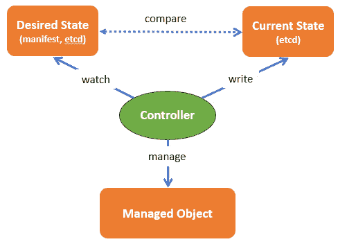

<st c="11706">图 4.1：通过 Kubernetes 控制器实现的对账和自愈设计</st>

<st c="11790">这个图表已经显示了控制器的核心</st> <st c="11826">概念和能力，强调了自动对账循环如何通过设计自动实现自愈。</st> <st c="11954">然而，控制器还有其他功能：观察集群和节点健康，强制资源限制，按计划运行作业，处理生命周期事件，并管理部署的推进</st> <st c="12161">和回滚。</st>

<st c="12175">现在，让我们讨论 Kubernetes</st> <st c="12205">操作员。</st> <st c="12217">操作员是控制器的一个子类，通常专注于特定领域。</st> <st c="12302">一个很好的例子是 OpenTelemetry 操作员，它管理 OpenTelemetry 收集器和工作负载的自动插装。</st> <st c="12430">该操作员使用相同的对账循环来确保始终应用 OpenTelemetry 的期望配置。</st> <st c="12556">如果配置更改或当前的 OpenTelemetry 收集器或插装存在问题，操作员将尽最大努力保持承诺，确保期望状态是实际状态。</st> <st c="12780">要了解更多信息，请访问 OpenTelemetry 网站</st> <st c="12827">在</st> [<st c="12830">https://opentelemetry.io/docs/kubernetes/operator/</st>](https://opentelemetry.io/docs/kubernetes/operator/)<st c="12880">。</st>

操作器的其他使用案例通常涉及管理和自动化核心服务和应用程序，如数据库、存储、服务网格、备份与恢复、CI/CD 以及消息传递系统。

如果你想了解更多关于**控制器**和**操作器**的信息，可以查看 CNCF 操作器工作组及其白皮书，网址为 [`github.com/cncf/tag-app-delivery/tree/main/operator-wg`](https://github.com/cncf/tag-app-delivery/tree/main/operator-wg)。另一个精彩的概述可以在 *Kong Blog* 上找到，标题为 *What’s the Difference: Kubernetes Controllers vs Operators*。这篇博客还列出了控制器和操作器的优秀示例：[`konghq.com/blog/learning-center/kubernetes-controllers-vs-operators`](https://konghq.com/blog/learning-center/kubernetes-controllers-vs-operators)

现在我们对控制器和操作器有了更多了解，接下来让我们看看它们是如何确保所有 Kubernetes 组件和部署具备内建弹性的！

### 由探针驱动的内建弹性

控制器持续验证我们的系统是否处于期望的状态，通过观察 Kubernetes 集群、节点和所有已部署的 Pod 的健康状况。如果其中某个组件不健康，系统会通过某些自动化操作将其恢复到健康状态。以 Pod 为例。如果 Pod 不再健康，它们最终会被重启，以确保整个系统的弹性。重启组件通常是 IT 管理员在“*我们试试关掉再开看看会发生什么*”方法下执行的默认操作。

就像 IT 管理员通常不会随意开关设备，Kubernetes 采取了更为复杂的方法来确保我们的 Kubernetes 集群、节点和工作负载的弹性。

Kubelet——Kubernetes 的核心组件之一——通过使用多种类型的探针（启动探针、就绪探针和存活探针）持续监控 Pod 的生命周期和健康状态。以下图示展示了根据启动、就绪和存活探针检查结果，Pod 可以处于的不同健康状态：

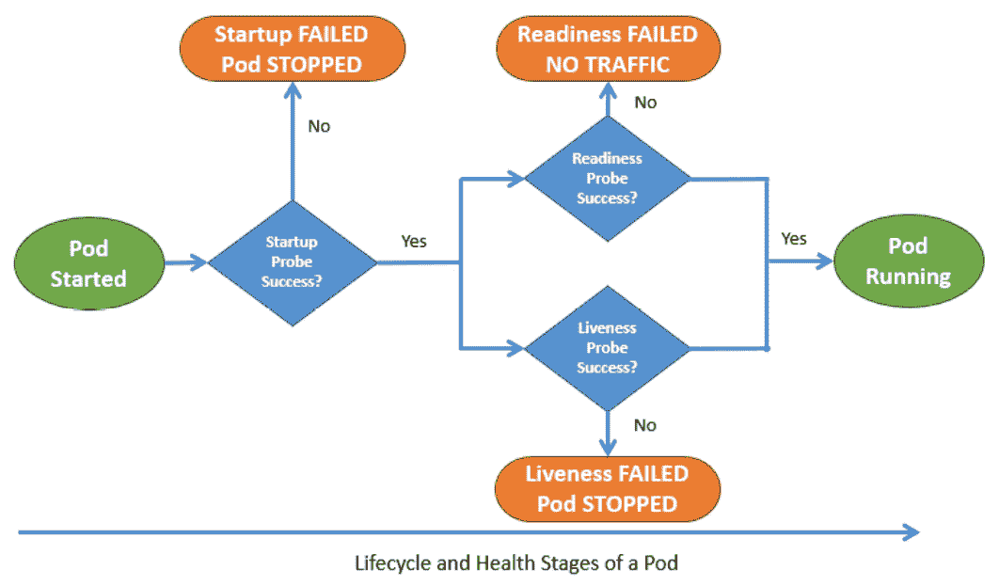

图 4.2：Kubelet 使用探针判断 Pod 健康状态

<st c="15101">一旦 Pods 不再健康，Kubernetes 会尝试重新启动 Pods，并将 Pods 恢复到健康状态。</st> <st c="15215">对于探针结果的评估和重启策略，有很多不同的设置，你必须熟悉这些设置，才能充分利用 Kubernetes 的内建弹性。</st> <st c="15431">所有这些设置都在你的 Deployment 和</st> <st c="15486">Pod 定义中声明。</st>

<st c="15502">如果你想了解</st> <st c="15524">更多关于</st> <st c="15539">Kubelet 如何管理不同的探针并查看一些最佳实践，我们建议查看一些博文，例如 Roman Belshevits 关于存活性</st> <st c="15696">探针的文章：</st> [<st c="15704">https://dev.to/otomato_io/liveness-probes-feel-the-pulse-of-the-app-133e</st>](https://dev.to/otomato_io/liveness-probes-feel-the-pulse-of-the-app-133e)

<st c="15776">另一个很好的资源是官方 Kubernetes 文档，介绍如何配置存活性、就绪性和启动</st> <st c="15889">探针：</st> [<st c="15897">https://kubernetes.io/docs/tasks/configure-pod-container/configure-liveness-readiness-startup-probes/</st>](https://kubernetes.io/docs/tasks/configure-pod-container/configure-liveness-readiness-startup-probes/)

<st c="15998">健康探针仅在 Kubernetes 内部有效</st>

<st c="16045">重要的是要理解，所有这些健康检查仅在 Kubernetes 集群内部进行，并不能告诉我们通过 Ingress 对外暴露的服务，从最终用户的角度是否也是健康的。</st> <st c="16292">最佳实践是额外从“外到内”的角度进行健康检查和可用性检查，作为外部控制。</st> <st c="16414">例如，你可以使用合成测试来验证所有暴露的端点是否可达并返回</st> <st c="16519">成功响应。</st>

<st c="16540">现在我们已经了解了 Pod 的内建弹性，接下来讨论一些更复杂的构造，例如通常由多个不同的 Pods 和其他对象组成的应用程序，</st><st c="16736">如 Ingress</st> <st c="16747">和存储。</st>

### <st c="16759">工作负载和应用生命周期编排</st>

<st c="16809">正如我们所学，Kubernetes 提供了</st> <st c="16849">内建的 Pods 生命周期编排，如</st> <st c="16919">前一节所述。</st> <st c="16938">然而，我们在 Kubernetes 上部署的业务应用通常有多个依赖的 Pods 和工作负载，这些共同构成了应用。</st> <st c="17081">以我们的 Financial One ACME 为例：支持客户的金融服务应用包含多个组件，如前端、后端、缓存、数据库和 Ingress。</st> <st c="17286">不幸的是，Kubernetes 没有应用的概念。</st> <st c="17354">尽管有多个倡议和工作组在定义应用，但我们目前必须依赖其他方法来管理应用，而这些应用是由</st> <st c="17532">多个组件组成的。</st>

<st c="17552">在</st> *<st c="17560">批处理变更以应对依赖性</st>* <st c="17599">一节中，</st> *<st c="17611">第五章</st>*<st c="17620">，我们将学习诸如 Crossplane 之类的工具。</st> <st c="17668">Crossplane 允许你定义所谓的复合应用，这使得应用所有者能够轻松定义应用的单个组件，然后部署单独的实例，如</st> <st c="17868">以下示例所示：</st>

```
 apiVersion: composites.financialone.acme/v1alpha1
kind: FinancialBackend
metadata:
  name: tenantABC-eu-west
spec:
  service-versions:
    fund-transfer: 2.34.3
    account-info: 1.17.0
  redis-cache:
    version: 7.4.2
    name: transfer-cache
    size: medium
  database:
    size: large
    name: accounts-db
  region: "eu-west"
  ingress:
    url: „https://tenantABC-eu-west.financialone.acme"
```

<st c="18240">Crossplane</st> <st c="18251">提供</st> <st c="18261">应用程序</st> <st c="18273">和基础设施编排，使用操作符模式持续确保每个应用程序实例——如在复合应用中定义——按预期运行</st> <st c="18434">。

<st c="18446">另一个我们将在</st> *<st c="18488">第五章</st>* <st c="18497">中深入了解的工具是</st> **<st c="18505">Keptn</st>** <st c="18510">CNCF 项目。</st> <st c="18525">Keptn 提供自动化的应用感知生命周期编排和可观察性。</st> <st c="18612">它让你可以声明性地定义部署前后检查（验证依赖关系、运行测试、评估健康状况、强制基于 SLO 的质量门控等），而无需编写自己的 Kubernetes 操作符来实现这些操作。</st> <st c="18869">Keptn 还提供自动化的部署可观察性，以更好地理解发生了多少次部署，成功了多少次，以及它们在哪些地方和为何失败，通过发出 OpenTelemetry 跟踪和指标，方便故障排除</st> <st c="19099">和报告。</st>

<st c="19113">Kubernetes 提供了构建韧性系统的许多基础构件。</st> <st c="19195">虽然你可以编写自己的操作员来扩展到你自己的问题领域，但你也可以使用现有的 CNCF 工具，例如</st> <st c="19318">Crossplane</st> <st c="19332">或 Keptn，因为它们提供了一种更简单的声明性方式，应用承诺理论的概念，来处理</st> <st c="19426">更复杂的</st> <st c="19439">应用程序和</st> <st c="19456">基础设施组成。</st>

<st c="19484">重启组件是确保系统韧性的一种方式，但还有更多的方法。</st> <st c="19562">让我们来看看自动扩展，它解决了动态环境中另一个关键的</st> <st c="19627">问题！</st>

### <st c="19659">自动扩展集群和工作负载</st>

<st c="19695">在大多数行业中，系统预期的负载在一年中的每一天分布不均。</st> <st c="19725">总会有某种季节性波动：零售在黑色星期五和网络星期一有激增，税务服务在报税日有激增，金融服务通常在发放工资时会有激增。</st> <st c="19986">我们的 Financial One ACME 客户也面临同样的情况。</st> <st c="20045">作为一个金融服务组织，始终会有来自终端用户的基本流量，但在月初和月末</st> <st c="20187">会有流量激增。</st>

<st c="20197">Kubernetes</st> <st c="20209">提供了几种扩展应用</st> <st c="20251">工作负载的方式：手动（例如，设置 ReplicaSets）或通过工具自动扩展，如</st> **<st c="20339">Horizontal Pod Autoscaler</st>** <st c="20364">(</st>**<st c="20366">HPA</st>**<st c="20369">)、</st> **<st c="20373">Vertical Pod Autoscaler</st>** <st c="20396">(</st>**<st c="20398">VPA</st>**<st c="20401">)，或者</st> **<st c="20408">Kubernetes Event Driven Autoscaler</st>** <st c="20442">(</st>**<st c="20444">KEDA</st>**<st c="20448">)。</st> <st c="20452">这些</st> <st c="20457">扩展选项允许你在工作负载的 CPU 或内存不足时、应用程序流量激增时，或者响应时间开始</st> <st c="20624">增加时进行扩展！</st>

<st c="20636">除了工作负载，你还可以并且很可能需要通过工具来扩展你的集群和节点的规模，</st> <st c="20749">例如</st> **<st c="20757">Cluster Autoscaler</st>** <st c="20775">(</st>**<st c="20777">CA</st>**<st c="20779">) 或</st> **<st c="20785">Karpenter</st>** *<st c="20794">[2]</st>*<st c="20798">，或者通过你所使用的托管 Kubernetes 云服务提供的选项。</st>

<st c="20870">作为一个平台工程团队，你需要熟悉所有不同的选项，同时也要注意所有的</st> <st c="20994">考虑因素：</st>

+   **<st c="21013">设置限制</st>**<st c="21028">：不要允许应用程序无限制地扩展。</st> <st c="21076">您可以选择为每个应用程序、工作负载、命名空间等强制执行最大限制。</st>

+   **<st c="21167">成本控制</st>**<st c="21180">：自动扩展是很棒的，但也有其成本。</st> <st c="21226">确保将成本报告给</st> <st c="21259">应用程序所有者。</st>

+   **<st c="21278">缩小规模</st>**<st c="21289">：扩展很容易！</st> <st c="21312">确保同时定义何时缩小规模的指标。</st> <st c="21372">这样</st> <st c="21377">可以保持成本</st> <st c="21393">在可控范围内。</st>

<st c="21407">要了解更多信息，请查看以下</st> <st c="21452">文档：</st> [<st c="21467">https://kubernetes.io/docs/concepts/workloads/autoscaling/</st>](https://kubernetes.io/docs/concepts/workloads/autoscaling/)

<st c="21525">现在我们已经了解了在 Kubernetes 环境中扩展的选项，那么如何扩展到其他</st><st c="21626">Kubernetes 集群呢？</st> <st c="21646">我们来看看这个问题。</st>

### <st c="21666">一次声明——到处运行（理论上）</st>

<st c="21706">Kubernetes 作为开放标准的承诺是，任何声明的状态（Ingress、工作负载、机密、存储、网络等）无论是在单一集群中运行，还是在多个集群中运行以满足特定需求（如阶段分离：开发、预发布和生产，或区域分离：美国、欧洲，</st> <st c="22054">亚洲等）都会表现相同。</st>

<st c="22064">无论是操作您自己的 Kubernetes 集群，使用 OpenShift，还是使用云供应商提供的托管 Kubernetes 服务，这一承诺在理论上都是成立的。</st> <st c="22234">那么，*<st c="22244">在理论上</st>*<st c="22253">是什么意思呢？</st> <st c="22265">不同的服务之间确实有一些具体的技术差异，您需要加以考虑。</st> <st c="22380">根据不同的服务，网络或存储可能会有所不同，因为底层实现依赖于云供应商。</st> <st c="22525">某些服务还会提供核心 Kubernetes 服务、服务网格和运维工具的特定版本，这些都会随着托管安装一起提供。</st> <st c="22680">一些服务要求您使用供应商特定的注释来配置某些服务的行为。</st> <st c="22789">这就是为什么在不同供应商之间应用相同的声明式状态定义理论上是可行的——但实际上，您需要考虑一些小的差异，并进行一些</st> *<st c="22878">在理论上</st>*<st c="22887">的调整，这些差异需要特定的供应商配置！</st>

<st c="23004">由于技术细节和差异不断变化，因此在本书中提供当前的对比并不合适。</st> <st c="23161">您必须理解的是，尽管理论上您可以将任何 Kubernetes 对象部署到任何版本的 Kubernetes 上，但结果和行为可能会有所不同，具体取决于您部署的环境。</st> <st c="23377">这就是为什么我们建议对所选的 Kubernetes 目标平台进行一些技术研究，并了解它与其他平台的差异，特别是当您想要进行多云/多 Kubernetes 部署时，因为相同的 Kubernetes 对象可能会有</st> <st c="23616">细微的差异！</st>

<st c="23637">好消息是</st> <st c="23655">全球社区正在通过提供更好的指导和工具来解决这个问题，使得</st> *<st c="23765">声明一次——随处运行</st>* <st c="23792">的承诺</st> <st c="23801">成为现实。</st>

<st c="23811">我们已经看到了选择 Kubernetes 作为核心平台的许多好处。</st> <st c="23894">然而，还有另一个重要的原因，解释了为什么 Kubernetes 在过去 10 年里自首次发布以来获得了如此广泛的采用：那就是全球社区和</st> <st c="24017">CNCF！</st>

## <st c="24059">全球社区和 CNCF</st>

<st c="24085">Kubernetes</st> <st c="24096">于 2014 年 6 月由 Google 宣布，版本 1.0 于 2015 年 7 月 21 日发布。</st> <st c="24182">随后，Google 与 Linux 基金会合作，并成立了 CNCF，将 Kubernetes 作为其初始项目！</st> <st c="24287">自那时以来，社区和项目迅速席卷了全球！</st>

<st c="24360">十年后（在撰写本书时），CNCF 拥有 188 个项目，244,000 名贡献者，1660 万次贡献，成员遍布全球 193 个国家。</st> <st c="24529">许多介绍 Kubernetes 和 CNCF 的演示文稿通常从展示 CNCF</st> <st c="24582">的生态图开始：</st> [<st c="24630">https://landscape.cncf.io/</st>](https://landscape.cncf.io/)

<st c="24656">虽然生态图令人印象深刻，但它也成为了许多关于如何在这个全球社区的所有项目中导航的艰难和复杂性的梗的来源。</st> <st c="24846">然而，不要害怕。</st> <st c="24872">全球 CNCF 社区是 Linux 基金会的一部分，其使命是为快速发展的云原生项目提供支持、监督和指导，包括 Kubernetes、Envoy、</st> <st c="25064">和 Prometheus。</st>

<st c="25079">以下是您需要注意的一些事项，它们将帮助您在不断增长的 CNCF 项目列表中导航：</st>

+   **<st c="25225">项目状态</st>**<st c="25240">：CNCF</st> <st c="25248">会积极跟踪每个项目的状态和活动。</st> <st c="25306">贡献者和采纳者的数量，以及项目的开发活跃度，是你是否应该进一步关注某个项目的良好指标。</st> <st c="25467">如果一个项目处于停滞状态，只有一个维护者，或者几乎没有采纳者，那么对于你选择长期支持的平台工具而言，可能并没有什么用处。</st> <st c="25644">你的平台。</st>

+   **<st c="25658">成熟度级别</st>**<st c="25673">：CNCF 还指定了成熟度级别</st> <st c="25716">，包括沙箱、孵化、或已毕业，分别对应于《创新者的窄道》中的创新者、早期采纳者和早期多数这几个层级</st> <st c="25836">的</st> *<st c="25840">跨越鸿沟</st>* <st c="25858">图表（</st>[<st c="25868">https://en.wikipedia.org/wiki/Crossing_the_Chasm</st>](https://en.wikipedia.org/wiki/Crossing_the_Chasm)<st c="25917">）。</st> <st c="25921">已毕业的项目已经在多个行业广泛采纳，是其支持的用例的安全选择。</st> <st c="26045">孵化中的项目已经从技术试验场跨越到获得良好采纳，并且维护者的数量也在不断增长，维护者的背景也日益多样化。</st> <st c="26189">想了解更多关于 CNCF 成熟度的标准，并查看各项目处于哪个级别，可以访问官方站点</st> <st c="26302">：</st> [<st c="26305">https://www.cncf.io/project-metrics/</st>](https://www.cncf.io/project-metrics/)<st c="26341">。</st>

+   `<st c="26512">ADOPTERS.md</st>` <st c="26523">文件，几乎每个 CNCF 项目在其 GitHub 仓库中都有。</st> <st c="26595">如果你决定采纳这些项目中的一个，我们鼓励你通过提交拉取请求将你的名字添加到采纳者名单中。</st> <st c="26734">这不仅有助于项目，也有助于其他组织决定该项目是否</st> <st c="26824">值得追求！</st>

<st c="26839">Kubernetes 至关重要，因为它有一个强大的社区</st>

<st c="26884">尽管 Kubernetes 拥有强大的技术基础，但正是过去 10 多年中建立起来的社区和生态系统使 Kubernetes 成为平台工程师将其作为</st> <st c="27093">核心平台的可行选择。</st>

<st c="27107">我们现在已经更清楚地理解了 Kelsey Hightower 所说的：“</st>*<st c="27182">Kubernetes 是一个用来构建平台的平台。</st> <st c="27228">这是一个开始，但不是最终目标</st>*<st c="27260">。”选择 Kubernetes 作为核心平台有很多好处，特别是因为它是基于</st> *<st c="27375">承诺理论</st>*<st c="27389">的概念构建的。Kubernetes 提供了组件的自动化弹性、扩展性和生命周期管理。</st> <st c="27483">不断壮大的社区通过数百个开源 CNCF 项目为许多常见问题提供了解决方案，任何组织</st> <st c="27623">都可以使用。</st>

<st c="27631">虽然我们通常关注 Kubernetes 在部署和编排应用程序方面的好处，但让我们看看如何利用 Kubernetes 将我们的基础设施能力提升到未来平台！</st>

# <st c="27840">利用和管理 Kubernetes 基础设施能力</st>

<st c="27903">回顾一下</st> *<st c="27912">第二章</st>*<st c="27921">，你已经了解了平台参考组件模型和能力平面。</st> <st c="28012">当我们谈论将基础设施能力提升到 Kubernetes 时，最终用户在使用该平台时会意识到这些能力。</st> <st c="28163">我们必须区分需要与 Kubernetes 集成的资源和那些通过规范配置并部署到 Kubernetes 的资源，以及在集群外部操作或创建的新资源。</st> <st c="28373">在下图中，您可以找到需要坚实集成的资源整合和网络部分的示例；否则，它们会主动阻碍平台的有用性和</st> <st c="28548">功能。</st>

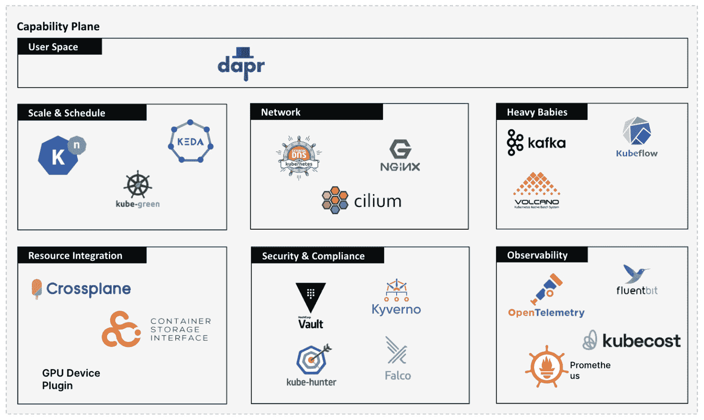

<st c="28825">图 4.3：带有示例工具的能力平面</st>

## <st c="28872">集成基础设施资源</st>

<st c="28909">我们将讨论平台底层技术的基本组件和你必须做出的设计决策。</st> <st c="29026">首先，由于 Kubernetes 的强大，你在工具选择上更加灵活，并可以根据需要进行扩展。</st> <st c="29128">当你调整平台能力以适应不同</st> <st c="29181">的使用案例时，这尤其有帮助。</st>

### <st c="29229">容器存储接口</st>

<st c="29257">该</st> **<st c="29262">容器存储接口</st>** <st c="29289">(</st>**<st c="29291">CSI</st>**<st c="29294">) 提供</st> <st c="29306">对附加到集群或运行集群的节点的存储技术的访问。</st> <st c="29405">在 CSI 开发者文档中</st> *<st c="29440">[3]</st>*<st c="29443">，你可以找到几乎所有存储提供商的驱动程序。</st> <st c="29502">该列表包含</st> <st c="29520">云提供商的驱动程序，例如 AWS</st> **<st c="29555">弹性块存储</st>** <st c="29576">(</st>**<st c="29578">EBS</st>**<st c="29581">)，软件定义存储如 Ceph，或者商用解决方案如 NetApp 的连接器。</st> <st c="29680">此外，CSI 驱动程序还支持特定工具的驱动程序，如 cert-manager 和 HashiCorp Vault。</st> <st c="29786">简而言之，CSI 对于任何需要存活时间超过其所属容器且未存储在数据库中的数据至关重要，或者对于</st> <st c="29932">数据库存储是必需的。</st>

<st c="29949">驱动程序的安装依赖于基础设施和存储技术。</st> <st c="30035">例如，对于云提供商，你通常需要</st> <st c="30090">以下内容：</st>

+   <st c="30104">服务帐户或</st> <st c="30126">权限策略</st>

+   <st c="30145">启动污点</st> <st c="30179">和容忍配置</st>

+   <st c="30194">预安装的</st> <st c="30209">外部快照工具</st>

+   <st c="30229">驱动程序</st> <st c="30241">安装本身</st>

<st c="30260">由于其复杂性，这些组件通常通过 Helm 或其他软件包管理工具进行部署。</st> <st c="30365">有时，它们需要更多的节点权限，这在平台设计时可能带来安全隐患。</st> <st c="30479">你还需要考虑如何访问存储：</st>

+   **<st c="30539">ReadWriteOnce</st>** <st c="30553">(</st>**<st c="30555">RWO</st>**<st c="30558">)：一个</st> <st c="30566">Pod 声明了一部分可用存储，它可以进行读写操作，而其他 Pods 不能访问该存储，除非原 Pod 释放</st> <st c="30717">该存储。</st>

+   **<st c="30729">ReadWriteMany</st>** <st c="30743">(</st>**<st c="30745">RWM</st>**<st c="30748">)：多个</st> <st c="30761">Pods 可以声明一部分可用存储。</st> <st c="30814">它们可以进行读写操作，并与其他 Pods 共享该存储。</st>

+   **<st c="30880">ReadOnlyMany</st>** <st c="30893">(</st>**<st c="30895">ROM</st>**<st c="30898">)：多个</st> <st c="30910">Pods 可以声明一部分存储，但只能从中读取数据。</st> <st c="30971">从中读取。</st>

+   **<st c="30979">ReadWriteOncePod</st>** <st c="30996">(</st>**<st c="30998">RWOP</st>**<st c="31002">)：仅能被一个 Pod 声明；没有其他 Pod 可以占用它，并允许读写操作。</st>

<st c="31104">CSI 驱动程序的概述提供了更多关于哪些访问模式被支持的信息。</st> <st c="31202">由于没有一刀切的解决方案，你需要将你的选项透明地展示给用户，并解释如何</st> <st c="31318">使用它们。</st>

<st c="31327">用户需要了解和理解的核心元素是</st> `<st c="31391">StorageClass</st>`<st c="31403">，</st> `<st c="31405">PersistentVolume</st>`<st c="31421">，以及</st> `<st c="31427">PersistentVolumeClaim</st>`<st c="31448">。当一个 Pod/Deployment 需要一个卷时，</st> `<st c="31491">StorageClass</st>` <st c="31503">将触发新卷的创建。</st> <st c="31547">如果一个 Pod/Deployment 已经声明了一个卷，而且它没有被销毁，Kubernetes 控制平面将会重新分配该卷给</st> <st c="31694">Pod/Deployment。</st>

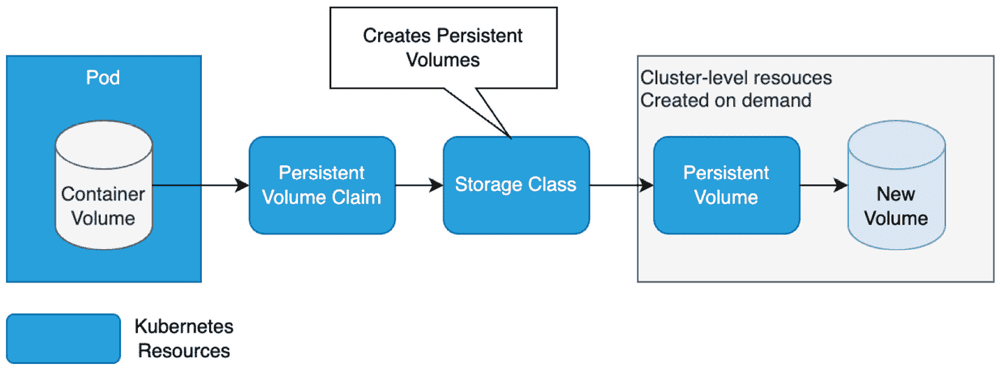

<st c="31893">图 4.4：动态配置新的持久卷</st>

<st c="31952">你作为平台团队定义</st> `<st c="31964">StorageClass</st>` <st c="31976">，理想情况下，与存储专家合作。</st> <st c="32048">以下示例突出显示了</st> `<st c="32106">StorageClass</st>`<st c="32118">的常见定义。配置中有很多容易出错的地方；例如，未设置</st> `<st c="32208">reclaimPolicy</st>` <st c="32221">将默认删除后创建并附加的卷。</st> <st c="32286">然而，</st> `<st c="32295">StorageClass</st>` <st c="32307">支持你为用户请求的</st> `<st c="32375">PersistantVolumeClaim</st>` <st c="32396">动态创建卷，因此是自助服务的强大推动力：</st>

```
 apiVersion: storage.k8s.io/v1
kind: StorageClass
metadata:
  name: ultra-fast
  annotations:
    storageclass.kubernetes.io/is-default-class: "false"
provisioner: csi-driver.example-vendor.example
reclaimPolicy: Retain # default value is Delete
allowVolumeExpansion: true
mountOptions:
  - discard
volumeBindingMode: WaitForFirstConsumer
parameters:
  guaranteedReadWriteLatency: "true" # provider-specific
```

<st c="32842">这带来的缺点是你需要考虑人为错误，错误可能会导致存储被填满，从而使</st><st c="32936">平台崩溃，直到</st> <st c="32977">系统冻结。</st>

### <st c="32992">CSI 挑战</st>

<st c="33007">CSI 的定义是</st> <st c="33035">一种相对较新的方法，但存储管理和软件定义存储的底层技术比 Kubernetes 要早得多。</st> <st c="33172">我们还可以在许多 CSI 驱动程序中发现这一点，它们不过是对传统代码的封装。</st> <st c="33270">对于那些不太灵活且可扩展性较差的集群来说，这可能不是问题，但在你有大量活动的环境中，你可不想让 CSI 成为系统中的瓶颈。</st> <st c="33474">一些 CSI 甚至有限制和约束，以防止它们在规模扩展时失败。</st> <st c="33558">公平地说，我们通常会看到这种情况出现在本地安装和一些老旧的存储技术中。</st> <st c="33656">对于这些，我们还可以考虑</st> **<st c="33683">逻辑单元号</st>** <st c="33702">(</st>**<st c="33704">LUN</st>**<st c="33707">)</st> <st c="33727">的呈现和连接限制。</st> <st c="33779">LUN 是 Pod 从存储空间请求并获取数据的方式。</st> <st c="33858">物理服务器与存储之间的连接数量是有限制的。</st> <st c="33942">同样，当您管理自己的存储</st> <st c="34000">和 SAN 时，这一点尤为重要。</st>

<st c="34009">为什么有些 CSI 这么差劲？</st> <st c="34037">CSI 不仅仅是提供存储容量。</st> <st c="34086">它与存储提供者进行通信，承诺提供所需的容量，并等待 RAID 控制器、备份和快照机制准备就绪。</st> <st c="34261">在大规模存储系统中，我们还会看到更多：我们可以找到存储容量分配和</st> <st c="34355">优化过程。</st>

<st c="34379">为了克服这些问题，您需要评估存储，特别是其云原生存储能力的存储驱动程序。</st> <st c="34515">这将需要进行大规模的性能测试，并创建大量的卷。</st> <st c="34607">CSI 驱动程序不应做任何削减或性能下降，创建的卷应处于</st> <st c="34711">毫秒级别。</st>

<st c="34728">此外，确保驱动程序支持跨存储和跨云/基础设施迁移；提供不同基础设施之间的同步和异步复制；提供各站点之间的功能对等；并在需要时支持本地存储类型，例如</st> <st c="35013">边缘场景。</st>

<st c="35028">一个好的 CSI 将使您的平台能够</st> <st c="35069">在任何地方运行，并支持广泛的</st> <st c="35117">使用场景。</st>

### <st c="35127">容器网络接口</st>

**<st c="35155">容器网络接口</st>** <st c="35160">（**CNI**）</st> <st c="35187">可以成为平台最相关的组件，但它也是最被低估的组件。</st> <st c="35284">在我们看到的许多项目中，一些平台团队并不关心他们使用什么作为 CNI，也不太利用网络策略、加密或细粒度的网络配置。</st> <st c="35467">由于它对网络层的简单抽象，刚开始使用时并不会让人感到压倒性。</st> <st c="35566">然而，另一方面，有许多用例中，最关键的组件就是 CNI。</st> <st c="35660">我甚至见过因为 CNI 的动态特性与传统的网络实现方法不兼容而导致项目失败。</st>

<st c="35824">CNI 总是需要专门的实现，因为它是一套规范和库，用于编写插件来配置网络接口。</st> <st c="35979">CNI 只关注 Linux 容器的网络连接，并在容器被删除时清除分配的资源。</st> <st c="36122">由于这一点，CNI 有广泛的支持，并且其规范实现简单。</st> <st c="36210">易于实现。</st>

<st c="36223">因此，我们作为架构师绝不应将 CNI 视为“</st>*<st c="36280">Kubernetes 中的另一个对象</st>*<st c="36314">。” 我们必须评估并引入它。</st> <st c="36355">一些 CNI 旨在简化维护，提供一个坚固但简单的功能集。</st> <st c="36435">例如，如果主要关注的是第 3 层，考虑使用 Flannel。</st> <st c="36502">其他 CNI，如 Calico，是一个坚实的选择，功能丰富；Cilium 则引入了 eBPF 的使用，提供更快速、更安全的网络连接。</st> <st c="36666">如果你因为可能有其他需求，如提供不同级别的网络，而仍然难以选择，可以选择社区为你提供的解决方案：Multus。</st> <st c="36871">慢慢思考并探索你的选项。</st> <st c="36913">有成百上千</st> <st c="36930">种 CNI。</st>

<st c="36938">CNI 对</st> <st c="36975">你的平台可能有重要影响：</st>

+   **<st c="36990">安全性</st>**<st c="36999">：CNI 可以提供不同的网络策略功能，以实现对网络的细粒度控制。</st> <st c="37114">它们可以具备额外的加密功能，集成身份和访问管理系统，以及</st> <st c="37222">详细的可观测性。</st>

+   **<st c="37245">可扩展性</st>**<st c="37257">：集群规模越大，网络中的通信就越频繁。</st> <st c="37344">CNI 必须支持你的增长目标，即使在复杂的路由和数据传输下仍然保持高效。</st>

+   **<st c="37459">性能</st>**<st c="37471">：Pod 之间的通信有多快和直接？</st> <st c="37527">CNI 引入了多少复杂性？</st> <st c="37571">它能多高效地处理通信？</st> <st c="37616">它能处理很多复杂的</st> <st c="37646">网络策略吗？</st>

+   **<st c="37663">可操作性</st>**<st c="37675">：高级 CNI 不是很侵入式，且易于维护。</st> <st c="37741">强大的 CNI 理论上可以被替换，只要它们遵循 CNI 规范，但每个 CNI 都有自己的一套功能，这些功能往往是</st> <st c="37893">无法替代的。</st>

<st c="37909">请注意，并非所有的</st> <st c="37934">CNI 都支持这些功能。</st> <st c="37970">例如，有些甚至不提供网络策略支持。</st> <st c="38033">其他 CNI 是云提供商特定的，只与一个云提供商集成，</st> <st c="38113">并且它们确实启用一些以云提供商为中心的功能。</st>

### <st c="38173">架构挑战 – CNI 链式调用与多个 CNI</st>

<st c="38231">平台非常适合 CNI 链式调用。</st> <st c="38276">CNI 链式调用</st> <st c="38288">引入了多个 CNI 的顺序使用。</st> <st c="38323">CNIs 的使用顺序及其目的在</st> `<st c="38412">/etc/cni/net.d</st>` <st c="38426">目录中定义，并由 kubelet 处理。</st> <st c="38465">这允许平台团队处理网络的一部分，并提供一种受控的方法，而平台用户则可以在更高的层次上自由配置他们的网络。</st> <st c="38636">例如，平台用户可以访问 Antrea 作为 CNI，以某种程度上配置他们的网络。</st> <st c="38738">他们还可以应用网络策略和出口配置，以防止他们的应用与所有人进行通信。</st> <st c="38859">在平台的另一侧，平台工程团队将通过 Cilium 管理全局跨集群通信以及网络加密，以执行安全最佳实践。</st> <st c="39060">此外，Cilium 提供的可见网络数据将提供给运营和安全团队。</st> <st c="39172">这些用例最适合与云提供商自己的 CNI 进行交互。</st> <st c="39270">它们通常能够更好地将平台与云集成，但在另一面缺乏许多高级功能。</st> <st c="39381">其他方面的功能则较少。</st>

<st c="39392">另一个待评估的方法是通过 Multus 或 CNI-Genie 为 Pod 分配多个网络接口。</st> <st c="39504">通常，Pod 只有一个接口，但例如使用 Multus 时，这可以是多个网络接口。</st> <st c="39617">什么时候这变得相关？</st> <st c="39649">以下实例是它变得相关的示例：</st> <st c="39694">变得相关：</st>

+   <st c="39711">将控制数据和操作数据与</st> <st c="39757">应用数据分离</st>

+   <st c="39773">为极为</st> <st c="39826">异构的工作负载提供灵活的网络选项</st>

+   <st c="39848">通过为每个租户分配完全不同的网络，将多租户架构提升到一个新水平</st>

+   <st c="39945">支持不寻常的网络协议和连接，例如在边缘场景或</st> <st c="40029">电信环境中</st>

+   **<st c="40047">网络功能虚拟化</st>** <st c="40079">(</st>**<st c="40081">NFV</st>**<st c="40084">)，由于</st> <st c="40093">其复杂性</st> <st c="40128">，需要多个网络</st>

<st c="40142">Multus CNI</st> <st c="40157">是一种位于节点上的元插件，处于实际 CNI 和 Pod 网络接口之间，如下图所示。</st> <st c="40300">它一方面将不同的网络接口连接到 Pod，另一方面处理与预期 CNI 的连接，以确保正确的网络接口。</st> <st c="40458">的连接。</st>

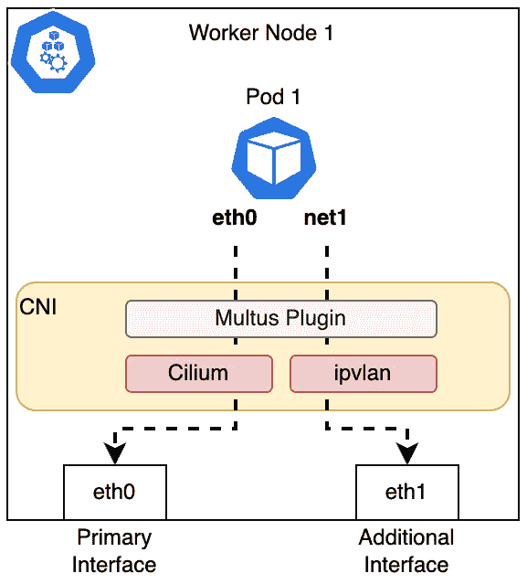

<st c="40544">图 4.5：Multus 元 CNI 插件</st>

<st c="40578">这两种方法都必须进行充分评估。</st> <st c="40619">它们对网络的复杂性、性能</st> <st c="40641">和安全性有重大影响。</st>

### <st c="40705">提供不同的 CPU 架构</st>

<st c="40743">Kubernetes 支持</st> <st c="40764">多种 CPU 架构：AMD64、ARM64、386、ARM、ppc64le，甚至包括使用 s390x 的大型机。</st> <st c="40857">目前许多集群运行在 AMD64 架构上，但在本文写作时，ARM64 正受到强烈关注，导致这一趋势的变化。</st> <st c="40966">本讨论主要关于节省成本并获得一些额外性能，同时减少总体电力消耗。</st> <st c="41104">至少在理论上，这是一个三赢的局面。</st> <st c="41154">不仅 ARM64 是基础设施可能发生的变化，开源架构项目 RISC-V 也在加速发展，并且是第一个创建 RISC-V</st> <st c="41327">服务</st> *<st c="41337">[4]</st>*<st c="41340">的云服务提供商。</st>

<st c="41341">作为平台工程师，我们可以启用这些迁移和变化。</st> <st c="41409">Kubernetes 集群可以同时运行多种架构——不是在同一个节点上，而是在不同的节点组中。</st> <st c="41533">请记住，这一变化也需要容器构建方面的调整。</st> <st c="41611">对于某些软件组件，你可以进行多架构构建；而对于其他组件，可能需要在为不同架构创建容器之前进行调整。</st> <st c="41777">容器才可以创建。</st>

<st c="41788">要选择一个部署应该交付到的架构，你只需要在</st> `<st c="41882">nodeSelector</st>` <st c="41894">中像这样添加</st> `<st c="41912">Spec</st>` <st c="41916">部分到部署</st> <st c="41943">YAML 文件：</st>

```
 nodeSelector:
        kubernetes.io/arch: arm64
```

<st c="41993">提供不同容器镜像的一个即将到来的替代方案是将软件编译为</st> **<st c="42089">WebAssembly</st>** <st c="42100">(</st>**<st c="42102">Wasm</st>**<st c="42106">) 容器。</st>

### <st c="42119">Wasm 运行时</st>

<st c="42132">作为一种替代容器格式，Wasm 的使用在过去一年中大幅增加。</st> <st c="42230">Wasm 是一种面向栈式虚拟机的二进制指令格式。</st> <st c="42301">可以把它看作是各种编程语言和多种不同执行环境之间的中间层。</st> <st c="42419">你可以将用超过 30 种不同语言编写的代码编译成一个</st> `<st c="42495">*.wasm</st>` <st c="42501">文件，然后在任何</st> <st c="42542">Wasm 运行时上执行该文件。</st>

<st c="42555">然而，名称</st> *<st c="42565">WebAssembly</st>*<st c="42576">是具有误导性的。</st> <st c="42602">最初设计是为了让代码在网页上快速运行，但今天它可以在任何地方运行。</st> <st c="42686">我们为什么要使用它？</st> <st c="42708">Wasm 默认是安全且沙盒化的。</st> <st c="42749">在一个 Wasm 容器中，除了经过编译的二进制代码外，没有操作系统或其他任何东西。</st> <st c="42849">这意味着没有可以破坏或窃取上下文或服务帐户的东西。</st> <st c="42937">Wasm 还具有极快的启动时间，其限制由运行时设置，而不是模块。</st> <st c="43047">一些运行时声称启动速度可达到大约 50 毫秒。</st> <st c="43098">相比之下，你的大脑需要超过 110 毫秒才能识别某物是否在你眼前经过。</st> <st c="43202">此外，Wasm 容器的大小大约是 0.5 MB – 1.5 MB，而一个非常精简的容器可能约为 5 MB。</st> <st c="43314">然而，我们在市场上看到的通常是 300 MB – 600 MB，1 GB – 3 GB，甚至有时超过 10 GB 的镜像大小。</st> <st c="43453">通过减小镜像大小，Wasm 容器的存储占用也大大减少。</st> <st c="43550">Wasm 还具有硬件独立性。</st> <st c="43585">相同的镜像可以在任何地方运行，只要你有一个可用的 Wasm</st> <st c="43651">运行时。</st>

<st c="43669">在 Kubernetes 环境中，OCI 和 CRI 运行时支持 Wasm。</st> <st c="43739">这意味着你可以同时运行一个 Wasm 容器和一个常规容器。</st> <st c="43810">如以下图所示，不需要做进一步的修改。</st> <st c="43883">Wasm 应用镜像存储在节点级别，并由上层执行。</st>

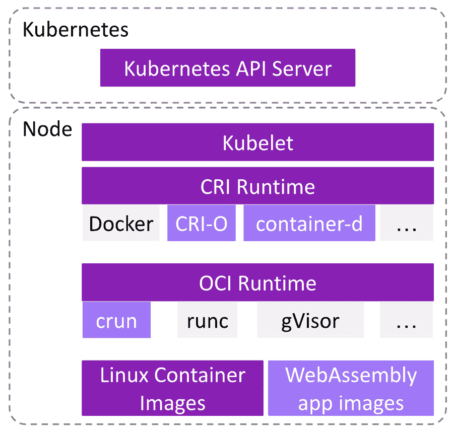

<st c="44087">图 4.6：Wasm 在 Kubernetes 节点上</st>

<st c="44124">为了使</st> <st c="44133">Wasm 可执行并在你的平台上可用，你需要指定一个运行时类并在部署/Pod 级别定义其使用。</st> <st c="44267">在以下示例中，你可以看到左侧指定了</st> `<st c="44327">crun</st>` <st c="44331">作为</st> `<st c="44335">RuntimeClass</st>`，右侧则是一个</st> `<st c="44372">Pod</st>` <st c="44375">定义，其中</st> `<st c="44398">spec.runtimeClassName</st>`<st c="44419">的值为</st> `<st c="44431">crun</st>` <st c="44435">。</st> <st c="44455">对于</st> `<st c="44459">crun</st>`<st c="44463">，我们还需要添加一个注释来告知</st> `<st c="44509">crun</st>` <st c="44513">该</st> `<st c="44524">Pod</st>` <st c="44527">具有一个</st> <st c="44534">Wasm 镜像：</st>

| `<st c="44545">apiVersion: node.k8s.io/v1</st>``<st c="44572">kind: RuntimeClass</st>``<st c="44591">metadata:</st>``<st c="44601">name: crun</st>``<st c="44612">scheduling:</st>``<st c="44624">nodeSelector:</st>``<st c="44638">runtime: crun</st>``<st c="44652">handler: crun</st>` | `<st c="44666">apiVersion: v1</st>``<st c="44681">kind: Pod</st>``<st c="44691">metadata:</st>``**<st c="44701">name: wasm-demo-app</st>**` **`**<st c="44721">annotations:</st>**`

**`**<st c="44734">module.wasm.image/variant: compat</st>**`

**`<st c="44768">spec:</st>`

`**<st c="44774">runtimeClassName: crun</st>**`

**`**<st c="44797">容器：</st>**`

**`**<st c="44809">name: wasm-demo-app</st>**`

**`**<st c="44829">image:</st>**`

**`**<st c="44836">docker.io/cr7258/wasm-demo-app:v1</st>**`**************  |

<st c="44870">表 4.1：定义一个将在 Wasm 运行时执行的 RuntimeClass 和 Pod</st>

<st c="44962">作为替代方案，像 SpinKube 这样的新开发</st> <st c="45023">提供了一整套工具来以最佳方式利用 Kubernetes 资源</st> *<st c="45106">[5]</st>*<st c="45109">。这种方法使得开发体验能够与 Wasm 容器化应用的部署和执行紧密集成。</st> <st c="45247">下图展示了工作流以及不同组件如何协同工作。</st> <st c="45334">它使开发过程变得简单直观，并为</st> <st c="45439">平台带来了一个快速但稳定的新运行时环境。</st>

![图 4.7：SpinKube 概览 [6]](img/Figure_4.07_B31164.jpg)

<st c="46231">图 4.7：SpinKube 概览 [6]</st>

<st c="46264">然而，Wasm</st> <st c="46281">真的是业界已经采纳的技术吗？</st> <st c="46333">以下是一些展示</st> <st c="46383">其采用情况的示例和用例：</st>

+   **`<st c="46396">互操作性</st>**<st c="46413">：Figma 作为 Wasm 在</st> <st c="46438">任何计算机上运行</st>

+   **<st c="46450">插件系统</st>**<st c="46464">：您可以为 Envoy 编写 Wasm 扩展</st>

+   **<st c="46509">沙箱</st>**<st c="46520">：Firefox 或 Chrome 浏览器可以在沙箱环境中运行 Wasm，以保护</st> <st c="46602">您的系统</st>

+   **<st c="46613">区块链</st>**<st c="46624">：CosmWasm 或 ICP 使用 Wasm 的版本来</st> <st c="46672">运行应用程序</st>

+   **<st c="46688">容器</st>**<st c="46698">：WasmCloud 执行容器的概念不同，或者是 SpinKube，一个具有 CLI 的 Wasm 运行时，提供简单的</st> <st c="46810">开发流程</st>

+   **<st c="46829">无服务器平台</st>**<st c="46850">：Cloudflare Workers 或 Fermyon Cloud 运行您的</st> <st c="46898">Wasm 应用</st>

<st c="46910">Wasm 目前还不能替代容器。</st> <st c="46952">它是一个进化的步骤，非常适合一些特定的应用场景，但它尚未得到广泛采用，并且在调试过程中存在问题。</st> <st c="47076">然而，这些障碍的解决只是时间问题。</st> <st c="47131">它们会得到解决。</st>

### <st c="47142">为 GPU 利用启用平台</st>

<st c="47179">类似于对不同 CPU 架构的支持，或者将容器运行时扩展到包括 Wasm，GPU 的支持</st> <st c="47308">最近对用户变得极为相关。</st> <st c="47357">必须安装特定于 GPU 类型的设备插件，如 AMD、Intel 或 Nvidia。</st> <st c="47459">这将向 Kubernetes 及其用户暴露自定义可调度资源，如</st> `<st c="47509">nvidia.com/gpu</st>` <st c="47523">。</st> <st c="47553">此外，我们不是 GPU 及其功能的专家；从平台工程的角度来看，不同的供应商为其插件开发了不同的功能集和扩展。</st>

<st c="47744">如果您的用户需要 GPU，我强烈建议开发或者寻找该领域的专家。</st> <st c="47837">AI 和 LLM 的领域正在迅速扩展。</st> <st c="47893">硬件和软件提供商每月都会推出新工具、新系统和新方法，以便充分利用这些技术。</st> <st c="48022">任何场景都有其非常具体的需求。</st> <st c="48070">训练一个模型需要大量的数据、GPU、存储和内存。</st> <st c="48152">微调一个模型主要取决于您想训练的模型有多大。</st> <st c="48233">一个七十亿参数的模型可以适应 14 GB 的 VRAM，但提高精度可能会轻松将其大小增加到 24 GB 或更多。</st> <st c="48368">最后，为用户提供推理引擎以服务 LLM 需要大量的</st> <st c="48450">网络通信。</st>

<st c="48472">重要提示</st>

<st c="48487">推理意味着向 LLM 发送一个提示。</st> <st c="48534">大多数人认为 LLM 接着会像人类一样创建故事。</st> <st c="48610">然而，实际上发生的是，在每个单词之后，LLM 必须将整个提示（包括新词）再次发送给 LLM，以便它能决定添加到句子中的下一个词。</st>

<st c="48807">作为经验法则，对于所需的 GPU VRAM（视频内存是 GPU 的内存），你需要将模型的大小翻倍。</st> <st c="48915">以下是一些</st> <st c="48929">更多的例子：</st>

+   <st c="48943">Llama-2-70b 需要 2 * 70 GB = 140</st> <st c="48981">GB VRAM</st>

+   <st c="48988">Falcon-40b 需要 2 * 40 GB = 80</st> <st c="49024">GB VRAM</st>

+   <st c="49031">MPT-30b 需要 2 * 30 GB = 60</st> <st c="49064">GB VRAM</st>

+   <st c="49071">bigcode/starcoder 需要 2 * 15.5 = 31</st> <st c="49113">GB VRAM</st>

<st c="49120">因此，需要平台与机器学习团队之间的合作。</st> <st c="49210">根据他们想使用的模型，你选择的硬件可能不再符合</st> <st c="49291">要求</st><st c="49307">。</st>

### <st c="49308">架构挑战</st>

<st c="49333">虽然 GPU 的集成非常简单，但它们有一些需要讨论的要素；你应该了解以下内容：</st>

+   **<st c="49478">GPU 成本</st>**<st c="49488">：便宜的 GPU，具有较低的 VRAM 和计算能力，可能不适合你的使用案例。</st> <st c="49572">另外，你可能不会 24/7 使用 GPU，但你应该考虑更具动态性和灵活性的可能性。</st> <st c="49676">然而，如果你的使用案例需要 GPU 计算能力，拥有 GPU 从长远来看可能比常规的 CPU 更便宜。</st>

+   **<st c="49824">特权权限</st>**<st c="49842">：许多机器学习工具需要进一步的定制和调整，特别是它们所要求的权限。</st>

+   **<st c="49955">最终用户需求</st>**<st c="49977">：除了模型大小外，数据科学家和机器学习工程师希望如何使用模型，很大程度上取决于他们想要实施的实际使用案例。</st> <st c="50152">方法的任何小变化都可能使平台无法使用。</st> <st c="50217">这必须在此类平台的架构中加以考虑，以提供最多的资源和最大的扩展</st> <st c="50336">灵活性。</st>

+   **<st c="50357">外部模型拉取到集群</st>**<st c="50395">：与容器类似，从像 HuggingFace 这样的页面拉取模型是一种常见做法。</st> <st c="50489">你可能会考虑在支持机器学习活动的平台网络中进行此操作。</st>

<st c="50581">为机器学习和大语言模型（LLM）操作创建适合的平台需要一种全新的优化层次。</st> <st c="50685">未运行的 GPU 是浪费金钱。</st> <st c="50724">使用不当的 GPU 是浪费金钱。</st> <st c="50763">然而，从基础设施的角度来看，我们还必须确保更多：数据保护、平台安全性以及模型的专门可观察性。</st> <st c="50922">在我看来，机器学习和大语言模型是一个令人兴奋的应用场景，提供了一个平台工程师的游乐场。</st>

### <st c="51035">解决方案空间</st>

<st c="51050">为了优化</st> <st c="51063">GPU 的使用，有一些</st> <st c="51089">可用的方法：</st>

+   **<st c="51110">多进程</st>** **<st c="51125">服务器</st>** <st c="51131">(</st>**<st c="51133">MPS</st>**<st c="51136">)</st>

+   **<st c="51138">多实例</st>** **<st c="51153">GPU</st>** <st c="51156">(</st>**<st c="51158">MIG</st>**<st c="51161">)</st>

+   **<st c="51163">时间分片/共享</st>**

<st c="51183">根据</st> <st c="51201">GPU 驱动程序，您将会发现多种可能性，就像使用 Nvidia 一样。</st> <st c="51281">其他 GPU 驱动程序可能还不够成熟或功能丰富，但</st> <st c="51354">当然，您应该经常评估</st> <st c="51382">这个问题。</st>

<st c="51398">时间分片是最差的选择。</st> <st c="51419">虽然它比什么都没有好，但 MPS 至少会比时间分片方法高效两倍。</st> <st c="51441">然而，MPS 有一个主要缺点：进程之间没有严格的隔离，这会导致切片之间出现相关故障。</st> <st c="51546">这就是 MIG 的优势所在。</st> <st c="51675">它提供了良好的进程隔离和 GPU 的静态分区。</st> <st c="51717">在一个超级动态、可扩展且随时可调整的 Kubernetes 集群中，静态分区如何实现？</st> <st c="51790">是的，因为机器学习训练不会仅仅运行几秒钟或</st> <st c="51948">几分钟</st> *<st c="51956">[7]</st>*<st c="51959">。</st>

<st c="51960">下图展示了 GPU 的内存分区，您可以将不同的工作负载分配到这些分区中。</st>

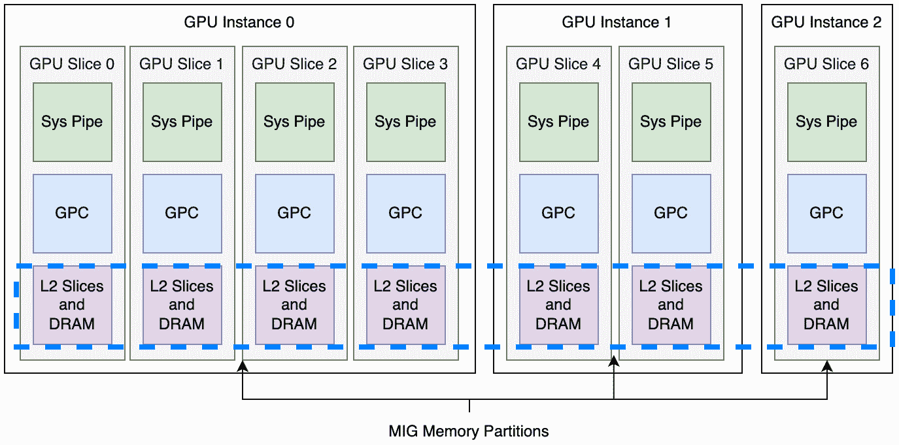

<st c="52479">图 4.8：将 GPU 拆分成三个 GPU 实例的示例</st>

<st c="52542">这些 GPU</st> <st c="52552">实例可以由单个 Pod 使用，也可以由一个包含多个进程的 Pod（不理想）使用，或者通过使用 Nvidia 的 CUDA 等技术来使用。</st> <st c="52712">CUDA</st> <st c="52716">是一个 MPS，因此您可以结合不同的方法，如下图所示：</st>

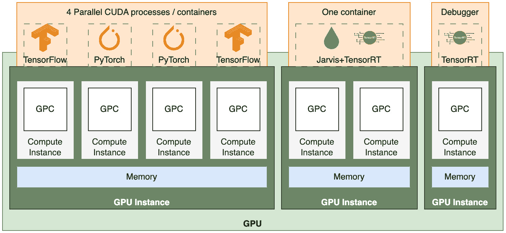

<st c="53128">图 4.9：使用三个 GPU 实例并行的示例</st>

<st c="53188">从这里，我们可以看一下研究和实验部分，你可以结合</st> <st c="53279">Kubernetes</st> `<st c="53484">v1.26</st>` <st c="53489">，并且它仍处于 Alpha 阶段，因此每个版本可能会有 API 的重大变动。</st> <st c="53575">有一些有趣的文章和演讲讨论了它。</st> <st c="53631">根据你阅读的时间，它可能已经过时了。</st> <st c="53690">dat</st><st c="53693">e</st> *<st c="53696">[8]</st>*<st c="53699">.</st>

## <st c="53700">启用集群可扩展性</st>

<st c="53727">如前所述，在本</st> <st c="53756">章节中，Kubernetes 集群的伸缩能力对于不同需求是有益的，包括从弹性、随工作负载增长到回退重新初始化，再到在数据中心和可用区提供最高可用性。</st> <st c="54013">从本质上讲，我们区分水平和垂直自动扩展器，后者针对 Pods，水平 CA 则调整节点数量。</st>

<st c="54172">与许多功能一样，Kubernetes 提供了规范，但期望其他人来实现它。</st> <st c="54280">这至少适用于 VPA 和 CA，它们至少需要在</st> <st c="54380">集群级别运行一个指标服务器。</st>

<st c="54394">然而，HPA</st> <st c="54411">功能丰富，支持基于指标的伸缩。</st> <st c="54461">请看以下 HPA 的例子。</st> <st c="54502">使用</st> `<st c="54507">stabilizationWindowsSeconds</st>`<st c="54534">，我们还可以告诉 Kubernetes 等待先前的操作，以防止抖动。</st> <st c="54613">抖动的定义如下，根据</st> <st c="54624">Kubernetes 文档：</st> <st c="54661">Kubernetes 文档：</st>

<st c="54686">在使用 HorizontalPodAutoscaler 管理一组副本的规模时，由于所评估的指标具有动态特性，副本数量可能会频繁波动。</st> <st c="54893">这有时被称为抖动，或者说是振荡。</st> <st c="54950">它类似于控制论中的滞后效应概念。</st>

<st c="56106">我们可以参考以下 HPA 的配置。</st> <st c="55060">看起来很简单；你可以看到，根据策略，行为可以发生巨大变化。</st> <st c="55154">例如，当在拥有数百个副本的大型部署中减少 10% 的 Pods 时，我们需要非常小心。</st> <st c="55284">所示的缩小配置将防止同时删除超过两个 Pods：</st>

```
 apiVersion: autoscaling/v2
kind: HorizontalPodAutoscaler
spec:
  maxReplicas: 7        #maximum replicas to scale up to
  minReplicas: 3        #expected minimum replicas
scaleTargetRef: ... targetCPUUtilizationPercentage: 75     #metric to react on
  behavior:
    scaleDown:
     stabilizationWindowSeconds: 300     #wait 300 sec
     policies:
     - type: Percent
       value: 10                #reducing 10% of Pods
       periodSeconds: 60        #per minute
     - type: Pods
       value: 5                 #reducing not more
       periodSeconds: 60        #than 2 Pods per min
     selectPolicy: Min
   scaleUp:
     stabilizationWindowSeconds: 0
     policies:
     - type: Percent
       value: 75                #increase the Pod by 75%
       periodSeconds: 15        #every 15 seconds
     selectPolicy: Max
```

### <st c="56015">VPA、HPA 和 CA 的问题</st>

<st c="56044">你需要考虑自动扩展器家族的一些约束：</st>

+   **<st c="56124">HPA</st>**<st c="56128">:</st>

    +   <st c="56130">你</st> <st c="56134">必须正确设置 Pods 的 CPU 和内存限制及请求，以防止资源浪费或频繁</st> <st c="56239">终止的 Pods。</st>

    +   <st c="56255">当 HPA 达到可用节点的限制时，它无法调度更多的 Pods。</st> <st c="56333">然而，它可能会利用所有可用资源，这可能会导致</st> <st c="56401">问题。</st>

+   **<st c="56411">VPA</st>**<st c="56415">：</st>

    +   <st c="56417">VPA 和</st> <st c="56425">HPA 不应基于相同的指标进行缩放。</st> <st c="56485">例如，尽管两者都可以使用 CPU 利用率触发扩容，HPA 部署更多的 Pods，而 VPA 增加现有 Pods 上的 CPU 限制，这可能导致基于相同指标的过度扩展。</st> <st c="56694">因此，如果同时使用 VPA 和 HPA，应将 CPU 用于其中一个，而将内存用于</st> <st c="56789">另一个。</st>

    +   <st c="56799">VPA 可能建议使用比集群或节点中可用资源更多的资源。</st> <st c="56888">这会导致 Pod</st> <st c="56911">变得不可调度。</st>

+   **<st c="56932">CA</st>**<st c="56935">：</st>

    +   <st c="56937">CA</st> <st c="56941">缩放基于 Pods 的请求和限制。</st> <st c="57001">这可能导致许多未使用的资源、利用率低下以及</st> <st c="57065">高成本。</st>

    +   <st c="57076">当 CA 触发云提供商的缩放命令时，可能需要几分钟时间为集群提供新的节点。</st> <st c="57199">在此期间，应用程序性能会下降。</st> <st c="57258">最坏的情况是，它</st> <st c="57280">变得</st><st c="57286">无法服务。</st>

### <st c="57300">解决方案空间</st>

<st c="57315">作为平台工程师，我们希望确保用户能够定义缩放行为，同时不会让平台面临风险。</st> <st c="57437">利用 HPA、VPA 和 CA 需要完美的配置与控制，由策略引擎提供的保护措施以及密切的监控。</st> <st c="57570">控制集群的扩展和缩减变得至关重要，同时要为</st> <st c="57683">用户启用命名空间内的自动缩放。</st>

<st c="57694">在云提供商上管理 Kubernetes 集群的缩放需要你查看 CA 及其可用的各种云集成。</st> <st c="57843">此外，如果你使用</st> **<st c="57867">Cluster API</st>** <st c="57878">(</st>**<st c="57880">CAPI</st>**<st c="57884">)，你</st> <st c="57892">还可以利用其能力进行</st> <st c="57929">集群</st> <st c="57936">自动缩放。</st>

## <st c="57949">网络能力和扩展</st>

<st c="57985">现在，让我们来看一下 Kubernetes 与底层基础设施的最终资源集成。</st> <st c="58085">为此，我们将从集群的网络机制入手，逐步探讨 DNS 和负载均衡。</st> <st c="58197">DNS 和负载均衡可以在集群内发生，并与 Kubernetes 运行的基础设施协同工作。</st>

### <st c="58319">Ingress – 旧方式</st>

<st c="58341">Ingress</st> <st c="58349">是旧版定义，描述了如何将外部集群的最终用户请求路由到系统中并传递给暴露的应用程序。</st> <st c="58494">近十年来，它一直是定义传入网络流量的方式。</st> <st c="58572">Ingress 通常由如 NGINX、HAProxy 或 Envoy 等 Ingress 控制器表示，举几个例子。</st> <st c="58681">这些控制器本质上会采用 Kubernetes 定义的标准资源中的路由规则，并管理其余部分。</st> <st c="58795">如下面的图所示，从那里开始，流量会被重定向到正确的服务，服务再将其转发到 Pod。</st> <st c="58928">从物理层面上讲，流量将从网络接口流向 Ingress 控制器，再到 Pod，但正如 Kubernetes 是一位优秀的调度器一样，仍然有一些逻辑步骤</st> <st c="59100">介于其中。</st>

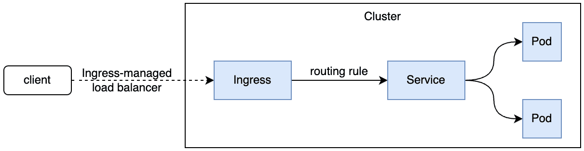

<st c="59192">图 4.10：Ingress 控制器（来源：Kubernetes 文档）</st>

<st c="59249">虽然它具有可扩展性，适用于一些</st> <st c="59289">最大规模的部署，但它也有</st> <st c="59334">一些缺点：</st>

+   <st c="59349">Ingress API 仅支持 TLS 终止和简单的基于内容的 HTTP 流量请求路由</st>

+   <st c="59452">它的语法有限，保持</st> <st c="59500">非常简单</st>

+   <st c="59511">它需要注解</st> <st c="59536">以支持扩展性</st>

+   <st c="59553">它降低了可移植性，因为每个实现都有自己的方式来</st> <st c="59630">执行此操作</st>

<st c="59635">构建多租户集群更加具有挑战性，因为 Ingress 通常是在集群级别，并且权限模型较弱。</st> <st c="59766">此外，Ingress 支持命名空间配置，但不适合多团队和共享的</st> <st c="59861">负载均衡基础设施。</st>

<st c="59891">Ingress 方法的优美之处在于它广泛的支持与其他工具的集成，例如用于证书管理的 cert-manager 和即将看到的外部 DNS 处理。</st> <st c="60099">此外，Kubernetes 的维护者声称没有计划废弃 Ingress，因为它以一种简单的方式完美地支持简单的 web 流量。</st> <st c="60231">方式。</st>

### <st c="60253">Gateway API – 新方式</st>

<st c="60279">在 2023 年秋季，网关 API</st> <st c="60318">正式发布。</st> <st c="60347">网关 API 由多个资源类型组成，而不是单一资源，它遵循的模式在其他</st> <st c="60480">关键集成中已被使用：</st>

+   `<st c="60502">网关</st>`<st c="60510">: 进入集群的入口点</st> <st c="60537">流入的流量</st>

+   `<st c="60553">GatewayClass</st>`<st c="60566">: 定义将处理</st> <st c="60619">网关的控制类型</st>

+   `<st c="60630">*Route</st>`<st c="60637">: 实现从网关到</st> <st c="60691">服务的流量路由：</st>

    +   `<st c="60703">HTTPRoute</st>`

    +   `<st c="60713">GRPCRoute</st>`

    +   `<st c="60723">TLSRoute</st>`

    +   `<st c="60732">TCPRoute</st>`

    +   `<st c="60741">UDPRoute</st>`

<st c="60750">将下图与 Ingress 方法进行比较时，我们可以看到流入的流量通过网关并被重定向的两个步骤</st> <st c="60783">通过</st> `<st c="60906">*Route</st>`<st c="60912">。</st>


<st c="60972">图 4.11: 网关 API</st>

<st c="60996">它们如何比较？</st> <st c="61004">如何比较？</st>

|  | **<st c="61017">Ingress</st>** | **<st c="61025">网关 API</st>** |
| --- | --- | --- |
| <st c="61037">协议</st> | <st c="61047">仅限 HTTP/HTTPS</st> | <st c="61063">L4 和</st> <st c="61071">L7 协议</st> |
| <st c="61083">多租户</st> | <st c="61097">困难/自定义扩展</st> | <st c="61125">按设计支持多租户</st> <st c="61139">设计</st> |
| <st c="61148">规范</st> | <st c="61163">基于注释，控制器特定</st> | <st c="61201">控制器独立，拥有</st> <st c="61230">资源，标准化</st> |
| <st c="61252">定义/资源</st> | <st c="61272">Ingress 资源</st> | <st c="61289">网关，GatewayClass，*</st><st c="61314">Route 资源</st> |
| <st c="61330">路由</st> | <st c="61338">基于主机/路径</st> | <st c="61354">支持头部</st> |
| <st c="61370">流量管理</st> | <st c="61389">仅限于</st> <st c="61401">供应商</st> | <st c="61411">内建/定义</st> |

<st c="61428">表 4.2: 比较 Ingress 和网关 API</st>

<st c="61477">这一丰富的功能集对需要构建平台的人来说是一个游戏规则改变者。</st> <st c="61561">此前，这些大多数功能必须通过商业购买，或通过一些变通办法和自开发工具强行集成到集群中。</st> <st c="61717">然而，借助网关 API，支持广泛的协议，并且还附带了两个</st> <st c="61809">有趣的额外</st> <st c="61833">功能。</st>

<st c="61849">您可以使用网关 API 创建跨命名空间路由，可以使用</st> `<st c="61922">ReferenceGrant</st>` <st c="61936">或者</st> `<st c="61945">AllowedRoutes</st>`<st c="61958">。允许的路由通过引用绑定实现，需要网关所有者定义来自哪些命名空间的流量。</st> <st c="62111">在实践中，网关配置将会扩展</st> <st c="62167">如下：</st>

```
 namespaces:
  from: Selector
  selector:
    matchExpressions:
    - key: kubernetes.io/metadata.name
      operator: In
      values:
      - alpha
      - omega
```

<st c="62305">这将允许来自</st> `<st c="62339">alpha</st>` <st c="62344">和</st> `<st c="62349">omega</st>` <st c="62354">命名空间的流量。</st>

<st c="62366">或者，我们可以使用</st> `<st c="62395">ReferenceGrant</st>`<st c="62409">，如下所述：</st>

<st c="62441">ReferenceGrant 可用于启用网关 API 内的跨命名空间引用。</st> <st c="62526">具体来说，路由可以将流量转发到其他命名空间中的后端，或者网关可以引用另一个命名空间中的密钥。</st>

<st c="62655">它们听起来相似，但实际上不是。</st> <st c="62693">让我们</st> <st c="62699">来比较一下：</st>

+   `<st c="62712">ReferenceGrant</st>`<st c="62727">：在命名空间 A 中的网关和路由授予命名空间 B 中的服务</st> <st c="62799">转发流量</st>

+   `<st c="62814">AllowedRoutes</st>`<st c="62828">：在命名空间 C 中配置了网关对命名空间 B 的路由。</st>

<st c="62895">除了这些跨命名空间的额外安全层外，网关 API 还具备自己的扩展能力。</st> <st c="63018">通过它们，您可以定义自己的策略附加，如后端 TLS 策略，以验证正确的 TLS 使用方式</st> <st c="63126">。</st>

<st c="63133">在我们继续之前的最后一件事。</st> <st c="63168">网关 API 自带角色。</st> <st c="63205">角色是预定义的角色，允许细粒度使用网关功能。</st> <st c="63291">入口只有一个角色，即</st> <st c="63323">用户，无论是管理员还是开发者。</st> <st c="63383">以下表格显示了这些角色在</st> <st c="63454">四层模型中的写权限：</st>

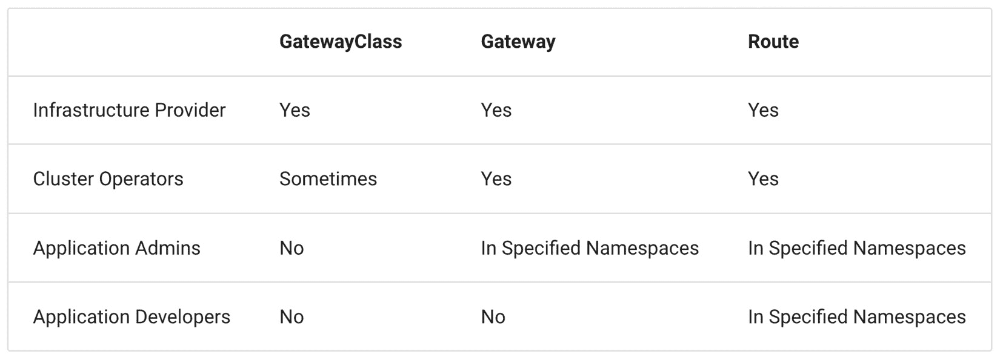

<st c="63693">图 4.12：高级四层模型的写权限</st>

<st c="63755">在这一点上，</st> <st c="63775">网关 API 是解决无数夜晚正确处理入站流量并构建具有清晰和</st> <st c="63913">透明方法的多租户平台的真正救星。</st><st c="63933">。</st>

### <st c="63934">ExternalDNS</st>

<st c="63946">该</st> **<st c="63951">ExternalDNS</st>** <st c="63962">项目由 Kubernetes 贡献者开发，是一个常在云提供的 Kubernetes 集群中使用的工具，但仍然没有作为一个重要实现被广泛强调。</st> <st c="64148">然而，它弥合了集群中某些随机 IP 和一个公开或私有可访问的 DNS 之间的鸿沟，并将流量路由到平台内的应用程序。</st> <st c="64348">ExternalDNS 支持几乎所有云环境以及类似云的环境，还支持如 CloudFlare 这样的流量和内容聚焦型服务。</st>

<st c="64496">然而，ExternalDNS 不是一个 DNS。</st> <st c="64532">惊讶吧！</st> <st c="64542">它从 Kubernetes API 读取资源，并配置外部 DNS 指向集群的公共端点。</st> <st c="64661">你也可以说，ExternalDNS 让你能够通过 Kubernetes 资源以 DNS</st> <st c="64777">提供商无关的方式动态控制 DNS 记录。</st>

<st c="64799">让我们来看看 ExternalDNS 如何与 Kubernetes 的 CoreDNS 和 Cloud DNS 服务一起工作。</st> <st c="64910">在下图中，你可以看到左侧是托管的 Kubernetes。</st> <st c="64979">在这种情况下，AWS EKS 和 CoreDNS 正在 Kubernetes 上运行，以解析内部 DNS 请求。</st> <st c="65074">当部署了 ExternalDNS 后，它会观察网关、入口和服务资源。</st> <st c="65161">当发生变化或有新服务</st> <st c="65196">上线时，ExternalDNS 会更新云提供商或 DNS</st> <st c="65270">服务提供商上的 DNS 记录。</st>

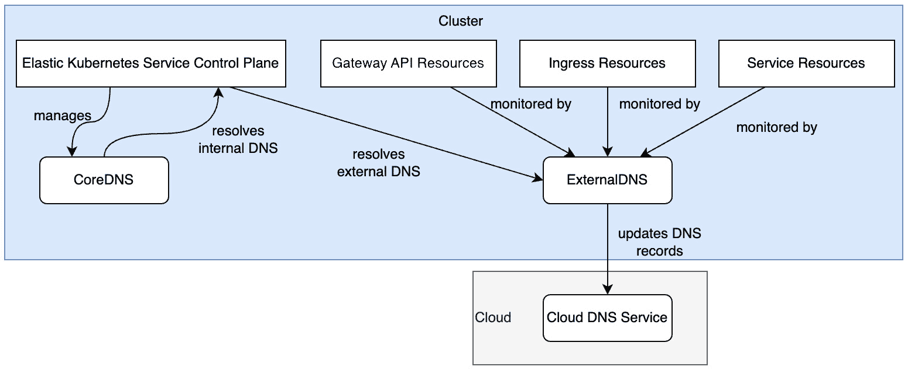

<st c="65554">图 4.13：ExternalDNS</st>

<st c="65578">然而，在寻找替代方案时，你通常只有两种备选方式：自己创建 DNS 条目（手动）或通过自定义控制器、函数，或者在基础设施</st> <st c="65820">创建过程中实现自动化。</st>

<st c="65837">因此，看到 ExternalDNS 的限制令人非常痛苦：</st> 

+   <st c="65892">缺少细粒度的控制；例如，ExternalDNS 会为来自</st> <st c="66024">任何命名空间的所有服务和入口创建 DNS 记录</st>

+   <st c="66037">ExternalDNS 只提供 A 记录；如果你需要 TXT 或 CNAME 记录，你必须</st> <st c="66126">手动完成</st>

+   <st c="66137">你将获得 DNS 名称的默认 DNS 配置；否则，你必须手动</st> <st c="66227">定义它们</st>

<st c="66239">除此之外，你还可能会遇到更高的费用（由于其不合理的 DNS 记录创建行为）以及增加的复杂性或延迟。</st> <st c="66374">我不能完全同意这些问题，因为这取决于你如何</st> <st c="66452">处理它们。</st>

<st c="66464">仅当你已经掌握 Kubernetes 网络的其他部分，并能够进行精细化的网络策略和网关 API 管理，从而严格控制哪些服务可达及如何访问时，才考虑使用 ExternalDNS。</st> <st c="66716">此外，考虑启用 DNSSEC 功能，并建立</st> <st c="66788">DNS 监控。</st> <st c="66800">监控。</st>

### <st c="66804">负载均衡、EndpointSlices 和拓扑感知路由</st>

<st c="66863">最后，为了</st> <st c="66875">总结</st> <st c="66884">网络部分，我们将简要</st> <st c="66922">讨论</st> **<st c="66930">负载均衡</st>**<st c="66944">、</st> **<st c="66946">EndpointSlices</st>**<st c="66960">，以及</st> **<st c="66966">拓扑感知路由</st>**<st c="66988">。</st>

<st c="66989">负载均衡由</st> <st c="67007">集群中的入口控制器或网关 API 处理。</st> <st c="67077">这可以通过与云服务提供商结合，外包给外部负载均衡器。</st> <st c="67167">所有主要的云服务提供商都有自己的方法，通常通过他们自己的控制器来管理托管服务的负载均衡器。</st> <st c="67297">这些选项之间有什么区别？</st> <st c="67343">在 Kubernetes 内部运行自己的负载均衡器意味着，首先，所有流量都会被路由到那个入口点。</st> <st c="67456">通过正确的设置，这可以是多个节点，并且负载分配非常简单。</st> <st c="67545">缺点是，如果某个节点由于某种原因超载，它仍然会处理并内部分配流量。</st> <st c="67672">云负载均衡器会将负载分配到多个节点，并且根据集成方式，它会知道某个节点是否能够处理更多的负载，或者是否应将流量重定向到另一个节点。</st> <st c="67891">一个</st> <st c="67893">公共云负载均衡器的缺点是，你必须为此付费。</st> <st c="67962">付费。</st>

<st c="67969">EndpointSlices</st> <st c="67984">在大规模集群中变得至关重要。</st> <st c="68027">Endpoint 是定义 IP 地址和端口列表的 API 对象。</st> <st c="68099">这些地址属于动态分配给服务的 Pod。</st> <st c="68178">当创建服务时，Kubernetes 会自动创建一个关联的 Endpoint 对象。</st> <st c="68269">Endpoint 对象维护与服务选择器标准匹配的 Pod 的 IP 地址和端口号。</st> <st c="68383">EndpointSlices 在 Kubernetes 1.16 中被引入。</st> <st c="68434">它们提供了一种将网络端点分布到多个资源上的方式，减少了 Kubernetes API 服务器的负载，并提高了大规模集群的性能。</st> <st c="68612">过去，单一的大型 Endpoint 对象会导致服务变慢，而现在创建了多个小型 EndpointSlice 对象，每个对象代表</st> <st c="68774">一部分端点。</st>

<st c="68788">控制平面创建并管理 EndpointSlices，每个 slice 的端点数不得超过 100 个。</st> <st c="68888">此限制可以调整，最大值为 1,000。</st> <st c="68935">对于 kube-proxy 来说，EndpointSlice 是路由</st> <st c="69007">内部流量的事实来源。</st>

<st c="69024">EndpointSlices 对于</st> <st c="69062">拓扑感知路由也是必需的。</st> <st c="69086">通过拓扑感知路由，你可以将流量保持在云提供商的</st> **<st c="69168">可用区</st>** <st c="69185">(</st>**<st c="69187">AZ</st>**<st c="69189">)内。</st> <st c="69193">这有两个主要优点：它减少了</st> <st c="69238">网络成本并提高了性能。</st> <st c="69282">而不是让 AZ 1 中的 Pod 与 AZ 2 中的 Pod 通信并传输大量数据，AZ 1 中的 Pod 现在将与 AZ 1 中的一个副本（如果有）进行通信。</st> <st c="69453">为了实现最佳效果，传入流量应通过外部负载均衡器均匀分配，并且每个区域应至少有三个端点。</st> <st c="69612">否则，控制器将无法分配该端点，失败的概率约为</st> <st c="69688">50%。</st>

## <st c="69700">Kubernetes 作为平台控制平面的一部分</st>

<st c="69749">回顾第二章，我们可以在参考架构中看到，平台可以是高度分布式的，基于许多服务，从更高的角度来看，这些服务可能甚至不属于同一组。</st> <st c="69956">我们讨论过，Kubernetes 很可能成为你平台的核心部分。</st> <st c="70037">然而，它能变得有多核心呢？</st> <st c="70073">如前所述，Kubernetes 不仅仅是用来运行工作负载的；它是一个平台（基于承诺理论和标准化模型及 API），用于构建平台。</st> <st c="70228">这使得 Kubernetes 将一只脚迈入平台控制平面，并通过两种方式实现这一点：作为资源控制器和作为</st> <st c="70358">平台或</st><st c="70369">协调器。</st>

### <st c="70381">从 Kubernetes 内部管理资源</st>

<st c="70423">开源的</st> <st c="70440">Crossplane 项目是唯一一个不依赖于任何提供商的解决方案，可以在 Kubernetes 内部管理云资源。</st> <st c="70554">最初为了在 Kubernetes 内部管理其他 Kubernetes 集群而创建，它迅速成为处理云资源的通用解决方案。</st> <st c="70703">云资源作为 CRD 提供，可以通过规范文件将其定义为 Kubernetes 本地资源。</st> <st c="70821">这使得用户可以选择定义他们所需的内容，并将资源创建交给 Kubernetes 的承诺理论来处理。</st> <st c="70943">对于不同的云，有所谓的提供商可用，用于定义可用的资源。</st> <st c="71042">用户可以创建单个资源或完整的组合，这些组合由多个资源组成，它们</st> <st c="71134">属于</st><st c="71137">同一组。</st>

## <st c="71151">外部资源与内部定义资源的问题</st>

<st c="71211">管理资源的正确方法是什么？</st> <st c="71262">是应该由基础设施团队定义，还是通过需求表单的输入来定义？</st> <st c="71347">是否可以通过平台由用户来定义？</st> <st c="71397">一切皆有可能，但没有简单的</st> <st c="71433">答案。</st>

<st c="71447">让我们来看看这两种方法。</st> <st c="71489">首先，让我们看看来自传统保守背景下的 Financial One ACME 的一个场景：基础设施团队在过去几年里一直在争取自动化和声明性方法。</st> <st c="71716">虽然他们通过 Ansible 管理本地环境，但他们决定为云提供商使用更简单的工具：Terraform（或 OpenTofu）。</st> <st c="71870">我们不会详细介绍整个技术栈，但直到我们进入 Kubernetes 平台之前，一切都通过经典的 CI/CD 推送原则和 IaC</st> <st c="72025">通过 Terraform 来协调。</st>

<st c="72039">Financial One ACME 正在启动一个新项目，开发内部使用的定制软件。</st> <st c="72138">团队将利用 ACME 平台并着手系统的基础架构工作。</st> <st c="72222">他们已经确定需要某些文件存储、缓存、关系型数据库、通知服务和消息流服务。</st> <st c="72374">由于平台提供了一些自助服务，团队可以将 Terraform 模块复制到他们的仓库中。</st> <st c="72481">从这里开始，一个预定义的 CI/CD 管道将接管配置，并将资源部署到定义的环境中。</st> <st c="72607">这些自定义的但仍然由外部管理的资源在某些方面是与系统的其余部分隔离的。</st> <st c="72722">它们可能生活在同一个仓库或层级中，并由团队管理，但它们并没有</st> <st c="72818">紧密集成。</st>

<st c="72838">另一方面，它们提供了一定程度的稳定性。</st> <st c="72901">在平台用户空间内部，这些资源是不可见的，唯一存在的是一个发现服务。</st> <st c="73009">当一个组织逐渐成熟时，管道可能会被定制，而无需通知所有者或用户。</st> <st c="73110">然而，基础设施和应用程序是明确分离的，这是一个优势，因为它们的生命周期完全不同。</st> <st c="73243">这些元素。</st>

<st c="73256">快进到现在，Financial One ACME 已经完成了云原生转型，最大限度地利用了平台工程和 IDP。</st> <st c="73395">同样，他们计划开展一个新的内部项目，这个项目与之前的项目完全不同，但却有着完全相同的需求。</st> <st c="73551">一些组织的行为永远不会改变。</st> <st c="73599">这一次，项目团队在他们的开发者门户中创建了一个新项目。</st> <st c="73676">所有基本需求会自动推送到一个新的 Git 仓库中。</st> <st c="73755">所选的资源被选中并推送到平台，平台上的控制器决定在哪里部署这些资源。</st> <st c="73878">一些资源最终成为云服务商的托管服务，另一些则由专门的团队放在共享服务账户中，还有一些则在项目的命名空间内。</st> <st c="74031">过了一段时间，团队意识到他们选择了错误的配置，经过调整后，迁移到新服务的过程开始了。</st> <st c="74185">这个场景与之前的场景一样真实，但具有</st> <st c="74242">不同的影响。</st>

<st c="74260">团队需要更详细地了解他们的需求；另一方面，他们必须信任预定义的部署和配置。</st> <st c="74417">平台工程团队与运营团队合作，定义了具有防护栏的最佳实践，确保可操作性，同时也几乎满足了用户的所有需求。</st> <st c="74617">在集群用户空间内，团队可以找到所有部署的资源，并将它们视为平台内的服务，即使它们并未在其中运行。</st> <st c="74780">然而，用户端的突然变化可能导致资源在其他地方突然增加或删除。</st> <st c="74893">管理服务团队必须在没有警告的情况下处理这些变化。</st> <st c="74960">总体而言，所有依赖资源都表现出极其不稳定和动态的特性，难以预测，也难以管理。</st> <st c="75079">另一方面，项目可以完全专注于流程和进展，因为外部资源是通过集群内部处理的，而不是通过外部集群资源管理解决方案（如 IaC）。</st>

<st c="75312">两种方法都可以。</st> <st c="75339">两者各有利弊，而对你的组织来说，最适合的方法往往更多地取决于人的因素，而不是技术因素。</st> <st c="75481">然而，显而易见的是，内部定义的集群资源比外部定义的更加动态，并且更多地转移到了用户的责任范围内。</st> <st c="75642">定义的资源。</st>

<st c="75660">最终，这变成了一场哲学讨论。</st> <st c="75712">外部定义的资源更为传统，而内部定义的方法则是进步和面向未来的。</st> <st c="75839">然而，我们没有太多选项来运行集群内的供应流程。</st> <st c="75927">除了 Crossplane，我们还看到了许多元实现控制器，它们从集群中读取自定义资源并触发 CI/CD 流水线，例如。</st> <st c="76083">如果有人问。</st>

<st c="76125">在本节中，我们研究了 Kubernetes 所需的基本能力，围绕它们的挑战，以及如何解决它们。</st> <st c="76274">而且，它们不像你在会议上看到的那些疯狂的实现方式。</st> <st c="76360">正确掌握这些基础知识将决定其他一切是否会带来愉快或痛苦。</st> <st c="76484">接下来，我们将通过探讨找到合适的节点大小及其对灵活性</st> <st c="76619">和</st> <st c="76622">可靠性的影响来结束本章。

# <st c="76635">设计灵活性、可靠性和稳健性</st>

<st c="76690">在上一部分中，我们讨论了集群的可扩展性，以及 VPA、HPA 和 CA 如何协同工作。</st> <st c="76790">这有助于创建一个灵活、可靠且强大的系统。</st> <st c="76852">其中一个关键部分是允许定制，前提是不会对系统造成损害。</st> <st c="76942">集群的各个组件必须无缝协作，但也必须在需要时能够互换。</st> <st c="77042">这非常敏感：一方面，你有一个随着时间推移而不断扩展和收缩需求的集群；另一方面，你还需要集群周围的所有扩展功能，以便为你的使用案例提供最佳的功能集。</st> <st c="77286">你还拥有一个不断发展的开源社区，该社区经常发布更新和新功能，这些更新和新功能应该集成并为你的用户提供。</st> <st c="77465">正如我们之前所说的，这就是为什么你必须拥有产品思维——为你的用户构建最佳的平台。</st> <st c="77587">扔掉不需要或过时的东西，但要保持整个系统作为</st> <st c="77671">你的核心。</st>

<st c="77681">现在，出于某种原因，我们仍然看到关于是否应该将所有工作负载放在 Kubernetes 上，以及它是否可靠的讨论。</st> <st c="77819">我们必须从两个角度来看这个讨论：从 Kubernetes 的基础设施和核心职责的底层视角来看，以及从用户可以看到并体验到的顶层视角来看。</st> 

## <st c="78003">优化资源消耗与留出足够的头部空间</st>

<st c="78057">正如我们在</st> *<st c="78075">第二章</st>*<st c="78084">中学到的那样，Kubernetes 集群及其管理的工作负载之间有着一种有趣的关系，相互影响。</st> <st c="78199">有些应用程序需要更多的 CPU 能力，其他应用程序则会扩展，而其余的则根据需求运行。</st> <st c="78299">找到合适的匹配并不容易，但理想的目标是高资源消耗，因为它优化了可用资源的使用，从而</st><st c="78449">降低</st> <st c="78452">成本。</st>

### <st c="78462">如何使集群达到合适的大小</st>

<st c="78502">评估集群的合适大小</st> <st c="78528">始终是一个挑战。</st> <st c="78568">找到合适的解决方案显然是一个</st> *<st c="78614">看情况而定</st>*<st c="78624">的问题。让我们以 Financial One ACME 为例，它必须提供一个新的集群。</st> <st c="78693">我们对预期的工作负载了解不多，只知道它需要一些内存，并且有几个不那么需要资源的活动组件。</st> <st c="78841">因此，我们可以选择以下</st> <st c="78868">选项之一：</st>

+   <st c="78886">1x 16 vCPU，64</st> <st c="78902">GB 内存</st>

+   <st c="78911">2x 8 vCPU，32</st> <st c="78926">GB 内存</st>

+   <st c="78935">4x 4 vCPU，16</st> <st c="78949">GB 内存</st>

+   <st c="78958">8x 2vCPU，8</st> <st c="78971">GB 内存</st>

<st c="78980">出于可用性原因，第一个选项会是个坏主意。</st> <st c="79045">如果你在集群中进行更新，整个系统崩溃或你需要提供一个新的节点，你需要将所有应用程序迁移并关闭旧节点。</st> <st c="79214">选项 4 包含许多节点。</st> <st c="79246">由于其小巧的尺寸，这可能会导致资源短缺，因为一些基础组件将消耗部分 CPU 和内存。</st> <st c="79407">此外，根据云提供商的不同，可能会有其他限制，比如可用的 IP 地址、带宽和存储容量。</st> <st c="79563">另外，如果你有一个需要 1 vCPU 的应用程序，并且可能扩展到 1.5 – 2.0 vCPU，它可能会导致一个</st> <st c="79659">完整节点崩溃。</st>

<st c="79671">然而，Kubernetes 每个节点使用多少资源呢？</st> <st c="79733">默认情况下，对于 CPU，我们可以使用以下规则：</st>

+   <st c="79789">前 6%</st> <st c="79800">核心</st>

+   <st c="79810">第二核心的 1%</st> <st c="79821">核心</st>

+   <st c="79832">接下来 0.5%</st> <st c="79850">两个核心</st>

+   <st c="79859">从第 5 个核心起的 0.25%</st>

<st c="79890">我们也有一些关于</st> <st c="79925">内存的粗略规则：</st>

+   <st c="79936">前 25%</st> <st c="79954">4 GB</st>

+   <st c="79958">以下内容的 20%</st> <st c="79980">4 GB</st>

+   <st c="79984">接下来 10%</st> <st c="80001">8 GB</st>

+   <st c="80005">接下来的 112 GB（最多 128 GB）的 6%</st>

+   <st c="80042">任何超过 128 GB 的 2%</st>

+   <st c="80070">如果节点内存小于 1GB，那么是</st> <st c="80123">255 MiB</st>

<st c="80130">此外，每个</st> <st c="80150">节点有一个 100 MB 的驱逐阈值。</st> <st c="80192">如果资源完全利用且超出阈值，Kubernetes 将开始清理一些 Pods，以防止内存完全耗尽。</st> <st c="80348">在 learnk8s</st><st c="80359">，你可以找到一篇非常详细的博客</st> <st c="80401">关于它（</st>[<st c="80405">https://learnk8s.io/kubernetes-node-size</st>](https://learnk8s.io/kubernetes-node-size)<st c="80446">）。</st>

<st c="80449">让我们可视化</st> <st c="80466">这些数字：</st>

|  | **<st c="80480">2 vCPU 8</st>** **<st c="80490">GB RAM</st>** | **<st c="80496">4 vCPU 16</st>** **<st c="80507">GB RAM</st>** | **<st c="80513">8 vCPU 32</st>** **<st c="80524">GB RAM</st>** |
| --- | --- | --- | --- |
| **<st c="80530">Kubelet +</st>** **<st c="80541">操作系统 vCPU</st>** | <st c="80548">70 m 或</st> <st c="80557">0.07 vCPU</st> | <st c="80566">80 m 或</st> <st c="80575">0.08 vCPU</st> | <st c="80584">90 m 或</st> <st c="80593">0.09 vCPU</st> |
| **<st c="80602">Kubelet +</st>** **<st c="80613">操作系统内存</st>** | <st c="80622">1.8 GB</st> | <st c="80629">2.6 GB</st> | <st c="80636">3.56 GB</st> |
| **<st c="80644">驱逐阈值</st>** | <st c="80663">100 MB</st> | <st c="80670">100 MB</st> | <st c="80677">100 MB</st> |
| **<st c="80684">可用 vCPU</st>** | <st c="80699">1930 m 或</st> <st c="80710">1.9 vCPU</st> | <st c="80718">3920 m 或</st> <st c="80729">3.9 vCPU</st> | <st c="80737">7910n 或</st> <st c="80747">7.9 vCPU</st> |
| **<st c="80755">可用内存</st>** | <st c="80772">6.1 GB</st> | <st c="80779">13.3 GB</st> | <st c="80787">28.34 GB</st> |

<st c="80796">表 4.3：不同节点大小的资源消耗和可用资源</st>

<st c="80877">从这些可用的</st> <st c="80899">资源中，你还需要减去任何用于集群的资源，例如</st> `<st c="80983">DaemonSet</st>` <st c="80992">用于日志记录和监控，</st> `<st c="81021">kube-proxy</st>`<st c="81031">，存储驱动，等等。</st>

<st c="81059">进行计算，如果有许多小节点，所使用的基础资源层比大节点的要大。</st> <st c="81187">让我们来看一个例子。</st> <st c="81214">两个 2vCPU 8 GB RAM 节点总共需要 140 m 的 CPU 和 3.6 GB 的 RAM，而一个 4vCPU 16 GB RAM 节点只需要 80 m 的 CPU 和 2.6 GB 的 RAM。</st> <st c="81359">这些是为了提高可用性所付出的成本，但在仅对比可用资源时，单个节点需要分配给 Kubernetes 的资源较少。</st> <st c="81539">然而，理想情况下，节点应该达到其最大使用率；我们并不是运行一个虚拟机，标准情况下有 80% 的未使用资源！</st> <st c="81692">至少 80% 的节点利用率应该是实现最佳性能/价格比的目标。</st> <st c="81788">这也是因为服务器的能源比例性。</st> <st c="81852">CPU 所需的能源并不会与</st> <st c="81907">工作负载呈线性比例增长。</st>

<st c="81920">假设一台服务器最多可以消耗 200 瓦特。</st> <st c="81972">那么，大多数服务器在 CPU 利用率达到 50% 时需要消耗 150 到 180 瓦特之间的电量。</st> <st c="82063">这意味着，服务器的利用率越高，能源/CPU 的利用率越好，这也是更加具有成本效益</st> <st c="82184">和可持续的。</st>

<st c="82200">在选择集群节点大小时，我们必须考虑其他因素：</st> <st c="82269">集群：</st>

+   <st c="82281">如果你提供的是少数几个大节点，但用户定义了反亲和性，使得每个节点上只能运行一个副本的 Pod，并且由于预期副本数过高导致节点不足，那么一些 Pod</st> <st c="82508">将变得无法调度。</st>

+   <st c="82529">大节点往往资源利用率低，因此你会花更多的钱在一些你</st> <st c="82609">并不使用的东西上。</st>

+   <st c="82619">如果你有太多小节点，并且不断遇到待处理的 Pods，每个集群都必须进行扩展，这可能会让用户不满，因为扩展新节点总是需要时间。</st> <st c="82814">此外，如果应用程序持续运行在</st> <st c="82892">资源限制下，也可能会影响其服务性。</st>

+   <st c="82913">许多节点会导致更高的网络通信量、容器镜像拉取和每个节点上重复的镜像存储。</st> <st c="83038">否则，在最坏的情况下，你总是需要再次从注册表拉取镜像。</st> <st c="83116">对于小型集群来说，这不是问题，但对于大量节点来说，这会变得</st> <st c="83207">非常频繁。</st>

+   <st c="83220">节点越多</st>，<st c="83230">它们之间以及控制平面之间的通信就越频繁。</st> <st c="83314">在某些请求量级下，这意味着需要增加</st> <st c="83385">控制平面的节点大小。</st>

<st c="83399">找到合适的节点和集群大小本身就是一门科学。</st> <st c="83464">极端的两端都不好。</st> <st c="83500">首先，考虑一下你期望的工作负载类型。</st> <st c="83550">如果不确定，可以从中等大小的节点开始，并根据需要调整节点大小。</st> <st c="83641">此外，始终考虑预留一些额外的内存。</st> <st c="83706">Kubernetes 每个节点的核心组件不需要大量的 CPU，但需要至少 2 到 3 GB 的内存，以及所有其他</st> <st c="83859">默认组件</st><st c="83877">。</st>

### <st c="83878">解决方案空间</st>

<st c="83893">大多数公共云提供商都支持运行多种实例类型的 Kubernetes 节点。</st> <st c="83997">这对于不同的使用场景非常有帮助，从隔离工作负载到优化利用率，或者从一种 CPU 架构迁移到另一种架构。</st> <st c="84144">我们还讨论了 GPU 利用率，在这种场景下，你可以结合使用 CPU 节点运行非 GPU 工作负载，同时在</st> <st c="84294">GPU 实例上进行模型训练。</st>

<st c="84308">为此，你必须正确管理和标记节点，并为用户提供透明的方法和支持，帮助定义他们的</st> <st c="84448">亲和性设置。</st>

<st c="84466">为了确定合适的节点大小，learnk8s 还为你提供了一个实例计算器（</st>[<st c="84557">https://learnk8s.io/kubernetes-instance-calculator</st>](https://learnk8s.io/kubernetes-instance-calculator)<st c="84608">），你可以在开始制作自己的 Excel 表格进行计算之前先考虑使用它。</st>

<st c="84703">此外，在定义集群规模时，尽管规模看似不那么相关，但通过选择合适的节点大小，你可以直接影响成本、利用率、应用可用性、用户体验，以及为弥补</st> <st c="84974">潜在缺点</st><st c="84993">所需做的额外实现。</st>

# <st c="84994">总结</st>

<st c="85002">在这一章中，我们更深入地了解了 Kubernetes 的一些相关组件，它们构成了你平台的基石。</st> <st c="85121">我们首先考察了 Kubernetes 是否是正确的选择，并且探讨了它为何通常是一个明智的选择。</st> <st c="85235">Kubernetes 以承诺理论为核心，具有许多强大的功能来运行和扩展平台，因此它几乎是平台的完美基础。</st> <st c="85394">从这里，我们探讨了 Kubernetes 的一些基本元素：存储、网络、CPU 架构和 GPU 支持。</st> <st c="85524">在此背景下，我们了解了一些设计考量和在实现 Kubernetes 时可能遇到的问题。</st> <st c="85643">尽管 Kubernetes 作为基础在不同环境下可能有所不同，但完全可以创建一个统一的体验。</st> <st c="85766">然而，这将带来一些主要的缺点，比如失去某些云服务提供商的功能、灵活性，</st> <st c="85872">以及可定制性。</st>

<st c="85892">接下来，我们讨论了如何在一个非常严格与高度灵活的系统之间找到平衡。</st> <st c="85981">两者都可以被视为强大且可靠，但它们带来的是非常不同的挑战和问题。</st> <st c="86081">因此，我们进行了一个简短的思维实验，以确定正确的集群大小和节点类型，然后我们通过讨论如何在用户空间实施保护措施来结束这一部分内容。</st> <st c="86276">这帮助我们在用户空间内提供灵活性，但通过防止用户的不当行为和错误配置的服务，保护了平台。</st> <st c="86417">我们在</st> <st c="86442">这一章中学到了这些内容。</st>

<st c="86455">在下一章中，我们将重点关注平台的自动化。</st> <st c="86523">除了基础设施，自动化是平台的关键组件，正如你稍后将看到的，它在长期中可能成为瓶颈和成本驱动因素。</st> <st c="86684">你将学习如何设计一个适当的发布流程，如何在 CI/CD 和 GitOps 中实施该流程，并且如何使用这种组合来管理平台工件的生命周期。</st> <st c="86858">我们还将向你展示如何有效地观察</st> <st c="86907">这个过程</st><st c="86919">。</st>

# <st c="86920">进一步阅读</st>

+   <st c="86936">[1] Kubernetes 中的对象</st>: [<st c="86964">https://kubernetes.io/docs/concepts/overview/working-with-objects/</st>](https://kubernetes.io/docs/concepts/overview/working-with-objects/)

+   <st c="87030">[2]</st> <st c="87035">Karpenter:</st> [<st c="87046">https://karpenter.sh/</st>](https://karpenter.sh/ )

+   <st c="87067">[3] CSI 驱动程序</st> <st c="87084">索引：</st> [<st c="87091">https://kubernetes-csi.github.io/docs/drivers.html</st>](https://kubernetes-csi.github.io/docs/drivers.html )

+   <st c="87141">[4] RISC-V Kubernetes 节点在</st> <st c="87173">Scaleway 上：</st> [<st c="87183">https://www.scaleway.com/en/docs/bare-metal/elastic-metal/how-to/kubernetes-on-riscv/</st>](https://www.scaleway.com/en/docs/bare-metal/elastic-metal/how-to/kubernetes-on-riscv/ )

+   <st c="87268">[5]</st> <st c="87273">SpinKube:</st> [<st c="87283">https://www.spinkube.dev/</st>](https://www.spinkube.dev/ )

+   <st c="87308">[6] SpinKube</st> <st c="87322">概述：</st> [<st c="87332">https://www.spinkube.dev/docs/overview/</st>](https://www.spinkube.dev/docs/overview/ )

+   <st c="87371">[7] Nvidia – 改善 GPU 在</st> <st c="87414">Kubernetes 中的利用率：</st> [<st c="87426">https://developer.nvidia.com/blog/improving-gpu-utilization-in-kubernetes/</st>](https://developer.nvidia.com/blog/improving-gpu-utilization-in-kubernetes/)

+   <st c="87500">[8] DRA</st> <st c="87509">与 GPU：</st>

    +   [<st c="87518">https://docs.google.com/document/d/1BNWqgx_SmZDi-va_V31v3DnuVwYnF2EmN7D-O_fB6Oo/edit#heading=h.bxuci8gx6hna</st>](https://docs.google.com/document/d/1BNWqgx_SmZDi-va_V31v3DnuVwYnF2EmN7D-O_fB6Oo/edit#heading=h.bxuci8gx6hna)

    +   [<st c="87626">https://static.sched.com/hosted_files/colocatedeventseu2024/83/Best%20Practices%20for%20LLM%20Serving%20with%20DRA.pdf</st>](https://static.sched.com/hosted_files/colocatedeventseu2024/83/Best%20Practices%20for%20LLM%20Serving%20with%20DRA.pdf)

    +   [<st c="87745">https://github.com/NVIDIA/k8s-dra-driver?tab=re</st>](https://github.com/NVIDIA/k8s-dra-driver?tab=re)
