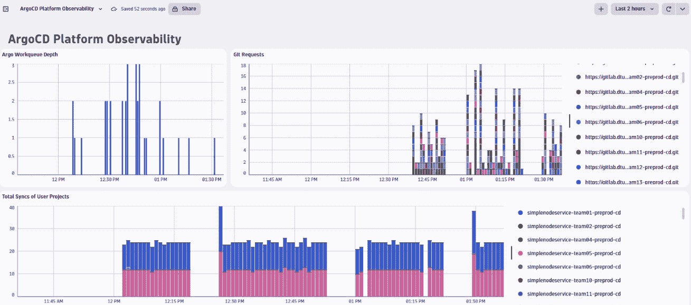
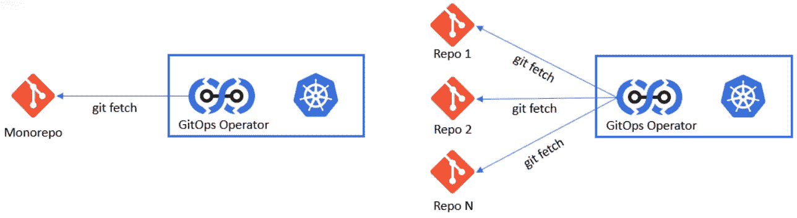
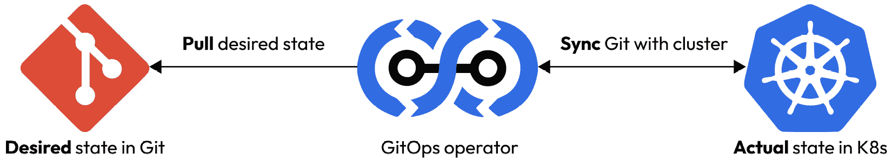
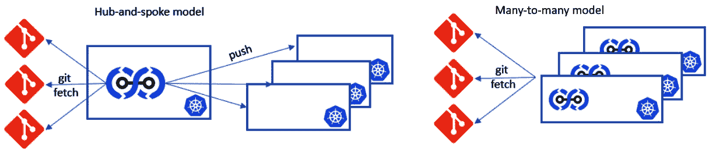
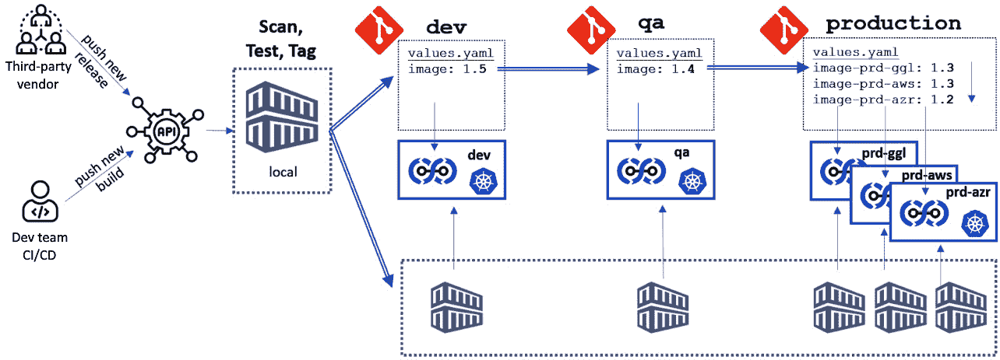
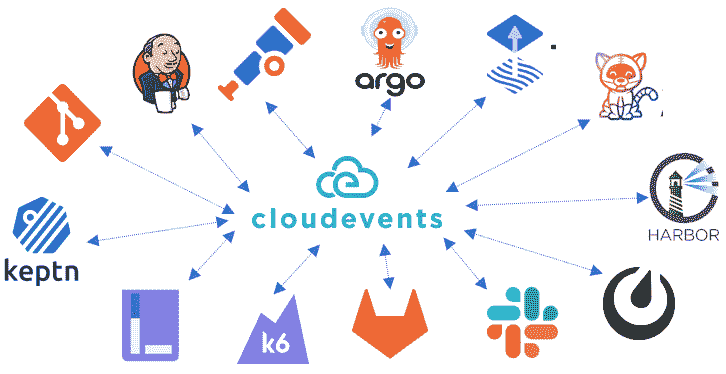
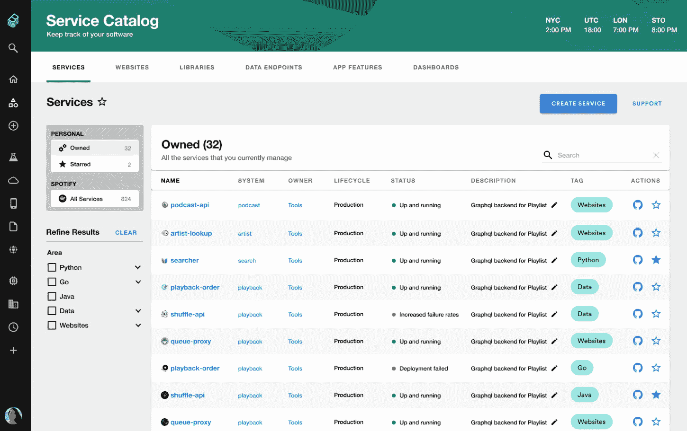

# 第五章：集成、交付和部署 — 自动化无处不在

*第二章* 包括了一个平台的参考架构，突出了诸如 *开发者体验*、 *自动化与编排*和 *可观察性平面*等层次。 *第三章* 从一个不同的角度结束了该参考架构，采用自上而下的方法，从 *目的*、 *用户界面*、 *核心平台组件*、 *平台作为产品*以及 *成功的 KPI*等方面进行了阐述。

大多数平台的构建目的是为了使开发团队能够更容易地发布软件，而无需处理构建、部署、测试、验证、安全、操作、发布或扩展软件的复杂性。 在本章中，我们将深入探讨平台的各个层次和组件，以便理解如何集中化并自动化发布软件所需的专业知识，并将其提供为 自助服务。

在本章结束时，我们将学习如何为软件制品定义端到端的发布过程，将 **持续集成/持续部署** (**CI/CD**)过程与制品生命周期阶段对齐，使用 CI、CD 和持续发布工具自动化这些阶段，将这些工具集成到现有流程中，观察自动化效果，并通过 IDP 实现扩展。

因此，我们将在本章中覆盖以下主要内容：

+   介绍 持续 X

+   GitOps：从推动到拉取期望状态

+   理解容器和制品注册表的重要性，作为 入口点

+   定义发布过程 和管理

+   实现可持续的 CI/CD 流程用于 DevOps — 应用生命周期编排

+   **内部开发者平台** (**IDP**) — 平台中的自动化巨兽

# 持续 X 介绍

如果这是你第一次听说 关于 **持续集成** (**CI**) 或 **持续交付** (**CD**)，那么我们建议你查看一些关于这些基本概念的优秀文献。 *Jez Humble* 是 [https://continuousdelivery.com/](https://continuousdelivery.com/) 的维护者，并且是 *《持续交付》* 一书的共同作者， *Dave Farley*。如果你需要这个主题的速成课程，请查看他们的资料。 也有一些录制的讲座，提供了很好的概述，比如题为 *持续交付听起来很棒，但它行不通* *这里*： [https://vimeo.com/193849732](https://vimeo.com/193849732)。

为了确保我们有相同的理解，让我们快速回顾一下构建模块是什么以及为什么它在 软件交付中很重要。

## 持续 X 的高层次定义

自动化软件交付的 基本基础是正确的 *配置管理* ，包括构建、部署、验证、操作和扩展我们系统所需的所有资产：代码、测试、部署和基础设施定义、依赖关系、可观测性、所有权等。 将所有这些资产放入版本控制中，可以生成可重复且可靠的输出，提供审计能力，允许我们回滚破坏性更改，并提供灾难 恢复能力。

Git，或任何 类型的 Git 版本，今天最有可能在软件组织中用于版本控制。 根据你使用的 Git 解决方案，你将看到额外的内建功能，如跨团队协作（问题跟踪、解决合并冲突等）、自动化（提交检查、交付流水线等）或报告（效率或 DORA 指标）。

现在我们已经建立了基础，让我们深入探讨 持续 X。

### CI

**持续集成** 是 一种强调频繁和自动化地将代码变更集成到共享代码库中的实践。 当多个开发人员在同一个代码库上工作时，定期将这些变更合并非常重要，以验证代码是否能良好集成，并生成可以部署到环境中的工件（如容器镜像或二进制文件）。 持续集成的关键方面包括 以下内容：

+   **自动化构建**：代码 提交到版本控制系统时，会触发一个自动化构建过程，该过程会编译代码、运行测试，并且 生成工件

+   **测试自动化**：单元测试、集成测试以及其他检查会在构建 过程中执行 如果有任何测试失败，构建会被标记为失败 。

+   **反馈回路**：这为 开发人员提供了快速反馈，以便快速修复问题，从而提高整体代码质量 和 稳定性

### 持续测试和可观察性的验证

尽管持续集成已经强调了 自动化单元测试和集成测试的重要性，但我们要强调的是，在生命周期早期进行更多自动化测试和验证，将带来更好的质量和稳定性。 假设构建的软件提供了 REST API 或 UI 接口，应该针对这些接口进行基本验证，以确保功能的准确性（例如，API 是否返回正确的响应，使用无效参数时是否返回正确的 HTTP 状态码，API 调用是否有超时，或是否返回任何 HTTP 错误？）

**可观察性** 对验证系统健康至关重要 ，并提供了更快排查问题所需的数据。 作为持续验证 过程的一部分，我们必须验证已测试的构建是否生成有效且预期的可观察性数据。 我们应该验证是否生成了所有预期的指标、日志或跟踪数据，并且在运行这些基本的单元测试、集成测试或 API 测试后，是否没有明显的异常或离群值。

我们一直在强调， 可观察性必须是现代软件的非功能性要求。 这就是为什么持续集成应该验证是否生成了预期的数据。 如果没有，那么这就像是一个失败的单元或集成测试，你应该将构建 标记为失败！

对于 Financial One ACME 及其关键财务服务，我们应验证 以下内容：

+   API 是否能正确验证调用者的访问控制（例如，不能查询 其他用户的财务数据）？

+   API 是否不会记录任何机密数据，如信用卡号、用户名 或令牌？

+   API 是否能正确生成失败尝试的指标，以便在生产中用于警报潜在的 黑客攻击？

### 持续交付

在持续交付网站上定义（[https://continuousdelivery.com/](https://continuousdelivery.com/)），“*持续交付是将所有类型的变更——包括新特性、配置更改、错误修复和实验——以安全、快速且可持续的方式投入生产，或交到用户手中的能力。*”目标是消除 部署中的失败恐惧。 与其进行不频繁的大规模发布，部署应该成为常规操作，持续发生。 此外，采用新的部署模式，如蓝绿部署、金丝雀部署或特性标记，可以进一步降低风险。 这些将在关于部署 与发布的章节中进一步讨论！

持续交付的一些方面如下：

+   **自动化部署**：来自 CI 的新 工件与其他更改捆绑，并自动部署。 部署定义是声明式的并且受版本控制，因此允许在任何环境中以更可预测、可重复和低风险的方式进行更新。 环境。

+   **部署流水线**：与 CI 相比，流水线允许更高级别的测试和部署验证。 在此，执行性能、安全性、可扩展性、韧性和用户体验等测试。 这不仅验证单一工件，而是整个部署 变更集！

+   **质量门控与晋升**：在部署流水线的末尾，所有测试结果充当质量门控 ，然后将变更晋升到下一个环境：从开发 到 **质量保证** （**QA**），从 QA 到暂存，从暂存 到生产。

+   **回滚与向前滚动**：如果生产环境中的质量门槛未通过，可以通过回滚至先前版本控制的部署配置来触发回滚。 另一种策略是向前滚动，意味着问题被修复， 并且由于自动化部署，修复可以迅速部署，以避免 需要回滚。

### 持续部署 – 将部署与发布解耦

CD 以自动化和快速的方式部署更改。 然而，仍然存在更改导致失败的风险，需要回滚或向前滚动，正如 前面所解释的那样。

持续部署 更进一步，采用了新的部署模式，倾向于将更改的部署与向最终用户发布新功能集分离。 目前已经成熟的模式如下： 

+   **蓝绿部署**：新的 部署（通常标记为 *蓝色*）将与现有部署（通常标记为 *绿色*）并行进行。 通过负载均衡器，可以将流量切换到蓝色。 如果蓝色出现问题，流量可以切换回仍在运行的实例，从而避免了回滚，并最小化了对 最终用户的影响。 如果一切顺利，绿色将变为蓝色，直到下次部署 来临。

+   **金丝雀部署**：类似于蓝绿部署，但在更精细的层次上。 这是新版本与旧版本并行部署的做法。 首先，它会部署到一小部分用户或一部分流量。 如果一切正常，分阶段的推出将继续，直到所有用户流量都使用新版本。 如果在阶段过程中出现问题，流量将切换回旧版本。

+   **特性标志**：与旧版本和新版本的负载均衡并排部署不同，特性标志 允许开发者“隐藏”新代码 在开关/切换后面。 在部署期间，新版本会覆盖旧版本，但不会执行隐藏的新代码。 通过细粒度的配置，可以为单个用户、用户类型、地理区域或任何其他服务消费者属性启用特性。 如果某个特性有问题，只需进行一次运行时配置更改，代码就会 重新变为非活动状态。

将部署与发布解耦，使团队能够更好地控制新功能的推出，从而最小化风险。 还有更多关于实现细节以及挑战的内容，但超出了本书的范围。 如果你有兴趣了解更多，可以查看 *OpenFeature* *[1]*，一个 **云原生计算基金会** （**CNCF**）孵化的项目。 OpenFeature 提供了一种标准的、特性标志管理、供应商无关的方式供开发者实现特性标志。 围绕它的社区也有很多关于渐进式交付的最佳实践，其中包括前面讨论的所有 模式 。

## 基础设施的持续 X

持续 X 不仅仅与应用程序代码或配置相关。 相同的概念应适用于任何基础设施定义。 作为平台，我们将需要某些基础设施组件。 无论是虚拟机、Kubernetes 节点、负载均衡器、**域名系统** （**DNS**）、文件存储、数据库、虚拟网络、无服务器计算，还是其他任何允许我们运行核心平台以及将通过我们的 平台自服务部署、操作和管理的应用程序的组件。

就像应用程序代码一样，我们希望将基础设施需求配置为代码，进行版本控制，并应用相同的 CI 和持续测试、验证、 和交付。

**GitOps** 也是近几年出现的一个术语，它专注于自动化根据声明性定义的期望状态，通过 Git 进行版本控制来配置基础设施的过程。 我们将在本章的后续部分更详细地介绍 GitOps。 首先， 让我们从 **基础设施即代码** **（IaC）**开始，讨论一些基础知识。

### IaC

有许多不同的工具可以实现 **IaC** ，而且你很可能已经在你的组织中使用了一个或多个工具：Terraform、Ansible、Puppet、Chef、CloudFormation 以及 **AWS** **云开发工具包** (**CDK**)仅举几个例子。

这是一个非常简单的 Terraform 代码片段，用于创建一个类型为 c5.large`的 EC2 实例`：

```
 resource "aws_instance" "finoneacme_demoserver" {
  ami           = "ami-01e815680a0bbe597"
  instance_type = "c5.large"
  tags = {
    Name = "IaCTFExample"
  }
}
```

这里有一个使用 Ansible 创建 AWS S3 存储桶的例子：

```
 - name: provisioning S3 Bucket using Ansible playbook
   hosts: localhost
   connection: local
   gather_facts: false
   tags: provisioning
   tasks:
     - name: create S3 bucket
       S3_bucket:
         name: finoneacme_bucket_dev
         region: us-east-1
         versioning: yes
         tags:
           name: bucketenv
           type: dev
```

IaC 使我们能够定义我们期望的 IaC 状态。 这段代码可以进行版本控制，类似于应用程序代码，一旦部署，就会实现期望的基础设施配置。 与应用程序代码类似，我们可以使用 以下内容：

+   **CI**：用来验证我们所有的 IaC 是否有效。 IaC 工具通常具有“干运行”功能，可以验证是否没有错误，所有配置文件是否没有冲突或 依赖问题。

+   **测试和部署验证**：在 IaC 部署后，我们可以验证我们是否真正达到了期望的状态（例如，确保 EC2 实例已启动并运行，S3 存储桶可以 访问，等等）。

+   **回滚或恢复**：IaC 让我们可以回滚更改或恢复到先前的版本，因为一切 都被版本控制！

关于 IaC 的更多细节，包括版本控制策略（IaC 的存储位置），作者建议参考现有的书籍和博客，了解 该主题。

### Crossplane – 平台和应用的 IaC

基础设施即代码（IaC）不仅仅局限于核心平台服务，它还适用于我们允许开发团队通过平台自服务部署的应用程序。 一个新的应用程序可能需要文件存储、数据库和公共 DNS，或需要部署第三方解决方案；这取决于其虚拟机，而该虚拟机可以从部署的应用程序访问，这些应用程序可能会驻留在 K8s 上。

你可以为 Terraform、Ansible 和 CDK 提供模板，开发人员可以将其添加到自己的代码库中，然后作为其应用程序持续 X 的一部分进行应用。

在云原生领域中，出现了一种工具来覆盖应用程序和基础设施编排，它就是 **CNCF 项目 Crossplane** *[2]*。除了提供许多不同的云供应商或甚至 Terraform 的提供程序外，它还提供了 Compositions。 **Compositions** 是一个用于创建多个托管资源作为单一对象的模板。 这使得平台团队能够为常见的应用程序架构定义这样的模板，然后让应用程序团队仅使用该模板来实例化正确的基础设施并部署 应用程序。

我们在 *第二章* 中讨论了一个自服务使用案例——自动化性能测试环境的配置。 我们可以定义一个组成模板，使开发团队能够像使用下面示例中的模板一样轻松使用它： 这个例子：

```
 apiVersion: composites.financialone.acme/v1alpha1
kind: PerformanceTestCluster
metadata:
  name: ptest-devteam1
spec:
  clusterSize: "medium"
  targetApp:
    repoUrl: "https://financialone.acme/our-app-repo"
    targetRevision: "2.5.1"
    chart: "ourapp"
  loadProfile: "spike-load"
  observability: true
  notifySlackOnReady: "#devteam1"
  leaseTime: "12h"
```

这个 Composition 的定义是 `PerformanceTestCluster` 由平台工程团队与那些知道如何安装负载测试和可观察性工具的专家共同创建。 在前面的例子中，一个新的中型 K8s 集群将被配置，所请求的应用程序将使用引用的 Helm chart 进行安装，捕获可观察性数据（例如，配置 Prometheus 和日志抓取），并且将部署负载测试工具，以便能够运行尖峰负载场景。 一旦一切准备就绪，带有环境详情的 Slack 通知将发送给团队。 最后但同样重要的是，该环境将在 12 小时后根据强制性 `leaseTime` 字段的规定自动关闭。

前面的例子已经展示了将 IaC 集成到我们的持续 X 工作中时的强大功能！

## Continuous X 作为我们平台中的系统关键组件

我们可以从许多不同的工具中选择来实施 Continuous X：Jenkins、GitLab、Tekton、Argo CD、Flux、Keptn、Crossplane、Selenium 和 `k6`，仅举几例。 无论我们选择哪种工具，这些工具需要始终可用、具备弹性并且安全，因为它们是我们平台的支柱。 这些工具与任何支撑我们业务的软件同样重要。 想想 Financial One ACME。 如果开发人员需要发布一个修复，解决其金融软件中的关键生产问题，他们需要 Continuous X 能够完美运行。

为了确保在需要时这些组件能够可用，我们需要应用与我们业务关键应用相同的最佳实践：

+   **默认安全**：如果攻击者能够进入我们的 Continuous X 工具包，他们将打开进入我们平台管理的任何系统的大门。 由于这一关键性， *第七章* 完全致力于构建安全和 合规的产品。

+   **测试我们所做的每一个更改**：假设我们使用 GitLab 作为我们的 Git 和 CI 工具之一。 我们必须对 GitLab 的部署配置进行版本控制，并通过相同的 Continuous X 流程运行，以验证每个新版本或配置更改。 如果必要，我们将回滚或前进，以防更新 引发问题！

+   **部署高可用性**：遵循这些工具的部署指南，以确保高可用性。 如果我们有全球分布的团队，我们需要确保将某些组件尽可能部署到离终端用户最近的地方。 另外，考虑零停机时间的升级选项并 遵循这些选项。

+   **观察每个组件**：每个工具都提供某种类型的遥测数据，用以指示健康状态。 例如，Argo CD 会暴露 Prometheus 指标，用于工作队列长度、Git 请求和同步活动。 这些数据能指示 Argo CD 是否仍然能够正常工作。 持续增加的工作队列深度表明 Argo CD 无法跟上所有请求，需要 进行排查。

+   **服务级协议（SLAs）和故障警报**：我们——平台团队——必须在最终用户报告问题之前就知道存在问题。 这就是为什么我们需要为每个组件设置 SLAs，并在系统未按预期工作时配置适当的警报。 实现这一点的最简单方法是设置针对每个工具的关键 API 端点的合成检查（例如，通过每五分钟运行一次的合成检查来验证 Jenkins UI 是否响应，这为我们提供了一个提前警告信号，以防 Jenkins 在其他人注意到之前就开始出现问题）。

以下是一个示例仪表板，突出显示了工具的关键健康指标，例如 Argo CD。 同样的原则必须应用于构成我们核心平台能力的所有其他工具！



图 5.1：监控并观察平台中每个工具的情况

平台组件与您的关键应用程序同样至关重要

平台的核心将围绕将更改部署到各种环境展开。 所有支持这些用例的工具——尤其是那些用于连续 X 的工具——需要具有高度可用性、弹性和安全性。 确保将相同的工程最佳实践应用于平台的所有组件！

现在我们已经回顾了连续 X（集成、测试、验证、交付、部署和发布）的核心概念，并讨论了所有配置（代码、部署配置、基础设施、可观测性等）必须遵循相同的原则，接下来是时候探讨如何利用这些概念为通过平台实现自主服务的团队提供支持。

# GitOps – 从推送到拉取期望状态的转变

**CI/CD** 已经存在多年。 《持续交付》一书最初发布于 2010 年——容器（通过 Docker 推广，从 2013 年开始）和容器编排平台（如 Kubernetes，从 2014 年开始）出现之前的几年。

快速推进到 2024 年，当本书首次发布时；我们生活在一个以下情况的世界： 现状是：

+   **Git** 是事实的源头 。 它包含了所有的内容作为代码：源代码、测试、基础设施和部署定义、可观测性、所有权等。

+   **CI/CD** 是构建、测试并 打包容器 / **开放容器倡议** (**OCI**) 镜像 来自源代码 Git 仓库，并将它们发布到工件注册中心（例如，Harbor）。

+   **GitOps** 持续尝试应用部署 Git 仓库（例如 Helm 图表）中声明的最新期望状态，并将任何额外的配置（例如，观测性）推送到 相应的工具中。

上述描述并不是适用于所有情况的统一模型。 GitOps 在每个组织中的实施方式都会有所不同。 如果你搜索 `什么是 GitOps？`，你会找到许多不同的变体，如 以下内容：

+   **分离 CI 和 CD**：CI 负责发布容器，CD 负责发布打包后的工件，如 Helm 图表

+   **单一 Git**：将一切作为代码（源代码、测试、部署、观测性等）存储在单一的 Git 仓库中

+   **推送 GitOps**：通过流水线或工作流推送期望的状态，而不是通过 GitOps 操作员 将更改拉入目标环境

在接下来的章节中，我们将重点介绍一种偏向于 **拉取** (*将配置拉入目标环境* ) 模型，而不是 **推送** (*从外部工具推送配置到目标环境* ) 模型，该模型可以使用 CNCF 工具（如 Flux 或 Argo CD）实现，如下图所示，该图取自 Codefresh 学习中心的 GitOps：[https://codefresh.io/learn/gitops/](https://codefresh.io/learn/gitops/)。


图 5.2：GitOps 流程基础，如 Argo CD 或 Flux 等 GitOps 工具所推广的那样

是否选择使用自动化流水线或工作流推送更改到目标 Kubernetes 环境是由你决定的！ 为了让决策更容易，我们将深入探讨每个阶段的更多细节，并了解 在每个阶段中应该遵循的一些最佳实践！

## 阶段 1 – 从源代码到容器镜像

迁移到 GitOps 并不 改变我们如何从 Git 中版本控制的源代码构建应用程序。 在构建新工件之前，一个好的做法是自动化依赖检查和更新。 例如， **Renovate Bot** *[3]*工具可以与 Git 集成，并在发现过时的依赖、第三方库或其他依赖项时创建 Pull Requests。 这些工具非常有用。

一旦我们在 Git 中更新了代码， **CI** 就有了和以前一样的任务：它创建一个工件，最有可能是一个容器镜像，并将其推送到容器注册表！ 这个 CI 可以根据需要触发，或者在某些分支的提交、Pull Requests，或者任何其他合理的触发条件下触发。 这是对组织来说非常重要的！

有很多不同的工具可以完成这项工作：Jenkins、GitLab、Azure DevOps、GitHub Actions、Bitbucket Pipelines 等等。 也有各种容器注册表选项。 稍后我们将在本书中讨论容器注册表及其重要性，它们和我们平台的所有组件一样，都是我们 未来平台成功的关键！

一旦 CI 成功编译源代码、执行单元测试，并对代码进行任何额外的质量检查后，便可以将二进制文件打包成容器镜像。 构建容器镜像有很多最佳实践；从只将单个服务打包到容器中、谨慎使用公共基础镜像，到构建尽可能小的镜像。 遵循所有这些规则将提高容器镜像从 CI 到生产环境的成功率。 这里有两个显而易见但非常重要的实践，我们希望在本章提到（更多信息，请参阅之前提到的书籍）：

+   `finoneacme/fund-transfer:2.34.3`，其中 `finoneacme/fund-transfer` 是名称， `2.34.3` 是标签。 在你构建镜像时，标签由你决定，但你应该遵循一致的命名规则。 行业中有两种常见的做法： 

    +   `MAJOR.MINOR.PATCH`。每个次要或修补版本号必须是向后兼容的更改。 结合版本名称 `latest`，这是指向最新可用版本的默认值，你可以方便地访问特定的镜像（例如， `X.Y.Z`）。 它还允许选择特定次版本的最新修补版本（例如， `X.Y`）或某个主版本的最新次版本和修补版本（例如， `X`）。

    +   `git commit` 哈希作为版本，而不是跟踪语义版本。 提交哈希 在镜像上也立即告诉我们是哪个源代码提交负责生成了这个容器镜像。 对于我们的镜像，这可能意味着它被标记为 这样： `financeoneacme/fund-transfer:d85aaef`。

+   `log4j` 漏洞。 这就是为什么安全性必须超越 CI 流程中的静态检查，并贯穿整个工件的生命周期。 这一点将在 *第七章*中进一步探讨 ，该章节深入探讨了构建和运营 安全产品。

现在我们已经将容器镜像上传到我们的 容器注册表中，我们可以在 部署定义中使用它。

## 第 2 阶段 – 从容器镜像到富含元数据的部署工件

容器镜像现在需要找到进入部署定义的路径。 看 Kubernetes，我们需要一个清单文件来定义我们的部署定义，之后可以将其应用到我们的 K8s 集群。

在 *第三章*中，我们强调了将 元数据（所有权、可观察性级别、通知）添加到我们的部署文件中，将有利于许多自助服务用例，例如 *作为自助服务请求日志* 的用例。 因此，除了我们的源代码，我们还需要对我们的部署定义进行版本控制，并且应强制执行最小元数据集。 这使我们的平台自助服务用例（例如，谁部署了哪些服务，属于哪个应用程序）以及遵循一般基础设施最佳 实践（例如，定义请求和资源限制）成为可能，正如你在以下清单中看到的：

mainfest.yaml（Kubernetes 部署文件）

```
 apiVersion: apps/v1
kind: Deployment
metadata:
  name: fund-transfer-service
spec:
  …
  template:
    metadata:
      annotations:
        # team ownership
        owner.team: dev-team-backend
        app.kubernetes.io/name: fund-transfer-service
        # app-context
        app.kubernetes.io/part-of: backend-services
        app.kubernetes.io/version: d85aaef
        # log level
        observability.logs.level: info
        # log source
        observability.logs.location: stdout
    …
    spec:
      containers:
      - name: fund-transfer
        image: "financeoneacme/fund-transfer:d85aaef"
        imagePullPolicy: IfNotPresent
        resources:
          # specify limits
          limits:
            memory: "200Mi"
            cpu: "2"
          requests:
            memory: "100Mi"
            cpu: "2"
    …
```

部署定义可以是一个清单文件或一组清单文件，因为我们可能还需要额外的 K8s 资源，例如服务或 Ingress 定义。 与我们将清单文件组织在与服务源代码相邻的子文件夹中的做法不同，我们可以选择使用模板化或 打包框架和工具，如 **Kustomize** *[5]* 或 **Helm** *[6]*。

考虑如何组织和版本控制所有“作为代码”的文件是非常重要的。 有几种策略，每种策略都有优缺点，并且都有很好的文档支持。 如果想深入了解，作者建议阅读关于仓库和目录结构的不同模式。 以下部分只是对你在深入研究这一主题时必须知道的内容的简要概述！

### 单一仓库与多仓库

在设计 Git 仓库结构时，你有两个常见的选择，业界称之为单一仓库（monorepo） 或多仓库（polyrepo）；一个 Git 仓库或多个由团队 或职能划分的仓库：



图 5.3：单一仓库与多仓库——两种模式的优缺点

+   **单一仓库**：在单一仓库模式中，所有配置文件（代码、基础设施、可观察性等）都存储在一个 Git 仓库中。 这种模式适用于每一个潜在的环境（开发、测试、预发布、生产），也就是说，所有配置都在同一个 Git 仓库中，通过文件夹来区分。

    单一仓库的好处是所有内容都集中在一个地方。 缺点是，这个仓库最终会变得非常庞大，当像 ArgoCD 或 Flux 这样的工具需要不断扫描整个仓库以检查变化时，可能会引发性能问题。 它还使得应用程序和基础设施拥有者之间的关注点分离变得更加困难。

+   **多仓库**：在多仓库模式中，我们有多个仓库，这使得分离关注点变得更加容易。 这些可以是按团队划分的仓库（例如，应用团队 A、B、C），按环境划分的仓库（开发、测试、生产等），按租户划分的仓库（在多租户系统中），或者按组织边界划分的仓库（如应用团队、平台团队等）。

    好处在于更好的关注点分离。 缺点是，最终我们会管理大量的 Git 仓库，这使得在所有配置文件中确保一致性和整体有效性变得更加困难。这些配置文件分布在多个仓库中，组成了整个配置。

### 目录结构 – 遵循 DRY 原则

无论是单一仓库还是多仓库，每个 Git 仓库都需要有良好的目录结构。 通常，我们会看到它反映了组织结构，将开发团队与管理基础设施或平台的团队分开。 一个好的实践是遵循 不重复自己（**DRY**） *[7]* 原则。 这个理念的核心是找到最佳结构，以避免在不同位置复制/粘贴常见的 YAML 设置。 这就是像 Helm 和 Kustomize 这样的工具提供帮助的地方。

以下结构示例灵感来源于一篇来自 **Red Hat** *[8]* 的 GitOps 博客，展示了平台管理员的配置和应用团队使用像 Kustomize 这样的模板工具的配置。 该结构可以用于一个单一的 monorepo，通过文件夹进行分离，或者按照 polyrepo 模式 进行配置。

| **平台团队** | **开发团队** |
| --- | --- |

| `├──` `bootstrap``│ ├──` `base``│ └──` `overlays``│ └──` `default``├──` `cluster-config``│``**├──**` **`gitops-controller`** **`│ ├──` `identity-provider`

`│ └──` `image-scanner`

`└──` `components`

`**├──**` **`applicationsets`**

**`├──` `applications`

`**└──**` **`argocdproj`******  | `└──` `deploy``├──` `base``└──` `overlays``├──` `dev``├──` `prod``└──` `stage` |

表 5.1：Kustomize 等工具可能使用的目录结构

现在我们已经了解了组织仓库和目录结构的不同方式，接下来需要学习新容器镜像如何从 *第一阶段* 进入我们仓库中的部署定义！

### 用新容器镜像版本更新清单

最后一步是 *第二阶段* 将 CI 构建出的新镜像版本推广到我们的部署文件中。 这可能是更新部署清单，如前面的示例所示，或者在使用 `values.yaml` 文件时更新 Helm 图表。

由于这些配置文件是版本控制的，存储在 Git 仓库中（无论是单一仓库还是多个仓库，都没有关系），我们应该遵循常规的 Git 工作流，创建一个 Pull Request 来推广镜像的更新。 我们可以通过以下两种方式自动创建该 Pull Request：

+   **CI 流水线中的步骤**：作为 CI 的最后一步，可以打开一个 Pull Request，将新镜像标签推广到相应的部署定义仓库和正确的目录结构（例如，如果这是一个新构建的镜像，则更新开发覆盖目录中的值）

+   **容器注册表中的 Webhook**：当注册表接收到 CI 的新镜像时，它可以触发一个 Webhook，允许 我们在部署 Git 仓库中创建相同的 Pull Request

以下是我们在前面示例中看到的 *Kubernetes 部署* 的更新版本信息。 你可以将其与之前示例中的值进行对比：

```
 apiVersion: apps/v1
kind: Deployment
metadata:
  name: fund-transfer-service
spec:
  …
  template:
    metadata:
      annotations:
        owner.team: dev-team-backend
        app.kubernetes.io/name: fund-transfer-service
        app.kubernetes.io/part-of: backend-services
        app.kubernetes.io/version: a3456bc
        observability.logs.level: info
        observability.logs.location: stdout
    …
    spec:
      containers:
      - name: fund-transfer
        image: "financeoneacme/fund-transfer:a3456bc"
    …
```

现在，我们知道了由 CI 构建的新镜像是如何进入我们各自仓库中的部署定义的。 我们之前已经看到过 GitOps 操作符在本章中的图像。 现在，是时候深入了解 GitOps 操作符如何将我们在 Git 中的目标状态应用到我们的 目标集群了！

## 第三阶段 – GitOps – 保持你期望的部署状态

现在我们已经将所有内容作为代码存储在 Git 中，是时候讨论如何将这些配置应用到目标环境了。 一种方法是使用与 CI 相同的推送模型。 我们可以在 Git 仓库发生更改时触发交付管道，然后将最新版本的清单或 Helm 图表应用到目标环境。 然而，在本章中，我们专注并倾向于使用拉取模型，这由 GitOps 操作员或 GitOps 代理实现，例如 Argo CD、Flux 以及一些 商业产品。

### GitOps 操作员简介 – 将 Git 同步到 K8s

GitOps 操作员 持续调和并确保我们在仓库中声明的期望状态与目标环境中实际运行的状态匹配。 如果 Git 中的状态与目标环境中的状态不匹配，操作员会检测到一个 *不同步* 的情况。 这种情况可能发生在 Git 配置更改时（例如，新的镜像可用并导致清单更新）。 也可能发生在有人修改了 K8s 中的配置时（例如，通过手动更新或使用不同的自动化工具）。 以下是一个高层次的概述，展示了 GitOps 操作员的角色： GitOps 操作员：



图 5.4：GitOps 操作员将 Git 中的期望状态与 K8s 中的实际状态同步

根据 GitOps 操作员工具的不同，调和过程中的配置选项也会有所不同。 值得查看云原生生态系统中两个重要工具的文档： **Argo CD** *[9]* 和 **Flux** *[10]*。另外，请熟悉配置元素，因为一些工具有项目和应用程序的概念，而其他工具则只有 源的概念。

### 理解调和 – 保持 K8s 与 Git 的同步

从本质上来说，GitOps 操作会从源头（如 Git 仓库、Git 仓库中的文件夹、OCI 仓库、S3 存储桶等）获取项目或应用的期望状态，并与目标 K8s 集群上当前运行的状态进行比较。 这两个状态可能是 *同步的* 或 *不同步的*。当状态是 *不同步*时，GitOps 操作有不同的选项来同步这些状态——即：将当前状态调整为匹配 期望状态：

+   **手动同步**：通过 命令行接口 **CLI** (**CLI**) 或者 用户界面(UI)，可以触发 GitOps 操作来同步这 两个状态。

+   **自动同步**：一旦 系统出现不同步，GitOps 操作会尝试 自动同步。

+   **同步计划/窗口**：可能会有一些时候你希望或者不希望同步发生。 这时，同步计划或同步窗口就发挥作用了，它们可以阻止或允许同步 发生。

+   **同步失败**：有时 GitOps 操作可能无法应用期望的状态。 这可能是由于配置文件错误（例如，引用了无效的镜像）。 也可能是因为基础设施问题（例如，K8s 的资源不足）。 还可能是由于工具之间的冲突（例如，自动扩展工具，如 HPA/KEDA，正在更改副本或资源限制）。 重要的是要意识到这种状态并正确处理。 请参阅最佳实践部分以获取一些 额外的建议！

现在我们了解了同步的基本知识，接下来让我们看看不同的 GitOps 操作 部署 模式吧！

### GitOps 操作模式 – 单一模式、中心辐射模式和多对多模式

最简单的版本 – 也是许多人开始时可能会使用的模型 – 是 monorepo 方法，GitOps 操作从单一目标环境中拉取，如我们在 *图 5**.3* 中看到的两种模式。 虽然单一目标是一个常见模式，特别是当你刚开始使用 GitOps 时，我们还有其他模式需要 快速介绍一下。

GitOps 也可以设置为一个中心 GitOps 操作员，它将 Git 中声明的期望状态保持一致，并通过推送这些更改与多个目标环境进行同步。 这被称为 集线器-辐射模型 **hub-and-spoke model**。另一种选择是 **多对多模型**，其中每个目标环境都有自己的 GitOps 操作员，它会不断地将期望状态与其自身集群中的状态进行同步，如下图所示：



图 5.5：集线器-辐射模式和多对多 GitOps 操作模式

现在我们已经讨论了 GitOps 中的主要阶段，让我们总结一下，并快速看一下几个 最佳 实践。

### GitOps 最佳实践

这个列表并不完整，但应该能为你在定义 GitOps 过程时提供一个良好的起点：

+   **将配置与源代码库/文件夹分离**：建议将实际的源代码与部署定义分开。 可以放在不同的仓库中，或者在同一仓库中放在不同的文件夹里。 为什么要这么做？ 这是为了清晰地分离关注点和访问权限。 这使得 Git 触发的操作变得更加简便，因为在部署配置文件中的更改应该触发与源代码文件中不同的操作。 如果 CI 修改相同的仓库，它避免了可能的无限循环变化！ 仓库越小，GitOps 工具扫描所有文件以确定期望状态所需的工作就越少。

+   **正确的同步设置 – 拉取与 Webhook**：GitOps 工具提供不同的同步设置，用于扫描源系统（如 Git）和调度触发同步。 对于扫描，了解默认的拉取频率非常重要（例如，默认情况下，Argo CD 每三分钟拉取一次所有 Git 仓库）。 Argo CD 和 Flux 还可以配置为接收来自 Git 系统的 Webhook，这样就将拉取机制替换为推送机制！ 这非常重要，因为随着源系统（Git、工件仓库、S3 存储桶等）数量的增加，从 GitOps 工具到这些系统的 API 调用次数也会增加。 因此，最好监控 GitOps 工具到外部系统的调用次数，以便在行为发生剧烈变化时及时收到警报。 行为的变化可能是由于不小心更改了默认设置的配置。 大多数工具提供 Prometheus 或 OpenTelemetry 指标，可以通过你的 可观测性工具进行观察！

    作者见过由于 GitOps 工具在同步过程中产生过多负载，导致 API 限制甚至使 Git 系统崩溃的配置！ 同步！

+   **并非每个配置都必须在清单中**：由于 GitOps 跟踪期望状态与实际状态，因此重要的是将一些可能由不同工具管理的配置排除在清单之外。 以副本为例。 如果你使用 HPA 或 KEDA 等工具来自动扩展 Pod，则不希望在清单中设置静态的副本数。 这会导致 GitOps 工具在 HPA/KEDA 进行任何更改时检测到不同步状态。 因此，导致两个自动化工具彼此竞争。 彼此竞争。

+   **GitOps 通知以处理同步状态**：GitOps 工具在同步状态变化时提供通知。 这通常发生在 GitOps 检测到不同步状态时，完成同步时，或当同步失败时出现问题。 在这些情况下，收到通知非常重要，因为你需要确保能够处理同步失败或在最新更新成功同步时将信息反馈给开发团队。 团队。 已 同步。

为了接收通知，GitOps 工具会创建 Kubernetes 事件，你可以将这些事件导入到你的可观测性解决方案中，并对其进行反应/警报。 GitOps 工具通常还提供某种类型的本地通知功能，当发生特定事件时，可以触发外部工具。 例如，Flux 提供了警报功能，而 Argo CD 提供了通知的概念。 这两者都允许你在某些需要关注的事件发生时，发送 Slack 消息或触发其他外部工具！

GitOps——从推送到拉取的转变

GitOps 将 Git 的力量从应用代码扩展到一切皆代码。 虽然 CI/CD 仍然侧重于构建工件，但 GitOps 提供了一种优雅的方式，将所需的部署状态拉取到软件开发生命周期中的任何目标环境。 系统的变更只能通过 Git 完成，借助变更可追溯性、回滚到先前版本的功能，并通过 Pull Requests 强制执行审查流程。

现在我们已经覆盖了 GitOps 的基础内容，我们应该看看它如何在构建现代平台中对我们有所帮助。 作为平台团队，我们可以通过在 CI/CD 中使用自动化以及容器注册表来集中执行最佳实践（版本控制、策略等），从而减少错误变更请求的可能性。 通过 Git，每个变更和部署都可以追溯到 Git 提交，这使得故障排除变得更加容易，同时它还提供了额外的自服务功能（例如，当你的变更已经同步到目标环境时，通知开发团队，或通过 `git commit` 哈希值 通知他们最新版本存在问题）。

现在，让我们花些时间讲解容器注册表，因为没有它们，我们将无法发布或分发开发团队利用平台作为自服务所生成的任何镜像。 一个自服务平台。

# 理解容器和工件注册表作为入口点的重要性

容器和工件注册表值得单独成章，因为它们是现代云原生平台的核心构建块之一。 然而，我们将尽量提供相关知识，以帮助你跟随本书后续章节的内容。

我们区分公有注册表和 私有注册表：

+   **公共注册中心** 通常由个人或小团队使用，这些用户希望尽可能快速地启动并运行他们的注册中心。 然而，某些时候，值得考虑 私有注册中心。

+   **私有注册中心** 提供 几个关键功能，如高效的镜像存储、漏洞扫描、将镜像复制到其他注册中心、在拉取镜像时强制执行访问控制以及通知其他工具有关更新的内容，最终目标是使镜像能够快速、轻松地被需要它们的环境部署。

虽然私有容器注册中心通常仅在内部访问，用于推送新的构建并由我们的 GitOps 工具拉取，但我们也可以将注册中心开放给 *公众*。这里的 *公众*指的是 允许第三方供应商将他们最新的镜像或部署构件推送到此公共端点。 随着组织依赖于第三方软件——想想你自己部署的任何现成软件产品——我们可以在这些软件部署到内部系统之前，利用相同的漏洞扫描、复制和访问控制过程。 例如，金融公司 ACME 可能允许他们的第三方供应商为开发票务系统推送新版本到该公共端点。 一旦扫描并验证完毕，这些版本就可以部署到运行所有开发工具的内部 K8s 集群中。

以下图示展示了容器注册中心如何集成到端到端交付过程中，该过程从推送一个新的构件（第三方或 CI/CD）开始，直到该新构件被部署到目标环境：


图 5.6: 容器注册中心 – 我们平台的心跳

虽然从不同的开源和商业注册中心供应商那里可以获得大量深入的信息，但我们想简要概述一下注册中心如何融入我们的平台工程架构、为什么某些概念很重要，以及我们如何最好地将容器注册中心作为易于使用的自助服务提供给终端用户！

## 从容器到构件注册中心

在深入探讨 过程之前，我们需要快速指出，容器注册表——尽管名字有这种暗示——并不局限于容器镜像。 大多数容器注册表通常支持 OCI *[11]* 镜像标准。 在过去的几年中，容器注册表扩展了对非容器工件的支持，如 Helm Charts、压缩版的 Manifests 或基于 Kustomize 的模板。 这种扩展还带来了工件注册表名称的变化，因为这些工具管理的是一般的工件，而不仅仅是 容器镜像。

但这还不是全部。 工件注册表、开源软件或 **SaaS** (即 **软件即服务**) 服务，通常还具备其他功能，如访问控制、区域复制、审计日志、策略执行、安全扫描、通知等 更多功能。

## 构建和推送工件到注册表

*上传* (*推送*) 和 *下载* (*拉取*) 镜像可以使用 Docker（或其他工具，如 Podman）命令来完成。 在此之前，你需要先对注册表进行身份验证（无论是私有还是公共注册表，例如 Docker Hub）。 一旦认证通过，推送和拉取就非常简单，如以下代码所示：

通过 docker 命令与容器注册表交互

```
 export REGISTRY=registry.finone.acme
# Authenticate
docker login -u YOURUSER -p YOURPASSWORD $REGISTRY
# Build an image
docker build -t $REGISTRY/financeoneacme/fund-transfer:1.2.3 . # Push an image
docker push $REGISTRY/financeoneacme/fund-transfer:1.2.3
# Pull an image
docker pull $REGISTRY/financeoneacme/fund-transfer:1.2.3
```

在 CI 过程中构建新镜像时，遵循最佳实践来处理镜像标签和元数据非常重要。 因此，OCI 也在其镜像规范中列出了建议的注释 *[12]* ，如 `created`， `authors`， `url`，以及 `documentation` (所有前缀为 `org.opencontainers.image.`)。

除了 API 接口外，注册表通常还提供 一个 **用户界面** (**UI**)，使得查看已上传的镜像、它们占用的空间以及根据注册表的管理功能提供所有这些功能的配置方面（例如，创建项目、管理用户、指定策略、配置webhooks 等）变得更加容易。

## 管理已上传的工件

注册表通常 管理项目中的工件。 项目可以是注册表中的私有或公共，意味着公共项目中的工件可以被任何能够访问注册表的人访问，而私有项目只能由授权用户访问。 这引出了用户管理和访问控制，可以在项目级别定义，也可以输入访问日志。 注册表会为每次推送和拉取创建日志，以便有良好的审计追踪。 CNCF Harbor 是一个非常流行的容器注册表，它还提供了关于所有这些功能的良好文档。 我们建议你阅读公开的文档 *[13]* 以了解所有这些功能。 需要记住的关键是如何将你的镜像组织到项目中，以及你将谁授予访问权限。 如果我们还希望允许外部第三方将他们的镜像推送到我们的注册表中，可以为他们创建特定的用户，允许他们上传到相应的容器项目 ！

## 漏洞扫描

*第七章* 更详细地讨论了安全性，但在这里需要提到的是，像工件注册表这样的中央组件，每个工件都必须通过它，是进行静态漏洞检查的完美场所。 注册表通常提供开箱即用的 扫描功能，或者允许根据工件类型集成额外的工具。 这些工具将在上传新镜像时调用，以扫描镜像的到达，或者按计划进行扫描，以确保镜像被扫描并在持续的基础上重新扫描。

## 订阅注册表中工件生命周期事件

一个 artifact 通常会经历 从初始上传（推送）、安全扫描、复制到其他仓库、下载（拉取）到最后被删除的不同生命周期阶段，直到它不再需要为止。 以 Harbor 为例，我们也可以使用 Webhook 订阅这些生命周期阶段。 这为许多有趣的使用案例提供了可能，例如 以下几点：

+   **安全**：通知安全团队关于 新的漏洞

+   **存储**：清理旧镜像以防存储配额 达到限制

+   **部署**：从 CI/CD 或 第三方供应商上传的新镜像

+   **审计**：跟踪谁在拉取 哪些 artifact

作为参考，以下是可以与 Webhook 一起使用的完整生命周期事件列表： `artifact deleted`, `artifact pulled`, `artifact pushed`, `chart deleted`, `chart downloaded`, `chart uploaded`, `quota exceeded`, `quote near threshold`, `replication finished`, `scanning failed`, 和 `scanning finished`。

## 保持性和不可变性

仓库可能会迅速 膨胀—如果没有良好的清理策略， 可能会导致存储成本高昂。 因此，建议清理不再需要的旧镜像。 因此，一些仓库提供开箱即用的保留策略，您可以定义匹配特定规则的镜像以及它们将保留多长时间。 一旦镜像超过保留期，它们将 被删除。

另一个使用案例是， 默认情况下，每个人都可以上传一个新镜像，且具有相同的 镜像标签，导致之前的镜像版本没有标签。 为了防止这种情况，某些仓库提供不可变性规则，禁止标签 从 现有镜像中移除！

## 监控我们的仓库

由于注册表是我们平台的核心 ，我们需要确保它们保持健康。 如果注册表停止处理推送或拉取请求，无法执行漏洞检查，无法复制到其他注册表或发送通知，那么我们就会遇到问题！ 这意味着关键更新无法及时进入目标环境。 这可能意味着一个安全漏洞——尽管通过新镜像修复——无法得到修复，因为新镜像无法传送到受感染的环境。 这也可能意味着我们无法在承诺的时间内 发布新特性。

为了观察我们的注册表健康状况，我们可以监控它们的各种健康指标。 在自托管的注册表中，这些指标通常通过 Prometheus 或自定义的 REST API 暴露。 在 SaaS 托管的注册表中，这些指标通常通过供应商的监控服务 API 暴露，例如 AWS CloudWatch。

一个好的参考是 Harbor，这是我们之前提到的 CNCF 项目。 它通过 **Prometheus** *[14]*，暴露了许多重要的指标，包括项目和项目内仓库的数量、使用的存储、执行和排队的任务数量，以及 Harbor API 的性能指标（例如，推送或拉取工件需要多长时间）。


图 5.7：监控我们的注册表，及早识别潜在问题

Harbor 也是 OpenTelemetry 的早期采纳者，这是一个 CNCF 项目，最初为云原生社区引入了分布式追踪的标准。 Harbor 提供了 一个 **OpenTelemetry 导出器** *[15]*，生成带有更详细信息的追踪数据，既可用于健康监测，也可用于故障排除！

注册表——我们所有工件的核心中心

**容器或工件注册表** 是所有构建和部署的软件的核心 中心。 它 提供了一种集中管理、扫描、分发和执行访问控制的方式，确保所有软件在部署前进行管理。 因此，它必须被视为一个高度关键的组件，必须进行监控以确保可用性和弹性，同时本身必须是安全的！

现在我们已经讨论了我们的工件注册表的重要性，让我们继续看看所有这些组件是如何与我们的 发布流程 集成的。

# 定义发布流程和管理

我们已经涵盖了构建和部署软件所需的所有基本模块。 CI 构建新的容器镜像或工件，并将其推送到注册表。 我们知道注册表具有扫描漏洞、复制到其他注册表、通知其他工具的能力，以及强制 访问控制。

我们还了解了 GitOps 及其通过拉取方法确保目标环境中定义的期望部署状态（清单文件、Helm 图表、Kustomize 等）。

我们现在讨论的是如何定义和执行完整的端到端发布流程，以及如何管理从初始创建、初始部署、推广到其他阶段，以及更新到新版本，直到软件不再 需要为止！

下图突显了将新镜像推送并复制到其他注册表只是问题的一部分。 镜像的新版本还需要在管理单一或多个 Git 仓库中的部署定义中进行引用。 在拥有多个阶段（开发、QA、生产）和在每个阶段拥有多个区域或集群时，我们还需要在每个阶段和 每个区域/集群之间推广该新版本！



图 5.8：发布流程 – 从初始推送到部署和推广，从阶段到阶段

在上图中， `values.yaml` 代表 Helm 图表的值。 当然，这只是简化版，因为我们之前讨论过的值会有更多（例如所有权、应用上下文、日志级别、 `git commit` 哈希、容器 注册表等）。

现在，让我们看看如何完成这些部署更新，各个阶段之间应该发生什么，我们有哪些推出选项，以及如何最好地跟踪实时库存，了解是谁在何时部署了哪些内容！

## 将部署更新到新版本

有 多种方法可以更新 `values.yaml` 文件，用于初始开发阶段，并且它如何被推广到下一个阶段。 根据组织使用的工具和成熟度或流程，这可以通过不同的方式实现。 选项如下： 如下：

+   **作为 CI 一部分更新**：一旦 CI 将新镜像发布到注册表，它可以打开一个 Pull Request，更新第一个阶段仓库中的版本。

+   **通过注册表 Webhook 更新**：当一个新镜像上传到注册表时，可以使用 Webhook 打开一个 Pull Request。 这种方法类似于让 CI 来完成。 然而，它解耦了这个过程。 这也能够独立于使用哪个工具（例如，CI）或哪个创建者（例如，第三方供应商）推送新 镜像版本。

+   **计划更新**：每小时、每天早上 8 点，或者任何其他时间表都可以用来创建一个 Pull Request，拉取注册表中的最新版本信息。 这提供了持续更新和按计划批量更改的功能。 按计划进行。

+   **手动 Pull Requests**：作为自动化 Pull Requests 的前奏，或强制 强制手动批准，版本更新也可以 通过手动完成。

## 批量变更以应对依赖关系

当处理可以独立部署的简单应用程序或微服务时，更新单个文件可能已经足够。 通常，我们必须将多个变更合并为一个变更请求。 这通常发生在变更依赖于其他组件的变更时。 例如，我们的 Finance One ACME 可能会出现新版本的 `fund-transfer` 服务也需要新版本的 `account-info` 服务，而这个服务又需要基础设施更改。 你可以看到，它很容易变得复杂，而且完全自动化变得更加困难。 自动化变得更加困难。

这些变更很难自动化，通常会回退到某个发布管理团队，由他们手动解决这些 依赖关系。

还有其他解决方法。 一种方法是使用包管理器，例如 Helm，其中 Helm 图表可以 包含部署整个应用所需的所有配置。 Helm 图表 还可以成为上传到 注册表的工件。

我们在前面的章节中看到的另一种方法是使用像 Crossplane 这样的工具，它 提供了基础设施即代码（IaC）和应用程序即代码。 以下是使用组合来部署一个包含多个组件的应用程序的示例，组件包括业务逻辑、缓存、入口和 数据库：

```
 apiVersion: composites.financialone.acme/v1alpha1
kind: FinancialBackend
metadata:
  name: tenantABC-eu-west
spec:
  service-versions:
    fund-transfer: 2.34.3
    account-info: 1.17.0
  redis-cache:
    version: 7.4.2
    name: transfer-cache
    size: medium
  database:
    size: large
    name: accounts-db
  region: "eu-west"
  ingress:
    url: "https://tenantABC-eu-west.financialone.acme"
```

正如我们所看到的，有多种方法可以解决这个应用程序 依赖性问题。

当我们面临跨应用程序依赖或依赖于独立部署和更新的共享服务时，这将变得更加棘手。 遵循最佳实践来定义这些服务之间良好而清晰的 API，并确保主要版本之间的向后兼容性，将使这变得更加容易。 要了解更多信息，可以查看现有的文献或 CNCF **TAG 应用交付** *[16]* 在管理 应用程序和部署依赖方面所做的工作。

## 部署前和部署后的检查

一旦我们准备好并提交了所有的部署配置更改到 Git，我们就可以准备将其部署到目标集群。 如本章前面所解释的，我们可以选择使用推送模型（例如，交付管道部署我们的更改）或拉取模型（例如，GitOps 操作员将 Git 中的最新版本同步到 目标集群）。

无论是哪种方法，我们都希望进行一些部署前和部署后的检查，以回答如下问题：

+   **部署前：我们准备好部署** **该更改了吗？**

    +   所有的 外部 依赖是否已准备好？

    +   所有新的镜像是否已成功扫描并且没有 漏洞？

    +   目标环境中是否没有正在进行的维护或部署隔离？

    +   所有需要批准部署的人 都批准了吗？

+   **部署后：部署** **是否成功？**

    +   更新的服务是否可用并成功 处理请求？

    +   系统是否满足所有功能性和 非功能性要求？

    +   所有服务是否符合它们的 SLA 并且 **服务级别** **目标** (**SLOs**)？

    +   是否每个人都已被通知 关于部署的情况？

    +   该部署是否可以升级到 下一阶段？

预部署检查可以通过多种方式实现。 其中一些可以作为 Pull Request 流程的一部分来实现（例如，当所有预部署检查未完成时，Pull Request 不能合并）。 它们也可以在部署管道中进行验证，或者作为 GitOps 工具中的预同步钩子来实现。

后部署检查可以在部署完成后通过部署管道或 GitOps 工具中的后同步钩子来实现。

一个能够在 Kubernetes 上独立于部署方式实现预部署和后部署检查的工具是 CNCF 项目 Keptn。 **Keptn** 可以在预部署检查未成功时停止 Kubernetes 部署。 Keptn 还可以执行后部署检查，例如执行测试、评估 SLOs，或 通知团队。

要了解更多关于 Keptn 的信息，请查看 文档 *[17]*。

## 部署通知

一旦我们得知新的 部署是否成功或失败，并完成了部署后的检查，我们可以利用这些信息，通知那些能够从中受益的人或工具。 无论是使用像 Keptn 这样的工具、GitOps 工具的通知，还是通过管道来实现，以下是一些发送 此类信息的示例：

+   **一个聊天**：在他们的 Slack 渠道中通知开发团队，他们的最新部署要么已准备好，要么已经未通过 检查

+   **一个票证**：通过更新 Pull Request 或 Jira 票证，告知关于 部署状态

+   **一个状态页面**：保持部署状态页面的更新，显示版本、环境和健康信息 直到最新

+   **一个可观察性后端**：将部署事件发送到你的 可观察性后端

部署事件到可观察性后端

可观察性工具不仅跟踪度量、日志和追踪信息，还可以跟踪诸如 部署或 配置变更事件等。 许多可观察性工具（如**Dynatrace**， **Datadog**， **New Relic**等）可以利用这些事件并将它们与 应用行为的变化进行关联。 这可以显著提高事件响应，因为它可以 与特定的 部署变更相关联。

## 阶段之间的晋升

假设我们在开发中有一个新的 版本成功通过了所有后部署检查，那么这些更改是如何从开发环境推广到 QA，然后再进入生产环境的呢？ 每个更改是否都必须推广到生产环境，还是有其他更好的策略？ 新的发布是否会一次性推出到所有生产环境，还是有更好的策略 呢？

以下是我们在过去与之合作的组织中看到的一些策略。 对于所有这些策略，意味着创建一个 Pull Request，将新的部署定义从较低阶段的 Git 位置推送到较高阶段的 Git 位置：

+   **自动化**：通常出现在开发环境和 QA 环境之间。 每当后部署检查成功时，它可以触发一个自动化的 Pull Request。 这确保了所有通过基本检查的开发更改能够迅速推送到一个用于更 全面测试的环境中。

+   **计划性**：例如，每天一次，将开发或 QA 中的最新版本推广到一个特殊的测试环境（例如，性能测试环境）。 这确保团队每天都能获得他们更新在过去 24 小时内的性能行为变化反馈。

+   **受控/手动**：通常越接近生产环境，这种情况越常见。 那些成功通过 QA 和性能测试的更改将被标记为可以安全推送到更高级别的环境中。 实际的晋升通常是手动进行的，而 Pull Request 本身可能已经自动创建（但不会自动批准），例如，从那些成功通过性能 测试阶段的版本中创建！

+   **生产环境中的多阶段部署**：当有多个生产集群时，通常的做法是先将更改部署到一个集群。 然后，验证一切正常后，再继续发布到其他集群。 第一个集群可能仅供内部使用，或者仅供那些知道他们会首先接收到更新的用户（例如，亲朋好友或早期访问小组成员）。 当在多个区域或多个 SaaS 服务商中部署时，建议定义清晰的 顺序（例如，先在欧洲部署，再在 美国发布）。

在我们不同的生产环境中使用多个质量门控阶段和分阶段发布策略的 目标是：减少 部署失败的风险！

## 蓝绿部署、金丝雀发布和功能标志

虽然使用多个 阶段进行发布前和发布后检查已经 降低了风险，但我们还可以为每个单独的部署做更多的工作： **渐进式交付** 策略，如 蓝绿部署、金丝雀发布或功能标志。 我们已经在 *持续部署—将部署与* *发布解耦* 章节中详细讨论了这些内容。

在发布过程中，这是一个重要话题，因为存在几个 悬而未决的问题：

+   谁将接收到新版本？ 是某个特定百分比的用户，还是 某个特定群体？

+   如何衡量和验证发布 是否成功？

+   谁负责做出前进或 回滚决策？

就像通过发布后检查验证部署一样，我们也可以通过渐进式交付进行相同的操作。 开源 工具，如 **Argo Rollouts** *[18]* 和 **Flagger** *[19]*，或商业工具提供自动化分析，比较渐进式发布各阶段之间的差异。 通常通过查询可观察性平台的数据来实现；例如，使用 Prometheus，验证新版本是否在关键服务级别指标（如请求失败率、响应时间、内存和 CPU 消耗）上与现有版本没有差异。 有关更多详情，建议查看相应工具的文档，这些工具用于 渐进式发布。

## 发布清单

自动化部署和发布过程的价值主张在于，工程团队可以更频繁地将更新发布到各个目标环境中。 我们越是通过平台简化这种自动化的可用性，团队就会更频繁地发布 更多版本。

发布清单可以帮助 我们跟踪当前在哪些环境中、由哪些团队发布了哪些版本。 从平台工程的角度来看，我们可以强制执行对这些信息的一致定义：版本、环境和所有权。 如果一切都以代码配置，这意味着这些信息可以在 Git 中获取。 当使用 Kubernetes 作为目标平台时，我们还可以将这些信息作为注释添加到我们的 Kubernetes 对象（部署、 Pod、Ingress）上。

在之前的示例中，我们已经强调了一些标准的 K8s 注释。 这里是一个 部署定义的片段：

```
 apiVersion: apps/v1
kind: Deployment
metadata:
  name: fund-transfer-service
spec:
  …
  template:
    metadata:
      annotations:
        owner.team: team-us
        app.kubernetes.io/name: fund-transfer
        app.kubernetes.io/part-of: backend-tenant-2
        app.kubernetes.io/version: 1.5.1
```

在 K8s 中，我们 可以简单地查询每个 K8s 集群的 K8s API，以获取这些标签下所有部署的概览。 然后我们可以获得如下概览 ：

| **集群** | **发布** | **部分** | **所有者** |
| --- | --- | --- | --- |
| `dev` | `fund-transfer:1.5.1` | `backend` | `team-at` |
| `dev` | `account-info:1.17.2` | `backend` | `team-ae` |
| `qa` | `fund-transfer:1.4.9` | `backend` | `team-at` |
| `qa` | `account-info:1.17.1` | `backend` | `team-ae` |
| `prod-eu` | `fund-transfer:1.4.7` | `backend-tenant-1` | `team-de` |
| `prod-eu` | `account-info:1.17.1` | `backend-tenant-1` | `team-de` |
| `prod-us` | `fund-transfer:1.4.6` | `backend-tenant-2` | `team-us` |
| `prod-us` | `account-info:1.17.0` | `backend-tenant-2` | `team-us` |

表 5.2：基于部署工件元数据的发布清单

可观察性工具通常提供此功能，因为它们已经拉取 K8s 的 API 来观察集群的健康状况、事件和对象，包括这些元数据。

另一种方法是直接从 Git 解析这些信息。像 Backstage 这样的工具正是做的这个，它们通过这些信息提供一个易于搜索的**软件目录**。

## 发布管理——从启动到任务控制

对于许多组织来说，发布过程的结束标志是将新版本部署到生产环境中，随后运维团队接管所有保持软件运行的工作。这两个阶段通常也被称为**启动**和**任务控制**，这两个术语来源于 NASA 如何管理其**太空任务**。

多年前，DevOps 运动受到了许多著名例子的推动，例如 AWS 平台，它推广了*你构建它，你运行它！*的方法。这意味着开发者的责任不仅仅是构建一个工件，然后将其扔到所谓的“运维墙”那边。开发者必须对他们的代码从开发到生产的全过程负全责并拥有所有权。他们需要处理事件和更新，直到他们的代码最终被**淘汰**。

当我们看今天复杂的环境时，拥有每一个方面（代码和基础设施）是非常困难的。通过平台工程，我们尝试通过提供自服务来减少复杂性，并给团队提供更多控制权，使他们能够拥有自己软件的端到端生命周期。

在构建未来平台时，我们的重点必须是提供自服务功能来编排整个工件的生命周期。实际上，将整个应用程序的生命周期编排成一个单一的工件，通常只是应用程序的一部分。**生命周期编排**包括构建、部署和发布，但也包括生产支持所需的所有用例。这包括通过扩展性实现的弹性、事件管理、获取正确的可观察数据以进行故障排除，以及自动化交付以推动修复和更新。

在接下来的部分，我们将深入探讨生命周期编排，如何通过使我们的生命周期可观察来提高透明度，以及事件驱动模型如何帮助减少管道和**编排代码**的复杂性。

# 实现可持续的 CI/CD for DevOps – 应用生命周期编排

从构建，到发布，再到推广、部署、发布、修复。 这是需要自动化的很多任务，用来协调我们工件和应用程序的整个生命周期。 我们在那些负责端到端的团队中看到的挑战是，大多数这些脚本处理的是 以下内容：

+   触发某个（硬编码）工具

+   在某个（硬编码）环境中执行

+   然后，等待工具完成 它的工作

+   解析特定的 结果格式

+   根据解析结果，决定接下来做什么 （硬编码）

这些脚本代码往往会被复制粘贴到不同的项目中，稍作修改并适配。 对单个脚本进行修复或调整很难推广到所有其他变种，因为没有简单的跟踪这些脚本的方法。 这导致了高昂的维护成本，使得改变这些脚本中使用的过程或工具变得不灵活，并且浪费了工程师用于做自己 常规工作的时间。

使用管道脚本的强大功能没有问题。 许多管道自动化工具还提供了抽象、通过库实现的代码复用以及其他特性，以减少代码重复并增加可重用性。 因此，根据您使用的工具，确保遵循这些 最佳实践！

存在一种适合现代云原生应用及 云原生环境的不同方法： **生命周期** **事件驱动编排**！

在接下来的部分，我们将深入探讨这一方法，因为它提供了大量的灵活性和集中式可观察性，并将导致更可持续的 CI/CD 自动化 以及运维！

## 工件生命周期事件可观察性

事件驱动编排的基础是生命周期事件，如在 *第三章*中讨论的那些。它涉及观察工件的完整生命周期：从代码的初始 Git 提交、容器镜像构建并推送到注册表，再到每个阶段的发布，直到工件更新或退休，包含所有的中间步骤。

到目前为止，在本章中，我们讨论了许多生命周期步骤，并且强调了如何提取其中一些生命周期 事件：

+   **CI/CD 流水线** 可以在它们 *构建* 或 *部署*

+   **工件注册表** 在容器被 *推送*， *拉取*， 或 *扫描*

+   `PreSync`， `Sync`， `PostSync`， 和 `SyncFailed`

+   **Git** 工作流可以用于在代码 *更改* 或 被 *提升*

+   像 **Keptn** 这样的工具提供了每个部署的前后事件，以及 复杂应用程序的事件

+   **容器** 平台，如 Kubernetes，暴露了有关 *部署健康*

**CDEvents** *[20]*，一个来自连续交付基金会的项目，扩展了 CloudEvents 规范，后者已经是一个成熟的 CNCF 项目，并且在生态系统中得到了广泛的应用。 CDEvents 最初的目标是为构建、测试和部署的所有生命周期阶段标准化事件。 最近，它已扩展到覆盖运营中的部署生命周期阶段，如 生产事故。

这个想法是，遵循这些事件标准的工具更容易与生态系统中的所有其他工具集成。 不需要管理和维护工具之间的硬编码集成，这些工具通过开放标准的 API 和事件进行通信。 工具可以触发这些事件；例如，Jenkins 创建了一个新工件，其他工具可以订阅这些事件（例如，GitLab 可以订阅并触发一个工作流来扫描并发布容器）。 这个生命周期阶段也会生成一个 标准化事件。

所有事件都有最基本的属性集，用于识别阶段、工件以及涉及的工具，此外，还有必填的附加属性（例如，初始 `git 提交`，版本，环境，和 责任团队）

当所有这些事件被发送到一个中央事件中心时，它就能实现对工件生命周期的完全事件驱动编排。 工件的生命周期。

例如，如果你决定通知开发团队有关其 Slack 中的新部署，你可以轻松地订阅部署事件，并将该事件转发到 Slack。 如果你更改聊天工具为其他工具，只需更改该事件订阅。 无需查找所有管道中当前发送通知的代码，因为这通过简单的事件 订阅变更完成。

总的来说，在所有工具和阶段中使用一组定义良好的生命周期事件，使我们的平台 工程方法具备了许多能力：

+   **可追溯性**：我们可以追踪每个工件从初始创建到生命周期结束的全过程。 这让我们能够看到工件的位置（发布库存）、它们卡住的位置，以及谁负责将工件放入 某个环境。

+   **度量**：我们可以衡量多少工件在生命周期中流动以及花费了多长时间。 这是报告 DORA 效率指标的基础！

+   **互操作性**：我们可以轻松地集成新工具或替换它们，只要它们都遵循相同的标准（例如，切换通知工具只是更改一个 事件订阅）的问题。

+   **灵活性**：像替换工具一样，我们可以通过让额外的工具在特定事件上添加工作，轻松地调整我们的交付流程（例如，在某些环境中为部署添加强制性的安全扫描，可以通过安全 扫描工具的事件订阅实现）。

让我们快速回顾一下与创建和维护冗长复杂的自动化脚本相比，这种事件驱动系统的构建块。 过程 逻辑。

## 与事件一起工作

第一步是我们使用的工具必须在工件生命周期中发出这些事件。 观察 CDEvents（它扩展了 CloudEvents），在生态系统中已经有一些工具提供了开箱即用的支持，例如 Jenkins、Tekton、Keptn、Tracetest、Spinnaker 等。

那些尚未集成的工具，可以使用现有的 SDK 轻松发布这些事件。 以下是一个使用 Python 的代码示例，它创建了一个带有元数据的管道运行完成事件（`cdevents.new_pipelinerun_finished`_event），标识管道、制品或所有者：

```
 import cdevents
event = cdevents.new_pipelinerun_finished_event(
  context_id="git-abcdef1231",
  context_source="jenkins",
  context_timestamp=datetime.datetime.now(),
  subject_id="pipeline_job123",
  custom_data={
    "owner": "dev-team-backend",
    "part-of": "backend-services",
    "name" : "fund-transfer-service"
  },
  subject_source="build",
  custom_data_content_type="application/json",
  pipeline_name="backendBuildPipeline",
  url="https://finone.acme/ci/job123",
)
# Create a CloudEvent from the CDEvent
cloudevent = cdevents.to_cloudevent(event)
# Creates the HTTP request representation of the CloudEvent in structured content mode
headers, body = to_structured(event)
# POST it to the event bus, data store
requests.post("<some-url>", data=body, headers=headers)
```

前面的 Python 代码示例创建了一个新的 `pipelinerun_finished_event`，表示管道执行完成。 附加的上下文数据指示了哪个管道以及它何时构建，它允许我们提供附加的元数据，例如所有权、制品或该管道属于哪个应用程序。

无论你是使用 CDEvents 标准提案，还是发送你自己的生命周期事件， 基于 CloudEvents 是个不错的主意，因为该项目已经有许多行业集成，可以发布或消费 CloudEvents，Knative 就是 其中一个例子！

## 通过订阅事件来进行协调

一旦我们的所有工具都 发布标准化事件，我们就可以通过让我们希望参与该过程的工具订阅它们想要 执行的事件，从而更容易地协调我们的制品生命周期过程。

我们在本章之前讨论过相同的概念，当时我们谈到使用工具（如 Argo CD 或 Harbor）的 webhook 功能来在新制品可用时或新部署成功同步时执行操作。

标准事件模型的好处是，工具不再需要订阅特定工具的特定 webhook（例如，Argo CD 的 webhook）。 相反，我们可以订阅一个接收所有涉及工具的标准化生命周期事件的中央事件中心，如下图所示：



图 5.9：所有工具都发布并订阅标准化的生命周期事件

将一切 基于事件标准，消除了点对点工具集成或管道脚本中硬编码的工具集成需求。 举个例子，我们可以简单地订阅 `dev.cdevents.service.published` 事件，获取关于该服务的详细信息并将其转发到我们的 聊天工具。

如果今天该工具是 Slack，将来我们决定切换到另一个工具时，我们只需更改 该订阅。

另一个用例是将不同的工具作为流程的一部分，在不同的环境中处于活动状态。 由于这些标准化的事件包含大量的元数据（例如，某个服务被部署到哪个环境），我们可以订阅某个特定环境的事件。 以下是展示 一些示例的表格：

| **源工具** | **事件属性** | **被订阅者** | **操作** |
| --- | --- | --- | --- |
| Argo | `service.deployed``staging``fund-transfer:2.3``team-backend` | K6 当 `environment == "``staging"` | 执行 简单负载 |
| . |  | Slack 当 `所有者 ==` `team-backend` | 向团队的后端 Slack 频道发送通知 |
|  |  | OTel Collector | 收集所有事件并转发到 可观测性后端 |

表 5.3：来自 Argo 的相同事件可以被不同的工具订阅，以执行不同的操作

一些工具已经提供了 开箱即用的支持，能够订阅 CloudEvent 源或提供一个可以消费 CloudEvent 的 API 端点。 对于其他工具，则需要构建一个轻量级的集成层，该层订阅这些事件并将其转发给目标工具。 也可以通过支持 CloudEvents 的事件总线系统来实现。

## 分析事件

现在我们知道了事件是如何 发送的，以及其他工具如何订阅这些事件，我们可以讨论如何利用它们来分析我们的生命周期过程 实际上是如何运作的。

定义良好的 事件拥有时间戳、生命周期阶段定义（`=事件类型`）以及一些上下文信息（工件、环境、所有者），可以用于分析以下问题： 例如：

+   在某个 特定环境中发生了多少次部署？

+   一个特定应用程序或租户的部署次数是多少？ 或者租户的部署情况如何？

+   一个团队的活跃程度如何，基于 所有权信息？

+   有多少工件从开发环境 到达生产环境？

+   哪些工件需要很长时间，并且在到达生产环境的过程中被阻塞了？ 到生产环境的路径上在哪里出现了阻塞？

+   是否有某些制品比其他制品更容易引发安全漏洞或生产问题？ 

+   在流程中，哪些工具消耗了大部分 时间？

+   有哪些工具通常是导致端到端流程缓慢的原因？

我们可能还有更多的问题，可以通过分析 这些事件来解答。

我们如何分析这些事件？ 你可以将所有这些事件流式传输到数据库或你的可观察性平台。 在 *图 5**.9*中，我们包含了 OpenTelemetry，因为事件可以直接被摄取并转发到你的可观察性后台，并 在那里进行分析。

通过事件可观察性为 CI/CD 带来透明性

将所有事件与所有元数据以及明确定义的表示生命周期阶段的类型放在一个地方，使我们能够获得关于集成、交付和运维过程的很多透明性。 这些数据使我们能够优化流程，从而实现 更高的可持续性。

为 CI/CD 和运维构建自动化通常会导致大量自定义代码，需要在所有被复制的项目中进行维护。 我们在这一节中学到的是，转向事件驱动的方法来管理制品生命周期，可以解决很多复杂性问题，这些问题通常隐藏在自定义脚本或硬编码的 工具对工具集成中。

在 *第九章*中，我们将讨论如何通过做出正确的 架构决策来减少我们平台组件中的技术债务。

# IDP – 平台中的自动化克拉肯

到目前为止，在这一章中 我们已经学到了许多关于自动化端到端构建、交付、部署和发布过程的基本构建模块。 我们讨论了通过 GitOps 部署期望状态的新方法，其中期望状态是从目标环境中拉取的，而不是从外部工具（如 管道）推送过来。

我们讨论了从第一次提交到将软件发布给最终用户的端到端发布流程。 最后，我们讨论了将事件驱动方法应用于编排我们的工件生命周期，这提供了一个集中的事件中心，使所有发生的事情更加透明和可观察。 这还使我们更灵活，因为我们可以将工具集成和流程定义从流水线或 bash 脚本转移到事件订阅和 事件驱动工作流中，从而消除复杂性。

在这最后一部分，我们想简要了解哪些概念可以通过您可能已经拥有的现有工具实施，哪些新方法存在以解决我们讨论的一些挑战，以及您可能希望查看的一些新工具，这些工具在过去几年中已经出现 - 无论是开源还是商业 - 都可以减轻一些工作 的负担。

我们将通过将自己置于我们的用户、开发人员或开发团队的鞋子中来实现这一目标，因为他们将需要适应新的工作方式。

## 为更轻松的启动提供黄金路径模板！

我们尝试推行许多新实践，例如确保部署的正确元数据（版本、应用上下文、所有权等），或者在每个构建流水线中包含安全漏洞检查。 在平台工程社区中，这些也被称为 *黄金路径*。 为了确保新项目团队能够轻松遵循这些实践，我们需要使它们易于获取 和采纳！

最简单且最有影响力的方法是提供软件或存储库模板。 这些是形式为清单文件、流水线、自动化脚本等的模板，开发人员可以在模板存储库中找到，然后应用到 他们的项目中。

虽然这种方法有效，但并不强迫工程师真正使用这些模板；此外，这是一个额外的手动步骤，也可能导致错误。

使这变得更加简单和自动化的一种方法是提供一个 CLI 或 UI 来初始化新的或更新现有的 git 存储库，使用最佳实践模板。 **Backstage**，这是一个由 Spotify 捐赠给 CNCF 的 项目。

Backstage **软件模板** 功能 旨在将 Golden Path 模板作为每个开发人员构建新软件组件时的入口点。 模板可以由了解如何正确配置流水线、启用自动化测试和部署以及强制 安全检查的专家定义。

一旦定义了模板，它们就可以通过易于使用的向导进行访问，提示开发人员提供一些关键输入数据，例如他们实现的服务类型、所有权信息、可观察性或安全性的要求等 - 所有这些输入都将影响使用来自 模板的文件和配置创建新存储库或更新现有存储库。

要了解更多关于模板的信息，请查看 Backstage 网站上的详细文档和示例。 **Backstage** **网站** *[21]*。

## 通过 Crossplane 的抽象

另一种简化和强制最佳实践的方法是在定义您的 应用程序或服务时提供额外的抽象层。 在 K8s 中，我们必须定义我们的部署、服务、Ingress， **持久卷索赔** (**PVCs**)，以及在需要部署依赖服务时更多的软件组件，如数据库、缓存或其他所需的 软件组件。

在 IaC 的早期部分，我们介绍了 CNCF 项目 Crossplane。 **Crossplane** 通过代码编排 同时管理基础设施和应用程序部署，并提供了所谓的 **复合体**的概念。在这里，我们不会花更多时间，因为我们之前已经提供了几个示例，展示了如何使用复合体来提供性能测试环境以及定义金融后端应用程序类型，开发人员只需指定要部署的服务版本即可。 以下是复合体定义的前两行。 在 *Crossplane – 用于平台和* *应用程序的 IaC* 部分中查看其余内容：

```
 apiVersion: composites.financialone.acme/v1alpha1
kind: FinancialBackend
```

在提供抽象时，使开发人员了解这些抽象的重要性至关重要。 这可以通过提供教育材料或简单地通过与前面讨论的相同模板方法（如使用 Backstage 等工具）来实现。

## 一切 Git-flow 驱动

嗯，Git 作为我们的事实来源应该不是什么惊讶的事情——我们在本章早期就已经确立了这一点。 然而，大多数 Git 解决方案提供了额外的功能，我们可以利用这些功能来加强标准和流程（例如，GitHub 工作流）。 工作流可以根据计划触发，也可以作为 Git 驱动过程中的许多不同事件的一部分（例如， *推送*， *拉取* *请求*， *发布*）。

这使我们能够在构建和推送工件之前也强制执行我们的标准；例如，验证我们期望每次部署时必需的元数据文件（例如，所有者信息）。 我们还可以使用它自动进行代码扫描并生成得分卡，或者我们可以用它来验证所有依赖项是否安全且没有已知的 安全漏洞。

根据选择的 Git 工具，你通常会找到一个市场或最佳实践目录，列出可以为特定类型的项目执行的工作流和操作。 确保你熟悉所有基于你的 工具选择可能实现的功能。

## 软件目录

一旦我们使开发人员能够构建更多遵循所有流程的软件，我们希望会看到大量新服务的开发。 这些是其他开发人员也需要了解的服务，以避免开发团队构建重复的服务，并鼓励开发人员在现有服务 和 API 的基础上构建更多功能。

一个 **软件目录** 提供所有可用服务和 API 的概述，并理想情况下还提供一些文档，这是我们 追求的目标。

由于 Git 是事实来源，我们可以直接从 Git 中提取大部分信息。 根据我们选择的 Git 解决方案，软件目录可能已经是提供的一部分。 然而，软件目录中还有更多服务和 API，组织可以拥有并基于它们进行开发（例如，部署在本地的外部 API 或第三方软件）。

Backstage，这个 也提供了前面讨论过的模板功能的工具，还附带一个软件目录。 它通过解析 Git 仓库中的特定元数据文件获取数据，但也允许外部数据源提供实体信息。 以下插图来自 Backstage 博客，展示了 Spotify 在 Backstage 中的软件目录的样子： 样子：



图 5.10：从 Git 中提取的实体元数据的软件目录

从前面的截图中我们可以看到，软件目录是了解一个组织内有哪些软件组件、它们是什么类型、谁拥有它们、在哪里可以找到源代码以及 其他信息的强大工具。

像 Backstage 这样的工具 并不是完整的 IDP；然而，它们代表了一个门户——一个图形化界面——可以访问大多数 IDP 用户相关的数据。 IDP。

虽然 Backstage 是一个选项，但市场上还有许多其他选择。 从自家开发到其他开源或商业工具，如 Cortex、Humanitec、Port， 或 Kratix。

# 总结

在这一章中，我们了解了从最初创建到投入生产的整个过程中的底层自动化和流程。 对于现代平台，采用 GitOps 方法，尤其是通过拉取而非推送的方式，应当是一个重要的考虑因素。 我们学习了 Git 作为真实来源，以及将业务逻辑作为容器或 OCI 合规的镜像放入我们的 目标环境中的方式。

随着组织的成长，推行良好的流程和最佳实践变得尤为重要。 为了确保执行效果，它需要易于访问，并且应当作为自助服务提供端到端的支持，以免影响工程师们的创造力流动。 工程师的创造力。

这也引出了下一章的主题。 在 *第六章*中，我们深入探讨了专注于自助服务功能的重要性，这些功能真正解决了目标用户——我们的开发人员——的需求。 我们将讨论如何将这些黄金路径的最佳实践引入我们的平台，从而显著改善开发人员完成工作的方式。

# 进一步阅读

+   [1] OpenFeature – [https://openfeature.dev/](https://openfeature.dev/)

+   [2] Crossplane – [`www.crossplane.io/`](https://www.crossplane.io/)

+   [3] Renovate Bot – [`github.com/renovatebot/renovate`](https://github.com/renovatebot/renovate)

+   [4] 语义化版本控制 – [`semver.org/`](https://semver.org/)

+   [5] Kustomize – [`kustomize.io/`](https://kustomize.io/)

+   [6] Helm – [`helm.sh/`](https://helm.sh/)

+   [7] *务实程序员* – DRY 原则 – [`media.pragprog.com/titles/tpp20/dry.pdf`](https://media.pragprog.com/titles/tpp20/dry.pdf)

+   [8] *如何设置 GitOps 目录结构* – [`developers.redhat.com/articles/2022/09/07/how-set-your-gitops-directory-structure#directory_structures`](https://developers.redhat.com/articles/2022/09/07/how-set-your-gitops-directory-structure#directory_structures)

+   [9] Argo CD – [`argo-cd.readthedocs.io/en/stable/`](https://argo-cd.readthedocs.io/en/stable/)

+   [10] Flux – [`fluxcd.io/flux/`](https://fluxcd.io/flux/)

+   [11] 开放容器倡议 – [`opencontainers.org/`](https://opencontainers.org/)

+   [12] 建议的容器注解 – [`github.com/opencontainers/image-spec/blob/main/annotations.md`](https://github.com/opencontainers/image-spec/blob/main/annotations.md)

+   [13] Harbor – [`goharbor.io/`](https://goharbor.io/)

+   [14] Harbor Prometheus 指标 – [`goharbor.io/docs/2.10.0/administration/metrics/`](https://goharbor.io/docs/2.10.0/administration/metrics/)

+   [15] Harbor 分布式追踪 – [`goharbor.io/docs/2.10.0/administration/distributed-tracing/`](https://goharbor.io/docs/2.10.0/administration/distributed-tracing/)

+   [16] *CNCF TAG 应用交付* – [`tag-app-delivery.cncf.io/`](https://tag-app-delivery.cncf.io/)

+   [17] Keptn – [`keptn.sh/`](https://keptn.sh/)

+   [18] *Argo Rollouts* – [`argoproj.github.io/rollouts/`](https://argoproj.github.io/rollouts/)

+   [19] Flagger – [`flagger.app/`](https://flagger.app/)

+   [20] CDEvents – [`github.com/cdevents`](https://github.com/cdevents)

+   [21] Backstage – [`backstage.io/`](https://backstage.io/)
