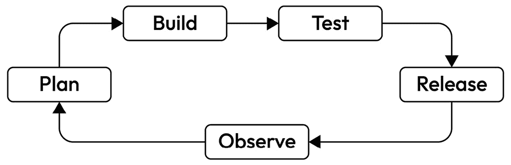
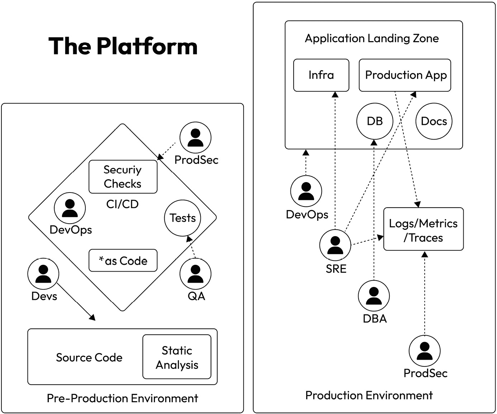
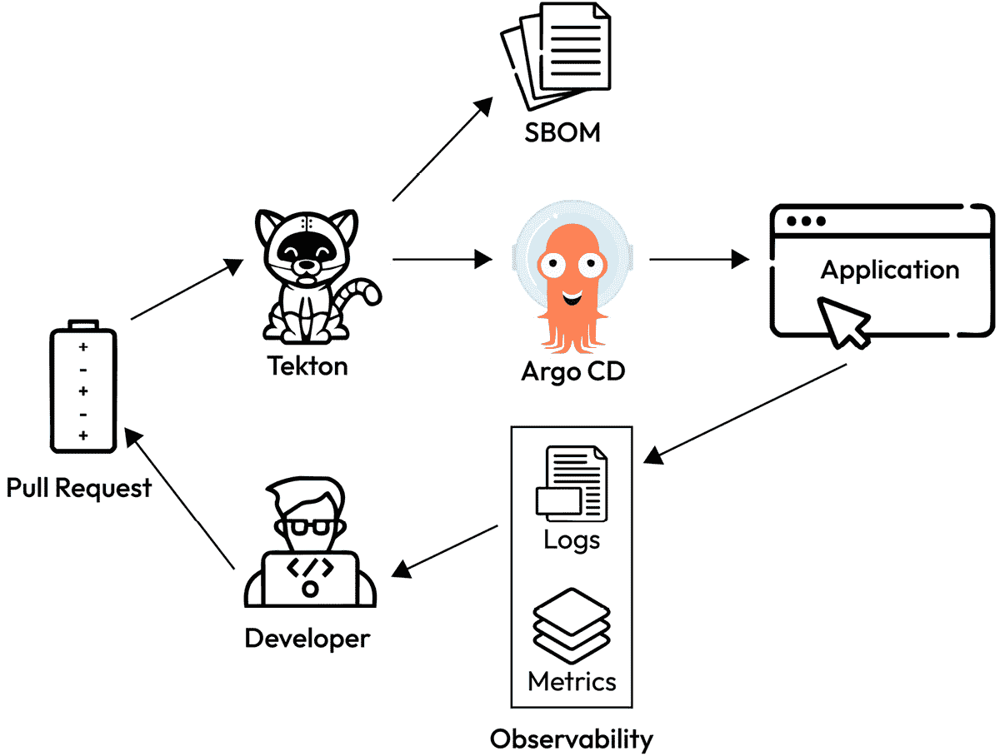
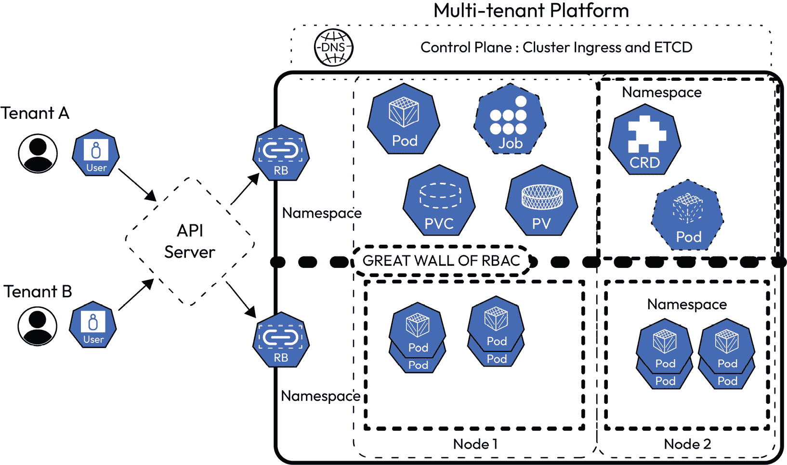
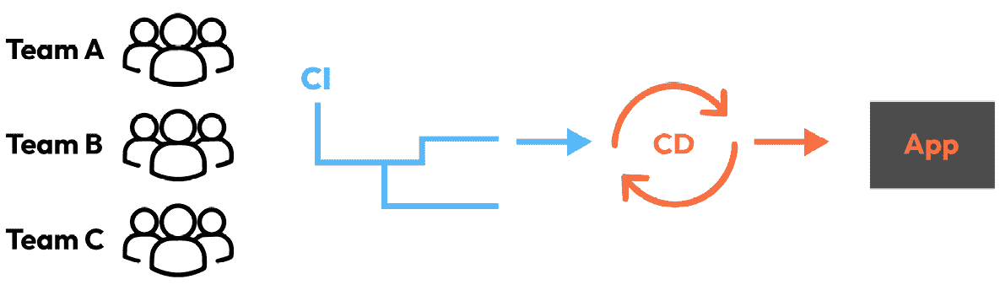
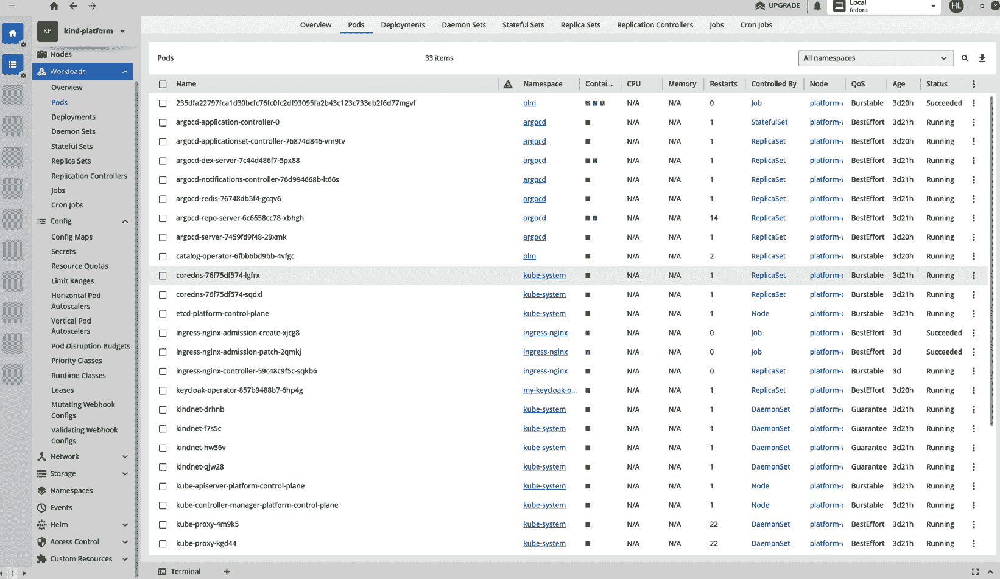
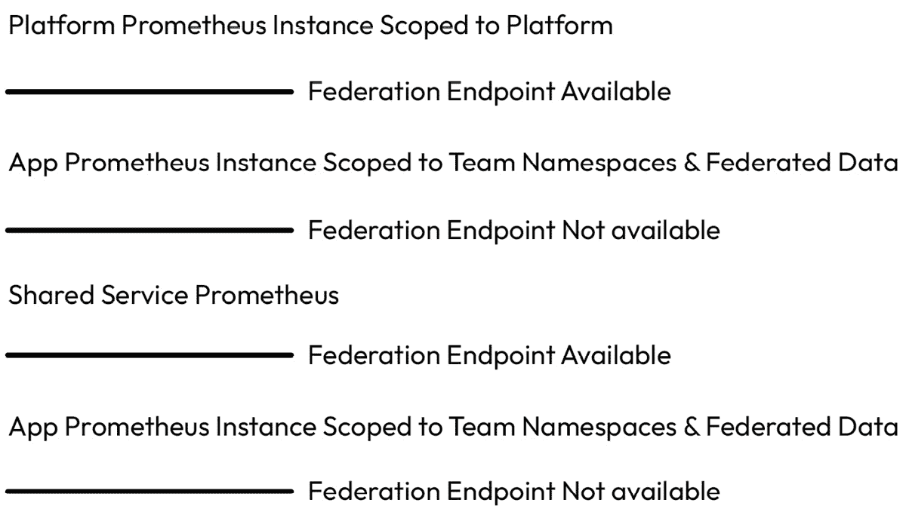

# <st c="0">6</st>

# <st c="2">为开发人员及其自助服务构建</st>

<st c="45">没有可访问功能的平台不是一个平台。</st> <st c="104">作为规则，自助服务应该包含在内，并且必须提高可访问性，以增加价值。</st> <st c="192">在构建平台的过程中，通常没有区分基础设施层和应用层。</st> <st c="307">内部开发者门户（</st>**<st c="326">IDPs</st>**<st c="352">）的集成为此带来了新的复杂性，它解决了一些需求</st> <st c="413">同时也留下了一些未解答的问题。</st> <st c="447">将社区引入你的平台并对他们的贡献持开放态度是很重要的。</st>

<st c="540">在本章中，我们将回顾一些概念，并分享一些最佳实践的思路。</st> <st c="628">到本章结束时，你应该了解如何构建一个具有韧性、灵活性并能够满足用户需求的平台。</st> <st c="776">他们所处的位置。</st>

<st c="785">在本章中，我们将涵盖以下</st> <st c="829">主要主题：</st>

+   <st c="841">软件开发与平台开发——避免</st> <st c="890">混淆</st>

+   <st c="895">减少</st> <st c="905">认知负荷</st>

+   <st c="919">自助服务</st> <st c="933">开发者门户</st>

+   <st c="950">落地、扩展和集成</st> <st c="979">你的 IDP</st>

+   <st c="987">平台可观察性的架构考虑</st> <st c="1038">在平台中</st>

+   <st c="1048">为社区开放你的平台</st> <st c="1082">并促进合作</st>

# <st c="1099">技术要求</st>

<st c="1122">在本章中，将会有一些技术示例，包括</st> `<st c="1183">.yaml</st>` <st c="1188">文件和命令。</st> <st c="1209">虽然你不需要设置集群来跟随本章内容，但如果设置集群，可能会加深你的理解。</st> <st c="1308">我们使用了以下技术来开发我们的示例</st> <st c="1366">和解释：</st>

+   <st c="1383">kind – 测试版本为 kind</st> `<st c="1419">v0.22.0 go1.20.13</st>`

+   <st c="1436">我们使用本指南设置了一个三节点的</st> <st c="1486">集群：</st> [<st c="1495">https://kind.sigs.k8s.io/docs/user/quick-start/#configuring-your-kind-cluster</st>](https://kind.sigs.k8s.io/docs/user/quick-start/#configuring-your-kind-cluster)

+   <st c="1572">Docker（建议使用 Docker 无根设置）</st> <st c="1605">推荐使用</st>

+   <st c="1620">The</st> `<st c="1625">kubectl</st>` <st c="1632">命令行工具</st>

+   <st c="1650">一个</st> <st c="1653">GitHub 仓库</st>

<st c="1664">代码示例可以在</st> `<st c="1707">Chapter06</st>` <st c="1716">文件夹内找到</st> <st c="1724">这里：</st> [<st c="1730">https://github.com/PacktPublishing/Platform-Engineering-for-Architects</st>](https://github.com/PacktPublishing/Platform-Engineering-for-Architects)<st c="1800">。</st>

<st c="1801">在本章中，我们将进行一些小型教程。</st> <st c="1871">尽管并非每个代码片段都需要在 Kubernetes 集群中运行，但建议设置一个本地的 Kind 集群，其中至少包含一个控制平面节点和三个工作节点，以便充分体验教程的价值。</st> <st c="2095">Kind 集群的配置可以在 GitHub 上的章节仓库中找到。</st>

# <st c="2182">软件与平台开发——避免混淆</st>

<st c="2236">在我们迈向</st> <st c="2259">平台开发的过程中，我们必须明确区分平台开发和其他形式的</st> <st c="2336">软件开发。</st> <st c="2359">请记住，平台的目的是为了使开发和运维团队能够进行开发和运营；它并不是客户直接体验的东西，尽管客户确实</st> <st c="2521">间接受益。</st>

<st c="2540">平台的价值在于将构建和交付应用程序所需的所有工具、服务和应用程序统一在一起，呈现在用户面前。</st> <st c="2692">简而言之，平台是开发者用来将软件应用程序交付给最终用户的一系列服务。</st> <st c="2818">你可以</st> <st c="2825">使用现有的软件应用程序，因此也可以在不编写</st> <st c="2893">任何代码的情况下开发</st> <st c="2921">一个平台。</st>

<st c="2930">那么，如何开发一个平台，如何开发软件呢？</st> <st c="2999">它们在哪些地方交集，在哪些地方不同？</st>

## <st c="3049">平台生命周期与软件生命周期</st>

<st c="3104">在</st> <st c="3108">许多</st> <st c="3113">方面，平台的生命周期看起来与任何</st> <st c="3142">软件开发生命周期</st> **<st c="3172">类似</st>** **<st c="3198">（SDLC）</st>** <st c="3203">(</st>**<st c="3205">SDLC</st>**<st c="3209">)。</st>



<st c="3214">图 6.1：一个 SDLC</st>

<st c="3233">在前面的章节中，我们讨论了强大规划阶段的好处，并将平台视为产品的处理方式。</st> <st c="3352">虽然在此过程中避免过度设计平台很重要，但你仍然会最终得到一个具有多方面特性的系统。</st> <st c="3497">因此，由于平台的相对规模和复杂性，平台的发布可能不像按下按钮并让你的更改在一些服务器或集群中传播那样简单。</st> <st c="3680">这在很大程度上是因为平台内部有大量的动态组件。</st> <st c="3772">例如，创建一个新的集成以交付</st> **<st c="3825">软件材料清单</st>** <st c="3851">(</st>**<st c="3853">SBOM</st>**<st c="3857">)将比在现有的策略引擎中调整策略以使其</st> <st c="3867">更具限制性对用户造成的干扰更小。</st>

<st c="3973">如果我们看看</st> <st c="3985">一个典型平台的结构及其</st> <st c="4012">用户考量，理解平台生命周期如何与</st> <st c="4123">软件应用程序</st> <st c="4126">有所不同会更加容易。</st>



<st c="4360">图 6.2：IDP 组件和功能区域示例</st>

<st c="4421">在这个平台示例中，预生产环境位于左侧，生产环境则位于右侧，客户面向的应用程序将在其中部署（</st>**<st c="4579">应用程序着陆区</st>**<st c="4604">）。</st> <st c="4608">无论是单一 Kubernetes 集群、多集群还是多架构，平台是一个紧密结合的整体，包含这两种范式。</st> <st c="4754">平台应该将架构从用户中抽象出来，让他们能够</st> <st c="4834">独立工作。</st>

<st c="4853">在这里，DevOps 工程师关心的是应用程序如何构建和发布。</st> <st c="4931">诸如渐进式发布、DORA</st> <st c="4973">指标（</st>[<st c="4982">https://dora.dev/</st>](https://dora.dev/)<st c="5000">）以及其他 DevOps 实践是平台可能需要支持的内容。</st> <st c="5081">同样，如果您的组织在云原生之路上已经走得很远，那么与生产应用程序操作相关的数据将是站点可靠性工程师关心的内容。</st> <st c="5304">还有其他相关的考量因素，比如安全检查、基础设施即代码以及文档。</st> <st c="5408">这些方面的每一项都可以在平台内单独控制，并对所有或部分</st> <st c="5519">角色可用。</st>

*<st c="5532">图 6</st>**<st c="5541">.2</st>* <st c="5543">假设有专门的角色在工作；然而，如果没有专门的 DevOps 团队，那么开发人员和质量工程师很可能会在这方面分担职责。</st> <st c="5746">这个整体概念仍然适用于即便是小型组织，在这些组织中，一个人可能需要同时承担多个角色的用户故事。</st> <st c="5884">即使是理论上划分的角色，也应该有助于在进行平台生命周期管理时提供帮助。</st>

<st c="5990">平台</st> <st c="6001">不仅仅是软件；它还是与工作负载协同调优的过程，以确保其对用户的性能。</st> <st c="6136">虽然用户需求确实会影响平台的大小、范围和功能，但它应该尽可能设计得不偏不倚，以确保一个用户的黄金路径不会优先于</st> <st c="6329">另一个用户。</st>

## <st c="6342">可靠性与可维护性</st>

<st c="6376">一个平台的</st> **<st c="6390">可靠性</st>** <st c="6401">和</st> **<st c="6406">可服务性</st>** <st c="6420">是开发者在</st> <st c="6428">组织中使用该平台的最大因素。</st> <st c="6481">但这些因素到底意味着什么呢？</st> <st c="6496">这些概念各自到底意味着什么呢？</st>

<st c="6541">从本质上讲，可靠性</st> <st c="6567">涵盖了平台的整体可用性以及用户与平台成功互动的能力。</st> <st c="6626">平台的可靠性应假设已经在平台中实现了多租户（多个用户之间完全隔离）。</st> <st c="6678">这是因为这个概念仍然可以在不需要的地方应用，但你的平台仍然支持具有各自需求的多个用户。</st> <st c="6831">尽管多租户对于内部工具而言并不是直观的做法，但高度监管的团队可能更愿意在一个隔离的环境中工作，以确保没有安全性和合规性违规的风险。</st> <st c="6988">即使所有用户都是内部客户，他们仍然不应该暴露于或受到其他</st> <st c="7300">用户工作负载的影响。</st>

<st c="7315">为了实现平台的可靠性，你应该利用调优和策略，帮助你确保工作负载隔离，并保持平台的完整性。</st> <st c="7480">在 Kubernetes 环境中，一个节点可以是虚拟机或真实硬件。</st> <st c="7559">与任何机器一样，每个节点都有分配给它的固定内存和 CPU。</st> <st c="7642">然而，与标准虚拟机不同，当你超额分配 CPU 时，节点可以使用原本属于其他节点的 CPU。</st> <st c="7790">这一点对内存不适用，虽然内存也可以被过度订阅，且</st> **<st c="7859">内存不足</st>** <st c="7872">(</st>**<st c="7874">OOM</st>**<st c="7877">) 会</st> <st c="7885">导致节点重启。</st> <st c="7909">这样可以通过保证在 CPU 周期可用时，资源能够使用这些 CPU 周期，从而降低整体资源需求；然而，另一方面，由于软件错误导致的 CPU 占用过多的恶劣进程，可能永远无法将 CPU 周期返回给节点池，以便再次使用。</st> <st c="8203">其他因素，例如 Pod 优先级、请求、限制和 Pod 中断预算，会影响调度器如何决定在哪个地方以及如何调度 Pods，是否会驱逐已有的工作负载。</st> <st c="8427">有关这些主题的更多信息，重要的是定期查看 Kubernetes 文档，因为新特性和最佳实践不断涌现，而该项目也在持续</st> <st c="8600">发展（</st>[<st c="8609">https://kubernetes.io/docs/home/</st>](https://kubernetes.io/docs/home/)<st c="8642">）。</st>

<st c="8645">虽然这些设置的最终调优和编排需要</st> <st c="8661">由平台工程团队来决定，但我们通常建议，这些调优应该成为规划阶段的一部分。</st> <st c="8717">在平台生命周期内，你应该持续不断地进行评估。</st> <st c="8849">你应该在平台的生命周期中持续重新评估。</st> <st c="8907">平台。</st>

<st c="8918">平台的可服务性</st><st c="8934">类似于可靠性，不同之处在于可服务性更多关注的是需要利用平台的用户的黄金路径。</st> <st c="9091">为了使平台具有可服务性，它需要满足用户的需求。</st> <st c="9167">与自助服务不同，自助服务是用户在不依赖管理团队的情况下，能够合理完成所有合理操作的能力，可服务性则从整体上看待所有用户需求，并在用户所在的位置满足这些需求。</st> <st c="9387">可靠性可以视为可服务性的衡量标准，但满足用户需求的目标比单纯的可靠性更加全面。</st> <st c="9535">可服务性是平台产品思维的核心</st><st c="9583">，</st> <st c="9591">平台的核心。</st>

<st c="9604">类似于关键用户旅程，</st> <st c="9645">黄金路径映射了系统用户的更关键使用场景。</st> <st c="9713">一般来说，这是用户可以采取的步骤序列，并期望达到</st> <st c="9786">预期结果。</st>

<st c="9802">对于利用 IDP 的应用程序开发者来说，黄金路径可能是这样的：</st>



<st c="9973">图 6.3：使用 IDP 的黄金路径示例</st>

<st c="10025">开发者推送提交后，</st> **<st c="10068">持续集成</st>** <st c="10090">(</st>**<st c="10092">CI</st>**<st c="10094">) 系统</st> <st c="10103">自动执行其魔法。</st> <st c="10120">应用程序或应用程序的升级</st> <st c="10168">进入生产环境后，它会将数据发送回日志记录和可观察性工具，供开发者利用，从而使他们能够获得关于应用程序生产状态</st> <st c="10357">和性能的洞察。</st>

## <st c="10373">结论</st>

<st c="10388">考虑到这一点，我们现在可以看一下，平台工程的 SDLC 与一个平台运行的应用程序开发之间的分歧。</st> <st c="10552">在平台的黄金路径中，用户不再是与一个完成所有工作的服务或不透明系统交互，而是与由多个服务组成的系统交互。</st> <st c="10720">这些服务中的一些或全部可能是自家研发的，但更可能是这些服务是内部工具与开源技术的混合，共同协作，构建出我们所说的</st> *<st c="10917">平台</st>*<st c="10929">。</st>

<st c="10930">由于平台由多个组件构成，你还可以基于每个组件来拆解平台的 SDLC。</st> <st c="11043">然而，与任何系统一样，你必须警惕那些需要多个组件一起发布的相互依赖关系。</st> <st c="11167">这些组件必须协调发布。</st>

<st c="11178">你的开发人员需要能够透明和不透明地使用这些系统。</st> <st c="11276">这意味着，虽然平台中的每个工具的使用应该自动化融入工作流程中，但开发人员应能够看到发生了什么，并在必要时调试各个部分的问题。</st> <st c="11496">例如，如果一个 Tekton CI 任务失败，我们示例中的应用开发人员需要能够看到失败的任务，并深入了解任务失败的原因，从而帮助他们修复应用或 CI 任务。</st> <st c="11717">CI 任务。</st>

<st c="11724">了解如何有效管理平台生命周期，同时尽量减少对用户的影响，可能就像是在“喝自家酿的香槟”，意味着平台团队使用他们提供给用户的相同流程和技术。</st> <st c="11966">平台的构建和生命周期管理可以利用相同的 DevOps 工具；</st> *<st c="12055">代码即配置（star (*) as code）</st>* <st c="12071">等模式，如</st> *<st c="12089">文档即代码（docs as code）</st>*<st c="12101">、</st> *<st c="12103">基础设施即代码（infrastructure as code）</st>*<st c="12125">和</st> *<st c="12131">配置即代码（configuration as code）</st>* <st c="12152">都对平台的构建和发布有重要影响。</st> <st c="12208">然而，与软件应用程序不同，对于平台的最终用户来说，这些声明式的内容对他们的影响最大，尤其是与诸如银行应用等完全封闭的 DevOps 方面相比，后者对最终用户完全是黑盒处理。</st> <st c="12394">这些 DevOps</st><st c="12438">方面对于平台最终用户来说完全是黑盒的。</st> <st c="12495">客户的身份会极大影响软件工程的某一方面相对于其他方面的重要性，因此区分了</st> *<st c="12638">软件开发和</st>* *<st c="12651">平台开发</st>*<st c="12671">。</st>

<st c="12672">以用户为中心的设计同样是理解平台成功所需优先考虑的事项的关键。</st> <st c="12789">虽然用户自身会在很大程度上提供相关信息，但随着本章的推进，我们将重点强调我们认为对成功平台最为重要的方面。</st> <st c="12953">成功的平台</st>。

<st c="12973">通过对平台的 SDLC 有了新的理解，我们可以开始利用这些知识来阐明将平台构建为**产品**的意义。</st>

# <st c="13122">减少认知负荷</st>

<st c="13156">在</st> *<st c="13160">第一章</st>*<st c="13169">中，我们提到了</st> *<st c="13203">减少认知负担</st>*<st c="13226">的重要性。随着技术和系统的发展，它们变得更加复杂。</st> <st c="13288">高度的复杂性意味着理解系统的每个部分将成为更大的心理负担。</st> <st c="13407">曾经的单体应用程序时代已经过去，</st> **<st c="13454">Linux, Apache, MySQL, PHP</st>** <st c="13479">(</st>**<st c="13481">LAMP</st>**<st c="13485">) 堆栈</st> <st c="13493">已经成为历史。</st> <st c="13509">现在，微服务、云、虚拟网络等已成为软件应用程序日常操作的组成部分。</st>

<st c="13655">在现代软件架构中，完整栈软件工程师不再需要理解运行应用程序代码的服务器或操作系统。</st> <st c="13813">平台为他们处理了这些问题。</st> <st c="13855">然而，尽管平台可以抽象出许多细节，开发人员仍然需要对底层技术有一定的意识和理解，特别是当这些技术与他们的应用程序相关时。</st> <st c="14080">因此，平台必须在简化用户操作和提供所需信息之间找到平衡，避免提供那些不相关的“噪音”。</st>

<st c="14229">如果我们对比</st> <st c="14247">和对照不同角色的优先级，</st> <st c="14279">我们可以将平台的范围与这些用户的需求进行对照。</st>

| **<st c="14365">平台团队</st>** | **<st c="14379">双方</st>** | **<st c="14384">开发团队</st>** |
| --- | --- | --- |
| <st c="14401">租户应用程序</st> | <st c="14413">平台可用性</st> | <st c="14435">应用程序可用性</st> |
| <st c="14460">用户管理</st> | <st c="14476">团队 RBAC</st> | <st c="14486">应用程序 SLO/SLI</st> |
| <st c="14506">用户认证</st> | <st c="14526">安全</st> | <st c="14535">通过/失败</st> <st c="14546">CI 测试</st> |
| <st c="14554">网络</st> | <st c="14565">合规性</st> | <st c="14576">CD</st> <st c="14580">工作成功</st> |
| <st c="14591">平台 SLO/SLI</st> | <st c="14608">日志聚合</st> | <st c="14624">应用程序升级</st> |
| <st c="14645">平台升级</st> | <st c="14663">错误和</st> <st c="14674">异常追踪</st> | <st c="14692">应用程序</st> <st c="14705">资源基准测试</st> |
| <st c="14726">平台扩展性</st> | <st c="14743">政策违规</st> |  |
| <st c="14760">平台架构</st> | <st c="14782">配额消耗</st> |  |
| <st c="14800">平台可维护性</st> | <st c="14824">应用程序性能</st> |  |

<st c="14848">表 6.1：对比开发团队与平台团队的优先级</st>

<st c="14927">正如你所看到的，即使有平台团队</st> <st c="14939">负责许多应用程序交付给最终用户的方面，应用程序的开发团队仍然有许多需要考虑的问题。</st> <st c="14969">平台可以处理共享的考虑因素，例如安全性和合规性，但平台的工作并不是保证开发团队生产的应用程序具有良好的性能。</st> <st c="15124">你可以将你的 IDP 视为一种托管服务，这对于</st> <st c="15404">该产品来说并不是一个坏的定义。</st>

<st c="15416">作为一种托管服务，旨在实现“做”和“启用”之间的平衡，前面的表格成为了构建成功平台的路线图。</st> <st c="15565">例如，通过在可观察性和可靠性工具方面进行投资，平台可以支持开发团队管理他们的考量，同时抽象掉它能抽象掉的其他一切。</st> <st c="15765">一个不必关心聚合日志如何存储的开发人员，但知道如何在需要时访问它们，可以显著简化日常工作流程，从而让更多的精力投入到功能开发中，而不是运营负担。</st> <st c="16009">这种认知负荷的减少可以导致团队的上下文切换更少，从而减少错误和压力。</st> <st c="16136">通过这种方式，对平台的投资就是对开发团队生产力和健康的投资。</st> <st c="16229">开发团队。</st>

<st c="16246">如果我们回想一下我们虚构的公司，Financial One ACME，我们可以想象在公司进行云转型战略时，认知负荷会变得更加重要。</st> <st c="16416">由于公司并不是从零开始构建一切，开发人员不仅要维护遗留系统和架构，还要进行新的时代重构。</st> <st c="16578">支持这一工作的平台可以让开发人员学得更少。</st> <st c="16652">他们只需要知道平台在他们进行重构和</st> <st c="16754">迁移战略时对他们的期望。</st>

<st c="16773">平台对减少认知负荷的承诺本质上是向开发人员做出的承诺，即你将帮助他们更高效地工作。</st> <st c="16924">减少上下文切换、迅速直接的反馈循环和易用性，所有这些都有助于提高开发人员的工作满意度。</st> <st c="17038">快乐的开发人员是压力更小的同事，有助于创造更加积极的工作环境，这对开发团队和</st> <st c="17180">平台团队来说都是双赢的局面。</st>

## <st c="17195">在平衡认知负荷的同时使用平台</st>

<st c="17247">尽管平台的许多功能是为了构建应用程序，但它同样必须能够支持应用程序的运行。</st> <st c="17267">尽管平台的需求应当有详细的文档记录且易于理解，但人类往往容易出错；因此，平台必须强制执行其规范。</st> <st c="17370">幸运的是，Kubernetes 在一定程度上本身就支持这一点，通过准入控制器</st> <st c="17560">和</st> **<st c="17653">基于角色的访问控制</st>** <st c="17678">(</st>**<st c="17680">RBAC</st>**<st c="17684">)，但你也可以利用工具如策略引擎来确保那些不符合规范的工作负载或操作被拒绝，并给用户返回错误信息。</st> <st c="17858">越早收到反馈，用户的认知负担越轻，因为他们不需要切换上下文来响应</st> <st c="17984">平台。</st>

<st c="17997">那么，如何通过内部</st> <st c="18096">开发者平台来减少工程团队的认知负担呢？</st>

<st c="18115">如果你不知道从哪里开始，考虑到实现细节时，从同理心出发。</st>

<st c="18208">假设你是使用该平台的工程师之一。</st> <st c="18266">现在是凌晨四点，你正处于慌乱中，而没有其他人能帮助你。</st> <st c="18333">问问自己：“</st>*<st c="18348">这会容易使用吗？</st>*<st c="18374">” 当你对自己的方法感到满意时，找一位工程师来验证</st> <st c="18448">你的假设。</st>

<st c="18465">每个细节都应与这一原则保持一致。</st> <st c="18513">如果核心功能简单且能简化用户的操作，用户就无需承担认知负担。</st> <st c="18614">在考虑其他方面时，</st> <st c="18652">比如集成，遵循相同的方法。</st> <st c="18696">直接的架构往往是最有效的。</st> <st c="18756">如果“</st>*<st c="18760">为什么会有这个架构存在？</st>*<st c="18791">”这个问题无法用“</st>*<st c="18819">因为它帮助了用户</st>*<st c="18845">”来回答，也许它根本不应该存在。</st> <st c="18879">完全没有必要。</st>

<st c="18886">通过微调 IDP 的操作，仍然可以取得显著的提升。</st> <st c="18980">此外，设定平台上应用程序的标准，你的团队可以为它们定义一个成熟度模型。</st> <st c="19111">这个成熟度模型将帮助定义一个应用程序需要具备哪些条件，才能成为平台环境中的成功成员，这意味着开发者可以以此为检查表进行工作，而无需进行实验、向人请教，</st> <st c="19340">或猜测。</st>

## <st c="19349">前期生产与生产阶段</st>

<st c="19382">一个平台既涵盖</st> <st c="19405">预生产</st> <st c="19420">环境，也涵盖生产环境，用于软件应用程序。</st> <st c="19464">平台中应用程序</st> <st c="19510">所在的部分被称为</st> **<st c="19539">应用程序</st>** **<st c="19551">着陆区</st>**<st c="19563">。</st>

<st c="19564">尽管平台必须考虑这两者，但这两者永远不应混合，因此平台必须在环境之间强制执行逻辑分隔。</st> <st c="19705">它可以通过架构或策略来实现。</st> <st c="19750">然而，架构是最好的，也是最安全的模型，我们将在</st> *<st c="19836">第七章</st>* <st c="19845">中进一步讨论。在当前章节中，尽管我们可能会提到安全最佳实践和分隔策略，但详细的解释可以在</st> *<st c="19998">第七章</st>* <st c="20007">中找到。本章中关于这些环境的重要要点应是它们如何与认知负荷互动，以及平台如何旨在减少这两个范围内的负荷。</st>

## <st c="20184">身份验证与租户管理</st>

<st c="20211">随着平台</st> <st c="20228">的扩展和用户的增加，它实际上变成了多租户平台。</st> <st c="20294">这是由于在安全环境中确保最小权限策略的重要性，以及帮助确保用户之间不会互相干扰。</st> <st c="20449">在</st> <st c="20454">多租户环境下，仍然需要提供单租户的体验，这意味着其他用户和租户的存在必须对</st> <st c="20608">每个用户隐藏。</st>

<st c="20618">你将添加到平台的第一个集成通常与身份验证和用户管理相关。</st> <st c="20723">大多数</st> **<st c="20728">OpenID Connect</st>** <st c="20742">(</st>**<st c="20744">OIDC</st>**<st c="20748">) 提供商</st> <st c="20760">可以集成到常见的身份提供者（IDP）工具链中，因此选择正确的提供商不会很困难。</st> <st c="20860">从那时起，用户管理就变得相对直接，尽管不同的工具之间有所不同。</st> <st c="20961">为了减少认知负荷，越少越好，因此一种跨平台进行身份验证的方式意味着用户需要记住的登录流程更少，每天的登录次数更少，密码也更少，同时提供与其他工具相同的统一体验，</st> <st c="21209">这对于公司内部的其他工具也适用。</st>

<st c="21219">让我们在一个更现实的场景中来看这个问题。</st> <st c="21269">Financial One ACME 是一家银行。</st> <st c="21299">这意味着它们处于一个高度监管的行业，需要保护大量非常敏感的数据。</st> <st c="21395">控制谁能访问哪些数据，以及如何访问这些数据，是公司安全性和合规性方面最重要的内容之一。</st> <st c="21543">期望用户每次都完美地记住并执行所有这些安全和合规实践，实在是过于苛刻。</st> <st c="21666">因此，平台需要程序化地强制执行</st> <st c="21702">这些规则。</st>

满足任何行业的这些<st c="21724">要求</st>，无论是否高度监管，最终都归结于<st c="21738">RBAC —— 如何将用户相互隔离，并确保他们只拥有需要的权限，而没有不必要的访问权限。</st> <st c="21812">请查看下图，了解一个</st> <st c="21999">多租户身份提供者（IDP）的示例。</st>



<st c="22265">图 6.4：IDP 集群中的多租户</st>

<st c="22308">在这个例子中，两个租户的工作负载可以共享一个节点的空间，但通过 RBAC，租户无法看到在同一节点上运行的其他工作负载。</st> <st c="22487">另一种选择是确保每个节点上只能运行一个租户的工作负载。</st> <st c="22575">然而，这种隔离程度可能会带来负面影响，因为它可能会影响</st> **<st c="22661">高可用性</st>** <st c="22678">，或者需要更多节点来确保租户之间完全隔离并保持高可用性。</st> <st c="22788">我们在</st> *<st c="22837">第三章</st>*<st c="22846">讨论了平台的高可用性，这些相同的原则也适用于你的开发团队正在开发的应用程序。</st> <st c="22940">与平台一样，高可用性是应用程序韧性的一项特征。</st> <st c="23042">这可能意味着它通过扩展来处理负载的能力，或者仅仅是其整体的正常运行时间。</st> <st c="23130">影响高可用性的因素之一是位置。</st> <st c="23185">虽然你可能在</st> <st c="23220">一个</st> **<st c="23222">副本集（ReplicaSet）</st>** <st c="23232">中有三个 Pod，但如果这三个 Pod 都在同一个节点上，并且该节点被重启（例如平台升级时），那么应用程序将会停机；因此，它就不是高可用的。</st> <st c="23433">通常，高可用的应用程序会将副本集分布在多个节点上，如果这些节点位于不同的可用区，则该应用程序会增加一层额外的韧性。</st> <st c="23657">遵循云原生平台最佳实践的开发人员通常会期望他们的应用程序具备高可用性，这意味着至少有两个副本集在</st> <st c="23838">不同节点上运行。</st>

## <st c="23854">RBAC</st>

<st c="23859">无论租户模型如何，Kubernetes 系统中的 RBAC 将成为平台自服务的骨架。</st> <st c="23974">你将使用 RBAC 限制用户对 IDP 的访问，仅限于他们的工作负载将落在 IDP 中的命名空间和环境。</st> <st c="24114">此外，你将在面向最终用户的环境中也有类似的</st> <st c="24147">RBAC 策略，应用程序将在该环境中运行。</st> <st c="24228">生产环境中的 RBAC 策略将比开发环境中更为严格，因为需要对这些权限进行更高程度的审查。</st> <st c="24424">你将在</st> *<st c="24456">第七章</st>*<st c="24465">中学习更多关于此的内容。</st>

<st c="24466">进一步阅读</st>

<st c="24482">Kubernetes 的官方文档可以在此找到</st> <st c="24531">：</st> [<st c="24537">https://kubernetes.io/docs/reference/access-authn-authz/rbac/</st>](https://kubernetes.io/docs/reference/access-authn-authz/rbac/)<st c="24598">。</st>

<st c="24599">借用官方文档中的一个示例，我们可以看到一个 RBAC 示例，在该示例中，分配给用户的角色使其能够读取机密，但不能编辑或</st> <st c="24801">删除它们：</st>

```
 apiVersion: rbac.authorization.k8s.io/v1
kind: ClusterRole
metadata:
 # "namespace" omitted since ClusterRoles are not namespaced
 name: secret-reader
rules:
- apiGroups: [""]
 #
 # at the HTTP level, the name of the resource for accessing Secret
 # objects is "secrets"
 resources: ["secrets"]
 verbs: ["get", "watch", "list"]
```

<st c="25134">与这个示例类似，通过利用</st> <st c="25173">RBAC，你可以为用户设置适当的守护措施，让他们成功地在平台上导航。</st> <st c="25276">那么，如何确定一个强健的 RBAC 策略需要具备哪些条件，以便在访问、操作和限制之间找到平衡呢？</st> <st c="25406">这时，自助服务成为核心。</st> <st c="25453">让我们看看你的用户可能会在平台上期望的工作流。</st>



<st c="25535">图 6.5：IDP 用户的示例工作流</st>

在*<st c="25609">图 6</st>**<st c="25617">.5</st>*<st c="25619">中展示的示例中，我们有多个团队，因此，团队内可能有多个用户，他们依赖于同一平台中的相同系统。</st> <st c="25747">有时，他们会在同一时间依赖于相同的系统。</st> <st c="25817">根据你选择的 CI/CD 系统，最佳实践可能有所不同；然而，一般而言，平台团队的目标是确保为 IDP 所需的组件能够扩展</st> <st c="26016">到用户。</st>

<st c="26025">用于 Kubernetes 集群的身份验证系统也可以用于类似 Argo CD 的预生产工具，允许用户在同一个 Argo</st> <st c="26215">CD 实例中利用独立的项目。</st>

<st c="26227">虽然这不是最佳实践，但技术上可以对生产级访问实施相同的访问模式；然而，当访问生产环境时，最佳做法是进行更严格的身份验证，并且一旦验证通过，权限集应更加有限。</st> <st c="26518">我们将在</st> *<st c="26546">第七章</st>*<st c="26555">中进一步讨论，</st> *<st c="26557">构建一个</st>* *<st c="26568">安全平台</st>*<st c="26583">。</st>

## <st c="26584">防止“噪音邻居”问题</st>

<st c="26610">噪声邻居如何影响认知负荷可能不是显而易见的，但防止这种事件的发生有助于避免生产事件，这些事件可能很难排查和解决，尤其是在多租户环境成为标准的情况下。</st> <st c="26665">它还帮助用户排查他们的应用程序，或帮助平台团队排查生产问题，通过排除随着更多保护措施到位而变得不太可能的场景。</st> <st c="26886">由于你的开发团队应当预期有限访问 IDP 的生产端，并且无法访问其他团队的指标和工作负载，因此所有防止噪声邻居的工作都有助于确保这些工作负载不太可能进入每个团队的</st> <st c="27364">认知负荷。</st>

<st c="27379">在 IDP 的上下文中，噪声邻居指的是与其他工作负载在同一环境中运行，并且占用资源的工作负载，无论是通过大量的网络流量、CPU 或内存使用，还是其他不太邻里友好的行为。</st> <st c="27631">就像城市会有条例防止邻居封锁街道或播放过大声的音乐一样，平台可以实施规范，确保一个工作负载不会对另一个工作负载产生负面影响。</st> <st c="27826">影响。</st>

<st c="27841">在许多实际场景中，一个 Kubernetes 集群被用于多个环境。</st> <st c="27934">对于云支出预算较为有限的组织，开发、QA、预生产和生产环境可能都位于同一个集群上。</st> <st c="28077">从技术角度讲，整个 IDP 可以是一个集群。</st> <st c="28135">虽然这不是我们认为的最佳实践，但它是一个极其常见的做法，用于降低成本。</st> <st c="28248">正是在这些场景中，噪声邻居最有可能发生，但即使在生产环境完全隔离的情况下，也有可能发生，原因可能是某个工作负载遇到软件漏洞，或因为有效原因导致资源使用率高于正常水平。</st> <st c="28500">容器化工作负载在防范这些共享环境中的噪声邻居场景方面有优势，因为这些 Pod 和容器定义可以持有资源定义，工作负载的封装性是一种优势，特别是在资源管理方面。</st> <st c="28785">虽然绝大多数防范噪声邻居场景的保护应当作为软件应用的防御性编程的一部分，另外还应通过准确地对这些应用程序的资源需求进行基准测试和识别，但平台本身也有能力进行硬化。</st> <st c="29072">硬化。</st>

<st c="29080">你如何实现这种硬化？</st> <st c="29117">以下是实现方法：</st>

+   <st c="29128">即使在强制实施工作负载隔离最佳实践的情况下，也要注意资源共享，例如 etcd、API 服务器和</st> <st c="29266">网络栈</st>

+   <st c="29282">采取预防措施避免</st> <st c="29318">CPU 饥饿</st>

+   <st c="29332">集群自动扩展——自动添加（或移除）</st> <st c="29391">节点</st>

### <st c="29399">etcd 的维护和管理</st>

<st c="29428">etcd 是一个键值存储，用于保存集群中所有 Kubernetes 对象的定义——如 Pod 定义、作业定义、StatefulSets、DaemonSets，</st> **<st c="29591">CustomResourceDefinitions</st>** <st c="29616">(</st>**<st c="29618">CRDs</st>**<st c="29622">) 等等，这些都保存在 etcd 中。</st> <st c="29660">这意味着，随着平台使用量的增加，etcd 可能会变得相当满。</st> <st c="29722">etcd 项目</st> <st c="29737">建议为 etcd Pods 分配一组最小资源，以确保生产环境中的顺利运行。</st> <st c="29859">详细的推荐可以在 etcd 文档中找到（</st>[<st c="29919">https://etcd.io/docs/v3.6/op-guide/hardware/</st>](https://etcd.io/docs/v3.6/op-guide/hardware/)<st c="29964">），其功能领域包括磁盘、网络、CPU 和内存。</st> <st c="30032">随着集群使用量的增加，etcd 的需求也会增加。</st> <st c="30098">通常，etcd 的最佳实践包括确保其优先使用 CPU、网络和专用磁盘，具有高吞吐量和低延迟。</st> <st c="30250">如果可能，应该使用**<st c="30252">固态硬盘</st>** (<st c="30271">SSD</st>) 来存储 etcd 数据。</st> <st c="30326">etcd</st> <st c="30335">文档中有一些关于 etcd 调优的建议，我们这里不再重复。</st> <st c="30430">保持跟进项目本身的最新建议非常重要，因为技术会随着时间不断演进。</st> <st c="30566">由于 etcd 是 Kubernetes 集群成功运行的关键组件，因此必须仔细监视其可观察性，并主动应对磁盘压力或其他资源问题的迹象，这对于保证</st> <st c="30817">平台的可用性至关重要。</st>

<st c="30839">即使在优化了 etcd 配置之后，etcd 的实际使用或过度使用仍然可能导致资源竞争。</st> <st c="30965">例如，云原生 CD 系统 Argo CD 将作业存储为 CRD 条目，而不是 Kubernetes 作业。</st> <st c="31070">随着 Argo CD 中团队和部署数量的增加，etcd 中的条目数也会增加。</st> <st c="31172">如果 etcd 填满，Kubernetes API 服务器将会宕机。</st> <st c="31227">为防止这种情况，必须确保 etcd 健康并且不会</st> <st c="31302">过度填充。</st>

<st c="31319">一种方法是确保你从 etcd 中修剪掉旧的</st> <st c="31367">CRD 条目。</st> <st c="31391">在 Argo CD 的情况下，这个功能是原生集成到应用中的。</st> <st c="31466">在标准 Kubernetes 作业的情况下，可以通过在作业定义的</st> `<st c="31598">spec</st>` <st c="31602">字段中应用所需的时间，来使用生存时间（TTL）机制。</st> <st c="31632">这样，在作业成功或失败后经过一定时间，垃圾回收机制将运行并移除该条目，从而管理 etcd 的大小和健康状态。</st>

<st c="31830">类似地，其他 Kubernetes 类型也有各自的清理机制。</st> <st c="31918">对于部署（Deployments），有一个规范是</st> `<st c="31955">revisionHistoryLimit</st>`<st c="31975">，它决定了将保留多少个旧版本的部署。</st> <st c="32054">如果该数字为 0，那么在生产问题发生时，部署将无法回滚，但 etcd 会保持干净，像</st> <st c="32174">口哨一样清晰。</st>

<st c="32184">如何调整这些清理措施，将取决于用户数量以及这些用户生成的 etcd 条目数量。</st> <st c="32328">etcd 的大小也是一个因素，而这个因素可以通过增加控制平面节点的大小来扩展。</st> <st c="32442">因此，何时扩展，何时修剪，何时考虑向 IDP 环境中添加集群，将是一个成本管理、投资回报率（ROI）和平台生命周期的基本部分。</st> <st c="32635">它还需要成为你为 IDP 选择的集成工具的一个因素，但我们会在</st> *<st c="32753">第八章</st>*<st c="32762">中更详细地讨论成本管理。</st>

### <st c="32763">理解 CPU 和调度器以避免饥饿现象</st>

<st c="32823">在集群范围内共享的下一个资源是 CPU，无论租户模型如何。</st> <st c="32921">如前所述</st> <st c="32935">，在讨论可靠性时，我们提到过，在 Kubernetes 中，每个节点对象可以使用的内存是有限制的。</st> <st c="33063">所有 Pod 及其内存请求都会被汇总，如果总内存超过分配给节点的内存，Pod 将被调度到有足够空间的其他节点，或者调度失败。</st> <st c="33277">如果 Pod 尝试使用超出节点可用内存的内存，将会被终止并重新调度。</st> <st c="33379">内存分配在节点之间有严格的边界。</st> <st c="33443">CPU 看起来也具有相同的功能，但实际上，所有 CPU 都可以被所有节点使用。</st> <st c="33556">这意味着，虽然应用性能可能主要是开发团队的考虑因素，但开发人员不必担心平台是否能够支持应用的需求。</st> <st c="33759">虽然开发人员需要告知平台工作负载的需求，但平台需要能够</st> <st c="33874">支持这些需求。</st>

<st c="33885">Kubernetes 中的 CPU 管理的实际实现是</st> **<st c="33952">完全公平调度器</st>** <st c="33977">(</st>**<st c="33979">CFS</st>**<st c="33982">)，它</st> <st c="33991">与</st> <st c="34012">Linux 内核</st> <st c="34029">使用的是相同的调度器。</st> <st c="34036">从功能上来说，这意味着，如果 CPU</st> <st c="34154">是可用的，</st> 节点上的工作负载可以使用超出节点分配的 CPU 资源。</st>

<st c="34167">虽然这种超额分配 CPU 的能力在某些情况下可能有用，因为它可以在技术上支持“二进制打包”，允许平台支持更多的工作负载，只要它们不会同时运行，并且不需要保留更多的虚拟硬件（或者如果你在裸金属上运行，就是实际硬件），但也有一些原因，你可能希望防止部分或所有 CPU 以这种方式被使用，即使它在</st> <st c="34587">技术上是可用的。</st>

<st c="34609">例如，在生产环境中，可能会有一些工作负载必须始终保持高性能，或者特别敏感于 CPU 缓存，而其他操作则可以稍微慢一些，或者更自由地重新调度到新节点。</st> <st c="34848">对于这些情况，你可以通过更改 CPU</st> <st c="34932">管理策略</st> <st c="34947">更好地保证 CPU 可用性。</st>

<st c="34947">要了解 Kubernetes 中 CPU 管理的完整实现，</st> <st c="35003">请阅读文档</st> <st c="35042">此处：</st> [<st c="35048">https://kubernetes.io/docs/tasks/administer-cluster/cpu-management-policies/</st>](https://kubernetes.io/docs/tasks/administer-cluster/cpu-management-policies/)<st c="35124">。</st>

<st c="35125">该平台需要在 kubelet 配置中启用 CPU 管理策略，以便将 CPU 从池中排除。</st> <st c="35260">你需要定义预留多少 CPU，但可以保留所有 CPU，减去运行 Kubernetes 关键工作负载所需的部分。</st> <st c="35408">为了达到预期的结果，即保证某个 Pod 具有所需的 CPU，而其他 Pod 则牺牲部分资源，开发者需要在 Pod 配置中指定请求（requests）和限制（limits），并且这两个值</st> <st c="35634">必须匹配。</st>

<st c="35645">这是一个示例</st> <st c="35664">Pod 配置：</st>

```
 spec:
 containers:
 - name: myCPUPrivilegedPod
   image: docker-registry.nginx.com/nap-dos/app_protect_dos_arb:1.1.1
   resources:
     limits:
       memory: "200Mi"
       cpu: "2"
     requests:
       memory: "100Mi"
       cpu: "2"
```

<st c="35864">一旦你的节点按这种方式配置，它将被平台认定为</st> *<st c="35922">保证的</st>* <st c="35932">，因此能够使用独占</st> <st c="35989">CPU。</st> <st c="35995">该</st> **<st c="35999">kube-scheduler</st>** <st c="36013">(</st>**<st c="36015">调度器</st>** <st c="36024">简称为调度器) 会优先安排它运行在支持 Pod CPU 需求的节点上。</st> <st c="36074">如果只有一个节点符合条件，那么调度器会优先选择它；然而，如果你配置了多个或所有节点以使用独占 CPU，则虽然 Pod 的优先级较高，因而不太可能被迁移（除非遇到极端情况），它仍然可能被放置到</st> <st c="36404">新的节点上。</st>

<st c="36413">为了确保始终选择特定节点，或者始终选择某种类型的节点，你可以为节点添加标签。</st> <st c="36533">这样做有助于调度器将 Pod 匹配到在 Pod 配置中定义标签的节点上。</st> <st c="36622">这进一步确保了 Pod 的正确放置，除了防止“吵闹邻居”外，还可用于其他场景。</st> <st c="36723">。</st>

<st c="36731">如果你决定使用本地 kind 集群并且还没有设置，先让我们来设置这个集群。</st> <st c="36843">首先，克隆本书的 GitHub 仓库，并切换到</st> *<st c="36931">第六章</st>*<st c="36940">：</st>

```
<st c="36942">git clone https://github.com/PacktPublishing/Platform-Engineering-for-Architects.git</st>
<st c="37026">//asuming Linux</st>
<st c="37042">cd Platform-Engineering-for-Architects/Chapter06</st>
<st c="37091">kind</st> <st c="37096">create cluster --config kind-config.yaml --name platform</st>
```

<st c="37153">创建好命名为集群的平台后，将上下文设置为本章的 kind 集群。</st> <st c="37253">这样就无需在每个</st> `<st c="37282">kubectl</st>` <st c="37305">命令末尾添加</st> `<st c="37325">--context kind-platform</st>` <st c="37332">了：</st>

```
 kubectl config set current-context kind-platform
```

<st c="37390">现在我们让工作变得更简单一些，接下来可以开始 Pod</st> <st c="37459">标签演示。</st>

<st c="37473">这是节点标签命令和</st> <st c="37508">示例输出：</st>

```
 $ kubectl label nodes platform-worker2 reserved=reserved
node/platform-worker2 labeled
```

<st c="37610">运行此命令查看节点的标签：</st> <st c="37648">该节点的标签为：</st>

```
 $ kubectl get nodes platform-worker2 --show-labels
NAME               STATUS   ROLES    AGE     VERSION   LABELS
platform-worker2   Ready    <none>   3d23h   v1.29.2   beta.kubernetes.io/arch=amd64,beta.kubernetes.io/os=linux,kubernetes.io/arch=amd64,kubernetes.io/hostname=platform<st c="37904">-</st>worker2,kubernetes.io/os=linux,reserved=true
```

<st c="37950">我们的最终</st> <st c="37960">Pod 看起来像这样：</st>

```
 apiVersion: v1
kind: Pod
metadata:
  name: my-app-nginx
  labels:
    env: prod
spec:
  containers:
    - resources:
       limits:
          memory: "200Mi"
          cpu: "2"
       requests:
          memory: "100Mi"
          cpu: "2"
      name: my-app-nginx
      image:  docker-registry.nginx.com/nap-dos/app_protect_dos_arb:1.1.1
      imagePullPolicy: IfNotPresent
  nodeSelector:
    reserved: reserved
```

<st c="38315">重要提示</st>

<st c="38330">为了让 CPU 管理策略在之前和新的工作负载上得到执行，你必须清空节点并</st> <st c="38457">重新启动它。</st>

<st c="38468">除了 CPU 外，</st> <st c="38492">调度器还会考虑其他几个不同的因素来决定如何优先调度或移动 Pods，包括明确的 Pod 优先级。</st> <st c="38625">如果 Pod 优先级没有得到充分理解，或者平台的租户情况不明确，工程师可能不会立刻明白为什么不应该把应用 Pod 的优先级设得很高。</st> <st c="38830">就开发人员而言，他们的生产应用程序可能是最重要的工作负载。</st> <st c="38935">然而，如果使用不当，这可能会导致“吵闹的邻居”问题。</st> <st c="39004">一个被过度优先的 Pod 看似无害。</st> <st c="39045">实际上，它就像是一个不断加剧的拒绝服务攻击，随着规模扩大而变得更严重。</st> <st c="39125">如果 Pod 被分配到一个副本集，并且随着集群的扩展，其实例数量增加，那么被过度优先的工作负载也会逐渐增多。</st> <st c="39272">如果这个问题扩展到多个 Pod，那么问题会加剧。</st> <st c="39346">这会导致平台服务退化，增加底层硬件的压力，并使故障排除变得更加困难。</st> <st c="39440">因此，平台可能需要限制或防止这种分配。</st> <st c="39511">这可以通过执行配额或</st> <st c="39561">准入控制器来实现。</st>

<st c="39583">我们将在本章后面讲解配额和准入控制器。</st> <st c="39651">但是，如果你希望在平台中使用 Pod 优先级，以下是启用它的一般步骤：</st>

1.  <st c="39772">首先，创建一个</st> <st c="39789">优先级类。</st> <st c="39805">这种类型不限于命名空间，而是更广泛地在集群中可用。</st> <st c="39889">通过将以下内容保存到一个 YAML 文件</st> <st c="39953">中来创建该类，文件名为</st> `<st c="39960">priority.yaml</st>`<st c="39973">：</st>

    ```
     apiVersion: scheduling.k8s.io/v1
    kind: PriorityClass
    metadata:
      name: critical-priority
    value: 1000000
    preemptionPolicy: Never
    globalDefault: false
    description: "This priority class should be used for platform Pods only."
    ```

1.  <st c="40196">接下来，应用</st> <st c="40213">优先级类：</st>

    ```
    <st c="40228">$ kubectl apply -f priorityclass.yaml</st>
    <st c="40266">priorityclass.scheduling.k8s.io/critical-priority created</st>
    ```

1.  <st c="40324">现在，当我们创建一个 Pod 时，可以选择该优先级。</st> <st c="40381">将以下内容保存为</st> <st c="40400">文件</st> `<st c="40403">pod.yaml</st>`<st c="40411">：</st>

    ```
     apiVersion: v1
    kind: Pod
    metadata:
      name: my-app-nginx
      labels:
        env: prod
    spec:
      containers:
        - resources:
           limits:
              memory: "200Mi"
              cpu: "2"
           requests:
              memory: "100Mi"
              cpu: "2"
          name: my-app-nginx
          image:  docker-registry.nginx.com/nap-dos/app_protect_dos_arb:1.1.1
          imagePullPolicy: IfNotPresent
      nodeSelector:
        reserved: reserved
      priorityClassName: critical-priority
    ```

1.  <st c="40770">保存 Pod 后，使用</st> `<st c="40808">kubectl create</st>`<st c="40822">创建它：</st>

    ```
    <st c="40824">$ kubectl create -f pod.yaml</st>
    <st c="40852">pod/my-app created</st>
    ```

<st c="40871">在 Kubernetes 中有许多其他调整选项，可以确保调度器做出你所希望的决策。</st> <st c="40989">也可以运行额外的调度器配置文件，或者完全用一个遵循</st> <st c="41132">不同规则的客户配置文件替换默认的调度器。</st>

<st c="41148">这是一项相当高级的操作，因为它需要深入理解调度器的工作原理，以及如何根据需要进行更改以优化平台。</st> <st c="41305">然而，如果您确实决定这是必要的，我们建议在替换默认配置之前，先从额外的配置文件开始。</st> <st c="41423">替换默认配置。</st>

<st c="41435">重要说明</st>

<st c="41450">对于 OpenShift 用户，尽管最终结果相同，但在 OpenShift 中实现独占 CPU 的过程略有不同，并且使用了机器集（machine sets）。</st> <st c="41614">请查阅最新的 OpenShift 容器平台文档，以获取有关该产品的最新操作指南。</st> <st c="41711">产品相关的最新信息。</st>

## <st c="41724">速率限制和网络健康</st>

<st c="41757">速率限制</st> <st c="41771">是对服务响应请求者请求的网络流量或 HTTP 请求的限制。</st> <st c="41797">每个响应都有计算成本，因此速率限制作为一种保护措施，防止端点被恶意利用，无论是故意的还是由于</st> <st c="42025">错误导致的。</st>

<st c="42034">系统的常见摧毁方式是</st> <st c="42068">**<st c="42070">分布式拒绝服务</st>** <st c="42099">（</st>**<st c="42101">DDoS</st>**<st c="42105">）攻击。</st> <st c="42116">虽然此类攻击可以由恶意行为者发起，但也可能由于人为错误或软件缺陷而意外发生。</st> <st c="42258">DDoS 是最经典的噪音邻居示例。</st> <st c="42312">计算成本高，它可以通过大量请求淹没网络层，消耗计算资源，或者通过请求返回天文数字般庞大或计算上昂贵的数据来执行。</st> <st c="42400">这些请求可能导致的数据返回需要非常庞大或计算量极大的资源才能获取。</st> <st c="42557">获取这些数据的代价极高。</st>

<st c="42564">可以实现速率限制，以防止大量连续请求造成噪音邻居现象。</st> <st c="42685">可以在集群入口（例如 nginx）中处理此问题。</st> <st c="42744">但在 API 服务器中也有一些独立的 Kubernetes 功能可以利用。</st> <st c="42836">同样可以使用。</st>

<st c="42844">在 API 服务器本身，您的团队可以设置 API 优先级和公平性规则，帮助防止流量泛滥。</st> <st c="42955">如果噪音邻居问题来自内部源（即集群入口不再是一个因素），这尤其重要。</st> <st c="43097">例如，如果备份作业配置错误，并且它试图从集群内部查询数据来创建备份，或者过于频繁地推送备份，应用速率限制可以帮助防止该作业淹没网络层。</st> <st c="43318">默认情况下，启用了基本的优先级和公平性规则，尽管如果需要，完全可以更改或禁用这些规则。</st> <st c="43452">然而，</st> <st c="43468">不推荐这么做。</st>

## <st c="43484">集群扩展和其他策略</st>

<st c="43519">还有哪些策略可以防止“吵闹邻居”情况？</st> <st c="43575">自动扩展</st> <st c="43586">是作者们最明显的选择，尽管肯定还有更多策略。</st> <st c="43660">所有的调优和规划，如何将工作负载压缩到平台上，最终都无法避免集群需要扩展（或缩小）规模。</st> <st c="43821">最经典的“吵闹邻居”场景，往往是由于平台规模过小，无法满足</st> <st c="43933">用户的需求。</st>

<st c="43943">平台中的资源约束将决定集群如何扩展。</st> <st c="44040">如果需要为在工作节点上运行的非系统组件提供额外资源，那么向集群中添加一个节点就可以解决问题。</st> <st c="44186">然而，如果尽管已经采取了先前的措施，etcd 仍然填满，或者 API 服务器遇到约束，则需要更大的控制平面</st> <st c="44309">来解决。</st>

<st c="44322">可观测性数据是</st> <st c="44349">衡量何时以及如何扩展集群的最佳标准。</st> <st c="44399">这些数据可以通过工作负载的计算资源利用率和工作负载性能来收集。</st> <st c="44497">随着利用率的增加，如果剩余资源的阈值被达到或超过，则可以触发集群扩展事件。</st> <st c="44624">您的可观测性数据也可以被更加创造性地使用。</st> <st c="44682">一个常见的技术面试问题是排查问题。</st> <st c="44750">解决方案总是一个定时任务（cron job）占用了过多资源，导致系统崩溃。</st> <st c="44840">有了可观测性，您不需要人工去发现这一点；您可以使用数据。</st> <st c="44928">无论是在 Pod 级别还是节点级别，资源利用的显著波动都可以被捕获并发出警报。</st> <st c="45037">但如果您需要响应警报，那么这也是一个自动化的机会。</st>

<st c="45127">最后，如果所有方法都失败了，您可以使用事件驱动系统，基于可观测堆栈收集的数据反应，重新启动故障 Pod。</st> <st c="45280">这能有效工作，并保持关键任务组件的运行，但它不能永久替代人为解决导致资源利用问题的根本原因。</st> <st c="45440">最初的原因。</st>

<st c="45451">简而言之，保持集群健康和适当的用户与工作负载隔离是确保平台用户能够专注于最重要事项的关键，帮助我们为成功平台的下一个方面——</st> <st c="45697">自助服务。</st>

# <st c="45710">启用自助服务开发者门户</st>

<st c="45750">我们已经明确指出，如果自助服务不是平台设计的核心要素，那么它就不是一个真正的平台。</st> <st c="45779">现在，是时候理解这意味着什么，以及它如何与减轻认知负担的承诺相关。</st> <st c="45857">平台团队不可能时刻在场来审批所有事情。</st> <st c="45967">因此，将一些控制权交到最终用户手中是至关重要的，同时也不能增加他们的认知负担。</st> <st c="46038">这种二分法需要找到一个小心的平衡点，这必须通过利益相关者之间的讨论和协商来达成成功。</st> <st c="46178">平台团队如果过于紧密地控制一切，会阻止平台随着用户的发展而扩展，因为它将始终受限于团队的规模和位置。</st> <st c="46312">这意味着现在是时候思考如何帮助用户自助。</st> <st c="46485">开发者或团队应该能够在无需更高审批级别的情况下做什么？</st> <st c="46562">哪些操作应该被限制？</st> <st c="46643">如何实现合理的自助服务，又如何强制执行合理的限制？</st> <st c="46670">我们已经讨论过将平台视为产品的重要性，但从功能上讲，这个产品类型是服务。</st> <st c="46759">任何以“服务”形式销售的产品，不仅需要保证功能，还要保证公司提供的参与度和体验。</st> <st c="46881">这适用于**<st c="47036">软件即服务（SaaS）</st>** <st c="47057">或</st> **<st c="47069">平台即服务（PaaS）</st>** <st c="47090">。即便你没有销售你的 PaaS，你也应该采纳服务心态，以确保用户始终处于你的</st> <st c="47225">可用性考虑的核心。</st>

<st c="47250">简而言之，自助服务</st> <st c="47276">意味着用户可以以合理的方式完成合理的操作，而不会对无关的用户或团队产生负面影响。</st> <st c="47406">理解自助服务如何适应你的平台，首先需要了解用户的需求。</st> <st c="47513">了解你的用户所在的工作环境非常重要。</st> <st c="47563">如果你的用户是那种整天都待在命令行界面上的人，</st> <st c="47632">那么</st> **<st c="47641">命令行界面（CLI）</st>** <st c="47663">可能是他们最需要的工具来完成工作。</st>

<st c="47722">然而，如果你的 IDP 被用于文档作为代码，而不是代码作为代码，那么使用它的团队可能会从 UI 中受益，而不是</st> <st c="47888">命令行界面（CLI）</st>。

<st c="47894">最终用户希望如何实现他们的目标？</st> <st c="47949">最终用户希望如何从平台作业中获取反馈？</st> <st c="48016">当我们接近自助服务时，这些是我们需要问的问题。</st> <st c="48087">一般来说，平台团队应该有一些开发者可以操作的参数。</st> <st c="48188">例如，你可以保证某些工作负载只会落在特定的位置，并且可以将资源（内存和 CPU）限制绑定到你的</st> <st c="48349">Kubernetes 集群中的命名空间。</st>

<st c="48368">提示</st>

<st c="48372">一旦你开始调整工作负载如何分配和消耗资源，这将开始人工影响集群容量。</st> <st c="48511">在真正需要时，或者在创建了全面的集群扩展和</st> <st c="48645">容量规划后，才应实施此策略。</st>

## <st c="48659">强制执行配额</st>

<st c="48675">用户或团队</st> <st c="48691">应该能够将他们的应用程序部署到应用程序着陆区。</st> <st c="48769">然而，他们不应该在没有合理限制的情况下这样做。</st> <st c="48846">这些限制，如资源消耗，可以在每个命名空间的基础上进行限制。</st> <st c="48937">这可以通过指定 ResourceQuota 类型来完成。</st> <st c="48988">你需要创建一个 YAML 文件，并将其应用到命名空间。</st> <st c="49043">继续阅读，看看它将</st> <st c="49080">是什么样的。</st>

<st c="49090">首先，创建一个 YAML 文件；我们称其为</st> <st c="49129">`your-dev-quota.yaml`</st> <st c="49151">：</st>

```
 apiVersion: v1
kind: ResourceQuota
metadata:
  name: your-dev-quota
spec:
  hard:
    requests.cpu: "2"
    requests.memory: 1Gi
    limits.cpu: "4"
    limits.memory: 6Gi
   persistentvolumeclaims: "5"
   services.loadbalancers: "1"
   services.nodeports: "0"
```

<st c="49385">保存文件，现在将 YAML 应用到命名空间。</st> <st c="49442">你的命令看起来像这样：</st> <st c="49475">类似这样：</st>

```
 kubectl apply -f your-dev-quota.yaml --namespace=your-dev-namespace
```

<st c="49553">现在，你的开发者可以根据需要在他们的命名空间中安排任何 Pods，但工作负载必须保持在分配给他们的配额边界内。</st> <st c="49714">为命名空间创建配额有助于在平台中实现多租户。</st> <st c="49802">将资源分配给用户的方式可以在不超负荷集群的情况下利用集群容量，从而允许用户独立操作，但仍然在</st> <st c="49946">合理的边界内。</st>

<st c="49968">配额也可以通过 GitOps 来管理，从而简化用户增加或更改配额的请求。</st> <st c="50085">如果用户调整配额的过程是发起一个</st> **<st c="50146">拉取请求</st>** <st c="50158">(</st>**<st c="50160">PR</st>**<st c="50162">)，然后</st> <st c="50173">等待批准，这样可以使他们更容易与平台互动。</st> <st c="50194">易用性将是平台在组织内成功的一个重要因素。</st> <st c="50269">易用性将是平台在</st> <st c="50337">组织内成功的关键因素。</st>

## <st c="50353">简单的可重复工作流</st>

<st c="50381">我们谈到了</st> <st c="50402">简化工作流对于减少认知负担的重要性，实际上，这个话题我们可以在本章的任何地方提到。</st> <st c="50535">然而，这最符合自服务功能，因为它是核心特性。</st> <st c="50605">为了让平台实现自服务的承诺，它必须易于使用，而且使用方式必须容易</st> <st c="50713">记住。</st>

<st c="50725">我们再次提到我们的黄金路径。</st> <st c="50761">一个开发人员构建应用程序并提交了一个提交。</st> <st c="50806">该更改通过 CI/CD 系统直到最终，应用程序安装或升级被推送到应用程序落地区。</st> <st c="50942">该 PR 的整个过程必须对开发团队来说易于理解、直观且可预测。</st> <st c="51047">如果团队需要更改 CI 工作或与其应用程序特定的 CD 逻辑，那么他们应该能够轻松访问管理系统来进行</st> <st c="51219">这些操作。</st>

<st c="51229">让我们重新回到 Financial One ACME 团队。</st> <st c="51281">我们可以进一步扩展这个例子，再次设想公司包含多个角色或用户类型。</st> <st c="51402">如果我们考虑一个开发团队和一个相应的文档团队，那么每个团队从</st> <st c="51502">CI 系统中需要什么呢？</st>

<st c="51512">可以肯定地说，两个团队都需要能够在系统内完成他们的工作，了解工作是否成功或失败，并知道整体 CI 管道是否成功或失败。</st> <st c="51714">然而，他们可能在与 CI 系统交互时有不同的需求。</st> <st c="51789">开发人员或 DevOps 工程师可能更倾向于使用 CLI，而文档团队或非技术团队可能更喜欢使用</st> **<st c="51904">图形用户界面</st>** <st c="51928">(</st>**<st c="51930">GUI</st>**<st c="51933">) 来利用</st> <st c="51948">这个系统。</st>

<st c="51957">开源 CI/CD 项目 Tekton 和 Argo CD 都配备了 GUI。</st> <st c="52030">这两个系统还可以利用专门设计的 CLI 工具来与项目进行交互。</st> <st c="52111">对于这些系统的用户，只要他们获得了正确的访问权限，他们可以根据自己的需求选择与这些系统交互的方式，并决定哪种方式更容易，保持本地 CLI 更新，还是偶尔使用 GUI。</st> <st c="52365">通过灵活性，这些工具和你的 IDP（如果你采用它们）能够让用户根据</st> <st c="52471">他们的便利性自助服务。</st>

<st c="52482">然而，对于像</st> <st c="52514">CI 管道这样的任务，可能需要很长时间才能完成，其他选项，如 API 调用或 Webhook 集成到 Slack 等常用工具中，可能更容易满足用户需求。</st> <st c="52709">就像输入一样，平台应该在输出时满足用户需求，因为用户需要频繁切换上下文的次数越少，他们的认知负担就越轻，自助服务目标就越容易实现。</st>

<st c="52920">重要提示</st>

<st c="52935">CI 管道</st> <st c="52949">通常是一系列任务；其中一些同步运行，一些异步运行，以根据最近的更改构建和验证应用程序。</st> <st c="53095">这可能是每次一个 PR（CI 的核心），但也可能不那么频繁，比如每天。</st>

<st c="53194">即使是高度技术化的用户也喜欢一个好的 GUI，如果他们已经在使用像 GitHub 或 GitLab 这样的工具进行 PR 审查，他们可能不想再改变范式。</st> <st c="53381">因此，尽管普通用户可能永远不需要看到他们交互的 Kubernetes 集群的内部细节，但我们确实说过，平台应该“自酿香槟”。</st> <st c="53558">这包括一些最佳实践，比如在用户所在的位置与他们会面。</st> <st c="53625">一些 Kubernetes 解决方案，如 OpenShift，随附 GUI 层。</st> <st c="53701">对于那些没有 GUI 的解决方案，Lens（</st>[<st c="53733">https://k8slens.dev/</st>](https://k8slens.dev/)<st c="53754">）提供了一个</st> <st c="53765">易于使用的 GUI。</st>



<st c="56728">图 6.6：连接到本地 kind 集群的 Lens GUI，代表一个 IDP</st>

<st c="56806">总之，开发者自助服务是关于在用户所在的位置与他们会面，并为他们提供成功使用平台的工具。</st> <st c="56947">这意味着理解他们的需求，同时还要赋予他们将平台与他们工作方式整合的能力，而不是让他们的工作方式适应平台。</st> <st c="57110">平台。</st>

# <st c="57123">落地、扩展和集成你的 IDP</st>

<st c="57168">如果你按照我们在</st> *<st c="57208">第三章</st>*<st c="57217">中的建议，已经采访了用户，已经绘制了用例，并且设计了你的平台。</st> <st c="57313">现在是有趣的部分——将它变成</st> <st c="57354">现实。</st>

<st c="57369">让我们来看一下最基础的 IDP。</st> <st c="57404">它是做什么的？</st> <st c="57421">最重要的是，用户可以通过适当的访问权限和权限来认证它。</st> <st c="57509">它具有 CI 系统、CD 系统，至少一些基本的安全工具，如扫描功能，现如今还可以生成 SBOM。</st> <st c="57644">那么开发人员编写的软件的生产位置在哪里呢？</st> <st c="57729">它在哪里？</st> <st c="57744">促销流程是怎样的？</st> <st c="57781">让我们再看一下之前提到的 IDP 黄金路径</st> *<st c="57837">图 6</st>**<st c="57845">.3</st>*<st c="57847">。</st>

<st c="57848">这个图中有很多组成部分，软件开发应该是迭代性的，这意味着我们不会一次性完成所有看到的内容。</st> <st c="58014">所以，让我们来看看如何实现一个 IDP。</st> <st c="58048">最简单可行的平台</st> <st c="58087">是什么样的？</st>

<st c="58097">它可能是这样的</st> <st c="58122">：</st>

+   <st c="58132">身份验证</st> <st c="58148">和 RBAC</st>

+   <st c="58156">安全检查</st>

+   <st c="58172">CI/CD</st>

+   <st c="58178">一个应用</st> <st c="58194">登陆区</st>

<st c="58206">从技术上讲，CD 系统并不是必须的，只要有某种促销过程将应用特性和增强功能推向生产环境。</st> <st c="58354">采用这种精简的方法，或者最简可行平台，我们可以很容易地看到如何在一个组织中实现 IDP。</st> <st c="58484">新产品的吸引力甚至可能促使用户去尝试，并帮助推动初期的采纳。</st> <st c="58592">然而，保持这些用户的参与，并吸引更多犹豫不决的用户，需要扩展初始的提供内容，并确保用户使用的东西是易于理解的</st> <st c="58766">且高效的。</st>

<st c="58781">不过，扩展你的 IDP——这看起来是什么样的？</st> <st c="58831">扩展可能看起来像是容量规划，但随着平台采用的增长，你如何调整和配置你的资源？</st> <st c="58970">在 Kubernetes 中，这意味着要确定集群的大小和/或</st> <st c="59035">集群数量。</st>

<st c="59049">扩展还将包括特性和增强功能的添加，以及不仅是开发和推出的规划，还要考虑这些增强功能的运营。</st> <st c="59217">增加另一个功能或集成会对平台产生什么影响？</st> <st c="59296">如何衡量增强功能的成功，并且如何利用数据来确定其投资回报率？</st> <st c="59394">投资回报率如何？</st>

## <st c="59409">强制执行平台特定的标准</st>

<st c="59452">如果我们回顾本章开头，我们提到过，平台特定的标准对于终端用户来说应该容易理解，以帮助确保低认知负荷，并且这必须包括对</st> <st c="59693">这些标准的强制执行。</st>

<st c="59709">没有一种固定的方法来做这件事，因为不同平台的规范可能会有所不同。</st> <st c="59795">然而，我们发现有一些在过程和技术上都行之有效的做法，适合你</st> <st c="59921">的组织。</st>

## <st c="59939">成熟度模型</st>

<st c="59955">成熟度模型更倾向于认知负荷减少的社会技术方面。</st> <st c="59976">为软件应用定义成熟度模型，并将其引入平台，可以帮助开发者确保他们以正确的方式构建应用。</st> <st c="60051">这还可以确保认知负荷的减少不会由于忽略或遗忘某些内容而导致终端用户体验变差。</st> <st c="60214">从本质上讲，它确保了双方的利益从</st> <st c="60377">平台的角度是对齐的。</st>

<st c="60476">一个成熟度标准的例子是，新的应用程序只有在经过高可用性和灾难恢复配置后，或者有单元测试，或者团队已经编写并提交了他们的 Prometheus 查询和 Grafana 仪表盘以供应用可观测时，才会引入平台。</st> <st c="60796">这些类型的模型可以通过 CI 作业进行强制执行，检查平台认为适当的内容是否存在，或者它们可以简单地作为指南发布给团队</st> <st c="60985">进行遵循。</st>

## <st c="60995">通过常见平台集成扩展平台</st>

<st c="61050">将一个平台从最薄的可行平台扩展到一个强大的系统，将需要利用新的集成并更好地利用最初的功能集。</st> <st c="61219">一些常见且有用的集成在</st> <st c="61271">本节中进行了概述。</st>

### <st c="61284">静态分析</st>

<st c="61300">用户如何知道自己是否与预期的成熟度模型和</st> <st c="61381">平台规范相匹配？</st> <st c="61397">如果不匹配，他们如何获得反馈？</st> <st c="61443">一种与用户建立这种执行和反馈循环的方法是通过静态分析。</st> <st c="61541">当开发团队提交 PR 时，CI 作业会启动。</st> <st c="61604">在第一次 CI 作业时，静态分析工具处于最佳位置；这样，如果 PR 失败，计算资源就不会浪费在运行测试或生成 SBOM 上，反馈循环也能更快地将错误信息反馈给最终用户。</st> <st c="61858">减少反馈时间有助于保持开发人员的工作效率高，并降低认知负荷，因为开发人员不需要记得在**<st c="62026">较长延迟后**</st>再回去检查平台。</st>

<st c="62044">例如</st> <st c="62052">可以在 PR 时使用的静态分析工具包括安全审计，这些审计将镜像版本与已知的**<st c="62165">关键漏洞利用</st>** <st c="62196">(</st>**<st c="62198">CVE</st>**<st c="62202">)进行比较，</st> <st c="62208">以确保不会推送有漏洞的代码。</st> <st c="62257">截至目前，</st> **<st c="62281">Snyk</st>** <st c="62285">是一个流行的选择，因为它是开源的，并且提供免费的</st> <st c="62350">选项。</st> **<st c="62359">CodeQL</st>** <st c="62365">是另一个流行的选择，也对开源项目免费，因此很容易找到它的使用示例。</st> <st c="62484">这两款工具都很受欢迎，因为它们与</st> <st c="62549">GitHub 工作流集成得很好。</st>

<st c="62566">然而，对于规范的执行，也有一些静态</st> <st c="62627">分析工具，用于验证应用程序是否符合云原生最佳实践。</st> <st c="62719">来自</st> **<st c="62728">StackRox</st>** <st c="62736">社区，</st> **<st c="62748">KubeLinter</st>** <st c="62758">就是一个</st> <st c="62764">很好的例子。</st> <st c="62792">它带有多种检查，但可以配置为跳过不需要的平台检查，或者接受</st> <st c="62913">自定义检查。</st>

<st c="62927">上述提到的静态分析工具都利用了 GitHub 工作流，这是一种声明式 YAML 格式，用于定义当 PR 被提交时，应该在仓库中执行哪些操作。</st> <st c="63106">例如，要在 GitHub 工作流中对仓库的主分支运行 KubeLinter，</st> `<st c="63202">.github/workflows</st>` <st c="63219">目录会被添加到 GitHub 仓库中，然后一个 YAML 文件会被提交到该目录。</st> <st c="63318">该 YAML 文件的内容大致如下</st> `<st c="63359">kubelint.yaml</st>` <st c="63372">文件：</st>

```
 name: StaticValidation
# Controls when the workflow will run
on:
  # Triggers the workflow on push or pull request events but only for the main branch
  push:
    branches: [ main ]
  pull_request:
    branches: [ main ]
  workflow_dispatch:
jobs:
  lint:
    runs-on: ubuntu-latest
      # Checks-out your repository
      - uses: actions/checkout@v4
      - name: Scan yamls
        id: kube-lint-scan
        uses: stackrox/kube-linter-action@v1
        with:
          directory: app-of-apps
          #config: .kube-linter/config.yaml
```

### <st c="63834">准入控制器和策略代理</st>

<st c="63874">Admission 控制器</st> <st c="63896">是 Kubernetes 的另一个特性。</st> <st c="63932">它们有两种形式，验证型和</st> <st c="63973">变更型 Webhook。</st> <st c="63992">两者都能减少认知负担，并启用自助服务。</st> <st c="64049">然而，它们是相对高级的主题，可能不是你平台 MVP 的一部分，甚至可能不在前五名集成中。</st> <st c="64169">随着平台的成熟，这些特性可以</st> <st c="64232">被采纳。</st>

<st c="64243">如果变更型 Webhook 允许平台强制执行某个规范，例如对用户透明地设置环境变量，这让用户可以减少对平台本身的关注，更多地关注应用程序。</st> <st c="64450">然后，如果环境变量发生变化，开发者在他们这边不需要做任何不同的操作。</st> <st c="64562">验证型 Webhook 检查所应用的对象是否符合预期的参数。</st> <st c="64653">你可以将这两种类型的 Webhook 用于工作负载，通常情况下，如果你使用变更型 Webhook，你应该始终使用验证型 Webhook，以确保 Webhook 响应后没有其他地方错误地修改对象。</st> <st c="64875">已响应。</st>

<st c="64889">Admission 控制器是</st> <st c="64916">强大的，但有些复杂。</st> <st c="64947">它们需要设置服务器来运行控制器，并编写 Webhook 和响应。</st> <st c="65048">由于它们的体积和复杂性，相较于其他平台规范强制执行方法，它们不适合新的 IDP，但对于拥有大量用户的大型组织，它们可以成为一个</st> <st c="65236">强大的工具。</st>

<st c="65250">Admission 控制器可以是定制的，但开源</st> <st c="65304">策略代理</st> <st c="65323">例如</st> **<st c="65327">Open Policy Agent (OPA)</st>** <st c="65350">或</st> **<st c="65354">Kyverno</st>** <st c="65361">利用</st> <st c="65371">相同的特性，并能帮助简化它们的使用。</st> <st c="65424">利用基于策略的规范可以提升平台性能，并防止工作负载之间的冲突。</st> <st c="65507">工作负载之间的冲突。</st>

### <st c="65525">观察性</st>

<st c="65539">在下一节中将更深入地讨论，观察性</st> <st c="65605">是 IDP 从第一天开始就应该具备的特性，并且可以扩展。</st> <st c="65691">观察性应该被视为一个持续的集成过程，意味着它始终在增长和修改，以匹配</st> <st c="65826">平台的生命周期。</st>

一些常见的可观察性工具包括<st c="65837">Prometheus、Grafana 和 Loki</st>，它们可以单独使用，但与**<st c="65985">OpenTelemetry</st>** <st c="65998">(</st>**<st c="66000">Otel</st>**<st c="66004">)</st>及 Otel 协议结合使用时效果更佳。</st> <st c="66030">当你将这些工具与 Thanos 结合用于长期存储时，你可以获得更多的数据来进行分析，这对于理解可观察性数据的上下文和历史非常有帮助。</st>

<st c="66227">这些工具分别专注于对 Kubernetes 对象的指标查询以及这些指标的分析、指标的可视化和日志聚合。</st> <st c="66395">此外，这套工具可以被多个用户的单租户使用，或者作为一个多租户工具使用。</st> <st c="66500">可以利用 IDP 的用户认证和 RBAC，就像我们之前讨论的 CI/CD 解决方案一样。</st>

<st c="66641">平台的 MVP 和黄金路径应该是初始可观察性实施的主要焦点。</st> <st c="66754">可观察性应该以衡量用户满意度的方式进行，且</st> **<st c="66826">服务级目标</st>** <st c="66850">(</st>**<st c="66852">SLOs</st>**<st c="66856">)</st>直接</st> <st c="66868">映射到用户在平台上的成功。</st> <st c="66912">因此，作为最佳实践，请确保黄金路径的核心组件可用，并为成功和延迟设定目标，同时确保平台团队能够利用可观察性来做出数据驱动的决策，包括跟踪某些功能的使用情况以及其中的失败</st> <st c="67210">率。</st>

<st c="67223">举个例子，假设 Financial One ACME 最初发布了一个新的平台 MVP，包含了 Tekton 用于 CI，Argo CD 用于 CD。</st> <st c="67359">但是，借助可观察性堆栈，平台团队发现只有 1%的用户在使用 Tekton 集成。</st> <st c="67479">这表明 CI 需求可能在其他地方得到了满足。</st> <st c="67543">凭借这些数据，团队可以决定弃用 Tekton 部署并回收一些集群容量，同时让用户继续以他们喜欢的方式工作。</st> <st c="67726">另外，他们也可以深入理解为什么这个平台功能没有被使用，并寻求帮助用户采纳新的</st> <st c="67857">CI 系统。</st>

### <st c="67867">集成你的平台</st>

<st c="67893">平台集成</st> <st c="67921">不仅仅是将各个组件集成在一起；它还意味着将 IDP 融入到公司的工作方式中。</st> <st c="68047">这意味着服务优先的文化、以用户为中心、为运营卓越提供反馈回路，并且要与用户保持一致。</st>

<st c="68178">再一次，我们回到 Financial One ACME。</st> <st c="68230">这家公司需要平衡现代技术栈和遗留技术栈。</st> <st c="68312">在这里有一个机会，通过将现有的身份验证工作流整合到新平台中，来满足这些用户的需求。</st> <st c="68454">如果他们已经在使用 GitHub 或 GitLab，那么他们很可能已经在使用某种单点登录，这应该与任何</st> <st c="68583">基于 Kubernetes 的 IDP 兼容。</st>

<st c="68604">融入公司的工作方式可能意味着某些解决方案无法在当前满足用户的需求。</st> <st c="68739">例如，如果 Financial One ACME 开发团队中 Tekton 采用率低的原因是因为 GitHub 工作流与 Argo CD 足以处理他们所有的 CI/CD 需求，那么与 Tekton 的整合可能是一个回报较低的努力。</st> <st c="68995">正在重构单体应用的开发者，可能会发现能够使用共享 CI 工具会更有利。</st> <st c="69100">这将帮助他们在旧的单体系统与新系统之间创建一组共同的测试和检查，确保在过渡过程中保持一致性。</st> <st c="69279">在 Tekton 采用率低的例子中，事前分析决策可能防止了浪费时间，而这段时间可能更好地用于集成数据转换工具，如 Apache Airflow 或</st> <st c="69492">Argo Workflows。</st>

<st c="69507">由于成功的 IDP 采用将依赖于数据驱动，一个关键方面是</st> **<st c="69595">可观察性</st>**<st c="69608">。平台的</st> <st c="69613">可观察性将有助于推动其对消费者和必须</st> <st c="69707">维护该平台的团队的价值。</st>

# <st c="69719">平台中可观察性的架构考虑</st>

<st c="69780">自助服务与认知负载——我们已经暗示过这些话题中可观察性的重要性。</st> <st c="69889">没有优先考虑可观察性的情况下，你的平台无法为用户提供服务。</st> <st c="69973">换句话说，你应该期望监控和</st> <st c="70020">衡量一切。</st>

<st c="70039">可观察性</st> <st c="70054">有两种类型；第一种是为平台团队利益而设的可观察性。</st> <st c="70141">这就是平台团队如何收集数据和信息以帮助提高其可靠性。</st> <st c="70242">通过使用 SLO 的站点可靠性实践，平台团队可以通过为平台设定 SLO 来衡量客户满意度，并通过创建可观察性来支持</st> <st c="70416">这些目标。</st>

<st c="70424">好消息是，在 Kubernetes 世界中，由于对象和微服务，这一切变得更容易。</st> <st c="70526">坏消息是，由于微服务，现在需要衡量的事物比以往多得多，而且很难知道自己是否已经捕获了所有信息。</st> <st c="70683">你的可观察性应该有一个生命周期，像你的软件一样。</st> <st c="70748">从良好的开始，逐步改进，并意识到可观察性是一个活的东西，可能永远不会达到一个</st> <st c="70864">完成的状态。</st>

<st c="70880">在 Prometheus、Grafana、Loki 及其他</st> **<st c="70962">自由开源软件</st>** <st c="70987">(</st>**<st c="70989">FOSS</st>**<st c="70993">) 项目中，有一个标准的可观察性工具箱</st> <st c="71004">，它帮助观察和衡量工作负载，并提供对其操作的洞察。</st> <st c="71092">通常，使用可观察性数据的消费者是</st> **<st c="71139">站点可靠性工程师</st>** <st c="71165">(</st>**<st c="71167">SREs</st>**<st c="71171">) 或</st> <st c="71177">DevOps 工程师，但任何关心其应用程序运营卓越性的用户，都应能够轻松地审查和使用</st> <st c="71319">这些信息。</st>

<st c="71336">同样重要的可观察性工具，适用于故障排查生产问题的工具包括网络追踪、存活探针和堆栈跟踪。</st> <st c="71517">一个平台应该提供该工具链的实现和验证，并以受限方式向用户提供，确保安全性和合规性</st> <st c="71683">得到维护。</st>

<st c="71694">自然，日志和遥测数据的保留策略引入了自身的扩展性问题，而日志记录和备份系统可能是最严重的噪声邻居行为的制造者。</st> <st c="71880">因此，这些系统的护理和运维工作由平台团队负责，以确保其顺利集成到预生产和生产环境中。</st> <st c="72037">关于可观察性的其他最佳实践，如清理日志并将平台和应用日志隔离开来，这些都是重要的，但我们将在</st> *<st c="72239">第七章</st>* <st c="72248">中更详细地讲解这些话题，</st> <st c="72265">当构建一个</st> <st c="72281">安全平台时。</st>

## <st c="72281">平台中的可观察性</st>

<st c="72309">可观察性简单来说就是你</st> <st c="72358">衡量平台的方式。</st> <st c="72381">在基于服务的方法中，SRE 实践中的 SLO 或多个 SLO 的设计旨在维护黄金路径。</st> <st c="72515">如果你考虑一下你的 SDLC，这条路径应该在规划阶段已经定义好。</st> <st c="72614">一个支持用户的 SLO，确保他们在黄金路径上顺利前行，代表了一个观察性策略的最佳实践。</st>

<st c="72773">如果我们回顾一下 Financial One ACME，以及在这个组织中为成功的 IDP 定义的黄金路径，我们可以看到观察性策略开始发展。</st> <st c="72963">平台团队可以衡量工作流中最关键项目的 Pod 健康状况。</st> <st c="73051">如果 Argo CD 发生崩溃循环，或者某个组件 Pod 未准备好，那么你就知道 CD 相关的用户期望未能</st> <st c="73167">得到满足。</st>

<st c="73177">如果任务因安全检查或 SBOM 生成失败，那么安全性和合规系统需要关注。</st> <st c="73295">这可能会阻止 PR 合并，打断开发人员的工作流，他们需要弄清楚为什么必要的检查没有通过。</st> <st c="73433">在整个黄金路径上，总有一些可以衡量的内容，能够帮助指导平台健康和</st> <st c="73535">开发人员的满意度。</st>

<st c="73558">平台中的可观察性应该支持 SLO。</st> <st c="73617">这些通过收集和分析数据来衡量客户满意度。</st> <st c="73698">当我们讨论平台演进中的数据驱动决策时，在</st> *<st c="73770">第一章</st>*<st c="73779">中，我们倡导它作为维持平台产品思维的一种方式。</st> <st c="73866">SLO 是一个具体的数据驱动方式，能够创建一个反馈循环，你的团队可以</st> <st c="73948">在此基础上进行迭代。</st>

<st c="73964">如果你的组织无法满足 SLO，那么用户可能会不满意。</st> <st c="74041">然而，即便你满足了 SLO 目标，SLO 仍然可以改进。</st> <st c="74118">开始时设置一个 SLO，例如“</st>*<st c="74164">任务 80%的时候会成功</st>*<st c="74198">”，然后将这个数字提高到 99.99%。</st> <st c="74237">这样，你依然可以不断改进平台，而不会增加用户的认知负担。</st>

<st c="74326">重要提示</st>

<st c="74317">100%是一个糟糕的 SLO 目标，因为这是一个不可能达成的指标；然而，可以应用三九、四九甚至五九的可用性概念。</st>

<st c="74490">关于 SLO 的进一步阅读，我们推荐</st> *<st c="74533">《站点可靠性工程：谷歌如何运行</st>* *<st c="74579">生产系统》</st>*<st c="74597">。</st>

## <st c="74598">集中式可观察性——你什么时候以及为什么需要它</st>

<st c="74651">当平台</st> <st c="74681">遭遇重大故障时，会发生什么？</st> <st c="74706">开发人员、DevOps 团队、SRE 或任何负责响应生产环境</st> <st c="74799">故障的人如何弄清楚发生了什么？</st> <st c="74837">立即登录生产系统进行调试和故障排除是一种选择，但这不是最安全的做法。</st> <st c="74967">最终，可能有必要这么做，但它应当被视为最后的手段，而不是</st> <st c="75055">第一步。</st>

<st c="75066">你怎么知道你的可观察性堆栈没有出现故障呢？</st> <st c="75133">在单一集群的 IDP 中，这些问题很容易回答。</st> <st c="75194">但是在多集群或多云的 IDP 中，这些问题变得更加复杂。</st> <st c="75278">这就是为什么集中式可观察性堆栈对于任何应用程序的成功至关重要，包括 IDP 本身。</st> <st c="75405">集中式可观察性堆栈使得环境无关的可观察性成为可能。</st> <st c="75486">集中式系统可以连接到 IDP 集群并通过探针验证其存活状态，或者它可以仅仅在没有数据时发出警报。</st> <st c="75631">如果 IDP 集群停止连接主系统或停止发送日志，那是一个很好的指示，说明存在</st> <st c="75724">问题。</st>

## <st c="75734">重要指标</st>

<st c="75752">由于平台可以对工作负载的运行方式和位置做出规范，它也可以对工作负载的测量方式做出规范。</st> <st c="75887">例如，DORA DevOps 指标可以被收集并用于提供服务质量或服务健康状况的指示。</st> <st c="76010">平台可以通过提供服务来支持这一点，以暴露必要的数据点，或者它可以通过强制收集必要的指标来执行指标计算，因为它是环境的控制实体。</st> <st c="76236">的环境。</st>

<st c="76252">虽然 SLO 和服务级别指标不能完全标准化跨多个服务，平台应该支持收集、聚合和保留任何关键应用程序指标的策略。</st> <st c="76478">这些指标必须易于获取，并且具备适当的 RBAC 权限控制。</st> <st c="76549">这使得用户可以自助定义指标并排除软件中的问题。</st> <st c="76632">软件。</st>

## <st c="76645">为开发人员提供的可观察性服务</st>

<st c="76685">平台的消费者的可观察性</st> <st c="76718">与平台团队可能看到和操作的情况略有不同。</st> <st c="76803">尽管工具箱大体相同，但所需的数据有所不同。</st> <st c="76881">除了他们的应用程序性能和正常运行时间，平台上的开发人员更关心失败的 CI 任务、DORA DevOps 指标、应用程序日志和异常。</st> <st c="77057">他们需要能够查看所有的可观察性数据，而不包括平台级别的可观察性或其他租户的可观察性。</st> <st c="77188">这不仅有助于维持安全性和合规性，还减少了认知负担，因为来自所有源的数据可能让开发人员难以理解他们需要什么数据，以及如何</st> <st c="77401">解读这些数据。</st>

<st c="77414">有几种方法可以实现将清晰的信号传递给开发人员。</st> <st c="77493">Thanos 的可观察性服务专门设计为 Prometheus 指标的长期存储解决方案，原生支持多租户。</st> <st c="77646">查询语言仍然是 Prometheus 的 PROMQL，这为 Thanos 中与可观察性数据的交互提供了一种熟悉的方式。</st> <st c="77773">然而，它确实需要一定量的专用云存储来支持</st> <st c="77866">其操作。</st>

<st c="77881">当我们深入探讨在平台中存储和提供可观察性数据的含义时，平台扩展性的问题会呈现出新的形式。</st> <st c="78026">我们将在后续章节中更具体地讨论成本管理。</st> <st c="78093">不过，现在我们可以先看一下几个高层次的考虑因素。</st> <st c="78163"> </st>

<st c="78170">由于设置 Thanos 需要创建对象存储并允许它与平台之间的访问，它为平台增加了另一层复杂性。</st> <st c="78325">必须设置存储，还必须创建并维护将其与平台其他部分连接的网络路径。</st> <st c="78459">对于需要长期存储可观察性数据的大规模操作而言，这样做是有回报的，但对于较小的 IDP 或平台的早期版本来说并不理想。</st> <st c="78638">相反，Prometheus 也可以以相同的方式使用，但它还可以通过本地模式将数据保存在持久卷中，或者根本不持久化数据，这意味着如果 Prometheus Pod 重新启动，它曾经知道的指标将</st> <st c="78876">丢失。</st>

<st c="78884">在一个 IDP 内，团队可能对指标的长期保存有不同的需求；因此，使用联邦的多个 Prometheus 实例是一种相当常见的模式。</st> <st c="79047"> </st>

<st c="79064">联邦本质上是一个 Prometheus 实例从另一个实例抓取所需的数据。</st> <st c="79160">这些实例可以位于同一集群中，也可以跨不同集群。</st> <st c="79233">在多租户身份提供者（IDP）的使用场景中，Prometheus 联邦是一个合乎逻辑的选择。</st> <st c="79315">平台拥有应用程序的着陆区，因此它将持有其可观察性中的资源使用真实数据源。</st> <st c="79459">然而，如果开发团队也使用 Prometheus 通过金丝雀路由和合成探针等方式来衡量其应用程序的健康状况，那么将这一数据开放给所有用户既不明智也不安全。</st> <st c="79661">开发人员可能希望将这些数据与平台拥有的数据结合起来，以全面了解其应用程序性能。</st> <st c="79804">通过允许开发人员的 Prometheus 实例以联邦方式访问所需的数据，开发人员可以在不超出其</st> <st c="79946">RBAC</st> <st c="79953">的范围内获取这些信息。</st> <st c="80024">此外，这种模型通过创建有用的**信噪比**</st> <st c="80039">来保持低认知负荷。</st> <st c="80047">信噪比</st> <st c="80071">是开发人员接收到的所有信号数量与可操作信号和噪声的比例。</st> <st c="80188">开发人员暴露的噪声越少，他们就能越有效地解析所需的数据</st> <st c="80285">进行审查。</st>

<st c="80295">实际实现并不困难；只需在 Prometheus 的 YAML 文件中添加几行新代码。</st> <st c="80403">关键要点是，应用程序可以从平台和任何必要的共享服务中获取信息，但不能相互获取信息。</st> <st c="80549">由于应用程序级别的可观察性数据更有可能包含个人识别信息或其他敏感数据，因此这有助于平台团队确保遵循安全性和合规性最佳实践或要求</st> <st c="80780">。</st>

<st c="81440">这个例子的推荐配置是跨服务联邦。</st> <st c="81499">在这种情况下，最常见的模型是拥有一个中央 Prometheus 服务器进行联邦操作，并由其他可能不支持联邦的 Prometheus 服务器抓取数据。</st>



<st c="81381">图 6.7：Prometheus 联邦模型</st>

<st c="81422">平台 Prometheus 实例的 YAML 看起来会像这样：</st>

```
 global:
  scrape_interval:     15s
  evaluation_interval: 15s
  external_labels:
      primary: 'platform-prometheus'
scrape_configs:
  - job_name: 'prometheus'
    scrape_interval: 5s
    static_configs:
         - targets: ['api.example.com:3000']
  - job_name: 'federation'
    scrape_interval: 60s
    honor_labels: true
    metrics_path: '/federate'
    params:
      'match[]':
        - '{job="github-exporter"}'
        - '{job="namespace-cpu-usage"}'
    static_configs:
      - targets:
          - "prometheus.tenant-1-app:9090"
          - "prometheus.tenant-2-app:9090"
```

<st c="81987">在</st> *<st c="81995">图 6</st>**<st c="82003">.7</st>* <st c="82005">示例中，存在一个共享服务，理解哪些服务对多个应用程序的可观察性栈很重要可能会很困难。</st> <st c="82166">一个使用场景可能是 DevOps DORA 指标。</st> <st c="82213">在 DORA 中，如果团队希望实施 DORA 成熟度模型，他们会衡量四个关键领域：</st>

+   **<st c="82326">恢复的平均时间</st>**<st c="82347">：从故障中恢复所需的时间</st>

+   **<st c="82393">变更失败率</st>**<st c="82413">：部署导致失败的频率</st>

+   **<st c="82454">变更的提前期</st>**<st c="82474">：变更到达生产环境所需的时间</st>

+   **<st c="82527">部署频率</st>**<st c="82548">：变更部署的频率</st>

<st c="82581">要获取这些数据，需要查询 CI/CD 系统，或者可以配置它们通过 Webhook 发送数据，并使用 Prometheus 来获取和标准化这些数据，从而使所有比较的数据以相同格式存在，这样可以简化计算。</st> <st c="82845">其实现细节将涉及一个 Prometheus 导出程序。</st> <st c="82918">Prometheus 导出程序是一个服务，它从可能不是立即支持 Prometheus 的系统中查询数据，然后将其转换为兼容的数据格式。</st> <st c="83098">例如，为了计算变更的提前期，Prometheus 导出程序会从 CI 系统获取数据，标准化后，通过 Prometheus API 查询或联合查询使数据可用。</st>

<st c="83297">无论你最终使用何种可观察性实施路径，数据及其重要性都应对所有能够利用它的人开放，以支持平台和它所支持的产品的成功。</st> <st c="83511">在这样做时要小心，同时也要理解数据是用户的一个关键资产。</st> <st c="83585">对于用户来说，数据至关重要。</st>

# <st c="83595">为社区和协作开放你的平台</st>

<st c="83649">我们经常使用</st> <st c="83666">术语</st> *<st c="83672">开源</st>*<st c="83683">，但开源并不总是意味着免费，反之亦然。</st> <st c="83743">然而，当我们讨论 FOSS（自由开源软件）时，软件最重要的方面不是技术，而是其背后的社区。</st> <st c="83867">开源社区促进协作，并帮助以革命性的方式自然发展软件，</st> <st c="83977">从而改变整个行业。</st>

<st c="83990">当我们之前讨论了解用户时，主要是在启动阶段的背景下，但你需要保持相同的以用户为中心的思维，以确保产品持续运行并保持相关性。</st> <st c="84213">充分利用用户的最佳方式是将他们带到团队的桌面上，创建一个像 FOSS 项目那样的社区，邀请合作、贡献和交流。</st> <st c="84413">通过这种方式，你可以拥有一个数据驱动、用户主导的平台，随着服务的组织的不断发展而不断演化。</st> <st c="84532">许多时候，一个项目会起步，但其后续的路线图却模糊不清。</st> <st c="84603">随着初期推进 IDP 的兴奋感消退，失去动力和变得自满的风险随之而来。</st> <st c="84720">社区的作用应该是充当燃料，保持</st> <st c="84781">车辆前行。</st>

<st c="84796">在这一点上，你可能会问，我们该如何创建这个社区呢？</st> <st c="84878">我们如何在不破坏我们为平台所努力减少的认知负担的情况下，将人们吸引到一起呢？</st> <st c="84991">我们的平台该如何实现这一目标？</st>

<st c="85004">对此并没有一种魔法般的解决方案，而是可以通过几种方式同时进行，例如在代码库中添加贡献者指南，设定对期望的贡献类型以及如何评审贡献的明确要求。</st> <st c="85255">贡献将如何被审查。</st>

<st c="85267">另一个方面是，你可能会在平台中加入一些工具，以帮助吸引合作。</st> <st c="85378">例如，策略引擎能够吸引合作，因为用户可以提出新的策略或对现有策略进行调整。</st> <st c="85501">通过设立一个面向最终用户开放的策略库，你可以邀请用户为政策提出 PR，提出新的权限或调整现有权限。</st> <st c="85681">正如我们在自助服务中讨论的那样，这利用了 Git PR 和</st> <st c="85770">同行评审的已知有效工作流程。</st>

<st c="85782">类似地，环境配额的使用是一种可以通过 GitOps 进行管理的配置；通过 PR 请求更多配额，并利用一些 GitHub 工作流帮助开发者申请配额。</st> <st c="85982">在这两个例子中，利用 Git 仓库和 PR 允许用户以更直观的方式与平台互动，更符合他们的工作流程。</st> <st c="86133">再一次，站在“客户”的角度帮助减少他们的认知负担，同时吸引合作是确保平台能够继续满足他们需求的必要条件。</st>

<st c="86323">一个平台应该自饮</st> <st c="86348">自己的香槟。</st> <st c="86367">如果产品安全团队对应用程序提出了平台必须支持的要求，比如生成 SBOM 或自动化渗透测试工作，那么平台本身也应该按照相同的安全标准进行评估。</st> <st c="86606">这样做不仅是一次智力诚实的实践，确保安全标准的执行方式合理，并且不会妨碍服务性和自助服务，而且还是与内部社区互动的途径，推动平台的开发和加固。</st> <st c="86896">平台。</st>

<st c="86909">一位有洞察力的读者可能会问，“</st>*<st c="86943">你如何调和用户认知负担的减少与他们在</st>* *<st c="87057">平台体验中的参与之间的矛盾？</st>*<st c="87077">”</st>

<st c="87079">这是一个重要问题，因为无休止的反馈请求可能导致沉默，尤其是当用户认为反馈不会被采纳时，生成反馈的心理负担可能会非常重。</st> <st c="87273">被采纳。</st>

<st c="87285">没有一种保证能成功的单一方式来获取社区参与，但当我们回顾 FOSS 社区中的一些最佳实践时，我们可以看到</st> <st c="87465">一种趋势。</st>

## <st c="87473">开放式规划</st>

<st c="87494">定期的计划会议和社区会议，由平台团队参与，并且对任何人开放，帮助创建和培养围绕平台建立开放协作的社区文化。</st> <st c="87730">在一个 Kubernetes 项目中，大多数项目会议都在公开日历上，个人可以订阅邮件列表，及时了解每个项目的最新消息。</st> <st c="87945">定期的产品更新和计划通过邮件发送，且公司内部公开透明，有助于保持兴趣和参与，希望能带来必要的积极反馈，以确保</st> <st c="88161">IDP 的长期成功。</st>

## <st c="88169">接受贡献</st>

<st c="88193">接受贡献可能是部署和扩展 IDP 过程中最具后勤难度的社会技术性方面之一。</st> <st c="88325">然而，一些开源 IDP 项目非常适合这种范式。</st> <st c="88410">最近的开源宠儿 Backstage 提供了许多其他功能，其中包括一个支持插件的架构。</st> <st c="88519">换句话说，当一个团队发现缺少某些功能或能从一些额外的生活质量特性中受益时，通过将 Backstage 作为 IDP 框架来铺设，他们可以利用插件框架通过 PR 向内部</st> <st c="88722">IDP 项目提议新功能。</st>

<st c="88796">虽然你不必使用这个精确的框架来实现相同的结果，但 Backstage 所展示的模式能够让用户轻松贡献，并通过动手贡献而不是仅仅向平台团队的待办事项列表发送请求，提供一种标准化的变更提案方式。</st> <st c="89076">团队的待办事项列表。</st>

# <st c="89091">总结</st>

<st c="89099">在本章中，我们探讨了如何为开发人员构建平台以及认知负荷的重要性。</st> <st c="89196">保护用户免受不良结果的影响，有助于减轻他们的认知负荷，减少他们的担忧。如果出现问题，减少需要调试的内容，可以帮助开发人员保持高效工作。</st> <st c="89407">此外，我们还探讨了认知负荷与自助服务之间的关系，并审视了一些常见的工具和模式，以提供一个能够满足用户需求的平台。</st> <st c="89604">如果你正在使用集群并跟随学习，可能还会获得一些关于这些建议的实践经验。</st> <st c="89731">虽然我们简要提到了每个主题的安全方面，但在下一章中，我们将深入探讨这些内容以及更多话题。</st> <st c="89862">下一章。</st>

# <st c="0">第三部分 – 作为产品的最佳实践平台</st>

<st c="47">在上一部分，我们将为你提供优化平台以实现成本效率的工具，从而帮助用户也能做到这一点。</st> <st c="184">我们将通过概述在你的成本环境中建立透明度所需的简单步骤，并为你提供减少基础设施费用的最佳实践来实现这一目标。</st> <st c="378">从基础设施成本开始，我们将讨论技术债务，如果不正确处理，它们可能会对所选技术栈的维护成本产生负面影响。</st> <st c="562">你将学习如何使用工具和框架评估技术债务，以及记录决策的重要性。</st> <st c="691">最后，我们将展望未来。</st> <st c="737">你将了解到变革的必要性，以及为什么你必须成为推动变革的积极一员。</st> <st c="844">你可能会发现一个关于你的黄金道路的新视角，以及一些关于未来相关技术的想法。</st> <st c="935">相关技术。</st>

<st c="957">本部分包含以下章节：</st> <st c="976">以下章节：</st>

+   *<st c="995">第七章</st>*<st c="1005">,</st> *<st c="1007">构建安全合规的产品</st>*

+   *<st c="1045">第八章</st>*<st c="1055">,</st> *<st c="1057">成本管理与最佳实践</st>*

+   *<st c="1091">第九章</st>*<st c="1101">,</st> *<st c="1103">选择技术债务以避免平台崩溃</st>*

+   *<st c="1147">第十章</st>*<st c="1158">,</st> *<st c="1160">为未来打造平台产品</st>*
