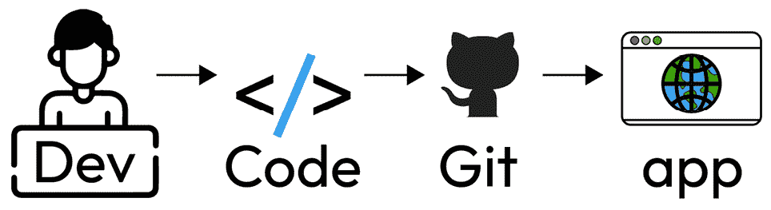
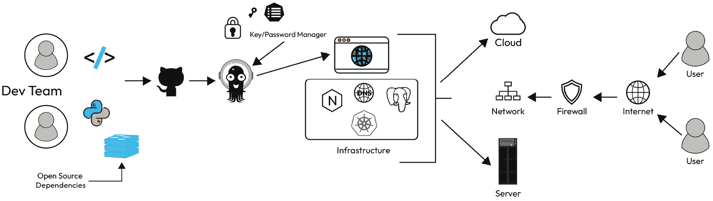
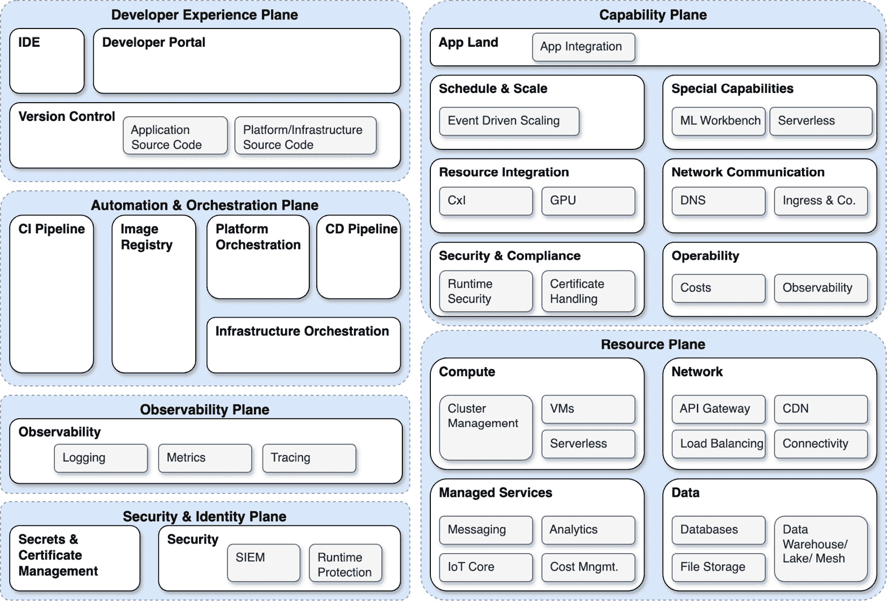
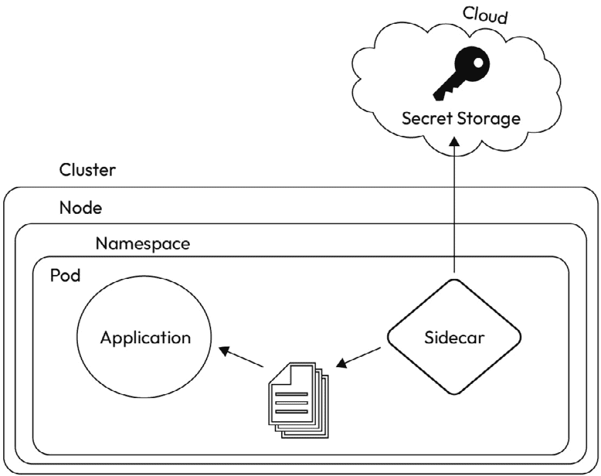
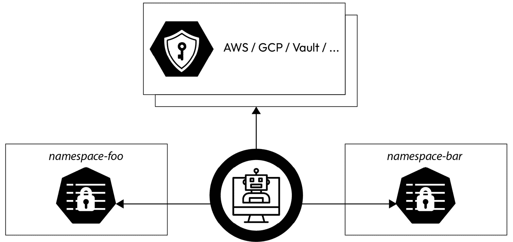
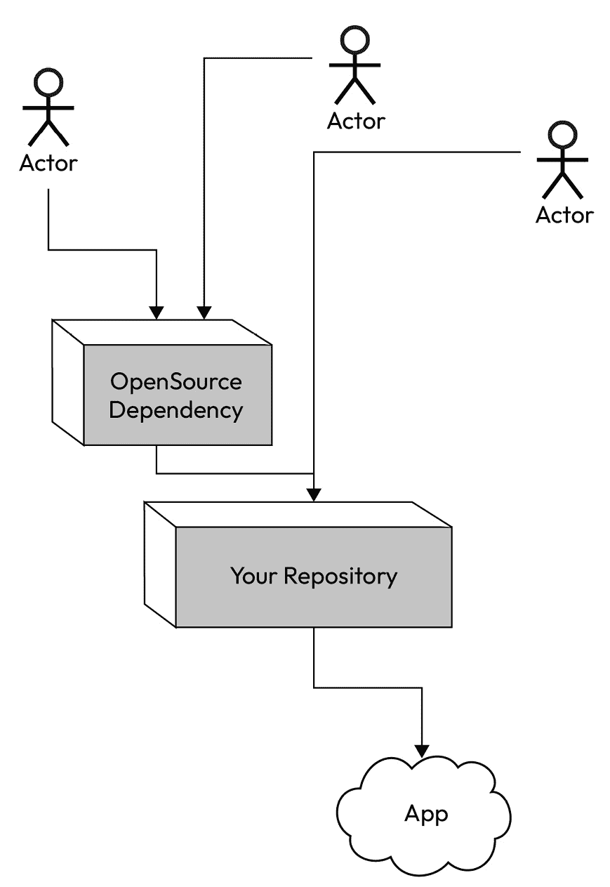

# 构建安全和合规的产品

在数字化时代，网络犯罪日益增多。 虽然并非每个组织都有银行或政府机构那样严格的合规要求，但那些高度监管环境的安全标准和最佳实践可以并应该被推广到你的平台。 每一层次的安全性都能帮助防止安全漏洞的发生， 从而减少风险。

在本章结束时，你应该能更好地理解安全标准、框架和趋势。 这包括理解和 利用 **软件材料清单** (**SBOM**)，了解开源项目如何提升平台安全，以及理解策略引擎技术（包含示例和用例）。 你应该能够利用这些学习，定义正确的行动来保障平台安全，同时不限制你的功能，并确保应用交付过程提供加固且安全的 软件/容器包。

因此，本章将涵盖以下主要内容：

+   调和安全左移与 零信任

+   理解平台安全——如何构建既安全又灵活和 开放的系统

+   查看 SBOM 实践

+   理解流水线安全——你需要考虑的事项，以确保你的 **持续集成/持续交付** (**CI/CD**) 流水线

+   理解应用安全——制定并 执行策略

+   **自由和开源软件** (**FOSS**) 在平台安全中的应用以及如何 使用它

# 调和安全左移与零信任

**安全左移** 和 **零信任** 是当前网络安全领域的 流行术语。 这些术语——或者说是流行短语——无疑会逐渐消失，但它们所代表的实践将在未来几年继续作为最佳实践。

*安全左移* 将构建和交付软件的过程视为一个从左到右的线性流程图。 该流程图可能会像这样：



图 7.1: 简单的应用程序开发工作流

在这个简化的示例中，开发人员编写代码，代码随后被放入源代码管理，最终作为应用程序供用户使用。 查看右侧的这个安全工作流程，尤其是在应用层面本身，虽然重要，但为时已晚。 已经有三个明显的地方，缺乏安全性可能会造成漏洞，这些漏洞可能 被利用。

在人员层面解决安全问题是向左安全的核心，但这并不是安全的终点；它只是安全的起点。 安全必须贯穿于流程图的每个步骤，以便当我们进入更现实的示例时，能够看到安全如何随 业务范围的扩展而扩展：



图 7.2：扩展的开发和交付工作流程

在前面的 图中，你已经可以看到在用户尝试与应用程序及其支持基础设施互动时，实施的一些常见安全最佳实践。 然而，开发团队和开源依赖项层面的安全性，源代码管理中的安全性，CI/CD 中的安全性，以及应用程序本身的安全性并未被解决。 即便是密钥和机密的存储，虽然代表着一种最佳实践，也需要对访问这些密码的过程应用安全措施。 向左的安全帮助你从产品生命周期的开始，到将完成的应用程序交付给最终用户的全过程中构建安全故事。 在平台工程中，这可能会在最安全的平台和实现完美自助服务的平台之间产生不和谐感。 由于平台需要支持开发人员的自助服务，因此平台完全拥有安全故事的做法开始与自助服务所带来的灵活性相冲突。 因此，它可能会施加足够的限制，使得平台显得有很高的准入门槛，从而危及平台的采纳以及 开发人员的幸福感。

在过去， *信任，但要验证* 将是解决这个问题的安全模型。 其含义不言自明。 你信任开发人员已经做了所有必要的工作，以维持应用程序所需的安全态势，但在平台团队那边，你并不拥有端到端的安全控制。 该平台会尽最大努力验证所有正确的措施已经到位，而不会干扰 自助服务。

如今，安全最佳实践发生了变化， *零信任* 成为了主流。 零信任 本质上假设每个人都是恶意行为者（无论是否故意都不重要）。 为了保持这种安全姿态，平台需要遵循最佳实践，但它不能承担应用程序的责任。 换句话说，平台需要为开发团队和利益相关者提供所有必要的支撑，以支持一个安全且合规的产品。 例如，如果需要使用 Python 语言，那么可以在镜像注册表中提供一个经过安全处理的 Python 二进制文件，无论是内部加固的，还是来自受信任的供应商，所有平台的用户和应用程序都可以访问。 使用来自 Docker 注册表的 Python-Slim 镜像也是一个更安全的选择，并且更容易获得。 对于大多数使用场景，Slim 镜像应该是足够的。 从这里出发，一个合理且自服务的限制是拒绝那些不使用已知安全来源镜像的工作负载。 在 CI 管道中可以处理这个检查。 尽可能将检查推到最左边可以节省每个人的时间，同时也避免了在不符合安全姿态的更改上浪费计算资源。 然而，在这一部分添加检查可能会有点痛苦，因为它需要编写一个作业来扫描、分析，然后根据存储库中所有 Dockerfile 的内容做出决策。 这些文件可能嵌套在子目录中，虽然这不是不可能完成的挑战，但确实可能比较麻烦。 此外，将这种功能写入 CI 管道应该被视为超出普通 平台团队的职责范围。

从平台的角度来看，另一种方法是使用策略引擎和准入 Webhook 来拒绝任何未使用受信任镜像源的 Pod 定义。 这虽然没有达到理想的最左边，但希望开发团队及其遵循的流程能够避免这种情况的发生。然而，在零信任环境中，这项政策将作为最后的防护措施，确保只有正确的软件被推广到生产环境。 可以认为，来自更多公共来源的镜像对于 IDP 中的原型设计是可接受的，因此，防护措施仅对生产环境是必要的。 这使得平台可以继续为团队服务，而不会不必要地 妨碍他们。

另一个例子是，只有当提交被签名时，才能接受将提交推送到 GitHub 仓库。 签名表明作者及代码自签名后未被篡改。 这可以通过 GitHub 仓库中的 webhooks 来强制执行，尽管平台团队对任何公司的 GitHub 组织的影响力可能有限；如果有的话，安全团队可能会要求此项操作。 尽管这是“零信任”与左移安全性共同作用的一个很好的例子，但这很可能超出了 平台团队的范围。

虽然这些短语听起来像是空洞的格言，但如果团队忽视它们所代表的基本原则，就会失败。 做得好的安全性是公司可以做出的最佳投资之一。 将安全性左移意味着尽早进行测试并频繁地进行测试。

每一个重大的安全漏洞和风险都可以通过测试被发现。 有各种类型的测试，包括一些由安全专业人员执行的测试，但无论是渗透测试还是仅仅是质量工程过程中的基础负面测试，都应该定期测试安全性和合规性，以确保没有意外的表面区域。 这可能表现为以意外的方式使用软件，或者仅仅是验证组织内角色的权限设置 是否正确。

现在我们已经介绍了左移安全性和“信任但验证”这两个概念，接下来让我们看看如何构建一个既安全又灵活的系统 和灵活的系统。

# 理解平台安全性——如何构建一个既安全又灵活、开放的系统

平台并不是组织安全态势的全部；它只是方程式的一部分。 在评估如何将网络安全或 DevSecOps 集成到平台时，必须保持平衡。 将安全性左移有助于减少平台团队需要投入的努力，但明确和清晰的安全范围有助于每个人理解自己在 安全故事中的角色。

## 将问题拆解成可消化的小块

安全性和灵活性也可能让人觉得是两个完全对立的词。 良好的安全性本质上是僵化的；然而，对于 IDP（身份验证平台）的成功来说，平衡这两者是可能且必要的。 我们如何实现这一点呢？ 第一步 是 **定义安全范围**。

范围界定的第一步是了解所需的最低安全水平。 显然，我们总是应该做得比最低要求更多，因此，如果你想了解最高安全水平可能是什么样的，虽然这不是一个坏主意，但它可能会人为地增加范围，使你无法看到整体的全貌。 因此，我们建议从一个狭窄的重点开始。 一旦你知道平台必须执行的最低安全级别后，就可以开始考虑平台 必须支持的最低安全级别。

当你走上安全这条道路时，很容易迅速意识到互联网世界有多么危险，从而产生过度修正。 这些过度修正可能会增加认知负担，并为使用平台设置进入障碍。 如果一个优秀的开发人员懒惰，那么平台应当帮助他们懒惰，而不是引入额外的复杂性。 正因为如此，尽管平台不能承担组织整个网络安全姿态的责任，但它在这一姿态中扮演着至关重要的角色。 安全是好的；但安全表演 却不是。

了解多少是过多，多少是恰到好处，是一种随着时间推移而不断磨练的技能，并且在什么时候一个安全措施过多或恰到好处，没有明确的界限。 答案永远是： *视情况而定*。例如，确保一个环境不对公共互联网开放，可能会妨碍项目人员在家办公，但如果这个项目涉及航天飞机或核反应堆，那么这种“空气隔离”环境是正确的，而不是 过度修正。

许多安全专家花费了多年时间研究安全，并定义了什么是安全和合规的明确标准。 美国 **国家标准与技术研究院** (**NIST**) 是美国商务部下属的一个部门，汇聚了这样的专家，他们定期发布新的标准并随着 行业的发展更新现有标准。

了解这些组织的工作有助于你在发展对安全性和灵活的 **内部开发者** **平台** (**IDP**) 交集的理解。 由于这些机构通常发布针对与政府合作的公司的标准，值得注意的是，它们的出版物是针对特定类型的受众，并不能替代与在你 特定行业中有经验的网络安全专家的交流。

### 解决 OWASP 十大安全问题

如果你仍然不确定从哪里开始，另一个组织发布了可以作为界定安全范围的极好起点的指南。 这个 **开放全球应用安全项目** (**OWASP**)（[owasp.org](http://owasp.org)）是一个 专注于网络安全的非盈利组织。 作为一个受人尊敬的安全专家团体，他们的 *十大安全问题* 列表已成为预见并防止软件安全问题的重要指南。 他们会定期重新发布此列表，2021 年出版的版本就是他们的 当前列表：

+   *A01:2021*–*访问控制* *破坏*

+   *A02:2021*–*加密失败*

+   *A03:2021*–*注入攻击*

+   *A04:2021*–*不安全的设计*

+   *A05:2021*–*安全配置错误*

+   *A06:2021*–*脆弱和* *过时的组件*

+   *A07:2021*–*身份识别和* *认证失败*

+   *A08:2021*–*软件和数据* *完整性失败*

+   *A09:2021*–*安全日志记录和* *监控失败*

+   *A10:2021*–*服务器端请求* *伪造（SSRF）*

OWASP 更进一步，2022 年还推出了针对 Kubernetes 的 *十大安全问题* 列表：

+   *K01*: *不安全的* *工作负载配置*

+   *K02*: *供应链漏洞* 

+   *K03*: *过于宽松的* *RBAC 配置*

+   *K04*: *缺乏集中式* *策略执行*

+   *K05*: *日志记录不足* *与监控*

+   *K06*: *破损的* *认证机制*

+   *K07*: *缺失的网络* *分段控制*

+   *K08*: *机密管理失败*

+   *K09*: *配置错误的* *集群组件*

+   *K10*: *过时和易受攻击的* *Kubernetes 组件*

这些列表大致匹配，但都适用于基于 Kubernetes 的身份提供平台（IDP）。 这些列表不应被视为全面的安全姿态指南，而应被认为是 IDP 安全姿态中需要解决的最基本事项，但仍然是启动你的 范围项目的一个全面起点。

### 实施威胁建模

在你定义安全范围后，第二步 是 **威胁建模**。威胁模型是对可能影响你的应用程序或在本案例中平台安全的所有因素的表示。 执行威胁建模是如何得出正确结论的一个典范，这对于组织的安全姿态至关重要。 你可以使用这些 *十大* 列表来引导你关于威胁建模的讨论。 根据 《威胁建模宣言》（[threatmodelingmanifesto.org](http://threatmodelingmanifesto.org)）的作者，威胁模型应当回答以下 四个问题：

+   我们正在 做什么？

+   可能会 出什么问题？

+   我们将如何处理 这个问题？

+   我们做得够好 吗？

例如，你可以从以下开始： *我们正在研究用户如何向 IDP 进行身份验证*。然后，接着讨论 *过于宽松的 RBAC 配置可能会出什么问题？* 并逐一处理 Kubernetes 列表中的每个 *前十名* 项目。 这些问题看似简单，但随着第二个问题（*可能会出什么问题？*）和第一个问题（*我们在做什么？*）的比例是多对一的，第三个问题（*我们要如何解决？*）与第四个问题也有类似的关系。 无论如何，如果 *我们做得够好吗？* 的答案不是一个决定性的“是”，那么这些问题的循环应该继续。 成功的威胁模型和应对计划是通过与所有 平台利益相关者的协作进行的。

这种在安全方面的协作是成功将安全置于中心的一项重要策略，且不牺牲可用性、接受贡献的能力或自助服务。 正是通过协作的威胁建模过程，可以解决安全方面的社会技术风险。 “安全向左”不仅意味着到达开发者的电脑，甚至包括开发者本人。 确保他们采取适当的预防措施，了解恶意行为者如何试图操控情况以窃取凭证，并且通常遵循最佳实践——例如，不要将公司笔记本电脑留在车里，以免被盗。

## 常见的安全标准和框架

进入安全标准的世界，首先需要尝试弄清楚一系列缩略语的含义。 目标并不是一夜之间成为安全专家，而是了解自己所需的安全级别，并确保平台做出一切必要措施来符合该安全标准。 解决这个问题的一个简单方法是，查看你所在公司所服务的行业以及相关的安全框架。 例如，美国的医院或大型医疗集团需要 遵守 **健康保险流动性与责任法案** (**HIPAA**)合规性要求。 因此，任何与类似机构合作的供应商，无论其所在地如何，都需要能够遵守相同的标准。 通过了解最终用户和开发团队的需求，平台团队可以确定超越标准最佳实践之外所需的安全性和合规性级别。

让我们快速概述一些安全标准。 这并不是一个详尽无遗的列表，但涵盖了一些更常见的标准： 常见标准：

| **标准** | **地区** | **级别** | **描述** | **备注** |
| --- | --- | --- | --- | --- |
| **PCI DSS** | 国际 | 1-4 | **支付卡行业数据安全标准**。定义了安全性和合规性要求。 适用于任何处理、传输或存储信用卡信息的公司。 级别基于 交易 量。 | 由信用卡品牌创建，而非 政府机构。 |
| **DPDPA** | 印度 | 不适用 | **数字个人数据保护法**。定义了个人数据的处理方式。 | 印度政府在 2023 年通过了该法案，虽然它与 **通用数据保护条例** (**GDPR**)相似，但也有显著的差异。 |
| **FedRAMP** | 美国 | 中等， 高 | **联邦风险与授权管理程序**。定义了提供软件和服务给 联邦政府所需的安全性 和合规性。 | 美国 联邦政府；与 州政府不同。 |
| **HIPAA** | 美国 | N/A | **健康保险可携带性与责任法案** **。** | 这是 90 年代设定的标准，随着技术的发展，必须不断演变 以适应新需求。 |
| **DGA** | **欧洲** **联盟** (**欧盟**) | N/A | **数据治理法案**。定义了 欧盟在数据使用 和共享方面的政策。 | 适用于 公共部门数据和数据利他主义的背景，以及什么可以共享，什么不能共享。 填补了 GDPR 标准中的空白。 |
| **GDPR** | 欧盟 | N/A | 个人数据如何使用 以及如何不使用。 | 这是一次历史性的举措，彻底改变了全球的数据 处理方式。 |

表 7.1：安全性与合规性框架说明

虽然这些框架有所不同，并且它们旨在实现不同的目标，但从核心上讲，它们是相同的。 由应用程序捕获和存储的数据必须在传输过程中和静止时都得到保护，并且它必须仅进入预期的位置，只有预期的用户可以访问。 这一点部分通过 RBAC 实现，但仅靠 RBAC 不足以保障安全。 诸如 PCI DSS 这样的安全标准包括对硬件、服务器及其物理设备和存放位置的实际检查，才能获得合规认证。 合规性和安全性通常是紧密相关的，但实际上是不同的。 一个系统可以是安全的，但不合规，反之亦然。 尽管我们在此不会深入讨论这些差异，因为它们超出了 IDP 本身的范围，但了解安全性不仅仅是勾选清单上的框是非常重要的。 这些框应该有助于指导威胁建模的工作应在系统中扩展到何种程度，以及你如何在任何 受监管行业中开发平台的角色。

## 资产保护

坚持数字空间的范式，我们讨论的资产是你服务的数据库。 大多数安全性和合规性法规关注数据处理。 你应当理解为，数据是普通组织最有价值的资产，应该被 珍视。

你的数据有三种状态：它要么在传输中，要么在使用中，要么处于静止状态。 因此，针对它的安全性必须涵盖所有状态。 由于数据存储在平台上，所以平台有责任确保这一部分的安全性。 这是一个极少数不需要极高安全保护的数据产品，因此，确保数据安全几乎不可能过度。

### 静态数据保护

你的数据将 大部分时间处于静止状态。 数据设计和整体数据库安全需要非常具体的关注和定期审查，但静态数据的高级概念 归属于 以下几个类别：

+   分类

    +   这是什么类型的数据，它包含了什么信息？

    +   它有多重要？ 重要性如何？

    +   根据监管需求或 业务重要性进行数据的物理隔离

    +   数据如何与系统交互可以 为分类提供信息

+   加密

    +   每一层的加密，包括物理层和 数字层

+   盐值 和哈希

    +   不仅仅是加密， 还有压缩

        +   如果你希望数据 保持人类可读性，这就不太理想

        +   在内存中可能会大幅扩展，并可能创建 一个意外的 **分布式拒绝服务** **攻击** (**DDOS**)

+   限制访问

    +   可以根据 分类进行调整

    +   应该有正式的审查流程， 角色与职责

+   冗余备份

    +   三是高可用和 低可用系统的魔法数字

    +   数据的冗余不需要完全一致；可以根据数据丢失的成本来设计策略 数据

+   数据 保留政策

    +   你 到底需要它保存多久？ 是否有 相关法律 约束？

        +   那 **监管链** 是什么 关于 那个 决策的？

        +   与冗余相同；不需要为 所有数据制定统一政策

    +   你首先需要它吗？

        +   挑战 每一部分：

            +   膨胀发生在当人们认为数据 是必要的

            +   不确定性让人们要求比 他们需要的更多

            +   展示数据如何增加价值和责任，并使得后续使用和 成本合理化变得容易：

                +   积极地减少 没有正当理由的部分

                +   记录系统如何以及为什么被创建的历史 过程

                    +   员工入职 变得容易

                    +   回答关于系统的问题变得容易，包括 不公平的问题

                    +   公共汽车编号失去 其重要性

                +   保留 这些数据的商业理由是什么？

                    +   它会 带来利润吗？

                    +   这能 节省资金吗？

                    +   我们会从中 学习吗？

                    +   做这件事 是正确的吗？

                    +   我们面临哪些风险 如果我们保留它的话？

            +   操作使用案例是什么？ (例如：故障排除项目、访问日志、 审计跟踪)

+   热 存储 和 冷存储

    +   热 存储更 容易访问

        +   需要 访问规则

    +   冷存储则不 那么容易访问

        +   不需要频繁关注但仍然重要的旧数据进入 冷存储

        +   更难访问，通常由更高级别的 权限控制

### 数据主权

许多 国家正在采纳数据主权 法律，本质上规定在该国边界内由人们创建的数据不得离开该国的物理边界。 这并不总是意味着数据不能在国外查看（使用中的数据），而是数据存储必须保持在区域边界内。 这解决了静态数据合规性问题，但并没有解决 安全性问题。

### 保障数据在传输中的安全

当 数据在传输过程中，它正被微服务之间传输，这意味着它暴露在平台的网络和/或外部端点中。 数据在传输过程中需要加密，但最终，数据需要被使用，接收端点将在某个时刻解压数据：

+   限制存储在内存中的数据及其存储时间—这能保护平台的健康和数据安全（要聪明地管理 缓存）

+   不要在广泛开放或特权的端口上传输数据

+   仅记录数据交易中绝对必要的信息，而不是交易本身的数据（参见日志清理）

+   通过 清理输入 来防止注入攻击

+   使用网络安全和加密的最佳实践来防止 **中间人** (**MITM**)攻击 以及其他各种类型 的攻击

### 使用中的数据

使用中的数据 正如其字面意思所示：系统正在查看或 更改的数据。 数据一旦存储并在使用中，它要么从存储中检索，要么被缓存。 它可能保存在内存中，或者通过各种读取和缓存技术直接读取。 数据在初次进入系统时也会处于使用状态。 这包括注册新用户或存储新的日志行。 通常，处于这种状态的数据也可能正在经历数据转换，如聚合或清理操作，以确保数据不能用于注入攻击，甚至可能被删除。 保护使用中的数据，只是我们在数据传输或静止时所应用的相同原则的另一种体现。

### 保护你的网络安全

Kubernetes 具有可插拔架构，虽然它默认没有网络栈，但某些 Kubernetes 平台选项会有自己的默认设置。 例如，OpenShift 容器平台采用了默认的 **容器网络接口** (**CNI**)，并称其为 **开放虚拟网络** (**OVN**)。 除了 OVN，还有其他更安全、可观察性更强的解决方案适用于 Kubernetes 网络。

**

除了网络技术外，网络拓扑在网络安全中也扮演着重要角色。 像防火墙、VPN、VLAN、路由器、交换机等网络工具可能不会直接部署在 Kubernetes 集群上，但它们在集群安全中起着非常重要的作用。 无论最终的网络拓扑如何，集群如何与公共互联网交互（或者可能根本没有交互！），为了进行适当的威胁建模和合规性，你需要能够观察并记录 你的网络。

### 预生产环境与生产环境之间的隔离

一般的最佳实践 是无论安全性和合规性需求如何，你的系统都应该将生产数据和访问权限与其他环境隔离，以确保数据受到保护。 数据是大多数公司最有价值的资产，因此保护和隔离数据是确保资产安全的最佳方式，能够保证所有公司的安全性和合规性。 数据保护是安全性和合规性的核心。 生产数据绝不能离开生产环境，且必须严格控制对这些数据的访问，确保没有恶意行为者——无论是内部、外部、故意还是意外——能够访问生产数据。 我们再次引用我们的平台架构，来自 *第二章*：



图 7.3：平台参考组件

每个白盒，即便 是与安全相关的盒子，都必须有自己的安全网关。 例如，组织的 RBAC 管理能力不能开放给任何人修改。 很容易看出，这种情况如何迅速演变成一个问题，并催生了一个专家领域。 我们不会在本书中取代他们的知识和专业技能；然而，我们会分享一些我们认为最重要的 IDP 安全方面，帮助你走上 正确的道路。

任何组织的一个简单胜利是将暂存、开发和生产环境完全隔离开来。 这包括拥有完全不同访问规则的独立数据库，而不是一个包含不同表格和不同 访问规则的数据库。

可以使用单一集群，并通过基于网络策略的隔离、适用于特定命名空间的 RBAC，以及创建类似于多个集群的隔离体验，但集群的 API 服务器、审计日志、 `etcd`、网络及其他集群范围资源仍然代表着潜在的单点故障，可能影响 隔离的安全性。

因此，出于 安全和合规性的考虑，最好将环境完全隔离。 通过拥有两个独立的集群，可以保证生产数据的隔离，并减少人为错误对安全性的影响。 从这里开始，你还可以拥有不同的网络配置，例如有不同允许规则的防火墙规则，甚至完全与 公共互联网断开连接的环境。

## 机密和令牌管理

在 Kubernetes 中，Secret 是应用程序可能需要访问的敏感数据，如密码、认证令牌、环境变量、API 密钥等，以确保其正常功能或完成某项任务。 机密管理 成为在依赖自动化如此重的系统中，像 IDP 一样工作的最关键挑战之一。 幸运的是，有一些设计好的模式和技术可以帮助 应对这一挑战。

作为一个基于 Kubernetes 的平台，内建的 Kubernetes 功能用于秘密管理的安全性是关键的起点。 需要明确的是，默认行为并不安全。 秘密信息与 ConfigMaps 的存储方式类似，且没有加密。 它们是编码存储的，但编码仅仅是 `base64`。这种方式适用于开发环境，但对于生产环境并不安全。 然而，你可以在不安装任何第三方应用的情况下对静态的秘密数据进行加密。

有关静态数据加密的进一步阅读以及可以应用于测试集群的示例，请参阅 Kubernetes 文档中的 *数据加密* 部分： [https://kubernetes.io/docs/tasks/administer-cluster/encrypt-data/](https://kubernetes.io/docs/tasks/administer-cluster/encrypt-data/)。

秘密管理的范围通常相当广泛，一旦你有多个集群或多个环境，管理支持应用程序所需的所有秘密变得非常困难。 因此，使用诸如 HashiCorp Vault 这样的秘密存储软件，或如 Bitwarden 和 1Password 这样的密码管理器，已经成为行业标准。 一个标准的最佳实践是，将秘密信息在集群中自动部署的方式是：在代码中存储对秘密的引用，然后通过某种逻辑查找该引用并为应用获取相应的秘密。 因此，应用程序通过引用拉取秘密信息的常见模式是利用 侧车模型。

在侧车模型中，Pod 中的一个容器专门负责在 Pod 启动时获取并提供 供主应用容器使用的秘密信息。 这些秘密信息随后被放入存储卷中，当应用需要时 它会读取这些信息。

侧车模型 如下所示，其中 Pod 同时包含应用程序和 侧车容器：



图 7.4：容器侧车模型

但是，除非 sidecar（或其他服务）在循环中运行，否则这只解决一次，不能解决密钥可能定期更改的环境。 这就是开源软件解决方案是一个绝佳选择的地方。 **外部秘密操作员** (**ESO**)是一个 开源软件，可以实现这一点。 该项目是 Linux Foundation 的财产。 有关其工作原理的详细概述，请访问 [external-secrets.io](http://external-secrets.io)。

他们的参考架构图如下，几乎与我们的 sidecar 参考图几乎完全一样:



图 7.5：ESO 的参考架构

基本上，秘密 存储在集群外的密码存储中，然后操作员可以访问它们。 秘密引用存在 **自定义资源** (**CRs**)，操作员知道如何解释和执行检索。 如果秘密发生变化，则操作员会自动将新秘密应用于集群，这意味着秘密在 **IDP** (**SOT**)中只有一个 真实来源。

当然，必须首先提供存储的身份验证秘密给操作员才能工作。 这可能有点困难，因为设置此操作员的人需要能够提供凭据以访问集群外的 秘密存储。

ESO 在高度监管的环境中特别有用，例如证书和令牌等秘密经常轮换。 这允许在源头进行轮换，但自动传播到 必要的环境。

ESO 并非集群上秘密管理的唯一开源项目；CNCF 正在孵化其他几个项目，都值得审查。 选择适合您组织的正确工具需要在权衡一系列利弊之后进行，但这些工具利用的模式代表了您应该追求的最佳实践。

### 日志清理

平台生成的任何日志都应该 进行清理。 应用程序也应该如此；然而，这超出了平台的边界。 日志是数据的一部分，因此是平台安全需要保护的资产。 除了我们之前讨论的存储和传输问题，数据清理是确保即使恶意行为者获得日志数据访问权限，他们也无法利用这些数据进一步危害系统的关键部分。 像 SonarQube（[https://docs.sonarsource.com/sonarqube/latest/](https://docs.sonarsource.com/sonarqube/latest/)）这样的代码质量检查工具非常适合检测任何敏感数据是否被发送到错误的位置，从而在发生安全事件之前进行修复。 以防发生安全事件。

已清理的日志不应包含密码或令牌。 例如，在记录 API 请求时，请求的身份验证方式（例如，持有者令牌）可以被记录，但实际的令牌本身需要被清除。 在捕获或存储敏感数据的地方，应进行加盐 并哈希处理。

这些平台日志 也应该尽可能避免包含 **个人身份信息** (**PII**)。 这种类型的数据通常不需要，因此存储它会带来不必要的风险 暴露面。

日志清理也包括保留政策。 就像应用数据在其 **生存时间** (**TTL**) 到期后应进行生命周期管理和销毁一样，日志数据也应如此。 随着平台的不断运行，日志对平台团队的帮助逐渐减少，但其中包含的信息可能在某些情况下仍有价值，尤其是在由于业务需求无法剥离个人身份信息（PII）时。 因此，保留可能对恶意行为者有价值的数据会带来不必要的风险，甚至使用冷存储也无法完全规避这一风险。 何时销毁数据最终是一个业务决策，如果有充分的理由保留平台指标数据，可以对数据进行转换进一步匿名化，以便仅销毁 PII。 保持平台指标 永远存储。

## 安全访问

我们已经讨论过几次 RBAC 了。 它被明确列为 OWASP *十大*之一，因此，确保访问控制正确对组织的安全性至关重要。 确保这一点的方法之一是创建服务账户。 这些账户是非人工身份账户，可以被系统上的工作负载使用。 与人工账户一样，服务账户的认证需要一个令牌，并且这个令牌应定期更换。 通过将访问类型分为人工和非人工，你可以利用 最小权限原则 **（PoLP）**来确保人工用户或工作负载仅拥有其所需的权限，而不会拥有它们 不需要的权限。

最小权限不仅应适用于工作负载，也应适用于人员。 在评估用户应该拥有的权限时，有几点需要注意。 接下来，我们将为您定义一些高层次的最佳实践供您调查：

+   单用户，多 RBAC：

    +   用户在预备环境和生产环境中有独立的 RBAC 角色。

    +   预备环境应与生产环境保持一致，以便在一个环境中执行的操作能帮助用户在另一个环境中执行相同的操作。

    +   可能有破玻璃程序来获取更高的访问权限。 这种访问权限（如果存在）必须是可审计的，这意味着所有相关信息 都必须被记录。

+   GitOps 用于 安全：

    +   可以 管理 RBAC。

    +   减少直接授予访问 集群的需要。

    +   Doe变成 单点故障（SPOF）。

    +   中心 的安全性已被移除。

## 审计日志

什么是审计日志？ 审计日志是 Kubernetes API 服务器看到的操作记录。 这意味着 Kubernetes 集群中的每一个变更，无论是自动化的还是人工发起的，从登录到 Pod 调度，都记录在审计日志中。 如果存在标识信息，它将在审计日志中记录。 这是因为审计日志是了解谁在何时、何地做了什么操作的重要路径，审计日志对于事件解决和安全性 `PUT` 或 `PATCH` 等有效载荷也应被记录。 凭据不应作为个人身份信息（PII）记录，应在绝大多数情况下省略。 案例。

利用审计日志 来确定异常行为可以通过一些基础的可观察性实现和相应的警报来完成。 在定义平台时，你应该已经构思出用户故事和关键用户流程。 在这些练习中，你会分析用户将会做什么并期待成功的操作。 但是你是否考虑过用户不会做或不应做的事情，并期待成功呢？

审计日志中发现的行为，如果偏离平台用户的正常行为，是定义潜在异常警报的最简单方法。 一个例子是出现大量的 `403` 错误，或者来自于 特定 **无类域间路由** （**CIDR**）范围外的 IP 地址的请求数量显著增加。

自动化检测可能会查找的其他项目包括 以下内容：

+   检测异常或无效的用户代理 或机器人

+   来自 不同位置的多个用户登录或会话

通常，违反已知规范的事件应该自动地引起人工注意。 然而，大多数情况下，这些事件仍然需要人工审核，因为它们不一定表示安全事件。 它们可能指示一个软件问题或一个必要的事件，但在设计警报时并未考虑到。 警报不应过于频繁。 虚假信号会造成伤害，尤其是当它们在半夜打扰到你的团队时。 如果虚假信号触发得过于频繁，工程师们可能会很快忽视它们，以维持较低的 认知负荷。

到目前为止，我们已经介绍了安全的基础知识，还有很长的路要走。 现在我们已经学习了一些一般性话题，接下来让我们更具体一点。

# 查看 SBOM 实践

开源工具、编程语言中的库、包管理器和容器镜像是现代应用程序的构建块，同时在安全 你的 **软件供应链**方面也带来了独特的挑战。这就是我们亲切地称之为供应链安全难题的原因。 当你并不拥有所有需要 被保护的代码时，你如何保持良好的安全态势呢？

如果我们以可视化的方式表示供应链，它将包含一些未知的人（我们称之为参与者）为开源依赖项做出贡献，以及另一个可能已知的参与者更直接地为你的代码库做出贡献。 这是一个极度简化的图示（这里可能缺少了 10 个框），但它应该有助于你理解 重点：



图 7.6：示例供应链

你的软件供应链就是一切，所有参与者都在发布你的应用程序中发挥作用。 当我们考虑如何维护安全时，我们必须拆解我们的应用程序和基础设施拓扑结构。 SBOM 是跟踪和管理项目风险的重要工具。

在美国政府于 2021 年发布行政命令后，这些文档对于许多公司来说变得强制性。 其基本前提是，公司知道它们构建的软件依赖于什么，以及这些软件的依赖项来自何处。 SBOM 会在一款软件及其所有依赖项捆绑发布时生成。 虽然对于每个公司来说并非绝对必要，但作为最佳实践，当与扫描工具配合使用时，它们有助于审计并理解风险的表面区域，特别是在像 Heartbleed 或 Log4j 这样的 Day 0 漏洞再次被发现时。

SBOM 通常是在 CI 流水线的构建过程中生成的。 **Syft** 是一个 相当常见的 SBOM 生成工具，通常与扫描器 **Grype** 配合使用， 因为它们都是 Anchore 提供的免费开源工具。 思科的开源项目办公室最近还发布了一个 名为 **KubeClarity** ([https://github.com/openclarity/kubeclarity](https://github.com/openclarity/kubeclarity))，该工具可以协同使用多个 SBOM 和扫描工具，提供软件及其表面区域的最完整视图 以便于风险评估。

SBOM 生成工具仍然相对较新，因此它们还不完美。 可能某个工具未能检测到一个包，而另一个工具则能检测到，反之亦然。 为了了解你的安全态势，少即不等于多，因此获得尽可能最完整的视图是保持安全的最重要部分。 安全优先。

## 如何使用 SBOM

SBOM 不仅仅是客户或美国政府要求清单上的一个勾选项。 它还是一个有效的漏洞检测和响应工具。 在 *图 7**.6*中，我们展示了你的应用程序如何继承代码，从而继承了可能利用的开源依赖和库中的漏洞。 这些依赖关系很难跟踪，这也是为什么 SBOM 可以作为你系统的账本。 这意味着，如果后续发布了重大安全漏洞通报，你可以快速将该通报与 SBOM 进行交叉引用，并及时了解你的软件是否存在漏洞。 这可以通过查看已创建的报告，也可以通过重新生成报告来完成。 如果报告生成与扫描工具配合使用，扫描工具应该在漏洞被录入到关键 漏洞注册表后立即检测到新的漏洞。

### 获取 GitHub 仓库的 SBOM

查看 GitHub 仓库的 SBOM 的一种简单方法是使用 curl 命令调用你要调查的仓库的 GitHub API。 为了快速演示，我们将介绍如何执行此操作以及如何解读 结果。

GitHub SBOM 采用一种被称为 SPDX 的格式；你可以在 这里了解更多关于该格式的信息 ： [https://spdx.github.io/spdx-spec/v2.3/introduction/](https://spdx.github.io/spdx-spec/v2.3/introduction/)。

要获取 SBOM，请在终端中使用以下代码块来调用 GitHub API。 你不需要进行身份验证就可以运行此命令，但如果需要的话，也可以进行身份验证。 将 `$REPOSITORY` 和 `$OWNER` 变量替换为你所需的仓库信息。 为了示例，我们将查看 `tag-security` CNCF 仓库：

```
 curl -L \
-H "Accept: application/vnd.github+json" \
-H "X-GitHub-Api-Version: 2022-11-28" \
https://api.github.com/repos/$OWNER/$REPOSITORY/dependency-graph/sbom
```

返回的 JSON 会比较长，所以我们只看从 curl 请求中收到的 SBOM 的一部分（[https://api.github.com/repos/cncf/tag-security/dependency-graph/sbom](https://api.github.com/repos/cncf/tag-security/dependency-graph/sbom)）：

```
 {
  "sbom": {
    "SPDXID": "SPDXRef-DOCUMENT",
    "spdxVersion": "SPDX-2.3",
    "creationInfo": {
      "created": "2024-08-16T05:37:53Z",
      "creators": [
        "Tool: GitHub.com-Dependency-Graph"
      ]
    },
    "name": "com.github.cncf/tag-security",
    "dataLicense": "CC0-1.0",
    "documentDescribes": [
      "SPDXRef-com.github.cncf-tag-security"
 ],
 "documentNamespace": https://github.com/cncf/tag-security/dependency_graph/sbom-0a6b74785f7954ee,
```

输出的顶部包含了一些关于 SBOM 的基本信息，包括它是如何生成的、何时生成的以及相关的数据许可信息。 这只是告诉你关于你分析的仓库的高层次信息。 接下来的部分是 `包`，它包含了所有的软依赖项以及它们的关系：

```
 "packages": [
      {
        "SPDXID": "SPDXRef-npm-babel-helper-validator-identifier-7.22.20",
        "name": "npm:@babel/helper-validator-identifier",
        "versionInfo": "7.22.20",
        "downloadLocation": "NOASSERTION",
        "filesAnalyzed": false,
        "licenseConcluded": "MIT",
        "supplier": "NOASSERTION",
        "externalRefs": [
          {
            "referenceCategory": "PACKAGE-MANAGER",
            "referenceLocator": "pkg:npm/%40babel/helper-validator-identifier@7.22.20",
            "referenceType": "purl"
          }
        ],
        "copyrightText": "Copyright (c) 2014-present Sebastian McKenzie and other contributors"
      },
```

只看 SBOM 中的一个包，你可以看到包信息、使用的版本、许可和版权信息。 MIT 许可证意味着该包是开源的，但版权信息表明谁在维护该包，并且从本质上防止其他软件项目使用该包的名称。 IBM 在此解释了版权的原因： [https://www.ibm.com/topics/open-source](https://www.ibm.com/topics/open-source)。输出中还包括了标签供应商和下载位置。 在这个示例中，这两个字段的元数据显示 `NOASSERTION`。正如 SPDX 文档中所解释的那样（[https://spdx.github.io/spdx-spec/v2.3/package-information/](https://spdx.github.io/spdx-spec/v2.3/package-information/)），这应该在以下情况下使用： 以下情况：

+   SPDX 文档创建者已尝试但无法做出合理的 客观判断

+   SPDX 文档创建者未尝试确定 此字段

+   SPDX 文档创建者有意没有提供任何信息（不应因此而意味着任何含义） 。

对于其他软件包，这些字段可能包含有关软件包的其他数据，也可能没有任何断言。 在软件包列表之后，按照相同顺序列出软件包与 存储库的关系：

```
 "relationships": [
      {
        "relationshipType": "DEPENDS_ON",
        "spdxElementId": "SPDXRef-com.github.cncf-tag-security",
        "relatedSpdxElement": "SPDXRef-npm-babel-helper-validator-identifier-7.22.20"
```

在这个例子中，这是 非常直接的，因为它说主要元素，标签安全库，依赖于 `npm:@babel/helper-validator-identifier` 软件包版本 `7.22.20`。在这种情况下，SBOM 创建者可以提供更多元数据，但目前没有。 有关这些关系的更多信息可以在这里找到： [https://spdx.github.io/spdx-spec/v2.3/relationships-between-SPDX-elements/#111-relationship-field](https://spdx.github.io/spdx-spec/v2.3/relationships-between-SPDX-elements/#111-relationship-field)。

再次提醒，SBOM 是一个非常简单的工具；它创建一个分类账，列出应用程序或代码库的组成部分。 单独使用时，它并没有太多作用，但作为工具链的一部分，它对理解系统及其依赖的漏洞风险表面有很大帮助。 依赖。

## 保持在漏洞的顶端

软件漏洞 通常称为 **公共漏洞及曝光**，或 **CVEs**。美国 **国土安全部** (**DHS**) 维护公共 CVE 注册表 ([https://www.cve.org](https://www.cve.org))，您可以了解已知的曝光情况，并可与您的软件和应用进行对比，检查已知的 CVE 和您的风险。 尽管平台团队可以构建专门服务来确定系统中是否存在 CVEs，但无需如此，因为存在大量的 FOSS 工具可以为您完成这项工作。

您可以通过 GitHub 检查 CVEs，方式如下： 以下：

+   **Dependabot**，一个 GitHub 机器人，扫描您的存储库，并提出拉取请求，通过提升软件包到已知的安全版本来积极解决 CVE 问题

+   **Snyk**，验证拉取请求以确保不引入任何 新的漏洞

+   **CodeQL**，类似于 Snyk，评估拉取请求的内容，确保它们不会 引入漏洞

为了跟踪运行时的漏洞，定期扫描图像注册中心，如 Harbor，或使用 Trivy 等工具，至少针对你最关键的环境进行扫描，将帮助你及时掌握环境中的漏洞。

由于 SBOM 生成和漏洞检测通常是 CI 管道的一部分，我们接着讨论管道的其余部分，及如何确保你的CI/CD 过程中的安全性。

# 理解管道安全——你需要考虑的事项，以确保你的 CI/CD 管道的安全

假设平台团队对 GitHub 或公司使用的其他源代码控制仓库具有影响力或管辖权，那么 CI/CD 管道的安全性 从头到尾将成为身份提供平台（IDP） 安全态势的关键部分。

## 保护你的仓库

代码仓库的安全性 是“安全向左移”的一个很好的例子。 通过早期强制执行安全规范并将其融入项目的工作方式，组织可以防止问题在后续发生。 一个安全的仓库采用了多个 最佳实践：

+   **写保护** **主分支**

    +   如果需要额外的安全性，你可以使用私有 Git 仓库和自托管的 Git 来增强安全性

+   **要求** **签名提交**

    +   这验证了 提交作者的身份

+   **提交前 Webhook**

    +   用于验证没有机密被 意外提交

+   **强制性** **同行评审**

    +   包括由 代码所有者的签字

+   **自动验证** **拉取请求**

    +   依赖 安全扫描

    +   测试——应包括安全性 和访问权限的验证

+   **持续扫描**

    +   扫描 以防止密码、令牌或其他 机密数据的意外提交

这份清单并非详尽无遗，但它应该为任何组织提供最佳的起点，以确保其源代码能防止恶意行为者和 人为错误的风险。

## 保护 GitOps

GitOps 已在 第 *第五章*中详细介绍，因此由于其对平台安全的重要性，我们将简要回顾一下。 GitOps 被松散地定义为一种自动化过程，用于验证 SOT（Git 或其他版本控制系统），以确保期望状态与实际状态匹配。 它通过一次性部署或更改来完成此操作，但也通过一个自动化的调和循环，主动检查期望状态的变化，并对实际状态采取行动，使其与期望状态匹配，或检测到实际状态的变化并对系统进行更改，将其恢复到期望状态。 当前最大的开源 GitOps 项目是 Argo CD，这是一个属于 CNCF 的 CD 工具。 在 Argo CD 和其他 GitOps 模式中，有一些最佳实践需要注意，以确保更 安全的环境。

对于 GitOps，有两种传播更改的模型；一种是推送模型，另一种是拉取模型。 在推送模型中，GitOps 系统将更改作为推送到其 API 端点的方式接收。 不言而喻，这些推送应当经过适当认证，但我们还是要强调，以确保没有混淆。 接收到推送后，GitOps 系统处理更改，然后采取行动。 这个行动可能是将新的软件包推向生产环境，但也可能是配置更改。 然而，在这种模型中，推送源通常不会被验证，Argo CD 也没有配置来验证它。 这就创建了一个攻击向量，因为如果凭证被泄露，攻击者可以通过 CD 系统推送更改，这可能会打开额外的 入口点。

拉取方法正好相反。 GitOps 系统使用其认证机制访问 SOT，然后从端点读取更改。 由于源是已知的安全源，通过自动化应用这些更改被认为是一个安全的操作。 这并不是说拉取模型没有风险。 推送和拉取模型都可能遭受 MITM 攻击，但在正确安全的网络和适当的加密实现下，这些风险应该 被大大限制。

当你的 GitOps 系统采取行动时，它应该以最安全的方式进行。 我们已经讨论过服务账户的使用和价值，因此你应该不会感到惊讶，GitOps 系统应该利用服务账户。 这些服务账户应当只具备完成 GitOps 实施目标所需的最小访问权限， 同时仍能在平台上执行任务。

安全性和 GitOps 可能是选择适合你 IDP 的 GitOps 工作模式时一个重要的因素，我们希望这些指南在为你的组织构建 GitOps 时能发挥作用。

现在我们已经覆盖了应用交付的安全性，让我们在 安全基础上继续深入，看看 应用安全。

# 理解应用安全性——设定并执行政策

安全性是一个动态目标，随着技术的进步，攻击方式增多，攻击者变得越来越复杂。 因此，团队在安全方面保持的流程和仪式比技术本身还要重要。 这并不是因为技术不重要，而是因为良好的纪律和强有力的流程习惯能够使技术根据行业的发展灵活地替换和调整。

良好纪律的一部分是维护准确的文档和架构图。 如果应用架构发生了重大变更，那么这可能会改变风险面和攻击向量。 例如，对一个库或网络端口的未记录或记录不全的依赖，可能导致暴露在一个更难以识别的漏洞面前。从而增加发现的难度。

## 基础应用安全

在 *第五章*中，我们讨论了 构建和交付镜像及工件的方法。 所描述的应用程序语义版本方法代表了创建软件的最佳实践，但不适用于其使用。 当使用 Git 进行源代码控制构建发布时，发布除了一个人为定义的版本外，实际上还会获得一个 SHA-256 签名，这得益于 Git 的现代功能。 与可以重复使用的版本号不同，**安全哈希算法** (**SHA**)是该软件确切构建的签名，并且它始终是唯一的。 因此，对于安全最佳实践来说，使用平台所使用的镜像的完整 SHA 地址，而不是 镜像版本，是非常重要的。

以下是使用镜像版本 `docker pull` 命令的示例，以及 SHA：

```
 docker pull quay.io/keycloak/keycloak@sha256:520021b1917c54f899540afcb0126a2c90f12b828f25c91969688610f1bdf949
```

除了镜像版本，还有一种称为 `latest`的标识方法，但它们几乎可以是任何东西，因为只有行业规范，没有技术限制。 由于标签可以稍后重新指向任何发布镜像，因此这不是拉取依赖项的安全方法。 使用浮动标签的风险 包括 以下几点：

+   无意的 和未经测试/审查的更新至 应用程序组件。

+   限制了立刻了解正在运行的内容以及运行地点的能力 和时间。

+   未经审查的外部软件包可能会自动传播，为恶意行为者创建可利用的后门。 如果一个 Pod 重启并且 `latest` 被用于该 Pod 的 Dockerfile 中 ，这种情况是常见的。

有几个原因可以选择使用浮动标签，或者使用语义版本发布标签，而不是精确的 SHA。 如果你定期测试最新版本的构建，测试依赖项的持续可支持性会更容易。 在开发环境中，始终使用已知良好包的最新版本所带来的灵活性可能是需要的，然后在转向生产环境时，可以将其固定到精确的版本标签或 SHA。 针对浮动标签进行验证，还可以使团队在应对安全漏洞时更加灵活，因此应该对每个依赖项进行风险评估，并制定政策以确定应用程序的规范 是什么。

设置策略的典型方式是使用开源策略代理等工具来捕捉任何偏离已定义规范的行为，并防止这些偏离进入受限 环境。 **开放策略代理** (**OPA**)和 **Kyverno** 都是免费使用的开源选项。 对于这两个工具，你可以利用 **代码即策略** (**PaC**)，它可以方便地审查并保存在 源代码管理中。

OPA 和 Kyverno 是两个可以用于安全的开源软件示例，但它们并不是开源生态系统中唯一的工具。

# 用于平台安全的 FOSS 及其使用方式

FOSS 项目，无论是在 Linux 基金会还是 CNCF 内部外部，都有大量的项目可以帮助你管理平台的安全态势。 前面提到的项目如 Harbor 和 Trivy 只是其中的两个。 它们只是众多项目中的一部分。

在比较你的安全需求时，比如确保已涵盖 OWASP *十大* 针对可用的开源项目，你会发现有工具可以帮助你解决列表上的每一项。

## 管理安全的模式与工具

平台的作用仅限于管理公司安全态势。 因此，它需要通过提供有用的集成、采取安全优先的策略，并且如前几章所讨论的，保持对支持的开发者社区的贡献开放，来为安全提供坚实的基础。 当你确定了所需的合规级别后，就可以开始查看哪些错误可能导致合规性和安全态势的失败，通过进行基于流程的安全审查和基于技术的 安全审查：

+   一个 **基于流程的审查** 意味着有人在审查和评估合规性与安全性。 这可能是为了寻求认证而进行的审计，也可能是定期进行的内部审查，以确保最佳实践仍在实施，并且指南是最新的。 。

+   一个 **基于技术的审查** 将 利用软件自动并可能持续地审查和验证安全性与合规性。 SBOM 和 CVE 扫描是基于技术的软件构建审查的例子，像 OPA 或 Kyverno 这样的策略引擎可以帮助自动治理 IDP。 技术解决方案还可以进一步帮助检测可能代表安全事件的异常和事件。 CNCF 项目 **Falco** ([https://falco.org](https://falco.org)) 就是这样做的。 它有几个关键的 特点，但 重要的是，它能检测是否存在权限提升，这可能代表着不良的安全和合规态势，或者可能代表一个已经获得系统访问权限的不法分子。 该系统的安全性可能已经被破坏。

任何公司如果希望展示符合某一治理框架的安全性和合规性，那么该合规框架将有助于定义过程执行的频率，并将 这些指导与定期审计相结合，以帮助确保平台 不会出现任何问题。

## 我们的虚构公司会怎么做呢？

我们的虚构公司“Financial One ACME”是一家长期存在的金融机构，正在进行云原生转型，以便在与年轻的金融科技公司竞争中保持竞争力。 作为一家金融机构，他们有一个固有的目标——最小化风险。 他们还受到监管限制，包括 PCI DSS。

此外，由于他们是一家银行，必须保护货币资产和客户数据，他们已经建模了可能威胁到其系统的潜在风险。 在众多物理和非物理风险中，许多安全行动项目被交给平台团队，在 IDP 的实施过程中解决。 这些问题可能已经得到解决，但由于这个 IDP 是一个全新的应用程序（或者是一个全新的项目），它需要重新处理合规性 要求。

平台团队需要实施的一个事项是确保他们所有新版本的软件包都已 妥善安全。

妥善安全意味着 以下内容：

+   签名 并验证

+   安全存储

+   安全地检索

+   严格的 变更控制

+   审计跟踪

平台团队采取了之前概述的步骤来确保他们的代码库和 GitOps 系统的安全，但这些措施不足以满足这一要求。 因此，平台团队决定利用一个内部镜像注册表，其中所有软件提交和包都会进行签名。 CI/CD 管道基于这些工件创建镜像，并将它们放入私有注册表中，平台应用程序 从中获取镜像。

镜像注册表的选择可能看起来像是以下几种选项之一：

+   支付给一个镜像注册表供应商，帮助他们通过扫描来维持安全姿态，并为他们提供 可信 **通用基础** **镜像** (**UBI**)

+   托管他们自己的镜像注册表，如 Harbor，这是一个 CNCF 毕业项目，拥有一个镜像注册表，该注册表 *签名*、 *存储*和 *扫描* 容器镜像（[https://goharbor.io/](https://goharbor.io/)），并且它们将被填充为 已批准的镜像

+   如果他们使用的是 OpenShift，那么集群拓扑中已经有一个镜像注册表，平台团队会用 扫描工具 来补充它。

他们进一步添加了一个准入 webhook，以确保没有容器基于未批准的镜像。 这个用例非常简单：一个验证 webhook 检查容器镜像是否符合定义的预期。 如果不符合，工作负载将被拒绝，Pod 将无法启动。 虽然团队可以自己构建一个准入 webhook 服务，但他们可能会选择 OPA。 虽然它不是唯一提供此功能的开源项目，但它是唯一一个毕业项目，使其成为生产环境中最安全的选择。 在生产中使用。

Sysdig 创建了一个开源版本的此类 webhook，它还会更改或修改 Pod 配置，以便其镜像使用完整的镜像 SHA，而不是发布标签，详细信息见： [https://github.com/sysdiglabs/opa-image-scanner](https://github.com/sysdiglabs/opa-image-scanner)。这两个 webhook 都代表了安全性和合规性的最佳实践，是任何平台 工程团队在安全方面轻松获胜的明智之选。

然而，尽管这些限制至关重要，它们可能通过限制 IDP 能力的灵活性而对创新产生负面影响。 因此，平台团队决定将这些限制限制在生产环境中。 这样做允许开发团队在其开发环境中进行实验，而无需担心任何不应意外进入 生产环境。

管理依赖项的一种策略是使用供应。 供应是将代码从你原本会导入代码库的开源库复制过来的过程。 在供应过程中，可能会对该代码进行更改以 增强其安全性，例如启用 **联邦信息处理标准** (**FIPS**) 模式。 FIPS 合规性规定了数据通过 安全套接层 **(**SSL**) 的加密强度，通常是最佳实践。

平台团队可能会有的另一个行动项目是在疑似安全漏洞事件中成为第一联系点。 这意味着需要立即对问题报告做出反应。 由于平台对公司基础架构的责任很大，从开发到生产能力，团队需要能够迅速响应，以减轻 恶意行为者造成的损害。

应当制定并定期测试这样的 **IR 计划** (**IRPs**)。 与 **灾难恢复计划** (**DRP**) 类似，定期 测试计划及其响应真实安全漏洞的能力可以 减轻损害。

早期检测是该平台所需的另一个关键能力。 对审计日志的分析是理解谁进入了系统（或谁的凭证被泄露）以及恶意行为者在获得访问权限后进行了什么操作的关键。 审计日志还可以用于主动检测，因为它们可以被 用于 **机器学习** (**ML**)模型进行异常检测，这可以比人类更快地发现安全漏洞。 此外，使用像 Cilium 这样具有高度可观察性的云原生网络解决方案可以帮助识别和追踪恶意行为者。 尽管一些硬编码的可观察性实现能够达到相同的结果，但它们需要手动维护，而机器学习模型由于其 自学习的特性，可能具有更多的内在灵活性。

两种方法都不是完美的，因此，在决定如何围绕威胁检测实现自动化时，组织需要对收益、权衡和团队能力做出判断。 在我们虚构公司的情况下，选择前进的路径将是一个关于“自建与购买”的讨论，这可能会因为任务的规模和复杂性以及它们所需维护的高度安全环境而最终做出购买的决策。 为了维持这一点。

谈到这个高度安全的环境，为了向审计员展示组织使用新 IDP 的 PCI 合规性，我们的平台团队需要能够提供网络架构图，并向 审计员解释该图的内容。

任何合规性审计员都希望验证开发和生产环境是否得到充分隔离，无论这是否在物理上得到实现，或者通过 网络实现来完成。

最后，虽然 Financial One ACME 平台团队将确保他们遵循所有已知的构建时最佳实践，但他们也会实施工具，确保他们的运行时同样安全。 很可能，生产环境中唯一有权限创建 Pod 的用户将是那些服务帐户用户，确保 Git 保持为 SOT，并且可以利用 GitOps 来规范平台的 安全态势。

这些示例响应仅涵盖了金融机构（如银行）所需的一部分安全性和合规性要求；它们还可能会受到额外政府法规的约束，这将需要进一步的安全性和合规性风险缓解措施。 正如您的团队所需要的，我们虚构的公司也需要解决其所遵循的合规框架中的每一项条目，并且最 重要的是，创建协作仪式来维持最佳安全性 他们可以达到的水平。

# 总结

总之，安全性和合规性是一个广阔的领域，许多专家已经发布了专门的著作。 本章不应被视为包罗万象，但应帮助您迈出正确的步伐，为您的 IDP 定义并执行网络安全策略。 了解如何追踪漏洞并在您的组织中建立仪式和工具，以便捕捉和发现 IDP 及其所承载的应用程序中的漏洞是非常重要的。 它所托管的应用程序。

尽管安全性和灵活性并非天生是合作伙伴，但专注于关键安全需求而不阻碍创新的智能实现是为开发人员提供他们成功所需工具和他们所需保护的关键。 保持安全。

请记住——安全事件的成本可能极其昂贵，甚至可能导致破产或诉讼。 虽然日志存储和其他安全要求可能需要费用，但这些费用是可以管理的，并且永远不会比未能保护系统所带来的成本更高。 关于如何管理平台成本的更多信息，我们继续阅读 *第八章*。
