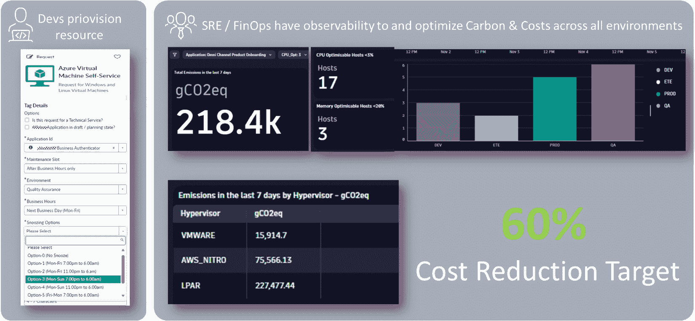

# 第八章：成本管理和最佳实践

在过去几年里，云迁移一直是许多 IT 组织的首要任务，并且在未来几年仍然是一个战略性、相关的方向。 自建数据中心仍然是一个有价值的选择；相比于云，自建数据中心的设计和成本通常经过更深思熟虑。 在本章中，我们将深入探讨这一问题，并反思云成本管理 和优化的必要性。

你将更多地了解标签策略，以及它们为何是获取云支出可见性和透明度的可行资源。 我们还将探讨如何定义标签策略、最佳实践以及实际方法，确保它们得到妥善设置。 以此为基础，我们将深入探讨成本优化的四大支柱： *流程*、 *定价*、 *使用*、 以及 *设计*。

在本章的最后，我们将分享一些实用的建议，帮助你优化平台并长期降低成本，同时为你的用户提供节省成本的价值。 。

总体而言，我们将重点讨论有效的成本管理，以及作为平台工程师，如何实现这一目标。 以下是你可以期望学到的内容：

+   理解成本格局——云是否是最佳选择 ？

+   实施标签策略以揭示 隐藏成本

+   审视成本 优化策略

+   自动扩展、冷存储以及其他成本优化 技巧

# 了解成本格局——云是否是最佳选择？

成本管理 在平台工程中的应用始于对成本驱动因素的深入理解 ，特别是了解基础设施中哪些平台组件可能会影响这些因素。 成本驱动因素也是直接影响你运营总成本的因素。 理解并随后识别这些因素，有助于做出明智决策，从而提供以成本为导向的 优化平台。

## 是否选择云——这是一个问题

过去几年，几乎没有办法绕过云采纳战略。 在这些年里，这一运动面临了来自一些成功进行“反迁移”的公司压力，这些公司声称他们的本地部署比云更便宜、更好，并且满足他们的一切需求。 *反迁移* 就是这个过程的名称。 做这种选择的人数并不十分明确，且很大程度上取决于什么算作其中的一部分。 它变得非常著名，作为 *HEY/Basecamp/37signals*，他们的首席技术官 David Heinemeier Hansson 曾表示 *如果他们不使用云计算，他们将在未来五年节省超过 700 万美元* 。 他们购买的服务器与每年在云上花费 190 万美元之间进行的愚蠢对比，显示出他们的购买服务器花费了 50 万美元，这让数学变得非常清晰 [1]*。

当然，Basecamp 或 HEY 与企业是不具可比性的，对吧？ 根据我的经验，我可以告诉你，运行大型公司的硬件在自有数据中心比迁移到云端要便宜。 一个关键因素是数据量以及基础设施需要多么动态和可扩展。 计算以拍字节为单位的数据时，云服务会迅速变成一个无尽的金钱黑洞。 相对静态的工作负载也会大大减少所包含的好处，而且还有许多其他的缺点。 另一方面，云市场每年都在持续增长，似乎没有尽头。 因此，要做出决定，选择正确的方式，你需要考虑许多不断变化的因素，从简单的成本对比到可用技能以及你业务的实际需求。 对云是否适合你的全面评估本身就可能是一个项目。 但我们想给你一些关于应该考虑的标准，以便你能在 这个阶段做出决策：

+   **成本**：评估本地部署的初始资本支出（CapEx）或一次性费用，和云服务的运营支出（OpEx）或持续性订阅费用，并考虑长期财务影响，同时还要意识到，如果你提前支付 1 年或 3 年的费用，你在云计算上将节省最多的钱。 这几乎就像是在购买 硬件。

+   **可扩展性**：评估你在快速变化情况下动态扩展资源的需求。 这里有个提示：如果峰值增长太快，静态服务器可能比等待几分钟直到新 实例启动更适合用户体验。

+   **可靠性**：评估正常运行时间保证、冗余和故障转移能力，以保持持续运营。 查看停机历史。 一些云提供商经常 出现问题。

+   **合规性**：确保遵守法律和监管要求，重点关注数据驻留和主权问题。 在决定之前，你必须明确对主权的观点。 不幸的是，这个术语的涵盖面比明确的要求清单 更广泛。

+   **集成**：确保与现有系统和软件的兼容性，并提供 API 和集成工具。 提供商应支持 **基础设施即代码** (**IaC**)，尤其是 能够通过编程创建账户、用户 和权限。

+   **支持**：评估技术支持的可用性和质量，以及 **服务水平协议** (**SLA**)。 研究其他用户对所提供支持的满意度；仅仅因为你有合同，某人负责保持系统运行并帮助你，并不意味着该服务 也一定好。

+   **新服务的开发**：评估提供商向你提供的新功能的速度和数量。 考虑到每月更新过多的情况，也要注意是否几乎没有 新功能。

+   **地理考虑**：考虑数据中心与最终用户的距离以及服务的区域可用性。 如果你的公司开发全球 可用的 **软件即服务** (**SaaS**)，那么构建在公共云上可能比集成多个 区域提供商更为容易。

+   **技能与专业知识**：评估管理基础设施所需的专业人员和培训要求。 考虑到你仍然需要任何 IT 领域的人才来完成这项工作。 短期计划是什么样的？ 长期需要什么？ 别再认为云计算很简单了；大多数企业之所以苦苦挣扎，是因为他们没有让 团队接受培训。

+   **环境影响和可持续性**：考虑提供商的能源消耗、碳足迹和可持续性实践。 他们如何处理废水？ 如果他们购买碳补偿，记住你需要为此付费，因为理论上这会增加 电费。

云通常有一个非常强大的优势：几乎没有什么能阻止你立刻开始。 你可以找到大量的模板、蓝图和示例。 在短时间内，你就能开始运行，拥有你的第一个环境作为 平台。

## 当我们选择云时——我们必须考虑它的隐藏成本

由于我们本书主要聚焦云端，我们暂时假设选择裸金属方式的用户本能上具有更高的成本意识 和敏感度。

云提供商为我们提供了很多即用的服务， 通常带有许多 *内置的功能*。它们通常包括备份解决方案、可扩展性、 **高可用性** (**HA**)，以及集中管理的服务。 在规划云基础设施时，大多数情况下，我们会发现硬性事实和最佳猜测。 硬性事实是指像需要多少个 CPU 或服务器，应该使用哪种数据库，是否是单节点还是高可用等信息。 然而，你应该意识到，几乎每一个你选择的公共云提供商选项都会对成本产生一些 影响。

常见的大成本驱动因素包括 以下几点：

+   **负载均衡器**：几乎在每个架构中都需要它们，你也不例外。 正如前面所解释的，我们有机会将应用服务从 Kubernetes 命名空间扩展到云端，甚至控制网络——这是一个主要的 成本陷阱。

+   **API 网关**：负载均衡器的更为邪恶的双胞胎，作为最佳实践时，变得非常昂贵，特别是对于频繁通信的系统和路由 密集型通信。

+   **数据**：无论是静态还是在传输过程中，数据 迅速成为云账单中最大的成本块。 虽然一切都可以扩展，但你的数据必须 存放在某个地方。

+   **备份和快照**：它们对于一个成熟的平台非常必要；你需要有一个非常 好的备份策略，既精简 又可靠。

+   **可扩展的** **托管服务**：如果你在使用无服务器架构、消息流或预训练的 AI 模型——任何可以无限扩展的东西——设定限制至关重要，以避免产生 意外成本。

理想的云项目——我们必须强调的是，我们在谈论的是有截止日期的事情——是非常有明确意见的，遵循云服务提供商的最佳实践。 几乎每个云项目都不理想，因定制实现的需要而导致迁移过程中的摩擦，这些实现必须以某种方式使旧世界和云服务提供商能够互相协作。 这些隐性成本通过技能的缺失而积累，因为所需的技能到底从哪里来呢？ 从外部技能提供商那里获得帮助意味着他们必须先了解你，才能真正帮助你。 然而，若没有 外部支持，大多数云项目会在更早的阶段就被认为是失败的。

简而言之，我们可以说大多数服务在成本方面可能会反过来对你不利。 作为平台工程师，我们必须能够控制这些元素，建立保护措施和限制。 为了实现这一点，我们需要透明度 关于成本。

## 在哪里可以找到透明度

与此同时，我们有很多选择可以获取关于我们花费在哪些地方的信息，以及这些开销是否基于利用率等指标被认为是浪费。 所有云服务提供商都提供了探索（甚至细分）成本的可能性，但由于重点关注基础设施，尤其是在应用层上，细节往往缺失。 从以下 AWS 成本浏览器的截图来看，我们得到的是不同服务类型的消费图表。 现在我们需要应用过滤器来获得更多见解，并分析这些成本的根源：


图 8.1：AWS 成本浏览器

像 Apptio Cloudability 这样的商业解决方案 可以从多个不同账户、云服务提供商和环境中收集成本信息，集中在一个工具中。 它们在给定的数据上应用 FinOps 逻辑，并提供预定义的仪表板，比如以下截图中的单位成本和节省仪表板：


图 8.2：Apptio Cloudability 关于单位成本的详细仪表盘

微软定义 单位成本如下：“*衡量单位成本是指计算一个业务单元成本的过程，该业务单元能够展示云计算的业务价值。*” 单位的具体定义由你决定。 它可以是金融系统中的交易、媒体平台的用户，或你能将不同部分的 基础设施映射到的任何其他内容。

现在，在我们的平台和开源世界中，我们也可以找到一些解决方案来获得更多的透明度，例如 Kubecost（带有商业计划）和 OpenCost。 两者都可以在集群内分配成本，并与云服务提供商资源结合使用。 不幸的是，两者都缺乏良好的分析能力。 因此，我们常常看到自实施的解决方案与 商业智能 **（BI）** 工具，或 Prometheus 和 Grafana 实现结合，加入一些成本数据。 这些解决方案的效果取决于所投入的时间和 资金。

## FinOps 和成本管理

近年来，FinOps 获得了一些 人气，并试图将自己与传统的成本管理区分开。 成本管理通常被描述为一种短期的、孤立的、单一目的的活动，旨在迅速实现成本节省。 当你作为平台团队，具备成本意识并积极管理你的成本时，这也将是一个可持续且持久的解决方案。 但 FinOps 成功之处在于它的整体方法，包括采购部门、 **业务部门** （**BUs**），以及 财务部门，明确目标是实施对云成本及其动态的组织理解。 。

以下 FinOps 框架概述表明，它采取了与平台工程团队相似的方法。 我们可以看到需要与你的原则对齐的原则；需要集成和启用的能力，这将需要你的输入；以及角色——如平台工程师，他们 合作 *[2]*：


图 8.3：由 FinOps 基金会提供的 FinOps 框架

作为平台团队，您应该与 FinOps 团队合作，并积极管理他们对您平台的影响。 潜在的成本节省必须与您的原则、用户满意度和开发者体验相平衡。 基于数据的建议需要具备架构资格，并考虑替代方案和建议以实现 成本节省。

在接下来的部分，我们将讨论如何实施标签策略。 标签是为云和 Kubernetes 资源提供附加信息的一种简单解决方案，并且能创建某种程度的透明度。 此外，许多成本管理和 FinOps 工具需要标签才能提供 更好的洞察。

# 实施标签策略以揭示隐藏的成本

标签 和标签 对您来说可能并不陌生，因为它们在各种工具、公有云和 Kubernetes 中都有应用。 我们将使用*标签*这个词来表示标签，但当使用*标签*这个词时，我们实际上是专门指 Kubernetes 标签。

应用和使用标签本身可以变成一门艺术。 如果标签过多，可能会让它们应附加到服务的哪些信息变得不清楚。 当然，没有标签显然是没有帮助的。 在涉及多个不同业务单元和部门以及复杂发布机制的组织中，标签可能会被过载，或者只是一些缩写的集合。 关键是，我们需要标签来获得服务的透明度，明确它们属于谁，可能还会指示不同的服务级别或安全等级，最终成为将这些服务与成本结构和资源使用情况匹配的锚点。 因此，标签允许更精确地分析与成本相关的资源 和 成本原因。

## 使用标签的目的

标签 可以针对不同的目标群体和用户。 根据您询问的是哪个子域，它们应该包含组织、操作、安全甚至架构信息。 我们还可以考虑一些对我们作为 平台工程师 可能有帮助的标签。

组织信息的标签可以定义哪个部门、角色或团队负责该服务，是否是面向内部或外部的解决方案，以及是否存在任何国家、合规或 治理限制。

在操作层面，常见的属性包括服务级别、调度时间和维护窗口，但也有一些可能由第三方工具引入的非常技术性的资讯；例如，通过实现特定云 策略 *[3]*。

对于特定领域，如安全或平台团队，我们可以将标签和标签看作定义所需的隔离或数据保护，或者类似于典型的扩展模式、上下峰值，或识别微服务架构及其归属于某些组件和 结构。

我们的重点将放在相关的成本 标签上。 这些标签通常与组织标签相似，或与前面提到的操作性或领域特定的标签相关。 明确组织归属或提供有关某事为何如此剧烈扩展的见解是成本管理的关键推动因素。 这些标签有助于为需要提升 成本意识的项目和团队提供清晰的视图。

一些来源还指出，使用标签进行访问管理。 出于多种原因，这需要谨慎处理。 如果你有 **基于属性的访问控制** (**ABAC**) 和权限 管理，标签可以成为实现这一目标的可行且简单的方式。 但这也带来了一个缺点，即你将一个纯粹的信息源变成了一个安全关键元素，需要在使用时进行保护和双重检查。 将其与信息特性混合使用可能会使标签的使用变得复杂，并且很可能会成为正确使用的障碍。 我们之前说过，标签可以用来传递安全信息。 然而，在提供诸如风险分类或安全级别等信息与提供 访问授权能力 方面，存在差异。

因此，像我们的平台一样，定义标签的目的至关重要。 随意地使用并设置标签虽然总比什么都不做好，但当标签是否重要变得不清晰时，未来可能会引发问题。

## 标签和标签限制

不幸的是，我们遇到了两个 普遍存在 的问题：

+   标签没有标准，这意味着它们的长度、标签数量、允许的字符或 大小写敏感性 等存在很多变体。

+   组织往往在许多不同的提供商 和平台上拥有多个环境

所以，在接下来的步骤中，定义标记策略时，你必须了解你可以可靠构建的最小数量。 标记策略将引入一个标准，必须适用于任何平台。 为每个平台定义多种不同的方法将导致混淆 和错误。

举个例子，我们将 比较不同的提供商 和平台：

|  | **AWS** | **GCP** | **Kubernetes** | **Azure** |
| --- | --- | --- | --- | --- |
| **每服务的最大标签数量** **限制** | 50 | 64 | 没有 指定限制 | 50 |
| **最大 字符标签** **名称长度** | 128 | 63 | 63 | 512 |
| **最大 字符标签** **值长度** | 256 | 63 | 63 | 256 |
| **特殊字符** | 字母数字字符、空格以及 + - = . _ : / @ | 字母数字字符、- 和 _ | 字母数字字符、- . _ | 字母数字字符、<, >, %, &, \, ?, / 不允许 |
| **区分大小写** | 是 | 是 | 是 | 是 |  |

表 8.1：云提供商和 Kubernetes 的标签限制

虽然 63 个字符 作为一个常见的方向看起来很好，但我们在实际应用中发现，对于许多组织来说，甚至 256 个字符也不足够。 这只是另一个例子，说明为什么标记策略必须经过 深思熟虑。

此外，一些结构在不同的提供商之间无法通用。 假设我们的 Financial One ACME 公司使用 AWS 和 GCP，包括其托管的 Kubernetes 服务作为平台，为什么 Financial One ACME 会达到允许的最大标签数量限制呢？ AWS 团队首先发现了这个问题，并发现它可以使用更长的标签和一些特殊字符，从而允许某种嵌套结构。 于是，他们开始将不同的标签合并成一个，得出了 以下结果：

`department-responsible=financial-one-ACME/domain-sales+marketing/stream-customer-management/squad-frontend/operations-squad-lazy-turtle`

该值有 112 个字符，包含了 `/` 来表示层次步骤和 `+` 来表示 *和*。团队对结果感到满意，并将这个新标签推送到共享存储库。 一段时间 后，平台团队收到投诉，在销售和营销 IT 部门中，由于 一些标签的问题，最新的发布没有得到推出。

此外，您会发现其他限制，如每个账户 或订阅的最大标签数。

## 定义标记策略

正如 之前所解释的，标签可以具有许多不同的用途；主要是要在技术标签和业务标签之间保持平衡。 业务标签可以分为组织标签和成本标签。 最终，许多标签往往具有重叠的信息。 因此，为了找到正确的方法，通常有必要为定义设定一些基本规则和边界。 在第二步中，您必须在操作、平台和开发之间进行协调，从技术方面找到所需的标签集，然后再设置组织标签。 这个方向是有道理的，因为通常运营所需的标签也包含了关于 组织的信息。

让我们从一些共同的 基本规则开始：

+   标签名称和值 *必须* 要短于 63 个字符。

+   标签只能是 字母数字组合。

+   标签只能包含 `-` 和 `_`.

+   请关注标签值及其内容，因为您通常会对此进行筛选和搜索。

+   标签名称对于排序 和分组更为相关。

+   不要将 **个人可识别信息** （**PII**）写入 标签中。

+   建立一个大小写样式。 企业可能更喜欢帕斯卡样式，而在技术中，烤串样式更为常见。

+   使用更多的标签比使用更少的标签更好，但尽量保持 10%至 20%的可用 标签。

根据这些规则，我们可以创建下一个相关的元素。 首先，我们需要考虑为这些元素打上标签，使其比我们之前讨论的更加细化。 一个好的做法是考虑以下分类： 以下分类：

+   所有权——部门、团队、 组织、流。

+   环境——无论你们的预发布 环境是什么。

+   项目或产品——项目或产品集群，用于识别哪些组件 属于同一组。

+   成本中心——谁是 负责人？ 是否有任何共享成本需要 额外考虑？

+   合规性——监管限制和要求、政策，及 合规规则。

+   操作——生命周期、备份、 维护窗口。

从这里开始，我们必须制定命名约定。 如前所述，重要的是不要过度加载单个标签。 遵循给定的规则和限制，并结合许多软件和系统组件的特性，标签约定可能如下： 如下所示：

+   `department=public-relations-content-management`

+   `owner=department-public-relations`

+   `data-classification=personal-identifiable-information`

在一些语言中，推荐使用 Pascal（`Hello-My-Name-Is-Pascal`）或驼峰命名法（`i-Am-A-Camel`）。 将所有字母都写成小写的风格称为 kebab 风格。 你需要非常明确地定义这些命名模式。 名字应该有多少个字符？包含多少个单词？ 是更具描述性，还是仅仅匹配已经确定的内容？ 同样也适用于值。 确保这些约定已被文档化、沟通，并且在工程师的入职或培训中被包括。

现在，最后一步是开始建立一个 *带有这些基本规则的标签目录*。建议创建这些目录，以便你有空间描述标签的含义、目的以及面向的群体。 这还可以帮助你保持标签简短，因为你不需要再为标签的值添加更多描述。 下表是一个简单的标签目录示例。 它可以根据组织的独特需求进行扩展。 重要的是将任何你可能需要包含在标签中的信息转移到目录中，以免使标签显得过长 并且难以阅读：

| # | 标签名称 | 预期值 | 含义 | 目的 | 标签利益相关者 |
| --- | --- | --- | --- | --- | --- |
| 1 | `部门` | 部门处理或代码；例如， `DE-22-P` | 应用程序所属的 BU 或区域 | 明确应用程序的所有者 | 应用程序 | 所有者；运营 |
| 2 | `应用程序` | 应用程序名称；例如， `internal-cms` | 应用程序的名称 | 识别 该应用程序 | 应用程序所有者； 运营；架构师 |
| 3 | `维护-允许` | 可以执行维护的日期和时间；例如， `sunday-0800-1230` | 该标签标识了日期或日期范围，以及以 `0800`表示的时间段，意味着 上午 08:00 | 定义应用程序何时可以关闭以更新/修补或发布 新版本 | 运营； 一级支持 |

表 8.2：标签目录示例

## 标签自动化

这将是不可能的 手动标记所有资源，尤其是在有许多活动组件的 IDP 上。 某些工具可以帮助我们在资源创建时自动标记它们，甚至在事后“修补”它们。 正如我们之前所见，在平台上，我们必须区分平台运行的基础设施和用户在其上运行或管理的工作负载 集群。

当您使用 Terraform/OpenTofu 等工具管理基础设施时，您可以在代码中给组件打标签 如下所示：

```
 resource "aws_ec2_tag" "example" {
resource_id = aws_vpn_connection.example.transit_gateway_attachment_id
key = "Owner"
value = "Operations" }
```

对于某些提供商，您甚至可以给所有资源使用相同的标签。 这需要小心处理，因为您不希望错误地标记其他资源，尤其是当这些资源触发第三方集成或导致 错误计费时：

```
 provider "aws" { # ... other configuration ... default_tags {
tags = {
Environment = "Production"
Owner = "Ops" } } }
```

几乎所有的基础设施即代码（IaC）解决方案都提供这种方法，并且可以适配任何类型的基础设施，无论是云端 还是本地部署。

这也可以应用于 Kubernetes 资源。 我们在这里跳过常规部署文件，因为这些文件很可能会以不同的方式处理，例如使用 Helm。 以下示例展示了 Helm 如何从 Helm chart 值文件中获取标签的值。 模板 值由一个 `_helper.tpl` 模板文件动态创建，而`.Release` 值则是内建信息。 另一种选择是从用户提供的 `values.yaml` 文件中读取值：

```
 apiVersion: apps/v1
kind: Deployment
metadata:
 name: {{template "grafana.fullname".}}
 labels:
   app: {{template "grafana.fullname".}}
   chart: {{template "grafana.chart".}}
   release: {{.Release.Name}}
   heritage: {{.Release.Service}}
```

Helm 的一个优点是我们可以将其与简单的 `if` 语句结合使用。 通过这种方式，我们可以根据部署的目标位置或任何 其他触发条件传递预定义的信息。

注意

在您的 Backstage 模板中使用预定义的标签，强制用户至少定义一些基本的 标签。

这两种方法都是高度声明式的，并且可能会因为实施或被忽视而失败。 当然，您可以在 CI/CD 管道中检查标签的正确使用，但这可能导致许多部署失败。 这引出了策略引擎。 一方面，策略引擎可以用于测试部署中的标签，但像 Kyverno 这样的工具 也可以在需要时添加这些信息。 以下是一个 Kyverno 策略示例，它为任何 Pod `foo=bar` 添加标签 或服务：

```
 apiVersion: kyverno.io/v1
kind: ClusterPolicy
metadata:
 name: add-labels
 annotations:
   policies.kyverno.io/title: Add Labels
   …
   policies.kyverno.io/subject: Label
spec:
 rules:
 - name: add-labels
   match:
     any:
     - resources:
         kinds:
         - Pod
         - Service
   mutate:
     patchStrategicMerge:
       metadata:
         labels:
           foo: bar
```

我们可以以非常精细的方式选择并修补这些信息，并且在以后需要时可以随时更新。 如果需要。

## 合并与分开的成本和计费报告

在许多 组织中，我们看到有合并成本和账单报告的需求。 虽然从组织的角度看，这是理解基础设施支出的最快方式，但它也需要许多标签来确保适当的拆分和细节级别。 当组织规模过大，且业务标签数量大于技术标签时，这是一个明显的信号，表明某些事情出了问题。 从激进的角度来看，此时做合并成本和账单报告就成了一种反模式。 那么我们该怎么办呢？ 例如，企业通常使用字母数字编码来识别部门。 因此，部门如果不是叫做 *财务和会计*，可能会有类似 `B-2-FA-4`的编码。这种编码是消除许多其他组织或业务标签并将其放入匹配表或数据库的完美基础，尤其是当你希望在其他地方进行编程匹配时。 需要考虑的其他事项包括，例如，暂存环境和集群。 大多数时候，开发、集成和生产系统是独立的。 这意味着，如果你的应用运行在 `曼哈顿` 集群上，这可以被翻译为 `prod-1234-eu`，那么我就不需要另一个标签来表示 `stage=production` 或 `region=eu`。需要明确的是，你应该限制自己不要将过多信息添加到 单一值中。

然而，故事中有一个很大的 *但是* 这让我们回到了话题的起点。 从成本管理的角度来看，你需要拥有许多良好的标签，以便能够进行分析 和研究。

仅有标签本身是不够的；它们是成本优化的一个重要部分，但你需要采取哪些优化措施呢？ 在接下来的部分，我们将探讨一些通用的优化策略，这些策略不仅包括调整规模和 减少基础设施。

# 查看成本优化策略

减少云和平台成本的最快方法是关闭那些你不需要的部分。 最大的问题是，参与该过程的每个人可能都有一些理由，为什么他们需要现有的基础设施。 但从现在开始，我想要转换你对这个话题的视角： *成本优化不是我们应该事后引入的东西*。以下是你应该考虑的另一个原则： *在平台设计时要具备成本意识和高效性* *。*

注意

平台中发现的成本优化潜力越大，说明我们作为平台工程师 和架构师做得越差。

我们可以在平台的任何部分发挥潜力。 然而，这本身就可以写成一本书来覆盖所有相关方面。 因此，我们将讨论适用于平台内任何组件的原则。

## 精简流程

流程、业务和技术方面，都会 导致更高的成本。 我将给你举一个导致不必要成本的模式/反模式的例子。 Kubernetes 的发布分为三个主要版本，在其中的几周里，你会获得补丁、bug 修复和安全补丁。 Kubernetes 发布团队自动化了发布过程中的大部分工作，包括夜间构建，并且持续不断地 *进行所有的测试* 在 Kubernetes 基础设施上运行几千个测试。 当这种方法被引入时，社区将其视为顶级科技公司的圣杯。 突然间，每个人都想要他们容器的夜间构建，常常跳过测试部分，认为测试过程 太过繁琐。

这种方法的缺点是，大多数夜间构建从未被部署。 它还阻止了构建服务器在晚上关闭。 容器注册表一直保持忙碌，包括 CVE 扫描，企业容器通常较为庞大，增加了传输和存储成本。 大多数组织没有理解的是，Kubernetes 是一个全球性项目。 此外，如果在某个地方是夜晚，其他地方的人仍然在工作，开发新功能并推送到 Kubernetes 仓库。 最终，Kubernetes 是全球最大的开源项目之一，由全球最大的 数字原生公司 Google 发起。

好好想想！

仅仅因为别人都在做，考虑清楚它是否真的 有意义！

回到流程。 几乎每个流程都可以得到改善，因为它们通常是历史上逐步积累的。 在平台空间内，定期引入的工具替代了脚本和自定义开发的工具。 更好的流程不仅可以降低成本，还可以提高 效率，减少风险，最小化错误，并 提供一致性。

经过验证的流程优化方法可以在 *精益* 和 *六西格玛* 方法论中找到。 为了改善一个流程，它们教你执行以下操作： 以下内容：

1.  定义/识别 流程的问题。

1.  衡量 交易的性能和时间。

1.  分析效率低下 和依赖关系的表现。

1.  改进流程以 解决效率低下问题。

1.  通过引入 金丝雀部署 来控制和审查新流程。

平台的有趣之处在于，大多数流程可以在 CI/CD 流水线和 GitOps 实现中找到。 这些将我们的目标转化为技术步骤，以确保实现预期状态。 复杂的地方在于，当我们在 Kubernetes 内以及其上方的组件中有流程依赖关系时。 作为一个最终一致的事件驱动系统，识别哪些依赖关系导致了哪种行为是一项挑战。 有时候，在不造成 进一步影响的情况下，我们无法改变组件的反应。

在技术世界中，流程常常听起来像是一堆脚本一起运行。 理想的状态是采用云原生的方法，利用 Kubernetes 标准化的 API、控制器 功能和资源定义。 它解耦了不同的功能，并通过这些流程，使它们更容易优化。 此外，它使得引入新的、历史上积累的 流程垃圾变得困难。

## 寻找最优惠价格的最佳交易

一种 优化成本的直接方式是比较列表价格，并选择最便宜的选项。 *便宜* 因此是相对的，因为你可能会降低性能、吞吐量、可用的 IP 地址等。 成本和利用率是很好的指标，但必须评估它们的二级影响。 例如，减少实例大小可能会降低吞吐量和性能，这会导致你不得不引入另一个实例。 这样，你可能会用两个实例达到 80%-90% 的利用率，但仍然支付和使用更大实例的费用相同，甚至更多。 即使是利用率更低。

如果你不受地域限制，某些地区比其他地区便宜；即便如此，它的影响不大。 目前一个强有力的选择是利用 ARM 服务器。 如果你无法在其上运行你自己或用户的工作负载，至少可以将其用于托管服务，例如数据库。 这可以节省 20%-30% 或更多 的成本。

这些都是非常明显的步骤。 找到并识别在正确区域中不被过度配置的正确资源。 如前所述，当你保持资源精简时，通常能实现更好的成本效益。 并且清晰明了。

有很多工具，如 Cloudability 或 Flexera，可以帮助你找到更便宜的选项，有些工具甚至建议改变架构来降低成本。 这些工具非常有助于入门，但它们通常也有很高的价格，而它们所编码的知识并不是你不能通过一些自己的研究或参加免费的成本 优化 课程获得的。

## 设计以实现最高利用率和最低需求

随着平台工程师减少 基础设施，它很可能会影响用户体验。 平台变得越灵活，它就越能适应给定的情况。 你可以引入主动组件，简化系统并在可能的情况下减少系统大小，同时教育用户了解增加或减少工作负载的可能性。 将他们的利用率与账单匹配可以激励用户负责任地使用资源。 责任使用。

之前，你了解了许多小节点与少数大节点之间的困难。 我们还发现，我们可以轻松支持不同的 CPU 架构，并动态分配资源。 所有这些因素在定义平台核心时都起着重要作用。 我总是脑海中浮现出蚂蚁巢穴的图景。 在它们的中心，有很多活动发生，但核心是一个稳定的结构，里面包含着大部分蚂蚁。 当巢穴，也就是我们的平台，发展壮大时，我们将扩展这一部分。 但有时，我们并不知道这是否只是暂时的。 在整本书中，你已经看到不同的方法来处理动态工作负载，在接下来的章节中，我们将展示一些扩展的最佳实践。 扩展。

那么，理想的图景是什么样的呢？ 除了取决于你的需求之外，平台应尽可能利用其资源，同时没有额外的基础设施开销。 简单来说，作为一个平台，这并不容易做到。 工作负载并不完全掌握在你手中，它可能从静态的长时间运行的资源密集型软件，到成千上万个不断变化的无服务器容器。 我们可以从中得出的结论是，你可以尽情地设计平台， 但最终，一切 都归结为一个持续的工作过程：分析、反应和调整。 随着时间的推移，你可以在平台中构建一个自动反应的基础层，覆盖大多数情况，但你仍然需要继续优化。

在本章的最后部分，我们将通过一些具体的例子来看一下如何进行扩展和优化。 你将学习到反应性和预测性扩展，以及 成本意识 工程。

# 自动扩展、冷存储和其他成本优化的技巧

在 *第四章*中，在 *自动伸缩集群和工作负载* 一节中，我们已经讨论了 Kubernetes 带来的一个关键好处和 核心功能。 K8s 内置了多种不同的工具和机制来实现伸缩，例如配置 ReplicaSets（我们希望每个工作负载的实例数量）或使用可观察性数据来驱动自动伸缩 决策，利用 **水平 Pod 自动伸缩器** （**HPA**）， **垂直 Pod 自动伸缩器** （**VPA**），或 **Kubernetes 事件驱动自动伸缩** （**KEDA**）。 有 一个很棒的免费教程，详细介绍了所有 Kubernetes 提供的自动伸缩选项， *Is It Observable* 提供的。这里是 YouTube 教程链接，里面还包含了 GitHub 教程的链接： [https://www.youtube.com/watch?v=qMP6tbKioLI](https://www.youtube.com/watch?v=qMP6tbKioLI)。

自动伸缩的主要用例 是确保工作负载拥有足够的计算、内存和存储，以实现特定的可用性目标。 以我们的金融公司 ACME 为例，这可能意味着他们使用自动伸缩来确保其金融交易后台能够在 100 毫秒的响应时间内处理 1000 个并发交易。 尽管自动伸缩可以帮助我们实现可用性目标，但它也有成本，因为伸缩资源意味着需要为额外的计算（CPU）或内存付费。 不当的自动伸缩——伸缩过多、从不缩减，或在错误的时间伸缩——也会导致计划外的成本激增，同时无法实现自动伸缩的真正目标！

*正确的自动伸缩* 是我们所期望的。 正确地做自动伸缩不仅可以帮助我们实现业务和技术目标，还能让我们利用自动伸缩来控制成本。 让我们来看看平台工程师应该了解的几个自动伸缩话题，以及我们还能做些什么来优化成本。 请记住，接下来我们讨论的一些实践也适用于任何类型的工作负载：无论是云工作负载还是其他。

## 自动伸缩的多种形式

云计算和 Kubernetes 作为核心平台的可扩展性是平台工程师手中非常强大的能力。 然而，扩展的方法有很多种。 有不同的触发点可能导致系统进行扩展，而且，扩展不仅仅是一个方向（通常是向上），我们还必须考虑将系统缩小——甚至缩小到零，以避免浪费资源！ 以至于毫无意义！

### 向上扩展——不仅仅是基于 CPU 和内存

大多数 工程师都熟悉基于 CPU 和内存进行扩展。 你会发现的多数 HPA 示例通常是根据该 Pod 的某个平均 CPU 利用率来扩展 Pod 的副本。 这就是我们通常所说的响应性扩展，因为我们是基于达到某个阈值来进行扩展的 响应。

然而，基于 CPU 或内存进行扩展并不总是最佳选择。 这也不是我们唯一的选择，尽管大多数扩展框架最初都是基于 CPU 和内存进行扩展的，因为这两个是可以在 Pods 或命名空间中设置的关键限制。

对于针对特定吞吐量优化的服务来说，例如，基于并发请求来进行扩展会更有意义。 同样，对于 CPU，除了根据平均 CPU 利用率进行扩展，还可以在 Kubernetes 开始限制 Pod 的 CPU 时进行扩展，这可能会更好。 在前面的章节中，我们提到了像 KEDA 以及 **云原生计算基金会** (**CNCF**) Keptn 项目，它们可以提供来自各种可观测性源（如 Prometheus、Dynatrace、Datadog、New Relic）的任何类型的度量，用于事件驱动的自动扩展。 要查看这个如何工作，请查阅 Keptn 文档中的完整示例： [https://keptn.sh/stable/docs/use-cases/keda](https://keptn.sh/stable/docs/use-cases/keda)。

关键要点是，并不是每个工作负载都受限于 CPU 或内存，并且 Kubernetes 不仅仅限制你根据这两个关键属性来定义扩展规则。 根据真正使工作负载更高效地执行的因素来定义扩展规则，还会导致更高效的资源利用，从而带来一个在成本上也得到了 优化 的系统！

### 预测性扩展与响应性扩展

通常认为 自动扩展是瞬时工作的。 但事实并非如此！ 想想金融公司 ACME。 如果在发薪日，每个人都想查看他们的新账户余额，这可能意味着当天前几个小时内流量会激增 10 倍。 然而，云服务提供商不能保证所有这些资源能够立即提供，因为你正在与许多其他组织竞争，这些组织也在尝试同时请求云资源。 此外，工作负载本身也不能立即处理传入的请求，因为许多 Pod 在准备好之前都有一定的启动时间。

这个问题可以通过预测性扩展来解决。 与反应性扩展——即在达到某个阈值时进行扩展，如前一节所述——相比，预测性扩展是基于潜在的未来情境并在达到阈值之前进行反应。 预测性并不意味着我们需要一个魔法玻璃球来告诉我们未来。 它可以像在我们预期流量激增前几小时启动扩展那样简单；例如，在发薪日之前或在某个特定时间开始的营销活动前。 具体时间。

其他预测可能更为动态：

+   **季节性**：可以通过查看历史数据来基于季节性做出预测。 电子商务是一个很好的例子，一年四季中总会有一些日期流量激增，例如黑色星期五或网络星期一。 这些激增很容易 *预测* 到！

+   **相关数据源**：另一个预测方式是查看其他数据源。 保险公司通常会查看恶劣天气数据。 当预报有暴风雨并且这些暴风雨有可能造成损害时，预测性扩展是合理的，特别是对于客户提交保险索赔时所使用的服务。 在这种特定情景下，您甚至可以在接近 暴风雨的特定区域进行扩展。

+   **系统依赖**：在复杂系统中，基于系统其他部分的负载行为来扩展依赖组件也是一个可选方案。 以酒店行业为例。 如果我们看到更多人搜索航班，因为他们想在长周末出游，我们也可以预测性地扩展提供酒店、租车或其他可预订活动推荐的后端服务。 前往 旅游目的地的推荐。

### 用例 – 预测性存储扩展以优化成本和可用性

现在 我们已经了解了不同的预测性扩展方法，接下来让我们将其应用于一个非常高成本的 例子：存储！

我们的数字系统生成的数据比以往任何时候都要多，而且预计这一趋势将持续下去。 存储 —— 尽管看似有充足的空间 —— 对许多组织来说仍然是一个重要的成本因素。 对我们金融一号 ACME 公司来说也是如此，假设我们需要存储系统处理的每一笔财务交易的所有细节。 作为一个组织，我们需要确保可以始终保存所有记录，但同时我们也希望确保不为目前不需要的存储空间支付费用。 因此，我们希望将空闲磁盘空间保持尽可能小，以避免为不需要的磁盘付费。 另一方面，我们还需要确保有足够的空闲磁盘空间，以防交易量激增，因为我们无法承受交易丢失的风险。 考虑到大规模扩展磁盘不能瞬间完成，可能需要几个小时，我们可以应用预测性存储扩展来满足所有 我们的需求！

以下截图帮助我们理解这一过程是如何工作的。 它展示了随时间变化的磁盘空闲空间百分比。 我们写入的数据越多，空闲磁盘空间就越少。 与其在某个固定阈值上扩展我们的云存储，我们可以使用预测模型，在预计会在扩展所需的时间内达到某个低阈值时进行扩展——从而确保我们始终拥有足够的空闲磁盘空间，而不会为 过多的空间支付费用：


图 8.4：云存储的预测性扩展，以优化成本和可用性

前面这个例子来自一个真实的使用案例，通过持续根据预测性扩展方法调整存储大小，实现了显著的成本节约！

### 缩放到零——在不需要时关闭系统

虽然我们运营的许多系统需要 24/7 全天候可用，但有些系统并没有这个要求。 这些可能是仅在正常工作时间由员工使用的系统，或是仅在一天、一个月或一年中特定时间需要执行某些任务的系统。 我敢肯定，我们都能想到一些经常处于空闲状态但仍消耗宝贵资源的系统，尽管它们当前并不 被需要。

**虚拟机** (**VM**) 是缩放到零的一个很好的例子。 多年来，我们一直在做这件事：在不需要时关闭虚拟机，并在需要继续工作时将其重新启动。 许多组织通过自动化的方式实现这一点：在工作日结束时自动关闭用于日常业务任务的虚拟机，并在第二天早上再次启动它们。 单单这一点就带来了巨大的成本节省机会，因为许多虚拟机可以在晚上 和周末关闭！

在 Kubernetes 中，我们也有机会将工作负载缩放到零。 我们可以使用前面讨论过的 KEDA，也可以考虑像 Knative（可以运行无服务器工作负载）或 `kube-green` 这样的工具。后者旨在减少 K8s 工作负载和集群的 CO2 足迹，并且能够在不需要时将工作负载、节点或集群置于休眠状态。 想了解更多关于 `kube-green`的信息，请访问以下 网站： [https://kube-green.dev/](https://kube-green.dev/)。

我们仍然需要回答一个问题：哪些工作负载可以缩放到零，以及可以缩放多久？ 我们从这些工作负载的所有者那里获得这些数据，明确它们何时以及需要多长时间。 另一种方法是直接利用可观察性数据，查看一天中的哪些时段使用了哪些工作负载，并基于此创建一个 `kube-green` 休眠配置来将工作负载缩放到零。 这种实现的一个示例可以在 *可持续性研讨会* Henrik Rexed 的讲座中找到： [https://github.com/henrikrexed/Sustainability-workshop](https://github.com/henrikrexed/Sustainability-workshop)。

### 从工作负载扩展到集群

到目前为止，我们讨论了很多关于调整规模或扩展工作负载的内容，以确保我们拥有足够的资源来满足业务目标，同时也避免过度配置，以便我们可以优化 成本。

随着我们扩展工作负载的规模， 底层 Kubernetes 集群也需要相应地调整大小。 这时，集群自动扩展功能就派上用场，它会扩大集群的节点数量，确保有足够的资源来运行所有工作负载，同时还会在节点未被充分利用且工作负载能够分配到剩余节点时，缩减节点。 这确保了底层集群节点机器的优化，从而最终 节省了成本。

Kubernetes 文档网站上已有大量现有文档： [https://kubernetes.io/docs/concepts/cluster-administration/cluster-autoscaling/](https://kubernetes.io/docs/concepts/cluster-administration/cluster-autoscaling/)。

有一些特定的自动扩展工具，比如 Karpenter——最初由 AWS 开发——它帮助调整 Kubernetes 集群的规模，同时控制成本。 Karpenter 与你的云服务提供商的 API 集成，能够配置处理特定工作负载所需的适当节点大小。 如果不再需要，它还会缩减节点。

除了像 `kube-green` （之前提到过）这样的工具外，Karpenter 是一个很好的选项，可以在考虑成本的同时扩展你的集群。 要了解更多关于 Karpenter 的信息，请访问 [https://karpenter.sh/](https://karpenter.sh/)。

作为平台工程师， 了解所有不同的扩展选项非常重要。 其中许多可以配置来调整工作负载和集群的规模。 对于一些情况，与工程团队和工作负载所有者密切合作，定义适合特定工作负载的扩展策略也非常重要。 总体而言，自动扩展——无论是计算、内存还是存储——是成本效益优化 平台工程的关键推动力之一！

## 成本感知工程

现在我们已经了解了如何在平台中构建内容，以实现适当规模和自动扩展来节省成本，我们还需要讨论如何让工程团队从一开始就更具成本意识。 最好的成本优化从组织中的每个人意识到他们的行为对成本的影响开始，因此他们会默认地构建和设计更具成本效益的系统。 基于标签的成本报告是一种让团队意识到他们的成本的方法。 这种策略在本章前面已经讨论过。

让我们来看看一些我们认为每个人都应该考虑的额外选项，因为它们有可能 带来 成本意识的工程实践！

### 只需要你所需的请求方式

在云计算初期，许多组织给予其工程团队完全访问云门户的权限。 这种便捷的“自助服务”提升了生产力，因为每个人都可以轻松地创建新的虚拟机、存储服务，甚至是 Kubernetes 集群。 然而，这种“西部荒野”式的做法导致了许多组织的成本爆炸，因为用户只是创建新服务，却没有考虑基本问题，例如：我究竟需要多大的虚拟环境，且需要多长时间？ 我需要它多久？

作者曾与之合作的一个组织是一家金融机构。 他们没有给每个人完全访问云门户的权限，而是构建了自己的自助服务门户，允许工程团队创建新的虚拟机、数据库、集群等。 作为自助服务门户的一部分，团队必须定义他们需要资源的*应用程序*和*环境*，以及*需要多长时间*使用这些机器；例如，仅在工作时间内。 该结果是，通过自动关闭不再需要的服务，成本减少了 60%。 下图显示了工程师如何请求他们所需的资源。 右侧还可以看到详细的报告以及该组织正在实现的整体优化目标：



图 8.5：一款报告并降低成本的自助平台

在这个用例中，报告不仅关注成本，还包括碳足迹，这对大多数组织来说是一个重要话题。 通过中央平台提供这一自助服务，使得该组织可以从一开始就让工程师更加关注成本，同时也展示了他们的行动所带来的正面影响。 tive impact their actions have。

### 租赁模式与固定费用资源

前面的例子 非常好，但要求团队在一开始就考虑清楚他们确切需要哪些资源、需要多长时间。 另一种做法是采用 **租赁模式**。这意味着什么呢？

当 A 开发团队请求一个资源——比如他们需要用来做开发工作的 Kubernetes 集群——他们可以简单地请求一个默认的时间段；例如，1 周。 这个 1 周的时间段就成为了他们对该资源的“初始租期”。 时间段和团队所有权将通过创建的资源标签进行管理。 通过自动化，在租期结束前 1 天，可以通过电子邮件或聊天消息提醒团队他们的租期即将到期。 消息还可以提供给他们一个选项， *延长租期* 一天或一周，并提醒他们这段额外时间会带来的费用。 

这种方法已在多个组织中实施，并确保任何团队仍然可以通过自助服务获得他们需要的资源。 它还确保那些被遗忘或不再需要的资源会被关闭，而无需事先指定资源需要的确切时间。 exactly how long a resource will be needed.

现在我们已经讨论了如何仅在资源真正需要时运行它们以节省成本，接下来让我们讨论一下工程师如何优化 他们的代码以带来 成本影响！

### 绿色工程 – 优化你的代码

高效 的代码通常不仅执行更快；它通常还需要更少的 CPU、内存，甚至可能需要更少的磁盘存储或网络带宽。 一切资源的减少也意味着成本的降低。 那么，为什么不是每个人一开始就编写高效的代码呢？ 

工程师们往往面临着时间压力，需要交付新功能，或者组织没有投资能够测试并提供优化建议的工具，作为软件交付生命周期的一部分。 作者们过去曾与许多软件组织合作，识别出一些非常常见的模式，这些模式导致了低效的、因此成本高昂的代码。 以下是 一些例子：

+   **请求过多数据**：开发人员不是利用查询语言只请求特定操作所需的数据，而是检索更多数据，然后在内存中进行过滤和处理。 这导致了更多的网络流量来传输数据，更多的内存用于存储数据，以及更多的 CPU 用于在 客户端代码中进行迭代和过滤。

+   **低效使用库或算法**：许多软件库存在是为了完成某些任务；例如， **对象关系映射器** (**ORMs**) 用于将数据库中的数据映射到 开发语言中的对象。 然而，开发团队并不总是有时间来正确测试或配置这些库，以便为特定的使用案例进行优化。 因此，导致了低效的使用，进而导致更高的 CPU、内存、网络和 磁盘访问。

+   **过度日志记录**：软件工程师使用日志框架来记录代码执行过程中的信息。 日志通常用于分析、诊断和故障排除失败或有问题的代码执行。 然而，日志经常被过度创建或重复记录，且没有适当的格式或足够的上下文信息；例如，未设置日志级别。 这导致了在创建日志时的开销，同时也导致了当这些日志被摄取、转换和由 可观察性平台分析时的开销。

在软件工程中，还有许多 模式会导致性能或可扩展性问题。 除了检测这些模式外，应用程序的架构评审还可以通过更高效的架构或重写代码来实现成本降低。 一个显著的例子是亚马逊 Prime Video，它放弃了基于 AWS 的分布式无服务器架构，转而使用被描述为 *单体架构* 的视频质量分析，这样做将基础设施成本降低了 90% *[4]*。最终，这些模式也意味着低效的代码执行，从而导致更高的成本。 作为平台工程团队，我们有机会利用现代可观测性工具分析这些模式，并将这些信息反馈给工程师，提醒他们不仅要关注代码带来的成本，还要告诉他们在哪里可以开始进行优化，正如下一张截图所示。 这两张图表展示了每个服务创建了多少日志，并突出了哪些日志没有正确配置；例如，没有设置日志 级别：


图 8.6：为团队提供关于过度日志等模式的简单洞察

这将引导我进入本节的最后部分，即为工程师提供教育机会，让他们从 编写的第一行代码 开始就意识到成本！

### 教育机会

尽管这可能不会 成为平台工程团队的主要职责，但由于工程团队使用我们的平台作为自助服务来部署他们的应用程序，我们可以利用这个平台来教育每个人，提醒他们在使用平台部署软件 服务时所产生的成本影响。

在之前的部分中，我们已经强调了使用案例，比如向工程团队发送成本和使用报告，或识别和突出低效的代码模式。 实现这一目标的关键是正确的标签（例如，谁拥有基础设施和应用程序的哪一部分），以及良好的可观测性（例如，哪些系统使用了多少 CPU、内存、网络等）。 拥有这些信息，平台工程团队可以主动将这些数据推送给各团队，并借此持续展示他们的应用程序带来的成本影响。 持续进行这一过程还将产生教育效果，使工程师能够更清楚地了解 他们行为的成本影响。 行为的成本影响。

# 总结

在本章中，你应该已经培养了对成本的敏感度，并且有了如何在你的平台上处理这个话题的想法。 优秀的平台为用户提供透明度，并提供灵活的选项以根据不同触发条件调整工作负载。 此时，你应该能够结合前几章学到的方法，如动态资源分配与 GPU 配合使用，以实现高利用率和最佳 成本分配。

记住，仅仅从成本角度来看并不足以降低整体平台成本，因为一些服务器尺寸的减少可能会因为云提供商的其他限制而增加对多个小型服务器的需求。 标签策略为控制和透明度奠定了基础。 看似简单的事情可能最终会导致许多组织讨论。 为了优化成本，你还可以利用其他元素，如流程，并达成长期承诺，以获得更好的 定价优惠。

最后，我们为你的平台提供了一些实际的示例和最佳实践。 我们回顾了不同的扩展方法，以及预测性扩展与反应性扩展之间的区别，并重点讨论了除 CPU 之外的其他扩展因素，如内存 和存储。

总结一下，当你理性思考并将你在平台上花费的钱视为自己的钱时，你就能变得非常具有成本效益。 作为一个平台工程团队，你还可以制定一个度量标准，定义平台的效率，以便与你的管理层达成一致，使用这部分免费预算进行进一步的投资和优化。 记住，尽管云给我们提供了一个 *无限的* 资源量，我们不必仅仅因为这些资源 存在就全部使用它们。

让我们直接进入最后一章。 正如我们之前所说，唯一的不变就是不变。 在我们最后一章中，我们将讨论持续变化以及如何在轻量架构和可持续理念的推动下生存，并探索变革的黄金路径。 为了结束本章，我们敢于展望未来，讨论一些可能或可能不会在 未来几年内变得相关的 技术趋势。

# 进一步阅读

+   [1] 我们为何离开云端 – 大卫 海内梅尔·汉森：

    +   [https://world.hey.com/dhh/we-have-left-the-cloud-251760fb](https://world.hey.com/dhh/we-have-left-the-cloud-251760fb)

    +   [https://world.hey.com/dhh/the-hardware-we-need-for-our-cloud-exit-has-arrived-99d66966](https://world.hey.com/dhh/the-hardware-we-need-for-our-cloud-exit-has-arrived-99d66966)

+   [2] FinOps 框架高清 海报： [https://www.finops.org/wp-content/uploads/2024/03/FinOps-Framework-Poster-v4.pdf](https://www.finops.org/wp-content/uploads/2024/03/FinOps-Framework-Poster-v4.pdf)

+   [3] 云端 托管人： [https://cloudcustodian.io/](https://cloudcustodian.io/)

+   [4] Prime Video 成本 优化： [https://www.thestack.technology/amazon-prime-video-microservices-monolith/](https://www.thestack.technology/amazon-prime-video-microservices-monolith/)
