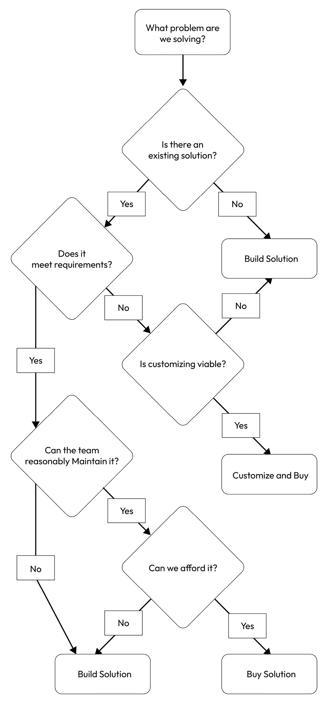
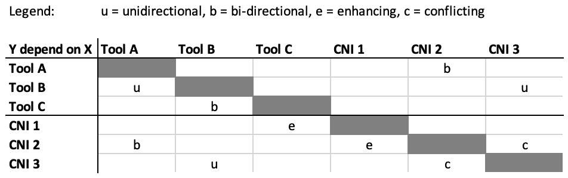
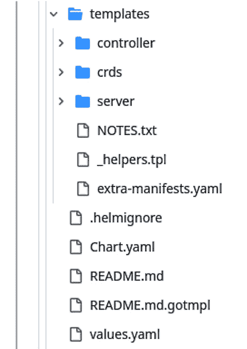
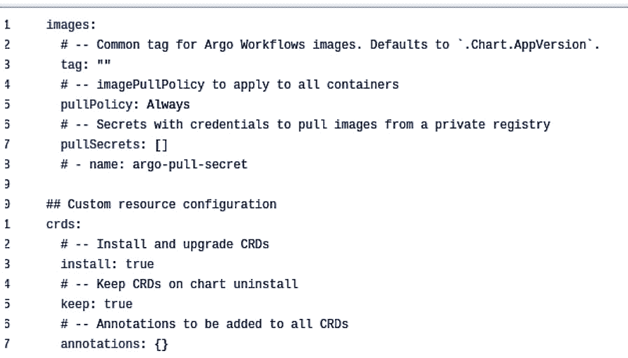
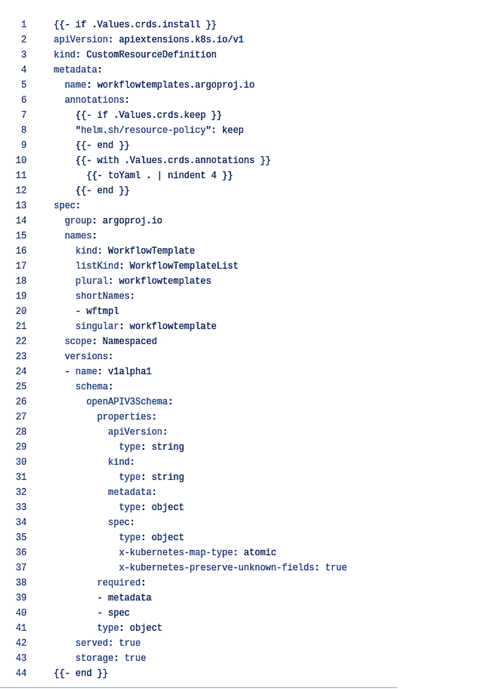

# 第九章：选择技术债务以避免平台崩溃

什么是 **技术债务** 以及它是如何避免平台崩溃的？ 技术债务是对一项软件的持续维护成本。 这包括在运行环境上的实际支出、用于操作和更新的时间以及客户满意度。 就像货币债务一样，技术债务也会不断积累。 随着债务的滚雪球效应，团队无法再承受新的债务或交付新的功能，因为他们的所有工作时间都花费在缓解 当前的问题上。

一个团队被技术债务淹没的迹象很容易发现：你的团队是否在试图维护极其过时的软件？ 你是否有操作脆弱且/或容易崩溃的系统？ 你是否在使用不必要的 复杂软件？

如果你对这些问题的回答是肯定的，那么就有相应的成本。 例如，更新、安全性和操作过时的软件从非常昂贵到不切实际不等。 操作上脆弱的软件需要频繁的人工干预，因此会消耗你的运维团队的时间，并增加团队倦怠的风险。 最后但同样重要的是，过于复杂的软件通常很难理解。 它很难阅读和维护，这意味着持续的开发和 维护成本。

没有任何软件能够做到完全没有债务，但当将其与功能进行评估时，可以帮助保证平台更加成功的运行状态。 在这一章中，我们将涵盖以下主题：

+   有意识地承担技术 债务

+   利用数据驱动 设计决策

+   维护和重构 技术债务

+   重写与重构 – 一份 实用指南

+   架构决策记录 – 为 后世文档化

# 有意识地承担技术债务

“*明智地选择你的技术债务*，”你的作者 Hilliary 总是这么说。 但是，选择你的技术债务意味着什么呢？ 难道我们不是应该解决问题并 识别解决方案吗？

是的。 但是这两者 并不互相排斥。 很可能没有一个现成的完美解决方案。 通常，产品是根据特定的使用场景设计的，但这些场景并不涵盖所有情况。 没有任何产品能够覆盖每个用户潜在需求和工作流的每种组合。 事实上，在你的平台生命周期的过程中，情况也将是一样的。 当我们承诺接受一个解决方案或技术的不足时，意味着我们承诺以另一种方式来弥补这些不足。 这种补偿应该被管理，以避免我们为平台团队或开发者创造额外的工作负担或手动工作流，进而导致无法持续的辛苦劳动。 过多的技术债务会削弱平台的投资回报率。

技术决策应该是协作进行的。 团队达成共识是很重要的，这样可以确保前进的方向至少是大多数人都感到舒适的。 要有意识地承担技术债务，必须能够评估它并理解以下 重要问题的答案。

以下是一个 技术债务评估，供你 试用：

1.  你今天解决了哪些问题？ 正在解决什么问题？

1.  你目前没有（还没有） 什么问题？

1.  这将需要我们多少时间来构建 或采用？

1.  这将花费我们多少 来运行？

1.  我们需要什么来 维持它？

1.  我们的 预期回报是什么？

1.  团队能否维持 它 *按原样*？

    +   如果不是，团队是否准备好提升技能， 并且有足够时间？

    +   如果是开源软件，社区有多强大？ 团队如何加入 这个社区？

1.  任何新加入的团队成员需要什么才能尽快上手？ 快速上手需要什么？

1.  我们什么时候能知道是时候 扩展了？

1.  我们将如何 扩展？

1.  我们的弃用标准是什么 对于这个解决方案？

将这些问题的答案可视化为一个会计账簿。 在你将所有内容加总后，你是领先还是落后？ 像你的账本一样，这些数值必须平衡。 团队或组织的技术债务平衡更多的是社会技术层面的，而非单纯的技术层面。 工程的艺术性可能会导致一种情感上的联系，从而产生盲点和缺陷，影响解决方案的长期可持续性。 例如，由充满激情的工程师编写的前沿工具，如果没有以邀请团队协作的方式编写，且技术部分排除了不少没有必要技能来维护这些工具的团队成员，它们更可能会被弃用或遭到破坏。 这些工具。

一个解决方案可以尽可能聪明、优雅且简单，但如果不适合团队或问题所在的环境，它仍然可能是不可持续的。 例如，如果解决方案是用 Rust 编写的，而团队至今一直在使用 Ruby，那么如果设计和实现该解决方案的人离开，团队不太可能能够维持该解决方案。 例如，解决方案是用 Rust 编写的，而团队至今一直在使用 Ruby，那么如果设计和实现 该解决方案的人离开，团队不太可能能够维持该解决方案。

这就是为什么在所有问题中，最后一个问题变得最为重要。 弃用标准告诉我们何时该退役或替换一个工具、一个系统或任何一段代码。 所有事物最终都会变成遗留软件，因此弃用计划或评估弃用标准是维持 技术债务的重要方面。

## 可持续地超越最薄可行平台（TVP）

当我们构建一个 TVP 时，我们 承诺于 *足够好*的概念，但随着发展的推进，曾经足够好的东西可能会开始变得不合适。 这是平台技术债务的第一次迭代。 技术债务是增长和演化的标志。 它有时可能是回顾起来犯了错误决策的结果，但同样也常常是超越当初决策合理性时的结果。 在某种程度上，技术债务是做生意的成本，而在其他方面，它可以看作是成长的痛苦。 无论你怎么看，它都是一种需要管理 或减轻的症状。

当平台需要超越最初的薄弱阶段，并开始朝着成为一个强大的解决方案的方向前进，支持一个规模化的组织时，我们开始重新评估过去的决策。 我们是否扩展现有功能？ 我们是否替换任何组件？ 我们是否淘汰那些未能按预期表现的功能？ 这次过渡到下一代 IDP 是由与定义 TVP 相同的数据推动的。

### 关键用户旅程

最初在 IDP 的发现或规划阶段定义， **关键用户旅程** 定义了用户与 IDP 之间交互的预期工作流，以及他们如何期望在其中 获得成功。

然而，随着组织的发展，这些关键用户旅程也在不断变化。 过去对组织至关重要的事物，可能不再重要，或随着时间的推移变得不如其他新兴事物重要。

此外，如果你遵循了 TVP 模式，那么初始阶段构建平台时可能排除了一些用例和潜在的关键用户旅程。 定期审查这些旅程，并有意识地决定添加新的旅程或扩展现有的旅程，将影响你的平台如何成长，以及你的 团队如何创新。

关键用户旅程是围绕用户故事构建的。 对于 *Financial One ACME*，将需要满足某个特定的地理区域，因此一个用户旅程将这样描述：“*作为平台的用户，我希望部署一个仅能在北美访问的应用程序。*” 一旦平台团队接受了用户故事，应该创建相应的用户旅程。 并不是每个提议的用户故事都应该立即被接受。 例如，在前述的故事中，访问的区域边界需要支持基础设施。 如果这个用例不是业务关键性的，且可以在不增加额外工作的情况下满足，即使是次优的，或者可以在平台外支持，那么可能应该先处理一个更重要的用户故事。

假设用户旅程“*仅在北美可访问的应用程序部署*”被接受，我们可以使用诸如 Crossplane 和复合特性等工具来实现，它允许平台工程团队定义一个模板，以便在特定地区部署应用程序。 然后，用户在他们的旅程中只需创建该模板的一个实例，指定所有值，并提交到 Git。 其余的由平台的核心交付工具处理。 最终结果将是仅能从指定地区访问的已部署应用程序。 从技术角度来看，这可以通过特定的入口路由规则来实现，针对区域特定的域名，如下所示 示例定义：

```
 apiVersion: composites.financialone.acme/v1alpha1
kind: FinancialBackend
metadata:
  name: tenantABC-us
spec:
  service-versions:
    fund-transfer: 2.34.3
    account-info: 1.17.0
  redis-cache:
    version: 7.4.2
    name: transfer-cache
    size: medium
  database:
    size: large
    name: accounts-db
  region: "us-east"
  ingress:
    url: "https://tenantABC.financialone-us.acme"
```

有关 Crossplane 的更多详细信息，请参阅 *工作负载和应用生命周期编排* 部分中的 *第四章*。

评估每个用户故事的重要性和价值有助于平台的可持续增长。 团队不可能一蹴而就地做完所有事情，因此，保持项目范围不会以团队无法承受的速度扩展是很重要的。 不能承受的。

这同样是所有软件工程中应遵循的原则，以这种方式，平台和面向最终用户的应用程序 没有什么不同。

## 避免过度工程化

什么是 过度工程化？ **过度工程化** 通常表现为创建一个非常强大且功能完备的系统，试图解决每一个可能出现的问题，即使这些问题还不存在。 过度工程化是一个 容易但危险的陷阱。 我们评估中的前两个问题帮助我们避免陷入过度工程化的解决方案。 本质上，我们通过这些问题来定义每个决策的目标和非目标。 理解我们解决的是什么问题和用例，并明确我们不解决的是什么——或者至少暂时不解决——有助于指导我们的决策，并保持项目 范围的合理性。

例如，在一个可观察性解决方案中，随着时间的推移，预期会有大量数据。 很容易陷入规划无限数据并相应构建基础设施的反模式。 相反，应该提问 有针对性的问题：

+   多少数据是 真正有用的？

+   我们值得保存 这些数据多久呢？

+   我们需要保留 *多久* 数据？

+   谁需要访问 数据？

通过根据你的答案定义参数，你将使数据保持可管理的状态。 如果没有必要将数据保留超过一个月或一年，那么解决方案就不应该是编写一个能够处理大量数据的系统。 更好的解决方案是一个处理小量数据的系统，并定期清除不需要的数据。 或者，如果完全清除不符合你的用例，或者觉得过于极端，那么数据聚合可能是正确的方法。 例如，几秒钟内收集的遥测数据可以汇总成天、周、月甚至年。 数据聚合可以让覆盖长时间段的数据依然存在，但无需为大量数据设计存储和检索机制。 如果你觉得自己正经历回忆 *第七章*，观察得很敏锐。 帮助我们防止过度工程化的相同问题，也帮助我们在许多情况下理解我们的安全态势。

避免过度工程化并不意味着从不为你还没有遇到的问题进行规划。 未能为未来做好规划也可能导致创建需要完全替换的解决方案。 现在，当我们考虑可组合系统 架构和微服务的力量时，这可能是有益的。 有时，完全更换一个组件是获得最佳结果的最佳方式。 然而，这通常不是一件容易或快速的事情，所以如果这是所需的，它仍然需要谨慎地规划并按照计划执行。 避免过度工程化的普遍建议是解决今天的问题，并为明天的问题制定路线图。 保持系统简洁可以让它们更容易维护，并帮助确保产品在发展过程中更加灵活。 产品不断发展。

## 构建与购买——构建决策树

在 添加新组件并评估技术债务的过程中，最重要的问题之一是我们应该构建它还是购买它。 这通常是社会技术性问题多于技术性问题，因为它涉及平衡内在的构建欲望与如果购买更合适时的需求。 对于团队来说。

工程师希望自己设计事物是很自然的。 我们的身份、优势、经验和兴趣使我们偏向于做出与这些因素一致的决策。 然而，关键在于从情感和智力上脱离对问题解决的执着，以尽可能不带偏见的眼光看待这些选项。

以下是一个关于是否自建或购买解决方案的决策树图。 请注意， *购买* 并不总是意味着花费金钱；它也可能指的是采用一个免费的或开源的 工具：



图 9.1：自建与购买决策树

遵循这个 决策树应当由团队共同完成。 一些问题可能有更主观的答案，或者不同团队成员对此有不同的看法。 协作是推动这些 决策可持续发展的关键。

让我们一起分析一个决策树的例子。 在这个例子中，我们虚构的公司 *Financial One ACME* 希望现代化其旧有的技术栈。 在他们的目标下，他们可能需要解决以前没有遇到过的技术挑战，或者考虑整合一些新的功能，而这些功能在没有使用更 现代架构的系统中是无法实现的。

一个新功能或不同功能的例子可能是评估数据转换工具的采用。 随着更多数据能力在云原生架构中得到实现，产品团队、平台团队或两者可能会考虑利用这样的工具来使原始数据 更加有用。

例如，如果平台团队想要使用 Prometheus 收集平台的使用指标，并帮助将其转化为 DORA 指标，那么在这个工作流中，数据转换将会很有用。 同样，数据转换的其他使用场景在公司内也可能有用，因此实施时需要考虑多个用户需求。 。

如果我们对这个例子进行过度简化，我们将按照决策树进行操作 如下：

*Q：我们想解决的是什么问题* *？*

*A：我们需要启用自动化* *数据转换。*

*Q：是否有现有的* *解决方案？*

*A：是的 – Apache Airflow 和* *Argo Workflows。*

请注意，在这种情况下，团队已经识别出了两个潜在的解决方案。 从这里开始，接下来的问题应当针对这两个解决方案进行。 它符合要求吗？ 团队能维持它吗？ 我们能负担得起吗？ 由于这两个解决方案都是开源的，负担得起的问题更可能是关于运行的相对成本，而这可能并不容易直接判断。 在评估开源时，最重要的问题是，当一个工具符合要求时，团队是否有能力维护该解决方案。 团队的能力不能在空白中回答，需要团队 权衡他们的能力和对新集成的舒适度。 如果需要提升技能，并不意味着技术债务不可接受，而是必须在时间表中添加时间，让每个人都能跟上进度，以便得出一个结论 *这在潜力上是可持续的* ，而不是 *这* *是不可持续的*。

## 团队认同的重要性

虽然许多 平台架构师会参与 IDP 的日常运行，但同样有可能他们不会。 因此，负责日常管理和维护的人需要充分投入 IDP 的方向及其产品。 这通常是平台团队，但如果你构建的是一个鼓励自服务并与整个工程组织广泛合作的平台，那么团队的范围将会更大 。

可能会出现无法达成 100%共识的情况，在这种情况下，就必须 *不同意* 并且 *承诺*。团队共识可以减少倦怠，但必须与确保 IDP 沿着 路线图继续发展的需求相平衡。

在需要团队提升某种技能的决策中，团队认同至关重要，例如学习工具本身或新的编程语言。 如果团队不愿意或无法适应技术解决方案，那么无论它有多少其他 可取之处，最终该解决方案都不会提供价值。

现在我们已经熟悉了技术债务的概念，我们可以通过 利用数据来研究缓解该债务的策略。

# 使用数据驱动设计决策

到目前为止，我们已经 讨论了可观察性数据对自服务和开发者满意度的重要性，但并没有涉及 IDP 所收集的遥测数据的其他应用场景。 数据是一个强大的资产，可以帮助决策，并在成本和时间节约方面发挥作用。 例如，当你面对两个解决方案 ，它们在解决方案契合度和技术债务方面似乎各占一半时，很难知道该如何选择。 这时，你可以利用数据来做出决策，并跟踪你的 技术债务。

你团队需要用于决策的几乎所有数据，要么已经存在于你的可观察性解决方案中，要么可以轻松添加到其中。 这些数据将非常容易获得。

## 可观察性至关重要

经过 花费大量时间和精力搭建可观察性堆栈、收集和保存数据之后，如果仅将这些数据用于事件管理和响应，那几乎是不负责任的做法。 幸运的是，平台团队很少被指责为不负责任，因此你很可能已经知道，这些数据可以以更有意义的方式使用。 将可观察性数据应用于决策，并利用它来识别和管理技术债务，是你的可观察性堆栈的关键应用场景，虽然有时这些场景会被忽视或强调不足。 在 *第六章*中，我们讨论了可观察性如何以及在哪里应用，但现在让我们来看一下同样的方面，应用于 技术债务。

### 操作数据和繁琐工作

我们简要 介绍了 **服务级别目标** （**SLO**）的概念，在 *第三章*中我们曾提到过它。我们在 *第六章*中再次讨论了它，作为确保客户满意度的关键因素。 然而，SLO 数据也可以用来检查和识别 技术债务。

SLO 是一个目标。 通常，这个目标在初期并不会被定义为最理想的状态，因为在新项目启动时很难立刻实现这一点。 对于新项目来说，一个好的 SLO 定义会更加保守，但会有一条通向最终目标的路线图。 好的 SLO 是那些随着系统 演变而不断变化的 SLO。

例如，如果理想的 SLO 是 28 天内 99%的应用部署将成功，那么最初的目标可能低至 60%。在一切都是绿地（从零开始）的情况下，设置一个更高的目标是合理的，但如果我们看看*Financial One ACME*，这是一个正在迁移大量遗留产品的公司，你会知道那里团队的起点处于不利位置。 因此，设定合理可实现的目标，并在达成这些目标后定义下一个目标，是一种更可持续的方法。 这样可以让团队优先处理阻碍成功的问题，并展示成果。 你可能会问自己，“*这就是游戏化吗？*” *是的。 是的，就是游戏化*。然而，正向反馈循环已被证明能有效减少倦怠并提高开发人员的幸福感。 团队应该被设置为成功，而不是失败。

然而，SLO 并不是唯一重要的操作数据。 完全有可能通过手动干预而不是自动化来维持 SLO。 这正是可靠性工程师通常开始讨论辛劳概念的地方。 辛劳是必须定期或手动完成的无聊、重复的任务。 即使是部分自动化的过程，如果它仍然需要人类按下按钮启动，那么它仍然是辛劳。

有些辛劳是可以接受的，比如为一个还没有准备好全面实施 CI/CD 的组织手动启动发布流水线。但有些辛劳是不可接受的，比如每当需要升级时，工程师手动执行软件每个组件的发布。由于辛劳是由人类完成的，因此它更难追踪，因为追踪辛劳本身就是辛劳。 然而，为了管理技术债务，保持对辛劳的意识并制定减少辛劳的行动计划对确保团队有可接受的认知负载水平和持续创新能力至关重要。

团队和开发人员的辛劳必须根据具体情况和整体情况进行审视，以避免千刀万剐的折磨。 就像我们审查每个存储的数据或每个新增的组件一样，每一项手动任务都必须接受相同的审查：

+   为什么我们需要做这件事？

+   它需要多长时间？

+   我们需要做这个多久？

+   我们能否自动化它？

如果“*我们能自动化吗？*”的回答是“*是的，*”那么必须立即将其优先级排序，并加入团队待办事项的积压中，最好是高优先级，因为开发者的时间是组织中最宝贵的资产之一，仅次于数据。 每个团队对劳作的容忍度会有所不同，这取决于团队的组成和他们的技能。 *Google SRE* ([https://sre.google/sre-book/table-of-contents/](https://sre.google/sre-book/table-of-contents/))一书将劳作的最大目标定义为 50%，但团队会根据团队的性格和其他 组织因素，拥有自己的容忍度。

让我们看一个非常耗时但只需要做一次的任务。 假设是你之前做过的任务；它不一定是某个特定任务。 一些工程师看到手动任务后会直接把它做掉。 其他人则会评估任务，并将其自动化，即使这是一个一次性任务，哪怕这样会让过程 变得更长。

这可能是因为经过同行评审的自动化使用起来比那些可能导致人为错误的步骤更安全，或者因为他们希望永远不再做这件事，他们宁愿不冒着任务是一次性任务的错误风险。 这也可能仅仅是因为对所做的事情进行编码化可以确保它不会随着时间流逝而被遗忘，或被部落知识所遗弃。 无论是执行任务还是为其创建自动化，都是劳作的例子，但尽管花费的时间更长，自动化过程更好地处理了技术 债务。

找到你对劳作的实际容忍度将是一个反复试探的过程，但保持对劳作掌控的一个策略是为其设定服务水平目标（SLO）。 通过将花费在劳作上的时间视为 SLO，当该 SLO 被突破时，比如说我们花费在劳作上的时间不超过 50%，那么就应该进行根本原因分析，找出为什么花费更多时间，识别出纠正措施，以将劳作恢复到预期范围内。 然而，团队应该感到在正确地做事时是安全的，即使这意味着劳作的错误预算在一个 报告期内已被消耗。

### DORA 指标

如果我们回顾 我们在 *第二章*中定义的 DORA 指标和评级，就很容易看出这些指标如何帮助你保持对技术债务的关注：

|  | **精英** | **高** | **中** | **低** |
| --- | --- | --- | --- | --- |
| **部署** **频率** | 按需 | 每天一次到每周一次之间 | 每周一次到每月一次之间 | 每周一次到每月一次之间 |
| **变更** **交付时间** | 少于 1 天 | 1 天到 1 周之间 | 1 周到 1 个月之间 | 1 周到 1 个月之间 |
| **变更** **失败率** | 5% | 10% | 15% | 64% |
| **失败部署** **恢复时间** | 少于 1 小时 | 少于 1 天 | 1 天到 1 周之间 | 1 个月到 6 个月之间 |

表 9.1：DORA 指标能力

如果你已经在你的 IDP 中实施了诸如**Keptn**之类的 DORA 指标收集解决方案，那么你可能已经开始在 IDP 中的每个组件上跟踪这些指标。随着你随着时间的推移跟踪这些指标，你可能会注意到某些趋势。

例如，如果在 6 个月后更改的交付时间或部署失败率仍处于低到中等范围内，那么值得调查背后的原因，看看是否有未解决的**技术债务**。

### 应用程序性能数据

与 DORA 指标相关，但在其他方面相邻的是 IDP 中应用程序和组件的性能数据。尽管平台团队不负责最终用户应用程序，但平台知道应用程序使用的 Pods 和容器的状态。它还可以了解 API 调用的成功与响应时间。平台团队必须使他们服务的开发人员也能理解这些状态，以便他们能够评估这些指标，并确定是否存在问题。这将使开发人员能够管理他们的技术债务。这是平台的可服务性和自助服务的关键方面，对公司持续的成功至关重要。记住，一旦平台投入使用，它是公司中最关键的应用程序；它需要支持自己的成功以及面向最终用户的应用程序的成功。

一个应用程序可以以高度可用的方式架构，充分利用 K8s 平台的强大功能，但这也可能使其无意中掩盖一些可能令人担忧的问题或模式。 因此，应用程序的性能应定期进行衡量和展示。 例如，在一个为高可用性设计的系统中，一个拥有三个 *ReplicaSets* 的 Pod 可能允许应用程序在没有中断的情况下运行，或者看起来像没有中断，即使偶尔发生 OOM 或其他崩溃。 然而，平台会知道这些崩溃，并且可观察性可以用来确保拥有该应用程序的开发人员也能意识到这些问题 。

在 *第六章*中，我们讨论了平台如何支持可观察性，在必要时提供一些规范，并允许开发人员自助服务。 让我们来看一个例子，看看 IDP 如何在测量内容时提供一些规范，因为应用程序的状态对平台来说最容易看到。

### 识别其他关键数据

在 *第二章*中，我们 定义了 KPIs，以帮助推进 IDP 的采用。 那些推动采用的相同数据点和指标，也可以被用来推动创新并管理技术债务。 此外，在衡量采用时，自然的结果是，你已经衡量了围绕采用的任何失败。 这些失败是一个关键数据点，可以帮助你的团队了解开发人员如何与 平台进行互动。

在 *第六章*中，重点介绍了如何将平台整合到公司工作的方式，并举例说明未能采用 Tekton 而选择 GitHub Workflows。 这是一个管理技术债务的例子，同时也是一个未充分利用的组件，可能没有提供 足够的 **投资回报率** (**ROI**)来证明持续的维护成本是合理的。 例如登录次数、或在 Tekton 的案例中，每天、每周、每月计划的作业数等使用指标是重要的衡量标准。 如果平台或平台的某个组件未能随着时间的推移看到利用率的增长，特别是与整体平台的比较，则是时候评估 该组件了。

组件是否提供投资回报，是否减少认知负荷，是否达到 SLO 目标，开发人员是否满意？ 如果平台或组件在这些方面出现问题，那么它在技术债务方面的负担比回报更重。

## 数据保留是技术债务

虽然 可观察性数据对未来平台的决策非常有用，但保留的数据量只需保持所需的最低限度。 随着存储数据量的增加，您可能会发现保留数据的回报递减，而维护成本却很大。 系统所需的数据存储越多，数据存储设计就越关键，因为存储数据量的增加可能开始对系统性能产生负面影响。 此外，由于数据是最关键的资产，在安全事件发生时最容易受到威胁，因此仅保留必要的数据有助于管理任何数据泄漏事件的风险表面和相关工作。 虽然我们不能保证您需要保留多少数据来保持应用程序性能指标，但谨慎地决定保留数据并遵循最佳实践，我们在 *第七章* 中所阐述的内容应有助于确保保留的数据是可管理的。 需要记住的是，平台、用户和技术每年都会有很大变化，因此保留时间较长的数据在平台随行业现代化的同时会变得越来越不适用。 最好确保任何保留的数据都有充分的理由存在；否则，它只是债务表上的另一个标记。

现在我们更了解如何利用数据来识别和管理技术债务，让我们更实际地应用它到 我们的平台。

# 维护和重构技术债务

创建 IDP 的每一个方面到目前为止都代表着技术债务。 理想主义者 会告诉你，如果你做出了明智的决策，就不会有技术债务，但坦率地说，这并不准确。 曾经繁荣的开源项目可能会毫无预警地关闭，或者意外的 CVE 可能会出现。 无论如何，尽管做出了最大努力，总会存在债务。 对于组织健康而言，关键在于能够应对这类事件的后果，并保持合理的创新步伐。

## 拥有你的技术债务

拥有你的 架构意味着要承担它所产生的技术债务。 虽然这听起来像是一个抽象的概念，但当我们开始评估架构的各个组件时，很容易意识到其影响的广度。 记住来自 *第二章*的重要提示?

重要提示

你为平台选择的环境会自动规定平台的一些部分，无论你是否喜欢！ 增加云和基础设施提供商的数量会成倍增加平台设计的挑战。

支持 IDP 所需的基础设施 可能是技术账本上最庞大的项目之一。 拥有意味着债务及与之相关的风险表面面积是明确定义和理解的。 有时候，这种风险可能意味着安全或合规相关的风险，但通常在技术债务的背景下，我们指的是影响团队维护和交付产品能力的风险，而不是使团队陷入过度劳累的风险。 平台架构师负责体现这种所有权，但他们不能在这里成为超级英雄。 技术债务的所有权，包括应对意外情况，是一项 团队共同努力的任务。

### 技术债务与团队仪式

让整个团队共同承担技术债务的最直接方法是将其融入团队参与的仪式中。 这一点的最终形式应该由团队设计。 在敏捷工作环境中，这可以包括在每个迭代或项目的规划阶段专门评审技术债务，也可以表现为每个迭代中专门用于减少技术债务的时间，如减少重复性劳动或处理已识别的改进机会 。

如果你的平台团队采用看板（Kanban）方式工作，确保将待办事项按优先级堆叠，以便技术债务项目能在其他工作中被拾取，这也是一个 不错的策略。

重要提示

这些项目可能会因其他事项的优先级更高而被不断地降级，这是一个非常现实且严重的风险。 然而，这会产生滚雪球效应：解决技术债务所需的努力程度会随着工作 推迟的时间越长而变得更大。

制定不可变的方式以控制技术债务非常重要。 许多组织采用不同的策略来解决意外问题。 重要的是掌握组织的社会技术方面，确保平衡不被打破。 不偏离平衡。

## 平台可组合性

平台的可组合性使其非常适合进行重新设计。 IDP 的组件应该是相对独立的，几乎没有（如果有的话）相互依赖。 因此，团队应该有权决定利用平台的这一特性，并在适当的情况下弃用并替换组件。 适当时进行替换。

团队需要谨慎做出这一决策，因为替换现有组件比仅仅添加一个新组件要复杂一些。 除了回答评估新技术债务的问题外，还需要回答另一组关于退役 旧技术债务的问题。

以下是一些需要考虑的弃用标准：

+   我们是否会永久失去我们需要或 关心的功能？

+   这将如何影响 用户？

+   过渡计划是什么？ 过渡计划是什么？

+   时间线是什么？ 有成本差异吗？

+   我们是要替换它还是仅仅 移除它？

+   原组件和 替代组件的重叠时间是多少？

+   如果有，是什么？ 如果是，具体是什么？

+   新的维护要求是什么？

## 依赖关系

管理依赖关系 是管理技术债务的关键领域之一。 虽然接纳一些团队无法控制的解决方案可能在最初对某些人来说是反模式，但现实是，管理依赖关系的状态通常比尝试在合理的时间内编写一个完全功能的定制 IDP 更容易。 的时间。

如果我们查看我们在*第二章*的依赖关系矩阵， 我们可以将其应用于平台维护及其债务的讨论：



图 9.2: 依赖关系矩阵

你的平台可能有几种不同类型的依赖关系。 以下是一些 明显的例子：

+   开源 组件

+   网络和 网络设备

+   数据库

+   付费组件

+   内部或 定制服务

在一个理想的世界里，IDP（身份提供者）在任何部署环境中都会是完美统一的。 然而，在多云或多架构的部署环境中，基础设施的依赖关系很可能是 相似但又有所不同的。 因此，你可能需要构建并维护几个不同版本的矩阵，以便准确反映环境。 无论你决定做什么，都需要确保这些文档保持最新，以避免未来出现错误或安全相关的问题。

## 安全性

通常 被称为一个动态目标，安全最佳实践会随着行业的发展而演变和变化。 当这些变化发生时，你的软件就会落后，需要赶上时，这将成为你技术债务账单上的一项。 例如，如果我们观察主要云服务提供商的工作负载身份，我们可以看到一个行业转型的实时例子，以及一波新的技术债务 的出现。

过去，应用程序使用密钥是常态，而这些密钥的风险则被接受。 虽然缓解这些风险属于技术债务的一部分，但当时并没有更好的替代方案。 然而，工作负载身份的发明消除了应用程序与云服务提供商交互时需要使用密钥的需求。 取而代之的是，它们拥有基于角色的身份，可以使用短期令牌，这类似于人类用户 所使用的。

现在，随着这一技术被所有三大云服务提供商采纳，整个行业正在持续努力现代化应用程序，并利用工作负载身份替代密钥。 对于某些应用程序，通过重构就可以实现这一目标，但对于其他应用程序，这可能意味着需要添加新的组件或进行全面的重写 。

## 并非所有技术债务的严重性相同

之前提到的安全性子标题可能是最明显的例子，但并非所有技术债务的严重性都相同。 任何妥协系统完整性的因素，如安全性和合规性，都会被赋予较高的优先级，尽管其他可能伴随高时间成本的项目也可能会排在 清单的顶部。

例如，虽然一个新应用程序的发布可能是手动完成的，第一次或第二次发布时可能如此，但很快就会自动化。 从那里开始，自动化接管了，它启动的时间更短，维护也更容易。 这是减少管理软件所需工作量的一个快速且显而易见的方式，但自动化仍然需要维护，这也被视为技术债务。 然而，由于它不太可能频繁更改，因此与如果将发布过程保持为手动过程相比，这项债务的重量要轻得多。

这就是为什么定期回顾并了解团队在非创新时间都花在哪里，或者平台中已识别的差距，变得如此重要。 平台的提供内容。

现在我们已经讨论了如何应对技术债务，让我们进一步扩展，了解何时该对这些债务进行重构 或重写。

# 重写与重构数据 – 一份实用指南

当技术债务 不断积累时，团队将花费越来越多的时间来解决这些债务或由此带来的后果，而减少了创新的时间。 这在功能上看起来像是更高程度的操作性繁琐、更长的新人加入和培训周期，以及团队的疲惫。 保持对技术债务的管理对于确保开发者的幸福感和创新的持续至关重要，它们应该是平台团队的核心关注。 平台团队。

有时，这种雪球效应可能表现为事物不再按预期工作，或者所需时间超过了预期。 另外，也可能是曾经被认为是可以接受的工作量，运行平台的工作量，阻碍了平台和团队在用户基础增长时的扩展。 无论是哪种情况，当这些技术债务项目超出了正常预期时，团队需要考虑如何回到正常状态，或者找到一个新的 良性状态。

对此的选项可能是重构一些平台。 重构可能允许进行一个相对快速的变化，以获得长期的收益。 例如，当 Golang 改变了其依赖关系的版本处理方式时，许多团队不得不进入并调整他们的导入，以匹配新的、更好的方法。 这里有一些其他重构的理由 ：

+   提高效率

+   提高安全性

+   添加或更改 接口

然而，当 无法利用当前的代码库或组件列表达到期望的状态时，可能会考虑进行重写。 我们已经确定，在其基础层面，系统应该是可组合的，意味着很少—如果有的话—是作为辅助功能的无服务器函数或脚本。 重写服务的一个原因是，如果继续使用该服务会导致需要增加那种 类型的辅助工作负载。 **Envoy Proxy** 就是这种辅助工作负载的一个例子。 它的文档将其描述为“*一款高性能的 C++分布式代理，专为单一服务和应用程序设计，也是为大型微服务‘服务网格’架构设计的通信总线和‘通用数据平面’，它与每个应用程序并行运行，并通过以平台无关的方式提供常见功能来抽象网络。*”（来源： [https://www.envoyproxy.io/](https://www.envoyproxy.io/)）。 然而，作为 这个例子，尽管 Envoy Proxy 功能强大，如果实施它的唯一原因是为了支持一个与其他服务使用不同语言编写的单一服务，那么与其增加 Envoy Proxy 层，不如重写那个异类服务可能更有意义。

虽然增加 Envoy Proxy 是一个优雅且现成的解决方案，但它是一个相对复杂的层，添加到 Kubernetes 平台中，而仅为一个服务添加这个层需要相较于重写该服务的情况进行合理化。

## 判断是否需要重写

假设 你在一个平台团队中，正在审视一个组件并试图决定它的未来。 是什么因素让你决定是时候告别这个当前状态的组件了？ 其中一个原因可能是许可证的变化。 如果你使用的工具曾经是开源的，但现在更改了许可证类型，那么可能是时候替换它了。 毕竟，开源版本可能不会收到任何安全相关的更新，而你的团队可能没有足够的技能来维持这个 工具的现状。

重写组件的决策 树应该与选择构建还是购买的决策树几乎相同。 当你觉得必须重写时，构建还是购买的对话需要再次进行。 如果存在开源解决方案或可购买的廉价解决方案，你的重写可能只需要实施一个新的集成。 但如果情况并非如此，那么可能需要创建一个定制的服务。

然而，如果你希望扩展功能或实现某些性能提升，这种情况非常不可能，并且需要完全重写。 除非组件非常旧或自编写以来一直没有得到维护，否则你很可能最好重构你的 代码库。

## 以一个例子来检查外部因素对重构的影响

有时， 重构的需求并不是来自内部，而是由于生态系统中工具或技术的变化。 不幸的是，这些依赖项的维护者做出的决策直接影响你的团队的技术债务，并可能导致需要重构该工具的实现。

重构的一个好例子是在从使用 Helm ([https://helm.sh/](https://helm.sh/))版本 `2` 过渡到 Helm 版本 `3` 进行 Kubernetes 包管理时。 Helm 是一个 Kubernetes 部署的包管理工具。 它是一个开源工具，使用一种名为 **charts** 的打包格式来协调在集群上安装和升级应用程序的过程。 Chart 不是一个文件，而是定义运行应用程序所需 Kubernetes 资源的文件集合。 例如，Argo CD 可以通过 Helm charts 安装到 Kubernetes 集群中。

Helm 2 是 Helm 的一个受欢迎版本，直到 2019 年 11 月发布 Helm 3，但它在 处理 **客户资源定义** (**CRDs**) 方面存在一些缺点。 虽然今天的 Helm 仍然不支持升级或删除 CRD，但新方法帮助 Helm 更好地为使用 CRD 的用户服务。

那么，Helm 3 解决了什么问题呢？ 首先，让我们来看一下 CRD 是什么。 这在 *第四章*中有更详细的解释，但如果你忘记了，CRD 是扩展 Kubernetes API 的。 从功能上讲，这意味着你的 Kubernetes 集群现在具有了自定义资源的概念。 在 Helm 2 中，CRD 的处理是通过 `crd-install hook` 方法完成的。 Helm 中的 hook 机制允许一个 chart 在运行之前与其他依赖项进行交互并利用它。 虽然理论上这个方法应该是有效的，但它仍然导致了 Helm 无法识别 CRD 的情况，因此 Helm 无法验证 chart 中的 API 扩展。 如果安装后添加了新的 CRD，升级将失败，因为 `crd-install hook` 方法不会被执行。 这意味着如果 CRD 发生变化，之前版本的 chart 必须被完全删除并替换。 这对于 Helm 用户来说是非常具有破坏性的，许多团队不得不在其 CI/CD 管道中实现临时解决方案。

Helm 3 通过弃用以前的 `crd-install hook` 方法，并移除了支持该功能的底层功能，改变了用户体验。 现在，需要一个 CRD 目录。 该目录路径嵌套在 chart 中，使用这个名为 `crds/`的目录，允许 Helm 在将 CRD 添加到集群后暂停，之后再继续执行 chart。 Helm 现在允许进行 CRD 安装，而以前是无法做到的。 本质上，Helm 现在在进行 chart 验证时了解新的 API 功能，确保用户能够享受到更流畅的操作体验。

虽然底层的 Helm 变化相当重大，但对于 Helm 用户来说，这意味着需要重构现有的 chart 并升级正在使用的 Helm 版本。 然而，这也使得许多用户能够去除他们实现的任何临时解决方法，转而利用 Helm 内建的升级功能。 根据所使用 chart 的大小和复杂性，这些重构可能需要相当大的努力，但远不及迁移到另一种处理软件安装和 升级方式的工作量。

要了解重构变化的大致范围，我们来看一下今天使用 Helm 3 的 Argo CD Helm Charts （[https://github.com/argoproj/argo-helm/tree/main/charts](https://github.com/argoproj/argo-helm/tree/main/charts)）。在该仓库中，有一系列图表，每个图表作为整体 Argo CD 项目的一部分被安装。 在 Helm 中，目录结构非常重要；没有正确的结构，图表 无法正常工作。

如果我们查看其中一个图表，我们会看到新的 CRD 目录 已经存在：



图 9.3：Argo CD Helm Chart 目录结构

如果我们查看其中一个图表的 `values.yaml` 文件，我们会发现 CRD 的使用 非常简单：



图 9.4：Helm Chart values.yaml 文件中的 CRD 配置

从开发的角度来看，利用 CRD 的主要工作在于 CRD 定义本身。 在这里，定义了 CRD 注释以及任何其他所需的逻辑，如资源策略， 也都在此声明：



图 9.5：来自 Argo CD 项目的 CRD

在看到 CRD 如何与 Helm 图表一起使用后，产生的一个自然问题是：“*之前是怎样的？*” 答案是“*这取决于。*” 在 `crd-intall` 钩子被添加到 Helm 之前，解决这个问题的常见方法是将 CRD 分解成单独的图表，然后使用 bash 脚本确保图表按特定顺序安装。 例如 `Istio` 项目就是采用这种方式的例子。 这种方法有效，但增加了维护负担，因为确保正确安装的脚本成了 Helm Chart 维护者需要持续更新的另一项任务 。

在 Helm 添加安装钩子后，废弃此类脚本的功能变得可能。 在保持相同 CRD 文件的同时，用户可以添加 `crd-install` 钩子注释。 然后，Helm 的底层组件 tiller 会确保在其余图表 被执行之前，触发 CRD 的创建。

Helm 2 文档进一步解释了这一点（[https://v2.helm.sh/docs/charts_hooks/#hooks](https://v2.helm.sh/docs/charts_hooks/#hooks)）。 需要了解的关键点是，包含 `crd` 钩子的 YAML 文件最初看起来 是这样的：

```
 apiVersion: apiextensions.k8s.io/v1beta1
kind: CustomResourceDefinition
metadata:
  name: crontabs.stable.example.com
spec:
  group: stable.example.com
  version: v1
  scope: Namespaced
  names:
    plural: crontabs
    singular: crontab
    kind: CronTab
    shortNames:
    - ct
```

重写后，它会 看起来 像这样：

```
 apiVersion: apiextensions.k8s.io/v1beta1
kind: CustomResourceDefinition
metadata:
  name: crontabs.stable.example.com
  annotations:
    "helm.sh/hook": crd-install
spec:
  group: stable.example.com
  version: v1
  scope: Namespaced
  names:
    plural: crontabs
    singular: crontab
    kind: CronTab
    shortNames:
    - ct
```

从本身来看，这是一个非常小的变化。 正在使用的 Helm 版本也需要更新，但总体来说，这是一个非常小的工作量，允许许多自定义的 bash 脚本 从维护 Helm Charts 的人员的工作中解脱出来 ，这些人员为他们的应用程序维护 Helm Charts。

有时，重构的过程非常简单。 它可能只是识别一些低效的区域，或者是发现代码可能遇到竞争条件的地方，并对代码进行修改，以改进这些情况。 其他时候，重构可能更加全面，例如替换一个库，或者将语言版本更新为带有一些破坏性更改的版本。 无论重构的原因是什么，它通常比 重写投入的努力要少，但回报更高。

## 审视一次著名的重写

如果仍然 不清楚何时重写可能是合适的选择，我们可以通过开源软件项目来看一些著名的重写案例。 在 Linux 内核中，以及容器技术本身，因此也包括 Kubernetes，我们可以在 cgroups 中找到一个完美的例子。 Cgroups，也被称为控制组，是存在于 Linux 内核中的一种技术，用于管理计算进程。 Cgroups 管理资源分配并通常控制进程。 然而，最近为了响应社区对性能提升的呼声，进行了一次重写，cgroupsv2 应运而生。

这个例子特别有趣，因为它产生了连锁反应。 虽然 cgroupsv2 通常被认为优于 v1，并且大多数应用会看到性能提升，但遗留应用可能会受到影响。 在 Kubernetes 中，必须指定一个 cgroups 版本，而遗留应用的问题就显而易见。 特别是，旧版的 Java 和 Node.js 应用将与 cgroupsv2 的内存查询功能不兼容，并且可能会 遭遇 **内存溢出** (**OOM**) 错误，导致工作负载崩溃。 对于使用较旧应用的公司，建议升级技术栈。 这可能意味着需要重写或重构，具体取决于遗留代码的滞后程度以及需要做什么才能将其更新为与 新的 cgroupsv2 兼容的版本。

那些对 Kubernetes 有更多了解的人可能会注意到，截至当前版本 1.30 的 K8s，Kubernetes 仍然包含使用 cgroups v1 的功能。 这是事实，任何不希望进行现代化的组织可以利用这一功能。 然而，依赖 cgroupsv1 继续存在而非采用重写版本是不明智的，因为更可能的情况是 v1 会被弃用，而不是同时维护两个版本。 如果不希望进行现代化，那么与其新增技术负担，不如将指定 cgroupsv1 的集群配置添加到团队账簿中。 所有新的集群必须在支持 cgroupsv1 的期间内创建，或者在遗留应用没有现代化之前，使用 cgroupsv1 的规范。 如果创建集群有自动化过程，那么也需要对其进行重构，并将其添加到额外的配置中。 此外，虽然现代化的应用能够在 cgroupsv1 下运行，但它们的性能可能不如在 cgroupsv2 下的表现。 无论是决定重构集群创建，还是对运行在旧版语言上的工作负载进行现代化，这次重写的影响波及到了 整个行业。

重写及随之而来的 cgroupsv2 成为默认设置的一个最终后果是，一些新的原生 Kubernetes 特性仅与更新的版本兼容。 换句话说，坚持使用 cgroupsv1 会限制你的能力，错过一些 Kubernetes 增强功能，特别是在 工作负载管理方面。

## 重写后的过渡

你已经完成了重写（或可能是替换），现在是时候进行切换了。 不幸的是，这类过渡很少是干净的——如果不是永远——通常需要精确的规划和执行。 过程越混乱，原始组件必须存在的时间越长，团队就需要平衡与两者相关的运营成本。 为了促进更健康的过渡，尽早定义过渡计划，并尽可能测试过渡计划，确保没有遗漏。 此外，编写和测试过渡计划还有另一个好处。 完成的计划和测试成为事件记录和未来可能需要发生的迁移蓝图。 虽然我们总是希望重写只是发生一次，但现实是，任何长期存活的企业都会经历多次重写。 通过记录这个 过程，你有助于减少重写的技术债务。 这将帮助未来的工程师理清系统的历史，并节省他们在 未来生成过渡计划的时间。

# 架构决策记录 – 为未来的世界而写

一个 **架构决策记录** 帮助 平台的未来拥有者了解不仅仅是什么做了，而且为什么这么做。 维护准确的架构图和文档对理解任何软件系统至关重要，但这些决策和最终状态背后的推理帮助未来的领导者知道如何在 未来使用该平台。

## 为什么要记录软件架构？

软件架构应该 出于几个原因进行记录。 首先，它有助于新团队成员和用户了解项目。 一份好的架构文档帮助这些人理解系统如何使用，以及数据是如何流动 的。

其次，它有助于安全性和合规性，因为所有安全性和合规性审计都需要详尽的软件架构文档 和图表。

最后，它为你提供了一个起点，从这里开始成长。 通过记录当前状态，你为规划提供了一个参考文档。 如果未来的架构师没有很好地理解平台的现状，怎么能知道平台应该走向哪里呢？ 它在哪里？

## 良好的技术文档应该是什么样的？

一个 好的架构文档将包含图像和描述的结合。 根据文档的粒度，它应当展示用户如何与系统互动、系统的依赖关系、数据如何流动、数据如何存储、数据在哪里被更改（如果有的话），以及交互的预期结果。 换句话说，文档应当捕捉系统的功能以及它是如何 实现这些功能的。

文档的另一个功能是记录的不仅仅是“做了什么”和“怎么做”，还要记录“为什么”。 比做什么和怎么做可能更为重要的是，每个决策背后的“为什么”帮助指导未来的决策过程。 例如，未来的架构师需要了解有关 所做决策的关键信息：

+   是否存在某种限制因素导致了 次优的解决方案？

+   替代解决方案需要达到什么标准才能 被考虑？

+   当时已知的风险和缓解措施是什么？ ？

+   目标和非目标是什么 以及为什么？

+   每个组件对 另一个组件有何影响？

通过确保记录决策的这些方面，你是在构建遗产，而不是 遗留软件。

然而，尽管架构决策记录非常重要，它们并不是你平台上唯一重要的文档。 本章和书中提到的其他类型的文档也应当编写并维护，以便你能跟踪系统所带来的技术债务。 虽然管理文档的组织结构和保持文档更新可能会感觉像是苦差事，确实是一种债务，但通过这样做所节省的时间随着时间的推移会带来回报。 可搜索、结构良好的文档是使系统经得起时间考验的关键。 时间考验。

## 我们虚构的公司——最后一瞥

*ACME Financial One* 是一个 专为我们的目的设计的公司——旨在让其看起来像许多正在现代化技术栈的真实公司。 在我们的示例中，他们正在处理遗留系统以及新的或绿色场地系统。 像任何真实的公司一样，这将导致初期技术债务的重复。 为了支持工程师度过这段两套系统并存的过渡期，一个设计良好的平台将提供所需的灵活性，以便在这 两个环境之间实现平稳过渡。

*ACME Financial One* 需要通过最精简的可行平台来支持这一点，该平台能够扩展并发展，以便在用户所在的地方为他们提供支持。 清晰的平台文档和利用平台的流程将帮助开发人员在过渡过程中顺利过渡并采纳新的 环境。

# 总结

如果从这一章关于技术债务的内容中能学到一课，那就是在正确的时间提出正确的问题，能够帮助你的团队构建一个旨在持久的平台。 这个平台可能永远不会 *完成*。总会有需要改进的地方，也总能取得进展。 然而，一个精细的管理平台的流程和相应的文档，将使团队能够在保持 团队健康的同时持续维护平台。

在处理技术债务时，请记住我们在本章开头讨论的示例指标和问题。 识别技术债务并了解相关成本，将帮助你与需要处理这些问题的团队更好地沟通并优先解决这些问题。 虽然解决技术债务本身既费时又昂贵，但它将帮助你为一个能够持久并为 未来变化做好准备的平台奠定基础。

在下一章也是最后一章，我们将讨论变化，以及你的平台如何作为你 IT 组织的稳定基础提供这些变化。 你将了解可持续和轻量架构的概念，以及如何使用户能够采用这些方法。 我们将挑战“黄金路径”这一以用户为导向的术语的视角，并质疑作为平台工程师和架构师的我们，是否也需要一条黄金路径。 最后，我们将以一些关于下一个 趋势话题的思考结束本书。
