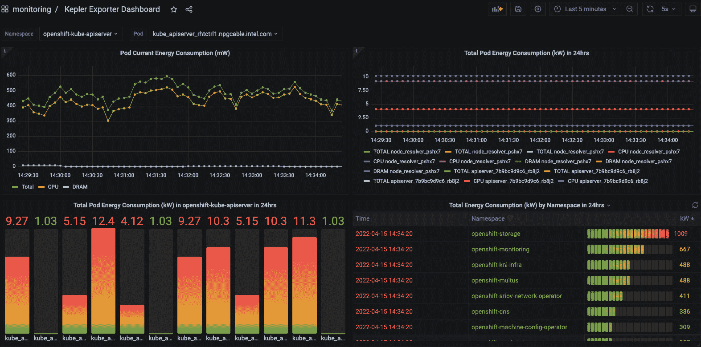

# <st c="0">10</st>

# <st c="3">为未来打造平台产品</st>

<st c="45">一个项目</st> <st c="79">和一个产品的区别在于它的生命周期。</st> <st c="110">项目是有结束的。</st> <st c="132">如果它们错过了截止日期，组织将重新分配资源、资金和时间，导致系统的退化。</st> <st c="254">一个</st> <st c="256">平台作为一个产品必须建立在能够随着需求变化调整、演化和成长的基础上。</st> <st c="358">平台不仅仅是一个技术解决方案。</st> <st c="414">它们需要一个团队、一个思维方式，以及一个完整的有机体，才能为</st> <st c="490">公司带来纯粹的价值。</st>

<st c="500">在最后一章中，我们希望找到一些激励的话语，概括本书的学习和洞见。</st> <st c="614">我们将讨论变化的延续性，以及你的平台如何为你的 IT 组织提供这种延续性，成为一个稳定的基础。</st> <st c="755">接着，我们将探讨可持续和轻量架构的原则，以及你如何鼓励你的用户遵循这些方法。</st> <st c="911">作为平台工程师，解锁这些能力并</st> <st c="984">增添价值，取决于你。</st>

<st c="994">我们将通过挑战“黄金路径”作为一个以用户为中心的术语，来结束本书的话题，并质疑作为平台工程师和架构师的我们，是否也同样需要一个</st> *<st c="1070">黄金路径</st>* <st c="1081">。</st> <st c="1194">黄金路径。</st>

<st c="1206">在本章的最后一些思考中，我们将讨论下一个趋势话题，然后让你继续或开始着手你的平台。</st> <st c="1343">你可能已经意识到，我们经常写到“你的平台”——作为产品的平台始于你的思维方式。</st> <st c="1455">你对其质量和给用户带来的吸引力负责。</st> <st c="1527">你定义了它的成功，它也不是那种事后可以被丢弃的东西。</st> <st c="1611">这就是为什么它是</st> *<st c="1628">你的</st>* <st c="1632">平台。</st>

<st c="1642">在我们的最后一章中，你将</st> <st c="1674">学习到：</st>

+   <st c="1686">持续变化——学习如何老去</st> <st c="1724">与适应</st>

+   <st c="1733">考虑可持续和轻量架构</st> <st c="1788">以及支持</st>

+   <st c="1799">黄金路径</st> <st c="1816">为变化指引</st>

+   <st c="1827">一瞥</st> <st c="1843">未来</st><st c="1852">的景象</st>

# <st c="1854">持续变化——学习如何老去与适应</st>

<st c="1900">持续变化的主要挑战在于</st> <st c="1947">作为平台团队，你需要自己采纳并体现前瞻性思维，同时还要引导和激励你的用户采纳相同的方法。</st> <st c="2105">如果你做不到这一点，在最好的情况下，你的用户将会要求并迫使你的解决方案和团队做出适应。</st> <st c="2226">在最坏的情况下，他们会放弃你的平台，寻求其他解决方案。</st> <st c="2321">所以，最终要依赖你为变化和</st> <st c="2397">成长提供一个坚实但灵活的基础</st><st c="2406">。</st>

## <st c="2409">变化的必要性</st>

<st c="2434">我们之前讨论了技术</st> <st c="2479">是如何快速发展的，以及主要的技术里程碑周期是如何每 10 到 15 年发生一次的。</st> <st c="2563">由于 Kubernetes 刚刚满 10 岁，我们可以预见未来几年将会有一次革命。</st> <st c="2647">然而，更小的变化也使得平台有必要适应新的需求和创新。</st> <st c="2758">平台架构师必须找到一种平衡平台稳定性与市场创新的方法。</st> <st c="2876">这两者之间的紧张关系可能令人不堪重负。</st> <st c="2937">它将质疑你平台的概念、你的 IT 组织的决策，以及</st> <st c="3050">你用户的设计选择。</st>

<st c="3061">麻省理工学院斯隆管理学院定义了这种持续变化的基本结构。</st> <st c="3157">他们发现，看似混乱的变化其实只是以下图所示的四个周期的延续。</st> <st c="3288">他们花了 15 年的研究才理解这些变化并非线性发生，而是不断地从头开始。</st> <st c="3409">我们应该从这个周期的哪一点开始呢？</st> <st c="3442">这取决于我们已经身处其中，实际上，每种技术、方法论或框架都有自己的周期，且略微影响着其他周期。</st> <st c="3595">以平台工程作为一个概念为例。</st> <st c="3641">它真正开始的地方很难说；它是从 DevOps 演变过来的吗？</st> <st c="3713">这个术语是随着像 Backstage 这样的工具出现的吗？</st> <st c="3764">还是有人在哲学上思考 IT 世界，认为这是个好主意？</st> <st c="3857">最有可能的是，平台工程的自我推动力是由这些因素共同作用而产生的。</st> <st c="3968">它引发了新工具和架构视角的出现。</st> **<st c="4020">DevRel</st>** <st c="4026">(即</st> **<st c="4038">开发者关系</st>**<st c="4057">) 专业人员</st> <st c="4073">与他人讨论并展示它的工作原理，最终促使我们写了一本关于它的书</st> <st c="4170">。</st>


<st c="4386">图 10.1：MIT 持续变革的基础结构</st>

<st c="4451">如果你看到这种</st> <st c="4467">在四个领域中平衡的自我推动行为，那么它很可能会被</st> *<st c="4571">每个人</st>*<st c="4579">采纳，你可以迈出第一步，成为</st> <st c="4610">首个推动者</st><st c="4618">。</st>

## <st c="4623">培养变革文化</st>

<st c="4653">我们从</st> <st c="4678">变革的命令中能学到什么？</st> <st c="4701">我们无法避免变革；如果你这样做，你就在回避自己的未来和平台的未来。</st> <st c="4786">作为一个平台团队，你处于一个理想的位置来培养变革的文化。</st> <st c="4866">是的，又一个让你忙碌的议题，虽然它和工程无关，但正是这种职责让平台工程师的角色如此特别。</st> <st c="5011">你处于一个理想的位置，因为平台和你的工作是连接 IT 环境、开发团队和</st> <st c="5146">业务之间的纽带。</st>

<st c="5159">承担这种责任并成为思想领袖并不是一件容易的事。</st> <st c="5237">平台工程师的角色要求他们设定未来的愿景，并引领团队走过变革，这需要制定策略来建设一个接受变革的团队文化，包括沟通、激励和领导支持。</st> <st c="5464">正确的文化方法取决于你的团队和组织中的个人，这是一本书中几乎无法覆盖的内容。</st> <st c="5603">我们可以推荐的做法是创造一种邀请用户进行实验的环境，例如沙箱环境或试点项目。</st> <st c="5738">但你需要做得更多；你也需要为自己的团队创造这样的环境，并且需要鼓励你的平台工程师测试新技术。</st> <st c="5899">你的结果必须被记录下来，并供整个团队查看，这样可以避免重复工作，并且你还可以比较所测试技术的成熟度</st> <st c="6071">随时间的变化。</st>

<st c="6081">因此，你必须实施一种惯例，以同样的方式庆祝成功和失败。</st> <st c="6175">在实践科学中，失败是</st> <st c="6207">研究的重要组成部分。</st> <st c="6239">像 SpaceX 这样的公司，一次次让火箭爆炸，但他们仍然视其为成功，因为每一次，他们离目标更近一步。</st> <st c="6385">也许不要让你的数据中心爆炸，但至少要创造一个安全的环境，在这里你可以为失败投资资金。</st> <st c="6501">组织每天都会浪费资金在看似毫无意义的活动上。</st> <st c="6575">如果你能做一些事情，使你的团队和技术准备水平得到提升，那就远比</st> <st c="6679">这样做更好。</st>

## <st c="6685">迭代演化和不断发展的策略</st>

<st c="6730">有了一个安全的环境来测试新技术，你将能够识别哪些技术可以引入到平台中</st> <st c="6855">，甚至可能替代掉旧的技术。</st> <st c="6890">寻找</st> <st c="6898">稳定性和创新之间的平衡会因情况而异。</st> <st c="6971">我们见过一些平台，它们总是一次性推出一个全新的环境，并且在自动迁移工作负载到新平台方面变得非常专业。</st> <st c="7149">然而，许多人选择逐步引入新技术和功能的方式。</st> <st c="7250">通过使用功能开关并以金丝雀发布的方式为用户提供访问权限，你可以慢慢但安全地引入更改。</st> <st c="7383">通过良好的可观察性和反馈循环，你还将有机会提高新功能的质量，并让用户参与到</st> <st c="7525">演化过程中。</st>

<st c="7539">演化不需要依赖重大里程碑；持续进行以下工作同样重要：</st> <st c="7634">的操作：</st>

+   <st c="7648">重构代码并提高其质量</st> <st c="7687">。</st>

+   <st c="7692">考虑功能请求</st> <st c="7715">的因素</st>

+   <st c="7733">反思技术债务，看看它们是否已经</st> <st c="7793">变得可以解决</st>

+   <st c="7808">频繁更新第三方</st> <st c="7828">集成</st>

<st c="7851">在这种情况下，思考如何淘汰某些实现也是非常重要的。</st> <st c="7939">有些工具可能经历了大量的炒作，但在实现后不久就死掉了，因为缺乏可持续的贡献和开发。</st> <st c="8085">其他工具则可能随着时间的推移被新版本所替代。</st> <st c="8145">因此，设置一个废弃策略也是你平台演化的一部分。</st> <st c="8242">它需要清晰地传达对用户的影响和时间表。</st> <st c="8304">随着废弃，你还将能够识别平台组件的模块化程度以及它们是否松耦合，以及用户是否建立了某种</st> <st c="8473">依赖关系。</st>

<st c="8489">采用新技术是一段旅程，也是一个心态。</st> <st c="8544">作为平台工程师，你处在正确的位置来实现这一点。</st> <st c="8604">建立一个持续学习的环境、频繁的反馈循环和事后复盘，以便快速学习并加速</st> <st c="8728">成功的演变。</st>

<st c="8749">在接下来的部分，我们将简要介绍可持续发展中的一个最新趋势。</st> <st c="8840">我们将重点关注环境</st> <st c="8871">可持续性，这在近年来已成为一个强有力的驱动力，而</st> **<st c="8968">生成式人工智能</st>** <st c="9002">（</st>**<st c="9004">GenAI</st>**<st c="9009">）的迅猛增长使得这一话题更加引起了关注。</st> <st c="9061">因此，作为平台工程师，我们可以做以下几件事，为可持续的未来贡献自己的一份力量。</st>

# <st c="9165">考虑可持续和轻量级的架构与方法</st>

<st c="9234">信息技术已经成为全球顶级</st> **<st c="9271">二氧化碳</st>** <st c="9285">（</st>**<st c="9287">CO2</st>**<st c="9290">）的排放源之一，与建筑和航空业并列。</st> <st c="9356">关于它的最佳研究，遗憾的是已经有几年历史，但我们可以总结出</st> <st c="9443">2018 年的研究结果：</st>

+   <st c="9457">全球信息技术消耗了约 2%</st> <st c="9491">的电力</st>

+   <st c="9505">这导致了全球 CO2e 的 1.5%–2.4%（</st>**<st c="9556">e</st>** <st c="9558">代表</st> **<st c="9570">等效</st>** <st c="9580">——并非所有气体都来自 CO2）</st> <st c="9607">的排放</st>

+   <st c="9614">这个范围与印度尼西亚（1.48%）、加拿大（1.89%）或</st> <st c="9700">德国（2.17%）</st> 的 CO2e 份额相当</st>

+   <st c="9715">2018 年的预测认为这些数字到 2025 年将翻倍；一些不太可靠的来源甚至预测 CO2e 将在 2025 年增加 12%</st> <st c="9849">。</st>

<st c="9856">我们不必关闭一切，重新像穴居人一样生活，但至少我们应该意识到我们的</st> *<st c="9989">无限</st>* <st c="9997">计算资源对环境的影响。</st> <st c="10038">任何形式的计算资源，在生产、使用（通过其所需的电力）以及退役和销毁时，都会导致 CO2e 的排放。</st> <st c="10183">。</st>

<st c="10197">因此，我们能做的最好的事情是</st> <st c="10240">如下：</st>

+   **<st c="10251">减少</st>**<st c="10258">：减少就是要在我们消费的每一件事上都保持可持续性。</st> <st c="10325">在我们的日常生活中，我们不必拿塑料袋，但那数字资源该怎么办呢？</st> <st c="10424">其实很简单——我们真的需要一个超高可用的分布式 web 服务器，跨越五大洲，并每小时进行跨地域备份吗？</st>

+   **<st c="10567">重用</st>**<st c="10573">：在 IT 领域，重用有两个方面。</st> <st c="10606">如果一台服务器退役，可能不应将其销毁，而应将其卖给专门运营遗留服务器的供应商。</st> <st c="10742">其次，我们应尽可能长时间地继续使用该服务器。</st> <st c="10803">这也是一种重用的形式。</st> <st c="10838">作为一个调度器，Kubernetes 使这一过程变得极其简单，并且当出现</st> <st c="10953">故障时，能够提供经过验证的负载均衡。</st>

+   **<st c="10963">修复</st>**<st c="10970">：我们大多数人没有能力修复服务器。</st> <st c="11030">通常，个别组件如内存模块或网络</st> <st c="11093">设备会发生故障。</st>

+   **<st c="11106">适配大小</st>**<st c="11116">：调整请求的计算能力，无论是在本地还是云端，以适应你的工作负载。</st> <st c="11213">服务器上 80%的空闲空间的时代已经结束。</st> <st c="11259">那些计算资源利用率不到 90%的人，实际上是在</st> <st c="11340">伤害地球。</st>

+   **<st c="11351">拒绝</st>**<st c="11358">：不要与那些未致力于实现可持续性目标的供应商合作。</st> <st c="11445">你有责任将这一标准纳入你的供应商</st> <st c="11503">选择流程中。</st>

+   **<st c="11523">重新平台化</st>**<st c="11534">：注意，如果一个供应商或平台没有承诺或不支持</st> <st c="11606">可持续性目标。</st>

<st c="11626">现在，你可能会说，“可持续性”的商业案例在经济上并不太有吸引力。</st> <st c="11728">你甚至可能会有这种感觉，认为我们之前讨论的行动已经足够了。</st> <st c="11820">减少成本通常伴随着优化你的 CO2 足迹。</st> <st c="11889">因此，优化你的足迹也会对你的成本产生积极影响。</st> <st c="11962">此外，越来越多的法规正在制定，以应对全球变暖增长放缓的问题。</st> <st c="12058">遵守这些法规总比</st> <st c="12102">支付罚款要好。</st>

## <st c="12116">启用轻量化架构</st>

<st c="12149">启用轻量级架构应该是平台的主要目标。</st> <st c="12227">它不仅对可持续性有益，还提高了系统的健壮性和容错能力。</st> <st c="12343">当应用程序的架构没有硬性依赖，使用较少的组件，部署灵活（包括可扩展性），并采用恰当的技术时，它便是轻量级的。</st> <st c="12563">一个很好的例子是 Apache Kafka，它在流处理的背景下成为了一种事实上的标准。</st> <st c="12615">然而，我看到更多的系统仅仅将其用作传输日志和事件并汇总数据流。</st> <st c="12678">现在有数十种更轻量、高效的工具，提供相同的功能，但没有规模、资源需求和复杂性的开销。</st> <st c="12782">这种模式非常普遍。</st> <st c="12962">我们更倾向于选择一种能够满足我们需求并能提供更多功能的解决方案，尽管我们并不需要它，而其他人可能需要，所以它必须是</st> <st c="13138">正确的选择。</st>

<st c="13151">无论我们选择什么，为了支持轻量级架构作为平台团队，我们必须提供技术选项，能够为需求提供两到三个更好的答案，而不是错误的答案。</st>

## <st c="13359">为用户适应提供支持</st>

<st c="13400">我们现在如何支持用户</st> <st c="13429">并允许他们在未来优化他们的系统？</st> <st c="13470">该如何做？</st>

<st c="13484">我们让他们了解自己的影响，展示平台在可扩展性、平衡性和</st> <st c="13601">无服务器运行方面的潜力，并提供替代的轻量级技术。</st> <st c="13671">这可以成为我们**<st c="13709">内部开发平台</st>** <st c="13738">（</st>**<st c="13740">IDP</st>**<st c="13743">）</st> <st c="13746">和可观测性的一部分。</st>

<st c="13764">为了展示碳足迹的透明度，开源工具如 Kepler、Scaphandre 以及商业解决方案提供了对系统组件造成的 CO2e 排放的洞察。</st> <st c="13962">下面是来自 Kepler 的截图，展示了一个简单的 Grafana 仪表盘，显示了每个组件的能耗。</st>



<st c="14843">图 10.2：一个显示各个组件能耗的 Kepler 仪表盘（该图像仅作为视觉参考；文本信息并非必须。）</st>

<st c="15004">目前，这些工具仍在开发中，经常出现错误且难以处理，但它们是一个起点。</st> <st c="15134">它们是否成功将取决于教育用户的能力。</st> <st c="15207">我们必须改变用户的观点，将其从在一个环境中构建软件转变为让平台为他们完成这项任务。</st> <st c="15326">软件需要在平台上构建，以便本地使用所有平台的能力。</st> <st c="15405">这听起来可能像是我们想要构建和引入依赖关系，从而打破我们关于模块化的概念。</st> <st c="15520">但这正是产品的难点；你</st> <st c="15564">必须找到正确的方法来发展和启用新方法，同时保持向后兼容性。</st> <st c="15671">如果你的新特性或旧特性的替代方案带来了价值，用户将会适应</st> <st c="15760">它。</st>

<st c="15766">重要提示</st>

<st c="15781">适应新方法的最佳方式是通过开放性，这种开放性促进了透明度</st> <st c="15876">和教育。</st>

<st c="15890">在接下来的部分，我们将通过黄金路径总结我们的平台之旅。</st> <st c="15968">我们将再次从不同的角度审视平台工程中的常见话题，将黄金路径视为平台的一个特性。</st> <st c="16137">最终，作为平台工程师，我们创建黄金路径以创造更多的</st><st c="16209">黄金路径。</st>

# <st c="16225">变更的黄金路径</st>

<st c="16253">术语</st> *<st c="16263">黄金路径</st>* <st c="16274">在我们的书中已经被多次使用。</st> <st c="16324">它的首次使用之一是在</st> **<st c="16355">Spotify</st>** <st c="16362">的博客文章中，发表于</st> <st c="16375">2020 年</st> *<st c="16381">[1]</st>*<st c="16384">。黄金路径是为了引导工程师通过支持的方式完成任务（例如，使用特定的服务或创建具有特定目的的新代码）。</st> <st c="16572">平台工程的核心是提供易于使用的</st> *<st c="16628">黄金路径</st>* <st c="16640">，以减少各个团队在创建、编译、测试、部署和</st> <st c="16721">操作软件时的工作量。</st>

<st c="16738">再次看看我们的虚构公司 Financial One ACME！</st> <st c="16802">在本书的早些时候，我们已经识别出几个用例，可以作为</st> *<st c="16897">自助黄金路径</st>* <st c="16922">提供给我们作为平台工程团队支持的工程师。</st> <st c="16988">提供良好支持的关键方面是适当的反馈渠道，这也是我们接下来将讨论的内容。</st>

## <st c="17108">提供反馈渠道</st>

<st c="17136">支持我们的平台意味着</st> <st c="17166">确保平台上提供的所有黄金路径始终按预期工作。</st> <st c="17259">如果某些功能未按预期工作，平台工程团队需要确保尽快修复所有故障，减少对</st> <st c="17435">最终用户</st> 的负面影响。</st>

<st c="17445">理想情况下，我们能够自动检测到事物未按预期工作，而无需等到用户抱怨。</st> <st c="17573">在</st> *<st c="17576">第三章</st>*<st c="17585">中，在</st> *<st c="17594">一个可用、弹性且安全的平台</st>* <st c="17645">部分，我们讨论了观察我们的平台及其所有组件的重要性，以便自动检测到事物未按预期工作。</st> <st c="17803">与任何其他软件产品一样，我们可以并且必须利用可观察性来确保我们的平台及其所有组件达到其</st> **<st c="17935">服务级别目标</st>** <st c="17959">(</st>**<st c="17961">SLOs</st>**<st c="17965">)。</st> <st c="17969">所以，如果我们的可观察性</st> <st c="17993">告诉我们某些东西不可用、变慢，或突然出现错误，那么我们必须采取行动将其恢复到</st> <st c="18132">正常工作状态。</st>

<st c="18146">通过可观察性获得自动化反馈的另一种方式是观察有多少用户在积极使用平台，以及他们遵循哪些黄金路径。</st> <st c="18300">如果需要复习此主题，请回顾</st> *<st c="18339">成功 KPI 和优化</st>* <st c="18368">在</st> *<st c="18372">第三章</st>*<st c="18381">中。</st> <st c="18533">如果我们看到，突然之间，用户改变了使用行为，那么这表明有些事情发生了变化，我们需要处理。</st> <st c="18798">可能是一些黄金路径出现了故障（例如，开发人员无法访问工具，如 Backstage、Git 或 ArgoCD），也可能是一些路径已经过时（例如，一个 Backstage 模板不再工作，因为它使用了过时的配置）。</st> <st c="19025">也可能是组织中的需求、规定或首选技术栈发生了变化，而我们的平台当前没有提供反映这些变化的新用例的黄金路径。</st>

<st c="19041">为了保持黄金路径的最新状态，我们需要提供一个</st> *<st c="19106">反馈渠道</st>* <st c="19122">，使我们的用户可以积极地向我们反馈他们的新需求。</st> <st c="19200">这就像在任何软件产品中请求新功能一样。</st> <st c="19259">了解这些新功能需求的最佳方式是与我们的最终用户直接沟通，这些最终用户就是我们的内部工程师。</st> <st c="19395">这可以通过内部聊天来实现（例如，可以设立一个专门的 Slack 频道，如</st> `<st c="19483">#goldenpath-suggestions</st>`<st c="19506">），也可以提供一个电子邮件分发列表（例如，</st> `<st c="19562">goldenpaths@yourcompany.com</st>`<st c="19589">），或者可以在平台本身内构建一个</st> *<st c="19614">自助反馈黄金路径</st>* <st c="19647">，供用户提供他们希望平台做的下一步详细信息。</st>

<st c="19759">反馈是最终</st> <st c="19785">驱动我们不断改进平台的新功能或优化现有黄金路径的关键。</st> <st c="19864">对于最终用户来说，这意味着他们不断从平台中获得新功能，使他们的日常生活更加轻松，即使他们的需求和交付软件的过程发生变化。</st><st c="20039">软件</st> <st c="20048">可能会发生变化。</st>

## <st c="20059">黄金路径是我们平台的功能</st>

<st c="20106">正如本章开头所提到的，平台是一个产品，因此它永远不会完成，这与有最终截止日期的</st> <st c="20239">项目不同。</st> <st c="20277">平台是不断发展的，因为在新的黄金路径出现或现有黄金路径需要更新以继续工作时，将有新的使用场景需要添加进来，这些变化是由于</st> <st c="20454">需求的变化。</st>

<st c="20470">因为我们像构建产品一样构建平台，所以我们也可以将黄金路径视为我们产品的功能。</st> <st c="20589">这些功能会有不同的形式，取决于我们决定如何构建平台以及我们为最终用户提供哪种类型的用户界面。</st> <st c="20756">在</st> *<st c="20759">第三章</st>* <st c="20768">的</st> *<st c="20776">平台参考架构</st>* <st c="20817">部分，我们讨论了平台的不同形式的用户界面——</st> **<st c="20895">命令行界面</st>** <st c="20917">(</st>**<st c="20919">CLI</st>**<st c="20922">)，REST API，一个</st> <st c="20940">Git 仓库中的特殊配置文件，或一个列出所有可用用例的漂亮开发者门户 UI。</st> <st c="21049">提供自助服务访问可用黄金路径（即功能）列表的用户界面示例如下所示：</st>


<st c="22730">图 10.3：一个包含所有可用黄金路径（即功能）的自助门户（该图像仅作为视觉参考；文本信息并非关键。）</st>

<st c="22905">上面的截图来自一个金融机构（类似于我们的 Financial One ACME），该机构提供了一个涵盖各种使用场景的自助黄金路径列表，这些场景要么是平台工程团队识别的，要么是最终用户多年来请求的。</st> <st c="23198">大多数</st> <st c="23203">在截图中可见的黄金路径集中在请求云资源（例如，EC2 或 Azure 虚拟机）、请求</st> <st c="23335">云服务（例如，AWS</st> **<st c="23361">关系数据库服务</st>** <st c="23388">（</st>**<st c="23390">RDS</st>**<st c="23393">）或 Azure 负载均衡器），或根据模板创建新内容（例如，创建 Chef 策略或 Azure</st> <st c="23506">DevOps 管道）。</st>

<st c="23523">当点击其中一个黄金路径时，通常会提示用户输入一些信息，这些输入将触发一些自动化操作来完成请求。</st> <st c="23679">一些不能或尚未自动化的黄金路径可能仅提供一份操作指南，解释如何完成这个特定的</st> <st c="23808">请求。</st>

<st c="23826">为了回顾这些黄金路径在现实生活中的影响，请回到</st> *<st c="23907">第八章</st>*<st c="23916">，该章专注于成本优化。</st> <st c="23954">在</st> *<st c="23961">仅请求你所需的方式</st>* <st c="23996">部分中，我们解释了在</st> *<st c="24043">请求 Azure 虚拟机</st>* <st c="24078">黄金路径背后发生了什么。</st>

<st c="24091">前面的示例已经很好地概述了平台如何演变。</st> <st c="24171">但我们并不是一开始就有那么多黄金路径（即功能）。</st> <st c="24240">我们从小开始，然后需要准备好扩展。</st> <st c="24291">但是</st> <st c="24295">我们如何</st> <st c="24305">做到这一点呢？</st>

## <st c="24313">从小开始，预期增长，并且不要成为瓶颈</st>

<st c="24371">在</st> *<st c="24375">第二章</st>*<st c="24384">的关于</st> **<st c="24407">最小可行平台</st>** <st c="24432">（</st>**<st c="24434">TVP</st>**<st c="24438">）的部分中，我们讨论了如何从一小组我们认为会产生影响的使用场景开始。</st> <st c="24493">从那里开始，我们利用反馈进一步了解额外的使用场景，并用它们来扩展</st> <st c="24632">平台。</st>

<st c="24643">让我们来看一下 Financial One ACME。</st> <st c="24678">在本书的前几章中，我们讨论了几个自助服务用例，这些用例将改善 Financial One ACME 中开发人员、DevOps、ITOps 或测试人员的工作。</st> <st c="24851">其中包括以下用例，如</st> *<st c="24883">自助访问生产日志以进行故障排除</st>*<st c="24941">，</st> *<st c="24943">提供合规环境</st>*<st c="24974">，</st> *<st c="24976">执行性能和韧性测试</st>*<st c="25016">，以及</st> *<st c="25022">新应用程序的上线</st>*<st c="25050">。一旦这些用例得以实施，并且证明它们能使工程师的工作更加轻松，那么更多的</st> *<st c="25170">黄金路径请求</st>* <st c="25190">将随之而来。</st> <st c="25204">因此，我们需要预期随着构建成功产品而带来的增长。</st>

<st c="25281">随着需要支持的用例集不断增长，问题在于这需要更多的测试和维护工作，从而减少了为平台添加新用例或核心功能的时间。</st> <st c="25482">我们有可能陷入瓶颈，因为我们在努力使平台及其功能与用户的所有需求保持同步。</st> <st c="25635">解决这个问题的一种方法是提供“黄金路径”来构建更多的黄金路径，从而简化平台的扩展——不仅是由**专家**来完成，而是由每个人！</st>

## <st c="25793">构建黄金路径来创建黄金路径</st>

<st c="25828">在整本书中，我们讨论了提供黄金路径以减少工程师完成工作所需的认知负担。</st> <st c="25952">现在的问题是，当我们设计平台时，是否也能提供黄金路径</st> <st c="26034">以使平台工程团队能够更高效地通过新特性、功能和用例来扩展平台？</st> <st c="26174">我们能否构建一个黄金路径，让平台工程团队能够创建更多的黄金路径？</st> <st c="26272">而且，这个黄金路径是否还可以被我们的最终用户（即我们组织中的工程团队）使用，以实现他们的新需求，而无需平台工程团队的帮助？</st> <st c="26487">这几乎让人联想到 2010 年的科幻电影</st> *<st c="26530">《盗梦空间》</st>*<st c="26539">，由</st> *<st c="26550">莱昂纳多·迪卡普里奥</st>*<st c="26567">主演。</st>

<st c="26568">好消息是，我们不需要好莱坞来实现这样的事情。</st> <st c="26640">在</st> *<st c="26643">第五章</st>*<st c="26652">中，在</st> *<st c="26661">提供模板作为 Golden Paths 以简化起步</st>* <st c="26714">部分，我们讨论了 Backstage 中的模板功能。</st> <st c="26774">Backstage 中的模板是一种定义 Golden Paths 的方式。</st> <st c="26831">这些模板通常由平台工程团队创建和维护，因为它们的创建</st> <st c="26934">需要一定的专业知识。</st> <st c="26966">以下片段展示了这样的</st> <st c="27015">模板定义的摘录：</st>

```
 apiVersion: scaffolder.backstage.io/v1beta3
kind: Template
metadata:
  name: self-service-app-onboarding
  title: Onboarding of a new App to Financial One ACME
  description: Golden Path to onboard a new App
spec:
  owner: financialoneacme/platform-engineering
  type: service
  # Input parameters needed when using this golden path
  parameters:
    - title: What programming language
      properties:
        language:
          title: Programming Language
          type: string
          description: Which language do you want to use? owner:
          title: Owner
          type: string
          description: Which team owns this new app? - title: Choose a target Git location
      ... # Steps when Golden Path gets executed
  steps:
    - id: fetch-base
      name: Fetch Base
      action: fetch:template
      input:
        url: ./template
        values:
          language: ${{ parameters.language }}
          owner: ${{ parameters.owner }}
    - id: publish
      name: Publish
      action: publish:github
    - id: register
      name: Register
      action: catalog:register
  # Output to show back to the end user
  output:
    links:
      - title: Repository
        url: ${{ steps['publish'].output.remoteUrl }}
```

<st c="28059">要查看完整的示例，可以查看</st> `<st c="28460">fetch-base</st>` <st c="28470">步骤，它会获取一组在 git 仓库中指定的文件，这些文件将在有人选择 Java 时使用。</st> <st c="28583">然后发布步骤会根据所选语言发布新的 git 仓库。</st> <st c="28674">后台还会进行一些额外的处理，但本质上，这就是创建 Golden Path 模板的</st> <st c="28794">全过程。</st>

<st c="28804">通过这个例子应该能看出，创建 Golden Paths 其实并不难。</st> <st c="28914">当然，这里有一些细节是我们无法在这本书的简短章节中涵盖的，但它展示了像 Backstage 这样的工具已经存在，使得创建或更新 Golden Path 模板变得非常容易。</st> <st c="29126">这也使得平台工程团队能够让其他团队帮助创建和更新他们自己的 Golden Paths，从而减少了核心平台工程团队成为</st> <st c="29319">瓶颈的机会。</st>

<st c="29332">虽然我们以 Backstage 为例，但市面上还有其他工具也提供类似的灵活性。</st> <st c="29442">你应该熟悉开源领域中可用的工具，并且也要关注商业化产品。</st> <st c="29568">另一个值得关注的开源项目是</st> **<st c="29624">Kratix</st>** <st c="29630">–</st> *<st c="29633">开源平台工程框架</st>* *<st c="29679">[3]</st>*<st c="29683">。Kratix</st> <st c="29692">提供了一个框架，用于</st> <st c="29717">构建可组合的</st> **<st c="29737">内部开发平台</st>** <st c="29767">(</st>**<st c="29769">IDP</st>**<st c="29773">)。</st> <st c="29777">它采用了一种有趣的方式，使用所谓的</st> *<st c="29825">Promises</st>*<st c="29833">，这实际上类似于</st> *<st c="29870">Golden Paths</st>*<st c="29882">。Kratix 鼓励所有用户创建并贡献自己的 Promises 到平台，从而使得平台中的每个用户都能利用任何人在</st> <st c="30063">组织中创建的 Golden Paths。</st>

<st c="30079">现在我们已经讨论了黄金路径不仅仅是平台的起点，而且还会不断演变，以及如何提供黄金路径来构建新的黄金路径，从而确保平台的未来增长，接下来是时候考虑一些我们在打造适合未来的</st><st c="30394">平台产品</st><st c="30414">时需要关注的未来趋势了！</st>

# <st c="30425">对未来的展望</st>

<st c="30451">接下来的几行可能是本书中最危险的一段文字。</st> <st c="30522">它们可能完全是胡说八道，或者仅仅是一个</st> <st c="30562">梦，或者也许是我们日常工作未来的样子。</st> <st c="30613">构建平台意味着在我们周围的事物发生变化时，保持平台的更新。</st> <st c="30689">这包括密切关注市场，观察发生了什么，并评估其中某些趋势是否可能持续下去。</st> <st c="30822">最重要的是回答一个问题：这些新趋势是否对你的平台用户</st><st c="30932">和组织有益。</st>

## <st c="30964">超管虚拟机的替代</st>

<st c="30995">第一个需要哲学思考的话题是</st> <st c="31040">超管虚拟机（hypervisors）是否可以被 Kubernetes 替代。</st> <st c="31095">我们之前提到过这个话题，特别是探讨了仍然使用</st> <st c="31198">超管虚拟机的历史和原因。</st> <st c="31211">要使这种方法成为一个值得考虑的方式，如何平息</st> **<st c="31286">首席信息安全官</st>** <st c="31321">（</st>**<st c="31323">CISO</st>**<st c="31327">）的忧虑呢？</st> <st c="31341">需要解决的问题包括以下内容：</st>

+   <st c="31398">容器隔离</st> <st c="31419">和加密</st>

+   <st c="31433">网络隔离</st> <st c="31452">和加密</st>

+   <st c="31466">存储隔离</st> <st c="31485">和加密</st>

<st c="31499">简而言之，我们必须将每个部分隔离并加密，同时保持容器编排器的完全灵活性，以提供平台所需的所有功能。</st> <st c="31680">但也许我们在以过于传统、老派的方式思考这个问题。</st> <st c="31753">显然，我们可以将容器加固到一个程度，使其成为一个完全封闭的黑盒。</st> <st c="31848">对于一些应用，我们可以考虑将 WebAssembly 作为一个非常安全的编译目标。</st> <st c="31940">如果这还不够，我们可以将机密计算加入整个过程，或者等待开源社区找到更好的解决方案。</st> <st c="32089">就好像没有人能突破虚拟机的上下文一样</st> *<st c="32146">[4]</st>*<st c="32149">。隔离</st> <st c="32160">网络也不是万能的解决方案。</st> <st c="32196">诸如</st> **<st c="32217">扩展伯克利数据包过滤器</st>** <st c="32248">(</st>**<st c="32250">eBPF</st>**<st c="32254">) 的技术被用来“</st>*<st c="32270">动态地为高效的网络、可观察性、追踪和安全编程内核。</st>*<st c="32365">“ eBPF 通过允许在内核空间中执行自定义的沙箱程序，来增强安全的网络通信，而无需修改内核代码。</st> <st c="32522">这一能力使得对网络数据包的处理、过滤和监控进行细粒度控制，从而有助于执行安全策略并实时检测恶意活动。</st> <st c="32710">最后的问题是存储，但在这个领域，我们依靠软件定义的存储。</st> <st c="32804">总体而言，用 Kubernetes 替代虚拟机是可行的。</st> <st c="32854">当然，我们跳过了一些细节，但在云原生领域，</st><st c="32933">每个问题都有解决方案。</st>

## <st c="32969">平台的 AI</st>

<st c="32986">在写作时，没有任何话题像 AI，或者更准确地说，是 GenAI，变得如此无处不在。</st> <st c="33075">每一场会议、每一个媒体来源，</st> <st c="33117">每一本专业杂志都被 GenAI 涵盖。</st> <st c="33166">此外，开源社区并没有停滞不前，开发了 K8sGPT 作为回应。</st> <st c="33256">K8sGPT 是一个扫描 Kubernetes 集群的工具，用简单的英语诊断和处理问题。</st> <st c="33357">这是现在的情况，但我们将在未来看到的内容更加有趣。</st> <st c="33429">正确调整大小、调整规模、配置负载均衡以及其他任何操作任务的实际问题，都是 AI 处理的完美问题。</st> <st c="33579">我们已经有了标准化的架构和通信模式。</st> <st c="33636">因此，找到最合适的节点或 Pod 的正确配置（以其资源消耗为标准）的方法应该是简单的。</st> <st c="33779">令人惊讶的是，目前我们还没有看到任何市场主导的解决方案。</st> <st c="33854">但也许问题在于，使用 AI 太过简单。</st> <st c="33912">相反，我们看到随着人口结构的变化，IT 领域受到许多不同因素的影响，许多公司和市场中存在技能差距和成本压力，这可能会加速 AI 在运营领域的应用。</st> <st c="34082">这可能会推动 AI 领域的加速发展。</st> <st c="34105">在运营方面的应用。</st>

## <st c="34119">OCI 注册表作为存储和 RegistryOps</st>

<st c="34159">我们不断改变我们的操作方式。</st> <st c="34213">自从 DevOps 的出现以来，我们将一切都操作化——机器学习、安全、成本管理等。</st> <st c="34310">其中的另一个新增内容是 RegistryOps。</st> <st c="34351">这里的想法是</st> <st c="34370">将所有部署所需的工件存储在同一个位置，而不是将它们分散在各种其他存储解决方案中。</st> <st c="34495">为此，开放容器倡议定义了多个标准，以供注册表遵循，例如分发规范、运行时规范和镜像规范。</st> <st c="34686">回到</st> *<st c="34694">第五章</st>*<st c="34703">，</st> *<st c="34705">容器和工件注册表作为入口点的重要性</st>*<st c="34772">，我们曾对此进行过深入讨论。</st> <st c="34802">这使得注册表成为了一个事实与失败的单一来源。</st> <st c="34863">这个</st> **<st c="34867">OCI 注册表作为存储</st>** <st c="34890">(</st>**<st c="34892">ORAS</st>**<st c="34896">) 项目</st> <st c="34906">在这些标准的基础上构建。</st> <st c="34934">它允许使用容器镜像，构建工件之间的关系，并附加，例如，将一个</st> **<st c="35041">软件物料清单</st>** <st c="35066">(</st>**<st c="35068">SBOM</st>**<st c="35072">) 附加到一个容器上。</st> <st c="35091">当然，SBOM 存储在同一个注册表中。</st> <st c="35143">GitOps 工具随后将注册表用作期望状态存储，并处理向集群的部署。</st> <st c="35249">由于大多数注册表都符合这种方法，ORAS 容易扩展，提供了非常精细的权限规范，并提高了供应</st> <st c="35406">链安全性。</st>

<st c="35421">供应链攻击越来越多，供应链成为了一个相关的攻击面。</st> <st c="35534">通过一个位于 CI 和 CD 之间的注册表，你为这些链条建立了一个期望的断点。</st> <st c="35632">这减慢了扫描工件以查找</st> <st c="35685">漏洞的过程，并确保它们由正确的人签名。</st> <st c="35756">最终，RegistryOps 仍然是 Git</st><st c="35792">Ops，但它使用的是注册表而不是 Git。</st>

## <st c="35833">容器化管道作为代码</st>

<st c="35865">一个相对较新的概念或想法是定义一个容器中的 CI/CD 管道，这样你可以在本地运行它，也可以在 GitHub Actions 或 Jenkins 等工具中运行。</st> <st c="36030">通过这样做，你可以协调自动化步骤，并</st> <st c="36087">确保它可以在任何地方运行。</st> <st c="36120">这个想法是由开源工具 Dagger 引入的，Dagger 是由 Docker 的前 CTO 和创始人 Solomon Hykes 发起的。</st> <st c="36241">除此之外，你实际上是编写管道代码，这使得它独立于 CI/CD 系统本身的逻辑。</st> <st c="36366">以下代码仅是 Dagger 文件中的一个函数，执行应用程序的构建。</st>

```
 func (m *HelloDagger) Build(source *dagger.Directory) *dagger.Container {
    build := m.BuildEnv(source). WithExec([]string{"npm", "run", "build"}). Directory("./dist")
    return dag.Container().From("nginx:1.25-alpine"). WithDirectory("/usr/share/nginx/html", build). WithExposedPort(80)
}
```

<st c="36751">这种方法对于那些工具和流程碎片化的公司来说可能是一个游戏规则改变者，尤其是那些每年都倾向于将自己的技术环境迁移到不同平台的公司。</st> <st c="36928"> </st>

<st c="36939">然而，一些批评者也指出，可能没有必要在本地执行 CI/CD 组件，因为一个主要趋势是将所有内容远程推送，以优化资源利用率。</st> <st c="37125">像 GitHub Actions 这样的平台提供可重用的步骤，只需要填写</st> <st c="37214">值。</st> <st c="37222">让我们看看是否将在</st> <st c="37229">未来的管道中使用 Dagger。</st> <st c="37254"> </st>

## <st c="37271">平台——与它们共建更好的未来？</st>

<st c="37310">通过平台、产品</st> <st c="37336">思维模式和强大的平台工程团队，我们可以提供一个基础设施和集成层，来协调和赋能软件开发与执行。</st> <st c="37497">我们的挑战是找到我们提供的环境稳定性和安全性与创新驱动力之间的平衡，确保我们的平台不断进化，确保它们衰老但</st> <st c="37690">不退休。</st>

<st c="37703">但这取决于我们自己。</st> <st c="37726">正如生活中的许多事情一样，如果我们不相信它并且让它成真，没人会帮我们实现。</st> <st c="37819">平台化方法并不是唯一的选择，但它确实拥有一个快速增长的专家团队、充满动力的贡献者和一个充满活力的社区。</st> <st c="37964">我们可以在每一个重要的活动中看到，最终用户讲述他们引入平台和平台团队的成功故事，以及它如何成为</st> <st c="38127">他们组织的游戏规则改变者。</st>

<st c="38147">展望未来，平台站在我们技术未来的最前沿，承诺简化复杂性并促进创新。</st> <st c="38286">通过专注于平台工程，架构师可以设计出不仅强大而且能够适应技术快速变化环境的系统。</st> <st c="38444">整合平台伴随着持续的学习与改进，通过小而深思熟虑的迭代可以带来显著的提升。</st> <st c="38593">我们必须鼓励一种协作与共同成长的文化。</st> <st c="38660">尽管面临诸多挑战，但精心设计的平台带来的潜在回报是不可否认的，正如多次所示，它为构建具有韧性和可扩展性的系统提供了坚实的基础。</st> <st c="38855">通过精心规划和执行，平台工程可以为更高效、更有效的系统解锁新的可能性。</st> <st c="38987">通过对我们的原则和目标的承诺与专注，我们可以创造出未来-proof、且为变化做好准备的理想环境。</st> <st c="39122">迎接变化。</st>

# <st c="39133">总结</st>

<st c="39141">在本章中，我们讨论了变化的必要性，以及作为平台工程师的我们如何积极地拥抱变化。</st> <st c="39259">通过渐进的演化步骤，我们引导平台度过其生命周期，不是通过拆解它，而是通过让它成熟。</st> <st c="39381">我们保持平台的未来-proof，并提供创新的解决方案。</st> <st c="39439">我们还强调了启用可持续方法和架构的重要性，并指出，对于平台来说，为整个组织集中提供优化是容易的。</st> <st c="39617">整个组织。</st>

<st c="39637">我们讨论了黄金路径、它的反馈循环，以及作为功能来看待它的不同视角，而不是仅仅一种主观设定。</st> <st c="39768">我们强调了你的平台将经历的增长，并且需要定义黄金路径来帮助它通过新的能力不断成长。</st> <st c="39898">我们通过探讨如何使用现有的黄金路径来创造新的黄金路径来结束讨论。</st> <st c="39988">黄金路径。</st>

<st c="40001">最后，我们强调了当前的趋势和话题，这些趋势和话题可能会，也可能不会影响我们云原生宇宙的未来几年。</st> <st c="40133">谁知道下一次大爆炸会在何时发生，它会将我们带向何方呢？</st> <st c="40207">未来。</st>

这本书为您提供了许多不同的视角、工具和方法，用于设计您自己的平台架构。作为一名工程师或决策者，您了解了构建平台的实际复杂性，远远超出了纯技术的范畴，并且了解了为用户和组织带来的价值和好处。作为一名平台架构师，这些步骤和考虑因素将支持您的旅程，帮助您创建一个不断发展的产品，并对实施和使用它的人们产生积极影响。

接下来，如何利用您所学到的知识将由您自己决定。如果您处于定义参考架构和目标架构的阶段，可以回到**Miro**或**draw.io**模板[5]。我们还建议加入不同的平台工程社区，例如 CNCF 平台工作组[6]，他们经常举办知识分享会，并且其他用户也会提供关于他们方法的见解。

我们祝愿您在旅程中一切顺利，并且在您的平台上取得更多成功。

# 深入阅读

+   [1] Spotify 关于黄金路径的博客：[`engineering.atspotify.com/2020/08/how-we-use-golden-paths-to-solve-fragmentation-in-our-software-ecosystem/`](https://engineering.atspotify.com/2020/08/how-we-use-golden-paths-to-solve-fragmentation-in-our-software-ecosystem/)

+   [2] 后台模板文档：[`backstage.io/docs/features/software-templates/writing-templates`](https://backstage.io/docs/features/software-templates/writing-templates)

+   [3] Kratix：[`www.kratix.io/`](https://www.kratix.io/)

+   [4] 与虚拟机相关的安全事件，其中研究人员和可疑人员成功突破了虚拟机的限制：

    +   VENOM 漏洞（2015 年）：**VENOM**（虚拟化环境忽视操作操控）漏洞在 QEMU 虚拟机的软盘控制器中被发现。它允许攻击者从来宾虚拟机中逃逸，并在主机上执行任意代码：[`en.wikipedia.org/wiki/VENOM`](https://en.wikipedia.org/wiki/VENOM)

    +   <st c="42009">CVE-2017-5715（Spectre）和 CVE-2017-5754（Meltdown）：这些漏洞利用了 CPU 设计中的缺陷，影响了几乎所有现代处理器。</st> <st c="42157">它们通过利用投机执行，允许攻击者跨虚拟机边界读取敏感数据：</st> <st c="42250">[<st c="42261">https://meltdownattack.com/</st>](https://meltdownattack.com/ )

    +   <st c="42288">CVE-2019-11135：被称为 ZombieLoad 的漏洞，存在于 Intel 的 CPU 中，攻击者可以利用该漏洞泄露同一物理 CPU 上运行的其他进程或虚拟机的数据：</st> <st c="42451">[<st c="42456">https://nvd.nist.gov/vuln/detail/CVE-2019-11135</st>](https://nvd.nist.gov/vuln/detail/CVE-2019-11135 )

    +   <st c="42503">Blue Pill（2006）：Joanna Rutkowska 演示了 Blue Pill 攻击，展示了如何实时安装基于虚拟化监控程序的 rootkit，实质上创建了一个无法检测到的虚拟机逃逸：</st> <st c="42687">[<st c="42695">https://en.wikipedia.org/wiki/Blue_Pill_(software)</st>](https://en.wikipedia.org/wiki/Blue_Pill_(software) )

    +   <st c="42745">Cloudburst（2009）：这是一个 VMware 漏洞，允许从客户机内执行代码到宿主机：</st> <st c="42865">[<st c="42869">https://nvd.nist.gov/vuln/detail/CVE-2009-1244</st>](https://nvd.nist.gov/vuln/detail/CVE-2009-1244 )

    +   <st c="42915">以及更多与虚拟机相关的安全事件：</st> [<st c="42960">https://en.wikipedia.org/wiki/Virtual_machine_escape</st>](https://en.wikipedia.org/wiki/Virtual_machine_escape )

+   <st c="43012">[5] 创建你自己的</st> <st c="43033">架构工作坊：</st>

    +   `<st c="43055">Miro</st>` <st c="43060">模板：</st> [<st c="43071">https://miro.com/miroverse/platform-architecture-workshop</st>](https://miro.com/miroverse/platform-architecture-workshop )

    +   `<st c="43128">Draw.io</st>` <st c="43136">模板：</st> [<st c="43147">https://github.com/PacktPublishing/Platform-Engineering-for-Architects/tree/main/Chapter%2002</st>](https://github.com/PacktPublishing/Platform-Engineering-for-Architects/tree/main/Chapter%2002 )

+   <st c="43240">[6] CNCF 平台工作组</st> <st c="43268">：</st> [<st c="43275">https://tag-app-delivery.cncf.io/wgs/platforms/</st>](https://tag-app-delivery.cncf.io/wgs/platforms/ )
