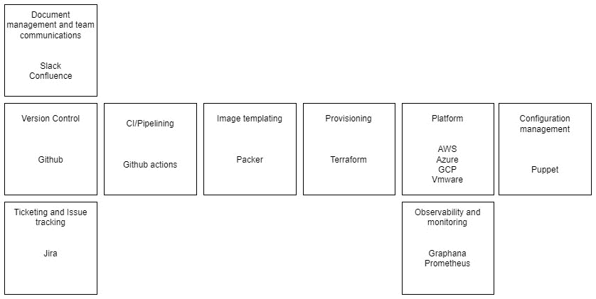
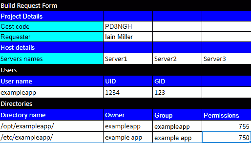
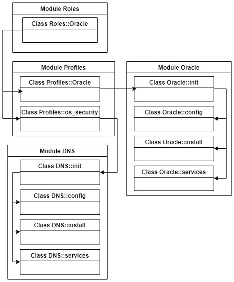
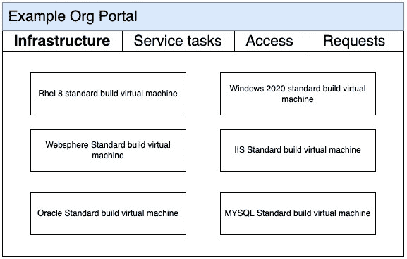
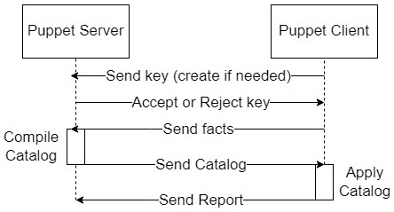
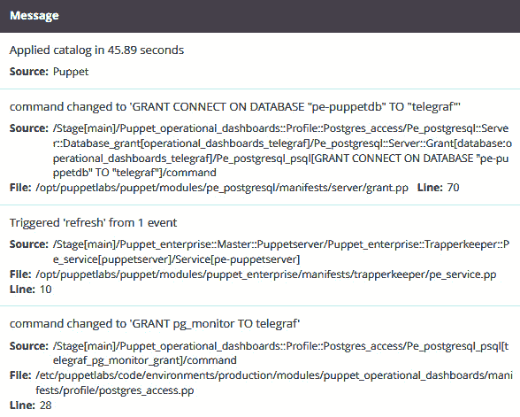
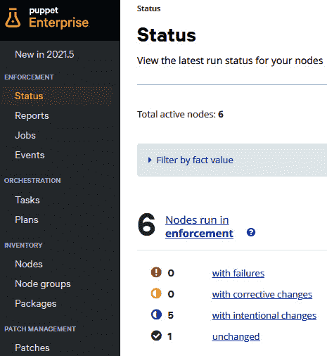

# 第一章：Puppet 的概念和实践

本章将重点介绍 Puppet 的起源，为什么它被创建，以及它如何在 DevOps 工程中使用。它将探讨 Puppet 的配置管理方法，以及其声明式方法与更常规的过程性语言有何不同。Puppet 拥有许多在其他语言中常见的特性，如变量、条件语句和函数。但在本章中，我们将介绍语言的关键术语、结构和思想，以及它与客户需求和基础设施环境的关系。最后，鉴于关于 Puppet 有很多先入为主的看法，本章将结束时解决一些最常见的误解，包括它们的来源，并将其解开。

这将确保在我们在接下来的章节中深入了解语言之前，能够对 Puppet 及其方法有一个基本的理解。它还将确保本书不仅仅关于技术，而是关于如何通过 Puppet 提供的服务为客户创造真正的价值。

在本章中，我们将涵盖以下主要内容：

+   Puppet 的历史和与 DevOps 的关系

+   Puppet 作为声明式和幂等的语言

+   Puppet 语言中的关键术语

+   Puppet 作为一个平台

+   常见误解

# Puppet 的历史和与 DevOps 的关系

Puppet 由创始人卢克·凯恩斯（Luke Kaines）创建，他曾是系统管理员和顾问。由于找不到自己想要使用且客户可以依赖的工具，他于 2005 年创建了 Puppet，作为一个基于 Ruby 的开源配置管理语言。这个开源项目的成功促使在 2011 年 2 月推出了商业版本 Puppet Enterprise。但随着需求的增加，Puppet 在作为公司和开源项目的改革和扩展中，卢克选择了退出，表示将 Puppet 发展到企业级规模的挑战是*远离我最喜欢做的事情，远离我的核心技能。我们需要扩展，并且需要* *执行*。

随后接任的领导层采取了一个方向，使公司发展了其专业服务，并在扩展产品范围时，更多地关注开发者工具和教育，同时在开源社区和企业客户需求之间寻求艰难的平衡。Puppet 于 2022 年 5 月 17 日被 Perforce Software 收购，成为继 Chef（2020 年）和 Ansible（2015 年）收购之后，最后一家独立的配置管理初创公司。卢克总结了行业发生的变化：*如今，DevOps 团队有所不同。公司正在寻找一个完整的解决方案，而不是想要集成单个* *最优质的供应商。*

这一历史见证了 Puppet 从一种让开发者决定如何使用它来解决问题的工具，发展到今天，成为一种具有模式和解决方案的工具，用户可以直接使用这些模式和解决方案来标准化他们的自动化和部署。这使得用户能够专注于他们的解决方案，而不是底层技术。

DevOps 本身在 IT 行业已成为一个令人沮丧的术语；正式来源给出的定义与公司实际使用它的方式有很大差异，且对其的引用往往被用作讽刺性的流行语或销售噱头。本书的重点是 DevOps 工程，尤其是在大公司中的应用，这些内容已经在如 Puppet 主办的*DevOps 状况报告*等研究中得到了深入的研究和讨论。DevOps 工程通常作为数字化转型、云优先迁移和其他各种现代化项目的一部分进行交付。在这些项目中，通常可以看到的目标是自动化自助部署、合规性并消除繁琐的操作。此方法遵循 DevOps 目标，即通过促进更好的沟通和建立共同目标来打破开发和运维团队之间的壁垒。值得注意的是，Luke 最初所工作的系统管理员角色，实际上已被 DevOps 工程师等新角色所取代。

Puppet 将作为 DevOps 工具链的一部分使用，*图 1.1* 展示了一组工具及其相对功能的示例。通常，Puppet 的作用开始于一个提供管道的末端，当基础设施在平台中搭建好并需要进行配置和执行时，Puppet 就会介入：



图 1.1 – DevOps 工具集

本书不仅专注于技术理解，还将着重于如何利用 Puppet 语言、工具和平台的成熟度以及带有明确观点的模式。这些方法是通过多年的客户合作以及 Puppet 和社区自身实现的经验发展而来，旨在帮助用户减少寻找合适方法的努力，专注于解决方案，并为客户带来即时的收益和回报。

# Puppet 作为一种声明式和幂等的语言

理解的第一件重要事情是了解 Puppet 与普通的脚本或编程语言有何不同。Puppet 是声明式的，这意味着你描述的是你希望系统达到的状态。例如，你可以描述系统应该有一个名为`username`的用户，UID 为`1234`，配置文件不应该存在，内核设置应该是某个特定的值。与大多数语言不同，Puppet 的方法不要求描述如何达到这个状态，而是更接近客户请求服务的方式。客户并不关心过程如何，只关心最终结果能满足他们的需求。这些资源定义可以保存在你的版本控制系统中。通常，这种方法被描述为**基础设施即代码**的一部分。

Puppet 是幂等的，这意味着它只会进行必要的更改，以使系统达到声明的状态。而大多数过程性语言每次运行时都会执行步骤，并通常需要添加诸如`if`语句等各种检查，以避免重复。这一特性非常强大，因为所谓的*强制执行*可以通过 Puppet 语言来实现，确保你声明的状态已经达成，并能够检测是否是你更新了目标机器的状态导致了变化，或者变化是机器本身的变化，偏离了期望的状态。这在审计中非常有帮助，可以避免配置漂移，确保变更是经过管理且有意为之。

Puppet 是操作系统无关的；它关注的是系统状态，而不是特定操作系统如何安装软件包或添加用户的实现方式。这为我们提供了一种通用语言，不依赖于任何底层实现，减少了代码的重复，避免了使用`case`/`if`语句来检测差异的需求，并允许多种语言实现，比如 Windows 的 PowerShell 和基于 Unix 的系统的 Bash。此外，它还使得在应用代码失败后更容易恢复。如果在过程性语言中某个步骤失败，根据检查步骤的编写方式，可能无法安全地重新运行整个脚本。而 Puppet 代码则能够仅执行必要的步骤，以便恢复到正确的状态。

一个简单的 Puppet 代码示例如下，用于创建一个用户：

```
user { 'david'
  uid => '123'
}
```

相比之下，一个 shell 脚本可能包含如下部分：

```
if ! getent passwd david; then
  useradd -u 123 david
elif ! $(uid david) == 123; then
  usermod -u 123 david
fi
```

在上面的 shell 示例中，我们需要检查一个用户是否存在，如果不存在，就创建一个。如果它存在，那么它的 UID 是否正确？如果不正确，我们将进行更改。这个脚本仅覆盖能够使用 `useradd` 和 `usermod` 的操作系统。为了实现跨多个操作系统的兼容性，我们需要检测操作系统类型并为每个操作系统或操作系统组及其所需的命令编写类似的代码段。通常，为了涵盖更广泛的操作系统版本，编写多种语言和脚本是更实用的做法，例如，如果我们想同时支持 Unix 和 Windows。

这与 Puppet 声明相对比，后者无需更改就可以在多个操作系统上工作，因为 Puppet 会检测所需的命令，并作为一部分执行所有必要的状态检查。

这个示例仅仅涉及一个具有单个属性的资源。你可以很快看到，随着检查项和选项的不断增加，shell 脚本示例将变得越来越复杂，并且难以扩展。

# Puppet 语言中的关键术语

详细查看 Puppet 语言，Puppet 中最基本的元素是**资源**。每个资源描述系统的某个部分以及你希望它处于的理想状态。每个资源都有一个**类型**，它是 Puppet 语言中该资源如何配置的定义，包括哪些**属性**可以设置，以及可以使用哪些**提供者**。属性描述的是状态。因此，对于一个用户来说，属性可能是家目录；对于文件而言，属性可能是权限。**提供者**使得 Puppet 跨操作系统独立工作，因为它们执行底层命令，无论是创建用户还是安装软件包。

所以，让我们以一个公司为例，该公司通常会向环境团队提交构建请求表单，要求配置服务器：



表格 1.1 – 构建请求表单示例

在*表格 1.1*中，请求表单里我们看到有用户、用户组和目录的分组，它们本质上都是**类型**。它们下面的每一项都是一个资源，而配置设置则是属性。

这个请求可以转化为如下内容：

```
user { 'exampleapp':
  uid => '1234'.
  gid => '123'
}
group { 'exampleapp':
  Gid => '123'
}
file { '/opt/exampleapp/':
  owner => 'exampleapp',
  group => 'exampleapp',
  mode  => 755
}
file { '/etc/exampleapp/':
  owner => 'exampleapp',
  group => 'exampleapp',
  mode  => 750
}
```

上面的示例展示了 Puppet 如何更加直接地转换为用户请求，并且即使不理解 Puppet 语言，也能保持可读性。

在这个示例中，未显示的是 `usermod` 提供者。如果我想使用 LDAP 命令创建用户，我将把我的 `provider` 属性设置为 LDAP。

下一个重要的注意事项是，由于 Puppet 是以有状态的方式编写的，我们并不是编写一个逐行执行的有序过程，而只是声明资源的状态，这些资源可以以任何顺序实现。因此，如果我们有任何依赖关系，就需要使用 `relationship` 参数；它描述了一个前后关系，正如字面意思，或者是一个订阅/刷新，例如，更新配置文件可能会导致服务重启。在之前的示例中，Puppet 会自动创建某些依赖关系，例如确保在用户之前创建组，因此我们不必添加 **relationship** 参数。通常，这些关系被视为适应 Puppet 时最难掌握的部分，因为许多程序员习惯于编写一个按顺序执行的过程，容易出错。这可能导致依赖关系的循环，其中一系列依赖关系循环往复，没有办法创建一个不依赖于其他资源的起始资源。

显然，我们声明的资源需要一个结构，第一步是将这些代码放入一个文件中。Puppet 将这些文件称为 `.pp` 文件。**类**是 Puppet 代码块，它为我们提供了一种特定的方式来调用在主机上运行的代码段。通常，作为一种最佳实践，我们在一个 **manifest** 文件中只包含一个 **类**。然后，Puppet 使用 **模块** 来将这些 **manifest** 和 **类** 进行分组。这个分组的原则是 **模块** 应该专注于做一件事并且做到极致，代表一个技术实现，例如，配置 IIS 应用程序的 **模块** 或者配置 postfix 作为邮件中继的 **模块**。**模块** 只是一个目录结构，用来存储 **manifest**、**类** 和其他 Puppet 项目（我们将在 *第八章* 中详细讲解），它本身并不是语言中的关键字。因此，理想情况下，模块应该是可共享和可重用的，供不同的用户和组织使用，很多模块直接来自 **Puppet Forge**，即 Puppet 的模块目录，里面既有商业产品也有开源产品。

一个常见的模块风格和实践是，包含一个具有单一类的 manifest 文件，示例如下：

+   `install.pp`（与安装软件相关的资源分组）

+   `config.pp`（与配置软件相关的资源分组）

+   `service.pp`（与运行服务相关的资源分组）

+   `init.pp`（初始化模块并接受参数）

在更高层次上，我们有**角色**和**配置文件**，它们用于创建您组织的结构。虽然**模块**应该是可共享和可重复的技术实现安装，例如 Oracle 或 IIS，**角色**和**配置文件**仅在您的组织内有意义。**角色**和**配置文件**是**类**，用于将**模块**和选定的参数组合成逻辑技术栈和客户解决方案。通常会创建一个**角色模块**和一个**配置文件模块**，同时保持使用的**类**在一起。

到目前为止，可能会让人困惑的是，您可能会有一个 Oracle **角色**、一个 Oracle **配置文件**和一个 Oracle **模块**。因此，虽然 Oracle 模块配置并安装 Oracle，并提供各种可用的参数以自定义安装，但 Oracle 配置文件是关于您的组织如何使用该模块，以及它可能会向该技术栈中添加其他模块。您可能会指定总是将 Oracle 与集群服务一起使用，因此您的 Oracle 配置文件包含 Oracle 模块和集群模块。或者，它可能会在配置文件中传递参数给 Oracle 模块，从而设置您组织配置的默认内核设置。

您可以将角色理解为客户在提交构建请求时实际需要的东西；他们需要特定类型的服务器，无论是 Oracle 服务器还是 IIS 服务器。他们不关心底层的实现——只关心它是否满足他们的需求。虽然 Oracle 角色肯定需要 Oracle 配置文件，但它期望满足操作系统安全标准，并且具备您组织定义的任何代理或其他支持工具。因此，对于许多组织来说，一个常见的配置文件是基本的操作系统安全标准，确保每台服务器都符合标准，这几乎是每个角色的一部分。

*图 1.2* 显示了刚刚描述的一个例子，即角色模块中的 Oracle 角色类，其中包括来自配置文件模块的 Oracle 配置文件类和操作系统安全配置文件类。然后，Oracle 配置文件包含一个 Oracle 模块，而`os_security`配置文件则包含 DNS 模块：



图 1.2 – 角色、配置文件和模块的结构

在*第八章*中，我们将深入探讨更多技术细节，但从本概述中最重要的要点是理解模块提供了可共享和可重用的一次性技术安装。相比之下，角色和配置文件模式为你的组织提供了背景。角色是客户在订购服务器服务时使用的；他们不需要理解技术实现，只需要知道它符合他们的业务需求。你组织技术栈中的配置文件由技术设计师和架构师管理，他们根据组织的标准和配置来组合和指定模块。这些角色负责定义不同组件如何集成，以创建所需的技术栈。因此，虽然一个 Oracle 模块本身可以配置和安装 Oracle，但正是配置文件定义了应该传递给 Oracle 模块的具体配置，以及它可能依赖的其他模块，例如安装 NetBackup 客户端。

通过我们在模块、角色和配置文件中所讨论的内容，回到*表 1.1*，我们可以让客户提交构建请求表单，但不需要指定他们所需要的所有内容；他们可以简单地订购一个`exampleapp`角色服务器。

到目前为止，我们看到的内容适用于服务器满足所有规格且是标准的情况，但例外情况是常见的。**Hiera**是 Puppet 的数据信息系统，它可以用于将参数传递给角色和配置文件模型，以处理例外情况。Hiera 顾名思义是分层的。它定义了一个有序的数据源列表，以访问找到最相关的设置。这些数据源通常从所有节点的默认值到更具体的组，例如某个特定角色和单个节点的特定值。

例如，如果默认操作系统安全配置文件禁用了电子邮件服务器，但`exampleapp`需要它，我们可以使用以下 YAML 文件：

exampleapp.yaml

```
profile::os_security:email_enabled: true
```

类似地，如果`server1`需要一个不同的 UID，我们可以使用以下 YAML 文件：

server1.yaml

```
profile::exampleapp:uid: '1235'
```

创建这些模式的最重要的一个点是避免在模块中使用硬编码的值。通过使用 Hiera，你为自己提供了一种动态方式，可以在未来更改值，而无需修改代码。这可以演变为通过自助服务门户访问数据——从通过电子表格、电子邮件和讨论来订购构建的方式自动化出来，而这些构建必须由构建团队配置，而不是像 VMware vRealize Automation 或 ServiceNow 这样的门户：



图 1.3 – 示例门户

在*图 1.3*中，示例门户展示了如何向客户展示简化的产品。Puppet 语言的重点应当是为客户提供一致的产品，并让客户、架构师和技术人员专注于他们关心的内容，而无需自己深入技术要求或编码部分。

# Puppet 作为平台

到目前为止，本章重点讨论了 Puppet 语言，但现在我们将探讨 Puppet 平台以及它如何将期望的状态应用于客户端服务器。Puppet 可以仅通过安装代理和所有文件本地运行，这在测试中很常见，但本概述将重点介绍客户端-服务器设置。在*第 10、13 和 14 章*中，我们将详细讨论弹性、可扩展性和更高级的运行选项。然而，目前我们将重点关注 Puppet 客户端如何与服务器通信，以请求并应用其期望的状态。

Puppet 控制下的每个客户端都会安装 Puppet 代理。*图 1.4* 显示了 Puppet 代理运行的步骤，本节将概述这些步骤：



图 1.4 – Puppet 代理运行生命周期

第一步是代理通过 SSL 密钥向主服务器标识自己，或者为主服务器创建新的 SSL 密钥进行签名。这将确保服务器与客户端之间的通信安全。

下一步是客户端使用一个名为`Facter`的 Ruby 库。这是一个系统分析器，用于收集系统的**事实**。这些事实可以是操作系统版本或内存大小等内容。这些事实可以在代码中使用，或通过 Hiera 来决定主机应处于什么状态，例如 Windows Server 2022 可能需要特定的注册表设置。

然后，服务器识别应该应用于服务器的类。通常，这由所谓的**端节点分类器**（**ENC**）脚本完成，该脚本基于事实和用户定义。通常，这会将一个角色类应用于服务器，正如我们在前一部分中讨论的那样，角色类会构建出配置文件和模块类的定义。

然后，主服务器会编译目录和要应用于节点的资源 YAML 文件（确保 CPU 密集型的工作发生在服务器上，而不是客户端）。

该目录随后被发送给客户端，客户端将该目录作为应有状态的蓝图，并进行任何必要的更改以在客户端上强制执行该状态。

最后，一份报告会被发送回主服务器，确认应用了哪些资源，以及这些资源是否因为 Puppet 代码的更改而需要进行调整，或者它们是否在 Puppet 控制之外被更改（可能是审计或安全漏洞）。

在*图 1.5*中，我们看到一个 Puppet 报告的示例，展示了资源的名称、所做的更改类型以及所需更改的值。此外，报告还包括未更改资源的记录，突出显示了 Puppet 强制执行的部分：



图 1.5 – Puppet 控制台服务器报告

默认情况下，这个周期每 30 分钟进行一次。在前面的部分中，重点讨论了语言如何自动化构建服务器。在这里，我们可以看到，通过该平台，我们可以确保所有部署的服务器都被强制执行我们设定的状态；无论是安全标准配置文件，还是我们决定更新某个实现中的设置，比如向 IIS 添加额外功能。这可以避免服务器漂移，即当服务器难以保持更新或容易受到手动错误更改或恶意违反标准的影响时。*图 1.6*显示了 Puppet Enterprise 的仪表板视图，清晰展示了一个服务器群体及其上次运行的状态。这突出显示了服务器是否符合我们的状态要求，或是否在上次运行时做出了更改：



图 1.6 – Puppet 控制台状态仪表板

到目前为止我们回顾的内容假设了一个共同的代码库，当任何代码更改发生时，所有客户端将在下一个 30 分钟内强制执行新的状态，因为代理会联系主服务器。这显然是个问题，因为漏洞将在短时间内影响所有服务器。这就是为什么 Puppet 使用`git`，其中版本可以声明为提交、标签或分支，我们可以在一个名为**Puppetfile**的文件中列出这些内容。

一个示例模块声明看起来像这样：

```
mod 'apache',
  :git => 'https://github.com/exampleorg/exampleapp'
  :tag => '1.2'
```

通过在所谓的**控制**仓库中维护这个`git`，可以通过拥有不同版本的 Puppet 文件的不同分支，来表示多个环境。

一种常见做法是根据您的组织如何分类服务器使用情况来匹配环境。通常，这意味着至少有一个开发环境和一个生产环境。因此，可以在开发服务器上测试更改，经过成功测试的更改可以部署到生产环境中。这个过程可以通过使用金丝雀环境（canary environments）来进一步测试服务器的小子集。这种方法可以根据不同组织的变化和风险设置进行定制。

我们提到的所有事实和报告，作为代理周期的一部分，都存储在`PuppetDB`中，这是一个基于 PostgreSQL 的前端数据库，专门用于管理 Puppet 数据，如报告和事实。它与`CMDB`风格的数据一起使用，可以检查某个角色的特定资源是否发生了变化，从而可能表明发生了变更违规。

因此，在这一部分中，我们已经看到 Puppet 平台提供了一种基于环境逐步部署新代码的方式。它存储有关客户端的事实以及每次运行生成的报告，提供了强大的 CMDB 视图，并在报告中提供了审核和合规性信息，我们可以确认服务器处于何种状态。这些信息都可以通过 PQL 进行搜索。这可以大大减少在审核和合规报告生成中的操作负担，并有助于避免随着标准和配置的变化而积累技术债务。

# 常见误解

*难道* *Puppet 已经过时了吗？*

尖端技术的焦点已经转向无服务器和其他**软件即服务**（**SaaS**）/容器化的解决方案，而在**基础设施即服务**（**IaaS**）层面，Puppet 的发展已达到更高的成熟度。十年前，你可能会买这本书，认为无论是否打算使用 Puppet，它都是相关的。今天，你有一个 Puppet 解决方案需要实施或理解。

*我需要了解 Ruby 才能* *使用 Puppet*。

对于某些 Puppet 代码领域，具备 Ruby 的基础知识会有所帮助。本书将重点讲解如何良好地使用 Puppet 语言以快速获得回报，现实情况是，大多数 Puppet 专业人员并不会花太多时间在 Ruby 上进行自定义开发。即使是为 Puppet 公司工作的专家，也发现有时需要写自定义 Ruby 代码之前，可能需要等上一段时间。

*Puppet 不能与我们的* *变更管理* *协作*。

一个重要的担忧是 Puppet 在治理和变更管理范围之外进行修改的想法。这通常反映了假设和与变更管理团队缺乏沟通的情况。Puppet 会强制执行你描述的状态；因此，只有在代码中描述的状态发生变化或在 Puppet 控制之外被修改时，才会发生变化。如前所述，只要达成一致，Puppet 就是定义特定资源的方式，任何对状态的更改都应该视为治理范围外的内容，因此应该恢复到原状态。后续章节将讨论如何发布代码和环境，确保 Puppet 保持适当的访问控制，从而确保其处于治理范围内。

*我不能进行手动修改* *或例外处理*。

如果用户试图绕过 Puppet，这种情况肯定会发生。为避免这种情况，明确 Puppet 的责任范围、其他工具或手动流程的责任范围以及如何在系统中请求和批准例外是非常重要的。正如*第八章*和*第九章*中所讨论的，通过在模块和 Hiera 中使用参数来处理例外，可以采用一种受控的方法处理例外，并且能够在代码中保留记录。

*我需要 Puppet Enterprise 才能使用附加组件* *和集成*。

存在大量的混淆，尤其是行业分析师，他们对用户在使用 Puppet Enterprise 时所获得的内容以及开源可能带来的限制进行比较。本书将在*第十四章*中深入探讨这一点，但 Puppet Enterprise 的根本区别在于，你为支持、服务、预先制作的模块、基础设施和解决方案付费。如果你具备技能、开发人员和时间，所有这些功能都可以在开源中复现。最终，Enterprise 运行在开源组件上。

*每个人都需要* *学习 Puppet*。

本书的一个主要焦点是构建代码结构的重要性，以支持自服务流程。这可以避免用户在希望进行小的例外或集成时，必须像 Puppet 开发者一样学习所有内容，而只需理解你的提供内容。

*它将与* *其他系统* *发生冲突*。

关键是要理解 Puppet 将负责什么，其他系统将负责什么，并清楚地记录下来。许多环境将运行多个配置管理、编排和软件管理工具。重要的是要利用它们的优势，并确保有明确的边界。

# 总结

本章介绍了 Puppet 是如何由 Luke Kaines 作为一种有状态语言创建的，旨在简化服务器配置管理的自动化。我们了解了使用这种有状态方法如何提供一种更自然的语言来描述用户在配置管理中的需求，并减少传统过程化方法中所涉及的复杂性。

我们概述了核心语言术语和组件，并了解它们如何通过角色、配置文件和模块来组织。这种结构提供了一种自然的方式来创建客户化的产品、技术栈和可重用的技术模块。

我们看了语言中描述的状态如何通过 Puppet 运行应用到主机上，并从这些运行中，检查了如何收集和存储有价值的审计和合规性信息到`PuppetDB`中。我们讨论了如何在环境中管理代码，以便在适合组织的风险承受能力和开发结构的服务器逻辑组中，以受控的方式逐步发布状态变更。

本章讨论了关于 Puppet 的一些误解，并涵盖了相关性、复杂性和灵活性等主要主题。Puppet 的成熟度和对 IaaS 的专注使其看起来不那么时髦，但通过使用 Puppet 和社区开发的模式和模块，你可以充分发挥 Puppet 的优势，为客户提供自动化、自服务配置和合规性。确保明确的边界和责任，确保 Puppet 能够与其他工具和团队集成并协同工作，避免冲突，并允许其他人与 Puppet 互动，获得其带来的好处。

在下一章中，我们将回顾自版本 5 以来，Puppet 发生的主要变化，以及最新版本 7 的变化。将提供推荐的工具，以帮助创建一个有效的开发环境，并将概述和演示实验室环境的创建。此外，还将列出额外的参考网站，供读者继续研究，并跟进 Puppet 的最新发展。这将确保在接下来的章节中，我们开始讲解技术细节时，你能够在自己的环境中进行测试和实验，并深入跟进你感兴趣的内容。
