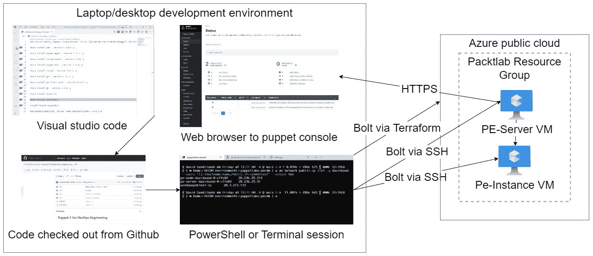

# 重大变化、有用工具与参考资料

本章将概述自 Puppet 5 以来到当前版本 Puppet 6.28 和 7.21 之间的主要变化。这被视为 Puppet 的现代时代，上一章回顾了 Puppet 历史中的焦点变化。本节中的变化总结还将涵盖一些早期版本 Puppet 中可能仍然可见的冗余模式和方法，因为它们在代码和各种来源中仍然可见。接着，本章将讨论工具链的建设，以创建一个高效的开发者环境，这个环境将贯穿整本书的实验室部分。目标是给出一种有见地的观点，如何开发 Puppet 代码和相应工具，以便辅助开发。用户可以在自己选择的环境中安装这些工具。实验环境将通过搭建一个简单的设置并登录来展示。最后，本章将展示如何利用现有资源保持 Puppet 更新，并深入研究感兴趣的其他主题。

在本章中，我们将涵盖以下主要主题：

+   自 Puppet 5 以来的重大变化

+   Puppet 5 之前的遗留模式

+   用于 Puppet 开发的 IDE 和工具

+   如何部署你的 Puppet 实验室和开发工具

+   参考资料与进一步研究

# 技术要求

开发环境需要具备访问互联网的操作系统，以下系统均可：

+   使用 Homebrew 在 macOS 上安装软件

+   使用 Chocolatey 在 Windows 10/11 或 Windows Server 上安装软件

+   使用包管理工具的 Linux 环境，如 Ubuntu 的 apt 或基于 RHEL 的使用 Yum

开发环境所需的软件：

+   Puppet agent ([`www.puppet.com/docs/puppet/8/install_agents.html`](https://www.puppet.com/docs/puppet/8/install_agents.html))

+   Bolt ([`puppet.com/docs/bolt/latest/bolt.html`](https://puppet.com/docs/bolt/latest/bolt.html))

+   Visual Studio Code ([`code.visualstudio.com/`](https://code.visualstudio.com/)) 和以下扩展：

    +   Visual Studio Code 的 JSON 支持

    +   Puppet

    +   Rest client

    +   Ruby

    +   ShellCheck

    +   Thunder client

    +   VSCode Ruby

    +   YAML

    +   PowerShell

    +   Puppet 模块 PECDM ([`github.com/puppetlabs/puppetlabs-pecdm`](https://github.com/puppetlabs/puppetlabs-pecdm))

+   GitHub CLI ([`github.com/cli/cli`](https://github.com/cli/cli))

+   Puppet 开发工具包 ([`puppet.com/try-puppet/puppet-development-kit/`](https://puppet.com/try-puppet/puppet-development-kit/))

+   Azure CLI ([`docs.microsoft.com/en-us/cli/azure/install-azure-cli`](https://docs.microsoft.com/en-us/cli/azure/install-azure-cli))

+   一个 Azure 账户

+   一个 GitHub 账户（免费账户）

+   用于与 GitHub 通信的 SSH 密钥

PECDM 模块 ([`github.com/puppetlabs/puppetlabs-pecdm`](https://github.com/puppetlabs/puppetlabs-pecdm)) 将通过 `bolt` 命令创建指定的资源。应通过 Azure 成本分析工具仔细监控在 Azure 上运行实验室的费用，以避免意外账单。未使用的实验室应被销毁或至少释放，以减少费用。

所有这些组件都有你可能在自己组织中使用的等效项。然而，本开发和实验室设置的目的是尽可能简单和自动化的设置。随着书籍的进展，这可能是你想要做的一个练习，用来测试你自己的组件。PECDM 本身支持 AWS、Azure 和 GCP，并提供关于配置必要 CLI 的模块说明。

该部分的代码可以在 [`github.com/PacktPublishing/Puppet-8-for-DevOps-Engineers/tree/main/ch02`](https://github.com/PacktPublishing/Puppet-8-for-DevOps-Engineers/tree/main/ch02) 找到。

# 自 Puppet 5 以来的重大变化

Puppet 5 反映了 Puppet 作为一个组织方向的变化，这一点在前一章中有所强调。它的重点是基础设施的性能和扩展性以及语言的稳定性。本节将涵盖 Puppet 5 和 7 之间的变化；这些版本反映了你在工作中可能遇到的代码库和从 Puppet forge 获取的模块中使用的 Puppet 版本。它还将涵盖一些旧的模式和你在代码中可能遇到的问题，这些问题反映了 Puppet 在版本 5 之前的状态。

## Puppet 5

Puppet 4 有大量被弃用的特性，这些特性几乎在 Puppet 5 中全部被移除。虽然不值得列出所有这些特性，但为了设定发布的背景，Puppet 5 更多的是通过引入新特性来完成 Puppet 4 中已开始的工作。它统一了包的编号，所有 Puppet 包的版本都从 5.0.0 开始，而不是之前不同版本包之间的不匹配，比如 Puppet 4 需要 Puppet Server 2.x 和 Puppet agent 1.x。

Puppet 5 作为服务器平台在性能上有了大幅提升：代理运行时间减少了 30%，CPU 利用率至少降低了 20%，Puppet Server 报告的目录编译时间减少了 7 到 10%，而且 Puppet 5 能够扩展至更多的代理，最多可扩展 40%。引入了 Puppet Server 指标，以便更好地观察 Puppet 平台。除了更高的性能和可扩展性之外，Puppet Enterprise 2017.4 及之后的版本还具备了灾难恢复能力以及软件包检查功能，无论 Puppet 是否管理这些软件，都会存储关于安装在整个环境中的软件的信息。Puppet Enterprise 功能的完整技术细节将在 *第十四章* 中讨论。

尽管**Puppet 开发工具包**（**PDK**）与 Puppet 5 并无直接关联，但它在同一时间发布，自动化了许多工具的安装、测试、代码检查和模块目录的创建（这一部分将在*第八章*中详细讲解）。以前，这些工作需要手动完成或由单个开发者的自动化脚本来完成。此外，Hiera 5 与 EYAML（在*第九章*中介绍的加密数据机制）集成，这大大简化了数据的加密处理，并且仍然能够被使用。

## Puppet 6

Puppet 6 带来了显著的变化，许多原本包含在 Puppet 核心安装中的类型被移除，并放入模块中，用户可以选择从 Puppet Forge 下载这些模块。这样做是为了缩小安装范围，因为核心类型的数量随着时间的推移不断增加，而让用户选择他们需要的类型更加高效。对于哪些功能被持续使用进行了评估，许多字符串和数学函数从`stdlib`模块移到了 Puppet 核心模块，以反映它们的核心用途。同时，引入了受信外部命令功能，这使得可以像查询事实一样查询外部数据源，从而可以调用并引入卫星服务器或数据库服务器的 API 供 Puppet 代码使用。这将在*第十三章*中详细讲解。此外，引入了延迟数据类型，使得变量能够在部署时本地执行延迟函数。这对于像秘密管理这样的用例尤为有用，例如一个金库，其中传统函数会从 Puppet 主服务器发起调用，并通过 Puppet 基础设施将秘密发送给代理。6.24 版本中引入了参数化`exec`，这使得在使用`exec`资源类型时，可以将命令与参数分开——这是一种强大的安全措施，防止命令被传递而不是参数。

在平台方面，Puppet 证书命令从`puppet cert`命令更改为`puppet server ca`命令，这些命令更加完整且功能更强大。此外，PuppetDB 被包含在 Puppet 编译服务器上，以更好地管理 PuppetDB 的请求负载。平台的详细内容将在*第十章*中详细讨论。

## Puppet 7

Puppet 7 中的一个显著变化是删除了有害的术语，这是 2014 年开始进行审查和改进的结果。这一变化的焦点是“主从”和“黑名单/白名单”这样的短语。对于 Puppet 来说，这意味着主服务器变成了主控服务器，主服务变成了服务器服务，而在模块中，主分支变成了主分支。它还意味着“黑名单/白名单”术语被“允许列表/阻止列表”替代。

在 Puppet 6 更新中提到的参数化执行命令可在 7.9 版的 Puppet 语言中使用。Factor 被升级到版本 4，这是用 Ruby 重写的，提供了诸如基准测试、超时和用户缓存等功能，这些将在*第五章*中讨论。自 7.21 版起，`include_legacy_facts`选项被加入，用于排除旧版事实。

该平台升级到了 Postgres 11 和 Ruby 2.7，进一步提升了性能。

报告机制还可以通过`exclude_unchanged_resources`选项选择不将未更改的资源包含在报告中。

再次强调，虽然 PDK 2.0 并不直接与 Puppet 发布相关，但它是在 Puppet 7 发布时推出的，并且不再支持 Puppet 4。

# 旧版 Puppet 模式

本节将重点介绍一些旧的模式及其在旧版本 Puppet 中使用的原因。这将帮助你理解在较旧的、不再维护的模块中，或者是没有经过重构的代码中，常见的代码。Puppet 4 引入了数据类型，但在此之前，所有变量都是字符串，许多比较和其他函数的结果可能非常奇怪且不一致。要理解这一点的全面性，可以观看[www.youtube.com/watch?v=aU7vjKYqMUo](https://www.youtube.com/watch?v=aU7vjKYqMUo)。因此，在历史代码中，你可能会看到对变量的奇怪处理和未定义变量的检查。最初，**facter**事实也只是称为**顶级变量**，这可能会与普通变量混淆，并且容易发生意外覆盖。后来改为**事实哈希**，我们将在*第五章*中详细介绍。

平台基础设施变得更加复杂，并且可以选择使用 Rack 或 WEBrick 配置。在非常早期的 Puppet 代码版本中，`file_line`功能尚未引入，且 Puppet 的`stdlib`模块也没有提供管理单行文件的功能。这导致了 Augeas（一个可以解析文件并允许操作的工具）和模板（允许通过条件逻辑和变量创建文件）被过度使用。Augeas 功能非常强大，但往往过于复杂且对性能产生负担，而模板的过度使用导致了整个文件被强制执行，而不仅仅是需要的单个行或设置。因此，在处理早期版本的 Puppet 代码时，值得回顾代码，确保你继承的代码真的需要控制整个文件，并且在现有更简单的解决方案下，避免过度使用 Augeas。`params.pp`模式在 Hiera 提供类参数覆盖功能之前，在模块中被广泛使用。直到 4.6 版本，才引入了敏感数据类型，这使得在代码中安全处理任何机密数据变得困难。最后，原始的 Puppet 版本没有提供循环的概念，直到 Puppet 4 引入了 lambda 函数。所以，你可能会在旧代码示例中发现一些晦涩的模式，用来实现类似的效果。

# 用于辅助 Puppet 开发的 IDE 和工具

早期 Puppet 开发中最大的一个问题是缺乏关于如何开发的共识，并且缺乏集成。如在*第一章*中讨论的那样，这一局面在 Puppet 5 发布时发生了巨大变化。本节突出了一些工具，作为基于 Puppet 使用和经验的意见性推荐，且它们大多数将在实验和演示中使用。当然，这并不是开发 Puppet 代码的唯一方法，你的组织可能会根据环境要求使用不同的工具。

`pdk`命令。此前，Puppet 开发人员需要收集工具，安装依赖项，然后运行`pdk`所包含的各种命令。

Visual Studio Code 已经成为一个非常强大且流行的源代码编辑器。它是免费的、跨平台的，并且拥有丰富的扩展库，包括 Puppet 扩展（[`marketplace.visualstudio.com/items?itemName=puppet.puppet-vscode`](https://marketplace.visualstudio.com/items?itemName=puppet.puppet-vscode)）。它创建了强大的快捷方式，允许你在 IDE 中完成所有工作，整个过程中将在本书中进行演示。

我不会直接在实验中使用它，但因为许多人更喜欢命令行编辑器而不是 Visual Studio Code，所以值得注意的是，有一些 Vim 模块（[`github.com/rodjek/vim-puppet`](https://github.com/rodjek/vim-puppet)）可以在 VIM 中提供语法检查和 linting 功能。

一个特别有用的开发网页是[`validate.puppet.com/`](https://validate.puppet.com/)网站，可以快速粘贴 Puppet 代码进行验证和解析，并创建关系图。

更高级的工具是 Puppet 调试器([`github.com/nwops/puppet-debugger`](https://github.com/nwops/puppet-debugger))，它允许运行 Puppet 代码并在代码中设置断点，从而查看变量的状态。随着更复杂代码的编写，这将变得非常有用。

# 如何部署你的 Puppet 实验室和开发工具

本节将演示如何安装和配置桌面环境，然后使用该环境在 Azure 中搭建 Puppet 基础设施，用控制库配置它，将一些模块部署到环境中，并测试登录网页控制台。这将确认实验室环境按预期工作，并且应该让你有信心根据需要启动和关闭实验室，避免在 Azure 上为不必要的虚拟机运行时间支付费用。

在*图 2.1*中，展示了本练习的最终结果。你用作开发环境的设备将安装 Visual Studio Code，用于编辑从 GitHub 克隆的代码。根据操作系统的不同，PowerShell 或 Shell 会话将使用 Bolt 与 Terraform 在 Azure 上构建基础设施，并将配置应用于该基础设施，配置一个 Puppet Enterprise 服务器及附加到该服务器的实例。Puppet Enterprise 服务器的网页控制台将可以通过 HTTPS 在浏览器中访问：



图 2.1 – 实验室设置

## Mac 桌面

Mac 安装将依赖 Homebrew 自动化安装过程，Puppet 为此创建了自己的仓库([`github.com/puppetlabs/homebrew-puppet`](https://github.com/puppetlabs/homebrew-puppet))。运行以下命令安装*技术* *要求*部分中提到的桌面工具：

```
/bin/bash -c "$(curl -fsSL https://raw.githubusercontent.com/Homebrew/install/HEAD/install.sh)"
brew update
brew install azure-cli
brew install --cask puppetlabs/puppet/puppet-agent
brew install --cask puppetlabs/puppet/pdk
brew install --cask puppetlabs/puppet/puppet-bolt
brew install --cask visual-studio-code
brew install gh
brew install shellcheck
brew install puppetlabs/puppet/pe-client-tools
brew install git
```

## Windows 桌面

Windows 安装依赖 Chocolatey 进行安装。在 PowerShell 会话中运行以下代码；注意，只有第一个命令需要管理员权限：

```
Set-ExecutionPolicy Bypass -Scope Process -Force; [System.Net.ServicePointManager]::SecurityProtocol = [System.Net.ServicePointManager]::SecurityProtocol -bor 3072; iex ((New-Object System.Net.WebClient).DownloadString('https://community.chocolatey.org/install.ps1'))
choco install pdk -y
choco install puppet-agent -y
choco install vscode-puppet-y
choco install puppet-bolt -y
choco install vscode -y
choco install git -y
choco install pe-client-tools -y
choco install gh -y
choco install azure-cli -y
choco install shellcheck -y
Install-Module PuppetBolt
Add-WindowsCapability -Online -Name OpenSSH.Client~~~~0.0.1.0
```

## Linux 桌面 – 基于 RPM

这个基于 RPM 的 Linux 桌面安装已在 Rocky Linux 8 上测试过。因此，根据你的操作系统版本和不同的发行版，可能需要进行一些本地化调整。然而，运行以下代码将从供应商那里添加必要的 Yum 仓库并安装相应的包：

```
release=$(rpm -E '%{?rhel}')
sudo rpm --import https://packages.microsoft.com/keys/microsoft.asc
sudo sh -c 'echo -e "[code]\nname=Visual Studio Code\nbaseurl=https://packages.microsoft.com/yumrepos/vscode\nenabled=1\ngpgcheck=1\ngpgkey=https://packages.microsoft.com/keys/microsoft.asc" > /etc/yum.repos.d/vscode.repo'
sudo rpm -Uvh https://yum.puppet.com/puppet7-release-el-${release}.noarch.rpm
sudo rpm --import https://packages.microsoft.com/keys/microsoft.asc
echo -e "[azure-cli]
name=Azure CLI
baseurl=https://packages.microsoft.com/yumrepos/azure-cli
enabled=1
gpgcheck=1
gpgkey=https://packages.microsoft.com/keys/microsoft.asc" | sudo tee /etc/yum.repos.d/azure-cli.repo
sudo dnf config-manager --add-repo https://cli.github.com/packages/rpm/gh-cli.repo
sudo rpm -Uvh https://yum.puppet.com/puppet-tools-release-el-8.noarch.rpm
sudo yum -y install epel-release
sudo yum check-update
sudo dnf install gh
sudo yum install code
sudo dnf install azure-cli
sudo yum install ShellCheck
sudo yum install puppet-bolt
sudo yum install https://pm.puppetlabs.com/pe-client-tools/2021.7.0/21.7.0/repos/el/8/PC1/x86_64/pe-client-tools-21.7.0-1.el8.x86_64.rpm
```

客户端工具有特定版本，应该根据你的安装版本进行调整。请访问[`puppet.com/try-puppet/puppet-enterprise-client-tools/`](https://puppet.com/try-puppet/puppet-enterprise-client-tools/)查找`curl`命令。

## Linux 桌面 – 基于 APT

基于 APT 的 Linux 桌面在 Ubuntu 20.04 上进行了测试，因此需要根据您的特定操作系统版本和不同的发行版本进行一些本地化调整。不过，运行以下代码应该可以添加所需的 APT 仓库并安装所需的桌面开发软件：

```
release=$(lsb_release -c | awk '{print $2}')
wget -qO- https://packages.microsoft.com/keys/microsoft.asc | gpg --dearmor > packages.microsoft.gpg
sudo install -o root -g root -m 644 packages.microsoft.gpg /etc/apt/trusted.gpg.d/
sudo sh -c 'echo "deb [arch=amd64,arm64,armhf signed-by=/etc/apt/trusted.gpg.d/packages.microsoft.gpg] https://packages.microsoft.com/repos/code stable main" > /etc/apt/sources.list.d/vscode.list'
wget https://apt.puppet.com/puppet7-release-${release}.deb
wget https://apt.puppet.com/puppet-tools-release-${release}.deb
curl -fsSL https://cli.github.com/packages/githubcli-archive-keyring.gpg | sudo dd of=/usr/share/keyrings/githubcli-archive-keyring.gpg
echo "deb [arch=$(dpkg --print-architecture) signed-by=/usr/share/keyrings/githubcli-archive-keyring.gpg] https://cli.github.com/packages stable main" | sudo tee /etc/apt/sources.list.d/github-cli.list > /dev/null
sudo apt-get update
sudo dpkg -i puppet7-release-${release}.deb
sudo dpkg -i puppet-tools-release-${release}.deb
rm packages.microsoft.gpg
rm puppet7-release-${release}.deb
rm puppet-tools-release-${release}.deb
sudo apt install apt-transport-https
sudo apt update
sudo apt install code
sudo apt –y install puppet-agent
sudo apt-get install git
sudo dpkg -i puppet-tools-release-${release}.deb
sudo apt-get install puppet-bolt
sudo apt install gh
curl -sL https://aka.ms/InstallAzureCLIDeb | sudo bash
sudo apt install shellcheck
curl -JLO ' https://pm.puppetlabs.com/pe-client-tools/2021.7.0/21.7.0/repos/deb/focal/PC1/pe-client-tools_21.7.0-1focal_amd64.deb'
sudo apt install ./pe-client-tools_21.7.0-1focal_amd64.deb
```

客户端工具是特定版本的，应根据您的安装进行调整。请访问[`puppet.com/try-puppet/puppet-enterprise-client-tools/`](https://puppet.com/try-puppet/puppet-enterprise-client-tools/) 查找`curl`命令。

## 配置工具

现在，您已经在所使用的桌面环境中安装了核心工具，运行和管理应用程序的核心步骤是相同的。

首先，我们需要在 GitHub 上注册账号([`github.com/join`](https://github.com/join))并在 Azure 上注册([`azure.microsoft.com/en-gb/free/`](https://azure.microsoft.com/en-gb/free/))。完成这些注册后，登录到两个 CLI 工具中。运行以下命令并登录将出现的网页：

```
gh auth login
az login
```

下一步是生成允许与 GitHub 通信的密钥。您可以通过运行以下命令来完成：

```
ssh-keygen -t rsa –b 4096 -P ''
```

然后，我们通过 GitHub CLI 上传我们创建的密钥。对于 Mac 或 Linux，请运行以下命令：

```
gh ssh-key add ~/.ssh/id_rsa.pub
```

对于 Windows 中 SSH 密钥的相应位置，请运行以下命令：

```
gh ssh-key add %USERPROFILE%\.ssh\id_rsa.pub
```

然后，您可以通过从 Packt 的 GitHub 仓库下载`extensions.list`文件，地址为[`github.com/PacktPublishing/Puppet-8-for-DevOps-Engineers/blob/main/ch02/extensions.list`](https://github.com/PacktPublishing/Puppet-8-for-DevOps-Engineers/blob/main/ch02/extensions.list)，并通过循环读取每一行来安装 Visual Studio Code 的扩展。

对于 Mac 或 Linux，您可以通过运行以下命令来实现：

```
cat extensions.list | xargs -L1 code --install-extension
```

对于 Windows，您可以运行以下命令：

```
foreach($line in get-content extensions.list) {code --install-extension $($line)}
```

下一步是为您的代码工作区创建一个区域，然后将`pecdm`模块下载到该区域。对于 Linux 和 Mac，我们将在主目录中创建一个工作区，并通过运行以下命令将`pecdm`克隆到该目录中：

```
mkdir ~workspace/pecdm
git clone git@github.com:puppetlabs/puppetlabs-pecdm.git ~workspace/pecdm
cd ~workspace/pecdm
```

对于 Windows，我们假设用户目录中有相应的文件夹，首先在其中创建一个`workspace`目录，然后通过运行以下命令进行克隆：

```
mkdir %USERPROFILE%\workspace
git clone git@github.com:puppetlabs/puppetlabs-pecdm.git %USERPROFILE%\workspace\pecdm
cd %USERPROFILE%\workspace\pecdm
```

现在，我们已经完成了安装并且拥有了带有克隆模块的工作区，我们可以配置该模块并运行以下 Bolt 计划来在 Azure 中创建 Puppet 基础设施。这将启动一个 Puppet 2021.7.0 主服务器，并注册一个单独的客户端。SSH 用户允许你使用之前创建的 SSH 密钥连接到主机。对于这个示例，`params.json`文件应该从[`github.com/PacktPublishing/Puppet-8-for-DevOps-Engineers/blob/main/ch02/params.json`](https://github.com/PacktPublishing/Puppet-8-for-DevOps-Engineers/blob/main/ch02/params.json)下载到 pecdm 目录。我使用的是英国南部区域，并允许开放任何连接的防火墙，但你应该选择离你最近的云区域，并设置一个仅允许你的桌面环境和 Azure 区域访问的防火墙规则。以下链接可以帮助你做出选择：

+   [`azure.microsoft.com/en-gb/global-infrastructure/geographies/#geographies`](https://azure.microsoft.com/en-gb/global-infrastructure/geographies/#geographies)

+   [`www.azurespeed.com/Azure/Latency`](https://www.azurespeed.com/Azure/Latency)

代码如下：

```
bolt module install --no-resolve
bolt --verbose plan run pecdm::provision @params.json
```

完成此操作大约需要 20 到 30 分钟。

然后，你可以运行以下 Azure CLI 命令来返回主机名和公共 IP 地址列表：

```
az network public-ip list -g packtlab --query "[].{Hostname:name,Public_IP:ipAddress}" --output tsv
```

输出将类似于以下内容：

```
pe-node-packtlab-0-cffe02      20.108.156.266
pe-server-packlab-0-cffe02    20.108.156.67
```

将列出的以`pe-server`开头的 IP 地址复制到网页浏览器中，以访问 Puppet Enterprise 控制台页面。然后，你可以使用用户名`admin`和密码`puppetlabs`进行登录。

为了销毁这些基础设施并确保不会产生不必要的费用，可以运行以下命令：

```
bolt plan run pecdm::destroy provider=azure
```

另外，如果实验需要长时间保持，可以通过停止并取消分配每个虚拟机来最小化费用，然后稍后使用以下命令重新启动它们：

```
az vm deallocate --resource-group packtlab --name <VM name>
az vm start --resource-group packtlab --name <VM name>
```

本节已经完整介绍了开发者桌面的创建，以及启动和销毁 Puppet 基础设施的过程。这确保你为后续章节中的实验做好准备。在本实验中，`pecdm`和`peadm`模块用于配置标准架构，这是 Puppet 支持的架构之一：[`puppet.com/docs/pe/latest/supported_architectures.html`](https://puppet.com/docs/pe/latest/supported_architectures.html)。在*第十四章**中*，我们将更详细地讨论不同的架构选项。但目前，理解标准架构作为提供单个 Puppet 服务器的基础层级非常重要。在这个场景下，`pecdm`使用 Terraform 配置必要的基础设施，而`peadm`则安装 Puppet Enterprise 组件。这两个模块将作为使用 Bolt 项目、任务和计划的示例，并将在*第十二章**中*进行回顾。

# 参考资料和进一步研究

本节将介绍可与本书一起使用的进一步资源和参考资料。这些内容深入探讨了 Puppet，并使您能够从 Puppet 和社区两个方面学习 Puppet。

一般页面 ([`puppet.com/docs/`](https://puppet.com/docs/)) 是核心文档页面，您可以在此找到 Puppet 的所有产品以及模式和策略等部分。在我们通过本书时，我们将重点介绍文档中的不同部分。

Puppet 通过各种媒体形式发布文章，涵盖了新产品发布、安全更新和实施指南等内容。它们的社交媒体账号如下所示：

+   博客: [`puppet.com/blog`](https://puppet.com/blog)

+   播客: [`pulling-the-strings.simplecast.com/`](https://pulling-the-strings.simplecast.com/)

+   Dev.to 文章: [`dev.to/puppetecosystem`](https://dev.to/puppetecosystem) 和 [`dev.to/puppet`](https://dev.to/puppet)

+   Twitter: [`twitter.com/puppetize`](https://twitter.com/puppetize) 和 [`twitter.com/PuppetEcosystem`](https://twitter.com/PuppetEcosystem)

+   YouTube: [`www.youtube.com/channel/UCPfMWIY-qNbLhIrbZm2BFMQ`](https://www.youtube.com/channel/UCPfMWIY-qNbLhIrbZm2BFMQ)

Puppet 拥有自己的学习网站 ([`training.puppet.com/learn`](https://training.puppet.com/learn))，该网站包括多个元素，如 Puppet 实践实验室，这些在线实验室可以完全通过 Web 浏览器运行，以及任务箱，它们是关于完成小型专注任务的指南。Puppet 的支持知识库于 2022 年 4 月公开，允许任何人无需登录即可搜索并查看故障排除指南、最佳实践和常见问题解答，网址为 [`support.puppet.com`](https://support.puppet.com)。旧版本 Puppet 的档案文章可以在 [`github.com/puppetlabs/docs-archive/tree/main/supportkb#readme`](https://github.com/puppetlabs/docs-archive/tree/main/supportkb#readme) 找到。

Puppet 之前提供了两门由讲师主导的培训课程，这些课程需要付费并持续 3 天（*Puppet 入门* 和 *Puppet 实践者*）。在 2022 年，*基础核心培训* 模块取代了 *Puppet 入门*，而 *高级核心培训* 模块取代了 *Puppet 实践者*。

关键的区别在于 `基础核心培训` 模块是免费的注册课程，且两个培训集都被拆分成三个模块集，每个模块持续一天。更多详细信息请访问 Puppet Compass 网站。

*基础* *核心培训*：

+   PE101: 部署与发现

+   PE201: 设计与管理

+   PE301: 开发与维护

*高级* *核心培训*：

+   PE401: 扩展能力

+   PE501: 持续交付

+   PE601: 规模化自动化

提供商业许可 Puppet 模块的企业模块（Enterprise Modules）在 Puppet forge 上有一个博客，讨论各种 Puppet 话题，网址是 [`www.enterprisemodules.com/blog/`](https://www.enterprisemodules.com/blog/)，同时也有一个 Twitter 账户 [`twitter.com/enterprisemodul`](https://twitter.com/enterprisemodul)。

另两个著名的 Puppet 咨询和开发团队是在 Example42 GmbH 分拆后成立的，一个是 Example42，现在是 Lab42 的品牌，拥有一个博客 [`blog.example42.com/blog/`](https://blog.example42.com/blog/) 和一个 Twitter 账户 [`twitter.com/example42`](https://twitter.com/example42)；另一个是 Betabots，拥有一个博客 [`dev.to/betadots`](https://dev.to/betadots) 和一个 Twitter 账户 [`twitter.com/betadots`](https://twitter.com/betadots)。这两个团队都提供了关于他们在 Puppet 开发工作和方法的见解。

要提问关于 Puppet 或与社区中的人交流，可以加入 [`slack.puppet.com/`](https://slack.puppet.com/) 和 [`www.reddit.com/r/Puppet/`](https://www.reddit.com/r/Puppet/) 来提问有关 Puppet 的问题以及与社区互动。

本节并不打算列出所有参考资料，而是提供一些更为知名和持久的信息源和社区，供读者参考和关注，以便更好地了解 Puppet。

# 小结

本章中，我们讨论了从 Puppet 5 到 7 的现代版本变化，并介绍了一些反模式，警惕可能仍然存在于遗留 Puppet 代码中的问题。如果你不熟悉 Puppet，可能在完成本书后回到这一部分，重新阅读这些变化会更实际。

我们讨论了在开发环境中使用的工具和 IDE，来自动化和加速 Puppet 开发环境，并已安装这些工具来介绍实验室内容。我们学会了如何在 Azure 上搭建读者的开发环境和 Puppet 基础设施。

在本章结束时，我们覆盖了可以用来进一步学习 Puppet 的各种资源和社区，帮助读者跟上最新的发展动态，并指引如何提问和与社区讨论 Puppet。

在下一章中，我们将开始学习 Puppet 语言，涵盖资源、类型和提供者的基本构建模块。我们将了解 Puppet 编程的基本语法和风格，以及如何使用各种引用和命令来简化代码生成和查找文档的过程。我们将首先学习 Puppet 中的核心类型，了解如何高效使用它们。接下来，我们将介绍如何使用定义类型来实现资源的可重复模式，如何使用类来包含和引用目录中的资源，最后，介绍如何使用更高级的功能——导出和收集资源，以便在多个客户端之间共享资源声明。
