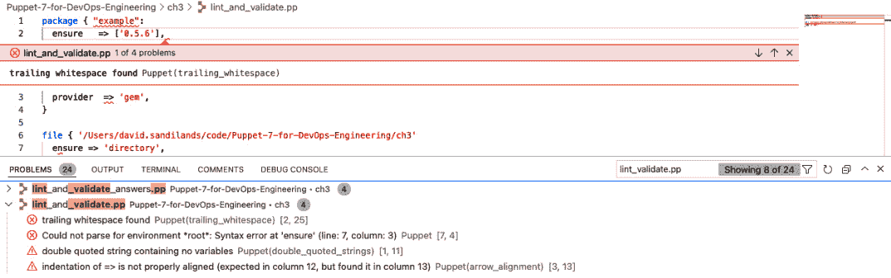

# Puppet 类、资源类型和提供者

本章将讨论类和定义类型如何提供结构，并为资源分组提供一种方式，使代码具备模块化和可重用性。你将学习资源的组成部分；类型、提供者以及应用于它们的属性。你将看到如何使用 Puppet 命令了解系统的当前状态，并通过查看三种最常见的资源类型——包、文件和服务，了解如何查找资源可用的属性以及如何声明状态。

使用这三种资源类型，你将看到如何通过 Puppet 代码快速启动一个应用程序，如 Apache 或 Grafana，这包括简单的包安装、配置文件和服务。接下来将讨论其他核心资源类型，并强调最佳实践和方法。还会讨论一些元参数（可以应用于任何资源的属性），以及资源声明的一些高级模式。

你将遇到一些反模式，虽然这些仍然是已记录的 Puppet 语言特性，但不推荐使用。了解这些有助于你理解可能遇到的遗留代码，并考虑需要重构的代码部分。

在本章中，我们将讨论以下主要内容：

+   类和定义类型

+   资源、类型和提供者

+   核心资源类型

+   元参数和高级功能

+   反模式

# 技术要求

通过下载 [`github.com/PacktPublishing/Puppet-8-for-DevOps-Engineers/tree/main/ch03`](https://github.com/PacktPublishing/Puppet-8-for-DevOps-Engineers/tree/main/ch03) 中的 `params.json` 文件，使用以下命令来配置一个标准大小的 Puppet 服务器，配有 Windows 客户端和 Linux 客户端：

```
bolt --verbose plan run pecdm::provision –params @params.json
```

# 类和定义类型

如在*第一章*中讨论的那样，Puppet 代码存储在以 `.pp` 结尾的清单文件中。可以将资源写入一个单独的清单文件，然后使用 `apply` 命令 `puppet apply example.pp` 在本地强制执行代码。也可以不使用清单文件，直接在命令行中使用 `execute` 标志执行 Puppet 代码，例如 `puppet apply -e 'Package { '``vscode': }'`。

注意

`puppet apply` 也可以针对一个清单目录运行，它会按照顺序解析每个文件，并遍历目录结构。在*第十一章*中，节点定义将帮助我们利用这一点。

尽管这两种方法对于测试和学习很有用，但它们在缺乏任何结构方面有明显的局限性，这将导致必须运行许多大型静态命令或文件，并且无法传递数据。**类**是命名的代码块，它们提供了这种结构，提供了一种将资源分组并分配数据的方式，我们可以将其应用到服务器上。类定义放入清单文件中，在类定义内部，我们放置我们的资源定义。语法如下：

+   `class` 关键字。

+   类的名称。

+   `( )` 中的可选参数。

+   带有 `{}` 的 Puppet 代码：

    ```
    class  example_class (
      String example_parameter
    )
    {
       <code block>
    }
    ```

`class` 参数允许为类提供外部数据。例如，一个类可能有一个安装包的资源，参数可以用来指定要安装的包的版本。

注意

可以向类中添加一个可选的 `inherit` 关键字，以允许类继承，通过这种方式，您可以创建一个通用的基类，然后在继承的类中扩展它。从 Puppet 6 开始，这种模式不再使用，并且在 Puppet 文档中也不再讨论，除了提到它作为一个关键字存在。通过数据，有更好的方法来实现这种行为，我们将在 *第九章* 中介绍。

早期对于类的常见困惑是，这个结构仅定义了一个类；它并没有声明该类会被包含在从 Puppet 代码编译的目录中。这与清单中的资源声明不同，后者通过编写并应用后，会被添加到目录中。

这意味着在包含类的清单上运行 `puppet apply` 什么也不会做。要将类添加到目录中，我们必须使用 `include` 函数声明该类，进行类资源声明，或者我们必须使用**外部节点分类器**（**ENC**）。ENC 将在 *第十一章* 中介绍，但现在可以理解为 Puppet 服务器脚本，用于标识要包含在节点中的类。

## 包含一个类

`include` 函数是通过在清单文件的类代码块中声明 `include class_name` 来添加类的最简单方法。它可以在多个类中多次使用，并且只会产生一个条目。要直接通过 `puppet apply` 声明一个类，我们可以运行 `puppet apply –e "include class_name"`，这将测试一个带有类的清单文件。遵循模块结构，这将应用来自 `class_name/manifest/init.pp` 路径的清单。

### 类资源声明

在下一节中，将更详细地介绍资源声明，但声明像资源一样的类使我们能够传递我们定义或查找的属性。它看起来是这样的，但只能在一个目录中使用一次：

```
Class {'class_name':
  paramter1 => 'value1'
}
```

## 定义类型

定义类型是一个 Puppet 代码块，与类不同，它可以在清单中多次声明，通过传递参数和唯一名称。像类一样，最佳实践是将其定义在单独的清单文件中。

语法如下：

+   以 `define` 关键字开头

+   类型名称

+   开括号（`(`）

+   参数列表

+   开括号（`{`）

+   资源体

+   闭括号（`}`）

除了定义的参数列表外，`$title` 和 `$name` 变量也可以在定义中使用。这确保了我们声明的资源是唯一的。一个非常简单的示例可能是通过名称和组来确保创建一个用户和一个组，并将文件放置在我们创建的用户和组拥有的`user`主目录中：

```
define exampledefine (
  String user = "${title}",
  String group
) {
user { ${user}: }
group { ${group}: }
file { '/export/home/${user}/.examplesetting':
  user => ${user},
  group => ${group},
  content => "User is ${user} and group is ${group}",
}
}
```

定义类型与类相同；应用清单文件不会产生任何效果。定义类型的资源声明必须在类中进行，然后可以包含在类中：

```
exampledefine {'user1':
  group => 'group1'
}
exampledefine {'user2':
  group => 'group2'
}
```

这个示例有一定的危险性，因为如果第二个 `user2` 的声明也使用了 `group1` 组，这将导致资源声明重复。

## 命名空间

命名空间是标识清单文件中类的目录和文件结构的片段。这些命名空间由两个冒号（`::`）分隔，例如，以下目录将转换如下：

| **文件** **路径名称** | **命名空间** |
| --- | --- |
| /manifests/base.pp | base |
| /manifests/windows/grafana.pp | windows::grafana |
| /manifests/linux/apache.pp | linux::apache |
| /manifests/linux/ubuntu/landscape.pp | linux::ubuntu::landscape |

表 3.1 – 命名空间目录转换

如果我们只想应用 `windows::grafana` 类，我们可以在 `manifest` 目录中运行 `puppet apply –e "include windows::grafana"`。

命名空间的深度没有限制，但最佳实践是保持在几级以内。

在*第八章*中，我们将看到具有命名空间的模块，其中模块名称是所有类的根级别，只有一个类除外。

# 资源、类型和提供者

资源是 Puppet 语言的基本单位；我们希望描述的每个有状态项都是一个资源。资源在它们管理的内容上必须是唯一的，因为 Puppet 无法管理或优先处理资源之间的冲突。它只是会报告冲突存在，并且无法编译清单。

每个资源都会有一个类型，这是我们正在配置的描述，比如文件或注册表设置；参数，是包含我们可以自定义的设置的变量；以及提供者，是允许 Puppet 实现操作系统独立性的底层实现。这个提供者通常是基于操作系统的默认值，但如果需要，可以作为属性添加。因此，资源声明具有以下语法：

+   以类型名称开头，例如 `file`，不带引号且小写

+   大括号（`{`）

+   资源标题应加引号

+   冒号（`:`）

+   属性名称的列表以及该名称属性的值，二者之间用`=>`连接，最后以逗号（`,`）结尾

+   一个闭合的大括号（`}`）

注释

大括号之间的所有内容被称为**资源体**。在一个资源声明中可以有多个资源体，实际上是声明多个相同类型的资源，但为了清晰起见，我通常建议不要这样做。

作为伪代码，语法看起来如下所示：

```
type { 'title':
   attribute1  => value1,
   attribute2 => value2,
}
```

下面是一个实际示例，确保系统上的`vscode`包是最新版本：

```
package { 'vscode':
  ensure => 'latest',
}
```

语法列表中给出的资源和类声明/定义是最小要求，而代码示例则根据风格和最佳实践的考虑，进行了换行和空格的处理。虽然可以将声明和定义写成单行，但 Puppet 开发了一个风格指南——[`www.puppet.com/docs/puppet/8/style_guide.html`](https://www.puppet.com/docs/puppet/8/style_guide.html)，我们将在本书中遵循该指南，并结合其他一些具有明确意见的最佳实践，编写可读、可维护且简洁的代码。

以下是一些在代码示例中应用风格指南的例子：

+   使用两个空格缩进

+   不要有尾随空格

+   属性名称应对齐

+   属性`=>`符号应对齐

+   属性值应对齐

+   在所有属性后包含尾随逗号

虽然空白符号没有限制或语法意义，但 Puppet 语言风格指南的建议旨在使代码更具可读性和一致性。风格指南指出，所有属性应有尾随逗号；这可以确保添加新属性时只会在 Git diff 中显示一个更改，但你可能会发现某些代码遵循没有尾随逗号的模式，以便清楚地表示这是最后一个元素。这样做会通过 lint 检查，但如果希望代码获得 Puppet 模块使用批准，则可能会因不符合 Puppet 风格指南而遇到问题。

由于存在许多语法和风格规则，学习的最佳方式是使用风格指南 lint 检查，通过 Ruby gem `puppet-lint` 提供，语法验证通过 `puppet parser validate` 命令提供。Visual Studio Code 上的 Puppet 扩展集成了这些命令，因此在编辑时会突出显示语法和 lint 问题。在*图 3.1*的截图中，可以看到实验室的警告输出，其中包含一些风格和语法错误：



图 3.1 – Visual Studio Code 显示语法和 lint 问题

使用[`github.com/rodjek/vim-puppet`](https://github.com/rodjek/vim-puppet)可以在`vim`中实现类似效果。

重要说明

本书中将提供有关最佳实践和编码方法的建议，很多建议来自于 Puppet 风格指南等来源。一个组织在开发清晰一致的 Puppet 代码时可以做的最好的一件事，就是编写自己的最佳实践和风格指南，基于 Puppet 风格指南提供的基础，确保在代码审查时遵循该指南。这也可以与风格指南或本书中的某些观点不一致，只要这对你的组织和开发人员最有利并达成共识。

每种类型的资源必须唯一，`ntp` 资源不可重复命名为两个服务类型资源名为 `ntp`。在命名时，在字符或空格方面没有其他限制，但出于性能考虑，标题应该保持简短，并且永远不超过 140 个字符。这个 **标题** 是 Puppet 在生成目录时识别资源的依据。

`namevar` 属性（也被称为 `namevar`，默认情况下与标题相同，除非分配了其他属性）。在某些情况下，类型将使用多个属性来定义 `namevar`，例如一个包同时使用命令和名称。这在通过不同机制安装相同配置的多个副本时使用，比如安装与 Ruby gem 同名的包，以及作为 **Red Hat 包管理器** (**RPM**) 安装的包。

安装 Apache 包可以演示 `namevar` 与 `apache_package` 名称变量的区别，名称变量基于操作系统设置。对于 Fedora，包名将是 `httpd`，而对于其他所有操作系统，包名将是 `apache2`。这意味着我们这个包资源的标题是 `apache`，在 Puppet 代码中引用该资源时，我们可以始终将其称为 `apache` 资源包，而目标系统将通过适当的包名来引用它，确保它是一个唯一管理的安装：

```
$apache_package_name = $facts['os']['name']? {
  Fedora  => 'httpd',
  default => 'apache2',
}
package { 'apache':
  ensure => 'latest',
  name   => "$apach_package_name",
}
```

现在让我们继续一些实际的例子。

## 实验

为了实践目前所学的内容，请查看 [`github.com/PacktPublishing/Puppet-8-for-DevOps-Engineers/blob/main/ch03/lint_and_validate.pp`](https://github.com/PacktPublishing/Puppet-8-for-DevOps-Engineers/blob/main/ch03/lint_and_validate.pp) 文件，并尝试在 VS Code 中修正高亮显示的错误。或者，使用 `puppet-lint -f`（`-f` 会自动修复可能的问题）和 `puppet parser validate` 命令，这些命令可以在 VS Code 集成终端或单独的终端会话中执行。

[`validate.puppet.com/`](https://validate.puppet.com/) 也可以用来进行在线验证检查。

### 检查当前系统状态

到目前为止，本章讨论了资源的结构和样式，以及在所有这些规则的影响下，开始编写自己的资源可能会让人感到有些不知所措。`puppet resource` 命令允许我们从当前机器的状态生成 Puppet 代码；该命令接受类型和 `namevar` 变量的参数。例如，查看已安装 Puppet 的 Windows 桌面上的目录会生成类似以下内容的输出：

```
C:\ProgramData\PuppetLabs>puppet resource file "c:\Program Files\Puppet Labs"
file { 'c:\Program Files\Puppet Labs':
  ensure   => 'directory',
  ctime    => '2022-01-31 22:01:02 +0000',
  group    => 'S-1-5-18',
  mode     => '2000770',
  mtime    => '2022-01-31 22:01:02 +0000',
  owner    => 'S-1-5-18',
  provider => 'windows',
  type     => 'directory',
}
```

从这个例子中可以注意到，某些属性仅在我们称之为属性的信息中返回，且不能由 Puppet 管理，如 `mtime` 和 `ctime`。其他属性，例如 `provider`，无需声明，因为在 Windows 机器上，`windows` 会被假定为提供者。除此之外，经过一些小的调整，这个输出可以直接放入 Puppet 清单并运行。（本章后续内容中，我们将展示如何查看类型属性。）

注意

Visual Studio Code 允许你通过命令面板运行 Puppet 命令（*Ctrl* + *Shift* + *P*，Mac 上为 *Command* + *Shift* + *P*）。输入 `puppet resource`，然后输入资源类型，最后可选地输入 `var` 名称。随后，它会将输出粘贴到你打开的文件中。

在之前的例子中，我们对单个 `namevar` 属性运行了 `puppet resource`。对于某些类型，你可以发现该类型在机器上每个资源的状态，比如运行 `puppet resource package` 查看软件包的状态。这显然无法用于文件类型，因为递归遍历主机上的每个文件会生成过多的信息，但你可以快速生成主机设置的信息。

在 VSCode 中，尝试打开一个新文件，使用 `puppet resource` 运行命令面板，输入 `package`。这将列出 Puppet 识别的所有包和可用的 Puppet 提供者。该输出的示例如可通过 [`github.com/PacktPublishing/Puppet-8-for-DevOps-Engineers/blob/main/ch03/puppet_resource_package.pp`](https://github.com/PacktPublishing/Puppet-8-for-DevOps-Engineers/blob/main/ch03/puppet_resource_package.pp) 查看。

### 引入使用包、文件和服务模式的类型

在讨论了声明资源的结构和样式之后，下一步是介绍 Puppet 可用的核心类型，以及如何发现类型的属性和功能。

核心类型的文档在线提供，地址为 [`www.puppet.com/docs/puppet/8/type.html#puppet-core-types`](https://www.puppet.com/docs/puppet/8/type.html#puppet-core-types)，并可以通过 `puppet describe` Puppet 命令在命令行中查看。使用 `puppet describe --list` 会列出你环境中所有可用的类型；然后你可以通过传递类型名称来查看某一类型，例如 `puppet describe package`。当你将鼠标悬停在资源声明中的类型和属性名称上时，这些文档在 VS Code 中也可以看到。

从软件包、文件和服务类型的组合开始，你将能够安装、配置并启动应用程序。

## 软件包类型

运行`puppet describe package`或访问[`www.puppet.com/docs/puppet/8/types/package.html`](https://www.puppet.com/docs/puppet/8/types/package.html)，我们可以查看该类型的描述及其属性列表和可用的提供者。

软件包在最简单的层面上可以仅作为一个具有标题的软件包资源声明：

```
package { 'vscode': }
```

这将多个属性设置为默认值，从而使用底层操作系统的默认提供者，例如 Red Hat 的`yum`，或 Windows 的 Windows 提供者，它处理`.exe`和`.msi`文件。它还将安装最新的可用软件包版本，但在强制执行时，只会确保软件包已安装，而不会维持在最新版本。

这种版本控制行为由`ensure`参数控制，示例默认值为`present`，也可以声明为`installed`。`latest`值，顾名思义，确保软件包处于提供者可用的最新版本。对于更灵活的版本控制，可以将值设置为字符串版本，如`1.2.3`，并且根据提供者的支持，可以使用版本范围，如`> 1.0.0 < 2.0.0`。使用`absent`值是 Puppet 的重要部分，在这里，资源不仅确保服务器状态中存在的内容，还包括不应存在的内容。

与在`ensure`中使用`absent`值相关的是`purged`值，这是一个依赖于提供者的选项。如果设置为`true`，则在删除软件包时会移除配置文件。

`providers`属性通常保留默认设置，但如果需要通过其他软件包管理系统（如`pip`或`rubygems`）安装，可以将其值设置为适当的提供者名称。

要查看可用的提供者，可以在`describe`命令中使用`-p`标志：`puppet describe package -p`。

以 Windows 为例，需要注意的是，它告诉我们 Windows 提供者是默认提供者，并列出了支持的特性，这些特性是与此提供者兼容的属性。这些属性的差异反映了该提供者使用的不同底层命令。

`source`属性是指向软件包文件的 URL；这允许通过远程调用 Web 源（如 JFrog Artifactory）或本地下载的文件，并且是某些提供者的必需参数，例如 Windows，它需要`.bin`或`.exe`文件的位置。

`command`属性，自 Puppet 6 版本以来新增，允许你选择提供者应运行的命令。这在机器上有多个安装命令版本时是必要的。

`name` 属性，应该是软件包的名称，默认会将其设置为标题并与命令属性结合；自 Puppet 6 起，这就是使软件包拥有 `namevar` 属性的原因。在 Puppet 5 中，使用 `provider` 属性而不是命令属性。

注意

有时，由于依赖关系问题，可能需要在单个命令中运行多个软件包的安装命令，如 `yum`。在软件包类型下没有办法做到这一点；最佳做法是使用 `exec` 类型，我们将在本章稍后讨论。

因此，作为练习，编写以下内容的清单；为每个平台示例创建一个新文件 `package_rhel8.pp`，可以使用 `vscode` 或终端。

在 RHEL 8 上，执行以下操作：

+   安装 `rubygem activerecord`，确保其版本大于 7

+   从 `yum` 安装最新的 `cowsay`

+   确保 `pinball` 包在名为 `no games` 的资源中从系统中删除

查看建议的解决方案 [`github.com/PacktPublishing/Puppet-8-for-DevOps-Engineers/blob/main/ch03/package_rhel8_answer.pp`](https://github.com/PacktPublishing/Puppet-8-for-DevOps-Engineers/blob/main/ch03/package_rhel8_answer.pp)。

在 Windows Server 上，执行以下操作：

+   从已下载的 `.exe` 文件 `c:\tmp\rubyinstaller-devket-3.1.1-1-x64.exe` 安装 `ruby` 和 `devkit`，并使用 `/VERYSILENT` 安装选项

+   安装 `rubygem activerecord`，确保其版本大于 7 但小于 9

+   确保 `pinball` 包在名为 `fun games` 的资源中安装，并且版本为 `2005-xp`

查看建议的解决方案 [`github.com/PacktPublishing/Puppet-8-for-DevOps-Engineers/blob/main/ch03/package_windows_answer.pp`](https://github.com/PacktPublishing/Puppet-8-for-DevOps-Engineers/blob/main/ch03/package_windows_answer.pp)。

注意

对于更高级的 Windows 包管理，值得研究 Chocolatey，本章将介绍它，*第八章*（[`forge.puppet.com/puppetlabs/chocolatey`](https://forge.puppet.com/puppetlabs/chocolatey)）。

## 文件类型

安装完软件包后，通常会添加应用程序配置文件和目录来容纳它们。文件类型非常适合创建文件并构建目录结构。它可以处理文件、链接和目录的内容、所有权和权限。

文件类型的最简单声明是将标题作为完全声明的路径：

```
file { '/var/tmp/testfile' : }
```

通过 `puppet describe file` 查看文件类型，在这种情况下，只有两个 **providers**——Windows 文件或 POSIX 文件，这将与您配置的操作系统族匹配。

对于 `ensure` 属性，有 `present` 和 `absent` 选项。选择 `present` 将默认使用文件值，确保创建的资源是一个普通文件，但仅强制文件路径存在，无论它是符号链接、文件还是目录。

要创建和强制执行一个资源，我们必须选择一个文件的值，并使用 `direct` 来创建目录或目录嵌套，或使用 `link` 来创建符号链接。

路径是此类型的 `namevar` 属性，应为完全限定的路径，或者可以从标题中默认获取。

例如，一个名为`Puppet directory`的资源，它为位于`C:\ProgramData\PuppetLabs`的现有`directory`创建了`ensure`，如下所示：

```
file {'Puppet directory' :
  ensure => 'directory',
  path   => 'C:\ProgramData\PuppetLabs'
}
```

对于我们确保作为文件的资源，`content`属性为我们提供了多种将内容写入文件的方法。最简单的方式是直接将文本字符串放入文件中，但通过使用函数、文件和模板，我们可以复制存储在 Puppet 模块中的整个文件的内容，或使用模板文件，允许我们将值替换到预先解析的文件中。这些功能将在*第七章*和*第八章*中详细介绍。

然后使用三个属性来管理所有权和权限：`user`、`group` 和 `mode`。对于 `user` 和 `group`，这很简单，只需输入 UID 和 GID 或用户名和组名。如果未设置，这将默认为 Puppet 正在运行的用户和组。`mode` 使用 Unix 风格的 4 位权限模式来处理权限，但对于 Windows 系统，输入的模式会有一个非常粗略的转换，最好不要声明 `mode`，而是使用 ACL 模块来补充文件：[`forge.puppetlabs.com/puppetlabs/acl`](https://forge.puppetlabs.com/puppetlabs/acl)。

举个例子，以下声明创建了一个名为`config.test`的文件，设置了`owner`和`group`，并包含两行文本内容：

```
file {'Example config':
  ensure => 'file',
  path   => '/app/exampleapp/config.txt',
  owner => 'exampleapp',
  group => 'examplegroup',
  content => "verbose = true\nselinux=permissive"
}
```

`recurse`参数允许递归管理目录的内容。当确保目录并使用`source`时，如果设置为`true`，它将递归复制目录内容。需要注意的是，Puppet 不是文件同步工具，因此不要将过多的文件或过大的文件纳入 Puppet 管理。没有具体的文档限制，但常见的建议是递归文件资源中的文件数不超过 10 个，且大小不超过 25 MB。这是因为 Puppet 使用 `md5` 校验和来检查内容，而对大文件或大量文件执行此操作的开销较大。

信息

在文件数量和目录结构较大的情况下，可以使用模块归档 – [`forge.puppet.com/modules/puppet/archive`](https://forge.puppet.com/modules/puppet/archive) – 来下载并解压到指定位置。或者，在审计和版本管理文件时，最好构建一个包并使用我们之前提到的包资源来进行管理。

使用`recurse`时，多个参数可以提供保护，包括`max_files`，当命令超出某个限制时，它可以发出警告或错误。`recurselimit`可以用于限制递归执行的层数。

只有两种情况建议使用此参数——当你有少量文件，并且文件内容应该被强制执行，或者在同时使用`purge`参数时，当其设置为`true`时，它将确保目录中没有 Puppet 控制之外的文件。

注意

我们将在下一章详细讨论数据类型和变量，但目前请注意，取值为`true`或`false`的参数可以不带引号，这也是本书采用的风格。

`purge`参数只能与`ensure`设置为`directory`且`recursive`设置为`true`时使用，它提供了一种强大的方法来确保目录中仅包含 Puppet 管理下的文件，删除它找到的其他文件。在以下示例中，我们演示了递归，确保`/etc/httpd/conf`目录中只包含 Puppet 控制下的文件：

```
file {'Remove apache config files outside of puppet control' :
  ensure  => 'directory',
  purge   => true,
  recurse => true,
  path    => '/etc/httpd/conf'
}
```

注意

有一个`recursive_file_permissions`模块（[`forge.puppet.com/modules/npwalker/recursive_file_permissions`](https://forge.puppet.com/modules/npwalker/recursive_file_permissions)），它可以帮助高效地管理大量文件的递归权限。可以将其与我们之前提到的`archive`模块结合使用。

`validate_cmd`参数在配置文件中尤其有用，特别是当有已知方法检查我们放置的文件时。如果验证命令失败，旧文件将保留在原处，避免问题发生。

如果确保创建链接，则`target`参数是必需的。将其与`path`值结合使用时，我们可以得到一个符号链接，如下代码所示：

```
file {'Picking a python on Rhel 8' :
  ensure  => link,
  path    => /usr/bin/python3,
  target  => /usr/bin/python,
}
```

`source`参数可以有多种类型：URI、本地文件、NFS 共享，或者是 Web 或 Puppet 模块。也可以将其作为数组来提供多个选择，具体取决于主机名或操作系统，此时它会使用它能找到的第一个文件。在以下代码块中，我们展示了一个示例，其中`host`将替换为适用的主机名，`operatingsystem`替换为本地安装的操作系统：

```
file {'/etc/exampleapp.conf':
  source => [
    "nfsserver:///exampleapp/conf.${host}",
    "nfsserver:///exampleapp/conf.${operatingsystem}",
    'nfsserver:///exampleapp/conf'
  ]
}
```

在此示例中，在名为`server1`的 Windows 服务器上，应用此资源声明将会在`nfsserver`的`exampleapp`共享下查找第一个匹配项，首先寻找`conf.server1`，如果找不到，再查找`conf.windows`，最后查找`conf`。

不推荐使用`backup`参数，因为管理和扩展文件桶以存储这些备份是困难的，正如我们在*第十一章*中看到的，还有更好的方法可以考虑，例如在 Git 中管理我们的代码，以便应对回退场景。

`replace` 参数应谨慎使用，但如果设置为 `true`，则仅在文件不存在时强制执行内容。如果文件已存在，则状态已满足。这对于需要初始配置文件但随后会覆盖它的应用程序非常有用。

讨论了许多属性后，尝试通过编写清单文件来满足列出的要求，以实践构造示例：

1.  在基于 Unix 的系统中，确保 `/etc/sudoers.d` 目录中仅包含 Puppet 控制的文件。

1.  添加一个 `/etc/sudoers.d/mongodb` 文件，内容为 `robin All=(ALL) NOPASSWD: su – mongo`，并使用验证命令 `visudo -c`，文件归 `root` 用户所有，属于 `root` 组，权限设置为 `0660`。

1.  创建一个符号链接，从 `/opt/mongodb/mongos` 到 `/home/robin/mongos`。

1.  查看建议的解决方案：[`github.com/PacktPublishing/Puppet-8-for-DevOps-Engineers/blob/main/ch03/file_unix_answer.pp`](https://github.com/PacktPublishing/Puppet-8-for-DevOps-Engineers/blob/main/ch03/file_unix_answer.pp)。

对于 Windows，请参阅以下内容：

1.  在基于 Windows 的系统中，确保 `c:\inetpub\wwwroot` 目录中仅包含 Puppet 控制的文件，但子目录不受影响。

1.  添加一个 `c:\inetpub\wwwroot\page`，内容为 `nfsshare1:\\publish\page.html`，并使用验证命令 `c:\program files\httpvalidator\httpvlidate.exe` 文件。

1.  创建一个符号链接，从 `c:\program files\httpvalidator\httpvlidate.exe` 到 `C:\Users\david\Desktop`，并使用 `replace` 选项在文件存在时替换它。

1.  查看建议的解决方案：[`github.com/PacktPublishing/Puppet-8-for-DevOps-Engineers/blob/main/ch03/file_windows_answer.pp`](https://github.com/PacktPublishing/Puppet-8-for-DevOps-Engineers/blob/main/ch03/file_windows_answer.pp)。

## 服务类型

安装软件并创建配置文件后，下一步通常是启动具有服务类型的服务。由于系统服务在支持和提供内容上差异很大，我们必须小心提供所有必要的参数。一些服务缺乏正确的状态命令，但可以通过服务的参数提供。

运行并查看 `puppet describe service -p` 的输出，你将看到各种提供程序，尽管在大多数情况下，默认的服务提供程序是所需的。在某些情况下，如现代 Red Hat 系统上仅提供 `init` 脚本的旧版软件，我们可能需要选择不同的提供程序。

需要考虑的前两个参数是`enable`和`ensure`。`ensure`接受`stopped`或`running`的值，也可以分别表示为`false`或`true`。这是一个简单的二进制值，表示服务是否应该运行。`enable`定义了服务是否应在启动时自动启动，这仅由某些提供程序提供。可以设置为`true`或`false`，表示启用或禁用，然后还有一些依赖于提供程序的选项；例如，在 Windows 上，`false`表示服务被禁用且无法启动，`manual`表示服务设置为手动启动类型，它不会随 Windows 一起启动，但允许手动启动该服务。`true`表示自动启动类型，`delayed`表示服务被设置为自动（*延迟*）启动类型，它会在 Windows 启动几分钟后启动服务。

需要强调的另一个 Windows 参数是`logonaccount`，它指定服务运行时使用的账户。

为了给出我们已覆盖的属性的示例，请查看以下 Windows 服务代码，`wuauserv`，这是一个具有延迟启动的正在运行的服务，并以`localsystem`用户身份运行。`bam`服务已停止并禁用：

```
service { 'wuauserv':
  ensure       => running,
  enable       => 'delayed',
  logonaccount => 'LocalSystem'
}
service { 'bam':
  ensure => stopped,
  enable => 'false'
}
```

与`systemd`（RHEL 8 和其他 Linux 系统的默认提供程序）进行比较，我们可以在受支持功能的描述中看到，`systemctl`没有延迟登录或`manual`，但有`mask`，在系统术语中，意味着它禁用服务，以至于即使是依赖于它的服务也无法激活它。

注意

请注意，`ensure`和`enabled`的默认值完全依赖于底层提供程序的实现。

在没有提供启动脚本的应用程序的情况下，结合`start`和`stop`参数，您可以使用 Puppet 来弥补这一空白，在这些参数中定义启动和停止服务的命令。`pattern`参数默认会使用服务名称，并在进程表中查找该名称以确认运行状态，或者您可以提供正则表达式、字符串或任何允许的 Ruby 模式来搜索进程表。或者，可以使用`status`参数指向一个状态脚本，如果服务正在运行，该脚本应返回零退出代码。

以下示例展示了一个遗留服务，其中包含启动、停止和检查服务器状态的脚本，这些脚本被整合在这个服务资源中：

```
service {'legacy service':
  ensure       => running,
  enable       => true,
  start  => '/opt/legacyapp/startlegacy -e production'
  stop   => '/opt/legacyapp/stoplegacy -e production'
  status => '/opt/legacyapp/legacystatus -e production'
}
```

根据实现的性质可以看出，必须仔细选择参数，并且这会根据场景的不同而有所变化。本章稍后将展示如何在声明资源时使用星号（`*`）来覆盖这些差异的方法。

### 使用多个资源本地运行 Puppet

在*第八章*和*第十章*中，我们将讨论如何使用 Puppet 代理和分类来应用 Puppet 代码，但为了测试刚刚开发的代码，正如本章开始时所提到的，可以使用 `puppet apply` 在本地运行代码。在我们的实验室中，我们将使用 Bolt 自动将我们的清单文件复制到远程实验室，并运行 `puppet apply`。

注意

应用资源的另一种方式是通过我们之前回顾过的 `resource` 命令。向命令添加参数和设置会使其应用于资源。可以使用 `puppet resource service puppet ensure=running enable=true` 命令强制 Puppet 服务启用并运行。你通常会在 Puppet 知识库文章中看到这个命令，用于修复 Puppet 服务，因为它可以方便地启动/重启服务，而无需考虑它运行在哪个操作系统上。

关系将在*第六章*中详细讨论，但为了支持彼此依赖的资源，正如包、文件和服务模式所要求的那样，需要了解 `require`、`before`、`subscribe` 和 `notify` 这些元参数的基础知识。`require` 和 `before` 是镜像关系，它们在两个资源之间创建一个关系，使得当 Puppet 运行一个资源时，它会先运行另一个资源。定义关系的方向在语义上并不重要，尽管在多对一关系中，将依赖元参数应用于多个资源可能会更加合乎逻辑。

类似地，`subscribe` 和 `notify` 元参数不仅允许一个资源具有依赖关系，还能在资源状态变化时向支持它们的类型发送刷新事件（可以通过 `puppet describe` 在类型文档中确认）。这在服务资源中特别有用，因为更新配置文件应导致服务重启。

这些元参数的语法是资源引用，它由一个首字母大写的资源类型和方括号中的资源名称组成。以下是使用 `before`、`notify` 和 `require` 来使包、文件和服务模式的示例：

```
package { 'example app package':
  ensure => latest,
  name   => 'exampleapp'
  before => File['example app configuration']
}
file { 'example app configuration':
  content => 'attribute=value',
  notify    => Service['example app service']
}
Service {'example app service':
  name    => 'exampleapp',
  enable  => true,
  ensure  => running,
  require => Package['example app package']
}
```

在这个例子中，`package` 首先被安装，然后添加配置文件，最后服务应该启动。如果配置文件发生变化，这将导致服务重启。在接下来的章节中，我们将更详细地讨论资源引用。

可以使用简写方式在依赖关系中创建相同资源类型的数组：

```
file { ' C:\Program Files\Common Files\Example':
  require => Package['package1',package2],
}
```

运行 Puppet 会生成报告，描述资源如果不处于所需状态，如何被更改为正确状态，并且如果服务器处于正确状态，输出会非常少，仅仅是运行检查所花费的时间。代码也可以在 `noop` 模式下运行。

## 实验

所以，使用实验室环境将一些 Puppet 代码应用到我们的客户服务器上。

对于 CentOS，我们将安装 `httpd` 并提供一个显示 *Hello World* 的网页。创建一个 `apache_linux.pp` 文件；这将需要安装 `httpd` 包，并在 `/var/www/html/index.html` 创建一个文件，内容如下：

```
<html>
<head>
</head>
<body>
   <h1>Hello World<h1>
</body>
</html>
```

我们有一个 `/etc/httpd/conf/httpd.conf` 配置文件，内容来自 [`raw.githubusercontent.com/PacktPublishing/Puppet-8-for-DevOps-Engineers/main/ch03/httpd.conf`](https://raw.githubusercontent.com/PacktPublishing/Puppet-8-for-DevOps-Engineers/main/ch03/httpd.conf)，并通过运行 `httpd -t -f` 进行验证，以及一个在引导时启用并运行的 `httpd` 服务。

对于 Windows 系统，创建一个 `grafana_windows.pp` 文件；我们将从 [`dl.grafana.com/oss/release/grafana-8.4.3.windows-amd64.msi`](https://dl.grafana.com/oss/release/grafana-8.4.3.windows-amd64.msi) 安装 Grafana 服务器，并确保服务正在运行和启用，在 `C:\Program Files\GrafanaLabs\grafana\conf\grafana.ini` 配置文件中，确保内容包含以下内容：

```
[server]
Protocol = HTTP
Http_port = 8080
```

更新配置文件应重新启动服务。

您可以使用 Bolt 应用您编写的代码，将在 *第十二章* 中介绍。使用 `bolt apply apache_linux.pp –server linuxclient.example.com` 或 `bolt apply grafana_windows.pp –server windowsclient.example.com` 命令将清单复制到服务器，并在客户端运行 `puppet apply`。对于 Linux 和 Windows 的示例，通过访问 `http://hostname:8080` 并确认 Linux 的 **Hello World** 或 Windows 的 Grafana 登录页面可见来测试您的解决方案。

示例解决方案可在 [`github.com/PacktPublishing/Puppet-8-for-DevOps-Engineers/blob/main/ch03/apache_linux.pp`](https://github.com/PacktPublishing/Puppet-8-for-DevOps-Engineers/blob/main/ch03/apache_linux.pp) 和 [`github.com/PacktPublishing/Puppet-8-for-DevOps-Engineers/blob/main/ch03/grafana_windows.pp`](https://github.com/PacktPublishing/Puppet-8-for-DevOps-Engineers/blob/main/ch03/grafana_windows.pp) 找到。

要在 `noop` 模式下测试运行，可以将 `_noop => true` 选项应用于 Bolt 命令。

虽然详细讨论每个核心类型可能不切实际，但下一节将高层次地介绍其他核心类型，这些类型对于创建更高级的配置非常有用。

## 核心资源类型

在本节中，我们将讨论核心资源类型。

### 用户和组类型

用户类型和组类型是大多数配置的核心，允许将 `ensure` 属性设置为 `present` 或 `absent`。使用 Unix 平台作为提供程序时，用户通常会有最小的 `uid` 和 `gid` 属性，而组则最少有 `gid` 属性。用户还可以通过 `password` 属性进一步强制执行，确保为任何设置的密码定义限制，传递加密密码并强制执行主目录和 Shell 设置。对于 Windows Server，需要注意的是，只能管理本地用户和组，尽管一个组资源可以通过 `members` 参数管理将域账户添加到该组的成员中。Puppet 中的名称是区分大小写的，但在 Windows 中是不区分大小写的。名称应该匹配，以免丢失任何自动生成的需求。Windows 还使用多种类型的名称，因此可以是 `<计算机名\<用户名>`、`BUILTIN\<用户名>` 或仅仅是 `<用户名>`。

例如，`'DESKTOP-1MT10AJ\david, 'BUILTIN\david'` 和 `david` 在 Puppet 中都会被视为相同。

以下代码展示了 Windows 和 Unix 中账户和组的示例：

```
user { 'david':
  ensure   => 'present',
  groups   => ['BUILTIN\Administrators', 'BUILTIN\Users']
}
group { 'Users':
  ensure   => 'present',
  members  => ['NT AUTHORITY\INTERACTIVE', 'NT AUTHORITY\Authenticated Users', 'DESKTOP-1MT10AJ\david'],
}
user { 'ubuntu':
  ensure             => 'present',
  comment            => 'Ubuntu',
  gid                => 1000,
  groups             => ['adm', 'dialout', 'cdrom', 'floppy', 'sudo', 'audio', 'dip', 'video', 'plugdev', 'lxd', 'netdev'],
  home               => '/home/ubuntu',
  password           => '!',
  password_max_age   => 99999,
  password_min_age   => 0,
  password_warn_days => 7,
  shell              => '/bin/bash',
  uid                => 1000
}
group { 'ubuntu':
  ensure   => 'present',
  gid      => 1000
}
```

我们在这里看到，Windows 用户 David 是管理员组和用户组的成员。我们看到用户组及其成员列表。接下来，我们可以看到 Unix 上 Ubuntu 用户的详细设置，包括密码设置、主目录和组设置。同样，某些用户和组可以作为资源声明被添加、确保不存在，并从系统中删除。

## `exec` 类型

`exec` 类型与大多数 Puppet 类型有所不同，如果使用不当，可能会很危险。虽然大多数 Puppet 类型尝试描述服务器应该处于的状态，但 `exec` 提供了一种在服务器上运行脚本或命令的方式。这意味着声明一个 `exec` 类型需要特别注意，确保资源会是 `apt-get update`（Ubuntu 中用于更新包源的命令），如果我们使用 `onlyif` 属性、`unless` 或 `creates`，或者 `exec` 具有仅刷新属性。

在第一种情况下，如果命令是 `exec` 报告运行。

使用 `onlyif` 属性，我们可以声明一个命令，如果它返回 `true`，则我们的 `exec` 将会执行。`unless` 是 `onlyif` 的反义词，使用一个命令，如果它返回 `true`，则我们的 `exec` 不会执行。最后，`creates` 会查找一个文件，以表明脚本已经运行。

第一个示例演示了如何禁用公共 Chocolatey 访问，除非命令在源中找到该访问已经被禁用：

```
exec { 'disable_public_chocolatey':
    command => "C:/ProgramData/chocolatey/choco.exe source disable -n=chocolatey",
    unless  => "\$sourceOutput = choco.exe source list; if (\$sourceOutput.Contains('chocolatey [Disabled]')) {exit 0} else {exit 1}",
    provider => powershell,
}
```

第二个示例展示了一个示例命令，除非该文件已经被创建，否则它会使用 `cowsay` 命令生成一个文件：

```
exec { 'Cowsay file':
   command => '/bin/cowsay Hello world > /etc/cowsaysays',
   creates => '/etc/cowsaysays'
}
```

注意

有一个可选的 PowerShell 提供程序，允许 `exec` 运行 PowerShell 脚本：[`forge.puppet.com/puppetlabs/powershell`](https://forge.puppet.com/puppetlabs/powershell)。

第三种情况使用了 `refreshonly` 属性，因此通过使用 `notify` 和 `subscribe` 属性，我们可以设置 `exec` 仅在另一个资源被刷新时执行。以下的 `exec` 对于那些脚本无法被 Puppet 代码替代的情况非常有用：

```
exec  { 'refresh exampleapp configuration' :
  command   => [''/bin/exampleapp/rereadconfig']
  refreshonly => true
  subscribe    => File['config file']
}
file {'config file':
  path => '/etc/exampleapp/configfile',
  content => 'setting 1 = value'
}
```

如果脚本/命令是供应商提供的，或者只是一个已经有效的遗留脚本，并且将其重构为 Puppet 代码的工作量不值得，那么就可能出现这种情况。

在 Unix 平台上，Puppet 6.24+ 和 7.9+ 引入了一项名为参数化 exec 的新特性，允许你将 `command` 属性作为一个数组传递，数组的第一部分是命令，第二部分是参数。它采用了参数化系统调用的安全方法，确保代码无法被注入。在以下示例中，传统的 `exec` 只包含命令，它会执行由分号分隔的所有命令，在我们的简单示例中，会回显 `real parameters` 并运行 `rm`，而使用参数化 exec 的改进方法，它会将第二个参数作为要传递的字符串并回显，确保命令的原始目的并防止命令注入：

```
exec  { 'parametrized command'
  command => ['/bin/echo', 'real parameters; rm -rf /']
}
```

这个使用 `echo` 的示例显然被简化了，当我们查看 *第八章* 和 *第九章* 时，这一点将变得更加清晰。到时我们将看到如何将用户数据传入 Puppet 代码中，并且我们必须进行防御性编码。

## Augeas 类型

Augeas 是一个仅在 Linux 上可用的类型；它在 Puppet 的早期版本中使用得更多，当时用于操作文件的选项非常有限，但在更复杂的情况下，它仍然有其用处。它可能计算开销较大，因此你需要谨慎使用。Augeas 可以将文件从其本地格式解析成树状结构，然后你可以对其进行操作。它使用 lenses 来执行这些翻译。

举个例子，如果我们想操作 `access.conf` 文件，可以使用 `augtool`（Augeas 的 CLI 接口）查看文件并使用以下命令打印出来：

```
augtool print /files/etc/security/access.conf
```

假设我们的文件包含以下行：

```
+ : john : 2001:4ca0:0:101::/64
+ : root : 192.168.200.1 192.168.200.4 192.168.200.9
- : ALL : ALL
```

使用默认的 lens 时，结果将打印如下：

```
/files/etc/security/access.conf/access[1] = "+"
/files/etc/security/access.conf/access[1]/user = "john"
/files/etc/security/access.conf/access[1]/origin = "2001:4ca0:0:101::/64"
/files/etc/security/access.conf/#comment[83] = "All other users should be denied to get access from all sources."
/files/etc/security/access.conf/access[2] = "+"
/files/etc/security/access.conf/access[2]/user = "root"
/files/etc/security/access.conf/access[2]/origin[1] = "192.168.200.1"
/files/etc/security/access.conf/access[2]/origin[2] = "192.168.200.4"
/files/etc/security/access.conf/access[2]/origin[3] = "192.168.200.9"
/files/etc/security/access.conf/access[3] = "-"
/files/etc/security/access.conf/access[3]/user = "ALL"
/files/etc/security/access.conf/access[3]/origin = "ALL"
```

这允许你在语法中对单独的部分和数值进行编程引用，因此如果在客户端状态中，你想从所有条目中删除用户 `john` 的任何条目，`augtool` 可以执行以下操作：

```
augtool rm /files/etc/security/access.conf/*[user="john"]
```

要在 Puppet 中使用这个，Augeas 只有一个 `changes`，它是你希望运行的 Augeas 命令，`lens` 是你希望使用的非默认翻译，`onlyif` 可以检查树的内容，判断是否需要执行更改。将前面的示例创建为 Puppet 资源的方式如下：

```
Augeas { 'remove John from access.conf' :
  changes => 'rm /files/etc/security/access.conf/*[user="john"]'
}
```

注意

Augeas 是一个强大的工具，但应谨慎使用。有关语法的更多细节可以在[`augeas.net/docs/`](http://augeas.net/docs/)和[`forge.puppet.com/modules/puppetlabs/augeas_core/reference`](https://forge.puppet.com/modules/puppetlabs/augeas_core/reference)中找到。

## `notify`类型

`notify`类型用于向日志发送消息。它更可能用于调试目的，而非生产环境使用，因为它不是幂等的，并且每次运行时都会导致 Puppet 报告看到变化。使用`message`参数作为要打印的字符串时，会默认从标题中获取值。一个简单的示例如下：

```
notify { 'print a message to logs'}
```

注意

`notice`函数更适用于打印消息，因为这些消息不会出现在 Puppet 报告的变更日志中。请参见*第五章*。

还有更多的核心类型，但本章演示的命令能够列出可用的类型、查看属性并提供文档，这些应该能帮助你理解如何进一步调查其他可能有用的类型，包括从`puppet forge`安装的类型，相关内容将在*第八章*中详细介绍。

信息

在本章中，我们已经强调了通过添加到目录下，Puppet 控制下的资源，无论它们是强制存在还是缺失。Puppet 没有回滚的概念，因此从 Puppet 控制中删除一个资源将仅仅使其变为未管理状态，保持在上一次 Puppet 运行时的状态。因此，在代码更改的回退过程中，应该始终考虑这一点。

# 元参数和高级资源

本节将首先介绍元参数，它们是适用于任何资源类型的属性。对于实验部分，我们涵盖了`before`、`required`、`notify`和`subscribe`，这些用于在资源之间创建依赖关系。接下来，还有几个其他有用的属性，具有不同的效果。要查看类型和提供者上元参数的完整文档，可以在`describe`命令中添加`meta`标志：`puppet describe <file` `type> --meta`。

## 审计

`audit`元参数允许我们监视未管理的 Puppet 参数；这可以是一个属性的数组列表，也可以是监视所有未声明属性的`all`。在以下示例中，我们声明了这一点：

```
file {'/var/tmp/example'
  mode => 0770,
  audit  => [owner,group]
}
```

这会在 Puppet Enterprise 中创建一个`/opt/puppetlabs/puppet/cache/state/state.yaml`文件，或者在 Puppet 的开源版本中创建`/var/lib/puppet/state/state.yaml`文件，用于记录审计状态。应用前述资源将产生以下输出：

```
Notice: /Stage[main]/Main/File[/var/tmp/example]/owner: audit change: previously recorded value 'absent' has been changed to 'root'
Notice: /Stage[main]/Main/File[/var/tmp/example]/group: audit change: previously recorded value 'absent' has been changed to 'root'
```

当资源被创建时，它的状态将被记录为从`absent`（缺失）变化为`present`（存在），然后将报告在 Puppet 运行时是否发现先前记录的值已发生变化。`state.yaml`文件将更新为这个新值，因此如果需要，必须对这一变化采取相应的措施。

## 标签

`tag`参数允许我们为资源应用标签，这些标签可以是单个字符串，也可以是多个字符串组成的数组。默认情况下，多个标签会应用于资源：标题、资源类型和资源所在的类。标签在只希望运行清单的某些部分时特别有用，因为 Puppet 的本地运行和基于代理的运行都可以使用`--tag`标志，只运行具有特定标签的资源。

例如，来看一下名为`example.pp`的 Puppet 资源清单：

```
class example::access {
  group {'ubuntu':
    ensure   => 'present',
    gid      => 1000,
    tag      => ['pci','sox']
  }
  user {'ubuntu':
    ensure  => 'present',
    tag         => 'pci'
  }
}
```

该组将有`group`、`ubuntu`、`pci`和`sox`标签，而用户将有`user`、`ubuntu`和`pci`标签。此外，两者还将有一个类名标签，`example::access`。使用`puppet apply` `--tags` `pci example.pp`命令时，两个资源都会类似地应用；`ubuntu`标签会应用两个资源，而运行带有`sox`标签的命令则只会运行该组。

还有一些其他的元参数，如`alias`和`loglevel`，尽管它们没有太大使用频率且没有值得详细讨论的风险，但仍可以在[`www.puppet.com/docs/puppet/8/metaparameter.html`](https://www.puppet.com/docs/puppet/8/metaparameter.html)查看，或者通过运行`puppet describe <any` `type> -m`来了解。

之前展示的资源声明遵循了相同的简单声明模式，但还有其他几种方法可以实现更多的灵活性和高级功能。

## 资源元类型

Puppet 有一个`resources`元类型，可以用于确保移除未管理的资源类型。如果把它当作`<type>` Puppet 资源的输出，可以找到任何没有匹配`namevar`属性的资源，并标记为`absent`。它使用四个属性；一个是`purge`属性，可以为`true`或`false`，另两个属性在使用用户类型的资源时特别相关——`unless_system_user`，该属性接受`true`、`false`或指定的最小 UID，并确保系统定义，或者你可以在`minimum_uid`参数中定义整数或整数数组，以保护这些 UID 免受清除。要生成数字列表，可以使用`stdlib`模块中的`range()`函数，这会使生成过程更加简便。我们将在*第五章*中讨论函数，以便清楚地了解函数的工作方式。与所有资源一样，元参数也可以使用，**noop**在这里是建议使用的，因为清除所有用户可能过于激进，因此首先查看哪些用户将被删除可能是最好的报告方法：

```
resources {'user':
  purge => true,
  noop => true
}
```

注意

`ssh_authorized_key`类型应通过`purge_ssh_keys`属性在*用户*类型上进行管理。

## 标题数组

当声明多个具有相同属性的资源时，可以将标题声明为资源数组，像多个资源声明一样工作。我们将在*第四章*中讨论数组，但目前请理解，标题数组可以使用开方括号和分隔逗号来声明，因此一个资源的标题将像以下示例：

```
file{ ['/opt/example1','/opt/example1/etc','/opt/example1/bin'] :
  owner => user,
  group => user,
  mode  => 0750
}
```

## 覆盖参数

这是资源引用的语法：

+   类型首字母大写

+   方括号中的标题

+   开括号（`{`）

+   要覆盖的属性

+   闭括号（`}`）

可以覆盖已声明资源的属性。在此示例中，我们将`Audit`设置为`true`，并将`group`设置为`other_group`，用于`/opt/example/bin`文件资源：

```
File['/opt/example/bin/'] {
  group  => other_group,
  Audit   => true
}
```

最好将其与标题数组结合使用，这样可以定义通用的默认值，然后为特定的命名资源设置特定的属性。在本书中，我们建议谨慎使用此功能，以避免在所有内容声明时引起混淆。

## 属性展开

属性展开符（`*`）是一种使用哈希值填充类型属性的机制；在需要覆盖不同提供者使用的属性差异时，这非常有用。在使用正常语法的资源中，你可以将属性集设置为`*`，然后创建一个包含你要使用的属性的哈希值。我们将在*第四章*和*第七章*中讨论哈希、变量和条件语句，但在这个例子中，应该清楚我们正在设置软件包选项哈希，包含一个`name`属性，对于 Debian 设置为`apache2`，作为默认值则是`httpd`：

```
case $facts['os']['name'] {
  /^(Debian|Ubuntu)$/: {
  $package_options = {
    "name"  => "apache2"
    }
  }
  default:  {
  $package_options = {
    "name"  => "httpd"
    }
  }
}
Package { 'http' :
  ensure => latest,
  *       =>  ${package_options}
}
```

这会导致`http`软件包资源在 Ubuntu 和 Debian 系统上使用`http2`作为名称，而其他系统则默认为`httpd`。此功能应谨慎使用，以免影响可读性。

## 实验

为了练习我们所讨论的内容，让我们回顾之前的例子，创建一个单一的清单文件`all_grafana.pp`，它可以在 Linux 和 Windows 上安装、配置并运行 Grafana。由于我们尚未讨论事实（facts），请理解，就像我们之前的例子一样，`case`语句可以使用`$facts ['os']['family']`来查找 Red Hat 或 Windows，从而区分我们的两个客户端。请注意，`rpm install`文件可以在[`dl.grafana.com/enterprise/release/grafana-enterprise-8.4.3-1.x86_64.rpm`](https://dl.grafana.com/enterprise/release/grafana-enterprise-8.4.3-1.x86_64.rpm)上获取，Linux 的配置文件位于`/etc/grafana/grafana.ini`。

作为第二个练习，创建一个单独的清单来在 Linux 客户端上创建一些用户，`linux_users.pp` 创建 3 个用户 `exampleappdev`、`exampleapptest`、`exampleappprod` 和一个组 `exampleapp`，所有用户都使用此组作为其主要组。 `exampleappprod` 应该从 `authorized` 中清除 `ssh` 密钥。最后，它应检查客户端是否有其他非系统级别的用户（但不强制执行任何操作）。

根据上一个实验，您可以通过列出的命令来测试您的清单：`bolt apply manifestname.pp –``server servername.example.com`。

您可以在 [`github.com/PacktPublishing/Puppet-8-for-DevOps-Engineers/blob/main/ch03/all_grafana.pp`](https://github.com/PacktPublishing/Puppet-8-for-DevOps-Engineers/blob/main/ch03/all_grafana.pp) 和 [`github.com/PacktPublishing/Puppet-8-for-DevOps-Engineers/blob/main/ch03/linux_users.pp`](https://github.com/PacktPublishing/Puppet-8-for-DevOps-Engineers/blob/main/ch03/linux_users.pp) 找到解决方案。

# 反模式

在本节中，我们将讨论一些 Puppet 文档中可找到和可用的资源功能，但本书强烈建议您不要使用，并将其作为最佳实践的一部分避免。我们在这里突出显示的资源功能强大，但会使资源声明变得更难阅读，并且需要更多的翻译和计算才能看到我们试图将服务器置于的状态。

## 抽象资源类型

当我们不希望预定义类型并且可能根据客户端决定要使用哪个资源时，可以使用抽象资源类型来声明资源。在这个简单的示例中，一个变量设置为类型，然后使用 `Resource[<TYPE>] { <RESOURCE` `BODY>}` 语法声明资源：

```
$selectedtype = exec
resource[$mytype] { "/bin/echo 'don't use this' > /tmp/badidea": creates => /tmp/badidea , }
```

对这种情况的简单翻译如下：

```
exec {"/bin/echo 'don't use this' > /tmp/badidea":
  creates  =>  /tmp/badidea
}
```

本书建议不使用抽象，因为它不常用且使代码变得不易读，尤其是对于经验较少的 Puppet 用户。最佳方法是使用`case`语句或`if`语句，我们将在*第七章*中详细讨论。如果代码分歧太大，最好将资源分开到不同的类中，而不要强制共享资源类型较少的平台。

## 默认

声明默认值有两种方法，但本书建议不使用任何一种。一个具有多个资源声明体的默认主体会破坏声明的单一用途的良好实践，而默认资源语句在理解其作用域时可能会很危险。

### 默认资源主体

在这里，资源可以有一个默认主体，遵循与普通资源声明相同的语法，但以 `default:` 开头其中一个主体；主体的顺序并不重要。

此示例展示了两组标题数组，取默认值并为第二组标题集更改默认模式：

```
file {
  default:
    ensure => directory,
    owner => 'exampleapp',
    group => 'exampleapp',
    mode => '0660'
  ;
  ['/opt/example','/opt/example/app','/etc/exampleapp']:
  ;
  ['/var/example','/var/example/app',]:
    mode => '0644'
  ;
}
```

如声明资源时所讨论的，本书强烈建议保持清晰的单一目的资源声明，因为将多个主体组合在一起会使代码更难阅读。对于类似的结果，推荐的方法是使用标题数组并在适当的地方覆盖参数。

### 资源默认语法

第二种方法是使用默认资源语句语法：

+   类型以大写字母和 `{` 开始

+   属性及默认值列表

+   以 `}` 结尾

如果类型有多个命名空间，例如 `concat::fragment`，则每个命名空间部分应大写。

在此示例中，我们使用一个文件来设置所有未声明属性所有者组或模式值的文件资源的默认值：

```
file {
  owner  => 'exampleapp',
  group  => 'exampleapp',
  mode   => 0660
}
```

在 Puppet 的早期版本中常用，现在被认为只适用于 `site.pp` 文件（我们将在*第十一章*中讨论的全局设置文件）。这是因为 Puppet 不再使用动态作用域进行变量查找，而默认资源仍然是动态作用域的，这可能导致作用域蔓延，并无意中影响到目录中的其他资源。（作用域将在*第六章*中详细讨论）。由于在 `site.pp` 中使用默认值会使它们变得不易察觉且不够透明，本书建议不要使用资源默认值。

## schedule

`schedule` 是与 schedule 资源类型结合使用的元参数。它允许我们用资源类型描述特定的计划，定义何时可以运行某个特定资源，以便如果 Puppet 在这个时间外应用，它将忽略该资源，以及它在此期间可以运行多少次。schedule 资源类型使用各种属性来描述范围、重复或天数：一个简单的示例是覆盖从周五晚上到周六早上 6 点到 9 点的时间段：

```
schedule { 'Friday Night':
  day=> 'Friday',
  range  => '18 - 9',
}
```

然后可以将其应用于资源：

```
exec {'/bin/echo weekend start > /tmp/example'
  Schedule = > 'Friday Night'
}
```

本书反对这种使用方式。这可能看起来很诱人，特别是对于那些有严格变更时间窗口的高监管环境，但 Puppet 应该强制执行预期的状态，因此偏离该状态应该是一个问题。创建计划使得应用内容变得不明确，并让状态暴露在服务器只被部分 Puppet 强制执行的脆弱时期。

### 导出器和收集器

当 Puppet 尝试允许节点之间交换信息以实现相互依赖时，就会发生导出和收集 Puppet 资源。它允许在一个节点上声明并运行资源，然后其他节点也可以应用这些资源。这是通过将信息导出到`PuppetDB`数据库完成的，Puppet 运行时会在收集时查阅该数据库。这意味着它只能通过 Puppet 代理设置运行，而不能通过本地 Puppet 运行。

导出资源只需在正常的资源声明前加上`@@`。导出的资源在`PuppetDB`中必须是唯一的，因此通常会在声明中使用主机名事实（包含主机名的变量）。在这个示例中，一个主机条目被导出，并将被放入每个收集服务器的主机文件中：

```
@@host { "Oracle database host entry ${::hostname}" :
  name  => 'dbserver1',
  ip    => '192.168.0.6',
  tag   => 'oracle'
}
```

收集资源接着涉及声明一个收集器，它是以大写字母开头并带有*飞船*（`<<| |>>`）声明的类型；在其中，可以声明标签来过滤集合。完成此示例后，此集合将确保所有标记为`oracle`的导出主机资源应用到服务器上：

```
Host <<| tag = oracle |>>
```

导出和收集有两个关键问题；第一个是代码的可读性变差，难以理解可能应用于节点的资源。第二个是它使得 Puppet 基础设施设置的可扩展性和高可用性考虑变得更加复杂。因此，根据最佳实践，本书建议避免使用任何导出器和收集器。

# 摘要

在本章中，你学习了如何声明资源以及可以执行的语法和样式检查，以便开发一致的代码。类被展示为一种将资源分组的方法，它允许我们调用类并将这些资源组应用于服务器。定义类型则被展示为一种创建可重复模式的 Puppet 代码的方法，这些模式可以根据参数有所变化。

我们展示了如何探索和使用类型与提供者，并了解了一些最常用的核心类型以及如何有效地使用它们。文件、包和服务类型被展示为安装、配置和启动应用程序的良好基础。我们看到，Puppet 资源如何相互关联以确保顺序，并如何将这些本地编写的资源应用到服务器上进行测试。

本章介绍了核心资源元参数，以帮助理解如何使用资源的各种功能——标签用于允许对资源进行过滤运行；审计用于监控发生在资源非托管属性上的变化，使用`noop`可以声明资源为不可执行但仍进行报告。

最后，介绍了各种反模式——默认资源，它们存在作用域问题；默认体，它们导致资源语句过载；调度，它使得理解 Puppet 运行变得复杂；以及导出和收集器，它们在可扩展性、可用性以及将数据从代码中抽象化方面存在问题。

在下一章中，我们将介绍变量和数据类型，这将使我们能够为变量分配值，并控制这些值是什么以及如何与它们进行交互。这将使我们减少重复，并使资源更易于更新和管理，同时提供了一种将数据传递给类的方式。
