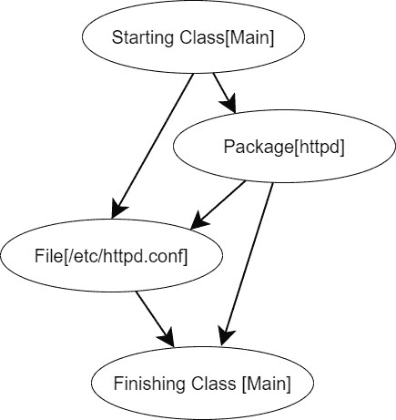
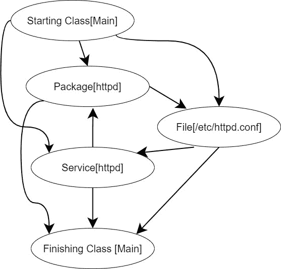
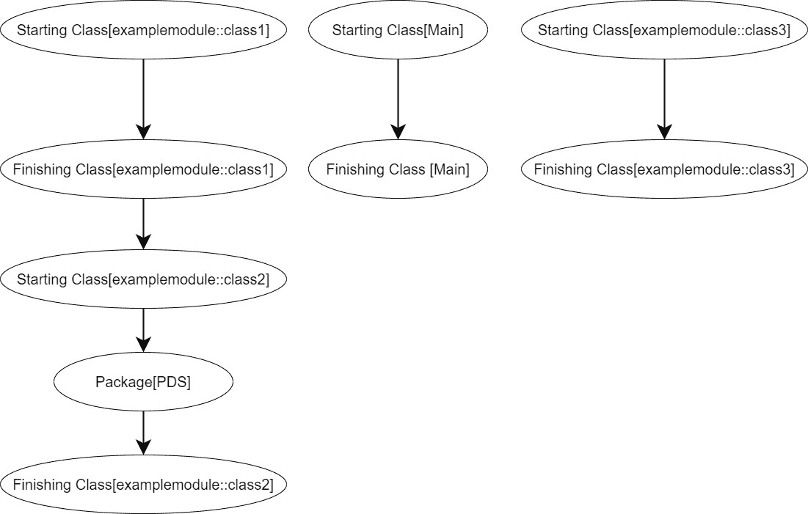
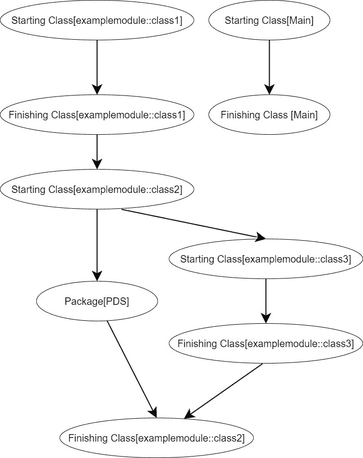
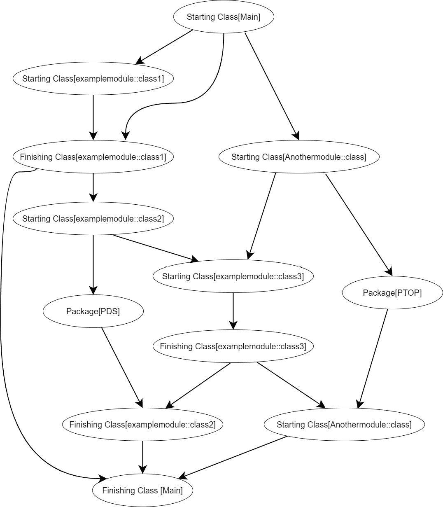
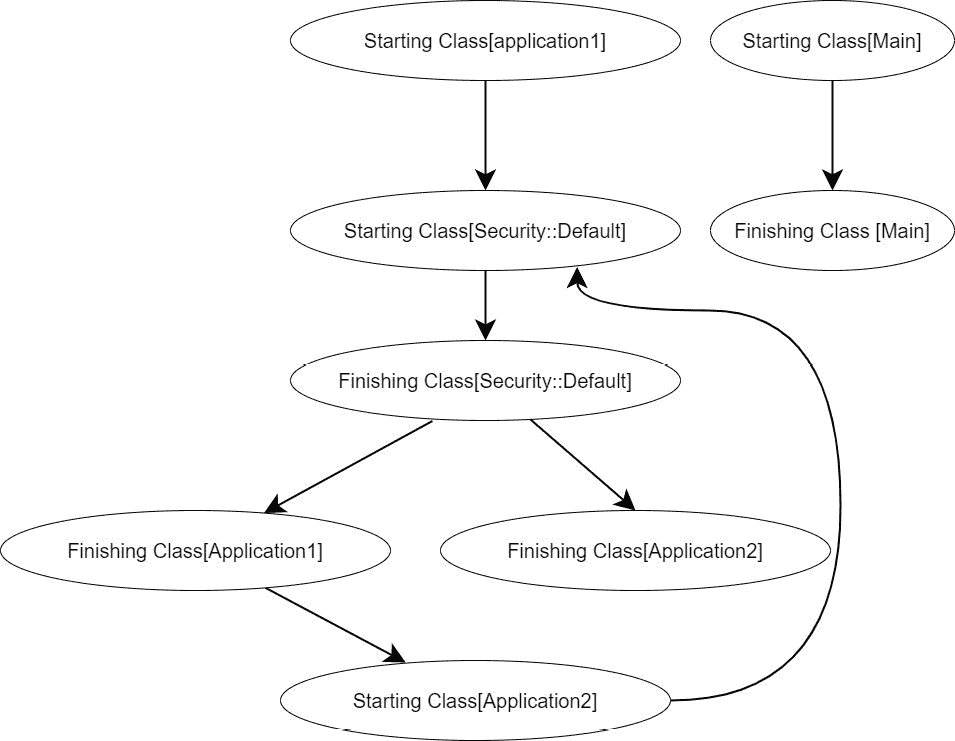

# 第六章：关系、排序和范围

在本章中，我们将讨论 Puppet 中的关系、顺序和范围。这些话题常被认为很复杂，因为 Puppet 的处理方式与传统编程语言大不相同。不过，我们将向你展示如何有效地管理这些方面，避免不必要的复杂性。

我们将首先讨论 Puppet 对关系和排序的处理方式。默认情况下，Puppet 将资源视为独立的，可以按任意顺序在目录中应用。然而，当排序是必需时，我们将向你展示如何使用 `before`、`after`、`notify` 和 `subscribe` 等元参数来强制执行排序并在资源之间创建关系。

接下来，我们将介绍封装的概念。我们将解释，包含类并不包含在其调用类内，因此，类之间建立的关系/依赖关系不会自动与这些类中的资源建立关系和依赖关系。为了解决这个问题，我们将介绍 `contain` 函数，它允许你将资源包含在类内并创建这些关系。

最后，我们将讨论作用域，以及变量和资源默认值如何根据它们在代码中的位置及其相对作用域具有不同的可见性。然后，我们将提供最佳实践和常见陷阱，以确保你采取最简单的路径并避免不必要的复杂性。

总的来说，本章将帮助你掌握在 Puppet 中有效管理关系、排序和范围的知识与技能。

在本章中，我们将介绍以下主要内容：

+   关系和排序

+   封装

+   范围

+   最佳实践与常见陷阱

# 技术要求

本章中的所有示例和实验可以在你自己的本地开发环境中运行。

# 关系和排序

默认情况下，Puppet 将所有资源视为相互独立的，这意味着它们可以按任意顺序应用。这与传统的声明式代码不同，传统代码按行执行并按照书写顺序执行。Puppet 方法的主要优势之一是，如果代码的某个部分失败，Puppet 会继续应用所有其他资源。这消除了停止或需要大规模故障处理来继续执行代码的需求。因此，即使某些资源失败，Puppet 也能将客户端服务器尽可能接近所需状态。

很明显，一些资源之间会相互依赖，例如一个配置文件只能在安装完某个包后才能存在。Puppet 提供了元参数来创建这些依赖关系：

+   `before`: 该资源应在指定的资源之前应用。

+   `require`: 该资源应在指定的资源之后应用。

+   `notify`: 该资源应在指定的资源之前应用。如果该资源发生变化，指定的资源将被刷新。

+   `subscribe`：资源应在指定的资源之后应用。如果指定的资源发生变化，资源将刷新。

`before`和`require`元参数可以用来强制执行依赖关系。然而，重要的是要注意，依赖关系只需在一个方向上应用。因此，不需要在依赖关系的两侧都使用`before`和`require`。

例如，要表示在管理文件之前应安装`httpd`包，可以使用`before`或`require`，如下面所示：

```
package { 'httpd':
  ensure => latest,
  before => File['/etc/httpd.conf'],
}
file { '/etc/httpd.conf':
  ensure => file,
  require => Package['httpd'],
}
```

依赖关系图，也称为`puppet`命令中的`--graph`选项，用于生成一个 dot 文件，该文件可以用来在适当的程序中创建图形。

在*图 6.1*中，文件资源上的`require`已经被移除，从而为示例代码生成了一个 DAG：



图 6.1 – 资源依赖的 DAG

如果同时存在`before`和`require`元参数，DAG 中将会看到一个额外的箭头，但它不会影响编译或应用资源。值得注意的是，示例代码中的起始和结束类`Main`反映了代码不包含在类中，而是处于全局范围内。这将在*作用域*部分进一步讨论。

在 DAG 中，通常不期望出现循环，因此依赖关系的流动应该只向下进行。如果添加了第三个资源（例如服务），并且该资源应在`/etc/httpd.conf`文件之后强制执行`httpd`包，那么 DAG 应该是这样的：

```
service { 'httpd':
  ensure  => running,
  before  => Package['httpd'],
  require => File['/etc/httpd.conf'],
}
```

这将导致依赖循环，如*图 6.2*所示。编译时，代码将产生错误，因为无法确定资源应用的顺序。



图 6.2 – 显示依赖循环的 DAG

也可以使用数组表示多个依赖关系，数组可以包含相同类型或不同类型的名称。例如，如果一个包被`exampleapp`的两个文件和两个服务所需要，可以这样表示：

```
package { 'exampleapp':
  ensure => latest,
  before => [File['/opt/exampleapp.content','/var/exampleapp.variables],Service['exampleapp','exampleapp2']]
}
```

有时候，将所有资源依赖集中在一边比分别在每个资源上处理要更简单。

如在*第三章*中提到的，某些 Puppet 类型具有自动创建依赖关系的规则，这些规则可以在 Puppet 类型的文档中找到，位于`Autorequires`部分，可以在线查看或使用 Puppet 的`describe`命令。例如，用户类型会自动要求 Puppet 控制下的任何组，作为用户资源的主组或副组。

除了排序概念，Puppet 还有`refresh`属性，因此如果一个资源依赖于另一个资源，它将刷新自身。这在配置文件更新并且服务需要重启以重新读取配置文件的情况下非常有用。

`notify`和`subscribe`元参数创建与`before`和`require`相同的依赖关系，但将`refresh`属性添加到依赖资源。对于内置的 Puppet 类型，`service exec`和`package`可以被刷新。如果使用了`notify`或`subscribe`元参数与无法刷新资源类型，它只会强制执行依赖关系，并在刷新事件时不执行任何操作。

注解

`notify`元参数不应与`notify`资源类型混淆，后者用于向代理日志发送消息。

例如，一个`service`资源可以使用`file`资源的`subscribe`或`notify`，使得该服务依赖于文件的创建。如果文件被更新，它也会接收到一个刷新事件，并重启服务，前提是提供者具有此能力。如以下代码所示，我们展示了依赖关系的双方，尽管只应提供一个关系属性：

```
service { 'httpd':
  ensure => running,
  subscribe => File['/etc/httpd.conf'],
}
file { '/etc/httpd.conf':
  ensure => file,
  notify => Service['httpd'],
}
```

在 DAG 图中，这与使用`before`和`require`是相同的，并且可以使用相同的资源引用或资源引用数组。

每种类型的刷新事件的默认行为和参数如*表 6.1*所示。这里，我们看到默认情况下，服务将使用提供者的`restart`变量（如果提供）。否则，`hasrestart`可以定义一个`init`脚本，或`restart`可以定义一个自定义的重启脚本。如果没有提供`init`脚本，将在进程树中搜索服务名称，但强烈建议提供明确的服务管理脚本。

对于包类型，默认行为是忽略`restart`事件，但可以将参数设置为在`refresh`事件后重新安装包。

`Exec`将在刷新时重新运行其命令，但可以更改为运行不同的`refresh`命令或仅在`refresh`事件后运行。

| 类型 | 默认行为 | 参数 |
| --- | --- | --- |
| `Service` | 如果提供者有重启功能，则重启服务；否则，停止并重新启动 | hasrestartrestart |
| `Package` | 忽略刷新事件 | reinstall_on_refresh |
| `Exec` | 重新运行命令 | refreshrefresh only |

表 6.1 - Puppet 本地类型刷新选项

元参数依赖可能会产生三种类型的错误。第一种是缺少依赖，即在编译后的目录中找不到资源。这通常应该检查是否存在拼写错误或逻辑错误，意味着资源没有被包含。第二种错误是依赖失败，即资源存在问题，导致无法应用它的任何依赖。此时需要排查该资源并重新运行 Puppet，这样所有依赖的资源就能被应用。第三种错误是依赖循环，我们在 *图 6.2* 中讨论过并展示过，通过生成有向无环图（DAG）可以帮助识别循环的位置并修复依赖逻辑。

尽管我们之前说过资源除了依赖关系外没有顺序，但这并不完全准确，因为 Puppet 是按照所谓的 **清单顺序** 运行的。因此，单个清单文件将按其编写的顺序应用，除非依赖关系发生变化。尽管这允许你不使用依赖关系，但其主要目的是防止随机编译导致代码在不同的服务器上表现不同，这可能会发生在随机读取时。

注意

Puppet 在早期版本中经历了一个关于排序的奇怪哲学/纯粹性争论。开发人员习惯性地认为排序应像其他语言一样，按行逐行处理，因此 Puppet 最初选择了随机排序。这种做法混乱不堪，导致在实验室中运行的代码可能可以工作，但在生产环境中按不同的顺序运行并导致失败。

依赖元参数的一种变体是链接箭头，其中 `before` 和 `require` 通过 `->` 和 `<-` 表示，而 `notify` 和 `subscribe` 则通过 `~>` 和 `<~` 表示。它们通常用来表示类之间的关系，比如表示模块模式，详情见 *第八章*。例如，如果我们希望 `install` 类在 `config` 类之前应用，并且在 `config` 类更新时应用并刷新 `service` 类，可以表示为：

```
include examplemodule::install, examplemodule::config, examplemodule::service
Class['examplemodule::install']
-> Class['examplemodule::config']
~> Class['examplemodule::service']
```

正如在 *第三章* 中讨论的那样，`include` 函数是必要的，以确保类被添加到目录中。

为了风格上的一致性，建议仅使用右箭头，以确保阅读时的一致性。虽然依赖参数可以在类和资源声明中使用，并且可以在其他资源类型中链接箭头，但不推荐这样做，以保持阅读的清晰性。

在简单的情况下，可以通过类内部使用所需的函数来创建对其他类的依赖。然而，没有类似 `refresh` 或 `before` 的功能，因此为了风格和一致性，通常使用排序箭头会更方便。一个简单的例子，使用 `require` 函数表示 `install` 类应该在 `config` 类之前应用，示例如下：

```
class examplemodule::config {
  require examplemodule::install
}
```

我们刚刚讨论的类依赖方法并不像看起来那么简单，因为 Puppet 类实际上并不包含其他类。一个类默认会包含其他类，因此依赖关系不会覆盖它们。接下来我们将探讨这个包含问题的含义以及如何处理它。

# 包含

Puppet 中的包含意味着包含的类不会像类中的资源那样被包含；因此，当设置对一个类的依赖关系，并通过 `include` 函数或 `class` 资源来包含另一个类时，依赖关系只会覆盖资源。例如，假设我们创建了一个要求 `class1` 在 `class2` 之前应用，并且 `class2` 包含一个 `package` 资源和一个对 `class3` 的 `include` 调用，如以下代码所示：

```
include examplemodule::class1, examplemodule::class2
Class['examplemodule::class1'] -> Class['examplemodule::class2']
class examplemodule::class2 {
  include examplemodule::class3
  package{'PDS':}
}
```

因此，虽然可能有一种假设认为这将确保 `class1` 在 `class3` 之前，但是 `class1` 确实在 `class2` 之前，这并不会发生，正如在 *图 6.3* 的 DAG 图中所看到的那样。



图 6.3 – DAG 显示缺乏包含

回想一下在 *第三章* 中介绍的 `include` 函数，这种包含并非自动发生，因为我们可能希望将该类包含在不同的地方，以应对不同的情况，并且它在目录中只出现一次，没有依赖或包含问题。

要包含一个类，可以使用 `contain` 函数。将 `include` 行改为 `contain` `examplemodule::class3`，这将使 DAG 图包含 `examplemodule::class3`，正如我们在 *图 6.4* 中所看到的那样。



图 6.4 – DAG 显示使用 contain 函数

如果 `class` 资源与 `contain` 语句一起使用，它必须在 `class` 资源之后按清单顺序出现。如果没有这样做，`class` 资源将把 `contain` 语句解释为尝试声明一个重复的资源，从而导致错误。例如，如果使用以下代码，属性将被成功传递：

```
class {'examplemodule::class3':
  attribute1 => 'value1''
}
contain examplemodule::class3
```

对于这个包含问题，直接的问题可能是为什么不使用 `contain` 来处理所有的内容呢？这归结于它可能产生的不必要且令人困惑的依赖关系。如果我们将原始示例更新为使用 `contain` 替代 `class`，并且我们有另一个类 `anothermodule:class`，它要求 `examplemodule:class3` 出现在目录中，那么我们可以添加如下代码：

```
class anothermodule::class {
  contain examplemodule::class3
  package{'PTOP':}
}
```

然后，DAG 会像 *图 6.5* 所示。可以立刻看出，我们仅通过少数几个类就创建了不必要的依赖关系。



图 6.5 – DAG 显示由于过度使用 contain 而导致的循环

更糟的是，很容易创建一个循环依赖。例如，如果 `security::default` 类被包含在所有应用程序类中，`application2` 类通过 `require` 函数引用 `application1` 类，就可能会创建一个循环依赖，代码如下所示：

```
class application1 {
  contain security::default
}
class application2 {
  contain security::default
  require application1
}
```

这将生成如 *图 6.6* 所示的 DAG。如果仅使用 include，就能避免应用程序类与 `security::default` 之间的不必要关系：



图 6.6 – DAG 显示了过度使用 contain 导致循环依赖的情况

在 *最佳实践与陷阱* 部分，我们将进一步讨论如何通过一致的模式避免担心包含问题。

在 Puppet 3.4 版本引入 `contain` 函数之前，有另一种方法，您可能会在遗留代码中看到：使用 `anchor` 资源。这可以通过 `stdlib` 模块提供的特定锚点资源或类中的其他资源对来完成。为了确保当前类包含 `examplemodule::class3`，使用 `anchor` 资源的代码如下所示：

```
anchor {['start', 'stop']: }
include examplemodule::class3
Anchor['start'] -> Class[' examplemodule::class3'] -> Anchor['stop']
```

或者，如果这两个软件包资源，`pdk` 和 `cowsay`，在此类中，它们可以被借用来创建关系并包含该类：

```
Package['pds'] -> Class[' examplemodule::class3'] -> Package['cowsay']
```

这种模式的问题是，它会用额外的锚点资源或不必要的关系使 DAG 变得杂乱，可能会引起混淆。因此，如果发现正在使用锚点，建议您通过使用 `contain` 关键字来现代化您的方法。

讨论了依赖关系和资源及类的包含后，我们将看到变量和资源默认值在 Puppet 语言中的作用域。

# 作用域

在 Puppet 中，作用域反映了代码中可以直接访问变量的地方，而无需使用命名空间，并且可以影响资源默认值的地方。

作用域有三个级别：

+   **顶层作用域**：类、类型或节点定义之外的任何代码。顶层作用域中的任何变量或资源声明将在任何地方都能读取或使用。

+   **节点作用域**：在节点定义中定义的任何代码。节点作用域中的任何变量和资源默认值将对与该节点定义匹配的节点在节点和局部作用域级别可见。

+   **局部作用域**：在类、定义类型或 Lambda 中定义的任何代码。因此，在该特定资源内定义的任何变量和资源默认值将仅在该资源内可见。

**外部节点分类器**（**ENCs**）和节点定义将在*第十一章*中讨论。我们在本节中需要理解的是，ENC 是一个可执行脚本，它返回变量和类，这些变量和类将应用于主机。此脚本可以通过执行各种操作（例如，执行数据库查找或使用 AWS Lambda）注入自定义逻辑和数据。它还可以用于访问第三方源，如**配置管理数据库**（**CMDBs**）。返回的变量位于顶级作用域，而类位于节点作用域级别。这使得提供的变量可以在任何地方可见，但只有声明了访问节点作用域变量的类才能访问这些变量。相比之下，节点定义是应用于匹配节点的代码段。

类具有所谓的命名作用域，其中类的名称用于命名空间。例如，在`exampleclass`中创建的名为`test`的变量可以通过`exampleclass::test`从任何地方访问。在全局作用域中创建的变量（如`site.pp`）可以通过调用`::variablename`从空命名空间访问。然而，通常不推荐以这种方式访问数据。在*第九章*中，我们将展示如何集中管理数据。

在 lambda 和已定义类型中的节点作用域定义和本地作用域定义是匿名的，只能通过其可见的名称直接访问。从当前作用域声明一个变量（例如，类覆盖全局变量）也可以覆盖更高作用域的变量。

为了展示这一点，请考虑以下代码：

```
$top='toptest'
$test='testing123'
notify "Top = ${top} node = ${node} local = ${local} test = ${testing}"
notify "Access directly ${example::local}"
node default {
  include example
  $test='hello world'
  $node='nodetest'
  notify "Top = ${top} node = ${node} local = ${local} test = ${testing}"
  notify "Access directly ${example::local}"
}
class example {
  test='an example'
  $local ='localtest'
  notify "Top = ${top} node = ${node} local = ${local} test = ${testing}"
}
```

第一个`notify`无法找到本地或节点变量，因为它位于全局作用域，而`testing`将被设置为`testing123`。第二个`notify`将直接访问本地命名空间`example`，并打印`localtest`。第三个`notify`将无法访问本地变量，并打印`hello world`。第四个`notify`将再次通过命名空间访问本地作用域。最后一个`notify`将能够访问所有变量，并将`local`设置为`localtest`。此示例展示了变量在作用域之间的流动。

资源标题和资源引用不受作用域的影响，可以在任何作用域中声明。例如，资源可以声明对目录中任何资源的依赖关系。然而，依赖于访问外部变量的做法并不推荐。

# 最佳实践与陷阱

在早期版本的 Puppet 中，作用域、依赖关系和包含性是一些最具挑战性的问题，这导致了对新开发者的重大困扰。一项主要的解决方案是广泛采用角色和配置文件方法，这在*第八章*中将详细介绍。Hiera 数据将在*第九章*中进行详细讲解。

角色和配置文件方法涉及将执行独立功能的单用途组件模块进行分组。例如，一个组件模块可以安装和配置 Oracle。模块结构将包含一组具有特定目的的清单，如安装软件包或管理服务。这简化了模块的组织，并允许更容易地对类进行排序。例如，`install`类可以在`service`类之前应用。

组件模块应该相互独立运行，并且模块之间没有直接的依赖关系。配置文件层将模块组合在一起以创建技术栈，并可以在必要时对模块进行排序。角色则抽象出另一层，利用这些技术栈创建业务解决方案，并可以对配置文件进行排序。在这种结构中，任何全局或节点数据应该来自 Hiera，而不是在节点或全局作用域中设置，从而减少代码复杂性。对于开发者来说，避免在代码中设置全局变量可能会感觉不直观，但推荐遵循这一做法。

如在*第三章*中提到的，建议避免使用资源收集器/导出的资源。然而，值得注意的是，它们可以作为链式箭头的一部分使用。使用它们可能具有风险，因为这可能导致不可预测的结果，并且可能产生难以在运行时映射的大量依赖循环。依赖关系应始终根据需要创建，不应依赖清单的顺序来实现这一点。省略这些依赖关系可能会显著降低代码的可维护性，并在未来重构时带来复杂性。

使用链式箭头表示类依赖关系，并仅在必要时包含它们，如在角色和配置文件方法中所示。避免在全局范围内强制资源默认值，例如在`site.pp`或节点定义中，因为这种方法会使代码变得不可预测，特别是在与多个应用团队协作时，他们可能不了解自己代码中的这些默认值。总之，避免尝试过于复杂或从其他语言中借鉴的方式，应该遵循既定的角色/配置文件和 Hiera 模式。仔细审查角色/配置文件和 Hiera 模式，并重构任何不符合这些指导原则的代码。

# 实验室 – 关系、顺序和范围概述

在本实验中，我们将提供一些代码进行回顾和运行，以确保理解所讨论的概念。所有代码都可以在 [`github.com/PacktPublishing/Puppet-8-for-DevOps-Engineers/tree/main/ch06`](https://github.com/PacktPublishing/Puppet-8-for-DevOps-Engineers/tree/main/ch06) 中找到。

[`github.com/PacktPublishing/Puppet-8-for-DevOps-Engineers/blob/main/ch06/lab6_1.pp`](https://github.com/PacktPublishing/Puppet-8-for-DevOps-Engineers/blob/main/ch06/lab6_1.pp) 中的代码目前没有依赖关系。为了满足以下要求，需要相应调整代码：

+   `install` 类及其所有资源应在 `config` 和 `service` 之前运行

+   `config` 类及其所有资源应在 `service` 之前运行

+   如果 `config` 类中的任何资源被更新，则应刷新 `service` 类及其所有资源

+   `httpd` 包应在 `exampleapp` 包之前安装

+   `exampleuser` 用户应在 `examplegroup` 组之后创建

+   应在创建 `exampleuser` 用户和 `examplegroup` 组之后创建 `/etc/exampleapp/` 目录

+   应在创建 `exampleuser` 用户、`examplegroup` 组和 `/etc/exampleapp` 目录之后创建 `/etc/exampleapp/exampleapp.conf` 文件

+   `httpd` 服务应在 `exampleapp` 服务之前启动，并且如果 `httpd` 服务重启，则应刷新 `exampleapp` 服务

建议使用 [`validate.puppet.com/`](https://validate.puppet.com/) 检查你的 Puppet 代码，因为你不应仅仅依赖于清单顺序。此外，重要的是要记住某些资源具有自动依赖行为。一个示例可以在 [`github.com/PacktPublishing/Puppet-8-for-DevOps-Engineers/blob/main/ch06/lab6_2.pp`](https://github.com/PacktPublishing/Puppet-8-for-DevOps-Engineers/blob/main/ch06/lab6_2.pp) 中找到。检查代码并查看 `notify` 函数将打印什么。

# 概要

在这一章中，我们讨论了资源默认按任何顺序应用的假设，以及如何使用元参数如`before`、`require`、`notify`和`subscribe`来定义所需的顺序。我们了解到，DAG（有向无环图）可以用来可视化资源之间的依赖关系，并且应该避免依赖关系的循环，以确保目录能够成功应用。我们还讨论了某些资源如何自动应用依赖关系，例如用户需要其主组。我们解释了`notify`和`subscribe`元参数，并特别强调它们在资源如`exec`、`package`和`service`中的`refresh`用法。这允许这些资源在必要时被重启、重新安装或重新运行，例如当配置文件发生变化时。此外，我们还承认，尽管资源应被假定没有特定顺序，但实际上它们会按清单中书写的顺序被应用，以确保在不同环境中的一致性。我们还讨论了三种可能发生的错误：循环依赖、缺失的依赖关系和依赖资源失败。

随后，我们讨论了作为元参数变体的链式箭头，允许它们在类之间使用。我们强调只有右向箭头应当被使用，以遵守样式指南。虽然元参数可以在类上使用，而链式箭头可以在资源上使用以保持一致性和样式，但我们建议避免这种做法。相反，我们展示了`require`函数如何在一个依赖于另一个类的类中使用，以处理相对简单的类依赖关系。

然后我们讨论了封装问题，这个问题出现在将类包含在其他类中时，并未创建资源依赖关系。通过使用`contain`函数代替类中的`include`函数，达到了使该类包含其他类的资源并创建依赖关系的效果。我们讨论了这可能引发包含所有类的诱惑，但我们演示了这会创建不必要的或循环的依赖关系。我们展示了旧的锚点模式，因为遗留代码仍然可能包含这种模式。我们强调`anchor`函数不再是推荐的做法，且在发现时应当更新为使用`contain`函数。

作用域影响着变量和资源的默认值，其中全局作用域指的是类、类型或节点定义之外设置的任何内容。节点作用域是指节点定义中的任何内容，而局部作用域是指类、类型或 lambda 中的任何内容。

最后，作为最佳实践，建议遵循角色和配置文件方法，以确保依赖关系和顺序的一致性。还建议使用 Hiera 代替复杂的变量使用，并避免在全局范围内设置资源默认值，例如 `site.pp` 或节点定义。重要的是，绝不要依赖清单的顺序，应该使用显式依赖关系来确保一致性。

下一章将探讨 Puppet 中的模板、迭代和条件语句。它将展示如何通过利用变量、条件和文本处理函数，Puppet 能够生成文件内容。此外，还将解释如何通过迭代函数和 Lambda 代码块，Puppet 能够循环处理并操作数据集合。最后，本章将介绍如何在 Puppet 中使用条件语句，根据条件逻辑创建不同的配置。
