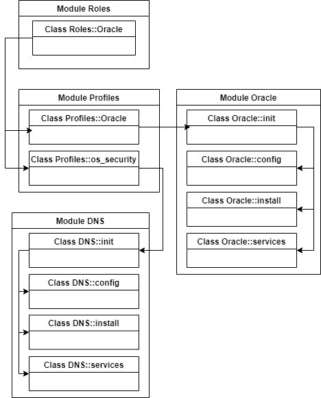
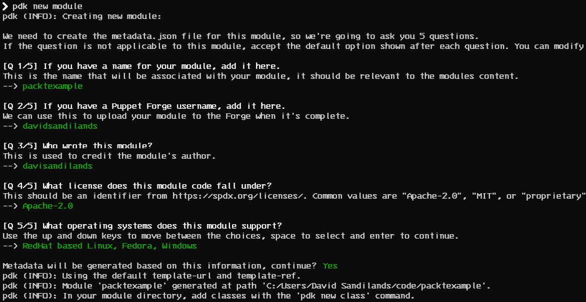
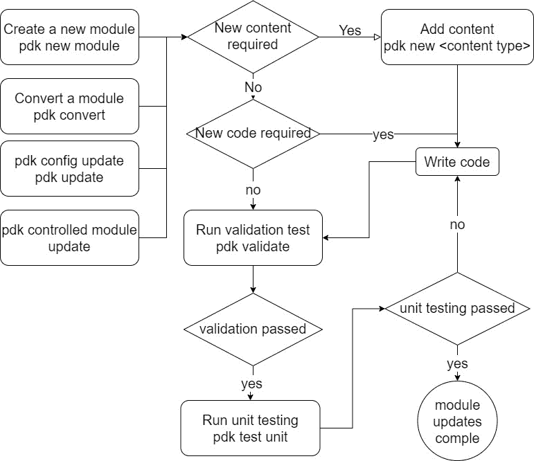
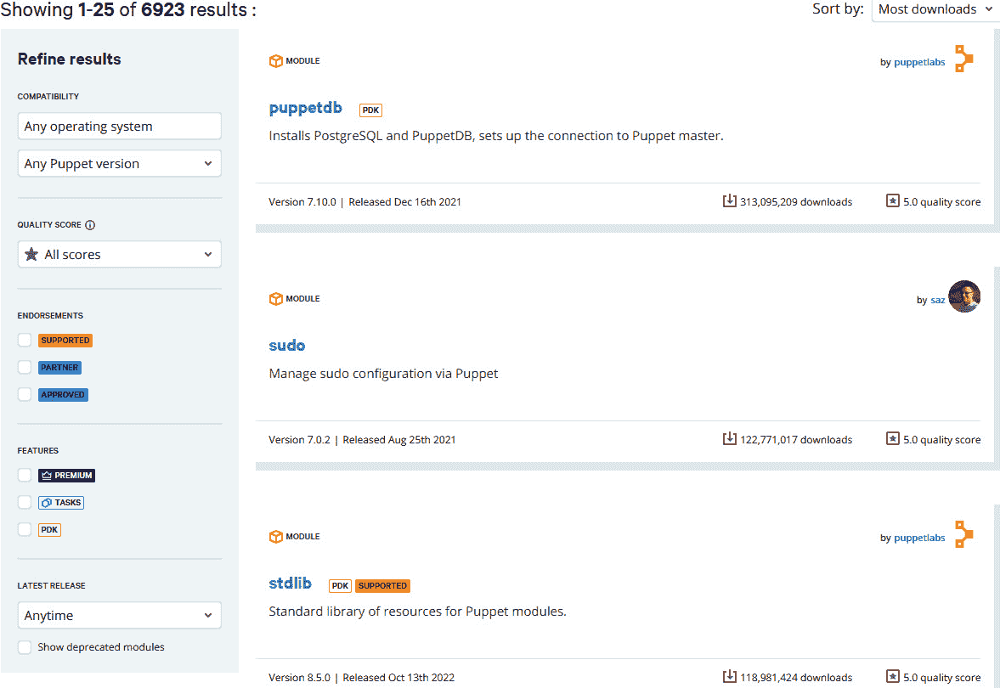

# 第八章：模块的开发与管理

在审视了 Puppet 语言的许多方面后，我们可以清楚地看到，仅使用清单文件和类是不够的，随着代码库的增长，无法提供所需的结构，特别是在需要支持多种服务器和客户需求时。在本章中，我们将回顾在大规模创建 Puppet 代码时所需的组件。我们将讨论 Puppet **模块**，它们允许我们将代码和数据捆绑在一起，专注于单一的技术实现，从而使得与其他实现共享和结合变得更加容易。接着，我们将探索 **角色与配置文件方法**，展示如何通过配置文件将模块组合在一起，创建技术栈和角色，然后通过组合配置文件来满足业务需求。之后，我们将介绍 **Puppet 开发工具包**（**PDK**），展示如何通过它自动化创建和管理模块的过程。我们将展示 PDK 模板化的目录和文件，重点介绍其内置的验证、代码检查和单元编译检查。接下来，我们将介绍 **Rspec**，一种扩展方法，用于提供更为彻底的单元测试，以及用于服务器测试的 **ServerSpec**，并进行概述。然后，我们将讨论 **Puppet Forge** 目录，它作为 Puppet 官方、供应商和社区成员开发模块的来源。我们将展示如何过滤模块的各个方面，以了解它们的支持情况、与操作系统和 Puppet 版本的兼容性，以及评分/扫描评分，从而帮助你选择最适合组织需求的模块。

本章我们将讨论以下主要内容：

+   什么是模块？它包含哪些内容？

+   角色与配置文件方法

+   PDK 及如何编写和测试模块

+   使用 RSpec 与 PDK 进行测试

+   理解 Puppet Forge

# 技术要求

本章不需要部署任何基础设施。所有操作都可以从开发者的桌面进行。

# 什么是模块？它包含哪些内容？

模块为我们提供了一种将代码和数据进行分组的方式，使得共享和重用特定技术实现的代码变得更加容易。几乎所有的 Puppet 代码都将存储在各种类型的模块中。你应该明确模块的范围，以创建具有单一明确职责的专注模块。如果你正在部署 LAMP 或 WAMP 堆栈，你不会创建一个包含所有组件的单一模块；而是会将其拆分成多个独立的模块，包括操作系统设置、MySQL 和 Apache。这种方式可以更好地重用代码，并减少单个模块的复杂性。

模块是一个目录，其命名规则类似于类，因此必须以小写字母开头，并且只能包含小写字母、数字和下划线。与类不同，模块不能嵌套，也不使用 `::` 符号。保留字和类名不应作为模块名使用。

模块具有一种目录结构，使 Puppet 能够知道各种类型的代码和数据将存储在何处，并按请求自动加载。如*第六章*所述，该模块将创建一个作用域命名空间和文件服务命名空间。核心代码和数据存储在以下目录中：

+   `data`：包含模块化数据，用于参数默认值，相关内容将在*第九章*中讲解。

+   `examples`：包含如何声明模块类和定义类型的示例。

+   `files`：包含可以由 Puppet 放置的静态文件内容。

+   `manifests`：包含模块的所有清单以及提供结构的目录。

+   `template`：包含将由 Puppet 代码使用的 EPP 和 ERB 模板文件。

+   `tasks`：包含程序化工作的任务。将在*第十二章*中讲解

模块还有一种叫做**插件**的功能，可以将各种自定义的 Puppet 组件分发到 Puppet 服务器或代理端，具体取决于相关情况。以下是一些插件示例：

+   `lib/facter`：由**Ruby**编写的自定义事实，在代理端使用

+   `lib/puppet/functions`：由 Ruby 编写的自定义函数，供服务器使用

+   `lib/puppet/type`：在服务器和代理端都可以使用的自定义资源类型

+   `lib/puppet/provider`：由 Puppet 编写的自定义资源提供者，服务器和代理端都可以使用

+   `lib/augeaus/lenses`：在代理端使用的自定义 Augeas 镜头

+   `facts.d`：在代理端使用的外部事实或静态脚本

+   `functions`：由 Puppet 编写的自定义函数，供服务器使用

需要注意的是，某些插件类型，例如资源类型，并没有在环境中完全隔离。环境将在*第十一章*中详细讨论，我们将重点讨论分类和发布管理，但现在需要注意的是，环境允许通过节点使用隔离的代码库，从而使用不同版本的代码。这是由于 Ruby 加载第一个资源类型并将其设置为全局，忽略任何发现的重复项。因此，如果使用包含无法隔离插件的模块，请务必查阅 Puppet 文档：[`puppet.com/docs/puppet/latest/environment_isolation.html#environment_isolation`](https://puppet.com/docs/puppet/latest/environment_isolation.html#environment_isolation)。如果需要，您可以配置环境隔离，Puppet Enterprise 默认提供环境隔离。

模块可以以不同的方式使用。尽管本章的大部分内容将集中在使用 Puppet 代码进行配置的模块上，但模块也可以用于分发一个或多个项目。例如，Puppet Forge 中的 PowerShell 模块（[`forge.puppet.com/modules/puppetlabs/powershell`](https://forge.puppet.com/modules/puppetlabs/powershell)）仅用于通过提供者插件目录分发新的执行提供者。

关注`manifests`目录时，清单文件将与其包含的类名相同。一个主要的例外是主清单，它命名为`init.pp`，但其类名为模块的类名。这个主清单通常用作模块的入口点。如*第六章*中讨论的那样，为模块创建了一个模块命名空间，允许我们通过运行`include <module name>`来在代码中包含该模块。

类应该是自包含的并且简洁，专注于一个方面。识别类是否过大的一个常见建议是，当它太大，以至于无法在单个编辑器屏幕中查看时，就是过大了。考虑到这一点，开始使用模块时最常见的模式之一是使用主清单`init.pp`作为入口点，接受参数以供整个模块使用。然后，它调用其他类并设置它们的顺序。例如，使用`install`类来安装资源（如包），使用`config`类来添加任何配置文件或用户，以及使用`service`类来管理服务。以下代码展示了这一模式的主清单示例：

```
class exampleapp (
  Boolean $package_managed = true,
  Integer $package_version = 3,
  Boolean $user_managed = true,
  Integer $user_id= 10,
  Boolean $service_enable = true,
  Integer $jmx_heap_size = 1024,
  Integer $thread_number = 10,
)
{
  contain exampleapp::install
  contain exampleapp::config
  contain exampleapp::service
  Class['exampleapp::install']
  -> Class['exampleapp::config']
  ~> Class['exampleapp::service']
}
```

考虑到可用的参数，如模块的公共 API，可以使模块具有灵活性；此外，命名这些参数时应该保持一致性。在这里，我们使用一种方法，根据参数的作用来命名参数。因此，对于`exampleapp`，可以看到包和用户都采用布尔值来声明模块是否将其作为资源进行管理。布尔值用于`service_enable`来决定服务是否在启动时启用，而`user_id`和`package_version`则使用整数。接着，使用两个额外的整数来配置应用程序，设置 Java 内存大小和线程数。这些参数可以通过模块命名空间访问，并通过在`modulename::variablename`处执行数据查找。此方法被称为自动参数查找，我们将在回顾 Puppet 如何处理数据时，在*第九章*中详细讲解。

注意

模块的参数及其他方面可以通过代码头部的注释进行文档化，然后使用 Puppet Strings gem 生成不同格式的文档。详细信息可以在 Puppet Strings 风格指南和以下网页中找到：[`puppet.com/docs/puppet/latest/puppet_strings_style.html`](https://puppet.com/docs/puppet/latest/puppet_strings_style.html)。

我们采用在模块内对类进行包含和排序的方法。这确保了在请求时，先安装软件包，添加配置，再管理或刷新服务，因为每个阶段都依赖于下一个阶段。`contain` 关键字不应被视为替代 `include` 的默认关键字；它应仅在组件模块风格下使用，并且类只会在主类中使用。在 *角色和配置方法* 部分，你会看到类似的包含和排序在某些情况下是不合适的。

从中可以看出，这些子类是如何使用来自主清单的参数的。例如，`install` 清单对 `package_managed` 变量使用 `if` 语句；如果它为 `True`，则安装由 `package_version` 变量设置的 `exampleapp` 包版本：

```
class exampleapp::install {
if $exampleapp::package_managed {
  package { 'exampleapp':
    ensure => $exampleapp::package_version
  }
 }
}
```

对于 `config` 清单，我们可以看到如何通过使用模块命名空间将 `jmx_heap_size` 和 `thread_number` 变量替换到模板中，并通过该命名空间访问存储在 `exampleapp` 模块中的模板：

```
class exampleapp::config {
  file { '/etc/exampleapp/app.conf':
    ensure  => file,
    content => epp('exampleapp/app.conf.epp', {' jmx_heap_size ' => $exampleapp::jmx_heap_size , ' thread_number' => $exampleapp::thread_number }),
  }
}
```

`service` 类的风格与 `install` 类非常相似。它使用 `if` 语句；如果条件为 `True`，则添加 `exampleapp` 服务，并根据 `service_enable` 变量设置 `enable` 参数：

```
class exampleapp::service
  if $exampleapp::service_managed {
    service{'exampleapp': 
    ensure => 'running', 
    enable => $exampleapp::service_enable ,
    }
  } 
}
```

注意

一个常见的模块模式是使用 `params.pp` 文件来管理默认的模块数据。现在，Hiera 5 能比清单文件以更结构化的方式管理模块级数据，具体内容将在 *第九章* 中展示。`params.pp` 文件仍然常见于代码中，特别是在数据结构简单且没有太大意义改变为 Hiera 的情况下。

`examples` 目录中可能包含一个名为 `init.pp` 的文件，指定如何调用类：

```
class { 'exampleapp':
  package_managed => true,
  package_version => 3,
  user_managed => true,
  user_id => 10,
  service_enable => true,
  jmx_heap_size => 1024,
  thread_number => 10,
}
```

在 `examples` 目录中，文件的命名并不重要；可以有多个不同的示例，展示不同设置下常见模块属性的选择。例如，一个模块可能展示如何使用最小默认值包含它，也可能展示特定架构所需的属性，例如在集群设置中进行部署。

随着配置用例变得更加复杂，模块结构的另一种常见方法可以在 Puppet Forge 目录中的 Apache 模块中看到：[`forge.puppet.com/modules/puppetlabs/apache`](https://forge.puppet.com/modules/puppetlabs/apache)。与基于简单 `package` 和 `config` 类的资源分组不同，`apache` 模块将应用程序的不同组件进行了拆分。在此示例中，Apache 的主清单执行了 Apache 的默认安装，具有默认虚拟主机和文档根目录，并启动了 Apache 服务。可以通过使用相关模块参数来配置此操作。在这里，Apache 服务由单独的类管理，但通常在 `package` 和 `config` 类中管理的资源是在 Apache 主类中管理的。还有各种实现类，例如 `vhosts`、`mod` 和 `mpm`，用于不同的 `apache` 配置项。这使得主类具有执行基本安装和配置 `apache` 服务器的明确目的，以便实现类可以专注于特定的定制。例如，`vhosts` 类是定义类型，可以为 `apache` 服务器所需的每个虚拟主机定义。

这些示例提供了一个结构，您可以根据需要为您的模块进行调整。但是，需要记住的关键教训是，模块应专注于单一任务，仅管理其资源（无跨模块依赖），并且应该是细粒度且可移植的。

在本节中，我们查看了 Puppet 模块的目录和文件结构，以及创建模块的两种常见模式。这些模块本身配置了专注于个别技术实现。在下一节中，我们将看到如何使用模块的结构来组合模块以生成技术堆栈，并通过组合技术堆栈和配置，满足客户对服务器的业务需求。

# 实验室 - 审查 Apache 模块

在本书中打印 `apache` 模块代码的所有关键部分是不切实际的。但是，查看 [`forge.puppet.com/modules/puppetlabs/apache`](https://forge.puppet.com/modules/puppetlabs/apache) 上的代码并阅读 `examples` 目录，以了解如何将主类 `apache` 与模块内的各种类结合起来配置不同组件，将帮助您理解如何结构化此模块模式。

# 角色和配置文件方法

在上一节中，我们讨论的模块是所谓的组件模块，因为它们覆盖单一实现。这些模块主要引起那些直接参与技术实现的用户的兴趣，例如 Unix 或 Windows 管理员，在他们看来，理解哪些特定资源已被应用是配置中最重要的方面。但不同的用户并不关心节点如何配置；他们关心的是它的作用。例如，一个应用程序专家关心的是，Tomcat 和 MySQL 已为他们的应用程序安装，而不关心如何配置。项目经理关心的是他们获得了一台满足业务需求的服务器，而不关心使用了哪些技术栈。项目经理也可能认为每个实现都是独特的，但通常会有很多相似之处，例如在多个应用程序中使用 Apache 或 Java 的不同技术栈，并根据位置或环境的不同而有所不同的设置。

如果没有为这些逻辑层次提供某种结构，将这些模块应用于节点将需要大量的重复和复杂的`if`语句。

一种名为角色和配置文件的模式采用模块化结构来实现这一点。角色和配置文件不是关键字，而只是模块和类中使用的模式。一个简单的方法是有一个名为`role`的模块和一个名为`profile`的模块，模块中的每个类表示一个角色或配置文件。

这些角色代表了客户（如项目经理）所需的业务需求，而配置文件则反映了应用程序的技术栈。

在将角色和配置文件方法应用于现有应用程序的配置时，重要的是从角色开始到模块结束，避免自然地首先寻求技术解决方案而忽视业务逻辑。这个过程涉及将事物拆解成组件，并且要具体思考它是什么，而不是它看起来像什么。识别角色的一个技巧是使用主机名，主机名通常包含关于位置、环境使用和应用程序的信息。例如，主机名可能看起来像`fk1ora005prd`，其中`fk1`是数据中心的位置，`005`是一个编号，`prd`是生产环境，而`ora`则是 Oracle 应用程序，它与角色的名称相匹配。因此，角色应该是业务名称，例如`buildserver`、`proxyserver`或`ecomwebserver`，而配置文件应该是技术栈的名称，例如 Apache、Jenkins 或 nginx。

这种命名并不总是完美的，有时其中一些术语可能只是项目经理用来订购 Oracle 服务器的术语。他们可能没有意识到 Oracle 角色背后的配置文件，这些配置文件包括一个 Oracle 配置文件和其他相关的配置文件。

在这种情况下，`role` 类应简单地调用所需的配置文件，不带变量，如下所示：

```
class role::exampleapp {
  include profile::core
  include profile::java
  include profile::apache
}
```

相反，`profile` 类应包含参数，以定制模块和类声明，进而添加所需的模块：

```
class profile::java(
  Pattern[/present|installed|latest|^[.+_0-9a-zA-Z:~-]+$/] $java_version
  String $java_distribution
) {
class { 'java':
  version      => $java_version,
  distribution =>  $java_distribution,
  }
}
```

在 *第九章* 中，涉及到 Puppet 和数据，你将看到 Hiera 如何对覆盖配置文件默认值的数据建模。每个服务器应该只拥有一个角色；如果需要两个角色，那么它本身就是一个新角色，但一个角色会有多个配置文件。*图 8.1* 展示了使用角色、配置文件和模块的简单示例，以及这些类如何相互包含。在这个设置中，正如我们稍后在 *第十一章* 中看到的那样，对主机进行分类就像确保正确的角色被分配到节点一样简单：



图 8.1 – 角色、配置文件和模块的示例

上图中显示的框架完全是关于抽象的，因此我们将业务逻辑、实现和资源管理解耦，并减少节点级别的复杂性。

这种模式不是强制要求，而是提供了一些如何构建代码的建议，以避免重复并提供一种模型。在这种情况下，可以考虑几种适应性调整。

使用复杂度升级允许我们在最初代码较少时不创建过多结构。如果配置文件中只有少量资源，那么保持这种方式并在变得复杂时扩展到模块可能更容易。

根据你所在组织的变更管理和交付要求，可能有多个配置文件或角色模块，以便实现更细粒度的控制和访问——例如，`teama_profiles` 和 `teamb_profiles`。

正如在 *第三章* 中讨论的那样，一般不建议在 Puppet 代码中使用继承，但通过在目录中分组清单（例如，在 `profile` 中创建 `exampleapp` 目录，并创建 `client.pp` 和 `server.pp` 来表示服务器和客户端版本（分别为 `profile::exampleapp::server` 和 `profile::exampleapp::client`））来扩展 `profile` 模块的命名空间可能是值得的。这也可以针对特定的操作系统进行。在考虑这种方法之前，请注意，这种结构是一个边缘情况，使用继承时风险较大。

如果发现配置文件在变化的技术栈中过于死板，或者采用遗留服务器意味着必须丢弃配置文件或角色的某些部分，那么使用参数使配置文件更具动态性，可以通过配置文件类的参数（无论是通过 Hiera 还是默认值）来定义类。

作为一个简单的示例，以下代码使用 `include_classes` 和 `exampleapp` 模块中列出的默认值：

```
class profile::exampleapp(
  Array[String] $include_classes = ['exampleapp'],
) {
  include $include_classes
}
```

这样我们就可以覆盖 Hiera 或配置文件中的 `include_classes` 数组。通过只允许来自某个特定模块的类，我们可以使包含更加严格：

```
class profile::exampleapp(
  Array[String] $include_classes = ['server'],
 ) {
$modules = $include_classes.map | String $module | {
  "exampleteam_exampleapp::${profile}"
}
include $modules
}
```

为了为参数增加更多结构，并在审批和代码审核过程中使其更加清晰，可以进一步细分类参数。在这里，我们可以添加默认、必需、附加和剔除数组，从而提供完全的灵活性：

```
class profile::exampleapp(
  Array[String] $include_default          = ['my_default'],
  Array[String] $include_mandatory        = ['my_base_profile'],
  Array[String] $include_additional       = ['my_test_default_profile'],
  Array[String] $include_removal          = ['my_default'],
){
$profiles = $include_default + $include_mandatory + $include_additional + $include_removal
include $profiles
}
```

通过限制多个命名空间，并为每个命名空间创建类数组的列表，可以进一步混合这一模式。这将取决于采用什么方法，能够为组织提供足够的灵活性，同时明确代码会影响什么内容以及谁应进行审核。

通过这种方法，也许可以通过参数定义一个 `noop` 标志，并在资源上执行 noop 操作。你也可以通过 [`forge.puppet.com/modules/trlinkin/noop`](https://forge.puppet.com/modules/trlinkin/noop) 中的 `noop` 函数来实现，让模块在被接受之前处于 noop 模式。

这些模式的调整更加复杂，需要读取 Hiera 数据以理解角色和配置文件所代表的含义，但最终的决定将取决于贵组织，选择哪种方法最适合。虽然通过使用严格的角色和配置文件来减少变化是理想的，但如果没有适当的管理方法，这可能会导致采用上的阻力或遗留问题。

在审视了角色和配置文件模式所能创建的模块结构及其内容后，我们可以看到，这需要大量的内容来手动管理，通过创建文件并管理各种测试工具。下一部分将讨论如何通过使用 PDK 来自动化模块创建和测试的生命周期。

# 使用 PDK 编写和测试模块

PDK 的引入旨在减少一致性地创建模块目录和文件的工作量，同时将一些常用的测试和验证工具组合在一起。我们将回顾 PDK 版本 2.7.1，这是写作时可用的最新版本。PDK 安装了自己的 Ruby gems 和环境，以提供以下工具：

| **Ruby** **Gem 名称** | **Ruby** **Gem 功能** | **项目页面** |
| --- | --- | --- |
| `metadata-json-lint` | 验证语法并根据样式指南检查 `metadata.json` | [`github.com/voxpupuli/metadata-json-lint`](https://github.com/voxpupuli/metadata-json-lint) |
| `pdk` | 生成模块及模块内容，并使用自动化测试命令 | [`github.com/puppetlabs/pdk`](https://github.com/puppetlabs/pdk) |
| `puppet-lint` | 根据 Puppet 语言样式指南检查 Puppet 清单代码 | [`github.com/puppetlabs/puppet-lint`](https://github.com/puppetlabs/puppet-lint) |
| `puppet-syntax` | 检查 Puppet 清单、模板和 Hiera YAML 的语法是否正确 | [`github.com/voxpupuli/puppet-syntax`](https://github.com/voxpupuli/puppet-syntax) |
| `puppetlabs_spec_helper` | 提供必要的工具，以便在不同版本的 Puppet 中进行测试 | [`github.com/puppetlabs/puppetlabs_spec_helper`](https://github.com/puppetlabs/puppetlabs_spec_helper) |
| `rspec-puppet` | 编译 Puppet 代码并使用 Puppet 特定实现的 Ruby RSpec 测试预期行为 | [`github.com/puppetlabs/rspec-puppet`](https://github.com/puppetlabs/rspec-puppet) |
| `Rspec-puppet-facts` | 提供一种方法，通过 `facterdb` 的输出为支持的操作系统提供事实数据 | [`github.com/voxpupuli/rspec-puppet-facts`](https://github.com/voxpupuli/rspec-puppet-facts) |
| `facterdb` | 提供不同操作系统和不同 Facter 版本的事实输出示例 | [`github.com/voxpupuli/facterdb`](https://github.com/voxpupuli/facterdb) |

表 8.1 – PDK gem 列表

关于 PDK 的常见误解是，它在打包和安装这些工具。实际上，它正在为每个创建的模块运行 `bundle install`。之后，PDK 缓存被保存，看起来像是 PDK 正在打包这些工具。

使用 *表 8.1* 中讨论的 gem，PDK 可以生成以下内容：

+   包含完整模块骨架、元数据和 README 模板的模块

+   类、定义类型、任务、自定义事实、函数和 Ruby 提供者

+   类和定义类型的单元测试模板

PDK 会执行 lint 检查样式和最佳实践，并对以下内容进行语法验证：

+   `metadata.json` 文件；有关详细信息，请参见 *表 8.2*

+   针对特定 Puppet 版本的 Puppet 清单文件（`.pp`）

+   针对特定 Puppet 版本的 Ruby 文件（`.rb`）

+   EPP 和 ERB 模板文件

+   `Puppetfile` 和 `environment.conf`，它提供了环境的模块列表及其环境设置，具体内容将在 *第十一章* 中讨论

+   YAML 文件

PDK 在模块和类上运行 RSpec 单元测试。有关详细信息，请参阅 *使用 PDK 的 RSpec 测试* 部分。

PDK 具有构建和发布命令，可以生成 `.tar` 文件，用于上传到 Puppet Forge 和 Puppet 调试控制台。

要创建一个模块，执行 `pdk new module` 命令（可选地在末尾加上模块名称）。回答关于模块名称的问题（如果没有提供模块名称，则指定你的 Puppet Forge 用户名，若有的话），模块的作者，代码应遵循的许可协议，以及支持的操作系统。此过程可以在以下截图中看到：



图 8.2 – pdk 新模块问题

对用户详细信息和许可协议提供的答案将作为默认值，在以后运行时提供，并可以通过运行 `pdk get config` 并检查 `user.module_defaults` 设置来查看。

注意

在引入 PDK 之前使用的 `puppet module generate` 命令，在 Puppet 5 中已弃用，并在 Puppet 6 中被移除。

一旦输入并确认了答案，将创建一个包含模块名称的目录。该目录将包含先前在 *模块是什么及其内容* 部分中讨论的以下内容目录：

+   `data`

+   `examples`

+   `files`

+   `Manifests`

+   `spec`

+   `tasks`

+   `templates`

使用默认的内建模板后，它将创建以下额外的配置文件和目录：

| **文件/目录名称** | **文件/目录用途** |
| --- | --- |
| `appveyor.yml` | Appveyor CI 集成配置文件 |
| `CHANGELOG.md` | 可维护的变更日志 |
| `.``devcontainer` | 配置容器以测试此模块的方式 |
| `.``fixtures.yml` | 测试模块依赖配置 |
| `Gemfile` | Ruby gem 依赖 |
| `Gemfile.lock` | Ruby gem 依赖 |
| `.``gitattributes` | 将属性和行为与文件类型关联 |
| `.``gitignore` | Git 应忽略的文件 |
| `.``gitlab-ci.yml` | 用于 GitLab CI 的示例配置 |
| `metadata.json` |

+   创建时填写的元数据，包括问题回答

|

| `.``pdkignore` |
| --- |

+   用于构建 Puppet Forge 包时忽略的文件

|

| `.``puppet-lint.rc` | `puppet-lint` gem 的配置 |
| --- | --- |
| `Rakefile` | Ruby 任务配置 |
| `README.md` | 模块的 README 页模板 |
| `.``rspec` | `rspec` 单元测试的配置默认值 |
| `.``rubocop.yml` | Ruby 风格检查设置 |
| `/``spec` | 包含 `rspec` 单元测试文件的目录 |
| `/``spec/default_facts.yaml` | 所有测试都可用的默认事实 |
| `/``spec/spec_helper.rb` | `rspec` 的入口脚本，设置各种配置 |
| `.``sync.yml` | 自定义正在使用的 PDK 模板的文件 |
| `.``vscode` | VSCode 配置，例如推荐的扩展 |
| `.``yardopts` | Puppet Strings 配置文件 |

表 8.2 – PDK 默认模板文件和目录

对于已有的模块，也可以运行 `pdk convert` 将模块适配到模板中。它会在应用更改之前确认将要做出的修改。

PDK 内容的大小随着时间的推移而增长，默认模板可能包含许多未使用的文件。可以通过从 [`github.com/puppetlabs/pdk-templates`](https://github.com/puppetlabs/pdk-templates) 进行 fork 并按照 README 文件的指导调整模板，来创建自定义模板。然后，可以通过在新模块或转换命令中使用 `--template-url` 来使用该模板。此外，`.sync.yml` 文件可以设置为删除、不受管理或更改设置。以下的 `.sync.yml` 文件示例将设置 `.gitlab-ci.yml` 文件，使其不包含在模块中。它将确保 `.vscode` 目录不受 PDK 模板管理，从而避免将来的更新。它还将禁用旧版事实（事实的全局变量，详细介绍见 *第五章*）：

```
common
  disable_legacy_facts: true
.gitlab-ci.yml
  delete: true
.vscode
  Unmanaged: true
```

可以调整的完整设置已在 PDK 模板的 README 文件中进行了文档化：[`github.com/puppetlabs/pdk-templates/blob/main/README.md`](https://github.com/puppetlabs/pdk-templates/blob/main/README.md)。

注意

如果需要在多个现有模块中进行配置更改，可以使用 `modulesync` 模块来管理此操作。它可以通过以下网页获得：[`github.com/voxpupuli/modulesync`](https://github.com/voxpupuli/modulesync)。

现在我们已经详细描述了 PDK 模块及其工具的内容，接下来我们将描述开发模块的工作流程，如 *图 8.3* 所示。

¶¶¶



图 8.3 – PDK 工作流程

如前所述，通过运行 `pdk new` 创建新模块或在未受控模块上运行 `pdk convert`，可以建立一个初始的 PDK 内容模块及其设置。使用 `pdk update`，可以更新模块的配置，因为我们可以更改其设置、提供新的模板或更改 PDK 版本。

下一步是添加任何需要的新内容文件。这可能包括 `class`、`defined_type`、fact、函数提供者、任务或传输，可以通过使用 `pdk new` 命令和相关内容来完成。这将使用所选内容的模板和一个 `rspec` 测试文件创建一个文件。对于 PDK 无法提供的内容，例如外部 facts 或计划，必须手动创建文件和测试。

一旦文件和内容测试就位，应该添加你的代码。可以通过定期运行`pdk validate`命令来验证和测试代码，这个命令会检查代码的代码风格和语法解析。此命令也可以与`-a`标志一起使用，该标志会尝试自动修正任何错误。对于代码风格错误，可以通过使用内联注释或通过在代码区域周围加注释`lint:ignore:<rule name>`来忽略文件某部分的特定检查。以下示例展示了如何设置某一行忽略 140 字符的代码风格规则。在这种情况下，该段代码会忽略双引号检查，双引号只应在同时使用字符串和变量进行变量赋值时使用：

```
$long_variable_text = "Pretend this is more than 140 characters" # lint:ignore:140chars
  # lint:ignore:double_quoted_strings
  $variable1 = "don't do this"
  $variable2 = "this is just a simple example"
  # lint:endignore
```

如果必须在所有代码中忽略该检查，可以通过添加类似`--no-selector_inside_resource-check`的标志更新`.puppet-lint.rc`文件，以确保`puppet-lint`不执行检查，确保选择器代码位于资源内部。可以在[`github.com/puppetlabs/puppet-lint/tree/gh-pages/checks`](https://github.com/puppetlabs/puppet-lint/tree/gh-pages/checks)查看`puppet-lint`检查的完整列表。请注意，尽可能避免禁用检查，因为这可能会影响模块评分或影响模块是否能在 Puppet Forge 获得认证。这会使你的代码远离推荐的 Puppet 实践。

注意

[`puppet-lint.com/checks/`](http://puppet-lint.com/checks/) 不是 Puppet 公司所有，并且已经过时。Puppet 将该模块分支到[`github.com/puppetlabs/puppet-lint`](https://github.com/puppetlabs/puppet-lint)，因此建议使用[`puppetlabs.github.io/puppet-lint`](https://puppetlabs.github.io/puppet-lint)。

一旦`pdk validate`成功运行，可以执行`pdk test unit`命令来进行单元测试。模板提供的检查是基础性的，旨在检查代码是否能正常工作；对于 Puppet 代码，它确保代码能够编译。一个强大的功能是，通过使用`--puppet-version`标志或`--pe-version`，检查可以针对特定的 Puppet 或 Puppet Enterprise 版本进行运行——例如，`pdk test unit –pe-version=2019.11`——这样可以在升级之前进行代码测试。在下一部分，你将学习如何进一步扩展`rspec`检查。

Puppet Forge 将在本章最后详细讨论。本书不涉及发布到 Puppet Forge 的内容，但如果要将代码发布到 Puppet Forge 供使用，可以运行`pdk build`命令来创建`.tar`文件进行上传，或者运行`pdk release`命令来自动化上传模块到 Puppet Forge 的过程。

保持 `metadata.json` 文件的最新状态非常重要，因为它将限制根据 Puppet 支持的版本进行的测试，并且是文档的重要部分。可以在 [`docs.puppet.com/puppet/latest/modules_metadata.html`](https://docs.puppet.com/puppet/latest/modules_metadata.html) 查看其格式及选项。

若要查看所有可用的选项，您可以在 [`puppet.com/docs/pdk/2.x/pdk_reference.html`](https://puppet.com/docs/pdk/2.x/pdk_reference.html) 中查阅完整的 PDK 命令参考。

在回顾了如何使用 PDK 创建和管理模块，以及其验证和测试功能后，我们来学习如何使用 RSpec 进行完整的单元测试。

# 使用 PDK 进行 RSpec 测试

为了在单元测试层面进一步进行初步验证和编译测试，RSpec 可用于测试模块的行为和逻辑，而 ServerSpec 可用于进行系统集成测试。

RSpec 是一个用于测试 Ruby 代码的 Ruby 框架，`rspec-puppet` 测试是 RSpec 的一个实现，专门用于测试 Puppet 模块。

注意

需要注意的是，当前项目代码可以在 [`github.com/puppetlabs/rspec-puppet`](https://github.com/puppetlabs/rspec-puppet) 中找到，它是从 [`github.com/rodjek/rspec-puppet`](https://github.com/rodjek/rspec-puppet) 派生的，核心指南和文档可以在 [`rspec-puppet.com/`](http://rspec-puppet.com/) 找到。

当用户开始使用 RSpec 时，有些人可能会觉得它只是用不同的语言模仿 Puppet 代码。RSpect 会运行 Puppet 代码中的不同逻辑和行为，确保在各种环境和情况下会产生正确的目录和输出。这可以防止在重构或升级到新版本的 Puppet 时出现回归。如果 RSpec 代码只是简单地模仿清单中的代码，那么测试场景就没有得到正确的审查。

这种单元测试风格的优点在于，它允许你在不启动任何特定基础设施或进行任何更改的情况下测试代码。

RSpec 测试包含在 `spec` 目录下的 Ruby 文件中的模块里，目录中包含了针对不同类型代码的测试，例如 `spec/classes` 目录中的类，和 `spec/defines` 目录中的定义类型。

我们将忽略其他可能的测试目录（如 `types`、`type_alias` 和 `functions` 测试目录），因为创建它们超出了本书的范围。然而，这里讨论的大部分内容可以应用于这些类型。

RSpec 配置包含在 PDK 中，文件会通过 `pdk new` 命令自动创建。但是，当转换模块或使用 PDK 时，可以通过向 `convert` 命令添加 `--add-tests` 标志 (`pdk convert --add-tests`)，以及使用 `pdk new test --unit <name>` 命令分别进行添加。

在我们查看 PDK 默认为定义类型和类提供的内容之前，我们必须在`exampleapp`模块上运行`pdk new class exampleapp`和`pdk new define example_define`命令，以创建主清单和一个名为`example_define`的定义类型。这样会生成一个名为`spec/classes/exampleapp.rb`的文件，内容如下：

```
require 'spec_helper'
describe 'exampleapp' do
  on_supported_os.each do |os, os_facts|
    context "on #{os}" do
      let(:facts) { os_facts }
      it { is_expected.to compile }
    end
  end
end
```

此外，`spec/defined/example_define.rb`可以如下创建：

```
require 'spec_helper'
describe 'exampleapp::example_define' do
  let(:title) { 'namevar' }
  let(:params) do
    {}
  end
  on_supported_os.each do |os, os_facts|
    context "on #{os}" do
      let(:facts) { os_facts }
      it { is_expected.to compile }
    end
  end
end
```

分解这个过程，第一步是`require spec_helper`，它会加载`spec/spec_helper.rb`文件。由于`spec`目录会自动加载到路径中，因此只需要声明标题；这将配置 RSpec，稍后将在本节中详细讨论。接下来的部分是`describe`，它是 RSpec 中的一个关键字，用于描述一组测试。对于`exampleapp`和`example_define`测试，描述的是类和定义类的名称，因为每个测试组只有一个基本的测试组。

注意

如果你以前使用过`puppet-rspec`，你可能在`describe`语句中设置了额外的类型定义，比如`describe 'exampleapp'`, `:type => :class do`。由于文件夹本身充当了类型的自动标识符，这一步是多余的。

定义类型始终需要一个标题和任何参数。使用`let`关键字时，设置了标题以及参数，在这种情况下，参数为空。

然后，`exampleapp`和`example_define`类使用`on_supported_os`函数进行循环，该函数由`rspec-puppet-facts`宝石提供，输入来自`metadata.json`文件，该文件包含有关支持的操作系统的详细信息，并生成一个存储在`os_facts`变量中的事实数组。接着，这些事实被传递到另一个`let`中，将这些事实赋值给`os_facts`数组的内容。

`it`关键字是一个 RSpec 术语，可以是单行的，也可以包含在`do`和`end`块内。它是一个测试用例，包含一个叫做`is_expected.to`的期望语句，这是对某个条件的验证步骤。这个条件通过匹配器来表达。在这种情况下，它将编译类和定义类型的 Puppet 代码，并确认会成功生成目录。

注意

我们推荐使用[`www.betterspecs.org/`](https://www.betterspecs.org/)上的样式指南，它适用于通用的 Ruby RSpec 风格。我们将在本章中引用其中的建议。

简要查看了默认的编译测试后，让我们看看每个组件以及如何进一步扩展它们。

## `describe`和`context`关键字

对于许多曾尝试使用 RSpec 的 Puppet 开发者来说，一个大的困惑是理解何时使用`describe`关键字，何时使用`context`。它们看起来是可以互换的，这有充分的理由。`context`关键字是`describe`的别名，所以它们是可以互换的，你的使用仅影响代码的可读性。

*Betterspecs*建议使用`describe`来描述正在测试的方法。在 Puppet RSpec 中，这也是我们在*使用 PDK 进行 RSpec 测试*部分看到`describe`与类名`exampleapp`以及其定义类`exampleapp::example_define`的原因。

推荐将`context`写成*何时*、*与*或*不与*等情境方式，这样可以明确说明正在测试的场景。

本书的风格推荐是写一个单独的`describe`来匹配 Puppet 类型，比如`class`，然后使用`context`来匹配要测试的场景。

`describe`和`context`的块允许描述正在测试的情况，并设置事实、变量和参数。由于它们可以嵌套，因此可以实现继承，这将构建更详细的场景，或尝试不同的逻辑路径，但需要注意不要使这些案例过于难以阅读。

目标应该是测试所有情况。因此，应该计划测试有效、边缘和无效情况，允许正面和负面情况都能被测试。作为一个简单的示例，在没有任何代码测试或参数设置的情况下，以下`exampleapp`类的代码将根据`install`版本是否为中间值、低边缘版本或无效版本来查看每个受支持操作系统的上下文：

```
describe 'exampleapp' do
  on_supported_os.each do |os, _os_facts|
    context "on #{os}" do
      context 'When install_version is 6' do
        it { is_expected.to compile }
      end
      context 'When install_version is 1' do
        it { is_expected.to compile.and_raise_error('unsupported version') }
      end
      context 'When install_version is invalid string' do
        it { is_expected.to compile.and_raise_error('Invalid version string') }
      end
    end
  end
end
```

现在我们已经有了测试场景的基本结构，下一步是使用匹配器来测试根据`context`在目录中生成的内容。

## 示例、期望和匹配器

示例`it`语句可以是单行的，如在*使用 PDK 进行 RSpec 测试*部分所示，或者当所使用的匹配器太长，无法放在一行时，可以分成多行。使用`do`和`end`，相同的编译示例可以表示如下：

```
it do
is_expected.to compile
end
```

在一般的 Ruby RSpec 实现中，期望有更广泛的选择，但在`puppet-rspec`中，我们的期望将仅限于使用`is_expected`关键字。不过，可以通过使用`not_to`来否定它——例如，`It { is_expected.not_to }`。

匹配器提供了多种测试，用于测试不同的资源类型。匹配器的语法为`contain_<resource_type>('<title>').<options>`。

对于编译匹配器，我们可以通过添加`with_all_deps`选项来更明确地进行编译测试——例如，`it { is_expected.to compile.with_all_deps }`。这将测试目录中所有关系是否包含资源。或者，我们可以通过使用`and_raise_error('error_message')`选项来查找编译错误，这将包含我们期望抛出的消息作为字符串——例如，`it { is_expected.to compile.raise_error('lets cause` `failure' }`。

主要的匹配集合是基于资源类型，使用`contain_<resource_type>('<resource_title>')`模式——例如，

`it { is_expected.to contain_class('exampleclass::install') }` 和 `it { is_expected.to contain_service('httpd') }`。

`Rspec-puppet`不会进行类名解析或查找，因此匹配器只接受没有前导冒号的限定类。因此，`install`在`exampleclass`中找不到，但`exampleclass::install`可以找到。如果资源类型包含`::`符号，则需要将其转换为`__`符号，这样它将变成`contain_exampleapp__exampletype`。

资源匹配器可以通过使用`with`、`only_with`和`without`方法进一步扩展。这使我们能够检查资源的参数；`with`确保目录中的资源具有指定的参数，`only_with`确保仅设置提供的参数而没有其他参数，`without`接受一个参数数组并确保这些参数没有被设置。在使用这些方法时，使用`it do...end`格式更具可读性，以下是一个示例：

```
it do
  is_expected.to contain_package('httpd').with(
  'ensure' => 'latest',
  'provider' => 'solaris',
  )
end
```

通过遵循`with`和`only_with`的方法语法，这可以简化为仅一个参数：

```
<with_method>_<parameter name>
it {is_expected.to contain_server('exampleserver').only_with_enable(true)  }
```

对于`without`，该方法接受一个不应设置在资源上的参数数组：

```
it {is_expected.to contain_user('exampleuser'). .without(['managehome', 'home']) }
```

这些方法可以通过链式调用的方式组合在一起，无论是作为相同的方法，还是作为混合方法：

```
it {is_expected.to contain_server('exampleserver').with_enable(true).without_ensure  }
```

另一种资源匹配器是使用`count`，它允许使用`have_<resource_type>_count`语法。例如，要验证资源的总数是否为`5`，类的总数是否为`4`，可以运行以下代码：

```
it { is_expected.to have_resource_count(5) }
it { is_expected.to have_class_count(4) }
```

在回顾了如何设置示例后，显然对于`describe`和`context`关键字，必须设置参数和前置条件才能形成测试场景。例如，如果上下文是安装版本为 1，则需要将安装版本参数设置为 1。

## 参数和前置条件

在定义类型的默认示例中，我们解释了如何使用`let`关键字来指定定义类型的测试实例的标题和空参数。然而，这些也可以用于其他类型，如带参数的类。

要填充参数，可以提供一个由`=>`符号分隔的键值对数组，在字符串中未定义的值声明为`:undef`，在编译测试时会转换为`undef`。例如，要将`param1`设置为`yup`字符串，并将`param2`设置为`undef`，可以使用以下`let`：

```
let(:params) { {'param1' => 'yup', 'param2' => :undef } }
```

除了参数外，还可以设置前置条件。因此，如果正在测试的清单依赖于目录中存在另一个类或变量，则可以将其添加，以便在测试类之前进行评估。例如，在模块模式中，我们展示了`config`类需要在`install`类之后但在`service`类之前在目录中进行评估。这可以通过以下代码完成：

```
let(:pre_condition) { 'include exampleapp::install' }
let(:post_condition){ 'include exampleapp::service' }
```

如果有多个条件，也可以使用字符串数组。如果测试针对特定的节点或环境，可以按如下方式设置：

```
let(:node) { puppet.packtpub.com' }
let(:environment) { 'production' }
```

节点应该是**完全合格的域名**（**FQDN**）。

## 关系

资源之间的关系可以通过`that_requires`、`that_comes_before`、`that_notifies`和`that_subscribes_to`方法进行测试。无论 Puppet 代码使用`require`，还是 RSpec 使用`that_comes_before`，或者 Puppet 代码使用方向箭头，只要这些变体在逻辑上是等价的，都不重要，因为测试是在目录上进行的。

这些方法被链式调用到示例中与需求一起，但是在 Puppet 清单中声明关系与在`rspec`测试中声明关系之间存在一些区别：名称不应加引号，不能在单一类型下有多个资源名称，如果引用了类，则不应使用前导`::`标记它为顶级作用域。举个简单的例子，一个名为`exampleconfig`的文件要求`exampleapp`包，可以通过以下方式进行检查：

```
it { is_expected.to contain_file('exampleconfig').that_requires('Package[exampleapp]') }
```

要检查`exampleapp`包是否在`exampleapp::service`和`exampleapp::config`类之前，可以传递一个数组。然而，请注意，它们不能在一个类下：

```
it { is_expected.to contain_package('exampleapp').that_comes_before('Class[exampleapp::service]','Class[exampleapp::config]') }
```

使用`it do...end`的带参数资源示例如下，其中通知了两个文件：

```
it do
  is_expected.to contain_service('anotherapp').with(
    'ensure' => 'running',
    'enable' => 'true',
  ).that_notifies('File[config_a]', 'File[config_b]')
end
```

如果测试的是类似定义类的内容，并且它的定义中包含`require`或`before`，则可以在参数中设置此关系。然而，必须使用`ref`辅助函数来命名它所依赖的资源，使用`ref('<type>','<title>')`语法。对于一个需要`exampleapp`包的定义类型，以下代码会通过参数添加该关系：

```
let(:params) { 'require' => ref('Package', 'exampleapp') }
```

## 来自 Hiera 和事实的数据

来自 Hiera 和事实的数据对我们代码中的逻辑有很大的影响，因此必须能够提供并自定义，以覆盖不同的测试场景。如在*使用 PDK 进行 RSpec 测试*章节中的默认示例所示，`rspec-puppet-facts` gem 会检查`metadata.json`文件以查找支持的操作系统列表。然而，`metadata.json`并没有提供架构的方式，默认情况下，`rspec-puppet-facts`会根据操作系统选择一个默认架构，例如 Solaris 的 i86PC 或 Fedora 的 x86_64。如果您希望能够检查其他架构，可以通过逗号分隔的数组传递硬件模型。这样将与以下代码结合使用：

```
  additional_archs = {
    :hardwaremodels => ['i386'],
  }
on_supported_os(additional_archs).each do |os, os_facts|
```

如果只需要测试一个子集，例如专为某个操作系统制作的类，则可以通过`operatingsystem`和`operatingsystemreleases`参数传递相关的详细信息；这将覆盖`metadata.json`：

```
    ubuntu = {
      supported_os: [
        {
          'operatingsystem'        => 'Ubuntu',
          'operatingsystemrelease' => ['18.04', '16.04'],
        },
      ],
    }
on_supported_os(ubuntu).each do |os, os_facts|
```

使用`on_supported_os`方法时，这只能在所有选择上进行设置。如果没有找到任何内容，例如 Windows 11 上的 i386，它将默默地失败。查看`facterdb`模块[`github.com/voxpupuli/facterdb`](https://github.com/voxpupuli/facterdb)以查看可用的内容。

使用`on_supported_os`并不是强制性的，但如果没有它，默认情况下将不会有任何事实。当你需要测试`facterdb`中不存在的数据时，可以通过`let(:facts)`声明事实以及你想要的值。例如，如果你要测试一个理论上的 RedHat 10 事实集，你可以使用以下代码：

```
Context "when OS is redhat-10-x86_64" do
    let(:facts) do
      {
        :osfamily                  => 'RedHat',
        :operatingsystem           => 'RedHat',
        :operatingsystemmajrelease => '10',
        …
      }
    end
```

同样，如果要在嵌套的`context`中向`os_facts`变量添加额外的事实，可以使用`merge`方法与`super`方法：

```
     let(:facts) do
        super().merge({
          :student => 'david',
        })
      end
```

注意

对于结构化事实，这些合并可能变得更加复杂。Voxpupli 在[`github.com/voxpupuli/voxpupuli-test`](https://github.com/voxpupuli/voxpupuli-test)中提供了一个`override_facts`助手，可以帮助解决这个问题。

要添加可以被 PDK 用于验证和测试代码的事实，请添加一个`spec/default_module_facts.yml`文件。这个文件将包含类似下面的 YAML 内容：

```
---,
choco_install_path: C:\ProgramData\chocolatey
chocolateyversion: 0.9.9
```

`default_facts.yml`文件不应被编辑，因为它由 PDK 管理，并提供 PDK 运行所需的最小事实。

通过`.sync.yaml`添加默认事实是可能的，方法是添加标准代码块或`default_facts.yml`，但与`default_module_facts.yml`相比，这种方式不必要地复杂。

在 spec 中通过`let(:facts)`提供的任何事实将会覆盖默认事实。

除了这些事实外，还有三个额外的变量来自分类和外部数据源：节点参数，这是从分类中分配给节点的全局变量；可信事实，这是从 Puppet 客户端证书中分配的变量；以及可信外部事实，这是由脚本从外部数据源获取的变量。这些的完整实现将在*第十一章*和*第十四章*中详细描述。

可以通过在 spec 文件中使用`let`语句或在`spec_helper`中设置为默认值来添加所有三种类型的变量。

从 Puppet 4.3 版本开始，可信事实将包含基于节点名称（通过`:node`设置）填充的可信事实键（`certname`，`domain`，`hostname`）。然而，可信外部事实和节点参数将为空。

可信事实使用`trusted_facts`，可信外部数据使用`trusted_external_data`，节点参数使用`node_params`。例如，要声明可信事实和可信外部数据，可以使用以下`let`语句：

```
let(:trusted_facts) { {'pp_role' => 'puppet/server', 'pp_cluster' =>
'A'} }
let(:trusted_external_data) do,
{ 
  pds: {
     puppet_classes: some_class,
     example: hiera_data,
   },
}
end
```

要设置默认值，`.sync.yaml` 可以通过传递一个数组给 `spec_overrides` 来添加额外的行；然而，添加一个包含必要行的 `spec_helper_local.rb` 文件会比遵循 YAML 语法更为简便。在 `Rspec.config` 块中，需要按照 `c.<fact_type> = {<fact/parameters_keys>}` 格式，并使用带有 `default_` 前缀的 fact/parameter 名称。因此，要将节点参数指定为默认值，可以按如下方式更新 `spec_helper_local.rb`：

```
RSpec.configure do |c|
  c.default_node_params = {
    'owner'  => 'oracle',
    'site'   => 'Falkirk1',
    'state' => 'live',
  }
end
```

同样，可信的外部数据也可以像这样设置：

```
Rspec.configure do |c|
  c.default_trusted_external_data = {
    pds: {
      puppet_classes: some_class,
      example: hiera_data,
    },
  }
end
```

Hiera 会在 *第九章* 中详细介绍，但现在知道 Hiera 提供一个 `hiera.yaml` 文件来帮助你学习如何查找数据和配置文件就足够了。我们在 `spec/fixtures/hiera/hiera.yaml` 中创建了一个 `hiera.yaml` 定义，通常会在 `spec/fixtures/hieradata` 中定义一个 `datadir`。

Hiera 的配置可以通过两种方式进行设置，具体文档可以参考 [`github.com/puppetlabs/rspec-puppet`](https://github.com/puppetlabs/rspec-puppet)。第一种方式是使用 `let` 并设置必要的变量，如下所示：

```
let(:hiera_config) { 'spec/fixtures/hiera/hiera.yaml' }
hiera = Hiera.new(:config => 'spec/fixtures/hiera/hiera.yaml')
```

查找操作可以按如下方式进行：

```
 primary_dns = hiera.lookup('primary_dns', nil, nil)
  let(:params) { 'primary_dns' => primary_dns}
```

或者，可以将以下内容添加到 `spec_helper_local.rb` 中。这里，参数的自动查找将会发生：

```
RSpec.configure do |c|
  c.hiera_config = 'spec/fixtures/hiera/hiera.yaml'
end
```

在了解如何为单独的模块创建测试后，你会很快发现，模块内使用了各种资源，例如函数，而这些资源依赖于其他模块的内容。在接下来的章节中，你将学习如何使用 fixtures 使这些内容可用于测试。

## 使用 fixtures 管理依赖关系

`puppetlabs_spec_helper` 可以将依赖的模块放在 `spec/fixtures/modules` 目录下，供运行 RSpec 测试单元时使用。`.fixtures.yml` 文件可以指定 GitHub 仓库源的 `repositories:` 和 Puppet Forge 模块的 `forge_modules:`。

主要的参数是 `repo`，它可以是 Git 仓库链接或 Puppet Forge 模块名，`ref` 表示 Git 提交 ID，或 Forge 模块版本号，`branch` 是 Git 分支名。`ref` 和 `branch` 参数可以一起使用来修改分支。

所以，包含两个 Git 仓库和两个 Forge 模块的 `.fixtures.yml` 示例文件如下：

```
fixtures:
  forge_modules:
    peadm: "puppetlabs/peadm"
    stdlib:
      repo: "puppetlabs/stdlib"
      ref: "2.6.0"
  repository:
     pecdm:  "git://github.com/puppetlabs/pecdm"
   Puppet-data-service:
      repo: "git://github.com/puppetlabs/puppetlabs-puppet_data_service"
      Ref:  "feature_branch_1"
```

如果除了 `repo` 之外没有其他参数，则可以简化为一行，如此所示。如果 fixtures 文件发生了变化，可以使用 `--clean-fixtures` 标志和 `pdk test unit` 命令来确保所有内容被删除。

更多的标志和选项可以与 fixtures 一起使用，具体文档请参考 [`github.com/puppetlabs/puppetlabs_spec_helper#fixtures-examples`](https://github.com/puppetlabs/puppetlabs_spec_helper#fixtures-examples)。

## 覆盖率报告

可以通过将以下代码添加到 `spec_helper_local.rb` 来生成覆盖率报告：

```
RSpec.configure do |c|
  c.after(:suite) do
    RSpec::Puppet::Coverage.report!
  end
end
```

该工具检查 Puppet 资源是否被覆盖，并生成覆盖的资源百分比和未覆盖资源的列表。被检查的资源必须位于正在测试的模块内，并且不能包含任何由 fixtures 引入的依赖。资源覆盖的百分比也可以通过在括号中添加通过率来设定为通过或失败的标准。例如，通过将代码行更新为 `RSpec::Puppet::Coverage.report! (100)`，可以确保每个资源（100%）都被覆盖。这有时可以作为推动 RSpec 使用和覆盖的动力，且只有在出现特定问题或例外时，资源覆盖百分比才会减少。

## 进一步的 RSpec 研究和工具

本节旨在为你提供足够的信息，以便你能够使用事实数据和依赖关系构建有意义的 `rspec-puppet` 测试。同时，请注意，可以使用普通的 Ruby 代码，如 `case` 或 `if` 语句和变量，并且在 `spec_helper_local` 中还有许多更多高级配置选项，相关文档请见：[`rspec-puppet.com/documentation/configuration/`](https://rspec-puppet.com/documentation/configuration/)。

本书不建议使用 Augeas，但实际上可以在 RSpec 中测试 Augeas。详细信息请参阅：[`github.com/domcleal/rspec-puppet-augeas`](https://github.com/domcleal/rspec-puppet-augeas)。

尽管这超出了本书的范围，但在使用自定义函数和类型时，必须执行存根和模拟，这可以通过 `rspec-mocks` 完成，相关文档可见：[`github.com/puppetlabs/puppetlabs_spec_helper#mock_with`](https://github.com/puppetlabs/puppetlabs_spec_helper#mock_with)。

在*使用 PDK 进行 RSpec 测试*部分的开头提到，对于大型清单，必须为资源编写所有 RSpec 代码可能会很痛苦。然而，有几个工具可以为你完成这项工作。这些工具包括 [`github.com/logicminds/puppet-retrospec`](https://github.com/logicminds/puppet-retrospec)、[`github.com/enterprisemodules/puppet-catalog_rspec`](https://github.com/enterprisemodules/puppet-catalog_rspec) 和 [`github.com/alexharv074/create_specs.git`](https://github.com/alexharv074/create_specs.git)；这些工具都可以从代码或清单生成 RSpec。

几乎所有任务也可以通过使用 `rspec-puppet-yaml` gem 在 YAML 中完成，相关文档可见：[`rubydoc.info/gems/rspec-puppet-yaml`](https://rubydoc.info/gems/rspec-puppet-yaml)。然而，我们强烈不推荐这样做。

对于进一步的 RSpec 研究，查看核心 RSpec 文档可能会很有帮助，网址是：[`rspec.info/documentation/`](https://rspec.info/documentation/)。

## Serverspec

Serverspec 是一个 RSpec 实现，用于在配置管理部署完成后进行服务器级别的测试。它是一个独立于 Puppet 的工具，且不与 PDK 集成；通常，它会被添加到流水线工具中运行，并需要你从服务器远程连接到测试目标。许多我们在 RSpec 中看到的相同原理和理念仍然适用。相关的文档和教程可以在 [`serverspec.org/`](https://serverspec.org/) 找到。

在本章了解了如何创建和测试模块后，我们现在可以看看如何使用 Puppet Forge 获取预编写的模块。

# 理解 Puppet Forge

Puppet Forge 提供了一个丰富的资源库，包括 Puppet、Puppet 社区和第三方供应商提供的模块，旨在减少你组织必须编写和维护的代码量。它还允许你为项目做出贡献或发布模块，进而让他人也能为你的项目做贡献。

理解 Puppet Forge 中不同类型的作者、认可和质量评分非常重要，这有助于你了解是谁在开发模块、可以期待什么样的模块，以及如何在 7000 多个模块中做出选择。

任何人都可以注册并发布模块。然而，Puppet 公司本身是通过 `puppetlabs` 用户名发布的，而 `puppet` 用户名则是由 Vox Pupuli 社区发布的。这种混淆源于 Puppet 最初被称为 Puppet Labs。尽管如此，这并不影响 Vox Pupuli 社区在 Puppet 的高标准开发以及与 Puppet 的紧密合作，两个组织在相互贡献。有关 Vox Pupuli 社区的详细信息可以访问 [`voxpupuli.org/`](https://voxpupuli.org/)，包括如何贡献和参与其中。

还有一些其他重要的咨询贡献者，比如 `example42`、`enterprisemodules`、`camptocamp` 和 `betadots`，他们贡献了模块并提供服务。还有一些供应商组织，如 `foreman`、`datadog`、`SIMP`、`cyberark` 和 `Elastic`，它们提供与自己产品相关的模块。最后，像 `saz` 和 `ghoneycut` 这样的个人贡献者也贡献了多个高质量的模块。Puppet 有一个 Champions 计划，专门突出介绍 Puppet 知名贡献者，这有助于了解模块作者的可靠性：[`puppet-champions.github.io/profiles.html`](https://puppet-champions.github.io/profiles.html)。

注意

将模块发布到 Puppet Forge 的过程超出了本书的范围，但可以通过访问 [`puppet.com/docs/puppet/latest/modules_publishing.html`](https://puppet.com/docs/puppet/latest/modules_publishing.html) 进行查看，并配合 `pdk build` 和 `pdk release` 命令使用，如在 *使用 PDK 编写和测试模块* 部分中所讨论。

在了解如何在查看如*图 8.4*所示的屏幕时筛选使用模块时，我们有多种选择，该屏幕允许我们搜索 Puppet Forge 中所有可用的模块：



图 8.4 – Puppet Forge 搜索屏幕

最直接的有用过滤器是`metadata.json`文件，用于操作系统和 Puppet 版本兼容性。发布日期、最新版本和下载次数是衡量模块是否常用以及是否保持更新的关键指标。

Puppet 实施了一种认可方案，由**内容与工具团队**（**CAT**）管理，分为三种类型：合作伙伴、批准和支持。

批准的模块通过了[`forge.puppet.com/about/approved/criteria`](https://forge.puppet.com/about/approved/criteria)中记录的具体标准，这些标准确保模块符合可用性和质量标准。这可以帮助你在选择可靠模块时，或让你的团队以标准为目标，并通过[`github.com/puppetlabs/puppet-approved-modules`](https://github.com/puppetlabs/puppet-approved-modules)提交模块。

支持的模块遵循与批准模块相同的标准，但由 Puppet 或 Puppet 批准的第三方供应商完全支持，允许 Puppet Enterprise 客户在遇到问题时提交支持案例。请注意，只有模块的最新版本才会得到支持，且 Puppet Enterprise 操作系统版本在生命周期结束后的支持窗口有限。详细信息可以在[`forge.puppet.com/about/supported`](https://forge.puppet.com/about/supported)查看。

第三种合作伙伴类型是由非 Puppet 提供支持和测试。但为了使此支持有效，可能需要单独的合作伙伴许可方案。

除了这种认可方法，每个 Puppet 模块都会有一个评分。自从评分机制最后一次更新以来，详细信息尚未完全公开，评分的细分也不可见，但模块质量评分基于代码风格检查、兼容性测试和元数据验证。这个评分可以帮助你了解模块在运行`anubis-docker`评估时是否符合 Puppet 代码标准。[`github.com/puppetlabs/anubis-docker`](https://github.com/puppetlabs/anubis-docker)

恶意软件扫描于 2021 年引入，使用 VirtusTotal。`puppetlabs`用户模块上可以看到模块的通过或失败情况，但这将在稍后的日期扩展到已批准、合作伙伴以及所有未来模块版本。

随着新实现的推出，或者因为用例不再有效而不再得到支持，模块可能会被弃用。这些模块默认会被隐藏，但可以通过选择**显示****已弃用**选项使其可见。

最近发布的 Puppet Comply 产品新增了高级模块，但它们目前仅适用于`cem_windows`和`cem_linux`模块，这些模块只有在购买 Puppet Comply 后才能使用。

由于历史发展重点在 Linux 平台，Puppet 在 Windows 平台上的支持曾一度被忽视。Puppet Forge 提供了一个集合页面（[`forge.puppet.com/collections/windows`](https://forge.puppet.com/collections/windows)），该页面展示了为 Windows 设计的模块，例如 Chocolatey 包提供程序：[`forge.puppet.com/modules/puppetlabs/chocolatey`](https://forge.puppet.com/modules/puppetlabs/chocolatey)。另一个重要的发展是自动生成 PowerShell `xInternetExplorerHomePage`，用于设置 Internet Explorer 的首页，以及如`xActiveDirectory`等模块，用于部署和配置 Active Directory。`xInternetExplorerHomePage`非常简单，只有一个名为`dsc_xinternetexplorerhomepage`的资源类型，可以用来设置默认首页，如下所示：

```
dsc_xinternetexplorerhomepage { 'set home page':
  dsc_startpage => 'https://www.packtpub.com'
}
```

`xActiveDirectory`具有多种资源类型，用于配置和部署 Active Directory 的不同方面。

由于这是完全自动化的转换，而且 Puppet 并不拥有 DSC 代码，因此存在一定限制。这使得测试受到限制，并且依赖于 DSC 代码所有者提供的代码和文档质量。你还可能会发现一些模块在 PowerShell Gallery 中已被弃用，因此值得检查。此外，由于`minitar`中的一个 bug，只有 Puppet Enterprise 代码管理器才能正确地从 Puppet Forge 直接解压这些模块。对于开源用户，请参阅模块文档说明，了解如何从 Puppet Forge 的 Web 链接下载模块并手动解压归档文件，确保模块已安装并且 DSC 代码完全解压。

还有一些进一步的博客和工具需要关注，虽然它们超出了本书的范围，但值得调查以获取更多信息。为了跟上 Puppet Forge 和 Puppet 管理模块的最新动态，CAT 团队运行了一个博客：[`puppetlabs.github.io/content-and-tooling-team/`](https://puppetlabs.github.io/content-and-tooling-team/)。Puppet Forge 还提供了一个 API，地址为[`forgeapi.puppet.com/`](https://forgeapi.puppet.com/)，可以执行更多的编程查询，而 Ben Ford 开发的`denmark`模块提供了额外的扫描和检查，帮助审查模块：[`github.com/binford2k/denmark`](https://github.com/binford2k/denmark)。

# 实验—创建并测试一个模块

在这个实验中，你将运用你所学到的关于模块结构、PDK 和测试的知识，创建并测试一个 Grafana 模块。然后，利用你对 Puppet Forge 的了解，你将探索 Forge 网站并选择模块：

+   使用你为 *第四章* 编写的结合了 Grafana、Windows 和 Linux 的类代码，或者参考 [`github.com/PacktPublishing/Puppet-8-for-DevOps-Engineers/blob/main/ch04/all_grafana_data_types.pp`](https://github.com/PacktPublishing/Puppet-8-for-DevOps-Engineers/blob/main/ch04/all_grafana_data_types.pp) 的示例答案，创建一个名为 `packt_grafana` 的新模块，并按照 `init`、`service`、`config` 和 `install` 模式将 Puppet 代码拆分为适当的类（在实际应用中，对于这么多资源，单个类更为合适，但此处仅为练习）。建议使用 `pdk new class` 创建类。请遵循 [`puppet.com/docs/puppet/latest/puppet_strings_style.html`](https://puppet.com/docs/puppet/latest/puppet_strings_style.html)，确保类的完整文档，并通过测试。

+   扩展 PDK 提供的默认测试，并在考虑可能传递的参数和可用的操作系统选择时设计要覆盖的上下文。使用模块中的 [`github.com/PacktPublishing/Puppet-8-for-DevOps-Engineers/blob/main/ch08/.sync.yml`](https://github.com/PacktPublishing/Puppet-8-for-DevOps-Engineers/blob/main/ch08/.sync.yml) 文件，该文件将包含 `puppet-catalog_rspec` 的 gem 文件，并运行 `pdk update`。为了自动生成一些 RSpec 资源，你可以在每个类的规格文件中添加 `it` `{` `dump_catalog` `}`（你需要为此定义一些参数），并在获得输出后删除该行。添加 100% 覆盖率的测试，并确保测试能够达到该目标。

+   使用 `pdk validate` 和 `pdk test unit`，修正模块中可以找到的错误，示例见此处：[`github.com/PacktPublishing/Puppet-8-for-DevOps-Engineers/tree/main/ch08/mistakemodule`](https://github.com/PacktPublishing/Puppet-8-for-DevOps-Engineers/tree/main/ch08/mistakemodule)。

+   访问 Puppet Forge 并决定你希望为以下任务使用哪个模块：

    +   在 Ubuntu 上配置 SSH

    +   安装和配置 IIS

    +   在 Windows 机器上使用 DSC 配置时区（提示：不是 `xtimezone`；参考 [`www.powershellgallery.com/`](https://www.powershellgallery.com/)）

    +   安装并配置 Logstash

查看建议答案，链接地址为 [`github.com/PacktPublishing/Puppet-8-for-DevOps-Engineers/blob/main/ch08/module_choice.txt`](https://github.com/PacktPublishing/Puppet-8-for-DevOps-Engineers/blob/main/ch08/module_choice.txt)

# 总结

在本章中，您学习了模块如何帮助您将代码和数据进行分组，从而更容易共享和重用代码。我们讨论了模块应该专注于清晰的单一用途责任。我们检查了模块的目录结构，并重点介绍了存储特定 Puppet 代码和数据的位置。展示了一个好的入门清单结构，重点介绍了用作入口点的主清单（`init.pp`），并通过参数像公共 API 一样使模块灵活，能够包含其他所需的类。我们还看到了 `install.pp`、`config.pp` 和 `service.pp` 类，分别聚焦于安装、配置和服务。在应用程序变得比这更复杂的情况下，我们讨论了模块如何使用类和目录来处理不同的组件。

接下来，我们了解了 PDK 如何作为一种自动化模块创建的工具，并将常用的工具集成在一起，帮助我们管理和测试 Puppet 模块。我们创建了一个 Ruby 环境，并在模块目录中安装了社区最常用的开发工具和配置文件。我们审查了生成模块的默认模板，以及如何通过在 `sync.yaml` 上进行分支来定制它。

接着，我们了解了在使用各种 PDK 命令创建或转换模块时，开发生命周期的过程，以及添加不同的 Puppet 类型，如类或定义类型，这些都用于创建单元测试。我们还查看了 `pdk validate` 命令，它用于执行代码检查和语法验证，并通过 `-a` 标志在可能的情况下进行自动修正。模板创建了基本的 RSpec 测试，用于检查目录的编译。PDK 的 `build` 和 `release` 命令也被提及，作为将 PDK 打包到 Puppet Forge 中或将其作为一个命令打包并上传的方法——`release`。

接下来，你学习了如何使用 `describe` 和 `context` 扩展 RSpec，以构建测试用例和期望，并使用匹配器来定义单个测试。你了解到，可以通过 `let` 语句设置前置条件，从而在测试中创建类的依赖关系。你还学习了如何通过链式调用定义关系。你看到，`let` 语句可以用于在数据中定义事实、节点数据、受信任的事实和受信任的外部事实，并且通过使用 `default_module_facts.yaml` 和 `spec_helper_local` 文件，可以为模块设置默认值。随后，我们讨论了 Hiera，详细介绍了如何在 spec 或通过 `spec_helper` 设置配置文件，以及如何执行查找操作。对于外部依赖，展示了 `fixtures.yml` 文件，能够从 Puppet Forge 或本地仓库引入模块依赖，以支持目录编译。然后，将覆盖率报告添加到本地 spec helper，使单元测试能够显示哪些资源未被测试覆盖，并在测试中显示通过百分比。接着，我们了解了一些进一步的 RSpec 工具和资源，这些工具允许你生成 RSpec 代码，并进行一些超出本书范围的检查。然后，重点介绍了 ServerSpec，它是一个基于 RSpec 的服务器级测试框架。它独立于 Puppet，超出了本书的范围，但值得投资，理想情况下应该加入到流水线中。

在向你展示如何开发和构建模块之后，你学习了如何从 Puppet Forge 获取模块，了解了 Puppet 提供的不同类型的模块支持和背书，如何对模块进行评分和扫描，以及如何了解贡献者及其在 Puppet 社区中的地位。提到了 Windows 模块集合，以及 PowerShell DSC 集合，它为 PowerShell Gallery 中的模块提供了自动封装，使内容可以在 Puppet 代码中下载和使用。还提到 CAT 团队作为 Puppet Forge 的维护者，通过博客发布更新来支持内容。接着，介绍了丹麦模块，作为一种额外的模块评分方式。

在下一章中，你将学习 Puppet 如何处理数据，并了解 Hiera，探讨它如何将数据分层到不同的作用域。我们将讨论何时最好使用 Puppet 代码、变量和 Hiera 来存储数据，以及如何构建和将数据传递给模块参数。我们还将涵盖如何正确存储数据的安全性，无论是在静止状态还是传输过程中，以及使用 Puppet 数据时的一些常见问题和如何应对它们。
