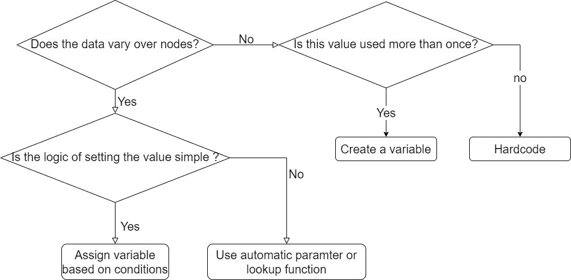
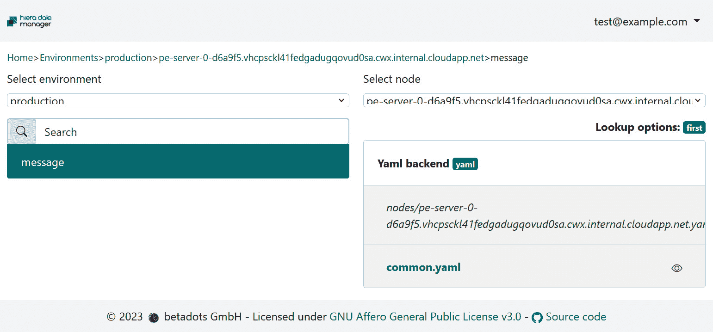

# 9

# 使用 Puppet 处理数据

本章将重点介绍如何使用 Puppet 处理数据。我们将讨论 Hiera，Puppet 的键值数据查找工具，以及它如何确保 Puppet 的可重用代码在不增加过多逻辑和变量的情况下更加可配置。将回顾 Hiera 的基本结构，展示它如何以层级方式存储数据，提供基于规则的键查找，且无需繁琐操作，以及如何使用不同的后端查找数据中的键以返回值，这些后端实现可能是 YAML 数据文件或应用程序的 API 调用。将讨论自动参数查找的使用，展示它如何让参数化配置文件自动接收数据，以及如何在 Puppet 代码中直接使用查找功能来调用数据。我们将简要讨论 Hiera 3 和 Hiera 5 在传统 Puppet 中的变化。接下来，将详细回顾三个 Hiera 层级（全局层、环境层和模块层），讨论在这些不同层级中如何管理层级和数据。将展示查找合并和优先级行为的选项，突出如何通过第一次匹配或合并不同的值来查找数据。然后，我们将根据使用案例和最佳实践讨论数据应该在何时何地使用，以及代码应该直接保存在控制仓库中还是保存在单独的 Hiera 数据仓库中。接着，我们将讨论数据的安全性，展示如何通过不同的方法在存储、传输和在 Puppet 代码中使用时保持数据安全，重点介绍使用 `Sensitive` 类型、`node_encrypt` 模块以及通过 `eyaml` 加密文件的效果和局限性。最后，将回顾一些常见问题及故障排除方法/工具，展示如何最佳地使用 `lookup` 命令调试和解释值，以及为什么我们永远不应该在层级中使用全局变量，如何避免使用默认值，使用 Hiera 进行分类的风险，以及如何通过 **Hiera 数据管理器** (**HDM**) 工具使数据更易于访问。

本章将涵盖以下主要主题：

+   什么是 Hiera？

+   Hiera 层级

+   决定何时使用静态代码或动态数据

+   保持数据安全

+   陷阱、难点和问题

# 技术要求

从 [`github.com/puppetlabs/control-repo`](https://github.com/puppetlabs/control-repo) 克隆控制仓库到你的 GitHub 账户，并将其命名为 `controlrepo-chapter9`，然后在生产分支中更新以下内容：

+   `Puppetfile` 与 [`github.com/PacktPublishing/Puppet-8-for-DevOps-Engineers/blob/main/ch09/Puppetfile`](https://github.com/PacktPublishing/Puppet-8-for-DevOps-Engineers/blob/main/ch09/Puppetfile)

)

+   `Manifests/site.pp` 与 [`github.com/PacktPublishing/Puppet-8-for-DevOps-Engineers/blob/main/ch09/site.pp`](https://github.com/PacktPublishing/Puppet-8-for-DevOps-Engineers/blob/main/ch09/site.pp)

)

+   从生产环境创建一个名为 `lab_error` 的分支，并替换以下内容：

    +   `data` 与 [`github.com/PacktPublishing/Puppet-8-for-DevOps-Engineers/blob/main/ch09/data`](https://github.com/PacktPublishing/Puppet-8-for-DevOps-Engineers/blob/main/ch09/data)

)

    +   `hiera.yaml` 与 [`github.com/PacktPublishing/Puppet-8-for-DevOps-Engineers/blob/main/ch09/hiera.yaml`](https://github.com/PacktPublishing/Puppet-8-for-DevOps-Engineers/blob/main/ch09/hiera.yaml)

通过从[`github.com/PacktPublishing/Puppet-8-for-DevOps-Engineers/blob/main/ch09/params.json`](https://github.com/PacktPublishing/Puppet-8-for-DevOps-Engineers/blob/main/ch09/params.json) 下载 `params.json` 文件，并更新控制仓库位置和控制仓库中的 SSH 密钥，来构建一个包含两个 Linux 客户端和两个 Windows 客户端的标准集群。然后，在 `pecdm` 目录下运行以下命令：

```
bolt --verbose plan run pecdm::provision –params @params.json
```

首先，让我们了解一下 Hiera 是什么以及它为何被使用。

# 什么是 Hiera？

到目前为止，我们讨论了如何使用 Puppet 创建有状态且可重用的代码，以及如何通过使用角色和配置文件方法使得参数可用，从而使模块可配置。我们还展示了如何在代码中使用这些参数，但为了创建一个可扩展、可读且特定于站点的数据源，Puppet 使用了一个名为 **Hiera** 的工具。如果不在 Puppet 代码中使用 Hiera 数据，将需要无休止的逻辑和变量来表示节点例外、位置差异、操作系统版本差异、组织差异以及许多其他情况所需的数据变化。

Hiera 是一个数据查找工具，可以在 JSON、HOCON、YAML 和 EYAML 文件中查找值，支持内置后端，或使用自定义后端调用外部数据源，例如网站或数据库。它以键值对的形式存储数据，可以通过代码中的函数调用显式查找，也可以通过自动参数查找自动查找，后者通过将类中的参数名称与 Hiera 数据值进行匹配来实现。正如这个名字所暗示的那样，Hiera 专注于使用层级来查找数据，查找过程遵循一个常见的默认值，数据源的层级越具体，匹配的节点数据越精确。这些层级在 `hiera.yaml` 文件中配置；该 YAML 文件按优先级列出各个层级。此 `hiera.yaml` 文件设置了要使用的 Hiera 版本，这是必需的，虽然 *5* 是唯一的活跃版本。

## 使用内置后端

对于层级映射中的内置后端，将会有一个层级列表，每个层级将包含以下内容：

+   `name` – 描述层级的可读标签

+   `datadir` – 相对于 `hiera.yaml` 的基础路径，所有数据都存储在此路径下

+   `data_hash` – 要使用的 Hiera 后端/文件类型

+   `path`、`paths`、`glob`、`globs`或`mapped_paths`——文件路径或相对于`datadir`的数据路径。

还可以使用这些键创建默认映射，这样就不需要在每个层次结构中重复值。

`data_hash`查找函数键接受`yaml_data`、`json_data`和`hocon_data`作为值，但大多数 Puppet 实现仅使用 YAML 数据，因此本书将默认使用`yaml_data`后端。

文件路径允许层次结构级别使用与节点相关的代码中插值的变量，声明数据文件的特定位置，例如与`%{<variable_name}`相关的全局变量，并通过点（`.`）访问`facts`数组来调用事实。因此，`%{facts.application_owner}`将访问`application_owner`事实。进一步的点可以用来访问结构化事实，例如`%{facts.os.family}`可以访问`os`事实中的`family`值。类似地，受信任的事实可以从`trusted`数组中访问，例如`%{trusted.certname}`，并且可以使用`%{trusted.external.pds.data}`访问受信任的外部事实。

因此，可以在`hiera.yaml`文件中使用以下代码创建一个简单的层次结构：

```
---
version: 5
defaults:
  datadir: data
  data_hash: yaml_data
hierarchy:
  - name: "Node data"
    path: "nodes/%{trusted.certname}.yaml"
  - name: "Location"
    path: "location/%{fact.data_center}.yaml"
  - name: "Common data"
    path: "common.yaml"
```

这个层次结构意味着，具有`certname`可信事实为`examplehost`和`data_center`事实为`enterprisedc1`的主机，首先会在`data/nodes/examplehost.yaml`中查找，然后在`data/location/enterprisedc1.yaml`中查找，最后在`/data/common.yaml`公共文件中查找。

也可以将多个变量插值组合在路径中，例如更新位置层以根据另一个事实进行区分——例如，假设存在`brand`事实，并且组织中的不同品牌将对数据中心有所不同，那么路径可以写成`path: "location/%{facts.brand}-%{fact.data_center}.yaml"`。

所以，如果`examplehost`的`brand`事实设置为`retail`，它将会在`data/location/retail-enterprisedc1.yaml`中查找。

在这些查找中，如果在当前层次找不到匹配的文件，它将返回空值并进入下一层。改用`paths`路径文件变量可以简化这一过程。由于层次结构之间唯一的实际差异是路径，因此可以通过一个单一的层次结构声明和带有`paths`数组的路径来简化。例如，前一个示例中的层次结构可以简化为一个层次结构，使用`paths`：

```
 hierarchy:
  - name: "YAML layers"
    paths:
    - "nodes/%{trusted.certname}.yaml"
    - "location/%{fact.data_center}.yaml"
    - "common.yaml"
```

如果需要为不同的后端添加额外的 Hiera 层次结构，那么必须理解，任何层次结构都会按照顺序检查所有路径，然后才会进入下一个层次，这可能会防止简化并保持正确的层次顺序。

在本节中，我们将讨论 glob，因为它们在代码库中可能会出现，但它们*不应*被使用，因为它们会使数据结构比任何环境实际需要的更复杂。

文件路径可以使用`glob`或`globs`来传递 Ruby 风格的`Dir.glob`方法。此方法的完整文档可以在[`www.puppet.com/docs/puppet/latest/hiera_config_yaml_5.html#specifying_file_paths`](https://www.puppet.com/docs/puppet/latest/hiera_config_yaml_5.html#specifying_file_paths)查看。这允许使用以下功能：  

+   星号（`*`）作为通配符  

+   两个星号（`**`）用于递归匹配目录  

+   问号（`?`）用于匹配任意一个字符  

+   用逗号分隔的列表（`{this,that,or,not}`）用于与列表中的任何选项进行字面匹配  

+   方括号内的字符集（`[xyz]`）用于匹配给定集合中的任意一个字符  

+   反斜杠（`\`）用于转义特殊字符

例如，取`facts.os.windows`事实，然后从`display_id`（在 Windows 2019 的后续版本中引入）或`release_id`（在 Windows 2016 中引入并在 Windows 2019 中弃用）中进行匹配。这个组合允许为一个反复变化的来源创建一个一致的 Hiera 层，并且需要组合事实来查找不同的版本：  

```
- name: "Windows Release"
  glob: "windows_release/{%{facts.windows.display_id},%{facts.windows.release_id}}"
```

要创建一个包含主接口或网络域的网络信息层，可以创建以下代码，它将搜索网络文件夹中的任何目录结构以进行匹配：  

```
- name: "Domain or Network"
    glob: "network/**/{%{facts.networking.domain},%{facts.networking.interfaces.ethernet.bindings.0.network}}.yaml"
```

如果找到多个匹配项，文件将按字母数字顺序进行搜索。此外，多个字符串可以使用`globs:`进行搜索，并以类似路径的方式传递字符串数组。  

最终的文件路径选项是`mapped_paths`。此选项通过提供一个包含字符串集合的变量、一个变量名（该变量映射字符串集合中的每个元素）和一个模板来工作。例如，如果一个名为`$oracle_sids`的事实包含`['ora1','ora2','ora3']`的数组，则以下层次结构将在`/oracle_dbs/ora1.yaml`、`/oracle_dbs/ora2.yaml`和`/oracle_dbs/ora3.yaml`文件中执行查找：  

```
- name: "Oracle sids"
    mapped_paths: [oracle_sid, sid, "oracle_dbs/%{sid}.yaml"]
```

虽然我们已经花了一些时间来讲解通配符（globs），但需要重申的是，这应该仅用于理解代码中预先存在的复杂数据结构，并帮助你进行重构和简化。*这不应在新的* *代码库* 中使用。  

在详细讨论了层次结构之后，现在是时候转向使用的数据以及如何调用该层次结构的查找了。正如在*使用内置后端*部分中提到的，YAML 是最常用的内置数据类型，并将在所有示例中使用，但差异仅体现在语言的表示方式，而非实际使用的结构。  

在 YAML 数据文件中，我们创建键值对和带有值列表的键。键可以是单一值，但更常见的是使用格式`<module_name>::<paramater_name>`来构造，其中`module_name`可以包含多个段，反映模块内的某个类命名空间。  

举个例子，对于`exampleapp`配置文件模块，一个数据文件可能包含将`enable_service`参数设置为`true`的设置，它可能包含`[opt1,opt2,opt3]`的选项数组，对于`user`的参数，它可能包含一个每个用户设置的哈希，用于创建`exampleuser`和`anotheruser`。这将如下所示：

```
---
profile::exampleapp::enable_service: true
profile::exampleapp::options:
  - opt1
  - opt2
  - opt3
profile::exampleapp::users:
  exampleuser:
    uid: 101
    home: /app/exampleapp
    gig: 102
  anotheruser:
    uid: 201
```

## 访问数据

下一个要点是如何在 Puppet 代码中访问这个层级和数据，正如本章开头所提到的，Puppet 有两种方式在代码中查找数据：通过自动类参数查找或通过 Puppet 查找函数。推荐的模型是通过自动参数查找将几乎所有需要的数据传递给配置文件类，使用角色和配置文件模型（在第八章中讨论）和 Forge。

自动类参数查找通过获取任何已被包含/声明为资源的类的参数来工作，首先检查参数是否已通过声明设置，如果没有，则对每个`<module_name>::<parameter_name>`形式的参数执行 Hiera 查找。需要注意的是，这本身不是 Hiera 中的命名空间键；它只是一个字符串名称，值不能插入到数据结构中。在使用配置文件并具有已设置的配置文件模块和 Oracle 配置文件的情况下，这可能看起来像是`profile::oracle::version`。为了设置此数据，我们可能会在`data/nodes/server1.example.com.yaml`文件中为`server1.example.com`节点设置特定的版本，如以下行所示，将`profile::oracle`的版本参数设置为 Oracle 21c：

`profile::oracle::version: 21c`

如果此查找失败，它将查看类清单中是否为参数设置了任何默认值，然后将其赋值为`undef`。

默认情况下，通过 Hiera 找到的数据将以字符串或字符串数组的形式返回；稍后我们将展示如何将其转换。

注意

自动类参数查找不适用于定义的资源类型，仅适用于类。为了模仿这一功能，您可以在代码中使用显式的`lookup()`调用。

Puppet 代码中的另一个机制是`lookup`函数。它更直接，可以在 Puppet 代码中使用；它通过一个键调用，这个键可以是多个段，每个段由两个冒号(`::`)分隔，或者它可以是简单的全局值。这里使用冒号只是约定，并不深入到数据结构中。为了查找相同的 Oracle 参数，以下示例将其赋值给`oracle_version`变量：

`$``oracle_version=lookup(profile::oracle::version)`

如果数据是一个数组，可以使用点表示法访问特定的键：

`$``exampleuser_id=lookup(profile::exampleapp::users.exampleuser.id)`

如果查找返回的值为空，可以通过函数中的参数或选项哈希提供默认值（完整选项可以在文档中查看：[`www.puppet.com/docs/puppet/latest/hiera_automatic.html#puppet_lookup-arguments`](https://www.puppet.com/docs/puppet/latest/hiera_automatic.html#puppet_lookup-arguments)），并提供一个返回的值——例如，如果上一个示例的查找未返回任何值，可以使用以下内容来返回 `no id found` 字符串：

`exampleuser_id=lookup(profile::exampleapp::users.exampleuser.id, {default_value => 'no` `id found'})`

这将在 *Pitfalls, gotchas, and issues* 部分中详细讨论，但提供默认值被认为是一个不好的实践，因为它隐藏了失败，并可能让人误以为值已经找到且一切正常运行。还可以注意到第二个和第三个参数被标记为 `undef`；这些是数据类型和合并策略，将在接下来的部分讨论。

注意

`lookup` 函数替代了 Hiera 3 中的传统 `hiera_<data_type>` 和 `hiera` 函数。由于这些函数已被弃用，不应使用它们，因为它们可能产生不一致的结果。

到目前为止讨论的内容是最简单的情况，我们只期望查找一个值并找到第一个匹配项。这是 Hiera 的默认行为，允许你根据不同的具体程度重写值。不过，有时候，你可能希望返回所有层级中所有值的某种组合。可以在数据文件中设置查找选项，来描述应该如何进行这种操作。

`lookup_options` 保留键允许为查找操作设置不同的合并行为，查找操作可以是针对特定键或遵循以下格式的正则表达式：

```
lookup_options:
  <key name or regular expression>:
  merge: <MERGE OPTION>
```

最常见的方法是将这种行为放在`common.yaml`文件中，但如果例如，节点重写或某些优先级重写可能更重要，那么将其放到层次结构的不同层级中也是有意义的。

可以在数据文件中设置四种合并行为：

+   `first` – 返回层次结构顺序中的第一个匹配项

+   `unique` – 返回层次结构中所有匹配的唯一值的数组

+   `hash` – 返回一个哈希值，浅度合并哈希键，使用最高层次的键匹配

+   `deep` – 返回一个哈希值，深度合并哈希键，使用最高层次的键匹配

Hiera 的默认行为 `first` 会按照层次结构顺序查找第一个匹配的值。假设没有为该键声明其他的 `lookup_option` 值，那么就不需要隐式声明它。但是，如果例如，`common.yaml` 被设置为 `unique`，而对于我们的节点异常，我们只希望设置在 `profile:oracle::limits` 中声明的值，我们可以在节点的 YAML 数据文件中设置以下内容：

```
lookup_options:
  profile::oracle::limits:
    merge: first
```

`unique`关键字将查找所有匹配的键，并返回合并后的扁平化数组。因此，例如，如果我们想在一个配置文件中安装所有请求的 Oracle 版本，我们可以设置如下：

```
lookup_options:
  profile::oracle::versions
    merge: unique
```

如果在节点级别找到了`11`值，在组织级别找到了`12`，并且在公共层级找到了`11,13`，那么返回的值将是一个数组`[11,12,13]`。

`hash`关键字将通过合并哈希的顶层键来合并所有匹配级别的哈希。这本质上执行的是浅层哈希合并，意味着顶层键会被合并，但合并不会递归地下降并合并嵌套在其下的数据结构。这将保持键的书写顺序，从最低优先级的数据源中匹配，但会从最高优先级的源中获取值。可以将其理解为在从最高到最低级别的过程中，将键逐步添加到哈希中。它会覆盖并附加值，但不会递归地合并键中的值。例如，假设在`profile::oracle::limits`上执行查找，在最低级别，`common.yaml`存在并包含以下内容：

```
lookup_options:
  profile::oracle::limits
    merge: hash
profile::oracle::limits:
  '*/nofile':
    soft: 2048
    hard: 8192
  'oracle/nofile':
    soft: 65536
    hard: 65536
  'oracle/nproc':
    soft: 2048
    hard: 16384
  'oracle/stack':
    soft: 10240
    hard: 32768
```

然后假设`/node/examplenode.server.com.yaml`由于以下`hiera.yaml`部分而具有更高优先级：

```
hierarchy:
  - name: "Per-node data"
    path: "nodes/%{trusted.certname}.yaml"
  - name: "Common data"
    path: "common.yaml"
```

且`/node/examplenode.server.com.yaml`包含以下内容：

```
profile::oracle::limits:
  'oracle/nproc':
    soft: 4096
    hard: 16384
  'oracle/memlock':
    soft:  3145728
    hard:  4194304
  'oracle/stack':
    hard: 65536
```

对`profile::oracle::limits`的哈希查找将返回以下内容：

```
profile::oracle::limits:
  '*/nofile':
    soft: 2048
    hard: 8192
  'oracle/nofile':
    soft: 65536
    hard: 65536
  'oracle/nproc':
    soft: 4096
    hard: 16384
  'oracle/stack':
    hard: 65536
  'oracle/memlock':
    soft:  3145728
    hard:  4194304
```

请注意，在这种情况下，`profile::oracle::limits.oracle/stack`键是从最高优先级获取的，因此只看到了硬值，没有执行递归合并。使用带点（`.`）的简化语法可以访问哈希或数组中的元素，在数组的情况下，会使用索引号。

`deep`合并结合了任意数量的哈希或数组，并且能够递归地合并哈希或数组中的值。这意味着`hash`值与另一个`deep`合并一起合并，且数组不会被扁平化，可以包含嵌套的数组。如果之前的查找选项被配置为`deep_merge`，则该查找将返回`oracle/stack`键的硬性和软性限制。

注意

在哈希中合并超过三个嵌套层级会对 Hiera 的性能产生严重影响，因此应避免这种做法。

还有一些选项可以分配以影响数组的合并。例如，`sort_merged_arrays`将导致合并后的数组按键排序，而不是默认行为，即数组按从最低优先级到最高优先级的顺序排序，`merge_hash_arrays`则表示如果设置为`true`，数组中的哈希将进行深度合并。另一个选项允许`deep`合并具有`knockout_prefix`键，其中包含一个值的键，通常以双破折号（`--`）表示，作为值前缀使用，将导致移除而不是添加该值。

例如，如果在*第八章*中给出的灵活类模型得到了实现，使用 `deep` 合并和 `knockout` 前缀将允许在每个层级添加或移除类：

```
lookup_options:
 profile::base::extra_classes:
   merge:
     strategy: deep
     knockout_prefix: --
     sort_merged_arrays: true
```

一些示例数据可能是 `node/example.server.com.yaml`，其中，层级的最高级别 `node` 包含以下代码：

```
profile::base::extra_classes:
  - pci::dss
  - email
```

相比之下，`datacenter/europe.dc.1.yaml` 这个较低层级包含了以下内容：

```
profile::base::extra_classes:
  - email
  - gdpr
```

这将导致 `profile::base::extra_classes` 查找包含 `gdpr` 和 `pci::dss`，按此顺序排列，但不包含 `email`。

到目前为止，示例使用了在 `common.yaml` 中设置 `lookup_options` 的最常见位置。但 `lookup_options` 执行哈希合并，这将获取每个键找到的最高顺序。所以举个例子，假设 `/data/common.yaml`，这个最低层级，包含以下代码：

```
lookup_options:
  profile::base::extra_classes:
    merge:
      strategy: deep
      knockout_prefix: --
      sort_merged_arrays: true
```

而 `/data/example.server.com.yaml`，在更高的层级，包含了以下内容：

```
lookup_options:
  profile::base::extra_classes:
    merge: first:
```

然后，在 `/data/example.server.com.yaml` 中匹配 `profile::base::extra_classes` 键的查找将使用第一个匹配查找，而不是 `deep` 合并。

另一种查找选项是使用正则表达式和 `convert_to` 选项，将值转换为其他类型，而非字符串。一个特别有用的例子是，当使用我们希望保持敏感的值时，我们可以简单地在层级的公共级别添加一个正则表达式字符串，这将匹配所有以 `profile` 开头，且最终键名以 `password` 结尾的键，并确保该参数被转换为 `Sensitive`：

```
---
lookup_options:
  '^profile::.+::\w+_password$':
```

在*数据安全保持*部分中，将会有更多关于保护数据的讨论。

虽然基本上可以在 `lookup` 函数中覆盖数据文件中设置的查找设置，但我们强烈建议避免这样做，因为数据中可能会说明一种情况，而 `lookup` 函数却表现不同。这可能导致数据的变化对 `lookup` 函数产生意外的后果。如果确实需要，语法可以在文档中找到：[`www.puppet.com/docs/puppet/8/hiera_automatic.html#puppet_lookup`](https://www.puppet.com/docs/puppet/8/hiera_automatic.html#puppet_lookup)。

插值也可以通过变量和函数在 Hiera 数据中使用。虽然这可以避免数据的重复，但它也可能使数据变得比我们希望的更加复杂，因此一般建议避免这样做。

与使用事实的层级相同，`trusted` 和 `server_facts` 可以提供一致的变量，且这些变量以相同的方式进行插值，因此，一个简单的例子是设置一个使用主机名的 `config` 文件，如下所示：

`tivoli_config_file: '/opt/app/tivoli/client/%{trusted.hostname}.conf'`

Hiera 提供了有限数量的特殊插值函数。它们不同于 Puppet 函数。以下函数可用于插入 Hiera 数据：

+   `lookup`（或 `hiera`）

+   `alias`

+   `literal`

+   `scope`

使用与变量相同的格式，可以声明一个函数，如 `${<function>(<arguments>)}`。

`lookup` 函数允许从数据中查找 Hiera 值。这可以有效地防止数据重复输入并减少维护工作，因为如果数据发生更改，只需在一个地方进行更改。例如，类似于仓库服务器这样的内容可能根据客户端的位置有所不同，或者可能反复使用以提供包的完整位置。以下示例展示了如何使用查找功能来提供两个二进制文件的完整路径，从而减少重复：

```
profile::base::artifactoryserver: artifactory.example.com
profile::exampleapp1::binary:  %{lookup (profile::base::artifactoryserver)}/exampleapp1.rpm
profile::anotherapp::binary:  %{lookup (profile::base::artifactoryserver)}/anotherapp.rpm
```

这也会使维护变得更加简单；如果 artifactory 服务器发生更改，只需更新一行即可。

`alias` 函数允许在 Hiera 数据中返回数据结构，因为 `lookup` 仅返回字符串。因此，如果 `base` 配置文件有一个 `extensions` 参数，它接受一个字符串数组并且我们希望将相同的扩展名列表传递给另一个配置文件 `exampleapp`，则可以像这样编写：

```
profile::base::extensions:
  -  'option1'
  -  'option2'
  -  'option3'
profile::exampleapp::extensions: "%{alias(profile::base::extensions)}"
```

`literal` 函数允许转义百分号符号（`%`），以避免它被解释为变量或函数进行插值。为了做到这一点，我们可以使用 `%{literal('%')}` 函数，其中 `%` 符号需要被使用。这在某些场景下非常有用，比如 Apache 配置文件或 Windows 环境变量；例如，如果我们想在 `profile::nuget::` 中使用 `%PACKAGEHOME%/External` 字符串，则可以使用以下代码：

```
profile::nuget::
: %{literal('%')}{PACKAGEHOME} %{literal('%')}
```

`scope` 函数可能仅在遗留代码中使用。它实际上只是进行变量插值，只有在 Puppet 变量动态作用域时才有用。在本节中的 Tivoli 示例将写成 `tivoli_config_file: '/opt/app/tivoli/client/%{scope(facts.hostname)}.conf'`。

## 使用自定义后端

除了到目前为止描述的内置后端外，还可以编写自定义后端或从 Forge 下载并配置到 Hiera 中。编写自定义后端超出了本书的范围，但 Puppet 的文档涵盖了如何编写它们，详见 [`www.puppet.com/docs/puppet/8/hiera_custom_backends.html#custom_backends_overview`](https://www.puppet.com/docs/puppet/8/hiera_custom_backends.html#custom_backends_overview)。

自定义后端使用三种数据类型之一，根据数据访问的性能需求选择。

`data_hash` 后端类型，如同内置后端所示，用于读取成本较低的数据源，如磁盘上的文件。该配置文件用于数据小、静态、可以一次性读取且大部分数据都被使用的场景。它返回键值对的哈希值。

`lookup_key` 类型用于读取成本较高的数据源，例如安全的 HTTP API 连接。此配置用于数据量大，且仅部分数据使用，并且在编译过程中可能发生变化的情况。它返回一个键值对。最常用的自定义后端是 `hiera-eyaml`，用于加密 Hiera，这将在 *保持数据* *安全* 部分详细讲解。

`data_dig` 后端类型用于访问集合中任意元素的数据源，例如数据库。与 `lookup_key` 的配置相似，但它访问元素的子键来返回一个键值对，该函数将深入到一个点分隔的键。

另一个需要提及的数据类型是 `hiera3_backend`，它仅在从旧版 Puppet 配置中迁移时相关；本书不会覆盖此配置，但详细信息可以在 Puppet 文档中找到，网址为 [`www.puppet.com/docs/puppet/8/hiera_config_yaml_5.html`](https://www.puppet.com/docs/puppet/8/hiera_config_yaml_5.html)。Puppet 文档提供了如何从 Hiera 3 后端迁移的指导，如果你在遗留代码中遇到它们，可以访问 [`www.puppet.com/docs/puppet/8/hiera_migrate.html`](https://www.puppet.com/docs/puppet/8/hiera_migrate.html)。

注意

从用户的角度来看，Hiera 版本 5 是 Hiera 3 的演进，Hiera 4 是实验性版本，但 Hiera 5 在 Puppet 本身中得到了完全实现，而 Hiera 3 则是独立的实现。Puppet 7 及以下版本依赖于 Ruby gem 来支持 Hiera 版本 3，支持任何扩展了 *Hiera:Backend* 的遗留 Hiera 3 后端。这个依赖在 Puppet 8 中被移除。

这些数据类型可以与文件路径结合使用，正如之前与内置后端讨论的那样，另外还可以使用 `uri` 和 `uris` 路径来指向如 Web 来源等 URI。

`options` 参数允许传入一个哈希，包含自定义后端所需的任何内容，例如凭证或密钥信息，具体内容将依赖于实现。

大多数模块会在其 README 文件中解释如何使用 `options` 参数。例如，[`forge.puppet.com/modules/petems/hiera_vault/`](https://forge.puppet.com/modules/petems/hiera_vault/) 是 HashiCorp Vault 的 Hiera 后端；根据他们的示例，以下代码展示了一个假设的示例，其中密钥都以 `secret_` 开头，来自 `vault.example.com` 服务器，并为两个团队（`digital` 和 `trade`）设置了挂载点，这些团队使用节点名称、位置和 `common` 作为他们的密钥层次结构：

```
hierarchy:
  - name: "Vault secrets"
    lookup_key: hiera_vault
    options:
      confine_to_keys:
        - "^secret_.*"
      ssl_verify: false
      address: https://vault.example.com:8200
      token: notreallyatoken>
      default_field: value
      mounts:
        digital:
          - %{::trusted.certname}
          - %{::trusted.extensions.pp_region}
          - common
        trade:
          - %{::trusted.certname}
          - %{::trusted.extensions.pp_region}
          - common
```

另一个示例是 [`forge.puppet.com/modules/tragiccode/azure_key_vault/`](https://forge.puppet.com/modules/tragiccode/azure_key_vault/)，它允许访问 Azure 中的秘密。如果我们创建一个基于服务器部门分配的查找，查找以 `secret` 开头的密钥，结果将如下所示：

```
- name: 'Department Azure secrets'
    lookup_key: azure_key_vault::lookup
    options:
      vault_name: "%{trusted.extensions.pp_department}"
      vault_api_version: '2023-02-04'
      metadata_api_version: '2023-02-11'
      key_replacement_token: '-'
      confine_to_keys:
        - '^secret_.*'
```

在*第十三章*中，将讨论**Puppet 数据服务**（**PDS**），以及一系列用于扩展 Puppet 数据访问的后端。

现在我们已经了解了 Hiera 的工作原理，让我们来看看它如何在 Puppet 的不同层次中工作。

# Hiera 层次

Hiera 仅在单一层级的上下文中进行过讨论，但实际上有三个层次的层级，每个层级都有其自身的层次配置。当 Puppet 在执行时进行查找时，它将遍历这些层级，检查每个层次中的层级结构。

全局层是第一层，并默认配置在`$confdir/hiera.yaml`中，通常路径为`/etc/puppetlabs/puppet/hiera.yaml`。Hiera 3 仅在此层工作，它的存在更多是为了兼容性考虑。Puppet 的文档建议，它的唯一目的应该是为了 Hiera 3 兼容性，并作为全局覆盖，但我们建议你*完全不要使用*它，因为它存在于代码部署和控制流程之外，这些将在*第十一章*中详细讲解。这将使文件的控制局限于 Puppet 服务器，只有在你希望绕过代码部署过程时，才可能需要这种情况。

环境层是下一个也是主要的数据层，它通常配置在每个环境中，路径通常为`/etc/puppetlabs/code/production/hiera.yaml`。环境和控制库将在*第十一章*中详细讨论，但为了理解这里的背景，环境是为特定组的 Puppet 节点设置的、具有固定版本的 Puppet 模块和清单，而控制库是用于管理环境的模块结构，包含一个名为 Puppetfile 的文件，详细说明了模块的源、应部署的版本以及部署位置。

需要决定`hiera.yaml`文件和数据是与控制库一起包含，还是将其与包含 Hiera 数据的模块分开。这是通过控制库将模块部署到环境中的数据目录，并确保 Hiera 在其`hiera.yaml`文件中使用该数据路径来配置的。当一组数据的控制需要由特定团队或组进行管理，而将其包含在控制库中可能会导致过多的访问/可见性时，这种分离是有意义的。例如，如果我们的`hiera.yaml`文件配置为使用数据作为源路径，我们可以通过在 Puppetfile 中添加条目，将模块中的 Hiera 数据添加到该路径中：

```
mod 'exampleorg_hieradata',
  :git    => 'https://<your_git_server>/exampleorg/hieradata.git',
  :install_path => 'data'
```

最后一层是模块层，这一层通过每个模块内的 `hiera.yaml` 文件进行配置，通常模块内还会有一个数据文件夹。因此，当在服务器的环境中部署时，`hiera.yaml` 文件可能位于类似 `/etc/puppetlabs/code/environments/production/modules/example_module/hiera.yaml` 的位置。模块层的最佳用途是为模块中所有类的参数设置默认值，同时要小心保持它们与模块的关注点相关，而不是外部的组织数据，这些数据更适合放在环境层中。可以在 `puppetlabs/ntp` 模块中看到设置默认值的示例，访问地址为 [`github.com/puppetlabs/puppetlabs-ntp`](https://github.com/puppetlabs/puppetlabs-ntp)，该模块根据操作系统版本设置默认值。`hiera.yaml` 文件还可以配置为支持对特定操作系统版本的逐渐细化，从默认值和一般的操作系统系列（如 Windows）到特定的完整操作系统版本，如 AlmaLinux-8.5，如以下代码所示：

```
hierarchy:
  - name: 'Full Version' 
    path: '%{facts.os.name}-%{facts.os.release.full}.yaml' 
  - name: 'Major Version' 
    path: '%{facts.os.name}-%{facts.os.release.major}.yaml' 
  - name: 'Distribution Name' 
    path: '%{facts.os.name}.yaml' 
  - name: 'Operating System Family' 
    path: '%{facts.os.family}-family.yaml' 
  - name: 'common' 
    path: 'common.yaml
```

注意

模块层通常被视为 `params.pp` 类的替代方法，后者曾是模块模式的一部分，包含默认值和 Hiera 查找调用。在现代 Hiera 层和自动参数查找机制出现之前，`params.pp` 类曾被广泛使用。

你只能在模块的命名空间中绑定数据键，因此在 `exampleapp` 模块中，只能设置 `exampleapp::key` 的值，不能设置像 `key1` 这样的全局键或其他模块如 `anotherapp::key`。这可能会导致另一种模式选项，特别适用于内部编写的模块，其中利用这个限制可以让应用团队完全控制模块的环境数据，而不影响其他模块。这对于由特定团队拥有的配置文件模块尤其重要，该团队希望管理期望。

`default_hierarchy` 有时被称为第四层，仅在模块层可用；它本质上是在模块层次结构中声明一个 `default_hierarchy` 键。与这一层的主要区别在于，只有当其他三层中没有匹配时，才会调用这一层，因此没有合并行为：

```
default_hierarchy:
  - name: 'defaults'
    path: 'defaults.yaml'
    data_hash: yaml_data
```

注意

`default_hierarchy` 产生的行为与 `params.pp` 方法相同，因为在三个 Hiera 层中只要有任何匹配项，它都会忽略并且不会合并任何匹配的值。

在回顾了这些层次之后，接下来会提出一个问题：应该如何构建这些层次结构。层次结构可以迅速变得复杂，但我们应当记住，基本的方法是应从节点的最具体数据开始，到通用数据为止。它们应尽可能简短，因为数据文件更容易处理，创建的层次结构越多，对 Puppet 基础设施性能的影响越大。过多的后端（特别是定制的后端）会带来复杂性和外部依赖，可能会破坏 Puppet 的编译。使用角色和配置文件方法应当减少在 Hiera 中管理的数据量，如果内建事实不够用，可以创建自定义事实，并且可以在路径中一起使用多个事实。

全局层适合仅基于节点名称和所有节点共享的数据来构建，因为它仅在 Puppet 代码环境控制之外进行覆盖时使用。

对于环境层，常见的节点数据结构如下所示：

+   节点的名称

+   节点所有者

+   节点的目的

+   节点的位置

+   所有节点共享的数据

这可能导致一个简单的层次结构，如下所示：

```
- name: "Node data"
  path: "node/%{trusted.certname}.yaml"
- name: "Org data"
  path: "node/%{facts.org}.yaml"
- name: "Application-Tier"
  path: "app_tier/%{facts.app_tier}.yaml"
- name: "Datacenter"
  path: "datacenter/%{facts.datacenter}.yaml"
- name: "Common data"
  path: "common.yaml"
```

如前所述，模块层则成为以操作系统版本和平台等事实为基础的默认值的集中地。

注意

不要在任何层次结构中直接使用 `environment` 事实。应当使用环境层来处理基于环境的数据。

## 实验 – 向模块添加数据

在这个实验中，从 *第八章* 下载并更新 Grafana 模块，将默认值存储在 Hiera 数据中，而不是在参数中。

为此，假设 `common.yaml` 文件将包含 `init.pp` 中的所有当前默认值。

对于 Red Hat，我们将有如下内容：`download_source = '`[`dl.grafana.com/enterprise/release/grafana-enterprise-8.4.3-1.x86_64.rpm`](https://dl.grafana.com/enterprise/release/grafana-enterprise-8.4.3-1.x86_64.rpm)`'package_provider ='yum'`。

对于 Windows，我们将有如下内容：

```
download_source = 'https://dl.grafana.com/enterprise/release/grafana-enterprise-9.4.1.windows-amd64.msi'
package_provider = 'windows'
```

你可以参考[`github.com/PacktPublishing/Puppet-8-for-DevOps-Engineers/tree/main/ch08/grafana`](https://github.com/PacktPublishing/Puppet-8-for-DevOps-Engineers/tree/main/ch08/grafana)。

一个示例答案可以参考 [`github.com/PacktPublishing/Puppet-8-for-DevOps-Engineers/tree/main/ch09/grafana`](https://github.com/PacktPublishing/Puppet-8-for-DevOps-Engineers/tree/main/ch09/grafana)。

)

在后续的*保持数据安全*部分，将展示如何正确地保护密码，而不仅仅是将其作为明文保存在 YAML 文件中。

在这一部分，我们已经看到了如何使用 Hiera 的三层结构，以及如何在这些层中构建层次结构。接下来，我们将探讨何时应当在 Hiera 中使用数据，何时应直接在代码中使用数据。

# 决定何时使用静态代码或动态数据

在浏览了所有管理数据结构的可能性并查看了本书中介绍的代码示例后，可能会提出一个问题：何时编写代码，何时使用数据。*图 9.1* 展示了一个决策树：



图 9.1 – 数据或代码决策树

第一个关键点是，如果数据在节点之间没有变化并且仅使用一次，最简单的方法是将数据硬编码在 Puppet 代码中——例如，直接将文件资源属性中的文件所有者设置为`exampleuser`。

如果某个值被多次使用，那么显然将该值分配给一个变量并在需要的地方使用这个变量是有价值的。如果值需要更改，这简化了维护，但这也意味着在阅读代码时需要跟踪变量。

另一方面，如果在不同节点之间存在变化，并且需要在某些条件下覆盖该值，首先应该考虑逻辑的复杂性。如果只是一个简单的检查，那么将其抽象到 Hiera 中的收益并不大；将值抽象到 Hiera 中的问题在于它们在查看代码时不再明显，需要进行翻译和思考。因此，如果可以使用简单的条件逻辑，通常更好的做法是将值保留在代码中。

一旦逻辑变得更加复杂，并且可能会根据条件的组合而变化，我们可以使用 Hiera 数据和自动参数查找，或者如果有必要的话，使用`lookup`函数。

在整个过程中，最好使用当时可用的最简单方法，并随着代码的变化和增长逐步增加复杂性。为了将来创建复杂的数据结构和进行抽象仅仅会增加复杂性，需要更多的工作而无法带来实际的好处。

# 保持数据安全

管理数据的一个关键要素是确保机密数据的安全，使用 Puppet 时，必须将数据存储、传输到客户端并在 Puppet 代码中设置状态，这可能会带来挑战。在本节中，我们将讨论保护数据的可用方法、数据可以在哪些层级上进行保护，以及在每个层级使用的方法的局限性。

最常见的第一步是保护存储中的数据。这可以通过使用`hiera-eyaml`来实现，`hiera-eyaml`是一个可用的自定义 Hiera 后端，地址为[`github.com/voxpupuli/hiera-eyaml`](https://github.com/voxpupuli/hiera-eyaml)。该模块创建`pkcs7`密钥，然后用于加密和解密数据。在按照模块中的指示创建并分发密钥后，可以创建一个层次结构，例如以下示例：

```
hierarchy:
  - name: "Hiera data in yaml and eyaml files committed to the control-repo"
    lookup_key: eyaml_lookup_key
    options:
      pkcs7_private_key: /etc/puppetlabs/puppet/eyaml/private_key.pkcs7.pem
      pkcs7_public_key:  /etc/puppetlabs/puppet/eyaml/public_key.pkcs7.pem
    paths:
      - "nodes/%{trusted.certname}.yaml"
      - "location/%{facts.whereami}/%{facts.group}.yaml"
      - "groups/%{facts.group}.yaml"
      - "secrets/nodes/%{trusted.certname}.eyaml"
      - "os/%{facts.os.family}.yaml"
      - "common.yaml"
```

可以简化层级结构，注意 `eyaml` 后端也可以读取 YAML 文件，且没有理由将 `yaml` 和 `eyaml` 文件分离到不同的层级中，只要它们的路径和选项相同，如前面的示例所示。

`hiera-eyaml` 对于简单的加密和涉及有限用户加密秘密的情况是可行的，但对于更大的设置，使用 `gpg` 密钥与 [`github.com/voxpupuli/hiera-eyaml-gpg`](https://github.com/voxpupuli/hiera-eyaml-gpg) 比在多个团队之间共享签名密钥更为实用。配置和密钥管理完成后，这只需通过使用 `gpg_gnugpghome` 选项而不是 `pkcs7` 密钥选项来变化，例如如下所示：

```
    options:
      gpg_gnupghome: /opt/puppetlabs/server/data/puppetserver/.gnupg
```

这些加密数据文件方法的替代方案是，如果存在合适的安全密钥存储，例如 HashiCorp Vault，或云原生密钥存储，如 Azure Key Vault，那么使用能够访问这些服务的后端将确保数据安全存储。

无论选择哪个后端，这仅能确保数据在存储中是安全的。正如在*访问数据*部分所讨论的那样，默认情况下，当通过 Puppet 代码访问时，Hiera 将返回一个字符串。在 Puppet 5.5 及以上版本中，可以使用`lookup_options`将参数类型转换为`Sensitive`，并应谨慎确保所有安全参数都通过通配符或显式命名来覆盖。

必须小心使用 `Sensitive` 数据类型；容易错误地将其保密，使得无法在需要的位置使用它，或在使用 `unwrap` 函数时不小心暴露它。

当使用 `file` 和 `content` 时，例如，以下尝试将 `secret_value` 放入 `/etc/secure` 文件中的做法会暴露在文件差异中，正如在 *第三章* 中讨论的那样，这是在报告日志中记录文件变化的比较时：

```
file {'/etc/secure':
  ensure => present,
  content => ${secret_value},
}
```

可以通过将`file_diff`参数设置为`false`或设置服务器不使用文件差异来防止此问题。

类似地，对于模板，也需要小心。如果使用 Puppet 6.2 或更高版本，模板将直接与 `Sensitive` 值一起工作，你可以在模板中直接使用 `Sensitive` 值：

```
file {'/tmp/test1':
  ensure => present,
  content => (epp('example.epp', { 'password' => $secure_password })),
}
```

对于低于 Puppet 6.2 的版本，你需要在模板中解包变量，然后将内容标记为 `Sensitive`，如以下示例所示：

`content => Sensitive(epp('example.epp', { 'password' =>` `unwrap($secure_password)})),`

正确使用`Sensitive`选项可以避免将数据记录到日志中，但不幸的是，它不会阻止数据出现在目录文件本身中，如果你正在使用 PuppetDB，目录也会在那里存储。在这种情况下，使用[`forge.puppet.com/modules/binford2k/node_encrypt`](https://forge.puppet.com/modules/binford2k/node_encrypt)中提供的`node_encrypt`模块，可以使用客户端的密钥加密目录中的任何机密数据，并通过使用`Deferred`函数在应用目录时解密这些数据。这可以将机密数据从目录和应用目录后生成的报告中排除。

假设在基础设施上已经按照配置`node_encrypt`的说明进行设置，那么在之前代码中为`content`参数赋值的行可以更新为调用`node_encrypt::secret`函数，如下所示：

```
content => (epp('example.epp', { 'password' => $secure_password })). node_encrypt::secret,
```

注意

当前版本的`node_encrypt`依赖于 Puppet 6 中引入的`Deferred`函数，因此在旧版本上工作时需要使用版本 0.4.1，并且应使用`node_encrypt::file`类型，而不是`file`类型来加密文件资源。

本节展示了如何确保数据在存储、传输到目录和报告处理中的安全性，以及可能遇到的一些问题。在下一节中，我们将讨论在 Hiera 中处理数据时的常见问题。

# 实验 - 使用 eyaml 存储秘密数据

在本实验中，使用了`puppet-hiera_eyaml`模块来配置默认的`pkcs`密钥，设置了一个全局的 Hiera 配置，以查看节点名称、操作系统和通用值。在`site.pp`中，执行了一个 Hiera 查找，用来查找`secret::examplefiles`的值，该值作为内容创建了`/var/tmp/secret_example`文件并将其放置在 Puppet 主服务器上。查找的默认值未设置。在本实验中，你将加密一个秘密并将其添加到操作系统级别，使得文件的内容发生变化。

SSH 到主服务器并提升为 root 用户：

```
ssh centos@<primary_host>
sudo su -
```

从`/etc/puppetlabs/puppet`目录中运行`eyaml encrypt –p`命令，并在提示符下输入你选择的秘密数据：

```
cd /etc/puppetlabs/puppet
eyaml encrypt -p
```

将以`ENC[`开头的字符串后面的输出复制，并粘贴到`/etc/puppetlabs/puppet/data/os/RedHat.eyaml`的 data 部分，使其包含如下内容：

```
---
secret::example: ENC[PKCS7,<long string of chars>]
```

运行`puppet agent –t`，观察`/var/tmp/secret_example`的内容变化为你设置的内容。

这是一个非常简单的示例，需要注意的是，正如*Hiera 层*部分所强调的，你更可能使用环境层次结构并保持数据安全，正如*保持数据安全*部分所示，通过在查找的`options`参数中使用 Sensitive 选项来实现。此外，`eyaml`使用的公钥可以复制到桌面上以加密秘密数据，前提是这对你所在组织的安全政策足够安全。

现在我们已经全面回顾了 Hiera 配置，接下来我们将展示如何理解查找和数据的问题。

# 陷阱、注意事项和问题

在处理包含多个层级和层次的大数据集时，可能会变得很难理解为什么某些答案被生成或错误是如何插入的。本节将专注于理解和调试数据查找的方式，以及可以使数据更清晰的工具。

Hiera 的问题通常可以归纳为几个类别：语法、格式、后端通信和性能问题、层级顺序错误等。

`puppet lookup`命令是测试 Hiera 数据的最佳方式，实际上就像在 Puppet 代码中使用的`lookup`函数一样。在主服务器上使用此命令时，其基本语法是`puppet lookup <key> --node <node_name> --environment <environment_name>`。

此命令将返回值（如果找到），否则返回空。了解此命令的各种标志的效果非常重要，这些标志可以返回更详细的信息。一个常见的错误是同时使用`--debug`和`--explain`标志；它们不应该一起使用，因为前者侧重于高水平的日志记录，帮助你理解为什么会生成如语法、格式或后端之类的错误，而后者侧重于展示如何得到一个值，Hiera 查找了哪里，以及它找到了什么。

例如，`motd::content`的`explain`查找可能如下所示：

```
puppet lookup --explain motd::content --node node-name --environment production
 Searching for "lookup_options"
  Global Data Provider (hiera configuration version 5)
    Using configuration "/etc/puppetlabs/puppet/hiera.yaml"
    Hierarchy entry "Classifier Configuration Data"
      No such key: "lookup_options"
  Environment Data Provider (hiera configuration version 5)
    Using configuration "/etc/puppetlabs/code/environments/production/hiera.yaml"
    Merge strategy hash
      Hierarchy entry "Yaml backend"
        Merge strategy hash
          Path "/etc/puppetlabs/code/environments/production/data/nodes/pe-server-0-540983.05eqwrwxv1ourfszstaygpgbth.zx.internal.cloudapp.net.yaml"
            Original path: "nodes/%{trusted.certname}.yaml"
            Path not found
          Path "/etc/puppetlabs/code/environments/production/data/common.yaml"
            Original path: "common.yaml"
           Found key: "motd::content" value: "test"
```

从调试输出中，我们可以看到更多关于 Facter 和其他系统操作的信息，如下所示的命令和示例输出：

```
puppet lookup motd::content –-node node-name –-environment production -–debug
Debug: Facter: Managed to read hostname: pe-server-0-d6a9f5 and domain: vhcpsckl41fedgadugqovud0sa.cwx.internal.cloudapp.net
Debug: Facter: Loading external facts
Debug: Facter: fact "domain" has resolved to: vhcpsckl41fedgadugqovud0sa.cwx.internal.cloudapp.net
Debug: Lookup of 'motd::content'
  Searching for "lookup_options"
    Global Data Provider (hiera configuration version 5)
      Using configuration "/etc/puppetlabs/puppet/hiera.yaml"
      Hierarchy entry "Example yaml"
        Merge strategy hash
          Path "/etc/puppetlabs/puppet/data/nodes/pe-server-0-d6a9f5.vhcpsckl41fedgadugqovud0sa.cwx.internal.cloudapp.net.eyaml"
```

如果没有提供节点，查找操作将默认假设查找的是你运行命令的服务器，并且环境将默认设置为`production`。

在语法和格式问题方面，最常见的错误之一是 YAML 文件的开头`---`格式错误。这可能会以几种方式发生：

+   行的开头不小心添加了空格或发生了 Unicode 字符转换，导致它变成`—`。在这种情况下，`debug`中的错误将如下所示：

`错误：无法运行：（<unknown>）：在第 2 行` `第 8 列`的上下文中不允许映射值

+   如果在破折号中间插入了空格，例如`-- -`，那么在`debug`中将看到如下错误：

`错误：无法运行：（<unknown>）：在解析块集合时没有找到预期的`--`指示符，在第 1 行` `第 1 列`

另一个常见的语法错误是使用键值对时，冒号符号（`:`）和值之间没有空格；因此`key: value`和`key : value`是有效的，而`key:value`不是，它在调试时会像下面这样报错：

`错误：无法运行：（<unknown>）：在第 3 行` `第 10 列`的上下文中不允许映射值

如果使用制表符而不是空格进行缩进，那么在调试时可能会导致类似以下的错误：

`Error: Could not run: (<unknown>): found character that cannot start any token while scanning for the next token at line 4` `column 1`

在格式化时，使用单引号包围包含变量的数据会导致返回变量名的字面字符串，而不是变量插值。

文件权限也可能是一个问题，因此，确保以相同用户身份运行查找命令是值得的，因为 Puppet 通常在`pe-puppet`或`puppet`用户下运行。

使用`--debug`，可以帮助查看是否是自定义后端出现问题、错误或性能下降。通常，我们建议检查像 PDS 和外部数据提供者这样的模式。

请注意，这不会调试实际数据，只会调试`hiera.yaml`文件，数据文件如果不是有效的 YAML 格式会被忽略，可以通过`--explain`查看。

在层次结构问题方面，`--explain`标志会非常有用，因为它会逐步解释所使用的配置文件、找到的层次结构、合并策略和详细检查的路径，从而清楚地展示它如何逐步遍历层次结构，以及为什么它可能没有按预期工作。

根据在层次结构中使用的变量，可能需要使用`--compile`标志，因为默认情况下，在使用 Puppet `lookup`时，它不会执行目录编译，因此只有`$facts`、`$trusted`和`$server_facts`变量可用。我们强烈建议避免使用清单中的任意值，因为这些值可能会极大地增加查找的复杂度并产生不可预测的结果。

从中可以看出，你总是应该使用`Facter`数组，以避免模块变量和顶层`Facter`变量冲突的风险。

一些其他选项可以用来测试更改配置后会发生什么，比如使用`--merge`标志更改合并策略，或者通过`--facts`提供更新的事实数据等。

查找命令选项的完整命令参考可以在[`www.puppet.com/docs/puppet/latest/man/lookup.html`](https://www.puppet.com/docs/puppet/latest/man/lookup.html)查看。

如果更新全局 Hiera 文件，请小心重启**Puppet 服务器服务**以确保重新读取该文件。

在前面*访问数据*部分中提到过，我们不建议在`lookup`函数中使用默认值。模块或配置文件中的数据默认值应该是有意义的。因此，提供默认的配置文件位置对一个模块来说是有意义的，尤其是如果你期望大多数用户只会使用它。但如果仅仅为了避免查找失败而添加默认值，那可能是一个严重的错误，这会掩盖 Hiera 数据或代码中的问题，这些问题不会被注意到，因为代码会用默认值成功应用。需要避免的关键问题是，传递一个默认值，然后需要在 Puppet 代码中使用大量逻辑来处理该值。

在 Hiera 中进行分类是可能的，因为一些用户选择查找 Hiera 数据并将类包含在`site.pp`文件中。像[`github.com/ripienaar/puppet-classifier`](https://github.com/ripienaar/puppet-classifier)这样的模块专注于这种方法。需要考虑代码结构的平衡，正如我们灵活的角色和配置文件方法中所展示的那样。通过将过多数据放入 Hiera，它可能会使代码不再直观，因为数据在代码中不直接可见。因此，最好考虑提高复杂度是否值得。

Hiera 的一个问题是其结构，这使得不太参与的用户无法访问。为了让 Hiera 数据更可见，**Betadots Hiera Data Manager**（[`forge.puppet.com/modules/betadots/hdm`](https://forge.puppet.com/modules/betadots/hdm)）是一个很好的选择，因为它允许图形化搜索、更新和删除 Hiera 数据。然而，在生产环境中，这应仅限于查看数据。



图 9.2 – Hiera 数据管理器示例查找

另一个让 Hiera 数据更易于自助服务的选项是 PDS，详细内容将在*第十三章*中讨论。

# 实验室 – 排查 Hiera 问题

在生产环境中排查 Hiera 数据问题：

1.  通过 SSH 连接到主服务器，提升为 root 用户，并部署`lab_error`环境：

    ```
    ssh centos@<primary_host>
    sudo su -
    puppet code deploy environment lab_error --wait
    ```

1.  在`lab_error`环境中的主服务器上，以`debug`标志执行对`profile::error::example`键的查找，并解决发现的错误，纠正`control`仓库中的问题，并运行前一步的`code deploy`命令：

    ```
    puppet lookup profile::error::example --debug --environment lab_error
    ```

1.  解决`controlrepo-chapter9/data`和`hiera.yaml`中的数据错误。

1.  运行相同的命令并使用`explain`，以了解它如何到达当前解决方案，并找出为什么它没有基于`os.family`事实找到值：

    ```
    puppet lookup profile::error::example --debug --environment lab_error
    ```

1.  更新`control`仓库分支中的 Hiera 数据，`lab_error`，并重新部署，使得查找现在能找到主节点的`os.family`事实值：

**puppet code deploy environment** **lab_error --wait**

**puppet lookup profile::error::example --debug --****environment lab_error**

查看[`github.com/PacktPublishing/Puppet-8-for-DevOps-Engineers/tree/main/ch09/data_solutions`](https://github.com/PacktPublishing/Puppet-8-for-DevOps-Engineers/tree/main/ch09/data_solutions)中的评论解决方案。

作为在*技术要求*部分创建实验室环境的一部分，已通过`puppet-HDM`模块安装了 HDM。尝试使用 HDM 按照以下步骤查看数据：

1.  在`http://<public IP` `of puppetserver>:3000`处打开一个网页浏览器。

1.  完成注册详细信息以创建管理员用户（详细信息不重要）。

1.  点击`non-admin user`（详细信息同样不重要）。

1.  点击右上角的管理员用户名，注销，然后以您创建的非管理员用户身份重新登录。

1.  依次选择 `environment production` 和 `lab_error`。

1.  探索在每个环境中 HDM 可见的 Hiera 键值。

# 总结

在这一章中，我们探讨了 Puppet 如何通过 Hiera 工具处理数据，从而减少在代码中表示节点、数据中心、组织、操作系统及其他配置差异所需的复杂性。Hiera 被证明是一个基于数据层级结构的工具，它允许我们根据事实访问不同的文件。它具有内置的后端，可以将数据存储在 YAML、JSON、HOCON 和 EYAML 文件中。展示了数据结构，我们研究了如何将值放入数据文件以及如何执行查找；这里还考察了合并类型，以及如何在数组中使用如 `knockout` 前缀等特殊设置。

接着，我们展示了一些可以使用的自定义后端，这些后端具有不同配置文件上的数据类型；通常，这些是特定的集成工具，如 Vault 或来自 Forge 的 EYAML，或者是公司内部开发的集成工具，用于访问数据。

接下来，我们讲解了 Hiera 如何在三个层级上工作——全局、环境和模块——展示了全局层在现代 Puppet 设置中的作用较小，但可以作为覆盖系统使用，环境作为数据的主要来源，模块则允许为模块设置默认值。然后讨论了一些常见的层级结构设计方法，包括一种通过节点名称、节点所有者、节点目的、节点位置和所有节点共同的数据来逐步构建的方式。

关于如何决定是在代码中使用数据还是在 Hiera 中使用数据的回顾显示，这取决于数据需要的灵活性，而这从硬编码在 Puppet 代码中的静态数据到需要精确描述完整层级结构的更复杂灵活的数据都有不同的需求。建议不要提前构建，而是根据需要重构，以避免使数据变得比实际需求更复杂。

接着，我们讨论了如何确保数据在存储和传输中的安全性，以及在 Puppet catalogs、报告和 PuppetDB 中使用时的安全性。我们展示了如何使用 `eyaml` 通过更灵活的 PGP 方法加密值来确保存储中的数据安全，这允许多个密钥和团队的使用。然后，展示了 `Sensitive` 值，以确保值不会暴露在日志或代码中。这不会防止在 catalogs 和报告中暴露值，`node_encrypt` 模块被展示用于在配置时加密资源和值，并通过 `Deferred` 函数应用。

然后回顾了调试和故障排除的方法，重点介绍了`--explain`和`--debug`之间的区别。前者可以帮助理解如何审查层级结构，后者则返回如语法错误和后端失败等错误。建议小心使用 Hiera 作为分类器，因为这会将分类信息从代码中抽象出来，但也强调在后续章节中 PDS 确实采用了这种方法。

在下一章，在详细回顾了 Puppet 语言之后，焦点将转向 Puppet 基础设施。我们将审视构成 Puppet 平台的开源组件，它们如何通过 API 向系统提供服务，以及它们如何进行通信和日志记录。将详细探讨 Puppet 代理的完整生命周期，包括代理注册过程及其与平台的通信。PuppetDB 和 PostgreSQL 将被用来存储诸如事实、报告和清单等数据，并允许通过**Puppet 查询语言**（**PQL**）进行发现和审查。然后，我们将讨论编译服务器作为 Puppet 水平扩展的方法。

# 第三部分 – Puppet 平台和 Bolt 编排

在这一部分，你将了解 Puppet 是如何作为一个平台构建的，各个组件如何协作和通信，以及用于实现规模的常见架构方法。接下来我们将展示可以用来分类哪些代码应用到服务器上的各种方法，以及如何对代码进行版本控制和部署到基础设施。Bolt 将作为 Puppet 执行过程脚本和代码的方式被介绍，它可以是传统脚本，也可以是基于 Puppet 语言的计划。然后我们将回顾如何通过各种工具和第三方产品来监控、调整和集成 Puppet 基础设施。

这一部分包含以下章节：

+   *第十章*，*Puppet 平台的组成部分和功能*

+   *第十一章*，*分类和发布管理*

+   *第十二章*，*用于编排的 Bolt*

+   *第十三章*，*进一步使用 Puppet 服务器*
