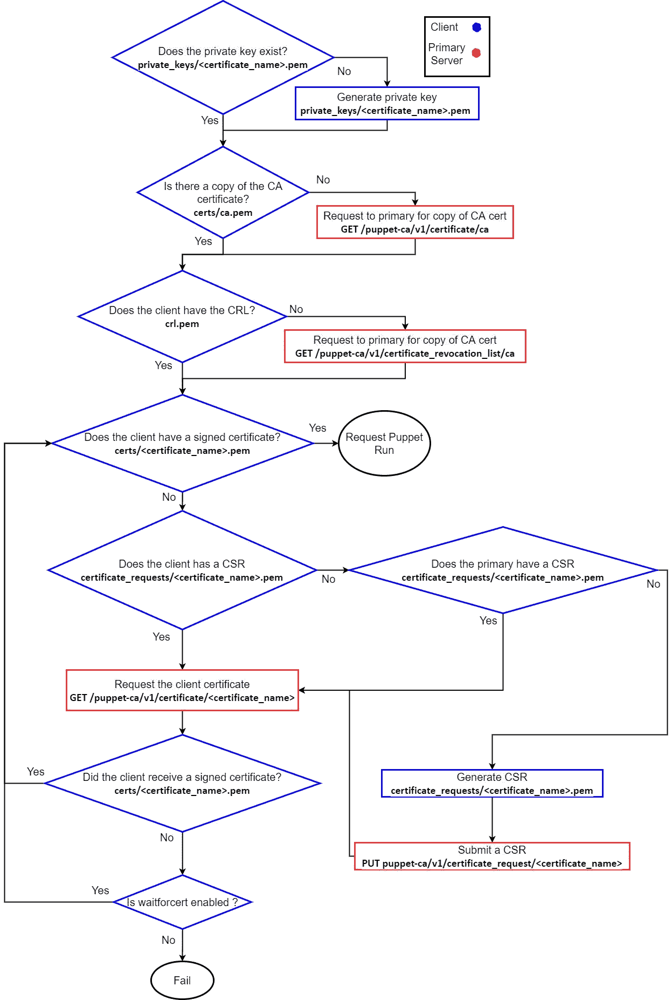

# 10

# Puppet 平台部分和功能

到目前为止，我们讨论了 Puppet 作为一种语言，但在本章及后续章节中，我们将开始关注 Puppet 作为一个平台，以及平台的基础设施和组件。

在 *图 10.1* 中，展示了本章将讨论的 Puppet Server 和 Puppet 客户端服务的完整架构。这些服务专注于如何在服务器上强制执行 Puppet 代码：


图 10.1 – Puppet 服务器和客户端组件

我们将首先强调，在本书中不会详细介绍安装方法。对于开源 Puppet 和 Puppet Enterprise，有几个开源项目可以作为自动化基础；在本书中，我们使用了 `pead` 和 `pecd` 模块作为最自动化的 **Puppet 编辑器**（**PE**）安装机制。随着各组件的讨论，我们还将提到 Puppet 包的版本如何不同，并查看一些相关的安装版本、关键用户、目录、配置文件和已安装的服务。

首先，我们将检查 Puppet Server 提供的核心服务。这些服务包括接收客户端请求的清单编译、处理它们的当前状态，并根据 Puppet 代码确定如何配置它们。**证书授权中心**（**CA**）允许代理安全地注册并与 Puppet 服务器通信。它还包括一些相关的 API 服务，以便访问、请求和控制这些服务。

在了解了服务器的功能后，我们将展示 Puppet agent 如何与服务器通信，请求由 CA 签署密钥，清单编译的通信过程，以及 agent 如何处理并存储返回的清单。

接下来我们将查看 PuppetDB 如何用于存储事实、清单和事件，以及如何通过 **Puppet 查询语言**（**PQL**）和 API 访问这些信息。我们还将研究 PuppetDB 和 PostgreSQL 之间的关系，作为前端应用程序与后端数据库架构的连接，并讨论 Puppet 服务如何直接将其他数据存储在 PostgreSQL 中。

接着将展示如何使用编译服务器水平扩展，以编译数十万台服务器的清单。

在这些主题中，我们将突出 PE 和开源 Puppet 配置之间的细微差异。

本章不涉及与 PE 相关的编排器特性、PE 控制台或支持的架构（这些可以使服务拆分到更具可扩展性的基础设施中）；这些将在 *第十四章* 中讨论。

在本章中，我们将覆盖以下主要内容：

+   Puppet 平台安装和版本控制

+   Puppet 服务器

+   Puppet agent 到 server 的生命周期

+   PuppetDB 和 PostgreSQL

+   使用编译器进行扩展

注意

作为努力从其产品中移除有害术语的一部分，Puppet 放弃了使用*master server*和*compile master*的术语，现在使用*primary server*和*compile server*。由于这些名称已深植人心，某些地方的类或配置设置仍然会提到*master*。

# 技术要求

从[`github.com/puppetlabs/control-repo`](https://github.com/puppetlabs/control-repo)克隆控制库到你的 GitHub 账户，创建一个名为`controlrepo-chapter10`的库。

通过下载[`github.com/PacktPublishing/Puppet-8-for-DevOps-Engineers/blob/main/ch10/params.json`](https://github.com/PacktPublishing/Puppet-8-for-DevOps-Engineers/blob/main/ch10/params.json)中的`params.json`文件，并用你的控制库位置和控制库的 SSH 密钥更新它，来构建一个包含三个编译器和三个客户端的大型集群。然后，从你的`pecdm`目录运行以下命令：

```
bolt --verbose plan run pecdm::provision –-params @params.json
```

# Puppet 平台的安装与版本管理

本书选择不深入探讨 Puppet 的安装方法；对于开源版本的安装说明，几乎没有需要补充的内容，详细内容请见[`puppet.com/docs/puppet/latest/server/install_from_packages.html`](https://puppet.com/docs/puppet/latest/server/install_from_packages.html)，任何进一步的自动化选择都将高度依赖于你组织的使用场景，以及你希望集成的工具和产品集。

对于开源 Puppet，有多个项目可以自动化 Puppet 的部署、配置和集成，比如 example42 的`psick`([`github.com/example42/psick`](https://github.com/example42/psick))或 Foreman 项目([`github.com/theforeman/foreman-installer`](https://github.com/theforeman/foreman-installer))，后者有一个专门用于安装 Puppet Server 的模块([`forge.puppet.com/modules/theforeman/puppet`](https://forge.puppet.com/modules/theforeman/puppet))，即使不使用 Foreman，也可以用来安装 Puppet。类似 PE 设置提供的仪表板也可以在诸如 Puppetboard([`forge.puppet.com/modules/puppet/puppetboard`](https://forge.puppet.com/modules/puppet/puppetboard))或 Puppet Summary([`github.com/skx/puppet-summary`](https://github.com/skx/puppet-summary))等项目中找到。

对于 PE，尽管可以在[`puppet.com/docs/pe/2021.7/installing_pe.html`](https://puppet.com/docs/pe/2021.7/installing_pe.html)找到手动安装说明，但自动化的选择是显而易见的，即使用 Puppet 支持的`peadm`模块；在*第十二章*中，我们将回顾如何在实验中使用该模块，并将`pecdm`作为 Bolt 项目使用。

安装的包中需要注意的关键点是，Puppet 仓库提供了不同版本的 Ruby、OpenSSL、Hiera 和 Facter，以供不同版本的 Puppet 使用，且像 `puppetserver` 这样的包可能与正在安装的 Puppet 版本不匹配——例如，Puppet 7.17 会安装 Puppet Server 版本 7.8；这些关联版本可以在发布说明中找到。对于 PE，你可以在文档中查看所有底层开源包版本，网址为 [`puppet.com/docs/pe/2021.7/component_versions_in_recent_pe_releases.html#component_versions_in_recent_pe_releases`](https://puppet.com/docs/pe/2021.7/component_versions_in_recent_pe_releases.html#component_versions_in_recent_pe_releases)。

# Puppet Server

在 Puppet 的历史版本中，基于 Ruby 的解决方案如 WEBrick 或 Passenger 被用来运行 Puppet 服务，但在所有现代版本的 Puppet 中，为了提高扩展性和性能，Puppet Server 作为一个 Clojure 和 Ruby 应用程序运行在 **Java 虚拟机** (**JVM**) 上。Puppet Server 具有多个相关的服务，这些服务共享状态并在它们之间路由请求。这些服务运行在单一的 JVM 进程中，使用 Trapperkeeper 服务框架，Trapperkeeper 是一个用于托管长时间运行应用程序的 Clojure 框架。

Puppet Server 通过 open source Puppet 中的 `puppetserver` 包和 PE 中的 `pe-puppetserver` 包进行安装。这样会创建一个同名的系统服务，并生成配置文件，默认情况下，这些文件会放置在 `/etc/puppetlabs/puppetserver/conf.d` 目录下，采用 **人类优化配置对象表示法** (**HOCON**) 格式。

注意

Puppet 的 `hocon` 模块是自动化管理 HOCON 文件的最佳方式 ([`forge.puppet.com/modules/puppetlabs/hocon`](https://forge.puppet.com/modules/puppetlabs/hocon))。

接下来，我们将查看构成 Puppet Server 的服务。

## 内嵌 Web 服务器

Puppet 在 JVM 中包含一个基于 Jetty 的 Web 服务器，用于设置挂载点和通信，以便在组件之间进行 Web 请求并访问 API。

`webserver.conf` 文件设置了 Web 服务器的主要配置，如 `web-routes.conf` 文件的位置，后者通过挂载处理程序来设置 Web API 访问的挂载点，如以下示例文件所示：

```
# Configure the mount points for the web apps.
web-router-service: {
    # These two should not be modified because the Puppet 4 agent expects them to
    # be mounted at these specific paths.
    "puppetlabs.services.ca.certificate-authority-service/certificate-authority-service": "/puppet-ca"
    "puppetlabs.services.master.master-service/master-service": "/puppet"
    # This controls the mount point for the Puppet administration API.
    "puppetlabs.services.puppet-admin.puppet-admin-service/puppet-admin-service": "/puppet-admin-api"
}
```

在此文件中列出了客户端与服务器之间通信所需的核心挂载点：

`puppet-ca` 挂载点供客户端与 CA 服务进行通信，并检查或发出 **证书签名请求** (**CSR**)。

+   `master-service` 提供一个挂载点，供客户端通过 JRuby 解释器编译的目录请求。

+   默认情况下，`webserver.conf` 中设置的请求日志记录配置位于 `/etc/puppetlabs/puppetserver/request-logging.xml`，它决定了 HTTP 访问请求的记录方式。默认情况下，消息将被记录到 `/var/log/puppetlabs/puppetserver/puppetserver-access.log`。

本节内容应帮助你了解嵌入式 Web 服务如何在 JVM 中设置 Web 服务器，及其为不同组件的 Puppet Server 请求提供必要的挂载点，并记录这些请求。接下来，我们将查看通过挂载点提供的两个核心 API，分别是通过 `/puppet` 和 `/puppet_ca` 访问的 Puppet API，以及通过 `/puppet_admin_api` 访问的 Admin API。

## Puppet API 服务

Puppet API 服务由嵌入式 Web 服务器创建的两个端点组成——`/puppet` 用于配置相关服务，`/puppet-ca` 用于 CA。

两者都通过如 `/v3` 这样的字符串进行版本控制，授权通过 `auth.conf` 文件控制，该文件是 HOCON 格式的文件。除非需要更高级的访问权限来集成服务，否则你不太可能需要编辑该文件，但为了展示示例内容，以下代码允许 Puppet 节点从 API 请求自己的目录：

```
        {
            # Allow nodes to retrieve their own catalog
            match-request: {
                path: "^/puppet/v3/catalog/([^/]+)$"
                type: regex
                method: [get, post]
            }
            allow: "$1"
            sort-order: 500
            name: "puppetlabs v3 catalog from agents"
        },
```

注意

有关自定义授权的更详细说明，请参见 [`github.com/puppetlabs/trapperkeeper-authorization/blob/main/doc/authorization-config.md`](https://github.com/puppetlabs/trapperkeeper-authorization/blob/main/doc/authorization-config.md)。

所有 Puppet 5 到 8 的现代版本中的 Puppet 代理使用 `/puppet/v3` 端点服务来管理客户端。`v3` API 具有两种类型的端点——**间接指令**和**环境**端点。

间接指令的格式为 `/puppet/v3/<indirection>/<key>?environment=<environment>`。

在这里，间接值是请求的间接指令，键是与调用间接指令相关的键，环境是该请求应该使用的环境。例如，若要请求编译目录，客户端将构建以下内容：

```
/puppet/v3/catalog/pe.example.com?environment=production
```

服务器下`/puppet/v3/`路径下存在以下间接指令：

+   `事实`：`facts` 端点允许为指定的节点名称设置事实

+   `目录`：返回指定节点的目录

+   `节点`：返回节点信息，例如分类

+   `文件桶` `文件`：管理文件桶的内容

+   `文件内容`：返回文件内容，例如模块中的文件

+   `文件元数据`：返回文件的元数据，例如模块中文件的权限

+   `报告`：允许存储节点的 Puppet 报告

服务器下`/puppet/v3/`路径下存在以下间接指令：

+   **环境类**：返回请求环境中可以解析的所有类

+   **环境模块**：返回环境中所有模块的信息，例如它们的名称和版本

+   **静态文件内容**：返回特定版本的文件资源在某个环境中的文件内容

未作为间接指令的独立环境端点允许简单调用 `/puppet/v3/environments`，该调用返回服务器已知的所有环境。在下一章中，我们将更详细地讨论环境。

工具和服务也可以访问这些相同的端点来检查数据，并且存在一个`v4` API，具有一个目录端点，可以更广泛地使用 PuppetDB 来操作事实和目录。它被如 `octocatalog-diff`（[`github.com/github/octocatalog-diff`](https://github.com/github/octocatalog-diff)）等工具使用，这些工具可以生成、比较和操作目录。

`/puppet-ca` 端点采用类似的格式，使用 `v1` 和指令，如下所示：

+   **证书**：返回指定名称的证书

+   **证书清理**：吊销并删除证书

+   **证书状态**：请求证书或 CSR 的状态

+   **证书吊销列表**：请求 **证书吊销列表** (**CRL**) 文件

例如，要请求`server.example.com`的证书，可以访问以下端点：`/puppet-ca/v1/certificate/server.example.com`。

这些操作将在本章的 *CA* 部分进行更详细的讨论。

在本节中，我们没有详细讨论每个端点及其 API 调用，但在本章后面，我们将查看客户端与服务器的生命周期，跟踪调用日志，并强调它们的用途，以展示 Puppet 如何使用这些 API。端点的完整详细信息可以在[`puppet.com/docs/puppet/latest/http_api/http_report.html`](https://puppet.com/docs/puppet/latest/http_api/http_report.html)查看。

## Admin API

Admin API 只有两个端点在 `/puppet_admin/v1/`，如下所示：

+   **环境缓存**：用于清除环境数据的缓存

+   **JRuby 池**：用于清除 JRuby 池或获取正在运行的 JRuby 实例的 Ruby 线程转储

这两个端点用于更深入的开发工作，因此超出了本书的范围，但有助于完整地展示 Puppet 服务器组件。可以在[`puppet.com/docs/puppet/latest/server/admin-api/v1/jruby-pool.html`](https://puppet.com/docs/puppet/latest/server/admin-api/v1/jruby-pool.html)和[`puppet.com/docs/puppet/latest/server/admin-api/v1/environment-cache.html`](https://puppet.com/docs/puppet/latest/server/admin-api/v1/environment-cache.html)查看这些端点的详细信息。

## CA

默认情况下，Puppet 使用其内置的 CA 和 **公钥基础设施** (**PKI**) 来保护所有 SSL 通信。

有两个命令用于与 Puppet CA 设置进行交互——`puppetserver ca` 用于服务器端操作，如签署或吊销证书，`puppet ssl` 用于代理端任务，如请求和下载证书。这些命令通过 CLI 调用 `puppet-ca` 端点。

注意

尽管引入了 `puppet-ca` 端点，之前 `ruby ca` 实现的五个命令在 Puppet 6 之前仍然可用：`puppet certificate`、`puppet cert`、`puppet certificate_request`、`puppet ca` 和 `puppet certificate_revocation_list`。这些命令已被 `puppetserver ca` 和 `puppet ssl` 命令取代。即使你使用的是 Puppet 5，强烈建议不要使用这些 Ruby 命令，因为同时使用 API 和 Ruby 实现可能会破坏 CA。

尽管在介绍中讨论的安装自动化应该涵盖初始设置，但通过运行 `puppetserver ca setup` 检查 CA 设置是否已执行也是值得的。在 `puppetserver/pe-puppetserver` 服务启动之前，它将创建一个单独的根 CA 和一个中间签名 CA。如果在此步骤之前启动了 `puppetserver/pe-puppetserver` 服务，它将创建一个单一的根 CA 和签名 CA，这是 Puppet 以前的操作方式。除非有特定需求使用单一证书，否则应避免此情况。从 PE 2019.x 和 Puppet 6.x 开始，这些证书的有效期为 15 年；之前为 5 年，而且需要理解的是，升级 Puppet 版本并不会延长 CA 的有效期。

注意

通过 `ca_extend` 模块可以扩展过期的 CA（[`forge.puppet.com/modules/puppetlabs/ca_extend`](https://forge.puppet.com/modules/puppetlabs/ca_extend)）。

在此步骤中创建的密钥和证书将保存在一个名为 `/etc/puppetlabs/puppetserver/ca` 的目录中（适用于 Puppet 7 及以上版本），或者保存在 `/etc/puppetlabs/puppet/ca` 目录中（适用于 Puppet 6 及以下版本）。为了避免混淆，新的目录位置下会有一个指向 `/etc/puppetlabs/puppet/ca` 的路径。该目录将包含以下内容：

+   `ca_crl.pem`：CRL 文件

+   `ca_crt.pem`：CA 签名的证书公钥

+   `ca_key.pem`：CA 私钥

+   `ca_pub.pem`：CA 公钥

+   `inventory.txt`：CA 签名的证书列表，包括其序列号和到期日期

+   `requests`：未签名的 CSR 文件

+   `root_key.pem`：如果使用单独的根 CA 和中间 CA，这是用于签署 CA 证书的根密钥

+   `serial`：此文件包含证书新序列号的递增计数器

+   `signed`：此文件夹包含所有已签名的 CSR 文件

除了这些文件外，还可以维护基础设施 CRL，默认情况下，开源 Puppet 不使用该 CRL，但 PE 使用该 CRL。为了保持较小的 CRL，`infra_inventory.txt` 文件用于管理 Puppet 基础设施服务器；当被吊销时，这些系统会被添加到`infra_crl.pem`中。通过在`puppet.conf`文件中将`infra certificate-authority.enable-infra-crl`设置为`true`，可以启用此功能。我们将在本章后续部分详细讨论`puppet.conf`文件。此方法意味着 Puppet 客户端只需要接收较小的基础设施 CRL，这对于有大量服务器更替的环境非常重要。将维护以下文件：

+   `Infra_inventory.txt`：CA 为基础设施服务器签名的证书列表

+   `Infra_serials`：此文件包含基础设施服务器新序列号的递增计数器

+   `Infra_crl.pem`：基础设施服务器的 CRL

如果您的组织需要使用外部 CA，可以使用组织自己的根 CA，并通过`puppetserver ca import`命令导入它（完整过程请参考[`puppet.com/docs/puppet/latest/server/intermediate_ca.html`](https://puppet.com/docs/puppet/latest/server/intermediate_ca.html)），让 Puppet 充当中间 CA。或者，可以通过部署一个单独的外部生成的根 CA 和签名 CA 来禁用 CA 服务，详细说明请参见[`puppet.com/docs/puppet/latest/config_ssl_external_ca.html`](https://puppet.com/docs/puppet/latest/config_ssl_external_ca.html)。本书不推荐使用此方法，因为它需要自动化证书分发，而 Puppet 服务不再执行此操作。

当代理向 CA 发出请求时，CSR 会被发送，默认情况下，签名策略需要等待手动签名，CSR 存储在`requests`文件夹中。待签名的请求可以通过运行`puppetserver ca list`进行查看，然后通过运行`puppetserver ca sign --certname < certname to sign >`进行签名。所有已签名的证书可以通过运行`puppetserver ca list --all`来查看。

如果您使用 PE，可以在 PE Web 控制台上执行和查看证书签名，如*图 10.2*所示：


图 10.2 – PE 控制台证书签名

可以使用`puppetserver ca revoke --certname < certname to revoke >`命令吊销证书，并且可以运行`puppetserver ca clean --certname < revoked certname >`来清理并从 CA 中删除被吊销的证书。

在使用手动自动签名的工作流中，像 VMware 的**vRealize Orchestrator**（**VRO**）这样的工具通常会在部署和退役服务器时调用 CA API。

为了自动化此过程，可以通过三种方式配置自动签名。将 `autosign = true` 添加到 `puppet.conf` 的 `master` 部分时，该更改会导致 CA 签署任何请求，但绝不应在生产环境中使用。

第二种方法是在 `/etc/puppetlabs/puppet/autosign.conf` 创建一个 `autosign.conf` 文件。在此文件中，可以包含服务器名称或域名通配符，每一行代表一个可以自动签名的节点名称或域名。例如，假设文件内容如下：

```
server1.puppet.com
*.example.com
```

这意味着 `server1.puppet.com` 和 `example.com` 域中的任何服务器都会被自动签名。

第三种方法是将 `autosign` 值设置为 `puppet.conf` 文件中的一个脚本。该脚本可以是任何语言编写的，并且将接收证书名称作为第一个参数，然后将 CSR 内容作为标准输入。脚本应以零返回码结束以进行签名，或者以非零返回码结束以不进行签名。这导致了一个常见的方法，即在 CSR 中包含一个用于检查的秘密，或者在公共云中使用标签。讨论编写这些脚本超出了本书的范围，尽管 Puppet 只提供了如何构建这些脚本的说明，地址为 [`puppet.com/docs/puppet/latest/ssl_autosign.html#ssl_policy_based_autosigning`](https://puppet.com/docs/puppet/latest/ssl_autosign.html#ssl_policy_based_autosigning)，而亚马逊在 [`aws.amazon.com/blogs/mt/aws-opsworks-puppet-enterprise-and-an-alternate-implementation-for-policy-based-auto-signing/`](https://aws.amazon.com/blogs/mt/aws-opsworks-puppet-enterprise-and-an-alternate-implementation-for-policy-based-auto-signing/) 提供了一个很好的示例。

本节已阐述了如何配置 CA 并将其作为 Puppet 服务器运行。本章稍后将回顾代理的完整生命周期，展示客户端如何创建 CSR 并使用 CA 完成 Puppet Server 提供的服务，并查看 JRuby 解释器。

## JRuby 解释器

JRuby 是 Ruby 的 Java 实现，允许在 JVM 上使用 Ruby；这比传统的 Ruby 部署（如 Ruby on Rails）具有更好的可扩展性，因为大多数 Ruby 解释器不支持线程安全，且使用锁来一次运行一个线程。Puppet Server 拥有一个 JRuby 解释器/实例池，这些实例可以执行各种应用程序工作，如编译目录和处理报告。池中的解释器数量反映了可以同时运行的 Ruby 应用程序操作的数量，可以通过 `puppetserver.conf` 文件中的 `max-active-instances` 参数配置，或通过控制台中的 Hiera 在 PE 中配置，或通过 `puppet_enterprise::master::puppetserver::jruby_max_active_instances` 在代码中配置。我们将在 *第十三章* 中更详细地讨论这一点，届时我们将讨论用于审查和设置此大小的度量标准和工具。

在讨论完 Puppet Server 的组件后，我们将查看诸如用户、日志记录和文件系统等配置，以了解这些服务可以如何定制以及它们的要求。

## Puppet Server 的配置和日志

我们在讨论每个组件时简要提到了某些配置文件和可用设置，但我们将在此总结。对于大多数配置文件，通常不需要进行自定义，大多数默认设置就能满足您的要求。

对于 PE，`pe-puppetserver` Puppet Server 服务将在 `pe-puppet` 账户下运行，而在开源 Puppet 上，`puppetserver` 服务将在 `puppet` 账户下运行。在这两个账户中，它们将设置 `nologin` shell，以便用户仅提供一个账户来运行服务并拥有服务相关的文件。

以下配置文件和应用目录将被创建并使用：

+   `/etc/puppetlabs/puppetserver/bootstrap.cfg`：此文件包含 Trapperkeeper 应启动的服务列表；这些是由嵌入式 Web 服务器挂载的处理程序。

+   `/etc/puppetlabs/puppetserver/request-logging.xml`：定义 HTTP 访问请求如何被记录的文件。

+   `/etc/puppetlabs/puppetserver/conf.d`：此目录包含以下主要的 HOCON 格式配置文件：

    +   `global.conf`：此文件为 Puppet 设置全局配置，默认仅包含日志配置文件的位置。

    +   `webserver.conf`：此文件配置嵌入式 Web 服务器的细节，如端口和日志记录。

    +   `web-routes.conf`：此文件为 Puppet 的 Web 服务设置挂载点。

    +   `puppetserver.conf`：此文件设置核心 Puppet Server 应用程序的配置，例如正在运行的 `jruby` 实例数量。

    +   `auth.conf`：此文件设置由 `web-routes.conf` 挂载的端点的访问权限。

    +   `ca.conf`：此文件配置 CA 的设置。

    +   `products.conf`：一个可选文件，可以设置产品设置，如分析数据和更新检查。

+   `/etc/puppetlabs/puppetserver/ssl/ca`：与 Puppet CA 相关的证书和密钥（在 Puppet 6 及以下版本中为 `/etc/puppetlabs/puppet/ssl/ca`）。

+   `/opt/puppetlabs/puppet/lib/ruby/vendor_gems`：Puppet Server 将与 CA 操作相关的 Ruby gems 放置在此目录中。

+   `/opt/puppetlabs/server`：此目录包含用于运行 Puppet Server 的 `JRuby-gems` 和二进制文件。

+   `/var/run/puppetlabs/puppetserver/puppetserver.pid`：此文件包含正在运行的 Puppet 进程的 PID。

+   `/etc/puppetlabs/puppet.conf`：此文件包含主机上 Puppet 客户端和 Puppet Server 的配置。可以通过运行 `puppet` `config print` 查看这些设置。

文件中的绝大多数设置将使用默认值，除非需要外部集成，如外部根 CA 等，这些设置只作为参考来帮助理解 Puppet 的配置。有关设置的完整参考和选项，可以在[`puppet.com/docs/puppet/latest/server/configuration.html`](https://puppet.com/docs/puppet/latest/server/configuration.html)查看`/etc/puppetlab/puppetserver`基础设置。

注意

如果您选择了引言中提到的某个开源 Puppet 自动化工具/模块，它可能在安装时允许设置配置值。

PE 用户应注意，由于配置的自动化程度较高，许多设置（例如`puppetserver.conf`中的设置）是通过 Hiera 配置的，应遵循[`puppet.com/docs/pe/2021.7/config_puppetserver.html`](https://puppet.com/docs/pe/2021.7/config_puppetserver.html)中的文档进行配置。

调整这些设置的配置将在*第十三章*中详细讨论。

`/etc/puppetlabs/puppet.conf`的完整设置选项可以在[`www.puppet.com/docs/puppet/latest/config_file_main.html`](https://www.puppet.com/docs/puppet/latest/config_file_main.html)查看；该文件本身提供了配置 Puppet 服务器、Puppet 代理，以及`puppet apply`运行方式的各个部分。各部分包括`main`（提供默认值）、`agent`（为 Puppet 客户端提供设置）、`user`（提供使用 Puppet `apply`时的设置），以及`master`/`server`（用于将设置应用于 Puppet 服务器）。

自 Puppet 6 版本以来，已可以使用`server`部分代替`master`部分，但许多自动化工具尚未跟进这一变化，由于它们不是可互换的术语，且可能会引起混淆，因此请小心，仅使用与您的实现相关的术语。

Puppet 首先应用来自`master`/`server`、`apply`或`agent`部分的设置，然后回退到`main`部分，如果找不到设置，则会使用默认值。

让我们看一下在`peadm`构建的 Puppet 实验室服务器上某个文件的示例内容：

```
[master]
node_terminus = classifier
storeconfigs = true
storeconfigs_backend = puppetdb
reports = puppetdb
certname = pe-server-davidsand-0-cffe02.tq2kpafq5bsehkpub4ur5a35ya.xx.internal.cloudapp.net
```

方括号表示一个部分的名称，后面跟着一组键值对。这里的设置展示了我们 Puppet 服务器的证书名称（`certname`），还表明它通过`reports`设置将报告发送到 PuppetDB，设置为`storeconfigs=true`时，它会存储目录、节点和事实信息，这些信息将存储在 PuppetDB 中，并且`storeconfigs_backend`设置为 PuppetDB。最后，`node_terminus`设置为`classifier`，这反映了主服务器应如何分类客户端。这个内容将在下一章中详细讨论。

查看和操作设置（包括`puppet.conf`中未设置的默认值）最好的方法是使用`puppet` `config`命令，它可以显示所有设置。通过运行`puppet config print all known`，设置将被打印出来，或者可以通过详细说明部分和要打印的值来打印单个设置，命令为`puppet config print` `--section` `master` `certname`。`puppet` `config`命令还可以使用`set`或`delete`选项添加或删除值，并选择一个部分键和值来执行操作。例如，以下命令将从`master`部分删除`storeconfigs`并将证书名称更改为`newname.example.com`：

```
puppet config delete --section master storeconfigs
puppet config add --section master certname newname.example.com
```

这些命令将在文件中没有相应部分时自动添加该部分，但 Puppet 服务需要重启以使任何更改生效。

在下一部分我们将通过更多示例操作`puppet.conf`文件，查看代理生命周期，但`puppet.conf`文件的完整选项和语法可以查看[`puppet.com/docs/puppet/latest/config_file_main.html`](https://puppet.com/docs/puppet/latest/config_file_main.html)。

默认情况下，Puppet 服务器会将日志保存在`/var/log/puppetlabs/puppetserver`下的以下文件中：

+   `Puppetserver.log`：这是记录主要服务器活动（如编译错误和警告）日志的地方。

+   `Puppetserver-access.log`：这是记录对 HTTP 端点的请求的地方。

+   `Puppetserver_gc.log`：这是收集垃圾回收日志的地方。

现在我们已经全面回顾了 Puppet 服务器组件，接下来我们将查看 Puppet 代理的配置和生命周期，了解这些服务如何被客户端使用，以及如何监控和查看一个周期的日志。

# Puppet 代理到服务器的生命周期。

本节将讨论 Puppet 代理如何向我们运行的 Puppet 服务器组件发出请求，以及它在请求配置以强制执行时如何确保其通信安全。需要注意的是，Puppet 服务器本身也包含 Puppet 代理。

Puppet 代理的安装详细信息请参见[`puppet.com/docs/puppet/latest/install_agents.html#install_agents`](https://puppet.com/docs/puppet/latest/install_agents.html#install_agents)（开源）和[`puppet.com/docs/pe/2021.7/installing_agents.html#installing_agents`](https://puppet.com/docs/pe/2021.7/installing_agents.html#installing_agents)（PE）。将此安装与服务器部署工作流集成，并确保将必要的配置放置在`/etc/puppetlab/puppet.conf`中，对于自动化至关重要。

注意

`puppet_conf`模块提供了管理 Puppet 配置文件的任务（[`forge.puppet.com/modules/puppetlabs/puppet_conf`](https://forge.puppet.com/modules/puppetlabs/puppet_conf)）。

大多数设置将取决于你的环境配置，但对于大多数环境，默认设置将会被采用，关键设置是确保在`agent`部分的服务器设置已正确配置，以便代理知道应联系哪个 Puppet 服务器——开源 Puppet 或 PE-Puppet。然后可以在 root 用户下启动 PE 服务。默认情况下，这将每 30 分钟联系一次 Puppet 服务器，或者可以通过运行`puppet agent -t`命令手动触发。

*图 10.3* 显示了该 Puppet 证书过程的工作流，客户端确保其拥有签名的 SSL 证书以确保与 Puppet 服务器的安全通信：



图 10.3 – Puppet 客户端证书工作流

第一步是验证证书。在`ssl`目录`/etc/puppetlabs/puppet/ssl`中，以下文件将已经存在或在此过程中创建：

+   `private_keys/<certificate_name>.pem`：用于创建 CSR 的私钥

+   `certs/<certificate_name>.pem`：返回的为该客户端签署的证书

+   `certs/ca.pem`：从 Puppet 服务器发送的 CA 证书副本

+   `crl.pem`：来自 Puppet 服务器的 CRL

+   `certificate_requests/<certificate_name>.pem`：将发送到 Puppet 服务器的 CSR，在收到签署的证书后将被删除

除了此目录，还可以创建一个`/etc/puppetlabs/puppet/csr_attributes.yaml`文件，并在其中包含将被包含在 CSR 中的受信事实。这将导致在 Puppet 服务器签署 CSR 时，受信事实被包含在客户端的证书中。

使用受信事实可以确保硬性分类信息不会被更改，例如将生产服务器重新分类为开发环境，或更改角色，因为这两者都可能导致安全性降低。**组织 ID**（**OID**）号码转换为名称，可以在[`puppet.com/docs/puppet/latest/ssl_attributes_extensions.html`](https://puppet.com/docs/puppet/latest/ssl_attributes_extensions.html)查看。此文件必须在创建 CSR 之前存在；否则，唯一的方法是重新开始来更改 CSR 或证书。

如*图 10.3*所示，如果私钥不存在，客户端会在检查本地的`ca.pem`和`CRL.pem`副本之前，先生成一个新的密钥，并向服务器发起请求，若这两者中的任何一个不存在，则进行下载。接下来，客户端会检查是否存在已签名的证书，如果没有，则向客户端请求该证书。如果存在已签名的客户端证书，客户端可以继续请求节点数据；否则，客户端会创建一个 CSR 文件并将其发送到主服务器。如果在`puppet.conf`中启用了`waitcert`设置，客户端将等待 CSR 由服务器签名，并每 2 分钟检查一次主服务器的状态。在未来的运行中，客户端会向服务器提供其已签名的证书，以证明其身份。

在确保了安全通信之后，第一步是从服务器到客户端执行插件同步，确保所有的事实、功能、资源类型、资源提供者和 Augeas 镜头都通过`file_metadata`端点下载到客户端。

一旦完成此步骤，客户端运行`facter`，将输出发送到 Puppet 客户端，并通过`\catalog`端点向 Puppet 服务器请求目录。该目录的副本将存储在客户端的`cache`目录中（通过在`puppet.conf`中配置`vardir`参数）。默认情况下，路径为`%PROGRAMDATA%\PuppetLabs\puppet\cache\client_data\catalog\<certname>.json`。(`PROGRAMDATA`通常是`C:\Program Data\`，在 Linux 和 Unix 系统上为`/opt/puppetlabs/puppet/cache/client_data/catalog/<certname>.json`。）客户端接收此目录并执行步骤，强制执行 Puppet 代码中描述的状态，或者如果客户端设置为以无操作模式运行，则模拟该目录。客户端生成报告，并默认通过`report`端点将其发送回 Puppet 服务器。此操作可以配置为将报告发送到其他报告处理器，例如 Splunk，这将在*第十三章*中讨论。

除了`client_data`文件夹中的目录外，还会在`cache`目录中生成其他几个用于调查的有用文件：

+   `lib`：这是由插件同步从主服务器同步的各种插件的缓存。

+   `facter`：此文件将包含自定义事实。

+   `facts.d`：在这里，外部事实由插件同步从主服务器缓存。

+   `reports`：包含最后生成的报告文件。

+   `state`：此目录包含与先前 Puppet 运行状态相关的文件和目录：

    +   `classes.txt`：列出上次应用的目录中包含的类。

    +   `graphs`：如果在 Puppet 运行期间使用了`graph`选项，生成的资源和依赖关系的.dot 图形文件将保存在这里。

    +   `last_run_report.yaml`：这是一个完整的报告，列出所有资源以及它们在目录强制执行期间如何被检查或更改。

    +   `resources.txt`：上次应用的目录中包含的资源列表

    +   `state.yaml`：所有资源的列表及其上次检查或同步的时间，用于诸如`audit`等功能

一些目录和文件已被忽略，因为它们要么是为了遗留目的，要么是为了本书不推荐的做法，例如`filebucket`。完整列表请参见[`puppet.com/docs/puppet/latest/dirs_vardir.html`](https://puppet.com/docs/puppet/latest/dirs_vardir.html)。

注意

如果客户端与 Puppet 基础设施失去连接，缓存的目录将用于确保继续执行其最后已知的状态。

代理到服务器的最后一步是将事件报告发送到 Puppet Server。这些报告将反映目录中每个资源的事件。这些事件可能具有以下状态之一：

+   失败 – 这是一个应用目录时出错的事件，或是如依赖关系问题或该特定资源的问题

+   修正 – 资源在上次运行时是正确的，但必须修正

+   有意的 – 资源必须创建或修正，但在上次运行时状态不正确

+   未更改 – 资源处于正确状态，无需更改

默认情况下，未更改的事件不会在 Puppet 8 中报告。此更改是为了减少存储报告所需的存储空间。可以通过在每个代理的`puppet.conf`文件中设置`exclude_unchanged_resources=false`来更改此设置。

报告事件还将反映客户端代理运行的模式，或资源是否设置为与客户端的应用方式不同。尽管相同的事件状态仍然适用，但每个事件将报告该事件是在执行模式下发生，还是在无操作模式下发生。如在*第三章*中所讨论的，*无操作模式*意味着资源只是有效地测试，看资源是否需要更改以符合声明的状态。在*第十五章*中，我们将讨论如何在遗留环境中使用此方法，查看配置漂移的大小，并选择逐步的方法，以避免在生产系统中造成问题。

关于访问这些报告，我们将在*第十三章*中看到如何使用报告处理器将其发送到第三方工具，并在*第十四章*中看到 Puppet Enterprise 如何作为其图形控制台的一部分提供事件查看器界面。

## 实验室 – 监控证书签名日志

为了更好地理解这个过程，我们将描述如何通过删除节点的证书并重新注册来监控 Puppet 运行的过程。在注册过程中，我们将监控日志以查看此过程中的 API 请求，并记录过程步骤。以下是步骤：

1.  打开 SSH 终端会话到 Linux 客户端，并为主 Puppet 服务器打开两个独立的 SSH 终端会话。

1.  在 Linux 客户端上，运行以下命令：

    ```
    puppet ssl clean
    ```

1.  在其中一个服务器会话中，运行`puppetserver ca clean --certname <实例名称>`（请注意，这应该是证书名称，可以通过在节点上运行`puppet config print certname`来检查）。

1.  在 Linux 客户端上，使用以下命令将`ssl`目录移动到备份位置：

    ```
    mv /etc/puppetlabs/puppet/ssl /etc/puppetlabs/puppet/ssl.old
    ```

1.  在其中一个 Puppet 服务器会话中，运行`tail -f /var/log/puppetlabs/puppetserver/puppetserver-access.log`，而在另一个会话中，运行`tail -f /var/log/puppetlabs/puppetserver/puppetserver.log`。

1.  在节点上运行`puppet agent -t`并查看 Puppet 服务器会话中的调用。

1.  在 Web 控制台中，使用客户端上的`puppet agent –t`。注意服务器中的`access.log`和`puppetserver.log`文件中的新调用，并了解这些如何与本节中讨论的步骤相关。

1.  查看为客户端接收到的目录，并检查缓存中的其他文件。

提示

使用像`jq`这样的工具可以使查看 JSON 更加轻松 ([`stedolan.github.io/jq/download/`](https://stedolan.github.io/jq/download/))。

要查看此实验的日志输出示例，请参见以下文件：

[`github.com/PacktPublishing/Puppet-8-for-DevOps-Engineers/blob/main/ch10/puppet_access_log_extract`](https://github.com/PacktPublishing/Puppet-8-for-DevOps-Engineers/blob/main/ch10/puppet_access_log_extract) 显示了带有注释的访问日志，解释了输出内容

[`github.com/PacktPublishing/Puppet-8-for-DevOps-Engineers/blob/main/ch10/puppet_server_log_extract`](https://github.com/PacktPublishing/Puppet-8-for-DevOps-Engineers/blob/main/ch10/puppet_server_log_extract) 显示了 Puppet 服务器日志，带有注释，解释了输出内容

[`github.com/PacktPublishing/Puppet-8-for-DevOps-Engineers/blob/main/ch10/puppet_client_terminal.txt`](https://github.com/PacktPublishing/Puppet-8-for-DevOps-Engineers/blob/main/ch10/puppet_client_terminal.txt) 显示了客户端终端和输入的命令

[`github.com/PacktPublishing/Puppet-8-for-DevOps-Engineers/blob/main/ch10/puppet_server_terminal.txt`](https://github.com/PacktPublishing/Puppet-8-for-DevOps-Engineers/blob/main/ch10/puppet_server_terminal.txt) 显示了服务器终端和输入的命令

# PuppetDB 和 PostgreSQL

PuppetDB 允许收集 Puppet 数据和一些高级功能，如导出的资源。在开源 Puppet 中，它是完全可选的，而 PE 默认安装 PuppetDB。以下是 PuppetDB 保存的内容：

+   来自节点的最后事实

+   为每个节点编译的最后一个目录

+   每个节点的事件报告默认为 14 天

+   导出的资源

PuppetDB 是一个运行在 JVM 上的 Clojure 前端应用程序，使用 PostgreSQL 作为后端数据库。这种常见架构是后端数据库只提供表格，而前端数据库包含应用程序对象，相较于单一数据库，这具有一些关键优势。它简化了 PuppetDB 的更新过程，因为实际数据可以保留在后端表中，并且它还允许良好的可扩展性——正如我们将在本章的最后一节中看到的，*通过编译器扩展*——PuppetDB 可以通过在多个编译服务器上运行 PuppetDB 进行水平扩展，从而减轻主服务器 PuppetDB 服务的负载。

有关 PuppetDB 安装和配置的信息，请参阅[`forge.puppet.com/modules/puppetlabs/puppetdb`](https://forge.puppet.com/modules/puppetlabs/puppetdb)。PuppetDB 可能会包含在您选择的任何自动化工具中，并且是 PE 的一部分。

PostgreSQL 为 PE 创建一个`pe-postgres`用户，或为开源 Puppet 创建一个`postgres`用户，该用户用于运行 PostgreSQL 数据库。此用户将使用`nologin`shell 并拥有运行 Postgres 所需的相关文件。PostgreSQL 使用以下目录：

+   `/opt/puppetlabs/server/apps/postgresql/{version}`：用于安装数据库应用程序

+   `/opt/puppetlabs/server/data/postgresql/{version}`：用于存储数据库的数据文件

+   `/var/log/puppetlabs/postgresql/{version}`：用于存储数据库的日志

PuppetDB 为 PE 创建一个`pe-puppetdb`用户，或为开源 Puppet 创建一个`puppetdb`用户，该用户用于在`nologin`shell 下运行 PuppetDB 数据库，并拥有运行 PuppetDB 所需的相关文件。由于 PuppetDB 是一个运行在 JVM 上的 Clojure 应用程序；它在结构上与 Puppet Web 服务器非常相似，具有挂载在`/pdb`端点的处理程序，并且通过`auth.conf`文件定义谁可以访问此端点。PuppetDB 使用以下目录，并突出显示了一些关键文件：

+   `/etc/puppetlabs/puppetdb`：此目录包含 PuppetDB 的配置文件，包括以下内容：

    +   `bootstrap.conf`：`bootstrap.conf`文件列出了应在 Trapperkeeper 框架中启动的服务

+   `/etc/puppetlabs/puppetdb/conf.d`：此目录包含`ini`格式的配置文件：

    +   `auth.conf`：配置谁可以访问已公开的端点

    +   `routing.ini`：配置哪些处理程序应在端点处公开

+   `/opt/puppetlabs/server/apps/puppetdb`：此目录包含 PuppetDB 的应用程序二进制文件

+   `/opt/puppetlabs/server/data/puppetdb`：此目录包含 PuppetDB 的数据

本书的范围不包括深入探讨`PuppetDB`的配置，但你可以参考[`puppet.com/docs/puppetdb/latest/configure.html`](https://puppet.com/docs/puppetdb/latest/configure.html)获取更多信息。然而，在*第十三章*中，我们将更深入地探讨如何监控、审查和优化 PuppetDB 和 PostgreSQL 性能，以及如何使用像[`forge.puppet.com/modules/puppetlabs/pe_databases`](https://forge.puppet.com/modules/puppetlabs/pe_databases)这样的模块来帮助维护。

目前，我们将回顾如何通过 PQL 和 HTTP 调用访问数据，使用`/pdb`端点，或者通过`puppet query`命令行调用端点。

注意

**抽象语法树**（**AST**）查询语言也可以作为查询格式使用。然而，随着 PQL 的使用，它现在几乎没有用处，但可以通过[`www.puppet.com/docs/puppetdb/8/api/query/v4/ast.html`](https://www.puppet.com/docs/puppetdb/8/api/query/v4/ast.html)查看。

PuppetDB 被结构化为多个实体，以便访问不同类型的数据。以下是每个实体的列表以及它所包含的端点简要描述：

+   `aggregate_event_counts`：`event_counts`实体的汇总计数

+   `catalogs`：每个节点存储的目录

+   `edges`：边是目录中关系信息，如*包含*或*依赖*

+   `environments`：PuppetDB 已知的环境

+   `event_counts`：报告中关于各个资源的事件计数

+   `events`：事件反映了报告中执行的资源操作

+   `facts`：每个节点返回的事实

+   `fact_contents`：此实体结构化为更方便地访问事实内容

+   `fact_names`：所有已知的事实名称

+   `fact_paths`：类似于`fact_names`实体，但为结构化事实提供了进一步的粒度

+   `nodes`：节点信息

+   `producers`：生成器是编译目录并发送报告的服务器

+   `reports`：报告包含应用目录的结果

+   `resources`：目录中的资源信息

要开始查看 PQL 查询，最简单的方式是返回实体中的所有数据。这可以通过简单列出实体名称和空的大括号来完成。例如，要返回所有节点数据，可以使用`nodes {}`；要在大括号中查找具有特定参数的节点，使用属性名称及其应等于（`=`）、包含（`~`）、小于（`<`）或大于（`>`）的值。例如，要返回最后报告状态未改变的节点，查询为`nodes { latest_report_status = "``unchanged"}`。

我们不会列出这些查询的输出，因为它们可能非常冗长，但你将在本节末尝试在实验中制作一些示例。

这些属性语句可以通过 `!` 进一步否定，使用 `and`/`or` 链接，并用括号 `()` 括起来以包含不同的语句。例如，要进行更复杂的查询，查找某个文件是否以错误的权限声明，我们可以运行此 PQL 查询：

```
resources { (type = "File" and title = "/etc/motd") and ! ( parameters.mode = "0644" and parameters.owner ="root") }
```

在命令行中，这也可以通过 `puppet query resource {'latest_report_status = "``unchanged"}'` 来运行。

PuppetDB 查询还可以在 Puppet 代码中使用 PuppetDB 函数。以下是一个示例：

```
$changed_nodes = puppetdb_query(node[certname]{ resource {'latest_report_status = "unchanged"}}) .map |$value| { $value["certname"] }
notify {"Nodes changed":
    message => "The following nodes changed on their last run ${join($changed_nodes, ', ')}",
}
```

在所有这些示例中，假设证书已经设置，以便通过 Puppet 基础设施或运行查询的客户端进行安全的 SSL 通信。如果使用默认位置，`puppet query` 命令会自动拾取证书，但也可以像这样进行设置：

```
puppet query '<PQL query>' \
  --urls https://puppetdb.example.com:8081 \
  --cacert /etc/puppetlabs/puppet/ssl/certs/ca.pem \
  --cert /etc/puppetlabs/puppet/ssl/certs/<certname_of_local_host>..pem \
  --key /etc/puppetlabs/puppet/ssl/private_keys/<certname_of_local_host>..pem
```

Web 点也可以通过 `curl` 或等效的命令访问，如下所示：

```
curl -X GET <fqdn_of_puppetDB_host>https://<fqdn_of_puppetDB_host>:8081/pdb/query/v4\
  --tlsv1 \
  --cacert /etc/puppetlabs/puppet/ssl/certs/ca.pem \
  --cert /etc/puppetlabs/puppet/ssl/certs/<certname_of_local_host>.pem \
  --key /etc/puppetlabs/puppet/ssl/private_keys/<cert_name_of_local_host.pem \
  --data-urlencode 'query=<PQL query>'
```

为了允许从桌面或其他节点直接进行查询，可以使用 Puppet 客户端工具。关于在 Open Source Puppet 上安装的设置说明详见[`puppet.com/docs/puppetdb/latest/pdb_client_tools.html`](https://puppet.com/docs/puppetdb/latest/pdb_client_tools.html)，而 Puppet Enterprise 的安装说明可参考[`www.puppet.com/docs/pe/2021.7/installing_pe_client_tools.html`](https://www.puppet.com/docs/pe/2021.7/installing_pe_client_tools.html)。

另外，可以通过按照[`puppet.com/docs/puppetdb/latest/configure.html#jetty-http-settings`](https://puppet.com/docs/puppetdb/latest/configure.html#jetty-http-settings)中的说明，禁用 SSL 身份验证，以允许未经身份验证的查询。本书强烈建议不要这样做，因为这会使网络上的任何人都能访问数据。

在本节中，我们展示了一些可以与 PQL 一起使用的实体和查询。虽然逐一列举这些实体的所有可能选项以及 PQL 可用的选项范围是不现实的，但完整的详细信息可以在文档中查看：[`puppet.com/docs/puppetdb/latest/api/query/v4/entities.html`](https://puppet.com/docs/puppetdb/latest/api/query/v4/entities.html)。此外，更多的 PQL 查询示例可以在文档中查看：[`puppet.com/docs/puppetdb/latest/api/query/examples-pql.html`](https://puppet.com/docs/puppetdb/latest/api/query/examples-pql.html)，而 Vox Pupuli 社区正在其网页上建立有用的示例，网址为[`voxpupuli.org/docs/pql_queries/`](https://voxpupuli.org/docs/pql_queries/)。

## 实验 – 查询 PuppetDB

SSH 连接到主服务器并查询 PuppetDB 获取以下信息：

+   列出所有编译器服务器的内存大小（*提示*：编译器服务器都有一个受信任的事实，Facter 也有内存事实）。

+   列出在 Puppet 服务器上强制执行的所有服务。

+   列出每个服务器最新报告的开始和结束时间。

示例答案可以在[`github.com/PacktPublishing/Puppet-8-for-DevOps-Engineers/blob/main/ch10/PQL_samples_answers.txt`](https://github.com/PacktPublishing/Puppet-8-for-DevOps-Engineers/blob/main/ch10/PQL_samples_answers.txt)找到。

注意

在大规模生产系统中使用这些查询时要小心；某些端点（如报告）可能包含大量数据，查询可能会给系统带来很大压力和负载。

# 使用编译器进行扩展

1.  到目前为止，Puppet 平台组件的回顾假设所有组件都位于单一的主服务器上。然而，随着托管节点数量的增加，单一服务器处理这些节点变得不切实际。根据 Puppet 的文档，默认设置下，主服务器最多可以管理 2,500 个客户端。为了处理日益增长的节点数量，Puppet 采用了水平扩展，使用了 Puppet 编译服务器。在*图 10.4*中，显示了一部分主服务被移到编译服务器上。这些服务器可以在客户端的配置文件中配置为轮询选择，或放置在负载均衡器后面。这使得多个节点可以协同工作来编译目录，同时仍然允许某些服务在主服务器上运行。根据 Puppet 的文档，在默认的编译器设置下，每个编译器最多可以服务 3,000 个客户端：


图 10.4 – Puppet 编译器服务

编译服务器托管着主服务器上存在的一部分服务，例如 Puppet Server 和 PuppetDB。这使得能够远程完成和同步目录编译请求，从而增加了编译目录所需的 JRuby 实例数量。

1.  将客户端请求指向编译服务器的最常用方法是利用硬件或基于云的负载均衡器。由于有多种负载均衡器可供选择，Puppet 并未提供明确的配置指导。然而，它建议使用`/status/v1/simple`端点来检查编译服务器的健康状况。如果负载均衡器不支持 HTTP 健康检查，可以检查主机是否在端口`8140`上侦听 TCP 连接，这可以提供有限的检查。

1.  还有一些替代负载均衡器的方法，例如使用 DNS SRV 记录，详细信息可以参考[`puppet.com/docs/puppet/latest/server/scaling_puppet_server.html#using-dns-srv-records`](https://puppet.com/docs/puppet/latest/server/scaling_puppet_server.html#using-dns-srv-records)，或者使用具有轮询设置的 DNS 条目，详细信息可以参考[`puppet.com/docs/puppet/latest/server/scaling_puppet_server.html#using-round-robin-dns`](https://puppet.com/docs/puppet/latest/server/scaling_puppet_server.html#using-round-robin-dns)，但由于这些方法较少使用，本书不会详细讲解。

注意

在`puppet.conf`文件中，可以将多个服务器列表添加到客户端服务器值中，以便联系，但该列表仅在发生故障时有效，并不会尝试平衡连接。

1.  对于编译服务器，CA（证书颁发机构）仍然保留在单一的 Puppet 主服务器上，并在客户端发送其 CSR 或证书进行检查时进行回溯。

1.  正如本章开头所述，我们将避免详细讨论安装过程，因为这对 Puppet 自带的说明并没有太大帮助，相关说明可以在[`puppet.com/docs/puppet/latest/server/scaling_puppet_server.html`](https://puppet.com/docs/puppet/latest/server/scaling_puppet_server.html)（开源版本）和[`puppet.com/docs/pe/2021.7/installing_compilers.html`](https://puppet.com/docs/pe/2021.7/installing_compilers.html)（PE 版本）中找到。然而，必须注意，如果在 TCP 代理模式或 DNS 轮询方法中使用负载均衡器，则编译服务器可能需要在其`puppet.conf`文件中添加`dns_alt_names`。这是为了启用所有可能在负载均衡器请求中使用的服务器名称。

1.  即使启用了负载均衡器，也可以通过运行`puppet agent -t server=<server to` `send request>`直接定向到编译服务器。

1.  在*第十三章*中，我们将提供有关如何监控和管理服务器设置以实现可扩展性的更详细信息，而在*第十四章*中，我们将讨论 Puppet 的参考架构以实现可扩展性。然而，重要的是要注意，如果编译服务器距离主服务器过远，可能会出现延迟问题。因此，建议根据最佳实践将它们保持在同一区域内（云计算术语中）。

## 实验 – 查看编译器和负载均衡器配置

部署的实验环境由三个编译服务器组成。你可以查看它们正在编译的报告以及 pecdm 如何配置负载均衡器，具体如下：

1.  登录到网页控制台并查看 Puppet 实例服务器的报告运行。在报告的**Metrics**部分，查找**Report submitted by**部分，并注意这可能在不同报告中有所不同。如果报告数量较少，请进入**Jobs**部分，并多次运行 Puppet，以生成更多报告。

1.  查看 PECDM 如何在 Terraform 模块中创建 Azure 负载均衡器，网址为[`github.com/puppetlabs/terraform-azure-pe_arch/blob/main/modules/loadbalancer/main.tf`](https://github.com/puppetlabs/terraform-azure-pe_arch/blob/main/modules/loadbalancer/main.tf)。

# 总结

在本章中，我们了解了 Puppet 服务器提供的服务以及嵌入式 Web 服务器如何将处理程序附加到挂载点，这些挂载点可以通过 HTTP 请求访问。

展示了`/puppet`端点为配置请求提供服务，演示了 indirectors 或环境如何请求特定的组件，例如从服务器请求目录。`/puppet-ca`端点同样通过 indirectors 允许向 CA 发出请求。接着展示了`/puppet-admin-api`端点，允许清除环境缓存和 JRuby 实例，这是更高级的管理操作。

接着展示了 Puppet 如何创建一个包含根 CA 和中间 CA 的 CA 服务器来签名证书，或者可以在传统模式下运行，使用单一合并的 CA。然后讨论了使用外部提供的证书的选项。展示了证书请求签名的过程，使用`puppetserver certificate`命令管理证书和请求，使用`puppet ssl`命令管理代理证书管理。接着展示了如何通过自动签名来自动化这个过程，可以根据命名规则或通过运行脚本来自动签署所有请求。

讨论了 JRuby 解释器，展示了 JRuby 是 Ruby 在 Java 上的实现，能够以可扩展和并发的方式运行 Puppet 的 Ruby 组件，比如编译 Puppet 代码。

展示了用户、服务、配置文件和日志的概述，检查了`puppet.conf`的服务器端配置，并展示了如何配置和查看文件中的设置，以及如何使用`puppet` `config`命令查看默认值。

在回顾了 Puppet Server 的组件之后，接下来查看了 Puppet 客户端生命周期，了解了代理如何向 CA 发出 CSR 请求，并发送事实信息和目录请求。查看了日志，展示了请求的位置以及如何通过请求进行追踪。展示了如何通过`puppet.conf`配置客户端，以及如何向 CSR 添加额外的信息。

接着探讨了 PuppetDB 和 PostgreSQL，作为前端/后端数据库架构，能够存储通过应用 Puppet 目录生成的报告，以及来自节点的最新事实和事件。我们回顾了文件目录和日志位置，接着查看了如何使用 PQL 在 API、命令行和 Puppet 代码中查询 PuppetDB。

接着展示了编译器如何允许 Puppet Server 水平扩展，支持将 Puppet Server 和 PuppetDB 服务部署到多个服务器上，并为客户端进行负载均衡。

在下一章中，我们将展示 Puppet 如何对请求目录编译的客户端进行分类，以便它知道应用哪个版本的代码以及哪些类。我们将展示如何通过环境使多个版本的代码共存于主服务器，并展示如何使用控制库来管理应该包含的模块和版本。
