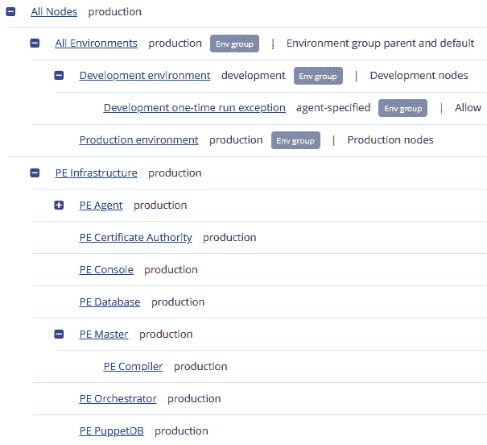
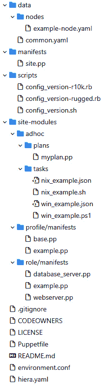
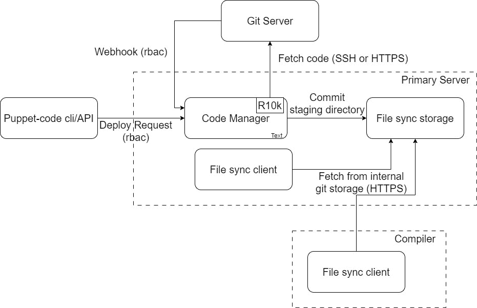

# 11

# 分类与发布管理

本章的重点将是 Puppet 如何部署代码，并将这些代码分类到服务器上。首先将讨论环境，展示如何创建具有特定模块版本的服务器隔离组。我们将讨论如何提供静态和临时环境。我们将展示现代 Puppet 如何使用基于目录的环境，将环境代码放在特定位置，如 `site.pp` 主清单文件或一组清单文件，并通过这些节点定义中的 Hiera 查找，或者通过主服务器运行的 **外部节点分类器** (**ENC**) 脚本来实现。还将讨论 Puppet Enterprise 中 **分类服务** 的实现，展示如何在这些解决方案的基础上构建，使用其自身的 ENC 脚本，并增加了在 Web 控制台中使用节点组的额外功能。

将详细查看 Puppet 代理的运行，展示其中的步骤，以及在编译目录时，数据是如何加载、缓存和刷新。

接下来，将展示如何使用控制库结构和 Puppetfiles 管理模块，以便使用 `r10k` 或 `g10k` 将代码部署到环境中，并讨论根据本地基础设施的配置使用不同方法来同步代码。然后将讨论特定于 PE 的实现 `r10k`。

在审视了分类与发布管理的技术结构后，将重点放在使用这些技术与受监管流程和多个团队合作时面临的挑战与局限性。

在本章中，我们将涵盖以下主要内容：

+   Puppet 环境

+   理解节点分类

+   Puppet 运行

+   管理和部署 Puppet 代码

+   实验—分类与部署代码

# 技术要求

从 [`github.com/puppetlabs/control-repo`](https://github.com/puppetlabs/control-repo) 克隆控制库到你的 `controlrepo-chapter11` GitHub 账户，并更新此库中的以下文件：

+   `Puppetfile` 和 [`github.com/PacktPublishing/Puppet-8-for-DevOps-Engineers/blob/main/ch11/Puppetfile`](https://github.com/PacktPublishing/Puppet-8-for-DevOps-Engineers/blob/main/ch11/Puppetfile)。

+   通过下载 [`github.com/PacktPublishing/Puppet-8-for-DevOps-Engineers/blob/main/ch11/params.json`](https://github.com/PacktPublishing/Puppet-8-for-DevOps-Engineers/blob/main/ch11/params.json) 中的 `params.json` 文件并更新其内容，指定你的控制库位置和控制库的 SSH 密钥，来构建一个包含三个客户端的标准集群。然后，从你的 `pecdm` 目录运行以下命令：

    ```
    bolt --verbose plan run pecdm::provision --params @params.json
    ```

# Puppet 环境

Puppet 环境是一种定义用于服务器组的特定版本模块、清单和数据的方法。不幸的是，*环境*是一个在组织中用于其他目的的通用技术术语，很容易造成混淆。最好的建议是在讨论 Puppet 之外的内容时，始终使用**Puppet 代码环境**，以防止 Puppet 环境与其他任何东西直接关联。

现代 Puppet 环境是基于目录的动态环境，这意味着 Puppet 服务器——或者在`puppet apply`的情况下，客户端——将查找分配的环境是否存在于一个目录中。多个变量设置了相关目录的位置，包括`environments`目录本身，我们强烈建议将所有这些设置保持为默认值，以避免混淆和问题。接下来我们将了解环境中的代码目录和路径的层级。

## 环境目录和路径

第一层是由`puppet.conf`中的`codedir`变量设置的代码和数据目录，默认值为 Unix 上的`/etc/puppetlabs/code`，Windows 上的`%PROGRAMDATA%\PuppetLabs\code`（通常为`C:\ProgramData\PuppetLabs\code`）。Puppet Server 不使用`puppet.conf`中的`codedir`设置，而是使用`puppetserver.conf`中的`jruby-puppet.master-code-dir`，因此如果更改了这两个设置，都需要进行配置。

注意

在`Puppet 3.3`之前，环境是通过`puppet.conf`文件声明的，每个环境都必须在一个包含`modulepath`和`manifests`变量的节中声明。今天的 Puppet 仍然可以技术性地实现这一点，如果没有设置`codedir`，但没有理由采用这种方式。

代码和数据目录包含两个目录。首先，有一个模块目录，用于提供在`puppet.conf`中默认的`basemodulepath`变量中包含的全局用户模块。默认情况下，`basemodulepath`变量在 Unix 上包含`$codedir/modules:/opt/puppetlabs/puppet/modules`，在 Windows 上包含`$codedir\modules`。Unix 上的额外目录由 PE Server 安装使用，用于放置用于配置 PE 的模块。这些模块以`pe`为前缀，以避免与环境中已经使用的任何模块混淆。

第二个目录是环境目录；根据`puppet.conf`中`environmentpath`的默认设置，它是`$codedir/environments`，并且是查看环境的地方。

注意

`codedir`目录用于包含全局 Hiera 数据和配置，并且默认使用`hiera_config`设置。如果找到`$codedir/hiera.yaml`文件，它将覆盖默认的`$confdir/hiera.yaml`文件，这个文件现在是标准的，正如在*第九章*中讨论的那样。

在`environments`目录中，要创建的每个环境都会有一个包含小写字母、数字和下划线的名称的目录。每个环境目录可以包含以下内容：

+   在`$modulepath`指定的目录中的 Puppet 模块

+   目录中`hiera.yaml`文件中配置的 Hiera 数据

+   `$manifest`指定的目录中清单或一组清单中的分类数据

+   目录中的`environment.conf`文件中的环境配置数据

在回顾了环境的目录和路径之后，我们将更详细地查看环境配置文件。

## 环境配置文件

可以在`environment`目录中的`environment.conf`文件中设置环境配置数据；该文件具有类似于`puppet.conf`的 INI 格式，但没有节（sections）。

默认情况下，如果`modulepath`环境变量没有在`environment.conf`中设置，它将被设置为`$environmentpath/$environment/modules:$basemodulepath`。

因此，在基于 Unix 的系统中，默认情况下将是以下内容：

```
/etc/puppetlabs/code/environments/$environment/modules: /opt/puppetlabs/puppet/modules
```

在 Windows 系统中，它将是这样的：

```
C:/ProgramData/PuppetLabs/code/environments/production/modules;C:/ProgramData/PuppetLabs/code/modules
```

请记得使用分号（`;`）分隔 Windows 系统中的目录列表，使用冒号（`:`）分隔 Unix 系统中的目录列表。

在*管理和部署 Puppet 代码*部分，我们将讨论如何将模块部署到该目录中，并如何列出`modulepath`中每个目录的内容。

注意

永远不要将`modulepath`变量设置为从另一个环境目录读取。在*Puppet 运行*部分，我们将讨论环境数据被缓存和刷新时可能带来的不一致效果。

`manifest`变量可以是单个清单文件，也可以是包含多个清单的目录，这些清单将按字母顺序读取。如果路径以正斜杠（`/`）或句点（`.`）结尾，Puppet 会将此变量视为包含目录，并能识别它是一个目录。如果`environment.conf`中没有设置，默认值将是`$environmentpath/$environment/manifests`目录，对于基于 Unix 的系统，这个路径为`/etc/puppetlabs/code/environments/$environment/manifests`，对于基于 Windows 的系统，这个路径为`C:/ProgramData/PuppetLabs/code/environments/$environment/manifests`。目录环境将永远不会使用`puppet.conf`中的全局`manifest`设置。在下一节中，我们将更详细地讨论如何使用节点定义和 Hiera 查找来对这些清单进行服务器分类。

`environment_timeout`变量表示 Puppet Server 将缓存特定环境的时间，并覆盖设置的值。Puppet 建议不要在`environment.conf`中设置此项，只使用`puppet.conf`中的全局版本，并且只使用`0`或`unlimited`。缓存的作用将在本章的*Puppet 运行*部分进一步讨论。

`config_version`变量可以设置一个脚本，在目录编译后运行，并将输出作为日志的一部分返回。如果默认没有设置，脚本将返回目录编译时的时间，格式为 Unix 纪元（自 1970 年 1 月 1 日午夜 UTC/GMT 以来经过的秒数）。对于默认的纪元脚本，输出将如下所示：

```
Info: Applying configuration version '1663239677'
```

在*管理和部署 Puppet* *代码*部分中将展示一个更有用的示例，当使用基于 Git 的部署解决方案时。

注意

`environment.conf`和`config_version`脚本可以使用`basemodulepath`、`environment`和`codedir`全局变量。

现在我们已经审查了环境配置，了解如何验证配置以及部署的环境类型是非常有用的。

## 环境验证和部署

可以使用`puppet config print`命令检查在`puppet.conf`和`environment.conf`中讨论的设置，通过部署`--environment`标志查看特定环境，使用`--section`查看`puppet.conf`中的特定部分。例如，要检查`puppet.conf`中的`codedir`变量和生产环境中的`modulepath`变量，可以运行以下命令：

```
puppet config print codedir
puppet config print --environment production modulepath
```

默认情况下，Puppet Server 会创建一个生产环境，但运行`apply`的 Puppet 客户端不会。对于这两种情况，生产环境是 Puppet 默认运行的环境。在本章的下一部分，我们将展示服务器如何被分类到其他环境中。

有三种环境策略：永久性、临时性和组织隔离。永久性环境通常是长期存在的，环境命名通常与服务器的用途相匹配，例如服务器是产品服务器还是开发服务器。临时性环境是在进行变更测试后推广之前可以使用的环境，而组织隔离环境则反映了分割的基础设施，其中不同团队（如 Windows 和 Linux 团队）拥有不同的服务器并且有不同的环境。这些策略可以根据需要结合使用，以满足组织的需求。

既然我们已经了解了 Puppet 代码环境，接下来我们将学习如何根据环境中的使用情况以及该环境中的模块集合来分类客户端。

# 理解节点分类

节点的分类涉及确定一个节点应该使用哪个环境，应该应用哪些类，以及应该应用哪些参数。理想的情况是为一个主机应用单一的角色类，但业务逻辑可能更复杂。这适用于 Puppet Server 上的代理运行和`puppet` `apply`运行。

在定义了什么是节点分类之后，我们将看看可以用于分类的方法，首先介绍节点定义作为最简单的方法。

## 节点定义

节点分类的最基本方法是使用`puppet.conf`，其中节点名称与`puppet.conf`中的`certname`设置相同，默认为节点的**完全限定域名** (**FQDN**)。

节点定义的语法在这里设置：

+   `node`关键字

+   一个作为字符串的节点名称，`default`

+   以下 Puppet 代码项的混合，位于花括号（`{}`）内：

    +   类别声明

    +   变量

    +   资源声明

    +   收集器

    +   条件语句

    +   链接关系

    +   函数

建议将节点定义控制在最低限度，并仅使用类声明和变量。如果任何清单包含节点定义，则节点定义必须匹配所有节点，否则与不匹配的节点的编译将失败。通常通过确保存在默认定义，即使默认定义不包含任何代码，也能确保安全。

一个节点将只匹配一个节点定义，并按以下优先级进行排序：

+   完全匹配的名称

+   正则表达式匹配（多个正则表达式匹配是不可预测的，只有一个会被使用）

+   `default`（如果节点未能匹配任何其他定义，节点将匹配此关键字）

注意

在`default`之前的优先级步骤会查找主机名的部分匹配，如果`puppet.conf`主服务器中的`strict_hostname_checking`设置为`false`。为了避免这种不安全的匹配，Puppet 5.5.19+ 和 6.13.0+ 默认设置为`true`，在 Puppet 7 及之后的版本中，已删除该选项。

例如，以下代码将把`server1.exampleapp.com`分类到`role::oracle`类别，将`server2.exampleapp.com`和`server3.exampleapp.com`分类到`role::apache`类别。其他以`exampleapp.com`结尾的服务器将根据操作系统系列分类为`role::example_common_windows`或`role::example_common_linux`，例如`server5.exampleapp.com`，其他节点将被分类为`role::common`，例如`server1.anotherapp.com`：

```
node /.exampleapp.com$ {
  if $facts['os']['family'] {
    include role::example_common_windows
  else
    include role::example_common_linux
  }
}
node 'server1.exampleapp.com' {
  include role::oracle
}
node 'server2.exampleapp.com','server3.exampleapp.com' {
  include role::apache
}
node default {
  include role::common
}
```

默认情况下，`manifest`目录中会有一个`site.pp`文件，以保持简单，但该目录中的多个清单可以包含节点定义，这些定义可以根据组织、用例或所有权来组织文件。显然，拥有大量节点定义并不适用；保持节点定义简洁的推荐方法是使用一个默认定义，该定义查看节点的证书以具有一个`pp_role`扩展名，包含角色名称，如此代码示例所示：

```
node default {
  $role = getvar('trusted.extensions.pp_role')
  if ($role == undef) {
    fail("${trusted['certname']} does not have a pp_role trusted fact")
  }
  elsif (!defined($role)) {
    fail("${role} is not a valid role class")
  }
  else {
    include($role)
  }
}
```

使用`getvar`函数来避免没有证书的主机出现问题，并使用`defined`函数确认声明的角色在环境中可见，它将包括证书中声明的角色。

任何在节点定义外应用的代码将适用于所有节点，但像这样设置不受控的全局默认值并不是推荐的做法。在之前的代码块中，使用了角色类，但也可以为例外包含任何类。

本地的 `puppet apply` 调用将不会查找 `puppet.conf` 中的 `manifest` 变量设置，而是会根据命令行传递的内容进行操作，可以通过 `–e` 标志或传递特定的清单文件来实现。

在查看了基于代码的节点分类方法后，我们现在将查看如何使用 Hiera 数据来对节点进行分类。

## 使用 Hiera 进行节点分类

可以使用 Hiera 数组和 `lookup` 函数在默认节点定义中采取更具数据驱动的方法。虽然 `lookup` 函数可以在节点定义外使用，但我们建议避免这样做，以确保如果为节点特别添加了其他节点定义，它只会应用该节点定义，而不是更难预测的混合结果。

第一步是，如我们在 *第九章* 中看到的，确保每个环境中有适当的 Hiera 层次结构，假设在 `hiera.yaml` 环境中有一个简单的层次结构，包括节点、操作系统和默认设置，如此处所示：

```
datadir: data 
data_hash: yaml_data 
  - name: "Node data" 
    path: "nodes/%{trusted.certname}.yaml"
  - name: "OS defaults" 
    path: "os/%{facts.os.family}.yaml" 
  - name: "Common data" 
    path: "common.yaml
```

然后，我们可以在 `default` 节点定义中添加查找：

```
node default {
lookup( {
  'name'          => 'classes',
  'value_type'    => Array,
  'default_value' => [],
  'merge'         => {
    'strategy' => 'unique',
  },
} ).each | $classification | {
  include $classification
}
```

虽然将变量命名为 `class` 看起来更合适，但由于 `class` 是一个保留字，因此无法这样做。

环境级别的 Hiera 数据可以添加到 `common.yaml` 文件中，以确保默认情况下服务器获得 `core` 角色：

```
---
classes:
  - role::core
```

然后，在数据文件中创建一个 `os/RedHat.yaml` 文件，包含以下代码：

```
---
classes:
  - role::core::redhat
```

这将确保所有来自红帽家族的服务器，如 CentOS，将被分配到 `role::core::redhat` 类。要将特定角色分配给服务器，我们创建一个 `node/exampleapp.example.com.yaml` 文件，包含以下代码：

```
---
classes:
  - role::docker
```

这将把 `role::docker` 类分配给 `exampleapp.example.com` 节点。

为了允许例外和更复杂的组合设置，可以使用哈希而不是数组，将 `site.pp` 中的查找策略从唯一查找改为深度合并策略，并将数据从数组改为哈希：

```
node default {
lookup( {
  'name'          => 'classes',
  'value_type'    => Hash,
  'default_value' => []
  'merge' =>
    'strategy' =>  'deep',
}).each | $classification | {
  include $classification
}
```

在这种情况下，我们可以使用仅在 Hiera 中可见的键，接管角色构建并直接使用配置文件，设置一个 `common.yaml` 文件以确保默认分类获得核心配置和安全配置文件：

```
---
classes:
base profile: profile::core
security profile: profile::security
```

然后，对于特定的服务器 `exampleapp.example.com`，可以在 `node/exampleapp.example.com.yaml` 中设置 `security_profile` 变量：

```
---
classes:
security_profile: profile::security::legacy
```

这将覆盖安全配置文件键，并导致 `exampleapp.example.com` 被分类为 `profile::security::legacy` 和 `profile::core`。

可以构建更复杂的基于 Hiera 的键查找来基于 Facter 值查找，但由于这在本书中不推荐使用，因此已展示足够的细节来理解 Hiera 的使用方法。值得一提的是，example42 的 `psick` 模块 [`forge.puppet.com/modules/example42/psick`](https://forge.puppet.com/modules/example42/psick) 使用了 Hiera 方法，并且可以用于在 Linux 环境中以预设和分阶段的方式包含模块。只需包含 `psick` 类并简单地通过哈希设置 Hiera 键，就足以对主机进行分类：

```
psick::firstrun::linux_classes
psick::pre::linux_classes
psick::base::linux_classes
psick::profiles::linux_classes
```

在详细审查了分类的代码和数据方法后，我们将介绍使用 ENC 脚本的更高级方法。

## ENC 脚本

ENC 是一个脚本，Puppet Server 或 `puppet apply` 调用可以运行该脚本。该脚本的要求是接收客户端的 `certname` 参数，并返回一个非零的返回码（表示未知节点）或包含类、参数和环境的 YAML 输出，用于目录编译。在这个 ENC 内部，可以访问各种外部数据源引用，例如 PuppetDB 或你组织的内部数据源。重要的是 ENC 使用的编程语言，而不是它用什么语言编写。

一个示例输出如下所示：

```
---
classes:
  role::core::windows
  sqlserver_instance:
    features:
      - SQL
    source: E:/
    sql_sysadmin_accounts:
      - myuser
parameters:
  dns_servers:
    - 2001:4860:4860::8888
     - 2001:4860:4860::8844
  mail_server: mail.example.com
  vault_enabled: true
environment: uat
```

在这个示例中，可以看到服务器将应用 `role::core::windows` 类，并且会使用 `sqlserver_instance` 类及其相关参数，这些参数将作为目录中的全局变量，并且环境为**用户验收** **测试**（**UAT**）。

通常最好通过 Hiera 数据传递类参数，但这只是为了演示在 ENC 输出中可以实现的内容。

要配置 ENC 脚本的使用，必须在 `puppet.conf` 中设置两个变量：首先是 `node_terminus`，默认值为 `plain`，只使用清单来定义分类。将 `node_terminus` 设置为 `exec` 后，第二个变量 `external_nodes` 将被检查，这应该设置为脚本的位置。例如，Foreman 项目使用一个在其配置模块中定义的 ENC，如下所示：

```
node_terminus = exec
external_nodes = /etc/puppetlabs/puppet/node.rb
```

脚本的内容可以在这里查看：[`github.com/theforeman/puppet-puppetserver_foreman/blob/master/files/enc.rb`](https://github.com/theforeman/puppet-puppetserver_foreman/blob/master/files/enc.rb)。

用于放置此脚本的配置模块可以在 [`forge.puppet.com/modules/theforeman/puppetserver_foreman`](https://forge.puppet.com/modules/theforeman/puppetserver_foreman) 找到。

开发 ENC 脚本超出了本书的范围，建议避免通过这种方式访问外部数据，因为访问可能会很昂贵。

我们已经介绍了 ENC 脚本的工作原理，但 PE 使用自己类型的 ENC 脚本，并具有额外的功能。

## PE 分类器

PE 提供了自己的 ENC 分类器，访问分类服务 API，这是一个 Clojure 应用程序，并将节点组信息存储在 **PostgreSQL** 分类数据库中。

通过在 `puppet.conf` 中设置 `node_terminus = classifier` 来进行配置，安装程序已设置该项，并且不应更改，因为更改后将不受支持。

注意

`node_terminus` 在 PE 中曾在 PE 4 及之前版本中被称为 `console`。

节点组有两种类型：环境组和分类组。环境组用于将环境分配给节点，而分类节点用于分配类并添加参数和变量。可以在 PE Web 控制台的 **节点** **组** 部分查看和配置节点组。

所有节点组都可以包含规则，这些规则可以基于事实或通过直接命名要包含在节点组中的服务器来定义。它们可以包含任何带有任何定义的类参数的类，这些参数会被分类到这些匹配的节点中，这些参数被称为配置数据，像 Hiera 数据一样充当覆盖项，并优先于 Hiera，以及作为全局变量为组声明的变量。

注意

较旧版本的 PE 默认不启用配置数据，必须在 `/etc/puppetlabs/puppet/hiera.yaml` 中添加一个部分：

`hierarchy: - name: "分类器配置数据"` `data_hash: classifier_data`

默认情况下，如*图 11.1*所示，PE 将拥有一个 **所有节点** 节点组，作为所有配置的父节点组，并在其下分为 **所有环境**，一个作为所有声明的环境组的父组的环境组，以及 **PE 基础架构**，一个用于配置 PE 架构的分类组：



图 11.1 – PE 默认节点组

环境组在*图 11.1*中被标记为 `trusted.extensions.pp_environment` 事实，在规则中将生产或开发环境匹配到同名的组，并确保分配相应的环境。如果没有设置 `trusted.extensions.pp_environment`，`pp_enviroment` 受信事实将防止服务器被移动到另一个环境，而无需重新生成服务器证书，这将需要访问客户端和主服务器。命令为 `puppet agent –``t --environment=myfeaturebranch`。

环境的开发和部署方法将在*管理和部署 Puppet 代码*部分进一步讨论，但可能需要在生产和开发之间增加更多环境层级，在这种情况下，推荐的做法是在所有环境下创建一个该环境名称的节点组，并创建一个规则，匹配 `trusted.extensions.pp_environment` 和您设置的环境名称。

环境组应保持简单，因此避免分配任何类参数或变量。

当分类组嵌套时，它们会继承父组的定义。在创建组结构时，从一般的配置层开始，然后将其细化到更具体的分类组是有意义的。例如，可以看到`puppet_master_host`被设置，这适用于所有 Puppet 基础设施主机，然后设置特定的服务和功能，如编译器或 PuppetDB，这将仅在部分节点上配置。

这可能会引起混淆，因为这种继承也适用于规则，因此，如果父规则已经设置了限制节点的规则，子节点组的规则将与父节点组的规则结合使用。这同样适用于节点的固定；您不能忽略规则并将任何可见于主服务器的服务器固定住。还需要注意的是，如果子节点组没有规则，它将不会应用分类，即使是从父组继承的分类。

关于分类节点组中环境变量的目的，可能会引起进一步的混淆；这并不是定义分配的类将从哪里运行，而是告诉节点组在哪个环境中查找可用的类名。如果节点组在开发和生产节点之间共享，并且新的类最初在开发环境中引入，然后再推广到生产环境，那么这可能会导致问题，因此通常情况下，应用节点组使用最低级别的环境来全面查看类名是最有意义的。

为了简化操作，建议使用直接的分类角色，这些角色作为所有节点的子角色，并仅通过将`trusted.extensions.pp_role`匹配到特定的类角色名称来设置规则，然后将该角色类分配给分类角色组。

为了自动化节点组的创建，可以使用`node_manager`模块（[`forge.puppet.com/modules/WhatsARanjit/node_manager`](https://forge.puppet.com/modules/WhatsARanjit/node_manager)）通过 Puppet 代码管理它们，这也是`peadm`模块本身配置 Puppet 节点组信息的方式。例如，`peadm`确保带有`puppet/puppetdb-database`可信扩展的节点被分配到**PE 数据库**节点组，代码如下：

```
node_group { 'PE Database':,
  rule => ['or',
    ['and', ['=', ['trusted', 'extensions', peadm::oid('peadm_role')], 'puppet/puppetdb-database']],
    ['=', 'name', $primary_host],
  ]
}
```

注意

`node manager`模块有一个`purge_behavior`设置，如果将资源的该设置为`none`，则确保仅应用您希望对节点组进行的特定更改。默认情况下，这个设置为`all`，会移除您未声明的任何设置。

另外，可以使用 API 执行节点组数据的备份和恢复，使用`/classifier-api/v1/groups`保存到文件，并使用`/classifier-api/v1/import-hierarchy`恢复。`Peadm`使用这些 API 实现备份和恢复分类任务：[`github.com/puppetlabs/puppetlabs-peadm/tree/main/tasks`](https://github.com/puppetlabs/puppetlabs-peadm/tree/main/tasks)。

注意

从 PE 版本 2019.2 开始，提供了一个`$pe_node_groups`顶级作用域变量，返回所有节点组。

使用**Puppet 数据服务**（**PDS**）通过外部数据添加类的进一步方法将在*第十三章*中展示。但在回顾了各种分类方法后，我们将讨论最佳实践方法来对节点进行分类。

## 推荐方法

可以使用 ENCS 和节点定义方法的混合方式，因为它会合并信息，但这可能会使理解分类发生的位置变得更加困难。如果可能的话，最佳做法是选择一种方法，或者至少明确每种机制的目的，例如基于证书匹配角色的节点定义和匹配节点异常的 Hiera。

假设分类尚未由您的组织选择，或者在您的配置模型中是特定的，比如使用 Foreman 或`psick`，我们建议使用基于开源 Puppet 证书中`pp_role`扩展的默认节点定义的简单模式：使用与节点组角色匹配的`pp_role`扩展和与 PE 使用的环境匹配的`pp_environment`。这是 Puppet 支持所期望的，也是构建模型，但它限制了在 Hiera 数据设置中使用任何变量或配置数据。

在*节点定义*和*使用 Hiera 对节点进行分类*部分讨论了其他机制，因为在许多组织中，分类已经存在，并且不容易更改，因此必须理解它。如果必须生成复杂的分类，重要的是要知道这是否意味着数据没有放在正确的位置，或者——更糟糕的是——Puppet 没有得到有效使用，生产了过多的服务器变种。当我们维持严格的标准并尽量减少例外时，服务器可以轻松处置并重建，从而减少运营复杂性和支持团队的认知负担。

现在您已经理解了服务器如何被分类到环境和类中，我们将展示在 Puppet 运行期间如何加载和缓存不同的数据。

# Puppet 运行

本节将详细介绍 Puppet 运行和分类的步骤。对于 Puppet 运行的情况，`puppet apply`命令应被视为 Puppet 服务器和客户端在同一节点上的等价物。

当客户端发出目录请求时，四项内容会被发送到服务器：

+   节点名称

+   节点的证书（未发送`apply`）

+   Facts

+   请求的环境

节点名称是 `certname`，并与请求的环境一起嵌入到 API 请求中——例如，`/puppet/v3/catalog/exampleserver.example.com?environment=uat`。

证书可以包含扩展，这些扩展将被转化为可信的事实。

服务器接收到代理数据后，向配置的节点终端请求节点对象。在 `plain` 的情况下，这将是空白的；对于 `exec` 或 `classifier`，将返回包含类、参数和环境的 YAML 输出。

默认情况下，`puppet.conf` 将 `strict-environment-mode` 设置为 `false`，并且返回的环境将覆盖代理请求；如果设置为 `true`，则目录编译将失败。如果代理在 Puppet 执行过程中指定了环境，`agent_specified_environment` 事实将会出现。

变量将根据事实设置，既作为顶级作用域变量，也作为 `$facts` 哈希中的变量，将证书中的扩展作为 `$trusted` 哈希中的可信事实，以及从节点终端返回的参数作为顶级作用域变量。

主清单将被评估，首先查看它是否由环境配置定义，如果未设置，则由客户端的 `puppet.conf` 文件定义。如果存在任何节点定义，Puppet 将尝试匹配 `certname`，如果匹配失败，则编译将失败。

任何在节点定义之外的资源都会被评估并添加到目录中以及任何类中。如 *节点定义* 部分所述，不建议在节点定义之外声明任何内容。匹配的节点定义将评估代码，覆盖节点定义中声明的任何顶级作用域变量，将资源添加到目录，并加载并声明节点定义中的类。

Puppet 然后将加载包含在主清单中声明的类，使用为该环境配置的 `modulepath` 变量。每当加载一个类时，代码会被评估，资源会被添加到目录中，任何在其中声明的类也会被加载并评估。

Puppet 然后加载并评估从节点对象返回的类。

在了解了 Puppet 如何分类节点以及代理如何处理这些分类方法后，现在是时候查看如何管理和部署环境到主服务器，以便将正确版本的代码提供给节点。

# 管理和部署 Puppet 代码

默认情况下，只需创建文件夹并将模块内容放置到适当位置，再结合 `puppet module install` 命令从 Forge API 自动拉取，就足以使模块在环境中可见，并允许它们被打包到包管理中以创建版本。但我们并不推荐这种方法，因为它将模块和环境的部署集中化，很可能使得单个团队成为 gatekeeper。我们将看到控制库提供了更灵活的控制。

最常见的方法是使用一个名为控制仓库的 Git 仓库。Puppet 提供了这个仓库的模板，地址为 [`github.com/puppetlabs/control-repo`](https://github.com/puppetlabs/control-repo)。

注意

Puppet Forge 作者 example42 提供了其自己的模板化控制仓库，用于与其集成和预设计的实现方法：[`github.com/example42/psick`](https://github.com/example42/psick)。

Puppet 的控制仓库模板包含了本章第一部分中讨论的许多目录和文件，以及 Hiera 数据和一些特定于模块部署的附加文件。*图 11.2* 显示了 Puppet 控制仓库的内容：



图 11.2 – Puppet 控制仓库模板的文件结构

在本章的第一部分，*Puppet 环境*，我们讨论了许多文件和目录，其中包括 `environment.conf`、配置版本脚本以及用于分类的 `manifests` 目录。还可以看到 `hiera.yaml` 中的 Hiera 配置以及数据目录，显示了一个简单的初始节点的两层结构，用于匹配特定节点名称和公共数据，作为不匹配节点的默认设置。`site-modules` 目录旨在展示临时计划和任务如何作为该控制仓库的一部分部署，并可能为角色和配置文件提供存放位置。`scripts` 目录也值得查看，以了解在 [`github.com/puppetlabs/control-repo/blob/production/scripts/config_version.sh`](https://github.com/puppetlabs/control-repo/blob/production/scripts/config_version.sh) 中的配置版本脚本如何将有关环境的 Git 修订控制信息添加到执行中。我们尚未审查的部分是 Puppetfile 文件。

Puppetfile 文件是基于 Ruby 的 `moduledir` 作为变量，或某个模块的 `installpath` 参数。我们不推荐这样做，因为这可能会让不熟悉你环境的用户感到困惑，并且如果设置在环境目录之外，可能会影响缓存，导致环境不一致。本节稍后会讨论这一点。

Puppetfile 模块声明的最简单形式包含以下内容：

+   `mod` 关键字

+   单引号中的名称

+   可选地跟一个逗号，再加上版本号或 `:` `latest` 关键字

例如，以下代码块假设 Puppet Forge 作为源，并在模块不存在时安装 `dsc-octopusdsc` 的最新版本，但不会导致模块被更新：

```
mod 'dsc-octopusdsc'
mod 'puppetlabs-chocolatey', '6.2.0'
mod 'puppetlabs-stdlib' , :latest
```

这段代码将安装 `puppetlabs-chocolatey` 到固定版本 6.2.0，并将安装 `puppetlabs-stdlib` 并保持更新到最新版本。需要注意的是，这不会导致 Puppet Forge 依赖项被安装——这些必须在 Puppetfile 中手动管理。在 Puppet Forge 查看模块文档时，你会看到如何将模块添加到 Puppetfile 的示例代码。

要访问其他 Git 仓库中的模块，应提供 `git` 选项和仓库的 HTTP 地址。然后，可以将其与以下选项之一配对，以克隆 Git 仓库的特定版本：

+   `ref`，指向标签、提交或分支的引用

+   `tag`，使用特定标签

+   `commit`，具有特定的提交引用

+   `branch`，具有分支名称或 `:control_branch` 关键字（它将自动查找控制仓库的分支名称）

+   `default_branch`，如果所有前述选项失败时使用的分支

以下代码演示了如何混合和匹配前述列表中的 `git` 选项：

```
mod 'exampleorg-examplemodule1',
  :git => 'https://internalgitservice.com/exampleorg/examplemodule1',
  :tag =>  'v.0.1'
mod 'exampleorg-examplemodule2',
  :git => 'https://internalgitservice.com/exampleorg/examplemodule2',
  :commit => '68a140bd096a55019b3d5c8c347436b318779161'
mod 'anotherorg-anothermodule',
  :git => 'https://internalgitservice.com/anotherorg/anothermodule',
  :branch => :control_branch,
  :default_branch => 'main'
```

这段代码块从同一个 Git 组织中获取 `examplemodule1` 的 `tag` 版本 `v.0.1` 和 `examplemodule2` 的 `commit` 版本 `68a140bd096a55019b3d5c8c347436b318779161`。对于 `anothermodule`，如果存在与我们要部署的环境同名的分支，它将使用该分支；否则，它将克隆 `main` 分支。

在访问 Puppet Forge API 受限的隔离网络环境中，或在受到监管的环境中，若要求公司存储所有代码的副本以便审计，可能需要从 Forge 下载代码副本，并从公司自己的 Git 系统使用。在这种情况下，强烈建议你按照模块页面上的项目 URL，执行 Git 克隆 Puppet Forge 模块的源代码，然后将远程目录切换到你自己 Git 仓库的副本。这样可以确保提交历史得以保留，并且你可以定期克隆代码并将新提交添加到本地仓库。

无论 Forge 模块是如何下载的，如果它们不是直接从 Forge 最新版本下载的，那么频繁检查版本并将其作为定期测试和更新的流程非常重要。这可以确保你获取到最新的功能和修复，并避免执行大版本升级，因为大版本升级更难测试。关注 **Content and Tooling** (**CAT**) 团队的博客 [`puppetlabs.github.io/content-and-tooling-team/blog/`](https://puppetlabs.github.io/content-and-tooling-team/blog/) 可以帮助你跟踪模块发布。

注意

JFrog Artifactory 用户可以使用 Puppet Forge 插件在内部同步和托管模块，具体操作请参考 [`www.jfrog.com/confluence/display/JFROG/Puppet+Repositories`](https://www.jfrog.com/confluence/display/JFROG/Puppet+Repositories)。

使用这种结构来管理多个环境时，只需在 Git 仓库中创建分支，每个分支代表一个环境，且每个环境可以有其独立的内容进行部署。

管理部署的标准系统是`r10k`，它还为 PE 提供了更多的集成功能。

`r10k`的安装说明简单明了，并且可以直接从[`forge.puppet.com/modules/puppet/r10k`](https://forge.puppet.com/modules/puppet/r10k)的仓库中获取。配置 PE 中 Code Manager 的说明可以通过节点组或通过 Hiera 提供，详细信息请参见[`puppet.com/docs/pe/2021.7/code_mgr_config.html`](https://puppet.com/docs/pe/2021.7/code_mgr_config.html)。

在这两种情况下，作为这些说明的一部分，将生成一个 SSH 密钥，用于`r10k`与任何你已声明的 Git 仓库之间的通信。

Puppet 开源的另一个替代选项是使用`g10k` (`[`forge.puppet.com/modules/landcareresearch/g10k`](https://forge.puppet.com/modules/landcareresearch/g10k))，它是`r10k`在**Go**语言中的重写，并且在性能上有显著的提升。

注意

你仍然可以在 PE 中直接使用`r10k`，但这是 Puppet 不提供支持的做法。

对于开源 Puppet，在配置并部署`r10k`之后，可以运行`sudo -H -u puppet r10k deploy production`命令来部署特定的分支，或者省略环境名称以部署所有可用的环境。还可以使用 Sinatra 服务器配置 Webhook，详细信息请参见`r10k`的说明，[`forge.puppet.com/modules/puppet/r10k/readme#webhook-support`](https://forge.puppet.com/modules/puppet/r10k/readme#webhook-support)。

对于 PE，Puppet Code Manager 是一个使用在 PE `puppet code deploy`命令中生成的令牌的`/code-manager` API。例如，下面的代码将为当前登录用户生成一个令牌，该令牌在接下来的 2 小时内有效，然后在生产环境中进行部署：

```
puppet-access login --lifetime 2h
puppet code deploy production --wait
```

在这两种版本中，要查看已部署的模块，可以使用`puppet module --list`，该命令还会显示任何依赖问题。

注意

Puppet Code Manager 在底层使用`r10k`。为了获得更详细的调试信息，可以运行以下命令，该命令用于在生产环境中进行部署：

`runuser -u pe-puppet -- /opt/puppetlabs/puppet/bin/r10k -c /opt/puppetlabs/server/data/code-manager/r10k.yaml deploy environment production --puppetfile --``verbose debug2`

对于这些部署，理解可能发生的缓存非常重要。所有 Puppet 代码在加载环境时都会被读取和解析——`hiera.yaml`文件也是如此——直到环境缓存过期或 JRuby 实例被刷新，才会重新读取。`environment.conf`文件默认将此设置为`unlimited`。虽然 Puppet 模板和 Hiera 数据在每次函数调用时都会从磁盘重新读取，但它们不会被缓存。这意味着，如果对`r10k`之外的 Hiera 数据或 Puppet 模板进行任何本地编辑，它们将被视为有效。也意味着如果环境具有查看其他环境的模块路径，部署只会看到 Hiera 和模板的更新。因此，强烈建议避免使用这种方法。

使用编译器同步代码时，开源 Puppet 根据你的环境提供了不同的部署方式：在每个编译器节点上安装并运行`r10k`、从主服务器到编译器执行`rsync`操作，或者使用从主服务器到所有编译器的只读**网络文件共享**（**NFS**）。这一选择完全取决于你的组织在网络配置和安全标准方面的最佳方案。

在 PE 中，代码管理器使用文件同步客户端和服务器进行特定实现，如*图 11.3*所示：



图 11.3 – Puppet 代码管理器架构

代码部署请求将通过命令行或工具以带有 RBAC 令牌的请求形式传入。这将把代码拉取到主服务器的提交暂存目录。所有基础设施节点的文件同步客户端都有一个轮询监视器，能够看到部署并提醒文件同步过程。根据是否启用了无锁代码部署（此功能在 PE 2021.2 中引入），文件同步过程会做出两种响应中的一种。如果相关服务器未启用无锁代码部署，则需要保留所有 JRuby 实例，以防止任何目录运行使用不一致的环境。记住在*Puppet 运行*部分中不同环境数据如何被缓存，一旦保留，文件将同步到环境目录，并释放 JRuby 实例。这意味着代码部署可能会对性能产生影响。

如果启用了无锁代码部署，则会使用符号链接或 symlink 来管理环境目录，这意味着文件同步会同步到一个以版本提交命名的文件夹，并且在同步完成后，会将环境的符号链接重定向到这个新文件夹。这需要更多的磁盘空间，因为多个环境将同时部署，但它确保目录能继续运行，因为它们会使用符号链接开始时的目录。要启用无锁代码部署，请按照[`puppet.com/docs/pe/2021.7/lockless-code-deploys.html`](https://puppet.com/docs/pe/2021.7/lockless-code-deploys.html)上的说明进行操作。

现在我们了解了 Puppet 如何将代码部署到环境中，我们将看一下可用于管理模块代码在这些环境中推广的工作流。

## 创建工作流

创建工作流来部署代码有两种常见的方法。第一种方法是将控制仓库作为版本的中央守门人。这意味着在 Puppetfile 中的每个模块声明都有特定版本，并且通常会使用如`tag`、`commit`或`branch`等特定引用更新最低级别的环境。这些更改会在功能分支中进行测试，然后通过将更改从一个分支合并到另一个分支，运行服务器上的代码，并确认预期结果，从而推动这些更改通过环境。例如，这样的过程可能包括以下步骤：

+   创建控制仓库的功能分支并将`module1`标签版本从 1.1 更新为 1.2

+   将功能分支与开发分支合并并部署开发环境

+   将开发分支与 UAT 分支合并并部署 UAT 环境

+   将 UAT 分支与生产分支合并并部署生产环境

这不是一种自然的 Git 流，并且不使用主分支。它非常专注于部署，要求更多地管理环境。这种方法对于多个团队尤其困难，因为它要求像 Puppet 平台团队这样的守门人来管理对 Puppetfile 控制仓库的更改，并管理何时进行代码部署的时间表。

如果采用这种方法，建议使用多个控制仓库并使用前缀配置设置——这对于希望使用不同模块集的团队（如 Windows 和 Linux）或希望在控制仓库周围进行隔离和保护，并且希望拥有代码和服务器的独立所有权但又想共享基础设施的团队非常有用。

第二种方法是将控制仓库中的所有模块都设置为使用`control_branch`分支，默认分支为`main`。维护 Puppetfile 时，只需要添加和移除模块。版本管理将由模块本身负责，代码更改会从临时功能分支推送到主分支，然后再合并到每个静态环境分支。以下是一个示例：

+   在`module1`和控制仓库上创建一个功能分支，并测试代码更改

+   将`module1`的功能分支与`main`分支合并

+   将模块分支的更改从`main`合并到开发环境，然后进行部署和测试

+   将模块分支的更改从开发环境合并到 UAT，然后进行部署和测试

+   将模块分支的更改从 UAT 合并到生产环境，然后进行部署和测试

强烈建议将管道工具作为**拉取请求**（**PR**）和部署过程的一部分。**PE 的持续交付**（**CD4PE**）（在*第十四章*中讨论）配有预构建的检查，帮助简化这一过程，但也存在各种工具，如 Jenkins 或 GitHub，可以确保在完成 PR 之前执行我们在*第八章*中讨论的 pre-commit 钩子检查和测试。

注意

一些现成的优秀 pre-commit 钩子的来源可以在以下网址找到：[`pre-commit.com/hooks.html`](https://pre-commit.com/hooks.html)，[`github.com/pre-commit/pre-commit-hooks`](https://github.com/pre-commit/pre-commit-hooks)，以及[`github.com/mattiasgeniar/puppet-pre-commit-hook`](https://github.com/mattiasgeniar/puppet-pre-commit-hook)。

# 实验 – 分类和部署代码

在本实验中，完成以下任务：

+   在生产环境的`manifest/site.pp`文件中创建一个节点定义，将`motd`模块分配给任何`certname`中包含`node`的节点

    +   `motd`模块已包含在生产控制仓库中的`Puppetfile`文件中

    +   `motd`的默认设置应该可以通过`include motd`来使用

    +   查看示例解决方案：[`github.com/PacktPublishing/Puppet-8-for-DevOps-Engineers/blob/main/ch11/default.pp`](https://github.com/PacktPublishing/Puppet-8-for-DevOps-Engineers/blob/main/ch11/default.pp)

+   创建一个节点定义，将`icinga2`模块分配给所有创建的 Windows 节点

    +   `icinga2`模块已包含在生产控制仓库中的`Puppetfile`文件中

    +   `icigna2`的默认设置应该可以通过`include incigna2`来使用

    +   Windows 节点的`certname`中将始终包含`windows-node`

    +   要在 PE Web 控制台上部署，请从`'deploy production'`操作字符串中运行`peadm code_manager`任务

    +   查看示例解决方案：[`github.com/PacktPublishing/Puppet-8-for-DevOps-Engineers/blob/main/ch11/node.pp`](https://github.com/PacktPublishing/Puppet-8-for-DevOps-Engineers/blob/main/ch11/node.pp)

+   创建并部署开发环境，添加`docker`模块：

    +   在 GitHub 网页上，进入你的控制仓库，选择生产分支旁边的箭头，然后输入`development`。

    +   点击下方生成的文本，它应该显示`create branch: development` `from 'production'`。

    +   将`mod 'puppetlabs-docker'`这一行添加到`Puppetfile`中，并确保你在开发分支上。

    +   在 PE 网页控制台中，从任务菜单运行`peadm code_manager`任务，输入`'deploy development'`操作字符串。

+   创建一个角色节点组，将其中一个节点与 Docker 固定并设置为开发环境，然后将开发分支提升到生产环境并进行部署：

    +   创建一个名为`docker`的节点组，选择`apply docker`。

    +   请参见以下示例解决方案：[`github.com/PacktPublishing/Puppet-8-for-DevOps-Engineers/blob/main/ch11/docker_group1.png`](https://github.com/PacktPublishing/Puppet-8-for-DevOps-Engineers/blob/main/ch11/docker_group1.png)，[`github.com/PacktPublishing/Puppet-8-for-DevOps-Engineers/blob/main/ch11/docker_group2.png`](https://github.com/PacktPublishing/Puppet-8-for-DevOps-Engineers/blob/main/ch11/docker_group2.png)，和[`github.com/PacktPublishing/Puppet-8-for-DevOps-Engineers/blob/main/ch11/docker_group3.png`](https://github.com/PacktPublishing/Puppet-8-for-DevOps-Engineers/blob/main/ch11/docker_group3.png)。

# 总结

本章中，我们讨论了如何使用 Puppet 环境来管理模块的特定版本、分类和要应用于 Puppet 客户端组的数据。回顾了用于配置这些内容的目录结构和变量。

对将服务器分类到不同环境、分配类和参数的选项进行了审查，查看了清单文件中的节点定义，使用 Hiera 在节点定义中创建更复杂的基于数据的计算，然后是 ENC 脚本，这些脚本可以访问如 PuppetDB 等源并返回类、环境和参数的 YAML 输出，以便进行分类。随后，展示了 PE 如何在 ENC 方法的基础上进行扩展，并使用自己的 ENC 脚本与节点组结合使用，存储如何将服务器分类到环境并分配类的数据。

强调了可以将各种方法结合使用，但推荐的做法是保持简洁；对于开源 Puppet，只需使用默认节点定义来查找`pp_role`受信事实进行分类，并将环境设置放入`puppet.conf`，而对于 PE，建议使用节点组与`pp_role`和`pp_environment`受信事实的一一匹配。

随后展示了 Puppet 目录请求如何将数据发送到 Puppet 服务器，以及如何使用分类文件和脚本来生成目录，重点介绍了如何缓存不同类型的 Puppet 资源。

随后展示了如何部署环境，使用基于 Git 的 Puppet 控制库来包含环境的文件和目录，每个 Git 分支代表一个特定的环境。Puppetfile 被展示为列出应部署到环境中的模块，并指定模块的版本和位置。

接着讨论了如何通过`r10k`及其在`r10k`基础上的 PE 代码管理器实现来部署代码到服务器。对于使用编译器的服务器，我们回顾了各种方法来保持所有基础设施上的代码部署，这将取决于本地基础设施和标准。对于 PE，展示了代码管理器包含**文件同步**功能，以保持代码的同步。

随后介绍了工作流方法，展示了使用带有 Puppetfile 的控制库，设置版本并在推送模块版本更改时更新最低级别环境（如开发环境）的传统方法。第二种推荐的方法显示，控制库将依赖于模块本身，控制库会查找按环境命名的分支，允许团队独立工作和部署。无论哪种系统，重点都是使用合适的流水线工具并配合 Webhooks 来自动化部署。

本章重点介绍了用于有状态配置管理的 Puppet 基础设施和语言，下一章将介绍 Bolt 和 Orchestrator，展示如何使用 Bolt 作为独立工具或通过 PE 基础设施中的 PE Orchestrator 来执行过程任务。
