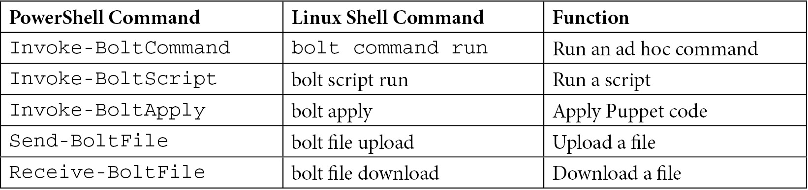

# 用于编排的 Bolt

在本章中，我们将介绍**Bolt**和 Puppet Enterprise 的**orchestrator**。我们将展示 Bolt 是 Puppet 用于临时编排的工具，能够处理不适合 Puppet 基于状态强制执行模型的工作。我们将讨论如何配置它以连接具有不同传输机制和凭证的客户端，并执行简单命令和上传文件。此外，我们将展示如何通过 Bolt 运行**tasks**，这些任务可以是多种语言的单一操作脚本，而**plans**则允许通过逻辑和变量在 Puppet 或 YAML 语言中编写任务组合。我们还将探讨项目目录结构，允许存储和共享 Bolt 内容。这将与如何使用**Puppet Enterprise Cloud Deployment Module**（**PECDM**）**Bolt 项目**作为示例，将计划和任务存储在 Puppet 模块中进行比较。接着，我们将展示如何通过插件扩展 Bolt，从其他来源动态加载信息。我们还将展示如何将 Bolt 与 Puppet 直接结合使用，应用清单块，连接到 PuppetDB，并使用 Hiera。

在本章中，我们将介绍以下主要内容：

+   探索和配置 Bolt

+   理解项目的结构

+   任务与计划介绍

+   插件

# 技术要求

将控制仓库`controlrepo-chapter12`从[`github.com/puppetlabs/control-repo`](https://github.com/puppetlabs/control-repo)克隆到您的 GitHub 账户，并用[`github.com/PacktPublishing/Puppet-8-for-DevOps-Engineers/blob/main/ch12/Puppetfile`](https://github.com/PacktPublishing/Puppet-8-for-DevOps-Engineers/blob/main/ch12/Puppetfile)的内容更新 Puppetfile。

通过从[`github.com/PacktPublishing/Puppet-8-for-DevOps-Engineers/blob/main/ch12/params.json`](https://github.com/PacktPublishing/Puppet-8-for-DevOps-Engineers/blob/main/ch12/params.json)下载`params.json`文件，并更新其中的控制仓库位置和控制仓库的 SSH 密钥，构建一个标准集群，包含两个 Unix 客户端和两个 Windows 客户端。然后，在`pecdm`目录中运行以下命令：

```
bolt --verbose plan run pecdm::provision --params @params.json
```

# 探索和配置 Bolt

到目前为止，本书主要集中在 Puppet 作为基于状态和幂等的配置管理工具的优势。但也有一些场景，其中这种方法并不适用，例如作为故障排除一部分的服务重启，或者使用供应商提供的安装脚本进行应用部署排序。许多任务属于更广泛自动化努力的一部分，属于临时和一次性的任务；因此，Puppet 推出了 Bolt，作为一个无代理的编排工具。自 2017 年发布以来，Bolt 已经进入 3.x 版本，并且经历了快速的发展。到了 2022 年，Bolt 趋于稳定，发布和功能更新大大减少，但我们强烈建议您尽可能保持 Bolt 的最新版本，以避免任何混淆。

在审阅了 Bolt 作为临时任务运行器的通用目的之后，第一步是理解 Bolt 如何通过传输和目标连接到客户端。

## 通过传输和目标连接到客户端

Bolt 是一个完全开放源项目，位于[`github.com/puppetlabs/bolt`](https://github.com/puppetlabs/bolt)，使用`bolt`编写。它通过提供的各种**传输**连接到设备，这是一种机制/协议，允许它在不需要代理的情况下建立到多个平台（如虚拟机、网络设备或容器）的连接。可用的传输如下。

系统传输：

+   本地，顾名思义，仅在本地机器上运行命令。

+   `net-ssh` Ruby 库或`native ssh`，如果选择使用的话。通常用于 Linux 和 Unix 机器。

+   **Windows 远程管理**（**WinRM**），用于连接基于 Microsoft Windows 的机器。

远程，用于 API 或基于 Web 的设备，例如网络设备如交换机。

Puppet Enterprise 传输：

+   **Puppet 通信协议**（**PCP**），与 Puppet Enterprise 编排服务一起使用，在*第十四章*中讨论。

容器传输：

+   Docker，由 Docker Inc 开发的应用容器技术。

+   **Pod 管理器**（**Podman**），由 Red Hat 开发的应用容器引擎。

+   **Linux 容器超级监视程序**（**LXD**），是一个使用**Linux 容器**（**LXC**）的系统容器引擎，由[`linuxcontainers.org`](https://linuxcontainers.org)开发并由 Canonical 赞助。

注意

除非在传输设置中将`native-ssh`设置为`true`，否则 Bolt 无法使用 SSH 连接到 Windows 目标，具体参见[`puppet.com/docs/bolt/latest/bolt_known_issues.html#unable-to-authenticate-with-ed25519-keys-over-ssh-transport-on-windows`](https://puppet.com/docs/bolt/latest/bolt_known_issues.html#unable-to-authenticate-with-ed25519-keys-over-ssh-transport-on-windows)。

默认情况下，Bolt 将使用本地 SSH 配置，在其最简单的级别上可以直接在被称为**目标**的设备上运行命令。一个简单的例子命令如下：

```
bolt command run 'uname' --targets examplehost.example.com
```

这里，命令在单引号内，提供的目标是可解析的主机名或 IP 地址。Bolt 还具有**PowerShell 命令**，为 PowerShell 用户提供更集成的体验，具有更灵活的命令链接和使用结构化数据作为参数的能力。与之前相同的命令作为 PowerShell 命令看起来如下：

```
Invoke-BoltCommand -Command 'uname' -Targets examplehost.example.com
```

这会使用默认的 SSH 传输设置，使用当前用户和任何已保存的凭证。如果想在命令行中做出选择，可以在传输名称前加上传输选择 `<transport_name>://`，多个目标使用逗号（`,`）分隔，并设置其他选项来配置传输。例如，如果 WinRM 没有配置 SSL 连接，则需要设置用户名、密码和 `no-ssl` 选项。以下是一个示例命令：

```
bolt command run 'systeminfo' --targets winrm:// host1.example.com,winrm://host2.example.com --user windows --password Pupp3tL@b5P0rtl@nd! --no-ssl
```

此命令将使用 `winrm` 连接在 `host1.example.com` 和 `host2.example.com` 目标上运行 `systeminfo`，并使用 `windows` 和 `Pupp3tL@b5P0rtl@nd!` 凭证，同时不进行 SSL 检查。Bolt 默认并行运行请求，最多同时运行 50 个请求。可以通过 `--concurrent` 参数调整并发数。

可以在文档中查看每种传输方式的完整选项列表：[`puppet.com/docs/bolt/latest/bolt_transports_reference.html`](https://puppet.com/docs/bolt/latest/bolt_transports_reference.html)。

注意

Bolt 1.3.6 弃用了 `nodes` 标志，改为使用 `targets`，并在 Bolt 2.0.0 中移除了该标志。

## 使用 Bolt 运行临时命令

本节将展示如何使用 Bolt 运行临时命令，包括 Windows PowerShell 和 Linux Shell 命令示例。下表展示了这些命令在不同实现中的对比：



图 12.1 – PowerShell 和 Linux Bolt 命令

要运行带引号的命令，请使用双引号或反斜杠（`\`）进行转义。例如，我们可以在 `/etc/locale` 中搜索 `lang`，命令为 `grep -I 'lang'`。为了做到这一点，可以在 PowerShell 中运行以下命令：

```
Invoke-BoltCommand -Command "grep -i 'lang' /etc/locale" -Targets ssh://examplehost.example.com –User centos -PasswordPrompt -RunAs root
```

在这个例子中，`password-prompt` 选项将在命令行上安全地提示输入密码，而不是直接将其输入到执行的命令中。

要运行文件中列出的多个命令，我们不是建议运行脚本，而是逐步执行一组命令；对于文件中的多个目标，可以使用 `@` 符号和引号包围的文件名（`''`）。例如，要从名为 `commandlist` 的文件中运行一组命令，并在 `targetfile` 中列出的目标上执行，可以运行以下命令：

```
bolt command run '@commandlist' --targets '@targetfile'
```

对于基于 Unix 的系统，要从 `stdin` 读取输入以供目标或命令使用，可以用减号（`-`）替代目标或命令字符串。因此，若想使用相同的 `targetfile` 并将 `cat` 命令的输出传递给 `bolt` 命令，可以运行以下命令：

```
cat targetfile | bolt command run '@commandlist' --targets -
```

要在 `hosts1.example.com` 和 `host2.example.com` 目标上运行 `uname` 和 `date` 命令，可以使用以下命令：

```
echo -e "uname \\ndate" | bolt command run - --targets host1.example.com, host2.example.com
```

注意

同时使用文件和 `stdin` 列出命令将导致与目标建立单一连接，执行所有命令。

要运行文件中的脚本，可以使用`bolt script run`命令或`Invoke-BoltScript -Script`PowerShell cmdlet，并在命令末尾传递任何参数。例如，在 Unix 主机上，可以使用以下命令在`application_clients`文件中的目标上运行带有`10.6` `no-gui`参数的`install.sh`脚本：

```
bolt script run ./scripts/install.sh --targets @application_clients 10.6 no-gui
```

可以使用`arguments`标志来明确每个传递值的参数名称。任何带空格的参数可以用引号（`''`）括起来。例如，在 Windows 系统上运行带有`-Channel LTS`参数的`dotnet-install.ps1`脚本，命令如下：

```
Invoke-BoltScript -Script dotnet-install.ps1 -Targets @targetsfile '-Channel LTS'
```

在 Unix 中，任何脚本都可以通过在文件顶部包含一个 shebang（`#!`）行来指定解释器，从而在目标上执行。对于 Windows 目标，`.ps1`、`.rb`和`.pp`文件默认启用，但可以在配置文件中启用其他扩展，这将在下一部分讨论。脚本可以从`modulepath`中找到，形式为`<modulename>/scripts/install.sh`，也可以是`bolt`文件夹根目录的相对路径，或者是绝对路径。

在 Unix 系统中，Puppet 清单文件和 Puppet 代码的部分可以通过以下方式应用到一组目标：

```
bolt apply manifests/exampleapp.pp --targets @targetsfile
```

在 PowerShell 中，可以使用以下命令实现：

```
Invoke-BoltApply -Manifest manifests/exampleapp.pp -Targets @targetsfile
```

要应用 Puppet 代码，以下命令会确保 Unix 系统上的`/etc/exampleapp`目录存在：

```
bolt apply --execute "file { '/etc/exampleapp: ensure => present }" --targets servers
```

对于 PowerShell cmdlets，使用的命令如下：

```
Invoke-BoltApply -Execute "file { '/etc/exampleapp': ensure => present }" -Targets servers
```

这种格式应该与`puppet apply`和`puppet apply -e '<code>'`相似。类似地，对于通过 Bolt 应用的代码，我们必须确保代码被声明为包含在目录中，而不仅仅是定义了。当一个类或类型被定义时，它可以在目录中使用，但不会被添加到目录中。在前面的示例中，如果`exampleapp.pp`包含一个带有资源的类定义，那么会出现警告：`Manifest only contains definitions and will result in no changes on the targets`。类本身需要被包含才能将其添加到目录中，并通过 Bolt 应用。

还有一些命令可以将文件从本地机器上传到目标，或从目标下载到本地机器。以下命令展示了在 Unix 和 Windows 版本中的一些简单示例。第一个列出的文件是源文件，第二个是目标文件，无论是上传还是下载：

```
bolt file upload /rpms/cowsay.rpm /tmp/ --targets @targets
Send-BoltFile -Source /installer/installer.exe -Destination /users/exampleuser/installer.exe -Targets @targets
bolt file download /etc/exampleapp//logfile.log /var/tmp/logfile.log --targets @targets
Receive-BoltFile -Source /ProgramData/exampleapp/logfile.log\puppet.log -Destination /user/exampleuser/puppet.log -Targets @targets
```

现在，让我们来看一下输出。

## 输出和调试

到目前为止，重点一直是如何运行命令，而不是输出。默认情况下，Bolt 会将这些命令记录到从中运行 Bolt 命令的目录中的`bolt-debug.log`文件中，并显示在控制台上。共有六个日志级别：

+   `trace`：最详细的日志级别，显示 Bolt 的内部工作过程。

+   `debug`：关于特定目标步骤的信息。

+   `info`：这是高级日志，显示 Bolt 中发生的步骤。

+   `warn`：关于弃用功能和其他有害场景的警告。这是默认的控制台级别。

+   `error`：在执行 Bolt 命令时遇到的错误消息。

+   `fatal`：来自 Puppet 代码的错误消息，这些代码与 Bolt 一起使用。

可以使用 `--log-level` 标志选择特定的日志级别，并使用 `format` 标志选择输出格式，支持 `human`、`json` 或 `rainbow`。在三台主机上运行 `uname` 的 Bolt 命令输出，JSON 格式如下所示：

```
{ "items": [
{"target":"host1.example.com","action":"command","object":"uname","status":"success","value":{"stdout":"Linux\n","stderr":"","merged_output":"Linux\n","exit_code":0}}
,
{"target":"host1.example.com","action":"command","object":"uname","status":"success","value":{"stdout":"Linux\n","stderr":"","merged_output":"Linux\n","exit_code":0}}
,
{"target":"host1.example.com","action":"command","object":"uname","status":"success","value":{"stdout":"Linux\n","stderr":"","merged_output":"Linux\n","exit_code":0}}
],
"target_count": 3, "elapsed_time": 2 }
```

相比之下，以人类可读格式显示时，内容将如下所示：

```
Started on host1.example.com...
Started on host2.example.com...
Started on host3.example.com...
Finished on host1.example.com:
  Linux
Finished on host2.example.com:
  Linux
Finished on host3.example.com:
  Linux
Successful on 3 targets: host1.example.com, host2.example.com, host3.example.com
Ran on 3 targets in 2.89 sec
```

`rainbow` 输出与人类可读格式类似，但正如其名字所示，它使得每一行都呈现为多种颜色。

作为输出的一部分，将生成一个 `.rerun.json` 文件。此文件列出了在运行过程中处理的目标，指示哪些目标失败，哪些目标成功。对于下一个 Bolt 命令，我们可以使用 `--rerun` 标志，值可以为 `success`、`failure` 或 `all`。此命令将读取 `.rerun.json` 中的相关目标部分，并使用上一次运行的目标。例如，以下命令可能是在 `install` 任务失败并选择对所有失败进行清理任务时运行：

```
Invoke-BoltTask -Name install_failure_cleanup -Targets @targets.file -Rerun failure
```

命令有更多选项；完整的命令参考文档可以通过以下链接查看：[`puppet.com/docs/bolt/latest/bolt_command_reference.html`](https://puppet.com/docs/bolt/latest/bolt_command_reference.html) 针对 Unix 系统的命令和 [`puppet.com/docs/bolt/latest/bolt_cmdlet_reference.html`](https://puppet.com/docs/bolt/latest/bolt_cmdlet_reference.html) 针对 PowerShell 系统的命令。

注意

Bolt 具有内置的 CLI 指南，可以通过在 Unix 或 PowerShell 命令行中运行 `bolt guide` 来访问。

到目前为止，我们使用 Bolt 讨论的内容在非常小的规模下有用，但显然也适用于大规模的服务器和更复杂的配置。因此，接下来要讨论的是项目结构和配置文件。

# 理解项目结构

在其中存在一个 `bolt-project.yaml` 文件，该文件包含一个 name 键。要创建该文件，请在希望添加 Bolt 项目文件的目录中，分别针对 Unix 系统运行 `bolt project init` 或 PowerShell 中运行 `New-BoltProject`。此命令将使用目录名作为项目名称，但你可以通过运行带有名称的命令来覆盖这一点，分别为 Unix 系统的 `bolt project init customname` 或 PowerShell 中的 `New-BoltProject -Name customname` 命令。

项目名称必须以小写字母开头，并且只能使用小写字母、数字和下划线。这是因为 Bolt 项目类似于模块，并会加载到模块路径中。需要注意的是，如果 Bolt 项目与模块具有相同名称，则 Bolt 项目中的模块将被覆盖在模块路径中。

在该目录中，`init` 命令将创建 `bolt-project.yaml`、`inventory.yaml` 和 `.git-ignore` 文件。

现在，让我们看看如何配置一个 Bolt 项目。

## 配置项目

`bolt-project.yaml` 包含用于覆盖默认 Bolt 行为的设置，许多内容在前一节中已经讨论过。可以在此处设置用于 Bolt 命令的设置，以及项目配置，例如配置文件和数据的路径。通常情况下，这些设置的默认值不需要更改，核心设置将包括 `modules` 属性，该属性定义了在 Bolt 项目中管理的模块，以及 `plans`、`policies` 和 `tasks` 属性，这些属性通过提供可见的列表来限制每个项目项的可见性，用户可以看到该列表。一个包含一些模块，并选择要公开可见的计划、策略和任务的 `bolt-project.yaml` 文件示例如下：

```
name: packtproject
modules:
- name: puppetlabs-stdlib
- name: puppetlabs-peadm
  version_requirement: 3.9.0
- name: puppetlabs/bolt_shim
- git: https://github.com/binford2k/binford2k-rockstar
  ref: 0.1.0
plans:
- packproject
- peadm::provision
policies:
- packproject::lab
tasks:
- bolt_shim::command
```

设置的完整列表可以在 [`puppet.com/docs/bolt/latest/bolt_project_reference.html`](https://puppet.com/docs/bolt/latest/bolt_project_reference.html) 中找到。

`module` 属性有多种更新方式。当从 Forge 添加项目时，可以通过 `bolt module add` Unix 命令或 `Add-BoltModule` PowerShell cmdlet 更新。例如，在 Unix 系统中，`bolt module add puppetlabs/apt` 将更新 `bolt-project.yaml` 中的 `modules` 参数，包含 `- name:puppetlabs-apt`。

然后，可以使用 `bolt module install` Unix 命令或 `Install-BoltModule` PowerShell cmdlet，这将自动完成几项操作：

+   查找所有 Forge 模块的依赖项

+   查找兼容版本

+   更新 Puppetfile

+   将模块安装到 Bolt 项目中

模块还可以在项目创建时通过以下 Unix 系统命令添加：

```
bolt project init example_project --modules puppetlabs-apache,puppetlabs-mysql
```

在 PowerShell 中，可以使用以下命令来完成此操作：

```
New-BoltProject -Name example_project -Modules puppetlabs-apache,puppetlabs-mysql
```

如果需要将模块固定在特定版本或添加 Git 模块，则需要手动将这些模块添加到 Bolt 项目文件中，并使用以下 Bolt 模块安装命令运行 `Force` 标志：在 Windows 上使用 `Install-BoltModule -Force` 或在 Unix 系统上使用 `bolt module install --force`。

这些模块允许我们在计划中使用 Puppet 代码，并从模块中引入计划和任务，详细内容将在 *介绍任务和* *计划* 部分中展示。

## 配置传输

`inventory.yaml` 文件包含有关目标的配置信息，创建目标组并提供有关 Bolt 如何与它们连接的详细信息。清单包含一个顶层，其中包括作为所有目标默认设置的设置，允许基于共同设置（如所有 Windows 节点使用某些 WinRM 设置）对目标进行分组的组对象，以及目标对象（即单独的设置）。对于每个设置，都可以使用一些通用字段：

+   **别名**：用来代替**统一资源标识符**（**URI**）的别名，它可以更简短且更易于人类阅读

+   **配置**：目标的传输配置选项的映射

+   **事实**：目标（们）的事实映射

+   **特性**：要启用的特性数组（特性将在本章后续部分讨论）

+   **名称**：与组一起使用，以提供易于阅读的名称

+   **插件钩子**：插件配置的映射（插件将在本章的 *插件* 部分讨论）

+   **URI**：目标的 URI

+   **变量**：变量的映射

一个示例清单文件可能如下所示：

```
config:
  transport: ssh
  ssh:
    host-key-check: false
    run-as: root
    native-ssh: true
    ssh-command: 'ssh'
groups:
  - name: agents
 groups:
  - name: linux_agents
    targets:
      - 20.117.165.119
  -name: windows_agents
    targets:
     - 20.117.165.218
     config:
      winrm:
        user: windowsuser
        password: Pupp3tL@b5P0rtl@nd!
        ssl: false
targets:
  - name: primary:
  - 20.117.166.6
```

这将提供 SSH 传输的默认设置。需要注意的是，在此示例中，展示了如何在任何清单中创建组内的组，以便简化管理和组的设置。在此案例中，我们有一个名为 agents 的组，其中包含 `linux_agents` 组和 `windows_agents` 组。`windows_agents` 组包含 WinRM 传输配置。这使得我们可以对所有代理运行 Bolt，但为每个代理设置不同的传输方式。然后，在这些组外有一个名为 `Primary` 的单一目标。

完整的 `inventory.yaml` 配置文档可以在 [`puppet.com/docs/bolt/latest/bolt_inventory_reference.html`](https://puppet.com/docs/bolt/latest/bolt_inventory_reference.html) 上找到，而传输配置文档可以在 [`puppet.com/docs/bolt/latest/bolt_transports_reference.html`](https://puppet.com/docs/bolt/latest/bolt_transports_reference.html) 上查看。

要返回 `inventory.yaml` 文件的内容，可以使用 `bolt inventory show` Unix 命令或 `Get-BoltInventory` PowerShell cmdlet。可以使用 `targets` 标志查看特定目标。

如前一节所述，对于 Windows 脚本，可以使用清单文件允许附加扩展，因此在 `config` 部分，可以添加以下内容以允许运行 `.py` 和 `.pl` 脚本：

```
config:
  winrm:
    extensions:
      - .py
      - .pl
```

在回顾如何在 Bolt 中配置项目级别的设置之后，现在需要了解如何在 Bolt 中设置系统级别的设置，以及如何将以前的遗留版本的 Bolt 项目配置为不同的方式。

## 系统级别和遗留版本

除了项目设置外，系统级别的设置可以在基于 Unix 的系统中的`/etc/puppetlabs/bolt/bolt-defaults.yaml`文件以及 Windows 系统中的`%PROGRAMDATA%\PuppetLabs\bolt\etc\bolt-defaults.yaml`文件中进行设置。用户级别的设置可以在用户主目录下的`.puppetlabs/etc/bolt/bolt-defaults.yaml`文件中进行设置。

Bolt 会根据以下优先级顺序选择使用哪个项目：

1.  在`BOLT_PROJECT`环境变量中设置的项目位置

1.  在设置了项目位置的 Bolt 命令中的`project`标志（`--project /tmp/myproject`）

1.  通过从当前目录向上遍历，直到找到`bolt-project.yaml`或`boltdir`目录

1.  用户主目录下的`.puppetlabs/bolt/`文件夹

注意

在 Unix 环境中，Bolt 不会加载一个世界可写的 Bolt 项目目录。

如果你希望将 Bolt 嵌入到一个应用项目中，但基本的 Bolt 项目文件会使应用变得杂乱，你可以通过在应用目录中创建一个`boltdir`目录来嵌入一个 Bolt 项目。即使是这样，Bolt 仍然可以从父目录运行，因为它会识别`boltdir`作为包含项目的目录。

如果你之前使用过 2.36 版本之前的旧版 Bolt，你会注意到项目曾经只创建一个`bolt.yaml`文件，而不是`bolt-project.yaml`和`inventory.yaml`。对 v1 `bolt.yaml` 项目的支持在 Bolt 的 v3.0.0 版本中被移除。此外，随着 v2.42 版本中手动编辑 Puppetfile 的弃用和 v3.0.0 版本中手动编辑的移除，Bolt 管理的模块也发生了变化。这也改变了模块路径，从包含`site-modules`和`site`模块变更为现代版本的`modules`和`.modules`。之前，托管的模块存在于`modules`中，非托管的模块则位于`site`和`site-modules`中。现在已经更改为托管的模块位于`.modules`中，非托管的模块位于`modules`中。为了将旧版的 Bolt 项目迁移到新版本，可以运行`bolt project migrate` Unix 命令或`Update-BoltProject` PowerShell 命令。像所有自动化转换一样，请确保在迁移之前备份好配置并进行版本控制。有关迁移过程中的更改详细信息，请参阅[`puppet.com/docs/bolt/latest/projects.html#migrate-a-bolt-project`](https://puppet.com/docs/bolt/latest/projects.html#migrate-a-bolt-project)。

在回顾了为 Bolt 配置和目标传输创建的结构之后，现在是时候通过任务和计划来查看更结构化的运行 Bolt 方式了。

# 引入任务和计划

**任务**和**计划**更像是脚本，允许用户管理参数、逻辑和动作之间的流程。与普通的 Puppet 代码不同，计划和任务按顺序运行脚本，即使是那些编译目录清单的 Puppet 计划也是如此。

## 创建任务

任务是单一操作的脚本，可以使用任何在目标机器上运行的语言。与我们之前使用 Bolt 执行的普通脚本相比，任务的主要区别如下：

+   任务与 JSON 文件配对，以提供元数据，例如参数，使它们更易于共享和重用

+   任务可以处理结构化/类型化的输入和输出

+   任务可以处理多种实现，使其跨平台

它们可以存储在 Bolt 项目的任务目录中，或者在 Puppet 模块的任务目录中。任务实现应在名称中包含其扩展名。名称可以包含数字、下划线和大小写字母

在调用这些任务时，会创建一个命名空间，由包含任务的 Bolt 项目或模块的名称以及任务名称组成，除非任务被命名为 `init`，在这种情况下它只会通过 Bolt 项目或模块的名称来引用。

例如，安装代理的任务是 `peadm::agent_install`。

注意

`.json` 和 `.md` 扩展名是保留的，不能用于任务。

对于 Unix Shell 系统，脚本部分必须在文件顶部包含一个 shebang (`#!`) 行，指定解释器。

任务实现的一个例子是当使用 PEADM 模块配置实验室时，在 Unix 系统下的 `agent_install.sh` 任务中使用以下代码：

```
#!/bin/bash,
set -e
if [ -x "/opt/puppetlabs/bin/puppet" ]; then
echo "ERROR: Puppet agent is already installed. Re-install, re-configuration, or upgrade not supported. Please uninstall the agent before running this task."
exit 1
fi
flags=$(echo $PT_install_flags | sed -e 's/^\["*//' -e 's/"*\]$//' -e 's/", *"/ /g')
curl -k "https://${PT_server}:8140/packages/current/install.bash" | bash -s -- $flags
```

参数是基于以 `$PT_` 开头的变量传递的。

使用 PowerShell，它具有内置的参数处理器，可以通过在名为 `agent_install.ps1` 的任务中使用 `param` 函数来完成，而无需使用 `$PT_`：

```
param(
  $install_flags
  $server
)
if (Test-Path "C:\Program Files\Puppet Labs\Puppet\puppet\bin\puppet"){
Write-Host "ERROR: Puppet agent is already installed. Re-install, re-configuration, or upgrade not supported. Please uninstall the agent before running this task."
Exit 1
}
$flags=$install_flags -replace '^\["*','' -replace 's/"*\]$','' -replace '/", *"',' '
[Net.ServicePointManager]::ServerCertificateValidationCallback = {$true}; $webClient = New-Object System.Net.WebClient; $webClient.DownloadFile("https://${server}:8140/packages/current/install.ps1", 'install.ps1'); .\install.ps1 $flags
```

为了使这些文件对 Bolt 命令可见并允许调用者传递参数，会写一个与任务同名的 JSON 文件。对于 `agent_install` 示例，它看起来是这样的：

```
{
  "description": "Install the Puppet agent from a master",
  "parameters": {
    "server": {
      "type": "String",
      "description": "The resolvable name of the Puppet server to install from"
    },
    "install_flags": {
      "type": "Array[String]",
      "description": "Positional arguments to pass to the shell installer",
      "default": []
    }
  },
  "implementations": [
    {"name": "agent_install.sh", "requirements": ["shell"]},
    {"name": "agent_install.ps1", "requirements": ["powershell"]}
  ]
}
```

元数据提供了任务的描述，列出任务时会显示。此外，元数据包括参数列表，参数名称必须以小写字母开头，并且仅包含小写字母、下划线和数字。还可以指定参数类型，该类型可以匹配任何可以在 JSON 格式中表示的 Puppet 类型，以及参数的默认值。

确保类型是枚举类型或更具体的类型，例如在指定大小范围内的整数，可以使任务更加安全，限制输入，从而减少攻击面。此外，在任务中，您应确保正在处理的实现的参数得到正确分隔，并且不允许调用字符串。具体示例可以参考 [`puppet.com/docs/bolt/latest/writing_tasks.html#secure-coding-practices-for-tasks`](https://puppet.com/docs/bolt/latest/writing_tasks.html#secure-coding-practices-for-tasks)。

`implementations` 参数允许我们定义在什么环境中使用哪些脚本。在此情况下，确保 `.sh` 实现运行在 Unix shell 上，而 `.ps1` 实现运行在 PowerShell 上。

有了这个文件，`bolt task show` Unix 命令或`Get-BoltTask` PowerShell cmdlet 将显示模块路径中所有可用的模块，并且可以通过`bolt task show <taskname>`或`Get-BoltTask –Name <taskname>`查看特定任务。

将`private`参数设置为`true`可以防止任务出现在任务列表中，这对于隐藏正在开发中的任务非常有用，尽管如我们在*配置项目*部分所示，这也可以在 Bolt 项目级别实现。

通过将参数值设置为`true`，可以将参数标记为`sensitive`，并且在代码中将变量设置为`sensitive`可以确保它们在日志和输出中被屏蔽。

元数据中的`supports_noop`参数允许用户向任务传递`noop`参数，这将使得`_noop`参数的值为`true`或`false`。然后，你可以在任务代码中使用此参数来逻辑检查是否应进行更改或仅进行测试。

如果将`remote`参数设置为`true`，则任务只能在远程传输上运行，以防止任务在不兼容的传输上运行。

对于一个选项较多或返回信息较多的任务，使用结构化输入输出可能会比仅使用简单参数更好。

默认情况下，Bolt 将任务参数作为单个 JSON 对象传递给`STDIN`，并将环境变量一并传递。然后，Ruby 脚本可以使用以下代码行读取这些参数：`params =` `JSON.parse(STDIN.read)`。

对于复杂的输出，应该确保任务在任务中打印单个 JSON 对象到`stdout`。这在你希望在另一个任务中使用结果时非常有用。例如，在 Python 中，以下代码片段将把两个值集的 JSON 转储到 stdout，使用`json.dump`将结果字符串转换为 JSON 并传递给 Python 用于打印到 stdout 的`sys.stdout`方法：

```
result = { "example1": "value1 , "example2": "value2" }
json.dump(result, sys.stdout)
```

要从任务中返回错误消息，可以返回一个`Error`对象。在结构化输出中，预期会有`_error`键，并且`msg`键作为 UI 中的人类可读消息，`kind`作为脚本处理的字符串，`details`包含有关任务失败的结构化数据，例如退出码尾部。以下是一个例子：

```
{ "_error": { "msg": "Task exit code 1", "kind": "puppetlabs.tasks/task-error", "details": { "exitcode": 1 } } }
```

如果没有`_error`键，Bolt 将生成一个通用错误。

注意

在一个模块中，可以运行`pdk new task <taskname>`来生成`<taskname>.json`文件和`<taskname>.sh`文件，文件会保存在任务文件夹中。

要运行这些任务，可以使用`bolt task run` Unix 命令或`Invoke-BoltTask` PowerShell cmdlet，并通过传递参数作为命令行参数或使用`@`符号来传递一个 JSON 字符串或带有`.json`扩展名的文件。例如，第一个任务会在 agents 组中的目标上安装 Puppet 代理，并设置 server 和`install_flags`参数：

```
bolt task run peadm::install_agent --targets agents server=primary.example.com install_flags= ["--puppet-service-ensure","stopped","agent:certname=node.example.com"]
```

第二个任务将运行`package`任务，并通过`params`标志传入 JSON 字符串，以检查`apache2`软件包的状态：

```
Invoke-BoltTask -Name package -Targets @targetservers -Params '{action="status";name="apache2"}'
```

在学习了如何创建和运行任务后，现在是时候回顾一下计划，计划允许在管理任务时应用更强的结构、逻辑和流程控制，并且能够使用 Puppet 代码。

## 创建 Puppet 计划

计划是用 Puppet 代码或 YAML 编写的，它允许将多个任务和命令结合起来，并在它们之间应用逻辑和数据流控制。

Puppet 计划是以清单形式编写的，格式类似于 Puppet 类。它以`plan`关键字开始，接着是计划的名称、括号`()`内的属性，以及大括号`{}`中的代码。例如，位于计划目录中的一个示例项目的计划如下所示：

```
plan exampleproject::exampleplan(
  TargetSpec $nodes,
  Enum ['true', 'false'] $manage_user,
) {
  <code>
}
```

计划的命名方式与任务类似，第一部分是模块或项目的名称，第二部分及其后续部分以小写字母、数字和下划线命名。

它们不能使用保留字，也不能与 Puppet 数据类型相同。

`init.pp`类与任务和模块不同。它会跳过任务直接命名的需求。然而，它只能在基础层级使用，而不能在任何子目录中使用。

要创建一个新计划，可以使用以下命令，分别适用于 Unix 系统和 PowerShell：

```
bolt plan new <PLAN NAME> --pp
New-BoltPlan -Name <PLAN NAME> -Pp
```

在回顾了如何创建计划后，我们将看到计划如何通过`TargetSpec`类型接收目标和传输信息。

## 构建目标

除了普通的属性数据类型外，计划还使用`TargetSpec`类型，这使得可以使用与在*通过传输和目标连接客户端*部分中用于 Bolt 命令目标相同的字符串，例如`ssh://examplehost.com`，`Target`类型的数组，以及递归的`TargetSpec`类型数组。

`Target`类型表示一个目标及其特定连接方式，以便它们可以被添加到清单文件中。

在计划中，可以使用`get_targets`函数从`TargetSpec`中返回目标。以下是一个简单的使用示例：

```
plan restart_apache_servers(
TargetSpec $apache_servers,
){
 get_targets($apache_servers).each |Target $apache_server | {
 run_task('apache', $target_node, 'action' => 'reload')
 }
}
```

该计划接受一个`TargetSpec`对象`apache_servers`，该对象被传递给`get_targets`函数。然后，Apache 的`reload`任务在每个目标服务器上运行，`action`参数设置为`reload`。

目标对象还可以在计划清单中构建并通过以`set_`或`add_`开头的函数进行更改，这些函数用于配置文件中各个部分的操作，如`set_config`、`set_var`、`add_facts`和`add_to_group`函数。例如，可以像这样组装一个新目标：

```
$example_server = Target.new('name'; => 'exampleserver')
$example_server.set_config('transport', 'ssh')
$example_server.set_config(['ssh', 'password', 's3cur3!')
$example_server.add_facts({'application' => 'example'})
```

可以访问目标的部分内容，例如`$example_server.config['ssh']`，但是这些目标只会在计划运行时存在于内存中。

现在我们已经理解了如何使用计划连接到客户端，我们将展示如何在计划的 Puppet 代码块中使用函数，利用 Bolt 和 Puppet 核心语言的特性。

## 使用计划函数

正如*构造目标*部分所示，使用`run_task`，Bolt 计划函数可以在 Puppet 代码块中本身使用，其中许多与直接在 Bolt 中运行的命令类型相同，例如`run_command`、`run_script`和`run_task`。完整的命令列表可以在[`puppet.com/docs/bolt/latest/plan_functions.html`](https://puppet.com/docs/bolt/latest/plan_functions.html)中找到。

也可以使用`run_plan`函数在一个计划中运行另一个计划。这对于确保没有计划变得过大，并且可以更容易地重复使用它们是非常有用的。在 PEADM 模块中可以观察到的一种模式是使用`subplan`文件夹存放我们只期望在计划中使用的计划，从而减少目录的大小和复杂性。

需要注意的是，大多数 Puppet 语言特性，如函数、sensitive 类型和 lambdas，可以在此代码中使用，但其他特性，如延迟函数，不能使用，因为目录并未发送到节点以供应用。这些差异已在[`puppet.com/docs/bolt/latest/writing_plans.html#puppet-and-ruby-functions-in-plans`](https://puppet.com/docs/bolt/latest/writing_plans.html#puppet-and-ruby-functions-in-plans)中详细记录。

例如，在 PEADM 中，以下`run_command`函数停止所有存储在`$all_targets`变量中的目标上的 Puppet，然后在`covert_target`变量中的目标上运行`modify_certificate`计划，传入一个主要的`add`参数和要添加的扩展：

```
run_command('systemctl stop puppet', $all_targets)
run_plan('peadm::modify_certificate', $convert_targets,
  primary_host => $primary_target,
  add_extensions => {
    'pp_auth_role' => 'pe_compiler',
  },
)
```

Puppet 代码也可以通过`apply`函数应用，类似于运行`puppet apply`命令。例如，PEADM 使用以下代码创建节点组：

```
apply($primary_target) {
class { 'peadm::setup::node_manager_yaml':
  primary_host => $primary_target.peadm::certname(),
}
```

这应用了`node_manager_yaml`类，传入了`primary_host`参数。需要注意的是，如果在应用 Puppet 代码之前需要 Puppet 库，可以使用`apply_prep`函数，确保在使用`apply`函数之前这些库已经可用。

## 日志记录和结果

要在计划中添加日志记录，使用`out::message`和`out::verbose`函数，在每次运行时记录消息，只有当 Bolt 以`verbose`模式运行时才会输出详细消息。以下是一个示例：

```
out::message('Error')
out::verbose("Heres the error: $detailed_output")
```

`Error`将在每次 Bolt 运行时打印，但只有在使用`–verbose`标志时，第二条消息才会显示。

每个函数返回一个`ResultSet`类型的对象，每个目标包含自己的`Result`对象类型，除了`apply`函数，其`ResultSet`包含`ApplyResult`对象。计划返回一个`PlanResult`类型的输出，可以包含所有这些数据类型以及几乎所有 Puppet 数据类型。

这些对象可以分配给变量，然后使用函数来公开数据。所有这些对象类型中常用的两个函数是`ok`，它返回一个简单的布尔值来确认是否有任何错误；和`value`函数返回运行的输出。

更多类型特定函数可以在[`puppet.com/docs/bolt/latest/bolt_types_reference.html`](https://puppet.com/docs/bolt/latest/bolt_types_reference.html)文档中查看。

要从计划返回输出，应使用返回函数与任何适当的数据类型；这可以是来自任务的直接输出或仅仅是一个字符串。如果没有使用返回函数，则输出将为`undef`。例如，以下代码将运行任务`error_check_task`，仅当成功时才会从任务`output_task`返回`ResultSet`类型的输出；否则，将返回字符串`OH NO`：

```
plan return_result( $targets )
$did_this_work = run_task('error_check_task', $targets)
If $did_this_work.ok {
out::message('It worked')
return run_task('output_task', $targets)
}else{
Return "OH NO"
}
```

现在，让我们看看如何处理错误。

## 处理错误

要执行简单检查并因此失败计划，可以使用`fail_plan`函数。例如，以下代码将检查`$targets`变量是否仅包含单个目标：

```
unless get_targets($targets).size == 1 {
    fail_plan('This plan only accepts one target.')
  }
```

如果 Bolt 函数失败并且未将`_catch_errors`设置为`true`，则计划将失败。如果使用了`_catch_errors`，则可以允许计划继续执行并处理错误：

```
$install_agent_results = run_task('agent_install', $agents , '_catch_errors' => true)
$ install_agent_results.each |$agent_result| {
$target = $agent_result.target.name
if $result.ok
 { notice("${target} installed correctly ${result.value}")
} else {
 notice("${target} failed install with error: ${result.error.message}")
 }
}
```

或者，可以使用`catch_result`函数来捕获特定类型的错误，如下所示：

```
$install_agent_results = catch_error(agent_install/connection_error) || { run_task('agent_install', $agents , '_catch_errors' => true)
}
```

通过了解计划中的日志记录和错误处理，我们现在可以看看如何在计划中使用外部数据。由于 Bolt 使用 Puppet 作为库，因此可以使用 Hiera 访问外部数据。正如在*第九章*中所述，这可以确保我们将代码和数据分离，就像我们在 Puppet 代码中所做的那样。

## 管理数据源

可以使用内置的 facts 计划从主机收集事实，或者使用`puppetdb_facts`从 PuppetDB 收集，假设已在 Bolt 配置中设置了 PuppetDB。使用任何计划都会导致目标自动查询 PuppetDB 并更新其内存中的库存。以下示例将在`targets`上运行`facts`，并且将`os.name`事实等于`Windows`的目标分配给`windows_targets`变量：

```
run_plan('facts', 'targets' => $targets)
$windows_targets = get_targets($targets).filter |$target| { $target.facts['os']['name'] == 'Windows' }
```

PuppetDB 还可以使用`puppetdb_query`函数执行通用查询。要返回 PuppetDB 中列出的`windows`主机的所有`certnames`事实值，请使用以下代码：

```
$windows_targets = get_targets (puppetdb_query('inventory[certname] { facts.os.name = "windows" }'))
```

可以通过使用模块或 Bolt 项目级别的 Hiera，并具有适当的`hiera.yaml`，来在计划中使用 Hiera。然后可以在`apply`函数内或直接在计划中使用`lookup`函数。如果在`apply`函数内使用`lookup`，并假设已运行`apply_prep`函数，我们可以收集所有事实，并且 Hiera 将按预期工作。在计划中使用时，需要注意的重要区别是：Bolt 不像正常的 Puppet 代码（通过类）那样具有自动参数查找功能，并且 Bolt 层次结构不能使用顶层变量或事实。在 Bolt 中使用 Hiera 时，它使用两个层次的层级，项目和模块层级，其中项目层级具有更高的优先级。

Bolt 层次结构的一个示例是一个包含带有节点数据的层级的`hiera.yaml`项目，以及没有节点数据的`plan_hierarchy`键：

```
Hierarchy: -
- name: "Nodes" path: "targets/%{trusted.certname}.yaml"
- name: "Org" path: "%{org}.yaml"
plan_hierarchy:
- name: "Org" path: "%{org}.yaml"
```

计划中的`lookup`函数可以执行以下操作，并通过`application`变量能够在计划层次结构的组织级别查找`dns_server_name`变量：

```
plan exampleproject::exampleplan(
TargetSpec $nodes,
String $application
){
$dns_server_name = lookup('dns_server_name)
}
```

在接下来的部分，我们将探讨如何使用注释来记录元数据。

## 记录计划元数据

与任务不同，由于计划没有`metadata.json`文件，因此需要通过注释来记录，以便在运行`puppet plans show <plan name>`时提供描述。第一行注释将作为描述，或者可以使用`@summary`标签。使用`@param <param name>`的注释表示它是参数的描述，使用`@api private`将计划标记为私有。使用所有这些字段的示例如下：

```
# @summary This plan is just for example
# @api private
# @param example_servers The targets to run this plan on
# @param manage_user Whether the user account should be managed
plan exampleproject::exampleplan(
TargetSpec $example_servers,
Enum ['true', 'false'] $manage_user
){
```

数据类型的详细信息可以通过`bolt plan` `show`命令自动获取。

注意

将计划和任务添加到控制仓库可能是有用的，但需要注意的是，在使用 PDK 验证时，PDK 无法验证计划，并且只会忽略默认的最低级计划目录中的计划。如果你的结构将计划放在较低级别，你需要运行`pdk`来忽略这些低级目录中的计划，例如`pdk set config` `project.validate.ignore subdir1/subdir2/plan`。

## 计划测试

测试 Puppet 计划超出了本书的范围。这是因为计划测试目前尚未完全实现，并且相比于我们在*第八章*中看到的常规 RSpec 测试，计划测试更具挑战性。某些功能尚未实现，例如模拟上传文件或自定义函数，这使得与模块测试相比，进行有意义且完整的测试变得困难。目前可以使用的测试功能可参见[`puppet.com/docs/bolt/latest/testing_plans.html`](https://puppet.com/docs/bolt/latest/testing_plans.html)。

## 介绍 YAML 计划

由于 YAML 计划的使用频率远低于 Puppet 计划，这里将简要概述 YAML 计划。它们的命名方式与基于 Puppet 的计划类似，但以`.yaml`扩展名（而非`.yml`）结尾。然而，没有创建它们的命令。YAML 计划包含以下内容：

+   `描述`：将在`show`命令中显示的内容

+   `参数`：可以传递给计划的参数哈希

+   `私有`：一个布尔值，表示计划是否对`show`命令可见

+   `返回值`：计划返回的数组、布尔值、哈希值、数字或字符串

+   `步骤`：将要运行的步骤数组

步骤本质上表示将在该步骤中执行的操作和步骤所需的变量。Bolt 中可用的选项与 Puppet 计划中的操作类似，例如命令、任务、脚本、文件下载和文件上传。与 Puppet 计划一样，YAML 计划可以通过计划步骤调用其他计划。

以下示例任务计划使用来自 Forge 的 Docker `puppetlabs`模块[`forge.puppet.com/modules/puppetlabs/docker`](https://forge.puppet.com/modules/puppetlabs/docker)来创建并加入一个额外的管理节点到 Docker swarm，展示了一些这些功能的使用：

```
description: configure docker swarm
paramters:
  firstnode
    type: TargetSpec
  Othernodes
    Type: Targetspec
- name: init
    task: docker::swarm_init
    targets: $firstnode
  - name: token
    task: docker::swarm_token
    targets: $firstnode
  - name:facts
    Fact:
    targets: $firstnode
  - name: managersjoin
    task: docker::join_swarm
    targets: $othernodes
    parameters:
      token: $token.map |$token_result| { $token_result['stdout'] }
       manager_ip: $facts.map |$facts_result| { $facts_result['stdout']['networking']['interfaces']['ip'] }
return $managersjoin.map | $managersjoin_result| {$managersjoin_result['stdout']}
```

该任务使用`TargetSpec`类型的`firstnode`和`othernodes`变量将服务器提供给目标。它使用`swarm_init`任务在第一个节点上初始化，并在此节点上运行`swarm_token`任务。接下来，`Fact`任务将在`firstnode`上运行，最后一步，`join_swarm`任务将在`othernodes`上运行。可以看到，调用具有前一步名称的变量可以让我们访问该步骤创建的输出。因此，我们可以获取令牌步骤的输出，并映射返回的 taskspec 类型，将`stdout`作为令牌使用。对于`manager_ip`参数，我们执行类似的操作，但这次，由于`stdout`中有更多内容，我们必须找到希望传递的`networking.interface.ip`地址事实。计划接着设置返回键，使用`join`步骤的`stdout`输出来确认计划的结果。

还可以使用`eval`步骤来计算值，并且可以使用 Puppet 和 Bolt 函数。`message`和`verbose`步骤用于输出，就像在 Puppet 计划中一样，而字符串插值遵循正常的 Puppet 原则，单引号（`''`）没有插值，仅打印文本，双引号（`""`）进行插值，同时使用管道符（`|`）和换行符可以将一块 Puppet 代码的表达式显示到下一行。

为了展示其中的一些内容，以下计划将安装一组字符串作为包：

```
parameters:
  packages:
    type: Array[String]
  servers:
    type: Targetspec
Steps:
  -name: unique_packages
  eval: $packages.unique
  -name: numer_of_packages
  eval: $unique_packages.size
  - verbose: 'Installing ${number_of_packages} packages'
  - name: install
    task: example::install_packages
    parameters:
      packages:  $unique_packages
      Targets: $servers
Return: $install.map | $install_result| {$install_result['stdout']}
```

我们可以看到，`unique_packages eval` 步骤使用 `unique` 函数来查找数组中的唯一值，而 `numer_of_packages eval` 步骤使用 `size` 函数，其结果传递给 `verbose` 输出并插入到一个字符串中，显示包的数量。`example::install_packages` 任务在 `unique_packages` 评估步骤的输出之后运行，然后将其输出用于返回值。

这只是使用 YAML 计划的总结。每个步骤的完整选项和更多内容可以在文档中找到：[`puppet.com/docs/bolt/latest/writing_yaml_plans.html`](https://puppet.com/docs/bolt/latest/writing_yaml_plans.html)。

在接下来的部分，我们将查看一些常用的 Bolt 插件示例。

# 插件

插件允许 Bolt 在执行期间动态加载数据。插件本质上只是包含任务的模块，`bolt_plugin.json` 文件标识了哪些任务是插件，以及它们是何种类型的插件。有些插件内建于 Bolt 中，而其他插件可以被添加以扩展功能。

Bolt 插件有三种类型：

+   **引用**：用于从外部源获取数据，例如将信息加载到库存文件中

+   **秘密**：用于创建密钥来加密文本和解密密文

+   在目标上调用 `apply_prep` 函数

我们将在以下小节中详细查看这些内容。

## 引用插件

`inventory.yaml` 或 `bolt-project.yaml` 文件使用 `_plugin` 键，其值为插件名称，并随后列出与插件相关的参数。例如，要使用 `puppetdb` 插件并查询和选择 PuppetDB 中所有窗口节点，我们可以在 `inventory.yaml` 中添加以下组：

```
groups:
  - name: windows
    targets:
      - _plugin: puppetdb
        query: 'inventory[certname] { facts.kernel = "Windows" }'
```

这是假设 PuppetDB 连接配置详情已设置在其中一个配置文件中。

注意

配置了 PuppetDB 插件后，可以使用类似以下的单次查询来查询 PuppetDB：`bolt task run 'inventory[certname] { facts.kernel = "``Windows" }'`。

另一种引用插件的方法是使用密码，其中 `prompt` 插件会提示用户从命令行输入密码。例如，以下内容将确保在对 `target1.example.com` 进行操作时，Bolt 会使用 `winrm` 连接，用户为 `bill`，密码则通过提示 `Enter` `your password` 来输入：

```
targets:
  - target1.example.com
  config:
  winrm:
    user: bill
    password:
      _plugin: prompt
      message: Enter your password
```

插件还可以通过 `resolve_references` 函数在计划中使用。以下示例展示了 `pecdm` 模块通过 `resolve_references` 函数使用插件的一个小节：

```
$inventory = ['server', 'psql', 'compiler', 'node', 'windows_node' ].reduce({}) |Hash $memo, String $i| {,
$memo + { $i => resolve_references( {
'_plugin' => 'terraform',
'dir' => $tf_dir,
```

在前面的代码块中，它本质上是通过每个组名进行迭代，并构建一个从 `tf_dir` 变量设置的 `terraform` 目录中读取的目标条目的数组。要查看进一步的示例，请查看你的实验室设置中的 `inventory.yaml` 文件内容，该文件使用了 `terraform` 插件。

## 秘密插件

`pckcs7`是 Bolt 的默认且唯一的密钥插件。要创建加密密钥，请运行`bolt secret createkeys -–force` Unix 命令或`New-BoltSecretKey -Force` PowerShell cmdlet。这将在项目的`keys`文件夹中创建密钥。可以通过`bolt secret encrypt 'N33dt0kn0wba515!' --plugin pckcs7` Unix 命令或`Protect-BoltSecret -Text 'N33dt0kn0wba515! ' -Plugin pckcs7` PowerShell cmdlet 生成密文。

此命令生成的密文可以在如`inventory.yaml`这样的地方使用，举个例子，使用`pkcs7`引用插件：

```
targets:
  - uri: target1.example.com
    config:
      ssh:
        password:
          _plugin: pkcs7
          encrypted_value: |
            ENC[PKCS7,MIIBiQYJK]
```

请注意，之前的加密字符串已经缩短，且其默认密钥大小为`2048`。可以通过在`bolt-project.yaml`文件中配置插件或默认配置和用户配置来更改这一点。

## Puppet 库

`apply_prep`函数在计划中被调用。插件运行的每个目标必须能够使用插件所用的脚本语言。目前，只有`puppet-agent`作为 Puppet 库插件存在，并且默认配置为可用。但任何未来的库或自定义编写的库，都将以类似本例的方式添加到 Bolt、用户或默认配置中：

```
plugin-hooks:
  puppet_library:
    plugin: task
    task: package
    parameters:
      name: puppet-agent
      action: install
```

支持的内置插件完整列表可以在[`puppet.com/docs/bolt/latest/supported_plugins.html`](https://puppet.com/docs/bolt/latest/supported_plugins.html)查看。编写插件不在本书的范围内，但[`puppet.com/docs/bolt/latest/writing_plugins.html`](https://puppet.com/docs/bolt/latest/writing_plugins.html)中的文档提供了进一步的建议。

在详细讲解了 Bolt 后，我们将在以下实验中实践创建和使用 Bolt 项目。

# 实验 - 创建和使用 Bolt 项目

在本实验中，我们将创建一个 Bolt 项目。我们将创建一个任务，在 Windows 和 Linux 节点上运行`facter`命令。

步骤如下：

+   使用以下代码行创建一个 Bolt 项目：

    ```
    bolt project init packtlab
    ```

+   通过在 PECDM Bolt 项目中查找 Windows 和 Linux 客户端并复制输出，创建一个`inventory.yaml`文件：

    ```
    bolt inventory show --targets agent_nodes --detail
    bolt inventory show --targets windows_agent_nodes --detail
    ```

+   编写一个任务，覆盖 Windows 和 Linux，运行`facter`命令，如果只需要返回单一事实，则传递一个参数。

+   编写一个计划，使用`run_command`来运行`facter`并返回计划的结果。

+   在 Windows 和 Linux 客户端上运行任务和计划。

+   你可以在[`github.com/PacktPublishing/Puppet-8-for-DevOps-Engineers/tree/main/ch12`](https://github.com/PacktPublishing/Puppet-8-for-DevOps-Engineers/tree/main/ch12)找到示例解决方案。

# 总结

在这一章中，我们展示了 Bolt 如何通过提供执行临时操作的能力来补充 Puppet 的状态管理方法，处理那些不符合 Puppet 声明式强制方法的任务。我们还展示了传输方式如何使 Bolt 能够连接到目标。我们查看了如何通过 Unix 或 PowerShell 使用 Bolt 命令来执行命令、脚本、Puppet 代码和清单，此外还可以上传和下载文件。我们回顾了 Bolt 如何记录到 `bolt-debug.log` 文件，并且如何配置日志记录以获取更多的日志，以便解决不同的问题。

然后我们展示了 Bolt 项目如何提供目录结构来存储配置和数据。Bolt 项目提供 `inventory.yaml` 文件来存储目标和传输配置，提供 `bolt-project.yaml` 文件来存储项目级别的配置设置，并允许将模块依赖项下载到项目中。我们讨论了如何将 Bolt 项目加载到模块路径中，并与其下载的任何模块一起使用。随后，我们强调了项目格式如何随着不同版本的 Bolt 发生变化，以及如何使用 `bolt migrate` 命令将旧版本项目转换为新格式。

接着我们讨论了任务是单一操作脚本，可以使用任何在目标机器上运行的语言，配合 JSON 文件提供元数据，如参数。我们还展示了如何根据目标列出多个实现。我们查看了如何使用敏感参数使得任务能够使用密码和其他机密信息，而不会在 API 中记录。我们介绍了 `noop` 选项，它作为标准方式传递参数给任务并以不执行模式运行。我们还展示了如何远程任务包含 `remote` 参数，设置为 `true`，并使用远程传输方式，使得 Web 访问服务能够使用任务，即便不能通过传统方式登录。

接着，我们讨论了任务如何能够共享实现中的脚本，并引用其他模块。我们还讨论了一些安全实践，以确保参数能安全地传递给任务。

接着讨论了计划（Plans），它们是将多个任务一起运行并提供逻辑和控制流的方式。我们看到计划可以使用 Puppet 语言或 YAML 编写，目标可以通过 `targetspec` 数据类型和函数创建。我们还看到了如何在运行计划后返回结构化的结果。

我们接着讨论了 Bolt 插件如何通过引用插件来动态加载数据到 Bolt 运行中，使用引用插件来获取和存储数据，例如从 Terraform 填充数据到清单中。我们还可以使用机密插件提供加密和解密值所需的密钥，以便在 Bolt 运行中使用。我们查看的第三种插件是 Puppet 库插件，目前仅实现了通过 Bolt 安装 Puppet 代理。

在本章中，我们看到如何将 Bolt 与 Puppet 配合使用，结合声明式和有状态的语言方法，发挥两者的优势，从而使 Puppet 配置更加灵活。

在回顾了如何使用 Bolt 和 Puppet Enterprise 之后，在下一章中，我们将探讨如何监控和扩展 Puppet 基础设施、审查性能问题，并使用**Puppet 数据服务**来实现外部数据模式，允许用户通过自助服务 API 将数据输入到 Puppet 设置中。
