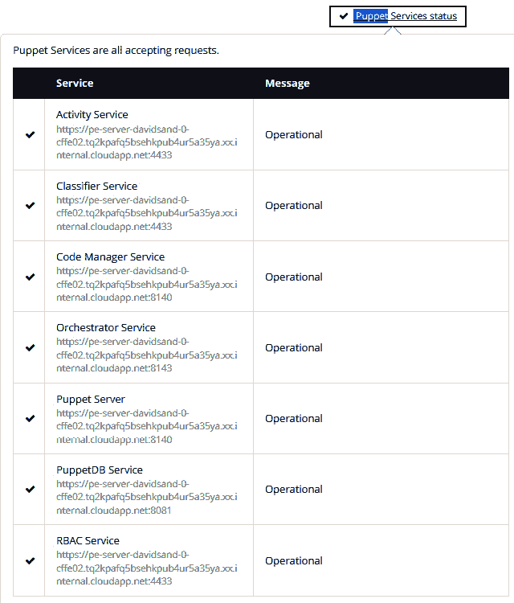
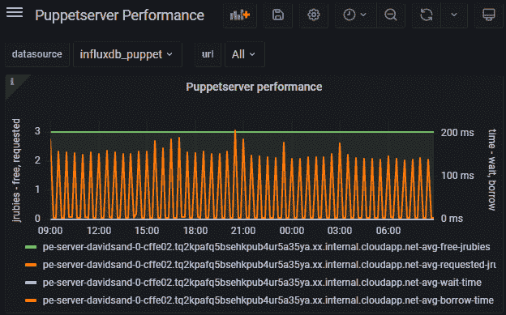
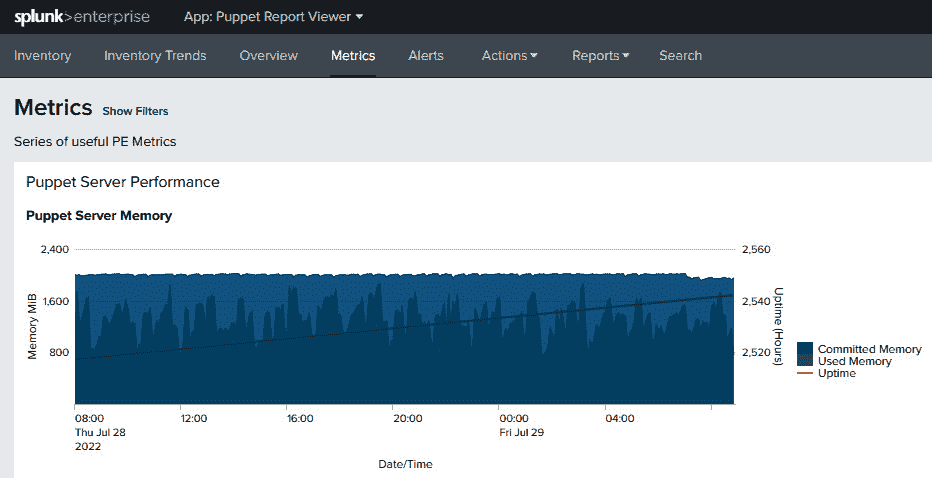
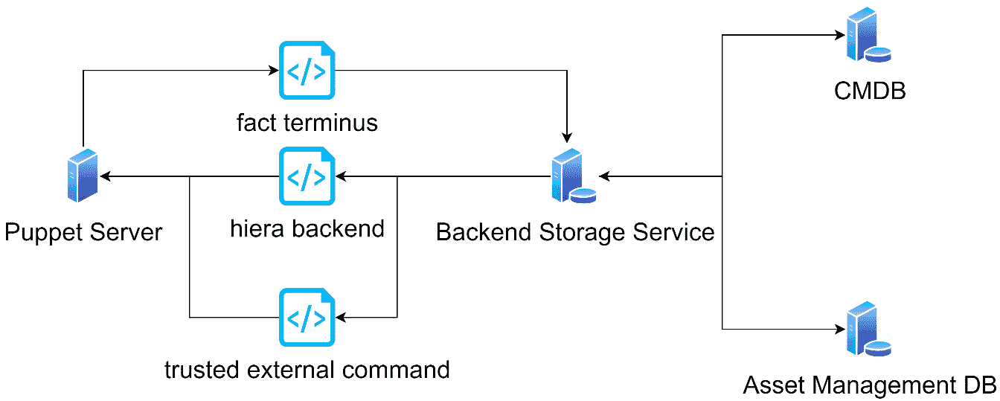

# 13

# 深入探讨 Puppet 服务器

本章将介绍如何监控、调优并将 Puppet 基础设施与第三方数据源集成。你将了解如何查找我们在前几章讨论的各种服务的日志，并如何查找当前的状态 API。接着，你将学习如何将这些日志和状态集成到像**logstash**这样的服务中，以提供更大的可见性和告警选项。然后，我们将回顾 Puppet 提供的性能指标，以及如何将这些指标与 Splunk 和 Grafana 等仪表板工具集成，从而为 Puppet 的基础设施提供**监控**和**可观测性**。我们将为**Splunk**和**Grafana**设置实验环境，作为 Puppet 操作仪表板的一部分，展示这些仪表板。通过使用这些指标，你将学习如何调整和扩展 Puppet 基础设施的各个组件，以应对 Puppet 扩展时常见的问题和挑战。之后，你将了解外部提供者模式如何使事实、分类和 Hiera 数据能够从外部数据源传输到 Puppet，并允许 Puppet 平台团队提供自助服务，无需完全了解 Puppet 或环境发布程序。本章将展示多个第三方实现，包括**ServiceNow**和**1Password**。在本章的实验中，我们将实现**Puppet 数据服务**（**PDS**）来演示这一模式。

在本章中，我们将涵盖以下主要内容：

+   日志与状态

+   性能指标、调优与扩展

+   识别和避免常见问题

+   外部数据源

# 技术要求

从[`github.com/puppetlabs/control-repo`](https://github.com/puppetlabs/control-repo)将控制仓库克隆到你的 GitHub 账户（`controlrepo-chapter13`），并更新该仓库中的以下文件：

+   使用[`github.com/PacktPublishing/Puppet-8-for-DevOps-Engineers/blob/main/ch13/Puppetfile`](https://github.com/PacktPublishing/Puppet-8-for-DevOps-Engineers/blob/main/ch13/Puppetfile)的`Puppetfile`

+   使用[`github.com/PacktPublishing/Puppet-8-for-DevOps-Engineers/blob/main/ch13/hiera.yaml`](https://github.com/PacktPublishing/Puppet-8-for-DevOps-Engineers/blob/main/ch13/hiera.yaml)的`hiera.yaml`

+   使用[`github.com/PacktPublishing/Puppet-8-for-DevOps-Engineers/blob/main/ch13/site.pp`](https://github.com/PacktPublishing/Puppet-8-for-DevOps-Engineers/blob/main/ch13/site.pp)的`manifests/site.pp`

通过下载[`github.com/PacktPublishing/Puppet-8-for-DevOps-Engineers/blob/main/ch13/params.json`](https://github.com/PacktPublishing/Puppet-8-for-DevOps-Engineers/blob/main/ch13/params.json)中的`params.json`文件，构建一个包含三个编译器和三个客户端的大型集群，并更新文件以包含你的控制仓库位置和控制仓库的 SSH 密钥。然后，从你的`pecdm`目录运行以下命令：

```
bolt --verbose plan run pecdm::provision --params @params.json
```

首先，我们将查看在哪里可以找到日志以及 Puppet 服务和基础设施的当前状态。这对于如何调优和排除 Puppet 故障至关重要。

# 日志记录和状态

当我们在本书中之前讨论不同的 Puppet 组件时，我们列出了日志目录，但有一个统一的日志参考点是很有用的。

## 探索日志位置

本节提供了这些日志的列表，标题包括核心功能、包含目录和该目录中的日志列表：

+   `/var/log/puppetlabs/puppetserver/`：主要服务器日志目录

+   `puppetserver.log`：主要的服务器日志，记录其活动

+   `puppetserver-access.log`：访问端点的请求

+   `puppetserver-daemon.log`：崩溃报告和致命错误

+   `puppetserver-status.log`：服务的调试状态日志

+   `/var/log/puppetlabs/postgresql/<version>`：PostgreSQL 日志目录*   `pgstartup.log`：启动日志*   `postgresql-<Mon – Sun>.log`：每日调试日志*   `/var/log/puppetlabs/puppetdb/`：PuppetDB 日志目录*   `puppetdb.log`：PuppetDB 服务活动日志*   `puppetdb-access.log`：访问端点的请求*   `puppetdb-status.log`：服务的调试状态日志*   `/var/log/puppetlabs/puppetserver/`：主要服务器日志目录*   `code-manager-access.log`：访问代码管理器端点的请求*   `file-sync-access.log`：访问文件同步端点的请求*   `pcp-broker.log`：编译器上的 Puppet 通信协议代理*   `/var/log/puppetlabs/console-services/`：Puppet Enterprise 控制台服务日志目录*   `console-services.log`：控制台服务活动日志*   `console-services-api-access.log`：访问控制台服务 API 端点的请求*   `console-services-access.log`：访问控制台服务端点的请求*   `console-services-daemon.log`：崩溃报告和致命错误日志*   `/var/log/puppetlabs/nginx/`：nginx 日志目录*   `access.log`：访问 nginx 端点的请求*   `error.log`：nginx 错误和一般控制台错误*   **代理日志：**

当你手动运行 Puppet 时，你在屏幕上看到的代理输出会根据`puppet.conf`文件中的`logdest`和`logdir`设置记录到一个位置。`logdest`参数可以设置为`syslog`（发送到 POSIX syslog 服务）、`eventlog`（发送到 Windows 事件日志）、`console`（日志发送到控制台）或一个文件名，以便将其输出到`logdest`设置的位置下的该文件名。`syslog`是 Unix 系统的默认设置，而`eventlog`是 Windows 的默认设置。`logdest`的默认值为 Unix 的`/var/log/puppetlabs/puppet`和 Windows 的`C:\ProgramData\PuppetLabs\puppet\var\log`。

注意

可以开启服务器配置文件分析，它可以生成详细的目录日志信息。然后可以将其绘制为图形，展示目录编译的深入调试信息。本书不涉及此内容。更多信息请参考 Puppet 的文档：[`github.com/puppetlabs/puppet/blob/main/docs/profiling.md`](https://github.com/puppetlabs/puppet/blob/main/docs/profiling.md)。

经过对不同日志位置的检查，我们可以清楚地看到，将这些服务器日志转发到专用工具中以便索引和处理是非常有用的。

## 转发服务器日志

随着 Puppet 客户端数量的增加，我们在*第十章*中完成的日志跟踪工作变得不切实际。在这种情况下，需要更专业的`logback.xml`，可以将其发送到像 Elastic 的 Logstash 或 Grafana 的 Loki 这样的日志后端。`logback.xml`文件包含`appender`定义，它是 Logback 用于写入日志的组件。

通过观察`puppetserver.log`的`appender`配置，我们可以看到当前的配置：

```
    <appender name="F1" class="ch.qos.logback.core.rolling.RollingFileAppender">
<file>/var/log/puppetlabs/puppetserver/puppetserver.log</file>
        <append>true</append>
        <rollingPolicy class="ch.qos.logback.core.rolling.SizeAndTimeBasedRollingPolicy">
<fileNamePattern>/var/log/puppetlabs/puppetserver/puppetserver-%d{yyyy-MM-dd}.%i.log.gz</fileNamePattern>
            <!-- each file should be at most 200MB, keep 90 days worth of history, but at most 1GB total -->
            <maxFileSize>200MB</maxFileSize>
            <maxHistory>90</maxHistory>
            <totalSizeCap>1GB</totalSizeCap>
        </rollingPolicy>
        <encoder>
            <pattern>%d{yyyy-MM-dd'T'HH:mm:ss.SSSXXX} %-5p [%t] [%c{2}] %m%n</pattern>
        </encoder>
    </appender>
```

在这里，我们可以看到它是如何追加到日志中的，使用的文件名模式，以及日志轮转的日期，并且每个文件的大小不会超过 200 MB，总大小不超过 1 GB，日志将不会保存超过 90 天。编码器展示了日志条目的构成方式。

为了添加日志的 JSON 版本，我们可以做一个类似的条目，仅包含 5 天的日志。在这里，编码器是 Logstash 编码器，用于以 JSON 格式输出。以下是此`appender`的代码：

```
<appender name="server_JSON" class="ch.qos.logback.core.rolling.RollingFileAppender">
    <file>/var/log/puppetlabs/puppetserver/puppetserver.log.json</file>
    <rollingPolicy class="ch.qos.logback.core.rolling.TimeBasedRollingPolicy">
        <fileNamePattern>/var/log/puppetlabs/puppetserver/puppetserver.log.json.%d{yyyy-MM-dd}</fileNamePattern>
        <maxHistory>5</maxHistory>
    </rollingPolicy>
    <encoder class="net.logstash.logback.encoder.LogstashEncoder"/>
</appender>
```

要在`logback.xml`文件的底部启用此`appender`，请添加以下定义：

```
    <root level="info">
        <!--<appender-ref ref="STDOUT"/>-->
        <appender-ref ref="${logappender:-DUMMY}" />
        <appender-ref ref="F1"/>
    </root>
```

在根部分中添加`<appender-ref ref="server_JSON"/>`将启用我们的 JSON `appender`。重新启动`puppetserver`服务将启用新的`appender`。

要设置`server-access.log`，可以使用[`github.com/PacktPublishing/Puppet-8-for-DevOps-Engineers/blob/main/ch13/appender_example.xml`](https://github.com/PacktPublishing/Puppet-8-for-DevOps-Engineers/blob/main/ch13/appender_example.xml)中的代码，这将添加一个`appender`，它将配置适当模式的 JSON 输出。

在这种情况下，您需要考虑磁盘空间。可以使用 JSON 日志记录来运行此操作。Logback 是一个强大的库，但本书无法涵盖所有选项。可以在[`logback.qos.ch/manual/configuration.html`](http://logback.qos.ch/manual/configuration.html)和[`logback.qos.ch/manual/appenders.html`](https://logback.qos.ch/manual/appenders.html)中查看这些选项。

现在日志文件以 JSON 格式存在，可以配置像 Grafana 的 **Promtail** 或 Elastic 的 **Filebeat** 这样的工具，将日志文件转发到像 Elastic 的 Logstash 或 Grafana 的 Loki 这样的服务。由 **Logrotate** 管理的 Ruby 日志也可以被收集，但这需要更多的工作，去为它们设置合适的模式进行处理。

注意

Puppet Enterprise 服务、`console-services`、PuppetDB 和协调服务都使用 Logback，并可以像这样转发它们的日志。

在回顾了如何将日志发送到外部服务进行处理之后，我们将看到如何将应用 Puppet 目录生成的报告通过报告处理器发送到外部工具。

## 报告处理器

除了服务器日志记录，如 *第十章* 所示，每次运行目录都会生成报告。在 *第十章* 中，您看到如何通过 `peadm` 配置它，以便使用 `reports = puppetdb` 在 `puppet.conf` 的 `master/server` 部分将其存储在 `puppetdb` 中。设置这个 `reports` 值告诉服务器使用报告处理器，这是一个在 Puppet Server 接收到报告时运行的 Ruby 脚本。然后该脚本执行操作，将其传递给目标。在 PuppetDB 的情况下，就是将报告发送到 PuppetDB 存储。有三个内置的报告处理器：`http`、`log` 和 `store`。`http` 将报告发送到通过 `puppet.conf` 中的 `reporturl` 设置指定的 HTTP 地址，格式为 YAML。`log` 将报告输出发送到 `puppet.conf` 中 `logdest` 和 `logdir` 指定的日志文件，而 `store` 将报告的输出放入 `puppet.conf` 中 `reportdir` 设置指定的文件。Puppet Forge 中还有其他自定义报告处理器可用，包括 Splunk 集成模块，详细信息请参见 [`forge.puppet.com/modules/puppetlabs/splunk_hec`](https://forge.puppet.com/modules/puppetlabs/splunk_hec)，以及 Datadog 代理模块，详细信息请参见 [`forge.puppet.com/modules/datadog/datadog_agent`](https://forge.puppet.com/modules/datadog/datadog_agent)，这使得报告数据可以在这些第三方服务中查看。根据模块的不同，指令有所不同，但通常，添加报告处理器所需的最小操作是 Puppet Server 在环境中部署该模块，并且报告的转发器名称已设置。编写自定义报告处理器超出了本书的范围，但可以在 [`puppet.com/docs/puppet/latest/reporting_write_processors.html`](https://puppet.com/docs/puppet/latest/reporting_write_processors.html) 中找到详细信息。

)

除了日志和报告，我们还可以通过调用状态 API 来查看当前 Puppet 基础架构的状态。

## 访问状态 API

Puppet 提供了一个可以通过`GET /status/v1/services`调用的状态端点。该端点返回服务器上所有已知服务的状态。此访问由`auth.conf`控制，并可以通过 Puppet CA 证书在本地访问，如下所示：

```
cert="$(puppet config print hostcert)"
cacert="$(puppet config print localcacert)"
key="$(puppet config print hostprivkey)"
uri="https://$(puppet config print server):8140/status/v1/services"
curl --cert "$cert" --cacert "$cacert" --key "$key" "$uri" | jq
```

最后的 JQ 管道（命令行 JSON 处理器）是可选的，但它使输出更具可读性。以下是 Puppet Server 状态输出的示例：

```
{
  "server": {
    "service_version": "7.6.0",
    "service_status_version": 1,
    "detail_level": "info",
    "state": "running",
    "status": {},
    "active_alerts": []
  },
```

可以通过在 URL 中添加服务名称来定位单个服务——例如，`GET/status/v1/services/server`。对于有额外服务的 PE 安装，应该为每个服务调用特定的端口。PE 服务将在*第十四章*中讨论。

这些调用的返回代码将是`200`，表示所有服务正在运行；`404`表示找不到服务；或`503`，表示服务状态不在运行状态。

当所有服务都在运行时，服务器状态为`running`；如果任何服务报告错误，则为`error`；如果任何服务处于`starting`或`stopping`状态，则为这两种状态之一；如果任何服务报告未知状态，则为`unknown`。

Puppet Enterprise 提供了一个额外的命令行选项，可以通过`puppet infrastructure status`命令调用 API，输出类似如下所示：

```
Puppet Server: Running, checked via https://pe-server-davidsand-0-cffe02.tq2kpafq5bsehkpub4ur5a35ya.xx.internal.cloudapp.net:8140/status/v1/services
  PuppetDB: Running, checked via**https://pe-server-davidsand-0-cffe02.tq2kpafq5bsehkpub4ur5a35ya.xx.internal.cloudapp.net:8081/status/v1/services**
```

在网页控制台中，您可以通过点击**Puppet 服务状态**按钮查看 Puppet 服务的状态，如下图所示：



图 13.1 – 网页控制台中的 Puppet 服务状态

注

`puppet status`命令在 Puppet 5 中已被弃用，并在 Puppet 7 中删除。它没有使用 API 端点。

到目前为止，我们查看的日志、报告和状态让我们了解 Puppet 基础设施和客户端的行为，但它们并未告诉我们关于基础设施及其客户端的整体性能。接下来，我们将查看 Puppet 提供的指标，以及如何使用它们来监控基础设施的性能和容量。

# 指标、调优和扩展

为了通过服务状态 API 提供更详细的 Puppet 服务性能和健康数据，可以将`level`标志设置为`debug`；这将返回指标。例如，要返回 Puppet Server 的指标并使用 JQ 进行过滤，可以运行以下命令：

```
cert="$(puppet config print hostcert)"
cacert="$(puppet config print localcacert)"
key="$(puppet config print hostprivkey)"
uri="https://$(puppet config print server):8140/status/v1/services/server?level=debug"
curl --cert "$cert" --cacert "$cacert" --key "$key" "$uri" | jq ".status.experimental"
```

这将输出如下指标的数据，例如`puppet-v3-catalog`端点：

```
{
  "http-metrics": [
    {
      "route-id": "puppet-v3-catalog-/*/",
      "count": 41,
      "mean": 4459,
      "aggregate": 182819
    },
```

这给出了自服务上次重启以来，`count`表示对该端点进行的调用次数。`mean`是 5 分钟内的平均响应时间，而`aggregate`是服务启动以来的总时间。

各种服务中有许多度量指标。要查看这些度量的定义，可以在文档中查看 API 服务（例如，[`puppet.com/docs/pe/2021.7/status_api.html`](https://puppet.com/docs/pe/2021.7/status_api.html)）。不过，总体来说，它们的文档并不完善，可能需要一些探索，或者你可以在 Puppet 的 Slack 渠道和支持渠道（如果你有合同的话）上提问。不要被大多数度量标题中的*实验性*标签所困扰——大多数度量数据已经可用了，只是 Puppet 尚未移除实验性标签。

注意

有关 Puppet 的底层度量库如何工作的详细解释，可通过[`www.youtube.com/watch?v=czes-oa0yik&t=0s`](https://www.youtube.com/watch?v=czes-oa0yik&t=0s)观看，由该度量库的作者提供。

现在，让我们来看一下用于展示度量数据的仪表盘。

## 探索度量仪表盘

Puppet 提供了三种实现方式，自动化收集和展示度量数据的过程：

+   **Puppet 操作仪表盘**，可在[`forge.puppet.com/modules/puppetlabs/puppet_operational_dashboards`](https://forge.puppet.com/modules/puppetlabs/puppet_operational_dashboards)找到，是一个由 Puppet Forge 提供的支持模块，集成了 Telegraf、InfluxDB 和 Grafana，提供机制来发送 API 度量数据、将其存储在时间序列数据库中，并在预配置的仪表盘中可视化数据。操作仪表盘支持 Puppet Enterprise 和开源 Puppet。下图展示了一个此类仪表盘的示例：



图 13.2 – Grafana Puppetserver 性能仪表盘

+   **Splunk 插件**，可在[`splunkbase.splunk.com/app/4413/#/overview`](https://splunkbase.splunk.com/app/4413/#/overview)找到，是一个在 Splunk 商店中的应用，可以添加到你的 Splunk 设置中，提供预配置的仪表盘。Splunk **HTTP 事件收集器**（**HEC**）模块可在[`forge.puppet.com/modules/puppetlabs/splunk_hec`](https://forge.puppet.com/modules/puppetlabs/splunk_hec)找到。[`forge.puppet.com/modules/puppetlabs/pe_event_forwarding`](https://forge.puppet.com/modules/puppetlabs/pe_event_forwarding)可以与此模块结合，使用 HTTP 将度量数据发送到 HEC 模块。下图展示了一个 Splunk 仪表盘的示例，其中绘制了 Puppet 服务器内存：



图 13.3 – Splunk Puppet 服务器内存仪表盘

Puppet 团队共同合作，保持 Splunk 和 Grafana 仪表盘的一致性。

对于 Puppet Enterprise，还有一个`/opt/puppetlabs/puppet-metrics-collector`目录。然后可以使用诸如`grep`或`JQ`的命令（假设终端处于度量收集器目录中）搜索这些 JSON 文件。两个常见的查询将在`average-free-jrubies`和`queue_depth`中详细解释。可以像这样添加：

```
grep -oP '"average-free-jrubies.*?,' puppetserver/primary.example.com/*.json puppetserver/pe-server-davidsand-0-cffe02.tq2kpafq5bsehkpub4ur5a35ya.xx.internal.cloudapp.net/*.json
"puppetserver/pe-server-davidsand-0-cffe02.tq2kpafq5bsehkpub4ur5a35ya.xx.internal.cloudapp.net/20220731T220502Z.json":"average-free-jrubies":3
jq '.. |."queue_depth "? | select(. != null)| input_filename , .' -- puppetdb/pe-server-davidsand-0-cffe02.tq2kpafq5bsehkpub4ur5a35ya.xx.internal.cloudapp.net/*.json
"puppetdb/pe-server-davidsand-0-cffe02.tq2kpafq5bsehkpub4ur5a35ya.xx.internal.cloudapp.net/20220731T221001Z.json"
0
```

为了更方便地共享这些数据，可以通过运行`/opt/puppetlabs/puppet-metrics-collector/scripts/create-metrics-archive`命令来归档数据，如果希望归档一定天数的数据，可以使用`–r`标志。

在了解了如何收集和显示度量后，我们将讨论一些常见的性能和容量问题，以及如何使用度量来管理它们。

## 识别并避免常见问题

设置好日志、状态和度量后，我们需要考虑应该关注什么以及如何检查我们的 Puppet 基础设施。应该有正常的 CPU、内存和磁盘使用情况监控，但有一些关键的功能区域需要关注。我们将在接下来的章节中讨论这些内容。

### 目录编译

在 *第十章*中，我们学习了每次**目录编译**都需要一个 JRuby 实例来为每个 Puppet 请求编译目录，并且 Puppet 主服务器或编译服务器提供了这个 JRuby 能力。为了计算处理基础设施负载所需的 JRuby 实例数，我们可以将**运行间隔**（服务器检查频率）除以编译的平均时长。这样就能得出每台服务器所需的 JRuby 实例数。然后，我们可以将预期基础设施中 Puppet 客户端的数量除以这个数字，得到所需的 JRuby 实例总数估算值：

添加此内容：*总 JRuby 实例数 = Puppet 客户端数量 / (运行间隔 / 平均* *编译时长*

选择适当的基础设施大小可能会很复杂。可以通过在`puppetserver.conf`文件中运行`max-active-instances`来设置主服务器或编译服务器上的 JRuby 实例数；默认情况下，它设置为 CPU 数量减 1，范围为 1 到 4。每个 JRuby 实例需要在 JVM 堆栈中分配内存。对于 Puppet Enterprise，这个文件是通过设置`hiera`值为`puppet_enterprise::master::puppetserver::jruby_max_active_instances:`来控制的。

总 JVM 堆栈内存由 Puppet 服务器启动脚本分配，根据操作系统的不同，可能位于`/etc/sysconfig/puppetserver`或`/etc/defaults/puppetserver`。这个内存大小由`xmx`参数设置，可以计算出每个 JRuby 实例默认需要 512MB 的内存，并为其他 Java 任务保留 512MB 的空余空间：

添加此内容：*所需总堆栈大小 = 512MB + 最大活动实例数 ** *512MB*

建议你永远不要超过 32 GB 的 JVM 堆栈大小。根据各种现场实验的结果，JRuby 实例的最大有效数量似乎在 11 到 13 之间。这个最大值通常适用于规模更大的环境，并且需要关注以防止编译器故障。在这种情况下，完全依赖水平扩展是不明智的；应该与**垂直扩展**（增加更多的编译服务器）相结合。

在刚开始时，进行大小调整建议可能会很困难——你可能不清楚你的平均编译时间会是多少，而编译的秒数可能会产生很大的影响，因此，在整个环境逐步扩展时，监控 JRuby 的使用情况和目录编译时间是明智的，并且在出现时寻找异常值。Puppet 为 Puppet Enterprise 大小调整提供了一些指南，详情请参考[`puppet.com/docs/pe/2021.7/tuning_infrastructure.html`](https://puppet.com/docs/pe/2021.7/tuning_infrastructure.html)。

在监控目录性能时，我们有一些关键的关注点。`jruby.num-jrubies`和`jruby.num-free-jrubies`指标显示服务器上有多少个 JRuby 实例，以及其中有多少个是空闲的。在查看这些指标时，应计算基础设施的平均使用容量。建议避免超过 80%的使用率，因为性能通常在超过这个值后无法扩展。你还应该确认负载均衡器没有问题，并且空闲的 JRuby 实例在编译器之间使用均衡。一个可能发生的问题是**雷鸣群体效应**，即许多服务器同时请求目录编译。这可以通过 JRuby 实例使用的巨大峰值在指标中看到。如果你遇到这种情况，可以使用**Puppet 运行调度器**模块，详情请参见[`forge.puppet.com/modules/reidmv/puppet_run_scheduler`](https://forge.puppet.com/modules/reidmv/puppet_run_scheduler)，来分散 Puppet 代理运行的调度。

如果超过了 JRuby 池的容量，请求将会排队并在默认情况下超时，超时为 10 秒。`borrow-timeout-count`指标提供了等待 JRuby 实例变得可用时超时的请求数量。

### 目录运行时间

如前所述，目录的运行时间对基础设施中所需的 JRuby 实例数量有巨大影响。查看`metrics-time-total`指标，它显示报告事件发送的编译时间，我们可以查看编译的平均时间，帮助进行容量计算。我们还可以查看这些数据的分布，看看是否存在任何极端异常值，我们希望对该目录及其 Puppet 代码进行调查。

可以查看以下表格中一些关键区域：

| **指标定义** | **指标名称** |
| --- | --- |
| 目录编译时间 | `Metrics-time-config_retrieval` |
| 应用目录的时间 | `Metrics-time.catalog_application` |
| 目录中的资源数量 | `Metrics-resources-total` |
| 生成事实的时间 | `Metrics-changes-total` |

表 12.1 – 目录指标

在这些度量指标中，您应该确保每个异常值是有原因的。如果代码或事实较为复杂，或某些资源已知较慢，这可能是正常的，或者可能是需要在应用到更多服务器之前审查的低效代码，从而节省基础设施容量。

### PuppetDB 和 PostgreSQL 调优

对于 PuppetD，最佳的监控指标是 `jvm-metrics.heap-memory.committed` 和 `jvm-metrics.heap-memory.used`。如果已用内存的大小经常接近已分配内存的大小，最好增加堆栈大小。与编译器类似，这涉及到更新 `/etc/sysconfig/` 或 `/etc/default/puppetdb` 中的 `puppetdb` 或 `pe-puppetdb` 配置文件（取决于操作系统），并更新 `JAVA_ARGS` 参数。例如，如果你发现 `jvm-metrics.heap-memory.committed` 设置为 512 MB，但 `jvm-metrics.heap-memory.used` 经常接近这个限制，可以将最大堆内存大小从 `JAVA_ARGS ="-Xmx512m"` 更新为 `JAVA_ARGS="-Xmx1g"`。完成后，需要重启 PuppetDB 服务。但是，请注意，所有因内存不足而排队的任务将在重启后继续执行。对于 Puppet Enterprise，这个文件可以通过将 `hiera` 值设置为 `puppet_enterprise::profile::puppetdb::java_args:` 来控制。

另一个好的性能指示是队列深度，表示为 `puppetdb-status.status.queue_depth` 指标。如果这个值很高且有空闲的 CPU，那么增加 PuppetDB 可用的 CPU 线程数量将是有益的。这可以在 PuppetDB 配置文件 `/etc/puppetlabs/puppetdb/conf.d` 中完成。如果 PuppetDB 是通过包安装的，可以在 `[command-processing]` 部分的 `threads` 键中设置，或者如果使用了 Puppet PuppetDB 模块（在 Puppet Enterprise 中也是如此），则应使用模块的设置来调整类。在 Puppet Enterprise 中，可以在 Web 控制台的 **节点组** 部分进行调整。任何对线程的更改都需要重启 PuppetDB 服务。

反向场景是，CPU 使用率很高且限流，但 PuppetDB 队列较低，这时应释放线程以提高其他服务的吞吐量。

### 调优大小

为了帮助根据可用硬件获得正确的服务器设置，Puppet Enterprise 提供了 `puppet infrastructure` `tune` 命令。

这会计算出应用于服务器的最佳设置。以下是命令输出中的建议 Hiera 设置示例：

```
puppet_enterprise::profile::database::shared_buffers: 3176MB
puppet_enterprise::puppetdb::command_processing_threads: 1
puppet_enterprise::profile::puppetdb::java_args:
  Xms: 1588m
  Xmx: 1588m
puppet_enterprise::profile::orchestrator::jruby_max_active_instances: 2
puppet_enterprise::profile::orchestrator::java_args:
  Xms: 1588m
  Xmx: 1588m
puppet_enterprise::profile::console::java_args:
  Xms: 1024m
  Xmx: 1024m
puppet_enterprise::master::puppetserver::jruby_max_active_instances: 2
puppet_enterprise::profile::master::java_args:
  Xms: 1536m
  Xmx: 1536m
puppet_enterprise::master::puppetserver::reserved_code_cache: 192m
```

这些提取的数据可以放入 Hiera 文件中，并与主服务器进行分类。请注意，如果内存足够大，它会推荐堆大小配置超过 32 GB。这是次优配置，正如我们在查看编译大小和问题时讨论的那样。

以下是一般建议：

处理度量指标的数量可能看起来很困难，尤其是在缺乏明确定义的情况下，但如果使用 Splunk 插件或操作仪表板，这可以为你提供与 Puppet 支持团队使用和监控的一致视图。了解你的环境在这些数值下的常态行为，并查看图表中的尖峰，将它们与其他数据关联起来，可以帮助你发现问题。

使用 Puppet 的知识库，它自 2021 年 4 月起向所有用户开放，可以帮助你搜索问题。查看如 [`support.puppet.com/hc/en-us/sections/360000926413-Performance-tuning`](https://support.puppet.com/hc/en-us/sections/360000926413-Performance-tuning) 这样的文章集合，可以帮助你更深入理解你遇到的任何问题。

## 实验 – 配置度量仪表板

在讨论了度量标准和 Puppet 的两种查看选项之后，我们可以配置 Splunk 仪表板和 Puppet 操作仪表板，以查看提供的仪表板。使用前一部分中描述的关于 PuppetDB 和编译器容量的问题，找到可以帮助你调查的图表。

配置 Puppet 操作仪表板：

1.  选择一个节点来托管 Puppet 操作仪表板，并在 Web 控制台中将 `puppet_operational_dashboards` 分类为节点组。

1.  在节点组的 PE 基础设施代理中，将 `puppet_operational_dashboards::enterprise_infrastructure` 添加到 **Classes**（类）标签下的类列表中。

1.  在所有节点上运行 `puppet`，直到服务器显示为干净状态。

1.  登录到 `https://<operational_dashboard_node_ip>:3000`，`user=admin password=admin`。

配置 Splunk：

1.  在 [`www.splunk.com/en_us/sign-up.html?301=/page/sign_up`](https://www.splunk.com/en_us/sign-up.html?301=/page/sign_up) 注册一个 Splunk 账户（这是免费的）。

1.  选择另一个节点来托管 Splunk Enterprise，通过在 Web 控制台上将 `splunk::enterprise` 分类为节点组并固定所选节点。

1.  安装 Puppet 报告查看器：

    1.  登录并下载 [`splunkbase.splunk.com/app/4413/`](https://splunkbase.splunk.com/app/4413/)。

    1.  登录到 `https://<splunk_server_ip>:8000`，`username`=`admin` 和 `password`=`changeme`。

    1.  选择 **Apps** 栏左上角的齿轮图标。

    1.  在下一个屏幕中，选择右上角的 **upload app from file**（从文件上传应用）。

1.  在 Splunk 中将许可证设置为免费：

    1.  点击右上角的 **Settings**（设置）。

    1.  在系统下拉菜单中，选择 **Licensing**（许可）。

    1.  选择 **change**（更改） **license group**（许可证组）。

    1.  选择 **free license**（免费许可证）并点击 **Save**（保存）。

1.  在 Splunk 中创建 HEC 令牌：

    1.  在 Splunk 控制台中导航到 **Settings** | **Data Input**。

    1.  添加一个新的 HTTP 事件收集器，命名为您选择的名称。

    1.  确保 **Indexer acknowledgement** 未启用。

    1.  单击 **Next** 并将 **source type** 设置为 **Automatic**。

    1.  确保 **App Context** 设置为 **Puppet** **Report Viewer**。

    1.  添加主索引。

    1.  设置 **默认索引** 为 **main**。

    1.  单击 **Review** 然后点击 **Submit**。

1.  在 PE 基础设施节点组中，将 `puppet_metrics_collector` 分类为 `metrics_server_type` 参数设置为 `splunk_hec`。

1.  将 `splunk_hec` 分类为 `enable_reports` 设置为 `true`

1.  `events_reporting_enabled` 设置为 `true`

1.  `manage_routes` 设置为 `true`

1.  `token` 设置为 `<在第 5 步生成的 token>`

1.  `url` 设置为 `https://<public_ip_of_splunk_server>:8088/services/collector`

1.  登录 `https://<public_ip_of_splunk_server>:8000`，并运行 `index=* sourcetype=puppet:summary` 以确保数据正在被收集（可能需要一些时间才能开始）。

现在 Puppet 操作面板和 Splunk 已经配置完成，浏览各种图表和面板，找到与目录容量和 PuppetDB 性能相关的图表。

如果可能，请保留 Splunk 设置，以便在下一部分中使用，因为库存和库存趋势视图是 Facter 终端输出的仪表板视图。

现在您已经了解了如何集成 Puppet 的状态、日志和指标，我们可以查看一种模式，该模式允许我们将 Puppet 与其他服务集成，并为 Puppet 用户提供自助服务。

# 外部数据提供者模式

Puppet 将不再是您系统中唯一的配置和信息来源。很可能会有多个 **配置管理数据库**（**CMDBs**），例如 ServiceNow 或应用程序团队用于存储信息的内部开发系统。您的几位同事和内部客户可能希望能够创建例外和自定义，而无需了解 Puppet 代码及其部署工作流。同时，也会有需求希望能够将 Puppet 数据反馈到外部系统。外部数据提供者模式使这一切成为可能，允许您执行以下操作：

+   在分类中进行更改

+   添加和更改受信任的事实

+   将现有数据作为事实或 Hiera 数据输入

+   将 Facter 数据发送到外部源

在介绍了外部数据提供者模式的核心概念后，我们将探讨其中使用的每个技术组件。

## 了解外部数据提供者组件

该模式的底层组件如下图所示：



图 13.4 – 外部数据提供者模式的核心组件

我们将逐一展示这个模式是如何工作的。本书无法展示如何编写每个组件，但我们会详细说明文档在哪里可以找到。在接下来的部分中，将参考示例实现：

**后端存储服务**（**BSS**）允许你存储数据以供使用。BSS 的技术解决方案并不重要，但它必须具有韧性，并且在读取时提供高吞吐量。

该吞吐量可以通过 *2 + <Hiera 层数>* 来计算每次 Puppet agent 执行时的读取次数。为了说明如果一个 10,000 台服务器的环境使用默认的 30 分钟 agent 执行时间，并且有 5 层 Hiera 配置时，如何计算该吞吐量，可以这样计算：*(2+5) * 10,000 / 1,800 = 39 次查询每秒*（四舍五入）。

像 CMDB 或内部应用程序这样的工具可以直接进行查询并充当 BSS，但该工具能够处理工作负载。

`trusted` 外部命令在 Puppet 6.11 和 7.0 中引入，允许在 Puppet 执行期间运行脚本，并从外部源收集事实和分类信息。此脚本应以客户端的 `certname` 属性作为参数，返回一个包含事实的 JSON 哈希，并且对于任何未知的 `certname` 返回错误代码。可以通过在每个主服务器和编译服务器的 `puppet.conf` 文件的 `master/server` 部分中使用 `trusted_external_command` 设置来配置此脚本。此命令返回的事实将包含在 `trusted.external.basename` 下，其中 `basename` 是脚本的名称。自 Puppet 6.17 和 7.0 起，还可以通过将 `trusted_external_command` 设置为包含多个脚本的目录来使用多个受信外部命令。这对于查询多个源非常有用。每个源将获得不同的基本名称。在外部数据提供者模式中，它用于查询 BSS。

Hiera 后端使用 Ruby 或 Puppet 编写的函数在执行 Hiera 查找时查询 API 或其他源。在外部数据提供者模式中，后端查询 BSS 以获取值。有关此内容的文档，请参见 [`puppet.com/docs/puppet/latest/hiera_custom_backends.html`](https://puppet.com/docs/puppet/latest/hiera_custom_backends.html)。

Puppet 允许使用称为 **termini** 的可插拔后端，并使用间接器，如 *第十章* 中所讨论的，允许 Ruby 脚本访问端点上的键值对。事实 termini 是访问事实端点的 Ruby 脚本，允许将数据发送到其他外部系统。有关此内容的更多详细信息，请参见 [`puppet.com/docs/puppet/latest/indirection.html`](https://puppet.com/docs/puppet/latest/indirection.html) 和 [`puppet.com/docs/puppet/latest/man/facts.html`](https://puppet.com/docs/puppet/latest/man/facts.html)。

## 外部数据提供者实现

在撰写本文时，没有单一的外部数据提供者模式实现所有部分，但它们可以结合使用，以集成多个系统和用途。本节中的示例列表并不旨在穷尽所有内容，但应该能展示可以进行调查的集成范围。如果有必要，我们还将提供文档示例，后续可根据需要进行扩展。

### Satellite

Red Hat Satellite 可以通过报告处理器接收来自 Puppet 服务器的报告，同时使用可在 [`forge.puppet.com/modules/puppetlabs/satellite_pe_tools`](https://forge.puppet.com/modules/puppetlabs/satellite_pe_tools) 获取的模块。然而，也可以使用 `puppetserver_foreman` 模块来配置一个受信任的外部命令，以便从 Satellite 收集各种配置信息，例如智能参数和组织信息作为事实。由于 Puppet 被移除作为默认的配置管理选择，并改为作为可选插件使用，而且 Puppet 版本未能跟上 Satellite 平台的开发进展，参考 [`www.redhat.com/en/blog/upcoming-changes-puppet-functionality-red-hat-satellite`](https://www.redhat.com/en/blog/upcoming-changes-puppet-functionality-red-hat-satellite)，使用此受信任的外部命令可以将 Puppet 服务器的功能迁移为独立的 Puppet 基础设施，而配置则保存在 Satellite 的 Foreman 组件中。请参阅文件/Satellite，了解受信任的外部命令：[`github.com/theforeman/puppet-puppetserver_foreman`](https://github.com/theforeman/puppet-puppetserver_foreman)。

### ServiceNow

已为 Puppet 开发了多个 ServiceNow 集成；CMDB 集成允许使用来自 [`forge.puppet.com/modules/puppetlabs/servicenow_cmdb_integration`](https://forge.puppet.com/modules/puppetlabs/servicenow_cmdb_integration) 的模块提供的受信任命令。

由于大量节点的使用可能会使 ServiceNow 因查询而不堪重负，因此 ServiceNow 应仅在较小规模的 BSS 中使用。它提供了一个使用受信任命令的有用示例。

已开发出一种更好的方法来确保扩展性，其中 ServiceNow 图连接器连接到 Puppet API 并收集必要的数据：[`store.servicenow.com/sn_appstore_store.do#!/store/application/42ae987a1b832c10fa34a8233a4bcb0b`](https://store.servicenow.com/sn_appstore_store.do#!/store/application/42ae987a1b832c10fa34a8233a4bcb0b)。

### Azure Key Vault

Azure Key Vault 的集成是一种调用 Puppet 代码中 `azure_key_vault::secret` 的功能。可以与 Hiera 后端一起使用来访问 Azure Key Vault 秘密。这是一个经过批准的模块（[`forge.puppet.com/modules/tragiccode/azure_key_vault`](https://forge.puppet.com/modules/tragiccode/azure_key_vault)）。

### 1Password

1Password 集成是一个 Hiera 后端，允许在 1Password 设置中进行密钥查找调用：[`forge.puppet.com/modules/bryxxit/onepassword_lookup`](https://forge.puppet.com/modules/bryxxit/onepassword_lookup)。

### Vault

两种 Vault 解决方案（服务器端和客户端）已在 *第九章* 中讨论并演示，但为了回顾，服务器端 Vault 查找实现了一个名为 `hiera_vault` 的 Hiera 后端查找功能。正如在 [`forge.puppet.com/modules/petems/hiera_vault`](https://forge.puppet.com/modules/petems/hiera_vault) 中所讨论的，这允许通过 Hiera 调用 Vault 中的密钥并将其编译到代码中。

### Puppet 数据服务

**Puppet 数据服务** (**PDS**) 提供了外部数据提供者模式的最完整实现之一，唯一的不同是它实现了一个事实终端。PDS 包含以下组件：

+   一个允许用户和应用程序交互的 REST API 和 CLI

+   一个可插拔的后端数据库，用于提供 BSS（在编写时，仅支持 PostgreSQL）

+   一个用于查询 BSS 的 Hiera 后端

+   用于查询 BSS 的受信任外部命令

PDS 的设计重点不局限于某一特定的集成，而是允许 Puppet 平台团队利用外部数据提供者模式提供自助服务并减少操作负担。PDS 提供了一个安装模块（[`github.com/puppetlabs/puppetlabs-puppet_data_service`](https://github.com/puppetlabs/puppetlabs-puppet_data_service)）。构成应用程序和 API 的代码（[`github.com/puppetlabs/puppet-data-service`](https://github.com/puppetlabs/puppet-data-service)）打包为 `deb` 和 `rpm` 格式，这些包由 `install` 模块使用。在编写时，这两个模块仅为 Puppet Enterprise 安装设计，但基础设置并没有将应用程序局限于 Puppet Enterprise，这意味着它可以适配到开源 Puppet。

### Splunk

在本章的 *日志记录和状态* 部分，我们讨论并演示了如何通过 `splunk_hec` 模块利用相同的模块事实终端，将通信从 Puppet 服务器发送到 Splunk 服务器的 Splunk Hec URL（[`github.com/puppetlabs/puppetlabs-splunk_hec/blob/main/lib/puppet/indirector/facts/splunk_hec.rb`](https://github.com/puppetlabs/puppetlabs-splunk_hec/blob/main/lib/puppet/indirector/facts/splunk_hec.rb)）。

Puppet 运行的事实可以发送到 Splunk，然后可以通过 Splunk 应用程序中的库存和库存趋势查看这些数据（[`splunkbase.splunk.com/app/4413/`](https://splunkbase.splunk.com/app/4413/)）。

## 实验室 – 使用 Splunk 和 Puppet 数据服务的动手操作

在讨论了几个集成之后，如果你按照前面的实验步骤进行了 Splunk 安装或重新安装，你可以登录到 Splunk 并查看 **inventory** 和 **inventory trend** 标签。在这里，你将看到 Facter 终端的输出，并可以尝试查看节点中的数据。

在本部分实验中，你将看到如何使用 PDS 来分类节点、更新 Hiera 数据并添加受信事实。

要安装 PDS，你需要执行以下任务：

1.  查看你克隆的控制仓库中的 `hiera.yaml` 和 `site.pp` 文件，了解 PDS 如何使用它们。

1.  配置两个必需的应用程序角色。

1.  对于数据库服务器，执行以下操作：

    1.  从 PE 控制台添加一个新的节点组：

    ```
    Parent name: PE Infrastructure
    Group name: PDS Database
    Environment: production
    ```

    1.  将 `puppet_data_service::database` 类添加到你在前一步创建的 PDS 数据库组中。

    1.  在执行这些步骤之前，使用规则选项卡节点将现有主服务器添加到该组中。

    1.  提交你的更改。

1.  对于 PDS API 服务器，执行以下操作：

    1.  选择 `puppet_data_service::server` 类。

    1.  包括 `database_host: <FQDN of your primary server>` 参数

    1.  选择 `sensitive pds_token` 参数。你可以使用 [`www.uuidgenerator.net/`](https://www.uuidgenerator.net/) 来生成一个 token。

    1.  提交你的更改。

1.  在所有节点上运行 Puppet，直到报告显示没有更改。

1.  在单独的终端窗口中创建一个到主服务器和一个节点的 SSH 会话。

1.  在主服务器上，运行 `pds-cli node upsert <fqdn_of_node> -c motd -e production` 命令。

1.  在节点上运行 `puppet agent –t`。在命令输出中，你将看到 `motd` 已应用默认设置。

1.  在主服务器上，运行 `pds-cli hiera upsert nodes/<fqdn_of_node> motd::content -v '"Hello world its PDS\n"'`。

1.  在节点上运行 `puppet agent –t`。在命令的输出中，你将看到应用了我们设置的 Hiera 覆盖的 `motd`。

1.  在主服务器上，运行 `pds-cli node upsert <fqdn_of_node> -c motd -d '{"status": "Testing"}' -e production` 和 `pds-cli hiera upsert nodes/<fqdn_of_name> motd::content -v '"Hello world, I am a PDS %{``trusted.external.pds.data.status} Server\n"'`。

1.  在节点上运行 `puppet agent –t`。观察它应用了带有 Hiera 覆盖的新的 `motd`，并为受信事实设置了 `testing` 值。

1.  登录到控制台，查看节点及其事实，检查是否设置了受信事实 `pds.data.status` 为 testing。

# 总结

在本章中，我们总结了各种日志位置，并向您展示了如何将日志转化为 JSON 格式并导出，以便它们能够在如 Elastic 或 Grafana 等日志工具集中处理，这些工具能够更好地对日志进行索引以便查看和分析。我们了解了如何在 Puppet Server 上使用报告处理器，以便通过在客户端应用目录来生成报告。这使得报告能够发送到像 Splunk 这样的工具，并支持高级可视化和搜索。我们还讨论了可用的状态 API，说明了如何通过 API 调用来查找所有正在运行的服务或某个特定服务的状态。展示了 Puppet Enterprise 具有命令行（`Puppet Infrastructure status`）和 Web 控制台选项来调用该 API。通过这些机制，您学习了如何访问关键日志和指标，以便了解系统的当前状态。

为了更好地利用这些信息并深入了解服务的性能，您学习了如何通过在状态 API 中使用`debug`标志来获取 Puppet 指标，以及如何使用 Puppet 操作仪表板和 Splunk 插件等工具来收集和可视化这些数据。Puppet Enterprise 具有 Metrics Collector 模块，它会将指标以 JSON 文件格式本地收集，您可以手动查看或导出这些文件。

为了更好地理解如何使用这些指标和仪表板，我们回顾了一些常见问题，讨论了如何为目录编译调整基础设施规模，避免像“雷鸣效应”这样的服务器需求过度集中的问题，并探讨了如何根据需求的增加或减少来调整 PuppetDB。展示了 PE 中各种基础设施调优工具作为优化已部署硬件设置的选项。

接下来，我们介绍了外部数据提供者模式，它提供了自助服务机制，使得 Puppet 数据能够在外部服务上访问，以便更好地集成。展示了一个后端存储服务的核心组件，用于存储能够处理 Puppet 查询的级别的数据，同时展示了受信任的外部命令和 Hiera 后端作为查询这些数据的方法。展示了 Fact 终端作为从 BSS 导出数据到外部服务的方式。

当使用不同的 Hiera 后端时，展示了这些组件的各种实现，其中 1Password、Azure Key Vault 和 Vault 被展示为访问外部秘密管理器的方式，而 Satellite 和 ServiceNow 则展示了可以通过受信任命令将这些应用程序中的数据输入到 Puppet 代码中的方式。

Puppet 数据服务被证明是该模式最完整的实现之一，并提供了一个稳固的设计，使得内部客户能够在不需要全面了解 Git 工作流和 Puppet 语言的情况下，访问适当暴露的 Puppet 选项，进而实现自助服务。

本节介绍了外部数据提供者模式，展示了如何通过 Puppet Enterprise 实现强大的集成，将数据输入和输出到不同的工具，并朝着将 Puppet 作为重要组成部分来构建平台的目标迈进。

在前一部分讲解了 Puppet Server 的组件、如何在大规模监控性能并进行集成后，下一章将讨论 Puppet Enterprise 特定的服务及其组件。它将描述什么是 Puppet Enterprise，它与开源版本有何不同，提供了哪些额外的服务，以及 Puppet 提供的参考架构，这些架构能更轻松地扩展和使用工具自动化部署及其状态。还将讨论专门针对 Puppet Enterprise 的项目和集成。

# 第四部分 – Puppet Enterprise 与 Puppet 采用方法

本部分将讨论 Puppet Enterprise 及其与开源版本的区别。我们将回顾一些可以扩展 Puppet Enterprise 的 Puppet 相关产品，以及一些 Puppet Enterprise 的具体集成。接着，我们将探讨有助于组织成功采用 Puppet 的方法。我们将探讨如何正确界定用例，从而从常规交付中获益，Puppet 如何在平台工程中发挥作用，以及如何在传统遗留环境和高度监管、变更管理的环境中使用 Puppet。

本部分包含以下章节：

+   *第十四章*，*Puppet Enterprise 简介*

+   *第十五章*，*采用方法*
