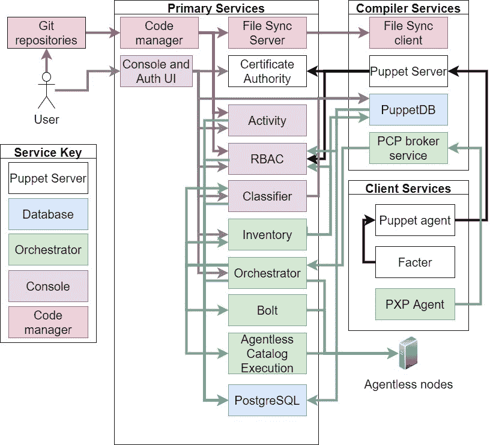

# 14

# Puppet Enterprise 简要概述

本章将概述**Puppet Enterprise**，它是什么以及与**开源 Puppet**相比提供了哪些功能。尽管本书的作者是 Puppet 员工，但本章并非强行推销，而是介绍如何有效地使用 Puppet Enterprise。它将介绍 Puppet 平台中的额外企业控制台服务，展示代码部署、编排服务、RBAC、Web 控制台以及其他各种服务如何自动配置并协同工作。这将有助于理解 Puppet Enterprise 与开源 Puppet 的区别，以及在开源 Puppet 中需要手动创建的预配置和内建功能。将重点介绍支持的架构模式，帮助理解如何使用 Puppet Enterprise 包装和模块自动部署这些模式，从而部署和扩展 Puppet 基础设施。还将讨论一些相关项目和集成，以及它们如何融入 Puppet Enterprise 环境。

本章将涵盖以下主要内容：

+   什么是 Puppet Enterprise？

+   探索 Puppet Enterprise 控制台和服务

+   在 Puppet Enterprise 中使用 Bolt

+   自动化部署和参考架构

+   Puppet Enterprise 相关项目和工具

+   实验—Puppet Enterprise 扩展与配置

# 技术要求

从 [`github.com/puppetlabs/control-repo`](https://github.com/puppetlabs/control-repo) 克隆控制仓库到你的 `controlrepo-chapter14` GitHub 账户，并更新此仓库中的 `Puppetfile` 文件：[`github.com/PacktPublishing/Puppet-8-for-DevOps-Engineers/blob/main/ch14/Puppetfile`](https://github.com/PacktPublishing/Puppet-8-for-DevOps-Engineers/blob/main/ch14/Puppetfile)。

通过下载来自 [`github.com/PacktPublishing/Puppet-8-for-DevOps-Engineers/blob/main/ch14/params.json`](https://github.com/PacktPublishing/Puppet-8-for-DevOps-Engineers/blob/main/ch14/params.json) 的 `params.json` 文件，并根据控制仓库的位置以及控制仓库的 SSH 密钥进行更新，构建一个带有副本的集群，包含三个编译器和三个客户端。然后，从 `pecdm` 目录运行以下命令：

```
bolt --verbose plan run pecdm::provision –-params @params.json
```

# 什么是 Puppet Enterprise？

在讨论 Puppet Enterprise 时，常见的误解是该产品的某些功能被限制，无法为开源用户提供。Puppet Enterprise 的目标并非限制开源用户可用的功能，而是为那些希望轻松使用 Puppet 的客户提供价值，使他们能够通过减少自身在平台上的开发和自动化工作，专注于获得配置管理的价值。

Puppet 通过确保在 Enterprise 中，组件的打包与自动化安装脚本和模块一同进行版本控制和测试，从而减少用户管理基础设施所需的工作量。Puppet Enterprise 使用两种不同类型的版本发布。Puppet Enterprise 采用 *xxxx.y* 模式，通常每 3 个月更新一次，截至目前为 `2023.0`。该版本计划在 2023.3 升级到 Puppet 8.x 版本，并将在其生命周期内不断推出新功能。此版本推荐给那些希望访问最新功能和修复的用户，并且需要定期更新。另一种发布类型是**长期支持**（**LTS**）版本；此版本遵循 *xxxx.y.z* 模式。该分支通常每 3 个月更新一次，但更新只包含修复而不包括新功能。LTS 版本的生命周期为 2 年，并与下一个主要的 *xxxx* 版本重叠 6 个月，因此当前的 2021.7.z LTS 将于 2024 年 8 月 31 日结束主流支持，届时将继续提供重叠支持，直到 2025 年 2 月 28 日，此后用户应迁移到所需版本的 Puppet。2023.y 将成为新的 LTS 发布版本，继续获得 Puppet 的支持。这两种运行中的 Puppet Enterprise 版本通常与两个处于积极开发中的开源 Puppet 版本相对应。2023.0 的发布终止了 Puppet 6，预计 2023 将在 2023.3 版本或稍后转向 Puppet 8。

企业许可证最显著的特点是支持，用户可以向团队提出支持案例，这些团队可以审查基础设施问题并协助解决任何问题或提供支持的模块所需的功能。

Puppet 还提供各种专业服务，如现场服务，提供实操培训和建议。这可能会引导进行架构审查，以了解如何在你的环境中最佳实施，并为产品和解决方案的开发流程提供反馈，如**Puppet 数据服务**（**PDS**）和**Puppet Enterprise 管理模块**（**peadm**）。此外，**技术账户经理**（**TAMs**）将被分配为你提供定期的联系人，帮助你在 Puppet 中取得成功，支持你为你的组织制定成功计划，并专注于确保部署能够实现其目标。

Puppet 提供了 Puppet 产品的参考架构和模式，展示如何在不同的规模和实现类型下工作。构建在 Puppet Server 服务之上的附加应用程序允许进行访问控制、服务器分类、代码部署、可视化和数据搜索，所有操作都可以通过控制台以标准方式完成。我们将在接下来的部分中更详细地探讨这些内容。

# 探索 Puppet Enterprise 控制台和服务

在**Puppet Enterprise 主服务器**中内置了若干附加服务，如下图所示：



图 14.1 – Puppet Enterprise 组件

## Puppet 服务器

**Puppet** 服务与*第十章*中讨论的相同，**证书颁发机构** (**CA**) 提供证书签名过程以保证通信安全，Puppet 代理联系编译器的 Puppet 服务器服务请求目录编译。 **Facter** 用于提供服务器配置文件。在 *图 14**.1* 中，我们选择不显示主服务器本身有一个 Puppet 服务器服务，并且编译器和主服务器都有 Puppet 代理，它们都从主服务器的 Puppet 服务器请求目录编译。

## 引入 Puppet Web 控制台组件

Puppet Enterprise 服务器最明显的直接差异是提供我们在本书实验室中使用的登录视图的 **Web 控制台**。几个服务结合在一起形成控制台服务

控制台是一个基于 Jetty 的 Clojure Web 前端服务，具有充当反向代理的 NGINX 服务器。 NGINX 服务器在 HTTPS 端口 `443` 上监听并将 HTTP 80 重定向到 HTTPS。控制台 UI 提供聚合和翻译 Jetty-based Clojure 服务以生成正确的页面并访问其他控制台服务。

认证 UI 生成登录和重置密码内容页面。展示这一点的最简单方式是使用登录时所需的通信示例，如下图所示：


图 14.2 – 生成登录页面的步骤

可以从图表中看出，作为第一步，NGINX 服务器接收 `GET` 请求，并在执行 TLS 协商后重定向到控制台 Jetty 页面。该页面评估 cookie，确认用户未登录，并重定向到 auth/login 页面，该页面从 NGINX 请求并重定向到认证 UI。认证 UI 生成登录页面，并从 RBAC Jetty 页面获取 **安全断言标记语言** (**SAML**) 配置，然后将此登录页面传回用户。

**RBAC 服务** 具有用户和角色来构建访问策略。它允许在 Puppet Enterprise 中使用本地和远程用户，并可以集成到 **轻量目录访问协议 (LDAP)** 和 SAML 服务中。所有用户默认被拒绝创建、编辑或查看 Puppet Enterprise 的任何部分的权限，然后通过角色授予权限。

默认情况下，将有一个本地管理员用户作为 Puppet 服务的超级用户以及用于 Puppet 服务内部通信的 API 用户进行身份验证。它不能用于登录，只能通过证书身份验证进行身份验证。有一个允许列表，其中包含可以与 API 用户一起使用的证书的 `certname` 值。

角色允许将权限分组，以便授予用户执行操作的权限。权限由**类型**、**权限**和**对象**组成。类型是权限将允许在其上执行操作的对象，例如用户或节点组。权限是创建、编辑或查看的访问级别，而对象是类型的特定实例，例如节点组类型中的 Puppet Enterprise 基础设施节点组。

默认提供五个角色：

+   **管理员**：所有权限

+   **操作员**：创建和修改节点组、部署代码、运行 Puppet、签署证书并查看控制台的权限

+   **查看者**：查看控制台、节点组和作业的权限

+   **代码部署者**：使用代码管理器部署代码的权限

+   **项目部署者**：部署项目、从项目中运行任务和计划，并在调度器中启动、停止和查看作业的权限

可以通过参考[`puppet.com/docs/pe/2021.7/rbac_permissions_intro.html#user_permissions`](https://puppet.com/docs/pe/2021.7/rbac_permissions_intro.html#user_permissions)来创建自定义角色，以找到正确的用户权限粒度。

**LDAP 解决方案**，如**Active Directory**（**AD**）可以将用户组映射到角色，而**SAML 解决方案**，如**Okta**，可以通过属性对用户组进行类似的映射，以匹配角色。LDAP 和 SAML 都可以在 Web 控制台的**访问控制**选项卡中配置，通过选择相应的选项来进行映射。

令牌用于所有 Web 会话，且在运行命令时不需要每次都用密码登录，而是可以生成多个用途的令牌。这些令牌是介于`0`和`2²⁵⁶ – 1`之间的字母数字值，存储在数据库中，并根据参数存储在本地文件位置。令牌通过令牌 API 端点、`puppet access login`命令的 Web 控制台或 CLI 生成。令牌是基于提供的用户凭据生成的，因此将具有该用户设置的权限。默认情况下，`puppet access login`命令会将令牌写入`~/.puppetlabs/token`，其生命周期为 30 分钟，除非使用`--lifetime`选项设置例如`5h`（5 小时）的生命周期。`--print`标志会使令牌仅被打印而不存储，这适用于基于服务的 API 访问。

在*第十一章*中讨论了分类服务，我们探讨了它如何使用**节点组**在 Puppet 中对服务器进行分类，但为了重申关键点，节点组用于通过使用事实或直接固定命名的服务器来将类分类到服务器。节点组是基于继承的，因此节点组的每个子节点都会继承其上方的所有内容。

代码管理器在**第十一章**中进行了讨论，展示了如何使用`r10k`从命名的 Git 存储库中的控制仓库下载基于 Puppet 文件的模块，然后通过`filesync`服务器和`filesync`客户端保持该代码副本在各个服务之间同步。

**活动服务**用于记录通过控制台服务发生的所有活动，可以通过 API 端点以及在 Web 控制台的多个位置查看，例如任何用户和角色的**活动**标签。

Puppet Enterprise 的数据库组件，**PuppetDB**与**PostgreSQL**，与**第十章**中讨论的一样，但几个服务需要额外的数据库来存储它们的状态和记录。因此，创建了以下数据库：

+   `pe-activity`：控制台服务的所有可审计活动

+   `pe-classifier`：所有节点组信息

+   `pe-inventory`：无代理客户端详细信息及其访问方式，用于编排器

+   `pe-orchestrator`：作业运行、作业结果、用户和节点

+   `pe-postgres`：用于模板和一般访问的 Postgres 数据库。请参阅[`www.postgresql.org/docs/current/manage-ag-templatedbs.html`](https://www.postgresql.org/docs/current/manage-ag-templatedbs.html)以进一步了解模板数据库。

+   `pe-puppetdb`：报告、节点信息和上次运行的清单

+   `pe-rbac`：用户、角色、组以及 AD/LDAP 信息

注意

所有 PostgreSQL 通信均使用证书进行，包括与副本的通信。

在*图 14**.1*中未涉及的一个组件是编排器服务。现在我们将介绍编排器如何提供在 Puppet Enterprise 中使用 Bolt 计划和任务的能力。

## 使用 Bolt 与 Puppet Enterprise

在**第十二章**中，介绍了如何在 Bolt 项目中使用`bolt`二进制文件运行 Bolt，但它可以通过**编排器服务**与 Puppet Enterprise 集成，允许将计划和任务作为 Puppet Enterprise 的一部分运行。

主要区别在于，目前只能部署包含任务和计划的 Puppet 模块（包括将它们添加到控制仓库）；目前没有直接将 bolt 项目部署到 Puppet Enterprise 的方法。

注意

通过模块部署的计划和任务意味着相同的计划或任务可以有多个版本，具体取决于运行环境。

还需要注意，并非 Bolt 原生提供的所有功能都能在 Puppet Enterprise 中使用。

以下列表突出显示了在编排器中运行 Puppet Enterprise 的计划和任务与在原生 Bolt 中运行时的主要区别：

+   用于计划的各种 Bolt 功能，如`prompt`、`parallelize`和`file.upload`，尚未实现

+   `puppet apply`模块只能应用于具有 Puppet 代理的节点

+   目标和本地主机目标不可用

+   文件源必须基于模块，不能是绝对路径

这些大部分限制反映了没有从本地机器运行 Bolt，以及缺少运行它们的提示。完整的详情可以在 Puppet 的文档中查看：[`puppet.com/docs/pe/2021.7/plans_limitations.html`](https://puppet.com/docs/pe/2021.7/plans_limitations.html)。

Puppet Enterprise 处理三种类型的节点，包含计划和任务：

+   安装了 Puppet 代理的节点，使用**Puppet 通信协议**（**PCP**）和**PCP 执行协议**（**PXP**）

+   通过**Windows 远程管理**（**WinRM**）和**安全外壳**（**SSH**）传输的无代理节点

+   通过如 F5 和**Palo Alto Networks 操作系统**（**PAN-OS**）等传输或通过资源 API 提供的传输连接的无代理设备，如交换机或防火墙

在介绍了编排器可以运行的计划和任务之后，我们现在来看一下构成编排器的组件，重点介绍这些服务的目的和关键细节，如日志位置和配置文件。

## 编排器服务

编排器应用是一个由下图所示服务组成的**Clojure**应用：


图 14.3 – Puppet 编排器服务的组成部分

让我们概览一下这些组件及其相关的服务和日志文件：

+   `pe-orchestration-services.service`并记录到`/var/log/puppetlabs/orchestration-services/orchestration-services.log`。

+   `POST /command/create-connection` 清单 API 调用（[`puppet.com/docs/pe/2021.7/node-inventory-v1-command-endpoints.html#node-inventory-v1-command-endpoints`](https://puppet.com/docs/pe/2021.7/node-inventory-v1-command-endpoints.html#node-inventory-v1-command-endpoints)）。这些条目通过一个密钥加密，默认情况下存放在`/etc/puppetlabs/orchestration-services/conf.d/secrets/keys.json`，尽管这些条目是单独列出的，但清单服务运行在`pe-orchestration-services`内。它将数据存储在 PostgreSQL 清单数据库中。

注意

添加到清单中的无代理节点会计入 Puppet Enterprise 的整体授权节点数。

+   `pe-bolt-server.service`并记录到`/var/log/puppetlabs/bolt-server/bolt-server.log`。

+   `pe-ace-server.service`并记录到`/var/log/puppetlabs/ace-server/ace-server.log`。

+   `/var/log/puppetlabs/orchestration-services/pcp-broker-access.log`和一般服务日志记录到`/var/log/puppetlabs/orchestration-services/pcp-broker.log`。

+   `pxp-agent.service`并记录到`/var/log/puppetlabs/pxp-agent/pxp-agent.log`。

orchestrator 服务将通过 RBAC 验证 Puppet Enterprise 控制台用户是否拥有正确的权限。对于计划，只能指定用户或组以及他们可以运行的计划，不限制节点或计划来源的环境。对于任务，任务目标允许指定一组任务和一个 **Puppet 查询语言** (**PQL**) 查询节点或节点组，任务可以针对这些节点执行。这可以通过 API 调用完成，如 [`www.puppet.com/docs/pe/2021.7/orchestrator_api_commands_endpoint.html#orchestrator_api_post_command_task_target`](https://www.puppet.com/docs/pe/2021.7/orchestrator_api_commands_endpoint.html#orchestrator_api_post_command_task_target) 所示，或者通过 RBAC 图形用户界面，如下图所示：


图 14.4 – 在 web 控制台上创建任务目标

在下一节中，我们将学习如何通过 orchestrator 运行任务、计划或 Puppet 运行。

## 运行作业

当通过 orchestrator 运行任务、计划或 Puppet 运行时，它们被称为 **作业**。有三种方式运行作业，如下所示：

+   第一种方法是通过 GUI 选择左侧栏中的相关菜单。

+   第二种方法是通过主服务器上的 CLI，语法与 `puppet task run` 和 `puppet plan run` Bolt 命令基本相同。与 Bolt 的关键区别在于，`--nodes` 标志用于代替 `targets`（反映了您只提供节点名称，而 orchestrator 将查找传输信息），并且提供了额外的标志，如 --`node-groups` 标志，用于选择要运行的节点组。以下是一个示例：

    ```
    puppet task run examplemodule::exampletask paramter1=value1 paramter2=value2 --node-group <node group id>
    puppet plan examplemodule::exampleplan parameter1=value1  --nodes examplehost.com,examplehost2.com
    puppet job run --query 'inventory { facts.os.name = "windows" }'
    ```

+   第三种方法是通过 [`puppet.com/docs/pe/2021.7/orchestrator_api_commands_endpoint.html`](https://puppet.com/docs/pe/2021.7/orchestrator_api_commands_endpoint.html) 中文档化的 API，以下是一些关键调用：

    +   `POST /command/deploy`: 按需运行 Puppet

    +   `POST /command/plan_run`: 运行计划

    +   `POST /command/task`: 在一组节点上运行任务

正在进行的作业可以通过按下 *Ctrl* + *C* 在 CLI 中停止，或选择 `POST /command/stop` API 命令。虽然我们应该小心，注意停止的作业底层进程可能会继续运行直到完成。

在 PE 2021.7.1 中引入了一个 API 命令 `POST /command/stop_plan`，允许停止计划。

还可以通过 GUI 或 `API POST /scheduled_jobs/environment_jobs` 在 orchestrator 中调度作业，但需要特别小心，注意使用调度器时的系统负载。由于 orchestrator 无法水平扩展，且任务和计划的队列系统可能会被某些类型的请求轻易阻塞，因此需要特别注意其扩展性限制。

## 配置性能设置

本节中讨论的设置都可以在 Puppet Enterprise orchestrator 基础设施节点组中配置，通过 Web 控制台或以代码形式在 Hiera 中进行配置。

orchestrator 可以同时运行最多数量的任务；这个最大并发任务数通过 `puppet_enterprise::profile::orchestrator::task_concurrency` 参数配置（默认值：`250`），以及 `puppet_enterprise::profile::bolt_server::concurrency`（默认值：`100`）和 `puppet_enterprise::profile::ace_server::concurrency`（默认值：`100`）一起配置，直接限制 Ace 和 Bolt（它们的数量不应大于 `orchestrator::task_concurrency` 总数）。它们的大小主要受到 orchestrator 内存的限制，orchestrator 会为你添加的每个实例容量保留大约 ± 1 MB 的 RAM。任务会按照接收到的顺序处理，直到完成；这意味着长时间运行的任务和目标数较多的任务可能会阻塞其他任务的运行并垄断资源。以运行任务需要 10 分钟来完成 1,000 个服务器为例，这将导致任务使用 250 的队列容量四次，执行任务的总时间为 40 分钟，在此期间，所有其他任务需要排队直到完成。强烈建议任务的执行时间不超过 5 分钟，并且需要精心管理任务，分批运行。同时需要注意，任务队列没有限制，并且有可能触及 `puppet_enterprise::profile::orchestrator::allowed_pcp_status_requests` 参数。理解这一点很重要，这并不意味着任务失败，而是 orchestrator 无法在超时时间内获取任务状态。任务本身可能在此之后已完成。

对于计划，orchestrator 与 Puppet Server 类似，需要 JRuby 实例来编译计划。这个容量由 `puppet_enterprise::profile::orchestrator::jruby_max_active_instances` 设置，JVM 的堆内存通过 `puppet_enterprise::profile::orchestrator::java_args` 设置。

在讨论了 Puppet Enterprise 的核心组件和服务后，我们将进一步探讨如何使用自动化工具部署这些组件，并部署到 Puppet 推荐的参考架构上，以确保基础设施能够根据用户需求进行扩展。

# 自动化部署与参考架构

Puppet Enterprise 专注于创建标准架构和配置以及自动化部署它们。这确保了 Puppet Enterprise 客户能够找到合适的标准架构和模式，并使用提供的工具进行部署，从而减少了设计工作的量。

## 理解支持的架构

Puppet 为 Puppet Enterprise 提供了三种支持的架构，如下所示：

+   **标准安装**仅为一个独立的主服务器，并支持最多 2,500 个客户端。

+   **大型安装**是一个主服务器，后面有编译服务器，通过负载均衡器连接，支持最多 20,000 个客户端。

+   **超大型安装**包括一个主服务器，一个单独的 PuppetDB 服务器，以及通过负载均衡器连接的编译服务器，支持超过 20,000 个服务器。

以下是通过图示说明：


图 14.5 – 标准架构

标准架构受到主服务器能为多少客户端运行目录的限制，最多支持 2,500 个节点。超过此数量后，大型架构允许通过编译节点进行横向扩展，但也面临单个主服务器无法承载所有服务负载的限制。因此，在 25,000 个节点时，超大型架构建议将 PuppetDB 作为最重的服务之一分离到单独的服务器上。

在所有这些架构中，可以通过名为**灾难恢复**（**DR**）的方法，为主服务器和单独的 PostgreSQL 服务器提供副本服务器。如果主服务器或 PostgreSQL 服务器发生故障，灾难恢复可以执行故障转移操作并恢复服务，预期会丢失部分服务，以下是服务的详细表格：

| **服务名称** | **复制类型** | **故障转移方法** |
| --- | --- | --- |
| Puppet 服务器 | 无 | 主动 / 主动 |
| 控制台服务 UI | 无 | 直到手动提升前为只读 |
| ACE 服务 | 无 | 直到手动提升前为只读 |
| Bolt 服务 | 无 | 直到手动提升前为只读 |
| CA | 单向复制 | 直到手动提升前为只读 |
| RBAC | 单向复制 | 直到手动提升前为只读 |
| 分类器 | 单向复制 | 直到手动提升前为只读 |
| 活动 | 单向复制 | 直到手动提升前为只读 |
| 编排 | 单向复制 | 直到手动提升前为只读 |
| 文件同步 | 单向复制 | 直到手动提升前为只读 |
| PuppetDB | 双向 | 主动 – 主动 |

表 14.1 – 服务复制和灾难恢复方法

PuppetDB 在 Puppet Enterprise 中的同步机制是独特的；它在主服务器和副本之间执行读写同步，这也是它在前述列表中唯一可以同步并在提升时可用的服务。其他使用 PostgreSQL 的服务依赖于从主服务器到副本的`PGLogical`同步，使得副本上的数据为只读。

从这个列表可以看出，在主服务器故障时，副本将只能接管并编译已经注册的服务器的目录、来自 PuppetDB 的查询和报告，以及通过 API 进行的节点分类查询。这意味着无法注册或删除新服务器，无法部署新代码，无法使用网页控制台，无法更改分类，并且大部分 CLI 工具将无法使用，直到通过在副本上执行 `puppet infrastructure promote replica` 命令进行手动提升操作。

这是一个不可逆的操作，原始的故障主服务器必须重新部署为副本才能再次使用。因此，对于许多试图修复原始主服务器的用户来说，这比通过 DR 过程更省时。

DR 不应与 **高可用性** (**HA**) 混淆，后者是在服务器丢失的情况下预期的连续服务，而这在当前任何 Puppet 架构中都是不可能的。

注意

使用 DR 时，peadm 确保编译器被拆分并配置为两组，PuppetDB 请求在 PuppetDB 副本的两边分发，以最大化容量。如果选择不使用 pecdm，请确保遵循此优化，可在 [`github.com/puppetlabs/puppetlabs-peadm/blob/main/manifests/setup/node_manager.pp`](https://github.com/puppetlabs/puppetlabs-peadm/blob/main/manifests/setup/node_manager.pp) 中查看代码，A 和 B 组设置数据库的参数。

Puppet 架构还定义了一套跨公共云和私有云区域部署的多区域模式，其中区域由云服务提供商定义为具有区域性低延迟连接的数据中心。完整的细节请参见 [`puppet.com/docs/patterns-and-tactics/latest/reference-architectures/pe-multi-region-reference-architectures.html`](https://puppet.com/docs/patterns-and-tactics/latest/reference-architectures/pe-multi-region-reference-architectures.html)。最佳实践要求编译器具有低延迟连接，因此最好将它们部署在与主服务器和副本服务器相同的区域；同样，主服务器和副本之间的连接必须是低延迟的。因此，最佳做法是使用集中式部署，其中所有 Puppet 基础设施都位于一个所有区域都可以通信的管理区域，如下图所示：


图 14.6 – 集中式和联合式部署

另外，也可以使用联合模型，在每个区域部署 Puppet 基础设施，缺点是没有一个控制台能够查看整个系统。

讨论了架构和模式之后，接下来是查看可用于部署这些模式的工具。

## 部署与配置

Puppet 通过多个层次自动化其服务器基础设施的部署。第一层使用 Puppet Enterprise 安装程序，这是一个从 Puppet 下载的 tarball 文件，其中包含所有必要的软件包和脚本来安装 Puppet Enterprise。下载到目标服务器并解压后，可以通过运行`./puppet-enterprise-installer`来完成基本安装。可以通过创建`-c`标志并指向其位置，按照[`puppet.com/docs/pe/2021.7/installing_pe.html`](https://puppet.com/docs/pe/2021.7/installing_pe.html)上的指导添加自定义配置。一旦 Puppet 服务器配置完成，就可以使用安装脚本自动添加代理；Unix 系统使用 Bash 脚本，Windows 使用 PowerShell 脚本，这些脚本托管在主文件服务器上，确保正确的代理包被安装：

```
uri='https://<PRIMARY_HOST>:8140/packages/current/install.bash' curl --insecure "$uri" | sudo bash -s -- --puppet-service-ensure stopped agent:environment=production
[Net.ServicePointManager]::ServerCertificateValidationCallback = {$true}; $webClient = New-Object System.Net.WebClient; $webClient.DownloadFile('https://<PRIMARY_HOST>:8140/packages/current/install.ps1', 'install.ps1'); .\install.ps1 -PuppetServiceEnsure stopped agent:environment=production
```

在这个示例中，选项将`environment`设置为`production`，并确保服务未运行。完整的选项范围可用并记录在[`puppet.com/docs/pe/2021.7/installing_agents.html`](https://puppet.com/docs/pe/2021.7/installing_agents.html)。

这个`install`脚本仅安装了主服务器，且需要进一步的手动步骤才能根据我们想要的架构添加编译器和副本。为了部署下一个层级，除了直接使用 Enterprise 安装程序外，我们使用`peadm`模块（[`forge.puppet.com/modules/puppetlabs/peadm`](https://forge.puppet.com/modules/puppetlabs/peadm)），这是一个受支持的 Puppet 模块，提供了一种自动化方式来运行 Puppet Enterprise 安装脚本，并自动将其配置为支持的架构之一。此模块假设所请求的配置所需的基础设施已准备好，并且可以进一步提升，使用`pecdm`模块（[`github.com/puppetlabs/puppetlabs-pecdm`](https://github.com/puppetlabs/puppetlabs-pecdm)）在公共云环境中自动进行配置。关于这些模块的使用示例已在*第十二章*中详细讨论，并且是我们在本书中部署实验室时一直使用的方法。

`peadm`模块本身不仅仅是一个简单的部署工具，它还具有显示服务器状态的计划和任务，并允许通过其任务和计划执行版本升级。

Puppet Enterprise 将安装在`Enterprise`文件夹中的模块与通过分类器或 Hiera 数据配置的模块结合，并与其他文件位置一起放置自定义配置。控制台有许多可以配置的项，这些项可以通过 Web 控制台中的分类或通过 Hiera 设置，例如，通过`puppet_enterprise::profile::console::rbac_failed_attempts_lockout`设置的失败登录尝试次数和通过`puppet_enterprise::profile::console::password_minimum_length`设置的密码复杂性规则，如最小密码长度。可以在[`puppet.com/docs/pe/2021.7/config_console.html#configure_the_pe_console_and_console_services`](https://puppet.com/docs/pe/2021.7/config_console.html#configure_the_pe_console_and_console_services)中找到完整的控制台自定义配置列表。

此外，可以通过将文件放置在`puppet_enterprise::profile::console::disclaimer_content_path`指定的路径中，来为控制台放置文件，默认路径为`/etc/puppetlabs/console-services`。你可以创建一个登录控制台时显示的消息，例如贵组织可能需要的法律警告。

此外，在控制台中，还可以基于 PQL 搜索节点，并可以选择预定义的 PQL 示例。你可以通过简单地将文件放置在`/etc/puppetlabs/console-services/custom_pql_queries.json`来将自己的 PQL 示例添加到 Web 控制台，使用`/etc/puppetlabs/console-services/custom_pql_queries.json.example`作为模板。Web 控制台本身默认使用自签名 CA 证书，可以通过将生成的证书放置在`/etc/puppetlabs/puppet/ssl/certs/console-cert.pem`和`/etc/puppetlabs/puppet/ssl/private_keys/console-cert.pem`来替换为由贵组织 CA 系统签名的证书。另一个需要考虑的关键文件是许可证密钥，该密钥由 Puppet 颁发，并放置在`/etc/puppetlabs/license.key`，权限为`644 root:root`。你可以在 Web 控制台的**License**选项卡下查看许可证的详细信息。对于这些更改，应该执行一次 Puppet 代理运行，并重启控制台服务。

Puppet Enterprise 的某些领域当前无法通过原生代码进行定义，如 RBAC、分类和 LDAP，但有些 API 和 Puppet 模块可以利用这些 API，从而支持配置存储。对于分类，有一个 API 可以查看分类并配置节点组；这也可以通过**node_manager**模块实现（[`forge.puppet.com/modules/WhatsARanjit/node_manager`](https://forge.puppet.com/modules/WhatsARanjit/node_manager)），该模块由 peadm 使用。对于 RBAC 和 LDAP，RBAC API（[`puppet.com/docs/pe/2021.7/rbac-api.htm`](https://puppet.com/docs/pe/2021.7/rbac-api.htm)）提供了可用于管理组、角色和用户的端点。已开发了一个 Puppet 模块来使用这些 API（[`forge.puppet.com/modules/pltraining/rbac`](https://forge.puppet.com/modules/pltraining/rbac)），并且它有一个 LDAP 端点，同样开发了一个模块来使用这些 API（[`forge.puppet.com/modules/abuxton/puppet_ds`](https://forge.puppet.com/modules/abuxton/puppet_ds)）。

)

在审查完架构和部署建议之后，我们将在下一部分讨论与 Puppet 一起使用的其他支持工具和产品。

# Puppet Enterprise 相关项目和工具

Puppet Enterprise 拥有由 Puppet 开发的多个模块和工具，以简化 Puppet 基础设施的管理和支持。最直接的工具是内置的支持脚本；该命令会收集日志和系统信息并进行压缩，从而允许用户将详细的状态信息发送到 Puppet 支持团队的案例中。该命令的简单版本如下：`/opt/puppetlabs/bin/puppet` `enterprise support`。

详细的选项可以在文档中找到：[`puppet.com/docs/pe/2021.7/getting_support_for_pe.html#pe_support_script`](https://puppet.com/docs/pe/2021.7/getting_support_for_pe.html#pe_support_script)，这些选项允许选择要收集的服务，将归档文件作为命令的一部分直接**安全文件传输协议**(**SFTP**)上传，并在有**GNU 隐私保护**(**GPG**)密钥的情况下加密归档文件。

注意

可以使用**SOScleaner**从支持脚本内容中删除主机名和 IP 地址。有关如何安装和运行它的详细信息，请访问 [`support.puppet.com/hc/en-us/articles/115003312887`](https://support.puppet.com/hc/en-us/articles/115003312887)。

在了解了如何部署 Puppet 基础设施之后，了解如何监控和排除发现的任何问题也很重要，因此我们接下来将讨论这个内容。

## 监控和故障排除 Puppet Enterprise 基础设施

**Puppet Enterprise 状态检查模块** ([`forge.puppet.com/modules/puppetlabs/pe_status_check`](https://forge.puppet.com/modules/puppetlabs/pe_status_check)) 会根据支持案例中常见的问题，检查 Puppet 基础设施服务器和 Puppet 代理的状态，例如确认服务是否正在运行、磁盘空间是否充足以及证书是否即将过期。这些检查可以作为任务运行，Puppet 代码会将问题通知到报告中，或者作为事实——在 *第十三章* 中显示的 Splunk 插件有一个仪表板用于显示事实输出。使用这些检查意味着如果您在向 Puppet 提交支持案例时遇到问题，您可以引用检查编号。

**support_tasks 模块** ([`forge.puppet.com/modules/puppetlabs/support_tasks/tasks`](https://forge.puppet.com/modules/puppetlabs/support_tasks/tasks)) 提供了执行知识库文章中列出的操作的任务，例如重新生成证书、运行支持脚本和打印 Puppet 数据库表大小。

可以配置一些额外的控制台视图，使其在控制台中可见并可用；值报告只需在 **值报告** 标签页中输入使用任务、计划、纠正性更改和有意更改时可以回收的时间，系统还会生成统计数据。

Puppet Enterprise 可以收集有关软件包的更多信息，包括未管理的软件包；这些信息会在 `puppet_enterprise::profile::agent` 类中显示，供您希望从中收集信息的节点组使用，并通过将 `package_inventory_enabled` 参数设置为 `true` 来启用此功能。

最终可以启用的额外功能是补丁管理和监控，在 `pe_patch` 类中进行。

除了核心的 Puppet Enterprise 基础设施，还有其他 Puppet 产品可以管理代码部署管道，将代码部署到 Puppet Enterprise 并在 Puppet 节点上执行合规扫描。

## 管理部署并确保合规性

有两个额外的 Puppet 产品可以与 Puppet Enterprise 一起使用，`v4` 目录 API 用于编译新代码的目录，并将其与当前代码的目录进行比较，显示差异，以确保影响符合开发人员预期。这些管道可以在 CD4PE 的 Web 控制台中创建，也可以作为代码通过 YAML 文件插入到模块和控制库中进行部署。

**Puppet Comply** 是一个基于**互联网安全中心**（**CIS**）基准的合规性工具。它围绕 CIS 开发的 Java 扫描器、CIS-CAT Pro 访问器（[`www.cisecurity.org/cybersecurity-tools/cis-cat-pro`](https://www.cisecurity.org/cybersecurity-tools/cis-cat-pro)）构建自动化。这使得可以通过 Puppet Enterprise 中的调度器自动访问主机，并通过任务自动化和安排扫描器运行，从而生成其合规性的仪表板，并在单独的 Puppet Comply 控制台中查看。以下截图展示了 Comply 的主页屏幕：


图 14.7 – Puppet Comply 首页仪表板

从仪表板可以看到有多少节点已达到合规性，多少节点设置了合规性配置文件，以及节点结果的列表，列出了在特定扫描中分配的配置文件和合规性得分。

它还提供了高级版的`cem_linux`（[`forge.puppet.com/modules/puppetlabs/cem_linux`](https://forge.puppet.com/modules/puppetlabs/cem_linux)）和`cem_windows`（[`forge.puppet.com/modules/puppetlabs/cem_windows`](https://forge.puppet.com/modules/puppetlabs/cem_windows)），以加快 Puppet 的采用，允许基于 CIS 基准通过预制的 Puppet 模块进行基础安全配置。这些模块由 Puppet 维护和支持，确保执行代码与最新的 CIS 基准保持一致。

这两个产品运行在被称为**Puppet 应用管理器**（**PAM**）的框架中，这是一个基于 Kubernetes 的工具，用于管理 Puppet 应用程序。

# 实验室 – Puppet Enterprise 扩展和配置

在*技术要求*部分执行 bolt 命令，将部署一个大型的 Puppet Enterprise 2021.5。通过这个基础设施设置，我们将尝试进行我们已讨论的各种扩展和配置，具体如下：

1.  检查 peadm 中的代码和设置 A 和 B 组的节点组。请注意，[`github.com/puppetlabs/puppetlabs-peadm/blob/main/documentation/classification.md`](https://github.com/puppetlabs/puppetlabs-peadm/blob/main/documentation/classification.md) 提供了组的解释。

1.  创建一个个人用户，授予其查看控制台、创建节点组以及查看管理员用户活动日志的权限（尝试在没有查看控制台权限的情况下登录）。

1.  启用所有节点在 Web 控制台上的包管理功能，作为个人用户登录，并查看此操作的活动日志。

1.  通过使用`node_manager`模块应用代码，为节点启用补丁管理。

1.  自定义登录信息。

1.  使用 peadm 升级计划执行升级至 2021.6 版本。*注意*：由于 pecdm 包含 peadm，因此可以从开发环境中执行此操作。

示例解决方案可在 [`github.com/PacktPublishing/Puppet-8-for-DevOps-Engineers/tree/main/ch14`](https://github.com/PacktPublishing/Puppet-8-for-DevOps-Engineers/tree/main/ch14) 获取。

# 总结

本章回顾了 Puppet Enterprise 如何在开源工具的基础上构建，提供了确保安全和自动化部署 Puppet 所需的服务。讨论了 Puppet Enterprise 如何将开源软件包打包成一致的版本，并通过 Puppet 架构和服务团队提供支持服务。

我们还讨论了 Puppet Enterprise 的附加服务，通过 RBAC 安全地保护用户和 API 访问，提供了 Web 前端和附加 API，在控制台服务中可以通过 Code Manager 部署代码。

然后介绍了 Puppet Orchestrator，展示了如何在 Puppet Enterprise 中通过 Orchestrator 服务运行任务和计划，使用 PCP 通过 PXP 中介传输 PXP 代理与节点之间的通信。无代理客户端可以被添加到库存服务中，存储它们的传输详情，任务或计划将在 Bolt 服务器上运行，适用于通过 WinRM 或 SSH 连接的节点，而其他网络设备（如交换机或防火墙）则使用 ACE 服务器。我们看到 Orchestrator 如何存储所有作业的细节，并更新活动服务。讨论了 RBAC 访问控制，展示了如何限制哪些计划可供用户使用，同时可以将任务分配给特定用户和特定节点组，使用目标集。还讨论了 Orchestrator 的性能和容量方面的问题，以及如何通过 Web 控制台 GUI 或 CLI 接口运行任务或计划。

回顾了客户可以立即使用的支持架构，以便大规模实现 Puppet 以及满足其区域需求，展示了这些架构的模块和脚本，这些模块和脚本封装起来可以自动部署这些架构，pecdm 模块用于在公共云中部署基础设施，peadm 用于自动化安装和维护的各个步骤，并使用安装脚本。

介绍了可以在 Web 控制台中启用的附加服务，帮助报告 Puppet 提供的价值、补丁管理和打包报告，以及定制化和自动化配置控制台的方法，包括控制台消息的定制、Web 控制台上使用的证书和许可证密钥。随后讨论了几个模块，它们可以帮助报告基础设施状态，并在 `support_task` 和 `status_check` 模块中运行标准任务。

随后讨论了两个与 Puppet Enterprise 集成的 Puppet 产品：CD4PE，它提供了一个管道帮助自动化部署代码，以及 Puppet Comply，它提供了预写的模块和仪表板，用于报告 CIS 基准。

虽然所有的架构、工具、打包和一般自动化都可以通过开源 Puppet 实现，但这需要依靠你们团队的开发和支持工作。因此，Puppet Enterprise 应该被视为一个关于团队可用技能、组织已经投资的工具以及可用于工具的资金的决策，同时也考虑到你们组织希望集中精力在哪些工作上的问题。

现在，在全面审查了语言、平台以及 Puppet Enterprise 如何提供预配置的基础设施以减少操作负担和设计要求后，在最后一章中，我们将讨论采用和使用 Puppet 的方法，重点是如何在你的组织中获得最佳应用，因为理解技术只是战斗的一部分，而理解如何与人和流程整合通常是更大的挑战。
