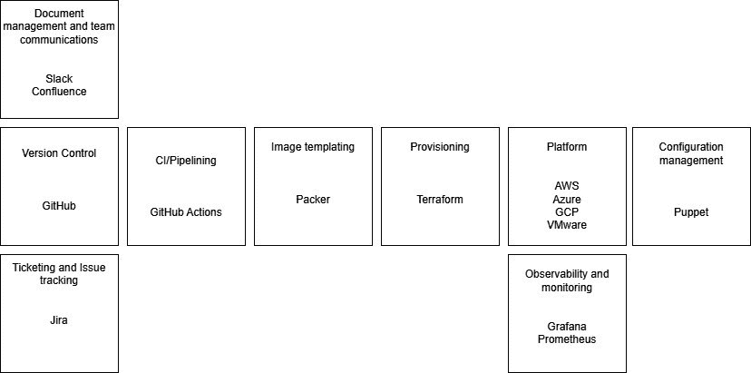
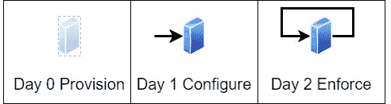

# 15

# 采用方法

在详细讨论了 Puppet 语言和平台之后，本章将关注采用和实施方法。本章假设 Puppet 的最可能采用者及其观点。因此，这些建议从 Puppet 平台团队的角度出发，但它也会讨论如何让从应用程序到操作系统的所有实施团队共同合作，推动采用。

很多时候，项目或现代化计划的观点是认为仅靠技术就能解决组织的所有问题，而现有的团队和流程只是障碍，必须绕过它们才能交付未来。最成功的采用案例与现有团队合作，并将其嵌入到他们的流程中。本章将通过讨论如何选择正确的范围和焦点来确保实施能够实现其目标，定期交付并展示价值以促进采用，从而覆盖这一点。我们将讨论如何与其他团队和利益相关者合作，确保 Puppet 作为一项技术不是一个争夺空间的孤岛，而是一个可以集成并最大化效益的平台。虽然从头开始部署新服务器通常更为实际，但我们将讨论如何安全、渐进地接触遗产的老旧环境，在这里了解配置漂移的程度并开发自动化来纠正这些漂移，可以在减少昂贵的审计过程方面带来巨大的好处。我们还将详细讨论在受监管环境中使用 Puppet，因为通常认为一个经常进行更改并拥有较高权限的工具根本无法使用。我们将看到如何展示流程和测试，不仅使 Puppet 安全可靠，还能证明它是强制执行任何受监管环境要求的核心部分。最后，我们将看到 Puppet 如何融入云端、其适当的使用场景，以及如何避免公共云迁移中的错误，并不丢失 Puppet 在私有数据中心带来的效益。

在本章中，我们将涵盖以下主要主题：

+   范围和焦点

+   平台工程方法

+   管理遗产遗产的无操作模式

+   受监管环境中的采用

+   向云迁移

# 范围和焦点

范围和关注度的压力将取决于你的组织为什么开始使用 Puppet。如果这是一个单独团队的自动化部署练习，比如 Oracle 团队，压力将比一个购买了大规模 Puppet Enterprise 合同的转型项目小。在大型转型项目中，可能会有诱惑去快速实现大目标，以便尽快回收成本。这是危险的，因为配置问题是复杂的，技术人员往往过于乐观地认为解决方案能很快创建出来。额外的压力可能来自销售团队和决策者，他们可能夸大了变革能多快实施，从而获得必要的资金。这并不是反对有愿景或类似吉姆·柯林斯（Jim Collins）那样的宏大目标。未来的愿景是需要的，但必须表明这将是一个渐进的改善过程，而这些渐进的步骤将带来即时且持续的价值。这将建立来自支持团队和客户的信任和信心，促使他们投资你的平台，因为你可靠地交付的是一些切实可行的成果，而不仅仅是一个遥远的希望。

最佳的交付方法是遵循良好的迭代实践，设定一些大的目标（epics），例如交付核心操作系统角色或 Oracle 角色，这些目标可以拆分成每个迭代的小目标，每个任务应该足够小，能够在正常的迭代周期内完成，通常是两周。每次迭代结束时，这些功能可以展示给利益相关者，以展示进展、收益并获得反馈。

注意

本书并不主张任何特定的敏捷方法论；有大量的书籍和建议教你如何实施敏捷工作实践。适合你组织的做法将取决于当地文化和你的团队。因此，本书的建议是研究各种方法，但要保持灵活，找到适合自己团队且有效的做法，而不是盲目模仿他人的系统。使用如迭代回顾（retrospectives）等技巧，能够确保你的工作方式仍然有效，并且对问题采取相应的行动。

如果忽视这种方法，团队被分散在多个目标之间，就容易导致开发人员各自为战。当开发人员孤立工作时，其他团队成员无法提供帮助或进行有意义的评审，因为他们对工作内容或决策原因没有了解。

如果工作过于庞大和复杂，就会导致开发问题，难以测试并拆解理解。这可能导致管理层和开发人员之间的沮丧，因为交付上没有任何可见的进展。为了交付某些东西的压力可能导致开发人员的疲惫，加上审查和测试大型复杂工作中的困难，可能会导致交付一个有风险或不完整的产物，仅仅是为了交付。这会在一个恶性循环中侵蚀信心和士气，压力和待解决问题不断增加。

在 *受管控环境中的采纳* 部分，我们将讨论在你的流程和平台中展示可靠的测试和交付能力，以获得变更和风险团队的信任有多么关键。

经过上述警告，如果团队确实坚持专注和范围的界定，那么团队之间就可以建立对持续开发工作的理解，并强化审查、测试和学习过程。这为开发人员提供了在有趣或具有挑战性的工作部分进行配对的机会，并利用团队分组会议共同做出编码方法的决策。如*第一章*所讨论的，保持更新关于 Puppet 最佳实践文档中的这些决策，有助于进一步传播知识。最重要的是，在提交代码的审查中，这变成了团队积极讨论和共同工作的成果，而不仅仅是一些在简短的早会更新中听到的内容，也不是团队仅仅依赖开发人员口头描述的内容。所有这些都帮助团队更好地理解代码的预期功能以及为何选择这种方法。

为了说明这种方法，通常基础操作系统需要为核心构建设置一个安全配置文件。这个安全配置文件将包含诸如核心操作系统用户账户、SSH 配置、内核设置以及其他各种重要设置等内容。将这个配置文件作为一个冲刺的焦点，可能会导致开发人员配对并共同处理构成该配置文件的组件模块。开发人员专注于诸如用户账户等元素，并一块一块地构建配置文件，这样就能取得实际进展并分享知识。根据配置文件的大小和开发人员的数量，可能更有意义去处理多个配置文件，但目标仍然是要限制范围并聚焦。

这并不是说任何开发团队应该期待一切按自己的方式进行，并且外部压力不会导致焦点分散，但必须明确表示，这会减慢工作进度并带来风险。

在理解 Puppet 代码的重点和范围之后，下一个需要了解的关键点是代码交付到生产环境的最低验收标准。**最小可行产品**（**MVP**）这一术语已被误用，成为发布明显不适合生产的内容的借口，通常会表示后续添加测试等项目。事实上，这种情况是不可能发生的，因为总有新的功能需要开发，随着代码的进一步发展，未来会带来更大的运营负担。因此，在你的组织和平台中，Puppet 的最佳实践应该明确代码需要通过哪些测试。一个示例标准可能包含以下内容：

+   代码必须在 PDK 验证中保持干净，并接受已列出的例外

+   RSpec 测试提供 100%的代码覆盖

+   ServerSpec 测试该模块，并通过核心的 ServerSpec 测试

另一个挑战可能是范围蔓延，这会稀释 Puppet 在组织中使用的更高层次的范围和重点。当投资于一个工具时，很容易通过扩展用例来最大化投资回报率，随着实施的成功，其他团队也会希望加入这一成功，尝试使用提供的工具。因此，需要明确 Puppet 的使用场景；不恰当的使用，如分发二进制文件或大规模同步文件，需要在平台文档中明确指出是不可取的。在这个例子中，这会对基础设施造成很大负担，正如本书所讨论的那样。此外，在聚焦方面，本书强烈建议反对任何鼓励强制重写/重新平台化策略的政策，除非当前的实现存在维护问题或无法按需开发。这种重写几乎没有价值，除非原始实现被充分理解，否则可能导致翻译中的错误，特别是对于声明性代码，因为只有方法是可见的，而最终状态不可见。

在讨论了 Puppet 的范围和重点后，我们现在来看一下如何在传统服务器上管理这种方法，并处理历史遗留问题以及棕地站点的复杂性。

# 管理无操作模式的遗留资产

遗留系统的实现可能更具挑战性；配置漂移的程度可能使得难以知道从哪里开始。你的组织可能经历了多次并购，这不仅导致了核心组织本身的多个配置标准，也包括了所有接入的系统。

一个常见的采用模式是逐步在传统服务器中建立自动化水平，以建立信心，我们将详细介绍一种常见的方法。

在所有节点上安装代理以收集事实是一个常见的起点，并将这些数据存储在 PuppetDB 中，形成有价值的 CMDB 数据源。然后，如*第十三章*所讨论的，这些数据可以发送到诸如 ServiceNow 之类的服务，以与中央 CMDB 服务进行集成。在 Puppet Enterprise 中，这让我们可以访问包视图，并具有管理补丁的能力，如*第十四章*中演示的那样。这个推广立即提供了能力，并且对整个环境有了更好的理解，甚至没有编写任何代码。

下一步是考虑编排。很可能在传统环境中，各个团队手动或半自动地执行了常见的脚本和任务。将这些脚本封装为 Bolt 项目或 Puppet 模块，并使用 Bolt 或 Orchestrator 来运行这些脚本和任务，可以在不需要重新工作的情况下提供更大的控制和流程。

最简单的情况是，如果你正在使用 Puppet Enterprise，并且在第一步中已经部署了代理，那么 Orchestrator 可以直接利用代理的存在，使用 PCP 传输进行通信，并利用 Puppet Enterprise 的 RBAC 和日志系统与 Orchestrator 协同工作。对于不想为传统版本购买许可证的开源 Puppet 或 Puppet Enterprise 用户，可以使用 Bolt 服务器设置带有 SSH 密钥和 WinRM 的黄金主机。有一种折衷方案是使用无代理的 Puppet Enterprise 许可证，但允许使用 Puppet Enterprise 主机，并仍然拥有 RBAC 和访问日志。虽然在前面的章节中没有讨论过，但基于代理的服务器的优点是它们更加集成，能够执行更多操作并收集更多数据，且它们对密钥和安全的管理是由 Puppet 作为产品的一部分来管理的。无代理方法可以在不需要请求安装代理的情况下添加，这可能不适用于所有服务器。无代理方法还避免了 Puppet 代理代码版本的潜在漏洞和更新问题，但确实存在单独的访问管理问题，例如 SSH 密钥的部署和管理。

下一步正是*范围和焦点*部分讨论的内容：查看基线配置，并理想情况下找到一些非谈判性的起点，这些必须在你的资产上强制执行。例如，必须关闭 root 登录，或者应用程序代理需要升级并管理版本，以避免漏洞。一旦这些简单的配置得到管理，就该查看可能有历史例外的服务器配置。对于遗留服务器而言，即使服务器的预设配置不符合当前的安全和构建标准，也应首先将其标记为问题，然后再进行修复，以避免可能导致服务问题。在没有立即修复的情况下标记配置问题，可以使用在配置文件或模块级别上的无操作标记模式，正如在*第八章*中讨论的那样。配置漂移可以被理解为是可以接受的例外（记录在 Hiera 数据中），或者通过将模式从无操作模式切换到执行模式来使用 Puppet 进行修复，以应用配置。

一旦基础配置文件完成，就意味着我们在遗留资产中拥有了所有可用的工具，用于自动化审计报告和合规修复。

然后，可以通过与应用程序团队互动，了解他们的配置和审计需求，并按照相同的模式为其应用程序构建自己的角色和配置文件，从而重复这一方法。

提到涉及开发 Puppet 代码的不同团队时，重要的是直接讨论跨团队协作的最佳方法。

# 一个平台工程方法

正如本章前两部分所明确的，Puppet 的常见采用起点是创建核心基础操作系统配置，然后再与应用程序团队进行接触。这往往会导致一个设置，即 Puppet 成为 Linux/Unix 操作系统团队的工具，这个团队主导着代码库，并且是整个平台的守门人。为了确保有效的跨团队协作，所需的是一种平台工程方法。

注意

关于如何运行平台团队的更深入知识，可以通过书籍和培训获得，例如 [`teamtopologies.com/`](https://teamtopologies.com/)，而平台工程通过 [`platformengineering.org/`](https://platformengineering.org/) 等社区得到了普及。

平台工程的核心概念是拥有一个平台团队，负责管理工具、工作流以及自服务平台的开发。这个平台应该被视为一个产品，用户被视为客户，确保他们的需求得到满足，并在整个组织中推广该平台。正如在*第一章*中讨论的，Puppet 可能会成为平台的一部分，与其他各种 DevOps 工具和工作流一起使用。*图 15.1*展示了一个常见的工具集选择：

图 15.1 – 常见的 DevOps 工具集

精确地看 Puppet 将如何适配，这很可能是在第 0 天、第 1 天和第 2 天的方法中，如*图 15.2*所示。在第 0 天，通过类似 Terraform 的专业工具进行基础设施的配置。接着，在第 1 天，Puppet 代码将被应用于客户端，以便根据基础设施上的操作系统构建和安全标准进行配置。第 2 天，Puppet 的作用将是继续执行配置，以防止配置漂移，避免因外部意外变化或标准的有意更改而导致的代码变动。

图 15.2 – 第 0 天、第 1 天和第 2 天的做法

思考 Puppet 代码在这些平台中的关键点是，理想情况下，运行 Puppet 基础设施的责任应该是平台团队的角色之一。这使得各个团队可以开发自己的代码和角色，并通过自服务平台有清晰的部署路径。

这并非总是可能的，通常情况下，Linux 团队仍然需要同时运行他们自己的代码库和 Puppet 基础设施。在这种情况下，最好将其视为两个独立的角色，而不是仅仅优先考虑 Linux 团队的代码库需求，忽略其他使用者的需求。平台团队不应尝试成为所有人 Puppet 代码的把关人，因为这会阻止开发人员将 Puppet 作为自服务平台来使用。你们组织的流程应该涵盖责任和升级机制，下一节将进一步讨论，*受监管环境中的采纳*。

还应该确保负责管理遗留资产的团队承担自动化工作的责任。没有充分了解系统的新团队来自动化它们可能会面临挑战。虽然可能需要更多的时间来培训并让遗留团队参与其中，但让他们主导集成工作，可以帮助更全面地理解系统及其流程。

虽然每个团队负责自己的代码，但合作开发标准和最佳实践仍然很重要，以确保团队具备适当测试和构建工具管道的知识。

跨团队协作不仅仅限于使用 Puppet，还包括其他集成点。在 Puppet 中重写和运行所有内容既不实际也不可取。创建实践社区，让跨部门的各个团队可以见面、讨论并展示他们在自动化方面的思路和进展，能够促进思想的交流。在某些情况下，甚至可以复用其他团队在组织内已经开发的成果。这不应被视为一种竞争，而是相互受益和交流技能与想法的机会。

各个层级的宣传至关重要。参加各种团队会议、午餐会、管理层会议以及外部供应商或行业组织的活动，可以帮助传播关于你平台的消息，并为进一步的发展激发热情。外部供应商活动通常被视为法律复杂，但通过仔细考虑并与法律和营销团队咨询，你可以在组织内部提升平台的知名度，并通过激发对你工作兴趣来吸引外部人才。此外，这些外部活动，如技术顾问委员会，是与志同道合的组织交流最佳实践的绝佳机会。

虽然在*范围与重点*部分已提到过，但值得强调的是，不要试图解决所有被带给你的问题。如果你能够很好地宣传，大家会变得非常热情，但必须完全诚实地说明你平台的能力和适配性。你应该清楚地传达你能够实际交付的内容，以及如果他们希望参与或接触 Puppet 平台，必须承诺什么。

确定了范围和重点，并理解了协作工作方式后，接下来的重要思考应围绕监管和流程如何影响这些工作方式展开。

# 在受监管环境中的采用

在高度受监管的环境中工作可能具有挑战性，但这通常是 Puppet 能发挥最大影响的地方。在受监管的环境中实施自动化可能更困难，但执行大规模手动操作则更加具有挑战性，因此潜在的投资回报显著。采用新技术时，最糟糕的做法就是相信“流程只需要改变”。这种态度会导致团队在后期失败，并且可能会造成懒散和忽视流程工作的声誉，最终导致无法在生产环境中正常运行的设置。

最好的做法是在实施 Puppet 之前，先与变革、风险、审计和其他涉及管理流程的团队进行接触。尽管组织中经常抱怨流程问题，但通常没有人去与这些团队互动，而这些团队可能有自己的现代化计划，你可以将你的实施计划与之对接。讨论 Puppet 是什么以及你计划如何在生产环境中使用它，可以提供可信的反馈。即使这些反馈需要缩小你最初的雄心壮志，它也比将这些团队视为守门人要好，因为守门人往往对你的实施缺乏理解，只会拒绝他们未能理解后果或未曾参与的方法。

注意

邀请你的流程团队参加实践社区会议和演示；你们并不站在对立面，反而会发现，在为组织提供价值的过程中，你们有更多的挑战和目标是共同的。

重要的是要围绕 Puppet 能够做什么以及你的开发、测试和发布方法如何运作进行讨论，还要明确其覆盖的范围。Puppet 是一个强大的工具，操作在管理/根级别，因此必须展示你对流程的掌控力，并且理解与这些流程相关的任何风险。

为了赢得所有相关方的信任，包括流程团队，你可以向他们展示 Puppet 的可能性，并讨论它如何为组织带来益处。正如在聚焦与范围一节中讨论的那样，可以通过持续改进流程，特别是通过实践社区讨论，来实现这一点。通过这种方式，多个团队和部门可以就有益于组织的改进达成一致，而不会妥协于安全性和风险。

这种方法看起来可能并不具有革命性，但在受监管的环境中，变革无法快速发生。因此，重要的是要关注在当前限制条件下可以做的事情，展示你的解决方案如何适应这些条件，并与相关方合作来现代化或改进流程。这需要耐心和一致性来赢得团队的支持。在完成对传统私有数据中心环境的视角后，考虑这种方法在云端的不同之处也是非常重要的。

# 向云迁移

向公共云迁移带来了巨大的机会，尤其是在灵活性方面，提供了使用云特定技术来减少组织运营负担的机会。例如，利用可用区来减少数据中心故障风险，虽然是一个复杂的功能，但在私有数据中心中实现起来非常困难。

不幸的是，云采用方法中有两种常见的反模式。第一个是将所有基础设施、流程和组件完全复制到公共云中，就像它们在私有数据中心中一样工作。这种情况通常发生在“云优先”计划中，这往往是**首席信息官**（**CIOs**）对公共云资源采用的失望结果。这迫使在组织准备好并理解适合的情况下将部署推入公共云。这导致了意外的账单，因为部署的基础设施并未计划为灵活，并忽略了公共云的租赁性质，而且许多在私有数据中心中有效的解决方案在公共云中的云原生解决方案中实现得更好。

第二种反模式是把一切都抛在脑后，这在那些对内部流程和交付时间感到沮丧的应用团队或部门中可以看到。他们可能有理由感到沮丧，但很少有经验；可悲的是，在私有数据中心中艰难取得的经验教训被遗忘，审计、配置和测试中的最佳实践必须重新建立，因为审计员发现新设置中存在问题。

你应该考虑在公共云中真正执行的内容；当查看如何部署 Puppet 基础设施时，*第十三章*中提到的多区域模式和策略展示了选择。简单来说，我们可以在私有数据中心通过 Puppet 基础设施管理公共云服务器，或者将 Puppet 基础设施迁移到公共云并管理私有数据中心和公共云，或者为私有数据中心和公共云分别设置独立的 Puppet 基础设施。

这个选择取决于实施目标。例如，公共云是否将用于为私有数据中心提供灵活的容量，例如通过提供一个可以在灾难恢复中构建的备用站点？或者，公共云是否用于开始一种新的工作方式，采用更具云原生的方法和新团队？在第一种情况下，你更有可能希望服务器的配置与共享代码库保持一致，并且拥有一个单一的管理界面对团队管理基础设施可能会有帮助。在这种情况下，决定基础设施是应该私有化还是公共化将归结为成本问题，以及你是否打算利用云原生功能，如可用性集和负载均衡器的灵活性，这些功能可以按需添加编译器。

在第二种情况中，当新团队开始寻找新的方法时，拥有独立的基础设施将最为合理，回顾当前构建中哪些是有用的，哪些仅与私有数据中心相关。如在*平台工程方法*部分所述，这涉及到了解在云中工作的团队的需求，并确保 Puppet 作为平台的一部分来满足这些需求。云团队随后应该能够使用 API 进行自助服务，同时享受 Puppet 提供的审计和安全性要求，以符合组织在云中的要求。

这也可能是一个机会，从传统组织中使用的高度自定义标准转变，甚至考虑采用合规性来实施 CIS 标准，这在*第十四章*中提到过。这将是一个成本考虑问题，需要判断是否合理让你的团队来维护这些标准。

# 摘要

在本章中，我们讨论了如何不仅仅考虑纯技术问题，还要让 Puppet 的采用成功。我们回顾了如何选择重点和范围，以便通过迭代的持续改进交付 Puppet，使用定期的交付节奏以及像小团队集中的冲刺等方法，团队可以一起工作。我们讨论了如何将这个重点分解为可协作完成的交付物，并在定期周期中展示。我们还提到允许 Puppet 团队在做出决策和建立编码实践的过程中建立信心并学习，同时向管理层和利益相关者展示有意义的回报和进展。我们讨论了如何概述 Puppet 的使用案例，并确保避免将任务强行纳入 Puppet 中，以最大化回报，这样的做法可能会破坏 Puppet 基础设施的可靠性和性能，并带来日常维护的难题。

然后回顾了采用遗产资产的方法，展示了即使在由于标准和策略变化以及公司合并收购导致的资产断裂情况下，也可以遵循一个渐进的采用模式，逐步减少配置漂移，并收集有关资产的信息。

我们首先讨论了如何在没有配置的情况下推出代理并收集事实，以创建资产视图，这些视图可以输入到 CMDB 中，在 Puppet Enterprise 的情况下，使用内置集成来管理补丁和打包。接着我们展示了可以考虑使用编排来包装现有脚本，并提供更好的自动化。这可以通过完全授权的 Puppet Enterprise 通过 PCP 或 WinRM/SSH 连接在没有代理的 Puppet Enterprise 许可证下进行，或者使用 Bolt 服务器与 WinRM/SSH 连接来完成。这取决于你的许可证要求以及是否需要 RBAC 和日志记录。随后我们讨论了如何通过构建有状态的 Puppet 代码基准，查找需要强制执行的强制性设置，并在适当情况下使用无操作（no-op）来获取当前视图，逐步构建一个配置文件，允许将例外情况接受到 Hiera 中或对漂移进行修复。建立了这个基准之后，我们讨论了如何与应用团队重复此过程，以便将传统应用纳入控制范围，然后使用配置数据自动化审计报告。

我们讨论了如何跨多个团队协作，成立了一个 Puppet 平台团队，该团队倡导平台并为其他团队提供 API 和自服务，同时为团队设定了采用和使用 Puppet 的标准，但并没有对他们的交付进行限制。

在受管环境中部署证明了 Puppet 的有效性，通过向关键流程团队（如变更和风险管理团队）传达 Puppet 的工作原理，并解决实施过程中使用的流程，如何将代码开发和部署到生产环境中，同时考虑如何最好地与当前流程集成。赢得流程利益相关者和运营团队的信任，未来可能会改变流程，从而推动进一步的自动化。

最后，我们回顾了公共云的采用，讨论了公共云中遇到的两个主要问题：其一是采用*云优先*策略导致技术和流程的搬迁未经过深思熟虑，另外一个是应用团队单打独斗，忽略了在私有数据中心中为安全性和审计所做的自动化经验教训。我们解释了，应该考虑公共云的目的。它是数据中心的扩展，还是你希望将其纳入内部 Puppet 服务器视图的一部分，或者是你正在迁移的对象？将 Puppet 基础设施迁移到公共云可以开始采用云的灵活性。这是一个全新的方法，旨在通过代码优化来支持云的采用，或者通过遵循行业标准的 CIS 方法来摆脱老旧的定制内部标准，带来新的机会。关键措施是与应用团队会面，确保他们可以访问 API 和平台，从而使他们不必担心核心基础设施构建和安全配置，而只需关心对他们有用的内容，并且能够通过自助服务进行管理。

本书中展示了 Puppet 的有状态方法如何减少漂移和技术债务，自动化审计报告，提供一种标准的变更交付方式，即便在高度监管的环境中，也能为用户提供一个值得信赖的平台，以满足他们的基础设施需求，并释放团队的精力，将注意力集中在为客户交付产品上。配置管理是一个复杂的问题，没有一劳永逸的解决方案，但我们通过一种深思熟虑的迭代方法，展示了通过与组织的流程合作并全员参与，Puppet 如何为你的组织带来变革性的改变。
