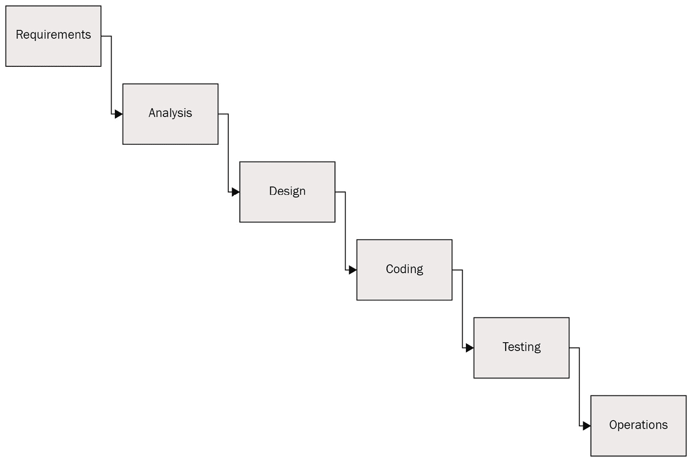
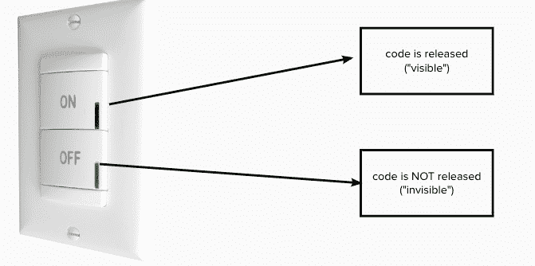
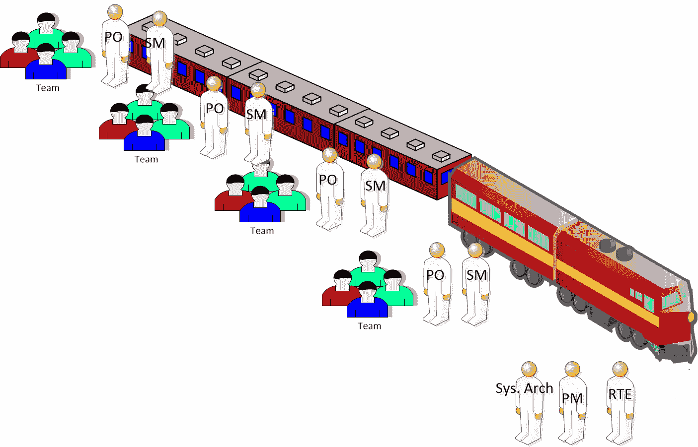

# 1

# 引入 SAFe® 和 DevOps

许多组织，特别是那些从事基于软件的系统或涉及硬件和软件的复杂系统开发的组织，以及通过网络技术进一步增强的网络物理系统，过去 10 到 20 年中的产品开发方式发生了变化。诸如技术变革、向地理分布或远程开发的转变、推动更快的**上市时间**（**TTM**）、理解客户需求、以及减少生产失败的发生频率和严重性的压力，都是这些组织面临的机会、挑战，或者两者的混合。

为了解决这些挑战并利用机会，源自精益制造的思维方式开始出现并逐步发展。这些思维方式与新兴框架中的实践结合起来，开始帮助组织克服挑战并改善业务成果。

在本章中，我们将重点介绍历史上的挑战、流行的思维方式和方法，正是这些让许多组织克服了这些障碍。这些挑战、方法和框架在以下主题中有所描述：

+   组织在产品开发中面临的挑战

+   《敏捷概述》

+   **DevOps** 简介

+   使用 SAFe® 扩展 DevOps

# 组织在产品开发中面临的挑战

当今的产品开发得益于技术与社会的结合。每个产品都是硬件和软件的组合，并通过与互联网的连接进一步增强。新的产品改进只需一次软件发布即可实现。我们真正生活在*软件时代*和*数字时代*。

正是在这样的背景下，我们审视产品开发中的挑战，发现这些挑战不仅没有改变，而且由于对技术和软件的依赖，这些挑战变得更加严峻。以下是一些经典挑战：

+   TTM 压力

+   理解客户需求

+   安全性与合规性

+   确保质量

+   竞争

这些挑战并非孤立存在。有时会同时出现几个挑战，或者它们可能一并出现。让我们来看看这些挑战是如何单独或共同作用，妨碍产品开发的。

## TTM 压力

TTM 是衡量从最初的构想到新产品或新产品特性发布所需时间长度的标准。它通常被视为衡量公司创新能力的指标。

一个日益增长的趋势是，近年来 TTM 的时间长度已经缩短。技术的进步加速了创新的步伐。这一创新步伐的加快迫使产品开发周期从年度周期缩短到 6 个月或季度周期。这个趋势将继续下去，并迫使组织考虑是否能够更频繁地交付新特性。

## 理解客户需求

亨利·福特曾说过：“*如果我问人们他们想要什么，他们会说更快的马*。”今天，这句话似乎依然适用。通常在开始时，客户并不知道他们想要产品的哪些功能。如果一个产品需要长时间的开发周期，客户的偏好可能会发生变化，通常变化到最终交付的产品并不是客户所需要或想要的。

通常，促使客户需求或要求发生变化的原因可能是竞争对手的类似产品提供的功能。来自竞争对手的压力提供了一个挑战：理解客户的需求，并在竞争对手之前发布能够满足这些需求的产品或功能。

## 安全与合规

组织面临的一个挑战并非来自市场。使用软件的产品面临着来自黑客和其他*恶意行为者*的日益增长的威胁，他们试图利用软件中的漏洞。如果他们能够利用这些漏洞，造成的损害可能从声誉受损到金钱损失，如勒索软件支付或诉讼费用。

此外，因应这些恶意行为者的威胁，已经颁布了旨在确保隐私和安全的法规。产品可能需要遵守地区性（例如**通用数据保护条例**（**GDPR**））或行业性（例如**健康保险可携带性和责任法案**（**HIPAA**））的监管标准，以确保客户的机密数据不被泄露。

## 确保质量

对于组织而言，保持质量在产品开发过程中至关重要。没有在确保产品具有内建质量方面严格执行的组织，很快会发现自己面临其他挑战。返工意味着更长的交付周期和产品上市的延迟。客户体验到*有缺陷的软件*或低质量的产品时，可能会转向竞争对手的产品。不充分关注质量还可能导致安全漏洞未被察觉，从而允许恶意攻击发生。

在产品开发过程中，保持质量的警觉性理想的做法是创建、设置并执行各级别的测试，贯穿整个开发过程。测试甚至可以在预生产和生产环境中进行，并尽可能地自动化。基于*审批/检查*的方法仅仅是将问题的发现推迟，直到可能太晚或者修复成本过高。

## 竞争

之前提到的一些挑战讨论了竞争所扮演的角色。事实是，你的竞争对手也面临着与你一样的挑战。如果你的竞争对手已经找到了应对这些挑战的方法，他们在市场上将具有明显的优势。

但需要记住的是，这场竞争并不是关于谁先到达终点。挑战在于能够率先推出产品或功能，并能够清晰传达其与客户需求的契合度。一个著名的例子来自苹果。苹果在发布 iPod 时，比其他竞争对手在数字音乐播放器市场上晚了几年。然而，正是这种营销方式让 iPod 成为一款现象级产品。苹果宣传其内存容量时，不以**兆字节**(**MB**)为单位，而是以可容纳的歌曲数量为单位。这一简单的信息深深打动了市场，不仅是技术爱好者和音乐发烧友，甚至是普通的音乐听众也能产生共鸣。

iPod 的极度成功推动了苹果走上了一条创新之路，使其迅速跃升为全球科技巨头之一。首个商业**MPEG-1 音频层 3**(**MP3**)播放器的制造商，如今已不再提供对其产品的支持。

## 面对挑战

这些挑战自人类历史早期就一直困扰着产品开发。然而，挑战的具体形式随着每一代人和每一次技术变革而变化。

TTM 周期将始终决定何时发布产品；然而，借助技术的帮助，这些周期正在缩短。客户的需求可能始终保持神秘，往往连客户自己都无法完全理解。竞争格局会随新型颠覆者的出现和*落后者*的消失而不断波动。

随着这些无处不在的挑战呈现出新的形式，那些已经掌握这些挑战的组织通过围绕三大领域的新思维和实践来应对：人员、流程和技术。

关注人员涉及考察人们共同持有的思维方式、价值观和原则，从而形成一种组织文化。这种文化是应对挑战的最重要对策，因为它为每个人提供了如何应对这些挑战的指引。

在确立文化之后，关注流程就实施了基于正确思维方式、价值观和原则的实践。成功应用这些实践能够促进反馈循环，进一步推动文化建设，并加强思维方式、价值观和原则。

最后，工具帮助了流程的实施。它们使得实践可重复且自动化，强化了流程的执行力，从而使得流程的应用能够取得成功。

本书的其余部分将重点介绍帮助组织应对现代产品开发中所面临挑战的人员、流程和工具的结合。这些结合构建成灵活的框架，旨在能够适应不同行业、不同组织的应用。这些结合最初源自软件开发，但鉴于软件的创造在当今每个组织中都广泛存在，因此值得关注。

我们从敏捷开发的探讨开始，或者说从大规模软件交付到短周期设计的增量交付的过渡。

# 敏捷简介

要理解这些挑战所处的背景，重要的是理解主流的产品开发过程，通常被称为**瀑布模型**。瀑布模型曾被用于许多年的大教堂和火箭飞船的开发，但当这一过程用于软件开发时，逐渐显露出其局限性，特别是在应对缩短的产品上市时间（TTM）和满足客户需求方面。必须采取一些措施。

接下来，让我们看看敏捷方法的兴起，从最初尝试将精益思维融入软件开发，到敏捷宣言的创建以及敏捷实践和框架的出现。

## 瀑布模型的兴起与衰退

被称为瀑布模型的方法源于传统的产品开发。工作人员将工作划分为特定的阶段，直到当前阶段完成才会进入下一阶段。

1970 年，温斯顿·W·罗伊斯（Winston W. Royce）首次提出了这一方法的图表和模型，当时产品开发已转向软件，如图所示：

图 1.1 – 瀑布模型图

尽管罗伊斯从未倡导这种方法，实际上他更倾向于采用增量开发的方法，但他的图表流行开来，行业内许多人称这种方法为*瀑布模型*，因为从一个阶段到另一个阶段的箭头形态像瀑布。

在软件开发中，这种方法开始显示出弊端。如果在后期阶段出现需求、问题或限制，额外的工作会将流程推回，导致大量返工。许多时候，最终客户在初期并不会有明确的需求，这就导致了返工或最终产品未能满足客户期望。

返工引入的延迟也对固定时间项目造成了压力。为了赶上截止日期，某些后期阶段（通常是测试）会被缩短或取消，以便交付产品。由于缺乏测试，错误或*bug*在产品发布前未被发现，从而导致低质量的软件和低客户价值。

产品开发周期中的 TTM 压力减少了开发新软件或更新现有软件的时间。这个模型开始崩溃，但还能做些什么不同的尝试呢？

## 敏捷方法的兴起

在 21 世纪初，其他方法如**极限编程**（**XP**）、Scrum 和 Crystal 开始涌现。这些方法倡导*增量交付*，即一小部分预期功能在小的设计周期中经过所有阶段（需求、设计、编码和测试），通常不超过一个月。在每个设计周期结束时，团队会征求客户反馈，并通常将这些反馈融入下一个设计周期。

以下图示展示了增量交付的表示，包含短周期的设计和有价值的包的交付：

图 1.2 – 增量式（敏捷）开发图

2001 年 2 月 11 日至 13 日，一群软件开发专家，其中一些人创建了`agilemanifesto.org`。

敏捷宣言包含一套价值观和一系列原则，但需要注意的是，宣言的作者们谈论这些价值时，将其视为一组偏好。敏捷团队可以有流程、工具、文档、合同和计划。只有当这些内容妨碍了每个价值声明左侧的项目时，团队才应重新评估流程、工具、合同和计划，并进行调整。

价值观设定展示了什么是重要的，说明如下：

*通过实践和帮助他人实践，我们发现了更好的软件开发方式。通过这项工作，我们开始* *重视：*

+   *个人和互动优于* *流程和工具*

+   *工作的软件优于* *详尽的文档*

+   *客户协作优于* *合同谈判*

+   *响应变化优于* *遵循计划*

也就是说，尽管右边的内容也有价值，但我们更看重左边的内容。

敏捷宣言的 12 条原则详细阐述并提供了这些价值的背景，说明如下：

1.  我们的最高优先级是通过早期和持续交付有价值的软件来满足客户。

1.  欢迎变更需求，即使在开发后期。敏捷流程利用变化为客户创造竞争优势。

1.  经常交付工作的软件，从几周到几个月，优先考虑较短的时间尺度。

1.  商业人员和开发人员必须在整个项目过程中每天都共同工作。

1.  围绕有动力的个体构建项目。为他们提供所需的环境和支持，并信任他们完成工作。

1.  传递信息给开发团队及团队内信息传递的最有效方法是面对面的交流。

1.  工作的软件是进展的主要衡量标准。

1.  敏捷流程促进可持续发展。赞助人、开发人员和用户应该能够维持一个持续的节奏，无限期地进行下去。

1.  持续关注技术卓越和良好设计能够增强敏捷性。

1.  简单性——最大化未完成工作的艺术——至关重要。

1.  最好的架构、需求和设计源自自组织的团队。

1.  团队定期反思如何变得更加高效，然后调整和优化行为。

## 精益的加入

大约在同一时期，其他人也在寻找以更短的**时间到市场（TTM）**来开发软件的方法。他们开始研究如何将**精益生产**的原则应用到软件开发中。

精益生产旨在应用实践以减少浪费。这些方法由大野耐一（Taiichi Ohno）发明，用于创建**丰田生产系统**（**TPS**）。除了消除浪费，精益生产还力图构建质量并追求**改善（Kaizen）**，即持续改进。

精益生产原则的应用被玛丽和汤姆·波本迪克（Mary and Tom Poppendieck）用于在他们的书籍《*精益软件开发：敏捷工具包*》中描述精益软件开发。这些原则总结如下：

+   消除浪费

+   强调反馈和学习

+   等到最后一刻再做决定

+   经常交付

+   确保团队有权决策

+   满足用户的感知和期望

+   运用系统思维

除了波本迪克夫妇的工作外，大卫·J·安德森（David J. Anderson）在微软改编了**看板（Kanban）**，这是丰田生产系统中的另一个工具，专门用于软件开发。看板的这一改编被调整为适用于软件开发的实践框架。看板很快在开发中流行起来，不仅作为 Scrum 或 XP 的替代方案——许多实践都与 Scrum 或 XP 结合使用，以促进任务的执行。

软件开发团队确实发现，转向敏捷开发正在产生结果并克服产品开发中的挑战，但这些结果仅在开发中看到，而不是整个组织层面。显然，其他部门也需要进行变革。让我们来看看开发和运维如何在 DevOps 运动中共同进行改变。

# DevOps 的介绍

随着开发团队开始采用敏捷方法并增量交付软件功能，他们面临着从外部交付价值的挑战。运维团队，即维护开发和生产平台（代码执行的地方）的团队，通常不会在新包出现时立即从开发团队发布它们。相反，运维团队坚持收集功能并在指定的*发布窗口*中部署它们，以最小化单个新变更可能导致生产环境崩溃的风险。但这种做法并没有最小化风险，反而通过压缩发布窗口的时间，导致开发与生产环境之间的配置不匹配，并且生产环境中存在无法追踪的手动干预，从而加剧了风险。将发布捆绑成发布包还将交付从小增量转向了较大的单体发布，这可能降低了客户价值。

在此时，必须从典型的运维团队的角度来看待问题。其工作是确保组织的生产环境——也就是可能产生收入的环境——尽可能地高效运行。任何对该环境的改动，甚至是为了新增功能的改动，都被视为对稳定性的风险。

2009 年，John Allspaw 和 Paul Hammond 在 *O'Reilly Velocity* 大会上做了一场题为 *每天部署 10+ 次：Flickr 的开发与运维合作* 的演讲。在这场演讲中，他们概述了实现前所未有的每天 10 次部署的方式。这些方法至今仍然是 **开发-运维**（**DevOps**）的基本支柱。我们将讨论以下内容的整合：

+   工具和技术

+   人员和流程

## DevOps 工具和技术

在讲座中，Allspaw 和 Hammond 识别了各种技术，并介绍了他们如何利用这些技术来协调开发和运维团队。然而，值得注意的并不仅仅是这些工具——更重要的是团队们如何协作使用这些工具。

这些技术包括以下内容：

+   自动化基础设施

+   通用版本控制

+   一键构建/部署

+   功能标志

+   共享度量

+   **即时通讯**（**IM**）机器人在共享频道中

工具和技术的使用继续在 DevOps 中发挥着关键作用。我们将探讨这些工具如何使生产环境中的快速发布过程得以实现，并且在生产环境出现问题时能迅速解决。

### 自动化基础设施

随着软件变得更加复杂，执行这些软件的环境也变得更加复杂。运维团队面临的任务是配置不断增长的服务器，数量从几十台增加到几百台甚至几千台。这一任务需要自动化。**配置管理**（**CM**）工具，如 Chef 和 Puppet 开始出现。

配置管理使运维团队能够标准化环境配置，如操作系统版本、软件应用和代码库。它还帮助他们轻松找到那些没有标准配置的机器并进行修正。当服务器从物理硬件转移到 **虚拟机**（**VMs**）时，配置管理使得创建和维护按其在服务器环境中扮演的角色区分的标准镜像成为可能。

配置管理（CM）同样对开发者有帮助。自动化配置管理可以确保组织用于软件开发和发布的多个环境中的每台服务器配置一致。开发、测试和生产环境之间的一致性消除了一个问题，这个问题通常被称为“*在我的机器上能运行*”，即即便是开发、测试和生产环境之间的细微差别，也可能导致代码在开发环境中能运行，但在生产环境中失败。

### 通用版本控制

**版本控制系统**（**VCS**）如 Git 是软件开发中常用的工具，用于管理源代码。通过版本控制，开发者可以在一个称为分支的私有沙箱中修改源代码。当准备好共享源代码更改时，开发者可以将更改合并回源代码库的主分支，确保这些更改不会与其他开发者的更改产生冲突。VCS 会记录所有源代码的更改，包括来自其他分支的更改。因为版本控制包含了源代码演变的全面历史，所以可以根据特定时间点找到源代码的某个版本。

很快，版本控制不仅仅用于存储源代码，它也开始用于存储更多内容。测试工具需要版本控制的测试脚本和测试数据，随着测试的变化，版本控制也在其中。配置管理工具（CM 工具）使用文本文件来定义服务器和虚拟机的理想配置。运维还可以拥有执行自动配置任务的脚本。所有这些内容都可以通过版本控制来记录环境的演变。

确保开发和运维不仅使用版本控制，而且使用*相同*的版本控制工具变得十分重要。开发的所有工件（代码、测试、配置文件、脚本等）都要有版本，这样通过标签或标记可以轻松理解某个发布中使用的是哪个版本的哪个工件。使用统一的版本控制工具可以确保一方（开发或运维）在发生问题时不会被拒绝查看这一信息。

### 一键构建/部署

从源代码构建一个发布版本可能是一个耗时的任务。开发者需要从版本控制中拉取更改，添加必要的代码库，将更改编译成一个构建包，并将该构建包上传到环境中，以测试更改是否有效。一个聪明的开发者通常会通过设置构建脚本来自动化这些任务，但这个过程是否能变得更简单呢？

**持续集成**（**CI**）工具如 Hudson（后改名为 Jenkins）应运而生，它允许开发者通过按一个按钮完成构建过程的所有步骤并执行构建脚本。一个页面不仅可以显示构建是否成功，还能在构建失败时，显示失败发生在哪个步骤。通过 CI 自动化构建，也确保了开发者之间构建过程的一致性，保证所有步骤都被执行，并且没有遗漏任何步骤。

当运维团队部署发布时，是否可以应用相同的一致性？**持续部署**（**CD**）工具获取一个构建包并对其在当前级别环境中运行测试，如果测试通过，则将其应用于特定环境。这些工具还可以与**CM**工具连接，以在需要时创建带有新构建包的环境实例。任何新的部署都将被记录，显示谁按下按钮，何时按下按钮，以及部署到特定环境的哪些工件和工件变更。

用于 CI 的工具也能用于 CD 吗？这是实施可以由开发和运维双方使用的相同自动化的常见方式。

### 特性标志

Flickr，Allspaw 和 Hammond 所工作的公司，是一个照片分享和评分网站。其软件与传统的基于桌面的软件不同，因为它只关注支持其生产环境中的一个版本发布。公司不必担心支持发布软件的多个版本。这使得它将版本代码仓库的主分支作为它将支持并检查问题是否出现的特定版本。

为了处理由有缺陷的新功能引入的问题，它在代码中设置了称为**特性标志**的条件分支。根据变量的值，新功能的代码将可见或不可见。特性标志充当*开关*，指示发布的代码以及其可见性，如下图所示：

图 1.3 – 特性标志的插图

在代码中设置特性标志允许更灵活地部署到生产环境。新部署的代码可以存在于生产环境中，但在经过彻底测试之前不可见。这种情况可能导致“暗启动”，在此期间运维人员可以评估新功能在现有软件和生产数据负载下的性能。测试客户可以在启用这些特性标志的生产环境子集中评估新功能。最后，通过更改特性标志的值，通过 CI 和 CD 传播更改，并允许在生产中进行更改，可以快速改变环境的行为。这种恢复方法称为*向前滚动*或*修复向前*。

### 共享指标

为了确保稳定性，运维收集每个环境的性能，并审查这些数据收集产生的指标。这些指标可以显示为仪表板上的特定视图。仪表板视图不仅提供当前性能的指示，还允许运维识别趋势并采取纠正措施。

Flickr 不仅为运维人员制作了这些仪表板，还为开发人员提供了这些仪表板。开发人员可以在环境的上下文中看到应用程序的性能。让开发人员访问这些上下文数据，确保他们能够看到新功能的效果，以及这些功能是否提供了价值。

共享指标还允许在环境中发生适应性反馈回路。性能指标可以通过应用程序进行评估，评估结果可以生成通知，指示需要额外的资源。

### 在共享频道上的 IM 机器人

开发与运维之间的沟通至关重要。使用标准电子邮件被不鼓励，取而代之的是即时消息和聊天机制，这些机制允许开发与运维之间进行持续的实时通信。关于开发事件（如构建状态）和运维事件（例如，部署状态、系统警报和监控消息）的通知可以通过聊天机器人插入到频道中，提醒开发和运维人员发生的具体事件。聊天内容也可以被搜索，以便在出现问题时提供事件的时间线，帮助排查问题。

## DevOps 人员和流程

值得注意的是，除了 Flickr 之外，其他组织也在使用相同的工具和技术。Flickr 的不同之处在于，来自不同小组的人们如何在共享流程中合作，利用这些工具和技术。这些人和流程形成了一种组织文化，使他们能够快速部署。

Allspaw 和 Hammond 在谈话中记录了具体的接触点。这些包括以下内容：

+   尊重

+   信任

+   从失败中学习

+   不“指责”

这些接触点的形成与组织文化一样重要，正如工具和技术的应用一样重要。

### 尊重

Flickr 内部不同小组的人们从尊重的角度运作至关重要。这种尊重意味着超越对开发人员或运维人员的刻板印象，关注共同的目标。

尊重他人的专业知识、观点和建议。基本的理解是，不同的人有着不同的背景和经验，这些背景和经验塑造了他们的观点和责任。解决问题的一个关键部分是倾听那些可能提供不同和更好的解决方案的不同观点。理解不同的责任可以帮助你理解另一个人的视角。

Allspaw 和 Hammond 强调的尊重的另一个重要延伸是，不仅仅是给出一个回答，而是要理解别人解决这些问题的原因和动机。仅仅回答一个问题是不够的——你还应该在回答之前理解这个问题被提出来的原因。让每个人都理解背景，可以帮助小组共同创造出独特的解决方案。

要表现出这种尊重，必须有透明度。小组之间隐藏信息会阻碍自由交换，从而无法创造出创新的解决方案。而且，最终无论你隐藏什么，都将被发现，从而引发冲突。

尊重的重要组成部分是同理心。在与运维人员讨论之前，了解代码变更对运维可能带来的影响是非常重要的。这为揭示任何潜在的假设并激发创造性解决方案提供了空间。

### 信任

拥有透明度和同理心来建立尊重后，一个小组的人需要信任其他小组。如果开发人员了解他们的功能对运维的影响，那么他们就有责任与运维人员进行沟通，确认这些影响，或者至少让他们意识到潜在的影响。

相反，运维人员需要让开发人员参与进来，共同讨论任何基础设施变更对当前或未来功能的影响。

最终，这意味着每个人都应该相信其他人都在尽最大努力为业务的利益而工作。

信任的体现不仅仅是通过版本控制、即时消息聊天机制、度量和仪表板共享数据，还体现在构建共享的运行手册和升级计划中，这些计划是在准备新版本时创建的。构建这些计划使得有关风险、影响和责任的讨论得以顺畅进行。

最后，包含允许另一组人员操作的机制，是利用信任的重要部分。对于开发人员来说，这意味着在软件中设置运维人员可以操作的控制功能。对于运维人员来说，这意味着允许适当的访问权限进入生产环境，以便开发人员能够直接看到新变更在生产环境中的影响。

### 从失败中学习

失败是不可避免的。一个组织如何应对失败，决定了它是一个成功的组织，还是一个很快无法继续运营的组织。成功的组织更加关注如何应对已知和未知的失败，而不是花力气去防止下一次失败的发生。

对失败的应对准备是每个人的责任。每个开发人员或运维团队成员必须知道在紧急情况下他们会如何反应。应急演练的方法包括让初级员工“跟随”高级员工，观察他们如何反应。在 Flickr，这些初级员工被置于与实际停机事件相同的“假设”场景中，看看他们能提出哪些解决方案。

### 无“指责”

在 Flickr，他们发现，当人们害怕因生产故障被指责时，第一反应往往是尝试单独修复问题、找出责任人或掩盖证据。这总是导致解决问题的延迟。因此，他们实施了*无指责*规则。

结果是显著的。解决问题的时间迅速减少。焦点从谁造成了问题转移到了什么是解决方案。

## DevOps 运动的开始

对 Allspaw 和 Hammond 演讲的反应迅速且具有影响力。人们开始寻求更好地对齐开发和运维的方式。Patrick Debois 没有参加 *O'Reilly Velocity* 大会，那里 Allspaw 和 Hammond 发表了演讲，他在比利时根特组织了第一次 *DevOpsDays* 大会，继续推动这一对话。这一对话不断发展，并通过后续的 DevOpsDays 大会、在 Twitter 上以“#DevOps”标记的信息、博客和聚会，成为了一场运动。

这一响应推动了版本控制、变更管理、持续集成（CI）、持续交付（CD）、配置管理（CM）、自动化测试和工件管理等新工具的创造。技术从虚拟机（VM）发展到容器，旨在减少开发、测试、预生产和生产环境之间的差异。

DevOps 运动持续增长。与敏捷方法的采用类似，DevOps 是开放的、去中心化的。没有一种“做 DevOps”的方式。DevOps 可以应用于任何类型的环境，如遗留主机、物理硬件、云环境、容器和 Kubernetes 集群。DevOps 在任何行业中都能发挥作用，无论是金融、制造业还是航空航天。

自从 Allspaw 和 Hammond 的首次演讲以来，采纳 DevOps 原则和实践的组织在部署频率上取得了惊人的进展，同时还能够减少生产故障的概率，以及发生故障时的恢复时间。根据 2021 年的 *DevOps 状态* 报告，所谓的“*精英*”组织可以按需发布，这可能一天发生多次。这比那些被评为“*低*”的组织频繁 973 倍。精英组织发布故障的可能性也低了三分之一，且在发生故障时，恢复速度比其他组织快 6,570 倍。

一些组织是中型到大型的公司，所在行业包括金融、航空航天、制造业和保险等。他们所创建的产品可能是系统的系统的系统。他们可能不知道如何融入敏捷和 DevOps 方法。对于这些公司，可以考虑的一种框架是**Scaled Agile** **Framework®**（SAFe®）。

# 使用 SAFe®扩展 DevOps

SAFe®是根据最近的*敏捷状态*调查（每年进行）采用的较为流行的框架之一，用于融入敏捷思维模式和实践。如`scaledagileframework.com`所述，SAFe®的创建者和维护者 Scaled Agile Inc 表示，该框架是“*一套经过验证的集成原理、实践和能力的知识库，用于通过精益、敏捷和 DevOps 实现业务敏捷性*。”

组织可以选择在四种 SAFe®配置中运作。几乎所有组织都从一种称为*Essential SAFe*的基础配置开始。在 Essential SAFe 中，5 到 12 个团队——每个团队由一名 Scrum Master、产品负责人和 3 到 9 名额外成员组成——联合起来形成一个叫做**敏捷发布列车**（**ART**）的*团队中的团队*。ART 的工作是开发产品或解决方案。ART 的工作由以下三个特殊角色指导：

+   **发布列车工程师**（**RTE**）：这是 ART 的*首席 Scrum Master*。RTE 负责移除障碍、促进 ART 事件，并确保列车顺利运行。

+   **产品管理**（**PM**）：PM 负责通过创建和维护产品愿景来引导产品的演变，并引导创建优先级程序待办事项中的功能。

+   **系统架构师**（**SA**）：SA 通过创建称为“启用器”的架构工作来维护产品的架构。他们是 ART 中团队平衡团队的渐进设计与产品初期的有意架构之间的焦点。

以下图示展示了一个 ART 及其内部角色：

图 1.4 – 一个包含主要角色的 ART

就像故事一样，Scrum 团队的工作是有时间限制的，ART 的工作也是有时间限制的。功能应在**程序增量**（**PI**）内完成，PI 是一个持续 8 到 12 周的时间段。PI 是多个冲刺的组合，ART 中的团队通过将功能分解为故事并在 PI 中一个接一个地交付这些故事来进行工作。你可以在以下图示中看到这一点：

图 1.5 – 一个包含五次迭代（冲刺）的 10 周 PI

在 Essential SAFe 和 ART 的背景下，我们应用 DevOps。ARTs 着眼于采用 Allspaw 和 Hammond 在 2009 年演讲中提到的相同实践，以及自那时以来出现的新实践。本书将介绍 SAFe 中概述的 DevOps 方法，其中包括以下几个方面：

+   使用**文化、自动化、精益流、度量和** **恢复**（**CALMR**）来建模 DevOps 方法

+   设置和维护价值流

+   将**CD**流水线应用于价值流

+   在流程中包括内建的质量和安全性

## 查看 CALMR

在 Allspaw 和 Hammond 的演讲之后，人们尝试组织所提到的实践，并创建一个模型来体现 DevOps 方法。在*DevOpsDays 2010*上，John Willis 和 Damon Edwards 提出了**CAMS**方法，其中每个字母代表 DevOps 的一个重要因素或*支柱*。这些字母及其代表的因素如下：

+   (**C**)文化

+   (**A**)自动化

+   (**M**)度量

+   (**S**)共享

后来，Jez Humble 在此基础上增加了一个**L**，代表**精益流**，以发展为**CALMS**方法。

在认识到所期望的文化中，**共享**是一个关键组成部分后，Scaled Agile 从其模型中移除了**S**，并用**R**替换，代表**恢复**。**CALMR**模型可以总结如下：

+   **文化**：在所有团队之间创建共同责任的文化（包括开发、运维、安全、业务等团队）。

+   **自动化**：在持续交付流水线中尽可能多地利用自动化。

+   **精益流**：使用小批量工作，视觉化所有工作，避免过多的**进行中工作**（**WIP**）。

+   **度量**：在所有环境中衡量你的流动、质量和性能，并评估是否达到了预期的价值。

+   **恢复**：创建低风险的发布版本。投入精力准备如何从失败中恢复。

*第一部分：方法——通过 CALMR 观察 SAFe®和 DevOps*将考察 CALMR 方法中的每个因素，了解团队和整个 ART 如何运用价值观、原则和实践来实现这些因素。

## 绘制你的价值流图

价值流是精益制造中的一个概念，它关注从产品的初始构想到交付的整体过程。在价值流中，你评估整个过程所需的步骤，以及每个步骤中涉及的人员和资源。每个过程步骤都有其前置时间（步骤开始前的等待时间）和周期时间（每个步骤的时间消耗）。

组织价值流的第一步是识别价值流的当前状态。每个步骤——以及相关的人员、资源、前置时间和周期时间——都需要被确定，以便识别和绘制整个价值流图。完成此识别后，会提出一系列问题，探讨可以采用的解决方案，以减少在价值流步骤中的时间。

在初步识别后，下一步是识别并放大每个步骤可能需要的反馈循环。度量在这里起着重要作用，可以帮助判断由 ART 实现的价值流是否在执行其过程，正在开发的解决方案在任何环境下是否存在问题，以及解决方案是否交付了承诺的价值。

在这个阶段，采取价值流识别和映射的第一步，以及为每个步骤寻找反馈的第二步，最终得出了第三步——价值流管理。在初步的价值流映射过程中，可能会识别出一个潜在的“未来状态”或优化后的价值流。由 ART 来进行增量式变更以实现这个最优的价值流。只有通过持续学习的态度，并不断朝着持续改进的方向努力，他们才能做到这一点。

*第二部分：实施 – 向价值流迈进* 详细介绍了三种价值流管理方法，这些方法借鉴了《凤凰项目》中的*三种方法*。我们将探讨识别价值流并绘制初步和潜在未来价值流的步骤。我们还将看到度量如何为价值流中的每个步骤形成反馈循环。最后，我们将评估来自精益思维的工具和技术，以便在持续改进的背景下改进价值流。

## 通过持续交付管道运行你的价值流

持续交付管道是 ART 实现价值流的方式。它将人及其职能与从初步构想到发布的产品交付过程相结合，并包括用于自动化任务的工具，通常以 CI/CD 管道的形式存在。在 SAFe 中，持续交付管道被分为四个方面。每个方面由 ART 成员在每个 PI 中并行执行，如下图所示：

图 1.6 – 持续交付管道

第一阶段是**持续探索**（**CE**）。在这个阶段，PM 与客户、利益相关者、UX、SA 以及合规性和安全等其他小组合作，基于对客户带来真实价值的假设来确定即将推出的功能。这些功能将被检查以确定可行性，以及是否需要对架构进行任何更改，以满足**非功能性需求**（**NFRs**），如安全性、可靠性、性能和合规性。在定义和完善后，该功能将被放入项目待办列表，并优先考虑纳入即将到来的 PI 中。

在执行 PI 的过程中，开发团队将纳入持续交付流水线的第二阶段：**CI**。一旦代码更改进入版本控制，CI/CD 流水线就会启动。流水线可能会进行多层测试，包括代码质量检查（linting）和功能单元测试。如果测试通过，代码更改可能会合并到更高层级的分支，并创建一个软件包。该软件包可能会经过额外的测试，以验证系统行为是否正确。通过测试后，包含更改的包可能会被部署——如果可能的话，自动部署——到一个类似生产环境的暂存环境中。

根据组织的不同，第三阶段 **CD** 可能会实现自动化并接管。CI 阶段创建的软件包可能会在生产环境中自动部署。功能标志可能会防止更改被发布，直到继续进行测试以确保这些更改与现有功能以及生产环境兼容。在生产环境中，持续监控会持续进行，以验证系统是否正常运行，并在出现问题时进行响应。

最后，在第四阶段，**按需发布**，新功能会被启用，允许客户利用这些更改。生产环境会继续监控是否有不良影响，ART 也会继续响应任何发生的部署失败。这里的衡量标准包括评估前瞻性指标，以评估新功能所带来的实际价值，并验证最初的假设是否成立。最后，ART 会反思并应用学到的经验教训，以改进持续交付流水线和价值流。

我们将在*第三部分：优化——启用持续交付流水线*中，深入探讨持续交付流水线的所有四个阶段。我们将研究与 CE 相关的人员和流程。我们将调查构成 CI 和 CD 的工具与技术。最后，我们将了解如何通过按需发布来闭环 ART，为客户提供价值。

## 在过程中包括安全性

人们越来越意识到，与组织中其他团队的合作和参与可以提高产品质量并加速产品开发。与开发和运维团队合作的一个团队就是安全团队。

**DevSecOps** 是 DevOps 领域中日益增长的趋势，信息安全实践在整个持续交付过程中得到融合。在 SAFe 中，我们包括了 DevSecOps 提倡的信息安全实践，以确保安全性不会成为事后的考虑。

在*第 1 到第三部分*中，你将看到安全在其中的积极参与，以及持续测试的执行，以确保解决方案符合开发结束时必须经过的任何批准。这些安全解决方案早已融入到产品设计、开发和部署中。

# 总结

在本章中，我们探讨了许多组织在今天开发产品时所面临的问题。我们看到了现代快速市场推出（TTM）、不断变化的需求和未知的客户需求、以及生产部署中的问题如何使开发和运维团队疲惫不堪。我们还讨论了开发和运维团队所提出的应对策略。

开发开始着眼于将敏捷思维融入其中，以实现快速、频繁发布小幅增量的价值，并通过客户反馈驱动下一个开发增量。这一思路要求审视价值和原则，改变思维方式，同时引入制造业中的精益思想。

随着开发开始收获敏捷思维转变的好处，并融入敏捷实践，发布新产品和新功能的瓶颈转向了运维——即那些维护现有生产环境的人。DevOps 运动作为一种新的协作方式，旨在通过工具和技术的应用、以及建立基于尊重、信任、同理心和透明度的文化，打破开发与运维之间的困惑壁垒。

一种将 DevOps 原则和实践融入开发的方式是 SAFe。使用 SAFe 的 DevOps 适用于*团队中的团队*或 ART。ART 通过采纳 CALMR 模型来拥抱 DevOps。团队识别其工作方式，并将其映射为价值流。最后，它使用持续交付流水线将工作交付到生产环境，衡量其价值，并改进价值流。

在下一章中，我们将开始审视 CALMR 方法，首先探讨最关键的因素：文化。

# 问题

通过回答这些问题来测试你对本章概念的理解。

1.  CALMR 中的 M 代表什么？

    1.  监控

    1.  多任务处理

    1.  衡量

    1.  使命

1.  在持续交付流水线中，哪些是阶段？（选择两个）

    1.  持续改进

    1.  准时发布

    1.  持续探索

    1.  按需发布

    1.  持续交付

1.  在 CALMR 中，哪种文化很重要？

    1.  独立

    1.  共享责任

    1.  官僚主义

    1.  开放

1.  运维的传统关注点是什么？

    1.  收入

    1.  稳定性

    1.  速度

    1.  合规性

1.  哪个术语描述了将信息安全实践融入持续交付（CD）？

    1.  安全运维

    1.  开发安全

    1.  DevSecOps

    1.  安全操作

# 深入阅读

欲了解更多信息，请参阅以下资源：

+   [`leadinganswers.typepad.com/leading_answers/files/original_waterfall_paper_winston_royce.pdf`](https://leadinganswers.typepad.com/leading_answers/files/original_waterfall_paper_winston_royce.pdf)—温斯顿·W·罗伊斯所写的原始论文，展示了后来被称为瀑布方法的流程图。需要注意的是，论文中他提倡采用替代路径，以便进行额外的测试和客户反馈。

+   [`agilemanifesto.org`](https://agilemanifesto.org)—《敏捷软件开发宣言》，或简称为敏捷宣言。

+   *《精益软件开发：敏捷工具包》* 由*玛丽·波彭迪克*和*汤姆·波彭迪克*著。

+   *《看板：为你的技术业务成功演变》* 由*大卫·J·安德森*著。

+   [`www.youtube.com/watch?v=LdOe18KhtT4`](https://www.youtube.com/watch?v=LdOe18KhtT4)—这是约翰·奥尔斯波和保罗·哈蒙德在 2009 年*O'Reilly Velocity*大会上所做的《*每天部署 10+次：Flickr 上的开发与运维合作*》讲座的录音，标志着 DevOps 运动的起步。

+   [`cloud.google.com/blog/products/devops-sre/announcing-dora-2021-accelerate-state-of-devops-report`](https://cloud.google.com/blog/products/devops-sre/announcing-dora-2021-accelerate-state-of-devops-report)—*2021 Accelerate State of DevOps*报告的研究结果。

# 第一部分 方法——通过 CALMR 视角审视 DevOps 与 SAFe®。

在 Flickr 讲座和初始的 DevOpsDays 大会后的第二年，约翰·威利斯和达蒙·爱德华兹在 2010 年 DevOpsDays 大会上尝试定义这个新兴运动 DevOps 的核心要素。他们最终确定了**文化、自动化、度量和共享**（**CAMS**）。

CAMS 一直是 DevOps 的核心方法，直到 Jez Humble 认为精益流同样是 DevOps 的关键，并需要被纳入模型。于是，CAMS 变成了 CALMS。

Scaled Agile 于 2018 年将 DevOps 纳入 Scaled Agile 框架®。在这样做时，他们评估了当前的 CALMS 模型并做出了一个重要的认识：共享是文化的重要组成部分。通过确立文化是共享责任的文化，它定义了 DevOps 所需的文化类型。这也使得“恢复”能够被纳入模型，最终模型变成了 CALMR。

在*第一部分*中，我们将审视 Scaled Agile 的 CALMR 方法在 DevOps 中的应用。我们将探讨哪些特征构成了共享责任的文化。接下来，我们将研究用于自动化的技术种类以及谁负责设置这些技术。我们将看看精益流如何帮助我们快速部署并保持高质量。然后，我们将探讨如何通过持续衡量开发中产品的进展、正确性和价值来确保质量和安全。最后，我们将关注如何防止生产故障，以及如果发生生产故障时我们可以采取哪些纠正措施。

本书的这一部分包含以下章节：

+   *第二章*, *共享责任文化*

+   *第三章*, *提高效率和质量的自动化*

+   *第四章*, *利用精益流动保持工作进展*

+   *第五章*, *衡量过程和解决方案*

+   *第六章*, *从生产故障中恢复*
