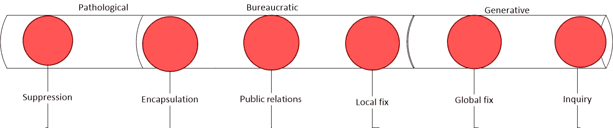
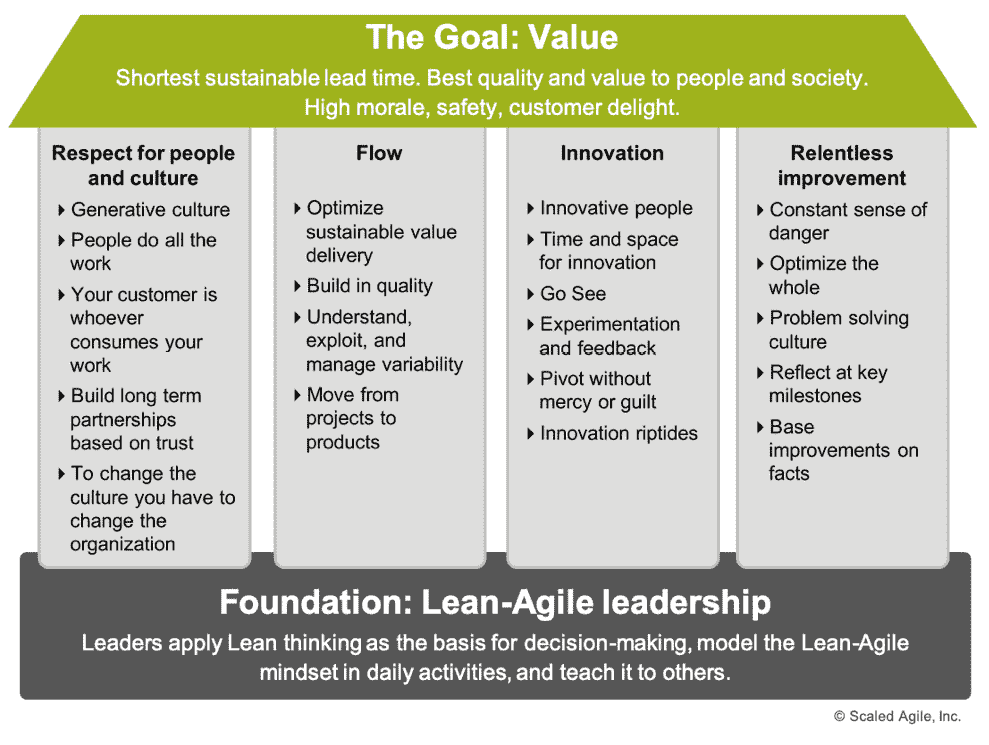
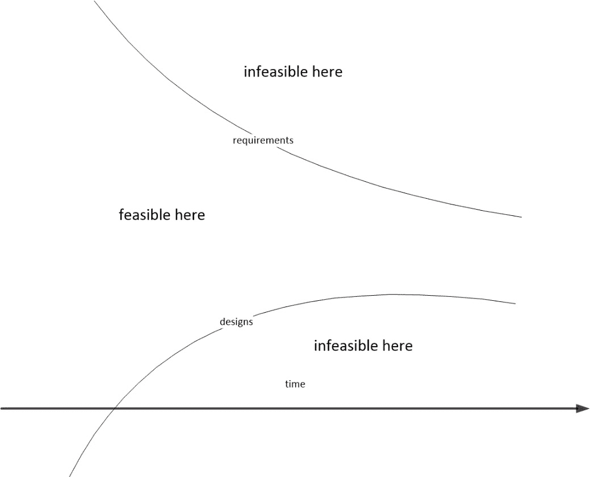
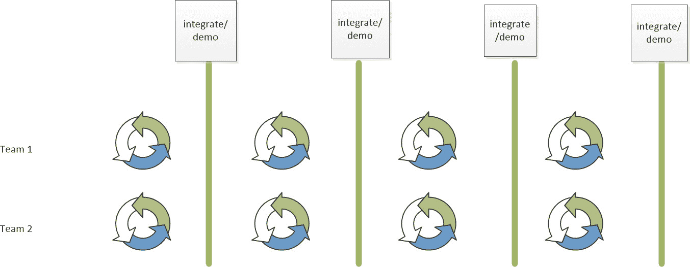
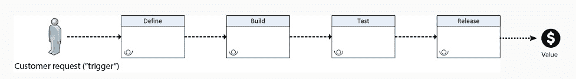
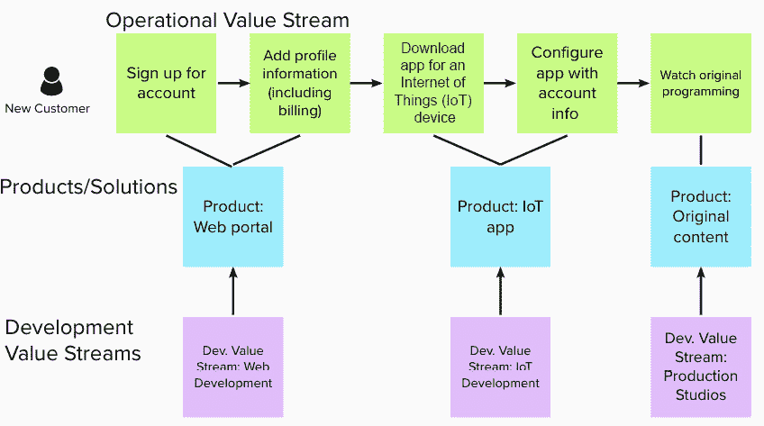

# 2

# 共同责任文化

“*文化是战略的早餐*。” 

来自管理专家彼得·德鲁克的这句话强调了文化对组织目标实现的影响。在前一章中，我们看到文化（人们，他们的行为，以及在组织中鼓励这些行为的结构）为流程和工具提供了基础。所以，如果文化如此重要，那么最好的文化是什么，我们如何在发现当前文化不足时，达到那个理想的文化？

我们发现，结构和行为将决定文化。我们将首先基于经典的组织文化模型，检查不同的文化。这一组织文化的考察将包括特点和特征，以及每种文化如何处理信息流动。然后，我们将探讨如何通过改变行为来推动向更理想文化的文化变革。

凭借对理想组织文化以及如何实施变革的了解，我们将研究 SAFe®所推广的文化结构。第一部分是识别精益思维和敏捷宣言如何在培养正确心态方面发挥作用。

在这种思维模式下，我们将仔细研究 SAFe®中的原则，它们不仅为结构提供了背景，还为实施的实践提供了背景，旨在优化精益和敏捷开发。

最后，我们将初步了解价值流：那些能够促进理想文化的结构。我们将看到，价值流是如何基于精益-敏捷思维和 SAFe 原则构建的，从而实现有效的文化变革。

简而言之，我们将涵盖以下主题：

+   组织变革文化

+   精益敏捷思维

+   SAFe 原则

+   价值流

# 组织变革文化

每个社区，从最小的团队到最大的国家，都会有一种文化——它是社区身份的象征。一个社区通过其文化来识别其规范，并表明使该社区与其他社区不同的特点。

组织有责任判断其文化是否满足组织需求，并允许其成长和繁荣。这第一步是自我检查，看看文化是否对组织有利。在这一分析后，组织可以决定采取什么措施来改变文化。

## 什么样的文化？

1988 年，Ron Westrum 在研究如何提高医疗团队的安全性时，提出了考察团队文化的想法。他研究了这些组织如何处理信息，并提出了一个包含三种文化类型的分类法。这些文化类型如下：

+   病态文化

+   官僚文化

+   创生文化

根据 Westrum 的说法，病态文化的特征是专注于个人权力和组织领导者的荣耀。信息被作为政治权力的杠杆。领导者通常以恐惧和威胁作为激励手段来实现（领导者的）目标。

在官僚文化中，组织将规则、职位和部门界限视为其主要特征。信息可以通过规定的渠道和程序进行共享，但仅限于本地边界内。

拥有生成文化的组织专注于与组织使命的一致性。信息自由流动，传递给任何能够帮助实现使命的人。

Westrum 提出了不同文化处理不同类型信息的特点的例子，以下展示了这些特点：

|  | **病态文化** | **官僚文化** | **生成文化** |
| --- | --- | --- | --- |
| 焦点 | 以权力为导向 | 以规则为导向 | 以绩效为导向 |
| 合作 | 低 | 中等 | 高 |
| 如何处理坏消息的传递者 | 被责备 | 被忽视 | 受培训 |
| 处理责任/风险 | 推卸 | 狭窄 | 共享 |
| 组织间的沟通 | 不鼓励 | 容忍 | 鼓励 |
| 失败的处理方式 | 甩锅 | 寻求公正 | 调查与学习 |
| 新信息的应用方式 | 被压制 | 由于可能导致问题而被不鼓励 | 被实施 |

表 2.1 – 组织如何根据文化处理信息

Westrum 模型的一个关键部分是处理不同文化如何应对异常或发现问题的方式。组织如何应对负面发现？Westrum 确定了六种反应方式，如下：

+   **压制**：阻止传播发现的人继续传播消息

+   **封锁**：忽视发现坏消息的人

+   **公关**：最小化发现的影响

+   **局部修复**：仅解决眼前的问题，而不调查相关问题

+   **全球修复**：无论问题发生在哪里，均予以修复

+   **调查**：彻底调查根本原因

异常反应的范围及通常产生这些反应的文化如下图所示：

图 2.1 – 各文化对异常反应的范围

根据 Westrum 的说法，生成文化中信息的自由流动促进了三件事：一致性、意识和赋权。这三个因素在设定使命和朝着目标努力时至关重要。

由于信息在生成文化中自由流动，意识很容易形成。组织的目标对所有人都透明且可见。组织内部和外部其他成员的行动被传递，以便有效地管理各项工作的依赖关系。因此，这种意识不仅仅是局部的，还展现了更广泛的视角。

这种认知带来的对齐感来自于在整个组织内传播的明确目标。这让在生成性文化中的所有人——无论层级如何——都能*认同*文化目标。

在一个生成性文化中，每个人都清楚组织的使命，并且所有成员都朝着实现组织目标的方向一致努力，每个人都被鼓励发言，跳出自身角色与责任的框架，积极参与持续的探讨与思考。

最终，西斯特鲁姆总结道，具有生成性文化、信息流动自由且信息处理高效的组织，能够实现系统的根本性、持久性改进，而不是依赖于*快速解决方案*。他指出，文化是可以变化的，组织可以从一种文化类型转变为另一种。

西斯特鲁姆（Westrum）所识别的具有生成性特点的文化，与**开发-运维**（**DevOps**）方法有着密切关系。在《加速：构建与扩展高效能技术组织》（*Accelerate: Building and Scaling High Performing Technology Organizations*）一书中，作者发现，具有生成性文化的组织在软件交付表现和组织表现方面更为出色。此外，具有生成性文化的组织还体验到更高的工作满意度。

## 我们如何改变文化？

文化遵循一个组织的结构和行为。要改变一个组织的文化，显然需要在组织的结构和组织所展示的行为规范上同时进行改变。

尽管认识到决定实践的价值观和原则很重要，但真正的行为改变只能通过应用新的实践，并允许持续重复，直到它们成为习惯。当这些习惯得到奖励并持续下去时，它们就会变成一种行为。

一种推动行为变化并推动文化变革的模型来源于约翰·科特尔（John Kotter）的《领导变革》（*Leading Change*）。在书中，科特尔提出了一种推动文化转型的八步法。接下来将详细介绍这种方法。

### 创造紧迫感

改变一种文化从来都不是一件容易的事。人们可能已经习惯了某些行为，并且不愿意采纳新的行为。通常，改变需要一个足够紧迫的理由，足以克服所有的障碍。这些紧迫的理由可能包括以下几点：

+   **燃烧的平台**：意识到当前的方法已经不起作用，必须做出改变

+   **主动领导**：具有前瞻性思维的新领导，正在推动变革以实现更好的未来

2006 年，福特汽车公司面临诸多问题，不仅由于日本和韩国进口车导致市场份额下降，还因为内部纷争。那一年，他们亏损了**美国****美元**（**USD**）170 亿美元，债务被评为*垃圾*级别。创始人亨利·福特的曾曾孙比尔·福特召集了波音公司现任**首席执行官**（**CEO**）艾伦·穆拉利，看看他能否扭转公司的局面。

穆拉利开始了他的工作。他创建了一个每周的**商业计划评审**（**BPR**），领导们会分享他们在前五个业务优先事项上的状态，标记为*绿色*、*黄色*或*红色*。所有领导都表示他们是绿色的，直到穆拉利说：“*我们今年将亏损 170 亿美元，而你们却说一切正常？我们计划今年亏损 170 亿美元吗？*”他对透明度的推动震撼了福特的领导层，促使他们采取进一步的变革措施。

### 引领一个强大的联盟

人们无法单独进行变革。他们需要找到或创建看到相同问题并愿意就解决这些问题所需变革达成一致的盟友。这些人可能已经得出相同的结论，或者愿意成为早期采纳者。

当艾伦·穆拉利开始担任福特首席执行官时，他决心不*清洗*现有的福特高管团队。他的执行团队中的一些成员是福特的长期员工，他们的想法与穆拉利试图推动的变革相契合。值得注意的加入者包括德里克·库扎克，他将成为**全球产品开发副总裁**（**VP**），以及贝尼·福勒，他将成为最终的全球质量副总裁。

### 创建一个愿景

未来的状态是什么样的？在那个未来状态中，哪些事情是重要的？这个想法不仅是理解为什么需要变革，还要明确你要变革的方向。科特尔指出，确立变革的愿景是领导层的责任。创建愿景有三个目的，如下所述：

+   **使命**：这明确了*为什么*，并为每个人提供了清晰的方向

+   **动机**：这推动人们朝着正确的方向前进

+   **对齐**：人们的行动与目标协调一致

艾伦·穆拉利详细阐述的第一个行动是他希望福特汽车公司成为怎样的公司。他最终称这个计划为*One Ford*。*One Ford*计划的目标是实现以下几个方面：

+   从根本上重组福特的制造能力，以将产能与需求相匹配

+   快速设计出满足消费者需求的新车型

+   确保计划有足够资金并确保经济可行性

+   作为一个全球统一的福特汽车公司运营，而不是当时的地区性孤岛

### 传达这个愿景

一旦你拥有了愿景，确保组织内的每个人都得到相同的信息非常重要。这个信息应该是清晰的，避免行话。使用富有表现力的图像和隐喻来激发想象力。持续的重复可以设定基调并赋予持久性。准备好接受反馈。领导者也将对在面对这一愿景时可能显得虚伪的行为负责。

福特有多个受众，艾伦·穆拉利必须向他们传达他的*One Ford*愿景。他需要广泛地向员工、福特经销商网络、供应商和股东（包括亨利·福特的后代）传达信息。穆拉利通过多种方式实现了这一目标，从演讲和新闻发布会到确保每位员工都能收到一张写有愿景要点的*One Ford*钱包卡。

### 授权他人执行愿景

一旦愿景公之于众，组织内的成员就要决定如何实现这一愿景。领导者赋予他们自主权来做出这些行为改变并采取与愿景相符的新实践。领导者还可以提供支持这些变革的措施，包括培训。领导者还应消除任何可能鼓励抗拒或阻碍变革的结构性障碍。

即便穆拉利在准备他的*One Ford*愿景时，所需的行动已经开始实施。当时美洲区总裁马克·菲尔兹执行了*前进之路*计划，该计划在穆拉利成为 CEO 后得到了加速。此计划通过关闭工厂来重新调整福特，不仅剥离了低效和无利可图的汽车模型，还重新排列了生产线。德里克·库扎克设立了一个新的设计流程——**全球产品开发系统**（**GPDS**），这使得福特能够利用全球平台创建新车模型。

### 产生短期的胜利

这些变革将结出成果。领导层必须识别并庆祝所有出现的胜利，无论它们多么微小。根据科特尔的观点，认可短期胜利有以下效果：

+   提供努力的证据

+   奖励那些对变革负责的人

+   允许策略的调整

+   压制愤世嫉俗者和反对者

+   保持领导层的支持

+   建立动力

### 巩固胜利以推动更多的变革

此时，要小心不要滑入自满。工作仍需继续进行；否则，长期的努力会停滞不前。科特尔指出，此时持续长期变革所需的标志性特征包括：

+   更多的变革，而非减少

+   引入额外的帮助

+   来自高级管理层的更多领导力

+   来自更低层级的领导力

+   消除不必要的相互依赖

当穆拉利的福特振兴计划开始实施并产生效果时，由于按揭危机引发的全球经济衰退威胁了整个汽车行业。福特继续执行其生存计划，成为唯一没有接受政府救助的美国汽车制造商。

### 将新变革根植于文化中

随着变革的到来和成功的产生，新的文化逐步建立。每一次新的认可是将变革转化为习惯，并把习惯培养为期望行为，直到它成为文化的一部分。

阿兰·穆拉利引入的变革已经深深影响了福特，即使穆拉利在 2014 年退休后，这些变革依然存在。*One Ford*的心态至今仍在福特内部回响。开发过程是一个全球统一的视角，而不是各个**业务单元**（**BUs**）的区域化视角。穆拉利引入的其中一项实践——BPR，从高层管理人员到团队逐步推广，并且仍在使用。

现在我们已经看到了改变为生成性文化的成功方式，让我们更详细地了解**敏捷发布列车**（**ART**）所展示的文化部分。

# 精益-敏捷心态

SAFe 文化中的一个重要部分是实践所试图培养的，是将精益思维与敏捷开发相结合。这种结合被称为精益-敏捷心态。

这种心态的两部分之一关注如何让组织消除浪费，专注于必要的事项。这个部分侧重于运用精益思维来实现这一点。

这种心态的第二部分关注确保增量交付的发生。为此，我们参考《敏捷软件开发宣言》来获得指导。在 SAFe 中，满足组织需求需要对敏捷宣言进行细致的审视和调整。我们将很快查看这些调整。

在这种心态下，我们需要检查在 SAFe 中哪些是最重要的。为此，我们将审视 SAFe 的核心价值观。

## SAFe 精益之屋

精益思维源于**丰田生产方式**（**TPS**），由大野耐一创立，部分受 W·爱德华兹·戴明的启发。在 TPS 中，重要的实践和优先事项像房屋一样排列，以强调作为基础和支撑的概念与实践。TPS 的目标作为屋顶：

“最佳质量-最低成本-最短交付时间-最佳安全性-高士气”

SAFe 通过类似“精益之屋”模型的范式总结了其精益思维方法。此模型如下所示：

图 2.2 – SAFe 精益之屋（©Scaled Agile, Inc. 保留所有权利）

让我们来看看这个房屋的各个部分，具体如下：

+   **屋顶（价值）**：我们试图实现的目标是价值。这个价值通过最短的交付时间和最高的质量来实现。这给客户带来愉悦，甚至可能使社会变得更好。员工从一个有着高士气和对安全关怀的环境中获益。

+   **支柱**：

    +   **尊重人员和文化**：我们期望与他人合作，在一个生成性的文化中共同工作。

    +   **流动**：我们致力于建立连续的工作流，以便不断交付价值。

    +   **创新**：我们需要时间和空间来发挥创造力，让我们的想象力飞翔，探索与解决方案相关的*假设*场景。如果没有这些时间和空间，我们的思维就会因为担忧下一个紧急情况而受限。这通常被称为*紧急事务的暴政*。

    +   **持续改进**：我们力求进步。我们明白，来自竞争的*潜在危险*不仅已经存在，而且还表现为随着新技术的到来，下一位*颠覆者*的出现。

+   **基础（领导力）**：我们无法在没有有效领导的情况下建立我们的事业，这种领导能够创造一种具有创造性的文化，使每个人都能发声，鼓励流动，设定创新的时间和场所，并寻找不断改进的机会。

我们已经了解了精益-敏捷心态中的精益方面。接下来，让我们看看另一半，看看是否需要对《敏捷宣言》做出任何调整。

## 调整《敏捷宣言》

在 *第一章*，*介绍* *SAFe®与 DevOps* 中，我们初步了解了《敏捷宣言》。考虑到宣言的原始背景最初是针对小型开发团队的，因此在团队合作的背景下，价值观和原则可能需要重新审视，并在必要时进行调整。

在审视价值声明时，我们发现其中的真理在不同的背景下并未改变。我们仍然更重视左侧的项目，而不是右侧的项目。无论是小型团队还是大型 ART，这一点始终成立。

一些原则可能需要进一步的考虑。特别是，SAFe 要求你考虑《敏捷宣言》中第 2、第 4、第 6 和第 11 条原则的适用性。

《敏捷宣言》第*2 条原则*指出：“*欢迎变化的需求，即使是在开发的后期。敏捷过程利用变化来为客户带来竞争优势*。”然而，结合硬件和软件的产品可能需要在接受开发后期的变化需求时进行平衡。可定制的软件可能允许需求变化，但需要新硬件的需求变化在部署后可能难以实现且成本高昂。

《敏捷宣言》第*4 条原则*指出：“*商业人员和开发人员必须在整个项目期间每天共同工作*。”除了与敏捷团队的其他成员合作的产品负责人角色外，SAFe 还包括来自商业方面的其他角色。**产品管理** (**PM**)与每个团队的产品负责人合作，定义 ART 的解决方案。商业负责人作为 ART 的关键利益相关者。

《敏捷宣言》第 6 条原则指出：“*将信息传递给开发团队并在团队内部传递的最有效和高效的方法是面对面的交流。*” ART 举办的许多活动，如 **项目增量**（**PI**）规划和检查与适应，最初主要是以面对面形式举行的。随着全球分布式开发的普及，以及历史性全球疫情的爆发，利用网络和视频会议的技术替代方案开始出现。随着生活逐渐恢复正常，混合型会议和协作方式可能会出现。

最后，《敏捷宣言》第 11 条原则指出：“*最好的架构、需求和设计来自自组织的团队。*” 在这里，当我们开发复杂的系统集成时，其中 ART 有 5 到 12 个团队，需要在 5 到 12 个涌现的架构与一个统一的意图架构声音之间找到平衡。这个平衡由系统架构师提供，系统架构师负责产品的架构以及指导所有团队正在处理的启用者。

确定了正确的心态后，我们现在来看看对 ART 重要的核心价值观。

## SAFe 核心价值观

SAFe 有四个重要的核心价值观，这些价值观由具备精益敏捷心态的 ART 从业人员所推动。它们列举如下：

+   **对齐**：在具有使命感的生成性文化中，所有参与者共同努力实现这个使命。具有生成性文化的 ART 将会有与其他团队对齐的团队。

+   **透明性**：生成性文化通过默认方式创造透明性。这种透明性是确保对齐并促进生成性文化的关键部分。

+   **项目执行**：生成性文化专注于使命。整个透明且对齐的 ART 将共同致力于实现 ART 的愿景，并交付正确的解决方案。

+   **内建质量**：缺陷和失败会削弱 ART 可靠交付解决方案并保持 ART 愿景的能力。为了保持 ART 正常发展，需要保持警觉的态度，检测并消除开发过程中的缺陷。

我们现在知道了 ART 需要的重要素质。让我们来研究如何根据这些原则应用这些价值观。

# SAFe 原则

SAFe 可以应用于各种行业中的不同组织。组织和行业之间的差异可能很大，这可能使得朝着生成性文化发展变得困难。我们可能需要一个指南来调整我们的实践，以便发展并保持核心价值观。

10 条 SAFe 原则是为了使实践与核心价值观保持一致。让我们看看它们如何应用于 DevOps。

## 采取经济视角

在我们的 SAFe 精益房屋中，我们关注的是价值目标，因此我们希望确保增量和一致性地获得价值增长。为此，我们需要确保我们的决策来源于经济背景。

唐纳德·赖内特森在他的书《产品开发流程的原则：第二代精益产品开发》中指出了增量价值交付所需的经济框架。SAFe 采用的主要组成部分包括以下内容：

+   **在精益预算和护栏内运作**：决策应该由最接近信息的人来做，但有关决策的边界可以在更高层次进行制定，以确保仍然应用必要的治理和监督。

+   **理解经济权衡**：由于 ART 需要做出决策，它应当意识到这些决策带来的各种考虑因素。这些因素包括开发费用、交付时间、产品成本、价值和风险。

+   **利用供应商**：常常会遇到*自建还是购买*的决策。一个组织可能会因其劳动力不足而寻求供应商，或者该供应商可能拥有专业技能，或是某个特定组件的唯一供应商。

+   **为最大收益安排工作顺序**：ARTs（敏捷发布列车）不能同时做所有事情。它们需要优先考虑那些最快带来最大价值的任务。赖内特森建议使用**延迟成本**（**CoD**），即如果组织未能在正确时间交付价值所产生的成本，而不是使用**投资回报率**（**ROI**）或高层管理人员的决策，后者通常被讽刺为**最高薪酬者的意见**（**HiPPO**）。SAFe 进一步通过将延迟成本除以任务的大小或持续时间，提出了一种称为**加权最短任务优先**（**WSJF**）的*物有所值*度量方法。

## 运用系统思维

当我们开发包括系统集成的复杂产品，例如赛博物理解决方案时，我们需要采用整体视角来看待产品。但这并不是唯一需要关注的系统。

常常被忽视的是系统本身——组织。在 1967 年，梅尔文·康威提出了一个观点，现在被称为康威定律：

“*设计系统的组织（广义定义）将会产生一个其结构是组织通讯结构副本的设计。*”

换句话说，组织如何开发产品，将在成品的架构中得到体现。

由于康威定律的适用性，为了优化最终的架构，我们需要找到一种更好的开发产品的方式。这使我们能够审视并优化我们的价值流。

## 假设变动性并保持选择性

我们希望确保在开发过程中，始终保持接受需求的精神，这一点在《敏捷宣言》的*原则 2*中有所体现。那么，问题就来了：我们如何才能保持这一原则的精神不变呢？

我们希望了解需求通常是如何变化的。通常，在开发初期，存在很多未知数。随着开发的进展，学习发生，未知数变成已知数。

学习还帮助识别哪些设计选项能够满足需求，哪些无法实现。需求、设计选项和时间的组合形成了一个*不确定性锥*，如图所示：

图 2.3 – 不确定性锥

为了应对不确定性锥形，最好保持需求的灵活性，并在早期阶段提供多个设计选项（通常称为**基于集合的设计**（**SBD**））。随着时间的推移，组织会不断学习，找出哪些需求不适用，哪些设计选项是不可行的。

## 通过快速、集成的学习周期逐步构建

增量交付最终是关于学习的。产生一个增量的价值使客户能够提供反馈，从而帮助组织沿着正确的轨道前进，交付更多价值。这种增量的学习循环还使组织能够根据环境中的新发现，找出哪些设计选项是不可行的。

每个 ART 团队都通过其开发周期进行学习。为了统一这种学习，它需要频繁地整合其工作，测试整合效果，并寻求整个系统的反馈。这种整合应该至少与其学习周期一样频繁。

## 基于对工作系统的客观评估设定里程碑

许多使用瀑布方法的组织设置了阶段门里程碑，以确保下一阶段的工作准备就绪并减少风险。要进入下一阶段，里程碑用来判断该阶段的交付物是否已准备好并完成。

阶段门里程碑无法处理风险，因为阶段门会强调尽可能多地使用单一设计方案。急于通过里程碑的做法不允许学习发生，以确保解决方案仍在不确定性锥形内。直到为时已晚，你可能才意识到某个解决方案是不可行的。

SAFe 建议设置定期的里程碑。这些里程碑基于每个增量价值和当时集成解决方案的反馈与学习。

## 可视化和限制 WIP，减少批量大小，管理队列长度

在我们使用价值流来安排开发时，我们希望确保价值流上能够顺畅流动，以确保持续交付价值。确保流动依赖于三个关键行动，如下所述：

+   可视化和限制**工作中的** **进展**/**过程**（**WIP**）

+   确保我们有小批量

+   管理我们的队列长度

我们将在*第四章*中更详细地研究这些因素，并探讨如何通过*精益流动来保持工作持续推进*。

## 应用节奏——与跨领域规划同步

我们之前识别出的 SAFe 核心价值之一是对齐。这个价值非常重要，因为我们的 ART 中有多个团队，我们希望确保每个团队的每个成员都在同步朝着 ART 的愿景努力。

为此，ART（敏捷发布火车）中的团队应用了节奏和同步。两者都是必需的，以确保开发中的固有不确定性与 ART 当前计划之间保持平衡，从而允许必要的调整。

在 ART 中的节奏意味着团队拥有相同长度的学习/开发周期。这种固定的周期长度就像是开发的*鼓点*。有了固定的周期，事情可以以常规且可预测的节奏进行。

在 ART 中的同步意味着团队在相同时间开始和结束他们的学习/开发周期。这使得整个系统的整合能够在团队之间发生。

节奏和同步的应用在以下图示中有所体现：

图 2.4 – 多团队的节奏和同步

应用节奏和同步的另一个关键部分是跨领域规划，在 ART 中，它发生在每个 PI（程序增量）的开始。在这里，所有团队与业务利益相关者、共享服务、架构师、PM 和**发布火车工程师**（**RTE**）一起，围绕 PI 的 ART 使命进行对齐。让这种规划按节奏进行，允许所有团队检查现实与原计划的偏差，并进行调整。这将变异性限制在一个学习周期内，从而减少返工和其他浪费。

## 激发知识工作者的内在动机

生成性文化欢迎组织中每个人的意见和主动性。赋能的个人共同朝着一个使命努力，从而建立这种生成性文化。那么，赋能的个人是什么样的？生成性文化对他们有益吗？

彼得·德鲁克将知识工作者定义为“*比他们的上司更了解自己所从事工作的个人*。”他们通常是最接近信息的人，能够判断一个解决方案是否能为客户创造价值。这正是我们生成性文化所需要的人才。我们如何确保他们能留下来并积极参与呢？

丹尼尔·平克在他的书《驱动力：激励我们真正动机的惊人真相》中推翻了人们的预期，他发现金钱奖励有效，但仅限于某个程度。在金钱之后，真正激励人们的是以下这些因素：

+   **自主性**：人们希望有自由去探索最佳解决方案，并自我指导他们希望做的工作

+   **精通**：人们希望提高自己的技能并建立专业知识

+   **使命**：人们希望得到确认，他们所做的工作是有意义的

通过关注我们组织中的人以及真正激励他们的因素，我们可以确保我们朝着生成性文化的方向发展。

## 去中心化决策

在优化交付时间时，组织会意识到可能导致延迟的因素。其中一个延迟源可能是问题的升级和等待决策。

通过赋能的个人组成生成性文化，大部分决策可能由团队来做出。有些具有战略性质的决策确实需要在组织的更高层级做出。SAFe 建议这些决策应当像这样被上报：

+   **不频繁**：这些决策不经常做出

+   **持久**：决策的影响将持续很长时间

+   **整合显著的规模经济**：该决策可能会影响整个组织

接下来是那些更具战术性质、团队能够做出决策的事项，而不应由领导层不断做出，因为领导层的责任是做出战略性决策。简而言之，去中心化决策就是这样的：

+   **频繁**：这些是需要经常做出的常见决策

+   **时间关键**：这些决策具有高 CoD（决策成本）

+   **需要本地信息**：这些决策所需的信息可以轻松从团队所在环境中获得

## 围绕价值组织

在经历了前九条 SAFe 原则后，我们希望设立一个结构，使得所有原则得到体现，从而促进生成性文化的形成。

我们已经看到，在交付价值时需要考虑经济因素。我们还看到，对于我们的系统，我们必须意识到那些反映我们架构的通信链接。我们希望激励我们的知识工作者，让他们能够做出必要的战术决策，以加速价值的交付。

我们希望的结构应该与开发过程相吻合，同时确保交接时延迟最小化。结构还应适应小规模学习周期，并确保价值流的持续发生。

简而言之，我们希望实现价值流而非传统的层级孤岛。在大型组织中，可能有不同的部门被组织起来，以创造稳定性。这种稳定性仍然是必要的，以应对大规模的效率。那么，如何保持这种悖论呢？

在 SAFe 中，价值流被视为一个*网络*，将所需人员聚集在一起，以便他们能够合作，以最快的方式交付价值。组织的层级结构依然存在，作为*第二操作系统*。这两种结构，模仿了约翰·科特在其著作《加速（XLR8）：为更快变化的世界建立战略敏捷性》中讨论的*双操作系统*，在组织中并列存在，各有其不同的必要性。

我们将在本书的其余部分探讨这个*网络*——价值流。我们将看到如何识别和绘制我们的价值流，如何将其转化为 ART，以及如何使用 **持续交付**（**CD**）管道来辅助价值流。让我们从仔细看看什么是价值流开始。

# 价值流

我们看到 SAFe 原则 *#10* 讲到了围绕价值进行组织。为了实现这一点，我们的组织必须建立和使用价值流，以确保我们持续为客户创造价值。那么，什么是价值流呢？

价值流的经典定义来源于精益思想，它描述了步骤、执行这些步骤的人以及每个步骤相关的时间。它随后成为优化的平台，使得组织能够减少交付周期。

SAFe 将这个经典定义应用于两个背景中。第一个背景是操作价值流，描述了客户或最终用户与组织的互动，以及在这种互动中使用的产品。第二个背景是开发价值流，描述了产品或解决方案的开发过程。

我们将首先审视经典定义，然后探讨它们如何演变为操作和开发价值流。

## 经典价值流

如果我们追溯精益思想的起源，它源于制造业，那么价值流就是在工厂中一系列的装配步骤，用来生产将离开工厂并出售给客户的产品。

将价值流应用于产品开发时，我们将起点改为对新功能的初始请求或新产品的初步构想。然后我们概述主要步骤及执行者。价值流的终点是当新功能或产品发布给客户时。一个典型的例子如下所示：

图 2.5 – 价值流

价值流是精益方法论的关键部分。James P. Womack 和 Daniel Jones 在他们的著作《精益思想》中提出了一个五步过程，涉及价值流。这个过程总结如下：

1.  与客户合作，识别价值。

1.  确定详细描述从请求到交付活动的价值流。

1.  确保在创建的价值流上实现流动。

1.  当正常流动发生时，确保客户能够通过价值流拉取所需的更改。

1.  持续改进和优化价值流。

## 操作价值流和开发价值流

前一节介绍的经典价值流无疑为从初始概念到客户发布的开发过程提供了模型。在 SAFe 中，这样的价值流被定义为开发价值流。

SAFe 还关注客户如何使用组织的产品和服务来实现价值。从客户的角度来看，这一视角被定义为运营价值流。运营价值流涉及的产品和服务是由开发价值流来开发和维护的。

让我们看看运营价值流和开发价值流是如何协同工作，以通过一个包含虚构媒体流服务的例子，为客户创造价值的。

新的客户希望在流媒体服务上查看节目。他们将通过网站门户（由门户 ART 开发）设置帐户，包括必要的账单。可能还希望通过移动界面（由移动 ART 开发）在智能电视上设置流媒体服务。最后，他们可能希望观看流媒体服务独有的原创节目（由内容 ART 开发）。

这个客户场景展示了作为一个运营价值流与交叉的开发价值流的方式：

图 2.6 – 具有开发价值流的组织价值流

价值流代表了一种关键的精益实践。采用价值流并围绕价值流组织工作，使 ART 能够培养出肯定精益敏捷心态、核心价值和 SAFe 原则的行为。随着这些行为的稳定，文化向生成性文化转变，使每个人都与使命保持一致。

# 摘要

在本章中，我们通过研究**文化、自动化、精益流、衡量和恢复**（**CALMR**）方法中的第一个也是最重要的因素：文化，开始了我们的探讨。我们研究了 Ron Westrum 的工作，该工作讨论了三种类型的组织文化：病态、官僚和生成性。通过分析每种文化的特点，我们发现真正赋能我们团队的是生成性文化。

一旦我们确定了理想的组织文化，我们就开始研究如何向这一理想文化过渡。为了帮助这一过程，我们研究了约翰·科特尔（John Kotter）提出的变革模型的八个步骤。我们还通过福特汽车公司在艾伦·穆拉利（Alan Mulally）领导下的例子，看到这些步骤是如何实际运作的。

我们识别出了推动我们在生成性文化中展现的行为的心态。这一心态的来源既来自精益思维和敏捷宣言的知识体系，也来自 SAFe 的核心价值观。我们还识别了敏捷宣言中的一些原则，这些原则在与一个由多个团队组成的规模化环境合作时可能需要特别关注。

另外，推动我们行为并提供额外视角的是 SAFe 的 10 个原则。我们看到这些原则如何在核心价值观、心态和实践之间起到指导作用。

最后，由于文化既建立在结构又建立在行为的基础上，我们深入探讨了创建生成性文化的理想结构。我们还看到了价值流如何从精益起步，SAFe 如何将经典的价值流定义发展为操作和开发价值流。

在本章中，我们了解了文化的重要性以及如何通过行为改变来实现这种文化。技术可以帮助推动这种向生成性文化的转变。在下一章中，我们将探讨形成 CALMR 自动化方面的技术，它促进了这种转变。

# 问题

通过回答以下问题来测试你对本章概念的理解。

1.  在生成性文化中，信息传递者是：

    1.  归咎。

    1.  经过培训的。

    1.  被忽视。

    1.  被庆祝。

1.  在 SAFe 精益之屋中，作为*屋顶*的是？

    1.  时间

    1.  价值

    1.  领导力

    1.  创新

1.  对于 ART 中的团队来说，要实现对齐，他们需要同时练习节奏和 _______。

    1.  流动

    1.  文化

    1.  协同

    1.  独立性

1.  识别两个 SAFe 核心价值观。

    1.  内建质量

    1.  适应

    1.  授权

    1.  流动

    1.  透明性

1.  价值流识别 _________、参与者及从最初想法到向客户交付有价值事物所需的时间。

    1.  工具

    1.  文化

    1.  步骤

    1.  产品

1.  在科特变革模型中，*生成* *短期胜利* 后会发生什么？

    1.  庆祝并认可胜利

    1.  授权他人实施愿景

    1.  巩固胜利以推动更多变革

    1.  将胜利与愿景联系起来

# 进一步阅读

如需更多信息，请参考以下资源：

+   [`www.ncbi.nlm.nih.gov/pmc/articles/PMC1765804/`](https://www.ncbi.nlm.nih.gov/pmc/articles/PMC1765804/)—Ron Westrum 发表的“*组织文化的类型学*”文章，识别三种组织文化类型、它们的特征及影响。

+   *《加速：构建和扩展高绩效技术组织》* 作者 *妮可·福斯格伦博士*、*杰兹·汉布尔* 和 *基因·金*—这本书是基于研究的方法，探讨 DevOps 原则和实践的有效性。

+   *《领导变革》* 作者 *约翰·科特尔*—这本书描述了改变组织文化的八步模型。

+   *《美国偶像：艾伦·穆拉利与拯救福特汽车公司之战》* 作者 *布莱斯·G·霍夫曼*—透视艾伦·穆拉利及其他人所推动的变革，挽救了福特汽车公司。

+   [`www.scaledagileframework.com/lean-agile-mindset/`](https://www.scaledagileframework.com/lean-agile-mindset/)—在 SAFe 中对精益敏捷思维的介绍，包括 SAFe 精益之屋和敏捷宣言。

+   *《产品开发流的原则：第二代精益产品开发》* 作者 *唐纳德·赖因特森*—这本书是 SAFe 十大原则的基础，是了解流动的有趣读物。

+   *《驱动力：激励我们的惊人真相》* 作者 *丹尼尔·平克*—揭示了是什么激励知识工作者。

+   *加速 (XLR8): 为更快变化的世界构建战略敏捷性* 由*约翰·科特尔*编著——科特尔关于通过建立“双重操作系统”来改变组织的又一力作。

+   *精益思想* 由*詹姆斯·P·沃马克和丹尼尔·琼斯*编著——通过价值流来探讨精益原则。本书的大部分内容基于对 TPS 的分析。
